# 原书第3版

# 深人理解计算机系统

兰德尔 E. 布莱恩特 ( Randal E. Bryant )

[美]

卡内基-梅隆大学

大卫 R. 奥哈拉伦 (David R. O'Hallaron)

卡内基-梅隆大学

龚奕利 贺莲 译

# Computer Systems

A Programmer's Perspective Third Edition


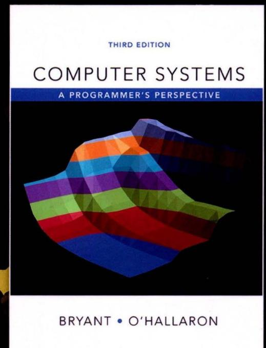


兰德尔 .布莱恩特

(Randal E. Bryant)

<sup>1981</sup> 年千麻省理工学院获得计算机博士学位, <sup>1984</sup> 年至今—直任教于卡内基-梅隆大学 现任卡 内基-挴隆大学计算机科学学院院长、教授,同时 还受邀任教于电子和计算机工程系 他从事本科生 和研究生计算机系统方面课程的教学近40 他和 O'Hallaron 教授—起在卡内基-挴隆大学开设了 15- 213课程"计算机系统导论",该课程即为本书的基 他还是ACM 院士、 IEEE 院士、美国国家工程院 院士和美国人文与科学研究院院士 其研究成果被 Intel IBM Fujitsu Microsoft 等主要计算机制造商 使用,他还因研究获得过Semiconductor Research Corporation ACM IEEE颁发的多项大奖


大卫 .奥哈拉伦 (David R. O'Hallaron)

卡内基-梅隆大学电子和计算机工程系教授 在弗吉尼亚大学获得计算机科学的博士学位, <sup>2007</sup> 年—2010 年为 Intel 匹兹堡实验室主任 他教授本科 生和研究生的计算机系统方面的课程已有20 余年, 并和 Bryant教授—起开设了"计算机系统导论"课 曾获得CMU计算机学院颁发的 Herbert Simon 出教学奖 他主要从事计算机系统领域的研究,与 Quake项目成员一起获得过高性能计算领域中的最高 国际奖项--Gordon Bell 他目前的工作重点是 研究自动分级 (autograding) 概念,即评价其他程 序质 的程序


原书第3版

# 深人理解计算机系统

兰德尔 E. 布莱恩特 (Randal E. Bryant)

[美]

卡内基-梅隆大学

大卫 R. 奥哈拉伦 (David R. O'Hallaron)

卡内基-梅隆大学

龚奕利 贺莲 译

# **Computer Systems**

A Programmer's Perspective Third Edition

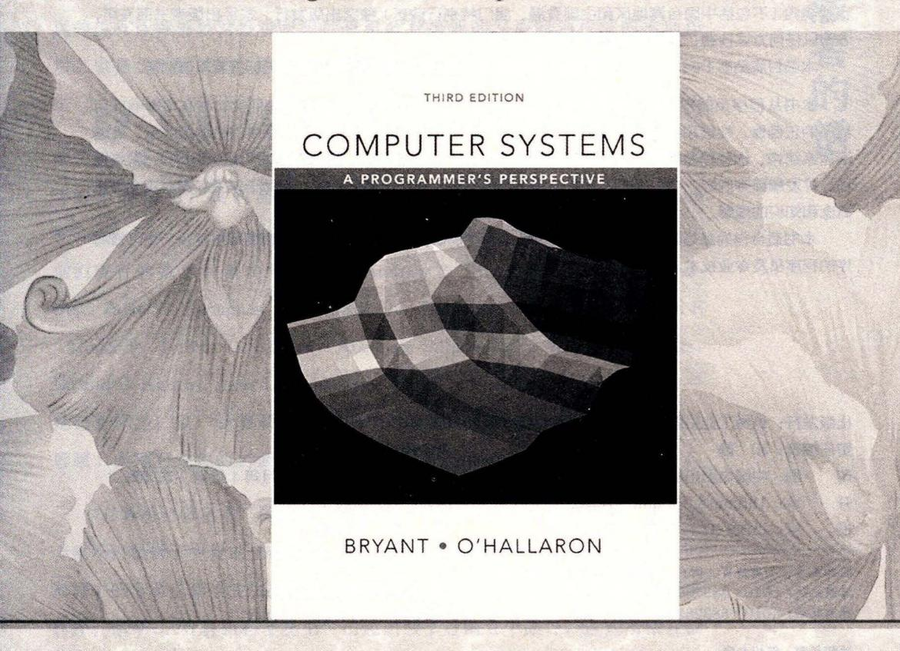


#### 图书在版编目 (CIP) 数据

深入理解计算机系统(原书第 版)/(美)兰德尔. .布莱恩特 (Randal E. Bryant) 等著; 龚奕利,贺莲译.—北京:机械工业出版社, 2016.7

(计算机科学丛书)

书名原文: Computer Systems: A Programmer's Perspective, Third Edition

ISBN 978-7-111-54493-7

I. 深… II. CD兰.. ®龚… @贺.. III. 计算机系统 IV. TP338

中国版本图书馆 CIP 数据核字 (2016) <sup>182367</sup>

#### 本书版权登记号:图字: 01-2015 -2044

Authorized translation from the English language edition, entitled Computer Systems: A Programmer's Perspective, 3E, 9780134092669 by Randal E. Bryant, David R. O'Hallaron, published by Pearson Education, Inc., Copyright© 2016, 2011, and 2003.

All rights reserved. No part of this book may be reproduced or transmitted in any form or by any means, electronic or mechanical, including photocopying, recording or by any information storage retrieval system, without permission from Pearson Education, Inc .

Chinese simplified language edition published by Pearson Education Asia Ltd., and China Machine Press Copyright© 2016.

本书中文简体字版由 Pearson Education (培生教育出版集团)授权机械工业出版社在中华人民共 和国境内(不包括中国台湾地区和中国香港、澳门特别行政区)独家出版发行。未经出版者书面许可, 不得以任何方式抄袭、复制或节录本书中的任何部分。

本书封底贴有 Pearson Education (培生教育出版集团)激光防伪标签,无标签者不得销售。

本书从程序员的视角详细阐述计算机系统的本质概念,并展示这些概念如何实实在在地影响应用 程序的正确性、性能和实用性。全书共 <sup>12</sup> 章,主要包括信息的表示和处理、程序的机器级表示、处理 器体系结构、优化程序性能、存储器层次结构、链接、异常控制流、虚拟存储器、系统级 1/0 、网络编 程、并发编程等内容。书中提供了大量的例子和练习题,并给出部分答案,有助于读者加深对正文所述 概念和知识的理解。

本书适合作为高等院校计算机及相关专业本科生、研究生的教材,也可供想要写出更快、更可靠程 序的程序员及专业技术人员参考。

出版发行:机械工业出版社(北京市西城区百万庄大街 <sup>22</sup> 号邮政编码: 100037)

责任编辑:和静 责任校对:殷虹

刷:中国电影出版社印刷厂 次: <sup>2016</sup> <sup>11</sup> 月第 版第 次印刷

开本: 185mm x 260mm 1/16 印张: 48.25 书号: ISBN 978-7-111-54493-7 定价: <sup>139</sup> .00

凡购本书,如有缺页、倒页、脱页,由本社发行部调换

客服热线: ( 010) 88378991 88361066 投稿热线: ( 010) 88379604 购书热线: ( 010) 68326294 88379649 68995259 读者信箱: hzjsj@hzbook.com

版权所有·侵权必究 封底无防伪标均为盗版

本书法律顾问:北京大成律师事务所 韩光/邹晓东

尸兴以来,源远流长的科学精神和逐步形成的学术规范,使西 国家在自然科学的各个领域取得了垄断性的优势;也正是这样 的优势,使美国在信息技术发展的六十多年间名家辈出、独领风骚 商业化的进程中,美国的产业界与教育界越来越紧密地结合,计算机学 科中的许多泰山北斗同时身处科研和教学的最前线,由此而产生的经典 科学著作,不仅擘划了研究的范畴,还揭示了学术的源变,既遵循学术 规范,又自有学者个性,其价值并不会因年月的流逝而减退

近年,在全球信息化大潮的推动下,我国的计算机产业发展迅猛, 对专业人才的需求日益迫切。这对计算机教育界和出版界都既是机遇, 也是挑战;而专业教材的建设在教育战略上显得举足轻重 在我国信息 技术发展时间较短的现状下,美国等发达国家在其计算机科学发展的几 十年间积淀和发展的经典教材仍有许多值得借鉴之处。 因此,引进一批 国外优秀计算机教材将对我国计算机教育事业的发展起到积极的推动作 用,也是与世界接轨、建设真正的世界 流大学的必由之路。

机械工业出版社华章公司较早意识到"出版要为教育服务" <sup>1998</sup> 年开始,我们就将工作重点放在了遴选、移译国外优秀教材上。经过多 年的不懈努力,我们与 Pearson, McGraw-Hill, Elsevier, MIT, John Wiley & Sons, Cengage 等世界著名出版公司建立了良好的合作关系,从 他们现有的数百种教材中甄选出 Andrew S. Tanenbaum, Bjarne Stroustrup, Brian W. Kernighan, Dennis Ritch氏, Jim Gray, Afred V. Aho, John E . Hopcroft, Jeffrey D. Ullman, Abraham Silberschatz, William Stallings, Donald E. Knuth, John L. Hennessy, Larry L. Peterson 等大师名家的一 批经典作品, 以"计算机科学丛书"为总称出版,供读者学习、研究及 珍藏。大理石纹理的封面,也正体现了这套丛书的品位和格调。

"计算机科学丛书"的出版工作得到了国内外学者的鼎力相助,国内的 专家不仅提供了中肯的选题指导,还不辞劳苦地担任了翻译和审校的工作; 而原书的作者也相当关注其作品在中国的传播,有的还专门为其书的中译本 作序。迄今,"计算机科学丛书"已经出版了近两百个品种,这些书籍在读 者中树立了良好的口碑,并被许多高校采用为正式教材和参考书籍 其影印 版"经典原版书库"作为姊妹篇也被越来越多实施双语教学的学校所采用

权威的作者、经典的教材、一流的译者、严格的审校、精细的编辑,这些因素使我们的图 书有了质量的保证。随着计 机科 学与 技术专业学科建设的不断完善和教材改 革的逐 渐深化, 教育界对国外计算机教材的需求和应用都将步入一个新的阶段,我们的目标是尽善尽美,而反 馈的意见正是我们达到这 终极目标的重要帮助。华章公司欢迎老师和读者对我们的工作提出 建议或给予指正,我们的联系方法如下:

华章网站: www. hzbook. com

电子邮件: hzjsj hzbook.co

联系电话: ( 010)88379604

联系地址:北京市西城区百万庄南街

邮政编码: <sup>100037</sup>


华章科技图书出版中心

章公司温莉芳女士邀我为即将出版的《Computer Systems: A Programmer's Perspective》第 3 版的中文译本《深入理解计算机系统》写个序,出于两方面的考虑,欣然允之。

一是源于我个人的背景和兴趣。我长期从事软件工程和系统软件领 域的研究,对计算机学科的认识可概括为两大方面: 计算系统的构建和 基于计算系统的计算技术应用。出于信息时代国家掌握关键核心技术的 重大需求以及我个人专业的本位视角,我一直对系统级技术的研发给予 更多关注,由于这种"偏爱"和研究习惯的养成,以至于自己在面对非本 专业领域问题时,也常常喜欢从"系统观"来看待问题和解决问题。我自 己也和《深入理解计算机系统》有过"亲密接触"。2012年,我还在北京大 学信息科学技术学院院长任上,学院从更好地培养适应新技术、发展具 有系统设计和系统应用能力的计算机专门人才出发,在调查若干国外高 校计算机学科本科生教学体系基础上,决定加强计算机系统能力培养, 在本科生二年级增设了一门系统级课程,即"计算机系统导论"。其时, 学校正在倡导小班课教学模式,这门课也被选为学院的第一个小班课教 学试点。为了体现学院的重视,我亲自担任了这门课的主持人,带领一 个18人组成的"豪华"教学团队负责该课程的教学工作,将学生分成14 个小班,每个小班不超过15人。同时,该课程涉及教师集体备课组合授 课、大班授课基础上的小班课教学和讨论、定期教学会议、学生自主习 题课和实验课等新教学模式的探索,其中一项非常重要的举措就是选用 了卡内基-梅隆大学 Randal E. Bryant 教授和 David R. O'Hallaron 教授编写 的《Computer Systems: A Programmer's Perspective》(第2版)作为教材。虽 然这门课程我只主持了一次,但对这本教材的印象颇深颇佳。

二是源于我和华章公司已有的良好合作和相互了解。2000年前后,我先后翻译了华章公司引进(机械工业出版社出版)的 Roger Pressman 编写的《Software Engineering: A Practitioner's Approach》一书的第 4 版和第 5 版。其后,在计算机学会软件工程专业委员会和系统软件专业委员会的诸多学术活动中也和华章公司及温莉芳女士本人有不少合作。近二十年来,华章公司的编辑们引进出版了大量计算机学科的优秀教材和学术著作,对国内高校计算机学科的教学改革起到了积极的促进作用,本书的


发展中国家科学院院士中国科学院院士

/梅宏

翻译出版仍是这项工作的延续。这是 项值得褒扬的工作,我也想借此机会代表计算机界同仁 表达对华章公司的感谢!

计算机系统类别的课程一直是计算机科学与技术专业的主要教学内容之一。由于历史原 因,我国的计算机专业的课程体系曾广泛参考 ACM IEEE 制订的计算机科学与技术专业教 学计划 (Computing Curricula) 设计,计算机系统类课程也参照该计划分为汇编语言、操作系统、 组成原理、体系结构、计算机网络等多门课程 应该说,该课程体系在历史上对我国的计算机 专业教育起了很好的引导作用。

进入新世纪以来,计算技术发生了重要的发展和变化,我国的信息技术和产业也得到了迅 猛发展,对计算机专业的毕业生提出了更高要求。重新审视原来我们参照 ACM/IEEE 计算机 专业计划的课程体系,会发现存在以下几个方面的主要问题。

- l) 课程体系中缺乏一门独立的能够贯穿整个计算机系统的基础课程。计算机系统方面的 基础知识被分成了很多门独立的课程,课程内容彼此之间缺乏关联和系统性。学生学习之后,. 虽然在计算机系统的各个部分理解了很多概念和方法,但往往会忽视各个部分之间的关联,难 以系统性地理解整个计算机系统的工作原理和方法。
- 2) 现有课程往往偏重理论,和实践关联较少。如现有的系统课程中通常会介绍函数调用 过程中的压栈和退栈方式,但较少和实践关联来理解压栈和退栈过程的主要作用。实际上,压 栈和退栈与理解 等高级语言的丁作原理息息相关,也是常用的攻击手段 Buffer Overflow 主要技术基础。
- 3) 教学内容比较传统和陈旧,基本上是早期 PC 时代的内容。比如,现在的主流台式机 CPU 都已经是 x86 <sup>64</sup> 指令集,但较多课程还在教授 <sup>80386</sup> 甚至更早的指令集。对千近年来出 现的多核 众核处理器、 SSD 硬盘等实际应用中遇到的内容更是涉及较少。
- 4) 课程大多数从设计者的角度出发,而不是从使用者的角度出发。对千大多数学生来说, 毕业之后并不会成为专业的 CPU 设计人员、操作系统开发人员等,而是会成为软件开发工程 师。对他们而言,最重要的是理解主流计算机系统的整体设计以及这些设计因素对于应用软件 开发和运行的影响。

这本教材很好地克服了上述传统课程的不足,这也是当初北大计算机学科本科生教学改革 时选择该教材的主要考量。其一,该教材系统地介绍了整个计算机系统的工作原理,可帮助学 生系统性地理解计算机如何执行程序、存储信息和通信;其二,该教材非常强调实践,全书包 个配套的实验,在这些实验中,学生需要攻破计算机系统、设计 CPU 、实现命令行解释 器、根据缓存优化程序等,在新鲜有趣的实验中理解系统原理,培养动手能力;其三,该教材 紧跟时代的发展,加入了 x86 <sup>64</sup> 指令集、 Intel Core i7 的虚拟地址结构、 SSD 磁盘、 IPv6 等新 技术内容:其四.该教材从程序员的角度看待计算机系统,重点讨论系统的不同结构对于上层 应用软件编写、执行和数据存储的影响,以培养程序员在更广阔空间应用计算机系统知识的 能力。

基于该教材的北大"计算机系统导论"课程实施已有五年,得到了学生的广泛赞 ,学生们 通过这门课程的学习建立了完整的计算机系统的知识体系和整体知识框架,养成了良好的编程 习惯并获得了编写高性能、可移植和健壮的程序的能力,奠定了后续学习操作系统、编译、计 算机体系结构等专业课程的基础。北大的教学实践表明,这是一本值得推荐采用的好教材。

该书的第 版相对于第 版进行了较大程度的修改和扩充。第 版从一开始就采用最新 x86-64 架构来贯穿各部分知识,在内存技术、网络技术上也有一系列更新,并且重组了之前的 一些比较难懂的内容。我相信,该书的出版,将有助千国内计算机系统教学的进一步改进,为 培养从事系统级创新的计算机人才奠定很好的基础。

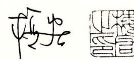

2016 10


2 °°2 月本书第 版首次印刷 。一 个月之后 我在复旦大学软件学 院开设了"计算机系统基础"课程,成为国内第一个采用这本教材授 课的老师 这本教材有四个特点 第一,涉及面广,覆盖了二进制、汇 编、组成、体系结构、操作系统、 网络与并发程序设计等计算机系统最 重要的方面。第二,具有相当的深度,本书从程序出发逐步深人到系统 领域的重要问题,而非点到为止,学完本书后读者可以很好地理解计算 机系统的工作原理。第 ,它是面向低年级学生的教材,在过去的教学 体系中这本书所涉及的很多内容只能在高年级讲授,而本书通过合理的 安排将计算机系统领域最核心的内容巧妙地展现给学生(例如,不需要掌 握逻辑设计与硬件描述语言的完整知识,就可以体验处理器设计)。第 四,本书配备了非常实用、有趣的实验 例如,模仿硬件仅用位操作完 成复杂的运算,模仿 tracker hacker 去破解密码以及攻击自身的程序, 设计处理器,实现简单但功能强大的 Shell Proxy 等。这些实验既强化 了学生对书本知识的理解,也进一步激发了学生探究计算机系统的热情。

以低年级开设"深入理解计算机系统"课程为基础,我先后在复旦大 学和上海交通大学软件学院主导了激进的教学改革。必修课时被大量压 缩,现在软件工程专业必修课由问题求解、计算机系统基础、应用开发 基础、软件工程四个模块 门课构成。其他传统的必修课如操作系统、 编译原理、数字逻辑等都成为方向课。课程体系的变化,减少了学生修 读课程的总数和总课时,因而为大幅度增加实验总最、提高实验难度和 强度、增强实验的综合性和创新性提供了有力保障。现在我的课题组的 青年教师全部是首批经历此项教学改革的学生。本科的扎实基础为他们 从事系统软件研究打下了良好基础,他们实现了亚洲学术界在操作系统 旗舰会议 SOSP 上论文发表零的突破,目前研究成果在国际上具有较大 的影响力 师资力最的补充, 条件 又为全面推进更加激进的教学改革创造了

本书的出版标志着国际上计算机教学进入了第三阶段。从历史来看, 国际上计算机教学先后经历了 个主要阶段。第一阶段是上世纪 <sup>70</sup> 年代 中期至 <sup>80</sup> 代中期 那时理论、技术还不成熟,系统不稳定, 因此教材 主要阶绕若干重要问题讲授不同流派的观点,学生解决实际问题的能力 不强。第二阶段是上世纪 <sup>80</sup> 年代中期至本世纪初, 时计算机单机系统的理论和技术已逐步 趋于成熟,主流系统稳定,因此教材主要围绕主流系统讲解理论和技术,学生的理论基础扎 实,动手能力强。第三阶段从本世纪初开始,主要背景是随着互联网的兴起,信息技术开始渗 透到人类工作和生活的方方面面。技术爆炸迫使教学者必须重构传统的以计算机单机系统为主 导的课程体系。新的体系大面积调整了核心课程的内容 核心课程承担了帮助学生构建专业知 识框架的任务,为学生在毕业后相当长时间内的专业发展奠定坚实基础。现在一般认为问题抽 象、系统抽象和数据抽象是计算机类专业毕业生的核心能力 而本书担负起了系统抽象的重 任,因此美国的很多高校都采用了该书作为计算机系统核心课程的教材。第三阶段的教材与第 二阶段的教材是互补关系。第三阶段的教材主要强调坚实而宽广的基础,第二阶段的教材主要 强调深入系统的专门知识,因此依然在本科高年级方向课和研究生专业课中占据 要地位。

上世纪 <sup>80</sup> 年代初,我国借鉴美国经验建立了自己的计算机教学体系并引进了大最教材。 <sup>21</sup> 世纪初开始,一些学校开始借鉴美国第二阶段的教学方法,采用了部分第 阶段的著名 教材,这些改革正在走向成熟并得以推广 <sup>12</sup> 年北京大学计算机专业采用本书作为教材后, 采用本教材开设"计算机系统基础"课程的高校快速增加。以此为契机,国内的计算机教学也有 望全面进入第三阶段。

本书的第 版完全按照 x86 <sup>64</sup> 系统进行改写。此外,第 版中删除了以 x87 呈现的浮点指 令,在第 版中浮点指令又以标量 AVX2 的形式得以恢复。第 版更加强调并发,增加了较大 篇幅用千讨论信号处理程序与主程序间并发时的正确性保障。总体而言,本书的 个版本在结 构上没有太大变化,不同版本的出现主要是为了在细节上能够更好地反映技术的最新变化。

当然本书的某些部分对于初学者而言还是有些难以阅读。本书涉及大量重要概念,但一些 概念首次亮相时并没有编排好顺序。例如寄存器的概念、汇编指令的顺序执行模式、 PC 的概 念等对千初学者而言非常陌生,但这些介绍仅仅出现在第 章的总览中,而当第 章介绍汇编 时完全没有进一步的展开就假设读者已经非常清楚这些概念 。事 实上这些概念原本就介绍得过 千简单,短暂亮相之后又立即退场,相隔较长时间后,当这些概念再次登场时,初学者早已忘 却了它们是什么。同样,第 章对进程、并发等概念的介绍也存在类似问题。因此,中文翻译 版将配备导读部分,希望这些导读能够帮助初学者顺利阅读。


书第 版出版于 <sup>2003</sup> 年,第 版出版于 <sup>2011</sup> 年,去年发行的已 经是原书第 版了。第 版还是采用以下组合方式 在经典的 x86 架构机器上运行 Linux 操作系统,采用 语言编程。这样的组合经受 住了时间的考验 这一版的一个明显变化就是从讲解 A32 x86-64 转变 为完全以 <sup>64</sup> 为基础,相应地修改了第 同时,还 改写了第 章,使之更易读、好懂;用近期的新技术更新了第 <sup>11</sup> <sup>12</sup> 章。这些变化使得本书既和新技术保持了同步,又保留了描述系统本 质的内容以及从程序员角度出发的特色

除了翻译本书,我们也开始以本书为教材讲授"计算机系统基础"课 程,对这本书的理解也随之越来越深入,意识到除了阅读之外,动手实 践更是 习计算机系统的必 之路 本书的官网提供了很多实验作业 (Lab Assignment) ,其中不乏有趣且有一定难度的实验,比如 Bomb Lab 有兴趣的读者除了阅读本书的内容之外,还应该试着去完成这些实验, 让纸面上的内容在实际动手中得到巩固和加强。本书的官方博客也不断 更新着有关这本书和配套课程的最新变化,这也是对本书的有益补充。

版从翻译的角度来说,我们尽 做到更流畅,更符合中文表达 的习惯。对于一些术语,比如 mory, 以前怕出错就统 翻译成存储 器,现在则尽可能地按照语境去区分,翻译成内存或者存储器。

在此,要感谢本书的编辑朱劼、姚蕾以及和静 有她们的支持、鼓 励和耐心细致的工作,才能让本书如期与读者见面。

由于本书内容多,翻译时间紧迫,尽管我们尽量做到认真仔细,但 还是难以避免出现错误和不尽如人意的地方。在此欢迎广大读者批评指 我们也会一如既往地维护勘误表,及时在网上更新,方便大家阅读。 (另外,本版第 次印刷时,我们已经根据官网 <sup>2016</sup> 日前发布的 勘误进行了修正,就不在中文勘误中再翻译了。)

> 龚奕利 贺莲 <sup>2016</sup> 月于硌珈山

书(简称 CSAPP) 的主要读者是计算机科学家、计算机工程师,以及 那些想通过学习计算机系统的内在运作而能够写出更好程序的人。

我们的目的是解释所有计算机系统的本质概念,并向你展示这些概 念是如何实实在在地影响应用程序的正确性、性能和实用性的。其他的 系统类书籍都是从构建者的角度来写的,讲述如何实现硬件或系统软件, 包括操作系统、编译器和网络接口。而本书是从程序员的角度来写的, 讲述应用程序员如何能够利用系统知识来编写出更好的程序。当然,学 习一个计算机系统应该做些什么,是学习如何构建一个计算机系统的很 好的出发点,所以,对于希望继续学习系统软硬件实现的人来说,本书 也是一本很有价值的介绍性读物。大多数系统书籍还倾向千重点关注系 统的某一个方面,比如:硬件架构、操作系统、编译器或者网络。本书 则以程序员的视角统一覆盖了上述所有方面的内容。

如果你研究和领会了这本书里的概念,你将开始成为极少数的"牛 人",这些"牛人"知道事情是如何运作的,也知道当事情出现故障时如 何修复。你写的程序将能够更好地利用操作系统和系统软件提供的功能, 对各种操作条件和运行时参数都能正确操作,运行起来更快,并能避免出 现使程序容易受到网络攻击的缺陷。同时,你也要做好更深入探究的准备, 研究像编译器、计算机体系结构、操作系统、嵌入式系统、网络互联和网络 安全这样的高级题目。

# 读者应具备的背景知识

本书的重点是执行 x86-64 机器代码的系统。对英特尔及其竞争对手而 言, x86-64 是他们自 <sup>1978</sup> 年起,以 <sup>8086</sup> 微处理器为代表,不断进化的最新 成果。按照英特尔微处理器产品线的命名规则,这类微处理器俗称为 "x86" 随着半导体技术的演进,单芯片上集成了更多的晶体管,这些处理器的计算 能力和内存容量有了很大的增长。在这个过程中,它们从处理 <sup>16</sup> 位字,发展 到引入 IA32 处理器处理 <sup>32</sup> 位字,再到最近的 x86-64 处理 <sup>64</sup> 位字。

我们考虑的是这些机器如何在 Linux 操作系统上运行 语言程序。 Linux 是众多继承自最初由贝尔实验室开发的 Unix 的操作系统中的一种。 这类操作系统的其他成员包括 Solaris FreeBSD MacOS 。近年来,

由于 Posix 和标准 Unix 规范的标准化努力,这些操作系统保持了高度兼容性。因此,本书内 容几乎直接适用于这些"类 Unix" 操作系统

文中包含大 已在 Linux 系统上编译和运行过的程序示例 我们假设你能访问 台这样的 机器,并且能够登录,做一些诸如切换目录之类的简单操作 如果你的计算机运行的是 Microsoft Windows 系统,我们建议你选择安装一个虚拟机环境(例如 Virtua!Box 或者 VMWare), 以便为一种操作系统(客户 OS) 的程序能在另 种系统(宿主 OS) 上运行。

我们还假设你对 C+ +有 定的了解 如果你以前只有 Java 经验,那么你需要付出更 多的努力来完成这种转换,不过我们也会帮助你。 Java 有相似的语法和控制语句。不过, 有一些 语言的特性(特别是指针、显式的动态内存分配和格式化 1/0) Java 中都是没有的。 所幸的是, 是一个较小的语 ,在 Brian Kernighan Dennis Ritchie 经典的 "K&R" 文献中 得到了清晰优美的描述 <sup>61</sup> 无论你的编程背景如何,都应该考虑将 K&R 作为个人系统藏书 部分。如果你只有使用解释性语言的经验,如 Python Ruby Perl, 那么在使用本书之 前,需要花费一些时间来学习

本书的前几章揭示了 程序和它们相对应的机器语言程序之间的交互作用。机器语言 示例都是用运行在 x86 <sup>64</sup> 处理器上的 GNU GCC 编译器生成的 我们不需要你以前有任何硬 件、机器语言或是汇编语言编程的经验

#### 关千 编程语言的建议

为了帮助 语言编程背 景薄 弱( 全无背景 的读者,我们在书中加入了这样一些专门的 注释来突出 中一些特别 要的特性。我们假设你 C+ +或

# 如何阅读此书

从程序员的角度学习计算机系统是如何工作的会非常有趣,主要是因为你可以主动地做这 件事情。无论何时你学到一些新的东西,都可以马上试验并且直接看到运行结果。事实上,我 们相信学习系统的唯一方法就是做 (do) 系统,即在真正的系统上解决具体的问题,或是编写和 运行程序

这个主题观念贯穿全书。当引入 个新概念时,将会有一个或多个练习题紧随其后,你应 该马上做一做来检验你的理解。这些练习题的解答在每章的末尾。当你阅读时,尝试自己来解 答每个问题,然后再查阅答案,看自己的答案是否正确 除第 章外,每章后面都有难度不同 的家庭作业。对每个家庭作业题,我们标注了难度级别:

只需要几分钟 几乎或完全不需要编程。

- .. 可能需要将近 <sup>20</sup> 分钟 通常包括编写和测试一些代码 (许多都源自我们在考试中出 的题目
  - \*\*\* 需要很大的努 力,也许 1~2 小时 。一般 包括 编写和测试大 的代码
  - :: -个实验作 业,需 要将近 <sup>10</sup> 小时

文中 段代码示例都是由 GCC 编译的 程序直接生成并在 Linux 系统上进行了测试, 没有任何人为的改动 当然,你的系统上 GCC 的版本可能不同,或者根本就是另外一种编译 器,那么可能生成不一样的机器代码,但是整体行为表现应该是 样的 所有的源程序代码都 可以从 csapp. cs. emu. edu 上的 CS:APP 主页上获取。在本书中,源程序的文件名列在两条水平线的 右边,水平线之间是格式化的代 比如,图]中的程序能在 code/ intro 目录下的 hello. 文件中找 到。当遇到这些示例程序时,我们鼓励你在自己的系统上试着运行它们

```
code/intro/hello. c 
123456
7 
    #include <stdio.h> 
    int main() 
    { 
         printf("hello, world\n"); 
         return O; 
    } 
                                                                   code/intro/hello. c
```

个典型的代码示例

为了避免本书体积过大、内容过多,我 加了许 多网络旁注 (Web id e) ,包括 些对 本书 要内容的补充资料 本书中用 AP: TOP 这样的标记形式来引用这些旁注,这里 AP 是该章主题 的缩写编码, TOP 是涉及的话题的缩写编码 如,网 络旁注 DATA BOOL 包含对第 章中数据表示里面有关布尔代数内容的补充资料;而网络旁注 ARCH LOG 包含的是用 Verilog 硬件描 述语言进行处理器设计的资料,是对第 章中 处理器设计 分的补充 所有的网络旁注都可以从 CS:APP 的主页上获取

# m 什么是旁注

在整本书中,你将会遇到很多以这种形式出现的旁注。旁注是附加说明, 能使你对当前 讨论的主题多一些了解。 旁注可以有很多用处。 一些是小的历史故事。 例如, 语言、 Linux Int rn 是从何而来的?有些旁注则是用来澄清学生们 经常感 到疑惑的问题 高速缓存的行、组和块有什么区别?还有些旁注给出了一些现实世界的例子。 例如, 例如, 一个浮 点错误怎么毁掉了法国的一枚火箭,或是给出市面上出售的一个磁盘驱动器的几何和运行参 最后, 还有一些旁注仅仅就是一些有趣的内容,例如,什么是 "hoinky"?

#### 本书概述

本书由 <sup>12</sup> 章组成,旨在阐述计算机系统的核心概念。内容概述如下

- 章:计算机系统漫符。这一章通过研究 "hello, world" 这个简单程序的生命周期, 介绍计算机系统的 主要概念 和主题
- 信息的表示和处理 我们讲述了计算机的 算术运算, 重点描述了会对程序员有 影响的尤符号数和数的补码表示的特性。我们考虑数字是如何表示的,以及由此确定对 于一个给定的字长,其可能编码值的范围 。我 们探讨有符号和无符号数 之间类型转换 的效果,还阐述算术运算的数学特性。菜鸟级程序员 经常很惊奇地 解到(用补码表示的) 两个正数的和或者积可能为负。另一方面,补码的算术运算满足很多整数运算的代数特 性,因此,编译器可以很安全地把 个常量乘法转化为一系列的移位和加法 。我 们用 语言的位级操作来说明布尔代数的原理和应用 我们从两个方面讲述了 IEEE 标准的浮点 格式 一是如何用它来表示数值,一是浮点运算的数学属性。

对计算机的算术运算有 深刻 的理解是写出可 靠程序的关键。 比如,程序员和编译器 不能用表达式 Cx y<O) 来替代 (x<y) ,因为前者可能会产生溢出。甚至也不能用表达式 y< x) 来替代,因为在补码表示中负数和正数的范围 不对称的。算术溢出是造成程 序错误和安全漏洞的 个常见根源,然而很少有书从程序员的角度来讲述计算机算术运 算的特性。

- 程序的机器级表示 。我 们教读者如何阅读由 编译器生成的 x86-64 机器代码 我们说明为不同控制结构(比如条件、循环和开关语句)生成的基本指令模式 。我 们还讲述 过程的实现,包括栈分配、寄存器使用惯例和参数传递。我们讨论不同数据结构(如结构、 联合和数组)的分配和访问方式。我们还说明实现整数和浮点数算术运算的指令。我们还 以分析程序在机器级的样子作为途径 来理解常见的代码安全漏洞(例如缓冲区溢出),以 及理解程序员、编译器和操作系统可以采取的减轻这些威胁的措施。学习本章的概念能 够帮助读者成为更好的程序员,因为你们懂得程序在机器上是如何表示的。另外 个好 处就在于读者会对指针有非常全面而具体的理解
- 处理器体系结构 。这一章讲述基本的组合和时序逻辑元素,并展示这些 元素 何在数据通路中组合到 起,来执行 x86-64 指令集的 个称为 "Y86-64" 的简化子集。 从设 单时钟周期数据通路开始。这个设计概念上非常简单 但是运行速度不会太 快。然后我们引入流水线的思想,将处理一条指令所 需要 的不同步骤实现为独 的阶段。 这个设计中,在任何时刻,每个阶段都可以处理不同的指 令。 我们的五阶段处理器流水 线更加实用。本章中处理器设计的控制逻辑是用一种称为 HCL 的简单硬件描述语言来描 述的 CL 写的硬件设计能够编译和链接到本书提供的模拟器中,还可以根据这些设计

生成 Verilog 描述,它适合合成到实际可以运行的硬件上去。

- 章:优化程序性能。在这 一章 里,我们介绍了许多提高代码性能的技术,主要思想 就是让程序员通过使编译器能够生成更有效的机器代码来学习编写 代码。我们 开始 介绍的是减少程序需要做的工作的变换,这些是在任何机器上写任何程序时都应该遵循 然后讲的是增加生成的机器代码中指令级并行度的变换,因而提高了程序在现代 "超标量"处理器上的性能 为了解释这些变换行之有效的原理,我们介绍了一个简单 的操作模型,它描述了现代乱序处理器是如何工作的,然后给出了如何根据一个程序的 图形化表示中的关键路径来测 .一个程序可能的性能 你会惊讶于对 代码做一些简单 的变换能给程序带来多大的速度提升。
- 章:存储器层次结构 对应用程序员来说,存储器系统是计算机系统中最直接可见 的部分之一。到目前为止,读者 直认同这样一个存储器系统概念模型,认为它是一个 致访问时间的线性数组。实际上,存储器系统是 个由不同容量、造价和访问时间 的存储设备组成的层次结构 我们讲述不同类型的随机存取存储器 (RAM) 和只读存储器 (ROM) ,以及磁盘和固态硬盘 向几何形状和组织构造 我们描述这些存储设备是如 何放置在层次结构中的,讲述访问局部性是如何使这种层次结构成为可能的。我们通 过一个独特的观点使这些理论具体化,那就是将存储器系统视为一个"存储器山", 山脊是时间局部性,而斜坡是空间局部性。最后,我们向读者阐述如何通过改善程序 的时间局部性和空间局部性来提高应用程序的性能
- 章:链接。本章讲述静态和动态链接,包括的概念有可重定位的和可执行的目 标文件、符号解析、重定位、静态库、共享目标库、位置无关代码,以及库打桩 大多数讲述系统的书中都不讲链接,我们要讲述它是出于以下原因。第一,程序员 遇到的最令人迷惑的间题中,有 些和链接时的小故障有关,尤其是对那些大型软 件包来说。第二,链接器生成的目标文件是与一些像加载、虚拟内存和内存映射这 样的概念相关的。
- 章:异常控制流 在本书的这个部分,我们通过介绍异常控制流(即除正常分 支和过程调用以外的控制流的变化)的一般概念,打破单一程序的模型 我们给出 存在千系统所有层次的异常控制流的例子,从底层的硬件异常和中断,到并发进程 的上下文切换,到由千接收 Linux 信号引起的控制流突 ,到 语言中破坏栈原则 的非本地跳转。

在这一章,我们介绍进程的 本概念,进程是对 个正在执行的程序的 种抽 读者会学习进程是如何 作的,以及如何在应用程序中创建和操纵进程 我们

e 译应为固态驱动器,但固态硬盘一词已 被大家接受,所以沿用。 ——译者注

会展示应用程序员如何通过 Linux 系统调用来使用多个进程。学完本章之后,读者 就能够编写带作业控制的 Linux shell 同时,这里也会向读者初步展示程序的并 发执行会引起不确定的行为。

- 虚拟内存。我们讲述虚拟内存系统是希望读者对它是如何工作的以及它的特 性有所了解。我们想让读者了解为什么不同的并发进程各自都有一个完全相同的地址 范围,能共享某些页,而又独占另外一些页。我们还讲了 些管理和操纵虚拟内存的 问题。特别地,我们讨论了存储分配操作,就像标准库的 malloc free 操作。阐述 这些内容是出于下面几个目的。它加强了这样一个概念,那就是虚拟内存空间只是一 个字节数组,程序可以把它划分成不同的存储单元。它可以帮助读者理解当程序包含 存储泄漏和非法指针引用等内存引用错误时的后果。最后 许多应用程序员编写自己 的优化了的存储分配操作来满足应用程序的需要和特性 章比其他任何 章都更 能展现将计算机系统中的硬件和软件结合起来阐述的优点。而传统的计算机体系结构 和操作系统书籍都只讲述虚拟内存的某 方面
- <sup>10</sup> 章:系统级 () 我们讲述 Unix I/0 的基本概念,例如文件和描述符。我们 描述如何共享文件, 重定向是如何工作的,还有如何访问文件的元数据。我们 还开发了一个健壮的带缓冲区的 I/0 包,可以正确处理 种称为 short counts 的奇 特行为 也就是库函数只读取一部分的输入数据。我们阐述 的标准 1/0 库,以及 它与 Linux I/0 的关系, 点谈到标准 I/0 的局限性,这些局限性使之不适合网络 编程。总的来说,本 的主题是后面两章 网络和并发编程的基础。
- <sup>11</sup> 章:网络编程。对编程而言,网络是非常有趣的 1/0 设备,它将许多我们前面 文中学习的概念(比如进程、信号、字节顺序、内存映射和动态内存分配)联系在一起 网络程序还为下 一章 的主题 并发,提供了一个很令人信服的上下文 本章只是网 络编程的一个很小的部分,使读者能够编写 个简单的 Web 服务器。我们还讲述位千 所有网络程序底层的客户端-服务器模型。我们展现了 个程序员对 Internet 的观点, 并且教读者如何用套接字接口来编写 Internet 客户端和服务器。最后,我们介绍超文 本传输协议(HTTP) ,并开发了一个简单的迭代式 Web 服务器。
- <sup>12</sup> 并发编程。这 章以 Internet 服务器设计为例介绍了并发编程。我们比较 对照了三种编写并发程序的基本机制(进程、 1/0 多路复用和线程),并且展示如何用 它们来建造并发 nternet 服务器。我们探讨了用 信号量操作来实现同步、线程 安全和可重入、竞争条件以及死锁等的基本原则 对大多数服务器应用来说,写并发 代码都是很关键的。我们还讲述了线程级编程的使用方法,用这种方法来表达应用程 序中的并行性,使得程序在多核处理器上能执行得更快 使用所有的核解决同一个计 算问题需要很小心谨慎地协调并发线程,既要保证正确性,又要争取获得高性能

#### 本版新增内容

本书的第 版千 <sup>2003</sup> 年出版,第 版在 <sup>2011</sup> 年出版。考虑到计算机技术发展如此迅速, 这本书的内容还算是保持得很好。事实证明 Intel x86 的机器上运行 Linux (以及相关操作系 统),加上采用 语言编程,是 种能够涵盖当今许多系统的组合 然而,硬件技术、编译 器和程序库接口的变化,以及很多教师教授这些内容的经验,都促使我们做了大最的修改

版以来的最大整体变化是,我们的介绍从以 IA32 x86-64 为基础,转变为完全 x86-64 为基础。这种重心的转移影响了很多章节的内容。下面列出 些明显的变化:

- 章。我们将第 章对 Amdahl 定理的讨论移到了本章
- 章。读者和评论家的反馈是一致的,本章的 些内容有点令人不知所措。因 此,我们澄清了一些知识点,用更加数学的方式来描述,使得这些内容更容易理 解。这使得读者能先略过数学细节,获得高层次的总体概念,然后回过头来进行更 细致深入的阅读。
- 章。我们将之前基千 IA32 x86-64 的表现形式转换为完全基于 x86-64, 还更 新了近期版本 GCC 产生的代码。其结果是大量的重写工作,包括修改了一些概念 提出的顺序。同时,我们还首次介绍了对处理浮点数据的程序的机器级支持 由于 历史原因,我们给出了 个网络旁注描述 IA32 机器码。
- 章。我们将之前基千 <sup>32</sup> 位架构的处理器设计修改为支持 <sup>64</sup> 位字和操作的设计
- 章。我们更新了内容以反映最近几代 x86-64 处理器的性能。通过引入更多的功 能单元和更复杂的控制逻辑,我们开发的基千程序数据流表示的程序性能模型,其 性能预测变得比之前更加可靠。
- 章。我们对内容进行了更新,以反映更多的近期技术
- 章。针对 x86-64 ,我们重写了本章,扩充了关于用 GOT PLT 创建位置无关 代码的讨论,新增了一节描述更加强大的链接技术,比如库打桩。
- 我们增加了对信号处理程序更细致的描述,包括异步信号安全的函数,编写 信号处理程序的具体指导原则,以及用 sigsuspend 等待处理程序
- 章。本章变化不大
- <sup>10</sup> 章。我们新增了一节说明文件和文件的层次结构,除此之外,本章的变化 不大。
- <sup>11</sup> 章。我们介绍了采用最新 getaddrinfo getnarneinfo 函数的、与协议无 关和线程安全的网络编程,取代过时的、不可重入的 gethostbynarne gethost byaddr 函数。

·笫 <sup>12</sup> 章。我们扩充了利用线程级并行性使得程序在多核机器上更快运行的内容。

此外,我们还增加和修改了很多练习题和家庭作业。

### 本书的起源

本书起源于 <sup>1998</sup> 年秋季,我们在卡内基-梅隆 (CMU) 大学开设的 门编号为 15-213 的介绍性课程:计算机系统导论 (Introduction to Computer System, ICS) [14] 。从那以 后,每学期都开设了 ICS 这门课程,每学期有超过 <sup>400</sup> 名学生上课,这些学生从本科二年 级到硕士研究生都有,所学专业也很广泛。这门课程是卡内基-梅隆大学计算机科学系 (CS) 以及电子和计算机工程系 (ECE) 所有本科生的必修课,也是 CS ECE 大多数高级 系统课程的先行必修课。

ICS 这门课程的宗旨是用一种不同的方式向学生介绍计算机。因为,我们的学生中几 乎没有人有机会亲自去构造一个计算机系统。另一方面,大多数学生,甚至包括所有的计 算机科学家和计算机工程师,也需要日常使用计算机和编写计算机程序。所以我们决定从 程序员的角度来讲解系统,并采用这样的原则过滤要讲述的内容:我们只讨论那些影响用 户级 语言程序的性能、正确性或实用性的主题。

比如,我们排除了诸如硬件加法器和总线设计这样的主题。虽然我们谈及了机器语 言,但是重点并不在千如何手工编写汇编语言,而是关注 语言编译器是如何将 语言的 结构翻译成机器代码的,包括编译器是如何翻译指针、循环、过程调用以及开关 (switch) 语句的。更进一步地,我们将更广泛和全盘地看待系统,包括硬件和系统软件,涵盖了包 括链接、加载、进程、信号、性能优化、虚拟内存、 I/0 以及网络与并发编程等在内的 主题。

这种做法使得我们讲授 ICS 课程的方式对学生来讲既实用、具体,还能动手操作,同 时也非常能调动学生的积极性。很快地,我们收到来自学生和教职工非常热烈而积极的反 响,我们意识到卡内基-梅隆大学以外的其他人也可以从我们的方法中获益。因此,这本 书从 ICS 课程的笔记中应运而生了,而现在我们对它做了修改,使之能够反映科学技术以 及计算机系统实现中的变化和进步。

通过本书的多个版本和多种语言译本, ICS 和许多相似课程已经成为世界范围内数百 所高校的计算机科学和计算机工程课程的一部分。

# 写给指导教师们:可以基千本书的课程

指导教师可以使用本书来讲授五种不同类型的系统课程(见图 2) 。具体每门课程则有

赖于课程大纲的要求、个人喜好、学生的背景和能力。图中的课程从左往右越来越强调以 程序员的角度来看待系统。以下是简单的描述。

- ORG: 一门以非传统风格讲述传统主题的计算机组成原理课程。传统的主题包括逻辑设计、处理器体系结构、汇编语言和存储器系统,然而这里更多地强调了对程序员的影响。例如,要反过来考虑数据表示对 C 语言程序的数据类型和操作的影响。又例如,对汇编代码的讲解是基于 C 语言编译器产生的机器代码,而不是手工编写的汇编代码。
- **ORG**+:一门特别强调硬件对应用程序性能影响的 ORG 课程。和 ORG 课程相比, 学生要更多地学习代码优化和改进 C 语言程序的内存性能。
- ICS: 基本的 ICS 课程,旨在培养一类程序员,他们能够理解硬件、操作系统和编译系统对应用程序的性能和正确性的影响。和 ORG+课程的一个显著不同是,本课程不涉及低层次的处理器体系结构。相反,程序员只同现代乱序处理器的高级模型打交道。ICS 课程非常适合安排到一个 10 周的小学期,如果期望步调更从容一些,也可以延长到一个 15 周的学期。
- ICS+: 在基本的 ICS 课程基础上,额外论述一些系统编程的问题,比如系统级 I/O、网络编程和并发编程。这是卡内基-梅隆大学的一门一学期时长的课程,会讲述本书中除了低级处理器体系结构以外的所有章。
- SP: 一门系统编程课程。和 ICS+课程相似,但是剔除了浮点和性能优化的内容, 更加强调系统编程,包括进程控制、动态链接、系统级 I/O、网络编程和并发编程。 指导教师可能会想从其他渠道对某些高级主题做些补充,比如守护进程(daemon)、 终端控制和 Unix IPC(进程间通信)。

图 2 要表达的主要信息是本书给了学生和指导教师多种选择。如果你希望学生更多地

| 章号  主题 | 主 斯     | 课程               |      |       |       |                  |  |  |  |  |
|--------|---------|------------------|------|-------|-------|------------------|--|--|--|--|
| 4- 3   | 1.23    | ORG              | ORG+ | ICS   | ICS+  | SP               |  |  |  |  |
| 1      | 系统漫游    | •                | •    | •     | •     | •                |  |  |  |  |
| 2      | 数据表示    | •                | •    | •     | •     | ⊙ <sup>(d)</sup> |  |  |  |  |
| 3      | 机器语言    |                  | •    | •     | •     | •                |  |  |  |  |
| 4      | 处理器体系结构 | •                | •    |       |       |                  |  |  |  |  |
| 5      | 代码优化    |                  | •    | •     | •     |                  |  |  |  |  |
| 6      | 存储器层次结构 | ⊙ <sup>(a)</sup> | •    | •     | •     | ⊙ (a)            |  |  |  |  |
| 7      | 链接      |                  |      | ⊙ (c) | ⊙ (c) | •                |  |  |  |  |
| 8      | 异常控制流   |                  | _    | •     | •     | •                |  |  |  |  |
| 9      | 虚拟内存    | ⊙ <sup>(b)</sup> | •    | •     | •     | •                |  |  |  |  |
| 10     | 系统级 I/O |                  |      |       | •     | •                |  |  |  |  |
| 11     | 网络编程    | - 1              |      |       | •     | •                |  |  |  |  |
| 12     | 并发编程    |                  | _    |       | •     | •                |  |  |  |  |

图 2 五类基于本书的课程

注: 符号⊙表示覆盖部分章节,其中: (a)只有硬件; (b)无动态存储分配; (c)无动态链接; (d)无浮点数。 ICS+是卡内基-梅隆的 15-213 课程。

了解低层次的处理器体系结构,那么通过 ORG ORG 十课程可以达到目的。另一方面, 如果你想将当前的计算机组成原理课程转换成 ICS 或者 ICS +课程,但是又对突然做这样 剧烈的变化感到担心,那么你可以逐步递增转向 ICS 课程。你可以从 OGR 课程开始,它 以一种非传统的方式教授传统的问题。一旦你对这些内容感到驾轻就熟了,就可以转到 ORG+ ,最终转到 ICS 。如果学生没有 语言的经验(比如他们只用 Java 编写过程序), 你可以花几周的时间在 语言上,然后再讲述 ORG 或者 ICS 课程的内容。

最后,我们认为 ORG +和 SP 课程适合安排为两期(两个小学期或者两个学期)。或者 你可以考虑按照一期 ICS 和一期 SP 的方式来教授 ICS +课程。

## 写给指导教师们:经过课堂验证的实验练习

ICS +课程在卡内基-梅隆大学得到了学生很高的评价。学生对这门课程的评价,中值 分数一般为 5.0/5.0, 平均分数一般为 4. 6/ 5. 。学生们说这门课非常有趣,令人兴奋: 主要就是因为相关的实验练习。这些实验练习可以从 CS:APP 的主页上获得。下面是本书 提供的一些实验的示例。

- ·数据实验。这个实验要求学生实现简单的逻辑和算术运算函数,但是只能使用一个 非常有限的 语言子集。比如,只能用位级操作来计算一个数字的绝对值。这个实 验可帮助学生了解 语言数据类型的位级表示,以及数据操作的位级行为。
- ·二进制炸弹实验。二进制炸弹是一个作为目标代码文件提供给学生的程序。运行 时,它提示用户输入 个不同的字符串。如果其中的任何一个不正确,炸弹就会 "爆炸",打印出一条错误消息,并且在一个打分服务器上记录事件日志。学生必须 通过对程序反汇编和逆向工程来测定应该是哪 个串,从而解除各自炸弹的雷管。 该实验能教会学生理解汇编语言,并且强制他们学习怎样使用调试器。
- ·缓冲区溢出实验。它要求学生通过利用一个缓冲区溢出漏洞,来修改一个二进制可 执行文件的运行时行为。这个实验可教会学生栈的原理,并让他们了解写那种易于 遭受缓冲区溢出攻击的代码的危险性。
- ·体系结构实验。第 章的几个家庭作业能够组合成一个实验作业,在实验中,学生 修改处理器的 HCL 描述,增加新的指令,修改分支预测策略,或者增加、删除旁 路路径和寄存器端口。修改后的处理器能够被模拟,并通过运行自动化测试检测出 大多数可能的错误。这个实验使学生能够体验处理器设计中令人激动的部分,而不 需要掌握逻辑设计和硬件描述语言的完整知识。
- ·性能实验。学生必须优化应用程序的核心函数(比如卷积积分或矩阵转置)的性能。这 个实验可非常清晰地表明高速缓存的特性,并带给学生低级程序优化的经验。

- cache 实验。这个实验类似千性能实验,学生编写一个通用高速缓存模拟器,并优 化小型矩阵转置核心函数,以最小化对模拟的高速缓存的不命中次数。我们使用 Valgrind 为矩阵转置核心函数生成真实的地址访问记录
- shell 实验。学生实现他们自己的带有作业控制的 Unix shell 程序,包括 Ctrl Ctrl+Z 按键, fg bg jobs 命令。这是学生第一次接触并发,并且让他们对 Unix 的进程控制、信号和信号处理有清晰的了解
- malloc 实验。学生实现他们自己的 malloc free rea oc (可选)版本。这个 实验可让学生们清晰地理解数据的布局和组织,并且要求他们评估时间和空间效率 的各种权衡及折中。
- ·代理实验。实现一个位于浏览器和万维网其他部分之间的并行 Web 代理。这个实 验向学生们揭示了 Web 客户端和服务器这样的主题,并且把课程中的许多概念联 系起来,比如字节排序、文件 、进程控制、信号、信号处理、内存映射、套接 字和并发。学生很高兴能够看到他们的程序在真实的 Web 浏览器和 Web 服务器之 间起到的作用。

CS:APP 的教师手册中有对实验的详细讨论,还有关千下载支待软件的说明。

## 版的致谢

很荣幸在此感谢那些帮助我们完成本书第 版的人们

.我们要感谢卡内基-梅隆大学的同事们,他们已经教授了 ICS 课程多年,并提供了富 有见解的反馈意见,给了我们极大的鼓励: Guy Blelloch Roger Dannenberg David Eckhardt Franz Franchetti Greg Ganger Seth Goldstein Khaled Harras Greg Kesden Bruce Maggs Todd Mowry Andreas Nowatzyk Frank Pfenning Markus Pueschel Anthony Rowe David Winters 在安装和配置参考 Linux 机器方面给予了我们很大的帮助。

Jason Fritts (圣路易斯大学, St. Louis University) Cindy Norris (阿帕拉契州立大 学, Appalachian State) 对第 版提供了细致周密的评论 龚奕利(武汉大学, Wuhan University) 翻译了中文版,并为其维护勘误,同时还贡献了一些错误报告。 Godmar Back (弗 吉尼亚理工大学, Virginia Tech) 向我们介绍了异步信号安全以及与协议无关的网络编程, 帮助我们显著提升了本书质量。

非常感谢目光敏锐的读者们,他们报告了第 版中的错误: Rami Ammari Paul Anagnostopoulos Lucas Bar nfanger Godmar Back Ji Bin Sharbel Bousemaan Richard Callahan Seth Chaiken Cheng Chen Libo Chen Tao Du Pascal Garcia Yili Gong

Ronald Greenberg Dorukh Guloz Dong Han Dominik Helm Ronald Jon Musta fa zdagli Gordon Kindlmann Sankar Krishnan Kanak Kshetri Junlin Lu Qiangqi ang Luo Sebastian Luy Ma Ashwin Nanjappa Gregoire Paradis Jonas Pfenning Karl Pichotta vid msey Kaustabh Roy David Selvaraj Sankar Shanmug Dominique Smulk Dag S0rb0 Mi ha Spear Yu Tanaka Steven Trica nowic Scott Wright Wright Han Xu Zhengshan Yan Firo Yang Shuang ng John Ye Tak to os hida Yan Zhu Mich ae Zink

还要感谢对实验做出 贡献 者,他们是 Godm ck (弗吉尼亚理 Vir ginia ch) Taymon al (伍斯特理工学院, Worc ster Polytechnic Institute) Aran Cl auson (西华盛顿大 st rn Washington University) Cary Gray (威顿学院, Whea ton College) Paul iduk (德州农机大学, es T exas A&M University) Len ey 考瑞大学, cqu rie University) Eddi Kohl (哈佛大学, Harvard) Hugh (伍斯特理工学院, Worces Polytechnic Institute) Rob rt Marmorstein (朗沃德大 Longwood Uni ersity Riely (德保罗大 ul University)

再次感谢 Windfall 软件公 Paul Anagnostopoulos 本书排版和先进的制作过程中 所做的精湛工作。非常感谢 ul 和他的优秀团队 Ri chard Camp (文字编辑)、 Jennifer Cl in (校对)、 Laur Mull (美 术制作)以及 Ted ux (索引制作)。 Paul 甚至找出了我 们对 缩写 BSS 的起源描述中的 个错误,这个错误从第 版起一直没有被发现!

后,我们要感谢 Pr nti ce Hall 出版社的朋友们 rci Horton 和我们的编辑 Matt Gold in 直坚定不移地 给予 我们支持和鼓励,非常感谢他们

# 版的致谢

我们深深地感谢那 帮助我们写出 CS:APP 版的人们

首先,我们要感谢在卡内基-梅隆大学教授 ICS 课程的同事们,感谢你们见解深刻的 反馈 见和鼓励: Gu Bl ll och Roger Dannenb rg David Eckhardt Greg Ganger Seth Goldstein Greg es den Bruce Maggs Todd Mowry Andreas Nowatzyk Frank Pf nning Markus Puesch

感谢报告第 版勘 光敏锐的读者们 ni Amelang Rui Baptista Quarup Barr irinhas Michael Bombyk Jorg Brauer Jordan Brough Yixin Cao James Caroll Rui Carlho oung- Kee Choi Al vi Grant Da is Chri ti Dufour Mao Fan Tim F reernan Inge Fri Max Gebh rdt ff Goldblat Thomas Gro Anita Gupta John Hampton H1

Hong Greg Israelsen Ronald Jones Haudy Kazemi Brian Kell Constantine Kousoulis Sacha Krakowiak Arun Krishnaswamy Martin Kulas Michael Li Zeyang Li Ricky Liu Mario l,a Conte Dirk Maas Devon Macey Carl Marcinik Will Marrero Simone Martins Tao Men Mark Morrissey Venkata Naidu Bhas Nalabothula Thomas Niemann Eric Peskin David Po Anne Rogers John Ross Michael Scott Se如、 Ray Sh巾、 Darren Shultz Erik Silkensen Suryanto Emil Tarazi Nawanan Theera Ampornpunt Joe Trdinich Michael Trigoboff James Troup Martin Vopatek Alan West Betsy Wolff 、飞 Wong James Woodruff Scott Wright Jackie ao Guanpeng Xu Qing Xu Caren Yang Yin Y ongsheng Wang Yuanxuan St eve Zhang Day Zhong 。特别感谢 Inge Frick, 他发现了我们加锁复制 Clock-and-copy) 例子中一个极 不明显但很深刻的错误,还要特别感谢民cky Liu, 他的校对水平真的很高。

我们 Intel 实验室的同事 Andrew Chien Limor Fix 在本书的写作过程中一直非常支 待。非常感谢 Steve Schlosser 提供了一些关千磁盘驱动器的总结描述, Casey Helfrich ael Ryan 安装并维护了新的 Core i7 机器。 Michael Kozuch Babu Pil 如和 Jason Campbell 对存储器系统性能、多核系统和能量墙问题提出了很有价值的见解。 Phil Gibbons Shimin Chen 跟我们分享了大批关于固态硬盘设计的专业知识。

我们还有机会邀请了 Wen-Mei Hwu Markus Pueschel Jiri Simsa 这样的高人给予 了一些针对具体问题的意见和高层次的建议。 James Hoe 帮助我们写了 Y86 处理器的 Verilog 描述,还完成了所有将设计合成到可运行的硬件上的工作

非常感谢审阅本书草稿的同事们: James Archibald (百翰杨大学, Brigham Young University) Richard Carver (乔治梅森大学, George Mason University) Mirela Damian (维拉诺瓦大 学, Villanova University) Peter Dinda (西北大学)、 John Fiore (坦普尔大学, Temple University) Jason Fritts (圣路易斯大学, St. Louis University) John Greiner (莱斯大学)、 Brian Harvey (加州大学伯克利分校)、 Don Heller (宾夕法利亚州立大学)、 Wei Chung Hsu (明尼苏达大 学)、 elle Hugue (马里兰大学)、 Jeremy Johnson (德雷克塞尔大学, Drexel University) Geoff Kuenning (哈维马德学院, Harvey Mudd College) Ricky Liu Sam Madden (麻省理工学 院)、 Fred Martin (马萨诸塞大学洛厄尔分校, University of Massachusetts, Lowell) Abraham Matta (波士顿大学)、 Markus Pueschel (卡内基-梅隆大学)、 Norman Ramsey (塔夫茨大学, Tufts University) Glenn Reinmann (加州大学洛杉矶分校)、 Michela Taufer (特拉华大学, University of Delaware) Craig Zilles (伊利诺伊大学香嫔分校)

Windfall 软件公司的 Paul Anagnostopoulos 出色地完成了本书的排版,并领导了制作 团队。非常感谢 Paul 和他超棒的团队: Rick Camp (文字编辑)、 Joe Snowden (排版)、 Mar yEllen N. Oliver Laur Muller (美术)和 Laux (索引制作)

最后 ,我们要感谢 Pr nti ce ll 出版社的朋 Marcia Horton 支持 我们 我们的编辑 Matt Gold in 终表现出了 流的 领导 才能 我们由衷地感谢他们的帮 励和真知灼见

#### 版的致谢

我们衷心地感谢那些 了我们中肯批评和鼓励的众 及同事 特别感谢我们 <sup>213</sup> 的学生们,他们充满 感染 力的精力和热情鞭 我们前行。 Nick Cart Vinny Furi 私地提供了他们的 ll oc 程序包。

Guy Blelloch Gr eg es Bruce Maggs dd Mowry 己教授此课多个学期,他 给了 我们鼓励并帮助 改进课程 容。 rb rby 供了 期的精神指导和 Allan Fi rth so as Gross Sat ya Ste nki te Hui Zhang 从一开始就 们开设这门课 Ga rth 的建议促使 书的工作得以开展,并且在 Allan is 导的小组的 助下 细化和修订了本书的工作 rk Stehlik ee 提供 了极大 的支持,使得这些内 成为 科生课程的一部分 Gr Kesden 针对 ICS 在操作系 统课程上的影响提供 了有 益的反 馈意 见。 Greg Gang iri Schindler 提供了一些磁盘驱 的描述说明,并回 答了 我们 千现代磁盘的疑问 Tom Striker 向我们展 了存储器山 的比 James Ho 在处 器体系 构方面提出了 很多 有用的建议和反馈

群特殊的 极大 助我们发展了这门课程的内容,他们是 Khalil Amiri Angela Demke Bro hri lohan Jason Crawford Peter Dinda Julio Lopez Bruce Lowekamp ff Pi ce Sanjay Rao Balaji rpe hkar Blake Scholl njit Ses-沁、 Gr Steffan 、兀 nk Tu Kip Walker Yingli 尤其是 Chris Coloh 建立 了愉悦的 围并持续到 天,还 明了传奇般的" 进制炸弹",这是一个对教授机器语 和调试概念非常 用的 工具。

Chris uer Al Co Dinda Sandh ya Dw rk dis John Grein Bruce J aco Ba rr Johns ll Bruce Low mp Gr Morrisett Bri Noble Bobbie Othmer Bill Pu el Scott Mark Sm th rman Greg Steffan Bob Wier 了大 时间阅读此书的 稿,并给予我们建议 特别感谢 Peter Dind (西北大 学) hn Greiner 莱茨 学) Wei Hsu (明尼苏达大学 Bruce Lowekamp (威廉 玛丽 学) Bobbi Othm 明尼 苏达大学 )、 Mich ae co tt 彻斯特大学 Bob Wier (落基 学院) 教学 中测 用版 同样特别感谢他们的 生们!

我们还要感谢 Prentice Hall 出版社的同事。感谢 Marcia Horton Eric Frank Harold Stone 不懈的支持和远见。 Harold 还帮我们提供了对 RISC CISC 处理器体系结构准 确的历史观点。 Jerry Ralya 有惊人的见识,并教会了我们很多如何写作的知识。

最后,我们衷心感谢伟大的技术作家 Brian Kernighan 以及后来的 W. Richard Stevens, 他们向我们证明了技术书籍也能写得如此优美。

谢谢你们所有的人。

Randal E. Bryant David R. O'H allaron 于匹兹堡,宾夕法尼亚州

R andal E. Bryant <sup>1973</sup> 年于密歇根大学获得学士学位,随即就读于 麻省理工学院研究生院,并在 <sup>1981</sup> 年获计算机科学博士学位。他 在加州理工学院做了三年助教,从 <sup>1984</sup> 年至今 直是卡内基-梅隆大学 的教师 这其中有五年的时间,他是计算机科学系主任,有十年的时间 是计算机科学学院院长。他现在是计算机科学学院的院长、教授。他同 时还受邀任职千电子与计算机 程系。

他教授本科生和研究生计算机系统方面的课程近 <sup>40</sup> 年。在讲授计算 机体系结构课程多年后,他开始把关注点从如何设计计算机转移到程序 员如何在更好地了解系统的情况下编写出更有效和更可靠的程序。他和 O'Hallaron 教授 起在卡内基-梅隆大学开设了 15-213 课程"计算机系统 导论",那便是此书的基础 他还教授 些有关算法、编程、计算机网 络、分布式系统和 VLSI (超大规模集成电路)设计方面的课程。

Bryant 教授的主要研究内容是设计软件工具来帮助软件和硬件设计 者验证其系统正确性。其中,包括几种类型的模拟器,以及用数学方法 来证明设计正确性的形式化验证工具。他发表了 <sup>150</sup> 多篇技术论文。包 Intel IBM Fujitsu Microsoft 在内的主要计算机制造商都使用着他 的研究成果。他还因他的研究获得过数项大奖。其中包括 Semiconductor Research Corporation 颁发的两个发明荣誉奖和一个技术成就奖, ACM 发的 Kanellakis 理论与实践奖,还有 IEEE 颁发的 W. R. G. Baker 奖、 Emmanuel Piore 奖和 Phil Kaufman 奖。他还是 ACM 院士、 IEEE 院士、 美国国家工程院院士和美国人文与科学研究院院士。

David R. O'Hallaron 卡内基 梅隆大学计算机科学和电子与计算机工 程系教授。在弗吉尼亚大学获得计算机科学博士学位, 2007~2010 年为 Intel 匹兹堡实验室主任。

<sup>20</sup> 年来,他教授本科生和研究生计算机系统方面的课程,例如计算机 体系结构、计算机系统导论、并行处理器设计和 Internet 服务。他和 Bryant 教授一起在卡内基-梅隆大学开设了作为本书基础的"计算机系统导 论"课程。 <sup>2004</sup> 年他获得了卡内基-梅隆大学计算机科学学院颁发的 Herbert Simon 杰出教学奖,这个奖项的获得者是基千学生的投票产生的。

O'Hallaron 教授从事计算机系统领域的研究,主要兴趣在于科学计算、数据密集型计算和 虚拟化方面的软件系统。其中最著名的是 Quake 项目,该项目是一群计算机科学家、土木工程 师和地滨学家为提高对强烈地裘中大地运动的预测能力而开发的。 <sup>2003</sup> 年,他同 Quake 项目 中其他成员一起获得了高性能计算领域中的最高国际奖项 Gordon Bell 奖。他目前的工作 重点是自动分级 (autograding) 概念,即评价其他程序质量的程序。

# 目录

lIIlII· ·1 11-111

出版者的话 中文版 序一 中文版序二 译者序 关千 作者

|      | 章计算机系统漫游..........<br>.......<br>..              | 1. 7. 1<br>进程..............................         | 11 |
|------|--------------------------------------------------|-----------------------------------------------------|----|
| 1.1  | <br>信息就是位十上下文<br>1                               | 线程 ..........<br>1. 7. 2<br>....... .... ........   | 12 |
| 1.2  | 程序被其<br>程序翻译成不同的                                 | 1. 7. 3<br>拟内存.................<br>......           |    |
|      | 格式. .......<br>....<br>.. .... .......<br>...... | 1.<br>7. 4<br>文件.........................<br>....   | 14 |
| 1. 3 | 了解编译系统如何<br>作是                                   | 系统之间利用网络通信<br>1. 8                                  | 14 |
|      | 大有益处的......<br>.....<br>.........<br>..          | 重要主题<br>1. 9<br><br>                                | 16 |
| 1.4  | 处理器读并解释储存在内存                                     | 9. 1<br>1.<br>Amdahl 定律.... .... ...<br>....        |    |
|      | 中的指令............<br>............<br>....         | 9. 2<br>1.<br>并发和并行............. ........           | 17 |
| 1.   | <br>系统的硬件组<br>4. 1<br>5                          | 计算机系统中抽象的<br>1. 9. 3                                |    |
|      | 运行<br>1. 4. 2<br>hello 程序...............         | 重要性...........................                      | 19 |
| 1.5  | <br>高速缓存至关重要<br>9                                | 1. l O<br>\结<br>........................ .. ....... | 20 |
| 1.6  | 存储设备形成层次结构<br>9                                  | 参考文献说明<br><br>                                      | 20 |
| 1. 7 | 操作系统管理硬件<br>10                                   | 练习题答案<br>.............................<br>...       | 20 |
|      |                                                  |                                                     |    |

#### 第—部分

#### 程序结构和执行

|         | 信息的表示和处理......  | ......           | 22 | 2. 1. 3 | 寻址和字节顺序...............           | 29 |
|---------|-----------------|------------------|----|---------|----------------------------------|----|
| 2. 1    | 信息存储            | <br>             | 24 | 2. 1. 4 | 示宇符串.....................        | 34 |
| 2. 1. 1 | 十六进<br>制表<br>示法 | ..... .. ....... | 25 | 2. 1. 5 | 示代码...................<br>..     | 34 |
| 2. 1. 2 | 数据大小. .... .... | .... ..          | 27 | 2. 1. 6 | 布尔代数简介.. ..<br>... .... ..<br>.. | 35 |

| 语言 中的位 级运算…<br>2. 1. 7<br><br>37                             | 关于格式的注解<br><br>3. 2. 3<br>117                             |    |
|--------------------------------------------------------------|-----------------------------------------------------------|----|
| 算…<br>语言 中的逻样运<br><br>2. 1. 8<br>39                          | 3. 3<br>数据格式..... ........ .. ........<br>11<br>...       |    |
| 算…<br>语言 中的移位运<br>2. 1. 9<br><br>40                          | 3.4<br>访问信息<br>11<br>............ .. ....<br>..<br>...    |    |
| 整数表示<br>·.•••••••.<br>2. 2<br>.•. 41<br>                     | <br>操作数指示符<br>3. 4. 1<br>121                              |    |
| 2. 2. 1<br>整型数据类型..................<br>42                    | <br>数据传送指令<br>3. 4. 2<br>122                              |    |
| 2. 2. 2<br>无符号数的编码...............<br>43                      | <br>数据传送示例<br>3. 4. 3<br>125                              |    |
| 2. 2 . 2. 3<br>补码编码........................<br>44            | 压入和弹出栈数据<br><br>3. 4. 4<br>127                            |    |
| 有符号数和无符号数之间的<br>2. 2. 4                                      | 算术和逻辑操作<br>3. 5<br>........ .. ........                   | 28 |
| 转换. ................<br>49<br>.......<br>.. ..               | <br>加栽有效地址<br><br>3. 5. 1<br>129                          |    |
| 语言中的有符号数与<br>2. 2. 5                                         | 一元和二元<br><br>操作<br>3. 5. 2<br>130                         |    |
| 无符号数........................<br>52                           | <br>移位操作<br>3. 5. 3<br>131                                |    |
| 2. 2. 6<br>扩展一个数宇的位表示<br>54                                  | 3. 5. 4<br>讨论...........................<br>131           |    |
| 2. 2. 7<br>截断数宇........................<br>56                | 特殊的算术操作<br><br>3. 5. 5<br>133                             |    |
| 关于有符号数与无符号数的<br>2. 2. 8                                      | 3. 6<br>控制..<br>135<br>...............<br>.. .....<br>... |    |
| 58<br>建议                                                     | 3. 6. 1<br>条件码... ..............<br>135<br>... ...        |    |
| 2. 3<br>整数运算.. ... .. ..<br>60<br>... .. .. .......<br>.. .. | <br>访问条件码<br>3. 6. 2<br>136                               |    |
| 2. 3. 1<br>无符号加法.........<br>60<br>........<br>..            | 跳转指令.<br>3. 6. 3<br>............ ...... ..                | 38 |
| 2. 3. 2<br>才卜码加法........................<br>62               | <br>跳转指令的编码<br>3. 6. 4<br>139                             |    |
| 2. 3. 3<br>才卜码的 非.......... ...... ........<br>66            | 用条件控制来实现条件分支…<br>3. 6. 5<br>141                           |    |
| 2. 3. 4<br>无符号乘法.....................<br>67                  | 用条件传送来实现条件分支…<br>3. 6. 6<br>145                           |    |
| 2. 3. 5<br>才卜码乘法........................<br>67               | 3. 6. 7<br>循环.. ............. .. .......<br>149           |    |
| 2. 3. 6<br>乘以常数........................<br>70                | <br>3. 6. 8<br>switch 语句<br>159                           |    |
| 2. 3. 7<br>除以<br>的幕..................<br>71<br>..            | 3. 7<br>164<br>过程.................................        |    |
| 关于整数运算的最后思考<br>2. 3. 8<br>74                                 | 3. 7. 1<br>运行时栈.....................<br>164               |    |
| 2.4<br>浮点数<br>75<br><br><br><br>                             | <br>转移控制<br>3. 7. 2<br>165                                |    |
| 2. 4. 1<br>进制小数..<br>76<br>.......<br>...<br>..<br>..        | 数据传送<br>3. 7. 3<br>168<br>..................<br>..        |    |
| <br>IEEE 浮点表<br><br>2. 4. 2<br>78                            | <br>栈上的局部存储<br>3. 7. 4<br><br>170                         |    |
| 2. 4. 3<br>数宇示例.. .. .......... ..........<br>79             | 3. 7. 5<br>寄存器 中的局部存储空间<br>…<br>17 2                      |    |
| 2. 4. 4<br>舍入..............................<br>83            | 3. 7. 6<br>递归过程.....................<br>174               |    |
| 2.4. 5<br>浮点运算........................<br>85                 | <br>数组分配和访问<br><br>3. 8<br>176                            |    |
| 语言 中的浮点<br>2. 4. 6<br>数. .... .. .. ...<br>86                | <br><br>基本原则<br>3. 8. 1<br>176                            |    |
| <br><br>2. 5<br>小结<br><br>87                                 | 指针运算<br>3. 8. 2<br>........<br>..<br>..<br>..<br>..       | 77 |
| 参考文献说明..<br>88<br>....<br>...........<br>.. ...<br>.. ..     | 3. 8. 3<br>嵌套的数组..................<br>178                 |    |
| 家庭作<br>业.<br>88<br>.................... ...........          | 3. 8. 4<br>定长数组.....................<br>179               |    |
| 练习题答案.<br>97<br>...<br>.. ....... .. .....<br>.... ..<br>..  | 变长数组<br>3. 8. 5<br>.................<br>...               |    |
| 程序的机器级表示                                                     | <br>异质的数据结构<br>3. 9<br>183                                |    |
| 09<br>                                                       | 3. 9. 1<br>183<br>结构...........................           |    |
| 历史观点.<br>3. 1<br>ll<br>.....<br>................. ..         | 3. 9. 2<br>联合...........................<br>186           |    |
| 3.2<br>程序编码..... ......................<br>ll                | 3. 9. 3<br>数据对齐.. ....<br>..... .. .......                | 89 |
| 3. 2. 1<br>机器级代码.. .... ..... .......<br>ll3                 | 在机器级程序中将控制与<br>3. 10                                      |    |
| ll4<br><br>代码示例<br>3. 2. 2                                   | 数据结合起来.....................<br>192                        |    |

| 3. 10. 1<br>理解指针.....................           | 192 | 流水线的通用原理<br><br>4. 4                             | 282 |
|-------------------------------------------------|-----|--------------------------------------------------|-----|
| 3. 10. 2<br>应用:使用 GDB 调试器<br>…                  | 193 | <br>计算流水线<br><br>4. 4. 1                         | 282 |
| 内存越界引用和缓冲区<br>3. 10. 3                          |     | 流水线操作的详细说明<br>4. 4. 2<br>…                       | 284 |
| 溢出...........................                   | 194 | 4.4. 3<br><br>流水线的局限性<br>                        | 284 |
| 对抗缓冲区溢出攻击<br>3. 10. 4                           | 198 | 带反馈的流水线系统<br><br>4. 4. 4                         | 287 |
| 3. 10. 5<br>支持变长栈帧...............               | 201 | 4. 5<br>64 的流水线实现<br>Y86                         | 288 |
| 浮点代码<br>3. 11<br>............. ...... ...<br>.. | 04  | SEQ+ :重新安排计算<br>4. 5. 1                          |     |
| 浮点传送和转换操作<br>3. 11. 1                           | 205 | 阶段...........................                    | 288 |
| 过程中的浮点代码<br>3. 11. 2                            | 209 | 插入流水线寄存器<br><br>4. 5. 2                          | 289 |
| 3. 11. 3<br>浮点运算操作...............               | 210 | 对信号进行重新排列和<br>4. 5. 3                            |     |
| 定义和使用浮点常数<br>3. 11. 4                           | 212 | 标号...........................                    | 292 |
| 在浮点代码中使用住级<br>3. 11. 5                          |     | 4. 5.4<br>预测下一个<br>PC ··· ··· ··· ··· ··· 293    |     |
| 操作...........................                   | 212 | 4. 5. 5<br>流水线冒险..................               | 295 |
| 3. 11. 6<br>浮点比较操作...............               | 213 | 4. 5. 6<br>异常处理.....................             | 306 |
| 对浮点代码的观察结论<br>3. 11. 7<br>…                     | 215 | PIPE 各阶段的实现<br>4. 5. 7                           | 3?8 |
| ·<br>·<br>· ·.<br>3. 12<br>;j\ 结                | 216 | 4. 5.8<br><br>流水线控制逻辑                            | 314 |
| 参考文献说明<br><br>                                  | 216 | 4. 5. 9<br>性能分析.....................             | 322 |
| <br><br>家庭作业                                    | 216 | 4. 5. 10<br>未完成的工作.............                  | 323 |
| 练习题答案                                           | 226 | 4. 6<br>;j\ 结.................................   | 325 |
|                                                 |     | 参考文献说明                                           | 326 |
| 处理器体系结构<br>                                     | 243 | <br><br>家庭作业                                     | 327 |
| Y86-64 指令集体系结构<br>4. 1                          | 245 | ·<br>331<br>练习题答案                                |     |
| 程序员可见的状态<br><br>4. 1. 1                         | 245 |                                                  |     |
| 4. 1. 2<br>Y86-64 指令..................          | 245 | 优化程<br>性能<br>.. .<br>….....                      | 34  |
| 4. 1. 3<br>指令编码.....................            | 246 | 优化编译器的能力和局限性<br>5. 1<br>…                        | 342 |
| 4. 1. 4<br>Y86-64 异常..................          | 250 | 5. 2<br>表示程序性能.....................              | 345 |
| 4. 1. 5<br>Y86-64 程序..................          | 251 | 5. 3<br>程序示例...........................          | 347 |
| 一些 Y86-64 指令的详情<br>4. 1. 6                      | 255 | 消除循环的低效率<br><br>5. 4                             | 350 |
| 4. 2<br>逻辑设计和硬件控制语言 HCL<br>…                    | 256 | 5. 5<br>减少过程调用.....................              | 353 |
| 4. 2. 1<br>逻样门........................          | 257 | 消除不必要的内存引用<br><br>5. 6                           | 354 |
| 组合电路和<br>4. 2. 2<br>HCL 布尔                      |     | 5. 7<br>理解现代处理器..................                | 357 |
| 表达式........................                     | 257 | 5. 7. 1<br>整体操作.....................             | 357 |
| 宇级的组合电路和<br>4. 2. 3<br>HCL                      |     | 功能单元的性能<br><br>5. 7. 2                           | 361 |
| <br>整数表达式                                       | 258 | 处理器操作的抽象模型<br>5. 7. 3<br>…                       | 362 |
| <br><br><br>4. 2. 4<br>集合关系                     | 261 | 5.8<br>循环展开...........................           | 366 |
| <br>存储器和时钟<br>4. 2. 5                           | 262 | 提高并行性<br>5. 9<br>.....................<br>..     | 369 |
| 4. 3<br>Y86-64 的顺序实现...............             |     | <br>多个累积变量<br><br>5. 9. 1                        | 370 |
|                                                 | 264 |                                                  |     |
| 将处理组织成阶段<br><br>4. 3. 1                         | 264 | <br>重新结合变换<br>5. 9. 2                            | 373 |
| 4. 3. 2<br>SEQ 硬件结构...............              | 272 | 优化合并代码的结果小结<br>5. 10                             | 377 |
| 4. 3. 3<br>SEQ 的时序..................            | 274 | 5. 11<br>一些限制因素.....................<br>5. 11. 1 | 378 |

| 分支预测和预测错误<br>5. 11. 2                                        |          | <br>存储器层次结构<br><br><br><br>6. 3                             | 421 |
|--------------------------------------------------------------|----------|-------------------------------------------------------------|-----|
| 处罚 ................<br>..<br>..<br>..                        | 379      | 存储器层次结构中的缓存<br>6. 3. 1<br>…                                 | 422 |
| 5. 12<br>理解内存性能..<br>.............. ....                     | 382      | 存储器层次结构概念<br>…<br>6. 3. 2                                   | 424 |
| 加栽的性能<br>5. 12. 1<br>... .... ........<br>..                 | 382      | <br><br><br>高速缓存存储器<br>6. 4                                 | 425 |
| 5. 12. 2<br>存储的性能....<br>.......<br>...                      | 383      | 通用的高速缓存存储器<br>6. 4. 1                                       |     |
| 应用:性能提高技术.<br>5. 13<br>..<br>....<br>..                      | 387      | <br>组织结构<br><br><br>                                        | 425 |
| 5. 14<br>确认和消除性能瓶颈. ..                                       | 388      | <br>. 427<br>6.4. 2<br>直接映射高速缓存                             |     |
| 程序剖析.<br>5. 14. 1<br>.. ....<br>..                           | 388      | <br><br>433<br>组相联高速缓存<br>6. 4. 3                           |     |
| 使用剖析程序来指导<br>5. 14. 2                                        |          | 434<br>全相联高速缓存<br>6. 4. 4                                   |     |
| 优化<br>..<br>..<br>..<br>..<br>..<br>..<br>....<br>..         | 390      | <br><br>. 437<br>有关写的问题<br>6. 4. 5                          |     |
| 5. 15<br>小结<br><br><br>                                      | 392      | 一个真实的高速缓存层次<br>6. 4. 6                                      |     |
| 参考文献说明<br><br><br>                                           | 393      | 结构的解剖<br><br><br><br><br>                                   | 438 |
| <br><br><br>家庭作业                                             | 393      | 6.4. 7<br>高速缓存参数的性能影响<br>…                                  | 439 |
| 练习题答案<br><br>                                                | 395      | 编写高速缓存友好的代码<br><br>6. 5                                     | 440 |
|                                                              |          | 综合:高速缓存对程序性能的<br>6. 6                                       |     |
| 章存储器层次结构…<br>                                                | 399      | 影响<br>....... ..<br>..<br>..<br>..<br>....<br>..<br>..      | 444 |
| 6. 1<br>存储技术...<br>..<br>..<br>..<br>..<br>.. ..<br>..<br>.. | 399      | <br>存储器山<br>6. 6. 1<br>                                     | 444 |
| <br>随机访问存储器<br>6. 1. 1                                       | 400      | 重新排列循环以提高空间<br>6. 6. 2                                      |     |
| 磁盘存储<br>6. 1. 2<br>....<br>...<br>.....<br>..                | 406      | 局部性......... ..... .. ..<br>.. ..                           | 447 |
| <br><br><br>固态硬盘<br>6. 1. 3                                  | 414      | 在程序中利用局部性<br><br>6. 6. 3                                    | 450 |
| <br>存储技术趋势<br><br><br>6. 1. 4                                | 415      | 6. 7<br>小结.. ....<br>.....<br>.....<br>..<br>..<br>.. ..    | 450 |
| 局部性<br>6. 2<br>........... .·                                | 418      | 参考文献说明<br>•• . • ·.• ·.•.••••• ••• ••• .•••• • 451          |     |
| 对程序数据引用的局部性<br>…<br>6. 2. 1                                  | 418      | 家庭作业<br><br><br><br><br><br><br>                            | 451 |
| 取指令的局部性<br><br>6. 2. 2                                       | 419      | 练习题答案<br><br><br><br>                                       | 459 |
| <br>局部性小结<br><br>6. 2. 3                                     | 420      |                                                             |     |
|                                                              |          |                                                             |     |
|                                                              |          |                                                             |     |
|                                                              | 第二部分     |                                                             |     |
|                                                              | 在系统上运行程序 |                                                             |     |
|                                                              |          |                                                             |     |
| 链接<br><br><br><br><br>                                       | 464      | 重定位.<br>7. 7<br>....<br>.. .. ....<br>..<br>..<br>..<br>... | 478 |
| <br><br>编译器驱动程序<br><br><br><br>7. 1                          | 465      | <br><br><br>重定位条目<br>7. 7. 1                                | 479 |
| 静态链接..<br>7. 2<br>..... ..<br>... .. ...<br>.. ..            | 466      | 重定位符号引用<br><br><br>7. 7. 2                                  | 479 |
| 目标文件.<br>7. 3<br>.....<br>..<br>..<br>.. ..<br>..<br>.. ..   | 466      | <br>7.8<br>可执行目标文件                                          | 483 |
| <br>重定位<br>目标文件<br><br>7. 4                                  | 467      | <br>加载可执行目标文件<br><br>7. 9                                   | 484 |
| 符号和符号表<br>7. 5<br>..........<br>..<br>..                     | 468      | 动态链接共享库<br>7. 10<br>........<br>...<br>..                   | 485 |
| 符号解析<br>7. 6<br>.....<br>.. .. ........<br>..<br>..          | 470      | 用程序中加载和链接<br>7. 11                                          |     |
| 链接器如何解析多重定义<br>7. 6. 1                                       |          | 共享库<br>.....<br>...<br>..<br>..<br>..<br>..<br>...          | 487 |
| <br>的全局符<br><br><br><br>                                     | 471      | 位置无关代码<br>7. 12<br>.....<br>..... ..<br>... .. ..           | 489 |
| <br>与静态库链接<br><br>7. 6. 2                                    | 475      | 打桩机制.<br>7. 13<br>.....<br>.. .. ...<br>..<br>..            | 492 |
| 7. 6.3<br>链接器如何使用静态库来                                        |          | 编译时打桩<br>7. 13. 1<br>...<br>.. ..<br>.. .. ...              | 492 |

7. 13. 2 链接时打桩.... .. .. .. .. .. .. <sup>492</sup>

解析弓 ..................... 477

| 7. 13. 3<br>运行时打桩..................                       | 练习题答案<br>494<br>                                       | 556 |
|-----------------------------------------------------------|--------------------------------------------------------|-----|
| 处理目标文件的工具<br>7. 14                                        | 496<br>章虚拟内存..<br>............. ............           | 559 |
| 7. 15<br>小结                                               | 496<br>物理和虚拟寻址<br><br>9. 1                             | 560 |
| 参考文献说明<br>                                                | 497<br>9. 2<br>地址空间...........................         | 560 |
| <br><br>家庭作业<br>                                          | 497<br>虚拟内存作为缓存的工具<br>                                 |     |
| 练习题答案<br><br>                                             | 9. 3<br>499                                            | 561 |
| 章异常控制流..........                                          | 9. 3.1<br>DRAM 缓存的组织结构<br><br>9. 3. 2                  | 562 |
| .. ...........                                            | 50<br>页表...........................<br>9. 3. 3         | 562 |
| 8. 1<br>异常<br>.. ....<br>....... .........<br>..<br>.. .. | 页命中.......... ..<br>..........<br>502<br>9. 3. 4<br>缺页 | 563 |
| 8. 1. 1<br>异常处理....... ..<br>.. .......                   | ................. ... .. .....<br>503<br>9. 3. 5       | 564 |
| <br>异常的类别<br>8. 1. 2                                      | 分配页面............... ..<br>504<br>...                   | 565 |
| 8. 1. 3<br>系统中的<br>Linux/x86-64                           | 又是局部性救了我们<br><br>9. 3. 6                               | 565 |
| 异常...........................                             | 虚拟内存作为<br>内存管理的<br>9. 4<br>505                         |     |
| 8. 2<br>进程.................................               | 工具.. ................ .. ............<br>508           | 565 |
| <br>逻辑控制流<br><br>8. 2. 1                                  | 虚拟内存作为<br>内存保护的<br>9. 5<br>508                         |     |
| 8. 2. 2<br>并发流........................                    | 工具<br>.........................<br>.......<br>509      | 567 |
| 私有地址空间<br><br>8. 2. 3<br>                                 | 9. 6<br>地址翻译...........................<br>509         | 567 |
| 8. 2.4<br>用户模式和内核模式<br>                                   | 结合高速缓存和虚拟<br>9. 6. 1<br>510                            |     |
| <br>上下文切换<br>8. 2. 5                                      | <br><br>内存<br>511                                      | 570 |
| 系统调用错误处理<br><br>8. 3                                      | 9. 6. 2<br>利用 TLB 加速地址翻译<br>512                        | 570 |
| 8.4<br>进程控制...........................                    | 多级页表<br>9. 6. 3<br>......... .. .....<br>....<br>513   | 571 |
| 获取进程<br>8. 4. 1<br>ID                                     | 综合:端到端的地址翻译<br><br>9. 6. 4<br>513                      | 573 |
| 513<br>创建和终止进程<br>8. 4. 2                                 | Core i7 /Linux<br>9. 7<br>案例研究:<br>Inte                |     |
| <br>回收子进程<br><br>8. 4. 3                                  | 内存系统...........................<br>516                 | 576 |
| 8. 4. 4<br>让进程休眠............<br>....                      | 9. 7. 1<br>Core i7 地址翻译............<br>521             | 576 |
| · · 52                                                    | Linux 虚拟内存系统<br>9. 7. 2<br>1                           | 580 |
| 加载并运行程序<br>8. 4. 5                                        | 9.8<br>内存映射...........................                 | 582 |
| 8. 4. 6<br>execve 运行<br>利用<br>fork                        | <br>再看共享对象<br><br>9. 8. 1                              | 583 |
| 程序..............<br>............<br>信号                    | 524<br>再看<br>9. 8. 2<br>fork 函数...............         | 584 |
| 8. 5<br>............... ...... ............               | 526<br>再看 execve 函数<br>9. 8. 3                         | 584 |
| 8. 5. 1<br>信号术语                                           | 527<br>9. 8. 4<br>mrnap 函数的用户级<br>使用                   |     |
| 发送信号..... .... ............<br>8. 5. 2                    | <br><br><br>内存映射<br><br>528                            | 585 |
| 8. 5. 3<br>接收信号.....................                      | 9. 9<br>531<br>动态内存分配.....................             | 587 |
| 8. 5. 4<br>阻塞和解除阻塞信号                                      | 532<br><br>9. 9. 1<br>free 函数<br>malloc                | 587 |
| 533<br>编写信号处理程序<br>8. 5. 5                                | 9.9. 2<br>为什么要使用动态内存                                   |     |
| 同步流以避免讨厌的并发<br>8. 5. 6                                    | 分配...........................                          | 589 |
| 错误.............. .. ...........                           | 分配器的要求和<br><br>9. 9. 3<br>目标<br>540                    | 590 |
| 显式地等待信号<br><br>8. 5. 7                                    | 9. 9. 4<br>543<br>碎片...........................        | 591 |
| 8.6<br>非本地跳转........<br>... ... .........                 | 9. 9. 5<br>546<br>实现问题.....................            | 592 |
| 工具…<br>操作进程<br>8. 7<br>                                   | <br>9. 9. 6<br>隐式空闲<br>链表<br>550                       | 592 |
| 8.8<br>小结............................<br>....             | 放置已分配的块<br><br>9. 9. 7<br>550                          | 593 |
| 参考文献说明<br>                                                | 分割空闲块<br><br><br>550<br>9. 9. 8                        | 594 |
| <br>家庭作业<br><br><br>                                      | 550<br>获取额外的堆内存<br><br>9. 9. 9                         | 594 |

| 9. 9. 10<br>合并空闲块..................                  | 594       | 9. 11. 2          | 读未初始化的<br>内存...                         | 609        |
|------------------------------------------------------|-----------|-------------------|-----------------------------------------|------------|
| 带边界标记的合并<br>9. 9. 11                                 | 595       | 9. 11. 3          | 出<br>栈缓冲区溢                              | 61         |
| 综合:实现<br>一个简单的<br>9. 9. 12                           |           | 9. 11. 4          | 假设指针和它<br>们指向的                          |            |
| 分配器........................                          | 597       |                   | 对象是相同大小的...                             | 610        |
| 9. 9. 13<br>显式空闲链表...............                    | 603       | 9. 11. 5          | 造成错位错误<br>..............                | 11         |
| 9. 9. 14<br>分离的空闲链表                                  | 604       | 9. 11. 6          | 引用指针,而不是它所                              |            |
| 9. 10<br>垃圾收集. ............. ..<br>....... ...       | 605       |                   | 指向的对象<br>..................             | 611        |
| 垃圾收集器的基本知识<br>9. 10. 1<br>…                          | 606       | 9. 11. 7          | 误解指针运算...............                   | 611        |
| &. Sweep 垃圾<br>9. 10. 2<br>Mar                       |           | 9. 11. 8          | 的变量<br>引用 不存在                           | 612        |
| 收集器........................                          | 607       | 9. 11. 9          | 引用空闲堆块中的数据<br>…                         | 612        |
| 程序的保守<br>9. 10. 3<br>Mark                            |           | 9. 11. 10         | <br>引起内存泄漏                              | 613        |
| Sweep ··· ··· ··· ··· ··· ··· ··· ··                 | · 608     | 9. 12             | 小结                                      | 613        |
| 程序中常<br>见的与内<br>存有关的<br>9. 11                        |           |                   | 参考文献说明                                  | 613        |
| 错误<br>                                               | 609       | 家庭作业              | <br>                                    | 61 4       |
| 9. 11. 1<br>间接引用坏指针............                      | 09        |                   | 练习题答案                                   | 617        |
|                                                      |           |                   |                                         |            |
|                                                      |           |                   |                                         |            |
|                                                      | 第三部分      |                   |                                         |            |
|                                                      | 程序间的交互和通信 |                   |                                         |            |
|                                                      |           |                   |                                         |            |
| 10 章系统级<br>/0<br><br><br>                            | 622       |                   | 11 章网络编程......<br>........ .. .. .. ... | 64 2       |
| <br>622<br>10. 1<br>Unix I/<br>0                     |           | 11. 1             | 客户端-服务器编程模型<br>                         | 642        |
| 10. 2<br>文件<br>                                      | 623       | 11. 2             | 网络                                      | 643        |
| 10. 3<br>打开和关闭文件.........                            | 624       | 11. 3<br>全球       | <br><br>IP 因特网                          | 646        |
| ........<br>读和写文件                                    | 625       | 11. 3. 1          | IP 地址<br>                               | 647        |
| 10. 4<br>......<br>........ .... .....               |           | 11. 3. 2          | 因特网域名..................                 | 64         |
| 10.5<br>RIO 包健壮地读写                                   | 626       | 11. 3. 3          | 因特网连接..................                 | 651        |
| RIO 的无缓冲的输入<br>10. 5. 1<br>俞出                        |           | 11. 4             | 套接字接口. .......................          | 652        |
| 函数...................... .. ...                      | 627       |                   |                                         |            |
| RIO 的带缓冲的轮入<br>10. 5. 2                              |           |                   |                                         |            |
| 函数.................... ..<br>.. ..                   |           | 11. 4. 1          | 套接宇地址结<br>构...                          | 53         |
| 读取文件元数据<br>10.6<br>..................                | 627       | 11.4. 2           | <br>socket 函数<br>...............        | 654<br>654 |
| 10. 7<br>读取目录内容.. .......<br>........<br>..          | 632       | 11. 4. 3          | connect 函数                              |            |
|                                                      | 633       | 11.4.4            | <br>bind 函数                             | 654        |
| 10. 8<br>共享文件. .....<br>..........<br>..<br>..<br>.. | 634       | 11 . 4. 5         | <br>listen 函数                           | 655        |
| 10. 9<br>I/0 重定<br>向... ..<br>........... .. ....    | 637       | 11. 4. 6          | <br>accept 函数                           | 655        |
| <br>标准<br>··· ··<br>·<br>10. 10                      | 638       | 11. 4. 7          | 主机和服务的转换                                | 656        |
| I/0                                                  |           | 11. 4. 8          | 套接宇接<br>口的辅助函数<br>…                     | 660        |
| 综合<br>:我该使用哪<br>10. 11<br><br>函数?                    | 638       | 11. 4. 9          | echo 客户端<br>和服务器的                       | 62         |
| 10. 12<br>小结..............................           | 640       |                   | 示例 ... .................... ...         |            |
| 参考文献说明<br>........................ ....              | 640       | 11. 5<br>11. 5. 1 | Web 服务器<br>Web 基础.....................  | 665<br>665 |

11. 5. 2 内容..................... <sup>666</sup> 11. 5. 3 TTP 事务.. ............... <sup>667</sup>

家庭作业 ........................ ... .. .... 640 练习题答案.. .. ............ .. ............. 641

#### XXXIV

| 11. 5. 4<br>服务动态内容...............                | 669 | 12. 4. 1<br>线程内存模型...............                      | 696 |
|--------------------------------------------------|-----|--------------------------------------------------------|-----|
| TINY Web 服务器<br>11. 6<br>综合:                     | 671 | 将变量映射到内存<br>12. 4.2                                    | 697 |
| 11. 7<br>小结                                      | 678 | 12. 4. 3<br>共享变量.....................                  | 698 |
| 参考文献说明                                           | 678 | 用信号量同步线程<br>12. 5                                      | 698 |
| <br>家庭作业                                         | 678 | 12. 5. 1<br>进度图........................                | 701 |
| 练习题答案                                            | 679 | 12. 5. 2<br>信号量........................                | 702 |
|                                                  |     | 使用信号量来实现互斥<br>…<br>12. 5. 3                            | 703 |
| 12 章并发编程..<br>.....<br>....<br>....<br>...<br>.. | 68  | 12. 5.4<br>利用信号量来调度共享                                  |     |
| 12. 1<br>基于进程的并发编程...                            | 682 | 资源...........................                          | 704 |
| 基于进程的并发服务器<br>…<br>12. 1. 1                      | 683 | 综合:基于预线程化的<br>12. 5. 5                                 |     |
| 12. 1. 2<br>进程的优劣..................              | 684 | 并发服务器..................                                | 708 |
| 12.2<br>1/0 多路复用的并发<br>基于                        |     | 使用线程提高并行性...<br>12. 6                                  | 710 |
| 编程                                               | 684 | 12. 7<br>其他并发问题.....................                   | 716 |
| 基于 I/0 多路复用的并发<br>12. 2. 1                       |     | 12. 7. 1<br>线程安全.....................                  | 716 |
| 事件驱动服务器                                          | 686 | 12. 7. 2<br>可重入性.....................                  | 717 |
| 12. 2. 2<br>…<br>1/0 多路复用技术的优劣                   | 690 | 在线程化的程序中使用<br>12. 7. 3                                 |     |
| 基千线程的并发编程<br>12. 3                               | 691 | 已存在的库函数                                                | 718 |
| 12. 3. 1<br>线程执行模型...............                | 691 | 12. 7. 4<br>竞争...........................              | 719 |
| <br>12. 3. 2<br>Posix 线程                         | 691 | 12. 7. 5<br>死锁...........................              | 721 |
| 12. 3. 3<br>创建线程.....................            | 692 | 12. 8<br>小结                                            | 722 |
| 12. 3. 4<br>终止线程.....................            | 693 | 参考文献说明                                                 | 723 |
| 回收己终止线程的资源<br>12. 3. 5<br>…                      | 693 | <br>家庭作业                                               | 723 |
| 12. 3. 6<br>分离线程.....................            | 694 | 练习题答案                                                  | 726 |
| 12. 3. 7<br>初始化线程..................              | 694 |                                                        |     |
| 基于线程的并发<br>12. 3. 8                              |     | 附录<br>错误处理<br>....<br>........<br>...<br>...<br>.. ... | 729 |
| 服务器........................                      | 694 | <br>参考文献<br>                                           | 733 |
| 多线程程序中的共享变歉<br>12. 4                             | 696 |                                                        |     |
|                                                  |     |                                                        |     |

# CH APTER 1

# 计算机系统漫游

计算机系统是由硬件和系统软件组成的,它们共同工作来运行应用程序。虽然系统的 具体实现方式随着时间不断变化,但是系统内在的概念却没有改变。所有计算机系统都有 相似的硬件和软件组件,它们又执行着相 似的功能 。一 些程序员希望深人了解这些组件是 如何工作的以及这些组件是如何 响程序的正确性和性能的,以此来提高自身的技能。本 书便是为这些读者而写的

现在就要开始一次有趣的漫游历程 如果你全力投身学习本书中的概念,完全理解底 层计算机系统以及它对应用程序的影响,那么你会步上成为为数不多的"大牛"的道路。

你将会学习一些实践技巧,比如如何避免由计算机表示数 的方式引起的奇怪的数字 错误。你将学会怎样通过一些小窍门来优化自己的 代码,以充分利用现代处理器和存储 器系统的设计。你将了解编译器是如何 现过程调用的,以及如何利用这些知识来避免缓 冲区溢出错误带来的安全漏洞,这些弱点给网络和因特网软件带来了巨大的麻烦。你将学 会如何识别和避免链接时那些令人讨厌的错误,它们困扰着普通的程序员。你将学会如何 编写自 己的 Unix shell 、自己的动态存储分配包,甚至于自己的 Web 服务器。你会认识并发 带来的希望和陷阱,这个主题随着单个芯片上集成了多个处理器核变得越来越重要。

Kernighan Ritchie 的关千 编程语言的经典教材 [61] 中,他们通过图 1-1 中所 示的 hello 程序来向读者介绍 。尽管 hello 程序非常简单,但是为了让它实现运行,系 统的每个主要组成部分都需要协调工作。从某种意义上来说,本书的目的就是要帮助你了 解当你在系统上执行 hello 程序时,系统发生了什么以及为什么会这样。

```
code/intro/hello.c 
1234567 #include <stdio.h> 
    int main() 
    { 
         printf("hello, world\n"); 
         return O; 
    } 
                                                                       code/intro/he/lo. c
```

1-1 hello 程序(来源: [ 60])

我们通过跟踪 hello 程序的生命周期来开始对系统的学习 ——从它被程序员创建开始, 到在系统上运行,输出简单的消息,然后终止。我们将沿着这个程序的生命周期,简要地介 绍一些逐步出现的关键概念、专业术语和组成部分。后面的章节将围绕这些内容展开。

#### 1. 1 信息就是位+上下文

hello 程序的生命周期是从一个源程序(或者说源文件)开始的,即程序员通过编辑器创 建并保存的文本文件,文件名是 hello.c 。源程序实际上就是一个由值 组成的位(又称 为比特)序列, 个位被组织成一组,称为字节。每个字节表示程序中的某些文本字符。

大部分的现代计算机系统都使用 ASCII 标准来表示文本字符,这种方式实际上就是用 一个唯一的单字节大小的整数值气来表示每个字符 比如,图 中给出了 hello.c 程序 ASCII 码表示。

| #<br>35  | i<br>105 | n<br>110 | C<br>99  | 1<br>108  | u<br>117 | d<br>100 | e<br>101 | SP<br>32 | <<br>60  | s<br>115 | t<br>116 | d<br>100 | i<br>105 | 111      | 46       |
|----------|----------|----------|----------|-----------|----------|----------|----------|----------|----------|----------|----------|----------|----------|----------|----------|
| h<br>104 | ><br>62  | \n<br>10 | \n<br>10 | i<br>105  | n<br>110 | t<br>116 | SP<br>32 | m<br>109 | a<br>97  | i<br>105 | n<br>110 | (<br>40  | )<br>41  | \n<br>10 | {<br>123 |
| \n<br>10 | SP<br>32 | SP<br>32 | SP<br>32 | SP<br>32  | p<br>112 | r<br>114 | i<br>105 | n<br>110 | t<br>116 | f<br>102 | (<br>40  | II<br>34 | h<br>104 | e<br>101 | 1<br>108 |
| 1<br>108 | 111      | 44       | SP<br>32 | `,<br>119 | 111      | r<br>114 | 1<br>108 | d<br>100 | \<br>92  | n<br>110 | "<br>34  | )<br>41  | 59       | \n<br>10 | SP<br>32 |
| SP<br>32 | SP<br>32 | SP<br>32 | r<br>114 | e<br>101  | t<br>116 | u<br>117 | r<br>114 | n<br>110 | SP<br>32 | 48       | 59       | \n<br>10 | }<br>125 | \n<br>10 |          |

hello.c ASCII 文本表

hello.c 程序是以字节序列的方式储存在文件中的 每个字节都有 个整数值,对应 千某些字符。例如,第 个字节的整数值是 35, 它对应的就是字符"# 个字节的 整数值为 105, 它对应的字符是' i'' 依此类推。注 ,每个文本行都是以 个看不见的 换行符 '\n' 来结束的,它所对应的整数值为 <sup>10</sup> hello.c 这样只由 ASCII 字符构成 的文件称为文本文件,所有其他文件都称为二进制文件

hello.c 的表示方法说明了一个基本思想:系统中所有的信息 包括磁盘文件、内 存中的程序、内存中存放的用户数据以及网络上传送的数据,都是由一串比特表示的。区 分不同数据对象的唯 方法是我们读到这些数据对象时的上下文 比如,在不同的上下文 中,一个同样的字节序列可能表示一个整数 浮点数、字符串或者机器指令

作为程序员,我们需要了解数字的机器表示方式,因为它们与实际的整数和实数是不 同的 它们是对真值的有限近似值,有时候会有意想不到的行为表现 这方面的基本原理 将在第 章中详细描述

#### 曰日 编程语言的起源

语言是贝尔实验室的 Denni Ritchi <sup>19</sup> 年间创建的 美国国 标准学 (Ameri an National Standards Institute , ANSI) <sup>89</sup> 年颁布了 ANSIC 的标准,后来 语言的标准化成了国际标准化组织 (Int rnational Standards Organization, ISO 的责任 些标准定义了 语言和一系列函数库 即所谓的 标准库 rnigh 和凡 ie 在他们的 经典著作中描述了 ANSI C, 这本著作被人们满怀 情地称为 "K R" [6 用凡tchi 的话 来说[92], 语言是 古怪的、有缺陷的,但同时也是一个巨大的成功 为什么会成功呢

•C 语言与 Unix 操作系统关系密切 从一开始就是作为一种用于 Unix 系统的程序 语言开发出来的 大部分 Unix 内核 操作系统的核心部分 ,以及所有支撑工具和 函数库都是用 语言编写的 世纪 年代后期到 <sup>80</sup> 年代初期, Unix 风行于高 等院校,许多人开始接触 语言并喜欢上它 因为 Un 几乎全部是用 编写的, 它可以很方便地移植到新的机器上,这种特点为 Unix 嬴得了更为广泛的支持

e 有其他编码方式用于表示非英语类语 文本。 体讨论参见 1. 节的旁注

- •C 语言小而简单 语言的设计是由一个人而非一个协会掌控的,因此这是一个 简洁明了、没有什么冗赘的设计 &. 这本书用大量的例子和练习描述了完整 语言及其标准库,而全书不过 <sup>261</sup> 语言的简单使它相对而言易于学 习,也易于移植到不同的计算机上
- •C 语言是为实践目的设计的 语言是设计用来实现 Unix 操作系统 。后来 其他人发现能够用这门语言无障碍地编写他们想要的程序

语言是系统级编程的首选,同时它也非常适用于应用级程序的编写 然而,它也 并非适用于所有的程序员和所有的情况 语言的指针是造成程序员困惑和程序错误的 一个常见原因 同时, 语言还缺乏对非常有用的抽象的显式支持,例如类、对象和异 C+ +和 Java 这样针对应用级程序的新程序语言解决了这些问题

#### ,. 2 程序被其他程序翻译成不同的格式

hello 程序的生命周期是从一个高级 语言程序开始的,因为这种形式能够被人读 懂。然而,为了在系统上运行 hello 程序,每条 语句都必须被其他程序转化为一系 列的低级机器语言指令。然后这些指令按照一种称为可执行目标程序的格式打好包,并以 二进制磁盘文件的形式存放起来。目标程序也称为可执行目标文件。

Unix 系统上,从源文件到目标文件的转化是由编译器驱动程序完成的:

linux> gee -o hello hello.e

卿圈一'

在这里, GCC 编译器驱动程序读取源程序文件 hello.c, 并把它翻译成一个可执行 目标文件 hello 。这个翻译过程可分为四个阶段完成,如图 所示。执行这四个阶段的 程序(预处理器、编译器、汇编器和链接器)一起构成了编译系统 (compilation system)

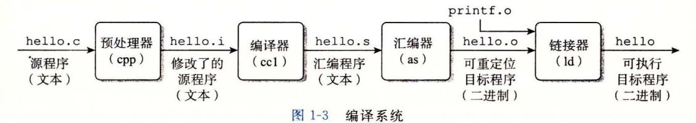

- 预处理阶段。预处理器 (cpp) 根据以字符#开头的命令,修改原始的 程序。比如 hello 中第 行的五nclude <stdio. h> 命令告诉预处理器读取系统头文件 stdio.h 的内容,并把它直接插入程序文本中。结果就得到了另一个 程序,通常 是以. 作为文件扩展名。
- 编译阶段。编译器 (eel) 将文本文件 hello.i 翻译成文本文件 hello.s, 它包含一 个汇编语言程序。该程序包含函数 main 的定义,如下所示:
  - main: <sup>2</sup>subq \$8, %rsp 3 movl \$.LCO, %edi <sup>4</sup>call puts <sup>5</sup>movl \$0, %eax <sup>6</sup>addq \$8, %rsp <sup>7</sup>ret

定义中 2~7 行的每条语句都以一种文本格式描述了一条低级机器语言指令。 汇编语言是非常有用的,因为它为不同高级语言的不同编译器提供了通用的输出语 言。例如, 编译器和 Fortran 编译器产生的输出文件用的都是一样的汇编语言。

- ·汇编阶段。接下来,汇编器(as) hello.s 翻译成机器语 指令,把这些指令打包成 一种叫做可重定位目标程序 (r locatable object program) 的格式,并将结果保存在目标 文件 hello.o 中。 hello.o 文件是 进制文件,它包含的 <sup>17</sup> 节是函数 main 的指令编码 如果我们在文本编辑器中打开 hello.o 文件,将看到一堆乱码
- ·链接阶段。请 意, he 程序调用了 printf 函数,它是每个 编译器都提供的 标准 库中的一个 printf 存在于一个名为 printf.o 独的预编译 好了的目标文件中,而这个文件必须以某种方式合并到我们的 he 程序中 接器 (Id) 就负责处理这种合并 结果就得到 hello 文件,它是 个可执行目标文件 (或者简称为可执行文件),可以被加载到内存中,由系统执行

## 日日 GNU 项目

GCC GNU(GNU GNU's Not Unix 的缩写)项 目开 发出来的众多有用工具之 GNU <sup>1984</sup> Richard Stallman 发起的 个免税的慈善项目 该项目的目 标非 常宏 ,就是 发出一个完整的类 Unix 的系统,其源代码能够不受限制地被修改 和传播。 GNU 目已 个包含 Unix 操作系统的所有主要部件的环境,但内· 核除 核是 nux 独立发展而来的。 GNU 环境包括 EMACS 编辑器、 GCC 器、 GDB 调试器 汇编器、链接器、处理 进制文件的 具以及其他 些部件。 GCC 编译器 经发展到支持许多不同的语言,能够为许多不同的机器生成代码 支持 的语 言包括 C+ Fortran Java Pascal 、面向对象 语言 (Objective C) Ada

GNU 取得了非凡的成绩,但是却常常被忽略。现代开放源码运动(通常和 Linux 系在 起) 思想起源是 GNU 项目中自由软件 (free software) 的概念 (此处的 free 为自由 言论(free speech) 的" 自由 "之意,而非免费啤酒 (free beer) 中的"免费"之意 )而 且, ux 如此受欢迎在很 程度 还要归功于 GNU 具,它们给 Linux 内核提供了环境。

# l . 3 了解编译系统如何工作是大有益处的

对千像 hello.c 这样简单的程序,我们可以依靠编译系统生成正确有效的机器代码 但是,有 些重要的原因促使程序员必须知道编译系统是如何工作的。

·优化程序性能。现代编译器都是成熟的工具,通常可以生成很好的代码。作为程序 员,我们无须为了写出高效代码而去了解编译器的内部工作。但是,为了在 程序中 做出好的编码选择,我们确实需要了解一些机器代码以及编译器将不同的 语旬转化 为机器代码的方式。比如,一个 switch 语句是否总是比 系列的辽-else 语旬高效 得多?一个函数调用的开销有多大? while 循环比 for 循环更有效吗?指针引用比数 组索引更有效吗?为什么将循环求和的结果放到一个本地变量中,会比将其放到 通过引用传递过来的参数中,运行起来快很多呢?为什么我们只是简单地重新排列一 下算术表达式中的括号就能让函数运行得更快?

在第 章中,我们将介绍 x86-64, 最近几代 Linux Macintosh Windows 计算机的 机器语言。我们会讲述编译器是怎样把不同的 语言结构翻译成这种机器语言的 在第 章中,你将学习如何通过简单转换 语言代码,帮助编译器更好地完成工作,从而调 程序的性能。 在第 章中,你将学习存储器系统的层次结构特性, 语言编译器如 何将数组存放在内存中,以及 程序又是如何能够利用这些知识从而更高效地运行。

- ·理解链接时出现的错误。根据我们的经验,一些最令人困扰的程序错误往往都与链 接器操作有关,尤其是当你试图构建大型的软件系统时。比如,链接器报告说它无 法解析一个引用,这是什么意思?静态变量和全局变撮的区别是什么?如果你在不 同的 文件中定义了名字相同的两个全局变量会发生什么?静态库和动态库的区别 是什么?我们在命令行上排列库的顺序有什么影响?最严重的是,为什么有些链接 错误直到运行时才会出现?在第 章中,你将得到这些问题的答案。
- ·避免安全扁洞。多年来,缓冲区溢出错误是造成大多数网络和 Internet 服务器上安 全漏洞的主要原因。存在这些错误是因为很少有程序员能够理解需要限制从不受信 任的源接收数据的数量和格式。学习安全编程的第一步就是理解数据和控制信息存 储在程序栈上的方式会引起的后果。作为学习汇编语言的一部分,我们将在第 中描述堆栈原理和缓冲区溢出错误。我们还将学习程序员、编译器和操作系统可以 用来降低攻击威胁的方法。

# 1. 4 处理器读并解释储存在内存中的指令

此刻, hello.c 源程序已经被编译系统翻译成了可执行目标文件 hello, 并被存放在 磁盘上。要想在 Unix 系统上运行该可执行文件,我们将它的文件名输入到称为 shell 的应 用程序中:

linux>. /hello hello, world linux>

shell 是一个命令行解释器,它输出一个提示符,等待输入一个命令行,然后执行这 个命令。如果该命令行的第一个单词不是一个内置的 shell 命令,那么 shell 就会假设这是 一个可执行文件的名字,它将加载并运行这个文件。所以在此例中, shell 将加载并运行 hello 程序,然后等待程序终止。 hello 程序在屏幕上输出它的消息,然后终止。 shell 随后输出一个提示符,等待下一个输入的命令行。

#### 1. 4. 1 系统的硬件组成

为了理解运行 hello 程序时发生了什么,我们需要了解一个典型系统的硬件组织,如 1-4 所示。这张图是近期 Intel 系统产品族的模型,但是所有其他系统也有相同的外观 和特性。现在不要担心这张图很复杂 我们将在本书分阶段对其进行详尽的介绍。

#### 1. 总线

贯穿整个系统的是一组电子管道,称作总线,它携带信息字节并负责在各个部件间传 递。通常总线被设计成传送定长的字节块,也就是宇 (word) 。字中的字节数(即字长)是一 个基本的系统参数,各个系统中都不尽相同。现在的大多数机器字长要么是 个字节 (32 位),要么是 个字节 (64 位)。本书中,我们不对字长做任何固定的假设。相反,我们将 在需要明确定义的上下文中具体说明一个"字"是多大。

#### 2. 1/0 设备

I/0 (输入/输出)设备是系统与外部世界的联系通道。我们的示例系统包括四个 I/0 备:作为用户输入的键盘和鼠标,作为用户输出的显示器,以及用千长期存储数据和程序 的磁盘驱动器(简单地说就是磁盘)。最开始,可执行程序 hello 就存放在磁盘上。

每个 I/0 设备都通过一个控制器或适配器与 总线相连。控制器和适配器之间的区

别主要在于它们的封装方式。控制器是 I/O 设备本身或者系统的主印制电路板(通常称作主板)上的芯片组。而适配器则是一块插在主板插槽上的卡。无论如何,它们的功能都是在 I/O 总线和 I/O 设备之间传递信息。

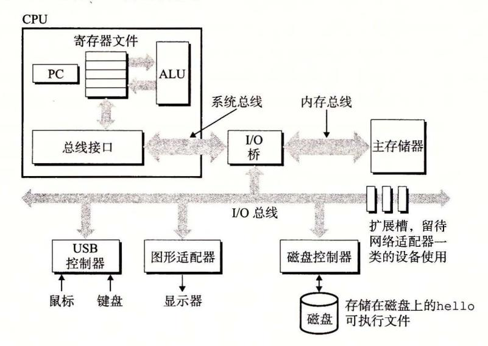

图 1-4 — 个典型系统的硬件组成 CPU: 中央处理单元; ALU: 算术/逻辑单元; PC: 程序计数器; USB: 通用串行总线

第6章会更多地说明磁盘之类的 I/O 设备是如何工作的。在第10章中,你将学习如何在应用程序中利用 Unix I/O 接口访问设备。我们将特别关注网络类设备,不过这些技术对于其他设备来说也是通用的。

#### 3. 丰存

主存是一个临时存储设备,在处理器执行程序时,用来存放程序和程序处理的数据。从物理上来说,主存是由一组动态随机存取存储器(DRAM)芯片组成的。从逻辑上来说,存储器是一个线性的字节数组,每个字节都有其唯一的地址(数组索引),这些地址是从零开始的。一般来说,组成程序的每条机器指令都由不同数量的字节构成。与 C 程序变量相对应的数据项的大小是根据类型变化的。比如,在运行 Linux 的 x86-64 机器上,short 类型的数据需要 2 个字节,int 和 float 类型需要 4 个字节,而 long 和 double 类型需要 8 个字节。

第 6 章将具体介绍存储器技术,比如 DRAM 芯片是如何工作的,它们又是如何组合起来构成主存的。

#### 4. 处理器

中央处理单元(CPU),简称处理器,是解释(或执行)存储在主存中指令的引擎。处理器的核心是一个大小为一个字的存储设备(或寄存器),称为程序计数器(PC)。在任何时刻,PC 都指向主存中的某条机器语言指令(即含有该条指令的地址)。 $\Theta$ 

从系统通电开始,直到系统断电,处理器一直在不断地执行程序计数器指向的指令,再更新程序计数器,使其指向下一条指令。处理器看上去是按照一个非常简单的指令执行模型来操作的,这个模型是由指令集架构决定的。在这个模型中,指令按照严格的顺序执行,而执行一条指令包含执行一系列的步骤。处理器从程序计数器指向的内存处读取指

<sup>○</sup> PC 也普遍地被用来作为"个人计算机"的缩写。然而,两者之间的区别应该可以很清楚地从上下文中看出来。

令,解释指令中的位,执行该指令指示的简单操作,然后更新 PC, 使其指向下一条指令, 而这条指令并不 定和在内存中刚刚执行的指令相邻。

这样的简单操作并不多,它们围绕着主存、寄存器文件 (register file) 和算术/逻辑单 (ALU) 进行。寄存器文件是一个小的存储设备,由 些单个字长的寄存器组成,每个 寄存器都有唯一的名字。 ALU 计算新的数据和地址值。下面是一些简单操作的例子, CPU 在指令的要求下可能会执行这些操作。

- ·加载:从主存复制一个字节或者一个字到寄存器,以覆盖寄存器原来的内容
- 存储:从寄存器复制一个字节或者一个字到主存的某个位置,以覆盖这个位置上原 来的内容。
- 操作 把两个寄存器的内容复制到 ALU, ALU 对这两个字做算术运算,并将结果 存放到一个寄存器中,以覆盖该寄存器中原来的内容。
- 跳转:从指令本身中抽取一个字,并将这个字复制到程序计数器 (PC) 中,以覆盖 PC 中原来的值。

处理器看上去是它的指令集架构的简单实现,但是实际上现代处理器使用了非常复杂 的机制来加速程序的执行。因此,我们将处理器的指令集架构和处理器的微体系结构区分 开来:指令集架构描述的是每条机器代码指令的效果;而微体系结构描述的是处理器实际 上是如何实现的。在第 章研究机器代码时,我们考虑的是机器的指令集架构所提供的抽 象性 章将更详细地介绍处理器实际上是如何实现的。第 章用 个模型说明现代处 理器是如何工作的,从而能预测和优化机器语言程序的性能。

#### 1. 4. 2 运行 hello 程序

前面简单描述了系统的硬件组成和操作,现在开始介绍当我们运行示例程序时到底发 生了些什么。在这里必须省略很多细节,稍后会做补充,但是现在我们将很满意于这种整 体上的描述

初始时, shell 程序执行它的指令,等待我们输入一个命令 当我们在键盘上输入字符串 "./hello" 后, shell 程序将字符逐一读入寄存器,再把它存放到内存中,如图 1-5 所示。

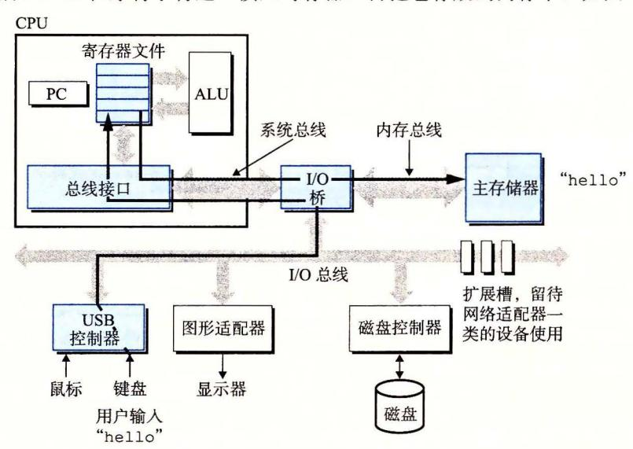

1-5 从键盘上读取 hel lo 命令

当我们在键盘上敲回车键时, shell 程序就知道我们已经结束了命令的输入。然后 shell 执行一系列指令来加载可执行的 hello 文件,这些指令将 hello 目标文件中的代码 和数据从磁盘复制到主存。数据包括最终会被输出的字符串 "hello, world\n"

利用直接存储器存取 CDMA, 将在第 章中讨论)技术,数据可以不通过处理器而直 接从磁盘到达主存。这个步骤如图 1-6 所示。

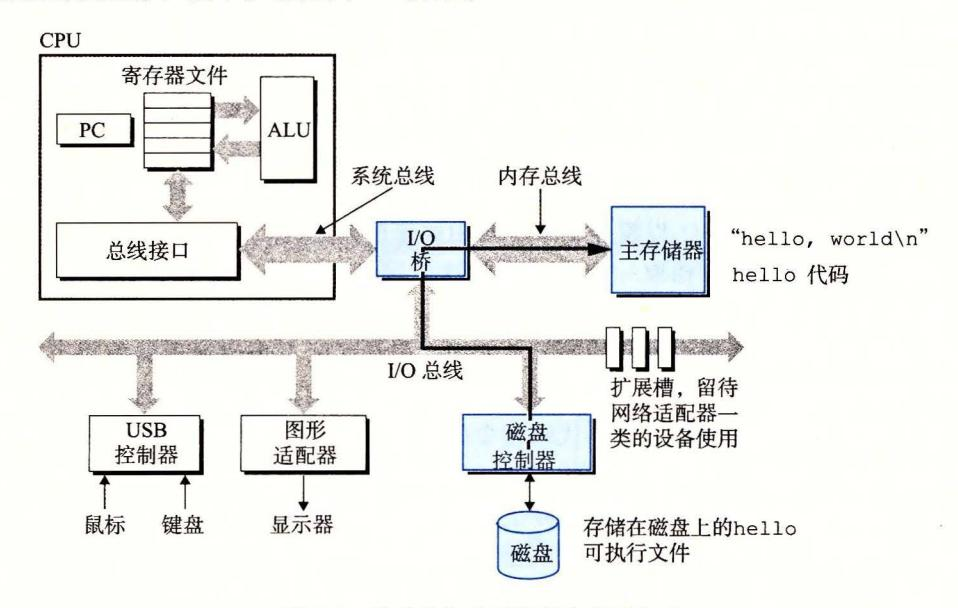

1-6 从磁盘加载可执行文件到主存

一旦 目标文件 hello 中的代码和数据被加载到主存,处理器就开始执行 hello 程序 main 程序中的机器语言指令。这些指令将 "hello, world\n" 字符串中的字节从主存 复制到寄存器文件,再从寄存器文件中复制到显示设备,最终显示在屏幕上。这个步骤如 1-7 所示。

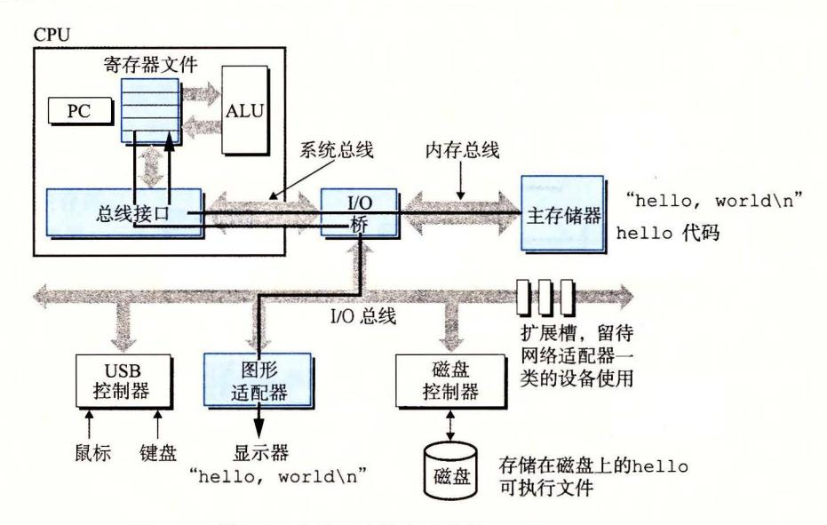

将输出字符串从存储器写到显示器

# l. 5 高速缓存至关重要

这个简单的示例揭平了一个重要的问题,即系统花费了大 的时间把信息从一个地方 挪到另一个地方。 hello 程序的机器指令最初是存放在磁盘上,当程序加载时,它们被复 制到主存;当处理器运行程序时,指令又从主存复制到处理器。相似地,数据串 "hello, world/n" 开始时在磁盘上,然后被复制到主存,最后从主存上复制到显示设备 程序员的角度来看,这些复制就是开销,减慢了程序"真正"的工作。因此,系统设计者 的一个主要目标就是使这些复制操作尽可能快地完成。

根据机械原理,较大的存储设备要比较小的存储设备运行得慢,而快速设备的造价远高 于同类的低速设备。比如说,一个典型系统上的磁盘驱动器可能比主存大 <sup>1000</sup> 倍,但是对 处理器而言,从磁盘驱动器上读取一个字的时间开销要比从主存中读取的开销大 <sup>1000</sup> 万倍

类似地,一个典型的寄存器文件只存储几百字节的信息,而主存里可存放几十亿字 节。然而,处理器从寄存器文件中读数据比从主存中读取几乎要快 <sup>100</sup> 倍。更麻烦的是, 随着这些年半导体技术的进步,这种处理器与主存之间的差距还在持续增大。加快处理器 的运行速度比加快主存的运行速度要容易和便宜得多

针对这种处理器与主存之间的差异,系统设计者采用了更小更快的存储设备,称为高 速缓存存储器 (cache memory, 简称为 cache 或高速缓存),作为暂时的集结区域,存放处 理器近期可能会需要的信息。图 1-8 展示了一个典型系统中的高速缓存存储器。位千处理 器芯片上的 Ll 高速缓存的容量可以达到数万字节,访问速度几乎和访问寄存器文件一样 快。 个容 为数十万到数百万字节的更大的 L2 高速缓存通过一条特殊的总线连接到处 理器。进程访问 L2 高速缓存的时间要比访问 Ll 高速缓存的时间长 倍,但是这仍然比访 问主存的时间快 5~10 倍。 Ll L2 高速缓存是用一种叫做静态随机访问存储器 (SRAM) 的硬件技术实现的。比较新的、处理能力更强大的系统甚至有 级高速缓存: Ll L2 L3 系统可以获得一个很大的存储器,同时访问速度也很快,原因是利用了高速缓存的局 部性原理,即程序具有访问局部区域里的数据和代码的趋势 通过让高速缓存里存放可能 经常访问的数据,大部分的内存操作都能在快速的高速缓存中完成。

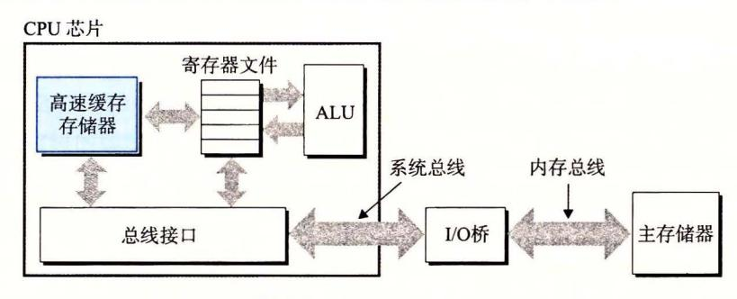

-8 高速缓存存储器

本书得出的重要结论之一就是,意识到高速缓存存储器存在的应用程序员能够利用高速缓 存将程序的性能提高一个数量级。你将在第 章里学习这些重要的设备以及如何利用它们。

#### 1. 6 存储设备形成层次结构

在处理器和一个较大较慢的设备(例如主存)之间插入一个更小更快的存储设备(例如 高速缓存)的想法已经成为一个普遍的观念。实际上,每个计算机系统中的存储设备都被 组织成了一个存储器层次结构,如图 所示。在这个层次结构中,从上至下,设备的访 问速度越来越慢、容最越来越大,并且每字节的造价也越来越便宜。寄存器文件在层次结 构中位于最顶部,也就是第 级或记为 LO 。这里我们展示的是三层高速缓存 Ll L3, 占据存储器层次结构的第 层到第 主存在第 层,以此类推。

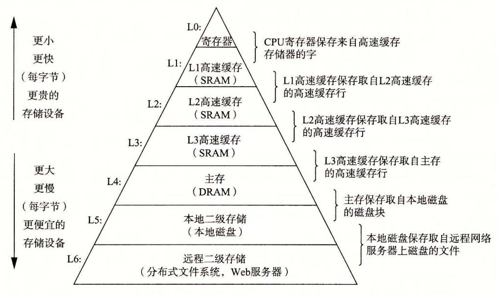

1-9 一个存储器层次结构的示例

存储器层次结构的主要思想是上一层的存储器作为低 层存储器的高速缓存。因此, 寄存器文件就是 Ll 的高速缓存, Ll L2 的高速缓存, L2 L3 的高速缓存, L3 是主存 的高速缓存,而主存又是磁盘的高速缓存 在某些具有分布式文件系统的网络系统中,本 地磁盘就是存储在其他系统中磁盘上的数据的高速缓存

正如可以运用不同的高速缓存的知识来提高程序性能一样,程序员同样可以利用对整 个存储器层次结构的理解来提高程序性能 章将更详细地讨论这个问题。

# 1. 7 操作系统管理硬件

让我们回到 hello 程序的例子 shell 加载和运行 hello 程序时, 以及 hello 程序输

出自己的消息时, shell hello 程序都没有 直接访问键盘、显示器、磁盘或者主存。取而 代之的是,它们依靠操作系统提供的服务。我 们可以把操作系统看成是应用程序和硬件之间 插入的一层软件,如图 1-10 所示 所有应用 程序对硬件的操作尝试都必须通过操作系统

操作系统有两个基本功能: )防止硬 件被失控的应用程序滥用; )向应用程序 提供简单一致的机制来控制复杂而又通常大 不相同的低级硬件设备 操作系统通过几个 基本的抽象概念(进程、虚拟内存和文件)来 实现这两个功能 如图 1-11 所示,文件是对

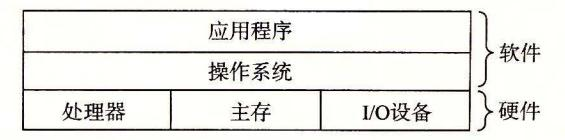

1-10 计算机系统的分层视图

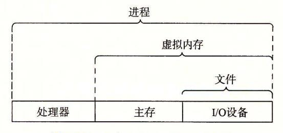

1-11 操作系统提供的抽象表示

I/0 设备的抽象表示,虚拟内存是对主存和磁盘 I/0 设备的抽象表示,进程则是对处理 器、主存和 I/0 设备的抽象表示。我们将依次讨论每种抽象表示。

# fJD Unix Posix 和标准 Unix 规范

<sup>20</sup> 世纪 <sup>60</sup> 年代是大型、复杂操作系统盛行的年代,比如 IBM OS/3 <sup>60</sup> Honeywell Multics 系统 OS <sup>360</sup> 是历史上最成功的软件项目之一,而 Multics 虽然持续存 在了多年,却从来没有被广泛应用过。贝尔实验室曾经是 Multics 项目的最初参与者, 但是因为考虑到该项目的复杂性和缺乏进展而于 <sup>1969</sup> 年退出 。鉴 Mutics 项目不愉快 的经历,一群贝尔实验室的研究人员 Ken Thompson Denni Ritch比、 Doug Mellroy Joe Ossanna, <sup>1969</sup> 年开始在 DEC PDP 计算机上完全用机器语言编写了一个 简单得多的操作系统 这个新系统中的很多思想,比如层次文件系统、作为用户级进程 shell 概念,都是来自于 Multics, 只不过在一个更小、更简单的程序包里实现 <sup>1970</sup> 年, Brian Kernighan 给新系统命名为 "Unix", 这也是一个双关语,暗指 "Multics" 复杂性 <sup>1973</sup> 年用 重新编写其内核, <sup>1974</sup> 年, Unix 开始正式对外发布 [93]

贝尔实验室以慷慨的条件向学校提供源代码,所以 Unix 在大专院校里荻得了很多 支持并得以持续发展 最有影响的工作发生在 <sup>20</sup> 世纪 <sup>70</sup> 年代晚期到 <sup>80</sup> 年代早期,在 美国加州大学伯克利分校,研究人员在一系列发布版本中增加了虚拟内存和 Internet 议,称为 Unix 4. xBSD(Berkeley Software Distribution) 。与此同时,贝尔实验室也在 发布自己的版本,称为 System V Unix 其他厂商的版本,比如 Sun Microsystems Solaris 系统,则是从这些原始的 BSD System 版本中衍生而来。

<sup>20</sup> 世纪 <sup>80</sup> 年代中期, Unix 厂商试图通过加入新的、往往不兼容的特性来使它们的 程序与众不同,麻烦也就随之而来了 为了阻止这种趋势, IEEE (电气和电子工程师协 会)开始努力标准化 Unix 的开发,后来由 Richard Stallman 命名为 "Posix" 。结果就得 到了一系列的标准,称作 Posix 标准。这套标准涵盖了很多方面,比如 Unix 系统调用 语言接口、 shell 程序和工具、线程及网络编程 最近,一个被称为"标准 Unix 范"的独立标准化工作已经与 Posix 一起创建了统一的 Unix 系统标准 这些标准化工 作的结果是 Unix 版本之间的差异已经基本消失

#### 1. 7. 1 进程

hello 这样的程序在现代系统上运行时,操作系统会提供一种假象,就好像系统上只 有这个程序在运行。程序看上去是独占地使用处理器、主存和 I/0 设备。处理器看上去就像 在不间断地一条接一条地执行程序中的指令,即该程序的代码和数据是系统内存中唯一的对 象。这些假象是通过进程的概念来实现的,进程是计算机科学中最重要和最成功的概念之一。

进程是操作系统对一个正在运行的程序的一种抽象。在一个系统上可以同时运行多个 进程,而每个进程都好像在独占地使用硬件。而并发运行,则是说一个进程的指令和另 个进程的指令是交错执行的。在大多数系统中,需要运行的进程数是多千可以运行它们的 CPU 个数的。传统系统在一个时刻只能执行一个程序,而先进的多核处理器同时能够执 行多个程序。无论是在单核还是多核系统中,一个 CPU 看上去都像是在并发地执行多个 进程,这是通过处理器在进程间切换来实现的。操作系统实现这种交错执行的机制称为上 下文切换。为了简化讨论,我们只考虑包含一个 CPU 的单处理器系统的情况。我们会在 1. 9. 节中讨论多处理器系统。

操作系统保持跟踪进程运行所需的所有状态信息。这种状态,也就是上下文,包括许多信息,比如 PC 和寄存器文件的当前值,以及主存的内容。在任何一个时刻,单处理器系统都只能执行一个进程的代码。当操作系统决定要把控制权从当前进程转移到某个新进程时,就会进行上下文切换,即保存当前进程的上下文、恢复新进程的上下文,然后将控制权传递到新进程。新进程就会从它上次停止的地方开始。图 1-12 展示了示例 hello 程序运行场景的基本理念。

示例场景中有两个并发的进程: shell 进程和 hello 进程。最开始,只有 shell 进程在运行,即等待命令行上的输入。当我们让它运行 hello 程序时,shell 通过调用一个专门的函数,即系统调用,来执行我们的请求,系统调用会将控制权传递给操作系统。操作系统保存 shell 进程的上下文,创建一个新的 hello 进程及其上下文,然后将控制权传给新的 hello 进程。hello 进程终止后,操作系统恢复 shell 进程的上下文,并将控制权传回给它,shell 进程会继续等待下一个命令行输入。

如图 1-12 所示,从一个进程到另一个进程的转换是由操作系统内核(kernel)管理的。内核是操作系统代码常驻主存的部分。当应用程序需要操作系统的某些操作时,比如读写文件,它就执行一条特殊的系统调用(system call)指令,将控制权传递给内核。然后内核执行被请求的操作并返回应用程序。注意,内核不是一个独立的进程。相反,它是系统管理全部进程所用代码和数据结构的集合。

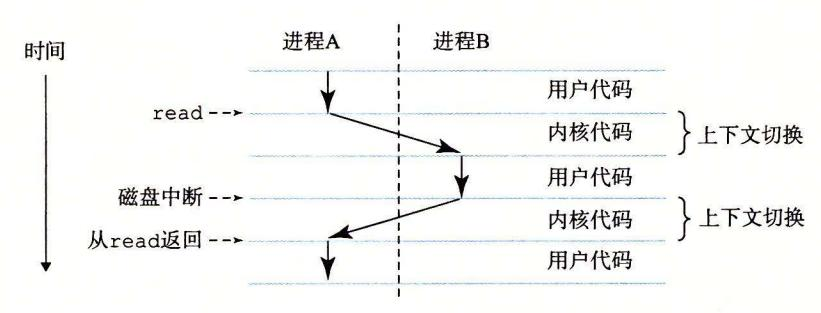

图 1-12 进程的上下文切换

实现进程这个抽象概念需要低级硬件和操作系统软件之间的紧密合作。我们将在第 8 章中揭示这项工作的原理,以及应用程序是如何创建和控制它们的进程的。

#### 1.7.2 线程

尽管通常我们认为一个进程只有单一的控制流,但是在现代系统中,一个进程实际上可以由多个称为线程的执行单元组成,每个线程都运行在进程的上下文中,并共享同样的代码和全局数据。由于网络服务器中对并行处理的需求,线程成为越来越重要的编程模型,因为多线程之间比多进程之间更容易共享数据,也因为线程一般来说都比进程更高效。当有多处理器可用的时候,多线程也是一种使得程序可以运行得更快的方法,我们将在 1.9.2 节中讨论这个问题。在第 12 章中,你将学习并发的基本概念,包括如何写线程化的程序。

#### 1.7.3 虚拟内存

虚拟内存是一个抽象概念,它为每个进程提供了一个假象,即每个进程都在独占地使用 主存。每个进程看到的内存都是一致的,称为虚拟地址空间。图 1-13 所示的是 Linux 进程的 虚拟地址空间(其他 Unix 系统的设计也与此类似)。在 Linux 中,地址空间最上面的区域是 保留给操作系统中的代码和数据的,这对所有进程来说都是 样。地址空间的底部区域存放 用户进程定义的代码和数据。请注意,图中的地址是从下往上增大的。

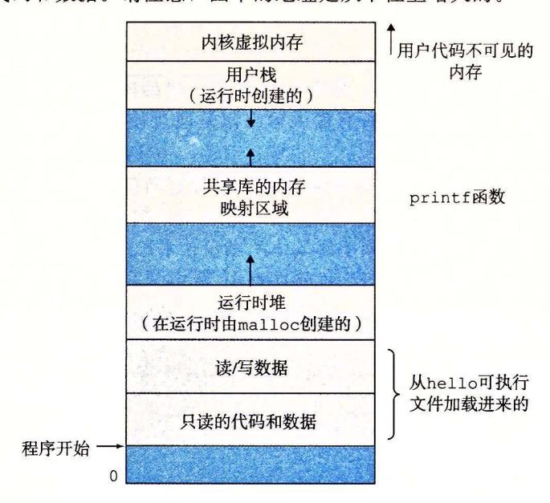

<sup>13</sup> 进程的虚拟地址空间

每个进程看到的虚拟地址空间由大量准确定义的区构成,每个区都有专门的功能。在 本书的后续章节你将学到更多有关这些区的知识,但是先简单了解每 个区是非常有益 的。我们从最低的地址开始,逐步向上介绍。

- ·程序代码和数据。对所有的进程来说,代码是从同 固定地址开始,紧接着的是和 全局变量相对应的数据位置。代码和数据区是直接按照可执行目标文件的内容初 始化的,在示例中就是可执行文件 hello 。在第 章我们研究链接和加载时,你会 学习更多有关地址空间的内容。
- ·堆。代码和数据区后紧随着的是运行时堆。代码和数据区在进程一开始运行时就被 指定了大小,与此不同,当调用像 malloc free 这样的 标准库函数时,堆可 以在运行时动态地扩展和收缩。在第 章学习管理虚拟内存时,我们将更详细地研 究堆。
- ·共享库。大约在地址空间的中间部分是一块用来存放像 标准库和数学库这样的共 享库的代码和数据的区域。共享库的概念非常强大,也相当难懂。在第 章介绍动 态链接时,将学习共享库是如何工作的。
- ·栈。位千用户虚拟地址空间顶部的是用户栈,编译器用它来实现函数调用。和堆一 样,用户栈在程序执行期间可以动态地扩展和收缩 特别地,每次我们调用 个函 数时,栈就会增长;从一个函数返回时,栈就会收缩 在第 章中将学习编译器是 如何使用栈的。
- ·内核虚拟内存。地址空间顶部的区域是为内核保留的。不允许应用程序读写这个区 域的内容或者直接调用内核代码定义的函数 相反,它们必须调用内核来执行这些 操作。

虚拟内存的运作需要硬件和操作系统软件之间精密复杂的交互,包括对处理器生成的每 个地址的硬件翻译。基本思想是把一个进程虚拟内存的内容存储在磁盘上,然后用主存作为 磁盘的高速缓存。第 章将解释它如何工作,以及为什么对现代系统的运行如此重要。

#### l. 7. 4 文件

文件就是字节序列,仅此而已。每个 I/0 设备,包括磁盘、键盘、显示器,甚至网 络,都可以看成是文件 系统中的所有输入输出都是通过使用一小组称为 Unix I/0 的系 统函数调用读写文件来实现的

文件这个简单而精致的概念是非常强大的,因为它向应用程序提供了一个统一的视 图,来看待系统中可能含有的所有各式各样的 I/0 设备。例如,处理磁盘文件内容的应用 程序员可以非常幸福,因为他们无须了解具体的磁盘技术。进一步说,同一个程序可以在 使用不同磁盘技术的不同系统上运行。你将在第 <sup>10</sup> 章中学习 Unix I/0

#### Linux 项目

<sup>99</sup> 芬兰研究生 Linus Torva ld 地发布了一个新的类 Unix 的操作系 ,内容如下

来自 tor va lds kl aava H elsinki. FI(Linus Benedict T orvalds)

新闻组 comp. os. minix

:在 minix 你最想看到 么?

摘要:关于 新操作系统 调查

时间: <sup>1991</sup> <sup>25</sup> 0: 7:08 GMT

每个使用 minix 的朋友 你们好。

正在 个(免费的)用在 386(48 6)AT 的操作系统(只是业余爱好 它不会像 GNU 那样庞大和专业)。这个想法自 月份就开始酝酿 快要完成了。我希望得到 各位对 minix 的任何反馈意见,因为我的操作系统在某些方 面与 它相类似(其 包括相 同的文件系统的物理设计(因为某些实际的原因 )。

我现 在巳 经移植了 as l. 08) gcc l. <sup>40</sup> ,并且看上去能 行。这意味着我需 时间来让 它变得更实用 ,并且, 我想要知道 想要什 么特 。欢迎 任何建 ,但是我无 法保证我能实 现它们 :-)

Linus (torvalds@kruuna .helsinki.fi)

Tor ald 所说的,他创建 nux 的起点是 Minix Andrew S. nb um 于教育目的开发的一个操作系统 <sup>11</sup> 3]

接下未 如他们所说,这 成了历史 nux 逐渐发展成为一个技术和文化现象 通过和 GNU 项目的力 结合, Linux 项目发展成了一个完整的、符合 os ix 标准的 Unix 操作系统的版本,包括内核和所有支撑的基础设施 从手持设备到大型计算机, Linux 在范围如此广泛的计算机上得到了应用 IBM 的一个工作组甚至把 Linux 移植到 了一块腕表中!

#### 1. 8 系统之间利用网络通信

系统漫游至此,我们一 是把系统视为 个孤立的硬件和软件的集合体。实际上,现