代系统经常通过网络和其他系统连接到一起。从一个单独的系统来看,网络可视为一个 I/O 设备,如图 1-14 所示。当系统从主存复制一串字节到网络适配器时,数据流经过网络 到达另一台机器,而不是比如说到达本地磁盘驱动器。相似地,系统可以读取从其他机器 发送来的数据,并把数据复制到自己的主存。

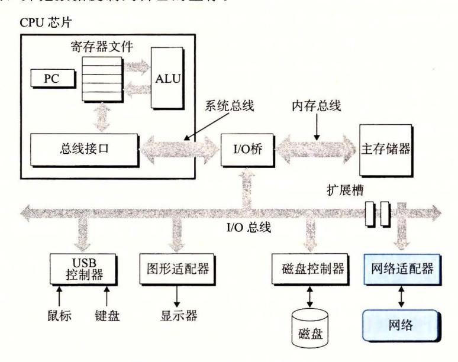

图 1-14 网络也是一种 I/O 设备

随着 Internet 这样的全球网络的出现,从一台主机复制信息到另外一台主机已经成为计算机系统最重要的用途之一。比如,像电子邮件、即时通信、万维网、FTP 和 telnet 这样的应用都是基于网络复制信息的功能。

回到 hello 示例,我们可以使用熟悉的 telnet 应用在一个远程主机上运行 hello 程序。假设用本地主机上的 telnet 客户端连接远程主机上的 telnet 服务器。在我们登录到远程主机并运行 shell 后,远端的 shell 就在等待接收输入命令。此后在远端运行 hello 程序包括如图 1-15 所示的五个基本步骤。

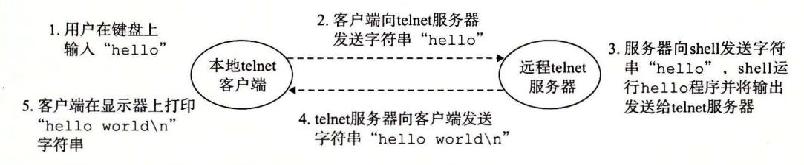

图 1-15 利用 telnet 通过网络远程运行 hello

当我们在 telnet 客户端键人 "hello"字符串并敲下回车键后,客户端软件就会将这个字符串发送到 telnet 的服务器。telnet 服务器从网络上接收到这个字符串后,会把它传递给远端 shell 程序。接下来,远端 shell 运行 hello 程序,并将输出行返回给 telnet 服务器。最后,telnet 服务器通过网络把输出串转发给 telnet 客户端,客户端就将输出串输出到我们的本地终端上。

这种客户端和服务器之间交互的类型在所有的网络应用中是非常典型的。在第 11 章中,你将学会如何构造网络应用程序,并利用这些知识创建一个简单的 Web 服务器。

# 1. 9 重要主题

在此,小结一下我们旋风式的系统漫游。这次讨论得出一个很重要的观点,那就是系 统不仅仅只是硬件。系统是硬件和系统软件互相交织的集合体,它们必须共同协作以达到 运行应用程序的最终目的。本书的余下部分会讲述硬件和软件的详细内容,通过了解这些 详细内容,你可以写出更快速、更可靠和更安全的程序。

作为本章的结束,我们在此强调几个贯穿计算机系统所有方面的重要概念。我们会在 本书中的多处讨论这些概念的重要性

#### 1. 9. 1 Amdahl 定律

Gene Amdahl, 计算领域的早期先锋之一,对提升系统某 部分性能所带来的效果做 出了简单却有见地的观察。这个观察被称为 Amdahl 定律 (Amdahl's law) 。该定律的主要 思想是,当我们对系统的某个部分加速时,其对系统整体性能的影响取决于该部分的重要 性和加速程度。若系统执行某应用程序需要时间为 old 假设系统某部分所需执行时间与 该时间的比例为 a, 而该部分性能提升比例为 。即该部分初始所需时间为 aT Id, 现在所 需时间为 CaT01d) 。因此,总的执行时间应为

$$T_{\rm new} = (1-\alpha)T_{\rm old} + (\alpha T_{\rm old})/k = T_{\rm old} \big[ (1-\alpha) + \alpha/k \big]$$

由此,可以计算加速比 S= ld Tne

$$S = \frac{1}{(1-\alpha) + \alpha/k} \tag{1.1}$$

举个例子,考虑这样一种情况,系统的某个部分初始耗时比例为 60%(a=O. 6) ,其加速比 例因子为 3(k=3) 。则我们可以获得的加速比为 [0. 4+0. 6/3]=1. <sup>67</sup> 倍。虽然我们对系统的 一个主要部分做出了重大改进,但是获得的系统加速比却明显小千这部分的加速比。这就是 Amdahl 定律的主要观点 要想显著加速整个系统,必须提升全系统中相当大的部分的速度。

# 四日 表示相对性能

性能提升最好的表示方法 是用比 d/ 其中 为原始系 所需 时间, 为修改后的系 时间 如果有所改进 则比值应大于 我们用后 来表示比例 因此, "2 读作 "2 "。

表示相对变化更传统的方法是用百分比 这种方法适用于 化小的情况,但其定义 是模糊的 应该等于 <sup>00</sup> • ( Told - Tnew) 还是 <sup>00</sup> • ld new) ld, 还是其他 的值 此外,它对 大的 化也 有太大意义 单地说性能提升 相比, 提升了 20% 理解

- 练习题 1 假设你是个卡车司机,要将土豆从爱达荷州的 Boise 运送到明尼苏达州 Minneapolis, 全程 <sup>2500</sup> 公里。在限速范围内,你估计平均速度为 <sup>100</sup> 公里/小时, 整个行程需要 <sup>25</sup> 个小时。
  - A. 你听到新闻说蒙大拿州刚刚取消了限速,这使得行程中有 <sup>1500</sup> 公里卡车的速度可 以为 <sup>150</sup> 公里/小时 那么这对整个行程的加速比是多少?
  - B. 你可以在 www. fasttrucks. com 网站上为自己的卡车买个新的涡轮增压器。网站现 货供应 各种型号,不过速度越快,价格越高。如果想要让整个行程的加速比为 1. 67 X, 那么你必须以多快的速度通过蒙大拿州?

练习题 2 公司的市场部向你的客户承诺,下一个版本的软件性能将改进 2X 。这 项任务被分配给你。你巳经确认只有 <sup>80</sup> %的系统能够被改进,那么,这部分需要被 改进多少(即 取何值)才能达到整体性能目标?

Amdahl 定律一个有趣的特殊情况是考虑 趋向千~时的效果。这就意味着,我们可 以取系统的某 部分将其加速到一个点,在这个点上,这部分花费的时间可以忽略不计。 千是我们得到

$$S_{\infty} = \frac{1}{(1-\alpha)} \tag{1.2}$$

举个例子,如果 <sup>60</sup> %的系统能够加速到不花时间的程度,我们获得的净加速比将仍只有 1/ 0. 4=2. 5

Amdahl 定律描述了改善任何过程的一般原则。除了可以用在加速计算机系统方面之 外,它还可以用在公司试图降低刀片制造成本,或学生想要提高自己的绩点平均值等方 面。也许它在计算机世界里是最有意义的,在这里我们常常把性能提升 倍或更高的比例 因子。这么高的比例因子只有通过优化系统的大部分组件才能获得。

# 1. 9. 2 井发和并行

数字计算机的整个历史中,有两个需求是驱动进步的持续动力:一个是我们想要计算 机做得更多,另一个是我们想要计算机运行得更快 。当 处理器能够同时做更多的事情时, 这两个因素都会改进。我们用的术语并发 (concurrency) 个通用的概念,指一个同时具 有多个活动的系统;而术语并行 (parallelism) 指的是用并发来使一个系统运行得更快。并 行可以在计算机系统的多个抽象层次上运用。在此,我们按照系统层次结构中由高到低的 顺序重点强调 个层次。

#### 线程级并发

构建在进程这个抽象之上,我们能够设计出同时有多个程序执行的系统,这就导致了 并发 使用线程,我们甚至能够在一个进程中执行多个控制流 。自 世纪 <sup>60</sup> 年代初期出 现时间共享以来,计算机系统中就开始有了对并发执行的支持 传统意义上,这种并发执 行只是模拟出来的,是通过使一台计算机在它正在执行的进程间快速切换来实现的,就好 像一个杂耍艺人保持多个球在空中飞舞一样。这种并发形式允许多个用户同时与系统交 互,例如,当许多人想要从一个 Web 服务器获取页面时。它还允许一个用户同时从事多 个任务,例如,在 个窗口中开启 Web 浏览器,在另一窗口中运行字处理器,同时又播 放音乐 在以前,即使处理器必须在多个任务间切换,大多数实际的计算也都是由一个处 理器来完成的 这种配置称为单处理器系统

当构建一个由单操作系统内核控制的多处理 器组成的系统时,我们就得到了 个多处理器系 。其实从 <sup>20</sup> 世纪 <sup>80</sup> 年代开始,在大规模的计 算中就有了这种系统,但是直到最近,随着多核 处理器和超线程 (hyperthreading) 的出现,这种 系统才变得常见 1-16 给出了这些不同处理 器类型的分类

多核处理器是将多个 CPU (称为"核")集成 到一个集成电路芯片上。图 <sup>17</sup> 描述的是一个 变得普遍了

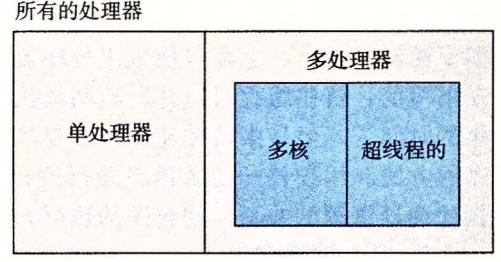

<sup>16</sup> 不同的处理器配置分类。随着多核 处理器和超线程的出现,多处理器

典型多核处理器的组织结构,其中微处理器芯片有 CPU 核,每个核都有自己的 Ll L2 高速缓存,其中的 Ll 高速缓存分为两个部分 一个保存最近取到的指令,另一个存 放数据。这些核共 更高层次的高速缓存,以及到主存的接口 工业界的专家预言他们能 够将几十个、最终会是上百个核做到 个芯片上

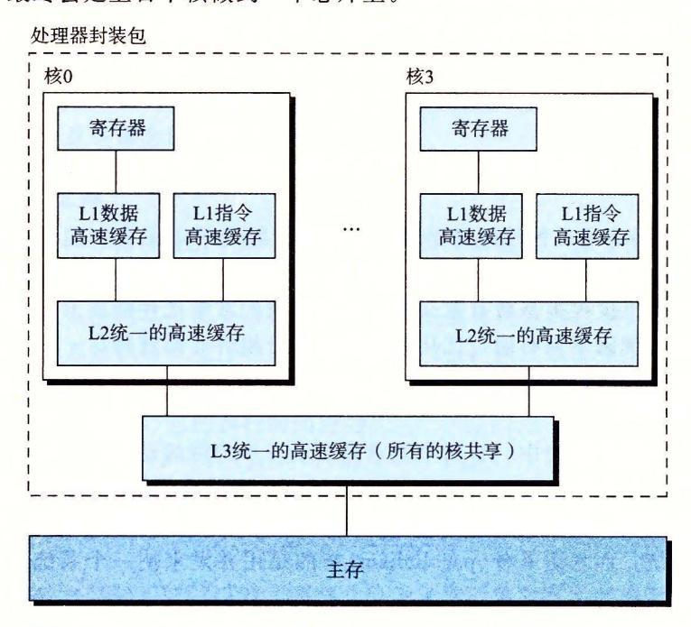

<sup>17</sup> 多核处理器的组织结构 个处理器核 成在一个芯片上

超线程,有时称为同时多线程 (simultaneous multi-threading) ,是一项允许一个 CPU 执行多个控制流的技术。它涉及 CPU 某些硬件有多个备份,比如程序计数器和寄存器文 件,而其他的硬件部分只有一份,比如执行浮点算术运算的单元。常规的处理器需要大约 20 <sup>000</sup> 个时钟周期做不同线程间的转换,而超线程的处理器可以在单个周期的基础上决定 要执行哪一个线程。这使得 CPU 能够更好地利用它的处理资源。比如,假设一个线程必 须等到某些数据被装载到高速缓存中,那 CPU 就可以继续去执行另一个线程。举例来说, Intel Core i7 处理器可以让每个核执行两个线程,所以一个 核的系统实际上可以并行地 执行 个线程。

多处理器的使用可以从两方面提 系统性能。首先,它减少了在执行多个任务时模拟 并发的需要。正如前面提到的,即使是只有一个用户使用的个人计算机也需要并发地执行 多个活动。其次,它可以使应用程序运行得更快,当然,这必须要求程序是以多线程方式 来书写的,这些线程可以并行地高效执行。因此,虽然并发原理的形成和研究已经超过 <sup>50</sup> 年的时间了,但是多核和超线程系统的出现才极大地激发了 种愿望,即找到书写应用程 序的方法利用硬件开发线程级并行性。第 <sup>12</sup> 章会更深入地探讨并发,以及使用并发来提 供处理器资源的共享,使程序的执行允许有更多的并行

#### 2. 指令级井行

在较低的抽象层次上,现代处理器可以同时执行多条指令的属性称为指令级并行。早 期的微处理器,如 <sup>1978</sup> 年的 Intel 8086, 需要多个(通常是 3~10 个)时钟周期来执行 指令。最近的处理器可以保持每个时钟周期 2~4 条指令的执行速率 其实每条指令从开 始到结束需要长得多的时间,大约 <sup>20</sup> 个或者更多周期,但是处理器使用了非常多的聪明 技巧来同时处理多达 <sup>100</sup> 条指令。在第 章中,我们会研究流水线 (pipelining) 的使用。在 流水线中,将执行一条指令所需要的活动划分成不同的步骤,将处理器的硬件组织成一系 列的阶段,每个阶段执行一个步骤。这些阶段可以并行地操作,用来处理不同指令的不同 部分。我们会看到一个相当简单的硬件设计,它能够达到接近于 个时钟周期一条指令的 执行速率。

如果处理器可以达到比一个周期一条指令更快的执行速率,就称之为超标量 (superscalar) 处理器。大多数现代处理器都支持超标最操作。第 章中,我们将描述超标量处理 器的高级模型。应用程序员可以用这个模型来理解程序的性能。然后,他们就能写出拥有 更高程度的指令级并行性的程序代码,因而也运行得更快。

#### 3. 单指令、多数据并行

在最低层次上,许多现代处理器拥有特殊的硬件,允许一条指令产生多个可以并行执 行的操作,这种方式称为单指令、多数据,即 SIMD 并行。例如,较新几代的 Intel AMD 处理器都具有并行地对 对单精度浮点数 (C 数据类型 float) 做加法的指令。

提供这些 SIMD 指令多是为了提高处理影像、声音和视频数据应用的执行速度。虽然 有些编译器会试图从 程序中自动抽取 SIMD 并行性,但是更可靠的方法是用编译器支持 的特殊的向量数据类型来写程序,比如 GCC 就支持向量数据类型。作为对第 章中比较 通用的程序优化描述的补充,我们在网络旁注 OPT:SIMD 中描述了这种编程方式。

# 1. 9. 3 计算机系统中抽象的重要性

抽象的使用是计算机科学中最为重要的概念之一。例如,为一组函数规定一个简单的 应用程序接口 (API) 就是一个很好的编程习惯,程序员无须了解它内部的工作便可以使用 这些代码。不同的编程语言提供不同形式和等级的抽象支持,例如 Java 类的声明和 言的函数原型。

.我们已经介绍了计算机系统中使用的几个抽象,如图 1-18 所示。在处理器里,指令 集架构提供了对实际处理器硬件的抽象。使用这个抽象,机器代码程序表现得就好像运行 在一个 次只执行 条指令的处理器上。底层的硬件远比抽象描述的要复杂精细,它并行 地执行多条指令,但又总是与那个简单有序的模型保持一致。只要执行模型一样,不同的 处理器实现也能执行同样的机器代码,而又提供不同的开销和性能。

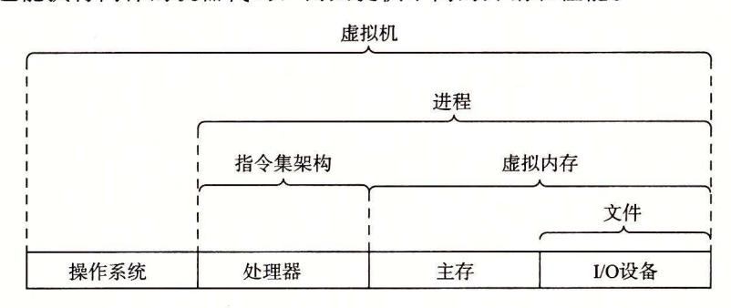

1-18 计算机系统提供的 些抽象。计算机系统中的一个重大主题就是 提供不同层次的抽象表示,来隐藏实际实现的复杂性

在学习操作系统时,我们介绍了三个抽象:文件是对 I/0 设备的抽象,虚拟内存是对 程序存储器的抽象,而进程是对一个正在运行的程序的抽象。我们再增加一个新的抽象:

在本书后续的章节中,我们会具体介绍这些抽象。

# l . 10 小结

计算机系统是由硬件和系统软件组成的,它们共同协作以运行应用程序。计算机内部的信息被表示 为一组组的位,它们依据上下文有不同的解释方式。程序被其他程序翻译成不同的形式,开始时是 ASCII 文本,然后被编译器和链接器翻译成二进制可执行文件。

处理器读取并解释存放在主存里的二进制指令。因为计算机花费了大量的时间在内存、 I/0 设备和 CPU 寄存器之间复制数据,所以将系统中的存储设备划分成层次结构 CPU 寄存器在顶部,接着是多 层的硬件高速缓存存储器、 DRAM 主存和磁盘存储器。在层次模型中,位于更高层的存储设备比低层的 存储设备要更快,单位比特造价也更高。层次结构中较高层次的存储设备可以作为较低层次设备的高速 缓存。通过理解和运用这种存储层次结构的知识,程序员可以优化 程序的性能。

操作系统内核是应用程序和硬件之间的媒介。它提供三个基本的抽象: )文件是对 I/0 设备的抽象; 2) 虚拟内存是对主存和磁盘的抽象; )进程是处理器、主存和 I/0 设备的抽象。

最后,网络提供了计算机系统之间通信的手段。从特殊系统的角度来看,网络就是一种 I/0 设备。

# 参考文献说明

Ritchie 写了关于早期 Unix 的有趣的第一手资料 [91, 92] Ritchie Thompson 提供了最早出 版的 Unix 资料 [93] Silberschatz Galvin Gagne[l02] 提供了关于 Unix 不同版本的详尽历史。 GNU (www. gnu. org) Linux(www. linux. org) 的网站上有大弑的当前信息和历史资料。 Posix 标准可以在线 获得 (www.unix.org)

# 练习题答案

- , . 1 该问题说明 Amdahl 定律不仅仅适用千计算机系统。
  - A. 根据公式 1. 1, a=0.6, k=l.5 。更直接地说,在蒙大拿行驶的 <sup>1500</sup> 公里需要 <sup>10</sup> 个小时,而 其他行程也需要 <sup>10</sup> 个小时。则加速比为 25/00+10)=1. 25X
  - B. 根据公式 1. 1, a=O. 6, 要求 S=l. 67, 则可算出 。更直接地说,要使行程加速度达到 1. 67 X, 们必须把全程时间减少到 <sup>15</sup> 个小时。蒙大拿以外仍要求为 <sup>10</sup> 小时,因此,通过蒙大拿的时间 就为 个小时。这就要求行驶速度为 <sup>300</sup> 公里/小时,对卡车来说这个速度太快了!
- , . 2 理解 Amdahl 定律最好的方法就是解决一些实例。本题要求你从特殊的角度来看公式 1. 本题是公式的简单应用。已知 5=2, a=O. 8, 则计算 k:

$$2 = \frac{1}{(1 - 0.8) + 0.8/k}$$

$$0.4 + 1.6/k = 1.0$$

$$k = 2.67$$

p A R T

# 程序结构和执行

我们对计算机系统的探索是从学习计算机本身开始的,它由 处理器和存储器子系统组成。在核 部分,我们需要方法来表示 基本数据类型,比如整数和实数运算的近似值。然后,我们考虑 机器级指令如何操作这样的数据,以及编译器又如何将 程序翻 译成这样的指令。接下来,研究几种实现处理器的方法,帮助我 们更好地了解硬件资源如何被用来执行指令。一旦理解了编译器 和机器级代码,我们就能了解如何通过编写 程序以及编译它们 来最大化程序的性能。本部分以存储器子系统的设计作为结束, 这是现代计算机系统最复杂的部分之一。

本书的这一部分将领着你深入了解如何表示和执行应用程序。 你将学会一些技巧,来帮助你写出安全、可靠且充分利用计算资 源的程序。

C H A P T E R 2

# 信息的表示和处理

现代计算机存储和处理的信息以二值信号表示。这些微不足道的二进制数字,或者称 为位 (bit) ,形成了数字革命的基础 大家熟悉并使用了 <sup>1000</sup> 多年的十进制(以 <sup>10</sup> 为基数) 起源千印度,在 <sup>12</sup> 世纪被阿拉伯数学家改进,并在 <sup>13</sup> 世纪被意大利数学家 Leonardo Pisano (大约公元 1170-1250, 更为大家所熟知的名字是 Fibonacci) 带到西方。对千有 <sup>10</sup> 个手指的人类来说,使用十进制表示法是很自然的事情,但是当构造存储和处理信息的机 器时,二进制值工作得更好。二值信号能够很容易地被表示、存储和传输,例如,可以表 示为穿孔卡片上有洞或无洞、导线上的高电压或低电压,或者顺时针或逆时针的磁场。对 二值信号进行存储和执行计算的电子电路非常简单和可靠,制造商能够在 个单独的硅片 上集成数百万甚至数十亿个这样的电路。

孤立地讲,单个的位不是非常有用。然而,当把位组合在 起,再加上某种解释 (interpretation) ,即赋予不同的可能位模式以含意,我们就能够表示任何有限集合的元素。比 如,使用 个二进制数字系统,我们能够用位组来编码非负数。通过使用标准的字符码, 我们能够对文档中的字母和符号进行编码。在本章中,我们将讨论这两种编码,以及负数 表示和实数近似值的编码

我们研究三种最重要的数字表示。无符号 (unsigned) 编码基千传统的二进制表示法, 表示大于或者等于零的数字。补码 (two's-complement) 编码是表示有符号整数的最常见的 方式,有符号整数就是可以为正或者为负的数字。浮点数 (floating point) 编码是表示实数 的科学记数法的以 为基数的版本。计算机用这些不同的表示方法实现算术运算,例如加 法和乘法,类似于对应的整数和实数运算

计算机的表示法是用有限数量的位来对一个数字编码,因此,当结果太大以至不能表 示时,某些运算就会溢出 (overflow) 溢出会导致某些令人吃惊的后果。例如,在今天的 大多数计算机上(使用 <sup>32</sup> 位来表示数据类型 int) ,计算表达式 200\*300\*400\*500 会得出结果 —884 901 <sup>888</sup> 。这违背了整数运算的特性,计算一组正数的乘积不应产生一个负的结果。

另一方面,整数的计算机运算满足人们所熟知的真正整数运算的许多性质。例如,利 用乘法的结合律和交换律,计算下面任何一个 表达式,都会得出结果— <sup>884</sup> 901 888:

(500 \* 400) \* (300 \* 200)

((500 \* 400) \* 300) \* 200

((200 \* 500) \* 300) \* 400

400 \* (200 \* (300 \* 500))

计算机可能没有产生期望的结果,但是至少它是一致的!

浮点运算有完全不同的数学属性。虽然溢出会产生特殊的值+ ,但是 组正数的乘 积总是正的。由千表示的精度有限,浮点运算是不可结合的。例如,在大多数机器上, 表达式 (3.14+1e20)-le20 求得的值会是 o. 0, 3.14+(le20-le20) 求得的值会是 3. <sup>14</sup> 整数运算和浮点数运算会有不同的数学属性是因为它们处理数字表示有限性的方式不 整数的表示虽然只能编码一个相对较小的数值范围,但是这种表示是精确的;而浮 点数虽然可以编码一个较大的数值范酣,但是这种表示只是近似的。

通过研究数字的实际表示,我们能够了解可以表示的值的范围和不同算术运算的属 性。为了使编写的程序能在全部数值范围内正确工作,而且具有可以跨越不同机器、操作 系统和编译器组合的可移植性,了解这种属性是非常重要的。后面我们会讲到,大量计算 机的安全涌洞都是由千计算机算术运算的微妙细节引发的。在早期,当人们碰巧触发了程 序漏洞,只会给人们带来一些不便,但是现在,有众多的黑客企图利用他们能找到的任何 漏洞,不经过授权就进入他人的系统。这就要求程序员有更多的责任和义务,去了解他们 的程序如何工作,以及如何被迫产生不良的行为。

计算机用几种不同的二进制表示形式来编码数值。随着第 章进入机器级编程,你需 要熟悉这些表示方式。在本章中,我们描述这些编码,并且教你如何推出数字的表示。

通过直接操作数字的位级表示,我们得到了几种进行算术运算的方式。理解这些技术对 于理解编译器产生的机器级代码是很重要的,编译器会试图优化算术表达式求值的性能。

我们对这部分内容的处理是基千一组核心的数学原理的。从编码的基本定义开始,然 后得出一些属性,例如可表示的数字的范围、它们的位级表示以及算术运算的属性。我们 相信从这样一个抽象的观点来分析这些内容,对你来说是很重要的,因为程序员需要对计 算机运算与更为人熟悉的整数和实数运算之间的关系有清晰的理解。

# 怎样阅读本章

本章我们研究在计算机上如何表示数宇和其他形式数据的基本属性,以及计算机对 这些数据执行操作的属性 这就要求我们深入研究数学语言,编写公式和方程式,以及 展示重要属性的推导

为了帮助你阅读,这部分内容安排如下:首先给出以数学形式表示的属性,作为原 然后,用例子和非形式化的讨论来解释这个原理 我们建议你反复阅读原理描述和 它的示例与讨论,直到你对该属性的说明内容及其重要性有了牢固的直觉 对于更加复 杂的属性,还会提供推导,其结构看上去将会像 个数学证明 虽然最终你应该尝试理 解这些推导,但在第一次阅读时你可以跳过它们

我们也鼓励你在阅读正文的过程中完成练习题,这会促使你主动学习,帮助你理论联 系实际 有了这些例题和练习题作为背景知识,再返回推导,你将发现理解起来会容易许 同时,请放心,掌握好高中代数知识的人都具备理解这些内容所需要的数学技能

C+ +编程语言建立在 语言基础之上,它们使用完全相同的数字表示和运算 本章 中关于 的所有内容对 C+ +都有效。另一方面, Java 语言创造了一套新的数字表示和运 算标准。 标准的设计允许多种实现方式,而 Java 标准在数据的格式和编码上是非常精确 具体的 本章中多处着重介绍了 Java 支持的表示和运算。

## 豆日 编程语 言的

前面提到过, 编程语言是贝尔实验室的 Dennis Ritchie 最早开发出来的,目的是 Unix 操作系统一起使用 (Unix 也是贝尔实验室开发的) 在那个时候,大多数系统程 序,例如操作系统,为了访问不同数据类型的低级表示,都必须大量地使用汇编代码。 比如说,像 malloc 库函数提供的内存分配功能,用当时的其他高级语言是无法编写的。

Brian Kernighan Dennis Ritchie 的著作的笫 0] 记录了最初贝尔实验室的 语言版本 随着时间的推移,经过多个标准化组织的努力, 语言也在不断地演变。 <sup>1989</sup> 年,美国国家标准学会下的一个工作组推出了 ANSI C 标准,对最初的贝尔实验室的 C 语言做了重大修改。ANSI C 与贝尔实验室的 C 有了很大的不同,尤其是函数声明的方式。Brian Kernighan 和 Dennis Ritchie 在著作的第 2 版[61]中描述了 ANSI C,这本书 至今仍被公认为关于 C 语言最好的参考手册之一。

国际标准化组织接替了对 C 语言进行标准化的任务,在 1990 年推出了一个几乎和 ANSI C 一样的版本,称为 "ISO C90"。该组织在 1999 年又对 C 语言做了更新,推出 "ISO C99"。在这一版本中,引入了一些新的数据类型,对使用不符合英语语言字符的 文本字符串提供了支持。更新的版本 2011 年得到批准,称为 "ISO C11",其中再次添加了更多的数据类型和特性。最近增加的大多数内容都可以向后兼容,这意味着根据早期标准(至少可以回溯到 ISO C90)编写的程序按新标准编译时会有同样的行为。

GNU 编译器套装 (GNU Compiler Collection, GCC)可以基于不同的命令行选项,依照 多个不同版本的 C 语言规则来编译程序,如图 2-1 所示。比如,根据 ISO C11 来编译程序 prog. c,我们就使用命令行:

| C版本           | GCC命令行选项        |  |  |
|---------------|-----------------|--|--|
| GNU 89        | 无,-std=gnu89    |  |  |
| ANSI, ISO C90 | -ansi, -std=c89 |  |  |
| ISO C99       | -std=c99        |  |  |
| ISO C11       | -std=c11        |  |  |

linux> gcc -std=c11 prog.c

图 2-1 向 GCC 指定不同的 C 语言版本

编译选项-ansi和-std=c89的用法是一样的——会根据 ANSI 或者 ISO C90标准来编译程序。(C90有时也称为"C89",这是因为它的标准化工作是从 1989年开始的。)编译选项-std=c99会让编译器按照 ISO C99的规则进行编译。

本书中,没有指定任何编译选项时,程序会按照基于 ISO C90 的 C 语言版本进行编译,但是也包括一些 C99、C11 的特性,一些 C++ 的特性,还有一些是与 GCC 相关的特性。GNU 项目正在开发一个结合了 ISO C11 和其他一些特性的版本,可以通过命令行选项-std=qnu11 来指定。(目前,这个实现还未完成。)今后,这个版本会成为默认的版本。

#### 2.1 信息存储

大多数计算机使用 8 位的块,或者字节(byte),作为最小的可寻址的内存单位,而不是访问内存中单独的位。机器级程序将内存视为一个非常大的字节数组,称为虚拟内存(virtual memory)。内存的每个字节都由一个唯一的数字来标识,称为它的地址(address),所有可能地址的集合就称为虚拟地址空间(virtual address space)。顾名思义,这个虚拟地址空间只是一个展现给机器级程序的概念性映像。实际的实现(见第 9 章)是将动态随机访问存储器(DRAM)、闪存、磁盘存储器、特殊硬件和操作系统软件结合起来,为程序提供一个看上去统一的字节数组。

在接下来的几章中,我们将讲述编译器和运行时系统是如何将存储器空间划分为更可管理的单元,来存放不同的程序对象(program object),即程序数据、指令和控制信息。可以用各种机制来分配和管理程序不同部分的存储。这种管理完全是在虚拟地址空间里完成的。例如,C语言中一个指针的值(无论它指向一个整数、一个结构或是某个其他程序对象)都是某个存储块的第一个字节的虚拟地址。C编译器还把每个指针和类型信息联系起来,这样就可以根据指针值的类型,生成不同的机器级代码来访问存储在指针所指向位置处的值。尽管C编译器维护着这个类型信息,但是它生成的实际机器级程序并不包含关于数据类型的信息。每个程序对象可以简单地视为一个字节块,而程序本身就是一个字节序列。

# <sup>1</sup>" 语言中指针的作用

指针是 语言的一个重要特性 它提供了引用数据结构(包括数组)的元素的机制 与变量类似,指针也有两个方面:值和类型 它的值表示某个对象的位置,而它的类型 表示那个位置上所存储对象的类型(比如整数或者浮点数)

真正理解指针需要查看它们在机器级上的表示以及实现 这将是第 章的重点之 一, 10. 节将对其进行深入介绍

## 2. 1. 1 十六进制表示法

一个字节由 位组成。在二进制表示法中,它的值域是 <sup>00000000</sup> ~ <sup>111</sup> <sup>11112</sup> 。如果看 成十进制整数,它的值域就是 <sup>010</sup> ~255 <sup>10</sup> 两种符号表示法对于描述位模式来说都不是非常 方便。二进制表示法太冗长,而十进制表示法与位模式的互相转化很麻烦。替代的方法是, <sup>16</sup> 为基数,或者叫做 六进制 (hexadecimal) 数,来表示位模式。十六进制(简写为 "hex") 使用数字` O'~'9' 以及字符 'A'~'F' 来表示 <sup>16</sup> 个可能的值。图 2-2 展示了 <sup>16</sup> 个十 六进制数字对应的十进制值和二进制值。用十六进制书写,一个字节的值域为 <sup>00</sup> <sup>16</sup> ~FF1s o

| 十六进制数字 |      | I    | 2    | 3    | 4    | 5    | 6    | 7    |
|--------|------|------|------|------|------|------|------|------|
| 十进制值   |      | I    | 2    | 3    | 4    | 5    | 6    | 7    |
| 一进制值   | 0000 | 0001 | 0010 | OOll | 0100 | 0101 | 0110 | Olli |
| 十六进制数字 | 8    | 9    | A    | B    | C    | D    | E    | F    |
| 十进制值   | 8    | 9    | 10   | II   | 12   | 13   | 14   | 15   |
| 二进制值   | 1000 | 1001 | 1010 | 1011 | 1100 | 1101 | 1110 | 1111 |

十六进制表示法 每个十六进制数字都对 <sup>16</sup> 个值中的一个进行了编码

语言中,以 Ox ox 开头的数字常量被认为是十六进制的值。字符 'A'~'F' 既可以是大 ,也可以是小写。例如,我们可以将数字 FA1D37B1 写作 OxFA1D37B, 或者 Oxfald37b, 甚至是大小写混合,比如, OxFa1D37b 。在本书中,我们将使用 表示法来 表示十六进制值

编写机器级程序的一个常见任务就是在位模式的十进制、二进制和十六进制表示之间 人工转换。二进制和 六进制之间的转换比较简单直接,因为可以一次执行一个十六进制 数字的转换。数字的转换可以参考如图 2-2 所示的表。一个简单的窍门是,记住十六进制 数字 相应的十进制值。而对千把十六进制值 转换成十进制值,则可 以通过计算它们与前三个值的相对关系来完成。

比如,假设给你一个数字 Oxl 73A4C 。可以通过展开每个十六进制数字,将它转换为 二进制格式,如下所示

十六进制 A 二进制 0001 0111 0011 1010 0100 1100

这样就得到了二进制表示 <sup>000101110011101001001100</sup>

反过来,如果给定 个二进制数字 1111001010110110110011, 可以通过首先把它分为 位一组来转换为十六进制。不过要注意,如果位总数不是 的倍数,最左边的一组可 以少千 位,前面用 补足。然后将每个 位组转换为相应的十六进制数字

二进制 11 1100 1010 1101 1011 0011 十六进制 3 A D B

练习题 1 完成下面的数字转换:

- A. Ox39A7F8 转换为二进制。
- B. 将二进制 <sup>1100100101111011</sup> 转换为十六进制。
- C. OxDSE4C 转换为二进制。
- D. 将二进制 <sup>1001101110011110110101</sup> 转换为十六进制。

当值 的非负整数 次幕时,也就是 x=2n ,我们可以很容易地将 写成十六进 制形式,只要记住 的二进制表示就是 后面跟 。十六进制数字 代表 进制 。所以,当 表示成曰 句的形式,其中 O~i~3, 我们可以把 写成开头的十六进制数 字为 l(i=O) 2(i= 1) 4(i=2) 或者 8(i=3) ,后面跟随着)个十六进制的 。比如, x= 2048 = 211, 我们有 n=ll=3+4 • 2, 从而得到十六进制表示 Ox800

练习题 2 填写下表中的空白项,给出 的不同次幕的二进制和十六进制表示:

| n  | 2n (十进制) | 2n (十六进制) |
|----|----------|-----------|
| 9  | 512      | Ox200     |
| 19 |          |           |
|    | 16 384   |           |
|    |          | OxlOOOO   |
| 17 |          |           |
|    | 32       |           |
|    |          | Ox80      |

十进制和十六进制表示之间的转换需要使用乘法或者除法来处理一般情况。将一个十 进制数字 转换为十六进制,可以反复地用 <sup>16</sup> x, 得到一个商 和一个余数 r, 也就是 x=q • 16+r 。然后,我们用十六进制数字表示的 作为最低位数字,并且通过对 反复 进行这个过程得到剩下的数字。例如,考虑十进制 <sup>314</sup> <sup>156</sup> 的转换:

$$314\ 156 = 19\ 634 \cdot 16 + 12$$
 (C)

$$19 634 = 1227 \cdot 16 + 2 \qquad (2)$$

$$1227 = 76 \cdot 16 + 11$$
 (B)

$$76 = 4 \cdot 16 + 12$$
 (C)

$$4 = 0 \cdot 16 + 4$$
 (4)

从这里,我们能读出十六进制表示为 Ox4CB2C

反过来,将 个十六进制数字转换为十进制数字,我们可以用相应的 <sup>16</sup> 的幕乘以每 个十六进制数字。比如,给定数字 Ox7AF, 我们计算它对应的十进制值为 7•162+10- 16+15=7 • 256+10 • <sup>16</sup> 15=1792 <sup>160</sup> <sup>15</sup> <sup>1967</sup>

练习题 3 一个字节可以用两个十六进制数字来表示。填写下表中缺失的项,给出 不同字节模式的十进制、二进制和十六进制值:

| 十进制 | 二进制       | 十六进制 |
|-----|-----------|------|
|     | 0000 0000 | OxOO |
| 167 |           |      |
| 62  |           |      |
| 188 |           |      |
|     | 0011 0111 |      |
|     | 1000 1000 |      |
|     | 1111 0011 |      |
|     |           | Ox52 |
|     |           | OxAC |
|     |           | OxE7 |

# 十进制和十六进制间的转换

较大数值的 进制和十六进制之间的转换,最好是让计算机或者计算器来完成 有大 量的工具可以完成这个 个简单的方法就是利用任何标准的搜索引擎,比如查询:

abcd 转换为十进制数

<sup>123</sup> 六进制表

- 练习题 4 不将数字转换为十进制或者二进制,试着解答下面的算术题,答案要用 十六进制表示。提示:只要将执行十进制加法和减法所使用的方法改成以 <sup>16</sup> 为基数。
  - A. Ox503c+Ox8=
  - B. Ox503c-Ox40=
  - C. Ox503c+64=
  - D. Ox50ea-Ox503c=

# 2. 1. 2 字数据大小

每台计算机都有一个字长 (word size) ,指明指针数据的标称大小 (nominal size) 因为 虚拟地址是以这样的一个字来编码的,所以字长决定的最重要的系统参数就是虚拟地址空 间的最大大小。也就是说,对于一个字长为 位的机器而言,虚拟地址的范围为 ~沪— 1, 程序最多访问沪个字节。

最近这些年,出现了大规模的从 <sup>32</sup> 位字长机器到 <sup>64</sup> 位字长机器的迁移。这种情况首先出 现在为大型科学和数据库应用设计的高端机器上,之后是台式机和笔记本电脑,最近则出现在 智能手机的处理器上。 <sup>32</sup> 位字长限制虚拟地址空间为 千兆字节(写作 4GB) ,也就是说,刚刚 超过 4Xl沪字节。扩展到 <sup>64</sup> 位字长使得虚拟地址空间为 16EB, 大约是 1. 84X 沪字节。

大多数 <sup>64</sup> 位机器也可以运行为 <sup>32</sup> 位机器编译的程序,这是一种向后兼容。因此,举 例来说,当程序 prog.c 用如下伪指令编译后

linux> gee -m32 prog.e

该程序就可以在 <sup>32</sup> 位或 <sup>64</sup> 位机器上正确运 行。另一方面,若程序用下述伪指令编译

linux> gee -m64 prog.e

那就只能在 <sup>64</sup> 位机器上运行。因此,我 们将程序称为 "32 位程序"或 "64 位程 序"时,区别在于该程序是如何编译的, 而不是其运行的机器类型。

计算机和编译器支持多种不同方式编 码的数字格式,如不同长度的整数和浮点 数。比如,许多机器都有处理单个字节的 指令,也有处理表示为 字节、 字节或 字节整数的指令,还有些指令支持表 示为 字节和 字节的浮点数。

语言支持整数和浮点数的多种数据 格式。图 2~3 展示了为 语言各种数据类

| 声明            | 字节数            |    |    |
|---------------|----------------|----|----|
| 有符号           | 无符号            | 32 | 64 |
| [signed] char | unsigned char  | I  | I  |
| short         | unsigned short | 2  | 2  |
| in            | unsigned       | 4  | 4  |
| long          | unsigned long  | 4  | 8  |
| 32 _七<br>in   | uint32_t       | 4  | 4  |
| 耳让 64_t       | uin<br>64 _七   | 8  | 8  |
| char*         |                | 4  | 8  |
| float         |                | 4  | 4  |
| doubl e       |                | 8  | 8  |

基本 数据类型的典型大小(以字节为单位)。 分配的字节数受程序是如何编译的影响而变化。 本图给出的是 <sup>32</sup> 位和 <sup>64</sup> 位程序的典型值

型分配的字节数。(我们在 2. 节讨论 标准保证的字节数和典型的字节数之间的关系。) 有些数据类型的确切字节数依赖于程序是如何被编译的。我们给出的是 <sup>32</sup> 位和 <sup>64</sup> 位程序 的典型值。整数或者为有符号的,即可以表示负数、零和正数;或者为无符号的,即只能 表示非负数。 的数据类型 char 表示一个单独的字节。尽管 "char" 是由千它被用来存 储文本串中的单个字符这一 实而得名,但它也能被用来存储整数值。数据类型 short int long 可以提供各种数据大小 即使是为 <sup>64</sup> 位系统编译,数据类型 int 通常也只有 个字节。数据类型 long 一般在 <sup>32</sup> 位程序中为 字节,在 <sup>64</sup> 位程序中则为 字节

为了避免由于依赖"典型"大小和不同编译器设置带来的奇怪行为, ISO C99 引入了 一类数据类型,其数据大小是固定的,不随编译器和机器设置而变化 其中就有数据类型 int32 int64 七,它们分别为 个字节和 个字节 使用确定大小的整数类型是程序 员准确控制数据表示的最佳途径。

大部分数据类型都编码为有符号数值,除非有前缀关键 unsigned 或对确定大小的 数据 型使用了特定的无符号 明。数据类型 char 是一个例外。尽管大多数编译器和机 器将它们视为有符号数,但 标准不保证这一点 相反,正如方括号指示的那样,程序员 应该用有符号字符的 明来保证其为一个字节的有符号数值 不过,在很多情况下,程序 行为对数据类型 char 是有符号的还是无符号的并不敏感

对关键字的顺序以及包括还是省略可选关键字来说, 语言允许存在多种形式。比 如,下面所有的声明都是一个意思:

unsigned long unsigned long int

long unsigned

long unsigned int

我们将始终使用图 2-3 给出的格式

2-3 还展示了指针 例如一个被声明为类型为 "char \* "的变量)使用程序的全字 大多数机器还支持两种不同的浮点数格式:单精度(在 中声明为 float) 和双精度 (在 中声明为 double) 这些格式分别使用 字节和 字节。

# 一~ 声明指针 对于任何数据类型 T, 声明

T \*p;

表明 是一个指针变量,指向一个类型为 的对象 例如,

char \*p;

就将一个指针声明为指向一个 char 类型的对象

程序员应该力图使他们的程序在不同的机器和编译器上可移植。可移植性的一个方面就 是使程序对不同数据类型的确切大小不敏感。 语言标准对不同数据类型的数字范围设置了 下界(这点在后面还将讲到),但是却没有上界。因为从 <sup>1980</sup> 年左右到 <sup>2010</sup> 年左右, <sup>32</sup> 位机 器和 <sup>32</sup> 位程序是主流的组合,许多程序的编写都假设为图 2-3 <sup>32</sup> 位程序的字节分配 <sup>64</sup> 位机器的日益普及,在将这些程序移植到新机器上时,许多隐藏的对字长的依赖性就 会显现出来,成为错误 比如,许多程序员假设 个声明为 int 类型的程序对象能被用来存储 一个指针 这在大多数 <sup>32</sup> 位的机器上能正常工作,但是在一台 <sup>64</sup> 位的机器上却会导致问题

# 2. 1. 3 寻址和字节顺序

对于跨越多字节的程序对象,我们必须建立两个规则:这个对象的地址是什么,以及 在内存中如何排列这些字节。在几乎所有的机器上,多字节对象都被存储为连续的字节序 列,对象的地址为所使用字节中最小的地址。例如,假设 个类型为 int 的变量 的地址 OxlOO, 也就是说,地址表达式& 的值为 OxlOO 。那么,(假设数据类型 让为 <sup>32</sup> 位表 示) 节将被存储在内存的 OxlOO OxlOl Oxl02 Oxl03 位置。

排列 表示一个对象的字节有两个通用的规则 考虑一个 位的整数,其位表示为[x -1 • X,,-2 ' …, x l, ,其中 是最高有效位,而 是最低有效位 假设 的倍数,这 些位就能被分组成为字节,其中最高有效字节包含位[x xw …, ,而最低有效 字节包含位 x1 'X5' …, ],其他字节包含中间的位 某些机器选择在内存中按照从最低 有效字节到最高有效字节的顺序存储对象,而另一些机器则按照从最高有效字节到最低有效 字节的顺序存储。前一种规则——最低有效字节在最前面的方式,称为小端法 (little endian) 后一种规则—-— 最高有效字节在最前面的 式,称为大端法 (big ndi n)

假设变 的类型为 七,位于地址 OxlO 处,它的十六进制值为 x012 <sup>45</sup> 址范围 OxlOO~ Ox103 的字节顺序依赖千机器的类型:

#### 大端

|     | Oxl OO | OxlOl  | Oxl<br>02 | Ox l 03 |  |
|-----|--------|--------|-----------|---------|--|
|     | ~<br>L |        |           | _兔器闷    |  |
| 小端法 |        |        |           |         |  |
|     | OxlOO  | Oxl Ol |           | Oxl03   |  |
|     |        |        |           |         |  |

注意,在字 Ox01234567 中,高位字节的十六进制值为 OxOl, 而低位字节值为 Ox67

Int 兼容机都只用小端模式 另一方面, IBM Oracle (从其 <sup>2010</sup> 年收购 Sun Microsystems 开始)的大多数机器则是按大端模式操作 注意我们说的是"大多数"。 这些规则并没有严格按照企业界限来划分 比如, IBM Or cl 制造的个人计算机使用 的是 Int 兼容的处理器,因此使用小端法。许多比较新的微处理器是双端法 (bi-endian), 也就是说可以把它们配置成作为大端或者小端的机器运行。然而,实际情况是:一旦选择 了特定操作系统,那么字节顺序也就固定下来。比如,用于许多移动电话的 ARM 微处理 器,其硬件可以按小端或大端两种模式操作,但是这些芯片上 常见的两种操作系统一 Andro 过(来自 Google) IOS (来自 Appl -- 却只能运行于小端

令人吃惊的是,在哪种字节顺序是合适的这个问题上,人们 现得非常情绪化。实际 上,术语 "little endian (小端)"和 "big endian (大端)"出自 Jonathan Swift 格利佛游 (Gulliver's Travels) 一书,其中交战的两个派别无法就应该从哪一端(小端还是大端) 打开一个半熟的鸡蛋达成一致。就像鸡蛋的问题一样,选择何种字节顺序没有技术上的理 由,因此争论沦为关于社会政治论题的争论。只要选择了一种规则并且始终如一地坚持, 对千哪种字节排序的选择都是任意的

#### "端"的起源

以下是 Jonathan Swift <sup>1726</sup> 年关于大小端之争历史的描述:

"……我下面要告诉你的是, Lilliput Blefuscu 这两大强国在过去 <sup>36</sup> 个月里一直 在苦战 战争开始是由于以下的原因:我们大家都认为,吃鸡蛋前,原始的方法是打破 鸡蛋较大的一端,可是当今皇帝的祖父小时候吃鸡蛋,一次按古法打鸡蛋时碰巧将一个 手指弄破了,因此他的父亲,当时的皇帝,就下了一道敕令,命令全体臣民吃鸡蛋时打 破鸡蛋较小的一端,违令者重罚 老百姓们对这项命令极为反感 历史告诉我们,由此 曾发生过六次叛乱,其中一个皇帝送了命,另一个丢了王位 这些叛乱大多都是由 Bl efuscu 的国王大臣们煽动起来的 叛乱平息后,流亡的人总是逃到那个帝国去寻救避难 据估计,先后几次有 <sup>11</sup> <sup>00</sup> 人情愿受死也不肯去打破鸡蛋较小的一端 关于这一争端, 曾出版过几百本大部著作,不过大端派的书一直是受禁的,法律也规定该派的任何人不 得做官 "(此段译文摘自网上蒋剑锋译的 格利佛游记 第一卷第

在他那个时代, Swift 是在讽刺英国 (Lilliput) 和法国 (Blefuscu) 之间持续的冲突 Danny Cohen, 一位网络协议的早期开创者,第一次使用这两个术语来指代字节顺序 [2 ,后来这个术语被广泛接纳了

对于大多数应用程序员来说,其机器所使用的字节顺序是完全不可见的。无论为哪种 类型的机器所编译的程序都会得到同样的结果。不过有时候,字节顺序会成为问题 首先 是在不同类型的机器之间通过网络传送二进制数据时, 个常见的问题是当小端法机器产 生的数据被发送到大端法机器或者反过来时,接收程序会发现,字里的字节成了反序的 为了避免这类问题,网络应用程序的代码编写必须遵守已建立的关千字节顺序的规则,以 确保发送方机器将它的内部表示转换成网络标准,而接收方机器则将网络标准转换为它的 内部表示。我们将在第 <sup>11</sup> 章中看到这种转换的例子。

第二种情况是,当阅读表示整数数据的字节序列时字节顺序也很重要。这通常发生在 检查机器级程序时。作为一个示例,从某个文件中摘出了下面这行代码,该文件给出了一 个针对 Intel x86-64 处理器的机器级代码的文本表示:

4004d3: 01 05 43 Ob 20 00 add %eax,Ox200b43(%rip)

这一行是由反汇编器 (disassembler) 成的,反汇编器是一种确定可执行程序文件所表示 的指令序列的工具。我们将在第 章中学习有关这些工具的更多知识,以及怎样解释像这 样的行。而现在,我们只是注意这行表述的意思是:十六进制字节串 <sup>01</sup> 05 43 Ob 20 <sup>00</sup> 一条指令的字节级表示,这条指令是把一个字长的数据加到一个值上,该值的存储地址由 Ox200b43 加上当前程序计数器的值得到,当前程序计数器的值即为下一条将要执行指令 的地址。如果取出这个序列的最后 个字节: <sup>43</sup> Ob 20 00, 并且按照相反的顺序写出,我 们得到 <sup>00</sup> 20 Ob <sup>43</sup> 。去掉开头的 o, 得到值 Ox200b43, 这就是右边的数值。当阅读像此 类小端法机器生成的机器级程序表示时,经常会将字节按照相反的顺序显示。书写字节序 列的自然方式是最低位字节在左边,而最高位字节在右边,这正好和通常书写数字时最高 有效位在左边,最低有效位在右边的方式相反。

字节顺序变得重要的第三种情况是当编写规避正常的类型系统的程序时。在 语言 中,可以通过使用强制类型转换 (cast) 或联合 (union) 来允许以一种数据类型引用一个对 象,而这种数据类型与创建这个对象时定义的数据类型不同。大多数应用编程都强烈不推 荐这种编码技巧,但是它们对系统级编程来说是非常有用,甚至是必需的。

2-4 展示了一段 代码,它使用强制类型转换来访问和打印不同程序对象的字节表 示。我们用 typedef 将数据类型 byte \_pointer 定义为一个指向类型为 "unsigned char"的对象的指针。这样一个字节指针引用一个字节序列,其中每个字节都被认为是一个非负整数。第一个例程 show\_bytes 的输入是一个字节序列的地址,它用一个字节指针以及一个字节数来指示。该字节数指定为数据类型 size\_t,表示数据结构大小的首选数据类型。show\_bytes 打印出每个以十六进制表示的字节。C 格式化指令 "%.2x"表明整数必须用至少两个数字的十六进制格式输出。

```
#include <stdio.h>
 2
 3
     typedef unsigned char *byte_pointer;
 4
     void show_bytes(byte_pointer start, size_t len) {
 5
         size_t i;
 6
         for (i = 0; i < len; i++)
7
             printf(" %.2x", start[i]);
R
         printf("\n");
9
10
     7
11
     void show_int(int x) {
12
         show_bytes((byte_pointer) &x, sizeof(int));
13
     7
14
15
     void show_float(float x) {
16
         show_bytes((byte_pointer) &x, sizeof(float));
17
     }
18
19
     void show_pointer(void *x) {
20
         show_bytes((byte_pointer) &x, sizeof(void *));
21
22
```

图 2-4 打印程序对象的字节表示。这段代码使用强制类型转换来规避类型系统。 很容易定义针对其他数据类型的类似函数

过程 show\_int、show\_float 和 show\_pointer 展示了如何使用程序 show\_bytes 来分别输出类型为 int、float 和 void \* 的 C 程序对象的字节表示。可以观察到它们仅仅传递给 show\_bytes 一个指向它们参数 x 的指针 &x,且这个指针被强制类型转换为 "unsigned char \*"。这种强制类型转换告诉编译器,程序应该把这个指针看成指向一个字节序列,而不是指向一个原始数据类型的对象。然后,这个指针会被看成是对象使用的最低字节地址。

这些过程使用 C 语言的运算符 sizeof 来确定对象使用的字节数。一般来说,表达式 sizeof (T) 返回存储一个类型为 T 的对象所需要的字节数。使用 sizeof 而不是一个固定的值,是向编写在不同机器类型上可移植的代码迈进了一步。

在几种不同的机器上运行如图 2-5 所示的代码,得到如图 2-6 所示的结果。我们使用了以下几种机器:

Linux 32: 运行 Linux 的 Intel IA32 处理器。

Windows: 运行 Windows 的 Intel IA32 处理器。

Sun: 运行 Solaris 的 Sun Microsystems SPARC 处理器。(这些机器现在由 Oracle 生产。)

Linux 64: 运行 Linux 的 Intel x86-64 处理器。

```
code/data/show-bytes.c

void test_show_bytes(int val) {
   int ival = val;
   float fval = (float) ival;
   int *pval = &ival;
   show_int(ival);
   show_float(fval);
   show_pointer(pval);
}

code/data/show-bytes.c

code/data/show-bytes.c
```

图 2-5 字节表示的示例。这段代码打印示例数据对象的字节表示

| 机器       | 值        | 类型    | 字节(十六进制)                |
|----------|----------|-------|-------------------------|
| Linux 32 | 12 345   | int   | 39 30 00 00             |
| Windows  | 12 345   | int   | 39 30 00 00             |
| Sun      | 12 345   | int   | 00 00 30 39             |
| Linux 64 | 12 345   | int   | 39 30 00 00             |
| Linux 32 | 12 345.0 | float | 00 e4 40 46             |
| Windows  | 12 345.0 | float | 00 e4 40 46             |
| Sun      | 12 345.0 | float | 46 40 e4 00             |
| Linux 64 | 12 345.0 | float | 00 e4 40 46             |
| Linux 32 | &ival    | int * | e4 f9 ff bf             |
| Windows  | &ival    | int * | b4 cc 22 00             |
| Sun      | &ival    | int * | ef ff fa Oc             |
| Linux 64 | &ival    | int * | b8 11 e5 ff ff 7f 00 00 |
|          |          |       |                         |

图 2-6 不同数据值的字节表示。除了字节顺序以外, int 和 float 的结果是一样的。指针值与机器相关

参数 12 345 的十六进制表示为 0x00003039。对于 int 类型的数据,除了字节顺序以外,我们在所有机器上都得到相同的结果。特别地,我们可以看到在 Linux 32、Windows 和 Linux 64 上,最低有效字节值 0x39 最先输出,这说明它们是小端法机器;而在 Sun 上最后输出,这说明 Sun 是大端法机器。同样地,float 数据的字节,除了字节顺序以外,也都是相同的。另一方面,指针值却是完全不同的。不同的机器/操作系统配置使用不同的存储分配规则。一个值得注意的特性是 Linux 32、Windows 和 Sun 的机器使用 4 字节地址,而 Linux 64 使用 8 字节地址。

#### 给 C 语言初学者 使用 typedef 来命名数据类型

C语言中的 typedef 声明提供了一种给数据类型命名的方式。这能够极大地改善代码的可读性,因为深度嵌套的类型声明很难读懂。

typedef的语法与声明变量的语法十分相像,除了它使用的是类型名,而不是变量名。因此,图 2-4 中 byte\_pointer 的声明和将一个变量声明为类型 "unsigned char \*"有相同的形式。

例如,声明:

```
typedef int *int_pointer;
int_pointer ip;
```

将类型 "int\_pointer" 定义为一个指向 int 的指针,并且声明了一个这种类型的变量 ip。我们还可以将这个变量直接声明为:

int \*ip;

# prin 格式化

printf 函数(还有它的同类 fprintf sprintf) 提供了 种打印信息的方式,这 种方式对格式化细节有相当大的控制能力 个参数是格式串 (format string) ,而其 余的参数都是要打印的值 在格式串里,每个以" "开始的字符序列都表示如何格式 化下一个参数 典型的示例包括: d' 是输出 进制整数,' f' 是扴 出一 个浮点 数,而` 已是扴出 个宇符,其编码由参数给出

指定确定大小数据类型的格式,如 int32\_t, 要更复杂一些,相关内容参见 2. 3 节的旁注

可以观察到,尽管浮点型和整型数据都是对数值 <sup>345</sup> 编码,但是它们 有截然不同 字节模式 整型为 Ox00003039, 浮点数为 Ox46 40E <sup>400</sup> 般而言 ,这两种格式 的编码方法。 我们 将这些 六进制模式 扩展为 式,并 且适当地将它们移 位,就会发现一个有 个相 匹配的 的序列 ,用一 串星号标识出来:

0 0 0 0 3 0 3 9 000000000000000000110000001 11001

> \*\*\*\*\*\*\*\*\*\*\*\*\* 4 6 4 0 E 4 0 0 01000110010000001 110010000000000

这并不是巧合。当我 研究浮点数格式 时,还将再回到这个例子。

# 一口 指针和数组

在函数 show bytes (图 2-4) 中,我们看到指针和数组之间紧密的联系,这将在 3.8 中详细描述 这个函数有一个类型为 byte\_pointer (被定义为 个指向 unsigned char 指针)的参数 start, 但是我们在第 行上看到数组引用 start[i] 语言 ,我们能 够用数组表示法来引用指针,同时我们也能用指针表示法来引用数组元素。在这个例 ,引用 start[i ]表示我们想要读取以 start 指向的位置为起始的第 个位置处的字节。

# 指针的创 建严 引用

在图 的第 <sup>17</sup> <sup>21</sup> 行,我们看到对 C+ +中两种独有操作的使用。 "取地址"运算符&创建 个指针 在这三行中,表达式& 创建了一个指向保存变量 位置的指针 这个指针的类型取决于 的类型,因此这三个指针的类型分别为 int float \*和 void\* (数据类型 void \*是 种特殊类型的指针,没有相关联 类型信息。)

强制类型转换运算符可以将一种数据类型转换为另 种。因此,强制类型转换 (byte\_pointer)&x 表明无论指针& 以前是什么类型,它现在就是 个指向数据类型 unsigned char 的指针 这里给出的这些强制类型转换不会改变真实 指针,它们 只是告诉编译器以新的数据类型来看待被指向的数据

#### 生成一张 ASCI

可以通过执行命令 man ascii 来得到 ASCII 宇符码的表

练习题 5 思考下面对 show by es 的三次调用:

int val= Ox87654321;

byte\_pointer valp = (byte\_pointer) &val ;

show\_bytes(valp, 1); I\* A. \*I show\_bytes(valp, 2); I\* B. \*I show\_bytes(valp, 3); I\* C. \*I

指出在小端法机器和大端法机器上,每次调用的输出值。

A. 小端法: 大端法:

B. 小端法:

大端法:

C. 小端法:

大端法:

练习题 6 使用 show\_int show\_float, 我们确定整数 <sup>3510593</sup> 的十六进制表示 Ox00359141, 而浮点数 3510593. 的十六进制表示为 Ox4A564504

- A. 写出这两个十六进制值的二进制表示。
- B. 移动这两个二进制串的相对位置,使得它们相匹配的位数最多。有多少位相匹配呢?
- C. 串中的什么部分不相匹配?

#### 2. 1. 4 表示字符串

语言中字符串被编码为一个以 null (其值为 0) 字符结尾的字符数组 每个字符都由 某个标准编码来表示,最常见的是 ASCII 字符码。因此,如果我们以参数 "12345" (包括终止符)来运行例程 show\_bytes, 我们得到结果 <sup>31</sup> 32 33 34 35 <sup>00</sup> 。请注意,十进 制数字 ASCII 码正好是 Ox3x, 而终止字节的十六进制表示为 OxOO 。在使用 ASCII 作为字符码的任何系统上都将得到相同的结果,与字节顺序和字大小规则无关 因而,文 本数据比二进制数据具有更强的平台独立性。

练习题 7 下面对 show bytes 的调用将输出什么结果?

const char \*S = "abcdef"; show\_bytes((byte\_pointer) s, strlen(s));

注意字母` a'~'z' ASCII 码为 Ox6l~Ox7A

#### 文字编码的 Unicode 标准

ASCII 宇符集适合于编码英语文档,但是在表达一些特殊宇符方面并没有太多办法, 例如法语的 "C" 。它完全不适合编码希腊语、俄语和中文等语言的文档。这些年,提出了 很多方法来对不同语言的文字进行编码。 Unicode 联合会 (Unicode Consortium) 修订了最全 面且广泛接受的文字编码标准。当前的 Unicode 标准 (7.0 版)的字库包括将近 <sup>100</sup> <sup>000</sup> 个字 符,支持广泛的语言种类,包括古埃及和巴比伦的语言。为了保持信用, Unicode 技术委 员会否决了为 Klingon (即电视连续剧《星际迷航 中的虚构文明)编写语言标准的提议。

基本编码,称为 Unicode 的"统一字符集",使用 <sup>32</sup> 位来表示宇符。这好像要求文 本串中每个字符要占用 个宇节。不过,可以有一些替代编码,常见的宇符只需要 个字节,而不太常用的字符需要多一些的字节数。特别地, UTF-8 表示将每个字符 编码为一个字节序列,这样标准 ASCII 字符还是使用和它们在 ASCII 中一样的单宇节 编码,这也就意味着所有的 ASCII 字节序列用 ASCII 码表示和用 UTF-8 表示是一样的。

Java 编程语言使用 Unicode 来表示字符串。对于 语言也有支持 Unicode 的程序库。

#### 2. 1. 5 表示代码

考虑下面的 函数:

```
1 int sum(int x, int y) { 
2 return x + y; 
3 }
```

当我们在示例机器上编译时,生成如下字节表示的机器代码:

Linux 32 55 89 e5 Sb 45 Oc 03 45 08 c9 c3 Windows 55 89 e5 Sb 45 Oc 03 45 08 5d c3

Sun 81 c3 eO 08 90 02 00 09

Linux 64 55 48 89 e5 89 7d fc 89 75 f8 03 45 fc c9 c3

我们发现指令编码是不同的。不同的机器类型使用不同的且不兼容的指令和编码方 即使是完全一样的进程,运行在不同的操作系统上也会有不同的编码规则,因此二进 制代码是不兼容的。二进制代码很少能在不同机器和操作系统组合之间移植。

计算机系统的一个基本概念就是,从机器的角度来看,程序仅仅只是字节序列。机器 没有关千原始源程序的任何信息,除了可能有些用来帮助调试的辅助表以外。在第 章学 习机器级编程时,我们将更清楚地看到这一点。

### 2. 1. 6 布尔代数简介

二进制值是计算机编码、存储和操作信息的核心,所以围绕数值 的研究已经演化 出了丰富的数学知识体系。这起源于 <sup>1850</sup> 年前后乔治·布尔 (George Boole, <sup>1815</sup> 1864) 工作,因此也称为布尔代数 (Boolean algebra) 。布尔注意到通过将逻辑值 TRUE (真)和 FALSE (假)编码为二进制值 o, 能够设计出一种代数,以研究逻辑推理的基本原则。

最简单的布尔代数是在二元集合{ 0, 1} 基础上的定义。图 2-7 定义了这种布尔代数 1 ; 1 中的几种运算。我们用来表示这些运算的符 勹厂 号与 语言位级运算使用的符号是相匹配 的,这些将在后面讨论到。布尔运算 对应 于逻辑运算 NOT, 在命题逻辑中用符号-, 表示。也就是说,当 不是真的时候,我

| ~ | 1 | & | 0      | 1 | 1 | 0 | 1 | ^ | 0 | 1 |
|---|---|---|--------|---|---|---|---|---|---|---|
| 0 | 1 | 0 | 0      | 0 | 0 | 0 | 1 | 0 | 0 | 1 |
| 1 | 0 | 1 | 0<br>0 | 1 | 1 | 1 | 1 | 1 | 1 | 0 |

布尔代数的运算。二进制值 表示 逻辑值 TRUE 或者 FALSE, 而运算符 、&、 和^分别表示逻辑运算 NOT AND OR EXCLUSIVE-OR

们就说可工是真的,反之亦然。相应地,当 等千 时,~ 等于 1, 反之亦然。布尔运算 &对应于逻辑运算 AND, 在命题逻辑中用符号 I\ 表示。当 都为真时,我们说 P/\ 为真。相应地,只有当 p=l q=l 时, p&q 才等于 。布尔运算 对应于逻辑运算 OR, 在命题逻辑中用符号 表示。当 或者 为真时,我们说 PVQ 成立。相应地,当 p=l 或者 q=l 时, lq 等于 。布尔运算^对应于逻辑运算异或,在命题逻辑中用符号 表示。当 或者 为真但不同时为真时,我们说 成立。相应地,当 p=l q=O, 或者 p=O q=l 时, 等千

后来创立信息论领域的 Claude Shannon0916-2001) 首先建立了布尔代数和数字逻辑 之间的联系 他在 <sup>1937</sup> 年的硕士论文中表明了布尔代数可以用来设计和分析机电继电器 网络 。尽管那时计算机技术已经取得了相当的发展,但是布尔代数仍然在数字系统的设计 和分析中扮演着重要的角色。

我们可以将上述 个布尔运算扩展到位向量的运算,位向量就是固定长度为 、由 组成的串。位向量的运算可以定义成参数的每个对应元素之间的运算。假设 别表示位向量[a w-I aw-2 •…, ]和 [b 1'bw- •…, ]。我们将 a&b 也定义为一个 长度为 的位向量,其中第 个元素等于 a,&b O~i<w 。可以用类似的方式将运算 、^ 和~扩展到位向量上。

举个例子,假设 w=4, 参数 a=[OllO b= llOO 。那么 种运算 a&b 和~ 分别得到以下结果: ,

$$\begin{array}{cccccccccccccccccccccccccccccccccccc$$

练习题 8 填写下表,给出位向量的布尔运算的求值结果。

| 运算    | 结果         |
|-------|------------|
| a     | [01101001] |
| b     | [01010101] |
| ~a    |            |
| ~b    |            |
| a&b   |            |
| a I b |            |
| a ^ b |            |

# 关千布尔代数和布尔环的更多内容

对于任意整数 O, 长度为 的位向量上的布尔运算 形成了一个布尔 代数。最简单的情况是 =l 时,只有 个元素;但是对于更普遍的情况,有 个长度 的位向量 布尔代数和整数算术运算有很多相似之处 例如,乘法对加法的分配 律,写为 a• (b+c)=(a • b)+(a • c) ,而布尔运算 的分配律,写为 (b Jc) (a&b) I (a c) 此外,布尔运算 也有分配律,写为 I ( b&c) = (a Jb) &(a Jc ), 但是对于整数我们不能说 (b • c)=(a+b) • (a c)

当考虑长度为 的位向量上的^ 、& 运算时,会得到一种不同的数学形式,我 们称为布尔环 (Boolean ring) 布尔环与整数运算有很多相同的属性 例如,整数运算 的一个属性是每个值 都有一个加法逆元 (addit ve inverse ) - 使得 )=O 尔环也有类似的属性,这里的 加法"运算是^,不过这时每个元素的加法逆元是它自 己本身 也就是说,对于任何值 来说, Aa= 这里我们用 来表示全 的位向量。 可以看到对单个位来说这是成立的,即 OA =lAl= 将这个扩展到位向量也是成立 的。当我们重新排列组合顺序,这个属性也仍然成立,因此有 (aAb)Aa=b 这个属性会 引起一些很有趣的结果和聪明的技巧,在练习题 2. 中我们会有所探讨

位向量一个很有用的应用就是表示有限集合。我们可以用位向量 [a I' ,a1, 。] 编码任何子集 三{ 0, 1, …, w-1} ,其中 a;=l 当且仅当 iEA 。例如(记住我们是把 写在左边,而将 。写在右边),位向最 [01101001] 表示集合 A={O, 3, 5, 6}, [01010101] 表示集合 B={O, 2, 4, 6} 。使用这种编码集合的方法,布尔运算 &分别对应千集合的并和交,而~对应于千集合的补。还是用前面那个例子,运算 a&b 得到位向量 [01000001] ,而 AnB={O, 6}

在大量实际应用中,我们都能看到用位向量来对集合编码。例如,在第 章,我们会 看到有很多不同的信号会中断程序执行。我们能够通过指定 个位向最掩码,有选择地使 能或是屏蔽一些信号,其中某一位位置上为 时,表明信号 是有效的(使能),而 表明 该信号是被屏蔽的。因而,这个掩码表示的就是设置为有效信号的集合。

练习题 9 通过混合三种不同颜色的光(红色、绿色和蓝色),计算机可以在视频屏 幕或者液晶显示器上产生彩色的画面。设想一种简单的方法,使用三种不同颜色的 光,每种光都能打开或关闭,投射到玻璃屏幕上,如图所示:

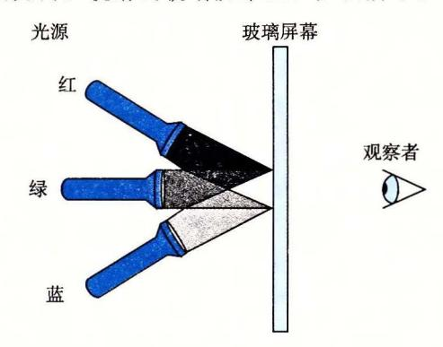

那么基于光源 (红)、 (绿)、 (蓝)的关闭 (0) 或打开 (1) ,我们就能够创建 种不同的颜色:

| R | G | B | 颜色  | R | G | B | 颜色  |
|---|---|---|-----|---|---|---|-----|
|   |   |   | 黑色  | I |   |   | 红色  |
|   |   | 1 | 蓝色  | I |   | I | 红紫色 |
|   | I |   | 绿色  | I | I |   | 黄色  |
|   | 1 | I | 蓝绿色 | I | I | I | 白色  |

这些颜色中的每一种都能用一个长度为 的位向量来表示,我们可以对它们进行布尔运算。

A. 一种颜色的补是通过关掉打开的光源,且打开关闭的光源而形成的。那么上面列 出的 种颜色每一种的补是什么?

B. 描述下列颜色应用布尔运算的结果:

蓝色 l 绿色 黄色 & 蓝绿色 红色 红紫色

#### 2. 1. 7 语言中的位级运算

语言的一个很有用的特性就是它支持按位布尔运算。事实上,我们在布尔运算中使 用的那些符号就是 语言所使用的: 就是 OR (或),&就是 AND (与),~就是 NOT (取 反),而^就是 EXCLUSIVE-OR (异或)。这些运算能运用到任何"整型"的数据类型上, 包括图 所示内容。以下是一些对 char 数据类型表达式求值的例子:

| 的表达式                                   | 二进制表达式                  | 二进制结果        | 十六进制结果 |
|----------------------------------------|-------------------------|--------------|--------|
| ~Ox41                                  | ~ [0100 0001]           | (1011 II IO] | OxBE   |
| ~OxOO                                  | ~ [0000 0000]           | [11111111)   | OxFF   |
| Ox69&0x55                              | [0110 !00!]&[0101 0101] | [0100 0001]  | Ox41   |
| [0110 1001J I [0101 0101]<br>Ox6910x55 |                         | (0111 1101)  | Ox7D   |

正如示例说明的那样,确定一个位级表达式的结果最好的方法,就是将十六进制的参 数扩展成二进制表示并执行二进制运算,然后再转换回十六进制。

禁习题 2.10 对于任一位向量 a,有 a ~ a = 0。应用这一属性,考虑下面的程序:

```
void inplace_swap(int *x, int *y) {

*y = *x ^ *y; /* Step 1 */

*x = *x ^ *y; /* Step 2 */

*y = *x ^ *y; /* Step 3 */

}
```

正如程序名字所暗示的那样,我们认为这个过程的效果是交换指针变量 x 和 y 所指向的存储位置处存放的值。注意,与通常的交换两个数值的技术不一样,当移动一个值时,我们不需要第三个位置来临时存储另一个值。这种交换方式并没有性能上的优势,它仅仅是一个智力游戏。

以指针 x 和 y 指向的位置存储的值分别是 a 和 b 作为开始,填写下表,给出在程序的每一步之后,存储在这两个位置中的值。利用 x 的属性证明达到了所希望的效果。回想一下,每个元素就是它自身的加法逆元 (a x = 0)。

| 步骤  | *x | * y |
|-----|----|-----|
| 初始  | а  | b   |
| 第1步 |    |     |
| 第2步 |    |     |
| 第3步 |    |     |

※ 练习题 2.11 在练习题 2.10 中的 inplace\_swap 函数的基础上,你决定写一段代码,实现将一个数组中的元素头尾两端依次对调。你写出下面这个函数:

```
void reverse_array(int a[], int cnt) {\nint first, last;
for (first = 0, last = cnt-1;
first <= last;
first++,last--)\ninplace_swap(&a[first], &a[last]);
}</pre>
```

当你对一个包含元素 1、2、3 和 4 的数组使用这个函数时,正如预期的那样,现在数组的元素变成了 4、3、2 和 1。不过,当你对一个包含元素 1、2、3、4 和 5 的数组使用这个函数时,你会很惊奇地看到得到数字的元素为 5、4、0、2 和 1。实际上,你会发现这段代码对所有偶数长度的数组都能正确地工作,但是当数组的长度为奇数时,它就会把中间的元素设置成 0。

- A. 对于一个长度为奇数的数组,长度 cnt=2k+1,函数  $reverse\_array$  最后一次循环中,变量 first 和 last 的值分别是什么?
- B. 为什么这时调用函数 inplace swap 会将数组元素设置为 0?
- C. 对 reverse array 的代码做哪些简单改动就能消除这个问题?

位级运算的一个常见用法就是实现掩码运算,这里掩码是一个位模式,表示从一个字中选出的位的集合。让我们来看一个例子,掩码  $0 \times FF$  (最低的 8 位为 1)表示一个字的低位字节。位级运算  $x \& 0 \times FF$  生成一个由 x 的最低有效字节组成的值,而其他的字节就被置为 0。比如,对于  $x = 0 \times 89 \text{ABCDEF}$ ,其表达式将得到  $0 \times 0000000 \text{EF}$ 。表达式~0 将生成一个全 1 的掩码,不管机器的字大小是多少。尽管对于一个 32 位机器来说,同样的掩码可以写成  $0 \times FFFFFFFFF$ ,但是这样的代码不是可移植的。

- **经 练习题** 2.12 对于下面的值,写出变量  $\times$  的  $\mathbb{C}$  语言表达式。你的代码应该对任何字长  $w \ge 8$  都能工作。我们给出了当  $\times = 0 \times 87654321$  以及 w = 32 时表达式求值的结果,仅供参考。
  - A. x 的最低有效字节, 其他位均置为 0。[0x0000021]。
  - B. 除了x的最低有效字节外,其他的位都取补,最低有效字节保持不变。[0x789ABC21]。
  - C. x 的最低有效字节设置成全 1, 其他字节都保持不变。 [0x876543FF]。
- 禁习题 2.13 从 20 世纪 70 年代末到 80 年代末, Digital Equipment 的 VAX 计算机是一种非常流行的机型。它没有布尔运算 AND和 OR 指令,只有 bis(位设置)和bic(位清除)这两种指令。两种指令的输入都是一个数据字 x 和一个掩码字 m。它们生成一个结果 z, z 是由根据掩码 m 的位来修改 x 的位得到的。使用 bis 指令,这种修改就是在 m 为 1 的每个位置上,将 z 对应的位设置为 1。使用 bic 指令,这种修改就是在 m 为 1 的每个位置,将 z 对应的位设置为 0。

为了看清楚这些运算与C语言位级运算的关系,假设我们有两个函数 bis 和 bic 来实现位设置和位清除操作。只想用这两个函数,而不使用任何其他C语言运算,来实现按位 | 和本运算。填写下列代码中缺失的代码。提示:写出 bis 和 bic 运算的C语言表达式。

```
/* Declarations of functions implementing operations bis and bic */\nint bis(int x, int m);\nint bic(int x, int m);

/* Compute x|y using only calls to functions bis and bic */\nint bool_or(int x, int y) {
    int result = _____;
    return result;
}

/* Compute x^y using only calls to functions bis and bic */\nint bool_xor(int x, int y) {
    int result = ____;
    return result;
}
```

#### 2.1.8 C语言中的逻辑运算

C语言还提供了一组逻辑运算符 || 、 & & 和!,分别对应于命题逻辑中的 OR、AND 和 NOT 运算。逻辑运算很容易和位级运算相混淆,但是它们的功能是完全不同的。逻辑运算认为所有非零的参数都表示 TRUE,而参数 0表示 FALSE。它们返回 1或者 0,分别表示结果为 TRUE或者为 FALSE。以下是一些表达式求值的示例。

| 表达式        | 结果   |  |
|------------|------|--|
| !0x41      | 0x00 |  |
| !0x00      | 0x01 |  |
| !!0x41     | 0x01 |  |
| 0x69&&0x55 | 0×01 |  |
| 0x69  0x55 | 0x01 |  |

可以观察到,按位运算只有在特殊情况下,也就是参数被限制为0或者1时,才和与

其对应的逻辑运算有相同的行为

逻辑运算符&&和 II 与它们对应的位级运算&和 之间第二个重要的区别是,如果对 第一个参数求值就能确定表达式的结果,那么逻辑运算符就不会对第二个参数求值。因此, 例如,表达式 a&&S/a 将不会造成被零除,而表达式 p&&\*p+叫 不会导致间接引用空指针。

练习题 14 假设 的字节值分别为 Ox66 Ox39 。填写下表,指明各个 表达 式的字节值。

| 表达式        | 表达式        |  |
|------------|------------|--|
| & y<br>X   | && y<br>X  |  |
| I y<br>X   | X II y     |  |
| ~x I ~y    | !xii !y    |  |
| & ! y<br>X | && ~y<br>X |  |

练习题 15 只使用位级和逻辑运算,编写一个 表达式,它等价千 x==y 。换句话 说,当 相等时它将返回 1, 否则就返回

# 2. 1. 9 语言中的移位运算

语言还提供了一组移位运算,向左或者向右移动位模式。对千一个位表示为 [xw 1, 五- 2' …, 。]的操作数 x, 表达式 x<<k 会生成一个值,其位表示为 [Xw-k 1, Xw-k-2, …, Xo , 0, …, 0] 。也就是说, 向左移动 位,丢弃最高的 位,并在右端补 。移位 量应该是一个 O~w 之间的值。移位运算是从左至右可结合的,所以 x<<j<<k 等价千 (x«j) «k

个相应的右移运算 x>>k, 但是它的行为有点微妙 。一 般而言,机器支持两种形 式的右移:逻辑右移和算术右移 逻辑右移在左端补 o, 得到的结果是 [O, ,o, 1' ,Xk] 。算术右移是在左端补 个最高有效位的值,得到的结果是[x 1' …, xw-l ,立- 2' ,Xk] 。这种做法看上去可能有点奇特,但是我们会发现它对有符 号整数数据的运算非常有用。

让我们来看一个例子,下面的表给出了对一个 位参数 的两个不同的值做不同的移 位操作得到的结果:

| 操作             |                          |
|----------------|--------------------------|
| 参数             | [01100011)<br>[10010101) |
| X << 4         | [00110000]<br>[01010000] |
| X >><br>(逻辑右移) | [00000110]<br>[00001001] |
| X >><br>(算术右移) | [00000110]<br>[11111001] |

斜体的数字表示的是最右端(左移)或最左端(右移)填充的值。可以看到除了一个条目 之外,其他的都包含填充 唯一的例外是算术右移 [10010101] 的情况。因为操作数的最 高位是 1, 填充的值就是

语言标准并没有明确定义对千有符号数应该使用哪种类型的右移——算术右移或者逻辑 右移都可以 不幸地,这就意味着任何假设一种或者另一种右移形式的代码都可能会遇到可移 植性问题 然而,实际上,几乎所有的编译器 机器组合都对有符号数使用算术右移,且许多 程序员也都假设机器会使用这种右移。另一方面,对于无符号数,右移必须是逻辑的。

与 C 相比,J ava 对于如何进行右移有明确的定义。表达是 x>>k 会将 x 算术右移 k 个位置,而 x>>>k 会对 x 做逻辑右移。

#### 旁注 移动 k 位, 这里 k 很大

对于一个由w位组成的数据类型,如果要移动 $k \ge w$ 位会得到什么结果呢?例如,计算下面的表达式会得到什么结果,假设数据类型 int 为w=32:

int lval = OxFEDCBA98 << 32;\nint aval = OxFEDCBA98 >> 36;\nunsigned uval = OxFEDCBA98u >> 40;

C语言标准很小心地规避了说明在这种情况下该如何做。在许多机器上,当移动一个w位的值时,移位指令只考虑位移量的低  $\log_2 w$  位,因此实际上位移量就是通过计算 k mod w 得到的。例如,当 w=32 时,上面三个移位运算分别是移动 0、4 和 8 位,得到结果:

lval 0xFEDCBA98 aval 0xFFEDCBA9 uval 0x00FEDCBA

不过这种行为对于C程序来说是没有保证的,所以应该保持位移量小于待移位值的位数。 另一方面,Java 特别要求位移数量应该按照我们前面所讲的求模的方法来计算。

#### 旁注 与移位运算有关的操作符优先级问题

常常有人会写这样的表达式 1<<2+3<<4,本意是 (1<<2)+(3<<4)。但是在 C 语言中,前面的表达式等价于 1<<(2+3)<<4,这是由于加法(和减法)的优先级比移位运算要高。然后,按照从左至右结合性规则,括号应该是这样打的 (1<<(2+3))<<4,得到的结果是 512,而不是期望的 52。

在 C 表达式中搞错优先级是一种常见的程序错误原因,而且常常很难检查出来。所以当你拿不准的时候,请加上括号!

○ 练习题 2.16 填写下表,展示不同移位运算对单字节数的影响。思考移位运算的最好方式是使用二进制表示。将最初的值转换为二进制,执行移位运算,然后再转换回十六进制。每个答案都应该是8个二进制数字或者2个十六进制数字。

| Х    | ζ   | x<  | <3   | x>>2 ( | 逻辑的) | x>>2 ( | 算术的) |
|------|-----|-----|------|--------|------|--------|------|
| 十六进制 | 二进制 | 二进制 | 十六进制 | 二进制    | 十六进制 | 二进制    | 十六进制 |
| 0xC3 |     |     |      |        |      |        |      |
| 0x75 |     |     |      |        |      |        |      |
| 0x87 |     |     |      |        |      |        |      |
| 0x66 |     |     |      |        |      |        |      |

# 2.2 整数表示

在本节中,我们描述用位来编码整数的两种不同的方式:一种只能表示非负数,而另一种能够表示负数、零和正数。后面我们将会看到它们在数学属性和机器级实现方面密切相关。我们还会研究扩展或者收缩一个已编码整数以适应不同长度表示的效果。

图 2-8 列出了我们引入的数学术语,用于精确定义和描述计算机如何编码和操作整数。这些术语将在描述的过程中介绍,图在此处列出作为参考。

| 符号        | 类型 | 含义        |
|-----------|----|-----------|
| B2Tw      | 函数 | 进制转补码     |
| B2U.,     | 函数 | 二进制转尤符号数  |
| U2Bw      | 函数 | 无符号数转二进制  |
| V2Tw      | 函数 | 无符号转补码    |
| T2B w     | 函数 | 补码转<br>进制 |
| T2Uw      | 函数 | 补码转无符号数   |
| TMin      | 常数 | 最小补码值     |
| TMax "'   | 常数 | 最大补码值     |
| UMax w    | 常数 | 最大无符号数    |
| t<br>+ "  | 操作 | 补码加法      |
| u<br>+ Ul | 操作 | 无符号数加法    |
| * w t     | 操作 | 补码乘法      |
| * w u     | 操作 | 无符号数乘法    |
| t<br>U}   | 操作 | 补码取反      |
| u<br>w    | 操作 | 无符号数取反    |

2-8 整数的数据与算术操作术语 下标 表示数据表示中的位数

# 2. 2. 1 整型数据类型

语言支持多种整型数据类型 表示有限范围的整数。这些类型如图 2-9 和图 2-10 所示,其中还给出了"典型 "32 位和 <sup>64</sup> 位机器的取值范围。每种类型都能用关键字来指 定大小,这些关键字包括 char short long, 同时还可以指示被表示的数字是非负数 (声明为 unsigned) ,或者可能是负数(默认)。如图 2-3 所示,为这些不同的大小分配的 字节数根据程序编译为 <sup>32</sup> 位还是 <sup>64</sup> 位而有所不同。根据字节分配,不同的大小所能表示 的值的范围是不同的 这里给出来的唯一一个与机器相关的取值范围是大小指示符 long 的。大多数 <sup>64</sup> 位机器使用 个字节的表示,比 <sup>32</sup> 位机器上使用的 个字节的表示的取值 范围大很多。

| 数据类型               | 最小值                        | 最大值                        |
|--------------------|----------------------------|----------------------------|
| [signed<br>) cha r | -128                       | 127                        |
| unsign<br>ed char  |                            | 255                        |
| s hort             | -32 768                    | 32 767                     |
| unsign<br>ed<br>ho |                            | 65 535                     |
| in                 | -2 147 483 648             | 2 147 483 647              |
| unsi<br>gned       |                            | 4 294 967 295              |
| long               | -2 147 483 648             | 2 147 483 647              |
| unsigned long      |                            | 4 294 967 295              |
| in<br>32 —七        | -2 147 483 648             | 2 147 483 647              |
| ui<br>t32 _七       |                            | 4 294 967 295              |
| i n t64_t          | -9 223 372 036 854 775 808 | 9 223 372 036 854 775 807  |
| uin<br>64_t        |                            | 18 446 744 073 709 551 615 |

<sup>32</sup> 位程序上 语言整型数据类型的典型取值范围

| 数据类型          | 最小值                        | 最大值                        |
|---------------|----------------------------|----------------------------|
| [signed]char  | -128                       | 127                        |
| unsigned char |                            | 255                        |
| shor          | -32 768                    | 32 767                     |
| unsigned shor |                            | 65 535                     |
| int           | -2 147 483 648             | 2 147 483 647              |
| unsigned      |                            | 4 294 967 295              |
| long          | 223 372 036 854 775 808    | 9 223 372 036 854 775 807  |
| unsigned long |                            | 18 446 744 073 709 551 615 |
| int32_t       | -2 147 483 648             | 2 147 483 647              |
| uin<br>32_t   |                            | 4 294 967 295              |
| in<br>64_t    | -9 223 372 036 854 775 808 | 9 223 372 036 854 775 807  |
| uin<br>64_t   |                            | 18 446 744 073 709 551 615 |

<sup>10</sup> <sup>64</sup> 位程序上 语言整型数据类型的典型取值范围

2-9 和图 2-10 中一个很值得注意的特点是取值范围不是对称的 负数的范围比整 数的范围大 。当我们考虑如何表示负数的时候,会看到为什么会这样。

语言标准定义了每种数据类型必须能够表示的最小的取值范围。如图 <sup>11</sup> 所示,它 们的取值范围与图 2-9 和图 2-10 所示的典型实现一样或者小一些。特别地,除了固定大小 的数据类型是例外,我们看到它们只要求正数和负数的取值范围是对称的。此外,数据类 int 可以用 个字节的数字来实现,而这几乎回退到了 <sup>16</sup> 位机器的时代。还可以看到, long 的大小可以用 个字节的数字来实现,对 <sup>32</sup> 位程序来说这是很典型的。固定大小的数 据类型保证数值的范围与图 2-9 给出的典型数值一致,包括负数与正数的不对称性。

| 数据类型          | 最小值                        | 最大值                        |
|---------------|----------------------------|----------------------------|
| [signed]char  | -127                       | 127                        |
| unsigned char |                            | 255                        |
| shor          | -32 767                    | 32 767                     |
| unsigned shor |                            | 65 535                     |
| int           | -32 767                    | 32 767                     |
| unsigned      |                            | 65 535                     |
| long          | -2 147 483 647             | 2 147 483 647              |
| unsigned long |                            | 4 294 967 295              |
| in<br>32_t    | -2 147 483 648             | 2 147 483 647              |
| uint32_t      |                            | 4 294 967 295              |
| int64_t       | -9 223 372 036 854 775 808 | 9 223 372 036 854 775 807  |
| uin<br>64_t   |                            | 18 446 744 073 709 551 615 |

2- 语言的整型数据类型的保证的取值范围。 语言标准要求 这些数据类型必须至少具有这样的取值范围

# 田电心团心 C+ +和 Java 中的有符号和无符号数

+都支持有 (默 和无 数。 ava 只支持有 数。

#### 2. 2. 2 无符号数的编码

假设有一个整数数据类型有 位。我们可以将位向量写成立表示整个向量,或者写 [Xw-1, Xw 2, …, J' 表示向量中的每一位。把 看做一个二进制表示的数,就获得

的无符 表示。在这个编码中,每个位 都取值为 ,后一种取值意味着数值 为数字值的一部分 我们用一个函数 B2 (Binary to Unsigned 的缩写,长度为 w) 来表示:

原理:无符号数编码的定义

对向量 x=[xw-I ,X ]:

$$B2U_w(\vec{x}) \doteq \sum_{i=0}^{w-1} x_i 2^i$$
 (2.1)

在这个等式中,符号"主"表示左边被定义为等千右边。函数 BZU 将一个长度为 串映射到非负整数。举一个示例,图 ll 展示的是下面几种情况下 BZU 给出的从位 向最到整数的映射:

$$B2U_{4}([0001]) = 0 \cdot 2^{3} + 0 \cdot 2^{2} + 0 \cdot 2^{1} + 1 \cdot 2^{0} = 0 + 0 + 0 + 1 = 1$$

$$B2U_{4}([0101]) = 0 \cdot 2^{3} + 1 \cdot 2^{2} + 0 \cdot 2^{1} + 1 \cdot 2^{0} = 0 + 4 + 0 + 1 = 5$$

$$B2U_{4}([1011]) = 1 \cdot 2^{3} + 0 \cdot 2^{2} + 1 \cdot 2^{1} + 1 \cdot 2^{0} = 8 + 0 + 2 + 1 = 11$$

$$B2U_{4}([1111]) = 1 \cdot 2^{3} + 1 \cdot 2^{2} + 1 \cdot 2^{1} + 1 \cdot 2^{0} = 8 + 4 + 2 + 1 = 15$$

$$(2. 2)$$

在图中,我们用长度为 2' 的指向右侧箭头的条表示每个位的位置 。每个位向械对应 的数值就等于所有值为 的位对应的条 23 = 8

的长度之和。

让我们来考虑 位所能表示 的值的范围。最小值是用位向量 [00 0] 表示,也就是整数值 o, 而最大值是 用位向量 [11 1] 表示,也就是整数值 UMax 产区 2'=2 -1 。以 位情况 '= <sup>0</sup> 为例, UMa =B2 ([1111]) = 24 - (1011] 1=15 。因此,函数 B2U 能够被定义 (1111] 沪— 1} 中位 ,数值就会相应加上


为一个映射 2U w : { 0, 1 } w \_. { o, …, 的无符号数示例。当 进制表示

无符号数的二进制表示有一个很重要的属性,也就是每个介于 ~沪— 之间的数都 有唯一一个 位的值编码。例如,十进制值 <sup>11</sup> 作为无符号数,只有一个 位的表示,即 [1011] 我们用数学原理来重点讲述它,先表述原理再解释。

原理:无符号数编码的唯一性

函数 B2U 是一个双射

数学术语双射是指 个函数 有两面:它将数值 映射为数值 y, y=f(工),但它 也可以反向操作,因为对每一个 而言,都有唯一 个数值 使得 位)= 。这可以用反 函数 来表示,在本例中,即工= l(y) 。函数 B2U心将每一个长度为 的位向 都映 射为 ~沪— 之间的一个唯一值;反过来,我们称其为 U2B切(即"无符号数到二进制"), 0~2W-1 之间的每一个整数都可以映射为一个唯一的长度为 的位模式。

#### 2 2 3 补码编码

对千许多应用,我们还希望表示负数值。最常见的有符号数的计算机表示方式就是补 (two's-complement) 形式。在这个定义中,将字的最高有效位解释为负权 (negative weight) 。我们用函数 B2 (Binary to Two's-complement 的缩写,长度为 w) 来表

原理: 补码编码的定义

对向量  $\vec{x} = [x_{w-1}, x_{w-2}, \dots, x_0]$ :

$$B2T_{w}(\vec{x}) \doteq -x_{w-1}2^{w-1} + \sum_{i=0}^{w-2} x_{i}2^{i}$$
 (2.3)

最高有效位  $x_{w-1}$ 也称为符号位,它的"权重"为一 $2^{w-1}$ ,是无符号表示中权重的负数。符号位被设置为 1 时,表示值为负,而当设置为 0 时,值为非负。这里来看一个示例,图 2-13 展示的是下面几种情况下 B2T 给出的从位向量到整数的映射。

$$B2T_{4}([0001]) = -0 \cdot 2^{3} + 0 \cdot 2^{2} + 0 \cdot 2^{1} + 1 \cdot 2^{0} = 0 + 0 + 0 + 1 = 1$$

$$B2T_{4}([0101]) = -0 \cdot 2^{3} + 1 \cdot 2^{2} + 0 \cdot 2^{1} + 1 \cdot 2^{0} = 0 + 4 + 0 + 1 = 5$$

$$B2T_{4}([1011]) = -1 \cdot 2^{3} + 0 \cdot 2^{2} + 1 \cdot 2^{1} + 1 \cdot 2^{0} = -8 + 0 + 2 + 1 = -5$$

$$B2T_{4}([1111]) = -1 \cdot 2^{3} + 1 \cdot 2^{2} + 1 \cdot 2^{1} + 1 \cdot 2^{0} = -8 + 4 + 2 + 1 = -1$$

$$(2.4)$$

在这个图中,我们用向左指的条表示符号位具有负权重。于是,与一个位向量相关联的数值是由可能的向左指的条和向右指的条加起来决定的。

我们可以看到,图 2-12 和图 2-13 中的位模式都是一样的,对等式(2.2) 和等式(2.4)来说也是一样,但是当最 高有效位是1时,数值是不同的,这是 因为在一种情况中,最高有效位的权重 是+8,而在另一种情况中,它的权重 是-8。

让我们来考虑一下 w 位补码 所能表示的值的范围。它能表示的最小值是位向量[10···0](也就是设置这个位为负

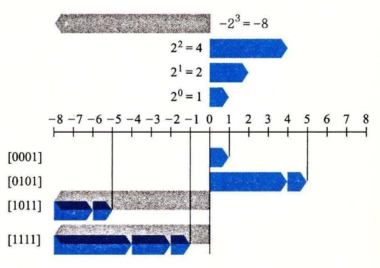

图 2-13 w=4的补码示例。把位 3 作为符号位,因此当它 为 1 时,对数值的影响是 $-2^3=-8$ 。这个权重 在图中用带向左箭头的条表示

权,但是清除其他所有的位),其整数值为  $TMin_w \doteq -2^{w-1}$  。而最大值是位向量[01…1] (清除具有负权的位,而设置其他所有的位),其整数值为  $TMax_w \doteq \sum_{i=0}^{w-2} 2^i = 2^{w-1} - 1$  。以长度为 4 为例,我们有  $TMin_4 = B2T_4$  ([1000]) =  $-2^3 = -8$ ,而  $TMax_4 = B2T_4$  ([0111]) =  $2^2 + 2^1 + 2^0 = 4 + 2 + 1 = 7$  。

我们可以看出  $B2T_w$  是一个从长度为 w 的位模式到  $TMin_w$  和  $TMax_w$  之间数字的映射,写作  $B2T_w$ :  $\{0,1\}^w \to \{TMin_w, \cdots, TMax_w\}$ 。同无符号表示一样,在可表示的取值范围内的每个数字都有一个唯一的 w 位的补码编码。这就导出了与无符号数相似的补码数原理:

原理: 补码编码的唯一性

函数  $B2T_w$  是一个双射。

我们定义函数  $T2B_w$  (即"补码到二进制")作为  $B2T_w$  的反函数。也就是说,对于每个数 x,满足  $TMin_w \le x \le TMax_w$ ,则  $T2B_w(x)$ 是 x 的(唯一的)w 位模式。

○ 练习题 2.17 假设 w=4,我们能给每个可能的十六进制数字赋予一个数值,假设用一个无符号或者补码表示。请根据这些表示,通过写出等式(2.1)和等式(2.3)所示的求和公式中的 2 的非零次幂,填写下表:

| X    |        |             |              |  |
|------|--------|-------------|--------------|--|
| 十六进制 | 二进制    | B2U4仅)      | B2 兀(又)      |  |
| OxE  | (1110) | 23+22+21=14 | -2'+2'+2'=-2 |  |
| OxO  |        |             |              |  |
| OxS  |        |             |              |  |
| OxB  |        |             |              |  |
| OxD  |        |             |              |  |
| OxF  |        |             |              |  |

2-14 展示了针对不同字长,几个重要数字的位模式和数值。前三个给出的是可表 示的整数的范围,用 UMax,, TMin TMa 来表示。在后面的讨论中,我们还会经 常引用到这三个特殊的值。如果可以从上下文中推断出 w, 或者 不是讨论的主要内容 时,我们会省略下标 W, 直接引用 UMax TMin TMax

|       |       |         | 字长             |                             |
|-------|-------|---------|----------------|-----------------------------|
|       | 8     | 16      | 32             | 64                          |
| UMaxw | OxFF  | OxFFFF  | OxFFFFFFFF     | OxFFFFFFFFFFFFFFFF_'        |
|       | 255   | 65 535  | 4 294 967 295  | 18 446 744 073 709 551 615  |
| TM    | Ox80  | Ox8000  | Ox80000000     | Ox8000000000000000          |
|       | - 128 | -32 768 | -2 147 483 648 | - 9 223 372 036 854 775 808 |
| TMaxw | Ox7F  | Ox7FFF  | Ox7FFFFFFF     | Ox7FFFFFFFFFFFFFFF          |
|       | 127   | 32 767  | 2 147 483 647  | 9 223 372 036 854 775 807   |
| -1    | OxFF  | OxFFFF  | OxFFFFFFFF     | OxFFFFFFFFFFFFFFFF          |
|       | OxOO  | OxOOOO  | OxOOOOOOOO     | OxOOOOOOOOOOOOOOOO          |

2- 重要 的数字 。图 中给出了数值和十六进制表示

关千这些数字,有几点值得注意。第一,从图 2-9 和图 2-10 可以看到,补码的范围是 不对称的: TM in I = I TMax I + 1, 也就是说, TMin 没有与之对应的正数。正如我们将 会看到的,这导致了补码运算的某些特殊的属性,并且容易造成程序中细微的错误。之所 以会有这样的不对称性,是因为一半的位模式(符号位设置为 的数)表示负数,而另一半 (符号位设置为 的数)表示非负数。因为 是非负数,也就意味着能表示的整数比负数少 一个 第二,最大的无符号数值刚好比补码的最大值的两倍大一点: UMa w=2TMa工心十 补码表示中所有表示负数的位模式在无符号表示中都变成了正数。图 2-14 也给出了常 的表示。注意一 UMa工有同样的位表示一一一个全 的串 数值 在两种 表示方式中都是全 的串

语言标准并没有要求要用补码形式来表示有符号整数,但是几乎所有的机器都是这 么做的 程序员如果希望代码具有最大可移植性,能够在所有可能的机器上运行,那么除 了图 2-11 所示的那些范围之外,我们不应该假设任何可表示的数值范围,也不应该假设 有符号数会使用何种特殊的表示方式。另一方面,许多程序的书写都假设用补码来表示有 符号数,并且具有图 2-9 和图 <sup>10</sup> 所示的"典型的"取值范围,这些程序也能够在大量的 机器和编译器上移植。 库中的文件<巨 h>定义了一组常量,来限定编译器运行的 这台机器的不同整型数据类型的取值范围。比如,它定义了常量 INT\_MAX INT\_M UINT\_MAX, 它们描述了有符号和无符号整数的范围。对于一个补码的机器,数据类型 int 位,这些常量就对应千 TMa TMinw UMa工的值。

#### 旁注 关于确定大小的整数类型的更多内容

对于某些程序来说,用某个确定大小的表示来编码数据类型非常重要。例如,当编写程序,使得机器能够按照一个标准协议在因特网上通信时,让数据类型与协议指定的数据类型兼容是非常重要的。我们前面看到了,某些C数据类型,特别是long型,在不同的机器上有不同的取值范围,而实际上C语言标准只指定了每种数据类型的最小范围,而不是确定的范围。虽然我们可以选择与大多数机器上的标准表示兼容的数据类型,但是这也不能保证可移植性。

我们已经见过了 32 位和 64 位版本的确定大小的整数类型(图 2-3),它们是一个更大数据类型类的一部分。ISO C99 标准在文件 stdint.h 中引入了这个整数类型类。这个文件定义了一组数据类型,它们的声明形如  $intN_t$  和  $uintN_t$ , 对不同的 N 值指定 N 位有符号和无符号整数。N 的具体值与实现相关,但是大多数编译器允许的值为 8、16、32 和 64。因此,通过将它的类型声明为  $uint16_t$ ,我们可以无歧义地声明一个 16 位无符号变量,而如果声明为 int32 t,就是一个 32 位有符号变量。

这些数据类型对应着一组宏,定义了每个N的值对应的最小和最大值。这些宏名字形如INTN MIN、INTN MAX和UINTN MAX。

确定宽度类型的带格式打印需要使用宏,以与系统相关的方式扩展为格式串。因此,举个例子来说,变量 x 和 y 的类型是 int32\_t 和 uint64\_t,可以通过调用 printf 来打印它们的值,如下所示:

printf("x = %" PRId32 ", y = %" PRIu64 "\n", x, y);

编译为64位程序时,宏 PRId32展开成字符串"d",宏 PRIu64则展开成两个字符串"1""u"。当 C 预处理器遇到仅用空格(或其他空白字符)分隔的一个字符串常量序列时,就把它们串联起来。因此,上面的 printf 调用就变成了:

printf("x = %d, y = %lu\n", x, y);

使用宏能保证:不论代码是如何被编译的,都能生成正确的格式字符串。

产于整数数据类型的取值范围和表示,Java 标准是非常明确的。它要求采用补码表示,取值范围与图 2-10 中 64 位的情况一样。在 Java 中,单字节数据类型称为 byte,而不是 char。这些非常具体的要求都是为了保证无论在什么机器上运行,Java 程序都能表现地完全一样。

# 旁注 有符号数的其他表示方法

有符号数还有两种标准的表示方法:

反码(Ones' Complement): 除了最高有效位的权是 $-(2^{w-1}-1)$ 而不是 $-2^{w-1}$ ,它和补码是一样的:

$$B2O_w(\vec{x}) \doteq -x_{w-1}(2^{w-1}-1) + \sum_{i=0}^{w-2} x_i 2^i$$

原码(Sign-Magnitude): 最高有效位是符号位,用来确定剩下的位应该取负权还是正权:

$$B2S_w(\vec{x}) \doteq (-1)^{x_{w-1}} \cdot \left(\sum_{i=0}^{w-2} x_i 2^i\right)$$

这两种表示方法都有一个奇怪的属性,那就是对于数字 0 有两种不同的编码方式。这两种表示方法,把[00···0]都解释为+0。而值-0 在原码中表示为[10···0],在反码中表示为[11···1]。虽然过去生产过基于反码表示的机器,但是几乎所有的现代机器都使用补码。我们将看到在浮点数中有使用原码编码。

请注意补码(Two's complement)和反码(Ones'complement)中撇号的位置是不同的。术语补码来源于这样一个情况,对于非负数 x,我们用  $2^w-x$ (这里只有一个 2)来计算—x 的 w 位表示。术语反码来源于这样一个属性,我们用[ $111\cdots1$ ]—x(这里有很多个 1)来计算—x 的反码表示。

为了更好地理解补码表示,考虑下面的代码:

```
short x = 12345;
short mx = -x;

show_bytes((byte_pointer) &x, sizeof(short));
show_bytes((byte_pointer) &mx, sizeof(short));
```

当在大端法机器上运行时,这段代码的输出为 30 39 和 cf c7,指明 x 的十六进制表示为 0x3039,而 mx 的十六进制表示为 0xCFC7。将它们展开为二进制,我们得到 x 的位模式为[0011000000111001],而 mx 的位模式为[1100111111000111]。如图 2-15 所示,等式(2.3)对这两个位模式生成的值为 12 345 和一12 345。

| +17     | 12    | 345  | -1 | 2 345   | 53 | 191    |
|---------|-------|------|----|---------|----|--------|
| 权       | 位     | 值    | 位  | 值       | 位  | 值      |
| 1       | 1     | 1    | 1  | 1       | 1  | 1      |
| 2       | 0     | 0    | 1  | 2       | 1  | 2      |
| 4       | 0     | 0    | 1  | 4       | 1  | 4      |
| 8       | 1     | 8    | 0  | 0       | 0  | 0      |
| 16      | 1     | 16   | 0  | 0       | 0  | 0      |
| 32      | 1     | 32   | 0  | 0       | 0  | 0      |
| 64      | 0     | 0    | 1  | 64      | 1  | 64     |
| 128     | 0     | 0    | 1  | 128     | 1  | 128    |
| 256     | 0     | 0    | 1  | 256     | 1  | 256    |
| 512     | 0     | 0    | 1  | 512     | 1  | 512    |
| 1 024   | 0     | 0    | 1  | 1 024   | 1  | 1 024  |
| 2 048   | 0     | 0    | 1  | 2 048   | 1  | 2 048  |
| 4 096   | 1     | 4096 | 0  | 0       | 0  | 0      |
| 8 192   | 1     | 8192 | 0  | 0       | 0  | 0      |
| 16 384  | 0     | 0    | 1  | 16 384  | 1  | 16 384 |
| ±32 768 | 0     | 0    | 1  | -32 768 | 1  | 32 768 |
| 总计      | 12 34 | 15   | -1 | 2 345   | 53 | 191    |

图 2-15 12 345 和-12 345 的补码表示,以及 53 191 的无符号表示。注意后面两个数有相同的位表示

○○ 练习题 2.18 在第3章中,我们将看到由反汇编器生成的列表,反汇编器是一种将可执行程序文件转换回可读性更好的 ASCII 码形式的程序。这些文件包含许多十六进制数字,都是用典型的补码形式来表示这些值。能够认识这些数字并理解它们的意义(例如它们是正数还是负数),是一项重要的技巧。

在下面的列表中,对于标号为  $A\sim I$ (标记在右边)的那些行,将指令名(sub、mov和 add)右边显示的(32 位补码形式表示的)十六进制值转换为等价的十进制值。

```
      4004d0:
      48 81 ec e0 02 00 00
      sub
      $0x2e0,%rsp
      A.

      4004d7:
      48 8b 44 24 a8
      mov
      -0x58(%rsp),%rax
      B.

      4004dc:
      48 03 47 28
      add
      0x28(%rdi),%rax
      C.

      4004e0:
      48 89 44 24 d0
      mov
      %rax,-0x30(%rsp)
      D.
```

```
4004e5: 48 8b 44 24 78
                                        0x78(%rsp),%rax
                                 mov
                                                                   F
4004ea: 48 89 87 88 00 00 00
                                        %rax.0x88(%rdi)
                                                                   F
                                 mov
4004f1: 48 8b 84 24 f8 01 00
                                 mov
                                        0x1f8(%rsp),%rax
                                                                   G.
4004f8:
        00
4004f9: 48 03 44 24 08
                                 add
                                        0x8(%rsp), %rax
4004fe: 48 89 84 24 c0 00 00
                                        %rax.0xc0(%rsp)
                                 mov
                                                                   H .
400505
        00
400506: 48 8b 44 d4 b8
                                 mov
                                        -0x48(%rsp,%rdx,8),%rax
                                                                   T
```

#### 2.2.4 有符号数和无符号数之间的转换

C语言允许在各种不同的数字数据类型之间做强制类型转换。例如,假设变量 x 声明为int, u 声明为int, u 声明为int, u 声明为int, u 声明为int, u 声明为int, u 声明为int, u 的值转换成一个有符号整数。将有符号数强制类型转换成无符号数,或者反过来,会得到什么结果呢?从数学的角度来说,可以想象到几种不同的规则。很明显,对于在两种形式中都能表示的值,我们是想要保持不变的。另一方面,将负数转换成无符号数可能会得到 0。如果转换的无符号数太大以至于超出了补码能够表示的范围,可能会得到 TMax。不过,对于大多数 C 语言的实现来说,对这个问题的回答都是从位级角度来看的,而不是数的角度。

比如说,考虑下面的代码:

```
short int v = -12345;
```

- unsigned short uv = (unsigned short) v;
- printf("v = %d, uv = %u n", v, uv);

在一台采用补码的机器上,上述代码会产生如下输出。

```
v = -12345, uv = 53191
```

我们看到,强制类型转换的结果保持位值不变,只是改变了解释这些位的方式。在图 2-15 中我们看到过,一12 345 的 16 位补码表示与 53 191 的 16 位无符号表示是完全一样的。将 short 强制类型转换为 unsigned short 改变数值,但是不改变位表示。

类似地,考虑下面的代码:

```
unsigned u = 4294967295u; /* UMax */
```

- int tu = (int) u;
- $printf("u = %u, tu = %d\n", u, tu);$

在一台采用补码的机器上,上述代码会产生如下输出:

```
u = 4294967295, tu = -1
```

从图 2-14 我们可以看到,对于 32 位字长来说,无符号形式的 4 294 967 295( $UMax_{32}$ ) 和补码形式的-1 的位模式是完全一样的。将 unsigned 强制类型转换成 int,底层的位表示保持不变。

对于大多数 C 语言的实现,处理同样字长的有符号数和无符号数之间相互转换的一般规则是:数值可能会改变,但是位模式不变。让我们用更数学化的形式来描述这个规则。我们定义函数  $U2B_w$  和  $T2B_w$ ,它们将数值映射为无符号数和补码形式的位表示。也就是说,给定  $0 \le x \le UMax_w$  范围内的一个整数 x,函数  $U2B_w(x)$ 会给出 x 的唯一的 w 位无符号表示。相似地,当 x 满足  $TMin_w \le x \le TMax_w$ ,函数  $T2B_w(x)$ 会给出 x 的唯一的 w 位补码表示。

现在,将函数  $T2U_w$  定义为  $T2U_w(x) = B2U_w(T2B_w(x))$ 。这个函数的输入是一个

 $TMin_w \sim TMax_w$  的数,结果得到一个  $0 \sim UMax_w$  的值,这里两个数有相同的位模式,除了参数是无符号的,而结果是以补码表示的。类似地,对于  $0 \sim UMax_w$  之间的值 x,定义函数  $U2T_w$  为  $U2T_w(x) \doteq B2T_w(U2B_w(x))$ 。生成一个数的无符号表示和 x 的补码表示相同。

继续我们前面的例子,从图 2-15 中,我们看到  $T2U_{16}$  (-12 345) =53 191,并且  $U2T_{16}$  (53 191) =-12 345。也就是说,十六进制表示写作 0xCFC7 的 16 位位模式既是 -12 345的补码表示,又是 53 191 的无符号表示。同时请注意 12 345 +53 191 =65 536  $=2^{16}$ 。这个属性可以推广到给定位模式的两个数值(补码和无符号数)之间的关系。类似地,从图 2-14 我们看到  $T2U_{32}$  (-1) =4 294 967 295,并且  $U2T_{32}$  (4 294 967 295) =-1。也就是说,无符号表示中的 UMax 有着和补码表示的-1 相同的位模式。我们在这两个数之间也能看到这种关系: $1+UMax_w=2^w$ 。

接下来,我们看到函数 U2T 描述了从无符号数到补码的转换,而 T2U 描述的是补码到无符号的转换。这两个函数描述了在大多数 C 语言实现中这两种数据类型之间的强制类型转换效果。

🔯 练习题 2.19 利用你解答练习题 2.17 时填写的表格,填写下列描述函数 T2U4 的表格。

| х  | $T2U_4(x)$ |
|----|------------|
| -8 |            |
| -3 |            |
| -2 |            |
| -1 |            |
| 0  | i i        |
| 5  |            |

通过上述这些例子,我们可以看到给定位模式的补码与无符号数之间的关系可以表示 为函数 *T2U* 的一个属性:

原理:补码转换为无符号数

对满足  $TMin_{w} \leq x \leq TMax_{w}$  的 x 有:

$$T2U_w(x) = \begin{cases} x + 2^w, & x < 0 \\ x, & x \geqslant 0 \end{cases}$$
 (2.5)

比如,我们看到  $T2U_{16}(-12\ 345)=-12\ 345+2^{16}=53\ 191$ ,同时  $T2U_w(-1)=-1+2^w=UMax_w$ 。

该属性可以通过比较公式(2.1)和公式(2.3)推导出来。

推导:补码转换为无符号数

比较等式(2.1)和等式(2.3),我们可以发现对于位模式 $\vec{x}$ ,如果我们计算  $B2U_w(\vec{x})-B2T_w(\vec{x})$ 之差,从 0 到 w-2 的位的加权和将互相抵消掉,剩下一个值。 $B2U_w(\vec{x})-B2T_w(\vec{x})=x_{w-1}(2^{w-1}-(-2^{w-1}))=x_{w-1}2^w$ 。这就得到一个关系: $B2U_w(\vec{x})=x_{w-1}2^w+B2T_w(\vec{x})$ 。我们因此就有

$$B2U_w(T2B_w(x)) = T2U_w(x) = x + x_{w-1}2^w$$
(2.6)

根据公式(2.5)的两种情况,在x的补码表示中,位 $x_{w-1}$ 决定了x是否为负。

比如说,图 2-16 比较了当 w=4 时函数 B2U 和 B2T 是如何将数值变成位模式的。对补码来说,最高有效位是符号位,我们用带向左箭头的条来表示。对于无符号数来说,最高有效位是正权重,我们用带向右的箭头的条来表示。从补码变为无符号数,最高有效位

的权重从-8变为+8。因此,补码表示的负数如果看成无符号数,值会增加  $2^4 = 16$ 。因 而,-5 变成了+11,而-1 变成了+15。

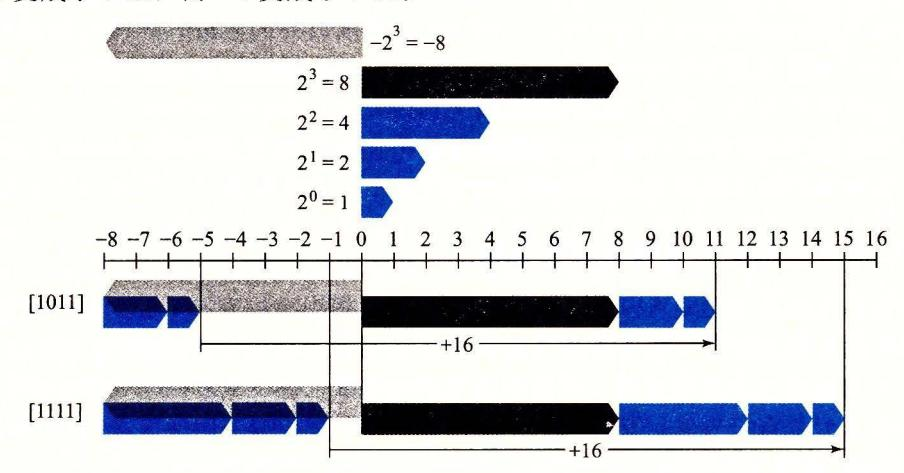

图 2-16 比较当 w=4 时无符号表示和补码表示(对补码和无符号数来说,最高有效位的权重分别是-8 和+8,因而产生-个差为 16)

图 2-17 说明了函数 T2U 的一般行为。如图所示,当将一个有符号数映射为它相应的无符号数时,负数就被转换成了大的正数,而非负数会保持不变。

★ 3题 2.20 请说明等式(2.5)是如何应用到解答练习题 2.19 时生成的表格中的各项的。 反过来看,我们希望推导出一个无符号数 u 和与之对应的有符号数 U2T<sub>w</sub>(u)之间的关系:

原理: 无符号数转换为补码 对满足  $0 \le u \le UMax_u$  的 u 有:

$$U2T_w(u) = \begin{cases} u, & u \leq TMax_w \\ u - 2^w, & u > TMax_w \end{cases}$$
 (2.7)

· 该原理证明如下:

推导: 无符号数转换为补码

设 $\vec{u} = U2B_w(u)$ ,这个位向量也是 $U2T_w(u)$ 的补码表示。公式(2.1)和公式(2.3)结合起来有  $U2T_w(u) = -u_{w-1}2^w + u$  (2.8)

在 u 的无符号表示中,对公式(2.7)的两种情况来说,位  $u_{w-1}$  决定了 u 是否大于  $TMax_{w}=2^{w-1}-1$ 。

图 2-18 说明了函数 U2T 的行为。对于小的数( $\leq TMax_w$ ),从无符号到有符号的转换将保留数字的原值。对于大的数( $>TMax_w$ ),数字将被转换为一个负数值。

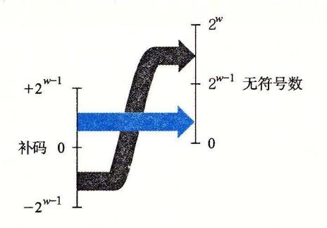

图 2-17 从补码到无符号数的转换。函数 T2U 将负数转换为大的正数

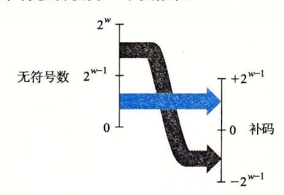

图 2-18 从无符号数到补码的转换。函数 U2T 把大于  $2^{w-1}-1$  的数字转换为负值

总结一下,我们考虑无符号与补码表示之间互相转换的结果。对千在范围 O~x~ TMax 之内的值 而言,我们得到 T2 (x)=x U2 (x) =x 。也就是说,在这个范 围内的数字有相同的无符号和补码表示 对千这个范围以外的数值,转换需要加上或者减 去沪。例如,我们有 T2U l) = -1 +2w=UMax 最靠近 的负数映射为最大的无 符号数。在另一个极端,我们可以看到 T2Uw(TMin =— + 三= -i = TMaxw + 1 最小的负数映射为一个刚好在补码的正数范围之外的无符号数。使用图 2-15 的示 例,我们能看到 T2U1 <sup>12</sup> 345) = 65 563 + —12 345=53 <sup>191</sup>

# 2. 2. 5 语言中的有符号数与无符号数

如图 2-9 和图 2-10 所示, 语言支持所有整型数据类型的有符号和无符号运算 尽管 语言标准没有指定有符号数要采用某种表示,但是儿乎所有的机器都使用补码。通常, 大多数数字都默认为是有符号的。例如,当声明 个像 <sup>12345</sup> 或者 Ox1A2B 这样的常量时, 这个值就被认为是有符号的。要创建一个无符号常量,必须加上后缀字符 'u' 或者 'u', 例如, <sup>123450</sup> 或者 Ox1A2Bu

语言允许无符号数和有符号数之间的转换。虽然 标准没有精确规定应如何进行这 种转换,但大多数系统遵循的原则是底层的位表示保持不变。因此,在 台采用补码的机 器上,当从无符号数转换为有符号数时,效果就是应用函数 U2T 而从有符号数转换为 无符号数时,就是应用函数 T2U 其中 表示数据类型的位数。

显式的强制类型转换就会导致转换发生,就像下面的代码:

```
12345 int tx, ty; 
        unsigned ux, uy; 
        tx = (int) ux; 
        uy = (unsigned) ty;
```

另外,当一种类型的表达式被赋值给另外一种类型的变鼠时,转换是隐式发生的,就 像下面的代码:

```
12345 int tx, ty; 
        unsigned ux, uy; 
        tx = ux; I* Cast to signed *I 
        uy = ty; I* Cast to unsigned *I
```

当用 print£ 输出数值时,分别用指示符% 、% 和% 以有符号十进制、无符号十进制 和十六进制格式输出一个数字。注意 print£ 没有使用任何类型信息,所以它可以用指示 符% 来输出类型为 正的数值,也可以用指示符 输出类型为 unsigned 的数值。例如, 考虑下面的代码:

```
12345 int X = -1; 
        unsigned u = 2147483648; I* 2 to the 31st *I 
        printf("x =%u = %d\n", x, x); 
        printf("u = %u = %d\n", u, u);
```

当在一个 <sup>32</sup> 位机器上运行时,它的输出如下:

```
X = 4294967295 = -1 
u = 2147483648 = -2147483648
```

在这两种情况下, ntf 首先将这个字当作一个无符号数输出,然后把它当作一个有 符号数输出。以下是实际运行中的转换函数: T2U32 (-1) =UMax3z = 232 -1 U2T32 (231)= 沪— <sup>23</sup> = - 231 = TMin32

由于 语言对同时包含有符号和无符号数表达式的这种处理方式,出现了一些奇特的 行为。当执行一个运算时,如果它的一个运算数是有符号的而另一个是无符号的,那么 语言会隐式地将有符号参数强制类型转换为无符号数,并假设这两个数都是非负的,来执 行这个运算。就像我们将要看到的,这种方法对于标准的算术运算来说并无多大差异,但 是对于像<和>这样的关系运算符来说,它会导致非直观的结果。图 2-19 展示了一些关 系表达式的示例以及它们得到的求值结果,这里假设数据类型 int 表示为 <sup>32</sup> 位补码。考 虑比较式- l<OU 。因为第二个运算数是无符号的,第一个运算数就会被隐式地转换为无符 号数,因此表达式就等价于 <sup>42</sup> 94 9672 95U<OU (回想 T2U l)=UMax ,这个答案显然 是错的。其他那些示例也可以通过相似的分析来理解

|             | 达式                      |     |    |
|-------------|-------------------------|-----|----|
|             | ==<br>OU                | 无符号 | 1  |
| -1          | <                       | 有符号 | 1  |
|             | <<br>OU                 | 无符号 | O* |
| 2147483647  | -214748364 7-1<br>>     | 有符号 | 1  |
| 21474836470 | ><br>-2147483647-1      | 无符号 | O* |
| 2147483647  | > (in 七)<br>2147483648U | 有符  | 1* |
|             | -2<br>>                 | 有符号 | 1  |
| (unsigned)  | -2<br>>                 | 无符  | 1  |

2-19 的升级规则的效果

练习题 21 假设在采用补码运算的 <sup>32</sup> 位机器上对这些表达式求值,按照图 2-19 格式填写下表,描述强制类型转换和关系运算的结果

| 表达式                            |  |
|--------------------------------|--|
| -2147483647-1 == 2147483648U   |  |
| -2147483647-1 < 2147483647     |  |
| -2147483647-lU < 2147483647    |  |
| -214 7483647-1 < -214748 3 647 |  |
| -2147483647-lU < -2147483647   |  |

#### 语言中 TMin 的写法

在图 2-19 和练习题 中, 们很小心地将 TM 写成- <sup>748</sup> 7-1 为什么 不简单地写成- <sup>147</sup> <sup>4836</sup> 或者 x8000 <sup>00</sup> 看一下 头文件 imits. h, 注意到它们 用了跟我们写 TM 3z TMax32 类似的方法:

/ \* Minimum and max].mum values a'signed int'can hold. •/ #define INT\_MAX 2147483647 #define INT\_MIN (-INT\_MAX 1)

不幸的是,补码表示的不对称性和 语言的转换规则之间奇怪的交互 迫使我们用

注:非直观的情况标注了`\*' 当一个运算数是无符号的时候 另一个运算数也被隐式强制转换为无符号。 TMin,, 写为-2147483647-1 的原因请参见网络旁注 DATA:TMI

这种不寻常的方式来写 TMin<sub>32</sub>。虽然理解这个问题需要我们钻研 C 语言标准的一些比较隐晦的角落,但是它能够帮助我们充分领会整数数据类型和表示的一些细微之处。

#### 2.2.6 扩展一个数字的位表示

一个常见的运算是在不同字长的整数之间转换,同时又保持数值不变。当然,当目标数据类型太小以至于不能表示想要的值时,这根本就是不可能的。然而,从一个较小的数据类型转换到一个较大的类型,应该总是可能的。

要将一个无符号数转换为一个更大的数据类型,我们只要简单地在表示的开头添加 0。这种运算被称为零扩展(zero extension),表示原理如下:

原理: 无符号数的零扩展

定义宽度为 w 的位向量  $\vec{u} = [u_{w-1}, u_{w-2}, \dots, u_0]$ 和宽度为 w'的位向量  $\vec{u}' = [0, \dots, 0, u_{w-1}, u_{w-2}, \dots, u_0]$ ,其中 w' > w。则  $B2U_w(\vec{u}) = B2U_{w'}(\vec{u}')$ 。

按照公式(2.1),该原理可以看作是直接遵循了无符号数编码的定义。

要将一个补码数字转换为一个更大的数据类型,可以执行一个符号扩展(sign extension),在表示中添加最高有效位的值,表示为如下原理。我们用蓝色标出符号位 $x_{w-1}$ 来突出它在符号扩展中的角色。

原理: 补码数的符号扩展

定义宽度为 w 的位向量  $\vec{x} = [x_{w-1}, x_{w-2}, \dots, x_0]$ 和宽度为 w 的位向量  $\vec{x}' = [x_{w-1}, \dots, x_{w-1}, x_{w-1}, x_{w-2}, \dots, x_0]$ ,其中 w' > w。则  $B2T_w(\vec{x}) = B2T_w(\vec{x}')$ 。

例如,考虑下面的代码:

```
short sx = -12345;
                              /* -12345 */
     unsigned short usx = sx; /* 53191 */
2
                               /* -12345 */
     int x = sx;
                              /* 53191 */
4
     unsigned ux = usx;
5
     printf("sx = %d:\t", sx);
6
7
     show_bytes((byte_pointer) &sx, sizeof(short));
8
     printf("usx = %u:\t", usx);
9
     show_bytes((byte_pointer) &usx, sizeof(unsigned short));
10
     printf("x = %d:\t", x);
     show_bytes((byte_pointer) &x, sizeof(int));
11
12
     printf("ux = %u:\t", ux);
     show_bytes((byte_pointer) &ux, sizeof(unsigned));
13
```

在采用补码表示的 32 位大端法机器上运行这段代码时,打印出如下输出:

```
sx = -12345: cf c7
\nusx = 53191: cf c7

x = -12345: ff ff cf c7
\nux = 53191: 00 00 cf c7
```

我们看到,尽管 $-12\,345$  的补码表示和  $53\,191$  的无符号表示在 16 位字长时是相同的,但是在 32 位字长时却是不同的。特别地, $-12\,345$  的十六进制表示为 0xFFFFCFC7,而  $53\,191$  的十六进制表示为 0x0000CFC7。前者使用的是符号扩展——最开头加了 16 位,都是最高有效位 1,表示为十六进制就是 0xFFFF。后者开头使用 16 个 0 来扩展,表示为十六进制就是 0x0000。

图 2-20 给出了从字长 w=3 到 w=4 的符号扩展的结果。位向量[101]表示值-4+1=

-3。对它应用符号扩展,得到位向量[1101],表示的值-8+4+1=-3。我们可以看到,对于w=4,最高两位的组合值是-8+4=-4,与w=3 时符号位的值相同。类似地,位向量[111]和[1111]都表示值-1。

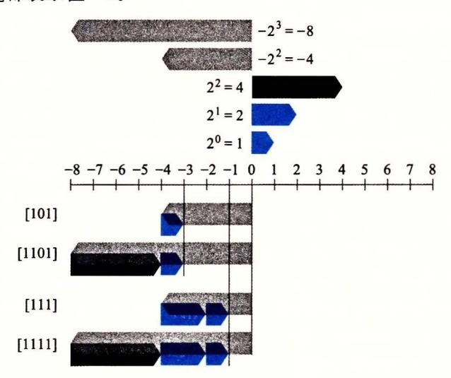

图 2-20 从 w=3 到 w=4 的符号扩展示例。对于 w=4,最高两位组合权重为-8+4=-4,与 w=3 时的符号位的权重一样

有了这个直觉,我们现在可以展示保持补码值的符号扩展。

推导: 补码数值的符号扩展

令 w' = w + k, 我们想要证明的是

$$B2T_{w+k}([\underbrace{x_{w-1}, \cdots, x_{w-1}}_{kx}, x_{w-1}, x_{w-2}, \cdots, x_0]) = B2T_w([x_{w-1}, x_{w-2}, \cdots, x_0])$$

下面的证明是对 k 进行归纳。也就是说,如果我们能够证明符号扩展一位保持了数值不变,那么符号扩展任意位都能保持这种属性。因此,证明的任务就变为了:

$$B2T_{w+1}([x_{w-1},x_{w-1},x_{w-2},\cdots,x_0]) = B2T_w([x_{w-1},x_{w-2},\cdots,x_0])$$

用等式(2.3)展开左边的表达式,得到,

$$B2T_{w+1}([x_{w-1}, x_{w-2}, \dots, x_0]) = -x_{w-1}2^w + \sum_{i=0}^{w-1} x_i 2^i$$

$$= -x_{w-1}2^w + x_{w-1}2^{w-1} + \sum_{i=0}^{w-2} x_i 2^i$$

$$= -x_{w-1}(2^w - 2^{w-1}) + \sum_{i=0}^{w-2} x_i 2^i$$

$$= -x_{w-1}2^{w-1} + \sum_{i=0}^{w-2} x_i 2^i$$

$$= B2T_w([x_{w-1}, x_{w-2}, \dots, x_0])$$

我们使用的关键属性是  $2^w-2^{w-1}=2^{w-1}$ 。因此,加上一个权值为一 $2^w$  的位,和将一个权值为一 $2^{w-1}$ 的位转换为一个权值为  $2^{w-1}$ 的位,这两项运算的综合效果就会保持原始的数值。

🔯 练习题 2.22 通过应用等式(2.3),表明下面每个位向量都是—5的补码表示。

A. [1011]

B. [11011]

# C. [111011]

可以看到第二个和第三个位向量可以通过对第一个位向量做符号扩展得到。

值得一提的是,从一个数据大小到另一个数据大小的转换,以及无符号和有符号数字 之间的转换的相对顺序能够影响一个程序的行为。考虑下面的代码:

```
12345 short sx = -12345; 
     unsigned uy = sx; 
                                I* -12345 *I 
                                I* Mystery! *I 
     printf ("uy = i/,u:\t", uy); 
     show_bytes((byte_pointer) &uy, sizeof(unsigned));
```

在一台大端法机器上,这部分代码产生如下输出:

```
uy = 4294954951: ff ff cf c7
```

这表明当把 short 转换成 unsigned 时,我们先要改变大小,之后再完成从有符号到 无符号的转换。也就是说 (unsigned) sx 等价于 (unsigned) (int) sx, 求值得到 4 294 954 951, 而不等价于 (unsigned) (unsigned short) sx, 后者求值得到 <sup>53</sup> <sup>191</sup> 。事 实上,这个规则是 语言标准要求的。

## 练习题 23 考虑下面的 函数:

```
int fun1(unsigned word) { 
    return (int) ((word « 24) » 24); 
} 
int fun2(unsigned word) { 
    return ((int) word « 24) » 24; 
}
```

假设在一个采用补码运算的机器上以 <sup>32</sup> 位程序来执行这些函数。 的右移是算术右移,而无符号数值的右移是逻辑右移。 还假设有符号数值

A. 填写下表,说明这些函数对几个示例参数的结果。你会发现用十六进制表示来做 会更方便,只要记住十六进制数字 的最高有效位等于

| w          | funl (w) | fun2(w) |
|------------|----------|---------|
| Ox00000076 |          |         |
| Ox87654321 |          |         |
| Ox000000C9 |          |         |
| OxEDCBA987 |          |         |

B. 用语言来描述这些函数执行的有用的计算。

#### 2. 2. 7 截断数字

假设我们不用额外的位来扩展一个数值,而是减少表示一个数字的位数。例如下面代 码中这种情况:

```
123 int X = 53191; 
     short sx = (short) x; 
     int y = sx; 
                              /*一 12345 *I 
                              /*一 12345 *I
```

当我们把 强制类型转换为 sho江时,我们就将 <sup>32</sup> 位的 int 截断为了 <sup>16</sup> 位的 short int

就像前面所看到的,这个 16 位的位模式就是-12 345 的补码表示。当我们把它强制类型转换回 int 时,符号扩展把高 16 位设置为 1,从而生成-12 345 的 32 位补码表示。

当将一个w位的数 $\vec{x} = [x_{w-1}, x_{w-2}, \dots, x_0]$ 截断为一个k位数字时,我们会丢弃高w-k位,得到一个位向量 $\vec{x}' = [x_{k-1}, x_{k-2}, \dots, x_0]$ 。截断一个数字可能会改变它的值——溢出的一种形式。对于一个无符号数,我们可以很容易得出其数值结果。

原理: 截断无符号数

令  $\vec{x}$  等于位向量[ $x_{w-1}$ ,  $x_{w-2}$ , …,  $x_0$ ], 而  $\vec{x}'$  是将其截断为 k 位的结果:  $\vec{x}' = [x_{k-1}, x_{k-2}, \dots, x_0]$ 。令  $x = B2U_m(\vec{x})$ ,  $x' = B2U_k(\vec{x}')$ 。则  $x' = x \mod 2^k$ 。

该原理背后的直觉就是所有被截去的位其权重形式都为  $2^i$ ,其中  $i \ge k$ ,因此,每一个权在取模操作下结果都为零。可用如下推导表示:

推导:截断无符号数

通过对等式(2.1)应用取模运算就可以看到:

$$B2U_{w}([x_{w-1}, x_{w-2}, \dots, x_{0}]) \mod 2^{k} = \left[\sum_{i=0}^{w-1} x_{i} 2^{i}\right] \mod 2^{k}$$

$$= \left[\sum_{i=0}^{k-1} x_{i} 2^{i}\right] \mod 2^{k}$$

$$= \sum_{i=0}^{k-1} x_{i} 2^{i}$$

$$= B2U_{k}([x_{k-1}, x_{k-2}, \dots, x_{0}])$$

在这段推导中, 我们利用了属性: 对于任何  $i \ge k$ ,  $2^i \mod 2^k = 0$ .

补码截断也具有相似的属性,只不过要将最高位转换为符号位:

原理: 截断补码数值

令  $\vec{x}$  等于位向量[ $x_{w-1}$ ,  $x_{w-2}$ , …,  $x_0$ ], 而  $\vec{x}'$  是将其截断为 k 位的结果:  $\vec{x}' = [x_{k-1}$ ,  $x_{k-2}$ , …,  $x_0$ ]。令  $x = B2U_w(\vec{x})$ ,  $x' = B2T_k(\vec{x}')$ 。则  $x' = U2T_k(x \text{ mod } 2^k)$ 。

在这个公式中, $x \mod 2^k$  将是 0 到  $2^k-1$  之间的一个数。对其应用函数  $U2T_k$  产生的效果是把最高有效位  $x_{k-1}$  的权重从  $2^{k-1}$  转变为一 $2^{k-1}$ 。举例来看,将数值 x=53 191 从 int 转换为 short。由于  $2^{16}=65$   $536 \geqslant x$ ,我们有  $x \mod 2^{16}=x$ 。但是,当我们把这个数转换为 16 位的补码时,我们得到 x'=53 191—65 536=-12 345。

推导: 截断补码数值

使用与无符号数截断相同的参数,则有

$$B2U_w([x_{w-1}, x_{w-2}, \dots, x_0]) \mod 2^k = B2U_k[x_{k-1}, x_{k-2}, \dots, x_0]$$

也就是, $x \mod 2^k$ 能够被一个位级表示为[ $x_{k-1}$ ,  $x_{k-2}$ , …,  $x_0$ ]的无符号数表示。将其转换为补码数则有  $x' = U2T_k(x \mod 2^k)$ 。

总而言之, 无符号数的截断结果是:

$$B2U_k[x_{k-1},x_{k-2},\cdots,x_0] = B2U_w([x_{w-1},x_{w-2},\cdots,x_0]) \mod 2^k$$
 (2.9) 而补码数字的截断结果是:

 $B2T_k[x_{k-1},x_{k-2},\cdots,x_0] = U2T_k(B2U_w([x_{w-1},x_{w-2},\cdots,x_0]) \mod 2^k)$  (2.10) 练习题 2.24 假设将一个 4 位数值(用十六进制数字 0~F 表示)截断到一个 3 位数值 (用十六进制数字 0~7 表示)。填写下表,根据那些位模式的无符号和补码解释,说明这种截断对某些情况的结果。

| 十六进制 |     | 无符号 |        | 补码  |     |
|------|-----|-----|--------|-----|-----|
| 原始值  | 截断值 | 原始值 | 截断值    | 原始值 | 截断值 |
| 0    | 0   | 0   |        | 0   |     |
| 2    | 2   | 2   | 1 2211 | 2   |     |
| 9    | 1   | 9   |        | -7  |     |
| В    | 3   | 11  | 1      | -5  |     |
| F    | 7   | 15  |        | -1  |     |

解释如何将等式(2.9)和等式(2.10)应用到这些示例上。

#### 2.2.8 关于有符号数与无符号数的建议

就像我们看到的那样,有符号数到无符号数的隐式强制类型转换导致了某些非直观的 行为。而这些非直观的特性经常导致程序错误,并且这种包含隐式强制类型转换的细微差 别的错误很难被发现。因为这种强制类型转换是在代码中没有明确指示的情况下发生的, 程序员经常忽视了它的影响。

下面两个练习题说明了某些由于隐式强制类型转换和无符号数据类型造成的细微的错误。

※ 第 3 题 2.25 考虑下列代码,这段代码试图计算数组 a 中所有元素的和,其中元素的数量由参数 length 给出。

```
/* WARNING: This is buggy code */
float sum_elements(float a[], unsigned length) {
   int i;
float result = 0;

for (i = 0; i <= length-1; i++)
   result += a[i];
return result;
}</pre>
```

当参数 length 等于 0 时,运行这段代码应该返回 0.0。但实际上,运行时会遇到一个内存错误。请解释为什么会发生这样的情况,并且说明如何修改代码。

★习题 2.26 现在给你一个任务,写一个函数用来判定一个字符串是否比另一个更长。前提是你要用字符串库函数 strlen,它的声明如下:

```
/* Prototype for library function strlen */
size_t strlen(const char *s);
```

最开始你写的函数是这样的:

```
/* Determine whether string s is longer than string t */
/* WARNING: This function is buggy */\nint strlonger(char *s, char *t) {
    return strlen(s) - strlen(t) > 0;
}
```

当你在一些示例数据上测试这个函数时,一切似乎都是正确的。进一步研究发现在头文件 stdio.h 中数据类型 size t 是定义成 unsigned int 的。

- A. 在什么情况下,这个函数会产生不正确的结果?
- B. 解释为什么会出现这样不正确的结果。
- C. 说明如何修改这段代码好让它能可靠地工作。

#### 旁注 函数 getpeername 的安全漏洞

2002年,从事 FreeBSD 开源操作系统项目的程序员意识到,他们对 getpeername 函数的实现存在安全漏洞。代码的简化版本如下:

```
/*
 2
      * Illustration of code vulnerability similar to that found in
 2
      * FreeBSD's implementation of getpeername()
4
    */
5
     /* Declaration of library function memcpy */
6
    void *memcpy(void *dest, void *src, size_t n);
7
8
     /* Kernel memory region holding user-accessible data */
9
10
     #define KSIZE 1024
    char kbuf [KSIZE];
11
12
     /* Copy at most maxlen bytes from kernel region to user buffer */
13
14
     int copy from kernel(void *user_dest. int maxlen) {
         /* Byte count len is minimum of buffer size and maxlen */
15
         int len = KSIZE < maxlen ? KSIZE : maxlen;</pre>
         memcpy(user_dest, kbuf, len);
17
         return len:
18
    }
```

在这段代码里,第7行给出的是库函数 memcpy 的原型,这个函数是要将一段指定长度为 n 的字节从内存的一个区域复制到另一个区域。

从第14行开始的函数 copy\_from\_kernel 是要将一些操作系统内核维护的数据复制到指定的用户可以访问的内存区域。对用户来说,大多数内核维护的数据结构应该是不可读的,因为这些数据结构可能包含其他用户和系统上运行的其他作业的敏感信息,但是显示为 kbuf 的区域是用户可以读的。参数 maxlen 给出的是分配给用户的缓冲区的长度,这个缓冲区是用参数 user\_dest 指示的。然后,第16行的计算确保复制的字节数据不会超出源或者目标缓冲区可用的范围。

不过,假设有些怀有恶意的程序员在调用 copy\_from\_kernel 的代码中对 maxlen 使用了负数值,那么,第 16 行的最小值计算会把这个值赋给 len,然后 len 会作为参数 n被传递给 memcpy。不过,请注意参数 n 是被声明为数据类型 size\_t 的。这个数据类型是在库文件 stdio.h 中(通过 typedef)被声明的。典型地,对 32 位程序它被定义为 unsigned int,对 64 位程序定义为 unsigned long。既然参数 n 是无符号的,那么 memcpy 会把它当作一个非常大的正整数,并且试图将这样多字节的数据从内核区域复制到用户的缓冲区。虽然复制这么多字节(至少 2<sup>31</sup>个)实际上不会完成,因为程序会遇到进程中非法地址的错误,但是程序还是能读到它没有被授权的内核内存区域。

我们可以看到,这个问题是由于数据类型的不匹配造成的:在一个地方,长度参数是有符号数;而另一个地方,它又是无符号数。正如这个例子表明的那样,这样的不匹配会成为缺陷的原因,甚至会导致安全漏洞。幸运的是,还没有案例报告有程序员在FreeBSD上利用了这个漏洞。他们发布了一个安全建议,"FreeBSD-SA-02:38. signederror",建议系统管理员如何应用补丁消除这个漏洞。要修正这个缺陷,只要将 copy\_from\_kernel 的参数 maxlen 声明为类型 size\_t,也就是与 memcpy 的参数 n 一致。同时,我们也应该将本地变量 len 和返回值声明为 size\_t。

我们已经看到了许多无符号运算的细微特性,尤其是有符号数到无符号数的隐式转 换,会导致错误或者漏洞的方式。避免这类错误的 种方法就是绝不使用无符号数。实际 上,除了 以外很少有语言支持无符号整数。很明显,这些语言的设计者认为它们带来的 麻烦要比益处多得多。比如, Java 只支持有符号整数,并且要求以补码运算来实现。正常 的右移运算符>>被定义为执行算术右移。特殊的运算符 >>>被指定为执行逻辑右移

当我们想要把字仅仅看做是位的集合而没有任何数字意义时,无符号数值是非常有用 例如,往一个字中放入描述各种布尔条件的标记 (flag) 时,就是这样。地址自然地就 是无符号的,所以系统程序员发现无符号类型是很有帮助的 。当 实现模运算和多精度运算 的数学包时,数字是由字的数组来表示的,无符号值也会非常有用。

# 2. 3 整数运算

许多刚入门的程序员非常惊奇地发现,两个正数相加会得出一个负数,而比较表达式 x<y和比较表达式 x-y<O 会产生不同的结果。这些属性是由于计算机运算的有限性造成的。 理解计算机运算的细微之处能够帮助程序员编写更可靠的代码

#### 2. 3. 1 无符号加法

考虑两个非负整数 y, 满足 O~x, y<Z 每个数都能表示为 位无符号数字。然而, 如果计算它们的和,我们就有一个可能的范围 O~x+y 1\_2 表示这个和可能需要 w+l 位。例如,图 2-21 展示了当 位表示时,函数 x+y 的坐标图。参数(显示在水平轴 上)取值范围为 0~15, 但是和的取值范围为 0~30 。函数的形状是一个有坡度的平面(在两个维 度上,函数都是线性的)。如果保持和为一个 w+l 位的数字,并且把它加上另外一个数值,我 们可能需要 w+2 个位,以此类推。这种持续的"字长膨胀"意味着,要想完整地表示算术运 算的结果,我们不能对字长做任何限制。一些编程语言,例如 Lisp, 实际上就支持无限精度的 运算,允许任意的(当然,要在机器的内存限制之内)整数运算。更常见的是,编程语言支持固 定精度的运算,因此像"加法"和"乘法"这样的运算不同千它们在整数上的相应运算。

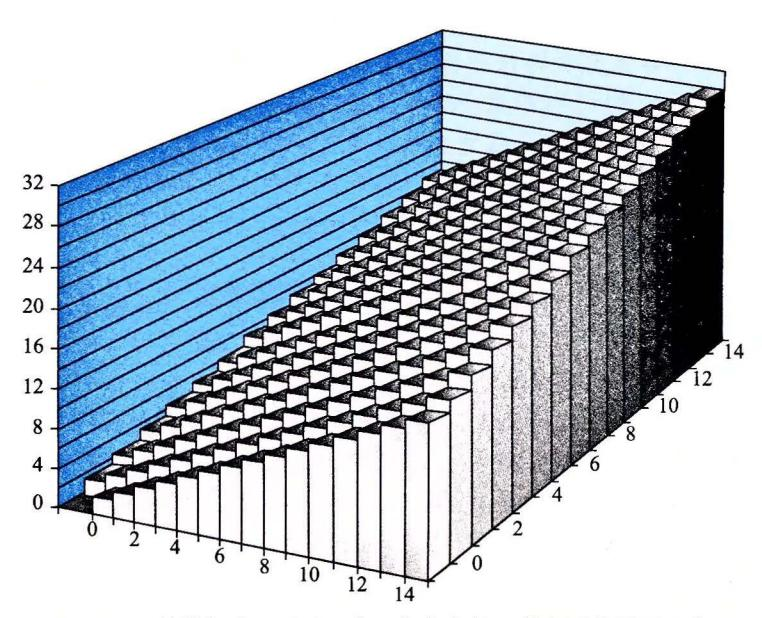

整数加法。对千一个 位的字长,其和可能需要

让我们为参数 x 和 y 定义运算  $+\frac{v}{w}$ ,其中  $0 \le x$ ,  $y < 2^w$ ,该操作是把整数和 x + y 截断 为 w 位得到的结果,再把这个结果看做是一个无符号数。这可以被视为一种形式的模运算,对 x + y 的位级表示,简单丢弃任何权重大于  $2^{w-1}$  的位就可以计算出和模  $2^w$ 。比如,考虑一个 4 位数字表示,x = 9 和 y = 12 的位表示分别为[1001]和[1100]。它们的和是 21,5 位的表示为[10101]。但是如果丢弃最高位,我们就得到[0101],也就是说,十进制值的 5。这就和值  $21 \mod 16 = 5 \longrightarrow 3$ 

我们可以将操作十二描述为:

原理: 无符号数加法

对满足  $0 \le x$ ,  $y < 2^w$  的 x 和 y 有:

$$x + u y = \begin{cases} x + y, & x + y < 2^{w} & \text{E } \\ x + y - 2^{w}, & 2^{w} \leqslant x + y < 2^{w+1} & \text{\text{\text{\text{\text{\text{\text{\text{2}}}}}} \text{\text{\text{\text{\text{2}}}}} \text{\text{\text{\text{\text{2}}}} \text{\text{\text{\text{\text{\text{\text{\text{2}}}}}} \text{\text{\text{\text{\text{\text{\text{\text{2}}}}}} \text{\text{\text{\text{\text{2}}}} \text{\text{\text{\text{\text{\text{\text{2}}}}} \text{\text{\text{\text{\text{\text{2}}}}} \text{\text{\text{\text{2}}}} \text{\text{\text{\text{2}}}} \text{\text{\text{\text{2}}}} \text{\text{\text{\text{2}}}} \text{\text{\text{\text{2}}}} \text{\text{\text{\text{2}}}} \text{\text{\text{\text{2}}}} \text{\text{\text{\text{2}}}} \text{\text{\text{\text{2}}}} \text{\text{\text{\text{2}}}} \text{\text{\text{\text{2}}}} \text{\text{\text{\text{2}}}} \text{\text{\text{2}}} \text{\text{\text{\text{2}}}} \text{\text{\text{\text{2}}}} \text{\text{\text{\text{2}}}} \text{\text{\text{\text{2}}}} \text{\text{\text{\text{2}}}} \text{\text{\text{\text{2}}}} \text{\text{\text{\text{2}}}} \text{\text{\text{\text{2}}}} \text{\text{\text{2}}} \text{\text{\text{2}}} \text{\text{\text{2}}} \text{\text{\text{2}}} \text{\text{\text{2}}} \text{\text{\text{2}}} \text{\text{\text{2}}} \text{\text{\text{2}}} \text{\text{\text{2}}} \text{\text{\text{2}}} \text{\text{\text{2}}} \text{\text{\text{2}}} \text{\text{\text{2}}} \text{\text{\text{2}}} \text{\text{\text{2}}} \text{\text{\text{2}}} \text{\text{\text{2}}} \text{\text{2}}} \text{\text{\text{2}}} \text{\text{\text{2}}} \text{\text{2}} \text{\text{2}} \text{\text{\text{2}}} \text{\text{2}} \text{\text{2}} \text{\text{2}} \text{\text{2}} \text{\text{2}} \text{\text{2}} \text{\text{2}} \text{\text{2}} \text{\text{2}} \text{\text{2}} \text{\text{2}} \text{\text{2}} \text{\text{2}} \text{\text{2}} \text{\text{2}} \text{\text{2}} \text{\text{2}} \text{\text{2}} \text{\text{2}} \text{\text{2}} \text{\text{2}} \text{\text{2}} \text{\text{2}} \text{\text{2}} \text{\text{2}} \text{\text{2}} \text{\text{2}} \text{\text{2}} \text{\text$$

图 2-22 说明了公式(2.11)的这两种情况,左边的和x+y 映射到右边的无符号 w 位的和  $x +_{w}^{u} y$ 。正常情况下 x+y 的值保持不变,而溢出情况则是该和数减去  $2^{w}$  的结果。

#### 推导: 无符号数加法

一般而言,我们可以看到,如果  $x+y<2^w$ ,和的 w+1位表示中的最高位会等于 0,因此丢弃它不会改变这个数值。另一方面,如果  $2^w \le x+y<2^{w+1}$ ,和的 w+1 位表示中的最高位会等于 1,因此丢弃它就相当于从和中减去了  $2^w$ 。

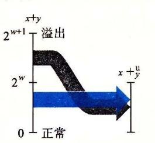

图 2-22 整数加法和无符号加法 间的关系。当 x+y 大于  $2^{w}-1$  时,其和溢出

说一个算术运算溢出,是指完整的整数结果不能放到数据类型的字长限制中去。如等式(2.11)所示,当两个运算数的和为  $2^w$  或者更大时,就发生了溢出。图 2-23 展示了字长 w=4 的无符号加法函数的坐标图。这个和是按模  $2^4=16$  计算的。当 x+y<16 时,没有溢出,并且 x+xy 就是 x+y。这对应于图中标记为"正常"的斜面。当 x+y>16 时,加 法溢出,结果相当于从和中减去 16。这对应于图中标记为"溢出"的斜面。


图 2-23 无符号加法(4位字长,加法是模 16的)

当执行 C 程序时,不会将溢出作为错误而发信号。不过有的时候,我们可能希望判定是否发生了溢出。

原理:检测无符号数加法中的溢出

对在范围  $0 \le x$ ,  $y \le UMax_w$  中的 x 和 y, 令 s = x + wy。则对计算 s, 当且仅当 s < x (或者等价地 s < y)时,发生了溢出。

作为说明,在前面的示例中,我们看到 9+412=5。由于 5<9,我们可以看出发生了溢出。

推导: 检测无符号数加法中的溢出

通过观察发现  $x+y \ge x$ ,因此如果 s 没有溢出,我们能够肯定  $s \ge x$ 。另一方面,如果 s 确实溢出了,我们就有  $s=x+y-2^w$ 。假设  $y<2^w$ ,我们就有  $y-2^w<0$ ,因此  $s=x+(y-2^w)< x$ 。

练习题 2.27 写出一个具有如下原型的函数:

/\* Determine whether arguments can be added without overflow \*/\nint uadd\_ok(unsigned x, unsigned y);

如果参数 x 和 v 相加不会产生溢出,这个函数就返回 1。

模数加法形成了一种数学结构,称为阿贝尔群(Abelian group),这是以丹麦数学家 Niels Henrik Abel(1802~1829)的名字命名。也就说,它是可交换的(这就是为什么叫 "abelian"的地方)和可结合的。它有一个单位元 0,并且每个元素有一个加法逆元。让我们考虑 w 位的无符号数的集合,执行加法运算  $+_{w}^{u}$ 。对于每个值 x,必然有某个值  $-_{w}^{u}x$  满足  $-_{w}^{u}x +_{w}^{u}x = 0$ 。该加法的逆操作可以表述如下:

原理: 无符号数求反

对满足  $0 \le x < 2^w$  的任意 x, 其 w 位的无符号逆元  $-_{w}^{u}x$  由下式给出:

$$-_{w}^{u}x = \begin{cases} x, & x = 0\\ 2^{w} - x, & x > 0 \end{cases}$$
 (2.12)

该结果可以很容易地通过案例分析推导出来:

推导: 无符号数求反

当 x=0 时,加法逆元显然是 0。对于 x>0,考虑值  $2^w-x$ 。我们观察到这个数字在  $0<2^w-x<2^w$  范围之内,并且 $(x+2^w-x)$  mod  $2^w=2^w$  mod  $2^w=0$ 。因此,它就是 x 在  $+_{w}^{u}$ 下的逆元。

○ 练习题 2.28 我们能用一个十六进制数字来表示长度 w=4 的位模式。对于这些数字的无符号解释,使用等式(2.12)填写下表,给出所示数字的无符号加法逆元的位表示(用十六进制形式)。

| x    |     | $-_{4}^{u}x$ |      |  |
|------|-----|-----------------|------|--|
| 十六进制 | 十进制 | 十进制             | 十六进制 |  |
| 0    |     |                 |      |  |
| 5    |     |                 |      |  |
| 8    |     |                 |      |  |
| D    |     |                 |      |  |
| F    |     |                 |      |  |

#### 2.3.2 补码加法

对于补码加法,我们必须确定当结果太大(为正)或者太小(为负)时,应该做些什么。

给定在范围 zw-l~X, y~zw-1 之内的整数值 y, 它们的和就在范围— 2W<x+ Y¾ 沪— 之内,要想准确表示,可能需要 w+l 位。就像以前一样,我们通过将表示截断 位,来避免数据大小的不断扩张。然而,结果却不像模数加法那样在数学上感觉很熟 悉。定义 +切为整数和 被截断为 位的结果,并将这个结果看做是补码数。

原理:补码加法

对满足— zw-l~X, 2w-1 的整数 y, 有:

$$x +_{w}^{t} y = \begin{cases} x + y - 2^{w}, & 2^{w-1} \leqslant x + y < 2^{w} \\ x + y, & -2^{w-1} \leqslant x + y < 2^{w-1} \\ x + y + 2^{w}, & -2^{w} \leqslant x + y < -2^{w-1} \end{cases}$$
 (2.13)

2-24 说明了这个原理,其中,左边的和 x+y 的取值范围为— 2w~x+y~2w 2' 右边显示的是该 和数截断为 位补码的结果。(图中的标号"情况 l" 情况 到"情况 4" 用于该原理形式化推导的案例分析中。) 当和 x+y 超过 TMax切时(情况 4) ,我们说发生了正溢 情况 出。在这种情况下,截断的结果是从和数中减去 2"'0 当和 x+y 小千 TMin亿,时(情况 l) ,我们说发生了负溢 出。在这种情况下,截断的结果是把和数加上 2"'0

两个数的 位补码之和与无符号之和有完全相同 的位级表示。实际上,大多数计算机使用同样的机器 指令来执行无符号或者有符号加法。

#### 推导:补码加法

既然补码加法与无符号数加法有相同的位级表示, 我们就可以按如下步骤表示运算+ :将其参数转换为无 符号数,执行尤符号数加法,再将结果转换为补码:

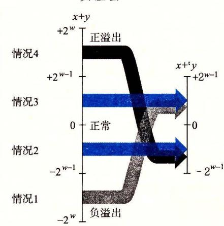

2-24 整数和补码加法之间的关系。 x+y 小于一 2u-1 时,产生 负溢出。当它大千 正]时,产 生正溢出

$$x +_{w}^{t} y \doteq U2T_{w}(T2U_{w}(x) +_{w}^{u} T2U_{w}(y))$$
 (2.14)

根据等式 (2. 6) ,我们可以把 TZUw(x) 写成 Xw 沪+ x, T2Uw(y) 写成 Yw-1 沪+ 使用属性,即十;是模沪的加法,以及模数加法的属性,我们就能得到:

$$x +_{w}^{t} y = U2T_{w}(T2U_{w}(x) +_{w}^{u}T2U_{w}(y))$$

$$= U2T_{w}[(x_{w-1}2^{w} + x + y_{w-1}2^{w} + y) \mod 2^{w}]$$

$$= U2T_{w}[(x + y) \mod 2^{w}]$$

消除了 Xw-1 沪和 Yw 沪这两项,因为它们模沪等于

为了更好地理解这个数量,定义 为整数和 x+y, z' z' mod 切,而 z" z',主 U2 (z') 。数值 z" 等于 +切。我们分成 种情况分析,如图 2-24 所示。

- 1) ::S:;z< 2w 。然后,我们会有 z'=z+Z切。这就得出 O::S:;z'< 2w-1+2w= 2w 。检查等式 (2. 7) ,我们看到 z' 在满足 z"=z' 的范围之内。这种情况称为负溢出 (negative overflow) 。我们将两个负数 相加(这是我们能得到 z<-zw-1 的唯一方式),得 个非负的结果 z"=x +y+
- 2) -zw-1::S:;z<O 。那么,我们又将有 z'=z+Z 气得到— 2w- ]十沪= zw-] ::S:;z'<2 检查等式 (2. 7) ,我们看到 z' 在满足 z"=z' —沪的范围之内,因此 z"=z' —沪= z+ 沪— 沪= 。也就是说,我们的补码和 z" 等于整数和 x+y
  - 3) O::S:;z<zw 。那么,我们将有 z'=z, 得到 0<z'<2w-1 ,因此 z"=z'=z 。补码和

z" 又等千整数和 x+y

4) 心一 1~z<Z 立。我们又将有 z'=z, 得到 w- l~z' <沪。但是在这个范围内,我们有 z"=z' 2w ,得到 z"=x+y 心。这种情况称为正溢出 (positive overflow) 。我们将正数 相加(这是我们能得到 z~zw-1 的唯一方式),得到一个负数结果 z"=x+y-zw <sup>o</sup>■

2-25 展示了 位补码加法的示例作为说明。每个示例的情况都被标号为对应 于等式 (2. 13) 的推导过程中的情况。注意 =16, 因此负溢出得到的结果比整数和大 16, 而正溢出得到的结果比之小 <sup>16</sup> 。我们包括了运算数和结果的位级表示。可以观察到,能够 通过对运算数执行二进制加法并将结果截断到 位,从而得到结果。

| X      | y      | x+y     | x+     | 情况 |
|--------|--------|---------|--------|----|
| —8     | -5     | -13     | 3      | I  |
| (1000] | [1011] | [10011] | [0011) |    |
| -8     | -8     | -16     |        | I  |
| [1000] | [1000] | [10000] | [0000] |    |
| -8     | 5      | -3      | -3     | 2  |
| [1000] | [0101] | (11101] | (1101] |    |
| 2      | 5      | 7       | 7      | 3  |
| (0010] | [0101] | [00111] | [Olli] |    |
| 5      | 5      | 10      | -6     | 4  |
| [0101] | [0101] | [01010] | [10IO] |    |

2-25 补码加法示例。通过执行运算数的 进制加法并将结果截断到 位, 可以获得 位补码和的位级表示

2-26 阐述了字长 w=4 的补码加法。运算数的范围为— 8~7 之间。当 x+y< 时,补码加法就会负溢出,导致和增加了 <sup>16</sup> 当— 8~x y<8 时,加法就产生 x+y 。当 x+y~8 ,加法就会正溢出,使得和减少了 <sup>16</sup> 这三种情况中的每一种都形成了图中的一 个斜面。

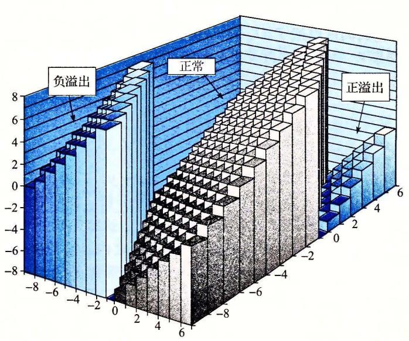

2-26 补码加法(字长为 位的情况下,当 x+y< 时, 产生负溢出;工 ?:c8 时,产生正溢出)