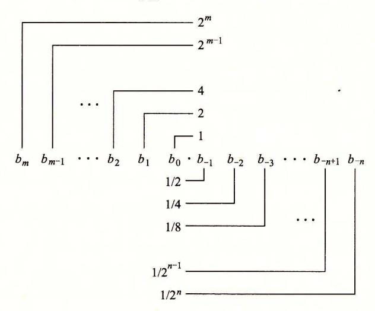
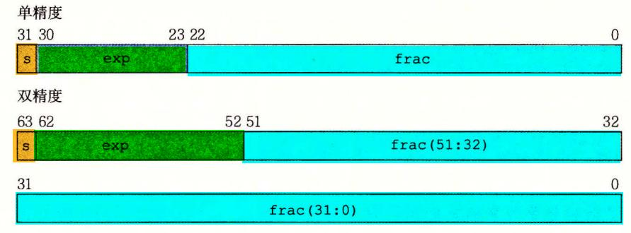
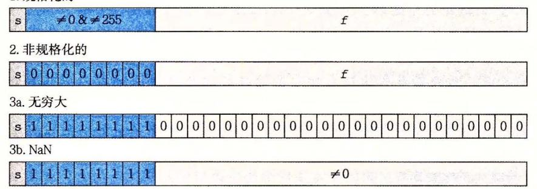
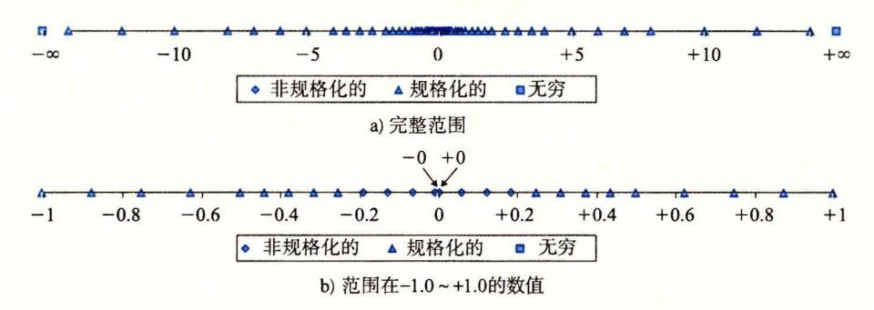
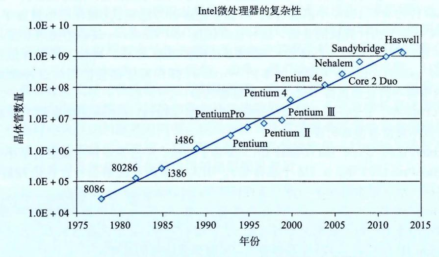

等式(2.13)也让我们认出了哪些情况下会发生溢出:

原理:检测补码加法中的溢出

对满足  $TMin_w \leq x \leq TMax_w$ ,  $TMin_w \leq y \leq TMax_w$  的 x 和 y, 令  $s = x +_{w}^{t} y$ 。当且仅当 x > 0,y > 0,但  $s \leq 0$  时,计算 s 发生了正溢出。当且仅当 x < 0,y < 0,但  $s \geq 0$  时,计算 s 发生了负溢出。

图 2-25 显示了当 w=4 时,这个原理的例子。第一个条目是负溢出的情况,两个负数 相加得到一个正数。最后一个条目是正溢出的情况,两个正数相加得到一个负数。

推导: 检测补码加法中的溢出

让我们先来分析正溢出。如果 x>0,y>0,而  $s\le0$ ,那么显然发生了正溢出。反过来,正溢出的条件为: 1)x>0,y>0(或者  $x+y<TMax_w$ ), $2)s\le0$ (见公式(2.13))。同样的讨论也适用于负溢出情况。

○

| x       | у       | x + y | $x +_{w}^{t} y$ | 情况 |
|---------|---------|-------|--------------------|----|
| [10100] | [10001] |       |                    |    |
| [11000] | [11000] |       |                    |    |
| [10111] | [01000] |       |                    |    |
| [00010] | [00101] |       |                    |    |
| [01100] | [00100] |       |                    |    |

#### ★习题 2.30 写出一个具有如下原型的函数:

/\* Determine whether arguments can be added without overflow \*/\nint tadd\_ok(int x, int y);

如果参数 x 和 v 相加不会产生溢出,这个函数就返回 1。

○ 练习题 2.31 你的同事对你补码加法溢出条件的分析有些不耐烦了,他给出了一个函数 tadd ok 的实现,如下所示:

```
/* Determine whether arguments can be added without overflow */
/* WARNING: This code is buggy. */\nint tadd_ok(int x, int y) {
   int sum = x+y;
   return (sum-x == y) && (sum-y == x);
}
```

你看了代码以后笑了。解释一下为什么。

※ 练习题 2.32 你现在有个任务,编写函数 tsub\_ok 的代码,函数的参数是 x 和 y,如果计算 x-y 不产生溢出,函数就返回 1。假设你写的练习题 2.30 的代码如下所示:

```
/* Determine whether arguments can be subtracted without overflow */
/* WARNING: This code is buggy. */\nint tsub_ok(int x, int y) {
    return tadd_ok(x, -y);
}
```

x和y取什么值时,这个函数会产生错误的结果?写一个该函数的正确版本(家庭作业 2.74)。

#### 2.3.3 补码的非

可以看到范围在  $TMin_w \leq x \leq TMax_w$  中的每个数字 x 都有 $+_{w}^{t}$ 下的加法逆元,我们将 $-_{w}^{t}x$ 表示如下。

原理: 补码的非

对满足  $TMin_{w} \leq x \leq TMax_{w}$  的 x, 其补码的非一 $_{w}x$  由下式给出

$$-_{w}^{t}x = \begin{cases} TMin_{w}, & x = TMin_{w} \\ -x, & x > TMin_{w} \end{cases}$$
 (2.15)

也就是说,对w位的补码加法来说, $TMin_w$ 是自己的加法的逆,而对其他任何数值 x 都有-x 作为其加法的逆。

推导: 补码的非

观察发现  $TMin_w + TMin_w = -2^{w-1} + (-2^{w-1}) = -2^w$ 。这将导致负溢出,因此  $TMin_w + {}^t_w TMin_w = -2^w + 2^w = 0$ 。对满足  $x > TMin_w$  的 x,数值 -x 可以表示为一个 w 位的补码,它们的和 -x + x = 0。

※ 练习题 2.33 我们可以用一个十六进制数字来表示长度 w=4 的位模式。根据这些数字的补码的解释,填写下表,确定所示数字的加法逆元。

| х    |     |     | <sup>t</sup> <sub>4</sub> x |
|------|-----|-----|-----------------------------|
| 十六进制 | 十进制 | 十进制 | 十六进制                        |
| 0    |     |     |                             |
| 5    |     |     |                             |
| 8    |     |     |                             |
| D    |     |     |                             |
| F    |     |     |                             |

对于补码和无符号(练习题 2.28)非(negation)产生的位模式, 你观察到什么?

#### 网络旁注 DATA: TNEG 补码非的位级表示

计算一个位级表示的值的补码非有几种聪明的方法。这些技术很有用(例如当你在调试程序的时候遇到值 0xfffffffa),同时它们也能够让你更了解补码表示的本质。

执行位级补码非的第一种方法是对每一位求补,再对结果加1。在C语言中,我们可以说,对于任意整数值x,计算表达式-x和~x+1得到的结果完全一样。

下面是一些示例,字长为4:

| $\vec{x}$ |    | $-\vec{x}$ incr $(-\vec{x})$ |    |        | $\vec{x}$ ) |
|-----------|----|------------------------------|----|--------|-------------|
| [0101]    | 5  | [1010]                       | -6 | [1011] | -5          |
| [0111]    | 7  | [1000]                       | -8 | [1001] | -7          |
| [1100]    | -4 | [0011]                       | 3  | [0100] | 4           |
| [0000]    | 0  | [1111]                       | -1 | [0000] | 0           |
| [1000]    | -8 | [0111]                       | 7  | [1000] | -8          |

从前面的例子我们知道 0xf 的补是 0x0,而 0xa 的补是 0x5,因而 0xfffffffffa 是 -6 的补码表示。

计算一个数 x 的补码非的第二种方法是建立在将位向量分为两部分的基础之上的。假设 k 是最右边的 1 的位置,因而 x 的位级表示形如  $[x_{w-1}, x_{w-2}, \cdots, x_{k+1}, 1, 0, \cdots, 0]$ 。 (只要  $x \neq 0$  就能够找到这样的 k。)这个值的非写成二进制格式就是  $[\sim x_{w-1}, \sim x_{w-2}, \cdots, \infty]$ 

 $\sim x_{k+1}$ , 1, 0, ..., 0]。也就是, 我们对位 k 左边的所有位取反。

我们用一些4位数字来说明这个方法,这里我们用斜体来突出最右边的模式1,0,…,0:

| x      |    | -x              |    |  |
|--------|----|-----------------|----|--|
| [1100] | -4 | [0100]          | 4  |  |
| [1000] | -8 | [1000]          | -8 |  |
| [0101] | 5  | [101 <i>I</i> ] | -5 |  |
| [0111] | 7  | [1001]          | -7 |  |

#### 2.3.4 无符号乘法

范围在  $0 \le x$ ,  $y \le 2^w - 1$  内的整数 x 和 y 可以被表示为 w 位的无符号数,但是它们的乘积  $x \cdot y$  的取值范围为 0 到 $(2^w - 1)^2 = 2^{2w} - 2^{w+1} + 1$  之间。这可能需要 2w 位来表示。不过,C 语言中的无符号乘法被定义为产生 w 位的值,就是 2w 位的整数乘积的低 w 位表示的值。我们将这个值表示为  $x * \frac{w}{w} y$ 。

将一个无符号数截断为w位等价于计算该值模 $2^w$ ,得到:

原理: 无符号数乘法

对满足  $0 \le x$ ,  $y \le UMax_w$  的 x 和 y 有:

$$x *_{w}^{u} y = (x \cdot y) \operatorname{mod} 2^{w}$$
 (2.16)

#### 2.3.5 补码乘法

范围在 $-2^{w-1} \le x$ , $y \le 2^{w-1} - 1$  内的整数 x 和 y 可以被表示为 w 位的补码数字,但是它们的乘积  $x \cdot y$  的取值范围为 $-2^{w-1} \cdot (2^{w-1} - 1) = -2^{2w-2} + 2^{w-1}$  到 $-2^{w-1} \cdot -2^{w-1} = -2^{2w-2}$ 之间。要想用补码来表示这个乘积,可能需要 2w 位。然而,C 语言中的有符号乘法是通过将 2w 位的乘积截断为 w 位来实现的。我们将这个数值表示为  $x \times w$  。将一个补码数截断为 w 位相当于先计算该值模  $2^w$ ,再把无符号数转换为补码,得到:

原理: 补码乘法

'对满足  $TMin_{w} \leq x$ ,  $y \leq TMax_{w}$  的 x 和 y 有:

$$x *_{w}^{t} y = U2T_{w}((x \cdot y) \operatorname{mod} 2^{w})$$
(2.17)

我们认为对于无符号和补码乘法来说,乘法运算的位级表示都是一样的,并用如下原理说明:

原理: 无符号和补码乘法的位级等价性

给定长度为 w 的位向量  $\vec{x}$  和  $\vec{y}$ ,用补码形式的位向量表示来定义整数 x 和 y:  $x=B2T_w(\vec{x})$ , $y=B2T_w(\vec{y})$ 。用无符号形式的位向量表示来定义非负整数 x' 和 y':  $x'=B2U_w(\vec{x})$ , $y'=B2U_w(\vec{y})$ 。则

$$T2B_w(x * {}_w^t y) = U2B_w(x' * {}_w^u y')$$

作为说明,图 2-27 给出了不同 3 位数字的乘法结果。对于每一对位级运算数,我们执行无符号和补码乘法,得到 6 位的乘积,然后再把这些乘积截断到 3 位。无符号的截断后的乘积总是等于  $x \cdot y \mod 8$ 。虽然无符号和补码两种乘法乘积的 6 位表示不同,但是截断后的乘积的位级表示都相同。

推导: 无符号和补码乘法的位级等价性

根据等式(2.6),我们有  $x' = x + x_{w-1} 2^w$  和  $y' = y + y_{w-1} 2^w$ 。计算这些值的乘积模  $2^w$ 得到以下结果:

$$(x' \cdot y') \mod 2^w = [(x + x_{w-1} 2^w) \cdot (y + y_{w-1} 2^w)] \mod 2^w$$

$$= [x \cdot y + (x_{w-1}y + y_{w-1}x)2^{w} + x_{w-1}y_{w-1}2^{2w}] \mod 2^{w}$$

$$= (x \cdot y) \mod 2^{w}$$
(2.18)

由于模运算符,所有带有权重  $2^w$  和  $2^{2w}$ 的项都丢掉了。根据等式(2.17),我们有  $x *_{w}^{t} y = U2T_w((x \cdot y) \mod 2^w)$ 。对等式两边应用操作  $T2U_w$  有:

 $T2U_w(x *_w^t y) = T2U_w(U2T_w((x \cdot y) \mod 2^w)) = (x \cdot y) \mod 2^w$ 

将上述结果与式(2.16)和式(2.18)结合起来得到  $T2U_w(x *_{w}^{t} y) = (x' * y') \mod 2^w = x' *_{w}^{u} y'$ 。然后对这个等式的两边应用  $U2B_w$ ,得到

$$U2B_w(T2U_w(x*_{w}^{t}y)) = T2B_w(x*_{w}^{t}y) = U2B_w(x'*_{w}^{u}y')$$

| 模式  |    | x     | у  |       | х  | <i>x</i> · <i>y</i> |    | 截断的x·y |  |
|-----|----|-------|----|-------|----|---------------------|----|--------|--|
| 无符号 | 5  | [101] | 3  | [011] | 15 | [001111]            | 7  | [111]  |  |
| 补码  | -3 | [101] | 3  | [011] | -9 | [110111]            | -1 | [111]  |  |
| 无符号 | 4  | [100] | 7  | [111] | 28 | [011100]            | 4  | [100]  |  |
| 补码  | -4 | [100] | -1 | [111] | 4  | [000100]            | -4 | [100]  |  |
| 无符号 | 3  | [011] | 3  | [011] | 9  | [001001]            | 1  | [001]  |  |
| 补码  | 3  | [011] | 3  | [011] | 9  | [001001]            | 1  | [001]  |  |

图 2-27 3 位无符号和补码乘法示例。虽然完整的乘积的位级表示可能会不同, 但是截断后乘积的位级表示是相同的

#### 📉 练习题 2.34 按照图 2-27 的风格填写下表,说明不同的 3 位数字乘法的结果。

| 模式  | x     | у     | x · y | 截断的x·y |
|-----|-------|-------|-------|--------|
| 无符号 | [100] | [101] |       |        |
| 补码  | [100] | [101] |       |        |
| 无符号 | [010] | [111] |       |        |
| 补码  | [010] | [111] |       |        |
| 无符号 | [110] | [110] |       |        |
| 补码  | [110] | [110] |       |        |

※ 练习题 2.35 给你一个任务, 开发函数 tmult\_ok 的代码, 该函数会判断两个参数相乘是否会产生溢出。下面是你的解决方案:

/\* Determine whether arguments can be multiplied without overflow \*/ int tmult\_ok(int x, int y) {

int p = x\*y;

}

/\* Either x is zero, or dividing p by x gives y \*/ return !x || p/x == y;

你用 x 和 y 的很多值来测试这段代码,似乎都工作正常。你的同事挑战你,说:"如果我不能用减法来检验加法是否溢出(参见练习题 2.31),那么你怎么能用除法来检验乘法是否溢出呢?"

按照下面的思路,用数学推导来证明你的方法是对的。首先,证明 x=0 的情况是正确的。另外,考虑 w 位数字  $x(x\neq 0)$ 、y、p 和 q,这里 p 是 x 和 y 补码乘法的结果,而 q 是 p 除以 x 的结果。

1) 说明 x 和 y 的整数乘积  $x \cdot y$ , 可以写成这样的形式:  $x \cdot y = p + t2^w$ , 其中,  $t \neq 0$  当且仅当 p 的计算溢出。

- 2) 说明 p 可以写成这样的形式:  $p=x \cdot q+r$ , 其中|r| < |x|。
- 3) 说明 q=v 当且仅当 r=t=0。
- **◯** 练习题 2.36 对于数据类型 int 为 32 位的情况,设计一个版本的 tmult\_ok 函数(练习题 2.35),使用 64 位精度的数据类型 int64 t,而不使用除法。

#### 旁注 XDR 库中的安全漏洞

2002年,人们发现 Sun Microsystems 公司提供的实现 XDR 库的代码有安全漏洞,XDR 库是一个广泛使用的、程序间共享数据结构的工具,造成这个安全漏洞的原因是程序会在毫无察觉的情况下产生乘法溢出。

包含安全漏洞的代码与下面所示类似:

```
/* Illustration of code vulnerability similar to that found in
 2
      * Sun's XDR library.
 3
      */
 4
     void* copy_elements(void *ele_src[], int ele_cnt, size_t ele_size) {
 5
          * Allocate buffer for ele_cnt objects, each of ele_size bytes
 6
 7
          * and copy from locations designated by ele_src
 8
 9
         void *result = malloc(ele_cnt * ele_size);
10
         if (result == NULL)
             /* malloc failed */
11
12
             return NULL;
         void *next = result;
13
14
         int i;
15
         for (i = 0; i < ele_cnt; i++) {
16
             /* Copy object i to destination */
17
             memcpy(next, ele_src[i], ele_size);
18
             /* Move pointer to next memory region */
19
             next += ele_size;
20
21
         return result;
     }
22
```

函数 copy\_elements 设计用来将 ele\_cnt 个数据结构复制到第 9 行的函数分配的缓冲区中,每个数据结构包含 ele\_size 个字节。需要的字节数是通过计算 ele\_cnt  $\star$  ele size 得到的。

想象一下,一个怀有恶意的程序员在被编译为 32 位的程序中用参数 ele\_cnt 等于 1048 577(2<sup>20</sup>+1)、ele\_size等于 4096(2<sup>12</sup>)来调用这个函数。然后第 9 行上的乘法会溢出,导致只会分配 4096 个字节,而不是装下这些数据所需要的 4 294 971 392 个字节。从第 15 行开始的循环会试图复制所有的字节,超越已分配的缓冲区的界限,因而破坏了其他的数据结构。这会导致程序崩溃或者行为异常。

几乎每个操作系统都使用了这段 Sun 的代码,像 Internet Explorer 和 Kerberos 验证系统这样使用广泛的程序都用到了它。计算机紧急响应组(Computer Emergency Response Team, CERT),由卡内基-梅隆软件工程协会(Carnegie Mellon Software Engineering Institute)运作的一个追踪安全漏洞或失效的组织,发布了建议"CA-2002-25",于是许多公司急忙对它们的代码打补丁。幸运的是,还没有由于这个漏洞引起的安全失效的报告。

库函数 calloc 的实现中存在着类似的漏洞。这些已经被修补过了。遗憾的是,许

多程序员调用分配函数(如 malloc)时,使用算术表达式作为参数,并且不对这些表达式进行溢出检查。编写 calloc 的可靠版本留作一道练习题(家庭作业 2.76)。

禁习题 2.37 现在你有一个任务,当数据类型 int 和 size\_t 都是 32 位的,修补上述旁注给出的 XDR 代码中的漏洞。你决定将待分配字节数设置为数据类型 uint64\_t,来消除乘法溢出的可能性。你把原来对 malloc 函数的调用(第9行)替换如下:

uint64\_t asize =

ele\_cnt \* (uint64\_t) ele\_size;
void \*result = malloc(asize);

提醒一下, malloc 的参数类型是 size t。

A. 这段代码对原始的代码有了哪些改进?

B. 你该如何修改代码来消除这个漏洞?

#### 2.3.6 乘以常数

以往,在大多数机器上,整数乘法指令相当慢,需要 10 个或者更多的时钟周期,然而其他整数运算(例如加法、减法、位级运算和移位)只需要 1 个时钟周期。即使在我们的参考机器 Intel Core i7 Haswell 上,其整数乘法也需要 3 个时钟周期。因此,编译器使用了一项重要的优化,试着用移位和加法运算的组合来代替乘以常数因子的乘法。首先,我们会考虑乘以 2 的幂的情况,然后再概括成乘以任意常数。

原理:乘以2的幂

设 x 为位模式  $[x_{w-1}, x_{w-2}, \dots, x_0]$  表示的无符号整数。那么,对于任何  $k \ge 0$ ,我们都认为  $[x_{w-1}, x_{w-2}, \dots, x_0, 0, \dots, 0]$  给出了  $x2^k$  的 w+k 位的无符号表示,这里右边增加了  $k \land 0$ 。

因此,比如,当w=4时,11可以被表示为[1011]。k=2时将其左移得到6位向量 [101100],即可编码为无符号数11·4=44。

推导:乘以2的幂

这个属性可以通过等式(2.1)推导出来:

$$B2U_{w+k}([x_{w-1}, x_{w-2}, \dots, x_0, 0, \dots, 0]) = \sum_{i=0}^{w-1} x_i 2^{i+k}$$

$$= \left[\sum_{i=0}^{w-1} x_i 2^i\right] \cdot 2^k$$

$$= x2^k$$

当对固定字长左移 k 位时, 其高 k 位被丢弃, 得到

$$[x_{w-k-1}, x_{w-k-2}, \cdots, x_0, 0, \cdots, 0]$$

而执行固定字长的乘法也是这种情况。因此,我们可以看出左移一个数值等价于执行一个与 2 的幂相乘的无符号乘法。

原理: 与2的幂相乘的无符号乘法

C 变量 x 和 k 有无符号数值 x 和 k ,且  $0 \le k < w$  ,则 C 表达式 x << k 产生数值  $x * \frac{v}{u} 2^k$  。由于固定大小的补码算术运算的位级操作与其无符号运算等价,我们就可以对补码运算的 2 的幂的乘法与左移之间的关系进行类似的表述:

原理: 与2的幂相乘的补码乘法

C 变量 x 和 k 有补码值 x 和无符号数值 k, 且 0 ≤ k < w, 则 C 表达式 x<<k 产生数值  $x *_{i} 2^{t}$ 。

注意,无论是无符号运算还是补码运算,乘以 的幕都可能会导致溢出。结果表明, 即使溢出的时候,我们通过移位得到的结果也是一样的 回到前面的例子,我们将 位模 [1011] (数值为 11) 左移两位得到 [101100] (数值为 44) 。将这个值截断为 位得到 [1100] (数值为 12=44 mod 16)

由千整数乘法比移位和加法的代价要大得多,许多 编译器试图以移位、加法和 减法的组合来消除很多整数乘以常数的情况。例如,假设一个程序包含表达式 \* <sup>14</sup> 14=2 十沪十岁,编译器会将乘法重写为 (x«3)+(x<<2)+(x<<l) ,将一个乘法替换为三 个移位和两个加法。无论 是无符号的还是补码,甚至当乘法会导致溢出时,两个计算都 会得到一样的结果 (根据整数运算的属性可以证明这一点 。) 更好的是,编译器还可以利 用属性 14=2 -21 ,将乘法重写为 (x<<4) (x<<l) ,这时只需要两个移位和一个减法。

练习题 38 就像我们将在第 章中看到的那样, LEA 指令能够执行形如 (a<<k)+b 的计算,这里 等于 3' 等于 或者某个程序值。编译器常常用这条 指令来执行常数因子乘法。例如,我们可以用 (a<<l)+a 来计算 3\*a

考虑 等于 或者等于 为任意可能的值的情况,用一条 LEA 指令可以计算 的哪些倍数?

归纳一下我们的例子,考虑一个任务,对于某个常数 的表达式 x\*K 生成代码。编 译器会将 的二进制表示表达为一组 交替的序列:

$$[(0\cdots 0)(1\cdots 1)(0\cdots 0)\cdots (1\cdots 1)]$$

例如, <sup>14</sup> 可以写成 [(O 0)011)(0)] 。考虑一组从位位置 到位位置 的连续的 l(n;?:: m) 。(对千 <sup>14</sup> 来说,我们有 n=3 m=l 。)我们可以用下面两种不同形式中的一种来计算 这些位对乘积的影响:

形式 A: (x«n)+(x«(n-1))+…+( x<<m )

形式 B: (x«(n+ 1)) - (x<<m)

把每个这样连续的 的结果加起来,不用做任何乘法,我们就能计算出 X\* 。当然,选 择使用移位、加法和减法的组合,还是使用一条乘法指令,取决于这些指令的相对速度, 而这些是与机器高度相关的。大多数编译器只在需要少量移位、 加法和减法就足够的时候 才使用这种优化。

练习题 39 对于位位置 为最高有效位的情况,我们要怎样修改形式 的表达式?

练习题 40 对于下面每个 的值,找出只用指定数量的运算表达 \* 的方法, 这里我们认为加法和减法的开销相当。除了我们已经考虑过的简单的形式 则,你可能会需要使用一些技巧。

| K  | 移位 | 加法 /减法 | 表达式 |
|----|----|--------|-----|
| 6  | 2  | I      |     |
| 31 | I  | I      |     |
| -6 | 2  | I      |     |
| 55 | 2  | 2      |     |

练习题 41 对于一组从位位置 开始到位位置 的连续的 l(n~m) ,我们看到可 以产生两种形式的代码, 。编译器该如何决定使用哪一种呢?

#### 2. 3. 7 除以 的幕

在大多数机器上,整数除法要比整数乘法更慢 需要 <sup>30</sup> 个或者更多的时钟周期。

除以 2 的幂也可以用移位运算来实现,只不过我们用的是右移,而不是左移。无符号和补码数分别使用逻辑移位和算术移位来达到目的。

整数除法总是舍入到零。为了准确进行定义,我们要引入一些符号。对于任何实数 a,定义[a]为唯一的整数 a',使得  $a' \le a < a' + 1$ 。例如,[a.14]=3,[-3.14]=-4 而[a]=3。同样,定义[a]为唯一的整数 a',使得  $a'-1 < a \le a'$ 。例如,[a.14]=4,[a.14]=-3,而[a]=a。对于  $x \ge 0$  和  $y \ge 0$ ,结果会是[a],而对于  $a \le 0$  和 a0,结果会是[a0,a1。也就是说,它将向下舍入一个正值,而向上舍入一个负值。

对无符号运算使用移位是非常简单的,部分原因是由于无符号数的右移一定是逻辑右移。

#### 原理: 除以2的幂的无符号除法

C 变量 x 和 k 有无符号数值 x 和 k,且  $0 \le k < w$ ,则 C 表达式 x>>k 产生数值 $\lfloor x/2^k \rfloor$。例如,图 2-28 给出了在 12 340 的 16 位表示上执行逻辑右移的结果,以及对它执行除以 1、2、16 和 256 的结果。从左端移入的 0 以斜体表示。我们还给出了用真正的运算做除法得到的结果。这些示例说明,移位总是舍入到零的结果,这一点与整数除法的规则一样。

| k | >> k (二进制)       | 十进制   | 12340/2 <sup>k</sup> |
|---|------------------|-------|----------------------|
|   |                  |       |                      |
| 0 | 0011000000110100 | 12340 | 12340.0              |
| 1 | 0001100000011010 | 6170  | 6170.0               |
| 4 | 0000001100000011 | 771   | 771.25               |
| 8 | 0000000000110000 | 48    | 48.203125            |

图 2-28 无符号数除以 2 的幂(这个例子说明了执行一个逻辑右移 k 位与 除以 2<sup>k</sup> 再舍人到零有一样的效果)

#### 推导:除以2的幂的无符号除法

设 x 为位模式[ $x_{w-1}$ ,  $x_{w-2}$ , …,  $x_0$ ]表示的无符号整数,而 k 的取值范围为  $0 \le k < w$ 。设 x' 为 w-k 位位表示[ $x_{w-1}$ ,  $x_{w-2}$ , …,  $x_k$ ]的无符号数,而 x'' 为 k 位位表示[ $x_{k-1}$ , …,  $x_0$ ]的无符号数。由此,我们可以看到  $x=2^kx'+x''$ ,而  $0 \le x'' < 2^k$ 。因此,可得[ $x/2^k$ ]=x'。

对位向量 $[x_{w-1}, x_{w-2}, \cdots, x_0]$ 逻辑右移 k 位会得到位向量

$$\begin{bmatrix} 0, \cdots, 0, x_{n-1}, x_{n-2}, \cdots, x_k \end{bmatrix}$$

这个位向量有数值 x', 我们看到,该值可以通过计算 x>>k 得到。

对于除以 2 的幂的补码运算来说,情况要稍微复杂一些。首先,为了保证负数仍然为 负,移位要执行的是算术右移。现在让我们来看看这种右移会产生什么结果。

原理:除以2的幂的补码除法,向下舍入

C 变量 x 和 k 分别有补码值 x 和无符号数值 k,且  $0 \le k < w$ ,则当执行算术移位时, C 表达式 x>>k 产生数值[  $x/2^k$  ]。

对于  $x \ge 0$ ,变量 x 的最高有效位为 0,所以效果与逻辑右移是一样的。因此,对于非负数来说,算术右移 k 位与除以  $2^k$  是一样的。作为一个负数的例子,图 2-29 给出了对一12 340 的 16 位表示进行算术右移不同位数的结果。对于不需要舍入的情况(k=1),结果是  $x/2^k$ 。但是当需要进行舍入时,移位导致结果向下舍入。例如,右移 4 位将会把一771. 25 向下舍入为一772。我们需要调整策略来处理负数 x 的除法。

| k | >>k (二进制)         | 十进制    | —12340/Zk  |
|---|-------------------|--------|------------|
|   | 1100111111001100  | —12340 | -12340.0   |
| I | Jl 10011111100110 | -6170  | -6170.0    |
| 4 | 1111110011111100  | -772   | -771.25    |
| 8 | 1111111111001111  | -49    | —48.203125 |

2-29 进行算术右移(这个例子说明 算术右移类似于除以 的幕, 除了是向下舍入,而不是向零舍入)

# 推导:除以 的幕的补码除法,向下舍入

为位模式 [x -1 ,立- 2' …, ]表示的补码整数,而 的取值范围为 k<w x' [x -1 •五- 2' ,Xk] 表示的补码数,而 :r" 为低 [X …, m] 表示 的无符号数 通过与对无符号情况类似的分析,我们有 :r=2 :r :r ",而 :r"<2k' 得到 x'=L :r 心」 步,可以观察到,算术右移位向量 :r :rw- 2 , …, :r ]k 位,得到位 向量

$$[x_{w-1}, \cdots, x_{w-1}, x_{w-1}, x_{w-2}, \cdots, x_k]$$

它刚好就是将[立- 1, 立- 2' …, Xk] 位符号扩展到 位。因此,这个移位后的位 向量就是 勹的补码表示。 .

我们可以通过在移位之前"偏置 (biasing)" 这个值,来修正这种不合适的舍入

原理:除以 的幕的补码除法,向上舍入

变量 分别有补码值 和无符号数值 k, O~k<w, 则当执行算术移位时, 表达式 (x+ (l«k) —1) »k 产生数值 2k

2-30 说明在执行算术右移之前加上一个适当的偏置量是如何导致结果正确舍入的。 在第 列,我们给出了— <sup>12</sup> <sup>340</sup> 加上偏量值之后的结果,低 位(那些会向右移出的位)以 斜体表示。我们可以看到,低 位左边的位可能会加 1, 也可能不会加 。对于不需要舍 入的情况 (k=l) ,加上偏量只影响那些被移掉的位。对于需要舍入的情况,加上偏量导致 较高的位加 1, 所以结果会向零舍入。

| k | 偏量  | -12 340 +偏扯       | 进制)<br>>>k            | 十进制    | -12340/2k  |
|---|-----|-------------------|-----------------------|--------|------------|
|   |     | 1100111111001100  | 1100111111001100      | -12340 | -12340.0   |
| I | I   | 1100111111001 IOI | 1110011111100110      | —6170  | -6170.0    |
| 4 | 15  | 1100111111011011  | JJJJl lOO! l ll l IOI | -771   | -771.25    |
| 8 | 255 | 1101000011001011  | ll l lll 1111010000   | -48    | -48.203125 |

2-30 补码除以 的幕(右移之前加上一个偏量,结果就向零舍入了)

偏置技术利用如下属性:对千整数 y(y>O)' l=l(x+y 1)/y 」。例如,当 x= <sup>30</sup> y=4, 我们有 x+y 1= 27, 而「- 30/4 l= 7=L <sup>27</sup> x= <sup>32</sup> y=4 时,我们有 x+y-l=-29, 而「— 32/4 l= 8=l <sup>29</sup>

#### 推导:除以 的幕的补码除法,向上舍入

查看「 yl=l(x+y-1) 」,假设 x=qy+r, 其中 O::(r<y, 得到 (x+y 1) y= q+(r+y-1) y, 因此L(x y-1) =q (r 1) r=O 时,后面一项等于 o, 而当 r>O 时,等千 。也就是说,通过给 增加一个偏量 ,然后再将除法向下舍入, 整除 时,我们得到 q, 否则,就得到 q+l

回到  $y=2^k$  的情况,C 表达式 x+(1<< k)-1 得到数值  $x+2^k-1$ 。将这个值算术右移 k位即产生 $\lfloor x/2^k \rfloor$ 。

这个分析表明对于使用算术右移的补码机器, C表达式

(x<0 ? x+(1<< k)-1 : x) >> k

将会计算数值  $x/2^k$ 。

禁习题 2.42 写一个函数 div16,对于整数参数 x 返回 x/16 的值。你的函数不能使用除法、模运算、乘法、任何条件语句(if 或者?:)、任何比较运算符(例如<、>或==)或任何循环。你可以假设数据类型 int 是 32 位长,使用补码表示,而右移是算术右移。

现在我们看到,除以 2 的幂可以通过逻辑或者算术右移来实现。这也正是为什么大多数机器上提供这两种类型的右移。不幸的是,这种方法不能推广到除以任意常数。同乘法不同,我们不能用除以 2 的幂的除法来表示除以任意常数 K 的除法。

★习题 2.43 在下面的代码中,我们省略了常数 M和 N的定义:

```
#define M
```

我们以某个 M 和 N 的值编译这段代码。编译器用我们讨论过的方法优化乘法和除法。下面是将产生出的机器代码翻译回 C 语言的结果:

```
/* Translation of assembly code for arith */\nint optarith(int x, int y) {
   int t = x;
   x <<= 5;
   x -= t;
   if (y < 0) y += 7;
   y >>= 3;   /* Arithmetic shift */
   return x+y;
}
```

M和N的值为多少?

### 2.3.8 关于整数运算的最后思考

正如我们看到的,计算机执行的"整数"运算实际上是一种模运算形式。表示数字的有限字长限制了可能的值的取值范围,结果运算可能溢出。我们还看到,补码表示提供了一种既能表示负数也能表示正数的灵活方法,同时使用了与执行无符号算术相同的位级实现,这些运算包括像加法、减法、乘法,甚至除法,无论运算数是以无符号形式还是以补码形式表示的,都有完全一样或者非常类似的位级行为。

我们看到了C语言中的某些规定可能会产生令人意想不到的结果,而这些结果可能是难以察觉或理解的缺陷的源头。我们特别看到了unsigned数据类型,虽然它概念上很简单,但可能导致即使是资深程序员都意想不到的行为。我们还看到这种数据类型会以出乎意料的方式出现,比如,当书写整数常数和当调用库函数时。

练习题 44 假设我们在对有符号值使用补码运算的 <sup>32</sup> 位机器上运行代码。对于有符号 值使用的是算术右移,而对于无符号值使用的是逻辑右移。变量的声明和初始化如下:

int x = foo (); I\* Arbitrary value \*I int y = bar(); I\* Arbitrary value \*I

unsigned ux = x; unsigned uy = y;

对于下面每个 表达式, 1) 证明对于所有的 值,它都为真(等于 1) ;或者 2) 给出使得它为假(等于 0) 的值:

- A. (x > 0) 11 (x-1 < 0)
- B. (x & 7) ! = 7 11 (x«29 < O)
- C. (x \* x) >= 0
- D. x < 0 I I -x <= 0
- E. x > 0 I I -x >= 0
- F. x+y == uy+ux
- G. x\*-y + uy\*ux == -x

# 2. 4 浮点数

浮点表示对形如 V=xX 护的有理数进行编码。它对执行涉及非常大的数字 CIVI>> 0) 、非常接近千 OCIVl<<l) 的数字,以及更普遍地作为实数运算的近似值的计算,是很 有用的。

直到 <sup>20</sup> 世纪 <sup>80</sup> 年代,每个计算机制造商都设计了自己的表示浮点数的规则,以及对 浮点数执行运算的细节。另外,它们常常不会太多地关注运算的精确性,而把实现的速度 和简便性看得比数字精确性更重要。

·大约在 <sup>1985</sup> 年,这些情况随着 IEEE 标准 <sup>754</sup> 的推出而改变了,这是一个仔细制订的 表示浮点数及其运算的标准。这项工作是从 <sup>1976</sup> 年开始由 Intel 赞助的,与 <sup>8087</sup> 的设计 同时进行, <sup>8087</sup> 是一种为 <sup>8086</sup> 处理器提供浮点支持的芯片。他们请 William Kahan (加州 大学伯克利分校的一位教授)作为顾问,帮助设计未来处理器浮点标准。他们支持 Kahan 加入一个 IEEE 资助的制订工业标准的委员会。这个委员会最终采纳的标准非常接近于 Kahan Intel 设计的标准。目前,实际上所有的计算机都支持这个后来被称为 IEEE 点的标准。这大大提高了科学应用程序在不同机器上的可移植性。

# &IJ IEEE (电气和电子工程师协会)

电气和电子工程师协会 IEEE, 读做 eye- tripl e-ee 是一个包括所有电子和计 技术的专业团体 它出版刊物,举办会议,并且建立委员会来定义标准,内容涉及从电 力传输到软件工程 另一个 IEEE 标准的例子是无线网络的 802. <sup>11</sup> 标准

在本节中,我们将看到 IEEE 浮点格式中数字是如何表示的。我们还将探讨舍入 (rounding) 的问题,即当一个数字不能被准确地表示为这种格式时,就必须向上调整或者 向下调整。然后,我们将探讨加法、乘法和关系运算符的数学属性。许多程序员认为浮点 数没意思,往坏了说,深奥难懂。我们将看到,因为 IEEE 格式是定义在一组小而一致的 原则上的,所以它实际上是相当优雅和容易理解的。

#### 2.4.1 二进制小数

理解浮点数的第一步是考虑含有小数值的二进制数字。首先,让我们来看看更熟悉的十进制表示法。十进制表示法使用如下形式的表示:

$$d_m d_{m-1} \cdots d_1 d_0 \cdot d_{-1} d_{-2} \cdots d_{-n}$$

其中每个十进制数  $d_i$  的取值范围是  $0\sim9$ 。这个表达描述的数值 d 定义如下:

$$d = \sum_{i=-n}^{m} 10^i \times d_i$$

数字权的定义与十进制小数点符号('.')相关,这意味着小数点左边的数字的权是 10 的正幂,得到整数值,而小数点右边的数字的权是 10 的负幂,得到小数值。例如,12.  $34_{10}$ 表示数字  $1\times10^1+2\times10^0+3\times10^{-1}+4\times10^{-2}=12$   $\frac{34}{100}$ 。

类似,考虑一个形如

 $b_m b_{m-1} \cdots b_1 b_0 . b_{-1} b_{-2} \cdots b_{-n-1} b_{-n}$ 的表示法,其中每个二进制数字,或者称为位, $b_i$  的取值范围是 0 和 1,如图 2-31 所示。这种表示方法表示的数 b 定义如下:

$$b = \sum_{i=-r}^{m} 2^i \times b_i \qquad (2.19)$$

符号 '.'现在变为了二进制的点,点 左边的位的权是 2 的正幂,点右边的位 的权是 2 的负幂。例如, $101.11_2$ 表示 数字  $1\times 2^2 + 0\times 2^1 + 1\times 2^0 + 1\times 2^{-1} +$ 

$$1 \times 2^{-2} = 4 + 0 + 1 + \frac{1}{2} + \frac{1}{4} = 5 \frac{3}{4}$$

从等式(2.19)中可以很容易地看



图 2-31 小数的二进制表示。二进制点左边的数字的 权形如 2<sup>i</sup>,而右边的数字的权形如 1/2<sup>i</sup>

出,二进制小数点向左移动一位相当于这个数被 2 除。例如, $101.11_2$  表示数  $5\frac{3}{4}$ ,而  $10.111_2$ 表示数  $2+0+\frac{1}{2}+\frac{1}{4}+\frac{1}{8}=2\frac{7}{8}$ 。类似,二进制小数点向右移动一位相当于将该数乘 2。例如  $1011.1_2$ 表示数  $8+0+2+1+\frac{1}{2}=11\frac{1}{2}$ 。

注意,形如 0.11 ···  $1_2$  的数表示的是刚好小于 1 的数。例如,  $0.1111111_2$  表示 $\frac{63}{64}$  ,我们将用简单的表达法  $1.0-\epsilon$  来表示这样的数值。

假定我们仅考虑有限长度的编码,那么十进制表示法不能准确地表达像  $\frac{1}{3}$  和  $\frac{5}{7}$  这样的数。类似,小数的二进制表示法只能表示那些能够被写成  $x\times 2^y$  的数。其他的值只能够被近似地表示。例如,数字  $\frac{1}{5}$  可以用十进制小数 0.20 精确表示。不过,我们并不能把它准确地表示为一个二进制小数,我们只能近似地表示它,增加二进制表示的长度可以提高表示的精度:

| 表示          |        | 十进制          |
|-------------|--------|--------------|
| 0.0,        | 2      | 0.010        |
| 0.01,       | I<br>i | 0.25 10      |
| 0.010,      | 2<br>g | 0.2510       |
| 0.0011,     | 3      | 0.187510     |
| 0.00110,    | 6      | 0.187510     |
| 0.0011012   | 13     | 0.203125,0   |
| 0.00110102  | 26     | 0.20312510   |
| 0.001100112 |        | 0.1992187510 |

# 练习题 <sup>45</sup> 填写下表中的缺失的信息:

| 小数值 | 二进制表示   | 十进制表示  |
|-----|---------|--------|
| i   | 0.001   | 0.125  |
| }   |         |        |
| 25  |         |        |
|     | 10.1011 |        |
|     | 1.001   |        |
|     |         | 5.875  |
|     |         | 3.1875 |

练习题 <sup>46</sup> 浮点运算的不精确性能够产生灾难性的后果。 <sup>1991</sup> <sup>25</sup> 日,在第 一次海湾战争期间,沙特阿拉伯的达摩地区设置的美国爱国者导弹,拦截伊拉克的飞 毛腿导弹失败 飞毛腿导弹击中了美国的一个兵营,造成 <sup>28</sup> 名士兵死亡。美国总审 计局 (GAO) 对失败原因做了详细的分析 [76] ,并且确定底层的原因在于一个数字计 算不精确。在这个练习中,你将重现总审计局分析的一部分。

爱国者导弹系统中含有一个内置的时钟,其 似一个计数器,每 o. 为了以秒为单位来确定时间,程序将用一个 <sup>24</sup> 位的近似于 <sup>10</sup> 的二进制小 来乘以这个计数器的值 特别地, <sup>10</sup> 的二进制表达式是一个无 序列 0. 000110011 [0011] 2' 其中,方括号里的部分是无限重复的。程序用值工来近似地表示 0. 1, X 只考虑这个序列的二进制小 点右 的前 <sup>23</sup> 位:工= 0. <sup>00011001100110011001100</sup> 考练习题 2. 51, 里面有关于如何能 更精确地近似表示 o. 的讨论

- A. 0.1 的二进制表示是什么?
- B. o. 1-x 的近似的十进制值是多少?
- C. 当系统初始启动时,时钟 开始,并且一直保持计数 在这 例子中,系 经运行了大约 <sup>100</sup> 个小时。程序计算出的时间和实际的时间之差为多少?
- D. 系统根据一枚来袭导弹的速率和它最后被雷达侦测到的时间,来预测它将在哪里 出现。假定飞毛腿的迷率大约是 <sup>2000</sup> 米每秒,对它的预测偏差了多少?

通过一次读取时钟得到的绝对时间中的轻微错误,通常不会影响跟踪的计算。相反, 它应该依赖于两 连续的读取之间的相对时间 问题是 国者导弹的软件已经升级,可以 使用更精确的函数来读取时间,但不是所有的函数调用都用新的代码替换了。结果就是, 跟踪软件一次读取用的是精确的时间,而另一次读取用的是不精确的时间 [103]

#### 2. 4. 2 IEEE 浮点表示

前一节中谈到的定点表示法不能很有效地表示非常大的数字。例如,表达式  $5\times 2^{100}$  是用 101 后面跟随 100 个零的位模式来表示。相反,我们希望通过给定 x 和 y 的值,来表示形如  $x\times 2^y$  的数。

IEEE 浮点标准用  $V=(-1)^{\circ}\times M\times 2^{\varepsilon}$  的形式来表示一个数:

- <mark>符号(sign) s</mark> 决定这数是负数(s=1)还是正数(s=0),而对于数值 0 的符号位解释作为特殊情况处理。
- **尾数(significand)** M 是一个二进制小数,它的范围是  $1\sim2-\epsilon$ ,或者是  $0\sim1-\epsilon$ 。
- <mark>阶码(exponent) E</mark>的作用是对浮点数加权,这个权重是 2 的 E 次幂(可能是负数)。将浮点数的位表示划分为三个字段,分别对这些值进行编码。
- 一个单独的符号位 s 直接编码符号 s。
- k 位的阶码字段  $\exp=e_{k-1}\cdots e_1e_0$  编码阶码 E。
- n 位小数字段  $frac = f_{n-1} \cdots f_1 f_0$  编码尾数 M,但是编码出来的值也依赖于阶码字段的值是否等于 0。

图 2-32 给出了将这三个字段装进字中两种最常见的格式。在单精度浮点格式(C语言中的 float)中,s、exp 和 frac字段分别为 $\frac{1}{2}$ 位、 $\frac{1}{2}$ 位,得到一个 32 位的表示。在双精度浮点格式(C语言中的 double)中,s、exp 和 frac字段分别为 $\frac{1}{2}$ 位、 $\frac{1}{2}$ 位,得到一个 64 位的表示。



图 2-32 标准浮点格式(浮点数由 3 个字段表示。两种最常见的格式是它们被封装到 32 位(单精度)和 64 位(双精度)的字中)

给定位表示,根据 exp 的值,被编码的值可以分成三种不同的情况(最后一种情况有两个变种)。图 2-33 说明了对单精度格式的情况。

#### 1. 规格化的



图 2-33 单精度浮点数值的分类(阶码的值决定了这个数是规格化的、非规格化的或特殊值)

## 情况 :规格化的值

这是最普遍的情况。当 exp 的位模式既不全为 (数值 0) ,也不全为 (单精度数值为 255, 双精度数值为 2047) 时,都属千这类情况。在这种情况中,阶码字段被解释为以偏置 ased) 形式表示的有符号整数。也就是说,阶码的值是 E=e Bias, 其中 是无符号数, 其位表示为 ek-1 心,而 Bias 是一个等千 2k (单精度是 127, 双精度是 1023) 的偏置 值。由此产生指数的取值范围,对于单精度是— 126~ + 127, 而对于双精度是— 1022~ +1023

小数字段 frac 被解释为描述小数值 f, 其中 O~J<l, 其二进制表示为 Q, fn-1 … !1! 也就是二进制小数点在最高有效位的左边。尾数定义为 M=l 。有时,这种方式 也叫做隐含的以 开头的 (implied leading 1) 表示,因为我们可以把 看成一个二进制表 达式为 1.fn- fn-2 …儿的数字。既然我们总是能够调整阶码 E, 使得尾数 在范围 1~ M<2 之中(假设没有溢出),那么这种表示方法是一种轻松获得 个额外精度位的技巧。 既然第一位总是等千 1, 那么我们就不需要显式地表示它

### 情况 2: 非规格化的值

当阶码域为全 时,所表示的数是非规格化形式。在这种情况下,阶码值是 E=l-Bias, 而尾数的值是 M=f, 也就是小数字段的值,不包含隐含的开头的

## 对千非规格化值为什么要这样设置偏置值

使阶码值为 1- Bias 而不是简单的- Bias 似乎是违反直觉的。我 将很 到,这 种方式提供了 种从 规格 滑转换到规格 的方法

非规格化数有两个用途。首先,它们提供了一种表示数值 的方法,因为使用规格化 数,我们必须总是使 ,因此我们就不能表示 。实际上,十 0.0 的浮点表示的位模式为 0: 符号位是 o, 阶码字段全为 (表明是一个非规格化值),而小数域也全为 o, 这就得到 M=f=O 。令人奇怪的是,当符号位为 1, 而其他域全为 时,我们得到值— 0.0 。根据 IEEE 的浮点格式,值+0.0 和— 0.0 在某些方面被认为是不同的,而在其他方面是相同的。

非规格化数的另外一个功能是表示那些非常接近于 0. 的数。它们提供了一种属性, 称为逐渐溢出 (gradual underflow) ,其中,可能的数值分布均匀地接近于 0.

#### 情况 3: 特殊值

最后一类数值是当指阶码全为 的时候出现的。当小数域全为 时,得到的值表示无 穷,当 s=O 时是十=,或者当鱼、= 时是 一~ 。当我们把两个非常大的数相乘,或者除以零 时,无穷能够表示溢出的结果。当小数域为非零时,结果值被称为 "NaN" ,即"不是一个 (Not a Number)" 的缩写。一些运算的结果不能是实数或无穷,就会返回这样的 NaN 值, 比如当计算 =了或 —~时。在某些应用中,表示未初始化的数据时,它们也很有用处。

#### 2. 4. 3 数字示例

2-34 展示了一组数值,它们可以用假定的 位格式来表示,有 k=3 的阶码位和n= 的尾数位。偏置量是 23- ]— 1=3 。图中的 部分显示了所有可表示的值(除了 NaN) 。两 个无穷值在两个末端。最大数蜇值的规格化数是土 <sup>14</sup> 。非规格化数聚集在 的附近。图的 部分中,我们只展示了介千— 1.0 和十 1.0 之间的数值,这样就能够看得更加清楚了。 两个零是特殊的非规格化数。可以观察到,那些可表示的数并不是均匀分布的 越靠近 原点处它们越稠密。



图 2-34 6 位浮点格式可表示的值(k=3)的所码位和 n=2 的尾数位。偏置量是 3)

图 2-35 展示了假定的 8 位浮点格式的示例,其中有 k=4 的阶码位和 n=3 的小数位。偏置量是  $2^{4-1}-1=7$ 。 图被分成了三个区域,来描述三类数字。不同的列给出了阶码字段是如何编码阶码 E 的,小数字段是如何编码尾数 M 的,以及它们一起是如何形成要表示的值  $V=2^E\times M$  的。 从 0 自身开始,最靠近 0 的是非规格化数。这种格式的非规格化数的 E=1-7=-6,得到权  $2^E=\frac{1}{64}$ 。 小数 f 的值的范围是 0, $\frac{1}{8}$ ,…, $\frac{7}{8}$ ,从而得到数 V 的 范围是  $0\sim\frac{1}{64}\times\frac{7}{8}=\frac{7}{512}$ 。

| 描述       | <b>公主</b> 三 |    | 指数  |                            | 小                                    | 数                                         |                             | 值                          |          |
|----------|-------------|----|-----|----------------------------|--------------------------------------|-------------------------------------------|-----------------------------|----------------------------|----------|
| 抽坯       | 位表示         | е  | E   | $2^E$                      | f                                    | M                                         | $2^E \times M$              | V                          | 十进制      |
| 0        | 0 0000 000  | 0  | -6  | 1 64                       | 0/8                                  | 0/8                                       | <u>0</u><br>512             | 0                          | 0.0      |
| 最小的非规格化数 | 0 0000 001  | 0  | -6  | $\frac{1}{64}$             | 0<br>8<br>1<br>8<br>2<br>8<br>3<br>8 |                                           | $\frac{1}{512}$             | $\frac{1}{512}$            | 0.001953 |
|          | 0 0000 010  | 0  | -6  | $\frac{1}{64}$             | <u>2</u> 8                           | $\frac{1}{8}$ $\frac{2}{8}$ $\frac{3}{8}$ | $\frac{2}{512}$             | $\frac{1}{256}$            | 0.003906 |
|          | 0 0000 011  | 0  | -6  | $\frac{1}{64}$             | $\frac{3}{8}$                        | $\frac{3}{8}$                             | 3<br>512                    | $\frac{3}{512}$            | 0.005859 |
| 最大的非规格化数 | 0 0000 111  | 0  | -6  | <del>1</del> <del>64</del> | 7/8                                  | 7/8                                       | <del>7</del> <del>512</del> | $\frac{7}{512}$            | 0.013672 |
| 最小的规格化数  | 0 0001 000  | 1  | -6  | $\frac{1}{64}$             | 0/8                                  | 8/8                                       | <u>8</u><br>512             | <del>1</del> <del>64</del> | 0.015625 |
|          | 0 0001 001  | 1  | -6  | $\frac{1}{64}$             | 1/8                                  | 98                                        | 512                         | $\frac{9}{512}$            | 0.017578 |
|          | 0 0110 110  | 6  | - 1 | $\frac{1}{2}$              | <u>6</u><br>8                        | $\frac{14}{8}$                            | 14<br>16                    | $\frac{7}{8}$              | 0.875    |
|          | 0 0110 111  | 6  | - 1 | $\frac{1}{2}$              | 68<br>78<br>08<br>18<br>28           |                                           | 15<br>16                    | $\frac{15}{16}$            | 0.9375   |
| 1        | 0 0111 000  | 7  | 0   | 1                          | <u>0</u>                             | 15<br>8<br>8<br>8<br>9<br>8               | 15<br>16<br>8<br>8<br>9     | 1                          | 1.0      |
|          | 0 0111 001  | 7  | 0   | 1                          | 1/8                                  |                                           | <del>9</del> 8              | $\frac{9}{8}$              | 1.125    |
|          | 0 0111 010  | 7  | 0   | 1                          | 2/8                                  | $\frac{10}{8}$                            | $\frac{10}{8}$              | <u>5</u>                   | 1.25     |
|          | 0 1110 110  | 14 | 7   | 128                        | <u>6</u><br>8                        | <u>14</u><br>8                            | <u>1792</u><br>8            | 224                        | 224.0    |
| 最大的规格化数  | 0 1110 111  | 14 | 7   | 128                        | $\frac{7}{8}$                        | $\frac{15}{8}$                            | <u>1920</u><br>8            | 240                        | 240.0    |
| 无穷大      | 0 1111 000  | _  | _   |                            | _                                    |                                           | ·—                          | 00                         |          |

图 2-35 8 位浮点格式的非负值示例(k=4 的阶码位的和 n=3 的小数位。偏置量是 7)

这种形式的最小规格化数同样有 E=1-7=-6,并且小数取值范围也为 0, $\frac{1}{8}$ ,…,  $\frac{7}{8}$ 。然而,尾数在范围 1+0=1 和  $1+\frac{7}{8}=\frac{15}{8}$ 之间,得出数 V 在范围  $\frac{8}{512}=\frac{1}{64}$  和  $\frac{15}{512}$  之间。

<sup>8</sup>可以观察到最大非规格化数 和最小规格化数 之间的平滑转变。这种平滑性归功 5l2

千我们对非规格化数的 的定义。通过将 定义为 Bias, 而不是— Bias, 我们可以补 偿非规格化数的尾数没有隐含的开头的

当增大阶码时,我们成功地得到更大的规格化值,通过 1.0 后得到最大的规格化数。 <sup>15</sup>这个数具有阶码 E=7, 得到一个权 2E=128 。小数等千—得到尾数 M= -。因此,数值 8 8 V=Z40 。超出这个值就会溢出到十~。

这种表示具有一个有趣的属性,假如我们将图 2-35 中的值的位表达式解释为无符号 整数,它们就是按升序排列的,就像它们表示的浮点数一样。这不是偶然的 IEEE 式如此设计就是为了浮点数能够使用整数排序函数来进行排序。当处理负数时,有一个小 的难点,因为它们有开头的 1, 并且它们是按照降序出现的,但是不需要浮点运算来进行 比较也能解决这个问题(参见家庭作业 2.84)

练习题 47 假设一个基于 IEEE 浮点格式的 位浮点表示,有 个符号位、 个阶 码位 (k=Z) 和两个小数位 (n=Z) 。阶码偏置量是 <sup>22</sup> l=l

下表中列举了这个 位浮点表示的全部非负取值范围。使用下面的条件,填写表格中 的空白项:

- e: 假定阶码字段是一个无符号整数所表示的值。
- E: 偏置之后的阶码值。
- 气阶码的权重。
- J: 小数值。
- M: 尾数的值。
- XM: 该数(未归约的)小数值。
- V: 该数归约后的小数值。
- .十进制:该数的十进制表示。

写出 ZE ZEXM 的值,要么是整数(如果可能的话),要么是形如王 的小数,这里 的幕。标注为" "的条目不用填。

|          | e | E | 2E | f | M | 2ExM | V | 十进制  |
|----------|---|---|----|---|---|------|---|------|
| 0 00 00  |   |   |    |   |   |      |   |      |
| 0 00 01  |   |   |    |   |   |      |   |      |
| 0 00 10  |   |   |    |   |   |      |   |      |
| 0 00 11  |   |   |    |   |   |      |   |      |
| 0 01 00  |   |   |    |   |   |      |   |      |
| 0 01 01  | I |   | I  | i | i | i    | i | 1.25 |
| 0 01 10  |   |   |    |   |   |      |   |      |
| 0 0111   |   |   |    |   |   |      |   |      |
| 0 1 0 00 |   |   |    |   |   |      |   |      |
| 0 10 01  |   |   |    |   |   |      |   |      |
| 0 10 10  |   |   |    |   |   |      |   |      |
| 0 10 11  |   |   |    |   |   |      |   |      |
| 0 11 00  |   |   |    |   |   |      |   |      |
| 0 11 01  |   |   |    |   |   |      |   |      |
| 0 11 10  |   |   |    |   |   |      |   |      |
| 0 11 11  |   |   |    |   |   |      |   |      |

1

最大规格化数

单精度 双精度 描述 exp frac 十进制 值 十进制 值 00 ... 00 0 ... 00 0 0.0 0.0  $2^{-23} \times 2^{-126}$  $2^{-52} \times 2^{-1022}$  $4.9 \times 10^{-324}$ 00 ... 00 | 0 ... 01  $1.4 \times 10^{-45}$ 最小非规格化数  $(1-\varepsilon) \times 2^{-126}$  $1.2 \times 10^{-38}$  $2.2 \times 10^{-308}$ 最大非规格化数 00 ... 00 | 1 ... 11  $(1-\varepsilon) \times 2^{-1022}$  $1 \times 2^{-1022}$ 00 ... 01 0 ... 00  $1 \times 2^{-126}$  $2.2 \times 10^{-308}$  $1.2 \times 10^{-38}$ 最小规格化数

 $1 \times 2^{0}$ 

 $(2-\varepsilon)\times 2^{127}$ 

图 2-36 展示了一些重要的单精度和双精度浮点数的表示和数字值。根据图 2-35 中展示的 8 位格式,我们能够看出有 k 位阶码和 n 位小数的浮点表示的一般属性。

图 2-36 非负浮点数的示例

1.0

 $3.4 \times 10^{38}$ 

 $1 \times 2^{0}$ 

 $(2-\varepsilon) \times 2^{1023}$ 

1.0

 $1.8 \times 10^{308}$ 

● 值+0.0 总有一个全为0的位表示。

01 · · · 11 | 0 · · · 00

11 · · · 10 | 1 · · · 11

- 最小的正非规格化值的位表示,是由最低有效位为 1 而其他所有位为 0 构成的。它具有小数 (和尾数)值  $M=f=2^{-n}$  和阶码值  $E=-2^{k-1}+2$ 。因此它的数字值是  $V=2^{-n-2^{k-1}+2}$ .
- 最大的非规格化值的位模式是由全为 0 的阶码字段和全为 1 的小数字段组成的。它有小数(和尾数)值  $M = f = 1 2^{-n}$ (我们写成  $1 \varepsilon$ )和阶码值  $E = -2^{k-1} + 2$ 。因此,数值  $V = (1 2^{-n}) \times 2^{-2^{k-1} + 2}$ ,这仅比最小的规格化值小一点。
- 最小的正规格化值的位模式的阶码字段的最低有效位为 1,其他位全为 0。它的尾数值 M=1,而阶码值  $E=-2^{k-1}+2$ 。因此,数值  $V=2^{-2^{k-1}+2}$ 。
- 值 1.0 的位表示的阶码字段除了最高有效位等于 1 以外,其他位都等于 0。它的尾数值是 M=1,而它的阶码值是 E=0。
- 最大的规格化值的位表示的符号位为 0,阶码的最低有效位等于 0,其他位等于 1。它的小数值  $f=1-2^{-n}$ ,尾数  $M=2-2^{-n}$  (我们写作  $2-\epsilon$ )。它的阶码值  $E=2^{k-1}-1$  1,得到数值  $V=(2-2^{-n})\times 2^{2^{k-1}-1}=(1-2^{-n-1})\times 2^{2^{k-1}}$ 。

练习把一些整数值转换成浮点形式对理解浮点表示很有用。例如,在图 2-15 中我们看到 12 345 具有二进制表示[11000000111001]。通过将二进制小数点左移 13 位,我们创建这个数的一个规格化表示,得到  $12345=1.1000000111001_2\times 2^{13}$ 。为了用 IEEE 单精度形式来编码,我们丢弃开头的 1,并且在末尾增加 10 个 0,来构造小数字段,得到二进制表示[10000001110010000000000]。为了构造阶码字段,我们用 13 加上偏置量 127,得到 140,其二进制表示为[10001100]。加上符号位 0,我们就得到二进制的浮点表示[01000110010000001110010000000000]。回想一下 2.1.3 节,我们观察到整数值 12345 (0×3039)和单精度浮点值 12345.0(0×4640E400)在位级表示上有下列关系:

0 0 0 0 3 0 3 9 0000000000000000011001

4 6 4 0 E 4 0 0 0 0 0 0 0 1 0 0 1 0 0 1 0 0 0 0 0

现在我们可以看到,相关的区域对应于整数的低位,刚好在等于1的最高有效位之前停止(这个位就是隐含的开头的位1),和浮点表示的小数部分的高位是相匹配的。

📉 练习题 2.48 正如在练习题 2.6 中提到的,整数 3 510 593 的十六进制表示为

Ox00359141, 而单精度浮点数 3510593.0 的十六进制表示为 Ox4A564504 。推导出这 个浮点表示,并解释整数和浮点数表示的位之间的关系。

### 练习题 49

- A. 对于一种具有 位小数的浮点格式,给出不能准确描述的最小正整数的公式(因为 要想准确表示它需要 n+l 位小数)。假设阶码字段长度 足够大,可以表示的阶 码范围不会限制这个问题。
- B. 对于单精度格式 (n=23) ,这个整数的数字值是多少?

# 2. 4. 4 舍入

因为表示方法限制了浮点数的范围和精度,所以浮点运算只能近似地表示实数运算。 因此,对于值 x, 我们一般想用 种系统的方法,能够找到"最接近的"匹配值 x' ,它可 以用期望的浮点形式表示出来。这就是舍入 (rounding) 运算的任务 一个关键问题是在两 个可能值的中间确定舍入方向。例如,如果我有 1. <sup>50</sup> 美元,想把它舍入到最接近的美元 数,应该是 美元还是 美元呢?一种可选择的方法是维持实际数字的下界和上界。例 如,我们可以确定可表示的值 一和 ,使得工的值位于它们之间: 一冬正乓 IEEE 浮点格式定义了四种不同的舍入方式 。默认的方法是找到最接近的匹配,而其他三种可用 于计算上界和下界

2-37 举例说明了四种舍入方式,将一个金额数舍入到最接近的整数美元数。向偶 数舍入 (round-to-even) ,也被称为向最接近的值舍入 (round to nearest) ,是默认的方式, 试图找到一个最接近的匹配值。因此,它将 1. <sup>40</sup> 美元舍入成 美元,而将 1. <sup>60</sup> 美元舍入 美元,因为它们是最接近的整数美元值。唯一的设计决策是确定两个可能结果中间数 值的舍入效果。向偶数舍入方式采用的方法是:它将数字向上或者向下舍入,使得结果的 最低有效数字是偶数。因此,这种方法将 1.5 美元和 2. 美元都舍入成 美元。

| 方式    | 1.40 | 1.60 | 1.50 | 2.50 | -1.50 |
|-------|------|------|------|------|-------|
| 向偶数舍入 | I    | 2    | 2    | 2    | -2    |
| 向零舍入  | I    | I    | I    | 2    | -1    |
| 向下舍入  | 1    | I    | I    | 2    | -2    |
| 向上舍入  | 2    | 2    | 2    | 3    | -1    |

<sup>37</sup> 以美元舍入为例说明 舍入方式(第一种方法是舍入到 个最接近的值, 而其他三种方法向上或向下限定结果,单位为美元)

其他 种方式产生实际值的确界 (guaranteed bound) 。这些方法在一些数字应用中是 很有用的 向零舍入方式把正数向下舍入,把负数向上舍入,得到值x, 使得 I,,;;; Ix| 向下舍入方式把正数和负数都向下舍入,得到值 一,使得 飞乓 向上舍入方式把正数 和负数都向上舍入,得到值 ,满足 ,,;;;

向偶数舍入初看上去好像是个相当随意的目标一一有什么理由偏向取偶数呢?为什么 不始终把位于两个可表示的值中间的值都向上舍入呢?使用这种方法的一个问题就是很容 易假想到这样的情景:这种方法舍入一组数值,会在计算这些值的平均数中引入统计偏 差。我们采用这种方式舍入得到的一组数的平均值将比这些数本身的平均值略高一些。相 反,如果我们总是把两个可表示值中间的数字向下舍入,那么舍入后的一组数的平均值将 比这些数本身的平均值略低一些。向偶数舍入在大多数现实情况中避免了这种统计偏差。

<sup>50</sup> %的时间里,它将向上舍入,而在 <sup>50</sup> %的时间里,它将向下舍人。

在我们不想舍入到整数时,也可以使用向偶数舍入。我们只是简单地考虑最低有效数 字是奇数还是偶数。例如,假设我们想将十进制数舍入到最接近的百分位。不管用那种舍 入方式,我们都将把 1. <sup>2349999</sup> 舍入到 1. 23, 而将 1. <sup>2350001</sup> 舍入到 1. 24, 因为它们不 是在 1. <sup>23</sup> 1. <sup>24</sup> 的正中间。另一方面我们将把两个数 1. <sup>2350000</sup> 1. <sup>2450000</sup> 都舍入到 1. 24, 因为 是偶数。

相似地,向偶数舍入法能够运用在二进制小数上。我们将最低有效位的值 认为是偶 数,值 认为是奇数。一般来说,只有对形如 XX X.YY YlOO …的二进制位模式的数, 这种舍入方式才有效,其中 表示任意位值,最右边的 是要被舍人的位置。只有 这种位模式表示在两个可能的结果正中间的值。例如,考虑舍入值到最近的四分之一的问 题(也就是二进制小数点右边 位)。我们将 10. 000112 (2 卢)向下舍入到 10. 002 (2), <sup>3</sup>10. <sup>001102</sup> 口)向上舍入到 10. <sup>01</sup> (三),因为这些值不是两个可能值的正中间值。我们将

7 5 10. 111002 (2 f) 向上舍入成 11. <sup>002</sup>(3) ,而 10. 101002 (2 )向下舍入成 10. 102 ( (2 — 2) ,因为 这些值是两个可能值的中间值,并且我们倾向于使最低有效位为零。

- 练习题 50 根据舍入到偶数规则,说明如何将下列二进制小数值舍入到最接近的 二分之一(二进制小数点右边 位)。对每种情况,给出舍入前后的数字值。
  - A. 10. 0102
  - B. 10. 0112
  - C. 10. 1102
  - D. 11. 0012
- 练习题 51 在练习题 2.46 中我们看到,爱国者导弹软件将 o. 近似表示为 x= 0. <sup>000110011001100110011002</sup> 。假设使用 IEEE 舍入到偶数方式来确定 o. 的二进制 小数点右边 <sup>23</sup> 位的近似表示 x'
  - A. X' 的二进制表示是什么?
  - B. x'-0. 的十进制表示的近似值是什么?
  - C. 运行 <sup>100</sup> 小时后,计算时钟值会有多少偏差?
  - D. 该程序对飞毛腿导弹位置的预测会有多少偏差?
- 练习题 52 考虑下列基于 IEEE 浮点格式的 位浮点表示。两个格式都没有符号 位一一-它们只能表示非负的数字。
  - 1. 格式
    - ·有 k=3 个阶码位 阶码的描置值是
    - ·有 n=4 个小数位。
  - 2. 格式
    - ·有 k=4 个阶码位。阶码的偏置值是
    - ·有 n=3 个小数位。

下面给出了一些格式 表示的位模式,你的任务是将它们转换成格式 中最接 近的值。如果需要,请使用舍入到偶数的舍入原则。另外,给出由格式 和格式 表示的位模式对应的数字的值。给出整数(例如 17) 或者小数(例如 <sup>17</sup> 64)

| 格式       |   | 格式       |   |  |
|----------|---|----------|---|--|
|          |   |          |   |  |
| 011 0000 | 1 | 0111 000 | I |  |
| 101 1110 |   |          |   |  |
| 010 ]001 |   |          |   |  |
| 110 1111 |   |          |   |  |
| 000 0001 |   |          |   |  |

# 2. 4. 5 浮点运算

IEEE 标准指定了一个简单的规则,来确定诸如加法和乘法这样的算术运算的结果。 把浮点值 看成实数,而某个运算 定义在实数上,计算将产生 Round(x0y) ,这是 对实际运算的精确结果进行舍入后的结果。在实际中,浮点单元的设计者使用一些聪明的 小技巧来避免执行这种精确的计算,因为计算只要精确到能够保证得到一个正确的舍入结 果就可以了。当参数中有一个是特殊值(如— 、—~或 NaN) 时, IEEE 标准定义了一些 使之更合理的规则。例如,定义 1/-0 将产生—~,而定义 1/+0 会产生十~。

IEEE 标准中指定浮点运算行为方法的一个优势在于,它可以独立千任何具体的硬件或 者软件实现。因此,我们可以检查它的抽象数学属性,而不必考虑它实际上是如何实现的。

前面我们看到了整数(包括无符号和补码)加法形成了阿贝尔群。实数上的加法也形成了 阿贝尔群,但是我们必须考虑舍入对这些属性的影响。我们将 x+fy 定义为 Round(x+y) 这个运算的定义针对 的所有取值,但是虽然 都是实数,由于溢出,该运算可 能得到无穷值。对于所有 的值,这个运算是可交换的,也就是说 x+ry=y+rx 。另 一方面,这个运算是不可结合的。例如,使用单精度浮点,表达式 (3. 14+le10) -lelO 值得到 0. 0 因为舍入,值 3. <sup>14</sup> 会丢失。另一方面,表达式 3. 14+(le10-le10) 得出值 3. <sup>14</sup> 。作为阿贝尔群,大多数值在浮点加法下都有逆元,也就是说 x+f x=O 。无穷(因 为十 =-==NaN) NaN 是例外情况,因为对于任何 x, 都有 NaN+1x=NaN

浮点加法不具有结合性,这是缺少的最重要的群属性。对于科学计算程序员和编译器 编写者来说,这具有重要的含义。例如,假设一个编译器给定了如下代码片段:

x = a + b + c; y = b + C + d;

编译器可能试图通过产生下列代码来省去一个浮点加法: txy === bat +++ ctd .'.,.'

然而,对千 来说,这个计算可能会产生与原始值不同的值,因为它使用了加法运算 的不同的结合方式。在大多数应用中,这种差异小得无关紧要。不幸的是,编译器无法知 道在效率和忠实于原始程序的确切行为之间,使用者愿意做出什么样的选择。结果是,编 译器倾向千保守,避免任何对功能产生影响的优化,即使是很轻微的影响。

另一方面,浮点加法满足了单调性属性:如果 a~b, 那么对于任何 以及 的值, 除了 NaN, 都有 x+a~x+b 。无符号或补码加法不具有这个实数(和整数)加法的属性。

浮点乘法也遵循通常乘法所具有的许多属性。我们定义 X\* fy Round(xXy) 。这个 运算在乘法中是封闭的(虽然可能产生无穷大或 NaN) ,它是可交换的,而且它的乘法单位元

1.0 。另一方面,由千可能发生溢出,或者由于舍人而失去精度,它不具有可结合性。例 如,单精度浮点情况下,表达式 (le20\*le20)\*le-20 求值为十=,而 le20\*(le20\*le-20) 得出 le20 。另外,浮点乘法在加法上不具备分配性。例如,单精度浮点情况下,表达式 le20\*(le20-le20) 求值为 o. o, le20\*le20-le20\*le20 会得出 NaN

另一方面,对千任何 c, 并且 都不等千 NaN, 浮点乘法满足下列单调性:

$$a \geqslant b \perp c \geqslant 0 \Rightarrow a * {}^{f}c \geqslant b * {}^{f}c$$
  
 $a \geqslant b \perp c \leqslant 0 \Rightarrow a * {}^{f}c \leqslant b * {}^{f}c$ 

此外,我们还可以保证,只要 a=/=NaN, 就有 a\* ra~O 。像我们先前所看到的,无符 号或补码的乘法没有这些单调性属性。

对千科学计算程序员和编译器编写者来说,缺乏结合性和分配性是很严重的问题。即 使为了在三维空间中确定两条线是否交叉而写代码这样看上去很简单的任务,也可能成为 一个很大的挑战。

# 2. 4. 6 语言中的浮点数

所有的 语言版本提供了两种不同的浮点数据类型: flo社和 double 。在支持 IEEE 浮点 格式的机器上.这些数据类型就对应千单精度和双精度浮点。另外,这类机器使用向偶数舍入 的舍入方式。不幸的是,因为 语言标准不要求机器使用 IEEE 浮点,所以没有标准的方法来 改变舍入方式或者得到诸如— 、十~、一~或者 NaN 之类的特殊值。大多数系统提供 include('.h') 文件和读取这些特征的过程库,但是细节随系统不同而不同。例如,当程序文件中 出现下列句子时, GNU 编译器 GCC 会定义程序常数 INFINITY(表示十~)和 NAN(表示 NaN):

#define \_GNU\_SOURCE 1 #include <math.h>

练习题 53 完成下列宏定义,生成双精度值+=、—~和 0:

#define POS\_INFINITY #define NEG\_INFINITY #define NEG\_ZERO

不能使用任何 include 文件(例如 ma h.h) ,但你能利用这样一个事实:双精度 能够表示的最大的有限数,大约是 1. 8 X 1030s o

当在 in 七、 float double 格式之间进行强制类型转换时,程序改变数值和位模式 的原则如下(假设 int <sup>32</sup> 位的):

- ·从 int 转换成 float, 数字不会溢出,但是可能被舍入。
- ·从 int float 转换成 double, 因为 double 有更大的范围(也就是可表示值的范 围),也有更高的精度(也就是有效位数),所以能够保留精确的数值。
- ·从 double 转换成 float, 因为范围要小一些,所以值可能溢出成十~或一~。另 外,由于精确度较小,它还可能被舍入。
- ·从 float 或者 double 转换成 int, 值将会向零舍入。例如, 1. <sup>999</sup> 将被转换成 1, 而— 1. <sup>999</sup> 将被转换成— 。进一步来说,值可能会溢出。 语言标准没有对这种情 况指定固定的结果。与 Intel 兼容的微处理器指定位模式 [10 00] (字长为 时的 TMinw) 为整数不确定 (integer indefinite) 值。 个从浮点数到整数的转换,如果不 能为该浮点数找到一个合理的整数近似值,就会产生这样一个值。因此,表达式 (int) +lelO 会得到-21483648, 即从一个正值变成了一个负值。

# fD Ariane —浮点溢出的高昂代价

将大的浮点数转换成整数是一种常见的程序错误来源 <sup>1996</sup> 日, Ariane 5 火箭初次航行,一个错误便产生了灾难性的后果 发射后仅仅 <sup>37</sup> 秒钟,火箭偏离了它 的飞行路径,解体并且爆炸。火箭上栽有价值 亿美元的通信卫星

后来的调查 [73, 33] 显示,控制惯性导航系统的计算机向控制引擎喷嘴的计算机发 送了一个无效数据。它没有发送飞行控制信息,而是送出了一个诊断位模式,表明在将 一个 <sup>64</sup> 位浮点数转换成 <sup>16</sup> 位有符号整数时,产生了溢出

溢出的值测量的是火箭的水平速率,这比早先的 Ariane 火箭所能达到的速度高出 在设计 Ariane 火箭软件时,他们小心地分析了这些数字值,并且确定水平速 率决不会超出一个 <sup>16</sup> 位数的表示范围 不幸的是,他们在 Ariane 火箭的系统中简单 地重用了这一部分,而没有检查它所基于的假设

练习题 <sup>54</sup> 假定变量 的类型分别是 int float double 。除了 不能等于十~、—~或者 NaN, 它们的值是任意的。对于下面每个 表达式,证明它 总是为真(也就是求值为 1) ,或者给出一个使表达式不为真的值(也就是求值为 0)

A. x == (in 七) (double) x

B. x == (int) (float) <sup>x</sup>

C. d == (double) (float) d

D. f == (floa 七) (double) f

E. f == -(-£)

F. 1. 0/2 == 1/2.0

G. d\*d >= 0.0

H. (f+d) -f == <sup>d</sup>

# 2. 小结

计算机将信息编码为位(比特),通常组织成字节序列。有不同的编码方式用来表示整数、实数和字 符串。不同的计算机模型在编码数字和多字节数据中的字节顺序时使用不同的约定。

语言的设计可以包容多种不同字长和数字编码的实现。 <sup>64</sup> 位字长的机器逐渐普及,并正在取代统治 市场长达 <sup>30</sup> 多年的 <sup>32</sup> 位机器。由千 <sup>64</sup> 位机器也可以运行为 <sup>32</sup> 位机器编译的程序,我们的重点就放在区 <sup>32</sup> 位和 <sup>64</sup> 位程序,而不是机器本身。 <sup>64</sup> 位程序的优势是可以突破 <sup>32</sup> 位程序具有的 4GB 地址限制。

大多数机器对整数使用补码编码,而对浮点数使用 IEEE 标准 <sup>754</sup> 编码。在位级上理解这些编码,并 且理解算术运算的数学特性,对千想使编写的程序能在全部数值范围上正确运算的程序员来说,是很重要的。

在相同长度的无符号和有符号整数之间进行强制类型转换时,大多数 语言实现遵循的原则是底层 的位模式不变。在补码机器上,对于一个 位的值,这种行为是由函数 T2U U2T 来描述的。 言隐式的强制类型转换会出现许多程序员无法预计的结果,常常导致程序错误。

由千编码的长度有限,与传统整数和实数运算相比,计算机运算具有非常不同的属性。当超出表示 范围时,有限长度能够引起数值溢出。当浮点数非常接近千 0. o, 从而转换成零时,也会下溢。

和大多数其他程序语言一样, 语言实现的有限整数运算和真实的整数运算相比,有一些特殊的属 性。例如,由千溢出,表达式 x\*x 能够得出负数。但是,无符号数和补码的运算都满足整数运算的许多 其他属性,包括结合律、交换律和分配律。这就允许编译器做很多的优化。例如,用 (x<<3)-x 取代表达 7\*x 时,我们就利用了结合律、交换律和分配律的属性,还利用了移位和乘以 的幕之间的关系。

我们已经看到了几种使用位级运算和算术运算组合的聪明方法。例如,使用补码运算,~x+l 等价千 -x 。另外一个例子,假设我们想要一个形如 [O, ,o, 1, …, 1] 的位模式,由 后面紧跟着

组成。这些位模式有助千掩码运算。这种模式能够通过 表达式 (l«k) -1 生成,利用的是这样一个 属性,即我们想要的位模式的数值为 2• 。例如,表达式 (1«8)-1 将产生位模式 OxFF

浮点表示通过将数字编码为 xX 护的形式来近似地表示实数。最常见的浮点表示方式是由 IEEE <sup>754</sup> 定义的。它提供了几种不同的精度,最常见的是单精度 (32 位)和双精度 (64 位)。 IEEE 浮点也能 够表示特殊值+ <sup>00</sup> 、— <sup>00</sup> NaN

必须非常小心地使用浮点运算,因为浮点运算只有有限的范围和精度,而且并不遵守普遍的算术属 性,比如结合性。

# 参考文献说明

关千 语言的参考书 [45, 61] 讨论了不同的数据类型和运算的属性。(这两本书中,只有 Steele Harbison 的书 [45] 涵盖了 ISO C99 中的新特性。目前还没有看到任何涉及 ISO Cll 新特性的书籍。)对于 精确的字长或者数字编码 语言标准没有详细的定义。这些细节是故意省去的,这样可以在更大范围的 不同机器上实现 语言。已经有几本书 [59, 74] 给了 语言程序员一些建议,警告他们关于溢出、隐式 强制类型转换到无符号数,以及其他一些已经在这一章中谈及的陷阱。这些书还提供了对变拭命名、编 码风格和代码测试的有益建议。 Se cord 的书 [97] 是关千 C+ +程序中的安全问题的,本书结合了 程序的有关信息,介绍了如何编译和执行程序,以及漏洞是如何造成的。关于 Java 的书(我们推荐 Java 的创始人 James Gosling 参与编写的一本书 [5]) 描述了 Java 支持的数据格式和算术运算

关于逻辑设计的书 [58, 116] 都有关于编码和算术运算的章节,描述了实现算术电路的不同方式。 Overton 的关千 IEEE 浮点数的书 82] ,从数字应用程 员的角度,详细描述了格式和属性

# 家庭作业

- 2 . 55 在你能够访问的不同机器上,使用 show\_bytes (文件 show-bytes.c) 编译并运行示例代码。确定 这些机器使用的字节顺序。
- 2. 56 试着用不同的示例值来运行 show\_bytes 的代码
- 2. 57 编写程序 show short show\_long show\_double, 它们分别打印类型为 short long double 语言对象的字节表示 请试着在几种机器上运行
- •• 2. 58 编写过程 is\_little\_endian, 当在小端法机器上编译和运行时返回 ,在大端法机器上编译运行 时则返回 。这个程序应该可以运行在任何机器上,无论机器的字长是多少。
- •• 2. 59 编写一个 表达式,它生成一个字,由 的最低有效字节和 中剩下的字节组成。对千运算数 =Ox89ABCDEF y=Ox76543210, 就得到 Ox765432EF
- •• 2. 60 假设我们将一个 位的字中的字节从 (最低位)到 8-l (最高位)编号。写出下面 函数的代 码,它会返回一个无符号值,其中参数 的字节 被替换成字节 b:

unsigned replace\_byte (unsigned x, inti, unsigned char b);

以下示例,说明了这个函数该如何工作:

replace\_byte(Ox12345678, 2, OxAB) --> Ox12AB5678 replace\_byte(Ox12345678, 0, OxAB) --> Ox123456AB

#### 位级整数编码规则

在接下来的作业中,我们特意限制了你能使用的编程结构,来帮你更好地理解 语言的位级、逻辑 和算术运算。在回答这些问题时,你的代码必须遵守以下规则:

- ·假设
  - ·整数用补码形式表示
  - ·有符号数的右移是算术右移。
  - ·数据类型 int 位长的 对于某些题目,会给定 的值,但是在其他情况下,只要 整数倍,你的代码就应该能工作。你可以用表达式 sizeof(int)<<3 来计算

- 埜止使用
  - 条件语句(if 或者?:)、循环、分支语句、函数调用和宏调用。
  - 除法、模运算和乘法。
  - 相对比较运算(<、>、<=和>=)。
- 允许的运算
  - 所有的位级和逻辑运算。
  - 左移和右移, 但是位移量只能在 0 和 w-1 之间。
  - ■加法和减法。
  - ■相等(==)和不相等(!=)测试。(在有些题目中,也不允许这些运算。)
  - 整型常数 INT MIN 和 INT MAX。
  - 对 int 和 unsigned 进行强制类型转换,无论是显式的还是隐式的。

即使有这些条件的限制,你仍然可以选择带有描述性的变量名,并且使用注释来描述你的解决方案的逻辑,尽量提高代码的可读性。例如,下面这段代码从整数参数x中抽取出最高有效字节:

```
/* Get most significant byte from x */\nint get_msb(int x) {
    /* Shift by w-8 */
    int shift_val = (sizeof(int)-1)<<3;
    /* Arithmetic shift */
    int xright = x >> shift_val;
    /* Zero all but LSB */
    return xright & OxFF;
}
```

- \*\* 2.61 写一个 C 表达式, 在下列描述的条件下产生 1, 而在其他情况下得到 0。假设 x 是 int 类型。
  - A. x的任何位都等于1。
  - B. x 的任何位都等于 0。
  - C. x 的最低有效字节中的位都等干1。
  - D. x 的最高有效字节中的位都等于 0。

代码应该遵循位级整数编码规则,另外还有一个限制,你不能使用相等(==)和不相等(!=)测试。

- \*\*2.62 编写一个函数 int\_shifts\_are\_arithmetic(), 在对 int类型的数使用算术右移的机器上运行时 这个函数生成 1, 而其他情况下生成 0。你的代码应该可以运行在任何字长的机器上。在几种机器上测试你的代码。
- \*\*2.63 将下面的 C 函数代码补充完整。函数 srl 用算术右移(由值 xsra 给出)来完成逻辑右移,后面的其他操作不包括右移或者除法。函数 sra 用逻辑右移(由值 xsrl 给出)来完成算术右移,后面的其他操作不包括右移或者除法。可以通过计算 8\*sizeof(int)来确定数据类型 int 中的位数 w。位移量 k 的取值范围为 0~w-1。

```
unsigned srl(unsigned x, int k) {
    /* Perform shift arithmetically */
    unsigned xsra = (int) x >> k;
...
...
...
}\nint sra(int x, int k) {
    /* Perform shift logically */
    int xsrl = (unsigned) x >> k;
...
...
...
...
...
...
...
...
...
.
```

\* 2.64 写出代码实现如下函数:

```
/* Return 1 when any odd bit of x equals 1; 0 otherwise.
   Assume w=32 */\nint any_odd_one(unsigned x);
```

函数应该遵循位级整数编码规则,不过你可以假设数据类型 int 有 w=32 位。

\*\* 2.65 写出代码实现如下函数:

```
/* Return 1 when x contains an odd number of 1s; 0 otherwise.
   Assume w=32 */\nint odd_ones(unsigned x);
```

函数应该遵循位级整数编码规则,不过你可以假设数据类型  $int \in w=32$  位。你的代码最多只能包含 12 个算术运算、位运算和逻辑运算。

\*\* 2.66 写出代码实现如下函数:

```
/*
 * Generate mask indicating leftmost 1 in x. Assume w=32.
 * For example, 0xFF00 -> 0x8000, and 0x6600 --> 0x4000.
 * If x = 0, then return 0.
 */\nint leftmost_one(unsigned x);
```

函数应该遵循位级整数编码规则,不过你可以假设数据类型 int 有 w=32 位。你的代码最多只能包含 15 个算术运算、位运算和逻辑运算。

提示: 先将 x 转换成形如[0···011···1]的位向量。

\*\* 2.67 给你一个任务,编写一个过程 int\_size\_is\_32(),当在一个 int 是 32 位的机器上运行时,该程序产生 1,而其他情况则产生 0。不允许使用 sizeof 运算符。下面是开始时的尝试:

```
/* The following code does not run properly on some machines */\nint bad_int_size_is_32() {
    /* Set most significant bit (msb) of 32-bit machine */
    int set_msb = 1 << 31;
    /* Shift past msb of 32-bit word */
    int beyond_msb = 1 << 32;

/* set_msb is nonzero when word size >= 32
    beyond_msb is zero when word size <= 32 */
    return set_msb && !beyond_msb;
}</pre>
```

当在 SUN SPARC 这样的 32 位机器上编译并运行时,这个过程返回的却是 0。下面的编译器信息给了我们一个问题的指示:

warning: left shift count >= width of type

- A. 我们的代码在哪个方面没有遵守 C 语言标准?
- B. 修改代码, 使得它在 int 至少为 32 位的任何机器上都能正确地运行。
- C. 修改代码, 使得它在 int 至少为 16 位的任何机器上都能正确地运行。
- \*\* 2.68 写出具有如下原型的函数的代码:

```
/*
 * Mask with least signficant n bits set to 1
 * Examples: n = 6 --> 0x3F, n = 17 --> 0x1FFFF
 * Assume 1 <= n <= w
 */\nint lower_one_mask(int n);</pre>
```

函数应该遵循位级整数编码规则。要注意 n=w 的情况。

\*\* 2.69 写出具有如下原型的函数的代码:

```
/*
       * Do rotating left shift. Assume 0 <= n < w
       * Examples when x = 0x12345678 and w = 32:
           n=4 \rightarrow 0x23456781, n=20 \rightarrow 0x67812345
       */
      unsigned rotate_left(unsigned x, int n);
         函数应该遵循位级整数编码规则。要注意 n=0 的情况。
** 2.70 写出具有如下原型的函数的代码:
       * Return 1 when x can be represented as an n-bit. 2's-complement
       * number: 0 otherwise
       * Assume 1 <= n <= w
       */
      int fits_bits(int x, int n);
         函数应该遵循位级整数编码规则。
*2.71 你刚刚开始在一家公司工作,他们要实现一组过程来操作一个数据结构,要将 4 个有符号字节封
      装成一个 32 位 unsigned。一个字中的字节从 0(最低有效字节)编号到 3(最高有效字节)。分配给
      你的任务是: 为一个使用补码运算和算术右移的机器编写一个具有如下原型的函数:
      /* Declaration of data type where 4 bytes are packed
        into an unsigned */
      typedef unsigned packed_t;
      /* Extract byte from word. Return as signed integer */
      int xbyte(packed_t word, int bytenum);
         也就是说,函数会抽取出指定的字节,再把它符号扩展为一个 32 位 int。
         你的前任(因为水平不够高而被解雇了)编写了下面的代码:
      /* Failed attempt at xbyte */
      int xbyte(packed_t word, int bytenum)
         return (word >> (bytenum << 3)) & 0xFF;
      A. 这段代码错在哪里?
      B. 给出函数的正确实现,只能使用左右移位和一个减法。
** 2.72 给你一个任务,写一个函数,将整数 val 复制到缓冲区 buf 中,但是只有当缓冲区中有足够可用
      的空间时,才执行复制。
         你写的代码如下:
      /* Copy integer into buffer if space is available */
      /* WARNING: The following code is buggy */
      void copy_int(int val, void *buf, int maxbytes) {
         if (maxbytes-sizeof(val) >= 0)
                memcpy(buf, (void *) &val, sizeof(val));
      }
```

这段代码使用了库函数 memcpy。虽然在这里用这个函数有点刻意,因为我们只是想复制一个int,但是它说明了一种复制较大数据结构的常见方法。

你仔细地测试了这段代码后发现,哪怕 maxbytes 很小的时候,它也能把值复制到缓冲区中。

- A. 解释为什么代码中的条件测试总是成功。提示: sizeof运算符返回类型为 size t的值。
- B. 你该如何重写这个条件测试, 使之工作正确。
- \*\* 2.73 写出具有如下原型的函数的代码:

```
/* Addition that saturates to TMin or TMax */\nint saturating_add(int x, int y);
```

同正常的补码加法溢出的方式不同,当正溢出时,饱和加法返回 TMax, 负溢出时,返回 TMin 。饱和运算常常用在执行数字信号处理的程序中。

你的函数应该遵循位级整数编码规则。

•• 2. 74 写出具有如下原型的函数的代码:

I\* Determine whether arguments can be subtracted without overflow \*I int tsub\_ok(int x, int y);

如果计算 x-y 不溢出,这个函数就返回

·: 2 . 75 假设我们想要计算 x•y 的完整的 亿,位表示,其中, 都是无符号数,并且运行在数据类型 unsigned 位的机器上。乘积的低 位能够用表达式 x\*y 计算,所以,我们只需要一个具有 下列原型的函数:

unsigned unsigned\_high\_prod(unsigned x, unsigned y);

这个函数计算无符号变量 x•y 的高 位。

我们使用一个具有下面原型的库函数:

int signed\_high\_prod(int x, int y);

它计算在 采用补码形式的情况下, x•y 的高 位。编写代码调用这个过程,以实现用无符 号数为参数的函数。验证你的解答的正确性。

提示:看看等式 (2. 18) 的推导中,有符号乘积 x•y 和无符号乘积 x'• y' 之间的关系。

• 2 . 76 库函数 calloc 有如下声明:

void •calloc(size\_t nmemb, size\_t size);

根据库文档: "函数 callee 为一个数组分配内存,该数组有 nmemb 个元素,每个元素为 size 节。内存设置为 。如果 nmemb size o, callee 返回 NULL 。"

编写 callee 的实现,通过调用 malloc 执行分配,调用 memset 将内存设置为 。你的代码应 该没有任何由算术溢出引起的漏洞,且无论数据类型 size\_t 用多少位表示,代码都应该正常 工作。

作为参考,函数 malloc memset 声明如下:

void \*malloc(size\_t size); void \*memset(void \*S, int c, size\_t n);

•• 2. 77 假设我们有一个任务:生成一段代码,将整数变量 乘以不同的常数因子 。为了提高效率,我 们想只使用十、—和<<运算。对于下列 的值,写出执行乘法运算的 表达式,每个表达式中 最多使用 个运算。

A. K=l7

B. K=-7

C. K=60

D.K= —112

•• 2. 78 写出具有如下原型的函数的代码:

I\* Divide by power of 2. Assume O <= k < \*I int divide\_power2(int x, int k);

该函数要用正确的舍入方式计算 x/2', 并且应该遵循位级整数编码规则。

- •• 2. 79 写出函数 mu13d].v4 的代码,对于整数参数 x, 计算 3\*x/4, 但是要遵循位级整数编码规则。你的 代码计算 3\*x 也会产生溢出。
- ·: 2. 80 写出函数 three fourths 的代码,对于整数参数 x, 计算 3/4x 的值,向零舍入。它不会溢出。函 数应该遵循位级整数编码规则。
- •• 2. 81 编写 表达式产生如下位模式,其中 a' 表示符号 重复 次。假设一个 位的数据类型。代码可 以包含对参数 的引用,它们分别表示)和 的值,但是不能使用表示 的参数。

A.  $1^{w-k} 0^k$ 

B.  $0^{w-k-j} 1^k 0^j$ 

•2.82 我们在一个 int 类型值为 32 位的机器上运行程序。这些值以补码形式表示,而且它们都是算术右 移的。unsigned 类型的值也是 32 位的。

我们产生随机数 x 和 y, 并且把它们转换成无符号数,显示如下:

```
/* Create some arbitrary values */\nint x = random();\nint y = random();
/* Convert to unsigned */\nunsigned ux = (unsigned) x;\nunsigned uy = (unsigned) y;
```

对于下列每个 C 表达式, 你要指出表达式是否总是为 1。如果它总是为 1,那么请描述其中的数学原理。否则, 列举出一个使它为 0 的参数示例。

- A. (x < y) = = (-x > -y)
- B. ((x+y) << 4) + y x = = 17\*y + 15\*x
- C. x+y+1==(x+y)
- D. (ux-uy) = = -(unsigned)(y-x)
- E. ((x>>2)<<2)<=x
- \*\*2.83 一些数字的二进制表示是由形如 0. yyyyyy \*\*\*\* 的无穷串组成的,其中 y 是一个 k 位的序列。例 如,  $\frac{1}{3}$  的二进制表示是  $0.010101011\cdots(y=01)$ ,而  $\frac{1}{5}$  的二进制表示是  $0.001100110011\cdots(y=01)$ 
  - A. 设  $Y = B2U_k(y)$ , 也就是说,这个数具有二进制表示 y。给出一个由 Y 和 k 组成的公式表示这个无穷串的值。

提示: 请考虑将二进制小数点右移 k 位的结果。

B. 对于下列的 y 值, 串的数值是多少?

(a)101

(b)0110

(c)010011

•2.84 填写下列程序的返回值,这个程序测试它的第一个参数是否小于或者等于第二个参数。假定函数 f2u返回一个无符号 32 位数字,其位表示与它的浮点参数相同。你可以假设两个参数都不是 NaN。两种 0, +0 和-0 被认为是相等的。

```
int float_le(float x, float y) {
   unsigned ux = f2u(x);
   unsigned uy = f2u(y);

   /* Get the sign bits */
   unsigned sx = ux >> 31;
   unsigned sy = uy >> 31;

   /* Give an expression using only ux, uy, sx, and sy */
   return ;
}
```

- \*2.85 给定一个浮点格式,有 k 位指数和 n 位小数,对于下列数,写出阶码 E、尾数 M、小数 f 和值 V 的公式。另外,请描述其位表示。
  - A. 数 7.0。
  - B. 能够被准确描述的最大奇整数。
  - C. 最小的规格化数的倒数。
- 2.86 与 Intel 兼容的处理器也支持"扩展精度"浮点形式,这种格式具有 80 位字长,被分成 1 个符号

位、 k=15 个阶码位、 个单独的整数位和 n=63 个小数位。整数位是 IEEE 浮点表示中隐含位的 显式副本。也就是说,对千规格化的值它等千 1, 对千非规格化的值它等于 。填写下表,给出用 这种格式表示的一些"有趣的"数字的近似值。

|           | 扩展精度 |     |  |
|-----------|------|-----|--|
| 描述        |      | 十进制 |  |
| 最小的正非规格化数 |      |     |  |
| 最小的正规格化数  |      |     |  |
| 最大的规格化数   |      |     |  |

将数据类型声明为 long double, 就可以把这种格式用千为与 Intel 兼容的机器编译 程序。 但是,它会强制编译器以传统的 <sup>8087</sup> 浮点指令为基础生成代码。由此产生的程序很可能会比数据 类型为 float double 的情况慢上许多。

• 2. 87 <sup>2008</sup> IEEE 浮点标准,即 IEEE 754~2008, 包含了一种 <sup>16</sup> 位的"半精度"浮点格式。它最初是 由计算机图形公司设计的,其存储的数据所需的动态范围要高于 <sup>16</sup> 位整数可获得的范围。这种格 式具有 个符号位、 个阶码位 (k =5) <sup>10</sup> 个小数位 (n 10) 。阶码偏置量是 <sup>25</sup> 1=15

对于每个给定的数,填写下表,其中,每一列具有如下指示说明:

Hex: 描述编码形式的 个十六进制数字。

M: 尾数的值。这应该是一个形如 或王的数,其中 是一个整数,而 的整数幕

如: <sup>67</sup> 64'"256°

:阶码的整数值。

:所表示的数字值。使用 或者 xX 沪表示,其中 都是整数。

D: (可能近似的)数值,用 printf 的格式规范% 打印。

个例子,为了表示数一,我们有 s=O, M = =— 8 E=-1 。因此这个数的阶码字段为 <sup>01110</sup> 八十进制值 <sup>15</sup> 1=14) ,尾数字段为 1100000000,, 得到一个十六进制的表示 3BOO 。其数值 0. 875

标记为" "的条目不用填写。

| 描述              | Hex  | M | E | V   | D     |
|-----------------|------|---|---|-----|-------|
| - 0             |      |   |   | -o  | -o. 0 |
| 最小的><br>的值      |      |   |   |     |       |
| 512             |      |   |   | 512 | 512.0 |
| 最大的非规格化数        |      |   |   |     |       |
| —OO             |      |   |   | —co | —cx3  |
| 十六进制表示为 3BB0 的数 | 3BBO |   |   |     |       |

- \*\* 2. 88 考虑下面两个基于 IEEE 浮点格式的 位浮点表示。
  - 1. 格式
    - ·有一个符号位。
    - ·有 k=5 个阶码位。阶码偏置量是 <sup>15</sup>
    - ·有 n=3 个小数位。
  - 2. 格式
    - ·有一个符号位。
    - ·有 k=4 个阶码位。阶码偏置量是

有 n=4 个小数位。

下面给出了一些格式 A 表示的位模式,你的任务是把它们转换成最接近的格式 B 表示的值。如果需要舍入,你要向十 $\infty$ 舍入。另外,给出用格式 A 和格式 B 表示的位模式对应的值。要么是整数(例如 17),要么是小数(例如 17/64 或 17/ $2^6$ )。

| 格式A         |                     | 格式B         |                 |  |
|-------------|---------------------|-------------|-----------------|--|
| 位           | 值                   | 位           |                 |  |
| 1 01110 001 | <del>-9</del><br>16 | 1 0110 0010 | <u>-9</u><br>16 |  |
| 0 10110 101 |                     |             |                 |  |
| 1 00111 110 |                     |             | 4.62.524        |  |
| 0 00000 101 |                     |             |                 |  |
| 1 11011 000 |                     |             |                 |  |
| 0 11000 100 |                     |             |                 |  |

\*2.89 我们在一个 int 类型为 32 位补码表示的机器上运行程序。float 类型的值使用 32 位 IEEE 格式,而 double 类型的值使用 64 位 IEEE 格式。

我们产生随机整数 x、y和 z,并且把它们转换成 double 类型的值:

```
/* Create some arbitrary values */\nint x = random();\nint y = random();\nint z = random();
/* Convert to double */
double dx = (double) x;
double dy = (double) y;
double dz = (double) z;
```

对于下列的每个 C 表达式,你要指出表达式是否总是为 1。如果它总是为 1,描述其中的数学原理。否则,列举出使它为 0 的参数的例子。请注意,不能使用 IA32 机器运行 GCC 来测试你的答案,因为对于 float 和 double,它使用的都是 80 位的扩展精度表示。

```
A. (float)x==(float)dx
```

B. dx-dy==(double)(x-y)

C. (dx+dy)+dz==dx+(dy+dz)

D. (dx\*dy)\*dz==dx\*(dy\*dz)

E. dx/dx = = dz/dz

\*2.90 分配给你一个任务,编写一个 C 函数来计算  $2^x$ 的浮点表示。你意识到完成这个任务的最好方法是直接创建结果的 IEEE 单精度表示。当 x 太小时,你的程序将返回 0.0。当 x 太大时,它会返回  $+\infty$ 。填写下列代码的空白部分,以计算出正确的结果。假设函数 u2f 返回的浮点值与它的无符号参数有相同的位表示。

```
float fpwr2(int x)
{
    /* Result exponent and fraction */
    unsigned exp, frac;
    unsigned u;
\nif (x < _____) {
        /* Too small. Return 0.0 */
        exp = ____;
        frac = ____;
} else if (x < ____) {
        /* Denormalized result */
        exp = ____;
        frac = ____;
}</pre>
```

```
} else if (x < _____) {
    /* Normalized result. */
    exp = ____;
    frac = ____;
} else {
    /* Too big. Return +oo */
    exp = ____;
    frac = ____;
}

/* Pack exp and frac into 32 bits */\nu = exp << 23 | frac;
/* Return as float */
return u2f(u);</pre>
```

- \* 2.91 大约公元前 250 年,希腊数学家阿基米德证明了 $\frac{223}{71}$ < $\pi$ < $\frac{22}{7}$ 。如果当时有一台计算机和标准库<br/>< math.h>,他就能够确定  $\pi$  的单精度浮点近似值的十六进制表示为 0x40490FDB。当然,所有的这些都只是近似值,因为  $\pi$  不是有理数。
  - A. 这个浮点值表示的二进制小数是多少?
  - B.  $\frac{22}{7}$ 的二进制小数表示是什么?提示:参见家庭作业 2.83。
  - C. 这两个 π 的近似值从哪一位(相对于二进制小数点)开始不同的?

#### 位级浮点编码规则

在接下来的题目中,你所写的代码要实现浮点函数在浮点数的位级表示上直接运算。你的代码应该 完全遵循 IEEE 浮点运算的规则,包括当需要舍入时,要使用向偶数舍入的方式。

为此,我们把数据类型 float-bits 等价于 unsigned:

/\* Access bit-level representation floating-point number \*/
typedef unsigned float\_bits;

你的代码中不使用数据类型 float, 而要使用 float\_bits。你可以使用数据类型 int 和 unsigned, 包括无符号和整数常数和运算。你不可以使用任何联合、结构和数组。更重要的是,你不能使用任何浮点数据类型、运算或者常数。取而代之,你的代码应该执行实现这些指定的浮点运算的位操作。

下面的函数说明了对这些规则的使用。对于参数 f,如果 f 是非规格化的,该函数返回 $\pm 0$  (保持 f 的符号),否则,返回 f。

```
/* If f is denorm, return 0. Otherwise, return f */
float_bits float_denorm_zero(float_bits f) {
    /* Decompose bit representation into parts */
    unsigned sign = f>>31;
    unsigned exp = f>>23 & OxFF;
    unsigned frac = f & Ox7FFFFF;
    if (exp == 0) {
        /* Denormalized. Set fraction to 0 */
        frac = 0;
    }
    /* Reassemble bits */
    return (sign << 31) | (exp << 23) | frac;
}</pre>
```

\*\* 2.92 遵循位级浮点编码规则,实现具有如下原型的函数;

```
/* Compute -f. If f is NaN, then return f. */
float_bits float_negate(float_bits f);
```

对于浮点数 f,这个函数计算 -f。如果 f 是 NaN,你的函数应该简单地返回 f。 测试你的函数,对参数 f 可以取的所有  $2^{32}$  个值求值,将结果与你使用机器的浮点运算得到的结果 相比较。

\*\* 2.93 遵循位级浮点编码规则,实现具有如下原型的函数:

/\* Compute |f|. If f is NaN, then return f. \*/
float\_bits float\_absval(float\_bits f);

对于浮点数 f,这个函数计算 |f|。如果  $f \in NaN$ ,你的函数应该简单地返回 f。

测试你的函数,对参数 f 可以取的所有  $2^{32}$  个值求值,将结果与你使用机器的浮点运算得到的结果相比较。

\*\*2.94 遵循位级浮点编码规则,实现具有如下原型的函数:

/\* Compute 2\*f. If f is NaN, then return f. \*/
float\_bits float\_twice(float\_bits f);

对于浮点数 f, 这个函数计算  $2.0 \cdot f$ 。如果 f 是 NaN, 你的函数应该简单地返回 f。

测试你的函数,对参数 f 可以取的所有  $2^{32}$  个值求值,将结果与你使用机器的浮点运算得到的结果相比较。

\*\*2.95 遵循位级浮点编码规则,实现具有如下原型的函数:

/\* Compute 0.5\*f. If f is NaN, then return f. \*/
float\_bits float\_half(float\_bits f);

对于浮点数 f, 这个函数计算 0.5 • f。如果 f 是 NaN, 你的函数应该简单地返回 f。

测试你的函数,对参数 f 可以取的所有  $2^{32}$  个值求值,将结果与你使用机器的浮点运算得到的结果相比较。

\*\* 2.96 遵循位级浮点编码规则,实现具有如下原型的函数:

/\*
 \* Compute (int) f.

\* If conversion causes overflow or f is NaN, return 0x80000000

int float\_f2i(float\_bits f);

对于浮点数 f,这个函数计算(int) f。如果 f 是 NaN,你的函数应该向零舍入。如果 f 不能用整数表示(例如,超出表示范围,或者它是一个 NaN),那么函数应该返回 0x800000000。

测试你的函数,对参数 f 可以取的所有  $2^{32}$  个值求值,将结果与你使用机器的浮点运算得到的结果相比较。

**\*\*2.97** 遵循位级浮点编码规则,实现具有如下原型的函数:

/\* Compute (float) i \*/
float\_bits float\_i2f(int i);

对于函数 i, 这个函数计算 (float) i 的位级表示。

测试你的函数,对参数 f 可以取的所有  $2^{32}$  个值求值,将结果与你使用机器的浮点运算得到的结果相比较。

#### 练习题答案

- 2.1 在我们开始查看机器级程序的时候,理解十六进制和二进制格式之间的关系将是很重要的。虽然本书中介绍了完成这些转换的方法,但是做点练习能够让你更加熟练。
  - A. 将 0x39A7F8 转换成二进制:

十六进制 3 9 A 7 F 8 二进制 0011 1001 1010 0111 1111 1000

B. 将二进制 11001001011111011 转换成十六进制:

二进制 1100 1001 0111 1011 十六进制 c 9 7 B C. OxD5E4C 转换成二进制:

十六进制 D 5 E 4 C 二进制 1101 0101 1110 0100 1100

D. 将二进制 <sup>1001101110011110110101</sup> 转换成十六进制:

二进制 10 0110 1110 0111 1011 0101 十六进制 2 6 E B 5

2 2 这个问题给你一个机会思考 的幕和它们的十六进制表示。

| n  | '2" (十进制) | 2· (十六进制) |
|----|-----------|-----------|
| 9  | 512       | Ox200     |
| 19 | 524 288   | Ox80000   |
| 14 | 16 384    | Ox4000    |
| 16 | 65 536    | OxlOOOO   |
| 17 | 131072    | Ox20000   |
| 5  | 32        | Ox20      |
| 7  | 128       | Ox80      |
|    |           |           |

2. 3 这个问题给你一个机会试着对一些小的数在十六进制和十进制表示之间进行转换。对于较大的数, 使用计算器或者转换程序会更加方便和可靠。

| 十进制               | 二进制       | 十六进制 |
|-------------------|-----------|------|
|                   | 0000 0000 | OxOO |
| 167 = 10 · 16 + 7 | 10100111  | 0xA7 |
| 62=3 · 16+ 14     | 0011 1110 | Ox3E |
| 188= 11 · 16+ 12  | 10111100  | OxBC |
| 3·16+7=55         | 0011 0111 | Ox37 |
| 8·16+8=136        | 1000 1000 | Ox88 |
| 15 · 16 +3 =243   | 11110011  | OxF3 |
| 5 · 16+2=82       | 0101 0010 | Ox52 |
| 10·16+12=172      | 1010 llOO | OxAC |
| 14· 16+7=231      | 11100111  | OxE7 |

- 2 4 当开始调试机器级程序时,你将发现在许多情况中, 些简单的十六进制运算是很有用的。可以总 是把数转换成十进制,完成运算,再把它们转换回来,但是能够直接用十六进制工作更加有效,而 且能够提供更多的信息。
  - A. Ox503c+Ox8=0x5044 加上十六进制 得到 并且进位
  - B. Ox503c-Ox40=0x4ffc 。在第二个数位, 减去 要从第 位借 因为第三位是 o, 所以我们必 须从第四位借位。
  - C. Ox503c+64=0x507c 。十进制 64(2 等于十六进制 Ox40
  - D. Ox50ea-Ox503c=Oxae 。十六进制数 (十进制 10) 减去十六进制数 (十进制 12) ,我们从第二位 16, 得到十六进制数 (十进制数 14) 。在第二个数位,我们现在用十六进制 (十进制 13) 3, 得到十六进制 (十进制 10)
- 2. 5 这个练习测试你对数据的字节表示和两种不同字节顺序的理解。

小端法: <sup>21</sup> 大端法: <sup>87</sup>

小端法: <sup>21</sup> 43 大端法: <sup>87</sup> 65

小端法: <sup>21</sup> 43 65 大端法: <sup>87</sup> 65 43

回想一下, show\_bytes 列举了一系列字节,从低位地址的字节开始,然后逐一列出高位地址的字

- 节。在小端法机器上,它将按照从最低有效字节到最高有效字节的顺序列出字节。在大端法机器上,它将按照从最高有效字节到最低有效字节的顺序列出字节。
- 2.6 这又是一个练习从十六进制到二进制转换的机会。同时也让你思考整数和浮点表示。我们将在本章 后面更加详细地研究这些表示。
  - A. 利用书中示例的符号, 我们将两个串写成:

0 0 3 5 9 1 4 1 00000000001101011001000101000001 \*\*\*\*\*\*\*\*

- B. 将第二个字相对于第一个字向右移动 2 位, 我们发现一个有 21 个匹配位的序列。
- C. 我们发现除了最高有效位 1,整数的所有位都嵌在浮点数中。这正好也是书中示例的情况。另外,浮点数有一些非零的高位不与整数中的高位相匹配。
- 2.7 它打印 61 62 63 64 65 66。回想一下,库函数 strlen 不计算终止的空字符,所以 show\_bytes 只打印到字符 'f'。
- 2.8 这是一个帮助你更加熟悉布尔运算的练习。

| 运算 | 结果         | 运算    | 结果         |
|----|------------|-------|------------|
| а  | [01101001] | a&b   | [01000001] |
| b  | [01010101] | a   b | [01111101] |
| ~a | [10010110] | a ^ b | [00111100] |
| ~b | [10101010] |       |            |

- 2.9 这个问题说明了怎样用布尔代数来描述和解释现实世界的系统。我们能够看到这个颜色代数和长度 为3的位向量上的布尔代数是一样的。
  - A. 颜色的取补是通过对 R、G 和 B 的值取补得到的。由此,我们可以看出,白色是黑色的补,黄色是蓝色的补,红紫色是绿色的补,蓝绿色是红色的补。
  - B. 我们基于颜色的位向量表示来进行布尔运算。据此,我们得到以下结果:

蓝色(001)

黄色(110) & 蓝绿色(011)= 绿色(010) 红色(100) ^ 紫红色(101)= 蓝色(001)

2.10 这个程序依赖于两个事实, EXCLUSIVE-OR 是可交换的和可结合, 以及对于任意的 a, 有 a ^ a = 0。

| 步骤  | *x                                                  | * <i>y</i>                                              |  |
|-----|-----------------------------------------------------|---------------------------------------------------------|--|
| 初始  | а                                                   | b                                                       |  |
| 步骤1 | а                                                   | a^ b                                                    |  |
| 步骤2 | $a \wedge (a \wedge b) = (a \wedge a) \wedge b = b$ | a^ b                                                    |  |
| 步骤3 | b                                                   | $b^{\wedge}(a^{\wedge}b) = (b^{\wedge}b)^{\wedge}a = a$ |  |

某种情况下这个函数会失败,参见练习题 2.11。

- 2.11 这个题目说明了我们的原地交换例程微妙而有趣的特性。
  - A. first 和 last 的值都为 k,所以我们试图交换正中间的元素和它自己。
  - B. 在这种情况中, inplace\_swap 的参数 x 和 y 都指向同一个位置。当计算\*x^\*y 的时候,我们得到 0。然后将 0 作为数组正中间的元素,而后面的步骤一直都把这个元素设置为 0。我们可以看到,练习题 2.10 的推理隐含地假设 x 和 y 代表不同的位置。
  - C. 将 reverse\_array 的第 4 行的测试简单地替换成 first<last,因为没有必要交换正中间的元素和它自己。
- 2.12 这些表达式如下:

A. x & 0xFF

B. x^~0xFF

C. x | 0xFF

这些表达式是在执行低级位运算中经常发现的典型类型。表达式~0xFF 创建一个掩码,该掩码 8个最低位等于 0,而其余的位为 1。可以观察到,这些掩码的产生和字长无关。而相比之下,表达式 0xFFFFFF00 只能工作在 32 位的机器上。

2.13 这个问题帮助你思考布尔运算和程序员应用掩码运算的典型方式之间的关系。代码如下:

```
/* Declarations of functions implementing operations bis and bic */\nint bis(int x, int m);\nint bic(int x, int m);

/* Compute x|y using only calls to functions bis and bic */\nint bool_or(int x, int y) {
  int result = bis(x,y);
  return result;
}

/* Compute x^y using only calls to functions bis and bic */\nint bool_xor(int x, int y) {
  int result = bis(bic(x,y), bic(y,x));
  return result;
}
```

bis 运算等价于布尔 OR——如果 x 中或者 m 中的这一位置位了,那么 z 中的这一位就置位。另一方面,bic (x, m)等价于 x&~m; 我们想实现只有当 x 对应的位为 1 且 m 对应的位为 0 时,该位等于 1。

由此,可以通过对 bis 的一次调用来实现 | 。为了实现 $^{^{^{\prime}}}$ ,我们利用以下属性  $x^{^{\prime}}y=(x\&^{^{\prime}}v)|(\sim x\&y)$ 

2. 14 这个问题突出了位级布尔运算和 C 语言中的逻辑运算之间的关系。常见的编程错误是在想用逻辑运算的时候用了位级运算,或者反过来。

| 表达式     | 值    | 表达式      | 值    |
|---------|------|----------|------|
| х & у   | 0x20 | х && у   | 0x01 |
| х   у   | 0x7F | хІІУ     | 0×01 |
| ~x   ~y | 0xDF | !x    !y | 0x00 |
| х & !у  | 0x00 | x && ~y  | 0x01 |

2.15 这个表达式是!(x^y)。

也就是,当且仅当 x 的每一位和 y 相应的每一位匹配时, x ^ y 等于零。然后,我们利用!来判定一个字是否包含任何非零位。

没有任何实际的理由要去使用这个表达式,因为可以简单地写成 x==y, 但是它说明了位级运算和逻辑运算之间的一些细微差别。

2.16 这个练习可以帮助你理解各种移位运算。

|      | x          | x<<3       |      | (逻辑<br>×>> |      | (算木<br>×>> |      |
|------|------------|------------|------|------------|------|------------|------|
| 十六进制 | 二进制        | 二进制        | 十六进制 | 二进制        | 十六进制 | 二进制        | 十六进制 |
| 0xC3 | [11000011] | [00011000] | 0x18 | [00110000] | 0x30 | [11110000] | 0xF0 |
| 0x75 | [01110101] | [10101000] | 0xA8 | [00011101] | 0x1D | [00011101] | 0x1D |
| 0x87 | [10000111] | [00111000] | 0x38 | [00100001] | 0x21 | [11100001] | 0xE1 |
| 0x66 | [01100110] | [00110000] | 0x30 | [00011001] | 0x19 | [00011001] | 0x19 |

2. 17 一般而言,研究字长非常小的例子是理解计算机运算的非常好的方法。

无符号值对应千图 2-2 中的值。对于补码值,十六进制数字 0~ 高有效位为 o, 得到非 负值,然而十六进制数字 8~F 的最高有效位为 ,得到 个为负的值

| §    |        |                      |                            |  |  |
|------|--------|----------------------|----------------------------|--|--|
| 十六进制 | 二进制    | B2U4(x)              | B2T4 伍)                    |  |  |
| OxE  | [1110] | 沪+ 22+21=14          | -23+22+21=-2               |  |  |
| OxO  | [0000] |                      |                            |  |  |
| Ox5  | [0101] | 22 + 2° = 5          | 22 + 20 = 5                |  |  |
| Ox8  | [l000] | 沪=                   | -23 =-<br>8                |  |  |
| OxD  | [1101] | 沪+ 22 + 2° = 13      | -23 + 22 + 2° = - 3        |  |  |
| OxF  | (1111] | 沪+ 22 + 21 + 2° = 15 | -23 + 22 + 21 + 2° =-<br>I |  |  |

2 18 对于 <sup>32</sup> 位的机器,由 个十六进制数字组成的,且开始的那个数字在 8~f 之间的任何值,都是 个负数。数字以串 开头是很普遍的事情,因为负数的起始位全为 。不过,你必须看仔细了。 例如,数 Ox8048337 仅仅有 个数字 把起始位填入 0' 从而得到 Ox08048337, 这是一个正数。

| 4004d0: |    |             |                | 48 81 ec eO 02 00 00 | sub | \$0x2e0,%rsp                |     | A. 736 |
|---------|----|-------------|----------------|----------------------|-----|-----------------------------|-----|--------|
| 4004d7: |    |             | 48 Sb 44 24 a8 |                      | mov | -Ox58(%rsp),%rax            |     | 888    |
| 4004dc: |    | 48 03 47 28 |                |                      | add | Ox28(%rdi),%rax             | c . | 40     |
| 4004e0: |    |             | 48 89 44 24 dO |                      | mov | %rax,-Ox30(%rsp)            |     | D48    |
| 4004e5: |    |             | 48 Sb 44 24 78 |                      | mov | Ox78(%rsp),%rax             |     | E. 120 |
| 4004ea: |    |             |                | 48 89 87 88 00 00 00 | mov | %rax,Ox88(%rdi)             |     | F. 136 |
| 4004f1: |    |             |                | 48 8b 84 24 f8 01 00 | mov | Ox1f8 (%rsp), %rax          |     | G. 504 |
| 4004f8: | 00 |             |                |                      |     |                             |     |        |
| 4004f9: |    |             | 48 03 44 24 08 |                      | add | Ox8(%rsp),%rax              |     |        |
| 4004fe: |    |             |                | 48 89 84 24 cO 00 00 | mov | %rax,Oxc0(%rsp)             | H   | 192    |
| 400505: | 00 |             |                |                      |     |                             |     |        |
| 400506: |    |             | 48 8b 44 d4 b8 |                      | mov | -Ox48 (%rsp, %rdx, 8), %rax |     | I72    |
|         |    |             |                |                      |     |                             |     |        |

2. 19 从数学的视角来看,函数 T2U U2T 是非常奇特的。理解它们的行为非常重要。

我们根据补码的值解答这个问题,重新排列练习题 2. <sup>17</sup> 的解答中的行,然后列出无符号值作 为函数应用的结果。我们展示十六进制值,以使这个过程更加具体。

| 双十六进制) | X  | T2U4(x) |
|--------|----|---------|
| Ox8    | -8 | 8       |
| OxD    | -3 | 13      |
| OxE    | -2 | 14      |
| OxF    | -1 | 15      |
| OxO    |    |         |
| Ox5    | 5  | 5       |

2. 20 这个练习题测试你对等式 (2. 5) 的理解。

对千前 个条目, 的值是负的,并且 T2 (x)=x+2 。对千剩下的两个条目, 的值是非 负的,并且 T2 (x)=x

2. 21 这个问题加强你对补码和无符号表示之间关系的理解,以及对 语言升级规则 (promotion rule) 影响的理解。回想一下, TMin32 是一 147 483 648, 并且将它强制类型转换为无符号数后,变成 147 483 <sup>648</sup> 。另外,如果有任何一个运算数是无符号的,那么在比较之前,另一个运算数会 被强制类型转换为无符号数。

| 表达式                            | 类型   | 求值 |
|--------------------------------|------|----|
| -2147483647-1 == 21474836 4 80 | 无符号数 | I  |
| -2147483647-1 < 2147483647     | 有符号数 | l  |
| -2147483647-lU < 2147483647    | 无符号数 |    |
| -2147483647-1 < -2147483647    | 有符号数 | l  |
| -2147483647-lU < -2147483647   | 无符号数 | I  |

2. 22 这个练习很具体地说明了符号扩展如何保持一个补码表示的数值。

这个练习很具体地说明了符号扩展如何保持一个补码表示的数值。
A. [1011]: 
$$-2^3+2^1+2^0=-8+2+1=-5$$
B. [11011]:  $-2^4+2^3+2^1+2^0=-16+8+2+1=-5$ 
C. [111011]:  $-2^5+2^4+2^3+2^1+2^0=-32+16+8+2+1=-5$ 

2. 23 这些函数的表达式是常见的程序"习惯用语",可以从多个位字段打包成的一个字中提取值。它们 利用不同移位运算的零填充和符号扩展属性。请注意强制类型转换和移位运算的顺序。在 funl 中,移位是在无符号 word 上进行的,因此是逻辑移位 fun2 中,移位是在把 word 强制类型 转换为 int 之后进行的,因此是算术移位。

A.

| w          | funl (w)    | fun2(w)    |
|------------|-------------|------------|
| Ox00000076 | Ox00000076  | Ox00000076 |
| Ox87654321 | Ox00000021  | Ox00000021 |
| Ox000000C9 | Ox000000C9  | 0xFFFFFFC9 |
| OxEDCBA987 | Ox000000 87 | 0xFFFFFF87 |

B. 函数 funl 从参数的低 位中提取一个值,得到范围 0~255 的一个整数。函数 fun2 也从这个 参数的低 位中提取 个值,但是它还要执行符号扩展。结果将是介于— 128~127 的一个数。

2 24 对千无符号数来说,截断的影响是相当直观的,但是对于补码数却不是。这个练习让你使用非常 小的字长来研究它的属性

|     | 十六进制  |     | 无符号   |     | 补码    |
|-----|-------|-----|-------|-----|-------|
| 原始数 | 截断后的数 | 原始数 | 截断后的数 | 原始数 | 截断后的数 |
|     |       |     |       |     |       |
| 2   | 2     | 2   | 2     | 2   | 2     |
| 9   | 1     | 9   | I     | -7  | I     |
| B   | 3     | 11  | 3     | -5  | 3     |
| F   | 7     | 15  | 7     | -1  | -1    |

正如等式 (2. 9) 所描述的,这种截断无符号数值的结果就是发现它们模 的余数。截断有符号 数的结果要更复杂一些。根据等式 (2. 10) ,我们首先计算这个参数模 后的余数。对于参数 0~7, 将得出值 0~7, 对于参数一 8~-1 也是一样。然后我们对这些余数应用函数 UZT3, 得出两个 O~ 和— 4~1 序列的反复。

2. 25 设计这个问题是要说明从有符号数到无符号数的隐式强制类型转换很容易引起错误。将参数 length 作为一个无符号数来传递看上去是件相当自然的事情,因为没有 人会想到使用一个长度为 负数的值。停止条件 i<=leng七忙 看上去也很自然 但是把这两点组合到一起,将产生意想不到 的结果!

因为参数 length 是无符号的,计算 将使用无符号运算,这等价于模数加法。结果得到 UMa工.,,;;;比较同样使用无符号数比较,而因为任何数都是小于或者等于 UMax 的,所以这个比 较总是为真!因此,代码将试图访问数组 的非法元素。

有两种方法可以改正这段代码,其一是将 length 声明为 int 类型,其二是将 for 循环的测 试条件改为 i<length

- 2. 26 这个例子说明了无符号运算的一个细微的特性,同时也是我们执行无符号运算时不会意识到的属 性。这会导致一些非常棘手的错误。
  - A. 在什么情况下,这个函数会产生不正确的结果?当 短的时候,该函数会不正确地返回
  - B. 解释为什么会出现这样不正确的结果。由于 strlen 被定义为产生一个无符号的结果,差和比 较都采用无符号运算来计算。当 短的时候, strlen(s)-strlen(t) 的差会为负,但是变 成了一个很大的无符号数,且大于

C. 说明如何修改这段代码好让它能可靠地工作。将测试语句改成:

```
return strlen(s) > strlen(t);
```

2.27 这个函数是对确定无符号加法是否溢出的规则的直接实现。

```
/* Determine whether arguments can be added without overflow */\nint uadd_ok(unsigned x, unsigned y) {
   unsigned sum = x+y;
   return sum >= x;
}
```

2.28 本题是对算术模 16 的简单示范。最容易的解决方法是将十六进制模式转换成它的无符号十进制值。对于非零的 x 值,我们必须有 $(-\ \ \ \ \ \ \ \ \ \ \ \ \ \ \ \ \ \ \$ 

| х    |     | 1-  | 4 x  |
|------|-----|-----|------|
| 十六进制 | 十进制 | 十进制 | 十六进制 |
| 0    | 0   | 0   | 0    |
| 5    | 5   | 11  | В    |
| 8    | 8   | 8   | 8    |
| D    | 13  | 3   | 3    |
| F    | 15  | 1   | 1    |

2.29 本题的目的是确保你理解了补码加法。

| 情况 | $x + {}^{t}_{5} y$ | x + y    | у       | х       |
|----|--------------------|----------|---------|---------|
| 1  | 5                  | -27      | -15     | -12     |
|    | [00101]            | [100101] | [10001] | [10100] |
| 2  | -16                | -16      | -8      | -8      |
|    | [10000]            | [110000] | [11000] | [11000] |
| 2  | -1                 | -1       | 8       | -9      |
|    | [11111]            | [111111] | [01000] | [10111] |
| 3  | 7                  | 7        | 5       | 2       |
|    | [00111]            | [000111] | [00101] | [00010] |
| 4  | -16                | 16       | 4       | 12      |
|    | [10000]            | [010000] | [00100] | [01100] |

2.30 这个函数是对确定补码加法是否溢出的规则的直接实现。

```
/* Determine whether arguments can be added without overflow */\nint tadd_ok(int x, int y) {
   int sum = x+y;
   int neg_over = x < 0 && y < 0 && sum >= 0;
   int pos_over = x >= 0 && y >= 0 && sum < 0;
   return !neg_over && !pos_over;
}</pre>
```

- 2.31 通过学习 2.3.2 节, 你的同事可能已经学到补码加会形成一个阿贝尔群, 因此表达式 (x+y)-x 求 值得到 y, 无论加法是否溢出, 而 (x+y)-y 总是会求值得到 x。
- 2.32 这个函数会给出正确的值,除了当 y 等于 TMin 时。在这个情况下,我们有-y 也等于 TMin,因此函数  $tadd_ok$  会认为只要 x 是负数时,就会溢出,而 x 为非负数时,不会溢出。实际上,情况恰恰相反:当 x 为负数时, $tsub_ok(x, TMin)$  为 1;而当 x 为非负时,它为 0。

这个练习说明,在函数的任何测试过程中, TMin 都应该作为一种测试情况。

2.33 本题使用非常小的字长来帮助你理解补码的非。

对于 w=4,我们有  $TMin_4=-8$ 。因此-8 是它自己的加法逆元,而其他数值是通过整数非来取非的。

| х    |     | $-\frac{1}{4}x$ |      |
|------|-----|-----------------|------|
| 十六进制 | 十进制 | 十进制             | 十六进制 |
| 0    | 0   | 0               | 0    |
| 5    | 5   | - 5             | В    |
| 8    | - 8 | -8              | 8    |
| D    | -3  | 3               | 3    |
| F    | - 1 | 1               | 1    |

对于无符号数的非,位的模式是相同的。

2.34 本题目是确保你理解了补码乘法。

| 模式         |         | x              |         | у              |          | $x \cdot y$          | 截断、     | 了的x·y          |
|------------|---------|----------------|---------|----------------|----------|----------------------|---------|----------------|
| 无符号数<br>补码 | 4 -4    | [100]<br>[100] | 5<br>-3 | [101]<br>[101] | 20<br>12 | [010100]<br>[001100] | 4 -4    | [100]<br>[100] |
| 无符号数<br>补码 | 2 2     | [010]<br>[010] | 7 -1    | [111]<br>[111] | 14<br>-2 | [001110]<br>[111110] | 6<br>-2 | [110]<br>[110] |
| 无符号数<br>补码 | 6<br>-2 | [110]<br>[110] | 6 -2    | [110]<br>[110] | 36<br>4  | [100100]<br>[000100] | 4<br>-4 | [100]<br>[100] |

2.35 对所有可能的 x 和 y 测试一遍这个函数是不现实的。当数据类型 int 为 32 位时,即使你每秒运行 一百亿个测试,也需要 58 年才能测试完所有的组合。另一方面,把函数中的数据类型改成 short 或者 char,然后再穷尽测试,倒是测试代码的一种可行的方法。

我们提出以下论据,这是一个更理论的方法:

1) 我们知道  $x \cdot y$  可以写成一个 2w 位的补码数字。用 u 来表示低 w 位表示的无符号数,v 表示高 w 位的补码数字。那么,根据公式(2.3),我们可以得到  $x \cdot y = v2^w + u$ 。

我们还知道  $u=T2U_w(p)$ ,因为它们是从同一个位模式得出来的无符号和补码数字,因此根据等式(2.6),我们有  $u=p+p_{w-1}2^w$ ,这里  $p_{w-1}$ 是 p 的最高有效位。设  $t=v+p_{w-1}$ ,我们有  $x\cdot y=p+t2^w$ 。

当 t=0 时,有  $x \cdot y=p$ ;乘法不会溢出。当  $t\neq 0$  时,有  $x \cdot y\neq p$ ;乘法不会溢出。

- 2) 根据整数除法的定义,用非零数 x 除以 p 会得到商 q 和余数 r,即  $p=x \cdot q+r$ ,且 |r| < |x|。 (这里用的是绝对值,因为 x 和 r 的符号可能不一致。例如,-7 除以 2 得到商-3 和余数-1。)
- 3) 假设 q=y。那么有  $x \cdot y = x \cdot y + r + t2^w$ 。在此,我们可以得到  $r + t2^w = 0$ 。但是  $|r| < |x| \le 2^w$ ,所以只有当 t=0 时,这个等式才会成立,此时 r=0。

假设 r=t=0。那么我们有  $x \cdot y = x \cdot q$ , 隐含有 y=q。

当 x=0 时, 乘法不溢出, 所以我们的代码提供了一种可靠的方法来测试补码乘法是否会导致溢出。

2.36 如果用 64 位表示,乘法就不会有溢出。然后我们来验证将乘积强制类型转换为 32 位是否会改变它的值:

```
/* Determine whether the arguments can be multiplied
without overflow */\nint tmult_ok(int x, int y) {
    /* Compute product without overflow */
    int64_t pll = (int64_t) x*y;
    /* See if casting to int preserves value */
    return pll == (int) pll;
}
```

注意, 第 5 行右边的强制类型转换至关重要。如果我们将这一行写成 int64\_t pll = x\*y;

就会用32位值来计算乘积(可能会溢出),然后再符号扩展到64位。

- 2.37 A. 这个改动完全没有帮助。虽然 asize 的计算会更准确,但是调用 malloc 会导致这个值被转换成一个32 位无符号数字,因而还是会出现同样的溢出条件。
  - B. malloc使用一个 32 位无符号数作为参数,它不可能分配一个大于 2<sup>32</sup>个字节的块,因此,没有必要试图去分配或者复制这样大的一块内存。取而代之,函数应该放弃,返回 NULL,用下面的代码取代对 malloc 原始的调用(第 9 行):

```
uint64_t required_size = ele_cnt * (uint64_t) ele_size;
size_t request_size = (size_t) required_size;\nif (required_size != request_size)
    /* Overflow must have occurred. Abort operation */
    return NULL;
void *result = malloc(request_size);\nif (result == NULL)
    /* malloc failed */
    return NULL;
```

2.38 在第3章中,我们将看到很多实际的 LEA 指令的例子。用这个指令来支持指针运算,但是 C 语言编译器经常用它来执行小常数乘法。

对于每个 k 的值,我们可以计算出 2 的倍数.  $2^{k}$  (当 b 为 0 时)和  $2^{k}$  + 1(当 b 为 a 时)。因此我们能够计算出倍数为 1, 2, 3, 4, 5, 8 和 9 的值。

- 2.39 这个表达式就变成了- $(x<\infty)$ 。要看清这一点,设字长为w, n=w-1。形式 B 说我们要计算 $(x<\infty)$ - $(x<\infty)$ ,但是将x向左移动w位会得到值0。
- 2.40 本题要求你使用讲过的优化技术,同时也需要自己的一点儿创造力。

| K  | 移位 | 加法/减法 | 表达式                 |
|----|----|-------|---------------------|
| 6  | 2  | 1     | (x<<2) + (x<<1)     |
| 31 | 1  | 1     | (x << 5) - x        |
| -6 | 2  | 1     | (x<<1) - (x<<3)     |
| 55 | 2  | 2     | (x<<6) - (x<<3) - x |

可以观察到,第四种情况使用了形式 B的改进版本。我们可以将位模式[110111]看作 6 个连续的 1 中间有一个 0,因而我们对形式 B应用这个原则,但是需要在后来把中间 0 位对应的项减掉。

2.41 假设加法和减法有同样的性能,那么原则就是当 n=m 时,选择形式 A,当 n=m+1 时,随便选哪种,而当 n>m+1 时,选择形式 B。

这个原则的证明如下。首先假设 m>0。当 n=m 时,形式 A 只需要 1 个移位,而形式 B 需要 2 个移位和 1 个减法。当 n=m+1 时,这两种形式都需要 2 个移位和 1 个加法或者 1 个减法。当 n>m+1 时,形式 B 只需要 2 个移位和 1 个减法,而形式 A 需要 n-m+1>2 个移位和 n-m>1 个加法。对于 m=0 的情况,对于形式 A 和 B 都要少 1 个移位,所以在两者中选择时,还是适用同样的原则。

2.42 这里唯一的挑战是不使用任何测试或条件运算来计算偏置量。我们利用了一个诀窍,表达式 x>> 31 产生一个字,如果 x 是负数,这个字为全 1,否则为全 0。通过掩码屏蔽掉适当的位,我们就得到期望的偏置值。

```
int div16(int x) {
    /* Compute bias to be either 0 (x >= 0) or 15 (x < 0) */
    int bias = (x >> 31) & 0xF;
    return (x + bias) >> 4;
}
```

2.43 我们发现当人们直接与汇编代码打交道时是有困难的。但当把它放入 optarith 所示的形式中时,问题就变得更加清晰明了。

我们可以看到 M 是 31; 是用 (x<<5)-x 来计算 x\*M。

我们可以看到 N 是 8; 当 v 是负数时,加上偏置量 7,并且右移 3 位。

2.44 这些 "C的谜题"清楚地告诉程序员必须理解计算机运算的属性。

A.  $(x > 0) \mid \mid ((x-1) < 0)$ 

假。设 x 等于-2 147 483 648(TMin<sub>32</sub>)。那么,我们有 x-1 等于 2147483647(TMax<sub>32</sub>)。

B. (x & 7) != 7 || (x << 29 < 0)

真。如果  $(x \in 7)$  != 7这个表达式的值为 0,那么我们必须有位  $x_2$  等于 1。当左移 29 位时,这个位将变成符号位。

C. (x \* x) >= 0

假。当x为65535(0xFFFF)时,x\*x为-131071(0xFFFE0001)。

D.  $x < 0 \mid | -x < = 0$ 

真。如果 x 是非负数,则-x 是非正的。

E.  $x > 0 \mid | -x > = 0$ 

假。设 x 为-2 147 483 648(TMin<sub>32</sub>)。那么 x 和-x 都为负数。

F. x+y == uy+ux

真。补码和无符号乘法有相同的位级行为,而且它们是可交换的。

G.  $x*\sim y + uy*ux == -x$ 

真。~v 等于-y-1。uy\*ux 等于 x\*y。因此, 等式左边等价于 x\*-y-x+x\*y。

2.45 理解二进制小数表示是理解浮点编码的一个重要步骤。这个练习让你试验一些简单的例子。

| 小数值                           | 二进制表示   | 十进制表示  |
|-------------------------------|---------|--------|
| 1/8                           | 0.001   | 0.125  |
| 3 4                           | 0.11    | 0.75   |
| 25<br>16                      | 1.1001  | 1.5625 |
| 43<br>16                      | 10.1011 | 2.6875 |
| 9 8                           | 1.001   | 1.125  |
| <del>47</del><br><del>8</del> | 101.111 | 5.875  |
| <u>51</u>                     | 11.0011 | 3.1875 |

考虑二进制小数表示的一个简单方法是将一个数表示为形如 $\frac{x}{2^k}$ 的小数。我们将这个形式表示为二进制的过程是:使用x的二进制表示,并把二进制小数点插入从右边算起的第k个位置。举一个例子,对于 $\frac{25}{16}$ ,我们有 $25_{10}=11001_2$ 。然后我们把二进制小数点放在从右算起的第4位,得到 $1.1001_2$ 。

- 2.46 在大多数情况中,浮点数的有限精度不是主要的问题,因为计算的相对误差仍然是相当低的。然 而在这个例子中,系统对于绝对误差是很敏感的。
  - A. 我们可以看到 0.1-x 的二进制表示为:

0.00000000000000000000001100[1100]...

- B. 把这个表示与 $\frac{1}{10}$ 的二进制表示进行比较,我们可以看到这就是  $2^{-20} \times \frac{1}{10}$ ,也就是大约 9.54×  $10^{-8}$ .
- C.  $9.54 \times 10^{-8} \times 100 \times 60 \times 60 \times 10 \approx 0.343$  秒。
- D. 0.343×2000≈687 米。
- 2.47 研究字长非常小的浮点表示能够帮助澄清 IEEE 浮点是怎样工作的。要特别注意非规格化数和规格化数之间的过渡。

| 位       | е | E | $2^E$ | f             | М                | $2^E \times M$ | V             | 十进制  |
|---------|---|---|-------|---------------|------------------|----------------|---------------|------|
| 0 00 00 | 0 | 0 | 1     | 04            | 0 4              | <u>0</u><br>4  | 0             | 0.0  |
| 0 00 01 | 0 | 0 | 1     | $\frac{1}{4}$ | 1/4              | 1/4            | $\frac{1}{4}$ | 0.25 |
| 0 00 10 | 0 | 0 | 1     | 2 4           | <u>2</u>         | $\frac{2}{4}$  | $\frac{1}{2}$ | 0.5  |
| 0 00 11 | 0 | 0 | 1     | 34            | 34               | $\frac{3}{4}$  | 34            | 0.75 |
| 0 01 00 | 1 | 0 | 1     | 04            | $\frac{4}{4}$    | <u>4</u>       | 1             | 1.0  |
| 0 01 01 | 1 | 0 | 1     | 1 4           | <u>5</u>         | <u>5</u>       | <u>5</u>      | 1.25 |
| 0 01 10 | 1 | 0 | 1     | 24            | 64               | <u>6</u>       | $\frac{3}{2}$ | 1.5  |
| 0 01 11 | 1 | 0 | 1     | <u>3</u>      | 7 4              | $\frac{7}{4}$  | $\frac{7}{4}$ | 1.75 |
| 0 10 00 | 2 | 1 | 2     | 04            | 44               | 84             | 2             | 2.0  |
| 0 10 01 | 2 | 1 | 2     | 14            | 54               | $\frac{10}{4}$ | 5/2           | 2.5  |
| 0 10 10 | 2 | 1 | 2     | 1<br>2<br>4   |                  | $\frac{12}{4}$ | 3             | 3.0  |
| 0 10 11 | 2 | 1 | 2     | 3 4           | 6<br>4<br>7<br>4 | 14             | $\frac{7}{2}$ | 3.5  |
| 0 11 00 | _ |   | _     | _             | _                | _              | œ             | _    |
| 0 11 01 | - | _ | -     | _             |                  |                | NaN           |      |
| 0 11 10 | _ | _ | _     | _             |                  | _              | NaN           | _    |
| 0 11 11 | _ |   |       | _             | _                | _              | NaN           | _    |

2.48 十六进制 0x359141 等价于二进制 [1101011001000101000001]。将之右移 21 位得到 1.1010110010001010000012×2<sup>21</sup>。除去起始位的 1 并增加 2 个 0 形成小数字段,从而得到 [10101100100010100000100]。阶码是通过 21 加上偏置量 127 形成的,得到 148 (二进制 [10010100])。我们把它和符号字段 0 联合起来,得到二进制表示

[01001010010101100100010100000100]

我们看到两种表示中匹配的位对应于整数的低位到最高有效位等于1,匹配小数的高21位:

0 0 3 5 9 1 4 1 00000000001101011001000101000001

4 A 5 6 4 5 0 4 010010101010101001001010000100

- 2.49 这个练习帮助你思考什么数不能用浮点准确表示。
  - A. 这个数的二进制表示是: 1 后面跟着 n 个 0 , 其后再跟 1 , 得到值是  $2^{n+1}+1$  。
  - B. 当 n=23 时, 值是  $2^{24}+1=16777217$ 。
- 2.50 人工舍入帮助你加强二进制数舍入到偶数的概念。

| 原始      | 值              | 舍人后的值 |                |
|---------|----------------|-------|----------------|
| 10.0102 | 21/4           | 10.0  | 2              |
| 10.0112 | $2\frac{3}{8}$ | 10.1  | $2\frac{1}{2}$ |
| 10.1102 | $2\frac{3}{4}$ | 11.0  | 3              |
| 11.0012 | $3\frac{1}{8}$ | 11.0  | 3              |

- 2.51 A. 从 1/10 的无穷序列中我们可以看到,舍入位置右边 2 位都是 1,所以对 1/10 更好一点儿的近似值应该是对 x 加 1,得到 x'=0.000110011001100110011012,它比 0.1 大一点儿。
  - B. 我们可以看到 x'-0.1 的二进制表示为:

0.0000000000000000000000000000000000000

将这个值与 1/10 的二进制表示做比较,我们可以看到它等于  $2^{-22} \times 1/10$ ,大约等于  $2.38 \times 10^{-8}$ .

- C. 2.38×10<sup>-8</sup>×100×60×60×10≈0.086 秒, 爱国者导弹系统中的误差是它的 4 倍。
- D. 0.086×2000≈171 米。
- 2.52 这个题目考查了很多关于浮点表示的概念,包括规格化和非规格化的值的编码,以及舍入。

|          |      | 格式       |      | 格式       |
|----------|------|----------|------|----------|
|          | 值·   |          |      |          |
|          | I    | 0111 000 | 1    | 011 0000 |
|          | 12 5 | 1001 111 | 12 5 | 101 1110 |
| 向下舍入     | }    | OllO 100 |      | 010 1001 |
| 向上舍入     | 16   | 1011 000 | 32 1 | 110 1111 |
| 非规格化一规格化 |      | 0001 000 |      | 000 0001 |

2. 53 一般来说,使用库宏 (library macro) 会比你自己写的代码更好一些。不过,这段代码似乎可以在多 种机器上工作。

假设值 le400 溢出为无穷。

#define POS\_INFINITY 1e400

#define NEG\_INFINITY (-POS\_INFINITY)

#define NEG\_ZERO (-1. 0/POS\_INFINITY)

- 2. 54 这个练习可以帮助你从程序员的角度来提高研究浮点运算的能力。确信自己理解下面每一个答案。
  - A. x == (in 七) (double) x

真,因为 double 类型比 int 类型具有更大的精度和范围。

- B. x == (int) (double) x
  - 假,例如当 TMax 时。
- C. d == (double) (float) d

假,例如当 le40 时,我们在右边得到十 OO

- D. f == (float) (double) f
  - 真,因为 double 类型比 float 类型具有更大的精度和范围。
- E.f==-(-f)

真,因为浮点数取非就是简单地对它的符号位取反。

F. 1.0/2 == 1/2.0

真,在执行除法之前,分子和分母都会被转换成浮点表示。

G. d\*d>=O.O

真,虽然它可能会溢出到十 OO

H. (f+d)-f == d

假,例如当 l.Oe20 1.0 时,表达式 f+d 会舍入到 l.Oe20, 因此左边的表达式求值 得到 o. 0, 而右边是 1.0

--- C H A P T E R 3

# 程序的机器级表示

计算机执行机器代码,用字节序列编码低级的操作,包括处理数据、管理内存、读写 存储设备上的数据,以及利用网络通信。编译器基于编程语 的规则、目标机器的指令集 和操作系统遵循的惯例,经过一系列的阶段生成机器代码。 GCCC 语言编译器以汇编代码 的形式产生输出,汇编代码是机器代码的文本表示,给出程序中的每一条指令。然后 GCC 调用汇编器和链接器,根据汇编代码生成可执行的机器代码。在本章中,我们会近 距离地观察机器代码,以及人类可读的表示 汇编代码。

当我们用高级语言编程的时候(例如 语言, Java 语言更是如此),机器屏蔽了程序的细 节,即机器级的实现。与此相反,当用汇编代码编程的时候(就像早期的计算),程序员必须 指定程序用来执行计算的低级指令。高级语言提供的抽象级别比较高,大多数时候,在这种 抽象级别上工作效率会更高,也更可靠。编译器提供的类型检查能帮助我们发现许多程序错 误,并能够保证按照一致的方式来引用和处理数据。通常情况下,使用现代的优化编译器产 生的代码至少与一个熟练的汇编语言程序员手工编写的代码一样有效。最大的优点是,用高级 语言编写的程序可以在很多不同的机器上编译和执行,而汇编代码则是与特定机器密切相关的。

那么为什么我们还要花时间学习机器代码呢?即使编译器承担了生成汇编代码的大部 分工作,对于严谨的程序员来说,能够阅读和理解汇编代码仍是一项很重要的技能。以适 当的命令行选项调用编译器,编译器就会产生一个以汇编代码形式表示的输出文件。通过 阅读这些汇编代码,我们能够理解编译器的优化能力,并分析代码中隐含的低效率。就像 我们将在第 章中体会到的那样,试图最大化一段关键代码性能的程序员,通常会尝试源 代码的各种形式,每次编译并检查产生的汇编代码,从而了解程序将要运行的效率如何。 此外,也有些时候,高级语言提供的抽象层会隐藏我们想要了解的程序的运行时行为。例 如,第 <sup>12</sup> 章会讲到,用线程包写并发程序时,了解不同的线程是如何共享程序数据或保持 数据私有的,以及准确知道如何在哪里访问共享数据,都是很重要的。这些信息在机器代码 级是可见的。另外再举一个例子,程序遭受攻击(使得恶意软件侵扰系统)的许多方式中,都 涉及程序存储运行时控制信息的方式的细节。许多攻击利用了系统程序中的漏洞重写信息, 从而获得了系统的控制权。了解这些漏洞是如何出现的,以及如何防御它们,需要具备程序 机器级表示的知识。程序员学习汇编代码的需求随着时间的推移也发生了变化,开始时要求 程序员能直接用汇编语言编写程序,现在则要求他们能够阅读和理解编译器产生的代码。

在本章中,我们将详细学习一种特别的汇编语言,了解如何将 程序编译成这种形式 的机器代码。阅读编译器产生的汇编代码,需要具备的技能不同千手工编写汇编代码。我 们必须了解典型的编译器在将 程序结构变换成机器代码时所做的转换。相对于 代码表 示的计算操作,优化编译器能够重新排列执行顺序,消除不必要的计算,用快速操作替换 慢速操作,甚至将递归计算变换成迭代计算。源代码与对应的汇编代码的关系通常不太容易 理解一一-就像要拼出的拼图与盒子上图片的设计有点不太 样。这是一种逆向工程 (reverse engineering) 一一-通过研究系统和逆向工作,来试图了解系统的创建过程。在这里,系统 是一个机器产生的汇编语言程序,而不是由人设计的某个东西。这简化了逆向工程的任

务,因为产生的代码遵循比较规则的模式,而且我们可以做试验,让编译器产生许多不同 程序的代码。本章提供了许多示例和大量的练习,来说明汇编语言和编译器的各个不同方 面。精通细节是理解更深和更基本概念的先决条件。有人说:"我理解了一般规则,不愿 意劳神去学习细节!"他们实际上是在自欺欺人。花时间研究这些示例、完成练习并对照 提供的答案来检查你的答案,是非常关键的。

我们的表述基千 x86-64, 它是现在笔记本电脑和台式机中最常见处理器的机器语言,也 是驱动大型数据中心和超级计算机的最常见处理器的机器语言。这种语言的历史悠久,开始 Intel 公司 <sup>1978</sup> 年的第一个 <sup>16</sup> 位处理器,然后扩展为 <sup>32</sup> 位,最近又扩展到 <sup>64</sup> 位。一路以 来,逐渐增加了很多特性,以更好地利用巳有的半导体技术,以及满足市场需求。这些进步 中很多是 Intel 自己驱动的,但它的对手 AMD(Advanced Micro Devices) 也作出了重要的贡献。 演化的结果是得到一个相当奇特的设计,有些特性只有从历史的观点来看才有意义,它还具 有提供后向兼容性的特性,而现代编译器和操作系统早已不再使用这些特性。我们将关注 GCC Linux 使用的那些特性,这样可以避免 x86-64 的大量复杂性和许多隐秘特性。

我们在技术讲解之前,先快速浏览 语言、汇编代码以及机器代码之间的关系。然后 介绍 x86-64 的细节,从数据的表示和处理以及控制的实现开始。了解如何实现 语言中 的控制结构,如 if while switch 语句。之后,我们会讲到过程的实现,包括程序如 何维护一个运行栈来支持过程间数据和控制的传递,以及局部变最的存储。接着,我们会 考虑在机器级如何实现像数组、结构和联合这样的数据结构。有了这些机器级编程的背景 知识,我们会讨论内存访问越界的问题,以及系统容易遭受缓冲区溢出攻击的问题。在这 一部分的结尾,我们会给出一些用 GDB 调试器检查机器级程序运行时行为的技巧。本章 的最后展示了包含浮点数据和操作的代码的机器程序表示。

### 1A32 编程

IA32, x86-64 <sup>32</sup> 位前身,是 Int <sup>1985</sup> 年提出的 几十年来一直是 Intel 的机器语 言之选 今天出售的大多数 x86 微处理器,以及这些机器上安装的大多数操作系统,都是为 运行 x86-6 设计的 不过 它们也可以向后兼容执行 IA 程序 所以,很多应用程序还是 基于 IA32 除此之外,由于硬件或系统软件的限制,许多已有的系统不能够执行 86-64 IA32 仍然是一种重要的机器语言 学习过 x86-64 会使你很容易地学会 IA32 机器语言

计算机工业已经完成从 <sup>32</sup> 位到 <sup>64</sup> 位机器的过渡。 <sup>32</sup> 位机器只能使用大概 4GB (沪字 节)的随机访问存储器。存储器价格急剧下降,而我们对计算的需求和数据的大小持续增 加,超越这个限制既经济上可行又有技术上的需要。当前的 <sup>64</sup> 位机器能够使用多达 256TB(2" 字节)的内存空间,而且很容易就能扩展至 16EB(2" 字节)。虽然很难想象一台 机器需要这么大的内存,但是回想 <sup>20</sup> 世纪 <sup>70</sup> <sup>80</sup> 年代,当 <sup>32</sup> 位机器开始普及的时候, 4GB 的内存看上去也是超级大的。

我们的表述集中于以现代操作系统为目标,编译 或类似编程语言时,生成的机器级 程序类型。 x86-64 有一些特性是为了支持遗留下来的微处理器早期编程风格,在此,我们 不试图去描述这些特性,那时候大部分代码都是手工编写的,而程序员还在努力与 <sup>16</sup> 机器允许的有限地址空间奋战。

# 3. 1 历史观点

Intel 处理器系列俗称 x86, 经历了一个长期的、不断进化的发展过程。开始时,它是第

一代单芯片、 <sup>16</sup> 位微处理器之一,由千当时集成电路技术水平十分有限,其中做了很多妥 协。以后,它不断地成长,利用进步的技术满足更高性能和支持更高级操作系统的需求。

以下列举了一些 Intel 处理器的模型,以及它们的一些关键特性,特别是影响机器级 编程的特性。我们用实现这些处理器所需要的品体管数量来说明演变过程的复杂性。其 中, "K" 表示 1000, "M" 表示 000 000, "G" 表示 000 000 <sup>000</sup>

8086(1978 年, 29K 个晶体管)。它是第一代单芯片、 <sup>16</sup> 位微处理器之一。 <sup>8088</sup> <sup>8086</sup> 的一个变种,在 <sup>8086</sup> 上增加了一个 位外部总线,构成最初的 IBM 个人计算机的心脏。 IBM 与当时还不强大的微软签订合同,开发 MS-DOS 操作系统。最初的机器型号有 <sup>32</sup> <sup>768</sup> 节的内存和两个软驱(没有硬盘驱动器)。从体系结构上来说,这些机器只有 <sup>655</sup> <sup>360</sup> 字节的 地址空间一—-地址只有 <sup>20</sup> 位长(可寻址范围为 <sup>1048576</sup> 字节),而操作系统保留了 <sup>393</sup> <sup>216</sup> 节自用。 <sup>1980</sup> 年, Intel 提出了 <sup>8087</sup> 浮点协处理器 (45K 个晶体管),它与一个 <sup>8086</sup> <sup>8088</sup> 处理器一同运行,执行浮点指令。 <sup>8087</sup> 建立了 x86 系列的浮点模型,通常被称为 "x87"

80286(1982 年, 134K 个品体管)。增加了更多的寻址模式(现在巳经废弃了),构成 IBM PC-AT 个人计算机的基础,这种计算机是 MS Windows 最初的使用平台。

i386(1985 年, 275K 个晶体管)。将体系结构扩展到 <sup>32</sup> 位。增加了平坦寻址模式 (flat addressing model), Linux 和最近版本的 Windows 操作系统都是使用的这种模式。这是 Intel 系列中第一台全面支持 Unix 操作系统的机器。

i486(1989 年, 1. 2M 个晶体管)。改善了性能,同时将浮点单元集成到了处理器芯片 上,但是指令集没有明显的改变。

Pentium(l993 年, 3. lM 个晶体管)。改善了性能,不过只对指令集进行了小的扩展。

PentiumPro(l995 年, 5. 5M 个晶体管)。引入全新的处理器设计,在内部被称为 P6 微体系结构。指令集中增加了一类"条件传送 (conditional move)" 指令。

Pentium/MMXC1997 年, 4. 5M 个晶体管)。在 Pentium 处理器中增加了一类新的处 理整数向量的指令。每个数据大小可以是 字节。每个向量总长 <sup>64</sup> 位。

Pentium 11(1997 年, 7M 个晶体管)。 P6 微体系结构的延伸。

Pentium 111(1999 年, 8. 2M 个晶体管)。引入了 SSE, 这是一类处理整数或浮点数向 最的指令。每个数据可以是 个字节,打包成 <sup>128</sup> 位的向量。由千芯片上包括了 二级高速缓存,这种芯片后来的版本最多使用了 24M 个品体管。

Pentium 4(2000 年, 42M 个晶体管)。 SSE 扩展到了 SSE2, 增加了新的数据类型(包 括双精度浮点数),以及针对这些格式的 <sup>144</sup> 条新指令。有了这些扩展,编译器可以使用 SSE 指令(而不是 x87 指令),来编译浮点代码。

Pentium 4E(2004 年, 125M 个品体管)。增加了超线程 (hyperthreading) ,这种技术 可以在一个处理器上同时运行两个程序;还增加了 EM64T, 它是 Intel AMD 提出的对 IA32 <sup>64</sup> 位扩展的实现,我们称之为 x86-64

Core 2(2006 年, 291M 个晶体管)。回归到类似于 P6 的微体系结构。 Intel 的第一个 多核微处理器,即多处理器实现在一个芯片上。但不支持超线程。

Core i7, Nehalem(2008 年, 781M 个晶体管)。既支持超线程,也有多核,最初的版 本支持每个核上执行两个程序,每个芯片上最多四个核。

Core i7, Sandy Bridge(2011 年, 1. 17G 个晶体管)。引入了 AVX, 这是对 SSE 的扩 展,支持把数据封装进 <sup>256</sup> 位的向量。

Core i7, Haswell(2013 年, 1. 4G 个晶体管)。将 AVX 扩展至 AVX2, 增加了更多的

指令和指令格式。

每个后继处理器的设计都是后向兼容的——较早版本上编译的代码可以在较新的处理器上运行。正如我们看到的那样,为了保持这种进化传统,指令集中有许多非常奇怪的东西。Intel 处理器系列有好几个名字,包括 IA32,也就是"Intel 32 位体系结构(Intel Architecture 32-bit)",以及最新的 Intel64,即 IA32 的 64 位扩展,我们也称为 x86-64。最常用的名字是"x86",我们用它指代整个系列,也反映了直到 i486 处理器命名的惯例。

#### 旁注 摩尔定律(Moore's Law)

如果我们画出各种不同的 Intel 处理器中晶体管的数量与它们出现的年份之间的图 (y 轴为晶体管数量的对数值),我们能够看出,增长是很显著的。画一条拟合这些数据的线,可以看到晶体管数量以每年大约 37%的速率增加,也就是说,晶体管数量每 26 个月就会翻一番。在 x86 微处理器的历史上,这种增长已经持续了好几十年。



1965年, Gordon Moore, Intel 公司的创始人,根据当时的芯片技术(那时他们能够在一个芯片上制造有大约 64 个晶体管的电路)做出推断,预测在未来 10 年,芯片上的晶体管数量每年都会翻一番。这个预测就称为摩尔定律。正如事实证明的那样,他的预测有点乐观,而且短视。在超过 50 年中,半导体工业一直能够使得晶体管数目每 18 个月翻一倍。

对计算机技术的其他方面,也有类似的呈指数增长的情况出现,比如磁盘和半导体存储器的存储容量。这些惊人的增长速度一直是计算机革命的主要驱动力。

这些年来,许多公司生产出了与 Intel 处理器兼容的处理器,能够运行完全相同的机器级程序。其中,领头的是 AMD。数年来,AMD 在技术上紧跟 Intel,执行的市场策略是:生产性能稍低但是价格更便宜的处理器。2002 年,AMD 的处理器变得更加有竞争力,它们率先突破了可商用微处理器的 1GHz 的时钟速度屏障,并且引入了广泛采用的 IA32 的 64 位扩展 x86-64。虽然我们讲的是 Intel 处理器,但是对于其竞争对手生产的与之兼容的处理器来说,这些表述也同样成立。

对于由 GCC 编译器产生的、在 Linux 操作系统平台上运行的程序,感兴趣的人大多并不 关心 x86 的复杂性。最初的 8086 提供的内存模型和它在 80286 中的扩展,到 i386 的时候就 都已经过时了。原来的 x87 浮点指令到引入 SSE2 以后就过时了。虽然在 x86-64 程序中,我 们能看到历史发展的痕迹,但 x86 中许多最晦涩难懂的特性已经不会出现了。

# 3. 2 程序编码

假设一个 程序,有两个文件 pl.c p2.c 。我们用 Unix 命令行编译这些代码: linux> gee -Og -op p1.e p2.e

命令 gee 指的就是 GCC 编译器。因为这是 Linux 上默认的编译器,我们也可以简 单地用 cc 来启动它。编译选项-Og 告诉编译器使用会生成符合原始 代码整体结构的机 器代码的优化等级。使用较高级别优化产生的代码会严重变形,以至于产生的机器代码和 初始源代码之间的关系非常难以理解。因此我们会使用-Og 优化作为学习工具,然后当我 们增加优化级别时,再看会发生什么 实际中,从得到的程序的性能考虑,较高级别的优 化(例如,以选项-01 或-02 指定)被认为是较好的选择

实际上 gee 命令调用了一整套的程序,将源代码转化成可执行代码。首先, 预处理 器扩展源代码,插入所有用巨nelude 命令指定的文件,并扩展所有用#define 声明指定 的宏。其次,编译器产生两个源文件的汇编代码,名字分别为 pl. p2.s 。接下来,汇 编器会将汇编代码转化成二进制目标代码文件 p1.o p2.o 目标代码是机器代码的一种 形式,它包含所有指令的二进制表示,但是还没有填入全局值的地址。最后,链接器将两 个目标代码文件与实现库函数(例如 printf) 的代码合并,并产生最终的可执行代码文件 (由命令行指示符-op 指定的)。可执行代码是我们要考虑的机器代码的第二种形式,也就 是处理器执行的代码格式。我们会在第 章更详细地介绍这些不同形式的机器代码之间的 关系以及链接的过程。

# 3. 2. 1 机器级代码

正如在 1. 9. 节中讲过的那样,计算机系统使用了多种不同形式的抽象,利用更简单 的抽象模型来隐藏实现的细节。对于机器级编程来说,其中两种抽象尤为重要。第一种是 由指令集体系结构或指令集架构 Onstruetion Set Arehiteeture, ISA) 来定义机器级程序的 格式和行为,它定义了处理器状态、指令的格式,以及每条指令对状态的影响。大多数 ISA, 包括 x86-64, 将程序的行为描述成好像每条指令都是按顺序执行的,一条指令结束 后,下一条再开始。处理器的硬件远比描述的精细复杂,它们并发地执行许多指令,但是可 以采取措施保证整体行为与 ISA 指定的顺序执行的行为完全 致。第二种抽象是,机器级程 序使用的内存地址是虚拟地址,提供的内存模型看上去是一个非常大的字节数组。存储器系 统的实际实现是将多个硬件存储器和操作系统软件组合起来,这会在第 章中讲到。

在整个编译过程中,编译器会完成大部分的工作,将把用 语言提供的相对比较抽象的 执行模型表示的程序转化成处理器执行的非常基本的指令 汇编代码表示非常接近于机器代 与机器代码的二进制格式相比,汇编代码的主要特点是它用可读性更好的文本格式表示 能够理解汇编代码以及它与原始 代码的联系,是理解计算机如何执行程序的关键一步。

x86-64 的机器代码和原始的 代码差别非常大。一些通常对 语言程序员隐藏的处 理器状态都是可见的:

·程序计数器(通常称为 "PC" ,在 x86-64 中用%豆 表示)给出将要执行的下一条指 令在内存中的地址。

<sup>8</sup> GCC 版本 引入了这个优化等级。较早的 GCC 版本和其他 些非 编译器不认识这个选项 对这样 些编 器,使用 级优化(由命令行标志 -01 指定)可能是最好的选择,生成的代码能够符合原始程序的结构。

- ·整数寄存器文件包含 <sup>16</sup> 个命名的位置,分别存储 <sup>64</sup> 位的值。这些寄存器可以存储地址 (对应于 语言的指针)或整数数据。有的寄存器被用来记录某些重要的程序状态,而其 他的寄存器用来保存临时数据,例如过程的参数和局部变量,以及函数的返回值。
- ·条件码寄存器保存着最近执行的算术或逻辑指令的状态信息。它们用来实现控制或 数据流中的条件变化,比如说用来实现 if while 语句。
- ·一组向量寄存器可以存放一个或多个整数或浮点数值。

虽然 语言提供了一种模型,可以在内存中声明和分配各种数据类型的对象,但是机器 代码只是简单地将内存看成一个很大的、按字节寻址的数组。 语言中的聚合数据类型,例 如数组和结构,在机器代码中用一组连续的字节来表示。即使是对标量数据类型,汇编代码 也不区分有符号或无符号整数,不区分各种类型的指针,甚至于不区分指针和整数。

程序内存包含:程序的可执行机器代码,操作系统需要的一些信息,用来管理过程调 用和返回的运行时栈,以及用户分配的内存块(比如说用 malloc 库函数分配的)。正如前 面提到的,程序内存用虚拟地址来寻址。在任意给定的时刻,只有有限的一部分虚拟地址 被认为是合法的。例如, x86-64 的虚拟地址是由 <sup>64</sup> 位的字来表示的。在目前的实现中, 这些地址的高 <sup>16</sup> 位必须设置为 o, 所以一个地址实际上能够指定的是 2" 64TB 范围内 的一个字节。较为典型的程序只会访问几兆字节或几千兆字节的数据。操作系统负责管理 虚拟地址空间,将虚拟地址翻译成实际处理器内存中的物理地址。

一条机器指令只执行一个非常基本的操作。例如,将存放在寄存器中的两个数字相加, 在存储器和寄存器之间传送数据,或是条件分支转移到新的指令地址。编译器必须产生这些 指令的序列,从而实现(像算术表达式求值、循环或过程调用和返回这样的)程序结构。

# 日日 不断变化的生成代码的格式

在本书的表述中,我们给出的代码是由特定版本的 在特定的命令行选项设置 下产生的 如果你在自己的机器上编译代码,很有可能用到其他的编译器或者不同版本 GCC, 因而会产生不同的代码 支持 GCC 的开源社区一直在修改代码产生器,试图 根据微处理器制造商提供的不断变化的代码规则 产生更有效的代码

本书示例的目标是展示如何查看汇编代码,并将它反向映射到高级编程语言中的结 你需要将这些技术应用到你的特定的编译器产生的代码格式上

#### 3. 2. 2 代码示例

假设我们写了一个 语言代码文件 mstore.c, 包含如下的函数定义:

long mult2(long, long);

```
void multstore(long x, long y, long *dest) { 
    long t = mult2(x, y); 
    *dest = t; 
}
```

在命令行上使用 "-s" 选项,就能看到 语言编译器产生的汇编代码: linux> gee -Og -S mstore.e

这会使 GCC 运行编译器,产生一个汇编文件 mstore.s, 但是不做其他进一步的工 作。(通常情况下,它还会继续调用汇编器产生目标代码文件)。