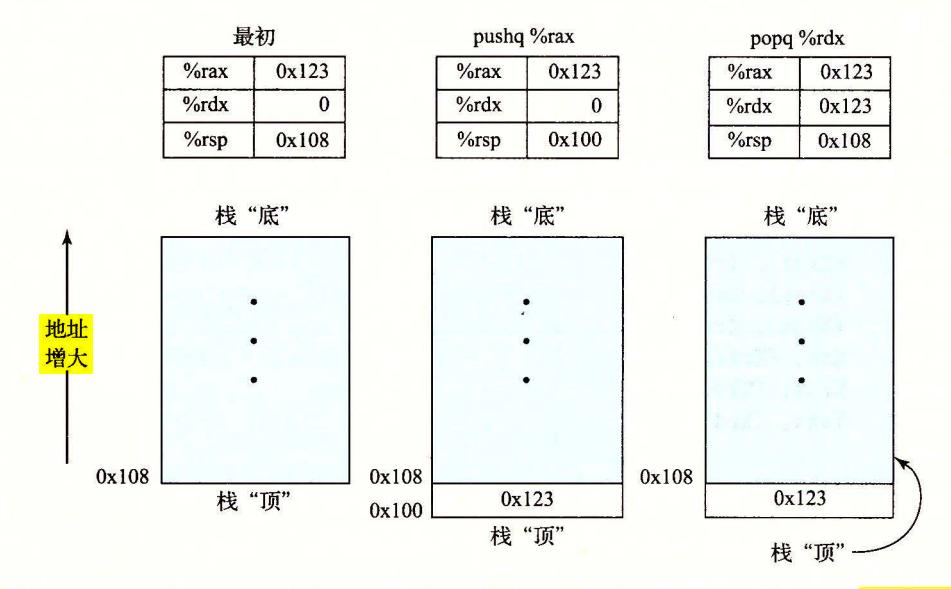
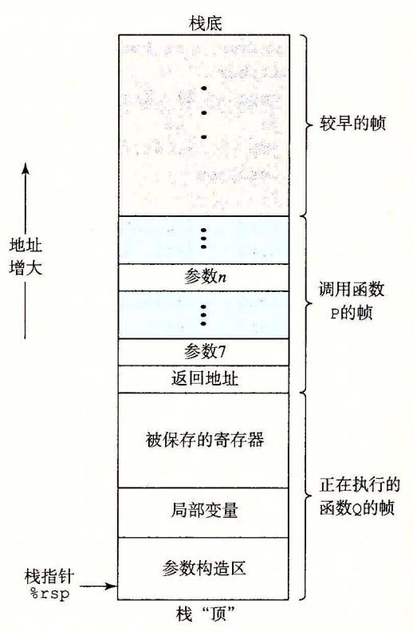

汇编代码文件包含各种声明,包括下面几行。

#### multstore:

pushq %rbx
movq %rdx, %rbx
call mult2
movq %rax, (%rbx)

popq %rbx

ret

上面代码中每个缩进去的行都对应于一条机器指令。比如,pushq 指令表示应该将寄存器%rbx的内容压入程序栈中。这段代码中已经除去了所有关于局部变量名或数据类型的信息。

如果我们使用"-c"命令行选项,GCC会编译并汇编该代码:

linux> gcc -Og -c mstore.c

这就会产生目标代码文件 mstore.o, 它是二进制格式的, 所以无法直接查看。1368 字节的文件 mstore.o 中有一段 14 字节的序列, 它的十六进制表示为:

53 48 89 d3 e8 00 00 00 00 48 89 03 5b c3

这就是上面列出的汇编指令对应的目标代码。从中得到一个重要信息,即机器执行的程序只是一个字节序列,它是对一系列指令的编码。机器对产生这些指令的源代码几乎一无所知。

#### 旁注 如何展示程序的字节表示

要展示程序(比如说 mstore)的二进制目标代码,我们用反汇编器(后面会讲到)确定该过程的代码长度是 14 字节。然后,在文件 mstore.o上运行 GNU 调试工具 GDB,输入命令:

(gdb) x/14xb multstore

这条命令告诉 GDB 显示(简写为'x')从函数 multstore 所处地址开始的 14 个十六进制格式表示(也简写为'x')的字节(简写为'b')。你会发现,GDB 有很多有用的特性可以用来分析机器级程序,我们会在 3.10.2 节中讨论。

要查看机器代码文件的内容,有一类称为<mark>反汇编器</mark>(disassembler)的程序非常有用。这些程序根据机器代码产生一种类似于汇编代码的格式。在 Linux 系统中,带 '-d'命令行标志的程序 OBJDUMP(表示 "object dump")可以充当这个角色:

linux> objdump -d mstore.o

结果如下(这里,我们在左边增加了行号,在右边增加了斜体表示的注解):

Disassembly of function multstore in binary file mstore.o

| 1 | 000000 | 0000000000 <multstore>:</multstore> |         |                                   |
|---|--------|-------------------------------------|---------|-----------------------------------|
|   | Offset | Bytes                               | Equival | ent assembly language             |
| 2 | 0:     | 53                                  | push    | %rbx                              |
| 3 | 1:     | 48 89 d3                            | mov     | %rdx,%rbx                         |
| 4 | 4:     | e8 00 00 00 00                      | callq   | 9 <multstore+0x9></multstore+0x9> |
| 5 | 9:     | 48 89 03                            | mov     | %rax,(%rbx)                       |
| 6 | c:     | 5b                                  | pop     | %rbx                              |
| 7 | d:     | c3                                  | retq    |                                   |

在左边,我们看到按照前面给出的字节顺序排列的 14 个十六进制字节值,它们分成了若干组,每组有 1~5 个字节。每组都是一条指令,右边是等价的汇编语言。

其中一些关于机器代码和它的反汇编表示的特性值得注意:

- x86-64 的指令长度从 1 到 15 个字节不等。常用的指令以及操作数较少的指令所需的字节数少,而那些不太常用或操作数较多的指令所需字节数较多。
- 设计指令格式的方式是,<mark>从某个给定位置开始,可以将字节唯一地解码成机器指令。</mark>例如,只有指令 pushq %rbx 是以字节值 53 开头的。
- 反汇编器只是基于机器代码文件中的字节序列来确定汇编代码。它不需要访问该程序的源代码或汇编代码。
- 反汇编器使用的指令命名规则与 GCC 生成的汇编代码使用的有些细微的差别。在 我们的示例中,它省略了很多指令结尾的'q'。这些后缀是大小指示符,在大多数 情况中可以省略。相反,反汇编器给 call 和 ret 指令添加了'q'后缀,同样,省略 这些后缀也没有问题。

生成实际可执行的代码需要对一组目标代码文件运行链接器,而这一组目标代码文件中必须含有一个 main 函数。假设在文件 main.c 中有下面这样的函数:

#include <stdio.h>

```
void multstore(long, long, long *);\nint main() {
    long d;
    multstore(2, 3, &d);
    printf("2 * 3 --> %ld\n", d);
    return 0;
}
long mult2(long a, long b) {
    long s = a * b;
    return s;
}
```

然后,我们用如下方法生成可执行文件 prog:

linux> gcc -Og -o prog main.c mstore.c

文件 prog 变成了 8 655 个字节,因为它不仅包含了两个过程的代码,还包含了用来启动和终止程序的代码,以及用来与操作系统交互的代码。我们也可以反汇编 prog 文件:

linux> objdump -d prog

反汇编器会抽取出各种代码序列,包括下面这段:

Disassembly of function sum multstore binary file prog

```
0000000000400540 <multstore>:
1
2
     400540: 53
                                             %rbx
                                      push
3
     400541: 48 89 d3
                                      mov
                                             %rdx,%rbx
4
     400544: e8 42 00 00 00
                                      callq 40058b <mult2>
     400549: 48 89 03
                                             %rax,(%rbx)
5
                                      mov
     40054c: 5b
                                      pop
                                             %rbx
7
     40054d: c3
                                      retq
     40054e: 90
8
                                      nop
     40054f: 90
                                      nop
```

这段代码与 mstore.c 反汇编产生的代码几乎完全一样。其中一个主要的区别是左边

列出的地址不同——链接器将这段代码的地址移到了一段不同的地址范围中。第二个不同之处在于链接器填上了 callq指令调用函数 mult2需要使用的地址(反汇编代码第4行)。链接器的任务之一就是为函数调用找到匹配的函数的可执行代码的位置。最后一个区别是多了两行代码(第8和9行)。这两条指令对程序没有影响,因为它们出现在返回指令后面(第7行)。插入这些指令是为了使函数代码变为16字节,使得就存储器系统性能而言,能更好地放置下一个代码块。

#### 3.2.3 关于格式的注解

GCC产生的汇编代码对我们来说有点儿难读。一方面,它包含一些我们不需要关心的信息,另一方面,它不提供任何程序的描述或它是如何工作的描述。例如,假设我们用如下命令生成文件 mstore.s。

linux> gcc -Og -S mstore.c

mstore.s 的完整内容如下:

```
.file
               "010-mstore.c"
       .text
       .globl multstore
       .type multstore, @function
multstore:
               %rbx
       pushq
              %rdx, %rbx
       movq
             mult2
       call
       movq %rax, (%rbx)
               %rbx
       popq
       ret
       .size multstore, .-multstore
       .ident "GCC: (Ubuntu 4.8.1-2ubuntu1~12.04) 4.8.1"
                       .note.GNU-stack, "", @progbits
       .section
```

所有以'.'开头的行都是指导汇编器和链接器工作的伪指令。我们通常可以忽略这些行。另一方面,也没有关于指令的用途以及它们与源代码之间关系的解释说明。

为了更清楚地说明汇编代码,我们用这样一种格式来表示汇编代码,它省略了大部分 伪指令,但包括行号和解释性说明。对于我们的示例,带解释的汇编代码如下:

```
void multstore(long x, long y, long *dest)
   x in %rdi, y in %rsi, dest in %rdx
1
  multstore:
2
     pushq %rbx
                              Save %rbx
             %rdx, %rbx
                             Copy dest to %rbx
3
     movq
            mult2
4
     call
                              Call mult2(x, y)
    movq %rax, (%rbx)
                              Store result at *dest
5
              %rbx
                              Restore %rbx
6
     popq
     ret
                              Return
```

通常我们只会给出与讨论内容相关的代码行。每一行的左边都有编号供引用,右边是 注释,简单地描述指令的效果以及它与原始 C 语言代码中的计算操作的关系。这是一种汇 编语言程序员写代码的风格。

我们还提供网络旁注,为专门的机器语言爱好者提供一些资料。一个网络旁注描述的 是 IA32 机器代码。有了 x86-64 的背景,学习 IA32 会相当简单。另外一个网络旁注简要

描述了在 语言中插入汇编代码的方法。对千一些应用程序,程序员必须用汇编代码来访 问机器的低级特性。一种方法是用汇编代码编写整个函数,在链接阶段把它们和 函数组 合起来。另一种方法是利用 GCC 的支持,直接在 程序中嵌入汇编代码。

## 日日 ATT Intel 汇编代码格式

我们的表述是 ATT (根据 "AT&T" 命名的, AT&T 是运营贝尔实验室多年的公 司)格式的汇编代码,这是 GCC OBJDUMP 和其他一些我们使用的工具的默认格式 其他一些编程工具,包括 Microsoft 的工具,以及未自 Intel 的文档,其汇编代码都是 Intel 格式的 这两种格式在许多方面有所不同 。例 如,使用下述命令行, GCC 可以产 multstore 函数的 Intel 格式的代码:

linux> gee -Og -S -masm=intel mstore.e

这个命令得到下列汇编代码:

#### multstore:

push rbx

mov rbx, rdx

call mult2

mov QWORD PTR [rbx], rax

pop rbx

ret

## 我们看到 Intel ATT 格式在如下方面有所不同:

- Intel 代码省略了指示大小的后缀。我们看到指令 push mov, 而不是 pushq movq
- Intel 代码省略了寄存器名宇前面的飞'符号,用的是 rbx, 而不是 rbx
- Intel 代码用不同的方式来描述内存中的位置,例如是 'QWORD PTR [ rbx] '而不是 '( rbx)'
- ·在带有多个操作 数的指令情况下,列出操作数的顺序相反。当在两种格式之间进 行转换的时候,这一点非常令人困惑

虽然在我们的表述中不使用 Intel 格式,但是在来自 Intel Microsoft 的文档中, 你会遇到它。

## 日百五一 程序和汇编代码结合起来

虽然 编译器在把程序中表达的计算转换到机器代码方面表现出色,但是仍然有一 些机器特性是 程序访问不到的 。例 如,每次 x86 <sup>64</sup> 处理器执行算术或逻辑运算时, 如果得到的运算结果的低 位中有偶数个 1, 那么就会把一个名为 PF 位条件码 (condition code) 标志设置为 1, 否则就设置为 。这里的 PF 表示 "parity flag (奇偶标 志)"。在 语言中计算这个信息需要至少 次移位、掩码和异或运算(参见习题 2. 65) 即使作为每次算术或逻辑运算的一部分,硬件都完成了这项计算,而 程序却无法知道 PF 条件码标志的值。在程序中插入几条汇编代码指令就能很容易地完成这项任务

程序中插入汇编代码有两种方法。笫一种是,我们可以编写完整的函数,放进 一个独立的汇编代码文件中,让汇编器和链接器把它和用 语言书写的代码合并起来。 笫二种方法是,我们可以使用 GCC 的内联汇编 (inline assembly) 特性,用 asm 伪指令可 以在 程序中包含简短的汇编代码。这种方法的好处是减少了与机器相关的代码量。

当然,在 程序中包含汇编代码使得这些代码与某类特殊的机器相关(例如 x86- 64) ,所以只应该在想要的特性只能以此种方式才能访问到时才使用它

## 3. 3 数据格式

由千是从 <sup>16</sup> 位体系结构扩展成 <sup>32</sup> 位的, Intel 用术语"字 (word)" 表示 <sup>16</sup> 位数据类 型。因此,称 <sup>32</sup> 位数为"双字 (double words)", <sup>64</sup> 位数为"四字 (quad words)" 3-1 给出了 语言基本数据类型对应的 x86-64 表示。标准 int 值存储为双字 (32 位) 指针(在此用 char\* 表示)存储为 字节的四字, <sup>64</sup> 位机器本来就预期如此。 x86-64 中, 数据类型 long 实现为 <sup>64</sup> 位,允许表示的值范围较大。本章代码示例中的大部分都使用了 指针和 long 数据类型,所以都是四字操作。 x86-64 指令集同样包括完整的针对字节、字 和双字的指令。

| 声明     | Intel 数据类型 | 汇编代码后缀 | 大小(字节) |
|--------|------------|--------|--------|
| char   | 字节         | b      | 1      |
| short  |            | w      | 2      |
| int    | 双字         | 1      | 4      |
| long   |            | q      | 8      |
| char*  | 四字         | q      | 8      |
| f1oa   | 单精度        | s      | 4      |
| double | 双精度        | 1      | 8      |

3- 语言数据类型在 x86-64 中的大小。在 <sup>64</sup> 位机器中,指针长 字节

浮点数主要有两种形式:单精度 (4 字节)值,对应于 语言数据类型 float; 双精度 (8 字节)值,对应千 语言数据类型 double x86 家族的微处理器历史上实现过对一种特 殊的 <sup>80</sup> (10 字节)浮点格式进行全套的浮点运算(参见家庭作业 2. 86) 。可以在 程序中 用声明 long double 来指定这种格式。不过我们不建议使用这种格式。它不能移植到其他 类型的机器上,而且实现的硬件也不如单精度和双精度算术运算的高效。

如图所示,大多数 GCC 生成的汇编代码指令都有一个字符的后缀,表明操作数的大 小。例如,数据传送指令有四个变种: movb (传送字节)、 movw (传送字)、 movl (传送双 字)和 movq (传送四字)。后缀'立用来表示双字,因为 <sup>32</sup> 位数被看成是"长字 (long word)" 。注意,汇编代码也使用后缀` '来表示 字节整数和 字节双精度浮点数。这不 会产生歧义,因为浮点数使用的是一组完全不同的指令和寄存辞。

## 3. 4 访问信息

一个 x86-64 的中央处理单元 (CPU) 包含一组 <sup>16</sup> 个存储 <sup>64</sup> 位值的通用目的寄存器。 这些寄存器用来存储整数数据和指针 3-2 显示了这 <sup>16</sup> 个寄存器。它们的名字都以% 开头,不过后面还跟着一些不同的命名规则的名字,这是由于指令集历史演化造成的。最 初的 <sup>8086</sup> 中有 <sup>16</sup> 位的寄存器,即图 3-2 中的%ax 到%bp 。每个寄存器都有特殊的用 途,它们的名字就反映了这些不同的用途。扩展到 IA32 架构时,这些寄存器也扩展成 <sup>32</sup> 位寄存器,标号从%eax 到%ebp 。扩展到 x86-64 后,原来的 个寄存器扩展成 <sup>64</sup> 位,标 号从 rax 到%rbp 。除此之外,还增加了 个新的寄存器,它们的标号是按照新的命名规 则制定的:从%r8 到%rlS

<span id="page-5-0"></span>

| 63                     | 31                             | 15                                      | 7 C                         |                                            |
|------------------------|--------------------------------|-----------------------------------------|-----------------------------|--------------------------------------------|
| %rax                   | %eax                           | %ax                                     | %al                         | 返回值                                        |
| %rbx                   | %ebx                           | %bx                                     | %bl                         | 被调用者保存                                     |
| %rcx                   | %ecx                           | %CX                                     | %cl                         | 第4个参数                                      |
| %rdx                   | %edx                           | %dx                                     | %dl                         | 第3个参数                                      |
| %rsi                   | %esi                           | %si                                     | %sil                        | 第2个参数                                      |
| %rdi                   | %edi                           | %di                                     | %dil                        | 第1个参数                                      |
| %rbp                   | %ebp                           | %bp                                     | %bpl                        | 被调用者保存                                     |
| %rsp                   | - Com                          | %sp                                     |                             | 栈指针                                        |
| 1015p                  | %esp                           | asp                                     | %spl                        | 1次1日11                                     |
| %r8                    | %r8d                           | %r8w                                    | %spl<br>%r8b                | 第5个参数                                      |
|                        |                                |                                         |                             |                                            |
| %r8                    | %r8d                           | %r8w                                    | %r8b                        | 第5个参数                                      |
| %r8<br>%r9             | %r8d<br>%r9d                   | %r8w<br>%r9w                            | %r8b<br>%r9b                | 第5个参数<br>第6个参数                             |
| %r8<br>%r9<br>%r10     | %r8d<br>%r9d<br>%r10d          | %r8w<br>%r9w<br>%r10w                   | %r8b<br>%r9b<br>%r10b       | 第5个参数第6个参数第6个参数                            |
| %r8 %r9 %r10 %r11      | %r8d<br>%r9d<br>%r10d<br>%r11d | %r8w<br>%r9w<br>%r10w<br>%r11w          | %r8b %r9b %r10b %r11b       | 第5个参数第6个参数调用者保存调用者保存                       |
| %r8 %r9 %r10 %r11 %r12 | %r8d %r9d %r10d %r11d %r12d    | %r8w<br>%r9w<br>%r10w<br>%r11w<br>%r12w | %r8b %r9b %r10b %r11b %r12b | 第5个参数<br>第6个参数<br>调用者保存<br>调用者保存<br>被调用者保存 |

图 3-2 整数寄存器。所有 16 个寄存器的低位部分都可以作为字节、字(16 位)、双字(32 位)和四字(64 位)数字来访问

如图 3-2 中嵌套的方框标明的,指令可以对这 16 个寄存器的低位字节中存放的不同 大小的数据进行操作。字节级操作可以访问最低的字节,16 位操作可以访问最低的 2 个字 节,32 位操作可以访问最低的 4 个字节,而 64 位操作可以访问整个寄存器。

在后面的章节中,我们会展现很多指令,复制和生成 1 字节、2 字节、4 字节和 8 字节值。当这些指令以寄存器作为目标时,对于生成小于 8 字节结果的指令,寄存器中剩下的字节会怎么样,对此有两条规则: 生成 1 字节和 2 字节数字的指令会保持剩下的字节不变; 生成 4 字节数字的指令会把高位 4 个字节置为 0。后面这条规则是作为从 IA32 到 x86-64 的扩展的一部分而采用的。

就像图 3-2 右边的解释说明的那样,在常见的程序里不同的寄存器扮演不同的角色。 其中<mark>最特别的是栈指针%rsp,用来指明运行时栈的结束位置。</mark>有些程序会明确地读写这个 寄存器。另外 15 个寄存器的用法更灵活。少量指令会使用某些特定的寄存器。更重要的 是,有一组标准的编程规范控制着如何使用寄存器来管理栈、传递函数参数、从函数的返 回值,以及存储局部和临时数据。我们会在描述过程的实现时(特别是在 3. 节中),讲述 这些惯例。

## 3. 4. 1 操作数指示符

大多数指令有 个或多个操作数 (operand) ,指示出执行一个操作中要使用的源数据 值,以及放置结果的目的位置。 x86-64 支持多种操作数格式(参见图 3) 。源数据值可以 以常数形式给出,或是从寄存器或内存中读出。结果可以存放在寄存器或内存中。因此, 各种不同的操作数的可能性被分为三种类型。第一种类型是立即数 (immediate) ,用来表 示常数值。在 ATT 格式的汇编代码中,立即数的书写方式是'旷后面跟一个用标准 示法表示的整数,比如,\$ <sup>577</sup> 或\$ OxlF 。不同的指令允许的立即数值范围不同,汇编器 会自动选择最紧凑的方式进行数值编码。第二种类型是寄存器 (register) ,它表示某个寄 存器的内容, <sup>16</sup> 个寄存器的低位 字节、 字节 字节或 字节中的 个作为操作数, 这些字节数分别对应于 位、 <sup>16</sup> 位、 <sup>32</sup> 位或 <sup>64</sup> 位。在图 3-3 中,我们用符号 ra 来表示任 意寄存器 a, 用引用 R[ra] 来表示它的值,这是将寄存器集合看成一个数组 R, 用寄存器标 识符作为索引。

第三类操作数是内存引用,它会根据计算出来的地址(通常称为有效地址)访问某个内 存位置。因为将内存看成一个很大的字节数组,我们用符号凶 [Addr] 表示对存储在内存 中从地址 Addr 开始的 个字节值的引用 为了简便,我们通常省去下标

如图 3-3 所示,有多种不同的寻址模式,允许不同形式的内存引用。表中底部用语法 Imm(rb , ru s) 表示的是最常用的形式。这样的引用有四个组成部分:一个立即数偏移 Imm, 一个基址寄存器 rb' 个变址寄存器 ,和一个比例因子 s, 这里 必须是 或者 。基址和变址寄存器都必须是 <sup>64</sup> 位寄存器。有效地址被计算为 Imm+R[r6]+R[r;] • 用数组元素时,会用到这种通用形式。其他形式都是这种通用形式的特殊情况,只是省略 了某些部分。正如我们将看到的,当引用数组和结构元素时,比较复杂的寻址模式是很有 用的。

| 类型  | 格式              | 操作数值                   | 名称         |
|-----|-----------------|------------------------|------------|
| 立即数 | \$Imm           | Imm                    | 立即数寻址      |
| 寄存器 | r a             | R[r.]                  | 寄存器寻址      |
| 存储器 | Imm             | M[Imm]                 | 绝对寻址       |
| 存储器 | (r.)            | M[R[r0]]               | 间接寻址       |
| 存储器 | lmm(r.)         | M[Imm+R[r.]]           | (基址+偏移量)寻址 |
| 存储器 | (rb, r,)        | M[R[r.J+R[r;]]         | 变址         |
| 存储器 | /mm(rb, r,)     | M[Jmm+R[r.]+R[r;]]     | 变址         |
| 存储器 | (,r,, s)        | M[R[r;) ·s]            | 比例变址寻址     |
| 存储器 | /mm(,r,,s)      | M[Imm+R[r,l · s]       | 址寻址<br>比例  |
| 存储器 | (rb, r;,s)      | M[R[rb]+R[r;] · s]     | 比例变址寻址     |
| 存储器 | Imm(r b, r,, s) | M[/mm+R[r.]+R[r;] · s] | 比例变址寻址     |

操作数格式 操作数可以表示立即数(常数)值、寄存器值或是来自 内存的值 比例因子 必须是 或者

| 地址    |      |
|-------|------|
| OxlOO | OxFF |
| Ox104 | OxAB |
| Ox108 | Oxl3 |
| OxlOC | Oxll |

| 寄存器  |       |
|------|-------|
| %rax | OxlOO |
| %rcx | Oxl   |
| rdx  | Ox3   |

填写下表,给出所示操作数的值:

| 操作数                |  |
|--------------------|--|
| rax                |  |
| Ox104              |  |
| \$0xl08            |  |
| (号 rax)            |  |
| 4(%rax)            |  |
| 9 (令 rax,%rdx)     |  |
| 260 (%rcx,<br>rdx) |  |
| OxFC (, %rcx, 4)   |  |
| (%rax, %rdx, 4)    |  |

## 3. 4. 2 数据传送指令

最频繁使用的指令是将数据从一个位置复制到另一个位置的指令。操作数表示的通用 性使得一条简单的数据传送指令能够完成在许多机器中要好几条不同指令才能完成的功 能。我们会介绍多种不同的数据传送指令,它们或者源和目的类型不同,或者执行的转换 不同,或者具有的一些副作用不同。在我们的讲述中,把许多不同的指令划分成指令类, 每一类中的指令执行相同的操作,只不过操作数大小不同。

<span id="page-7-0"></span>3-4 列出的是最简单形式的数据传送指令-MOV 类。这些指令把数据从源位置 复制到目的位置,不做任何变化。 MOV 类由四条指令组成: movb movw movl movq 。这些指令都执行同样的操作;主要区别在千它们操作的数据大小不同:分别是 字节。

|         |      | 效果   | 描述      |
|---------|------|------|---------|
| MOV     | S, D | D+-S | 传送      |
| movb    |      |      | 传送字节    |
| rnovw   |      |      | 传送字     |
| movl    |      |      | 传送双字    |
| movq    |      |      | 传送四字    |
| movabsq | I, R |      | 传送绝对的四字 |

3- 简单的数据传送指令

源操作数指定的值是一个立即数,存储在寄存器中 或者内存中。目的操作数指定一个 位置,要么是一个寄存器或者,要么是一个内存地址。 x86-64 加了一条限制,传送指令的 两个操作数不能都指向内存位置。将一个值从一个内存位置复制到另一个内存位置需要两 条指令——第一条指令将源值加载到寄存器中,第二条将该寄存器值写入目的位置。参考 [3-2,](#page-5-0) 这些指令的寄存器操作数可以是 <sup>16</sup> 个寄存器有标号部分中的任意一个,寄存器部

分的大小必须与指令最后一个字符 ('b','w','l' 或` ')指定的大小匹配。大多数情况 中, MOV 指令只会更新目的操作数指定的那些寄存器字节或内存位置。唯一的例外是 movl 指令以寄存器作为目的时,它会把该寄存器的高位 字节设置为 。造成这个例外的 原因是 x86-64 采用的惯例,即任何为寄存器生成 <sup>32</sup> 位值的指令都会把该寄存器的高位部 分置成

下面的 MOV 指令示例给出了源和目的类型的五种可能的组合。记住,第一个是源操 作数,第二个是目的操作数:

| 12345 | movl \$0x4050,%eax   | ImmediateRegister, 4 bytes |         |
|-------|----------------------|----------------------------|---------|
|       | movw %bp,%sp         | RegisterRegister,          | 2 bytes |
|       | movb (%rdi,%rcx),%al | Memory<br>Register,        | 1 byte  |
|       | movb \$-17, (%rsp)   | ImmediateMemory,           | 1 byte  |
|       | movq %rax,-12(%rbp)  | RegisterMemory,            | 8 bytes |

[3-4](#page-7-0) 中记录的最后一条指令是处理 <sup>64</sup> 位立即数数据的。常规的 movq 指令只能以表 示为 <sup>32</sup> 位补码数字的立即数作为源操作数,然后把这个值符号扩展得到 <sup>64</sup> 位的值,放到 目的位置 movabsq 指令能够以任意 <sup>64</sup> 位立即数值作为源操作数,并且只能以寄存器作 为目的

3-5 和图 3-6 记录的是两类数据移动指令,在将较小的源值复制到较大的目的时使 用。所有这些指令都把数据从源(在寄存器或内存中)复制到目的寄存器 MOVZ 类中的 指令把目的中剩余的字节填充为 o, MOVS 类中的指令通过符号扩展来填充,把源操作 的最高位进行复制。可以观察到,每条指令名字的最后两个字符都是大小指示符:第一个 字符指定源的大小,而第二个指明目的的大小。正如看到的那样,这两个类中每个都有三 条指令,包括了所有的源大小为 个和 个字节、目的大小为 个和 个的情况,当然只 考虑目的大千源的情况。

|        | 指令   | 效果       | 描述                |
|--------|------|----------|-------------------|
| MOVZ   | S, R | 扩展<br>R• | 传送                |
| movzbw |      |          | 将做了<br>展的 字节传送到字  |
| movzbl |      |          | 节传送到双字<br>将做了     |
| movzwl |      |          | 将做 了零<br>的字传送到双字  |
| movzbq |      |          | 将做 了笭<br>的字节传送到四字 |
| movzwq |      |          | 将做了<br>扩展的字传送到四字  |

3- 零扩展数据传送指令。这些指 以寄存器或内存地址作为源,以寄存器作为目的

|        | 指令   | 效果                | 描述                |
|--------|------|-------------------|-------------------|
| MOVS   | S, R | R-符号扩展 (S)        | 传送符号扩展的字节         |
| movsbw |      |                   | 将做了符号扩展的字节传送到字    |
| movsbl |      |                   | 将做了符号扩展的字节传送到双字   |
| movswl |      |                   | 扩展的字传送到双字<br>将做了符 |
| movsbq |      |                   | 将做了符号扩展的字节传送到四字   |
| movswq |      |                   | 将做了符<br>扩展的字传送到四字 |
| movslq |      |                   | 将做了符号扩展的双字传送到四字   |
| cltq   |      | %rax- 符号扩展 (%eax) | eax 符号扩展到釭ax      |

符号扩展数据传送指令。 MOVS 指令以寄存器或内存地址作为源,以寄存器 作为目的。 cltq 指令只作用于寄存器%eax rax

#### 旁注 理解数据传送如何改变目的寄存器

正如我们描述的那样,关于数据传送指令是否以及如何修改目的寄存器的高位字节 有两种不同的方法。下面这段代码序列会说明其差别:

```
movabsq $0x0011223344556677, %rax
                                               %rax = 0011223344556677
               $-1, %al
2
                                               %rax = 00112233445566FF
      movb
               $-1, %ax
3
      movw
                                               %rax = 001122334455FFFF
4
      movl
               $-1, %eax
                                               %rax = 00000000FFFFFFFF
               $-1, %rax
      movq
                                               %rax = FFFFFFFFFFFFFFF
```

在接下来的讨论中,我们使用十六进制表示。在这个例子中,第1行的指令把寄存器% rax 初始化为位模式 0011223344556677。剩下的指令的源操作数值是立即数值—1。回想—1的十六进制表示形如 FF…F,这里 F 的数量是表述中字节数量的两倍。因此 movb 指令 (第2行)把%rax 的低位字节设置为 FF, 而 movw 指令(第3行)把低2位字节设置为 FFFF, 剩下的字节保持不变。movl 指令(第4行)将低4个字节设置为 FFFFFFFF, 同时把高位4字节设置为 00000000。最后 movg 指令(第5行)把整个寄存器设置为 FFFFFFFFFFFFF。

注意图 3-5 中并没有一条明确的指令把 4 字节源值零扩展到 8 字节目的。这样的指令逻辑上应该被命名为 movzlq,但是并没有这样的指令。不过,这样的数据传送可以用以寄存器为目的的 movl 指令来实现。这一技术利用的属性是,生成 4 字节值并以寄存器作为目的的指令会把高 4 字节置为 0。对于 64 位的目标,所有三种源类型都有对应的符号扩展传送,而只有两种较小的源类型有零扩展传送。

图 3-6 还给出 cltq 指令。这条指令<mark>没有操作数</mark>:它<mark>总是以寄存器%eax 作为源,%rax 作为符号扩展结果的目的</mark>。它的效果与指令 movslq %eax,%rax 完全一致,不过编码更紧凑。

○ 练习题 3.2 对于下面汇编代码的每一行,根据操作数,确定适当的指令后缀。(例如, mov 可以被重写成 movb、movw、movl 或者 movg。)

```
mov
```

mov\_\_ (%rsp,%rdx,4), %c mov\_\_ (%rdx), %rax

mov\_ %dx, (%rax)

## 旁注 字节传送指令比较

下面这个示例说明了不同的数据传送指令如何改变或者不改变目的的高位字节。仔细观察可以发现,三个字节传送指令 movb、movsbq 和 movzbq 之间有细微的差别。示例如下:

```
movabsq $0x0011223344556677, %rax
```

在下面的讨论中,所有的值都使用十六进制表示。代码的头 2 行将寄存器%rax 和%dl 分别初始化为 0011223344556677 和 AA。剩下的指令都是将%rdx 的低位字节复制到%rax 的低位字节。movb 指令(第 3 行)不改变其他字节。根据源字节的最高位,movsbq 指令(第 4 行)将其他 7 个字节设为全 1 或全 0。由于十六进制 A表示二进制值 1010,符号扩展会把高位字节都设置为 FF。movzbq 指令(第 5 行)总是将其他 7 个字节全都设置为 0。

○ 练习题 3.3 当我们调用汇编器的时候,下面代码的每一行都会产生一个错误消息。 解释每一行都是哪里出了错。

```
movb $0xF, (%ebx)
movl %rax, (%rsp)
movw (%rax),4(%rsp)
movb %al,%sl
movq %rax,$0x123
movl %eax,%rdx
movb %si, 8(%rbp)
```

#### 3.4.3 数据传送示例

作为一个使用数据传送指令的代码示例,考虑图 3-7 中所示的数据交换函数,既有 C代码,也有 GCC 产生的汇编代码。

```
long exchange(long *xp, long y)
{
    long x = *xp;
    *xp = y;
    return x;
}
```

a) C语言代码

```
long exchange(long *xp, long y)
    xp in %rdi, y in %rsi
\nexchange:
    movq (%rdi), %rax
```

b) 汇编代码

图 3-7 exchange 函数的 C 语言和汇编代码。寄存器 %rdi 和 %rsi 分别存放参数 xp 和 y

如图 3-7b 所示,函数 exchange 由三条指令实现:两个数据传送(movq),加上一条返回函数被调用点的指令(ret)。我们会在 3.7 节中讲述函数调用和返回的细节。在此之前,知道参数通过寄存器传递给函数就足够了。我们对汇编代码添加注释来加以说明。函数通过把值存储在寄存器%rax或该寄存器的某个低位部分中返回。

当过程开始执行时,过程参数 xp 和 y分别存储在寄存器%rdi 和%rsi 中。然后,指令2从内存中读出 x,把它存放到寄存器%rax 中,直接实现了 C 程序中的操作 x=\*xp。稍后,用寄存器%rax 从这个函数返回一个值,因而返回值就是 x。指令3 将 y 写入到寄存器%rdi 中的 xp 指向的内存位置,直接实现了操作\*xp=y。这个例子说明了如何用 MOV 指令从内存中读值到寄存器(第2行),如何从寄存器写到内存(第3行)。

关于这段汇编代码有两点值得注意。<mark>首先,我们看到 C 语言中所谓的"指针"其实就是地址。</mark>间接引用指针就是将该指针放在一个寄存器中,然后在内存引用中使用这个寄存器。<mark>其次,像 x 这样的局部变量通常是保存在寄存器中,而不是内存中。</mark>访问寄存器比访问内存要快得多。

## 练习题 4 假设变量 sp dp 被声明为类型

src\_t \*sp; dest\_t \*dp;

这里 src\_t dest\_七是用 typedef 声明的数据类型。我们想使用适当的数据传送指 令来实现下面的操作

\*dp = (dest\_t) \*sp;

假设 sp dp 的值分别存储在寄存器%rdi 和%rsi 中。对于表中的每个表项,给出 实现指定数据传送的两条指令。其中第一条指令应该从内存中读数,做适当的转换,并 设置寄存器%rax 的适当部分。然后,第二条指令要把 rax 的适当部分写到内存。在这 两种情况中,寄存器的部分可以是%rax %eax %ax al, 两者可以互不相同。

记住,当执行强制类型转换既涉及大小变化又涉及 语言中符号变化时,操作应 该先改变大小 (2. 2. 节)。

| src t         | dest t        | 指令                                           |
|---------------|---------------|----------------------------------------------|
| long          | long          | movq( %rdi),<br>%rax<br>movq<br>rax,<br>rsi) |
| char          | int           |                                              |
| char          | unsigned      |                                              |
| unsigned char | long          |                                              |
| int           | char          |                                              |
| unsigned      | unsigned char |                                              |
| char          | short         |                                              |

# 一】 指针的一些示例

函数 exchange (图 3-7a) 提供了一个关于 语言中指针使用的很好说明 参数 xp 一个指向 long 类型的整数的指针,而 是一个 long 类型的整数。语句

long x = \*xp;

表示我们将读存储在 xp 所指位置中的值,并将它存放到名字为 的局部变量中 这个 读操作称为指针的间接引用 (pointer dereferencing) , 操作符\*执行指针的间接引用

语句

\*XP = y;

正好相反-它将参数 的值写到 xp 所指的位置 这也是指针间接引用的一种形式(所 以有操作符\*),但是它表明的是一个写操作,因为它在赋值语句的左边

下面是调用 exchange 的一个实际例子:

long a= 4; long b = exchange(&a, 3); printf("a = %ld, b = %ld\n", a, b); 这段代码会打印出:

a= 3, b = 4

操作符&(称为"取址"操作符)创建一个指针,在本例中,该指针指向保存局部变 的位置。然后,函数 exchange 将用 覆盖存储在 中的值,但是返回原来的值 为函数的值。注意如何将指针传递给 exchange, 它能修改存在某个远处位置的数据。

## 练习题 5 已知信息如下。将一个原型为

void decode1(long •xp, long •yp, long •zp);

的函数编译成汇编代码,得到如下代码:

vo1d decode1 (long •xp, long \*YP, long \*zp) xp in 7.rdi, yp i n 7.rsi , zp in 7.r dx

#### decode!:

movq (%rdi), %r8 movq (%rsi), %rcx movq (o/.rdx), o/.rax movq %r8, (%rsi) movq %rcx, (%rdx) movq %rax, (%rdi) ret

参数 xp yp zp 分别存储在对应的寄存器%rdi %rsi 和% dx 中。 请写出等效于上面汇编代码的 decodel 代码。

## 3. 4. 4 压入和弹出栈数据

最后两个数据传送操作可以将数据压入程序栈中,以及从程序栈中弹出数据,如图 3-8 所示。正如我们将看到的,栈在处理过程调用中起到至关重要的作用。栈是一种数据结 构,可以添加或者删除值,不过要遵循"后进先出"的原则。通过 push 操作把数据压入 栈中,通过 pop 操作删除数据;它具有一个属性:弹出的值永远是最近被压入而且仍然在 栈中的值。栈可以实现为一个数组,总是从数组的一端插入和删除元素。这一端被称为栈 顶。在 x86-64 中,程序栈存放在内存中某个区域。如图 3-9 所示,栈向下增长,这样一 来,栈顶元素的地址是所有栈中元素地址中最低的。(根据惯例,我们的栈是倒过来画的, 栈"顶"在图的底部。)栈指针%rsp 保存着栈顶元素的地址。

| 指令    |   | 效果                                       | 描述     |
|-------|---|------------------------------------------|--------|
| pushq | s | R[%rsp]-R[%rsp]<br>8;<br>M[R[ %rsp]]-S   | 将四字压入栈 |
| popq  | D | %rsp]];<br>D-M[R[<br>R[ %rsp]-R[%rsp] +8 | 将四字弹出栈 |

3-8 人栈和出栈指令

pushq 指令的功能是把数据压入到栈上,而 popq 指令是弹出数据。这些指令都只有 一个操作数一一压入 的数据源和弹出的数据目的。

将一个四字值压人栈中,首先要将栈指针减 8, 然后将值写到新的栈顶地址。因此, 指令 pushq %rbp 的行为等价千下面两条指令:

subq \$8,%rsp movq %rbp, (%rsp) Decrement stack pointer Store 7.rbp on stack

它们之间的区别是在机器代码中 pushq 指令编码为 个字节,而上面那两条指令一共需要 个字节。图 3-9 中前两栏给出的是,当% rsp Ox108,%rax Ox123 时,执行指令 pushq %rax 的效果。首先% rsp 会减 8, 得到 OxlOO, 然后会将 Ox123 存放到内存地址 OxlOO 处。



3-9 栈操作说明。根据惯例,我们的栈是倒过来画的,因而栈"顶"在底部。 x86-64 中, 栈向低地址方向增长,所以压栈是减小栈指针(寄存器% rsp) 的值,并将数据存放到 内存中,而出栈是从内存中读数据,并增加栈指针的值

弹出一个四字的操作包括从栈顶位置读出数据,然后将栈指针加 。因此,指令 popq %rax 等价千下面两条指令:

movq (%rsp),%rax addq \$8,%rsp

Read 7.rax from stack Increment stack pointer

3-9 的第三栏说明的是在执行完 pushq 后立即执行指令 popq %rdx 的效果。先从内 存中读出值 Ox123, 再写到寄存器% rdx 中,然后,寄存器%rsp 的值将增加回到 Ox108 如图中所示,值 Ox123 仍然会保持在内存位置 OxlOO 中,直到被覆盖(例如被另一条入栈 操作覆盖)。无论如何,% rsp 指向的地址总是栈顶。

因为栈和程序代码以及其他形式的程序数据都是放在同一内存中,所以程序可以用标 准的内存寻址方法访问栈内的任意位置。例如,假设栈顶元素是四字,指令 movq 8 (% rsp), %rdx 会将第二个四字从栈中复制到寄存器%rdx

## 3. 5 算术和逻辑操作

3-10 列出了 x86-64 的一些整数和逻辑操作。大多数操作都分成了指令类,这些指 令类有各种带不同大小操作数的变种(只有 leaq 没有其他大小的变种)。例如,指令类 ADD 由四条加法指令组成: addb addw addl addq, 分别是字节加法、字加法、双 字加法和四字加法。事实上,给出的每个指令类都有对这四种不同大小数据的指令。这些 <span id="page-14-0"></span>操作被分为四组:加载有效地址、一元操作、二元操作和移位。二元操作有两个操作数, 而一元操作有一个操作数。这些操作数的描述方法与 3.4 节中所讲的一样。

| 指令   |      | 效果     | 描述         |
|------|------|--------|------------|
| leaq | S,D  | 七-&    | 加载有效地址     |
| INC  | D    | D+l    |            |
| DEC  | D    | D-1    |            |
| NEG  | D    | DD     | 取负         |
| NOT  | D    | 七-~    | 取补         |
| ADD  | S,D  | D-D+S  |            |
| SUB  | S,D  | 七- D-S |            |
| IMUL | S,D  | 七- D*S |            |
| XOR  | S,D  | D-s    | 异或         |
| OR   | S,D  | DIS    |            |
| AND  | S,D  | D<-D&S |            |
| SAL  | k,D  | D-D«k  | 左移         |
| SHL  | k, D | D«k    | 左移(等同于SAL) |
| SAR  | k, D | D»A k  | 算术右移       |
| SHR  | k,D  | >>LK   | 逻辑右移       |

3- 整数算术操作。加载有效地址 (leaq) 指令通常用来执行简单的算术操作。其余的指令 是更加标准的一元或二元操作。我们用>> 和>> 来分别表示算术右移和逻辑右移。 注意,这里的操作顺序与 ATT 格式的汇编代码中的相反

## 3. 5. 1 加载有效地址

加栽有效地址 Ooad effective address) 指令 leaq 实际上是 movq 指令的变形。它的指 令形式是从内存读数据到寄存器,但实际上它根本就没有引用内存。它的第一个操作数看 上去是一个内存引用,但该指令并不是从指定的位置读入数据,而是将有效地址写人到目 的操作数。在图 3-10 中我们用 语言的地址操作符& 说明这种计算。这条指令可以为后 面的内存引用产生指针。另外,它还可以简洁地描述普通的算术操作。例如,如果寄存 器%rdx 的值为 ,那么指令 leaq 7 (%rdx, %rdx , 4), %rax 将设置寄存器%rax 的值为 5x+ 。编译器经常发现 leaq 的一些灵活用法,根本就与有效地址计算无关。目的操作数必须 是一个寄存器。

为了说明 leaq 在编译出的代码中的使用,看看下面这个 程序:

```
long scale(long x, long y, long z) { 
    long t = x + 4 * y + 12 * z; 
    return t;
```

编译时,该函数的算术运算以三条 leaq 指令实现,就像右边注释说明的那样:

```
long scale(long x, long y, long z) 
 x in ¼rdi, y in ¼rsi, z in ¼rdx 
scale: 
  leaq (o/.rdi,o/.rsi,4), o/.rax 
  leaq (o/.rdx,o/.rdx,2), o/.rdx 
  leaq (o/.rax,o/.rdx,4), o/.rax 
  ret 
                                        X + 4*y 
                                        Z + 2*z = 3*Z 
                                        (x+4*y) + 4* (3 五) = X + 4*y + 12*Z
```

leaq 指令能执行加法和有限形式的乘法,在编译如上简单的算术表达式时,是很有用处的。 练习题 6 假设寄存器%rax 的值为 x,%rcx 的值为 。填写下表,指明下面每条汇 编代码指令存储在寄存器%rdx 中的值:

|      | 表达式                      | 结果 |
|------|--------------------------|----|
|      | leaq 6 (%ax), %rdx       |    |
| leaq | rax,<br>rcx),%rdx        |    |
| leaq | rax,<br>rcx,4)<br>rdx    |    |
| leaq | 7(%rax , %rax,8), %rdx   |    |
| leaq | OxA(,%rcx,4),%rdx        |    |
| leaq | rax,%rcx,2) ,毛 rdx<br>9( |    |

练习题 7 考虑下面的代码,我们省略了被计算的表达式:

```
long scale2(long x, long y, long z) { 
    long t = 
    return t; 
}
```

GCC 编译实际的函数得到如下的汇编代码:

long scale2(long x, long y, long z) X in d.l y.ln s.l z.ln dx

scale2:

leaq leaq leaq ret (%rdi,%rdi,4), %rax (%rax,%rsi,2), %rax (%rax,%rdx,8), %rax

填写出 代码中缺失的表达式。

### 3. 5. 2 一元和二元操作

第二组中的操作是一元操作,只有一个操作数,既是源又是目的。这个操作数可以是 一个寄存器,也可以是一个内存位置。比如说,指令 incq( rsp) 会使栈顶的 字节元素 。这种语法让人想起 语言中的加 运算符(++)和减 运算符(一—)。

第三组是二元操作,其中,第二个操作数既是源又是目的。这种语法让人想起 语言 中的赋值运算符,例如 x-=y 。不过,要注意,源操作数是第一个,目的操作数是第二个, 对千不可交换操作来说,这看上去很奇特。例如,指令 subq %rax, %rdx 使寄存器%rdx 值减去%rax 中的值。(将指令解读成"从%rdx 中减去%rax" 会有所帮助。)第一个操作数 可以是立即数、寄存器或是内存位置。第二个操作数可以是寄存器或是内存位置。注意, 当第二个操作数为内存地址时,处理器必须从内存读出值,执行操作,再把结果写回 内存。

练习题 8 假设下面的值存放在指定的内存地址和寄存器中:

| 地址    |      | 寄存   |       |
|-------|------|------|-------|
| OxlOO | OxFF | rax  | OxlOO |
| Oxl08 | OxAB | %rcx | Oxl   |
| OxllO | Oxl3 | rdx  | Ox3   |
| Ox118 | Oxll |      |       |

| 地址    |      | 寄存   |       |
|-------|------|------|-------|
| OxlOO | OxFF | rax  | OxlOO |
| Oxl08 | OxAB | %rcx | Oxl   |
| OxllO | Oxl3 | rdx  | Ox3   |
|       |      |      |       |

填写下表,给出下面指令的效果,说明将被更新的寄存器或内存位置,以及得到 的值:

| 指令                           | 目的 |  |
|------------------------------|----|--|
| addq %rcx,<br>rax)           |    |  |
| subq %rdx, 8 (%rax)          |    |  |
| nulq \$16,<br>rax,<br>rdx,8) |    |  |
| incq 16 (%rax)               |    |  |
| decq %rcx                    |    |  |
| subq<br>rdx,<br>rax          |    |  |

## 3. 5. 3 移位操作

最后一组是移位操作,先给出移位量,然后第二项给出的是要移位的数。可以进行算 术和逻辑右移。移位量可以是一个立即数,或者放在单字节寄存器 cl 中。(这些指令很 特别,因为只允许以这个特定的寄存器作为操作数。)原则上来说, 个字节的移位量使得 移位 的编码范围可以达到 1=255 x86 <sup>64</sup> 中,移位操作对 位长的数据值进行操 作,移位最是由 cl 寄存器的低 位决定的,这里 2'"=w 。高位会被忽略。所以,例如当 寄存器 cl 的十六进制值为 OxFF 时,指令 salb 会移 位, salw 会移 <sup>15</sup> 位, sall 会移 <sup>31</sup> 位,而 salq 会移 <sup>63</sup> 位。

如图 3-10 所示,左移指令有两个名字: SAL SHL 。两者的效果是一样的,都是将 右边填上 。右移指令不同, SAR 执行算术移位(填上符号位),而 SHR 执行逻辑移位(填 0) 移位操作的目的操作数可以是一个寄存器或是一个内存位置。图 3-10 中用>> A( 术)和>>凶逻辑)来表示这两种不同的右移运算。

练习题 9 假设我们想生成以下 函数的汇编代码:

```
long shift_left4_rightn(long x, long n) 
    X <<= 4; 
    X >>= n; 
    return x; 
}
```

下面这段汇编代码执行实际的移位,并将最后的结果放在寄存器%rax 中。此处 省略了两条关键的指令。参数 分别存放在寄存器%rdi 和%rsi 中。

```
longs ft_left4 ightn(long x, long n) 
 x in ¾rdi, n in ¾rsi 
shift_left4_rightn: 
  movq %rdi, %rax Get x 
 movl %esi, %ecx 
                          X <<= 4 
                          Get n (4 bytes) 
                          X >>= n
```

根据右边的注释,填出缺失的指令。请使用算术右移操作。

#### 3. 5. 4 讨论

我们看到图 3-10 所示的大多数指令,既可以用千无符号运算,也可以用千补码运算。

<mark>只有右移操作要求区分有符号和无符号数。</mark>这个特性使得补码运算成为实现有符号整数运 算的一种比较好的方法的原因之一。

图 3-11 给出了一个执行算术操作的函数示例,以及它的汇编代码。参数 x、y 和 z 初始时分别存放在内存%rdi、%rsi 和%rdx 中。汇编代码指令和 C 源代码行对应很紧密。第 2 行计算 x 个y 的值。指令 3 和 4 用 1 eaq 和移位指令的组合来实现表达式 z \* 4 8。第 5 行计算 t 1 和 0 x x x x x x x x x x

```
long arith(long x, long y, long z)
{
    long t1 = x ^ y;
    long t2 = z * 48;
    long t3 = t1 & OxOFOFOFOF;
    long t4 = t2 - t3;
    return t4;
}
```

a) C语言代码

```
long arith(long x, long y, long z)
    x in %rdi, y in %rsi, z in %rdx
    arith:
2
              %rsi, %rdi
    xorq
                                     t1 = x ^ y
              (%rdx,%rdx,2), %rax
3
                                      3*7
      leaq
4
              $4, %rax
                                      t2 = 16 * (3*z) = 48*z
      salq
              $252645135, %edi
                                     t3 = t1 & OxOFOFOFOF
5
      andl
6
      subq
              %rdi, %rax
                                      Return t2 - t3
7
      ret
```

b) 汇编代码

图 3-11 算术运算函数的 C语言和汇编代码

在图 3-11 的汇编代码中,寄存器 % rax 中的值先后对应于程序值 3\*z、z\* 48 和 t4(作为返回值)。通常,编译器产生的代码中,会用一个寄存器存放多个程序值,还会在寄存器之间传送程序值。

🔯 练习题 3.10 下面的函数是图 3-11a 中函数一个变种,其中有些表达式用空格替代:

```
long arith2(long x, long y, long z)
{
    long t1 = _____;
    long t2 = ____;
    long t3 = ____;
    long t4 = ____;
    return t4;
}
```

实现这些表达式的汇编代码如下:

```
long arith2(long x, long y, long z)
x in %rdi, y in %rsi, z in %rdx
```

arith2:

orq %rsi, %rdi sarq \$3, %rdi

notq %rdi

movq %rdx, %rax

subq %rdi, %rax

ret

于这些汇编代码,填写 语言代码中缺失的部分

练习题 11 常常可以看见以下形式的汇编代码行:

xorq %rdx,%rdx

但是在产生这段汇编代码 代码中,并没有出现 EXCLUSIVE-OR 操作。

- A. 解释这条特殊的 EXCLUSIVE-OR 指令的效果,它实现了什么有用的操作。
- B. 更直接地表达这个操作的汇编代码是什么?
- C. 同样一个操作的两种不同 现的编码字节长度。

## 3. 5. 5 特殊的算术操作

正如我们在 节中看到的,两个 位有符号或无符号整数相乘得到的乘积需要 <sup>128</sup> 位来 x86-64 指令集对 <sup>28</sup> (1 字节 数的操作提供有限的支持。延续字 (2 字节)、 双字 (4 节)和四字 (8 字节)的命 惯例, Intel <sup>16</sup> 字节的数称为八宇 (oct word) 3-12 描述的是 持产生两个 <sup>64</sup> 位数 的全 <sup>128</sup> 位乘积以及整数除法的指令。

| 指令     |   | 效果                                                                          | 描述     |  |
|--------|---|-----------------------------------------------------------------------------|--------|--|
| irnulq | s | rax -s X R[ %rax]<br>[沦 rd                                                  | 有符号全乘法 |  |
| mu lq  | s | R[%rdx] :<br>R[ %rax]<br>ra x]S                                             | 无符号全乘法 |  |
| clto   |   | R[ %rdx] : R[<br>-符号扩展 <r[<br>ax<br/>rax])</r[<br>                          | 转换为八字  |  |
| idivq  | s | R[ %rax] mod S<br>R[<br>rdx]<br>rctx]<br>R[<br>dx<br>rd ]:<br>ra<br>]-c-S   | 有符号除法  |  |
| divq   | s | R[ %rdx]-R[<br>%rdx] :<br>[毛 ra x] mod S<br>7S<br>R[ %rdx]-R[%rdx]: R[%rax] | 无符号除法  |  |

3-12 特殊的算术操作。这些操作提供了有符号和无符号数的全 <sup>128</sup> 位乘法和除法。 一对寄存器%rdx 组成一个 <sup>128</sup> 位的八字

.J.mulq 指令有两种不同的形式。其中一种,[如图](#page-14-0) 3-10 ,是 IMUL 指令类中的一 这种形式的 imulq 指令是一个"双操作数"乘法指令 它从两个 <sup>64</sup> 位操作数产生一 <sup>64</sup> 位乘积,实现了 3. 2. 3. 节中描述的操作 ~4 和\* ~4 回想一下,当将乘积截 取到 位时,无符号乘和补码乘的位级行为是一样的

此外, x86-64 指令集还提供 两条不同的"单操作数"乘法指令,以计算两个 <sup>64</sup> 值的全 <sup>128</sup> 位乘积 一个是无符号数乘法 (mulq) ,而另一个是补码乘法 (imulq) 。这两 条指令都要求一个参数必须在寄存器 rax 中,而另一个作为指令的源操作数给出。然后 乘积存放在寄存器%rdx (高 <sup>64</sup> 位)和 rax (低 <sup>64</sup> 位)中。虽然 .J.mulq 这个名字可以用于两 个不同的乘法操作,但是汇编器能够通过计算操作数的数目,分辨出想用哪条指令。

下面这段 代码是一个示例,说明了如何从两个无符号 <sup>64</sup> 位数字 生成 <sup>128</sup> 的乘积:

```
#include <inttypes.h>

typedef unsigned __int128 uint128_t;

void store_uprod(uint128_t *dest, uint64_t x, uint64_t y) {
    *dest = x * (uint128_t) y;
}
```

在这个程序中,我们显式地把 x 和 y 声明为 64 位的数字,使用文件 inttypes. h 中声明的定义,这是对标准 C 扩展的一部分。不幸的是,这个标准没有提供 128 位的值。所以我们只好依赖 GCC 提供的 128 位整数支持,用名字\_\_int128 来声明。代码用 typedef声明定义了一个数据类型 uint128\_t,沿用的 inttypes. h 中其他数据类型的命名规律。这段代码指明得到的乘积应该存放在指针 dest 指向的 16 字节处。

GCC 生成的汇编代码如下:

```
void store_uprod(uint128_t *dest, uint64_t x, uint64_t y)
   dest in %rdi, x in %rsi, y in %rdx
1
   store_uprod:
              %rsi, %rax
2
      movq
                               Copy x to multiplicand
3
      mulq
              %rdx
                               Multiply by y
             %rax, (%rdi) Store lower 8 bytes at dest
4
      movq
              %rdx, 8(%rdi) Store upper 8 bytes at dest+8
5
      movq
      ret
```

可以观察到,存储乘积需要两个 movq 指令:一个存储低 8 个字节(第 4 行),一个存储高 8 个字节(第 5 行)。由于生成这段代码针对的是小端法机器,所以高位字节存储在大地址,正如地址 8 (%rdi)表明的那样。

前面的算术运算表(图 3-10)没有列出除法或取模操作。这些操作是由单操作数除法指令来提供的,类似于单操作数乘法指令。有符号除法指令 idivl 将寄存器%rdx(高 64 位)和%rax(低 64 位)中的 128 位数作为被除数,而除数作为指令的操作数给出。指令将商存储在寄存器%rax中,将余数存储在寄存器%rdx中。

对于大多数 64 位除法应用来说,除数也常常是一个 64 位的值。这个值应该存放在% rax 中,%rdx 的位应该设置为全 0(无符号运算)或者%rax 的符号位(有符号运算)。后面这个操作可以用指令 cqto <sup>©</sup>来完成。这条指令不需要操作数——它隐含读出%rax 的符号位,并将它复制到%rdx 的所有位。

我们用下面这个 C 函数来说明 x86-64 如何实现除法,它计算了两个 64 位有符号数的商和余数:

```
void remdiv(long x, long y,
```

该函数编译得到如下汇编代码:

<sup>⊕</sup> 在 Intel 的文档中,这条指令叫做 cqo,这是指令的 ATT 格式名字和 Intel 名字无关的少数情况之一。

```
void remdiv(long x, long y, long *qp, long *rp)
    x in %rdi, y in %rsi, qp in %rdx, rp in %rcx
    remdiv:
             %rdx, %r8
2
      movq
                               Copy qp
      movq %rdi, %rax
3
                               Move x to lower 8 bytes of dividend
      cqto
                               Sign-extend to upper 8 bytes of dividend
4
5
      idivq %rsi
                               Divide by y
             %rax, (%r8)
6
      movq
                             Store quotient at qp
             %rdx, (%rcx) Store remainder at rp
      movq
      ret
```

在上述代码中,必须首先把参数 qp 保存到另一个寄存器中(第2行),因为除法操作要使用参数寄存器%rdx。接下来,第3~4行准备被除数,复制并符号扩展 x。除法之后,寄存器%rax 中的商被保存在 qp(第6行),而寄存器%rdx 中的余数被保存在 rp(第7行)。

无符号除法使用 divg 指令。通常,寄存器 %rdx 会事先设置为 0。

🤯 练习题 3.12 考虑如下函数,它计算两个无符号 64 位数的商和余数:

```
void uremdiv(unsigned long x, unsigned long y,
```

修改有符号除法的汇编代码来实现这个函数。

## 3.6 控制

到目前为止,我们只考虑了<mark>直线代码</mark>的行为,也就是<mark>指令一条接着一条顺序地执行</mark>。 C语言中的某些结构,比如条件语句、循环语句和分支语句,要求有条件的执行,根据数据测试的结果来决定操作执行的顺序。机器代码提供两种基本的低级机制来实现有条件的行为:测试数据值,然后根据测试的结果来改变控制流或者数据流。

与数据相关的控制流是实现有条件行为的更一般和更常见的方法,所以我们先来介绍它。通常,C语言中的语句和机器代码中的指令都是按照它们在程序中出现的次序,顺序执行的。用 jump 指令可以改变一组机器代码指令的执行顺序,jump 指令指定控制应该被传递到程序的某个其他部分,可能是依赖于某个测试的结果。编译器必须产生构建在这种低级机制基础之上的指令序列,来实现 C语言的控制结构。

本文会先涉及实现条件操作的两种方式,然后描述表达循环和 switch 语句的方法。

#### 3.6.1 条件码

除了整数寄存器, CPU 还维护着一组单个位的条件码(condition code)寄存器, 它们描述了最近的算术或逻辑操作的属性。可以检测这些寄存器来执行条件分支指令。最常用的条件码有:

- CF: 进位标志。最近的操作使最高位产生了进位。可用来检查无符号操作的溢出。
- ZF: 零标志。最近的操作得出的结果为 0。
- SF: 符号标志。最近的操作得到的结果为负数。
- OF: 溢出标志。最近的操作导致一个补码溢出——正溢出或负溢出。

比如说,假设我们用一条 ADD 指令完成等价千 表达式 t=a+ 的功能,这里变掀 都是整型的。然后,根据下面的 表达式来设置条件码:

CF ZF SF (unsigned) t < (unsigned) a (七== 0) (七 <0) 无符号溢出 负数 OF (a<O==b<O) &&(七 <0 ! =a<O) 有符号溢出

leaq 指令不改变任何条件码,因为它是用来进行地址计算的。除此之外,图 3-10 列出的所有指令都会设置条件码。对千逻辑操作,例如 XOR, 进位标志和溢出标志会设 置成 。对于移位操作,进位标志将设置为最后一个被移出的位,而溢出标志设置为 INC DEC 指令会设置溢出和零标志,但是不会改变进位标志,至千原因,我们就不在 这里深入探讨了。

除了图 3-10 中的指令会设置条件 码,还有两类指令(有 <sup>16</sup> <sup>32</sup> <sup>64</sup> 位形式),它们只设置条件码而不改变任 何其他寄存器;如图 3-13 所示 CMP 令根据两个操作数之差来设置条件码。 除了只设置条件码而不更新目的寄存器 之外, CMP 指令与 SUB 指令的行为是 一样的。在 ATT 格式中,列出操作数的 顺序是相反的,这使代码有点难读。如 果两个操作数相等,这些指令会将零标 志设置为 1, 而其他的标志可以用来确定 两个操作数之间的大小关系 TEST 令的行为与 AND 指令一样,除了它们只 设置条件码而不改变目的寄存器的值。

| 指令    |        | 基于     | 描述    |
|-------|--------|--------|-------|
| CMP   | sl, S2 | s2 —51 | 比较    |
| cmpb  |        |        | 比较 字节 |
| cmpw  |        |        | 比较字   |
| cmpl  |        |        | 比较双字  |
| cmpq  |        |        | 比较四字  |
| TEST  | S1, S2 | s1&s2  | 测试    |
| testb |        |        | 测试字节  |
| testw |        |        | 测试字   |
| testl |        |        | 测试双   |
| testq |        |        | 测试四字  |

3-13 比较和测试指令。这些指令不修改任何 寄存器的值,只设置条件码

典型的用法是,两个操作数是一样的(例如, testq %rax, %rax 用来检查% rax 是负数、 零,还是正数),或其中的一个操作数是一个掩码,用来指示哪些位应该被测试。

## 3. 6. 2 访问条件码

条件码通常不会直接读取,常用的使用方法有三种: )可以根据条件码的某种组合, 将一个字节设置为 或者 1, 2) 可以条件跳转到程序的某个其他的部分, )可以有条件地 传送数据。对于第一种情况,图 3-14 中描述的指令根据条件码的某种组合,将一个字节 设置为 或者 。我们将这一整类指令称为 SET 指令;它们之间的区别就在于它们考虑的 条件码的组合是什么,这些指令名字的不同后缀指明了它们所考虑的条件码的组合。这些 指令的后缀表示不同的条件而不是操作数大小,了解这一点很重要。例如,指令 setl setb 表示"小于时设置 (set less)" 和"低千时设置 (set below)", 而不是"设置长字 (set long word)" 和"设置字节 (set byte)"

一条 SET 指令的目的操作数是低位单字节寄存器元素(图 3-2) 之一,或是 个字节的 内存位置,指令会将这个字节设置成 或者 。为了得到 <sup>32</sup> 位或 <sup>64</sup> 位结果,我们必 须对高位清零。一个计算 语言表达式 a< 的典型指令序列如下所示,这里 都是 long 类型:

| 指令    |   | 同义名    | 效果                                           | 设置条件         |
|-------|---|--------|----------------------------------------------|--------------|
| sete  | D | setz   | $D \leftarrow ZF$                            | 相等/零         |
| setne | D | setnz  | $D \leftarrow \text{~ZF}$                    | 不等/非零        |
| sets  | D |        | $D \leftarrow SF$                            | 负数           |
| setns | D |        | D ← ~SF                                      | 非负数          |
| setg  | D | setnle | D ← ~(SF ^ OF) & ~ZF                         | 大于(有符号>)     |
| setge | D | setnl  | $D \leftarrow \sim (SF \cap OF)$             | 大于等于(有符号>=)  |
| setl  | D | setnge | $D \leftarrow \text{SF } \hat{\ } \text{OF}$ | 小于(有符号<)     |
| setle | D | setng  | $D \leftarrow (SF \cap OF) \mid ZF$          | 小于等于(有符号<=)  |
| seta  | D | setnbe | D ← ~CF & ~ZF                                | 超过(无符号>)     |
| setae | D | setnb  | $D \leftarrow \text{~CF}$                    | 超过或相等(无符号>=) |
| setb  | D | setnae | $D \leftarrow \mathtt{CF}$                   | 低于(无符号<)     |
| setbe | D | setna  | $D \leftarrow \text{CF} \mid \text{ZF}$      | 低于或相等(无符号<=) |

图 3-14 SET 指令。每条指令根据条件码的某种组合,将一个字节设置为 0 或者 1。 有些指令有"同义名",也就是同一条机器指令有别的名字

```
a in %rdi, b in %rsi

comp:

cmpq %rsi, %rdi Compare a:b

setl %al Set low-order byte of %eax to 0 or 1

movzbl %al, %eax Clear rest of %eax (and rest of %rax)

ret
```

int comp(data t a. data t b)

注意 cmpq指令的比较顺序(第 2 行)。虽然参数列出的顺序先是%rsi(b)再是%rdi(a),实际上比较的是 a 和 b。还要记得,正如在 3. 4. 2 节中讨论过的那样,movzbl 指令不仅会把%eax 的高 3 个字节清零,还会把整个寄存器%rax 的高 4 个字节都清零。

·某些底层的机器指令可能有多个名字,我们称之为"同义名(synonym)"。比如说, setg(表示"设置大于")和 setnle(表示"设置不小于等于")指的就是同一条机器指令。编译器和反汇编器会随意决定使用哪个名字。

虽然所有的算术和逻辑操作都会设置条件码,但是各个 SET 命令的描述都适用的情况是:执行比较指令,根据计算 t=a-b 设置条件码。更具体地说,假设 a、b 和 t 分别是变量 a、b 和 t 的补码形式表示的整数,因此  $t=a-_{w}^{t}b$ ,这里 w 取决于 a 和 b 的大小。

来看 sete 的情况,即"当相等时设置(set when equal)"指令。当 a=b 时,会得到t=0,因此零标志置位就表示相等。类似地,考虑用 set1,即"当小于时设置(set when less)"指令,测试一个有符号比较。当没有发生溢出时(OF设置为 0 就表明无溢出),我们有当  $a-_{w}^{t}b<0$  时 a<b ,将 SF设置为 1 即指明这一点,而当  $a-_{w}^{t}b>0$  时 a>b ,由 SF设置为 0 指明。另一方面,当发生溢出时,我们有当  $a-_{w}^{t}b>0$ (负溢出)时 a<b ,而当  $a-_{w}^{t}b<0$ (正溢出)时 a>b。当 a=b 时,不会有溢出。因此,当 OF 被设置为 1 时,当且仅当 SF 被设置为 0,有 a<b 。将这些情况组合起来,溢出和符号位的 EXCLUSIVE-OR 提供了 a<b 是否为真的测试。其他的有符号比较测试基于 SF ^ OF 和 ZF 的其他组合。

对于无符号比较的测试,现在设a 和b 是变量a 和b 的无符号形式表示的整数。在执行计算t=a-b中,当a-b<0时,CMP指令会设置进位标志,因而无符号比较使用的是

进位标志和零标志的组合。

注意到机器代码如何区分有符号和无符号值是很重要的。同 C 语言不同,机器代码不会将每个程序值都和一个数据类型联系起来。相反,大多数情况下,机器代码对于有符号和无符号两种情况都使用一样的指令,这是因为许多算术运算对无符号和补码算术都有一样的位级行为。有些情况需要用不同的指令来处理有符号和无符号操作,例如,使用不同版本的右移、除法和乘法指令,以及不同的条件码组合。

#### 🦳 练习题 3.13 考虑下列的 C 语言代码:

```
int comp(data_t a, data_t b) {
    return a COMP b;
}
```

它给出了参数 a 和 b 之间比较的一般形式,这里,参数的数据类型 data\_t(通过 typedef)被声明为表 3-1 中列出的某种整数类型,可以是有符号的也可以是无符号的 comp 通过# define 来定义。

假设 a 在 % r di 中某个部分, b 在 % r si 中某个部分。对于下面每个指令序列,确定哪种数据类型 data\_t 和比较 COMP 会导致编译器产生这样的代码。(可能有多个正确答案,请列出所有的正确答案。)

- A. cmpl %esi, %edi setl %al
- B. cmpw %si, %di setge %al
- C. cmpb %sil, %dil setbe %al
- D. cmpq %rsi, %rdi setne %a

#### ○ 练习题 3.14 考虑下面的 C 语言代码:

```
int test(data_t a) {
    return a TEST 0;
}
```

它给出了参数 a 和 0 之间比较的一般形式,这里,我们可以用 typedef 来声明 data\_t,从而设置参数的数据类型,用# define 来声明 TEST,从而设置比较的类型。对于下面每个指令序列,确定哪种数据类型 data\_t 和比较 TEST 会导致编译器产生这样的代码。(可能有多个正确答案,请列出所有的正确答案。)

- A. testq %rdi, %rdi setge %al
- B. testw %di, %di sete %al
- C. testb %dil, %dil seta %al
- D. testl %edi, %edi setne %al

#### 3.6.3 跳转指令

正常执行的情况下,指令按照它们出现的顺序一条一条地执行。跳转(jump)指令会导致执行切换到程序中一个全新的位置。在汇编代码中,这些跳转的目的地通常用一个标号

(label) 指明。考虑下面的汇编代码序列(完全是人为编造的):

movq \$0,%rax

Set %rax to 0

jmp .L1

Goto .L1

movq (%rax),%rdx

Null pointer dereference (skipped)

.L1:

popq %rdx

Jump target

指令 jmp.L1 会导致程序跳过 movq 指令,而从 popq 指令开始继续执行。在产生目标代码文件时,汇编器会确定所有带标号指令的地址,并将跳转目标(目的指令的地址)编码为跳转指令的一部分。

图 3-15 列举了不同的跳转指令。jmp 指令是无条件跳转。它可以是直接跳转,即跳转目标是作为指令的一部分编码的;也可以是间接跳转,即跳转目标是从寄存器或内存位置中读出的。汇编语言中,直接跳转是给出一个标号作为跳转目标的,例如上面所示代码中的标号".L1"。间接跳转的写法是'\*'后面跟一个操作数指示符,使用图 3-3 中描述的内存操作数格式中的一种。举个例子,指令

jmp \*%rax

用寄存器%rax中的值作为跳转目标,而指令

jmp \*(%rax)

以%rax 中的值作为读地址,从内存中读出跳转目标。

|            | 指令                | 同义名  | 跳转条件             | 描述           |
|------------|-------------------|------|------------------|--------------|
| jmp<br>jmp | Label<br>*Operand | Si   | 1 1              | 直接跳转<br>间接跳转 |
| je         | Label             | jz   | ZF               | 相等/零         |
| jne        | Label             | jnz  | ~ZF              | 不相等/非零       |
| js         | Label             |      | SF               | 负数           |
| jns        | Label             |      | ~SF              | 非负数          |
| jg         | Label             | jnle | ~(SF ^ OF) & ~ZF | 大于(有符号>)     |
| jge        | Label             | jnl  | ~(SF ^ OF)       | 大于或等于(有符号>=) |
| jl         | Label             | jnge | SF ^ OF          | 小于(有符号<)     |
| jle        | Label             | jng  | (SF ^ OF)   ZF   | 小于或等于(有符号<=) |
| ja         | Label             | jnbe | ~CF & ~ZF        | 超过(无符号>)     |
| jae        | Label             | jnb  | ~CF              | 超过或相等(无符号>=) |
| jb         | Label             | jnae | CF               | 低于(无符号<)     |
| jbe        | Label             | jna  | CF   ZF          | 低于或相等(无符号<=) |

图 3-15 jump 指令。当跳转条件满足时,这些指令会跳转到一条带标号的目的地。 有些指令有"同义名",也就是同一条机器指令的别名

表中所示的其他跳转指令都是有条件的——它们根据条件码的某种组合,或者跳转,或者继续执行代码序列中下一条指令。这些指令的名字和跳转条件与 SET 指令的名字和设置条件是相匹配的(参见图 3-14)。同 SET 指令一样,一些底层的机器指令有多个名字。条件跳转只能是直接跳转。

#### 3.6.4 跳转指令的编码

虽然我们不关心机器代码格式的细节,但是理解跳转指令的目标如何编码,这对第7

章研究链接非常重要。此外,它也能帮助理解反汇编器的输出。在汇编代码中, 跳转目标 用符号标号书写。汇编器,以及后来的链接器,会产生跳转目标的适当编码。跳转指令有 几种不同的编码,但是最常用都是 PC 相对的(PC-relative)。也就是,它们会将目标指令 的地址与紧跟在跳转指今后面那条指令的地址之间的差作为编码。这些地址偏移量可以编 码为 1、2 或 4 个字节。第二种编码方法是给出"绝对"地址,用 4 个字节直接指定目标。 汇编器和链接器会选择适当的跳转目的编码。

下面是一个 PC 相对寻址的例子,这个函数的汇编代码由编译文件 branch,c 产生。它 包含两个跳转:第2行的 jmp 指令前向跳转到更高的地址,而第7行的 jg 指令后向跳转 到较低的地址。

```
%rdi, %rax
     mova
              .L2
2
      jmp
3
  .1.3:
              %rax
4
      sarq
    .L2:
5
     testa
              %rax, %rax
6
              .L3
      jg
     rep; ret
```

汇编器产生的",o"格式的反汇编版本如下:

```
0.
           48 89 f8
                                   mov
                                          %rdi,%rax
2
      3:
           eb 03
                                   jmp
                                          8 <loop+0x8>
      5:
           48 d1 f8
                                   sar
                                          %rax
3
      8:
           48 85 c0
                                          %rax.%rax
                                   test
           7f f8
      b:
                                          5 <loop+0x5>
                                   jg
           f3 c3
      d:
                                   repz retq
```

右边反汇编器产生的注释中,第2行中跳转指令的跳转目标指明为0x8,第5行中跳 转指令的跳转目标是 0x5(反汇编器以十六进制格式给出所有的数字)。不过,观察指令的 字节编码,会看到第一条跳转指令的目标编码(在第二个字节中)为0x03。把它加上0x5, 也就是下一条指令的地址,就得到跳转目标地址 0x8,也就是第 4 行指令的地址。

类似, 第二个跳转指令的目标用单字节、补码表示编码为 0xf8(十进制-8)。将这个数 加上 0xd(十进制 13), 即第 6 行指令的地址, 我们得到 0x5, 即第 3 行指令的地址。

这些例子说明, 当执行 PC 相对寻址时, 程序计数器的值是跳转指令后面的那条指令 的地址,而不是跳转指令本身的地址。这种惯例可以追溯到早期的实现,当时的处理器会 将更新程序计数器作为执行一条指令的第一步。

下面是链接后的程序反汇编版本:

```
4004d0: 48 89 f8
                                              %rdi,%rax
1
                                       mov
      4004d3: eb 03
                                              4004d8 <loop+0x8>
2
                                       jmp
      4004d5: 48 d1 f8
                                              %rax
3
                                       sar
      4004d8: 48 85 c0
                                              %rax.%rax
4
                                       test
      4004db: 7f f8
                                              4004d5 <loop+0x5>
5
                                       jg
      4004dd: f3 c3
6
                                       repz retq
```

这些指令被重定位到不同的地址,但是第2行和第5行中跳转目标的编码并没有变。 通过使用与 PC 相对的跳转目标编码,指令编码很简洁(只需要 2 个字节),而且目标代码 可以不做改变就移到内存中不同的位置。

## 指令 rep repz 有什么用

本节开始的汇编代码的笫 行包含指令组合 rep; ret 。它们在反汇编代码中(第 行)对应于 repz retq 可以推测出 repz rep 的同义名,而 retq ret 的同义名。 查阅 Intel AMD 有关 rep 的文档,我们发现它通常用来实现重复的字符串操作 [3, 在这里用它似乎很不合适。这个问题的答案可以在 AMD 给编译器编写者的指导 意见书 l] 中找到 他们建议用 rep 后面跟 ret 的组合来避免使 ret 指令成为条件跳转 指令的目标 如果没有 rep 指令,当分支不跳转时, jg 指令(汇编代码的第 行)会继 续到 ret 指令 根据 AMD 的说法,当 ret 指令通过跳转指令到达时,处理器不能正确 预测 ret 指令的目的。这里的 rep 指令就是作为一种空操作,因此作为跳转目的插入 它,除了能使代码在 AMD 上运行得更快之外,不会改变代码的其他行为。在本书后面 其他代码中再遇到 rep repz 时,我们可以很放心地无视它们。

练习题 15 在下面这些反汇编二进制代码节选中,有些信息被 代替了。回答下 列关于这些指令的问题。

A. 下面 je 指令的目标是什么? (在此,你不需要知道任何有关 callq 指令的信息。)

4003fa: 74 02 je xxxxxx 4003f c : ff dO callq \*%rax

B. 下面尸:指令的目标是什么?

40042f: 74 f4 je xxxxxx 400431: 5d pop %rbp

C. ja pop 指令的地址是多少?

XXXXXX: 77 02 ja 400547 XXXXXX: 5d pop %rbp

D. 在下面的代码中,跳转目标的编码是 PC 相对的,且是一个 字节补码数。字节桉 . 照从最低位到最高位的顺序列出,反映出 x86-64 的小端法字节顺序。跳转目标的 地址是什么?

4005e8: e9 73 ff ff ff

jmpq XXXXXXX

4005ed: 90

nop

跳转指令提供了一种实现条件执行(江)和儿种不同循环结构的方式。

## 3. 6. 5 用条件控制来实现条件分支

将条件表达式和语句从 语言翻译成机器代码,最常用的方式是结合有条件和无条件 跳转。(另一种方式在 3. 6. 节中会看到,有些条件可以用数据的条件转移实现,而不是 用控制的条件转移来实现。)例如,图 3-16a 给出了一个计算两数之差绝对值的函数的 码气这个函数有一个副作用,会增加两个计数器,编码为全局变最 lt\_cnt ge\_cnt 一。 GCC 产生的汇编代码如图 3-16c 所示。把这个机器代码再转换成 语言,我们称之为 函数 gotodiff\_se (图 3-16b) 。它使用了 语言中的 goto 语句,这个语句类似于汇编代 码中的无条件跳转。使用 goto 语句通常认为是一种不好的编程风格,因为它会使代码非

e 实际上,如果 个减法溢出,这个函数就会返回一个负数值。这里我们主要是为了展示机器代码,而不是 实现代码的健壮性。

常难以阅读和调试。本文中使用 goto 语句,是为了构造描述汇编代码程序控制流的 序。我们称这样的编程风格为 "goto 代码"。

goto 代码中(图 3-166) ,第 行中的 goto x\_ge\_y 语句会导致跳转到第 行中的标 x\_ge\_y 处(当 x~y 时会进行跳转)。从这一点继续执行,完成函数 absdiff\_se else 部分并返回。另一方面,如果测试 x>=y 失败,程序会计算 absdiff\_se 的江部分 指定的步骤并返回。

汇编代码的实现(图 3-16c) 首先比较了两个操作数(第 行),设置条件码。如果比较 的结果表明 大千或者等于 y, 那么它就会跳转到第 行,增加全局变量 ge\_cnt, 计算 -y 作为返回值并返回。由此我们可以看到 absdiff\_se 对应汇编代码的控制流非常类似千 gotodiff se goto 代码。

```
long lt_cnt = O; 
long ge_cnt = O; 
long absdiff_se(long x, long y) 4 if (x >= y) 
{ 
} 
    long result; 
    if (x < y) { 
        lt_cnt++; 
        result= y - x; 
    } 
    else { 
    } 
        ge_cnt++; 
        result= x - y; 
    return result;
```

```
long gotodiff_se(long x, long y) 
2 { 
3long result; 
5goto x_ge_y; 
6lt_cnt++; 
7result = y - x; 
8return result; 
9 x_ge_y: 
10ge_cnt++; 
11result= x - y; 
12return result; 
13 }
```

a) 原始的 语言代码

b) 与之等价的goto版本

```
long absd.lff_se(long x, long y) 
   x in 7.rdi, y in 7.rsi 
1absdiff_se: 
2cmpq %rsi, %rdi Compare x :y 
3jge .L2 If>= goto x_ge_y 
4addq $1, lt_cnt(%rip) lt_cnt++ 
5 movq 。儿 rsi, %rax 
6subq %rdi, %rax result= y - x 
7 ret Return 
8.L2: x_ge_y: 
9addq $1, ge_cntO rip) ge_cnt++ 
10movq %rdi, %rax 
11subq %rsi, %rax result= x - y 
12ret Return
```

c) 产生的汇编代码

条件语句的编译 a)C 过程 absdiff\_se 包含 if-else 语句; b)C 过程 gotodiff\_se 模拟了汇编代码的控制; )给出了产生的汇编代码

C语言中的 if-else语句的通用形式模板如下:

```
if (test-expr)
then-statement\nelse\nelse-statement
```

这里 test-expr 是一个整数表达式,它的取值为 0(解释为"假")或者为非 0(解释为"真")。两个分支语句中(then-statement 或 else-statement)只会执行一个。

对于这种通用形式,汇编实现通常会使用下面这种形式,这里,我们用 C 语法来描述 控制流.

```
t = test-expr;\nif (!t)
    goto false;
then-statement
   goto done;
false:
   else-statement
done:
```

也就是,汇编器为 then-statement 和 else-statement 产生各自的代码块。它会插入条件和无条件分支,以保证能执行正确的代码块。

#### 旁注 用 C 代码描述机器代码

图 3-16 给出了一个示例,用来展示把 C 语言控制结构翻译成机器代码。图中包括示例的 C 函数 a 和由 GCC 生成的汇编代码的注释版本 c,还有一个与汇编代码结构高度一致的 C 语言版本 b。机器代码的 C 语言表示有助于你理解其中的关键点,能引导你理解实际的汇编代码。

```
○ 练习题 3.16 已知下列 C 代码:
```

```
void cond(long a, long *p)
{
    if (p && a > *p)
        *p = a;
}
```

GCC 会产生下面的汇编代码:

```
void cond(long a, long *p)
a in %rdi, p in %rsi
cond:
  testq    %rsi, %rsi
  je
```

- A. 按照图 3-16b 中所示的风格,用 C语言写一个 goto 版本,执行同样的计算,并模拟汇编代码的控制流。像示例中那样给汇编代码加上注解可能会有所帮助。
- B. 请说明为什么 C 语言代码中只有一个 if 语句, 而汇编代码包含两个条件分支。

```
📉 练习题 3.17 将 if 语句翻译成 goto 代码的另一种可行的规则如下:
       t = test-expr:
       if (t)
          goto true;
       else-statement
       goto done;
   true:
       then-statement
   done:
   A. 基于这种规则, 重写 absdiff se 的 goto 版本。
   B. 你能想出选用一种规则而不选用另一种规则的理由吗?

○ 练习题 3.18 从如下形式的 C 语言代码开始:

   long test(long x, long y, long z) {
       long val = ____;
       if (_____) {
    if (_____)
              val = ___
          else
              val = ____;
       } else if (_____)
          val = ____;
       return val;
   7
   GCC 产生如下的汇编代码:
     long test(long x, long y, long z)
     x in %rdi, y in %rsi, z in %rdx
   test:
           (%rdi,%rsi), %rax
     leag
     addq
           %rdx, %rax
     cmpq
           $-3, %rdi
            .L2
     jge
           %rdx, %rsi
     cmpq
            .L3
     jge
           %rdi, %rax
     movq
     imulq %rsi, %rax
     ret
   .L3:
           %rsi, %rax
     movq
           %rdx, %rax
     imulq
     ret
    .L2:
            $2, %rdi
     cmpq
     jle
            .L4
     movq
           %rdi, %rax
           %rdx, %rax
     imulq
   .L4:
     rep; ret
   填写C代码中缺失的表达式。
```

#### 3.6.6 用条件传送来实现条件分支

实现条件操作的传统方法是通过使用控制的条件转移。当条件满足时,程序沿着一条 执行路径执行,而当条件不满足时,就走另一条路径。这种机制简单而通用,但是在现代 处理器上,它可能会非常低效。

一种替代的策略是使用数据的条件转移。这种方法计算一个条件操作的两种结果,然后再根据条件是否满足从中选取一个。只有在一些受限制的情况中,这种策略才可行,但是如果可行,就可以用一条简单的条件传送指令来实现它,条件传送指令更符合现代处理器的性能特性。我们将介绍这一策略,以及它在x86-64上的实现。

图 3-17a 给出了一个可以用条件传送编译的示例代码。这个函数计算参数  $\times$  和 y 差的绝对值,和前面的例子一样(图 3-16)。不过前面的例子中,分支里有副作用,会修改  $1t_{-}$  cnt 或 qe cnt 的值,而这个版本只是简单地计算函数要返回的值。

GCC 为该函数产生的汇编代码如图 3-17c 所示,它与图 3-17b 中所示的 C 函数 cmovdiff 有相似的形式。研究这个 C 版本,我们可以看到它既计算了 y-x,也计算了 x-y,分别命名为 rval 和 eval。然后它再测试 x 是否大于等于 y,如果是,就在函数返回 rval 前,将 eval 复制到 rval 中。图 3-17c 中的汇编代码有相同的逻辑。关键就在于汇编代码的那条 cmovge 指令(第7行)实现了 cmovdiff 的条件赋值(第8行)。只有当第6行的 cmpq 指令表明一个值大于等于另一个值(正如后缀 ge 表明的那样)时,才会把数据源寄存器传送到目的。

```
long absdiff(long x, long y)
{
    long result;
    if (x < y)
        result = y - x;
    else
        result = x - y;
    return result;
}</pre>
```

```
long cmovdiff(long x, long y)
2
3
         long rval = y-x;
         long eval = x-y;
4
5
         long ntest = x >= y;
         /* Line below requires
6
7
            single instruction: */
8
         if (ntest) rval = eval;
9
         return rval:
10
    7
```

a) 原始的C语言代码

b)使用条件赋值的实现

```
long absdiff(long x, long y)
    x in %rdi, y in %rsi
1
    absdiff:
              %rsi, %rax
2
      mova
             %rdi, %rax
3
      subq
                                rval = y-x
4
      movq
              %rdi, %rdx
5
              %rsi, %rdx
      subq
                                eval = x-y
              %rsi, %rdi
      cmpq
                                Compare x:y
7
      cmovge %rdx, %rax
                                If >=, rval = eval
8
      ret
                                Return tval
```

c)产生的汇编代码

图 3-17 使用条件赋值的条件语句的编译。a)C函数 absdiff 包含一个条件表达式; b)C函数 cmovdiff 模拟汇编代码操作;c)给出产生的汇编代码

为了理解为什么基千条件数据传送的代码会比基千条件控制转移的代码(如图 3-16 那样)性能要好,我们必 须了解 些关于 现代处理器如何运行的知识。正如我们将在第 章和第 章中看到的,处理器通过使用流水线 (pipelinin g) 来获得高性能,在流水线中,一 条指令的处理要经过一系列的阶段,每个阶段执行所需操作的一小部分(例如,从内存取 指令、确定指令类型、从内存读数据、执行算术运算、向 内存写数据,以及更新程序计数 器) 这种方法通过重叠连续指令的步骤来获得高性能,例如,在取一条指令的同时,执 行它前面一条指令的算术运算。要做到这一点,要求能够事先确定要执行的指令序列,这 样才能保持流水线中充满了待执行的指令 当机器遇到条件跳转(也称为"分支")时,只 有当分支条件求值完成之后,才能决定分支往哪边走。处理器采用非常精密的分支预测逻 辑来猜测每条跳转指令是否会执行 只要它的猜测还比较可靠(现代微处理器设计试图达 <sup>90</sup> %以上的成功率),指 令流 水线中就会充满着指令 。另 一方面,错误预测一个跳转, 要求处理器丢掉它为该跳转指令后所有指令己做的工作,然后再开始用从正确位置处起始 的指令去填充流水线。正如我们会看到的,这样一个错 预测会招致很严重的惩罚,浪费 大约 15~30 个时钟周期,导致程序性能严重下降。

作为一个示例,我们在 Int Haswell 处理器上运行 absdiff 函数,用两种方法来实 现条件操作。在一个典型的应用中, x< 的结果非常地不可预测,因此即使是最精密的 分支预测硬件也只能有大约 <sup>50</sup> 的概率猜对 此外,两个代码序列中的计算执行都只需要 一个时钟周期。因此,分支预测错误处罚主导着这个函数的性能。对千包含条件跳转的 x86-64 代码,我们发现当分支行为模式很容易预测时,每次调用函数需要大约 个时钟周 期;而分支行为模式是随机的时候,每次词用需要大约 17. <sup>50</sup> 个时钟周期。由此我们可以 推断出分支预测错误的处罚是大约 <sup>19</sup> 个时钟周期 。这就意味着 函数需要的时间范围大约 <sup>27</sup> 个周期之间,这依赖于分支预测是否正确

## 如何确定分支预测错误的处罚

假设预测错误的概率是 p, 如果没有预测错误,执行代码的时间是 ToK, 而预测错 误的处罚是 TMP 。那么,作为 的一个函数,执行代码的平均时间是 .vg(p) =( l-p) T oK + P (T oK + T MP) = T oK +PT MP 。如果 已知 oK T,an (当 p=O 时的平均时间),要 确定 TMP 。将参数代入等式,我们有 T,.0 = Tavg (0. 5) = ToK + 0. 5 T MP, 所以有 TMr=2 (T,.n -TOK) 。因此,对于 oK =8 T,."=17. 5, 我们有 TMr=l9

另一方面,无论测试的数据是什么,编译出来使用条件传送的代码所需的时间都是大 个时钟周期。控制流不依赖于数据,这使得处理器更容易保持流水线是满的

练习题 19 在一个比较旧的处理器模型上运行,当分支行为模式非常可预测时,我 们的代码需要大约 <sup>16</sup> 个时钟周期,而当模式是随机的时候,需要大约 <sup>31</sup> 个时钟周期。

A. 预测错误处罚大约是多少?

B. 当分支预测错误时,这个函数需要多少个时钟周期?

3-18 列举了 x86 <sup>64</sup> 上一些可用的条件传送指令。每条指令都有两个操作数:源寄 存器或者内存地址 S, 和目的寄存器 。与不同的 SET(3. 6. 节)和跳转指令 6. 节) 一样,这些指令的结果取决千条件码的值。源值可以从内存或者源寄存器中 取,但 有在指定的条件满足时,才会被复制到目的寄存器中

源和目的的值可以是 <sup>16</sup> 位、 <sup>32</sup> 位或 <sup>64</sup> 位长。不支持单字节的条件传送。无条件指令的操 作数的长度显式地编码在指 名中 例如 movw movl) ,汇编器可以从目标寄存器的名字推断

| 指令     |     | 同义名     | 传送条件             | 描述           |
|--------|-----|---------|------------------|--------------|
| cmove  | S,R | cmovz   | ZF               | 相等/零         |
| cmovne | S,R | cmovnz  | ~ZF              | 不相等/非零       |
| cmovs  | S,R |         | SF               | 负数           |
| cmovns | S,R |         | ~SF              | 非负数          |
| cmovg  | S,R | cmovnle | ~(SF ^ OF) & ~ZF | 大于(有符号>)     |
| cmovge | S,R | cmovnl  | -(SF - OF)       | 大于或等于(有符号>=) |
| cmovl  | S,R | cmovnge | SF~ OF           | 小于(有符号<)     |
| cmovle | S,R | cmovng  | (SF~ OF) I ZF    | 小于或等千(有符号<=) |
| cmova  | S,R | cmovnbe | ~CF & ~ZF        | 超过(无符号>)     |
| cmovae | S,R | crnovnb | ~CF              | 超过或相等(无符号>=) |
| cmovb  | S,R | cmovnae | CF               | 低于(无符号<)     |
| cmovbe | S,R | cmovna  | CF I ZF          | 低千或相等(无符号<=) |

出条件传送指令的操作数长度,所以对所有的操作数长度,都可以使用同一个的指令名字。

条件传送指令。当传送条件满足时,指令把源值 复制到目的 有些指令是"同义名",即同一条机器指令的不同名字

同条件跳转不同,处理器无需预测测试的结果就可以执行条件传送。处理器只是读源 值(可能是从内存中),检查条件码,然后要么更新目的寄存器,要么保持不变。我们会在 章中探讨条件传送的实现。

为了理解如何通过条件数据传输来实现条件操作,考虑下面的条件表达式和赋值的通 用形式:

v = test-expr ? then-expr : else-expr;

用条件控制转移的标准方法来编译这个表达式会得到如下形式:

if (! test-expr) goto false; v = then-expr; goto done;

false:

v = else-expr;

done:

这段代码包含两个代码序列:一个对 then-ex pr 求值,另一个对 else-ex pr 求值。条件 跳转和无条件跳转结合起来使用是为了保证只有一个序列执行。

基于条件传送的代码,会对 then-ex pr else-ex pr 都求值,最终值的选择基于对 testexpr 的求值。可以用下而的抽象代码描述:

v = then-expr;

ve = else-expr;

t = test-expr;

if (!t) v = ve;

这个序列中的最后一条语旬是用条件传送实现的 只有当测试条件 满足时, vt 的值 才会被复制到 中。

不是所有的条件表达式都可以用条件传送来编译。最重要的是,无论测试结果如何,

我们给出的抽象代码会对 then-expr 和 else-expr 都求值。如果这两个表达式中的任意一个可能产生错误条件或者副作用,就会导致非法的行为。前面的一个例子(图 3-16)就是这种情况。实际上,我们在该例中引入副作用就是为了强制 GCC 用条件转移来实现这个函数。

作为说明,考虑下面这个 C 函数:

```
long cread(long *xp) {
    return (xp ? *xp : 0);
}
```

乍一看,这段代码似乎很适合被编译成使用条件传送,当指针为空时将结果设置为0,如下面的汇编代码所示:

```
long cread(long *xp)
    Invalid implementation of function cread
    xp in register %rdi
    cread:
1
      movq
               (%rdi), %rax
2
                              v = *xp
3
      testa %rdi, %rdi
                                Test x
               $0, %edx
      movl
4
                                Set ve = 0
               %rdx, %rax
5
      cmove
                                If x==0, v = ve
      ret.
                                Return v
```

不过,这个实现是非法的,因为即使当测试为假时, movq 指令(第 2 行)对 xp 的间接引用还是发生了,导致一个间接引用空指针的错误。所以,必须用分支代码来编译这段代码。

使用条件传送也不总是会提高代码的效率。例如,如果 thenex pr 或者 else-ex pr 的求值需要大量的计算,那么当相对应的条件不满足时,这些工作就白费了。编译器必须考虑浪费的计算和由于分支预测错误所造成的性能处罚之间的相对性能。说实话,编译器并不具有足够的信息来做出可靠的决定;例如,它们不知道分支会多好地遵循可预测的模式。我们对 GCC 的实验表明,只有当两个表达式都很容易计算时,例如表达式分别都只是一条加法指令,它才会使用条件传送。根据我们的经验,即使许多分支预测错误的开销会超过更复杂的计算,GCC 还是会使用条件控制转移。

所以,总的来说,条件数据传送提供了一种用条件控制转移来实现条件操作的替代策略。它们只能用于非常受限制的情况,但是这些情况还是相当常见的,而且与现代处理器的运行方式更契合。

📉 练习题 3.20 在下面的 C 函数中, 我们对 OP 操作的定义是不完整的:

```
/* Unknown operator */
long arith(long x) {
   return x OP 8;
}
当编译时,GCC会产生如下汇编代码:
 long arith(long x)
 x in %rdi
arith:
         7(%rdi), %rax
 leaq
         %rdi, %rdi
 testq
 cmovns %rdi, %rax
         $3, %rax
 sarq
 ret
```

- A. OP 进行的是什么操作?
- B. 给代码添加注释,解释它是如何工作的。

## ※ 练习题 3.21 C代码开始的形式如下:

```
long test(long x, long y) {
   long val = ____;
   if (_____) {
       if (_____)
          val = ____;
       else
          val = ____
   } else if (_____)
       val = ____
   return val;
}
GCC 会产生如下汇编代码:
 long test(long x, long y)
 x in %rdi, y in %rsi
test:
        0(,%rdi,8), %rax
 leag
 testq %rsi, %rsi
 jle
        .L2
 mova
       %rsi, %rax
       %rdi, %rax
 subq
 movq %rdi, %rdx
 andq
       %rsi, %rdx
       %rsi, %rdi
 cmpq
 cmovge %rdx, %rax
 ret
¿L2:
       %rsi, %rdi
 addq
       $-2, %rsi
 cmpq
 cmovle %rdi, %rax
```

填补C代码中缺失的表达式。

#### 3.6.7 循环

C语言提供了多种循环结构,即 do-while、while 和 for。汇编中没有相应的指令存在,可以用条件测试和跳转组合起来实现循环的效果。GCC 和其他汇编器产生的循环代码主要基于两种基本的循环模式。我们会循序渐进地研究循环的翻译,从 do-while 开始,然后再研究具有更复杂实现的循环,并覆盖这两种模式。

#### 1. do-while 循环

do-while 语句的通用形式如下: do body-statement while (test-expr);

这个循环的效果就是重复执行 body-statement,对 test-expr 求值,如果求值的结果为非

零,就继续循环。可以看到, body-statement 至少会执行一次。

这种通用形式可以被翻译成如下所示的条件和 goto 语句:

loop:

```
body-statement 
t = test-expr; 
if (t) 
   goto loop;
```

也就是说,每次循环,程序会执行循环体里的语句,然后执行测试表达式。如果测试为 真,就回去再执行一次循环

个示例,图 19a 给出了一个函数的实现,用 do-while 循环来计算函数参数的 阶乘,写作 n! 。这个函数只计算 > 的阶乘的值。

## 练习题 3. 22

A. 用一个 <sup>32</sup> int 表示 n! ,最大的 的值是多少?

B. 如果用一个 <sup>64</sup> long 表示,最大的 的值是多少?

<sup>196</sup> 所示的 goto 代码展示了如何把循环变成低级的测试和条件跳转的组合。 result 初始化之后,程序开始循环。首先执行循环体,包括更新变量 resu 止和 。然后测试 11> l, 如果是真,跳转到循环开始处。图 3-19c 所示的汇编代码就是 goto 代码的原型。条件跳转指 令] g( 行)是实现循环的关键指令,它决定了是需要继续重复还是退出循环。

```
long fact_do(long n) 
{ 
} 
    long result = 1; 
    do { 
         result*= n; 
         n = n-1; 
    } while (n > 1) ; 
    return result;
```

```
long fact_do_goto(long n) 
{ 
} 
    long result = 1; 
 loop: 
    result*= n; 
    n = n-1; 
    if (n > 1) 
         goto loop; 
    return result;
```

a) 代码

b) 等价的goto版本

```
long fact_do(long n) 
   n in %rdi 
1 fact_do: 
2movl $1, %eax 
3 . L2 : 
4imulq %rdi, %rax 
5 subq $1, %rdi 
6cmpq $1, %rdi 
7 jg .L2 
8rep; ret 
                            Set result ; 1 
                          l oop: 
                            Compute result *= n 
                            Decrement n 
                            Compare n:1 
                            If>, goto l oop 
                            Return
```

C) 对应的汇编代码

3- I 9 阶乘程序的 do-while 版本的代码。条件跳转会使得程序循环

逆向工程像图 3-19c 中那样的汇编代码,需要确定哪个寄存器对应的是哪个程序值。本 例中,这个对应关系很容易确定:我们知道 在寄存器% 中中传递给函数。可以看到寄存 器%rax 初始化为 (第 行)。(注意,虽然指令的目的寄存器是%eax, 它实际上还会把%rax 的高 字节设置为 。)还可以看到这个寄存器还会在第 行被乘法改变值。此外,%rax 用来返 回函数值,所以通常会用来存放需要返回的程序值。因此我们断定%rax 对应程序值 result

## 练习题 23 巳知 代码如下:

```
long dw_loop(long x) { 
     long y = x*x; 
} 
     long *P = &x; 
     long n = 2*x; 
     do { 
         X+= y; 
         (*p)++; 
         n--; 
     } while (n > 0); 
    return x; 
GCC 产生的汇编代码如下:
 2 
 3 
 4 
 5 
 6 
 7 
• 8 
 9 
10 
11 
     long dw_loop(long x) 
     x initially in %rdi 
     dw_loop: 
       movq %rdi, %rax 
       movq %rdi, %rcx 
        imulq %rdi, %rcx 
       leaq (%rdi,%rdi), %rdx 
      .L2: 
       leaq 1(%rcx,%rax), %rax 
       subq $1, %rdx 
       testq %rdx, %rdx 
       jg .L2 
       rep; ret
```

- A. 哪些寄存器用来存放程序值 n?
- B. 编译器如何消除对指针变量 和表达式 (\*p) ++隐含的指针间接引用的需求?
- C. 对汇编代码添加一些注释,描述程序的操作,类似于图 3-19c 中所示的那样。

## 逆向工程循环

理解产生的汇编代码与原始源代码之间的关系,关键是找到程序值和寄存器之间的 映射关系 对于图 3-19 的循环来说,这个任务非常简单,但是对于更复杂的程序来说, 就可能是更具挑战性的任务。 语言编译器常常会重组计算,因此有些 代码中的变量 在机器代码中没有对应的值;而有时,机器代码中又会引入源代码中不存在的新值。此 外,编译器还常常试图将多个程序值映射到一个寄存器上,来最小化寄存器的使用率。

我们描述 fact\_do 的过程对于逆向工程循环来说,是一个通用的策略。看看在循 环之前如何初始化寄存器,在循环中如何更新和测试寄存器,以及在循环之后又如何使 用寄存器 这些步骤中的每一步都提供了一个线索,组合起来就可以解开谜团。做好准

备,你会看到令人惊奇的变换,其中有些情况很明显是编译器能够优化代码,而有些情况很难解释编译器为什么要选用那些奇怪的策略。根据我们的经验,GCC常常做的一些变换,非但不能带来性能好处,反而甚至可能降低代码性能。

#### 2. while 循环

while 语句的通用形式如下:

while (test-expr)
body-statement

与 do-while 的不同之处在于,在第一次执行 body-statement 之前,它会对 test-expr 求值,循环有可能就中止了。有很多种方法将 while 循环翻译成机器代码,GCC 在代码生成中使用其中的两种方法。这两种方法使用同样的循环结构,与 do-while 一样,不过它们实现初始测试的方法不同。

第一种翻译方法,我们称之为跳转到中间(jump to middle),它执行一个无条件跳转跳到循环结尾处的测试,以此来执行初始的测试。可以用以下模板来表达这种方法,这个模板把通用的 while 循环格式翻译到 goto 代码:

```
goto test;
loop:
    body-statement
test:
    t = test-expr;
    if (t)
        goto loop;
```

作为一个示例,图 3-20a 给出了使用 while 循环的阶乘函数的实现。这个函数能够正确地计算 0!=1。它旁边的函数 fact\_while\_jm\_goto(图 3-20b)是 GCC 带优化命令行选项-Og 时产生的汇编代码的 C 语言翻译。比较 fact\_while(图 3-20b)和 fact\_do(图 3-19b)的代码,可以看到它们非常相似,区别仅在于循环前的 goto test 语句使得程序在修改result 或 n 的值之前,先执行对 n 的测试。图的最下面(图 3-20c)给出的是实际产生的汇编代码。

#### ※ 练习题 3.24 对于如下 C 代码:

```
long loop_while(long a, long b)
   long result =
   while (_____) {
       result = ____
   return result;
以命令行选项-Og运行GCC产生如下代码:
   long loop_while(long a, long b)
   a in %rdi, b in %rsi
  loop_while:
1
           $1, %eax
2
   movl
           .L2
3
    jmp
```

```
.L3:
4
               (%rdi,%rsi), %rdx
5
      leag
               %rdx, %rax
      imulq
      addq
               $1, %rdi
7
    .L2:
8
9
               %rsi, %rdi
      cmpq
      jl
               .L3
10
      rep; ret
11
```

可以看到编译器使用了跳转到中间的翻译方法,在第 3 行用 jmp 跳转到以标号.L2开始的测试。填写 C 代码中缺失的部分。

```
long fact_while(long n)
{
    long result = 1;
    while (n > 1) {
        result *= n;
        n = n-1;
    }
    return result;
}
```

```
long fact_while_jm_goto(long n)
{
    long result = 1;
    goto test;
loop:
    result *= n;
    n = n-1;
    test:
    if (n > 1)
        goto loop;
    return result;
}
```

a) C代码

b)等价的goto版本

```
long fact_while(long n)
 n in %rdi
fact_while:
  movl
          $1, %eax
                           Set result = 1
           .L5
                           Goto test
  jmp
.L6:
                         loop:
  imulq
          %rdi, %rax
                           Compute result *= n
  subq
           $1, %rdi
                           Decrement n
.L5:
                         test:
           $1, %rdi
  cmpq
                           Compare n:1
           .L6
                           If >, goto loop
  jg
  rep; ret
                           Return
```

c) 对应的汇编代码

图 3-20 使用跳转到中间翻译方法的阶乘算法的 while 版本的 C 代码和汇编代码。 C 函数 fact while jm goto 说明了汇编代码版本的操作

第二种翻译方法,我们称之为 guarded-do,首先用条件分支,如果初始条件不成立就跳过循环,把代码变换为 do-while 循环。当使用较高优化等级编译时,例如使用命令行选项-01,GCC 会采用这种策略。可以用如下模板来表达这种方法,把通用的 while 循环

格式翻译成 do-while 循环:

```
t = test-expr; 
if (!t) 
    goto done; 
do 
    body-statement 
    while (test-expr) ; 
done: 
相应地,还可以把它翻译成 goto 代码如下:
t = test-expr; 
if (! t) 
    goto done; 
loop: 
    body-statement 
    t = test-expr; 
    if (t) 
         goto loop; 
done:
```

利用这种实现策略,编译器常常可以优化初始的测试,例如认为测试条件总是满足

再来看个例子,图 <sup>21</sup> 给出了图 3-20 所示阶乘函数同样的 代码,不过给出的 GCC 使用命令行选项- 时的编译 3-2lc 给出 际生成的汇编代码,图 <sup>21</sup> 是这个 汇编代码更易读的 语言 表示。 根据 goto 代码,可以 到如果对千 的初始值有 l, 那么将跳过该循环。该循环本身的基本结构与该函数 do-wh le 版本产生的结构( -19) 不过,一个有趣的特性是,循环测试(汇编代码的 行)从原始 代码的 n=I= 编译器知道只有当 时才会进入循环,所以将 意味着 或者 n= 因此,测试 n=/= 就等价于测试 n~l

```
long fact_while(long n) 
{ 
} 
    long result = 1; 
    while (n > 1) { 
         result*= n; 
         n = n-1; 
    } 
    return result;
```

```
long fact_wh e_gd_goto(long n) 
{ 
} 
    long result = 1; 
    if (n <= 1) 
         goto done; 
 loop: 
    result*= n; 
    n = n-1; 
    if (n ! = 1) 
         goto loop; 
 done: 
    return result;
```

a) 代码

b) 价的goto版本

<sup>21</sup> 使用 guarded-do 方法的阶乘算法的 while 版本的 代码和汇编代码 函数 fa t\_while\_gd\_goto 说明了汇编代码版本的操作

```
long fact_while(long n)
     n in %rdi
     fact_while:
1
 2
                 $1, %rdi
                                  Compare n:1
        cmpq
 3
                 .L7
                                  If <=, goto done
        jle
4
        movl
                 $1, %eax
                                  Set result = 1
5
     .L6:
                               loop:
6
                 %rdi, %rax
                                  Compute result *= n
        imulq
7
                 $1, %rdi
                                  Decrement n
        subq
8
        cmpq
                 $1, %rdi
                                  Compare n:1
9
                 .L6
                                  If !=, goto loop
        ine
                                  Return
10
        rep; ret
                                done:
11
      .L7:
                                  Compute result = 1
12
        movl
                 $1, %eax
                                  Return
13
       ret
```

c) 对应的汇编代码

图 3-21 (续)

```
练习题 3.25
               对于如下 C 代码:
   long loop_while2(long a, long b)
       long result = ___
       while (_____) {
          result = ____;
           b = _{-}
       return result;
   }
   以命令行选项-01运行 GCC, 产生如下代码:
       a in %rdi, b in %rsi
    1
       loop_while2:
    2
                 %rsi, %rsi
         testq
    3
          jle
                 .L8
    4
                 %rsi, %rax
          movq
    5
        .L7:
    6
                 %rdi, %rax
          imulq
    7
                 %rdi, %rsi
         subq
                 %rsi, %rsi
    8
         testq
   9
         jg
                  .L7
   10
         rep; ret
   11
        .L8:
   12
                 %rsi, %rax
         movq
   13
```

可以看到编译器使用了 guarded-do 的翻译方法,在第 3 行使用了 jle 指令使得当初始测试不成立时,忽略循环代码。填写缺失的 C 代码。注意汇编语言中的控制结构不一定与根据翻译规则直接翻译 C 代码得到的完全一致。特别地,它有两个不同的 ret 指令(第 10 行和第 13 行)。不过,你可以根据等价的汇编代码行为填写 C 代码中缺失的部分。

## 📉 练习题 3.26 函数 fun a 有如下整体结构:

```
long fun_a(unsigned long x) {
    long val = 0;
    while ( ... ) {
         ;
     }
    return ...;
}
```

GCC C 编译器产生如下汇编代码:

```
long fun_a(unsigned long x)
     x in %rdi
1
     fun_a:
                $0, %eax
2
       movl
 3
       jmp
                 .L5
 4
     .L6:
                %rdi, %rax
5
       prox
                %rdi
                                 Shift right by 1
 6
       shrq
7
     .L5:
                %rdi, %rdi
8
       testq
9
       jne
                 .L6
10
       andl
                 $1, %eax
11
       ret
```

逆向工程这段代码的操作,然后完成下面作业:

- A. 确定这段代码使用的循环翻译方法。
- B. 根据汇编代码版本填写 C 代码中缺失的部分。
- C. 用自然语言描述这个函数是计算什么的。
- 3. for 循环

for 循环的通用形式如下:

```
for (init-expr; test-expr; update-expr) body-statement
```

C语言标准说明(有一个例外,练习题 3.29 中有特别说明),这样一个循环的行为与下面 这段使用 while 循环的代码的行为一样:

```
init-expr;
while (test-expr) {
    body-statement
    update-expr;
}
```

程序首先对初始表达式 init-expr 求值,然后进入循环;在循环中它先对测试条件 test rexpr 求值,如果测试结果为"假"就会退出,否则执行循环体 body-statement;最后对更新表达式 update-expr 求值。

GCC 为 for 循环产生的代码是 while 循环的两种翻译之一,这取决于优化的等级。 也就是,跳转到中间策略会得到如下 goto 代码:

```
init-expr;
goto test;
```

```
loop:
      body-statement
      update-expr;
   test:
      t = test-expr;
       if (t)
          goto loop;
而 guarded-do 策略得到:
      init-expr;
      t = test-expr;
      if (!t)
          goto done;
   loop:
      body-statement
      update-expr;
      t = test-expr;
      if (t)
          goto loop;
   done:
   作为一个示例,考虑用 for 循环写的阶乘函数:
   long fact_for(long n)
   {
      long i;
      long result = 1;
      for (i = 2; i \le n; i++)
          result *= i;
      return result;
   }
   如上述代码所示,用 for 循环编写阶乘函数最自然的方式就是将从 2 一直到 n 的因子
乘起来,因此,这个函数与我们使用 while 或者 do-while 循环的代码很不一样。
   这段代码中的 for 循环的不同组成部分如下:
   init-expr
                 i = 2
   test-expr
                 i <= n
   update-expr
                 i++
   body-statement
                result *= i;
   用这些部分替换前面给出的模板中相应的位置,就把 for 循环转换成了 while 循环,
得到下面的代码:
   long fact_for_while(long n)
   {
      long i = 2;
      long result = 1;
      while (i <= n) {
          result *= i;
          i++;
```

}

}

return result;

对 while 循环进行跳转到中间变换,得到如下 goto 代码:

```
long fact_for_jm_goto(long n)
{
    long i = 2;
    long result = 1;
    goto test;
loop:
    result *= i;
    i++;
test:
    if (i <= n)
        goto loop;
    return result;
}</pre>
```

确实,仔细查看使用命令行选项-Og的GCC产生的汇编代码,会发现它非常接近于以下模板:

```
long fact_for(long n)
 n in %rdi
fact for:
 movl
           $1, %eax
                            Set result = 1
                            Set i = 2
           $2, %edx
  movl
           .L8
                            Goto test
  jmp
                         loop:
.L9:
                            Compute result *= i
  imulq
           %rdx, %rax
           $1, %rdx
                           Increment i
  addq
.L8:
                          test:
                           Compare i:n
           %rdi, %rdx
  cmpq
                            If <=, goto loop</pre>
  jle
           .L9
                            Return
  rep; ret
```

※ 练习题 3.27 先把 fact\_for 转换成 while 循环,再进行 guarded-do 变换,写出 fact for 的 goto 代码。

综上所述,C语言中三种形式的所有的循环——do-while、while 和 for——都可以用一种简单的策略来翻译,产生包含一个或多个条件分支的代码。控制的条件转移提供了将循环翻译成机器代码的基本机制。

🤌 练习题 3.28 函数 fun\_b 有如下整体结构:

```
long fun_b(unsigned long x) {
    long val = 0;
    long i;
    for ( ...; ...; ...) {
        :
        }
        return val;
}
GCC C 编译器产生如下汇编代码:
    long fun_b(unsigned long x)
    x in %rdi
```

long fun\_b(unsigned long x)
x in %rdi

fun\_b:
movl \$64, %edx
movl \$0, %eax

L10:
movq %rdi, %rcx

```
$1, %ecx
       andl
6
                %rax, %rax
7
       addq
                %rcx, %rax
8
       orq
9
                %rdi
                                Shift right by 1
       shrq
                $1, %rdx
10
       subq
       jne
                .L10
11
       rep; ret
```

逆向工程这段代码的操作,然后完成下面的工作:

- A. 根据汇编代码版本填写 C 代码中缺失的部分。
- B. 解释循环前为什么没有初始测试也没有初始跳转到循环内部的测试部分。
- C. 用自然语言描述这个函数是计算什么的。
- 练习题 3.29 在 C 语言中执行 continue 语句会导致程序跳到当前循环迭代的结尾。 当处理 continue 语句时,将 for 循环翻译成 while 循环的描述规则需要一些改进。 例如,考虑下面的代码:

```
/* Example of for loop containing a continue statement */
/* Sum even numbers between 0 and 9 */
long sum = 0;
long i;
for (i = 0; i < 10; i++) {
    if (i & 1)
        continue;
    sum += i;
}</pre>
```

- A. 如果我们简单地直接应用将 for 循环翻译到 while 循环的规则,会得到什么呢? 产生的代码会有什么错误呢?
- B. 如何用 goto 语句来替代 continue 语句,保证 while 循环的行为同 for 循环的行 . 为完全一样?

#### 3.6.8 switch 语句

switch(开关)语句可以根据一个整数索引值进行多重分支(multiway branching)。在处理具有多种可能结果的测试时,这种语句特别有用。它们不仅提高了 C 代码的可读性,而且通过使用跳转表(jump table)这种数据结构使得实现更加高效。跳转表是一个数组,表项 *i* 是一个代码段的地址,这个代码段实现当开关索引值等于 *i* 时程序应该采取的动作。程序代码用开关索引值来执行一个跳转表内的数组引用,确定跳转指令的目标。和使用一组很长的 if-else 语句相比,使用跳转表的优点是执行开关语句的时间与开关情况的数量无关。GCC 根据开关情况的数量和开关情况值的稀疏程度来翻译开关语句。当开关情况数量比较多(例如 4 个以上),并且值的范围跨度比较小时,就会使用跳转表。

图 3-22a 是一个 C 语言 switch 语句的示例。这个例子有些非常有意思的特征,包括情况标号(case label)跨过一个不连续的区域(对于情况 101 和 105 没有标号),有些情况有多个标号(情况 104 和 106),而有些情况则会落人其他情况之中(情况 102),因为对应该情况的代码段没有以 break 语句结尾。

图 3-23 是编译 switch\_eg 时产生的汇编代码。这段代码的行为用 C 语言来描述就是图 3-22b 中的过程 switch eg impl。这段代码使用了 GCC 提供的对跳转表的支持,这是

对 C 语言的扩展。数组 jt 包含 7 个表项,每个都是一个代码块的地址。这些位置由代码中的标号定义,在 jt 的表项中由代码指针指明,由标号加上'&&'前缀组成。(回想运算符 & 创建一个指向数据值的指针。在做这个扩展时,GCC 的作者们创造了一个新的运算符 &&, 这个运算符创建一个指向代码位置的指针。)建议你研究一下 C 语言过程 switch\_eg\_impl,以及它与汇编代码版本之间的关系。

```
void switch_eg(long x, long n,
               long *dest)
{
    long val = x;
    switch (n) {
    case 100:
        val *= 13:
        break:
    case 102:
        val += 10;
        /* Fall through */
    case 103:
        val += 11:
        break;
    case 104:
    case 106:
        val *= val;
        break;
    default:
        val = 0;
    *dest = val;
}
```

```
void switch_eg_impl(long x, long n,
                          long *dest)
2
3
     {
         /* Table of code pointers */
 4
         static void *it[7] = {
5
 6
             &&loc_A, &&loc_def, &&loc_B,
7
             &&loc_C, &&loc_D, &&loc_def,
 8
             &&loc D
9
         };
10
         unsigned long index = n - 100;
11
         long val;
12
         if (index > 6)
13
             goto loc_def;
14
15
         /* Multiway branch */
         goto *jt[index];
16
17
               /* Case 100 */
18
      loc_A:
19
         val = x * 13:
20
         goto done;
21
      loc_B:
              /* Case 102 */
22
         x = x + 10:
23
         /* Fall through */
24
      loc C:
                /* Case 103 */
25
         val = x + 11;
26
         goto done:
27
      loc_D:
                /* Cases 104, 106 */
28
         val = x * x;
29
         goto done;
      loc_def: /* Default case */
30
         val = 0;
31
32
      done:
33
         *dest = val;
```

a) switch语句

b) 翻译到扩展的C语言

图 3-22 switch 语句示例以及翻译到扩展的 C 语言。该翻译给出了跳转表 jt 的结构, 以及如何访问它。作为对 C 语言的扩展, GCC 支持这样的表

原始的 C 代码有针对值 100、102-104 和 106 的情况,但是开关变量 n 可以是任意整数。编译器首先将 n 减去 100,把取值范围移到 0 和 6 之间,创建一个新的程序变量,在我们的 C 版本中称为 100 index。补码表示的负数会映射成无符号表示的大正数,利用这一事实,将 100 index 看作无符号值,从而进一步简化了分支的可能性。因此可以通过测试 100 index 是否大于 100 来判定 100 index 是否在 100 的范围之外。在 C 和汇编代码中,根据 100 index 的值,有五个不同的跳转位

置:  $loc_A(在汇编代码中标识为.L3)$ , $loc_B(.L5)$ , $loc_C(.L6)$ , $loc_D(.L7)$ 和  $loc_def(.L8)$ ,最后一个是默认的目的地址。每个标号都标识一个实现某个情况分支的代码块。在 C和汇编代码中,程序都是将 index 和 6 做比较,如果大于 6 就跳转到默认的代码处。

```
void switch_eg(long x, long n, long *dest)
     x in %rdi, n in %rsi, dest in %rdx
      switch_eg:
                 $100, %rsi
 2
        subq
                                             Compute index = n-100
 3
                 $6, %rsi
                                            Compare index:6
        cmpq
 4
                 .L8
                                             If >, goto loc_def
        ja
 5
        jmp
                 *.L4(,%rsi,8)
                                            Goto * it[index]
 6
      .L3:
                                           loc_A:
 7
                 (%rdi, %rdi, 2), %rax
        leag
 8
                 (%rdi, %rax, 4), %rdi
                                             val = 13*x
        leaq
 9
                 .L2
                                             Goto done
        jmp
10
     .L5:
                                           loc B:
11
        addq
                 $10, %rdi
                                             x = x + 10
12
                                           loc C:
      .L6:
13
                 $11, %rdi
                                            val = x + 11
        addq
14
        jmp
                 .L2
                                             Goto done
15
      .L7:
                                           loc D:
16
                 %rdi, %rdi
                                             val = x * x
        imulq
17
                 .L2
                                            Goto done
        jmp
18
      .L8:
                                           loc_def:
19
       movl
                 $0, %edi
                                             val = 0
20
      .L2:
21
       movq
                 %rdi, (%rdx)
                                             *dest = val
22
       ret
                                            Return
```

图 3-23 图 3-22 中 switch 语句示例的汇编代码

执行 switch 语句的关键步骤是通过跳转表来访问代码位置。在 C 代码中是第 16 行,一条·goto 语句引用了跳转表 jt。GCC 支持计算 goto(computed goto),是对 C 语言的扩展。在我们的汇编代码版本中,类似的操作是在第 5 行,jmp 指令的操作数有前缀'\*',表明这是一个间接跳转,操作数指定一个内存位置,索引由寄存器%rsi 给出,这个寄存器保存着 index 的值。(我们会在 3.8 节中看到如何将数组引用翻译成机器代码。)

C代码将跳转表声明为一个有 7 个元素的数组,每个元素都是一个指向代码位置的指针。这些元素跨越 index 的值  $0\sim6$ ,对应于 n 的值  $100\sim106$ 。可以观察到,跳转表对重复情况的处理就是简单地对表项 4 和 6 用同样的代码标号(loc\_D),而对于缺失的情况的处理就是对表项 1 和 5 使用默认情况的标号(loc def)。

在汇编代码中, 跳转表用以下声明表示, 我们添加了一些注释:

```
.section
                          .rodata
2
       .align 8
                             Align address to multiple of 8
3
     .L4:
                 .L3
4
                            Case 100: loc_A
       .quad
       .quad
                .L8
                             Case 101: loc_def
6
       .quad
                .L5
                             Case 102: loc_B
7
                .L6
                             Case 103: loc_C
       .quad
8
       .quad
                .L7
                            Case 104: loc_D
9
                .L8
       .quad
                            Case 105: loc_def
10
                .L7
                            Case 106: loc_D
       .quad
```

这些声明表明,在叫做".rodata"(只读数据,Read-Only Data)的目标代码文件的段中,应该有一组7个"四"字(8个字节),每个字的值都是与指定的汇编代码标号(例如.L3)相关联的指令地址。标号.L4标记出这个分配地址的起始。与这个标号相对应的地址会作为间接跳转(第5行)的基地址。

不同的代码块(C标号 loc\_A到 loc\_D和 loc\_def)实现了 switch 语句的不同分支。它们中的大多数只是简单地计算了 val 的值,然后跳转到函数的结尾。类似地,汇编代码块计算了寄存器%rdi 的值,并且跳转到函数结尾处由标号.L2指示的位置。只有情况标号 102 的代码不是这种模式的,正好说明在原始 C 代码中情况 102 会落到情况 103 中。具体处理如下:以标号.L5 起始的汇编代码块中,在块结尾处没有 jmp 指令,这样代码就会继续执行下一个块。类似地,C 版本 switch eg impl 中以标号 loc B 起始的块的结尾处也没有 goto 语句。

检查所有这些代码需要很仔细的研究,但是关键是领会使用跳转表是一种非常有效的实现多重分支的方法。在我们的例子中,程序可以只用一次跳转表引用就分支到 5 个不同的位置。甚至当 switch 语句有上百种情况的时候,也可以只用一次跳转表访问去处理。

★ 练习题 3.30 下面的 C 函数省略了 switch 语句的主体。在 C 代码中,情况标号是不连续的,而有些情况有多个标号。

```
void switch2(long x, long *dest) {
    long val = 0;
    switch (x) {
```

在编译该函数时,GCC 为程序的初始部分生成了以下汇编代码,变量 x 在寄存器 %rdi 中:

void switch2(long x, long \*dest)
x in %rdi
switch2:
 addq \$1, %rdi
 cmpq \$8, %rdi

\*.L4(,%rdi,8)

.L2

为跳转表生成以下代码:

ja

jmp

1

2

3

4

5

1 .T.4: 2 .quad .L9 .L5 3 .quad 4 .L6 .quad 5 .L7 .quad 6 .quad .L2 .L7 7 .quad .L8 .quad 9 .quad .L2 .quad .L5

根据上述信息回答下列问题:

A. switch 语句内情况标号的值分别是多少?

B. C 代码中哪些情况有多个标号?

## 📉 练习题 3.31 对于一个通用结构的 C 函数 switcher:

```
void switcher(long a, long b, long c, long *dest)
   long val;
   switch(a) {
                      /* Case A */
   case ____:
       /* Fall through */
                        /* Case B */
   case ____:
       val = _
       break;
              _:
                        /* Case C */
   case ____
             __:
                        /* Case D */
   case _
       val =
       break;
                        /* Case E */
       val =
       break;
   default:
       val = ____;
   7
   *dest = val;
```

GCC产生如图 3-24 所示的汇编代码和跳转表。

}

```
void switcher(long a, long b, long c, long *dest)
     a in %rdi, b in %rsi, c in %rdx, dest in %rcx
     switcher:
                $7, %rdi
 2
       cmpq
 3
       ja
                .L2
                *.L4(,%rdi,8)
 4
       jmp
. 5
       .section
                         .rodata
     .L7:
 6
                $15, %rsi
 7
       xorq
                %rsi, %rdx
 8
      movq
 9
     .L3:
10
       leaq
                112(%rdx), %rdi
                .L6
11
       jmp
     .L5:
12
13
       leag
                (%rdx, %rsi), %rdi
                $2, %rdi
      salq
15
       jmp
                .L6
16
      .L2:
                %rsi, %rdi
17
       movq
     .L6:
18
                %rdi, (%rcx)
19
       movq
20
       ret
```

```
.L4:
1
2
       .quad
                .L3
                .L2
3
       .quad
                .L5
4
       .quad
                .L2
       .quad
                .L6
       .quad
                .L7
7
       .quad
                .L2
8
       .quad
       .quad
                .L5
```

a) 代码

b) 跳转表

图 3-24 练习题 3.31 的汇编代码和跳转表

填写 C 代码中缺失的部分。除了情况标号 C 和 D 的顺序之外,将不同情况填入 这个模板的方式是唯一的。

#### 3.7 讨程

过程是软件中一种很重要的抽象。它提供了一种封装代码的方式,用一组指定的参数和一个可选的返回值实现了某种功能。然后,可以在程序中不同的地方调用这个函数。设计良好的软件用过程作为抽象机制,隐藏某个行为的具体实现,同时又提供清晰简洁的接口定义,说明要计算的是哪些值,过程会对程序状态产生什么样的影响。不同编程语言中,过程的形式多样:函数(function)、方法(method)、子例程(subroutine)、处理函数(handler)等等,但是它们有一些共有的特性。

要提供对过程的机器级支持,必须要处理许多不同的属性。为了讨论方便,假设过程 P调用过程 O, O执行后返回到 P。这些动作包括下面一个或多个机制:

传递控制。在进入过程 Q 的时候,程序计数器必须被设置为 Q 的代码的起始地址,然后在返回时,要把程序计数器设置为 P 中调用 Q 后面那条指令的地址。

传递数据。P必须能够向Q提供一个或多个参数,Q必须能够向P返回一个值。

分配和释放内存。在开始时,Q可能需要为局部变量分配空间,而在返回前,又必须 释放这些存储空间。

x86-64 的过程实现包括一组特殊的指令和一些对机器资源(例如寄存器和程序内存)使用的约定规则。人们花了大量的力气来尽量减少过程调用的开销。所以,它遵循了被认为是最低要求策略的方法,只实现上述机制中每个过程所必需的那些。接下来,我们一步步地构建起不同的机制,先描述控制,再描述数据传递,最后是内存管理。

#### 3.7.1 运行时栈

C语言过程调用机制的一个关键特性(大多数 其他语言也是如此)在于使用了栈数据结构提供的 后进先出的内存管理原则。在过程 P 调用过程 Q 的例子中,可以看到当 Q 在执行时,P 以及所有 在向上追溯到 P 的调用链中的过程,都是暂时被 挂起的。当 Q 运行时,它只需要为局部变量分配 新的存储空间,或者设置到另一个过程的调用。 另一方面,当 Q 返回时,任何它所分配的局部存储空间都可以被释放。因此,程序可以用栈来管 理它的过程所需要的存储空间,栈和程序寄存器 存放着传递控制和数据、分配内存所需要的信息。 当 P 调用 Q 时,控制和数据信息添加到栈尾。当 P 返回时,这些信息会释放掉。

如 3.4.4 节中讲过的, x86-64 的栈向低地址方向增长, 而栈指针%rsp 指向栈顶元素。可以用 pushq 和 popq 指令将数据存入栈中或是从栈中取出。将栈指针减小一个适当的量可以为没有指定初始值的数据在栈上分配空间。类似地, 可以通过增加栈指针来释放空间。

当 x86-64 过程需要的存储空间超出寄存器 能够存放的大小时,就会在栈上分配空间。这 个部分称为过程的栈帧(stack fram)。图 3-25



图 3-25 通用的栈帧结构(栈用来传递参数、存储返回信息、保存寄存器,以及局部存储。省略了不必要的部分)