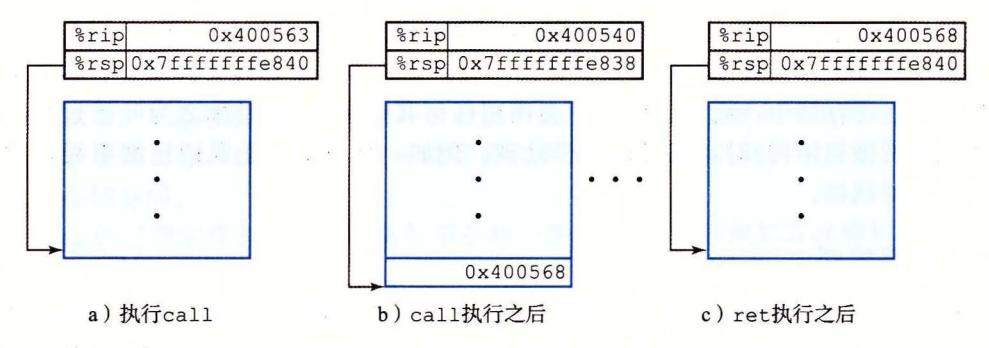
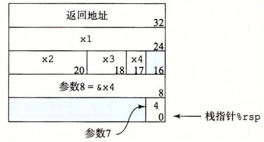
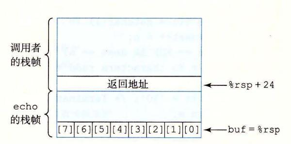
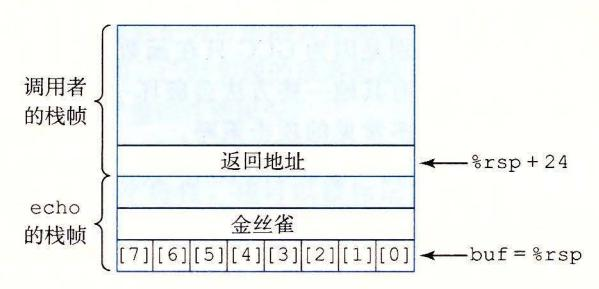
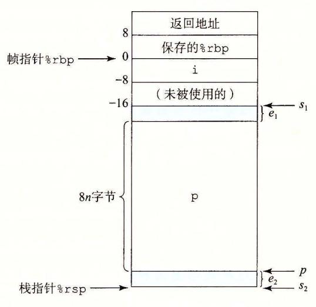
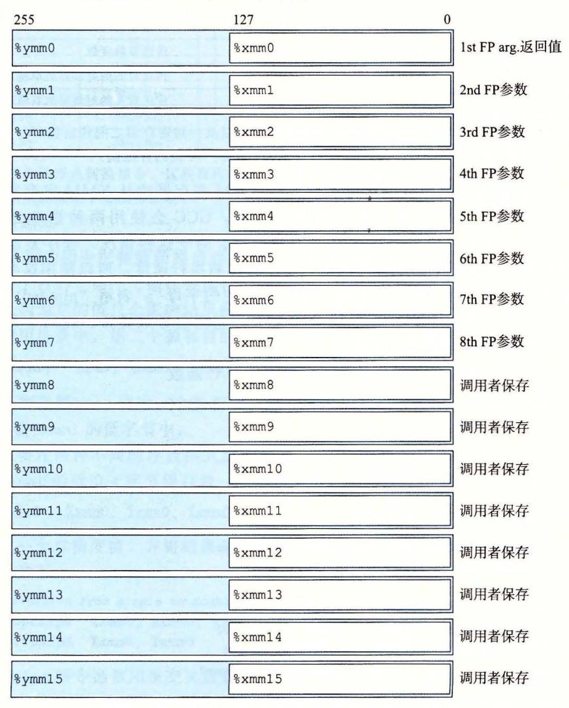

给出了 行时栈的通用结构,包括把它划分为栈帧 当前正在执行的过程的帧总是在栈 当过 调用过程 时, 把返回地址压入栈中,指明 返回时,要从 程序的哪 个位 执行 我们把这个返回地址当做 的栈帧的 部分,因为它存放的是与 的状态 的代码会扩展当前栈的边界,分配它的栈帧所 在这个空间中,它可 以保存寄存器的值,分配局部变 空间,为它调用的过程设置 大多数过程的栈帧都 是定长的,在过程的开始就分配好了 但是有些过程需要变长的帧,这个问题会在 3. 10. 5 节中讨论 通过寄存器,过程 可以传递最多 个整数值(也就是指针和整数),但是如果 要更多的 数, 可以在调用 之前在自己的栈帧里存储好这些

为了提高空间和时间效率, <sup>64</sup> 过程只分配自己所需要的栈帧部分。例如,许多过 程有 个或者 少的参数,那么所有的参数都可以通过寄存器传递 因此,图 3-25 中画 出的某些栈帧部分可以省略 实际上,许多函数甚至根本不 要栈帧。当所有的局部变 都可以保存在寄存器中,而且该函数不会调用任何其他函数(有时称之为叶子过程,此时 把过程调用看做树结构)时,就可以这样处理。例如,到目前为止我们仔细审视过的所有 函数都不 要栈帧

## 3. 7. 2 转移控制

将控制从函数 转移到函数 要简单地把程序计数器 (P 设置为 的代码的起始位 不过, 稍后从 返回的时候,处理器必须记录好它 要继续 的执行的代码位置 x86 -6 机器中,这个信息是用指 all 调用过程 来记录的。该指 会把地址 压入栈 中,并将 PC 设置为 的起始地址 压入的地址 被称为返回地址,是紧跟在 call 指令后 面的那条指令的地址。对应的指令 ret 从栈中弹出地址 A, 并把 PC 设置为

下表给出的是 call ret 指令的 般形式:

|      |          | 描述     |
|------|----------|--------|
| call | Label    | 过程调用   |
| call | ·Operand | 过程调用   |
| ret  |          | 从过程调用中 |

(这些指令在程序 OBJDUMP 的反汇编输出中被称为 callq retq 。添加的后缀 'q' 只是为了强调这些是 x86-64 版本的调用和返回,而不是 IA32 的。在 x86-64 汇编代码中, 这两种版本可以互换。)

call 指令有 个目标,即指明被调用过程起始的指令地址 同跳转一样,调用可以 接的,也可以是间接的 在汇编代码中,直接调用的目标是一个标号,而间接调用的 目标是 后面跟 个操作数指 符,使用的是图 3-3 中描述的格式之一。

-26 说明了 3. 2. 节中介 multst re main 函数的 call ret 指令的执行 情况 下面是这两个函数的反汇编代码的节选:

#### Beginning of function multstore

1 0000000000400540 <multstore>:

<sup>2</sup>400540: 53 3 400541: 48 89 d3 push %rbx mov %rdx,%rbx

Return from function mul tstore

<sup>4</sup>40054d: c3 retq

#### Call to multstore from ma

56 400563: e8 d8 ff ff ff 400568: 48 8b 54 24 08 callq 400540 <multstore> mov Ox8(%rsp),%rdx

在这段代码中我们可以看到,在 main 函数中,地址为 Ox400563 call 指令调用函 multstore 。此时的状态如图 3-26a 所示,指明了栈指针%rsp 和程序计数器%豆 的值。 call 的效果是将返回地址 Ox400568 压入栈中,并跳到函数 mul store 的第 条指令,地 址为 x0400540 (图 3-266) 。函数 mu ltstore 继续执行,直到遇到地址 Ox40054d 处的 re 指令。这条指令从栈中弹出值 Ox400568, 然后跳转到这个 地址,就在 call 令之 后,继续 main 函数的执行



3-26 call ret 函数的说明。 call 指令将控制转移到一个函数的起始, ret 指令返回到这次调用后面的那条指令

再来看 个更详细说明在过程间传递控制的例子, 3-27a 出了两个函数 top leaf 的反汇编代码,以及 main 函数中调用 top 处的代码 。每 条指令都以标号标出: Ll~L2 Oeaf 中), Tl~T4(main 中)和 Ml~M2(main 中) 。该 图的 部分给出了这段代码执

```
Disassembly of leaf(long y) 
    y in %rdi 
1 0000000000400540 <leaf> : 
2 400540: 48 8d 47 02 
3 400544: c3 
                               lea Ox2 (%rdi), %rax L1: y+2 
                               retq L2: Return 
4 · oo00000000400545 <top>: 
    D.1sassembly of top(long x) 
    x.1n %rd.1 
5 400545 : 48 83 ef 05 sub $0x5, %rdi Tl : x-5 
6 400549: e8 f2 ff ff ff callq 400540 <leaf> T2: Call leaf (x-5) 
7 40054e: 48 01 cO add %rax,%rax T3: Double result 
8 400551 : c3 retq T4: Return 
      Call to top from function main 
9 40055b: e8 e5 ff ff ff callq 400545 <top> Ml: Call top(100) 
1 O 400560: 48 89 c2 rnov %rax, %rdx M2: Resume
```

a) 说明过程调用和返回的反汇编代码

3-27 包含过程调用和返回的程序的执行细节 。使用栈来存储返回地址 使得能够返回到过程中正确的位置

|    | 指令        |       |     | 状态值(指令执行前) |                    |          |              |
|----|-----------|-------|-----|------------|--------------------|----------|--------------|
| 标号 | PC        | 指令    | rdi | %rax       | %rsp               | rsp      | 描述           |
| Ml | Ox40055b  | callq | JOO |            | Ox7fffffffe820     |          | 调用top (100)  |
| Tl | Ox400555  | sub   | 100 |            | Ox7 fffffffeS 18   | Ox400560 | 进入top        |
| T2 | Ox        | callq | 95  |            | Ox7fffffffe818     | Ox400560 | 调用 leaf (95) |
| LI | Ox400540  | lea   | 95  |            | Ox7 fffffffe810    | Ox40054e | 进人leaf       |
| L2 | Ox400544  | retq  |     | 97         | Ox7fffffffe810     | Ox40054e | leaf返回97     |
| T3 | Ox40054e  | add   |     | 97         | Ox7fffffffe8<br>18 | Ox400560 | 继续top        |
| T4 | Ox40055 1 | retq  |     | 194        | Ox7fffffffe818     | Ox400560 | top返回 194    |
| M2 | Ox400560  | rnov  |     | 194        | Ox7fffffffe820     |          | 继续main       |

### 示例代码的执行过程

27 (续)

行的详细过程, main 调用 top(lOO) ,然后 top 调用 leaf(95) 。函数 leaf top 返回 97, 然后 top main <sup>94</sup> 。前面三列描述了被执行的指令,包括指令标号、地 址和 指令类型 。后面 四列给出了在该指令执行前程序的状态,包括寄存器 rd rax rsp 的内容,以及位于栈顶的值。仔细研究这张表的内容,它们说明了运行时栈在管理支持过 程调用和返回所需的存储空间中的重要作用。

leaf 的指令 Ll 将%rax 设置为 97, 也就是要 返回的值。然后指令 L2 返回 ,它从栈中 弹出 Ox400054e 。通过将 PC 设置为这个弹出的值,控制转移回 top T3 指令。程序成功 完成对 leaf 的调用,返回到 top

指令 T3 rax 设置为 194, 也就是要从 top 返回的值。然后指令 T4 返回,它从栈中 弹出 Ox4000560, 因此将 PC 设置为 main M2 指令。程序成功完成对 top 的调用,返回 。可以看到,此时栈指针也恢复成 Ox7fffffffe820, 即调用 op 前的值

可以看到,这种把返回地址压入栈的简单的机制能够让函数在稍后返回到程序中正确 的点 语言(以及大多数程序语言)标准的调用/返回机制刚好 与栈提供的后 进先出的内 存管理方法吻合。

练习题 32 下面列出的是 两个函数 irst last 反汇编代码,以及 main 函数 调用 fir 的代码:

```
sassembly of last(long u, long v) 
    u in ¾rdi, ¾rsi
1 0000000000400540 <last>: 
2 400540 : 48 89 f8 
3 400543: 48 Of af c6 
4 400547: c3 
5 
6 
7 
8 
   Disassembly of fir st (long x) 
    x in %rdi 
   0000000000400548 <first>: 
     400548: 48 8d 77 01 
     40054c: 48 83 ef 01 
     400550: e8 eb ff ff ff 
                                      mov %rdi,%rax 
                                      imul %rsi,%rax 
                                      retq 
                                      lea Ox1(%rdi),%rsi 
                                      sub $0x1,%rdi 
                                      callq 400540 <last> 
                                                               L1: u 
                                                               L2: u•v 
                                                               L3: Return 
                                                               F1 : x+1 
                                                               F2 : x-1 
                                                               F3 : Call l ast(x-1,x+1)
```

9 400555: f3 c3 repz retq F4 : Return

1 o 400560: e8 e3 ff ff ff callq 400548 <first> M1 : Call rst 10)

11 400565: 48 89 c2 mov %rax, %rdx M2: Resume

每条指令都有一个标号,类似于图 3-27a 。从 main 调用丘rs (10) 开始,到程序 返回 main 时为止, 填写 下表 记录指令执行的过程。

|    | 指令       | 状态值(指  |       | 执行前) |     |                |    |             |
|----|----------|--------|-------|------|-----|----------------|----|-------------|
| 标号 | PC       |        | %r di | %rsi | rax | %rsp           | rs | 描述          |
| Ml | Ox400560 | ca llq | 10    |      |     | Ox7fffffffe820 |    | 调用 f1rstOO) |
| Fl |          |        |       |      |     |                |    |             |
| F2 |          |        |       |      |     |                |    |             |
| F3 |          |        |       |      |     |                |    |             |
| L1 |          |        |       |      |     |                |    |             |
| L2 |          |        |       |      |     |                |    |             |
| L3 |          |        |       |      |     |                |    |             |
| F4 |          |        |       |      |     |                |    |             |
| M2 |          |        |       |      |     |                |    |             |

## 3. 7. 3 数据传送

当调用一个过程时,除了要把控制传递给它并在过程返回时再传递回来之外,过程调 用还可能包括把数据作为参数传递,而从过程返回还有可能包括返回一个值 x86-64 中, 大部分过程间的数据传送是通过寄存器实现的 例如,我们已经看到无数的函数示例,参 数在寄存器 rdi rsi 和其他寄存器中传递 。当 过程 调用过程 时, 的代码必须首先 把参数复制到适当的寄存器中 。类 似地,当 返回到 时, 的代码可以访问寄存器 rax 中的返回值。在本节中,我们更详细地探讨这些规则。

x86 <sup>64</sup> 中,可以通过寄存楛最多传递 个整型(例如整数和指针)参数 。寄 存器的使用 是有特殊顺序的,寄存器使用的名字取决千要传递的数据类型的大小,如图 3-28 所示 会根据参数在参数列表中的顺序为它们分配寄存器。可以通过 <sup>64</sup> 位寄存器适当的部分访 问小千 <sup>64</sup> 位的参数 例如,如果第一个参数是 <sup>32</sup> 位的,那么可以用%edi 来访问它

|          | 参数数批 |      |      |      |      |      |  |
|----------|------|------|------|------|------|------|--|
| 操作数大小(位) | 1    | 2    | 3    | 4    | 5    | 6    |  |
| 64       | rdi  | %rsi | %rdx | rcx  | r8   | %r9  |  |
| 32       | %edi | %esi | %edx | %ecx | r8d  | %r9d |  |
| 16       | %di  | %si  | %dx  | ex   | %r8w | r9w  |  |
| 8        | il   | %sil | %dl  | cl   | %r8b | %r9b |  |

-28 传递 函数参数 的寄存器 寄存器是按照特殊顺序来使用的, 而使用的名 字是 根据参数的大小来确定的

如果一个函数有大于 个整型参数,超出 个的部分就要通过栈来传递 。假设 过程 调用过程 Q, 个整型参数,且 > 。那么 的代码分配的栈帧必须要能容纳 号参数的存储空间,如图 3-2 所示 要把参数 ~6 制到对应的寄存器,把参数 7~n

到栈上,而参数 7 位于栈顶。通过栈传递参数时,所有的数据大小都向 8 的倍数对齐。参数到位以后,程序就可以执行 call 指令将控制转移到过程 Q 了。过程 Q 可以通过寄存器访问参数,有必要的话也可以通过栈访问。相应地,如果 Q 也调用了某个有超过 6 个参数的函数,它也需要在自己的栈帧中为超出 6 个部分的参数分配空间,如图 3-25 中标号为"参数构造区"的区域所示。

作为参数传递的示例,考虑图 3-29a 所示的 C 函数 proc。这个函数有 8 个参数,包括字节数不同的整数(8、4、2 和 1)和不同类型的指针,每个都是 8 字节的。

```
void proc(long a1, long *a1p,
```

a) C代码

```
void proc(a1, a1p, a2, a2p, a3, a3p, a4, a4p)
    Arguments passed as follows:
     al in %rdi
                        (64 bits)
     alp in %rsi
                        (64 bits)
     a2 in %edx
                       (32 bits)
     a2p in %rcx
                       (64 bits)
     a3 in %r8w
                       (16 bits)
      a3p in %r9
                        (64 bits)
      a4 at %rsp+8
                       ( 8 bits)
     a4p at %rsp+16
                       (64 bits)
    proc:
1
              16(%rsp), %rax Fetch a4p (64 bits)
2
      movq
              %rdi, (%rsi)
3
      addq
                              *a1p += a1 (64 bits)
      addl
             %edx, (%rcx)
                               *a2p += a2 (32 bits)
4
      addw %r8w, (%r9)
5
                               *a3p += a3 (16 bits)
      movl
              8(%rsp), %edx
                               Fetch a4 (8 bits)
6
      addb %dl, (%rax)
7
                                *a4p += a4 (8 bits)
8
      ret
                                Return
```

b) 生成的汇编代码

图 3-29 有多个不同类型参数的函数示例。参数 1~6 通过寄存器传递,而参数 7~8 通过栈传递

图 3-29b 中给出 proc 生成的汇编代码。前面 6 个参数通过寄存器传递,后面 2 个通过栈传递,就像图 3-30 中画出来的那样。可以看到,作为过程调用的一部分,返回地址被压入栈中。因而这两个参数位于相对于栈指针距离为 8 和 16 的位置。在这段代码中,我们可以看到根据操作数的大小,使用了 ADD 指令的不同版本: a1(long)使用 addq,a2(int)使用 addl,a3(short)使用 addw,而 a4(char)使用 addb。请注意第 6 行的movl 指令从内存读入 4 字节,而后面的 addb 指令只使用其中的低位一字节。


图 3-30 函数 proc 的栈帧结构。参数 a4 和 a4p 通过栈传递

返回地址

0 <del>←</del> 栈指针%rsp

※ 练习题 3.33 C函数 procprob 有 4 个参数 u、a、v和 b,每个参数要么是一个有符号数,要么是一个指向有符号数的指针,这里的数大小不同。该函数的函数体如下:

\*u += a; \*v += b;

170

return sizeof(a) + sizeof(b);

编译得到如下 x86-64 代码:

- 1 procprob:
- 2 movslq %edi, %rdi
- 3 addq %rdi, (%rdx)
- 4 addb %sil, (%rcx)
- 5 movl \$6, %eax
- 6 ret

确定4个参数的合法顺序和类型。有两种正确答案。

### 3.7.4 栈上的局部存储

到目前为止我们看到的大多数过程示例都不需要超出寄存器大小的本地存储区域。不过有些时候,局部数据必须存放在内存中,常见的情况包括:

- 寄存器不足够存放所有的本地数据。
- 对一个局部变量使用地址运算符'&',因此必须能够为它产生一个地址。
- 某些局部变量是数组或结构,因此必须能够通过数组或结构引用被访问到。在描述 数组和结构分配时,我们会讨论这个问题。
- 一般来说,过程通过减小栈指针在栈上分配空间。分配的结果作为栈帧的一部分,标号为"局部变量",如图 3-25 所示。

来看一个处理地址运算符的例子,图 3-31a 中给出的两个函数。函数 swap\_add 交换指针 xp 和 yp 指向的两个值,并返回这两个值的和。函数 caller 创建到局部变量 arg1 和 arg2 的指针,把它们传递给 swap\_add。图 3-31b 展示了 caller 是如何用栈帧来实现这些局部变量的。caller 的代码开始的时候把栈指针减掉了 16;实际上这就是在栈上分配了 16 个字节。S 表示栈指针的值,可以看到这段代码计算 &arg2 为 S+8(第 5 行),而 &arg1 为 S。因此可以推断局部变量 arg1 和 arg2 存放在栈帧中相对于栈指针偏移量为 0 和 8 的地方。当对 swap\_add 的调用完成后,caller 的代码会从栈上取出这两个值(第 8~9 行),计算它们的差,再乘以 swap\_add 在寄存器%rax 中返回的值(第 10 行)。最后,该函数把栈指针加 16,释放栈帧(第 11 行)。通过这个例子可以看到,运行时栈提供了一种简单的、在需要时分配、函数完成时释放局部存储的机制。

如图 3-32 所示,函数 call\_proc 是一个更复杂的例子,说明 x86-64 栈行为的一些特性。尽管这个例子有点儿长,但还是值得仔细研究。它给出了一个必须在栈上分配局部变量存储空间的函数,同时还要向有 8 个参数的函数 proc 传递值(图 3-29)。该函数创建一个栈帧,如图 3-33 所示。

```
long swap_add(long *XP, long *yp) 
{ 
    long x = *xp; 
    long y = *yp; 
    *XP = y; 
    *YP = x; 
return x + y; } 
long caller() 
{ 
    long argl = 534; 
    long arg2 = 1057; 
    long sum= swap_add(&argl, &arg2); 
    long diff = argl - arg2; 
    return sum* diff; 
}
```

a) swap\_ dd 和调用函数的代码

```
long caller() 
    caller: 
2 subq $16, %rsp Allocate 16 bytes for stack frame 
3 movq $534, (%rsp) Store 534 in arg1 
4 movq $1057, 8(%rsp) Store 1057 in arg2 
5 leaq 8(%rsp), %rsi Compute Jcarg2 as second argument 
6 movq %rsp, %rdi Compute &arg1 as first argument 
7 call swap_add Call swap_add(&arg1, &arg2) 
8movq (%rsp), %rdx Get arg1 
9 subq 8(%rsp), ~!.rdx Compute diff = arg1 - arg2 
10 irnulq %rdx, %rax Compute sum* diff 
11 addq $16, %rsp Deallocate stack frame 
12 ret Return
```

b) 调用函数生成的汇编代码

过程定义和调用的示例。由于会使用地址运算符,所以调用代码必须分配一个栈帧

```
long call_proc () 
{ 
    long xl = 1; int x2 = 2; 
    short x3 = 3; char x4 = 4; 
    proc(xl, &xl, x2, &x2, x3, &x3, x4, &x4); 
    return (x1+x2)*(x3-x4); 
}
```

a) swap\_add 和调用函数的代码

<sup>32</sup> 调用在图 3-29 中定义的函数 proc 的代码示例 该代码创建了 个栈帧

| 7 | 7 | 0 |
|---|---|---|
|   |   |   |
|   |   |   |

|    | long call_proc() |                            |                              |
|----|------------------|----------------------------|------------------------------|
|    | call_proc:       |                            |                              |
|    |                  | Set up arguments to proc   |                              |
| 2  | subq             | \$32, %rsp                 | Allocate 32-byte stack frame |
| 3  | movq             | \$1, 24(%rsp)              | Store 1 in &xl               |
| 4  | movl             | \$2, 20(%rsp)              | Store 2.1n &x2               |
| 5  | movw             | \$3, 18 (%rsp)             | Store 3.1n &x3               |
| 6  | movb             | \$4, 17(%rsp)              | Store 4 in &x4               |
| 7  | leaq             | 17(%rsp), %rax             | Create &x4                   |
| 8  | movq             | o!.rax, 8(%rsp)            | Store &x4 as argument 8      |
| 9  | \$4,<br>movl     | (%rsp)                     | Store 4 as argument 7        |
| 10 | leaq             | 18(%rsp), %r9              | Pass &x3 as argument 6       |
| 11 | movl             | \$3, %r8d                  | Pass 3 as argument 5         |
| 12 | leaq             | 20(%rsp), %rcx             | Pass &x2 as argument 4       |
| 13 | movl<br>\$2,     | .儿 edx                     | Pass 2 as argument 3         |
| 14 | leaq             | 24(%rsp),<br>.儿 rsi        | Pass &xl as argument 2       |
| 15 | movl             | \$1, %edi                  | Pass 1 as argument 1         |
|    | Call proc        |                            |                              |
| 16 | call             | proc                       |                              |
|    |                  | Retrieve changes to memory |                              |
| 17 | movslq           | 20(%rsp), %rdx             | Get x2 and convert to long   |
| 18 | addq             | 24(%rsp), %rdx             | Compute x1+x2                |
| 19 | movswl           | 18(%rsp), %eax             | Get x3 and convert to int    |
| 20 | movsbl           | 17(%rsp), %ecx             | Get x4 and convert to int    |
| 21 | subl             | %ecx, %eax                 | Compute x3-x4                |
| 22 | cltq             |                            | Convert to long              |
| 23 | imulq            | %rdx, %rax                 | Compute (x1+x2) * (x3-x4)    |
| 24 | addq             | \$32, %rsp                 | Deallocate stack frame       |
| 25 | ret              |                            | Return                       |

b) 调用函数生成的汇编代码

32 (续)

看看 call\_proc 的汇编代码(图 3-32b) ,可以看到代码中一大部分(第 2~15 行)是为调 proc 做准备。其中包括为局部变最和函数参数建立栈帧,将函数参数加载至寄存器。如 3-33 所示,在栈上分配局部变量 xl~x4, 它们具有不同的大小: 24~3l(xl), 20~23 (x2), 18~ 19(x3) 17(s3) 。用 leaq 指令生成到这些位置的指针(第 <sup>10</sup> <sup>12</sup> <sup>14</sup> 行)。 参数 (值为 4) (指向 x4 的位置的指针)存放在栈中相对于栈指针偏移量为 的地方。

当调用过程 proc 时,程序会开始执行图 3-29b 中的代码。如图 3-30 所示,参数

现在位千相对千栈指针偏移最为 <sup>16</sup> 地方,因为返回地址这时已经被压入栈中了。

当程序返回 call proc 时,代码会取出 个局部变量(第 17~20 行),并执行最终的 计算。在程序结束前,把栈指针加 32, 释放 这个栈帧。

## 3. 7. 5 寄存器中的局部存储空间

寄存器组是唯一被所有过程共享的资源。



<sup>33</sup> 函数 call\_yroc 的栈帧。该栈帧包含局部 变量和两个要传递给函数 proc 的参数

虽然在给定时刻只有一个过程是活动的,我们仍然必须确保当一个过程(调用者)调用另一 个过程(被调用者)时,被调用者不会覆盖调用者稍后会使用的寄存器值。为此, x86-64 用了一组统一的寄存器使用惯例,所有的过程(包括程序库)都必须遵循。

根据惯例,寄存器%rbx %rbp 和%r12~%r15 被划分为被调用者保存寄存器。当过程 调用过程 时, 必须保存这些寄存器的值,保证它们的值在 返回到 时与 被调用时 是一样的。过程 保存 个寄存器的值不变,要么就是根本不去改变它,要么就是把原始 值压入栈中,改变寄存器的值,然后在返回前从栈中弹出旧值。压入寄存器的值会在栈帧 中创建标号为"保存的寄存器"的一部分,如图 <sup>25</sup> 中所示。有了这条惯例, 的代码就 能安全地把值存在被调用者保存寄存器中(当然,要先把之前的值保存到栈上),调用 Q, 然后继续使用寄存器中的值,不用担心值被破坏。

所有其他的寄存器,除了栈指针%rsp, 都分类为调用者保存寄存器。这就意味着任何 函数都能修改它们。可以这样来理解"调用者保存"这个名字:过程 在某个此类寄存器 中有局部数据,然后调用过程 。因为 可以随意修改这个寄存器,所以在调用之前首先 保存好这个数据是 (调用者)的责任。

来看一个例子,图 3-34a 中的函数 。它两次调用 。在第一次调用中,必须保存 值以备后面使用。类似地,在第二次调用中,也必须保存 Q(y) 的值。图 3-34b 中,可以看 GCC 生成的代码使用了两个被调用者保存寄存器:%rbp 保存 和% rbx 保存计算出来的

```
long P(long x, long y) 
{ 
} 
    long u = Q(y); 
    long v = Q(x); 
    return u + v;
```

a) 调用函数

```
1 
2 
3 
4 
5 
6 
7 
8 
9 
10 
11 
12 
13 
14 
15 
    long P(long x, long y) 
    x.In %rdi, y.In %rs.I 
    P: 
     pushq %rbp Save i.rbp 
     pushq %rbx Save ¼rbx 
      subq $8, %rsp Align stack frame 
     movq %rdi, %rbp Save x 
     rnovq %rsi, %rdi Move y to first argument 
      call Q Call Q(y) 
     rnovq %rax, %rbx Save result 
     movq %rbp, %rdi Move x to first argument 
      call Q Call Q(x) 
      addq %rbx, %rax Add saved Q(y) to Q(x) · 
      addq $8, %rsp Deallocate last part of stack 
     popq %rbx Restore %rbx 
     popq %rbp Restore ¼rbp 
     ret
```

b) 调用函数生成的汇编代码

3-3 展示被调用者保存寄存器使用的代码。在第 次调用中, 必须保存 的值,第二次调用中,必须保存 Q(y) 的值

Q(y) 的值。在函数的开头,把这两个寄存器的值保存到栈中(第 2~3 行)。在第一次调用 之前,把参数 复制到%rbp (第 行)。在第二次调用 之前,把这次调用的结果复制到 rbx (第 行) 在函数的结尾,(第 13~14 行),把它们从栈中弹出,恢复这两个被调用者保存寄 存器的值。注意它们的弹出顺序与压入顺序相反,说明了栈的后进先出规则。

练习题 34 一个函数 生成名为 a0~a7 的局部变量,然后调用函数 Q, 没有参数。 GCC 的第一部分产生如下代码:

```
long P(long x) 
   x in %rdi 
    P: 
2 pushq o!.r15 
3 pushq %r14 
4 pushq %r13 
5 pushq %r12 
6 pushq %rbp 
7 pushq %rbx 
8 subq $24, %rsp 
9 movq %rdi, %rbx 
10 l eaq 1(%rdi), %r15 
11leaq 2(%rdi), %r14 
12 leaq 3(%rdi), %r13 
13leaq 4(%rdi), %r12 
14 leaq 5(%rdi), %rbp 
15 leaq 6(%rdi), %rax 
16 movq %rax, (%rsp) 
17 leaq 7(%rdi), %rdx 
18 movq %rdx, 8(%rsp) 
19 movl $0, %eax 
20 call Q
```

- A. 确定哪些局部值存储在被调用者保存寄存器中。
- B. 确定哪些局部变量存储在栈上。
- c. 解释为什么不能把所有的局部值都存储在被调用老保存寄存器中

### 3. 7. 6 递归过程

前面已经描述的寄存器和栈的惯例使得 x86-64 过程能够递归地调用它们自身。每个 过程调用在栈中都有它自己的私有空间,因此多个未完成调用的局部变量不会相互影响 此外,栈的原则很自然地就提供了适当的策略,当过程被调用时分配局部存储,当返回时 释放存储。

3-35 给出了递归的阶乘函数的 代码和生成的汇编代码。可以看到汇编代码使用 寄存\$%rbx 来保存参数 ,先把已有的值保存在栈上(第 行),随后在返回前恢复该值 (第 <sup>11</sup> 行)。根据栈的使用特性和寄存器保存规则,可以保证当递归调用 rfact(n-1) 返回 时(第 行),( )该次调用的结果会保存在寄存器% rax 中,( )参数 的值仍然在寄存 器% rbx 中。把这两个值相乘就能得到期望的结果

从这个例子我们可以看到,递归调用一个函数本身与调用其他函数是一样的 栈规则 提供了一种机制,每次函数调用都有它自己私有的状态信息(保存的返回位 和被调用者 保存寄存器的值)存储空间 如果需要,它还可以提供局部变量的存储。栈分配和释放的 规则很自然地就与函数调用-返回的顺序匹配。这种实现函数调用和返回的方法甚至对更复杂的情况也适用,包括相互递归调用(例如,过程 P调用 ⊙,⊙ 再调用 P)。

```
long rfact(long n)
{
    long result;
    if (n <= 1)
        result = 1;
    else
        result = n * rfact(n-1);
    return result;
}</pre>
```

a) C代码

```
long rfact(long n)
     n in %rdi
     rfact:
1
2
       pushq
                %rbx
                                     Save %rbx
3
       movq
                %rdi, %rbx
                                     Store n in callee-saved register
4
       movl
                $1, %eax
                                    Set return value = 1
              $1, %rdi
       cmpq
5
                                     Compare n:1
                .L35
       jle
                                     If <=, goto done
6
                -1(%rdi), %rdi
7
       leaq
                                     Compute n-1
8
       call
               rfact
                                     Call rfact(n-1)
       imulq %rbx, %rax
9
                                     Multiply result by n
     .L35:
10
                                   done:
                %rbx
                                     Restore %rbx
11
       popq
12
       ret
                                     Return
```

b) 生成的汇编代码

图 3-35 递归的阶乘程序的代码。标准过程处理机制足够用来实现递归函数

### ★习题 3.35 一个具有通用结构的 C函数如下:

```
long rfun(unsigned long x) {
   if (_____)
       return
   unsigned long nx =
   long rv = rfun(nx);
   return
7
GCC 产生如下汇编代码:
   long rfun(unsigned long x)
   x in %rdi
   rfun:
1
             %rbx
2
     pushq
3
     movq
             %rdi, %rbx
             $0, %eax
     movl
4
             %rdi, %rdi
5
     testq
```

```
6 je . L2 
7shrq $2, %rdi 
8 call rfun 
9 addq %rbx, %rax 
10 .12: 
11 popq %rbx 
12 ret
```

A. rfun 存储在被调用者保存寄存器%rbx 中的值是什么?

B. 填写上述 代码中缺失的表达式。

# 3. 8 数组分配和访问

语言中的数组是一种将标量数据聚集成更大数据类型的方式。 语言实现数组的方式 非常简单,因此很容易翻译成机器代码。 语言的一个不同寻常的特点是可以产生指向数组 中元素的指针,并对这些指针进行运算。在机器代码中,这些指针会被翻译成地址计算。

优化编译器非常善于简化数组索引所使用的地址计算。不过这使得 代码和它到机器 代码的翻译之间的对应关系有些难以理解。

## 3. 8. 1 基本原则

对于数据类型 和整型常数 N, 声明如下:

T A[N];

起始位置表示为环 这个声明有两个效果。首先,它在内存中分配 • 字节的连续 区域,这里 是数据类型 的大小(单位为字节)。其次,它引入了标识符 A, 可以用 作为指向数组开头的指针,这个指针的值就是环。可以用 O~N-1 的整数索引来访问该数 组元素。数组元素 会被存放在地址为 XA +L. 的地方。

作为示例,让我们来看看下面这样的声明:

char A [12]; char \*B [8]; int C [6]; double \*D[5];

这些声明会产生带下列参数的数组:

| 数组 | 元素大小 | 总的大小 | 起始地址 | 元素     |
|----|------|------|------|--------|
| A  | 1    | 12   | x.   | 石卢-    |
| B  | 8    | 64   | XB   |        |
| C  | 4    | 24   | Xe   | xc +4, |
| D  | 8    | 40   | 工.   | +8,    |

数组 <sup>12</sup> 个单字节 (char) 元素组成。数组 个整数组成,每个需要 个字节。 都是指针数组,因此每个数组元素都是 个字节。

x86-64 的内存引用指令可以用来简化数组访问。例如,假设 是一个 江型的数组, 而我们想计算 E[i] ,在此, 的地址存放在寄存器%rdx 中,而 存放在寄存器% rcx 中。 然后,指令

movl (%rdx, %rcx, 4), eax

会执行地址计算 XE+4i, 读这个内存位置的值,并将结果存放到寄存器%eax 中。允许的

伸缩因子 覆盖了所有基本简单数据类型的大小。

练习题 36 考虑下面的声明:

short S [7]; short \*T [3] ; short \*\*U [6] ;

int V[8]; double \*W[4];

填写下表,描述每个数组的元素大小、整个数组的大 小以 及元素 的地址:

| 数组 | 元素大小 | 整个数组的大小 | 起始地址 | 元素 |
|----|------|---------|------|----|
| s  |      |         |      |    |
| T  |      |         | .rT  |    |
| u  |      |         |      |    |
| V  |      |         | .rv  |    |
| w  |      |         | .:rw |    |

## 3 8 2 指针运算

语言允许对指针进行运算,而计算出来的值会根据该指针引用的数据类型的大小进 行伸缩。也就是说,如果 是一个指向类型为 的数据的指针, 的值为乓,那么表达式 p+i 的值为丐+ • i, 这里 是数据类型 的大小。

单操作数操作符`矿和'\*'可以产生指针和间接引用指针。也就是,对千一个表示某 个对象的表达式 Expr, &Expr 是给出该对象地址的一个指针 对于一个表示地址的表达 AExpr, \*AExpr 给出该地址处的值。因此,表达式 Expr 与\* Expr 是等价的。可以对 数组和指针应用数组下标操作。数组引用 [i] 等同千表达式\* A+ 习。它计算第 个数 组元素的地址,然后访问这个内存位置。

扩展 下前面的例子,假设整型数组 的起始地址和整数索引 分别存放在寄存器 %rdx rcx 中。下面是一些与 有关的表达式。我们还给出了每个表达式的汇编代码实 现,结果存放在寄存器%eax (如果是数据)或寄存器%rax (如果是指针)中。

| 表达式      | 类型   |                      | 汇编代码                                |
|----------|------|----------------------|-------------------------------------|
| E        | int* |                      | movq %rdx, %rax                     |
| E[O]     | int  | M[ .rF ]             | movl (%rdx), %r a x                 |
| E [i )   | int  | M[.rE + 4z]          | movl<br>eax<br>rdx,<br>rcx,4),      |
| &E[2]    | int* | E+8                  | leaq 8<br>rd<br>rax                 |
| E+i      | int* | +41                  | leaq-4<br>rdx,<br>x,4),<br>rax      |
| *(E+i-3) | int  | M[ .rE+ 4l -<br>l 2] | movl<br>12( %rdx,<br>rcx,4),<br>eax |
| &E[i}-E  | long | l                    | movq<br>rax<br>x,                   |

在这些例子中,可以看到返回数组值的操作类型为 int, 因此涉及 字节操作(例如 movl) 和寄存器(例如%eax) 。那些返回指针的操作类型为 int \*,因此涉及 字节操作 (例如 leaq) 和寄存器(例如%rax) 。最后一个例子表明可以计算同一个数据结构中的两个 指针之差,结果的数据类型为 long, 值等于两个地址之差除以该数据类型的大小。

练习题 37 假设短整型数组 的地址 Xs 和整数索引 分别存放在寄存器% rdx %rcx 中。对下面每个表达式,给出它的类型、值的表达式和汇编代码实现。如果结果 是指针的话,要保存在寄存器%rax 中,如果 数据类型为 sho rt, 就保存在寄存器元 素%ax 中。

| 表达式       | 类型 | 汇编代码 |
|-----------|----|------|
| S+ 1      |    |      |
| S [3]     |    |      |
| &S [ij    |    |      |
| S[4*i+ l] |    |      |
| S+ i-5    |    |      |

## 3. 8. 3 嵌套的数组

当我 们创建数组的数组时,数组分配和引用的一般 则也是成立的。例如, 声明 int A [5] [3] ;

等价于下面 的声明

typedef int row3\_t[3]; row3\_t A[5];

数据类型 row3 被定义为一个 个整数的数组。数组 包含 个这样的元素,每个元素 需要 <sup>12</sup> 个字节来存储 整数。整个数组 的大小就 4X5X3=60 字节

数组 还可以被看成一个 列的二维数组,用 A[O] [0] [4] [2] 来引用 。数组元素在 内存中按照"行优先"的 顺序排列,意味着第 行的所有元素,可以写作 [0] ,后面 跟着第 行的所有元素 (A [l ,以此类推,如图 -36 所示。

这种排列顺序是嵌套声明的结果。将 看作 个有 元素的数组,每个元素都是 int 的数组,首先是 [OJ, 然后是 [l] ,以此类推

要访 问多维数组的 元素,编译器会 以数组起始为 地址, (可能需要经 过伸缩的 )偏移量为索引 ,产生计算期望的元素 的偏移量,然后使用某种 MOV 指令。通常来说,对于一个 声明如 下的数组:

T D[R] [CJ;

它的数组元素 D[i []]的内存地址为

$$\&D[i][j] = x_D + L(C \cdot i + j)$$
(3.1)

这里, 是数据类型 以字节为单位的大小。作为一个示例,

元素 地址 A[O] A[O] [OJ x. A[O] [1] XA + 4 A[O] [2] x, + 8 A[l] A[l] [0] x, + 12 A [1 ) [1) x\_, + 16 A[ l ] [2 ] x, + 20 A[2) A[2 ] [0 ] x, + 24 A[2] [l ] x, + 28 A[2 ] [ 2 ) XA + 32 A[3] A[3] [ D] XA + }6 A[3] [1 ] x. +40 A[3 ] [2] x, +44 A[4] A[4] [OJ x, + 48 A[4] [1] x. + 52 A[4 l [ 2 ] XA + 56

<sup>36</sup> 按照行优先顺序 存储的数组元素

考虑前面定义 的整型数组 假设工 和)分别在寄存器%rdi %rsi rdx 中。 然后 ,可以用下面的代码将数组元 [i] [j] 复制到寄存器 eax 中:

A in rd工,工工 %rsi, and j in %rdx

- 23 <sup>l</sup> eaq (%rsi,%r si,2), %r ax leaq (%rdi,%rax,4), %rax Compute 31 Compute xA + <sup>121</sup>
- movl (%rax,%rdx,4), %eax Read from M[xA + 12i +

正如可以看到的那样,这段代码计算元素的地址为 + 12i + 4j = x A +4C3 十八 ,使用了 x86 <sup>64</sup> 地址运算的伸缩和加法特性

○ 练习题 3.38 考虑下面的源代码,其中 M 和 N 是用# define 声明的常数:

```
long P[M][N];
long Q[N][M];
long sum_element(long i, long j) {
   return P[i][j] + Q[j][i];
在编译这个程序中, GCC 产生如下汇编代码:
    long sum_element(long i, long j)
    i in %rdi, j in %rsi
   sum_element:
2
             0(,%rdi,8), %rdx
     leag
             %rdi, %rdx
3
     subq
             %rsi, %rdx
4
     addq
5
             (%rsi,%rsi,4), %rax
     leaq
     addq
             %rax, %rdi
             Q(,%rdi,8), %rax
     movq
     addq
             P(,%rdx,8), %rax
     ret
```

运用逆向工程技能,根据这段汇编代码,确定 M 和 N 的值。

### 3.8.4 定长数组

C语言编译器能够优化定长多维数组上的操作代码。这里我们展示优化等级设置为-01时GCC采用的一些优化。假设我们用如下方式将数据类型 fix\_matrix 声明为 16×16 的整型数组:

```
#define N 16
.typedef int fix_matrix[N][N];
```

(这个例子说明了一个很好的编码习惯。当程序要用一个常数作为数组的维度或者缓冲区的大小时,最好通过# define 声明将这个常数与一个名字联系起来,然后在后面一直使用这个名字代替常数的数值。这样一来,如果需要修改这个值,只用简单地修改这个# define 声明就可以了。)图 3-37a 中的代码计算矩阵 A 和 B 乘积的元素 i, k, 即 A 的行 i 和 B 的列 k 的内积。GCC 产生的代码(我们再反汇编成 C),如图 3-37b 中函数  $fix_prod_ele_opt$  所示。这段代码包含很多聪明的优化。它去掉了整数索引 j,并把所有的数组引用都转换成了指针间接引用,其中包括(1)生成一个指针,命名为 Aptr,指向 A 的行 i 中连续的元素;(2)生成一个指针,命名为 Bptr,指向 B 的列 k 中连续的元素;(3)生成一个指针,命名为 Bend,当需要终止该循环时,它会等于 Bptr 的值。Aptr 的初始值是 A 的行 i 的第一个元素的地址,由 C 表达式 k A k B k B k D k D k D k D k D k D k D k D k D k D k D k D k D k D k D k D k D k D k D k D k D k D k D k D k D k D k D k D k D k D k D k D k D k D k D k D k D k D k D k D k D k D k D k D k D k D k D k D k D k D k D k D k D k D k D k D k D k D k D k D k D k D k D k D k D k D k D k D k D k D k D k D k D k D k D k D k D k D k D k D D k D D k D D k D D k D D k D D D k D D D D k D D D D D D D D D D D D D D D D D D D

下面给出的是 GCC 为函数 fix\_prod\_ele 生成的这个循环的实际汇编代码。我们看到 4 个寄存器的使用如下:%eax 保存 result,%rdi 保存 Aptr,%rcx 保存 Bptr,而%rsi 保存 Bend。

```
/* Compute i,k of fixed matrix product */\nint fix_prod_ele (fix_matrix A, fix_matrix B, long i, long k) {
    long j;
    int result = 0;

    for (j = 0; j < N; j++)
        result += A[i][j] * B[j][k];

    return result;
}</pre>
```

#### a) 原始的C代码

```
/* Compute i,k of fixed matrix product */
 2
     int fix_prod_ele_opt(fix_matrix A, fix_matrix B, long i, long k) {
 3
         int *Aptr = &A[i][0];
                                 /* Points to elements in row i of A
 4
         int *Bptr = &B[0][k];
                                  /* Points to elements in column k of B */
 5
         int *Bend = &B[N][k];
                                 /* Marks stopping point for Bptr
         int result = 0;
6
7
         do {
                                        /* No need for initial test */
                                        /* Add next product to sum
8
             result += *Aptr * *Bptr;
9
             Aptr ++;
                                        /* Move Aptr to next column */
                                        /* Move Bptr to next row
10
             Bptr += N;
                                                                     */
         } while (Bptr != Bend);
                                        /* Test for stopping point
11
12
         return result:
13
    }
```

#### b) 优化过的C代码

图 3-37 原始的和优化过的代码,该代码计算定长数组的矩阵乘积的元素 i, k。 编译器会自动完成这些优化

int fix\_prod\_ele\_opt(fix\_matrix A, fix\_matrix B, long i, long k)
A in %rdi, B in %rsi, i in %rdx, k in %rcx

```
1
     fix_prod_ele:
2
       salq
                 $6, %rdx
                                          Compute 64 * i
3
       addq
                %rdx, %rdi
                                          Compute Aptr = x_A + 64i = &A[i][0]
                 (%rsi,%rcx,4), %rcx
                                          Compute Bptr = x_B + 4k = &B[0][k]
4
       leaq
5
       leag
                 1024(%rcx), %rsi
                                          Compute Bend = x_{B} + 4k + 1024 = \&B[N][k]
       movl
                 $0, %eax
6
                                          Set result = 0
7
     .L7:
                                        loop:
                 (%rdi), %edx
8
       movl
                                          Read *Aptr
9
       imull
                 (%rcx), %edx
                                          Multiply by *Bptr
       addl
                 %edx, %eax
10
                                          Add to result
                 $4, %rdi
11
       addq
                                          Increment Aptr ++
12
       addq
                 $64, %rcx
                                          Increment Bptr += N
13
       cmpq
                 %rsi, %rcx
                                          Compare Bptr:Bend
14
       jne
                 .L7
                                          If !=, goto loop
15
       rep; ret
                                          Return
```

禁习题 3.39 利用等式 3.1 来解释图 3-37b 的 C 代码中 Aptr、Bptr 和 Bend 的初始值计算(第 3~5 行)是如何正确反映 fix prod ele 的汇编代码中它们的计算(第 3~5 行)的。

### № 练习题 3.40 下面的 C 代码将定长数组的对角线上的元素设置为 val:

```
/* Set all diagonal elements to val */
void fix_set_diag(fix matrix A, int val) {
   for (i = 0; i < N; i++)
       A[i][i] = val:
7
    当以优化等级-01编译时,GCC产生如下汇编代码:
1 fix_set_diag:
   void fix_set_diag(fix_matrix A, int val)
   A in %rdi, val in %rsi
2
    movl
            $0. %eax
3
   .I.13:
            %esi, (%rdi,%rax)
   movl
             $68, %rax
    addq
5
             $1088, %rax
    cmpq
6
7
             .1.13
     ine
8
     rep; ret
```

创建一个 C 代码程序  $fix_set_diag_opt$ , 它使用类似于这段汇编代码中所使用的优化,风格与图 3-37b 中的代码一致。使用含有参数 N 的表达式,而不是整数常量,使得如果重新定义了 N,你的代码仍能够正确地工作。

### 3.8.5 变长数组

历史上,C语言只支持大小在编译时就能确定的多维数组(对第一维可能有些例外)。程序员需要变长数组时不得不用 malloc 或 calloc 这样的函数为这些数组分配存储空间,而且不得不显式地编码,用行优先索引将多维数组映射到一维数组,如公式(3.1)所示。ISO C99引入了一种功能,允许数组的维度是表达式,在数组被分配的时候才计算出来。

在变长数组的 C 版本中, 我们可以将一个数组声明如下:

int A[expr1] [expr2]

它可以作为一个局部变量,也可以作为一个函数的参数,然后在遇到这个声明的时候,通过对表达式 expr1 和 expr2 求值来确定数组的维度。因此,例如要访问  $n\times n$  数组的元素 i, j, 我们可以写一个如下的函数:

```
int var_ele(long n, int A[n][n], long i, long j) {
   return A[i][j];
}
```

参数 n 必须在参数 A[n][n]之前,这样函数就可以在遇到这个数组的时候计算出数组的维度。 GCC 为这个引用函数产生的代码如下所示:

```
int var_ele(long n, int A[n][n], long i, long j)
    n in %rdi, A in %rsi, i in %rdx, j in %rcx
    var_ele:
1
                %rdx, %rdi
2
       imulq
                                                Compute n · i
3
       leag
                 (%rsi,%rdi,4), %rax
                                                Compute x_{\Delta} + 4(n \cdot i)
                 (%rax, %rcx, 4), %eax
4
       movl
                                               Read from M[x_A + 4(n \cdot i) + 4j]
      ret
5
```

正如注释所示,这段代码计算元素 i, j 的地址为  $x_A+4(n\cdot i)+4j=x_A+4(n\cdot i+j)$ 。这个地址的计算类似于定长数组的地址计算(参见 3. 8. 3 节),不同点在于 1)由于增加了参数 n, 寄存器的使用变化了; 2)用了乘法指令来计算  $n\cdot i$ (第 2 行),而不是用 1eaq 指令来计算 3i。因此引用变长数组只需要对定长数组做一点儿概括。动态的版本必须用乘法指令对 i 伸缩 n 倍,而不能用一系列的移位和加法。在一些处理器中,乘法会招致严重的性能处罚,但是在这种情况中无可避免。

在一个循环中引用变长数组时,编译器常常可以利用访问模式的规律性来优化索引的计算。例如,图 3-38a 给出的 C 代码,它计算两个  $n \times n$  矩阵 A 和 B 乘积的元素 i, k。GCC 产生的汇编代码,我们再重新变为 C 代码(图 3-38b)。这个代码与固定大小数组的优化代码(图 3-37)风格不同,不过这更多的是编译器选择的结果,而不是两个函数有什么根本的不同造成的。图 3-38b 的代码保留了循环变量 j,用以判定循环是否结束和作为到 A 的行i的元素组成的数组的索引。

```
1  /* Compute i,k of variable matrix product */
2  int var_prod_ele(long n, int A[n][n], int B[n][n], long i, long k) {
3    long j;
4    int result = 0;
5    for (j = 0; j < n; j++)
7        result += A[i][j] * B[j][k];
8    return result;
10 }</pre>
```

a)原始的C代码

```
/* Compute i,k of variable matrix product */\nint var_prod_ele_opt(long n, int A[n][n], int B[n][n], long i, long k) {
   int *Arow = A[i];
   int *Bptr = &B[0][k];
   int result = 0;
   long j;
   for (j = 0; j < n; j++) {
      result += Arow[j] * *Bptr;
      Bptr += n;
   }
   return result;
}</pre>
```

b) 优化后的C代码

图 3-38 计算变长数组的矩阵乘积的元素 i, k 的原始代码和优化后的代码。编译器自动执行这些优化下面是 var prod ele 的循环的汇编代码:

```
Registers: n in %rdi, Arow in %rsi, Bptr in %rcx
4n in %r9, result in %eax, j in %edx

1 .L24: loop:
2 movl (%rsi,%rdx,4), %r8d Read Arow[j]
3 imull (%rcx), %r8d Multiply by *Bptr
```

```
addl
              %r8d, %eax
                                            Add to result
              $1, %rdx
                                            j++
5
      addq
              %r9, %rcx
      addq
                                            Bptr += n
              %rdi, %rdx
      cmpq
                                            Compare j:n
               .L24
                                            If !=, goto loop
      jne
```

我们看到程序既使用了伸缩过的值 4n(寄存器%r9)来增加 Bptr,也使用了 n 的值(寄存器%rdi)来检查循环的边界。C 代码中并没有体现出需要这两个值,但是由于指针运算的伸缩,才使用了这两个值。

可以看到,如果允许使用优化,GCC能够识别出程序访问多维数组的元素的步长。然后生成的代码会避免直接应用等式(3.1)会导致的乘法。不论生成基于指针的代码(图 3-37b)还是基于数组的代码(图 3-38b),这些优化都能显著提高程序的性能。

### 3.9 异质的数据结构

C语言提供了两种将不同类型的对象组合到一起创建数据类型的机制:结构(structure),用关键字struct来声明,将多个对象集合到一个单位中;联合(union),用关键字union来声明,允许用几种不同的类型来引用一个对象。

#### 3.9.1 结构

C语言的 struct 声明创建一个数据类型,将可能不同类型的对象聚合到一个对象中。用名字来引用结构的各个组成部分。类似于数组的实现,结构的所有组成部分都存放在内存中一段连续的区域内,而指向结构的指针就是结构第一个字节的地址。编译器维护关于每个结构类型的信息,指示每个字段(field)的字节偏移。它以这些偏移作为内存引用指令中的位移,从而产生对结构元素的引用。

### 给 C 语言初学者 将一个对象表示为 struct

·C语言提供的 struct 数据类型的构造函数(constructor)与 C++ 和 Java 的对象最为接近。它允许程序员在一个数据结构中保存关于某个实体的信息,并用名字来引用这些信息。

例如,一个图形程序可能要用结构来表示一个长方形:

```
struct rect {
                    /* X coordinate of lower-left corner */
   long llx;
                    /* Y coordinate of lower-left corner */
    unsigned long width; /* Width (in pixels)
                                                            */
    unsigned long height; /* Height (in pixels)
                                                            */
   unsigned color;
                        /* Coding of color
};
可以声明一个 struct rect 类型的变量 r, 并将它的字段值设置如下:
struct rect r;
r.llx = r.lly = 0;
r.color = 0xFF00FF;
r.width = 10;
r.height = 20;
```

这里表达式 r.llx 就会选择结构 r 的 llx 字段。

另外, 我们可以在一条语句中既声明变量又初始化它的字段:

```
struct rect r = \{ 0, 0, 10, 20, 0xFF00FF \}:
```

将指向结构的指针从一个地方传递到另一个地方,而不是复制它们,这是很常见的。例如,下面的函数计算长方形的面积,这里,传递给函数的就是一个指向长方形 struct 的指针·

```
long area(struct rect *rp) {
    return (*rp).width * (*rp).height;
}
```

表达式 (\*rp).width 间接引用了这个指针,并且选取所得结构的 width 字段。这里必须要用括号,因为编译器会将表达式\*rp.width 解释为\* (rp.width),而这是非法的。间接引用和字段选取结合起来使用非常常见,以至于 C 语言提供了一种替代的表示法->。即 rp-> width 等价于表达式 (\*rp).width。例如,我们可以写一个函数,它将一个长方形顺时针旋转 90 度。

```
void rotate_left(struct rect *rp) {
    /* Exchange width and height */
    long t = rp->height;
    rp->height = rp->width;
    rp->width = t;
    /* Shift to new lower-left corner */
    rp->llx -= t;
}
```

C++ 和 Java 的对象比 C 语言中的结构要复杂精细得多,因为它们将一组可以被调用来执行计算的方法与一个对象联系起来。在 C 语言中,我们可以简单地把这些方法写成普通函数,就像上面所示的函数 area 和 rotate left。

让我们来看看这样一个例子,考虑下面这样的结构声明:

```
struct rec {
    int i;
    int j;
    int a[2];
    int *p;
};
```

这个结构包括 4 个字段: 两个 4 字节 int、一个由两个类型为 int 的元素组成的数组和一个 8 字节整型指针, 总共是 24 个字节:

| 偏移 | 0 | 4 | 8    |      | 16 | 24 |
|----|---|---|------|------|----|----|
| 内容 | i | j | a[0] | a[1] | р  |    |

可以观察到,数组 a 是嵌入到这个结构中的。上图中顶部的数字给出的是各个字段相对于结构开始处的字节偏移。

为了访问结构的字段,编译器产生的代码要将结构的地址加上适当的偏移。例如,假设 struct rec\* 类型的变量 r 放在寄存器%rdi 中。那么下面的代码将元素 r->i 复制到元素 r->i:

```
Registers: r in %rdi

1 movl (%rdi), %eax Get r->i
2 movl %eax, 4(%rdi) Store in r->j
```

因为字段 i 的偏移量为 0, 所以这个字段的地址就是 r 的值。为了存储到字段 j, 代码要将 r 的地址加上偏移量 4。

要产生一个指向结构内部对象的指针,我们只需将结构的地址加上该字段的偏移量。例如,只用加上偏移量  $8+4\times1=12$ ,就可以得到指针 &(r-a[1])。对于在寄存器%rdi中的指针 r 和在寄存器%rsi中的长整数变量 i,我们可以用一条指令产生指针 &(r-a[1])的值。

```
Registers: r in %rdi, i %rsi
leaq 8(%rdi,%rsi,4), %rax Set %rax to &r->a[i]
最后举一个例子,下面的代码实现的是语句:
r->p = &r->a[r->i + r->j];
开始时 r 在寄存器%rdi 中:
Registers: r in %rdi
```

```
1 movl 4(%rdi), %eax
```

4 leaq 8(%rdi,%rax,4), %rax Compute &r->a[r->i + r->j]

5 movq  $\frac{\text{%rax}}{16(\text{%rdi})}$  Store in  $r \rightarrow p$ 

综上所述,结构的各个字段的选取完全是在编译时处理的。机器代码不包含关于字段 声明或字段名字的信息。

★3類3.41 考虑下面的结构声明:

```
struct prob {
    int *p;
    struct {
        int x;
        int y;
    } s;
    struct prob *next;
};
```

这个声明说明一个结构可以嵌套在另一个结构中,就像数组可以嵌套在结构中、数组可以嵌套在数组中一样。

下面的过程(省略了某些表达式)对这个结构进行操作。

```
void sp_init(struct prob *sp) {
    sp->s.x = ____;
    sp->p = ____;
    sp->next = ____;
}
```

A. 下列字段的偏移量是多少(以字节为单位)?

```
p: _____
s.x: ____
s.y: ____
next:
```

- B. 这个结构总共需要多少字节?
- C. 编译器为 sp init 的主体产生的汇编代码如下:

```
void sp_init(struct prob *sp)
    sp in %rdi
    sp_init:
1
      movl
               12(%rdi), %eax
2
      movl
               %eax. 8(%rdi)
      leaq
               8(%rdi), %rax
4
               %rax, (%rdi)
5
      movq
               %rdi, 16(%rdi)
6
      movq
      ret
```

根据这些信息,填写 sp init 代码中缺失的表达式。

📉 练习题 3.42 下面的代码给出了类型 ELE 的结构声明以及函数 fun 的原型:

```
struct ELE {
   long
   struct ELE *p;
}:
long fun(struct ELE *ptr);
    当编译 fun 的代码时, GCC 会产生如下汇编代码:
    long fun(struct ELE *ptr)
    ptr in %rdi
    fun:
1
      movl
              $0, %eax
2
              .L2
      jmp
3
    .L3:
4
              (%rdi), %rax
5
      addq
              8(%rdi), %rdi
6
      movq
7
    .L2:
              %rdi, %rdi
8
      testq
9
      ine
              .L3
10
      rep; ret
```

- A. 利用逆向工程技巧写出 fun 的 C 代码。
- B. 描述这个结构实现的数据结构以及 fun 执行的操作。

#### 3.9.2 联合

联合提供了一种方式,能够规避 C 语言的类型系统,允许以多种类型来引用一个对象。联合声明的语法与结构的语法一样,只不过语义相差比较大。它们是用不同的字段来引用相同的内存块。

考虑下面的声明:

```
struct S3 {
    char c;
    int i[2];
    double v;
};\nunion U3 {
    char c;
    int i[2];
    double v;
};
```

| 类型 | C-oo | l-40 | V-160 |  |
|----|------|------|-------|--|
| S3 |      |      |       |  |
| U3 |      |      |       |  |

(稍后 会解释 S3 的偏移 量为什么是 而不是 1' 以及为什么 的偏移量是 <sup>16</sup> 而不 <sup>12</sup> 。) 对于类型 union U3 \*的指针 p, p-> p-> i[O] p-> 引用 的都是数据结构 的起始位置 还可以观察 到, 个联合的总的大小等于它最大字段的大小

在一些 下上 文中,联合十分有用。但是, 它也能引起一些讨厌的错误 ,因为它们 绕过 语言类型系统提供的安全措施 。一 种应用情况是,我们 先知道对一个数据结构中的 个不同字段的使用是互斥的,那么将这两个字段声明为联 合的 部分 ,而不是结构的一 部分,会减小分配空间的总量

例如, 假设我 们想实现 二叉 树的数据结构,每个叶子节点都有两个 double 类型的 数据值,而 个内部节点都有指向两个孩子节点的指针,但是没有数据 如果声明如下:

```
struct node_s { 
    struct node_s *left; 
    struct node_s *right; 
    double data[2]; 
};
```

那么每个节 点需要 <sup>32</sup> 个字节, 类型的节点都要浪费 半的字节。相反 ,如果我们如 声明 个节点:

```
union node_u { 
    struct { 
        union node_u *left; 
        union node_u *right; 
    } internal; 
    double data[2]; 
} ;
```

那么,每个节点就只需要 <sup>16</sup> 个字节 如果 个指针 ,指向 union node\_u \*类型的节 点,我们用 n- da a[O] n-> da a[l] 引用叶子节 点的数据,而用 <sup>i</sup> nternal. left n- inte rnal.right 来引用内部节点的孩子

不过,如果这样编码,就没有办法来确定一个给定的节点到底是叶子节点,还是内部 节点 通常的方法是引入一个枚举类税,定 义这个联合中可能的不同选择,然后再创建一 个结构,包含一个标签字段和这个联合:

typedef enum { N\_LEAF, N\_INTERNAL} nodetype\_t;

```
struct node_t { 
    nodetype_t type; 
    union { 
        struct { 
             struct node_t *left; 
             struct node_t *right; 
        } internal; 
        double data[2]; 
    } info; 
};
```

这个结构总共需要 <sup>24</sup> 个字节: type 个字节, info.internal.left info. ernal. ght 各要 个字节,或者是 info.data <sup>16</sup> 个字节 我们后面很快会谈到,在 type 和联合的元素之间 节的填充,所以 个结构大小为 4+16=2 。在这 种情况中,相对于给代码造成的麻烦,使用联合带来的节省是很小的。对于有较 字段的 数据结构,这样的节省会更加吸引人。

联合还可以用来访间不同数据类型的位模式 例如,假设我们使用简单的强制类型转 换将 double 类型的值 转换为 unsigned ng 类型的值 U:

```
unsigned long u = (unsigned long) d;
```

会是 的整数表示。 除了 的值为 0.0 的情况以外, 的位表示会与 的很不一样 再看下面这段代码,从一个 ub 产生 unsigned ng 类型的值:

```
unsigned long double2bits(double d) { 
}; 
    union { 
         doubled; 
        unsigned long u; 
    } temp; 
    temp.d = d; 
    return temp.u;
```

在这段代码中,我们以 种数据类型来存储联合中的 数,又以另一种数据类型来访 问它 结果会是 具有和 一样的位表示,包括符号位 段、指数和尾数,如 <sup>11</sup> 节中 描述的那样 的数值与 的数值没有任何关系,除了 等于 0. 的情况

当用联合来将各种不同大小的数据类型结合到 起时,字节顺序问题就变 很重要 例如,假设我们 了一个过程,它以两个 节的 unsigned 的位模式,创建一个 字节的 uble:

```
double uu2double(unsigned wordO, unsigned word1) 
} 
    union { 
        doubled; 
        unsigned u[2]; 
    } temp; 
    temp.u[O] = wordO; 
    temp.u[1] = word1; 
    return temp.d;
```

x86 <sup>64</sup> 这样的小端法机 上,参数 wordO 的低位 个字节,而 wordl 是高位 个字节 在大端法机器上,这两个参数的角色刚好相反

练习题 43 假设给你个 ,检查一下 编译 结构和联合的访问产生正确的 代码 你写了下面的结 构声 明:

```
typedef union { 
    struct { 
        long u; 
        short v; 
        char w;
```

```
} t1; 
   struct { 
        int a[2]; 
        char *p; 
   } t2; 
} u_type; 
  写了一组具有下面这种形 的函
void get (u_type *up, type *dest) { 
   *dest = expr; 
}
```

组函数有 不一 样的 访问表达式 ex pr, 而且根 expr 的类型来设置目 据类型 然后再 查编 这些函数时产生的代码,看看它们是否与你预 的一样

假设在这些函数中, up dest 分别被加载到寄存器 rdi rsi 中。填写下表中的 数据类型 type, 并用 1~3 条指令序列来计算表达式,并将结果存储到 des 七中。

| expr                         | type  | 代码                                         |
|------------------------------|-------|--------------------------------------------|
| up->tl.u                     | l ong | movq (%r di),<br>%rax<br>movq %rax, (%rsi) |
| up- >tl.<br>v                |       |                                            |
| &up->tl. w                   |       |                                            |
| up->t2.a                     |       |                                            |
| [up- >tl<br>up->t2.a<br>. u) |       |                                            |
| *up->t2.p                    |       |                                            |

## 3. 9. 3 数据对齐

许多计算机系统对基本数据类型的合法地址做出了 些限制,要求某种类型对象的地 址必须是某个值 (通常是 8) 的倍数 这种对齐限制简化了形成处理器和内存系统 之间接口的硬件设计 例如,假设一个处理器总是从内存中取 节,则地址必须为 的倍数 如果我们能保证将所有的 double 类型数据的地址对齐成 的倍数,那么就可以 用一个内存操作来读或者写值了。否则,我们可能需要执行两次内存访问,因为对象可能 被分放在两个 字节内存块中。

无论数据是否对齐, x86-64 硬件都能正确工作。不过, Intel 还是建议要对齐数据以 提高内存系统的性能。对齐原则是任何 字节的基本对象的地址必须是 的倍数。可以 看到这条原则会得到如下对齐:

| K | 类型                |
|---|-------------------|
| 1 | char              |
| 2 | short             |
| 4 | int,float         |
| 8 | long,double,char* |

确保每种数据类型都是按照指定方式来组织和分配,即每种类型的对象都满足它的对 齐限制,就可保证实施对齐。编译器在汇编代码中放入命令,指明全局数据所需的对齐。 例如,3.6.8 节开始的跳转表的汇编代码声明在第2行包含下面这样的命令:

#### .align 8

这就保证了它后面的数据(在此,是跳转表的开始)的起始地址是8的倍数。因为每个表项长8个字节,后面的元素都会遵守8字节对齐的限制。

对于包含结构的代码,编译器可能需要在字段的分配中插入间隙,以保证每个结构元 素都满足它的对齐要求。而结构本身对它的起始地址也有一些对齐要求。

比如说,考虑下面的结构声明:

```
struct S1 {
    int i;
    char c;
    int j;
};
```

假设编译器用最小的9字节分配,画出图来是这样的:

| 偏移 | 0 | 4 5 |   | 9 |
|----|---|-----|---|---|
| 内容 | i | С   | j |   |

它是不可能满足字段 i(偏移为 0)和 j(偏移为 5)的 4 字节对齐要求的。取而代之地,编译器在字段 c 和 j 之间插入一个 3 字节的间隙(在此用蓝色阴影表示):

| 偏移 | 0 | 4 5 | 8 | 12 |
|----|---|-----|---|----|
| 内容 | i | С   | j |    |

结果, j 的偏移量为 8,而整个结构的大小为 12 字节。此外,编译器必须保证任何 struct S1 \* 类型的指针 p 都满足 4 字节对齐。用我们前面的符号,设指针 p 的值为  $x_p$ 。那么, $x_p$ 必须是 4 的倍数。这就保证了 p-> i(地址  $x_p$ )和 p-> j(地址  $x_p$ +8)都满足它们的 4 字节对齐要求。

另外,编译器结构的末尾可能需要一些填充,这样结构数组中的每个元素都会满足它的对齐要求。例如,考虑下面这个结构声明:

```
struct S2 {
    int i;
    int j;
    char c;
};
```

如果我们将这个结构打包成 9 个字节,只要保证结构的起始地址满足 4 字节对齐要求,我们仍然能够保证满足字段 i 和 j 的对齐要求。不过,考虑下面的声明:

```
struct S2 d[4];
```

分配 9 个字节,不可能满足  $\alpha$  的每个元素的对齐要求,因为这些元素的地址分别为  $x_{\alpha}$ 、 $x_{\alpha}+9$ 、  $x_a+18$  和  $x_a+27$ 。相反,编译器会为结构 S2 分配 12 个字节,最后 3 个字节是浪费的空间:

| 偏移 | 0 |   | 4 | 8 | 9    | 12 |
|----|---|---|---|---|------|----|
| 内容 |   | i | j | С | 18.5 |    |

这样一来, d的元素的地址分别为  $x_d$ 、 $x_d+12$ 、 $x_d+24$  和  $x_d+36$ 。只要  $x_d$ 是 4 的倍数, 所有的对齐限制就都可以满足了。

- 🏹 练习题 3.44 对下面每个结构声明,确定每个字段的偏移量、结构总的大小,以及 在 x86-64 下它的对齐要求:
  - A. struct P1 { int i; char c; int j; char d; };
  - B. struct P2 { int i; char c; char d; long j; };
  - C. struct P3 { short w[3]; char c[3] };
  - D. struct P4 { short w[5]; char \*c[3] };
  - E. struct P5 { struct P3 a[2]: struct P2 t }:
- 练习题 3.45 对于下列结构声明回答后续问题:

```
struct {
    char
              *a:
    short
               b;
    double
               c;
    char
               d:
    float
               e:
    char
               f;
    long
               g;
    int
               h;
} rec;
```

- A. 这个结构中所有的字段的字节偏移量是多少?
- B. 这个结构总的大小是多少?
- C. 重新排列这个结构中的字段, 以最小化浪费的空间, 然后再给出重排过的结构的 字节偏移量和总的大小。

#### 旁注 强制对齐的情况

对于大多数 x86-64 指令来说,保持数据对齐能够提高效率,但是它不会影响程序 的行为。另一方面,如果数据没有对齐,某些型号的 Intel 和 AMD 处理器对于有些实 现多媒体操作的 SSE 指令,就无法正确执行。这些指令对 16 字节数据块进行操作,在 SSE 单元和内存之间传送数据的指令要求内存地址必须是 16 的倍数。任何试图以不满 足对齐要求的地址来访问内存都会导致异常(参见8.1节),默认的行为是程序终止。

因此,任何针对 x86-64 处理器的编译器和运行时系统都必须保证分配用来保存可能会被 SSE 寄存器读或写的数据结构的内存,都必须满足 16 字节对齐。这个要求有两个后果:

- 任何内存分配函数(alloca、malloc、calloc或 realloc)生成的块的起始地址 都必须是16的倍数。
- 大多数函数的栈帧的边界都必须是16字节的倍数。(这个要求有一些例外。) 较近版本的 x86-64 处理器实现了 AVX 多媒体指令。除了提供 SSE 指令的超集,支 持AVX的指令并没有强制性的对齐要求。

# 3. 10 在机器级程序中将控制与数据结合起来

到目前为止,我们已经分别讨论机器级代码如何实现程序的控制部分和如何实现不同 的数据结构。在本节中,我们会看看数据和控制如何交互。首先,深入审视 下指针,它 编程语 中最重要的概念之一,但是许多程序员对它的理解都非常浅显 我们复习符 号调试器 GDB 的使用,用它仔细检查机器级程序的详细运行。接下来,看看理解机器级 程序如何帮助我们研究缓冲区溢出,这是现实世界许多系统中一种很重要的安全漏洞。最 后,查看机器级程序如何实现函数要求的栈空间大小在每次执行时都可能不同的情况。

## 3. 10. 1 理解指针

指针是 语言的 个核心特色。它们以一种统一方式,对不同数据结构中的元素产生 引用。对于编程新手来说,指针总是会带来很多的困惑,但是基本概念其实非常简单。在 此,我们重点介绍一些指针和它们映射到机器代码的关键原则。

·每个指针都对应一个类型。这个类型表明该指针指向的是哪一类对象。以下面的指 针声明为例:

int \*ip; char \*\*cpp;

变量 ip 个指向 int 类型对象的指针,而 cpp 指针指向的对象自身就是 个指向 char 类型对象的指针 通常,如果对象类型为 T, 那么指针的类型为 T\* 。特殊的 void\* 类型代表通用指针。比如说, ma oc 函数返回一个通用指针,然后通过显 式强制类型转换或者赋值操作那样的隐式强制类型转换,将它转换成一个有类型的 指针 指针类型不是机器代码中的一部分;它们是 语言提供的一种抽象,帮助程 序员避免寻址错误。

- ·每个指针都有一个值。这个值是某个指定类型的对象的地址。特殊的 NULL(O) 值表 示该指针没有指向任何地方
- ·指针用'矿运算符创建。这个运算符可以应用到任何 lvalue 类的 表达式上, lvalue 意指可以出现在赋值语句左边的表达式。这样的例子包括变量以及结构、 联合和数组的元素。我们已经看到,因为 leaq 指令是设计用来计算内存引用的地 址的,&运算符的机器代码实现常常用这条指令来计算表达式的值。
- \*操作符用于间接引用指针。其结果是一个值,它的类型与该指针的类型一致。间 接引用是用内存引用来实现的,要么是存储到一个指定的地址,要么是从指定的地 址读取。
- ·数组与指针紧密联系。一个数组的名字可以像一个指针变最 样引用(但是不能修 改)。数组引用(例如 a[3] )与指针运算和间接引用(例如\* (a+ 3) )有 样的效果。 数组引用和指针运算都需要用对象大小对偏移量进行伸缩。当我们写表达式 p+ i, 这里指针 的值为 p, 得到的地址计算为 · i, 这里 是与 相关联的数据类 型的大小。
- ·将指针从一种类型强制转换成另一种类型,只改变它的类型,而不改变它的值。强 制类型转换的一个效果是改变指针运算的伸缩。例如,如果 是一个 char\* 类型 的指针,它的值为 p, 那么表达式 (int\*)p+7 计算为 p+28, 而( int \*) (p+ 7) 计算为 p+7 。(回想一下,强制类型转换的优先级高千加法。)

·指针也可以指向函数。这提供了一个很强大的存储和向代码传递引用的功能,这些引用 可以被程序的某个其他部分调用 例如,如果我们有一个函数,用下面这个原型定义:

int fun(int x, int \*p);

然后,我们可以声明一个指针 fp, 将它赋值为这个函数,代码如下:

int (\*fp)(int, int\*); fp = fun;

然后用这个指针来调用这个函数

int y = 1; int result= fp(3, &y);

函数指针的值是该函数机器代码表示中第一条指令的地址。

# 四正正 ,王詈1a 函数指针

函数指针声明的语法对程序员新手来说特别难以理解。对于以下声明: int (\*f)(int\*);

要从里(从 "f" 开始)往外读。因此,我们看到像 "(\*f)" 表明的那样, 是一个指针; "(\*f) (int\*)" 表明 是一个指向函数的指针,这个函数以一个 int\* 作为参数。 最后,我们看到,它是指向以 int \*为参数并返回 int 的函数的指针。

\*f 两边的括号是必需的,否则声明变成

int \*fCint\*);

它会被解读成

(int•) f(int•);

也就是说,它会被解释成一个函数原型,声明了一个函数 f, 它以一个 int \*作为参数 并迈回一个 int\*

ernighan Ritchie [61, 5. <sup>12</sup> 节]提供了一个有关阅读 声明的很有帮助的教程。

## 3. 10 . 2 应用:使用 GDB 调试器

GNU 的调试器 GDB 提供了许多有用的特性,支持机器级程序的运行时评估和分析 对千本书中的示例和练习,我们试图通过阅读代码,来推断出程序的行为。有了 GDB, 可以观察正在运行的程序, 同时又对程序的执行有相当的控制, 这使得研究程序的行为变 为可能

<sup>39</sup> 给出了一些 GDB 命令的例子,帮助研究机器级 x86-64 程序。先运行 OBJ DUMP 来获得程序的反汇编版本,是很有好处的。我们的示例都基于对文件 prog 运行 GDB, 程序的描述和反汇编见 3. 2. 我们用下面的命令行来启动 GDB:

linux> gdb prog

通常的方法是在程序中感兴趣的地方附近设置断点。断点可以设置在函数入口后面, 或是 个程序的地址处。程序在执行过程中遇到一个断点时,程序会停下来,并将控制返 回给用户。在断点处,我们能够以各种方式查看各个寄存器和内存位置。我们也可以单步 跟踪程序,一次只执行几条指令,或是前进到下一个断点

| Anp                                 | 效果                              |  |  |
|-------------------------------------|---------------------------------|--|--|
| 开始和停止                               |                                 |  |  |
| qui t                               | 退出 GOB                          |  |  |
| run                                 | 运行程序(在此给出命令行参数)                 |  |  |
| ki ll                               | 停止程序                            |  |  |
| 断点                                  |                                 |  |  |
| break ul ts<br>or                   | re 入口处设置断点<br>mul<br>st         |  |  |
| break * Ox4 0054 0                  | 在地址 Ox40054<br>处设置断点            |  |  |
| delete 1                            | 删除断点                            |  |  |
| delete                              | 删除所有断点                          |  |  |
| 执行                                  |                                 |  |  |
| s t epi                             | 条指令<br>执行                       |  |  |
| s tepi 4                            | 执行<br>条指令                       |  |  |
| nexti                               | 类似于 stepi,<br>但以函数调用为单位         |  |  |
| continue                            | 继续执行                            |  |  |
| finish                              | 运行到当前函数返回                       |  |  |
| 检查代码                                |                                 |  |  |
| disas                               | 反汇编<br>前函数                      |  |  |
| d i sas mu l tstore                 | 反汇编函数 multstore                 |  |  |
| disas Ox400544                      | 反汇编位于地址 Ox400544 附近的函数          |  |  |
| d i sas Ox400540, Ox40054d          | 反汇编指定地址范围内的代码                   |  |  |
| print /x \$rip                      | 以十六进制输出程序计数器的值                  |  |  |
| 检查数据                                |                                 |  |  |
| print \$rax                         | 以十进制输出<br>rax 的内容               |  |  |
| print /x \$rax                      | 以十六进制输出%rax 的内容                 |  |  |
| print /t \$rax                      | 以二进制输出%rax 的内容                  |  |  |
| print OxlOO                         | OO 的十进制表示<br>输出 Ox              |  |  |
| print /x 555                        | 输出 555 的十六进制表示                  |  |  |
| print /x (\$rsp+ 8)                 | 以十六进制输出<br>rsp 的内容加上            |  |  |
| print * (long *) Ox7ff<br>fffffe818 | 输出位于地址 Ox7fffffffe818 的长整数      |  |  |
| print * (l<br>ong *) (\$rsp+ 8)     | 输出位于地址%rsp+S 处的长整数              |  |  |
| x/2g Ox7ffffff<br>f e818            | 从地址 Ox7fffffffe818 开始的双 (8 字节)字 |  |  |
| x/20brnultstore                     | 检查函数 multstore 的前 20 个字节        |  |  |
| 有用的信息                               |                                 |  |  |
| info frame                          | 有关当前栈帧的信息                       |  |  |
| info r egisters                     | 所有寄存器的值                         |  |  |
| help                                | 获取有关 GOB 的信息                    |  |  |

-39 GDB 命令示例。说明了 GDB 支持机器级程序调试的方式

正如我们的示例表明的那样, GDB 的命令语法有点晦涩,但是在线帮助信息(用 GDB help 命令调用)能克服这些毛病。相对于使用命令行接口来访问 GDB, 许多程序员更 愿意使用 DDD, 它是 GDB 的一个扩展,提供了图形用户界面

## 3. 10. 3 内存越界引用和缓冲区溢出

我们已经看到, 对千数组引用不进行任何边界检查,而且局部变量和状态信息(例 如保存的寄存器值和返回地址)都存放在栈中。这两种情况结合到一起就能导致严重的程 序错误,对越界的数组元素的写操作会破坏存储在栈中的状态信息。当程序使用这个被破 坏的状态,试图重新加载寄存器或执行 ret 指令时,就会出现很严重的错误。

一种特别常见的状态破坏称为缓冲区溢出(buffer overflow)。通常,在栈中分配某个字符数组来保存一个字符串,但是字符串的长度超出了为数组分配的空间。下面这个程序示例就说明了这个问题:

```
/* Implementation of library function gets() */
char *gets(char *s)
{
    int c:
   char *dest = s;
    while ((c = getchar()) != '\n' && c != EOF)
        *dest++ = c;
    if (c == EOF && dest == s)
        /* No characters read */
        return NULL;
    *dest++ = '\0'; /* Terminate string */
    return s;
}
/* Read input line and write it back */
void echo()
{
    char buf[8]; /* Way too small! */
    gets(buf);
    puts(buf);
}
```

前面的代码给出了库函数 gets 的一个实现,用来说明这个函数的严重问题。它从标准输入读入一行,在遇到一个回车换行字符或某个错误情况时停止。它将这个字符串复制到参数,s 指明的位置,并在字符串结尾加上 null 字符。在函数 echo 中,我们使用了 gets,这个函数只是简单地从标准输入中读入一行,再把它回送到标准输出。

gets 的问题是它没有办法确定是否为保存整个字符串分配了足够的空间。在 echo 示例中,我们故意将缓冲区设得非常小——只有 8 个字节长。任何长度超过 7 个字符的字符串都会导致写越界。

检查 GCC 为 echo 产生的汇编代码,看看栈是如何组织的:

```
void echo()
    echo:
1
      subq
               $24, %rsp
2
                                 Allocate 24 bytes on stack
             %rsp, %rdi
3
    movq
                                 Compute buf as %rsp
4
     call
              gets
                                 Call gets
             %rsp, %rdi
5
    movq
                                 Compute buf as %rsp
    call
              puts
6
                                 Call puts
     addq
             $24, %rsp
7
                                 Deallocate stack space
     ret
                                 Return
```

图 3-40 画出了 echo 执行时栈的组织。该程序把栈指针减去了 24(第 2 行),在栈上分配了 24 个字节。字符数组 buf 位于栈顶,可以看到,%rsp 被复制到%rdi 作为调用 gets和 puts 的参数。这个调用的参数和存储的返回指针之间的 16 字节是未被使用的。只要用户输入不超过 7 个字符,gets 返回的字符串(包括结尾的 null)就能够放进为 buf 分配的

|  | 空间里。不过,长一些的字符串就会导致 | gets 覆盖栈上存储的某些信息。随着字符串变 |  |
|--|--------------------|-------------------------|--|
|  | 长,下面的信息会被破坏:       |                         |  |

| 输入的<br>符数 | 附加的被破坏的状态     |
|-----------|---------------|
| 0~ 7      |               |
| 9~23      | 未被使用的栈空间      |
| 24-31     | 返回地址          |
| 32 +      | caller 中保存的状态 |

字符串到 <sup>23</sup> 个字符之前都没有严重 的后果,但是超过以后,返回指针的值以 及更多可能的保存状态会被破坏。如果存 储的返回地址的值被破坏了,那么 re 七指 令(第 行)会导致程序跳转到 个完全意 想不到的位置。如果只看 代码,根本就 不可能看出会有上面这些行为。只有通过 研究机器代码级别的程序才能理解像 ge 这样的函数进行的内存越界写的 影响。



echo 函数的栈组织。字符数组 buf 就在保存 的状态下面。对 buf 的越界写会破坏程序的 状态

我们的 echo 代码很简单,但是有点太随意了。更好一点的版本是使用 fgets 函数, 它包括 个参数,限制待读入的最大字节数。家庭作业 3. <sup>71</sup> 要求你写出一个能处理任意 长度输入字符串的 echo 函数 通常,使用 gets 或其他任何能导致存储溢出的函数,都 是不好的编程习惯。不幸的是,很多常用的库函数,包括 rcpy strcat sprintf, 都有一个属性 不需要告诉它们目标缓冲区的大小,就产生一个字节序列 [97 。这样的 情况就会导致缓冲区溢出漏洞。

练习题 46 3-41 是一个函数的(不大好的)实现,这个函数从标准输入读入一行, 将字符串复制到新分配的存储中,并返回一个指向结果的指针。

考虑下面这样的场景 调用过程 get\_line, 返回地址等于 Ox400076, 寄存器 %rbx 等于 Ox0123456789ABCDEF 。输入的字符串为 "0123456789012345678901234" 。程 序会因为段错误 (segmentation fault) 而中止。运行 GDB, 确定错误是在执行 get\_line ret 指令时发生的。

A. 填写下图,尽可能多地说明在执行完反汇编代码中第 行指令后栈的相关信息。 在右边标注出存储在栈中的数字含意(例如"返回地址"),在方框中写出它们的十 六进制值(如果知道的话)。每个方框都代表 个字节。指出% rsp 的位置。记住, 字符 0~9 ASCII 代码是 Ox3~0x39

|  | 00 00 00 00 00 40 00 761 |  |  | 返回地址 |
|--|--------------------------|--|--|------|
|  |                          |  |  |      |
|  |                          |  |  |      |
|  |                          |  |  |      |

- B. 修改你的图,展现调用 gets 的影响(第 行)。
- C. 程序应该试图返回到什么地址?

- D. get—巨ne 返回时,哪个(些)寄存器的值被破坏了?
- E. 除了可能会缓冲区溢出以外, get line 的代码还有哪两个错误?

```
I* This is very low-quality code. 
   It is intended to illustrate bad programming practices. 
   See Practice Problem 3.46. *I 
char *get_line () 
{ 
    char buf [ 4] ; 
    char *result; 
    gets(buf); 
    result= malloc(strlen(buf)); 
    strcpy(result, buf); 
    return result; 
}
```

### a) 代码

```
char *get_line() 
    0000000000400720 <get_line>: 
2400720: 53 
3400721: 48 83 ec 10 
    Diagr stack at this point 
4400725: 48 89 e7 
5400728: e8 73 ff ff ff 
                                      push %rbx 
                                      sub $0x10, 。儿 rsp
                                      mov %rsp,%rdi 
                                       callq 4006a0 <gets> 
    Modify diagram to show stack contents at this point
```

b) gets调用的反汇编

3-4 练习题 3. <sup>46</sup> 和反汇编代码

.缓冲区溢出的一个更加致命的使用就是让程序执行它本来不愿意执行的函数。这是一 种最常见的通过计算机网络攻击系统安全的方法。通常,输入给程序一个字符串,这个字 符串包含一些可执行代码的字节编码,称为攻击代码 (exploit code) ,另外,还有一些字节 会用一个指向攻击代码的指针覆盖返回地址。那么,执行 ret 指令的效果就是跳转到攻击 代码。

在一种攻击形式中,攻击代码会使用系统调用启动一个 shell 程序,给攻击者提供一 组操作系统函数。在另一种攻击形式中,攻击代码会执行一些未授权的任务,修复对栈的 破坏,然后第二次执行 ret 指令,(表面上)正常返回到调用者。

让我们来看一个例子,在 <sup>1988</sup> <sup>11</sup> 月,著名的 Internet 蠕虫病毒通过 Internet 以四 种不同的方法获取对许多计算机的访问。一种是对 finger 守护进程 fingerd 的缓冲区溢 出攻击, fingerd 服务 FINGER 命令请求。通过以一个适当的字符串调用 FINGER, 虫可以使远程的守护进程缓冲区溢出并执行一段代码,让蠕虫访问远程系统。一旦蠕虫获 得了对系统的访问,它就能自我复制,几乎完全地消耗掉机器上所有的计算资源。结果, 在安全专家制定出如何消除这种蠕虫的方法之前,成百上千的机器实际上都瘫痪了。这种 蠕虫的始作桶者最后被抓住并被起诉。时至今日,人们还是不断地发现遭受缓冲区溢出攻 击的系统安全漏洞,这更加突显了仔细编写程序的必要性。任何到外部环境的接口都应该 是"防弹的",这样,外部代理的行为才不会导致系统出现错误。

# 囚日 蠕虫和病毒

蠕虫和病毒都试图在计算机中传播它们自己的代码段。正如 Spafford[105] 所述, 蠕虫 (worm) 可以自己运行,并且能够将自己的等效副本传播到其他机器。病毒 (virus) 能将自己添加到包括操作系统在内的其他程序中,但它不能独立运行。在一些大众媒体 中,"病毒"用来指各种在系统间传播攻击代码的策略,所以你可能会听到人们把本来 应该叫做"蠕虫"的东西称为"病毒"。

## 3. 10. 4 对抗缓冲区溢出攻击

缓冲区溢出攻击的普遍发生给计算机系统造成了许多的麻烦。现代的编译器和操作系 统实现了很多机制,以避免遭受这样的攻击,限制入侵者通过缓冲区溢出攻击获得系统控 制的方式。在本节中,我们会介绍 一些 Linux 最新 GCC 版本所提供的 机制

## 栈随机化

为了在系统中插入攻击代码,攻击者既要插入代码,也要插入指向这段代码的指针, 这个指针也是攻击字符串的 部分。产生这个指针需要知道这个字符串放置的栈地址 过去,程序的栈地址非常容易预测 对于所有运行同样程序和操作系统版本的系统来说, 在不同的机器之间,栈的位置是相当固定的 因此,如果攻击者可以确定一个常见的 Web 服务器所使用的栈空间,就可以设计一个 在许多机器上都能实施的攻击。以传染病来打个 比方,许多系统都容易受到同 种病毒的攻击,这种现象常被称作安全单一化 (s ec urity monoculture) 96]

栈随机化的思想使得栈的位 置在 程序每次运行时都有变化。因此,即使许多机器都运 行同样的代码,它们的栈地址都是不同的。实现的方式是:程序开始时,在栈上分配 O~ 字节之间的随机大小的 间,例如,使用分配函数 alloca 在栈上分配指定字节数 的空间 程序不使用这段 间,但是它会导致程序每次执行时后续的栈位置发 了变化 分配的范围 必须足够大,才能获得足够多的栈地址变化,但是又要足够小,不至千浪费 程序太多的空间。

下面的代码是一种确定"典型的"栈地址的方法

```
int main() { 
    long local; 
    printf("local at %p\n", &local); 
    return O;
```

这段代码只是简单地打印出 main 函数中局部变量的地址。在 <sup>32</sup> Linux 上运行这段代码 10 <sup>000</sup> 次,这个地址的 化范 围为 Oxff7fc59c Oxffffd09c, 范围大小大约是 更新一点儿的机器上运行 <sup>64</sup> Linux, 这个地址的变化范围为 Ox7fff000lb698 Ox7ffffffaa4a8, 范围大小大约是 <sup>32</sup> <sup>0</sup>

Linux 系统中,栈随机化已经变成了标准行为 它是更大的 类技术中的 种,这 类技术称为地 址空间布局随机化 (Addr ess-Space Layout Randomization) ,或者简称 ASLR [99] 。采 ASLR, 每次运行时程序的不同部分,包括程序代码、库代码、栈、全局变最 和堆数据,都会被加载到内存的不同区域 这就意味着在一台 机器上运行一个程序,与在 其他机器 上运行同样的 程序,它们的地址映射大相径庭。这样才能够对抗一些形式的 攻击

然而,一个执著的攻击者总是能够用蛮力克服随机化,他可以反复地用不同的地址进 行攻击。一种常见的把戏就是在实际的攻击代码前插入很长一段的 nop (读作 "no op", no operatioin 的缩写)指令。执行这种指令除了对程序计数器加一,使之指向下一条指令之 外,没有任何的效果。只要攻击者能够猜中这段序列中的某个地址,程序就会经过这个序 列,到达攻击代码。这个序列常用的术语是"空操作雪橇 (nop sled)" [97] ,意思是程序 会"滑过"这个序列。如果我们建立一个 <sup>256</sup> 个字节的 nop sled, 那么枚举 <sup>215</sup> = 32 <sup>768</sup> 起始地址,就能破解 n=223 的随机化,这对于一个顽固的攻击者来说,是完全可行的。对 <sup>64</sup> 位的情况,要尝试枚举 <sup>224</sup> <sup>16</sup> 777 <sup>216</sup> 就有点儿令人畏惧了。我们可以看到栈随机 化和其他一些 ASLR 技术能够增加成功攻击 个系统的难度,因而大大降低了病毒或者蠕 虫的传播速度,但是也不能提供完全的安全保障。

- 练习题 47 在运行 Linux 版本 2. 6. <sup>16</sup> 的机器上运行栈检查代码 <sup>10</sup> <sup>000</sup> 次,我们获 得地址的范围从最小的 Oxffffb754 到最大的 Oxffffd754
  - A. 地址的大概范围是多大?
  - B. 如果我们尝试一个有 <sup>128</sup> 字节 nop sled 的缓冲区溢出,要想穷尽所有的起始地址, 需要尝试多少次?

## 栈破坏检测

计算机的第二道防线是能够检测到何时栈已经被破坏。我们在 echo 函数示例(图 3- 40) 中看到,破坏通常发生在当超越局部缓冲区的边界时。在 语言中,没有可靠的方法 来防止对数组的越界写。但是,我们能够在发生了越界写的时候,在造成任何有害结果之 前,尝试检测到它。

最近的 GCC 版本在产生的代码中加 入了一种栈保护者 (stack protector) 机制, 来检测缓冲区越界。其思想是在栈帧中任 何局部缓冲区与栈状态之间存储一个特殊 的全丝雀 (canary) 8, 如图 3~42 所示 echo [26, 97] 。这个金丝雀值,也称为哨兵值 的栈帧 (guard value) ,是在程序每次运行时随机 函数返回之前,程序检查这个金丝雀值是 否被该函数的某个操作或者该函数调用的



产生的,因此,攻击者没有简单的办法能 echo 函数具有栈保护者的栈组织(在数组 够知道它是什么。在恢复寄存器状态和从 buf 和保存的状态之间放了 个特殊的"金 丝雀"值 代码检查这个金丝雀值,确定栈 状态是否被破坏)

某个函数的某个操作改变了。如果是的,那么程序异常中止。

最近的 GCC 版本会试着确定一个函数是否容易遭受栈溢出攻击,并且自动插入这种溢出 检测。实际上,对于前面的栈溢出展示,我们不得不用命令行选项 "-fno-stack-protector" 来阻止 GCC 产生这种代码。当不用这个选项来编译 echo 函数时,也就是允许使用栈保护 者,得到下面的汇编代码:

void echo()

- echo:
- 2

subq \$24, %rsp Allocate 24 bytes on stack

e 术语"金丝雀"源于历史上用这种鸟在煤矿中察觉有毒的气体。

```
%fs:40, %rax
 3
       movq
                                        Retrieve canary
 4
       movq
                %rax, 8(%rsp)
                                        Store on stack
                %eax, %eax
5
       xorl
                                        Zero out register
 6
       mova
                %rsp, %rdi
                                        Compute buf as %rsp
 7
       call
                gets
                                        Call gets
                %rsp, %rdi
 8
       movq
                                        Compute buf as %rsp
9
       call
                puts
                                        Call puts
                8(%rsp), %rax
10
       movq
                                        Retrieve canary
                %fs:40, %rax
11
       xorq
                                        Compare to stored value
                .L9
12
       jе
                                        If =, goto ok
13
       call
                __stack_chk_fail
                                        Stack corrupted!
14
     .L9:
                                      ok:
15
       addq
                $24, %rsp
                                        Deallocate stack space
       ret
```

这个版本的函数从内存中读出一个值(第 3 行),再把它存放在栈中相对于%rsp 偏移量为 8 的地方。指令参数%fs:40 指明金丝雀值是用段寻址(segmented addressing)从内存中读入的,段寻址机制可以追溯到 80286 的寻址,而在现代系统上运行的程序中已经很少见到了。将金丝雀值存放在一个特殊的段中,标志为"只读",这样攻击者就不能覆盖存储的金丝雀值。在恢复寄存器状态和返回前,函数将存储在栈位置处的值与金丝雀值做比较(通过第 11 行的 xorq 指令)。如果两个数相同,xorq 指令就会得到 0,函数会按照正常的方式完成。非零的值表明栈上的金丝雀值被修改过,那么代码就会调用一个错误处理例程。

栈保护很好地防止了缓冲区溢出攻击破坏存储在程序栈上的状态。它只会带来很小的性能损失,特别是因为 GCC 只在函数中有局部 char 类型缓冲区的时候才插入这样的代码。当然,也有其他一些方法会破坏一个正在执行的程序的状态,但是降低栈的易受攻击性能够对抗许多常见的攻击策略。

☼习题 3.48 函数 intlen、len和 iptoa提供了一种很纠结的方式,来计算表示一个整数所需要的十进制数字的个数。我们利用它来研究 GCC 栈保护者措施的一些情况。

```
int len(char *s) {
    return strlen(s);
}

void iptoa(char *s, long *p) {
    long val = *p;
    sprintf(s, "%ld", val);
}
\nint intlen(long x) {
    long v;
    char buf[12];
    v = x;
    iptoa(buf, &v);
    return len(buf);
}
```

下面是 intlen 的部分代码, 分别由带和不带栈保护者编译:

```
int intlen(long x) 2 subq $56, %rsp 
2 subq $40, %rsp 5 xorl %eax, eax
3movq %rdi, 24(%rsp) 6 movq %rdi, 8(%rsp) 
4leaq 24(%rsp), %rsi 7 leaq 8(%rsp), %rsi 
5 movq %rsp, %rdi 8 leaq 16(%rsp), %rdi 
6call iptoa 9 call iptoa
```

```
x in %rdi 
                   1 intlen: 
x in %rdi 3 movq %fs:40, %rax 
intlen: 4 movq %rax, 40(%rsp)
```

int intlen(long x)

a) 不带保护者 b) 带保护者

- A. 对于两个版本: buf 和金丝雀值(如果有的话)分别在栈帧中 什么位置?
- B. 在有保护的代码中,对局部变量重新排列如何提供更好的安全性来对抗缓冲区越界攻击?

## 限制可执行代码区域

最后一招是消除攻击者向系统中插入可执行代码的能力。一种方法是限制哪些内存区域能 够存放可执行代码。在典型的程序中,只有保存编译器产生的代码的那部分内存才需要是可执 行的。其他部分可以被限制为只允许读和写。正如第 章中会看到的,虚拟内存空间在逻辑上 被分成了页 (page) ,典型的每页是 <sup>2048</sup> 或者 <sup>4096</sup> 个字节。硬件支持多种形式的内存保护,能够 指明用户程序和操作系统内核所允许的访问形式。许多系统允许控制 种访问形式:读(从内存 读数据)、写(存储数据到内存)和执行(将内存的内容看作机器级代码)。以前, x86 体系结构将 读和执行访问控制合并成一个 位的标志,这样任何被标记为可读的页也都是可执行的。栈必 须是既可读又可写的,因而栈上的字节也都是可执行的。已经实现的很多机制,能够限制一些 页是可读但是不可执行的,然而这些机制通常会带来严重的性能损失。

最近, AMD 为它的 <sup>64</sup> 位处理器的内存保护引入了 "NX" (No-Execute, 不执行)位, 将读和执行访问模式分开, Intel 也跟进了。有了这个特性,栈可以被标记为可读和可写, 但是不可执行,而检查页是否可执行由硬件来完成,效率上没有损失。

有些类型的程序要求动态产生和执行代码的能力。例如,"即时 (just-in-time)" 编译 技术为解释语言(例如 Java) 编写的程序动态地产生代码,以提高执行性能。是否能够将可 执行代码限制在由编译器在创建原始程序时产生的那个部分中,取决千语言和操作系统。

我们讲到的这些技术 随机化、栈保护和限制哪部分内存可以存储可执行代码 是用千最小化程序缓冲区溢出攻击漏洞三种最常见的机制。它们都具有这样的属性,即不 需要程序员做任何特殊的努力,带来的性能代价都非常小,甚至没有。单独每一种机制都 降低了漏洞的等级,而组合起来,它们变得更加有效。不幸的是,仍然有方法能够攻击计 算机 [85, 97] ,因而蠕虫和病毒继续危害着许多机器的完整性。

### 3. 10. 5 支持变长栈帧

到目前为止,我们已经检查了各种函数的机器级代码,但它们有一个共同点,即编译 器能够预先确定需要为栈帧分配多少空间。但是有些函数,需要的局部存储是变长的。例 如,当函数调用 alloca 时就会发生这种情况。 alloca 个标准库函数,可以在栈上 分配任意字节数量的存储。当代码声明一个局部变长数组时,也会发生这种情况。

虽然本节介绍的内容实际上是如何实现过程的 部分,但我们还是把它推迟到现在才

讲,因为它需要理解数组和对齐

3-43a 的代码给出了 一个包含变长数组的例子 该函数声明了 个指针的局部数组 ,这里 由第一个参数给出。这要求在栈上分配 8n 个字节,这里 的值每次调用该函数 时都会不同。因此编译器无法确定要给该 函数的栈帧分配 多少空 间。此外,该程序还产生 个对局部变鼠 的地址 引用,因此该变量 必须存储在栈中。在 执行工程中, 程序必须能 够访问局部变最 数组 中的元素 返回时, 该函数必须释放这个栈帧 ,并将栈指针设 置为存储返回 地址的位 置。

```
long vframe(long n, long idx , long *q) { 
    long i; 
} 
    long *p[n]; 
    p[O] = &i; 
    for (i = 1; i < n; i++) 
        p[i] = q; 
    return *p[idx];
```

a) 代码

```
2 
 3 
4 
5 
6 
 7 
8 
9 
10 
11 
    long vframe(long n, long idx , long •q) 
    n in %rdi, idx in %rsi, q in %rdx 
    Only portions of code shown 
    vframe: 
      pushq %rbp Save old %rbp 
      rnovq %rsp, %rbp Set frame pointer 
      subq $16, %rsp Allocate space for rsp =s1) 
      leaq 22(,%rdi,8), %rax 
      andq $一 16, %rax 
      subq %rax, %rsp Allocate space for array p (%rsp = s2) 
      leaq 7(%rsp), %rax 
      shrq $3, %rax 
      leaq 0(,%rax ,8), %r8 Set %r8 to &p[O] 
      rnovq %r8, %rcx Set %rcx to !tp[O] (%rcx = p) 
    Code for initialization loop 
    i in ¼rax and on stack, n in ¼rdi, pin ¼rcx, q in ¼rdx 
12 .13: loop : 
13 movq rdx, (%rcx,%rax,8) Set p[i] to q 
14 addq $1, rax Increment i 
15 movq %rax, -8C rbp) Store on stack 
16 . 12 : 
17 
18 
19 
20 
21 
      movq -8(%rbp), %rax Retrieve i from stack 
      cmpq %rdi, %rax Compare i :n 
      jl.L3 
    Code for function exit 
      leave 
      ret 
                                    If <, goto loop 
                                     Restore ¾rbp and 7.rsp 
                                     Return
```

生成的部分汇编代码

-43 需要使用帧指针的函数 变长数组意味着在编译时无法确定栈帧的大小

为了管理变长栈帧, x86-64 代码使用寄存器%rbp 作为帧指针 (frame pointer) (有时称

为基指针 (base pointer) ,这也是% rbp bp 两个字母的由来)。当使用帧指针时,栈帧的 组织结构与图 3-44 中函数 vframe 的情况一 帧指针% rbp- 样。可以看到代码必须把% rbp 之前的值保存 到栈中,因为它是一个被调用者保存寄存器。 然后在函数的整个执行过程中,都使得% rbp 指向那个时刻栈的位置,然后用固定长度的 局部变量(例如 l) 相对于% rbp 的偏移姑来引 用它们。 8n 字节

3-43b GCC 为函数 vframe 生成的 部分代码。在函数的开始,代码建立栈帧, 并为数组 分配空间。首先把%rbp 的当前值 压入栈中,将%rbp 设置为指向当前的栈位詈 栈指针% rsp ——> (第 2~3 行)。然后,在栈上分配 <sup>16</sup> 个字节, 3-44 函数 vframe 的栈帧结构(该函数使用寄 其中前 个字节用于存储局部变最 i, 而后 存器%rbp 作为帧指针。图右边的注释供 个字节是未被使用的。接着,为数组 分配 练习题 3. <sup>49</sup> 所用)



空间(第 5~11 行)。练习题 3. <sup>49</sup> 探讨了分配多少空间以及将 放在这段空间的什么位置。 当程序到第 <sup>11</sup> 行的时候,已经 (1) 在栈上分配了 <sup>811</sup> 字节,并 (2) 在已分配的区域内放置好 数组 p, 至少有 <sup>811</sup> 字节可供其使用。

初始化循环的代码展示了如何引用局部变量 的例子。第 <sup>13</sup> 行表明数组元素 肛]被设置为 。该指令用寄存器%rcx 中的值作为 的起始地址。我们可以看到修改局部 变量 (第 <sup>15</sup> 行)和读局部变量(第 <sup>17</sup> 行)的例子。 的地址是引用-8(%rbp) ,也就是相对 千帧指针偏移扯为- 的地方。

在函数的结尾, leave 指令将帧指针恢复到它之前的值(第 <sup>20</sup> 行)。这条指令不需要 参数,等价千执行下面两条指令:

movq %rbp, %rsp Set stack po.lnter to beg.lnn.lng of frame popq %rbp Restore saved %rbp and set stack ptr to end of caller's frame

也就是,首先把栈指针设置为保存%rbp 值的位置,然后把该值从栈中弹出到%rbp 。这个 指令组合具有释放整个栈帧的效果。

在较早版本的 x86 代码中,每个函数调用都使用了帧指针。而现在,只在栈帧长可变 的情况下才使用,就像函数 vframe 的情况一样。历史上,大多数编译器在生成 IA32 码时会使用帧指针。最近的 GCC 版本放弃了这个惯例。可以看到把使用帧指针的代码和 不使用帧指针的代码混在一起是可以的,只要所有的函数都把%rbp 当做被调用者保存寄 存器来处理即可。

练习题 49 在这道题中,我们要探究图 3-43b 5~11 行代码背后的逻辑,它分配 了变长大小的数组 。正如代码的注释表明的, ]表示执行第 行的 subq 指令之后栈 指针的地址。这条指令为局部变量 分配空间。 S2 表示执行第 行的 subq 指令之后 栈指针的值。这条指令为局部数组 分配存储。最后, 表示第 10~ <sup>11</sup> 行的指令赋 给寄存器%r8 和%rcx 的值。这两个寄存器都用来引用数组

图 3-44 的右边画出了  $s_1$ 、  $s_2$ 和 p 指示的位置。图中还画出了  $s_2$ 和 p 的值之间可能有一个偏移量为  $e_2$  字节的位置,该空间是未被使用的。数组 p 的结尾和  $s_1$ 指示的位置之间还可能有一个偏移量为  $e_1$  字节的地方。

- A. 用数学语言解释第  $5\sim7$  行中计算  $s_2$  的逻辑。提示:想想-16 的位级表示以及它在第 6 行 and g 指令中的作用。
- B. 用数学语言解释第 8~10 行中计算 p 的逻辑。提示: 可以参考 2.3.7 节中有关除以 2 的幂的讨论。
- C. 对于下面 n 和  $s_1$  的值,跟踪代码的执行,确定  $s_2$ 、p、 $e_1$  和  $e_2$  的结果值。

| n | <i>s</i> <sub>1</sub> | S2 | Þ | $e_1$ | e <sub>2</sub> |
|---|-----------------------|----|---|-------|----------------|
| 5 | 2 065                 |    |   |       |                |
| 6 | 2 064                 |    |   |       |                |

D. 这段代码为 s<sub>2</sub>和 p 的值提供了什么样的对齐属性?

## 3.11 浮点代码

处理器的浮点体系结构包括多个方面,会影响对浮点数据操作的程序如何被映射到机器上,包括:

- 如何存储和访问浮点数值。通常是通过某种寄存器方式来完成。
- 对浮点数据操作的指令。
- 向函数传递浮点数参数和从函数返回浮点数结果的规则。
- 函数调用过程中保存寄存器的规则——例如,一些寄存器被指定为调用者保存,而 其他的被指定为被调用者保存。

简要回顾历史会对理解 x86-64 的浮点体系结构有所帮助。1997 年出现了 Pentium/ MMX, Intel 和 AMD 都引入了持续数代的媒体(media)指令,支持图形和图像处理。这些指令本意是允许多个操作以并行模式执行,称为单指令多数据或 SIMD(读作 sim-dee)。在这种模式中,对多个不同的数据并行执行同一个操作。近年来,这些扩展有了长足的发展。名字经过了一系列大的修改,从 MMX 到 SSE(Streaming SIMD Extension,流式 SIMD 扩展),以及最新的 AVX(Advanced Vector Extension,高级向量扩展)。每一代中,都有一些不同的版本。每个扩展都是管理寄存器组中的数据,这些寄存器组在 MMX 中称为 "MM"寄存器,SSE 中称为 "XMM"寄存器,而在 AVX 中称为 "YMM"寄存器;MM 寄存器是 64 位的,XMM 是 128 位的,而 YMM 是 256 位的。所以,每个 YMM 寄存器可以存放 8 个 32 位值,或 4 个 64 位值,这些值可以是整数,也可以是浮点数。

2000 年 Pentium 4 中引入了 SSE2,媒体指令开始包括那些对标量浮点数据进行操作的指令,使用 XMM 或 YMM 寄存器的低 32 位或 64 位中的单个值。这个标量模式提供了一组寄存器和指令,它们更类似于其他处理器支持浮点数的方式。所有能够执行 x86-64 代码的处理器都支持 SSE2 或更高的版本,因此 x86-64 浮点数是基于 SSE 或 AVX 的,包括传递过程参数和返回值的规则[77]。

我们的讲述基于 AVX2,即 AVX 的第二个版本,它是在 2013 年 Core i7 Haswell 处理器中引入的。当给定命令行参数-mavx2 时,GCC 会生成 AVX2 代码。基于不同版本的 SSE 以及第一个版本的 AVX 的代码从概念上来说是类似的,不过指令名和格式有所不同。我们只介绍用 GCC 编译浮点程序时会出现的那些指令。其中大部分是标量 AVX 指令,我

们也会说明对整个数据向量进行操作的指令出现的情况 后文中的网络旁注 OPT, SIMD 更全面地说明了如何利用 SSE AVX SIMD 功能读者可能希望参考 AMD Intel 对每 条指令的说明文档[4, 51] 。和整数操作一样,注意我们表述中使用的 ATT 格式不同千这 些文档中使用的 Intel 格式。特别地,这两种版本中列出指令操作数的顺序是不同的。

如图 3-45 所示, AVX 浮点体系结构允许数据存储在 <sup>16</sup> YMM 寄存器中,它们的 名字为%ymrnO~ %ymrn15 。每个 YMM 寄存器都是 <sup>256</sup> (32 字节)。当对标最数据操作 时, 这些寄存器只保存浮点数,而且只使用低 <sup>32</sup> 位(对千 float) <sup>64</sup> 位(对于 double) 。汇 编代码用寄存器的 SSE XMM 寄存器名字%xmrnO~ %xmrn15 来引用它们,每个 XMM 寄存器 都是对应的 YMM 寄存器的低 <sup>28</sup> (16 字节)



<sup>45</sup> 媒体寄存器。这些寄存器用于存放浮点数据。每个 YMM 寄存器 保存 <sup>32</sup> 个字节。低 <sup>16</sup> 字节可以作为 XMM 寄存器来访问

## 3. 11 . 1 浮点传送和转换操作

3-46 给出了一组在内存和 XMM 寄存器之间以及从一个 XMM 寄存器到另一个不

做任何转换的传送浮点数的指令。引用内存的指令是标量指令,意味着它们只对单个而不是一组封装好的数据值进行操作。数据要么保存在内存中(由表中的  $M_{32}$  和  $M_{64}$  指明),要么保存在 XMM 寄存器中(在表中用 X 表示)。无论数据对齐与否,这些指令都能正确执行,不过代码优化规则建议 32 位内存数据满足 4 字节对齐,64 位数据满足 8 字节对齐。内存引用的指定方式与整数 MOV 指令的一样,包括偏移量、基址寄存器、变址寄存器和伸缩因子的所有可能的组合。

| 指令      | 源        | 目的       | 描述            |
|---------|----------|----------|---------------|
| vmovss  | $M_{32}$ | X        | 传送单精度数        |
| vmovss  | X        | $M_{32}$ | 传送单精度数        |
| vmovsd  | $M_{64}$ | X        | 传送双精度数        |
| vmovsd  | X        | $M_{64}$ | 传送双精度数        |
| vmovaps | X        | X        | 传送对齐的封装好的单精度数 |
| vmovapd | X        | X        | 传送对齐的封装好的双精度数 |

图 3-46 浮点传送指令。这些操作在内存和寄存器之间以及一对寄存器之间传送值(X: XMM 寄存器(例如%xmm3);  $M_{32}: 32$  位内存范围;  $M_{64}: 64$  位内存范围)

GCC 只用标量传送操作从内存传送数据到 XMM 寄存器或从 XMM 寄存器传送数据 到内存。对于在两个 XMM 寄存器之间传送数据,GCC 会使用两种指令之一,即用 vmovaps 传送单精度数,用 vmovapd 传送双精度数。对于这些情况,程序复制整个寄存器还是只复制低位值既不会影响程序功能,也不会影响执行速度,所以使用这些指令还是针对标量数据的指令没有实质上的差别。指令名字中的字母'a'表示"aligned(对齐的)"。当用于读写内存时,如果地址不满足 16 字节对齐,它们会导致异常。在两个寄存器之间传送数据,绝不会出现错误对齐的状况。

下面是一个不同浮点传送操作的例子,考虑以下 C 函数

```
float float_mov(float v1, float *src, float *dst) {
   float v2 = *src;
   *dst = v1;
   return v2;
}
```

与它相关联的 x86-64 汇编代码为

```
float float_mov(float v1, float *src, float *dst)
    v1 in %xmm0, src in %rdi, dst in %rsi
1
    float_mov:
      vmovaps %xmm0, %xmm1
2
                                  Copy v1
      vmovss (%rdi), %xmm0
3
                                  Read v2 from src
4
      vmovss %xmm1, (%rsi)
                                  Write v1 to dst
                                  Return v2 in %xmm0
5
      ret.
```

这个例子中可以看到它使用了 vmovaps 指令把数据从一个寄存器复制到另一个,使用了 vmovss 指令把数据从内存复制到 XMM 寄存器以及从 XMM 寄存器复制到内存。

图 3-47 和图 3-48 给出了在浮点数和整数数据类型之间以及不同浮点格式之间进行转换的指令集合。这些都是对单个数据值进行操作的标量指令。图 3-47 中的指令把一个从XMM 寄存器或内存中读出的浮点值进行转换,并将结果写入一个通用寄存器(例如%rax、%ebx等)。把浮点值转换成整数时,指令会执行截断(truncation),把值向 0 进行舍

| 入,这是 | 和大多数其他编程语言的要求。 |  |
|------|----------------|--|
|      |                |  |

| 指令           |        | 目的  | 描述                 |
|--------------|--------|-----|--------------------|
| vcvttss2si   | X/ M32 | R32 | 用截断的方法把单精度数转换成整数   |
| vcvttsd2si   | X/M"   | R32 | 用截断的方法把双精度数转换成整数   |
| vcvttss2siq  | X/M32  | R64 | 用截断的方法把单精度数转换成四字整数 |
| vcvttsd2s iq | X/ M64 | R64 | 用截断的方法把双精度数转换成四字整数 |

-4 7 双操作数浮点转换指令。这些操作将浮点数转换成整数 (X: XMM 寄存器(例如% xmm3); R32: <sup>32</sup> 位通用寄存器(例如%eax) ; R" : <sup>64</sup> 位通用寄存器(例如% rax); M32 : <sup>32</sup> 位内存范围; M64: <sup>64</sup> 位内存范围)

| 指令          |          |   | 目的 | 描述           |
|-------------|----------|---|----|--------------|
| vcvtsi2ss   | M32/R32  | X | X  | 把整数转换成单精度数   |
| vcvtsi2sd   | M32 IR32 | X | X  | 把整数转换成双精度数   |
| vcvtsi2s sq | M64 IR64 | X | X  | 把四字整数转换成单精度数 |
| vcvtsi2sdq  | M64IR64  | X | X  | 把四字整数转换成双精度数 |

<sup>48</sup> 三操作数浮点转换指令。这些操作将第一个源的数据类型转换成目的的数据类型。第二个源值 对结果的低位字节没有影响 CX: XMM 寄存器(例如%xrnm3) ; M32 : <sup>32</sup> 位内存范围; M64: <sup>64</sup> 内存范围)

3-48 中的指令把整数转换成浮点数。它们使用的是不太常见的三操作数格式,有 两个源和一个目的。第一个操作数读自于内存或一个通用目的寄存器。这里可以忽略第二 个操作数,因为它的值只会影响结果的高位字节。而我们的目标必须是 XMM 寄存器。在 最常见的使用场景中,第二个源和目的操作数都是一样的,就像下面这条指令:

vcvtsi2sdq %rax, %xmm1, %xmm1

这条指令从寄存器%rax 读出一个长整数,把它转换成数据类型 double, 并把结果存放进 XMM 寄存器%xmrnl 的低字节中。

最后,要在两种不同的浮点格式之间转换, GCC 的当前版本生成的代码需要单独说 明。假设%xmrnO 的低位 字节保存着一个单精度值,很容易就想到用下面这条指令

vcvtss2sd %xrnm0, 1!.xrnmO, %xrnm0

把它转换成一个双精度值,并将结果存储在寄存器%xmrnO 的低 字节。不过我们发现 GCC 生成的代码如下

Conversion from single to double precision

- vunpcklps %xmm0, %xmm0, %xmm0 Rep cate first vector element
- 2 vcvtps2pd %xmm0, %xmm0 Convert two vector elements t o double

vunpcklps 指令通常用来交叉放置来自两个 XMM 寄存器的值,把它们存储到第三个 寄存器中。也就是说,如果 个源寄存器的内容为字 [s3, s2, 江],另一个源寄存器为 [d3, dz, d1, 。],那么目的寄存器的值会是 [s1, d1, 。]。在上面的代码中,我 们看到三个操作数使用同一个寄存器,所以如果原始寄存器的值为 [x3, Xz, X1, 。],那 么该指令会将寄存器的值更新为值[x1, X1 , Xo, ]。 vcvtps2pd 指令把源 XMM 寄存器 中的两个低位单精度值扩展成目的 XMM 寄存器中的两个双精度值。对前面 vunpcklps 指令的结果应用这条指令会得到值 [dxo, dx。],这里 dx 是将 转换成双精度后的结果。

即,这两条指令的最终效果是将原始的%xmm0 低位 4 字节中的单精度值转换成双精度值,再将其两个副本保存到%xmm0 中。我们不太清楚 GCC 为什么会生成这样的代码,这样做既没有好处,也没有必要在 XMM 寄存器中把这个值复制一遍。

对于把双精度转换为单精度,GCC会产生类似的代码:

Conversion from double to single precision

```
1 vmovddup %xmm0, %xmm0 Replicate first vector element
2 vcvtpd2psx %xmm0, %xmm0 Convert two vector elements to single
```

假设这些指令开始执行前寄存器%xmm0 保存着两个双精度值[ $x_1$ ,  $x_0$ ]。然后 vmovddup 指令把它设置为[ $x_0$ ,  $x_0$ ]。vcvtpd2psx 指令把这两个值转换成单精度,再存放到该寄存器的低位一半中,并将高位一半设置为 0,得到结果[0.0,0,0, $x_0$ ,  $x_0$ ](回想一下,浮点值 0.0 是由位模式全 0 表示的)。同样,用这种方式把一种精度转换成另一种精度,而不用下面的单条指令,没有明显直接的意义:

vcvtsd2ss %xmm0, %xmm0, %xmm0

```
下面是一个不同浮点转换操作的例子,考虑以下 C 函数
double fcvt(int i, float *fp, double *dp, long *lp)
{
    float f = *fp; double d = *dp; long l = *lp;
    *lp = (long) d;
    *fp = (float) i;
    *dp = (double) l;
    return (double) f;
}
```

double fcvt(int i, float \*fp, double \*dp, long \*lp)

以及它对应的 x86-64 汇编代码

```
i in %edi, fp in %rsi, dp in %rdx, lp in %rcx
1
2
       vmovss (%rsi), %xmm0
                                                     Get f = *fp
3
                (%rcx), %rax
                                                     Get 1 = *lp
       movq
4
       vcvttsd2siq
                         (%rdx), %r8
                                                     Get d = *dp and convert to long
5
                %r8, (%rcx)
                                                     Store at 1p
       movq
                         %edi, %xmm1, %xmm1
                                                     Convert i to float
6
       vcvtsi2ss
       vmovss %xmm1, (%rsi)
                                                     Store at fp
       vcvtsi2sdq
                        %rax, %xmm1, %xmm1
                                                     Convert 1 to double
       vmovsd %xmm1, (%rdx)
                                                     Store at dp
       The following two instructions convert f to double
10
       vunpcklps
                        %xmmO, %xmmO, %xmmO
11
       vcvtps2pd
                        %xmmO, %xmmO
12
       ret
                                                     Return f
```

fcvt的所有参数都是通过通用寄存器传递的,因为它们既不是整数也不是指针。结果通过寄存器%xmm0返回。如图 3-45 中描述的,这是 float 或 double 值指定的返回寄存器。在这段代码中,可以看到图 3-46~图 3-48 中的许多传送和转换指令,还可以看到GCC 将单精度转换为双精度的方法。

练习题 3.50 对于下面的 C 代码,表达式 val1~val4分别对应程序值 i、f、d和 1:
 double fcvt2(int \*ip, float \*fp, double \*dp, long 1)

```
{ 
} 
    inti= *ip; float f = *fp; doubled= *dp; 
    *ip = (int) val!; 
    *fp = (float) val2; 
    *dp = (double) val3; 
   return (double) val4; 
根据该函数如下的 x86-64 代码,确定这个映射关系:
2 
3 
4 
5 
6 
7 
8 
9 
10 
11 
12 
    double fcvt2(int •ip, float •fp, double •dp, long 1) 
    ip in di fp i n 7.rsi , dp dx, 1 ex
    Result returned i n 7.xmmO 
    fcvt2: 
      rnovl (%rdi), %eax 
      vmovss (%rsi), %xrnrn0 
      vcvttsd2s i (%rdx), i!.r8d 
      movl %r8d, (%rdi) 
      vcvtsi2ss %eax, %xmrn1, %xmrn1 
      vmovss %xmm1, (%rsi) 
      vcvtsi2sdq %rcx, %xmm1, %xmm1 
      vmovsd %xmm1, (%rdx) 
      vunpcklps %xmm0, %xmm0, %xmm0 
      vcvtps2pd %xmm0, %xmm0 
      ret
```

练习题 51 下面的 函数将类型为 src\_t 的参数转换 为类型为 ds 七— 的返回值, 这里两种数据类型都用 typedef 定义:

```
dest_ t cvt (src_ t x) 
{ 
} 
    dest_t y = (dest_t) x; 
    return y;
```

x86-64 上执行这段代码,假设参数 在%xrnmO 中,或者在寄存器%rdi 的某个 适当的命名部分中(即%立江或% edi) 。用一条或两条指令来完成类型转换,并把结果 值复制到寄存器%rax 的某个适当命名部分中(整数结果),或 xrnmO 中(浮点结果)。 给出这条或这些指令 ,包括 源和目的寄存器。

| TX     | T y    | 指令                         |
|--------|--------|----------------------------|
| long   | double | vcvtsi2sdq %rdi<br>, %xmm0 |
| double | int    |                            |
| double | float  |                            |
| long   | float  |                            |
| float  | long   |                            |

### 3. <sup>11</sup> . 2 过程中的浮点代码

x86-64 中, XMM 寄存器用来向函数传递浮点参数,以及从函数返回浮点值 如图 3-45 所示,可以看到如下规则:

• XMM 寄存器%xmm0~%xmm7 最多可以传递 个浮点参数。按照参数列出的顺序使用 这些寄存器。可以通过栈传递额外的浮点参数

- 函数使用寄存器%xmmO 来返回浮点值。
- 所有的 XMM 寄存器都是调用者保存的。被调用者可以不用保存就覆盖这些寄存器 中任意一个。

当函数包含指针、整数和浮点数混合的参数时,指针和整数通过通用寄存器传递,而 浮点值通过 XMM 寄存器传递。也就是说,参数到寄存器的映射取决千它们的类型和排列 的顺序。下面是一些例子:

double fi(int x, double y, long z);

这个函数会把 存放在% 中中, 放在%xmmO 中,而 放在%rsi 中。

double f2(double y, int x, long z);

这个函数的寄存器分配与函数 fl 相同。

double fl(float x, double \*Y, long \*z);

这个函数会将 放在%xmmO 中, 放在% 生中,而 放在%rsi 中。

练习题 52 对于下面每个函数声明,确定参数的寄存器分配:

- A. double gl(double a, long b, float c, int d);
- B. double g2(int a, double \*b, float \*C, long d);
- C. double g3(double \*a, double b, int c, float d);
- D. double g4 (float a, int \*b, float c, double d) ;

## 3. 11 . 3 浮点运算操作

3-49 描述了一组执行算术运算的标量 AVX2 浮点指令。每条指令有一个 (S1) 或两 <S1, S2) 源操作数,和一个目的操作数 。第一个源操作数 S1 可以是一个 XMM 寄存器 或一个内存位置。第二个源操作数和目的操作数都必须是 XMM 寄存器。每个操作都有一 条针对单精度的指令和一条针对双精度的指令。结果存放在目的寄存器中。

| 单精度     | 双精度    | 效果           | 描述     |  |
|---------|--------|--------------|--------|--|
| vaddss  | vaddsd | D-S,+S1      | 浮点数加   |  |
| vsubss  | vsubsd | DS,-<br>Sl   | 浮点数减   |  |
| vmulss  | vmulsd | D-S,XS1      | 浮点数乘   |  |
| vdivss  | vdivsd | D-Sz/<br>S1  | 浮点数除   |  |
| vrnaxss | vmaxsd | S1)<br>max(S | 浮点数最大值 |  |
| vminss  | vminsd | D-mm(S2, S,) | 浮点数最小值 |  |
| sqrtss  | sqrtsd | D-           | 浮点数平方根 |  |

3-49 标趾浮点算术运算。这些指令有一个或两个源操作数和一个目的操作数

来看一个例子,考虑下面的浮点函数:

```
double funct(double a, float x, double b, inti) 
{ 
    return a*x - b/i; 
}
```

x86-64 代码如下:

```
double funct(double a, float x, double b, int i)
       a in %xmm0, x in %xmm1, b in %xmm2, i in %edi
       funct:
        The following two instructions convert x to double
        vunpcklps
                       %xmm1, %xmm1, %xmm1
   2
        vcvtps2pd
                       %xmm1, %xmm1
   3
        vmulsd %xmm0, %xmm1, %xmm0
   1
                                           Multiply a by x
                       %edi, %xmm1, %xmm1
   5
        vcvtsi2sd
                                           Convert i to double
        vdivsd %xmm1, %xmm2, %xmm2
   6
                                           Compute b/i
        vsubsd %xmm2, %xmm0, %xmm0
   7
                                           Subtract from a*x
                                           Roturn
   三个浮点参数 a、x 和 b 通过 XMM 寄存器%xmm0~%xmm2 传递, 而整数参数通过寄存
器%edi 传递。标准的双指令序列用以将参数 x 转换为双精度类型(第 2~3 行)。另一条转
换指令用来将参数 i 转换为双精度类型(第5行)。该函数的值通过寄存器%xmm0返回。
🔯 练习题 3.53 对于下面的 C 函数, 4 个参数的类型由 typedef 定义:
   double funct1(arg1_t p, arg2_t q, arg3_t r, arg4_t s)
   {
       return p/(q+r) - s;
   7
   编译时, GCC产生如下代码:
       double funct1(arg1_t p, arg2_t q, arg3_t r, arg4_t s)
       funct1:
   1
                       %rsi, %xmm2, %xmm2
        vcvtsi2ssq
   2
        vaddss %xmm0, %xmm2, %xmm0
   3
                       %edi, %xmm2, %xmm2
        vcvtsi2ss
   4
        vdivss %xmm0, %xmm2, %xmm0
   5
   6
        vunpcklps
                       %xmmO, %xmmO, %xmmO
                       %xmmO, %xmmO
        vcvtps2pd
        vsubsd %xmm1, %xmm0, %xmm0
        ret
   确定4个参数类型可能的组合(答案可能不止一种)。
              函数 funct2 具有如下原型:
练习题 3.54
   double funct2(double w, int x, float y, long z);
   GCC 为该函数产生如下代码:
      double funct2(double w, int x, float y, long z)
      w in %xmm0, x in %edi, y in %xmm1, z in %rsi
       funct2:
                       %edi, %xmm2, %xmm2
        vcvtsi2ss
   2
        vmulss %xmm1, %xmm2, %xmm1
   3
                       %xmm1, %xmm1, %xmm1
        vunpcklps
   4
                       %xmm1, %xmm2
        vcvtps2pd
   5
                       %rsi, %xmm1, %xmm1
   6
        vcvtsi2sdq
        vdivsd %xmm1, %xmm0, %xmm0
   7
        vsubsd %xmm0, %xmm2, %xmm0
   8
        ret
```

写出 funct2的 C语言版本。

### 3.11.4 定义和使用浮点常数

和整数运算操作不同,AVX 浮点操作不能以立即数值作为操作数。相反,编译器必须为所有的常量值分配和初始化存储空间。然后代码在把这些值从内存读入。下面从摄氏度到华氏度转换的函数就说明了这个问题:

```
double cel2fahr(double temp)
{
    return 1.8 * temp + 32.0;
7
相应的 x86-64 汇编代码部分如下:
     double cel2fahr(double temp)
    temp in %xmm0
     cel2fahr:
 2
       vmulsd .LC2(%rip), %xmm0, %xmm0
                                         Multiply by 1.8
      vaddsd .LC3(%rip), %xmm0, %xmm0 Add 32.0
3
      ret
4
    .LC2:
5
              3435973837
6
       .long
                                           Low-order 4 bytes of 1.8
7
       .long
               1073532108
                                           High-order 4 bytes of 1.8
8
    .LC3:
9
                                           Low-order 4 bytes of 32.0
       .long
10
       .long 1077936128
                                           High-order 4 bytes of 32.0
```

可以看到函数从标号为.LC2的内存位置读出值 1.8,从标号为.LC3的位置读入值 32.0。观察这些标号对应的值,可以看出每一个都是通过一对.long声明和十进制表示的值指定的。该怎样把这些数解释为浮点值呢?看看标号为.LC2的声明,有两个值:3435973837(0xccccccd)和 1073532108(0x3ffccccc)。因为机器采用的是小端法字节顺序,第一个值给出的是低位 4 字节,第二个给出的是高位 4 字节。从高位字节,可以抽取指数字段为0x3ff(1023),减去偏移 1023 得到指数 0。将两个值的小数位连接起来,得到小数字段0xccccccccccd,二进制小数表示为 0.8,加上隐含的 1 得到 1.8。

📉 练习题 3.55 解释标号为.LC3处声明的数字是如何对数字 32.0 编码的。

### 3.11.5 在浮点代码中使用位级操作

有时,我们会发现 GCC 生成的代码会在 XMM 寄存器上执行位级操作,得到有用的浮点结果。图 3-50 展示了一些相关的指令,类似于它们在通用寄存器上对应的操作。这些操作都作用于封装好的数据,即它们更新整个目的 XMM 寄存器,对两个源寄存器的所有位都实施指定的位级操作。和前面一样,我们只对标量数据感兴趣,只想了解这些指令对目的寄存器的低 4 或 8 字节的影响。从下面的例子中可以看出,运用这些操作通常可以简单方便地操作浮点数。

| 单精度    | 双精度   | 效果                           | 描述<br>位级异或(EXCLUSIVE-()R) |  |
|--------|-------|------------------------------|---------------------------|--|
| vxorps | vorpd | $D \leftarrow S_2 \hat{S}_1$ |                           |  |
| vandps | andpd | $D \leftarrow S_2 \& S_1$    | 位级与(AND)                  |  |

图 3-50 对封装数据的位级操作(这些指令对一个 XMM 寄存器中的所有 128 位进行布尔操作)

## 练习题 56 考虑下面的 函数,其中 EXPR 是用# define 定义的宏:

double simplefun(double x) { return EXPR(x);

}

下面,我们给出了为不同的 EXPR 定义生成的 AVXZ 代码,其中, 的值保存在%xmrnO 中。这些代码都对应于某些对浮点数值有用的操作。确定这些操作都是什么。要理解 从内存中取出的常数字的位模式才能找出答案。

```
A. 1 vrnovsd .LC1(%rip), %xmm1 
  2 vandpd %xmm1, %xmm0, %xmm0 
  3 .LC1 : 
  4 .long 4294967295 
  5 .long 2147483647 
  6 .long 
  7 .long 
B. 1 vxorpd %xmm0, %xmm0, %xmm0 
C. , vmovsd .LC2(%rip), %xmm1 
  2 vxorpd %xmm1, %xmm0, %xmm0 
  3 .LC2: 
  4 .long 
  5 .long -2147483648 
  6 .long 
  7 .long
```

## 3. 11. 6 浮点比较操作

AVX2 提供了两条用千比较浮点数值的指令:

| 指令                  | 基于     | 描述     |  |
|---------------------|--------|--------|--|
| S1, s,<br>UCOffilSS | S,-S1  | 比较单精度值 |  |
| ucornisd<br>S1, S,  | s2 —S1 | 比较双精度值 |  |

这些指令类似千 CMP 指令(参见 3. 节),它们都比较操作数 S] S2 (但是顺序可能 与预计的相反),并且设置条件码指示它们的相对值。与 cmpq 一样,它们遵循以相反顺序 列出操作数的 ATT 格式惯例。参数 S2 必须在 XMM 寄存器中,而 S] 可以在 XMM 寄存器 中,也可以在内存中。

浮点比较指令会设置三个条件码:零标志位 ZF 、进位标志位 CF 和奇偶标志位 PF 3. 6. 节中我们没有讲奇偶标志位,因为它在 GCC 产生的 x86 代码中不太常见。对于整数 操作,当最近的一次算术或逻辑运算产生的值的最低位字节是偶校验的(即这个字节中有 偶数个 l) ,那么就会设置这个标志位。不过对于浮点比较,当两个操作数中任一个是 NaN 时,会设置该位。根据惯例, 语言中如果有个参数为 NaN, 就认为比较失败了, 这个标志位就被用来发现这样的条件。例如,当 NaN 时,比较 x==x 都会得到

条件码的设置条件如下:

| 顺序 S2:Sl                                         | CF | ZF | PF |
|--------------------------------------------------|----|----|----|
| 无序的                                              | 1  | 1  |    |
| S2 <s1< td=""><td>1</td><td></td><td></td></s1<> | 1  |    |    |
| S2 = 51                                          |    |    |    |
| S2>S1                                            |    |    |    |

当任一操作数为 NaN 时,就会出现无序的情况。可以通过奇偶标志位发现这种情况。通常  $jp(jump\ on\ parity)$ 指令是条件跳转,条件就是浮点比较得到一个无序的结果。除了这种情况以外,进位和零标志位的值都和对应的无符号比较一样:当两个操作数相等时,设置 ZF; 当  $S_2 < S_1$  时,设置 ZF。像 ZF0 , ZF1 。 ZF3 。 ZF3 。 ZF4 。 ZF5 。 ZF5 。 ZF5 。 ZF6 。 ZF6 。 ZF7 。 ZF8 。 ZF9 。 ZF9 。 ZF9 。 ZF9 。 ZF9 。 ZF9 。 ZF9 。 ZF9 。 ZF9 。 ZF9 。 ZF9 。 ZF9 。 ZF9 。 ZF9 。 ZF9 。 ZF9 。 ZF9 。 ZF9 。 ZF9 。 ZF9 。 ZF9 。 ZF9 。 ZF9 。 ZF9 。 ZF9 。 ZF9 。 ZF9 。 ZF9 。 ZF9 。 ZF9 。 ZF9 。 ZF9 。 ZF9 。 ZF9 。 ZF9 。 ZF9 。 ZF9 。 ZF9 。 ZF9 。 ZF9 。 ZF9 。 ZF9 。 ZF9 。 ZF9 。 ZF9 。 ZF9 。 ZF9 。 ZF9 。 ZF9 。 ZF9 。 ZF9 。 ZF9 。 ZF9 。 ZF9 。 ZF9 。 ZF9 。 ZF9 。 ZF9 。 ZF9 。 ZF9 。 ZF9 。 ZF9 。 ZF9 。 ZF9 。 ZF9 。 ZF9 。 ZF9 。 ZF9 。 ZF9 。 ZF9 。 ZF9 。 ZF9 。 ZF9 。 ZF9 。 ZF9 。 ZF9 。 ZF9 。 ZF9 。 ZF9 。 ZF9 。 ZF9 。 ZF9 。 ZF9 。 ZF9 。 ZF9 。 ZF9 。 ZF9 。 ZF9 。 ZF9 。 ZF9 。 ZF9 。 ZF9 。 ZF9 。 ZF9 。 ZF9 。 ZF9 。 ZF9 。 ZF9 。 ZF9 。 ZF9 。 ZF9 。 ZF9 。 ZF9 。 ZF9 。 ZF9 。 ZF9 。 ZF9 。 ZF9 。 ZF9 。 ZF9 。 ZF9 。 ZF9 。 ZF9 。 ZF9 。 ZF9 。 ZF9 。 ZF9 。 ZF9 。 ZF9 。 ZF9 。 ZF9 。 ZF9 。 ZF9 。 ZF9 。 ZF9 。 ZF9 。 ZF9 。 ZF9 。 ZF9 。 ZF9 。 ZF9 。 ZF9 。 ZF9 。 ZF9 。 ZF9 。 ZF9 。 ZF9 。 ZF9 。 ZF9 。 ZF9 。 ZF9 。 ZF9 。 ZF9 。 ZF9 。 ZF9 。 ZF9 。 ZF9 。 ZF9 。 ZF9 。 ZF9 。 ZF9 。 ZF9 。 ZF9 。 ZF9 。 ZF9 。 ZF9 。 ZF9 。 ZF9 。 ZF9 。 ZF9 。 ZF9 。 ZF9 。 ZF9 。 ZF9 。 ZF9 。 ZF9 。 ZF9 。 ZF9 。 ZF9 。 ZF9 。 ZF9 。 ZF9 。 ZF9 。 ZF9 。 ZF9 。 ZF9 。 ZF9 。 ZF9 。 ZF9 。 ZF9 。 ZF9 。 ZF9 。 ZF9 。 ZF9 。 ZF9 。 ZF9 。 ZF9 。 ZF9 。 ZF9 。 ZF9 。 ZF9 。 ZF9 。 ZF9 。 ZF9 。 ZF9 。 ZF9 。 ZF9 。 ZF9 。 ZF9 。 ZF9 。 ZF9 。 ZF9 。 ZF9 。 ZF9 。 ZF9 。 ZF9 。 ZF9 。 ZF9 。 ZF9 。 ZF9 。 ZF9 。 ZF9 。 ZF9 。 ZF9 。 ZF9 。 ZF9 。 ZF9 。 ZF9 。 ZF9 。 ZF9 。 ZF9 。 ZF9 。 ZF

来看一个浮点比较的例子,图 3-51a 中的 C 函数会根据参数 x 与 0.0 的相对关系进行分类,返回一个枚举类型作为结果。C 中的枚举类型是编码为整数的,所以函数可能的值为: 0(NEG), 1(ZERO), 2(POS)和 3(OTHER)。当 x 的值为 NaN 时,会出现最后一种结果。

```
typedef enum {NEG, ZERO, POS, OTHER} range_t;

range_t find_range(float x)
{
   int result;
   if (x < 0)
      result = NEG;
   else if (x == 0)
      result = ZERO;
   else if (x > 0)
      result = POS;
   else
      result = OTHER;
   return result;
}
```

a) C代码

```
range_t find_range(float x)
     x in %xmmO
    find_range:
 1
       vxorps %xmm1, %xmm1, %xmm1
 2
                                                Set %xmm1 = 0
       vucomiss
                         %xmm0, %xmm1
 3
                                                Compare 0:x
       ja
                .L5
                                                 If >, goto neg
 4
       vucomiss
                         %xmm1, %xmm0
                                                 Compare x:0
 5
                .L8
                                                 If NaN, goto posornan
 6
       jp
 7
       movl
                $1, %eax
                                                 result = ZERO
                .L3
 8
       je
                                                 If =, goto done
 9
     .L8:
                                               posornan:
10
       vucomiss
                         .LCO(%rip), %xmmO
                                                 Compare x:0
                %al
11
       setbe
                                                 Set result = NaN ? 1 : 0
       movzbl %al, %eax
12
                                                 Zero-extend
       addl
                $2, %eax
                                                 result += 2 (POS for > 0, OTHER for NaN)
13
14
       ret
                                                 Return
     .L5:
15
                                               neg:
                $0, %eax
16
       Lyom
                                                 result = NEG
17
     .L3:
                                               done:
18
       rep; ret
                                                 Return
```

b)产生的汇编代码

图 3-51 浮点代码中的条件分支说明