GCC为 find\_range 生成图 3-51b 中的代码。这段代码的效率不是很高:它比较了 x 和 0.0 三次,即使一次比较就能获得所需的信息。它还生成了浮点常数两次:一次使用 vxorps,另一次从内存读出这个值。让我们追踪这个函数,看看四种可能的比较结果:

x < 0.0 第 4 行的 ja 分支指令会选择跳转, 跳转到结尾, 返回值为 0。

x=0.0 ja(第 4 行)和 jp(第 6 行)两个分支语句都会选择不跳转,但是 je 分支(第 8 行)会选择跳转,以% eax 等于 1 返回。

x > 0.0 这三个分支都不会选择跳转。setbe(第 11 行)会得到 0, addl 指令(第 13 行)会把它增加,得到返回值 2。

x=NaN jp 分支(第 6 行)会选择跳转。第三个 vucomiss 指令(第 10 行)会设置进位和零标志位,因此 setbe 指令(第 11 行)和后面的指令会把% eax 设置为 1。addl 指令(第 13 行)会把它增加,得到返回值 3。

家庭作业 3.73 和 3.74 中, 你需要试着手动生成 find range 更高效的实现。

🤦 练习题 3.57 函数 funct3 有如下原型:

double funct3(int \*ap, double b, long c, float \*dp);

对于此函数,GCC产生如下代码:

```
double funct3(int *ap, double b, long c, float *dp)
     ap in %rdi, b in %xmm0, c in %rsi, dp in %rdx
     funct3:
  1
  2
        vmovss (%rdx), %xmm1
        vcvtsi2sd
                        (%rdi), %xmm2, %xmm2
  3
                        %xmm2, %xmm0
        vucomisd
  4
  5
        jbe
               .L8
        vcvtsi2ssq
                        %rsi, %xmmO, %xmmO
  6
        vmulss %xmm1, %xmm0, %xmm1
       vunpcklps
                        %xmm1, %xmm1, %xmm1
  8
        vcvtps2pd
                        %xmm1, %xmm0
  9
 10
       ret
 11
      .L8:
        vaddss %xmm1, %xmm1, %xmm1
 12
        vcvtsi2ssq
                       %rsi, %xmmO, %xmmO
 13
        vaddss %xmm1, %xmm0, %xmm0
 14
        vunpcklps
                        %xmmO, %xmmO, %xmmO
 15
        vcvtps2pd
                       %xmmO, %xmmO
 16
17
        ret
```

写出 funct3的 C版本。

#### 3.11.7 对浮点代码的观察结论

我们可以看到,用 AVX2 为浮点数上的操作产生的机器代码风格类似于为整数上的操作产生的代码风格。它们都使用一组寄存器来保存和操作数据值,也都使用这些寄存器来传递函数参数。

当然,处理不同的数据类型以及对包含混合数据类型的表达式求值的规则有许多复杂之处,同时,AVX2代码包括许多比只执行整数运算的函数更加不同的指令和格式。

AVX2 还有能力在封装好的数据上执行并行操作,使计算执行得更快。编译器开发者 正致力于自动化从标量代码到并行代码的转换,但是目前通过并行化获得更高性能的最可 靠的方法是使用 GCC 支持的、操纵向量数据的 语言扩展。参见原书 <sup>546</sup> 页的网络旁注 OPT: SIMD, 看看可以怎么做到这样。

## 3. 12 小结

在本章中,我们窥视了 语言提供的抽象层下面的东西,以了解机器级编程。通过让编译器产生机 器级程序的汇编代码表示,我们了解了编译器和它的优化能力,以及机器、数据类型和指令集。在第 章,我们会看到,当编写能有效映射到机器上的程序时,了解编译器的特性会有所帮助。我们还更完整 地了解了程序如何将数据存储在不同的内存区域中。在第 <sup>12</sup> 章会看到许多这样的例子,应用程序员需要 知道一个程序变量是在运行时栈中,是在某个动态分配的数据结构中,还是全局程序数据的一部分 解程序如何映射到机器上,会让理解这些存储类型之间的区别容易一些

机器级程序和它们的汇编代码表示,与 程序的差别很大。各种数据类型之间的差别很小。程序是 以指令序列来表示的,每条指令都完成一个单独的操作。部分程序状态,如寄存器和运行时栈,对程序 员来说是直接可见的。本书仅提供了低级操作来支持数据处理和程序控制。编译器必须使用多条指令来 产生和操作各种数据结构,以及实现像条件、循环和过程这样的控制结构。我们讲述了 语言和如何编 译它的许多不同方面。我们看到 语言中缺乏边界检查,使得许多程序容易出现缓冲区溢出。虽然最近 的运行时系统提供了安全保护,而且编译器帮助使得程序更安全,但是这已经使许多系统容易受到恶意 入侵者的攻击。

我们只分析了 x86-64 的映射,但是大多数内容对其他语言和机器组合来说也是类似的 例如, 编译 C+ +与编译 就非常相似。实际上, C++ 的早期实现就只是简单地执行了从 C+ +到 的源到源的 转换,并对结果运行 编译器,产生目标代码。 C+ +的对象用结构来表示,类似千 struct C++ 的方法是用指向实现方法的代码的指针来表示的。相比而言, Java 的实现方式完全不同。 Java 的目标代 码是一种特殊的二进制表示,称为 Java 宇节代码。这种代码可以看成是虚拟机的机器级程序。正如它的 名字暗示的那样,这种机器并不是直接用硬件实现的,而是用软件解释器处理字节代码,模拟虚拟机的 行为。另外,有一种称为及时编译 (jus n-time compilation) 的方法,动态地将字节代码序列翻译成机器 指令。当代码要执行多次时(例如在循环中),这种方法执行起来更快。用字节代码作为程序的低级表示, 优点是相同的代码可以在许多不同的机器上执行,而在本章谈到的机器代码只能在 x86 <sup>64</sup> 机卷上运行。

## 参考文献说明

Intel AMD 提供了关于他们处理器的大量文档。包括从汇编语言程序员角度来看硬件的概貌 [2, 50] ,还包括每条指令的详细参考 [3, 51] 。读指令描述很复杂,因为 1) 所有的文档都基千 Intel 汇编代码 格式, )由于不同的寻址和执行模式,每条指令都有多个变种, )没有说明性示例。不过这些文档仍然 是关于每条指令行为的权威参考。

组织 x86-64. org 负责定义运行在 Linux 系统上的 x86-64 代码的应用二进制接口 (Applicatioin Binary Interface, ABI)[77] 。这个接口描述了一些细节,包括过程链接、二进制代码文件和大矗的为了让机器 代码程序正确运行所需要的其他特性。

正如我们讨论过的那样, GCC 使用的 ATT 格式与 Intel 文档中使用的 Intel 格式和其他编译器(包括 Microsoft 编译器)使用的格式都很不相同。

Muchnick 的关于编译器设计的书 [80] 被认为是关于代码优化技术最全面的参考书。它涵盖了许多我 们在此讨论过的技术,例如寄存器使用规则。

已经有很多文章是关于使用缓冲区溢出通过因特网来攻击系统的。 Spafford 出版了关千 <sup>1988</sup> 年因特 网蠕虫的详细分析 [105] ,而帮助阻止它传播的 MIT 团队的成员也出版了一些论著 [35] 。从那以后,大 量的论文和项目提出了各种创建和阻止缓冲区溢出攻击的方法。 Seacord 的书 [97] 提供了关于缓冲区溢出 和其他一些对 编译器产生的代码进行攻击的丰富信息。

## 家庭作业

```
long decode2(long x, long y, long z);
      GCC产生如下汇编代码:
         decode2:
                  %rdx, %rsi
      2
           subq
                 %rsi, %rdi
      3
           imulq
      4
           movq
                 %rsi, %rax
                  $63, %rax
      5
          salq
           sarq
                  $63, %rax
           xorq
                  %rdi, %rax
      参数 x、y 和 z 通过寄存器%rdi、%rsi 和%rdx 传递。代码将返回值存放在寄存器%rax 中。
         写出等价于上述汇编代码的 decode2 的 C 代码。
** 3.59 下面的代码计算两个 64 位有符号值 x 和 y 的 128 位乘积,并将结果存储在内存中:
         typedef __int128 int128_t;
      2
         void store_prod(int128_t *dest, int64_t x, int64_t y) {
      3
      4
            *dest = x * (int128_t) y;
      GCC产出下面的汇编代码来实现计算:
          store_prod:
           movq
                  %rdx, %rax
       3
           cato
       4
           movq
                  %rsi, %rcx
                  $63, %rcx
           sarq
       5
                 %rax, %rcx
       6
           imulq
                 %rsi, %rdx
       7
           imulq
       8
           addq
                  %rdx, %rcx
      9
           mulq
                  %rsi
      10
           addq
                  %rcx, %rdx
                  %rax, (%rdi)
      11
           movq
                  %rdx, 8(%rdi)
      12
           movq
      13
         为了满足在64位机器上实现128位运算所需的多精度计算,这段代码用了三个乘法。描述用
      来计算乘积的算法,对汇编代码加注释,说明它是如何实现你的算法的。提示:在把参数 x 和 y
      扩展到 128 位时,它们可以重写为 x=2^{64} \cdot x_h + x_l 和 y=2^{64} \cdot y_h + y_l,这里 x_h, x_l, y_h 和 y_l 都是
      64 位值。类似地,128 位的乘积可以写成 p = 2^{64} \cdot p_h + p_l, 这里 p_h 和 p_l 是 64 位值。请解释这段
      代码是如何用 x_h, x_l, y_h和 y_l来计算 p_h和 p_l的。
** 3.60 考虑下面的汇编代码:
         long loop(long x, int n)
         x in %rdi, n in %esi
         loop:
                  %esi, %ecx
      2
           movl
```

```
$1, %edx
3
      movl
              $0, %eax
4
      movl
5
              .L2
      jmp
6
     .L3:
              %rdi, %r8
7
     movq
              %rdx, %r8
     andq
9
     orq
              %r8, %rax
              %cl, %rdx
10
     salq
11
     .L2:
12
      testq
              %rdx, %rdx
13
      jne
              .L3
      rep; ret
```

以上代码是编译以下整体形式的 C 代码产生的:

```
long loop(long x, int n)
1
   1
2
3
       long result =
4
       long mask;
                     ; mask
5
       for (mask =
                                      ; mask =
                                                          ) {
          result |=
6
       return result;
8
```

你的任务是填写这个 C 代码中缺失的部分,得到一个程序等价于产生的汇编代码。回想一下,这个函数的结果是在寄存器%rax 中返回的。你会发现以下工作很有帮助:检查循环之前、之中和之后的汇编代码,形成一个寄存器和程序变量之间一致的映射。

- A. 哪个寄存器保存着程序值 x、n、result 和 mask?
- B. result 和 mask 的初始值是什么?
- C. mask 的测试条件是什么?
- D. mask 是如何被修改的?
- E. result 是如何被修改的
- F. 填写这段 C 代码中所有缺失的部分。
- \*\* 3.61 在 3.6.6 节,我们查看了下面的代码,作为使用条件数据传送的一种选择:

```
long cread(long *xp) {
    return (xp ? *xp : 0);
}
```

我们给出了使用条件传送指令的一个尝试实现,但是认为它是不合法的,因为它试图从一个空地 址读数据。

写一个 C 函数 cread\_alt,它与 cread 有一样的行为,除了它可以被编译成使用条件数据传送。当编译时,产生的代码应该使用条件传送指令而不是某种跳转指令。

\*\* 3.62 下面的代码给出了一个开关语句中根据枚举类型值进行分支选择的例子。回忆一下, C语言中枚举类型只是一种引入一组与整数值相对应的名字的方法。默认情况下, 值是从 0 向上依次赋给名字的。在我们的代码中,省略了与各种情况标号相对应的动作。

```
/* Enumerated type creates set of constants numbered 0 and upward */
     typedef enum {MODE_A, MODE_B, MODE_C, MODE_D, MODE_E} mode_t;
2
3
     long switch3(long *p1, long *p2, mode_t action)
4
5
     1
         long result = 0:
6
         switch(action) {
7
         case MODE_A:
8
9
         case MODE_B:
10
11
         case MODE_C:
12
13
         case MODE_D:
14
15
         case MODE_E:
16
17
         default:
18
19
20
         return result;
21
     }
22
```

产生的实现各个动作的汇编代码部分如图 3-52 所示。注释指明了参数位置,寄存器值,以及各个跳转目的的情况标号。

```
p1 in %rdi, p2 in %rsi, action in %edx
     .L8:
 2
                $27, %eax
       movl
 3
       ret.
                                    MODE_A
     .L3:
 5
                 (%rsi), %rax
       movq
                (%rdi), %rdx
 6
       mova
                %rdx, (%rsi)
       movq
 8
       ret
 9
     .L5:
                                    MODE_B
10
                (%rdi), %rax
       movq
11
                (%rsi), %rax
       adda
                %rax, (%rdi)
12
       movq
13
       ret
14
                                    MODE_C
15
       movq
                $59, (%rdi)
                (%rsi), %rax
       movq
17
       ret
                                    MODE_D
18
     .L7:
19
                (%rsi), %rax
       movq
20
       movq
                %rax, (%rdi)
21
                $27, %eax
       movl
22
       ret
23
     .1.9:
                                    default
24
       movl
                $12, %eax
25
       ret
```

图 3-52 家庭作业 3.62 的汇编代码。这段代码实现了 switch 语句的各个分支

填写C代码中缺失的部分。代码包括落人其他情况的情况,试着重建这个情况。

\*\* 3.63 这个程序给你一个机会,从反汇编机器代码逆向工程一个 switch 语句。在下面这个过程中,去掉了 switch 语句的主体:

```
long switch_prob(long x, long n) {
long result = x;
switch(n) {
    /* Fill in code here */
}
return result;
}
```

图 3-53 给出了这个过程的反汇编机器代码。

跳转表驻留在内存的不同区域中。可以从第 5 行的间接跳转看出来,跳转表的起始地址为 0x 4006f8。用调试器 GDB,我们可以用命令 x/6gx 0x4006f8 来检查组成跳转表的 6 个 8 字节字的内存。GDB 打印出下面的内容:

```
(gdb) x/6gx 0x4006f8
```

 0x4006f8:
 0x0000000004005a1
 0x0000000004005c3

 0x400708:
 0x0000000004005a1
 0x0000000004005aa

 0x400718:
 0x0000000004005b2
 0x0000000004005bf

用 C 代码填写开关语句的主体, 使它的行为与机器代码一致。

1

long A[R][S][T];

```
long switch_prob(long x, long n)
      x in %rdi, n in %rsi
     0000000000400590 <switch_prob>:
       400590: 48 83 ee 3c
                                                $0x3c,%rsi
                                         sub
       400594: 48 83 fe 05
                                                $0x5,%rsi
3
                                         cmp
       400598: 77 29
                                                4005c3 <switch_prob+0x33>
4
                                         ja
       40059a: ff 24 f5 f8 06 40 00
5
                                         jmpq
                                                *0x4006f8(,%rsi,8)
       4005a1: 48 8d 04 fd 00 00 00
                                                0x0(,%rdi,8),%rax
                                        lea
       4005a8: 00
7
8
       4005a9: c3
                                        reta
      4005aa: 48 89 f8
9
                                                %rdi,%rax
                                        mov
      4005ad: 48 c1 f8 03
                                                $0x3, %rax
10
                                         sar
11
       4005b1: c3
                                        reta
       4005b2: 48 89 f8
                                                %rdi,%rax
12
                                        mov
       4005b5: 48 c1 e0 04
                                                $0x4, %rax
13
                                         shl
14
       4005b9: 48 29 f8
                                         sub
                                                %rdi.%rax
15
       4005bc: 48 89 c7
                                                %rax, %rdi
                                         mov
       4005bf: 48 Of af ff
                                                %rdi,%rdi
16
                                         imul
       4005c3: 48 8d 47 4b
17
                                         lea
                                                0x4b(%rdi),%rax
                                         retq
18
       4005c7:
               c3
```

图 3-53 家庭作业 3.63 的反汇编代码

\*\* 3.64 考虑下面的源代码,这里 R、S 和 T 都是用#define 声明的常数:

```
2
3
    long store_ele(long i, long j, long k, long *dest)
4
5
        *dest = A[i][j][k];
        return sizeof(A);
    在编译这个程序中,GCC产生下面的汇编代码:
    long store_ele(long i, long j, long k, long *dest)
    i in %rdi, j in %rsi, k in %rdx, dest in %rcx
1
    store_ele:
       leaq
               (%rsi, %rsi, 2), %rax
3
       leag
               (%rsi, %rax, 4), %rax
      movq
               %rdi, %rsi
       salq
               $6, %rsi
5
               %rsi, %rdi
6
       addq
               %rax, %rdi
7
       addq
               %rdi, %rdx
8
       addq
q
               A(,%rdx,8), %rax
       movq
10
       movq
               %rax, (%rcx)
11
       movl
               $3640, %eax
12
       ret.
```

- A. 将等式(3.1)从二维扩展到三维,提供数组元素 A[i][j][k]的位置的公式。
- B. 运用你的逆向工程技术,根据汇编代码,确定R、S和T的值。
- \* 3.65 下面的代码转置一个  $M \times M$  矩阵的元素,这里 M 是一个用#define 定义的常数:

```
1
    void transpose(long A[M][M]) {
2
        long i, j;
        for (i = 0; i < M; i++)
3
            for (j = 0; j < i; j++) {
                 long t = A[i][j];
5
                 A[i][j] = A[j][i];
6
7
                 A[j][i] = t;
8
            }
q
    }
```

当用优化等级-01 编译时, GCC 为这个函数的内循环产生下面的代码:

```
.1.6:
1
2
              (%rdx), %rcx
     movq
             (%rax), %rsi
3
     movq
4
     movq
              %rsi, (%rdx)
5
     movq
              %rcx, (%rax)
     adda
              $8, %rdx
     addq
              $120, %rax
              %rdi, %rax
     cmpq
              .L6
     jne
```

我们可以看到 GCC 把数组索引转换成了指针代码。

long sum\_col(long n, long A[NR(n)][NC(n)], long j) {

- A. 哪个寄存器保存着指向数组元素 A[i][j]的指针?
- B. 哪个寄存器保存着指向数组元素 A[i][i]的指针?
- C. M 的值是多少?

1 2

\*3.66 考虑下面的源代码,这里 NR 和 NC 是用#define 声明的宏表达式,计算用参数 n 表示的矩阵 A 的 维度。这段代码计算矩阵的第 i 列的元素之和。

```
long i;
3
        long result = 0;
4
        for (i = 0; i < NR(n); i++)
5
            result += A[i][j];
6
        return result;
7
    }
    编译这个程序, GCC产生下面的汇编代码:
    long sum_col(long n, long A[NR(n)][NC(n)], long j)
    n in %rdi, A in %rsi, j in %rdx
1
    sum_col:
2
      leag
               1(,%rdi,4), %r8
3
      leaq
               (%rdi, %rdi, 2), %rax
               %rax, %rdi
4
      movq
      testq %rax, %rax
5
6
       jle
               .L4
7
               $3, %r8
       salq
8
      leaq
               (%rsi,%rdx,8), %rcx
9
      movl
               $0, %eax
10
               $0, %edx
      movl
11
     .L3:
12
      addq
               (%rcx), %rax
               $1, %rdx
13
      addq
14
      addq
               %r8, %rcx
               %rdi, %rdx
15
       cmpq
16
       jne
               .L3
17
      rep; ret
18
     .L4:
19
               $0, %eax
      movl
20
      ret
```

运用你的逆向工程技术,确定 NR 和 NC 的定义。

■ 3.67 这个作业要查看 GCC 为参数和返回值中有结构的函数产生的代码,由此可以看到这些语言特性通常是如何实现的。

下面的 C 代码中有一个函数 process,它用结构作为参数和返回值,还有一个函数 eval,它调用 process:

```
typedef struct {
long a[2];
```

```
3
         long *p;
 4
     } strA;
6
     typedef struct {
7
        long u[2];
8
         long q;
9
    } strB;
10
    strB process(strA s) {
11
        strB r;
12
        r.u[0] = s.a[1];
13
        r.u[1] = s.a[0];
14
15
        r.q =
                 *s.p;
        return r;
16
17
    }
18
19
    long eval(long x, long y, long z) {
20
        strA s;
21
        s.a[0] = x;
22
        s.a[1] = y;
23
        s.p = &z;
        strB r = process(s);
24
25
         return r.u[0] + r.u[1] + r.q;
26
GCC 为这两个函数产生下面的代码:
    strB process(strA s)
    process:
      movq
               %rdi, %rax
3
      movq
               24(%rsp), %rdx
4
               (%rdx), %rdx
      movq
5
      movq
               16(%rsp), %rcx
6
      movq
               %rcx, (%rdi)
      movq
               8(%rsp), %rcx
8
              %rcx, 8(%rdi)
      movq
      movq
              %rdx, 16(%rdi)
10
      ret
    long eval(long x, long y, long z)
    x in %rdi, y in %rsi, z in %rdx
1
    eval:
2
      subq
              $104, %rsp
3
              %rdx, 24(%rsp)
      movq
4
      leaq
              24(%rsp), %rax
5
              %rdi, (%rsp)
      movq
6
      movq
              %rsi, 8(%rsp)
7
      movq
              %rax, 16(%rsp)
8
      leaq
              64(%rsp), %rdi
9
      call
              process
```

- A. 从 eval 函数的第2行我们可以看到,它在栈上分配了104个字节。画出 eval 的栈帧,给出它在调用 process 前存储在栈上的值。
- B. eval 调用 process 时传递了什么值?

72(%rsp), %rax

64(%rsp), %rax

80(%rsp), %rax

\$104, %rsp

10

11

13

14

movq

addq

addq

addq

ret

- C. process 的代码是如何访问结构参数 s 的元素的?
- D. process 的代码是如何设置结果结构 r 的字段的?

- E. 完成 eval 的栈帧图,给出在从 process 返回后 eval 是如何访问结构 r 的元素的。
- F. 就如何传递作为函数参数的结构以及如何返回作为函数结果的结构值,你可以看出什么通用的

```
** 3.68 在下面的代码中, A 和 B 是用# define 定义的常数:
```

```
typedef struct {
        int x[A][B]; /* Unknown constants A and B */
 2
3
        long y;
 4
    } str1;
    typedef struct {
 6
 7
        char array[B];
 8
        int t;
0
        short s[A];
10
        long u;
11
    } str2:
12
    void setVal(str1 *p, str2 *q) {
13
14
        long v1 = q->t;
        long v2 = q->u;
15
16
        p->y = v1+v2;
17
    GCC 为 setVal 产生下面的代码:
   void setVal(str1 *p, str2 *q)
   p in %rdi, q in %rsi
1
   setVal:
2
     movslq 8(%rsi), %rax
3
     addq
             32(%rsi), %rax
             %rax, 184(%rdi)
     movq
     ret
A和B的值是多少?(答案是唯一的。)
你负责维护一个大型的 C 程序, 遇到下面的代码:
1
    typedef struct {
2
        int first:
3
        a_struct a[CNT];
        int last;
4
5
    } b_struct;
7
    void test(long i, b_struct *bp)
8
```

\*\* 3.69

9

10

11

12 }

编译时常数 CNT 和结构 a\_struct 的声明是在一个你没有访问权限的文件中。幸好, 你有代码的'.o'版本, 可以用 OBJDUMP 程序来反汇编这些文件, 得到下面的反汇编代码:

```
void test(long i, b_struct *bp)
     i in %rdi, bp in %rsi
    0000000000000000 <test>:
1
2
       0: 8b 8e 20 01 00 00
                                      mov
                                              0x120(%rsi),%ecx
       6:
            03 0e
                                      add
                                              (%rsi),%ecx
       8:
            48 8d 04 bf
                                      lea
                                              (%rdi, %rdi, 4), %rax
            48 8d 04 c6
                                              (%rsi, %rax, 8), %rax
5
      c:
                                      lea
           48 8b 50 08
                                              0x8(%rax),%rdx
6
      10:
                                      mov
      14:
            48 63 c9
                                      movslq %ecx, %rcx
```

int n = bp->first + bp->last;

 $a_struct *ap = &bp->a[i];$ ap->x[ap->idx] = n;

```
8 17: 48 89 4c d0 10 mov %rcx,0x10(%rax,%rdx,8)
9 1c: c3 retq
```

运用你的逆向工程技术,推断出下列内容:

- A. CNT 的值。
- B. 结构 a\_struct 的完整声明。假设这个结构中只有字段 idx 和 x, 并且这两个字段保存的都是有符号值。
- \*\* 3.70 考虑下面的联合声明:

```
union ele {
2
         struct {
3
              long *p;
              long y;
5
         } e1:
         struct {
              long x:
8
              union ele *next;
9
         } e2;
     };
10
```

这个声明说明联合中可以嵌套结构。

下面的函数(省略了一些表达式)对一个链表进行操作,链表是以上述联合作为元素的:

```
void proc (union ele *up) {
     up-> = *(_____) - ___;
}
```

A. 下列字段的偏移量是多少(以字节为单位):

```
e1.y e2.x e2.next
```

- B. 这个结构总共需要多少个字节?
- C. 编译器为 proc 产生下面的汇编代码:

```
void proc (union ele *up)
   up in %rdi
1
   proc:
2
              8(%rdi), %rax
     mova
3
              (%rax), %rdx
     movq
              (%rdx), %rdx
     mova
              8(%rax), %rdx
      suba
              %rdx, (%rdi)
6
      movq
      ret
```

在这些信息的基础上,填写 proc 代码中缺失的表达式。提示:有些联合引用的解释可以有歧义。 当你清楚引用指引到哪里的时候,就能够澄清这些歧义。只有一个答案,不需要进行强制类型转换,且不违反任何类型限制。

- \*3.71 写一个函数 good\_echo,它从标准输入读取一行,再把它写到标准输出。你的实现应该对任意长度的输入行都能工作。可以使用库函数 fgets,但是你必须确保即使当输入行要求比你已经为缓冲区分配的更多的空间时,你的函数也能正确地工作。你的代码还应该检查错误条件,要在遇到错误条件时返回。参考标准 I/O 函数的定义文档[45,61]。
- \*\* 3.72 图 3-54a 给出了一个函数的代码,该函数类似于函数 vfunct(图 3-43a)。我们用 vfunct 来说明过 帧指针在管理变长栈帧中的使用情况。这里的新函数 aframe 调用库函数 alloca 为局部数组 p分配空间。alloca 类似于更常用的函数 malloc,区别在于它在运行时栈上分配空间。当正在执行的过程返回时,该空间会自动释放。

图 3-54b 给出了部分的汇编代码,建立帧指针,为局部变量 i 和 p 分配空间。非常类似于

vframe 对应的代码。在此使用与练习题 3.49 中同样的表示法: 栈指针在第 4 行设置为值  $s_1$ ,在 第 7 行设置为值  $s_2$ 。数组 p 的起始地址在第 9 行被设置为值 p。 $s_2$  和 p 之间可能有额外的空间  $e_2$ ,数组 p 结尾和  $s_1$  之间可能有额外的空间  $e_2$ ,

- A. 用数学语言解释计算 s<sub>2</sub>的逻辑。
- B. 用数学语言解释计算 p 的逻辑。
- C. 确定使  $e_1$  的值最小和最大的 n 和  $s_1$  的值。
- D. 这段代码为 s<sub>2</sub>和 p 的值保证了怎样的对齐属性?

```
#include <alloca.h>
2
3
    long aframe(long n, long idx, long *q) {
4
         long i:
5
         long **p = alloca(n * sizeof(long *));
6
        p[0] = &i;
7
        for (i = 1; i < n; i++)
8
             p[i] = q;
9
        return *p[idx];
10
    7
```

a) C代码

```
long aframe(long n, long idx, long *q)
    n in %rdi, idx in %rsi, q in %rdx
1
    aframe:
      pushq
               %rbp
3
              %rsp, %rbp
      movq
      subq
              $16, %rsp
                                      Allocate space for i (%rsp = s_1)
5
      leag
              30(,%rdi,8), %rax
6
              $-16, %rax
      andq
      subq
              %rax, %rsp
                                      Allocate space for array p (%rsp = s_2)
              15(%rsp), %r8
      leaq
      andq
              $-16, %r8
                                      Set %r8 to &p[0]
```

b) 部分生成的汇编代码

图 3-54 家庭作业 3.72 的代码。该函数类似于图 3-43 中的函数

- \*3.73 用汇编代码写出匹配图 3-51 中函数 find\_range 行为的函数。你的代码必须只包含一个浮点比较指令,并用条件分支指令来生成正确的结果。在 2<sup>32</sup> 种可能的参数值上测试你的代码。网络旁注 ASM: EASM 描述了如何在 C 程序中嵌入汇编代码。
- \*\* 3.74 用汇编代码写出匹配图 3-51 中函数 find\_range 行为的函数。你的代码必须只包含一个浮点比较指令,并用条件传送指令来生成正确的结果。你可能会想要使用指令 cmovp(如果设置了偶校验位传送)。在 2<sup>32</sup>种可能的参数值上测试你的代码。网络旁注 ASM: EASM 描述了如何在 C 程序中嵌入汇编代码。
- \* 3.75 ISO C99 包括了支持复数的扩展。任何浮点类型都可以用关键字 complex 修饰。这里有一些使用复数数据的示例函数,调用了一些关联的库函数:

```
#include <complex.h>
double c_imag(double complex x) {
    return cimag(x);
}

double c_real(double complex x) {
    return creal(x);
}
```

```
9 } 
10 
11double complex c_sub(double complex x, double complex y) { 
12 return x - y; 
13 } 
编译时, GCC 为这些函数产生如下代码:
    double c_imag(double complex x) 
1 c_imag: 
2 movapd %xmm1, %xmm0 
      ret 
    double c_real (double complex x) 
4 c_real: 
5 rep; ret 
    double complex c_sub(double complex x, double complex y) 
6 c _sub: 
      subsd %xmm2, o/,xmmO 
8 subsd o/,xmm3, o/,xmml 
9 ret
```

根据这些例子,回答下列问题:

- A. 如何向函数传递复数参数?
- .如何从函数返回复数值?

## 练习题答案

3 1 这个练习使你熟悉各种操作数格式。

| 操作数              |       | 注释       |  |
|------------------|-------|----------|--|
| %rax             | OxlOO | 寄存器      |  |
| Oxl04            | OXAB  | 绝对地址     |  |
| \$0xl08          | Oxl08 | 即数       |  |
| (%rax)           | OXFF  | 地址 OxlOO |  |
| 4(%rax)          | OXAB  | 地址 Oxl04 |  |
| 9(%rax,%rdx)     | Oxll  | 地址 OxlOC |  |
| 260(\$rcx, %rdx) | Oxl3  | 地址 Oxl08 |  |
| OXFC (, %rcx, 4) | OxFF  | 地址 OxlOO |  |
| (%rax, %rdx , 4) | Oxll  | 地址 OxlOC |  |

3. 2 正如我们已经看到的, GCC 产生的汇编代码指令上有后缀,而反汇编代码没有。能够在这两种形 式之间转换是一种很重要的 需要学习 的技能 一个重要的特性就是, x86 <sup>64</sup> 中的内存引用总是用 四字长寄存器给出,例如 ax, 哪怕操作数只是一个字节、 一个字或是一个双字

```
movl %eax, (%rsp) 
mov11 (%rax), %dx 
movb $0xFF, %bl 
movb (%r sp,%rdx,4), %dl 
movq (%rdx) , %rax 
mo四%dx, (%rax)
```

这里是带后缀的代码:

3 3 由于我们会依赖 GCC 来产生大多数汇编代码,所以能够写正确的汇编代码并不是 项很关键的技 能。但是,这个练习会帮助你熟悉不同的指令和操作数类型。

下面 出了有错误解释的代码:

```
movb $0xF, (%ebx) Cannot use Y.ebx as address register 
movl %rax, (%rsp) smatcb between instructions fix and register ID 
movw (%rax),4(%rsp) Cannot have both source and destinat on be memory references 
movb %al, %s1 No register named Y.sl 
movq %rax,$0x123 Cannot have immedimediate as destination 
movl %eax , %rdx Destination operand incorrect size 
movb %si, 8(%rbp) Mismatch between instruction suffix and register ID
```

3 4 这个练习 你更多经验,关于不同的数据传送指令,以及它们 语言的数据 型和转换规则的 关系

| s r c t         | de s t t  | 指令                      | 注释            |
|-----------------|-----------|-------------------------|---------------|
| l o ng          | long      | rd 习,<br>vq(<br>rax     | 个字节           |
|                 |           | rnovq %rax, (%rsi)      | 个字节           |
| char            | int       | novsbl (%rd 习,%eax      | ch ar 转换成 int |
|                 |           | movl %eax, (%rsi)       | 个字节           |
| char            | un signed | rd 习,<br>rn vsb<br>ax   | ch ar 转换成 int |
|                 |           | movl<br>ea<br>rsi       | 个字节           |
| unsig ned c har | l o ng    | movzbl(%rdi<br>) , %eax | 节并零扩展<br>一个   |
|                 |           | movq %rax, (%rsi)       |               |
| int             | c har     | mov l (% rdi ), %eax    |               |
|                 |           | al, (%rsi)<br>vb        | 字节            |
| unsigned        | unsigned  | movl<br>rd 习,<br>eax    | 个字节           |
|                 | char      | movb %al, (%rs          | 低位字节          |
| char            | sho rt    | movsbw( %rdi<br>) , %ax | 读一<br>节并符号扩展  |
|                 |           | movw ax,<br>rs          |               |

3. 5 逆向工程 一种理解系统的好方法。在此,我们想要逆转 编译器的效果,来确定什么样的 得到这样的汇编代码 最好的方法是进行 模拟",从值 开始,它们分别在指针 xp yp zp 指定的位置。于是,我们可以得到下面这样的效果:

```
void decode1 (long *xp, long *YP, long p)
 xp in 7.rdi, yp in 7.rsi, zp in 7.rdx 
decode1: 
 movq (o/.rdi), o/.r8 Get x = •xp 
 movq (%rsi), %rcx Get y = • yp 
 movq (%rdx), ¾rax Getz= •zp 
 movq %r8, (%rsi) Store x at yp 
 movq .人 rcx, (%rdx) Store y at zp 
 movq %rax, (%rdi) Store z at xp 
  ret 
由此可以产 下面这样的 代码:
void decodei(long *xp, long *YP, long *Zp) 
{ 
    long x = *xp; 
    long y = *yp; 
    long z = *zp; 
    *YP = x; 
    •zp = y; 
•xp = z; }
```

3.6 这个练习说明了 leaq 指令的多样性,同时也让你更多地练习解读各种操作数形式。虽然在图 3-3 中有的操作数格式被划分为"内存"类型,但是并没有访存发生。

| 指令                       | 结果     |
|--------------------------|--------|
| leaq 6(%rax),%rdx        | 6+x    |
| leaq(%rax,%rcx),%rdx     | x+y    |
| leaq(%rax,%rcx,4),%rdx   | x+4y   |
| leaq 7(%rax,%rax,8),%rdx | 7+9x   |
| leaq 0xA(,%rcx,4),%rdx   | 10+4y  |
| leaq 9(%rax,%rcx,2),%rdx | 9+x+2y |

3.7 逆向工程再次被证明是学习 C 代码和生成的汇编代码之间关系的有用方式。

解决此类型问题的最好方式是为汇编代码行加注释,说明正在执行的操作信息。下面是一个例子:

```
long scale2(long x, long y, long z)
x in %rdi, y in %rsi, z in %rdx
scale2:
leaq (%rdi,%rdi,4), %rax 5 * x
leaq (%rax,%rsi,2), %rax 5 * x + 2 * y
leaq (%rax,%rdx,8), %rax 5 * x + 2 * y + 8 * z
ret
```

由此很容易得到缺失的表达式:

long t = 5 \* x + 2 \* y + 8 \* z;

3.8 这个练习使你有机会检验对操作数和算术指令的理解。指令序列被设计成每条指令的结果都不会影响后续指令的行为。

| 指令                         | 目的    | 值     |
|----------------------------|-------|-------|
| addq %rcx, (%rax)          | 0x100 | 0x100 |
| subq %rdx,8(%rax)          | 0x108 | 0xA8  |
| imulq \$16, (%rax, %rdx,8) | 0x118 | 0x110 |
| incq 16(%rax)              | 0x110 | 0x14  |
| decq %rcx                  | %rcx  | 0x0   |
| subq %rdx, %rax            | %rax  | OXFD  |

3.9 这个练习使你有机会生成一点汇编代码。答案的代码由 GCC 生成。将参数 n 加载到寄存器%ecx 中,它可以用字节寄存器%c1 来指定 sarl 指令的移位量。使用 movl 指令看上去有点儿奇怪,因为 n 的长度是 8 字节,但是要记住只有最低位的那个字节才指示着移位量。

```
long shift_left4_rightn(long x, long n)
  x in %rdi, n in %rsi
shift_left4_rightn:
  movq    %rdi, %rax    Get x
  salq    $4, %rax
```

3.10 这个练习比较简单,因为汇编代码基本上沿用了 C 代码的结构。

```
long t1 = x | y;
long t2 = t1 >> 3;
long t3 = ~t2;
long t4 = z-t3;
```

- 3.11 A. 这个指令用来将寄存器%rdx设置为 0, 运用了对任意 x, x^x=0 这一属性。它对应于 C 语句 x=0。
  - B. 将寄存器%rdx设置为0的更直接的方法是用指令 mova \$0,%rdx。
  - C. 不过,汇编和反汇编这段代码,我们发现使用 xorq的版本只需要 3 个字节,而使用 movq的版本需要 7 个字节。其他将 %rdx设置为 0 的方法都依赖于这样一个属性,即任何更新低位 4 字节的指令都会把高位字节设置为 0。因此,我们可以使用 xorl % edx,% edx(2 字节)或 movl \$0.% edx(5 字节)。
- 3.12 我们可以简单地把 cqto 指令替换为将寄存器%rdx 设置为 0 的指令,并且用 divq 而不是 idivq 作为我们的除法指令,得到下面的代码:

```
void uremdiv(unsigned long x, unsigned long y,
            unsigned long *ap, unsigned long *rp)
x in %rdi, y in %rsi, qp in %rdx, rp in %rcx
uremdiv:
 movq
           %rdx, %r8
           %rdi, %rax
  mova
                            Move x to lower 8 bytes of dividend
           $0, %edx
  movl
                            Set upper 8 bytes of dividend to 0
  diva
           %rsi
                            Divide by y
           %rax, (%r8)
  mova
                            Store quotient at ap
           %rdx, (%rcx)
  mova
                          Store remainder at rp
  ret.
```

3

4

5

6

7

- 3.13 汇编代码不会记录程序值的类型,理解这点这很重要。相反地,不同的指令确定操作数的大小以及是有符号的还是无符号的。当从指令序列映射回 C 代码时,我们必须做一点儿侦查工作,推断程序值的数据类型。
  - A. 后缀'1'和寄存器指示符表明是 32 位操作数,而比较是对补码的<。我们可以推断 data\_t 一 定是 int。
  - B. 后缀'w'和寄存器指示符表明是 16 位操作数,而比较是对补码的>=。我们可以推断 data\_t 一 定是 short。
  - C. 后缀'b'和寄存器指示符表明是 8 位操作数,而比较是对无符号数的<=。我们可以推断 data\_t 一定是 unsigned char。
  - D. 后缀'q'和寄存器指示符表明是 64 位操作数,而比较是!=,有符号、无符号和指针参数都是一样的。我们可以推断 data t 可以是 long、unsigned long或者某种形式的指针。
- 3.14 这道题与练习题 3.13 类似,不同的是它使用了 TEST 指令而不是 CMP 指令。
  - A. 后缀'q'和寄存器指示符表明是 64 位操作数,而比较是>=,一定是有符号数。我们可以推断 data t一定是 long。
  - B. 后缀'w'和寄存器指示符表明是 16 位操作数,而比较是==,这个对有符号和无符号都是一样的。我们可以推断 data t—定是 short 或者 unsigned short。
  - C. 后缀'b'和寄存器指示符表明是 8 位操作数,而比较是针对无符号数的>。我们可以推断 data\_t 一定是 unsigned char。
  - D. 后缀'1'和寄存器指示符表明是 32 位操作数,而比较是<=。我们可以推断 data t一定是 int。
- 3.15 这个练习要求你仔细检查反汇编代码,并推理跳转目标的编码。同时练习十六进制运算。
  - A. je 指令的目标为 0x4003fc+ 0x02。如原始的反汇编代码所示,这就是 0x4003fe。

4003fa: 74 02 je 4003fe 4003fc: ff d0 callq \*%rax

B. jb 指令的目标是 0x400431-12(由于 0xf4 是-12 的一个字节的补码表示)。正如原始的反汇 编代码所示,这就是 0x400425:

40042f: 74 f4 je 400425 400431: 5d pop %rbp

C. 根据反汇编器产生的注释, 跳转目标是绝对地址 0x400547。根据字节编码, 一定在距离 pop

指令 0x2 的地址处。减去这个值就得到地址 0x400545。注意, ja 指令的编码需要 2 个字节, 它一定位于地址 0x400543 处。检查原始的反汇编代码也证实了这一点:

400543: 77 02 ja 400547 400545: 5d pop %rbp

D. 以相反的顺序来读这些字节,我们看到目标偏移量是 0xffffffff73,或者十进制数 -141。 0x4005ed(nop 指令的地址)加上这个值得到地址 <math>0x400560:

```
4005e8: e9 73 ff ff ff jmpq 400560
4005ed: 90 nop
```

- 3.16 对汇编代码写注释,并且模仿它的控制流来编写 C 代码,是理解汇编语言程序很好的第一步。本题是一个具有简单控制流的示例,给你一个检查逻辑操作实现的机会。
  - A. 这里是 C 代码:

```
void goto_cond(long a, long *p) {
    if (p == 0)
        goto done;
    if (*p >= a)
        goto done;
    *p = a;
done:
    return;
}
```

- B. 第一个条件分支是 && 表达式实现的一部分。如果对 p 为非空的测试失败,代码会跳过对 a>\*p 的测试。
- 3.17 这个练习帮助你思考一个通用的翻译规则的思想以及如何应用它。
  - A. 转换成这种替代的形式,只需要调换一下几行代码:

```
long gotodiff_se_alt(long x, long y) {
    long result;
    if (x < y)
        goto x_lt_y;
    ge_cnt++;
    result = x - y;
    return result;
x_lt_y:
    lt_cnt++;
    result = y - x;
    return result;
}</pre>
```

B. 在大多数情况下,可以在这两种方式中任意选择。但是原来的方法对常见的没有 else 语句的情况更好一些。对于这种情况,我们只用简单地将翻译规则修改如下:

```
t = test-expr;\nif (!t)
    goto done;
then-statement
done:
```

基于这种替代规则的翻译更麻烦一些。

3.18 这个题目要求你完成一个嵌套的分支结构,在此你会看到如何使用翻译 if 语句的规则。大部分情况下,机器代码就是 C 代码的直接翻译。

```
long test(long x, long y, long z) {
  long val = x+y+z;
  if (x < -3) {
    if (y < z)
      val = x*y;
}</pre>
```

```
else
	val = y*z;
} else if (x > 2)
	val = x*z;
	return val;
```

- 3.19 这道题巩固加强了我们计算预测错误处罚的方法。
  - A. 可以直接应用公式得到  $T_{MP} = 2 \times (31-16) = 30$ 。
  - B. 当预测错误时,函数会需要大概 16+30=46 个周期。
- 3.20 这道题提供了研究条件传送使用的机会。
  - A. 运算符是'/'。可以看到这是一个通过右移实现除以 2 的 3 次幂的例子(见 2.3.7 节)。在移位 k=3之前,如果被除数是负数的话,必须加上偏移量  $2^k-1=7$ 。
  - B. 下面是该汇编代码加上注释的一个版本:

```
long arith(long x)
x in %rdi
arith:
leaq 7(%rdi), %rax temp = x+7
testq %rdi, %rdi
```

这个程序创建一个临时值等于 x+7,预期 x 为负,需要加偏移量时使用。cmovns 指令在当  $x \ge 0$  条件成立时把这个值修改为 x,然后再移动 3 位,得到 x/8。

3.21 这个题目类似于练习题 3.18,除了有些条件语句是用条件数据传送实现的。虽然将这段代码装进到原始的 C 代码中看起来有些令人惧怕,但是你会发现它相当严格地遵守了翻译规则。

```
long test(long x, long y) {
    long val = 8*x;
    if (y > 0) {
        if (x < y)
            val = y-x;
        else
            val = x&y;
    } else if (y <= -2)
        val = x+y;
    return val;
}</pre>
```

3.22 A. 如果构建一张使用数据类型 int 来计算的阶乘表,得到下面这样的表:

| n  | n!            | OK? |
|----|---------------|-----|
| 1. | 1             | Y   |
| 2  | 2             | Y   |
| 3  | 6             | Y   |
| 4  | 24            | Y   |
| 5  | 120           | Y   |
| 6  | 720           | Y   |
| 7  | 5 040         | Y   |
| 8  | 40 320        | Y   |
| 9  | 362 880       | Y   |
| 10 | 3 628 800     | Y   |
| 11 | 39 916 800    | Y   |
| 12 | 479 001 600   | Y   |
| 13 | 1 932 053 504 | N   |

我们可以看到, 计算 13! 溢出了。正如在练习题 2.35 中学到的那样,还可以通过计算 x/n,看它是否等于(n-1)!来测试 n!的计算是否溢出了(假设我们已经能够保证(n-1)!的计算没有溢出)。在此处,我们得到 1 932 053 504/13 = 161 004 458.667。另外有个测试方法,可以看到 10!以上的阶乘数都必须是 100 的倍数,因此最后两位数字必然是 0。13!的正确值应该是 6 227 020 800。

- B. 用数据类型 long 来计算, 直到 20! 才溢出,得到 2432 902 008 176 640 000。
- 3.23 编译循环产生的代码可能会很难分析,因为编译器对循环代码可以执行许多不同的优化,也因为可能很难把程序变量和寄存器匹配起来。这个特殊的例子展示了几个汇编代码不仅仅是 C 代码直接翻译的地方。
  - A. 虽然参数 x 通过寄存器 %rdi 传递给函数,可以看到一旦进入循环就再也没有引用过该寄存器 了。相反,我们看到第 2~5 行上寄存器 %rax、%rcx 和 %rdx 分别被初始化为 x、x\*x 和 x+x。因此可以推断,这些寄存器包含着程序变量。
  - B. 编译器认为指针 p 总是指向 x,因此表达式 (\*p) ++就能够实现 x 加一。代码通过第 7 行的 leaq 指令,把这个加一和加 y 组合起来。
  - C. 添加了注释的代码如下:

```
long dw_loop(long x)
    x initially in %rdi
    dw_loop:
      movq
               %rdi, %rax
2
                                        Copy x to %rax
               %rdi, %rcx
3
      mova
      imulq %rdi, %rcx
4
                                        Compute y = x*x
               (%rdi,%rdi), %rdx
      leaq
5
                                        Compute n = 2*x
     .L2:
6
                                     loop:
               1(%rcx, %rax), %rax
       leaq
7
                                        Compute x += v + 1
               $1, %rdx
      subq
8
                                        Decrement n
      testq
               %rdx, %rdx
Q
                                        Test n
               .L2
10
      jg
                                        If > 0, goto loop
      rep; ret
```

3.24 这个汇编代码是用跳转到中间方法对循环的相当直接的翻译。完整的 C 代码如下:

```
long loop_while(long a, long b)
{
    long result = 1;
    while (a < b) {
        result = result * (a+b);
        a = a+1;
    }
    return result;
}</pre>
```

3.25 这个汇编代码没有完全遵循 guarded-do 翻译的模式,可以看到它等价于下面的 C 代码:

```
long loop_while2(long a, long b)
{
    long result = b;
    while (b > 0) {
        result = result * a;
        b = b-a;
    }
    return result;
}
```

我们会经常看到这样的情况,特别是用较高优化等级编译时,此时 GCC 会自作主张地修改生成代码的格式,同时又保留所要求的功能。

3.26 能够从汇编代码工作回 C 代码, 是逆向工程的一个主要例子。

- A. 可以看到这段代码使用的是跳转到中间翻译方法,在第3行使用了 jmp 指令。
- B. 下面是原始的 C 代码:

```
long fun_a(unsigned long x) {
   long val = 0;
   while (x) {
      val ^= x;
      x >>= 1;
   }
   return val & 0x1;
}
```

- C. 这个代码计算参数 x 的奇偶性。也就是,如果 x 中有奇数个 1,就返回 1,如果有偶数个 1,就 返回 0。
- 3.27 这道练习题意在加强你对如何实现循环的理解。

```
long fact_for_gd_goto(long n)
{
    long i = 2;
    long result = 1;
    if (n <= 1)
        goto done;
loop:
    result *= i;
    i++;
    if (i <= n)
        goto loop;
done:
    return result;
}</pre>
```

3.28 这个问题比练习题 3.26 要难一些,因为循环中的代码更复杂,而整个操作也不那么熟悉。

A. 以下是原始的 C 代码:

```
long fun_b(unsigned long x) {
   long val = 0;
   long i;
   for (i = 64; i != 0; i--) {
      val = (val << 1) | (x & 0x1);
      x >>= 1;
   }
   return val;
}
```

- B. 这段代码是用 guarded-do 变换生成的,但是编译器发现因为 i 初始化成了 64,所以一定会满足测试 i≠0,因此初始的测试是没必要的。
- C. 这段代码把 x 中的位反过来,创造一个镜像。实现的方法是:将 x 的位从左往右移,然后再填入这些位,就像是把 val 从右往左移。
- 3.29 我们把 for 循环翻译成 while 循环的规则有些过于简单——这是唯一需要特殊考虑的方面。
  - A. 使用我们的翻译规则会得到下面的代码:

```
/* Naive translation of for loop into while loop */
/* WARNING: This is buggy code */
long sum = 0;
long i = 0;
while (i < 10) {
    if (i & 1)
        /* This will cause an infinite loop */
        continue;
    sum += i;
    i++;
}</pre>
```

因为 continue 语句会阻止索引变量 被修改,所以这段代码是无限循环

B. 通用的解决方法是用 got 语句替代 continue 语句,它会跳过循环体中余下的部分,直接跳到 update 部分:

```
I* Correct translation of for loop into while loop *I 
long sum= O; 
long i = O; 
while (i < 10) { 
    if (i & 1) 
         goto update; 
    sum += i; 
update : 
    i++; 
}
```

- 3. 30 这个练习给你 个机会,推算出 switch 语句的控制流 要求你将汇编代码中的多处信息 合起 来回答这些问题:
  - 汇编代码的第 行将 加上 ,将情况 (cases) 的下界设 这就意味着最小的情况标 为一
  - 当调整过的情况值大于 时,第 行和第 行会导致程序跳转到默认情况 这就意味 最大情 况标号为— +8=
  - 在跳转表中,我们看到第 行的表项(情况值 3) 与第 行的表项 情况值 6) 都以第 行的跳转指 作为同样的目标 2) ,表明这是默认的情况行为 因此,在 itch 语句体中缺 了情况标 和一 6.
  - 在跳转表中,我们 到第 行和第 <sup>10</sup> 行上的表项有相同的目的 这对应于情况标号
  - 在跳转表中,我们 到第 行和第 行上的表项有相同的目的 这对应于情况标号 从上述推理,我们得出如下结论:
  - A. switch 语句体中的情况标 值为
  - .目标为 的情况标号为
  - C. 目标为. L7 的情况标
- 3. 31 逆向 程编译出 sw tch 语句,关键是将来自汇编代码和跳转 的信息结合起来,理 不同的情 ja 指令(第 行)可知,默认情况的代码的标 号是 L2 我们可以看到,跳转 有另一 个标号重复出现,就是. LS, 因此它 定是情况 的代码 代码在第 行落入下面的情况, 因而标号. L7 符合情况 A, 标号 符合情况 只剩下标号. 符合情况

原始的 代码如下:

```
void switcher(long a, long b, long c, long *dest) 
{ 
} 
    long val; 
       itch(a) { 
    case 5: 
         c= b - 15; 
         I* Fall through *I 
    case 0: 
         val = c + 112; 
         break; 
    case 2 : 
    case 7: 
         val = (c + b) « 2; 
         break; 
    case 4: 
         val = a; 
         break; 
    default: 
         val= b; 
    } 
    *dest = val;
```

3.32 追踪此等级上的程序的执行有助于理解过程调用和返回的很多方面。可以明确看到调用时控制是 怎么传给过程的以及返回时调用函数如何继续执行的。还可以看到参数通过寄存器%rdi和%rsi 传递,结果通过寄存器%rax返回。

|    | 指令       |           |      |      | 状态值( | 指令开始执行前)        |          | 47.44          |
|----|----------|-----------|------|------|------|-----------------|----------|----------------|
| 标号 | PC       | 指令        | %rdi | %rsi | %rax | %rsp            | *%rsp    | 描述             |
| M1 | 0x400560 | callq     | 10   | _    | -    | 0x7ffffffffe820 | _        | 调用 first (10)  |
| F1 | 0x400548 | lea       | 10   | _    | -    | 0x7ffffffffe818 | 0x400565 | first 的人口      |
| F2 | 0x40054c | sub       | 10   | 11   | _    | 0x7ffffffffe818 | 0x400565 |                |
| F3 | 0x400550 | callq     | 9    | 11   | _    | 0x7ffffffffe818 | 0x400565 | 调用 last (9,11) |
| Ll | 0x400540 | mov       | 9    | 11   | _    | 0x7ffffffffe810 | 0x400555 | last 的入口       |
| L2 | 0x400543 | imul      | 9    | 11   | 9    | 0x7ffffffffe810 | 0x400555 |                |
| L3 | 0x400547 | retq      | 9    | 11   | 99   | 0x7ffffffffe810 | 0x400555 | 从 last 返回 99   |
| F4 | 0x400555 | repz repq | 9    | 11   | 99   | 0x7ffffffffe818 | 0x400565 | 从 first 返回 99  |
| M2 | 0x400565 | mov       | 9    | 11   | 99   | 0x7ffffffffe820 | _        | 继续执行 main      |

3.33 由于是多种数据大小混合在一起,这道题有点儿难。

让我们先描述第一种答案,再解释第二种可能性。如果假设第一个加(第 3 行)实现\*u+=a,第二个加(第 4 行)实现 v+=b,然后我们可以看到 a 通过% edi 作为第一个参数传递,把它从 4 个字节转换成 8 个字节,再加到%rdx 指向的 8 个字节上。这就意味着 a 必定是 int 类型,u 一定是long\*类型。还可以看到参数 b 的低位字节被加到了%rcx 指向的字节。这就意味着 v 一定是char\*,但是 b 的类型是不确定的——它的大小可以是 1、2、4 或 8 字节。注意到返回值为 6 就能解决这种不确定性,这个返回值是 a 和 b 大小的和。因为我们知道 a 的大小是 4 字节,所以可以推断出 b 一定是 2 字节的。

该函数的一个加了注释的版本解释了这些细节:

```
int procprobl(int a, short b, long *u, char *v)
a in %edi, b in %si, u in %rdx, v in %rcx
```

procprob:

- 2 movslq %edi, %rdi Convert a to long 3 addq %rdi, (%rdx) Add to \*u (long)
- addb %sil, (%rcx) Add low-order byte of b to \*v
- 5 movl \$6, %eax Return 4+2
- 6 ret

此外,我们可以看到如果以它们在 C 代码中出现相反的顺序在汇编代码中计算这两个和,这 段汇编代码同样合法。这会导致交换参数 a 和 b,参数 u 和 v,得到如下原型:

int procprob(int b, short a, long \*v, char \*u);

- 3.34 这个例子展示了被调用者保存寄存器的使用,以及保存局部数据的栈的使用。
  - A. 可以看到第 9~14 行将局部值 a0~a5 分别保存进被调用者保存寄存器%rbx、%r15、%r14、%r13、%r12 和%rbp。
  - B. 局部值 a6 和 a7 存放在栈中相对于栈指针偏移量为 0 和 8 的地方(第 16 和 18 行)。
  - C. 在存储完 6 个局部变量之后,这个程序用完了所有的被调用者保存寄存器,所以剩下的两个值保存在栈上。
- 3.35 这道题给了一个检查递归函数代码的机会。要学的一个很重要的内容就是,递归代码与我们看到 的其他函数的结构一模一样。栈和寄存器保存规则足以让递归函数正确执行。
  - A. 寄存器 %rbx 保存参数 x 的值, 所以它可以被用来计算结果表达式。
  - B. 汇编代码是由下面的 C 代码产生而来的:

```
long rfun(unsigned long x) {
   if (x == 0)
      return 0;
   unsigned long nx = x>>2;
   long rv = rfun(nx);
   return x + rv;
}
```

3.36 这个练习测试你对数据大小和数组索引的理解。注意,任何类型的指针都是8个字节长。short 数据类型需要2个字节,而 int 需要4个。

| 数组 | 元素大小 | 总大小 | 起始地址                          | 元素i                               |
|----|------|-----|-------------------------------|-----------------------------------|
| S  | 2    | 14  | $x_{\mathrm{s}}$              | $x_s + 2i$                        |
| T  | 8    | 24  | $x_{_{\rm T}}$                | $x_{\rm T} + 8i$ $x_{\rm U} + 8i$ |
| U  | 8    | 48  | $\boldsymbol{x}_{\textsf{U}}$ | $x_{\rm U} + 8$                   |
| V  | 4    | 32  | $x_{v}$                       | $x_{V} + 4i$ $x_{W} + 8$          |
| W  | 8    | 32  | $x_{w}$                       | $x_{\rm w} + 8$                   |

3.37 这个练习是关于整数数组 E 的练习的一个变形。理解指针与指针指向的对象之间的区别是很重要的。因为数据类型 short 需要 2 个字节,所以所有的数组索引都将乘以因子 2。前面我们用的是mov1,现在用的则是 movw。

| 表达式      | 类型     | 值                 | 汇编语句                      |
|----------|--------|-------------------|---------------------------|
| S+1      | short* | $x_s + 2$         | leal2(%rdx),%rax          |
| S[3]     | short  | $M[x_s + 6]$      | movw6(%rdx),%ax           |
| &S[i]    | short* | $x_s + 2i$        | leal(%rdx,%rcx,2),%rax    |
| S[4*i+1] | short  | $M[x_s + 8i + 2]$ | movw2(%rdx,%rcx,8),%ax    |
| S+i-5    | short* | $x_{s} + 2i - 10$ | leal-10(%rdx,%rcx,2),%rax |

3.38 这个练习要求你完成缩放操作,来确定地址的计算,并且应用行优先索引的公式(3.1)。第一步是 注释汇编代码,来确定如何计算地址引用:

```
long sum_element(long i, long j)
i in %rdi, j in %rsi
sum_element:
  leaq
           0(,%rdi,8), %rdx
                                      Compute 8i
           %rdi, %rdx
  subq
                                      Compute 7i
                                      Compute 7i + j
           %rsi, %rdx
  addq
                                      Compute 5j
  leag
           (%rsi, %rsi, 4), %rax
           %rax, %rdi
                                      Compute i + 5j
  addq
                                      Retrieve M[x_0 + 8(5j + i)]
  movq
           Q(,%rdi,8), %rax
  addq
                                      Add M[x_p + 8 (7i + j)]
           P(, %rdx, 8), %rax
  ret
```

我们可以看出,对矩阵 P的引用是在字节偏移  $8\times(7i+j)$ 的地方,而对矩阵 Q的引用是在字节偏移  $8\times(5j+i)$ 的地方。由此我们可以确定 P有 7 列,而 Q有 5 列,得到 M=5 和 N=7。

- 3.39 这些计算是公式(3.1)的直接应用:
  - 对于 L=4, C=16 和 j=0, 指针 Aptr 等于  $x_A+4\times(16i+0)=x_A+64i$ 。
  - 对于 L=4, C=16, i=0 和 j=k, 指针 Bptr 等于  $x_B+4\times(16\times0+k)=x_B+4k$ 。
  - 对于 L=4, C=16, i=16 和 j=k, Bend 等于  $x_B+4\times(16\times16+k)=x_B+1024+4k$ .
- 3.40 这个练习要求你能够研究编译产生的汇编代码,了解执行了哪些优化。在这个情况中,编译器做一些聪明的优化。

让我们先来研究一下 C 代码,然后看看如何从为原始函数产生的汇编代码推导出这个 C 代码。

```
/* Set all diagonal elements to val */
void fix_set_diag_opt(fix_matrix A, int val) {
   int *Abase = &A[0][0];
   long i = 0;
   long iend = N*(N+1);
   do {
        Abase[i] = val;
        i += (N+1);
   } while (i != iend);
}
```

这个函数引入了一个变量 Abase, int \* 类型的,指向数组 A 的起始位置。这个指针指向一个 4 字节整数序列,这个序列由按照行优先顺序存放的 A 的元素组成。我们引入一个整数变量 index,它一步一步经过 A 的对角线,它有一个属性,那就是对角线元素 i 和 i+1 在序列中相隔 N+1 个元素,而且一旦我们到达对角线元素 N(索引为 N(N+1)),我们就超出了边界。

实际的汇编代码遵循这样的通用格式,但是现在指针的增加必须乘以因子 4。我们将寄存器%rax 标记为存放值 index4,等于 C 版本中的 index,但是使用因子 4 进行伸缩。对于 N=16,我们可以看到对于 index4 的停止点会是  $4\cdot 16(16+1)=1088$ 。

```
fix_set_diag:
```

```
A in %rdi, val in %rsi

2 movl $0, %eax
```

5 addq \$68, %rax

void fix\_set\_diag(fix\_matrix A, int val)

3.41 这个练习让你思考结构的布局,以及用来访问结构字段的代码。该结构声明是书中所示例子的一个变形。它表明嵌套的结构的分配是将内层结构嵌入到外层结构之中。

A. 该结构的布局图如下:

| 偏移 | 0 | 8   | 12  | 16   | 24 |
|----|---|-----|-----|------|----|
| 内容 | P | s.x | s.y | next |    |

- B. 它使用了24个字节。
- C. 同平时一样, 我们从给汇编代码加注释开始:

```
void sp_init(struct prob *sp)
    sp in %rdi
1
    sp_init:
2
              12(%rdi), %eax
                               Get sp->s.y
      movl
3
      movl
              %eax, 8(%rdi)
                               Save in sp->s.x
              8(%rdi), %rax
4
      leaq
                               Compute &(sp->s.x)
      movq
              %rax, (%rdi)
                               Store in sp->p
              %rdi, 16(%rdi)
6
      movq
                                Store sp in sp->next
     ret
    由此可以产生如下 C 代码:
void sp_init(struct prob *sp)
{
    sp->s.x
              = sp->s.y;
   sp->p
              = &(sp->s.x);
   sp->next = sp;
7
```

3.42 这道题说明了一个非常普通的数据结构和对它的操作时如何在机器代码中实现。要解答这些问题, 还是先对汇编代码加注释,确认出该结构的两个字段分别在偏移量 0(字段 v)和 8(字段 p)处。

```
long fun(struct ELE *ptr)
    ptr in %rdi
    fun:
              $0, %eax
                                  result = 0
2
      movl
3
      jmp
              .L2
                                  Goto middle
4
   .L3:
                                loop:
5
      addq (%rdi), %rax
                                 result += ptr->v
            8(%rdi), %rdi
      movq
                                 ptr = ptr->p
                                middle:
    .L2:
              %rdi, %rdi
8
      testq
                                  Test ptr
                                  If != NULL, goto loop
              .L3
      jne
      rep; ret
10
```

A. 根据加了注释的代码,可以得到 C语言:

```
long fun(struct ELE *ptr) {
   long val = 0;
   while (ptr) {
      val += ptr->v;
      ptr = ptr->p;
   }
   return val;
}
```

- B. 可以看到每个结构都是一个单链表中的元素,字段 v 是元素的值,字段 p 是指向下一个元素的指针。函数 fun 计算列表中元素值的和。
- 3.43 结构和联合涉及的概念很简单,但是需要练习来习惯不同的引用模式和它们的实现。

| 表达式                  | 类型    | 代码                      |
|----------------------|-------|-------------------------|
| up->t1.u             | long  | movq(%rdi),%rax         |
|                      |       | movq %rax, (%rsi)       |
| up->t1.v             | short | movw 8(%rdi),%ax        |
|                      |       | movw %ax, (%rsi)        |
| &up->t1.w            | char* | addq \$,%rdi            |
|                      |       | movq %rdi, (%rsi)       |
| up->t2.a             | int*  | movq %rdi,%rsi          |
| up->t2.a[up- > t1.u] | int   | movq (%rdi),%rax        |
|                      |       | movl (%rdi,%rax,4),%eax |
|                      |       | movl %eax, (%rsi)       |
| *up->t2.p            | char  | movq 8(%rdi),%rax       |
|                      |       | movb (%rax),%al         |
|                      |       | movb %al, (%rsi)        |

3.44 想理解各种数据结构需要多少存储,以及编译器为访问这些结构产生的代码,理解结构的布局和 对齐是非常重要的。这个练习让你看清楚一些示例结构的细节。

A. struct P1 { int i; char c; int j; char d; };

| i | С | j | d  | 总共 | 对齐 |
|---|---|---|----|----|----|
| 0 | 4 | 8 | 12 | 16 | 4  |

B. struct P2 { int i; char c; char d; long j; };

| i | C | d | j | 总共 | 对齐 |
|---|---|---|---|----|----|
| 0 | 4 | 5 | 8 | 16 | 8  |

C. struct P3 { short w [3]; char c [3] } ;

| w | C |    | 对齐 |
|---|---|----|----|
|   | 6 | 10 | 2  |

D. struct P4 { short w[S]; char \*c[3] };

| w | C  |   | 对齐 |
|---|----|---|----|
|   | 16 | 0 | 8  |

E. struct PS { struct P3 a [2]; struct P2 t } ;

| a | t  |   | 对齐 |  |  |
|---|----|---|----|--|--|
|   | 24 | 0 | 8  |  |  |

- 3. <sup>45</sup> 这是一个理解结构的布局和对齐的练习。
  - A. 这里是对象大小和字节偏移量:

| 字段  | a      | b | c  | d  | e  |    |    | g-8 h4 |
|-----|--------|---|----|----|----|----|----|--------|
| 大小  | 8      | 2 | 8  |    | 4  |    |    |        |
| 偏移值 | I<br>o | 8 | 16 | 24 | 28 | 32 | 40 | 48     |

- B. 这个结构一共是 <sup>56</sup> 个字节长。结构的结尾必须填充 个字节来满足 字节对齐的要求。
- C. 当所有的数据元素的长度都是 的幕时,一种行之有效的策略是按照大小的降序排列结构的元 素。导致声明如下:

struct { char \*a; double c; long g; float e; int h; short b· , char d; char f; } rec;

得到的偏移量如下:

| 字段  | a      | C | g  | e  | h  | b  | d  | f  |
|-----|--------|---|----|----|----|----|----|----|
| 大小  | 8      | 8 | 8  | 4  | 4  | 2  |    |    |
| 偏移量 | I<br>o | 8 | 16 | 24 | 28 | 32 | 34 | 35 |

这个结构要填充 个字节以满足 字节对齐的要求,所以总共是 <sup>40</sup>

<sup>46</sup> 这个问题覆盖的话题比较广泛,例如栈帧、字符串表示、 ASCII 码和字节顺序。它说明了越界的 内存引用的危险性,以及缓冲区溢出背后的基本思想。

A. 执行了第 行后的栈:

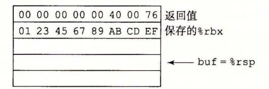

B. 执行了第 行后的栈:

|  |  |  |  | 三三:        |
|--|--|--|--|------------|
|  |  |  |  |            |
|  |  |  |  | rubfx %rsp |

- C. 这个程序试图返回到地址 Ox040034 。低位 字节被 符'矿和结尾的空 (null) 字符覆盖了
- D. 寄存器%rbx 的保存值被设 Ox3332313039383736 get\_line 返回前,这个值会被加载 回这个寄存器中。
- E. malloc 的调用应该以 strlen(buf)+ 作为它的参数,而且代码还应该检查返回值是否为 NULL
- 3. 47 A. 这对应于大约沪个地址的范围。
  - B. 每次尝试,一个 <sup>128</sup> 节的空操作 sled 会覆盖了个地址,因此我们只需要 <sup>26</sup> =64 次尝试 这个例子明确地表明了这个版本的 Linux 中的随机化程度只能很小地阻挡溢出攻击。
- 3. 48 这道题让你看看 x86-64 代码如何管理栈,也让你更好地理解如何防卫缓冲区溢出攻击
  - A. 对于没有保护的代码,第 行和第 行计算 buf 的地址为相对于% rsp 偏移 在有保护的代码中,金丝雀被存放在偏移屈为 <sup>40</sup> 的地方(第 行),而 buf 在偏移量为 <sup>16</sup> 的地方(第 行和第 行)。
  - B. 在有保护的代码中,局部变量 buf 更靠近栈顶,因此 buf 溢出就不会破坏 的值。
- 3. 49 这段代码中包含许多我们已经见到过的执行位级运算的技巧。要仔细研究才能看得懂
  - A. 行的 leaq 指令计算值 8n+22, 然后第 行的 andq 指令把它向下舍入到最接近的 <sup>16</sup> 的倍 数。当 是奇数时,结果值会是 8n+8, 是偶数时,结果值会是 8n+l6, 这个值减去 S1 得到 s2 <sup>o</sup>
  - B. 该序列中的三条指令将 `2 舍入到最近的 的倍数。它们利用了 2. 3. 节中实现除以 的幕用到 的偏移和移位的组合。
  - 这两个例子可以看做最小化和最大化 e] e2 的情况。

| n | s,   | s2   |      | el | e2 |
|---|------|------|------|----|----|
| 5 | 2065 | 2017 | 2024 | I  | 7  |
| 6 | 2064 | 2000 | 2000 | 16 |    |

- D. 可以看到 s2 的计算方式会保留 S1 的偏移量为最接近的 <sup>16</sup> 的倍数。还可以看到 会以 的倍数 对齐,正是对 字节元素数组建议使用的。 `
- 3 50 这道题要求你仔细检查代码,小心留意使用的转换和数据传送指令。可以看到取出的值和转换的 情况如下:
  - 取出位千 dp 的值,转换成 int (第 行),再存储到 ip 。因此可以推断出 va 荨是
  - 取出位于 ip 的值,转换成 float (第 行),再存储到 fp 。因此可以推断出 val2
  - 的值被转换成 double (第 行),并存储在 dp 。因此可以推断出 val3
  - 行上取出位千 fp 的值 <sup>10</sup> <sup>11</sup> 行的两条指令把它转换为双精度,值通过寄存器 xmmO 返回。因此可以推断出 val4
- 3 51 可以通过从图 3-47 和图 <sup>48</sup> 中选择适当的条目或者使用在浮点格式间转换的代码序列来处理这 些情况。

| TX     | T y    | 指令                               |
|--------|--------|----------------------------------|
| long   | double | vcvtsi2sdq %rdi,%xmm0<br>, %xmm0 |
| double | int    | vcvttsd2si %xmm0,%eax            |
| double | floa   | vunpckl pd %xmrn0, %xmrn0,%xmrn0 |
|        |        | vcvtpd2ps<br>xmm0,<br>xmmO       |
| long   | float  | vctsi2ssq %rdi,%xmm0<br>, %xmm0  |
| float  | long   | vcvttss2siq %xmm0,<br>%rax       |

- 3.52 映射参数到寄存器的基本规则非常简单(虽然随着有更多类型的参数出现,这些规则也变得越来越复杂[777])。
  - A. double g1(double a, long b, float c, int d);

寄存器: a 在%xmm0中, b 在%rdi中, c 在%xmm1中, d 在% esi中

B. double g2(int a, double \*b, float \*c, long d);

寄存器: a 在%edi 中, b 在%rsi 中, c 在%rdx 中, d 在%rcx 中

C. double g3(double \*a, double b, int c, float d);

寄存器: a 在%rdi 中, b 在%xmm0 中, c 在% esi 中, d 在%xmm1 中

D. double g4(float a, int \*b, float c, double d);

寄存器: a 在%xmm0中, b 在%rdi中, c 在%xmm1中, d 在%xmm2中

3.53 从这段汇编代码可以看出有两个整数参数,通过寄存器%rdi和%rsi传递,将其命名为 i1 和 i2。 类似地,有两个浮点参数,通过寄存器%xmm0和%xmm1传递,将其命名为 f1 和 f2。

然后给汇编代码加注释:

```
Refer to arguments as i1 (%rdi), i2 (%esi)
f1 (%xmm0), and f2 (%xmm1)
```

double funct1(arg1\_t p, arg2\_t q, arg3\_t r, arg4\_t s)

```
funct1:
                     %rsi, %xmm2, %xmm2 Get i2 and convert from long to float
2
     vcvtsi2ssq
     vaddss %xmm0, %xmm2, %xmm0
                                            Add f1 (type float)
     vcvtsi2ss
                      %edi, %xmm2, %xmm2
                                            Get i1 and convert from int to float
     vdivss %xmm0, %xmm2, %xmm0
                                            Compute i1 / (i2 + f1)
                     %xmmO, %xmmO, %xmmO
     vunpcklps
     vcvtps2pd
                     %xmmO, %xmmO
                                            Convert to double
     vsubsd %xmm1, %xmm0, %xmm0
                                            Compute i1 / (i2 + f1) - f2 (double)
     ret.
```

由此可以看出这段代码计算值 i1/(i2+f1)-f2。还可以看到, i1 的类型为 int, i2 的类型为 long, f1 的类型为 float, 而 f2 的类型为 double。将参数匹配到命名的值只有一个不确定的地方,来自于加法的交换性——得到两种可能的结果:

'double functia(int p, float q, long r, double s); double functib(int p, long q, float r, double s);

3.54 一步步梳理汇编代码,确定每一步计算什么,就很容易找到这道题的答案,如下面的注释所示:

```
double funct2(double w, int x, float y, long z)
    w in %xmm0, x in %edi, y in %xmm1, z in %rsi
   funct2:
                      %edi, %xmm2, %xmm2
2
     vcvtsi2ss
                                              Convert x to float
     vmulss %xmm1, %xmm2, %xmm1
3
                                              Multiply by y
                      %xmm1, %xmm1, %xmm1
4
     vunpcklps
     vcvtps2pd
                      %xmm1, %xmm2
                                              Convert x*y to double
     vcvtsi2sdq
                      %rsi, %xmm1, %xmm1
6
                                              Convert z to double
     vdivsd %xmm1, %xmm0, %xmm0
                                              Compute w/z
     vsubsd %xmm0, %xmm2, %xmm0
8
                                              Subtract from x*y
```

可以从分析得出结论,该函数计算 y\*x-w/z。

3.55 这道题使用的推理与推断标号.LC2处声明的数字是1.8的编码一样,不过例子更简单。

我们看到两个值分别是 0 和 1077936128(0x40400000)。从高位字节可以抽取出指数字段 0x404(1028),减去偏移量 1023 得到指数为 5。连接两个值的小数位,得到小数字段为 0,加上隐含的开头的 1,得到 1.0。因此这个常数是  $1.0 \times 2^5 = 32.0$ 。

3.56 A. 在此可以看到从地址.LC1 开始的 16 个字节是一个掩码,它的低 8 个字节是全 1,除了最高位,这是双精度值的符号位。计算这个掩码和 % xmm0 的 AND 值时,会清除 x 的符号位,得到绝对

值。实际上,定义 EXPR(x)为 fabs(x)就能得到这段代码, fabs是在< math.h> 中定义的。

- B. 可以看到 vxorpd 指令将整个寄存器设置为 0, 所以这是一种产生浮点常数 0.0 的方法。
- C. 可以看到从地址.LC2 开始的 16 个字节是一个掩码,它只有一个 1 位,位于 XMM 寄存器中低位数值的符号位。计算这个掩码与%xmm0 的 EXCLUSIVE OR 值时,会改变 x 符号的值,计算出表达式-x。
- 3.57 同样地,为代码加注释,包括处理条件分支:

```
double funct3(int *ap, double b, long c, float *dp)
     ap in %rdi, b in %xmm0, c in %rsi, dp in %rdx
 1
     funct3:
       vmovss (%rdx), %xmm1
                                                    Get d = *dp
 2
 3
      vcvtsi2sd
                        (%rdi), %xmm2, %xmm2
                                                    Get a = *ap and convert to double
                       %xmm2, %xmm0
                                                    Compare b:a
 4
      vucomisd
                                                    If <=, goto lesseq
 5
       jbe
           .L8
                       %rsi, %xmm0, %xmm0
                                                    Convert c to float
 6
       vcvtsi2ssq
 7
      vmulss %xmm1, %xmm0, %xmm1
                                                    Multiply by d
 8
                       %xmm1, %xmm1, %xmm1
      vunpcklps
9
                       %xmm1, %xmm0
                                                    Convert to double
      vcvtps2pd
10
       ret
                                                    Return
     .L8:
11
                                                  lesseq:
12
       vaddss %xmm1, %xmm1, %xmm1
                                                    Compute d+d = 2.0 * d
13
       vcvtsi2ssq
                       %rsi, %xmmO, %xmmO
                                                    Convert c to float
14
       vaddss %xmm1, %xmm0, %xmm0
                                                    Compute c + 2*d
                       %xmmO, %xmmO, %xmmO
15
       vunpcklps
                       %xmmO, %xmmO
                                                    Convert to double
       vcvtps2pd
16
17
       ret
                                                    Return
由此,可以写出 funct3 的代码如下:
double funct3(int *ap, double b, long c, float *dp) {
    int a = *ap;
    float d = *dp;
    if (a < b)
        return c*d;
    else
        return c+2*d;
}
```

CH APTER 4

# 处理器体系结构

现代微处理器可以称得上是人类创造出的最复杂的系统之 。一块手指甲大小的硅片 上,可以容纳一个完整的高性能处理器、大的高速缓存,以及用来连接到外部设备的逻辑 电路。从性能上来说,今天在 块芯片上实现的处理器巳经使 <sup>20</sup> 年前价值 <sup>1000</sup> 万美元、 房间那么大的超级计算机相形见细了。即使是在像手机、导航系统和可编程恒温器这样的 日常设备中的嵌入式处理器,也比早期计算机开发者所能想到的强大得多。

到目前为止,我们看到的计算机系统只限于机器语言程序级。我们知道处理器必须执 行一系列指令,每条指令执行某个简单操作,例如两个数相加。指令被编码为由一个或多 个字节序列组成的二进制格式。一个处理器支持的指令和指令的字节级编码称为它的指令 集体系结构 (Instruction-Set Architecture, ISA) 。不同的处理器"家族",例如 Intel IA32 x86-64 IBM/Freescale Power ARM 处理器家族,都有不同的 ISA 。一个程序编译 成在一种机器上运行,就不能在另一种机器上运行。另外,同一个家族里也有很多不同型 号的处理器。虽然每个厂商制造的处理器性能和复杂性不断提高,但是不同的型号在 ISA 级别上都保持着兼容。一些常见的处理器家族(例如 x86-64) 中的处理器分别由多个厂商提 供。因此, ISA 在编译器编写者和处理器设计人员之间提供了一个概念抽象层,编译器编 写者只需要知道允许哪些指令,以及它们是如何编码的;而处理器设计者必须建造出执行 这些指令的处理器。

本章将简要介绍处理器硬件的设计。我们将研究一个硬件系统执行某种 ISA 指令的方 式。这会使你能更好地理解计算机是如何工作的,以及计算机制造商们面临的技术挑战。 一个很重要的概念是,现代处理器的实际工作方式可能跟 ISA 隐含的计算模型大相径庭。 ISA 模型看上去应该是顺序指令执行,也就是先取出一条指令,等到它执行完毕,再开始 下一条。然而,与一个时刻只执行一条指令相比,通过同时处理多条指令的不同部分,处 理器可以获得更高的性能。为了保证处理器能得到同顺序执行相同的结果,人们采用了一 些特殊的机制。在计算机科学中,用巧妙的方法在提高性能的同时又保待一个更简单、更 抽象模型的功能,这种思想是众所周知的。在 Web 浏览器或平衡二叉树和哈希表这样的 信息检索数据结构中使用缓存,就是这样的例子。

你很可能永远都不会自己设计处理器。这是专家们的任务,他们工作在全球不到 <sup>100</sup> 家的公司里。那么为什么你还应该了解处理器设计呢?

- ·从智力方面来说,处理器设计是非常有趣而且很重要的。学习事物是怎样工作的 有其内在价值。了解作为计算机科学家和工程师日常生活一部分的 个系统的内 部工作原理(特别是对很多人来说这还是个谜),是件格外有趣的事情。处理器设 计包括许多好的工程实践原理。它需要完成复杂的任务,而结构又要尽可能简单 和规则。
- ·理解处理器如何工作能帮助理解整个计算机系统如何工作。在第 章,我们将讲述 存储器系统,以及用来创建很大的内存映像同时又有快速访问时间的技术。看看处 理器端的处理器 内存接口,会使那些讲述更加完整。

- ·虽然很少有人设计处理器,但是许多人设计包含处理器的硬件系统。将处理器嵌人 到现实世界的系统中,如汽车和家用电器,已经变得非常普通了。嵌入式系统的设 计者必须了解处理器是如何工作的,因为这些系统通常在比桌面和基于服务器的系 统更低抽象级别上进行设计和编程。
- ·你的工作可能就是处理器设计。虽然生产处理器的公司很少,但是研究处理器的设 计人员队伍已经非常 巨大 了,而且还在壮大 一个 主要 的处理器设计的各个方面大 约涉及 <sup>1000</sup> 多人。

本章首先定义一个简单的指令集,作为我们处理器实现的运行示例。因为受 x86-64 指令集的启发,它被俗称为 "x86", 所以我们称我们的指令集为 "Y86-64" 指令集。与 x86-64 相比, Y86-64 指令集的数据类型、指令和寻址方式都要少一些。它的字节级编码 也比较简单,机器代码没有相应的 x86-64 代码紧凑,不过设计它的 CPU 译码逻辑也要简 单一些。虽然 Y86 <sup>64</sup> 令集 很简单,它仍然足够完整,能让我们写一些处理整数的程序。 设计一个实现 Y86-64 的处理器要求 我们解决许多处理器设计者同样会面对的问题。

接下来会提供一些数字硬件设计的背景。我们会描述处理器中使用的基本构件块,以 及它们如何连接起来和操作。这些介绍是建立在第 章对布尔代数和位级操作的讨论的基 础上的 我们还将介绍一种描述硬件系统控制部分的简单语言, HCL(Hardw re Control Language 硬件控制语言)。然 后,用它来描述我们的处理器设计 即使你已经有了 逻辑设计的背景知识,也应该读读这个部分以了解我们的特殊符号表示方法。

作为设计处理器的第一步,我们给出一个基于顺序操作、功能正确但是有点不实用的 Y86-64 处理器。这个处理器每个时钟周期执行一条完 Y86-64 指令。所以它的时钟必 须足够慢,以允许在一个周期内宪成所有的动作。这样一个处理器是可以实现的,但是它 的性能远远低于同样的硬件应该能达到的性能

以这个顺序设计为基础,我们进行一系列的改造,创建一个流水线化的处理器 (pip lined processor) 。这个处理器将每条指令的执行分解成五步,每个步骤由一个独立的硬件 部分或阶段 (stage) 来处理。指令步经流水线的各个阶段,且每个时钟周期有一条新指令进 入流水线 所以,处理器可以同时执行五条指令的不同阶段。为了使这个处理器保留 Y86-64 ISA 的顺序行为,就要求处理很多冒险或冲突 (haza rd) 情况,冒险就是一条指 位置或操作数依赖于其他仍在流水线中的指令。

我们设计了一些工具来研究和测试处理器设计。其中包括 Y86-64 的汇编器、在你的机 器上运行 Y86-64 程序的模拟器,还有针对两个顺序处理器设计和一个流水线化处理器设计 的模拟器。这些设计的控制逻辑用 HCL 符号表示的文件描述 通过编辑这些文件和重新编 译模拟器,你可以改变和扩展模拟器行为。我们还提供许多练习,包括实现新的指令和修改 机器处理指令的方式 还提供测试代码以帮助你评价修改的正确性。这些练习将极大地帮助 你理 所有这些内容,也能使你更理解处理器设计者面临的许多不同的设计选择

网络旁注 ARCH:VLOG 给出了用 Verilog 硬件描述语 描述的流水线化的 Y86-6 理器。其中包括为基本的硬件构建块和整个的处理器结构创建模块。我们自动地将控制逻 辑的 HCL 描述翻译成 Verilog 。首先用我们的模拟器调试 HCL 描述,能消除很多在硬件 设计中会出现的棘手的问题 。给定 一个 Verilog 描述,有商业和开源工具来支持模拟和逻 样合成 (logic synthesis) ,产生实际的微处理器电路设计。因此,虽然我们在此花费大部 分精力创建系统的图形和文 描述,写软件的时候也会花 同样的精力,但是这些设计能 够自动地合成,这表明我们确实在创建一个能够用硬件实现的系统。

## 4. 1 Y86-64 指令集体系结构

定义 个指令集体系结构(例如 Y86-64) 包括定义各种状态单元、指令集和它们的编 码、一组编程规范和异常事件处理。

## 4. 1. 1 程序员可见的状态

如图 4-1 所示, Y86-64 程序中的每条指令都会读取或修改处理器状态的某些部分。这 称为程序员可见状态,这里的"程序员"既可以是用汇编代码写程序的人,也可以是产生

机器级代码的编译器。在处理器实现中,只要 RF: 程序寄存器 我们保证机器级程序能够访问程序员可见状 态,就不需要完全按照 SA 暗示的方式来表示 和组织这个处理器状态。 Y86-64 的状态类似 x86-64 。有 <sup>15</sup> 个程序 存器:%rax %rcx 、% rdx %rbx %rsp %rbp %rsi %rdi 和%r8 %r14 。(我们省略了 x86-64 的寄存器%rl5 以简 化指令的编码。)每个程序寄存器存储一个 <sup>64</sup> 位的字。寄存器% rsp 被入栈、出栈、调用和 返回指令作为栈指针。除此之外,寄存器没有 固定的含义或固定值。有 个一位的条件码 ZF SF OF, 它们保存若最近的算术或逻辑 指令所造成影响的有关信息。程序计数器 (PC) 和内存。状态码指明程序是否运行正 存放当前正在执行指令的地址。 常,或者发生了某个特殊事件

%rax %rsp %r8 %r12 %rcx %rbp %r9 %rl3 %rdx %rsi %r10 %rl4

%rbx %rdi %rll

Stat: 程序状态 CC: 条件码 I ZF I SFI OF I DMEM: 内存 PC

4- Y86-64 程序员可见状态。同 x86-64 样, Y86-64 的程序可以访问和修改程 序寄存器、条件码、程序计数器 (PC)

内存从概念上来说就是一个很大的字节数组,保存着程序和数据。 Y86-64 程序用虚 拟地址来引用内存位置。硬件和操作系统软件联合起来将虚拟地址翻译成实际或物理地 址,指明数据实际存在内存中哪个地方。第 章将更详细地研究虚拟内存。现在,我们只 认为虚拟内存系统向 Y86-64 程序提供了一个单一的字节数组映像。

程序状态的最后一个部分是状态码 Stat, 它表明程序执行的总体状态。它会指示是 正常运行,还是出现了某种异常,例如当一条指令试图去读非法的内存地址时。在 1. 4 节中会讲述可能的状态码 及异常处理。

#### 4. 1: 2 Y86 <sup>64</sup> 指令

4-2 给出了 Y86-64 SA 中各个指令的简单描述。这个指令集就是我们处理器实现 的目标。 Y86-64 指令集基本上是 x86 <sup>64</sup> 指令集的一个子集。它只包括 字节整数操作, 寻址方式较少,操作也较少。因为我们只有 字节数据,所以称之为"字 (word)" 不会有 任何歧义。在这个图中,左边是指令的汇编码表示,右边是字节编码。图 4-3 给出了其中 一些指令更详细的内容。汇编代码格式类似千 x86 <sup>64</sup> ATT 格式。

下面是 Y86-64 指令的一些细节。

• x86 <sup>64</sup> movq 指令分成了 个不同的指令: irmovq rrmovq mrmovq rmmovq, 分别显式地指明源和目的的格式。源可以是立即数(立、寄存器 (r) 或内存 (m) 。指令 名字的第一个字母就表明了源的类型。目的可以是寄存器 (r) 或内存 (m) 。指令名字的 第二个字母指明了 的的类型。在决定如何实现数据传送时,显式地指明数据传送的

这 4 种类型是很有帮助的。

两个内存传送指令中的内存引用方式是简单的基址和偏移量形式。在地址计算中,我们不支持第二变址寄存器(second index register)和任何寄存器值的伸缩(scaling)。

同 x86-64 一样,我们不允许从一个内存地址直接传送到另一个内存地址。另外,也不允许将立即数传送到内存。

- 有 4 个整数操作指令,如图 4-2 中的 OPq。它们是 addq、subq、andq和 xorq。它们只对寄存器数据进行操作,而 x86-64 还允许对内存数据进行这些操作。这些指令会设置 3 个条件码 ZF、SF 和 OF(零、符号和溢出)。
- 7 个跳转指令(图 4-2 中的 jXX)是 jmp、jle、jl、je、jne、jge 和 jg。根据分支 指令的类型和条件代码的设置来选择分支。分支条件和 x86-64 的一样(见图 3-15)。
- 有 6 个条件传送指令(图 4-2 中的 cmovXX): cmovle、cmovle、cmove、cmovne、cmovge和 cmovg。这些指令的格式与寄存器-寄存器传送指令 rrmovq一样,但是只有当条件码满足所需要的约束时,才会更新目的寄存器的值。
- call 指令将返回地址入栈, 然后跳到目的地址。ret 指令从这样的调用中返回。
- pushg 和 popg 指令实现了人栈和出栈,就像在 x86-64 中一样。
- halt 指令停止指令的执行。x86-64 中有一个与之相当的指令 hlt。x86-64 的应用程序不允许使用这条指令,因为它会导致整个系统暂停运行。对于 Y86-64 来说,执行 halt 指令会导致处理器停止,并将状态码设置为 HLT(参见 4.1.4 节)。

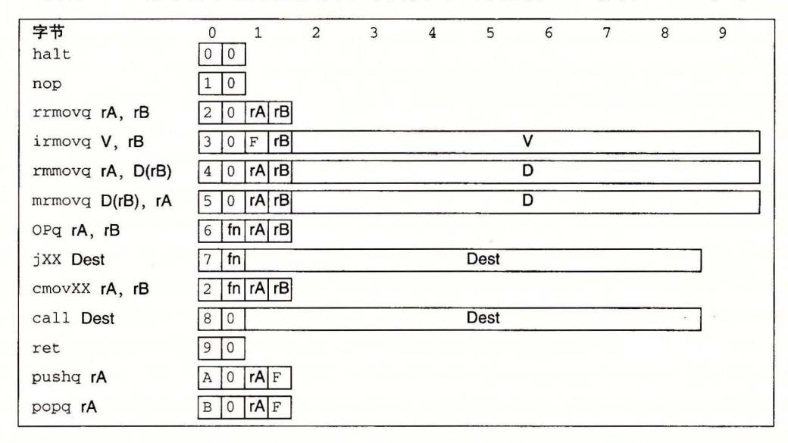

图 4-2 Y86-64 指令集。指令编码长度从 1 个字节到 10 个字节不等。一条指令含有一个单字节的指令指示符,可能含有一个单字节的寄存器指示符,还可能含有一个 8 字节的常数字。字段 fn 指明是某个整数操作(OPq)、数据传送条件(cmovxx)或是分支条件(jxx)。所有的数值都用十六进制表示

#### 4.1.3 指令编码

图 4-2 还给出了指令的字节级编码。每条指令需要 1~10 个字节不等,这取决于需要哪些字段。每条指令的第一个字节表明指令的类型。这个字节分为两个部分,每部分4

位:高 位是代码 (code) 部分,低 位是功能 (function) 部分。如图 4-2 所示,代码值为 O~OxB 。功能值只有在一组相关指令共用一个代码时才有用。图 4-3 给出了整数操作、分 支和条件传送指令的具体编码。可以观察到, rrmovq 与条件传送有同样的指令代码。可 以把它看作是一个"无条件传送",就好像 jmp 指令是无条件跳转一样,它们的功能代码 都是

| 整数操作指令     | 分支指令                    | 传送指令                   |
|------------|-------------------------|------------------------|
| addq       | 工]<br>jmp<br>jne        | rrmovq<br>cmovne       |
| 巨曰<br>subq | j le [2li]<br>巳曰<br>jge | 工]<br>cmovle<br>cmovge |
| andq       | 工]<br>jl<br>jg          | cmovl<br>cmovg         |
| xorq 巳三]   | ~<br>je                 | cmove                  |

Y86-64 指令集的功能码。这些代码指明是某个整数操作、分支条件还是数据传送 条件。这些指令是图 4-2 中所示的 OPq jXX cmovXX

如图 4-4 所示, <sup>15</sup> 个程序寄存器中每个都有一个相对应的范围在 OxE 之间的寄存 器标识符 (register ID) Y86-64 中的寄存器编号跟 x86-64 中的相同 程序寄存器存在 CPU 中的一个寄存器文件中,这个寄存器文件就是一个小的、以寄存器 ID 作为地址的随 机访问存储器。在指令编码中以及在我们的硬件设计中,当需要指明不应访问任何寄存器 时,就用 ID OxF 来表示。

| 数字 | 寄存器名字 | 数字 | 寄存器名字 |
|----|-------|----|-------|
|    | rax   | 8  | r8    |
| 1  | cx    | 9  | r9    |
| 2  | rdx   | A  | rlO   |
| 3  | rbx   | B  | rll   |
| 4  | %rsp  | C  | r12   |
| 5  | %rbp  | D  | rl3   |
| 6  | %rsi  | E  | r14   |
| 7  | rdi   | F  | 无寄存器  |

4-4 Y86 <sup>64</sup> 程序寄存器标识符。 <sup>15</sup> 个程序寄存器中每个都有一个相对应的标识符 (ID) ,范围为 O~OxE 。如果指令中某个寄存器字段的 ID 值为 OxF, 就表明此处没有寄存器操作数

有的指令只有一个字节长,而有的需要操作数的指令编码就更长一些。首先,可能有 附加的寄存器指示符宇节 (register specifier byte) ,指定一个或两个寄存器。在图 4-2 中, 这些寄存器字段称为 rA rB 。从指令的汇编代码表示中可以看到,根据指令类型,指令 可以指定用于数据源和目的的寄存器,或是用于地址计算的基址寄存器。没有寄存器操作 数的指令,例如分支指令和 call 指令,就没有寄存器指示符字节。那些只需要一个寄存 器操作数的指令 (irmovq pushq popq) 将另一个寄存器指示符设为 OxF 。这种约定在 我们的处理器实现中非常有用。

有些指令需要一个附加的 字节常数字 (constant word) 。这个字能作为 irmovq 的立 即数数据, rmrnovq mrmovq 的地址指示符的偏移量,以及分支指令和调用指令的目的 地址。注意,分支指令和调用指令的目的是一个绝对地址,而不像 IA32 中那样使用 PC

(程序计数器)相对寻址方式。处理器使用 PC 相对寻址方式,分支指令的编码会更简洁, 同时这样也能允许代码从内存的一部分复制到另一部分而不需要更新所有的分支目标地 址。因为我们更关心描述的简单性,所以就使用了绝对寻址方式。同 IA32 一样,所有整 数采用小端法编码。当指令按照反汇编格式书写时,这些字节就以相反的顺序出现。

例如,用十六进制来表示指令 rmrnovq %rsp, Ox123456789abcd(%rdx) 的字节编码。 从图 4-2 我们可以看到, rmrnovq 的第 个字节为 <sup>40</sup> 。源寄存器% rsp 应该编码放在 rA 字段中,而基址寄存器%rdx 应该编码放在 rB 字段中。根据图 4-4 中的寄存器编号,我 们得到寄存器指示符字节 <sup>42</sup> 。最后,偏移桩编码放在 字节的常数字中。首先在 Ox123456789abcd 的前面填充上 变成 个字节,变成字节序列 <sup>00</sup> 01 23 45 67 89 ab cd 写成按字节反序就是 cd ab 89 67 45 23 01 <sup>00</sup> 。将它们都连接起来就得到指令的编码 4042cdab896745230100

指令集的一个重要性质就是字节编码必须有唯一的解释。任意一个字节序列要么是一 个唯一的指令序列的编码,要么就不是一个合法的字节序列。 Y86-64 就具有这个性质, 因为每条指令的第一个字节有唯一的代码和功能组合,给定这个字节,我们就可以决定所 有其他附加字节的长度和含义。这个性质保证了处理器可以无二义性地执行目标代码程 序。即使代码嵌入在程序的其他字节中,只要从序列的第一个字节开始处理,我们仍然可 以很容易地确定指令序列。反过来说,如果不知道一段代码序列的起始位置,我们就不能 准确地确定怎样将序列划分成单独的指令。对于试图直接从目标代码字节序列中抽取出机 器级程序的反汇编程序和其他一些工具来说,这就带来了问题。

练习题 1 确定下面的 Y86-64 指令序列的字节编码。 ".pos OxlOO" 那一行表明这 段目标代码的起始地址应该是 OxlOO

.pos Ox100 # Start code at address Ox100 irmovq \$15,%rbx rrmovq %rbx,%rcx

loop:

rmmovq %rcx,-3(%rbx) addq %rbx,%rcx jmp loop

练习题 2 确定下列每个字节序列所编码的 Y86-64 指令序列。如果序列中有不合 法的字节,指出指令序列中不合法值出现的位置。每个序列都先给出了起始地址,冒 号,然后是字节序列。

A. Ox100: 30f3fcffffffffffffff40630008000000000000

B. Ox200: a06f800c020000000000000030f30a0000000000000090

C. Ox300: 5054070000000000000010f0b01f

D. Ox400: 611373000400000000000000

E. Ox500: 6362a0f0

## 日日 比较 x86-64 Y86-64 的指令编码

x86-64 中的指令编码相比, Y86 <sup>64</sup> 的编码简单得多,但是没那么紧凑 在所有 Y86-64 指令中,寄存器宇段的位置都是固定的,而在不同的 x86-64 指令中,它们的 位置是不一样的 x86-64 可以将常数值编码成 个宇节,而 <sup>64</sup> 总是将 常数值编码成 个字节 /·

## FD RISC CISC 指令集

x86-64 有时称为"复杂指令集计算机"(CISC, 读作 "sisk") ,与"精简指令集计 算机 "(RISC, 读作 "risk") 相对。从历史上看,先出现了 CISC 机器,它从最早的计算 机演化而来 <sup>20</sup> 世纪 <sup>80</sup> 年代早期,随着机器设计者加入了很多新指令来支持高级任 务(例如处理循环缓冲区,执行十进制数计算,以及求多项式的值),大型机和小型机的 指令集已经变得非常庞大了。最早的微处理器出现在 <sup>20</sup> 世纪 <sup>70</sup> 年代早期,因为当时的 集成电路技术极大地制约了一块芯片上能实现些什么,所以它们的指令集非常有限。微 处理器发展得很快,到 <sup>20</sup> 世纪 <sup>80</sup> 年代早期,大型机和小型机的指令集复杂度一直都在 增加 x86 家族沿着这条道路发展到 IA32, 最近是 x86-64 。即使是 x86 系列也仍然在不 断地变化,基于新出现的应用的需要,增加新的指令类。

<sup>20</sup> 世纪 <sup>80</sup> 年代早期, RISC 的设计理念是作为上述发展趋势的一种替代而发展起来 IBM 的一组硬件和编译器专家受到 IBM 研究员 John Cocke 的很大影响,认为他们 可以为更简单的指令集形式产生高效的代码。实际上,许多加到指令集中的高级指令很 难被编译器产生,所以也很少被用到。一个较为简单的指令集可以用很少的硬件实现, 能以高效的流水线结构组织起来,类似于本章后面描述的情况。直到多年以后 IBM 将这个理念商品化,开发出了 Power PowerPC ISA

加州大学伯克利分校的 David Patterson 和斯坦福大学的 John ennessy 进一步发展 RISC 的概念 Patterson 将这种新的机器类型命名为 RISC, 而将以前的那种称为 CISC, 因为以前没有必要给一种几乎是通用的指令集格式起名宇。

比较 CISC 和最初的 RISC 指令集,我们发现下面这些一般特性

| CISC                                                                                   | 早期的 RISC                                                                                                                      |
|----------------------------------------------------------------------------------------|-------------------------------------------------------------------------------------------------------------------------------|
| Intel 描述全套指令的文档 [51]<br>指令数品很多。<br>12 00 多页。                                           | 指令数扯少得多。通常少于 100 个。                                                                                                           |
| 包括将一个整块从内存的<br>的延迟很长<br>有些指<br>部分的指令,以及其他一些将多个寄存<br>部分复制到另<br>器的值复制到内存或从内存复制到多个寄存器的指令。 | 没有较长延迟的指 令。有 些早期的 RISC 机器甚至没<br>有整数乘法指令,要求编译器通过一系列加法来实现<br>乘法。                                                                |
| x86-64 的指令长度可以是 l~<br>编码是可变长度的。<br>15 个字节。                                             | 编码是固定长度的<br>通常所有的指令都编码为<br>字节。                                                                                                |
| 指定操作数的方式很多样。在 x86-64 中,内存操作<br>数指示符可以有许多不同的组合,这些组合由偏移拭、<br>基址和变址寄存器以及伸缩因子组成。           | 简单寻址方式。通常只有基址和偏移蜇寻址。                                                                                                          |
| 可以对内存和寄存器操作数进行算术和逻辑运算。                                                                 | 只能对寄存器操作数进行算术和逻辑运算。允许使用<br>内存引用的只有 load<br>load 是从内存读到<br>store 指令,<br>store 是从寄存器写到内存<br>这种方法被称为<br>寄存器,<br>load store 体系结构。 |
| 对机器级程序来说实现细节是不可见的<br>ISA 提供<br>了程序和如何执行程序之间的清晰的抽象。                                     | 对机器级程序来说实现细节是可见的。有些 RISC<br>器禁止某些特殊的指令序列,而有些跳转要到下一条指<br>令执行完了以后才会生效。编译器必须在这些约束条件<br>下进行性能优化。                                  |
| 作为指令执行的副产品,设置了一些特<br>有条件码<br>殊的标志位,可以用于条件分支检测。                                         | 没有条件码。相反,对条件检测来说,要用明确的测试<br>指令,这些指令会将测试结果放在一个普通的寄存器中。                                                                         |
| 栈密集的过程链接。栈被用来存取过程参数和返回<br>地址                                                           | 寄存器密集的过程链接。寄存器被用来存取过程参数<br>和返回地址。因此有些过程能 完全避免内存 引用 。通常<br>处理器有更多的(最多的有 32 个)寄存器                                               |

Y86-64 指令集既有 CISC 指令集的属性,也有 RISC 指令集的属性 CISC 一样 它有条件码、长度可变的指令,并用栈来保存返回地址 RISC 一样的是,它采用 load store 体系结构和规则编码,通过寄存器来传递过程参数。 Y8 -64 指令集可以看成 是采用 CISC 指令集 (x86) ,但又根据某些 RISC 的原理进行了简化

## lilJ RISC CISC 之争

<sup>20</sup> 世纪 <sup>80</sup> 年代,计算机体系结构领域里关于 RISC 指令集和 CISC 指令集优缺点的 争论十分激烈 RISC 的支持者声称在给定硬件数量的情况下,通过结合简约式指令集 设计、高级编译器技术和流水线化的处理器实现,他们能够得到更强的计算能力 CISC 的拥定反驳说要完成一个给定的任务只需要用较少的 CISC 指令,所以他们的机器 能够获得更高的总体性能。

大多数公司都推出了 RISC 处理器系列产品,包括 Sun Microsystems (SPARC IBM Motorola (Power PC) ,以及 Digital Equipment Corporation Alpha) 一家英国公 Acorn Computers Ltd. 提出了自己的体系结构一— ARM (最开始是 "Acorn RISC Machin 的首字母缩写),广泛应用在嵌入式系统中(比如手机)

<sup>20</sup> 世纪 <sup>90</sup> 年代早期,争论逐渐平息,因为事实已经很清楚了,无论是单纯的 RISC 还是单纯的 CISC 都不如结合两者思想精华的设计 RISC 机器发展进化的过程中,引入 了更多的指令,而许多这样的指令都需要执行多个周期 今天的 RISC 机器的指令表中 有几百条指令,几乎与"精简指令集机器"的名称不相符了 那种将实现细节暴露给机 器级程序的思想已经被证明是目光短浅的。随着使用更加高级硬件结构的新处理器模型 的开发,许多实现细节已经变得很落后了,但它们仍然是指令集的一部分。不过,作为 RISC 设计的核心的指令集仍然是非常适合在流水线化的机器上执行的

比较新的 CISC 机器也利用了高性能流水线结构。就像我们将在 节中讨论的那 样,它们读取 CISC 指令,并动态地翻译成比较简单的、像 RISC 那样的操作的序列 例如,一条将寄存器和内存相加的指令被翻译成三个操作:一个是读原始的内存值,一 个是执行加法运算,第三就是将和写回内存。由于动态翻译通常可以在实际指令执行前 进行,处理器仍然可以保持很高的执行速率

除了技术因素以外,市场因素也在决定不同指令集是否成功中起了很重要的作用 通过保持与现有处理器的兼容性, Intel 以及 x86 使得从一代处理器迁移到下一代变得 很容易。由于集成电路技术的进步, Intel 和其他 x86 处理器制造商能够克服原来 <sup>08</sup> 指令集设计造成的低效率,使用 RISC 技术产生出与最好的 RISC 机器相当的性能 如我们在笫 3. 节中看到的那样, IA32 发展演变到 x86-64 提供了一个机会,使得能够 RISC 的一些特性结合到 x86 在桌面、便携计算机和基于服务器的计算领域里, x86 已经占据了完全的统治地位

RISC 处理器在嵌入式处理器市场上表现得非常出色,嵌入式处理器负责控制移动 电话、汽车刹车以及因特网电器等系统。在这些应用中,降低成本和功耗比保持后向兼 容性更重要。就出售的处理器数量来说,这是个非常广阔而迅速成长着的市场

#### 4. 1. 4 Y86-64 异常

Y86-64 来说,程序员可见的状态(图 4-1) 包括状态码 Stat, 它描述程序执行的总 体状态。这个代码可能的值如图 4-5 所示。代码值 1, 命名为 AOK, 表示程序执行正常, 而其他一些代码则表示发生了某种类型的异常。代码 2, 命名为 HLT, 表示处理器执行了一条 halt 指令。代码 3, 命名为 ADR, 表示处理器试图从一个非法内存地址读或者向一

个非法内存地址写,可能是当取指令的时候,也可能是当读或者写数据的时候。我们会限制最大的地址(确切的限定值因实现而异),任何访问超出这个限定值的地址都会引发 ADR 异常。代码4,命名为 INS,表示遇到了非法的指令代码。

对于 Y86-64, 当遇到这些异常的时候, 我们就简单地让处理器停止执行指令。在更完整的设计中, 处理器通常会调用一个异常处理程序

| 值 | 名字  | 含义            |
|---|-----|---------------|
| 1 | AOK | 正常操作          |
| 2 | HLT | 遇到器执行 halt 指令 |
| 3 | ADR | 遇到非法地址        |
| 4 | INS | 遇到非法指令        |

图 4-5 Y86-64 状态码。在我们的设计中, 任何 AOK 以外的代码都会使处理器 停止

(exception handler),这个过程被指定用来处理遇到的某种类型的异常。就像在第8章中讲述的,异常处理程序可以被配置成不同的结果,例如,中止程序或者调用一个用户自定义的信号处理程序(signal handler)。

#### 4.1.5 Y86-64 程序

图 4-6 给出了下面这个 C 函数的 x86-64 和 Y86-64 汇编代码:

```
long sum(long *start, long count)
2
3
         long sum = 0;
         while (count) {
4
5
             sum += *start;
6
             start++;
7
              count --:
8
9
         return sum;
10
```

```
Y86-64 code
x86-64 code
                                                      long sum(long *start, long count)
   long sum(long *start, long count)
   start in %rdi, count in %rsi
                                                      start in %rdi, count in %rsi
1 sum:
                                                     sum:
     movl
              $0, %eax
                              sum = 0
                                                   2
                                                        irmovq $8,%r8
                                                                             Constant 8
3
              .L2
                              Goto test
                                                  3
                                                        irmovq $1,%r9
                                                                             Constant 1
     jmp
4 .L3:
                                                  4
                                                        xorq %rax, %rax
                                                                             sum = 0
                            loop:
             (%rdi), %rax
                                                        andq %rsi,%rsi
                                                                             Set CC
5
     addq
                              Add *start to sum
                                                  5
              $8, %rdi
                                                                 test
                                                                             Goto test
     addq
                              start++
                                                        jmp
7
     subq
              $1, %rsi
                              count--
                                                  7
                                                      loop:
8
                                                   8
                                                        mrmovq (%rdi),%r10 Get *start
  .L2:
                            test:
                                                  9
9
              %rsi, %rsi
                                                        addq %r10,%rax
                                                                             Add to sum
     testq
                              Test sum
                                                        addq %r8,%rdi
10
     jne
              .L3
                              If !=0, goto loop
                                                  10
                                                                             start++
11
                                                  11
                                                        subq %r9,%rsi
                                                                             count -- . Set CC
     rep; ret
                              Return
                                                  12 test:
                                                  13
                                                                            Stop when 0
                                                        jne
                                                               loop
                                                                            Return
                                                  14
                                                        ret
```

图 4-6 Y86-64 汇编程序与 x86-64 汇编程序比较。Sum 函数计算一个整数数组的和。 Y86-64 代码与 x86-64 代码遵循了相同的通用模式

x86-64 代码是由 GCC 编译器产生的。Y86-64 代码与之类似,但有以下不同点:

- Y86-64 将常数加载到寄存器(第 2~3 行),因为它在算术指令中不能使用立即数。
- 要实现从内存读取一个数值并将其与一个寄存器相加,Y86-64 代码需要两条指令 (第8~9行),而 x86-64 只需要一条 addq 指令(第5行)。
- 我们手工编写的 Y86-64 实现有一个优势,即 subq 指令(第 11 行)同时还设置了条件码,因此 GCC 生成代码中的 testq 指令(第 9 行)就不是必需的。不过为此, Y86-64 代码必须用 andg 指令(第 5 行)在进入循环之前设置条件码。

图 4-7 给出了用 Y86-64 汇编代码编写的一个完整的程序文件的例子。这个程序既包括数据,也包括指令。伪指令(directive)指明应该将代码或数据放在什么位置,以及如何对齐。这个程序详细说明了栈的放置、数据初始化、程序初始化和程序结束等问题。

```
# Execution begins at address 0
 2
              .pos 0
 3
              irmovq stack, %rsp
                                        # Set up stack pointer
 4
              call main
                                        # Execute main program
5
              halt.
                                        # Terminate program
 6
7
     # Array of 4 elements
8
              .align 8
9
     arrav:
              .quad 0x000d000d000d
10
11
              .quad 0x00c000c000c0
              .quad 0x0b000b000b00
12
              .quad 0xa000a000a000
13
14
     main:
15
16
              irmovq array, %rdi
17
              irmovq $4,%rsi
18
              call sum
                                        # sum(array, 4)
19
              ret
20
     # long sum(long *start, long count)
21
22
     # start in %rdi, count in %rsi
23
     SIIM .
24
              irmovq $8,%r8
                                     # Constant 8
              irmovq $1,%r9
                                     # Constant 1
25
              xorq %rax, %rax
                                     \# sum = 0
26
27
              andq %rsi,%rsi
                                     # Set CC
28
              jmp
                      test
                                     # Goto test
29
     loop:
              mrmovq (%rdi),%r10
30
                                    # Get *start
              addq %r10,%rax
                                     # Add to sum
31
32
              addq %r8,%rdi
                                     # start++
              subq %r9,%rsi
                                     # count -- . Set CC
33
     test:
34
35
                                     # Stop when 0
              jne
                     loop
36
             ret
                                     # Return
37
38
     # Stack starts here and grows to lower addresses
39
              .pos 0x200
40
     stack:
```

图 4-7 用 Y86-64 汇编代码编写的一个例子程序。调用 sum 函数来计算一个具有 4 个元素的数组的和

在这个程序中,以"."开头的词是汇编器伪指令 (assembl directives) ,它们告诉汇 编器调整地址,以便在那儿产生代码或插入一些数据。伪指令. pos (第 行)告诉汇编器 应该从地址 处开始产生代码。这个地址是所有 Y86-64 程序的起点。接下来的一条指令 (第 行)初始化栈指针。我们可以看到程序结尾处(第 <sup>40</sup> 行)声明了标号 ack, 并且用 一个. pos 伪指令(第 <sup>39</sup> 行)指明地址 Ox200 。因此栈会从这个地址开始,向低地址增长。 我们必须保证栈不会增长得太大以至千 盖了代码或者其他程序数据

程序的第 8~13 行声明了一个 个字的数组,值分别为

OxOOOdOOOdOOOdOOOd, OxOOcOOOcOOOcOOOcO OxObOOObOOObOOObOO, OxaOOOaOOOaOOOaOOO

标号 array 表明了这个数组的起始,并且在 字节边界处对齐(用. gn 伪指令指定)。 16~19 行给出了 "main" 过程,在过程中对那个四字数组调用了 sum 函数,然后停止。

正如例子所示,由千我们创建 Y86-64 代码的唯一工具是汇编器,程序员必须执行本 来通常交给编译器、链接器和运行时系统来完成的任务。幸好我们只用 Y86-64 来写一些 小的程序,对此一些简单的机制就足够了。

4-8 YAS 的汇编器对图 4-7 中代码进行汇编的结果 为了便于理解,汇编器的输 出结果是 ASCII 码格式。汇编文件中有指令或数据的行上,目标代码包含一个地址,后面 跟着 1~10 个字节的值。

我们实现了一个指令集模拟器,称为 YIS, 它的目的是模拟 Y86-64 机器代码程序的 执行,而不用试图去模拟任何具体处理器实现的行为。这种形式的模拟有助千在有实际硬 件可用之前调试程序,也有助千检查模拟硬件或者在硬件上运行程序的结果。用 YIS 运行 例子的目标代码,产生如下输出:

Stopped in 34 steps at PC= Ox13. Status'HLT', CC Z=1 S=O O=O

Changes to registers:

%rax: OxOOOOOOOOOOOOOOOO %rsp: OxOOOOOOOOOOOOOOOO %rdi: OxOOOOOOOOOOOOOOOO %r8: OxOOOOOOOOOOOOOOOO %r9: OxOOOOOOOOOOOOOOOO %r10: OxOOOOOOOOOOOOOOOO OxOOOOabcdabcdabcd Ox0000000000000200 Ox0000000000000038 Ox0000000000000008 Ox0000000000000001 OxOOOOaOOOaOOOaOOO

Changes to memory:

Ox01f0: OxOOOOOOOOOOOOOOOO Ox01f8: OxOOOOOOOOOOOOOOOO Ox0000000000000055 Ox0000000000000013

模拟输出的第一行总结了执行以及 PC 和程序状态的结果值 模拟器只打印出在模拟 过程中被改变了的寄存器或内存中的字 左边是原始值(这里都是 0) ,右边是最终的值。 从输出中我们可以看到,寄存器 rax 的值为 Oxabcdabcdabcdabcd, 即传给子函数 sum 的四元素数组的和。另外,我们还能看到栈从地址 Ox200 开始,向下增长,栈的使用导致 内存地址 OxlfO~ Oxlf8 发生了变化。可执行代码的最大地址为 Ox090, 所以数值的入栈 和出栈不会破坏可执行代码。

练习题 3 机器级程序中常见的模式之一是将一个常数值与一个寄存器相加。利用 目前已给出的 Y86-64 指令,实现这个操作需要一条 irmovq 指令把常数加载到寄存 器,然后一条 addq 指令把这个寄存器值与目标寄存器值相加。假设我们想增加一条 新指令 iaddq, 格式如下:

| 字节                 | 0 |   | 1 |    | 2 | 3 | 4 | 5 | 6 | 7 | 8 | 9 |  |
|--------------------|---|---|---|----|---|---|---|---|---|---|---|---|--|
| iaddq <b>V, rB</b> | С | 0 | F | rB |   |   |   |   | V |   |   |   |  |

该指令将常数值V与寄存器rB相加。

使用 iaddq 指令重写图 4-6 的 Y86-64 sum 函数。在之前的代码中, 我们用寄存器 % r8和 % r9 来保存常数值。现在, 我们完全可以避免使用这些寄存器。

```
# Execution begins at address 0
0×000.
                                 .pos 0
                                 irmovq stack, %rsp
0x000: 30f40002000000000000 1
                                                           # Set up stack pointer
0x00a: 803800000000000000
                                 call main
                                                           # Execute main program.
0x013: 00
                                 halt
                                                           # Terminate program
                               # Array of 4 elements
0x018:
                                  .align 8
0x018:
                               arrav:
0x018: 0d000d000d000000
                                 .guad 0x000d000d000d
0x020: c000c000c0000000
                                 .quad 0x00c000c000c0
0x028: 000b000b000b0000
                                  .quad 0x0b000b000b00
0x030: 00a000a000a00000
                                  .guad 0xa000a000a000
0x038:
                             1 main:
0x038: 30f718000000000000000 1
                                 irmovq array, %rdi
0 \times 042: 30f604000000000000000 1
                                 irmovq $4,%rsi
0x04c: 805600000000000000
                                 call sum
                                                           # sum(array, 4)
0x055: 90
                                 ret
                               # long sum(long *start, long count)
                             | # start in %rdi, count in %rsi
0x056:
                             | sum:
0x056: 30f808000000000000000000001
                                 irmova $8,%r8
                                                       # Constant 8
0x060: 30f901000000000000000000001
                                 irmovg $1,%r9
                                                       # Constant 1
0x06a: 6300
                                 xorq %rax, %rax
                                                       \# sum = 0
0x06c: 6266
                                 andq %rsi,%rsi
                                                       # Set CC
0x06e: 708700000000000000
                                 jmp
                                         test
                                                       # Goto test
0x077:
                               loop:
0x077: 50a70000000000000000
                                 mrmovq (%rdi),%r10
                                                       # Get *start
                                 addq %r10,%rax
0x081: 60a0
                                                       # Add to sum
0x083: 6087
                                 addq %r8,%rdi
                                                       # start++
0x085: 6196
                                 subq %r9,%rsi
                                                       # count -- . Set CC
0x087:
                               test:
0x087: 747700000000000000
                                 jne
                                        loop
                                                       # Stop when 0
0x090: 90
                                                       # Return
                               # Stack starts here and grows to lower addresses
0x200:
                                 .pos 0x200
0x200:
                              stack:
```

M 练习题 4.4 根据下面的 C 代码, 用 Y86-64 代码来实现一个递归求和函数 rsum:

```
long rsum(long *start, long count)
{
   if (count <= 0)
      return 0;
   return *start + rsum(start+1, count-1);
}</pre>
```

使用与 x86-64 代码相同的参数传递和寄存器保存方法。在一台 x86-64 机器上编译这段 C 代码, 然后再把那些指令翻译成 Y86-64 的指令, 这样做可能会很有帮助。

- 练习题 4.5 修改 sum 函数的 Y86-64 代码(图 4-6),实现函数 absSum,它计算一个数组的绝对值的和。在内循环中使用条件跳转指令。
- 练习题 4.6 修改 sum 函数的 Y86-64 代码(图 4-6),实现函数 absSum,它计算一个数组的绝对值的和。在内循环中使用条件传送指令。

#### 4.1.6 一些 Y86-64 指令的详情

大多数 Y86-64 指令是以一种直接明了的方式修改程序状态的,所以定义每条指令想要达到的结果并不困难。不过,两个特别的指令的组合需要特别注意一下。

pushq指令会把栈指针减8,并且将一个寄存器值写人内存中。因此,当执行pushq %rsp指令时,处理器的行为是不确定的,因为要入栈的寄存器会被同一条指令修改。通常有两种不同的约定:1)压入%rsp的原始值,2)压入减去8的%rsp的值。

对于 Y86-64 处理器来说,我们采用和 x86-64 一样的做法,就像下面这个练习题确定出的那样。

○ 练习题 4.7 确定 x86-64 处理器上指令 pushq %rsp 的行为。我们可以通过阅读 Intel 关于这条指令的文档来了解它们的做法,但更简单的方法是在实际的机器上做个实验。C编译器正常情况下是不会产生这条指令的,所以我们必须用手工生成的汇编代码来完成这一任务。下面是我们写的一个测试程序(网络旁注 ASM:EASM,描绘如何编写 C代码和手写汇编代码结合的程序):

```
1
      .text
   .globl pushtest
2
   pushtest:
3
              %rsp, %rax
     movq
4
                             Copy stack pointer
              %rsp
5
     pushq
                             Push stack pointer
                             Pop it back
6
    popq
              %rdx
              %rdx, %rax
7
     subq
                             Return 0 or 8
     ret
```

在实验中,我们发现函数 pushtest 总是返回 0,这表示在 x86-64 中 pushq %rsp 指令的行为是怎样的呢?

对 popq %rsp 指令也有类似的歧义。可以将%rsp 置为从内存中读出的值,也可以置为加了增量后的栈指针。同练习题 4.7 一样,让我们做个实验来确定 x86-64 机器是怎么处理这条指令的,然后 Y86-64 机器就采用同样的方法。

☑ 练习题 4.8 下面这个汇编函数让我们确定 x86-64 上指令 popq %rsp 的行为:

```
1 .text
```

<sup>2 .</sup>globl poptest

<sup>3</sup> poptest:

```
%rsp, %rdi
      movq
                              Save stack pointer
               $0xabcd
                              Push test value
5
      pushq
               %rsp
                              Pop to stack pointer
6
      popq
7
               %rsp, %rax
                              Set popped value as return value
      movq
               %rdi, %rsp
                              Restore stack pointer
8
      movq
      ret
```

我们发现函数总是返回 0xabcd。这表示 popq %rsp 的行为是怎样的?还有什么其他 Y86-64 指令也会有相同的行为吗?

#### 旁注 正确了解细节: x86 模型间的不一致

练习题 4.7 和练习题 4.8 可以帮助我们确定对于压入和弹出栈指针指令的一致惯例。看上去似乎没有理由会执行这样两种操作,那么一个很自然的问题就是"为什么要担心这样一些吹毛求疵的细节呢?"

从下面 Intel 关于 PUSH 指令的文档[51]的节选中,可以学到关于这个一致的重要性的有用的教训:

对于 IA-32 处理器,从 Intel 286 开始,PUSH ESP 指令将 ESP 寄存器的值压入栈中,就好像它存在于这条指令被执行之前。(对于 Intel 64 体系结构、IA-32 体系结构的实地址模式和虚 8086 模式来说也是这样。)对于 Intel® 8086 处理器,PUSH SP 将 SP 寄存器的新值压入栈中(也就是减去 2 之后的值)。(PUSH ESP 指令。Intel 公司。50。)

虽然这个说明的具体细节可能难以理解,但是我们可以看到这条注释说明的是当执行压入栈指针寄存器指令时,不同型号的 x86 处理器会做不同的事情。有些会压入原始的值,而有些会压入减去后的值。(有趣的是,对于弹出栈指针寄存器没有类似的歧义。)这种不一致有两个缺点:

- 它降低了代码的可移植性。取决于处理器模型,程序可能会有不同的行为。虽然 这样特殊的指令并不常见,但是即使是潜在的不兼容也可能带来严重的后果。
- 它增加了文档的复杂性。正如在这里我们看到的那样,需要一个特别的说明来澄清这些不同之处。即使没有这样的特殊情况, x86 文档就已经够复杂的了。

因此我们的结论是,从长远来看,提前了解细节,力争保持完全的一致能够节省很 多的麻烦。

## 4.2 逻辑设计和硬件控制语言 HCL

在硬件设计中,用电子电路来计算对位进行运算的函数,以及在各种存储器单元中存储位。大多数现代电路技术都是用信号线上的高电压或低电压来表示不同的位值。在当前的技术中,逻辑1是用1.0 伏特左右的高电压表示的,而逻辑0是用0.0 伏特左右的低电压表示的。要实现一个数字系统需要三个主要的组成部分:计算对位进行操作的函数的组合逻辑、存储位的存储器单元,以及控制存储器单元更新的时钟信号。

本节简要描述这些不同的组成部分。我们还将介绍 HCL(Hardware Control Language, 硬件控制语言),用这种语言来描述不同处理器设计的控制逻辑。在此我们只是简略地描述 HCL, HCL 完整的参考请见网络旁注 ARCH: HCL。

#### 旁注 现代逻辑设计

曾经,硬件设计者通过描绘示意性的逻辑电路图来进行电路设计(最早是用纸和笔,后来是用计算机图形终端)。现在,大多数设计都是用硬件描述语言(Hardware Description

Language, HDL) 来表达的 HDL 是一种文本表示,看上去和编程语言类似,但是它 是用来描述硬件结构而不是程序行为的 最常用的语言是 Verilog, 它的语法类似于 C; 另一种是 VHDL, 它的语法类似于编程语言 Ada 这些语言本来都是用来表示数字电路 的模拟模型的 <sup>20</sup> 世纪 <sup>80</sup> 年代中期,研究者开发出了逻辑合成 (logic synthesis) 程序, 它可以根据 HDL 的描述生成有效的电路设计 现在有许多商用的合成程序,已经成为 产生数字电路的主要技术。从手工设计电路到合成生成的转变就好像从写汇编程序到写 高级语言程序,再用编译器来产生机器代码的转变一样

我们的 HCL 语言只表达硬件设计的控制部分,只有有限的操作集合,也没有模块化。 不过,正如我们会看到的那样,控制逻辑是设计微处理器中最难的部分。我们已经开发出 了将 HCL 直接翻译成 Verilog 的工具,将这个代码与基本硬件单元的 Verilog 代码结合起 来,就能产生 HDL 描述,根据这个 HDL 描述就可以合成实际能够工作的微处理器 通过 小心地分离、设计和测试控制逻辑,再加上适当的努力,我们就能创建出一个可以工作的 微处理器。网络旁注 ARCH:VLOG 描述了如何能产生 Y86-64 处理器的 Verilog 版本。

## 4. 2. 1 逻辑门

逻辑门是数字电路的基本计算单元。它们产生的输出,等于它们输入位值的某个布尔 函数 4-9 是布尔函数 AND OR NOT 的标准符号, 语言中运算符 (2. 1. 节)的 逻辑门下面是对应的 HCL 表达式: AND && 表示, OR <sup>11</sup> 表示,而 NOT 用!表 示。我们用这些符号而不用 语言中的位运算符&、 和~,这是因为逻辑门只对单个 位的数进行操作,而不是整个字。虽然图中只说明了 AND OR 门的两个输入的版本, 但是常见的是它们作为 路操作, 不过,在 HCL 中我们还是把它们写作 元运算 符,所以, 个输入的 AND 门,输入为 And OR NOT C, HCL 表示就是 a&&b&&c

逻辑门总是活动的 (active) 一旦一个门 的输入变化了,在很短的时间内,输出就会 相应地变化

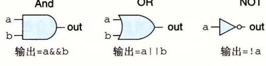

4-9 类型。每个门产生的输 等于 它输入的 个布尔函数

## 4. 2. 2 组合电路和 HCL 布尔表达式

将很多的逻辑门组合成一个网,就能构建计算块 (computational block) ,称为组合电 (combin tional circuits) 。如何构建这些网有儿个限制:

- ·每个逻辑门的输入必须连接到下述选项之一: 个系统输入(称为主输入), )某 个存储器单元的输出, )某个逻辑门的输出
- ·两个或多个逻辑门的输出不能连接在一起 否则它们可能会使线上的信号矛盾,可 能会导致一个不合法的电压或电路故障
- ·这个网必须是无环的。也就是 网中不能有路径 系列的门而形成一个回路, 这样的回路会导致该网络计 的函数有歧义。

<sup>10</sup> 是一个我们觉得非常有用的简单组合电路的例子 它有两个输入 b, 有唯 一的输出 eq, 都是 (从上面的 AND 门可以看出)或都是 (从下面的 AND 门可 以看出)时,输出为 HCL 来写这个网的函数就是:

bool eq = (a && b) I I (!a && !b);

这段代码简单地定义了位级(数据类型 bool 表明了这 点)信号 eq, 它是输入 的函数。从这个例子可以看出 HCL 使用了 语言风格的语法,`='将一个信号名与一个 表达式联系起来。不过同 不一样,我们不把它看成执行了一次计算并将结果放入内存中 某个位置。相反,它只是给表达式一个名字。

练习题 9 写出信号 xor HCL 表达式, xor 就是异或,输入为 。信号 xor 和上面定义的 eq 有什么关系?

4-11 给出了另一个简单但很有用的组合电路,称为多路复用器 (multiplexor, 通常 称为 "MUX") 。多路复用器根据输入控制信号的值,从一组不同的数据信号中选出一个。 在这个单个位的多路复用器中,两个数据信号是输入位 b, 控制信号是输入位 。当 时,输出等于 a; 而当 时,输出等于 。在这个电路中,我们可以看出两个 AND 门决定了是否将它们相对应的数据输入传送到 OR 门。当 时,上面的 AND 将传送信号 (因为这个门的另一个输入是! s), 而当 时,下面的 AND 门将传送信 。接下来,我们来写输出信号的 HCL 表达式,使用的就是组合逻辑中相同的操作:

bool out= (s && a) I I (!s && b);

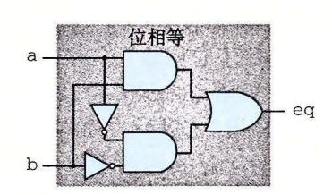

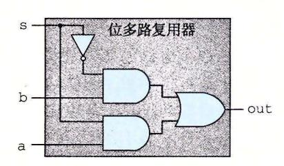

<sup>10</sup> 检测位相等的组合电路。当输入都为 <sup>11</sup> 单个位的多路复用器电路。如果控制信号 或都为 时,输出等千 1, 则输出等于输入 a; 时,输出等千输入

HCL 表达式很清楚地表明了组合逻辑电路和 语言中逻辑表达式的对应之处。它们 都是用布尔操作来对输入进行计算的函数。值得注意的是,这两种表达计算的方法之间有 以下区别:

- ·因为组合电路是由 系列的逻辑门组成,它的属性是输出会持续地响应输人的变 化。如果电路的输入变化了,在一定的延迟之后,输出也会相应地变化。相比之 下, 表达式只会在程序执行过程中被遇到时才进行求值。
- •C 的逻辑表达式允许参数是任意整数, 表示 FALSE, 其他任何值都表示 TRUE 而逻辑门只对位值 进行操作。
- •C 的逻辑表达式有个属性就是它们可能只被部分求值。如果一个 AND OR 操作 的结果只用对第一个参数求值就能确定,那么就不会对第二个参数求值了。例如下 面的 表达式:

(a && !a) && func(b,c)

这里函数 func 是不会被调用的,因为表达式 (a && ! a) 求值为 。而组合逻辑没有 部分求值这条规则,逻辑门只是简单地响应输人的变化。

## 4. 2. 3 字级的组合电路和 HCL 整数表达式

通过将逻辑门组合成大的网,可以构造出能计算更加复杂函数的组合电路。通常,我 们设计能对数据宇 (word) 进行操作的电路。有一些位级信号,代表一个整数或 些控制模 式。例如,我们的处理器设计将包含有很多字,字的大小的范围为 位到 <sup>64</sup> 位,代表整 数、地址、指令代码和寄存器标识符。

执行字级计算的组合电路根据输入字的各个位,用逻辑门来计算输出字的各个位。例如 4-12 中的一个组合电路,它测试两个 <sup>64</sup> 位字 是否相等。也就是,当且仅当 的每 一位都和 的相应位相等时,输出才为 。这个电路是用 <sup>64</sup> 个图 4-10 中所示的单个位相等 电路实现的 这些单个位电路的输出用一个 AND 门连起来,形成了这个电路的输出。

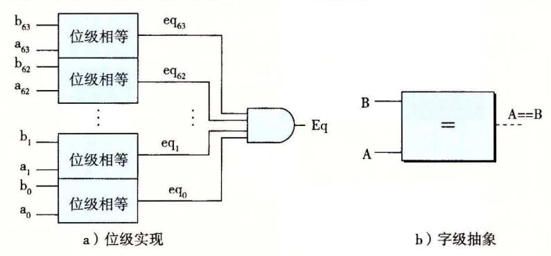

4- 字级相等测试电路。当字 的每一位与字 中相应的位均相等时, 输出等千 。字级相 HCL 中的一个操作

HCL 中,我们将所有字级的信号都声明为 int, 不指定字的大小。这样做是为了 简单。在全功能的硬件描述语言中,每个字都可以声明为有特定的位数。 HCL 允许比较 字是否相等,因此图 4-12 所示的电路的函数可以在字级上表达成

```
bool Eq =(A== B);
```

这里参数 int 型的。注意我们使用和 语言中一样的语法习惯,'='表示赋 值,而`=='是相等运算符。

如图 4-12 中右边所示,在画字级电路的时候,我们用中等粗度的线来表示携带字的 每个位的线路,而用虚线来表示布尔信号结果

练习题 10 假设你用练习题 4.9 中的异或电路而不是位级的相等电路来实现一个字 相等电路。设计一个 <sup>64</sup> 位字的相等电路需要 <sup>64</sup> 个字级的异或电路,另外还要两个逻辑门。

4-13 是字级的多路复用器电路。这个电路根据控制输入位 s, 产生 <sup>64</sup> 位的字 Out, 等千两个输入字 或者 中的一个。这个电路由 <sup>64</sup> 个相同的子电路组成,每个子电 路的结构都类似于图 4-11 中的位级多路复用器。不过这个字级的电路并没有简单地复制 <sup>64</sup> 次位级多路复用器,它只产生一次! s, 然后在每个位的地方都重复使用它,从而减少 反相器或非门 (inverters) 的数量。

处理器中会用到很多种多路复用器,使得我们能根据某些控制条件,从许多源中选出 一个字。在 HCL 中,多路复用函数是用情况表达式 (case expression) 来描述的。情况表达 式的通用格式如下:

```
select1 : expr1; 
select2 : expr2; 
selectk : exprk;
```

这个表达式包含一系列的情况,每种情况i都有一个布尔表达式 $select_i$ 和一个整数表达式 $expr_i$ ,前者表明什么时候该选择这种情况,后者指明的是得到的值。

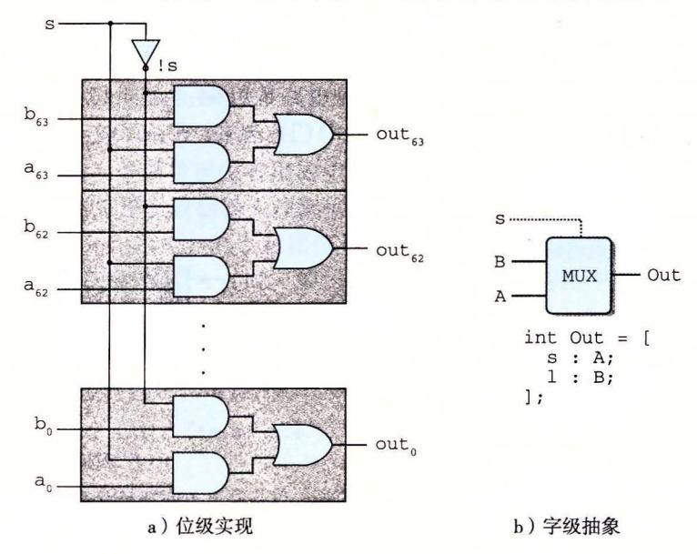

图 4-13 字级多路复用器电路。当控制信号 s 为 1 时,输出会等于输入字 A, 否则等于 B。HCL 中用情况(case)表达式来描述多路复用器

同 C 的 switch 语句不同,我们不要求不同的选择表达式之间互斥。从逻辑上讲,这些选择表达式是顺序求值的,且第一个求值为 1 的情况会被选中。例如,图 4-13 中的字级多路复用器用 HCL 来描述就是:

```
word Out = [
```

在这段代码中,第二个选择表达式就是 1,表明如果前面没有情况被选中,那就选择这种情况。这是 HCL 中一种指定默认情况的方法。几乎所有的情况表达式都是以此结尾的。

允许不互斥的选择表达式使得 HCL 代码的可读性更好。实际的硬件多路复用器的信号必须互斥,它们要控制哪个输入字应该被传送到输出,就像图 4-13 中的信号 s 和!s。要将一个 HCL 情况表达式翻译成硬件,逻辑合成程序需要分析选择表达式集合,并解决任何可能的冲突,确保只有第一个满足的情况才会被选中。

选择表达式可以是任意的布尔表达式,可以有任意 多的情况。这就使得情况表达式能描述带复杂选择标准 的、多种输入信号的块。例如,考虑图 4-14 中所示的四路复用器的图。这个电路根据控制信号 s1 和 s0,从 4 个输入字 A、B、C和 D 中选择一个,将控制信号看作一图 4-14 个两位的二进制数。我们可以用 HCL 来表示这个电路,用布尔表达式描述控制位模式的不同组合:

图 4-14 四路复用器。控制信号 s1 和 s0 的不同组合决定了哪个数 据输入会被传送到输出

word Out4 = [
!s1 && !s0 : A; # 00

! s1 : B; # 01 ! s0 : C; # 10 : D; # 11

] ;

右边的注释(任何以#开头到行尾结束的文字都是注释)表明了 sl s0 的什么组合会 导致该种情况会被选中。可以看到选择表达式有时可以简化,因为只有第一个匹配的情况 才会被选中。例如,第二个表达式可以写成! sl, 而不用写得更完整! sl && s0, 因为另一 种可能 sl 等于 已经出现在了第一个选择表达式中了。类似地,第 个表达式可以写作 !s0, 而第四个可以简单地写成

来看最后一个例子,假设我们想设计一个逻辑电路来找一组字 中的最小值, 如下图所示:

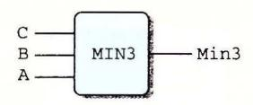

HCL 来表达就是:

word Min3 = [ A<= B && A<= C : A; B <= A && B <= C : B; 1 . : C;

] ;

- 练习题 11 计算三个字中最小值的 HCL 代码包含了 个形如 X<=Y 的比较表达式。 重写代码计算同样的结果,但只使用三个比较。
- 练习题 12 写一个电路的 HCL 代码,对于输入字 C, 选择中间值。也就 是,输出等于三个输入中居于最小值和最大值之间的那个字。

组合逻辑电路可以设计成在字级数据上执行许多不同类型的操作。具体的设计已经超 出了我们讨论的范围。算术 逻辑单元 (ALU) 是一种很重要的组合电路,图 4-15 是它的 个抽象的图示。这个电路有三个输人:标号为 的两个数据输入,以及一个控制输 人。根据控制输入的设置,电路会对数据输人执行不同的算术或逻辑操作。可以看到,这 ALU 中画的四个操作对应千 Y86-64 指令集支持的四种不同的整数操作,而控制值和这 些操作的功能码相对应(图 4-3) 。我们还注意到减法的操作数顺序,是输入 减去输入 之所以这样做,是为了使这个顺序与 subq 指令的参数顺序一致。

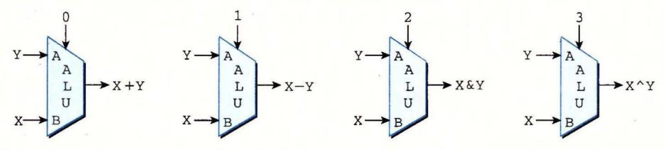

4-1 算术 逻辑单元 (ALU) 。根据函数输入的设置,该电路会执行四种算术和逻辑运算中的一种

### 4.2. 4 集合关系

在处理器设计中,很多时候都需要将一个信号与许多可能匹配的信号做比较,以此来 检测正在处理的某个指令代码是否属千某一类指令代码。下面来看一个简单的例子,假设 想从一个两位信号 code 中选择高位和低位来为图 4-14 中的四路复用器产生信号 sl s0,

如下图所示:

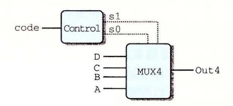

在这个电路中,两位的信号 code 就可以用来控制对 `于个数据字 做选择。 根据可能的 code 值,可以用相等测试来表示信号 sl s0 的产生:

```
bool s1 =code== 2 I I code== 3; 
bool s0 = code == 1 11 code == 3;
```

还有一种更简洁的方式来 表示 这样的属性:当 code 在集合 {2, 3) 中时 sl 1, code 在集合 {l, 3) 中时 s0 1:

```
bool s1 = code in { 2, 3 }; 
bool s0 = code in { 1, 3 };
```

判断集合关系的通用格式是:

iexpr in { ie Pr1,iexpr …, ie prk}

这里被测试的值 iexpr 和待匹配的值 iexpr1 ~iexprk 都是整数表达式。

### 4. 2. 5 存储器和时钟

组合电路从本质上讲,不存储任何信息。相反,它们只是简单地响应输入信号,产生等 千输入的某个函数的输出。为了产生时序电路(sequential cuit) ,也就是有状态并且在这个 状态上进行计算的系统,我们必须引入按位存储信息的设备。存储设备都是由同一个时钟控制 的,时钟是一个周期性信号,决定什么时候要把新值加载到设备中。考虑两类存储器设备:

- ·时钟寄存器(简称寄存器)存储单个位或字。时钟信号控制寄存器加载输入值。
- ·随机访问存储器(简称内存)存储多个字,用地址来选择该读或该写哪个字。随机访 问存储器的例子包括: )处理器的虚拟内存系统,硬件和操作系统软件结合起来使 处理器可以在一个很大的地址空间内访问任意的字; )寄存器文件,在此,寄存器 标识符作为地址。在 IA32 Y86-64 处理器中,寄存器文件有 <sup>15</sup> 个程序寄存器(% rax~%r14)

正如我们看到的那样,在说到硬件和机器级编程时,"寄存器"这个词是两个有细微 差别的事情。在硬件中,寄存器直接将它的输入和输出线连接到电路的其他部分。在机器 级编程中,寄存器代表的是 CPU 中为数不多的可寻址的字,这里的地址是寄存器 ID 。这 些字通常都存在寄存器文件中,虽然我们会看到硬件有时可以直接将一个字从一个指令传 送到另一个指令,以避免先写寄存器文件再读出来的延迟。需要避免歧义时,我们会分别 称呼这两类寄存器为"硬件寄存器"和"程序寄存器"。

4-16 更详细地说明了一个硬件寄存器以及它是如何工作的。大多数时候,寄存器 都保待在稳定状态(用 表示),产生的输出等千它的当前状态。信号沿着寄存器前面的组 合逻辑传播,这时,产生了一个新的寄存器输入(用 表示),但只要时钟是低电位的,寄 存器的输出就仍然保持不变。当时钟变成高电位的时候,输入信号就加载到寄存器中,成 为下一个状态 y, 直到下一个时钟上升沿,这个状态就一直是寄存器的新输出。关键是寄 存器是作为电路不同部分中的组合逻辑之间的屏障。每当每个时钟到达上升沿时,值才会 从寄存器的输入传送到输出。我们的 Y86-64 处理器会用时钟寄存器保存程序计数器 (PC) 、条件代码 (CC) 和程序状态 (Stat)

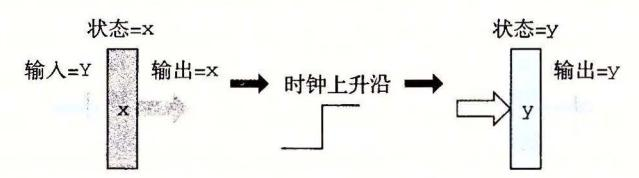

4· 16 寄存器操作。寄存器输出会一直保持在当前寄存器状态上,直到时钟信号 上升。当时钟上升时,寄存器输入上的值会成为新的寄存器状态 <sup>3</sup>

下面的图展示了一个典型的寄存器文件:


寄存器文件有两个读端口 (A B) ,还有一个写端口 (W) 。这样一个多端口随机访问 存储器允许同时进行多个读和写操作。图中所示的寄存器文件中,电路可以读两个程序寄 存器的值,同时更新第三个寄存器的状态。每个端口都有一个地址输入,表明该选择哪个 程序寄存器,另外还有一个数据输出或对应该程序寄存器的输入值。地址是用图 4-4 中编 码表示的寄存器标识符。两个读端口有地址输入 srcA srcB("source A" "source B" 的缩写)和数据输出 valA valB("value A" "value B" 的缩写) 写端口有地址输入 dstW("destination W" 的缩写),以及数据输入 valW("value W" 的缩写)。

虽然寄存器文件不是组合电路,因为它有内部存储。不过,在我们的实现中,从寄存 器文件读数据就好像它是一个以地址为输入、数据为输出的一个组合逻辑块。当 srcA srcB 被设成某个寄存器 ID 时,在一段延迟之后,存储在相应程序寄存器的值就会出现在 valA valB 上。例如,将 srcA 设为 3' 就会读出程序寄存器%rbx 的值,然后这个值就 会出现在输出 valA 上。

向寄存器文件写入字是由时钟信号控制的,控制方式类似于将值加载到时钟寄存器。每 次时钟上升时,输入 valW 上的值会被写入输入 dstW 上的寄存器 ID 指示的程序寄存器。当 dstW 设为特殊的 ID OxF 时,不会写任何程序寄存器。由于寄存器文件既可以读也可以写, 一个很自然的问题就是"如果我们试图同时读和写同一个寄存器会发生什么?"答案简单明了: 如果更新一个寄存器,同时在读端口上用同一个寄存器 ID, 我们会看到一个从旧值到新值的变 化。当我们把这个寄存器文件加入到处理器设计中,我们保证会考虑到这个属性的。

处理器有 个随机访问存储器来存储程序数据,如下图所示:

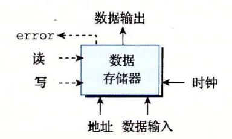

这个内存有一个地址输入,一个写的数据输入,以及一个读的数据输出。同寄存器文件 一样,从内存中读的操作方式类似于组合逻辑:如果我们在输入 address 上提供一个地址, 并将 write 控制信号设置为 o, 那么在经过一些延迟之后,存储在那个地址上的值会出现在 输出 data 上。如果地址超出了范围, error 信号会设置为 1, 否则就设置为 。写内存是由 时钟控制的:我们将 address 设置为期望的地址,将 data in 设置为期望的值,而 write 置为 然后当我们控制时钟时,只要地址是合法的,就会更新内存中指定的位置。对千读 操作来说,如果地址是不合法的, error 信号会被设置为 。这个信号是由组合逻辑产生的, 因为所需要的边界检查纯粹就是地址输入的函数,不涉及保存任何状态。

## 囚日 现实的存储器设计

真实微处理器中的存储器系统比我们在设计中假想的这个简单的存储器要复杂得 多。它是由几种形式的硬件存储器组成的,包括几种随机访问存储器和磁盘,以及管理 这些设备的各种硬件和软件机制 存储器系统的设计和特点在第 章中描述。

不过,我们简单的存储器设计可以用于较小的系统,它提供了更复杂系统的处理器 和存储器之间接口的抽象。

我们的处理器还包括另外一个只读存储器,用来读指令。在大多数实际系统中,这两个 存储器被合并为一个具有双端口的存储器:一个用来读指令,另一个用来读或者写数据。

## 4. 3 Y86-64 的顺序实现

现在已经有了实现 Y86-64 处理器所需要的部件。首先,我们描述一个称为 SEQ("sequential" 顺序的)的处理器。每个时钟周期上, SEQ 执行处理一条完整指令所需的所有步 骤。不过,这需要一个很长的时钟周期时间,因此时钟周期频率会低到不可接受。我们开 SEQ 的目标就是提供实现最终目的的第一步,我们的最终目的是实现一个高效的、流 水线化的处理器。

## 4. 3. 1 将处理组织成阶段

通常,处理一条指令包括很多操作。将它们组织成某个特殊的阶段序列,即使指令的 动作差异很大,但所有的指令都遵循统一的序列。每 步的具体处理取决于正在执行的指 令。创建这样一个框架,我们就能够设计一个充分利用硬件的处理器。下面是关千各个阶 段以及各阶段内执行操作的简略描述:

- ·取指 (fetch) :取指阶段从内存读取指令字节,地址为程序计数器 (PC) 的值。从指 令中抽取出指令指示符字节的两个四位部分,称为 icode (指令代码)和辽un (指令 功能)。它可能取出一个寄存器指示符字节,指明一个或两个寄存器操作数指示符 rA rB 。它还可能取出一个四字节常数字 vale 。它按顺序方式计算当前指令的下 一条指令的地址 valP 。也就是说, valP 等于 PC 的值加上已取出指令的长度。
- ·译码 (decode) :译码阶段从寄存器文件读入最多两个操作数,得到值 valA 和/或 valB, 通常,它读入指令 rA rB 字段指明的寄存器,不过有些指令是读寄存器%rsp 的。
- ·执行 (execute) :在执行阶段,算术/逻辑单元 (ALU) 要么执行指令指明的操作(根 据江un 的值),计算内存引用的有效地址,要么增加或减少栈指针。得到的值我们 称为 valE 。在此,也可能设置条件码。对一条条件传送指令来说,这个阶段会检 验条件码和传送条件(由 ifun 给出),如果条件成立,则更新目标寄存器。同样,