对一条跳转指令来说,这个阶段会决定是不是应该选择分支。

- ·访存 (memory) :访存阶段可以将数据写入内存,或者从内存读出数据。读出的值 valM
- ·写回 write back) :写回阶段最多可以写两个结果到寄存器文件
- ·更新 PCCPC update) :将 PC 设置成下一条指令的地址

处理器无限循环,执行这些阶段 在我们简化的实现中,发生任何异常时,处理器就 会停止:它执行 halt 指令或非法指令,或它试图读或者写非法地址 在更完整的设计中, 处理器会进入异常处理模式,开始执行由异常的类型决定的特殊代码

从前面的讲述可以看出,执行一条指令是需要进行很多处理的。我们不仅必须执行指 令所表明的操作,还必须计算地址、更新栈指针,以及确定下一条指令的地址。幸好每条 指令的整个流程都比较相似。因为我们想使硬件数量尽可能少,并且最终将把它映射到一 个二维的集成电路芯片的表面,在设计硬件时,一个非常简单而一致的结构是非常重要 的。降低复杂度的一种方法是让不同的指令共享尽量多的硬件。例如,我们的每个处理器 设计都只含有一个算术/逻辑单元,根据所执行的指令类型的不同,它的使用方式也不同。 在硬件上复制逻辑块的成本比软件中有重复代码的成本大得多。而且在硬件系统中处理许 多特殊情况和特性要比用软件来处理困难得多。

我们面临的一个挑战是将每条不同指令所需要的计算放入到上述那个通用框架中。我 们会使用图 4-17 中所示的代码来描述不同 Y86-64 指令的处理。图 4-18 ~图 4-21 中的表描 述了不同 Y86-64 指令在各个阶段是怎样处理的。很值得仔细研究一下这些表。表中的这 种格式很容易映射到硬件。表中的每一行都描述了一个信号或存储状态的分配(用分配操 作一来 表示)。阅读 时可以把它看成是从上至下的顺序求值。 当我们将这些 计算映射到硬 件时,会发现其实并不需要严格按照顺序来执行这些求值。

```
1 OxOOO: 30f20900000000000000 
2 OxOOa: 30f31500000000000000 
3 Ox014 : 6123 
4 Ox016: 30f48000000000000000 
5 Ox020: 40436400000000000000 
6 Ox02a: a02f 
7 Ox02c: bOOf 
s Ox02e: 734000000000000000 
9Ox037: 804100000000000000 
10 Ox040: 
11 Ox040: 00 
12 Ox041: 
13 Ox041 : 90 
14 
                                         irmovq $9, %rdx 
                                         irmovq $21, %rbx 
                                         subq %rdx, %rbx 
                                         irmovq $128,%rsp 
                                        rmmovq %rsp, 100(%rbx) 
                                        pushq %rdx 
                                        popq %rax 
                                         je done 
                                        call proc 
                                    done: 
                                        halt 
                                    proc: 
                                  I ret 
                                  I 
                                                                   # subtract 
                                                                   # Problem 4.13 
                                                                   # store 
                                                                   # push 
                                                                   # Problem 4.14 
                                                                   # Not taken 
                                                                   # Problem 4. 18 
                                                                   # Return
```

<sup>17</sup> Y86-64 指令序列示例。我们会跟踪这些指令通过各个阶段的处理

4-18 给出了对 OPq (整数和逻辑运算)、 rrmovq (寄存器-寄存器传送)和 irmovq (立 即数-寄存器传送)类型的指令所需的处理。让我们先来考虑一下整数操作。回顾图 4-2, 可以看到我们小心地选择了指令编码,这样四个整数操作 (addq subq andq xorq) 有相同的 icode 值。我们可以以相同的步骤顺序来处理它们,除了 ALU 计算必须根据 ifun 中编码的具体的指令操作来设定。

| 阶段    | OPq rA,                                             | rrmovq rA , rB                                   | irmovqV, rB                                                           |
|-------|-----------------------------------------------------|--------------------------------------------------|-----------------------------------------------------------------------|
| 取指    | icode : ifun -<br>M, [PC]<br>M1 [ PC+l]<br>rA :rB - | icode: ifun -<br>M1 [PC]<br>rA,rB-<br>M1 [ PC+l] | icode, ifun -<br>M1 [PC]<br>rA,rB-<br>M,[PC+l]<br>vale-<br>Ms [ PC+2] |
|       | valP 仁. PC+2                                        | PC+2<br>valP                                     | PC+JO<br>valP                                                         |
| 译码    | valA -<br>R[ rA]<br>valB-<br>R[ rB]                 | valA ~ R[<br>rA]                                 |                                                                       |
| 执行    | valE 仁- valB OP valA<br>Set CC                      | o+ valA<br>valE                                  | valE -<br>O + valC                                                    |
| 访存    |                                                     |                                                  |                                                                       |
|       | R[ rB]-valE                                         | R[rB]-<br>valE                                   | R[ rB]-<br>valE                                                       |
| 更新 PC | PC-valP                                             | PC<br>valP                                       | PC<br>valP                                                            |

Y86-64 指令 OPq rrmovq irmovq 在顺序实现中的计算 。这些 指令计算了一个值,并将结果 存放在寄存器中。符 icode:ifun 表明指令字节的两个组成部分,而 rA:rB 表明寄存 符字节的两个组成部分。符号 M1 [x] 表示访问(读或者 写)内存位置 处的一个字节 而凶 x] 示访问八个字节

整数操作指令的处理遵循上面列出的通用模式。在取指阶段,我们不需要常数字,所 valP 就计算为 PC+2 。在译码阶段,我们要读两个操作数。在执行阶段,它们和功能 指示符辽un 一起再提供给 ALU, 这样一来 valE 就成为了指令结果。这个计算是用 valB OP valA 来表达的,这里 OP 代表辽un 指定的操作 。要 注意两个参数的顺序一 这个顺序与 Y86-64 (和 x86-64) 的习惯是一致的。例如,指令 subq %rax, %rdx 计算的是 R [ %rdx]-R [%rax] 的值 这些指令在访存阶段什么也不做,而在写回阶段, valE 被写入 寄存器 rB ,然后 PC 设为 valP ,整个指令的执行就结束了

### 日日 跟踪 subq 指令的执行

作为一个例子,让我们来看看一条 subq 指令的处理过程,这条指令是图 4- <sup>17</sup> 所示 目标代码的第 行中的 subq 指令 可以看到前面两条指令分别将寄存器 rdx rbx 初始化成 <sup>21</sup> 我们还能看到指令位于地址 Ox014, 由两个字节组成,值分别为 Ox61 Ox23 。这条指令处理的各个阶段如下表所示,左边列出了处理一个 OPq 指令的 通用的规则(图 4-18) ,而右边列出的是对这条具体指令的计算

| 阶段    | OPq rA , rB               | subq<br>rdx,<br>rbx                |
|-------|---------------------------|------------------------------------|
| 取指    | icode, ifun -<br>M, [ PC] | icode : ifun -<br>M, [Ox014]= 6: 1 |
|       | rA, rB +- M1 [ PC+ l]     | M1[0x015]=2 : 3<br>rA ,rB -        |
|       | valP 仁- PC+               | Ox014+2=0x016<br>valP              |
| 译码    | valA -<br>R[ rA]          | valA -<br>rdx]= 9                  |
|       | valB -<br>R[ rB]          | R[ %rbx] = 21<br>valB -            |
| 执行    | valE -<br>valB OP valA    | valE -<br>9=12<br>21               |
|       | Set CC                    | ZF-<br>0, OF-<br>0, SF<br>0        |
| 访存    |                           |                                    |
| 写回    | R[ rB] valE               | R[%rbx]<br>valE = 12               |
| 更新 PC | PC -<br>valP              | PC 仁- valP =Ox016                  |

这个跟踪表明我们达到了理想的效果,寄存器%rbx 设成了 12, 三个条件码都设成 o, PC 加了

执行 rrmovq 指令和执行算术运算类似。不过,不需要取第二个寄存器操作数。我们 ALU 的第二个输入设为 o, 先把它和第一个操作数相加,得到 valE= valA, 然后再把 这个值写到寄存器文件。对 irmov 的处理与此类似,除了 ALU 的第一个输入为常数值 valC 。另外,因为是长指令格式,对于 irmovq, 程序计数器必须加 <sup>10</sup> 。所有这些指令都 不改变条件码。

练习题 13 填写下表的右边一栏,这个表描述的是图 4-17 中目标代码第 行上的 irmovq 指令的处理情况:

|       | 通用                                                                                   |                      |
|-------|--------------------------------------------------------------------------------------|----------------------|
| 阶段    | irmovq V, rB                                                                         | irmovq \$128,<br>rsp |
| 取指    | M1 [PC]<br>icode, ifun -<br>rA,rB+- M1[PC+l]<br>vale-<br>Ms[ PC+ 2]<br>PC+lO<br>valP |                      |
| 译码    |                                                                                      |                      |
| 执行    | +valC<br>valE                                                                        |                      |
| 访存    |                                                                                      |                      |
| 写回    | R[ rB]-<br>valE                                                                      |                      |
| 更新 PC | PC+- valP                                                                            |                      |

这条指令的执行会怎样改变寄存器和 PC 呢?

4-19 给出了内存读写指令 rmmovq mrmovq 所需要的处理。基本流程也和前面的 一样,不过是用 ALU 来加 valC valB, 得到内存操作的有效地址(偏移扯与基址寄存器 值之和)。在访存阶段,会将寄存器值 valA 写到内存,或者从内存中读出 valM

| 阶段    | rmmovq rA, D(rB)      | mrmovq DCrB) , rA         |
|-------|-----------------------|---------------------------|
| 取指    | icode, ifun+-M1[PC]   | icode: ifun -<br>M1 [ PC] |
|       | M, [ PC+ l]<br>rA:rB- | M,[PC+l]<br>rA,rB -       |
|       | vale-<br>Ms[PC+2]     | vale-<br>Ms[PC+ 2]        |
|       | valP-<br>PC+ lO       | valP 七- PC                |
| 译码    | valA -<br>R[rA]       |                           |
|       | valB -<br>R[rB]       | valB -<br>R[rB]           |
| 执行    | valE -<br>valB+valC   | valE ~ valB+valC          |
| 访存    | Ms[valE]-valA         | valE -<br>Ms [ valE]      |
| 写回    |                       |                           |
|       |                       | R[ A]-valM                |
| 更新 PC | PC 令- valP            | PC 七- valP                |

Y86-64 指令 rmmovq mrmovq 在顺序实现中的计算。这些指令读或者写内存

### 跟踪 rmmovq 指令的执行

让我们来看看图 4-17 中目标代码的第 rmmovq 指令的处理情况。可以看到,前 面的指令已将寄存器%rsp 初始化成了 128, 而%rbx 仍然是 subq 指令(第 行)算出来的

结果 <sup>12</sup> 。我们还可以看到,指令位于地址 Ox020, <sup>10</sup> 个宇节。前两个的值为 Ox40 Ox43, 个是数字 Ox0000000000000064 (十进制数 100) 按字节反过来得到的数。各 个阶段的处理如下:

|       | 通用                       | 具体                                  |  |
|-------|--------------------------|-------------------------------------|--|
| 阶段    | rmmovq rA, D(rB)         | rmrnovq %rsp, 100 (%rbx)            |  |
| 取指    | icode,ifun- M1[PC]       | icode: ifun -<br>M, [ Ox020] = 4: O |  |
|       | M,[<br>PC+ l]<br>rA,rB - | rA:rB-<br>M,[Ox021] =4:3            |  |
|       | M8[PC+2]<br>valP -       | 从[ Ox022] = 100<br>vale             |  |
|       | valP-<br>PC+lo           | Ox020+ 10= Ox02a<br>valP -          |  |
| 译码    | valA -<br>R[ rA]         | R[%rsp]= 128<br>valA -              |  |
|       | valB -<br>R[ rB]         | valB -<br>rbx]= 12                  |  |
| 执行    | valB+valC<br>valE        | 12+100=112<br>valE                  |  |
| 访存    | Ms [ valE]-<br>val A     | 112]~ 128                           |  |
| 写回    |                          |                                     |  |
| 更新 PC | PC 令- valP               | PC 仁- Ox02a                         |  |

跟踪记录表明这条指令的效果就是将 <sup>128</sup> 写入内存地址 112, 并将 PC <sup>10</sup> .

4-20 给出了处理 pushq popq 指令所需的步骤。它们可以算是最难实现的 Y86- <sup>64</sup> 指令了,因为它们既涉及访问内存,又要增加或减少栈指针。虽然这两条指令的流程 比较相似,但是它们还是有很重要的区别。

| 阶段 | pushq rA                                           | popq rA                                               |
|----|----------------------------------------------------|-------------------------------------------------------|
| 取指 | icode , ifun -<br>M1 [ PC]<br>M1[PC+l]<br>rA :rB - | M, [PC]<br>icode , ifun -<br>rA :rB -<br>M1 [ PC+ l ] |
|    | va!P 牛- PC +2                                      | valP-<br>PC+ 2                                        |
| 译码 | valA- R[ rA]<br>R[ %rsp]<br>valB -                 | valA -<br>R[ %rsp]<br>valB -<br>R[ %rsp]              |
| 执行 | (-8)<br>valE<br>valB                               | valB +B<br>valE                                       |
| 访存 | Ms[ valE]-<br>valA                                 | valE -<br>valA                                        |
| 写回 | R[%rsp]-<br>valE                                   | [号 rsp]- valE<br>R[ rA]-valM                          |
| 更新 | PC<- valP                                          | PC 仁- valP                                            |

4- Y8 6-64 指令 pu shq popq 在顺序实现 中的计算。这些指令将值压入或弹出栈

pushq 开始时很像我们前面讲过的指令,但是在译码阶段,用 rsp 作为第二个 寄存器操作数的标识符,将栈指针赋值为 valB 。在执行阶段,用 ALU 将栈指针减 。减 的值就是内存写的地址,在写回阶段还会存回到%rsp 中。将 valE 作为写操作的地 址,是湮循 86-64 <sup>86</sup> -64) 的惯例,也就是在写之前, pushq 应该先将栈指针减去 8, 即使栈指针的更新实际上是在内存操作完成之后才进行的。

#### 跟踪 pushq 指令的执行

让我们来看看图 <sup>17</sup> 中目标代码的笫 pushq 指令的处理情况 此时,寄存 器% rdx 的值为 9, 而寄存器%rsp 的值为 <sup>128</sup> 。我们还可以看到指令是位于地址 Ox02a, 有两个宇节,值分别为 OxaO Ox2f 。各个阶段的处理如下:

|    | 通用                                              |                                                                       |
|----|-------------------------------------------------|-----------------------------------------------------------------------|
| 阶段 | pushq rA<br>I                                   | pushq %rdx                                                            |
| 取指 | icode: ifun -<br>M1 [ PC]<br>M1[PC+l]<br>rA:rB- | M1 [ Ox02a] =a<br>icode : ifun -<br>: 0<br>M,[Ox02b] = 2:f<br>rA,rB - |
|    | PC<br>valP                                      | 2= Ox02c<br>valP<br>Ox02a                                             |
| 译码 | valA -<br>R[ rA]<br>valB -<br>rsp]              | R[ %rdx] = 9<br>valA -<br>valB-<br>rsp]= 128                          |
| 执行 | lB +(-8)<br>lE                                  | valE-<br>12a+C-8)=120                                                 |
| 访存 | M,[valE]-<br>valA                               | 9<br>20                                                               |
|    | R[%rsp]-<br>valE                                | sp]- 120                                                              |
| 更新 | PC 仁-<br>lP                                     | PC~ Ox02c                                                             |

跟踪记录表明这条指令的效果就是将 rsp 设为 0, 写入地址 120, 并将 PC

popq 指令的执行与 pushq 的执行类似,除了在译码阶段要读两次栈指针以外 这样 做看上去很多余,但是我们会看到让 valA valB 都存放栈指针的值,会使后面的流程 跟其他的指令更相似,增强设计的 体一致性 在执行阶段,用 ALU 给栈指针加 8, 是用没加过 的原始值作为内存操作的地址 在写回阶段,要用加过 的栈指针更新栈指 针寄存器,还要将寄存器 rA 更新为从内存中读出的值。用没加过 的值作为内存读地址, 保持了 Y86-6 (和 x86-64) 的惯例, popq 应该首先读内存,然后再增加栈指针。

练习题 14 填写下表的右边一栏,这个表描述的是图 4-17 中目标代码第 popq 指令的处理情况:

|       | 通用                                                         | 具体          |  |
|-------|------------------------------------------------------------|-------------|--|
| 阶段    | popq rA                                                    | popq<br>rax |  |
| 取指    | M1 [PC]<br>icode, ifun -<br>rA:rB-<br>M1[PC+l]             |             |  |
| 译码    | PC +2<br>valP<br>R[ %rsp]<br>valA -<br>valB-<br>R[<br>rsp] |             |  |
|       | val8+<br>valE                                              |             |  |
| 访存    | valM -<br>Ms [ valA]                                       |             |  |
|       | rsp]<br>valE<br>R[ rA]-valM                                |             |  |
| 更新 PC | PC<br>valP                                                 |             |  |

指令的执行会怎样改变寄存器和 PC 呢?

- 练习题 15 根据图 4-20 中列出的步骤,指令 pushq %rsp 会有什么样的效果?这与 练习题 4. 中确定的 Y86-64 期望的行为一致吗?
- 练习题 16 假设 popq 在写回阶段中的两个寄存器写操作按照图 4-20 列出的顺序进 行。 popq %rsp 执行的 果会是怎样的?这与练习题 4. 中确定的 Y86-64 期望的行 为一致吗?

4-21 表明了三类控制转移指令的处理:各种跳转、 call ret 。可以看到,我们 能用同前面指令一样的整体流程来实现这些指令。

| 阶段    | jXX Dest                 | call Dest                | ret                       |
|-------|--------------------------|--------------------------|---------------------------|
| 取指    | M1 [PC]<br>icode, ifun - | M1 [PC]<br>icode: ifun - | icode, ifun -<br>M1 [ PC] |
|       | vale-<br>Ms[PC+l]        | vale-<br>Ms[PC+l]        |                           |
|       | PC +9<br>valP            | valP 仁- PC +9            | valP 仁- PC+l              |
| 译码    |                          |                          | valA-<br>R[ %rsp]         |
|       |                          | valB<br>rsp]             | R[%rsp]<br>valB -         |
| 执行    |                          | (-8)<br>valE 仁- valB     | va1B +8<br>valE           |
|       | Cond(CC, ifun)<br>Cnd    |                          |                           |
| 访存    |                          | Ms [ valE]-<br>valP      | valM -<br>Ms [ val A]     |
| 写回    |                          | R[%rsp]-<br>valE         | R[%rsp]-<br>valE          |
| 更新 PC | PC 七- Cnd?valC valP      | PC-<br>vale              | PC-<br>valM               |

Y86-64 指令 jXX call ret 在顺序实现中的计算。这些指令导致控制转移

同对整数操作一样,我们能够以一种统一的方式处理所有的跳转指令,因为它们的不同 只在千判断是否要选择分支的时候 除了不需要 个寄存器指示符字节以外,跳转指令在取 指和译码阶段都和前面讲的其他指令类似。在执行阶段,检查条件码和跳转条件来确定是否 要选择分支,产生出一个 位信号 Cnd 。在更新 PC 阶段,检查这个标志,如果这个标志为 1, 就将 PC 设为 valC (跳转目标),如果为 o, 就设为 valP(下一条指令的地址)。我们的表 x?a : 类似千 语句中的条件表达式——当 非零时,它等于 a, 为零时,等于

### 日日 跟踪 je 指令的执行

让我们来看看图 4-17 中目标代码的第 je 指令的处理情况 subq 指令(第 已经将所有的条件码都置为了 o, 所以不会选择分支。该指令位 于地址 Ox02e, 宇节。第一个字节的值为 Ox73, 而剩下的 个字节是数字 Ox0000000000000040 按宇节 反过来得到的数,也就是跳转的目标。各个阶段的处理如下:

|       | 通用                        |                                     |  |
|-------|---------------------------|-------------------------------------|--|
| 阶段    | jXX Dest                  | j e Ox040                           |  |
| 取指    | icode, ifun -<br>M1 [ PC] | icode: ifun -<br>M, [ Ox02e] = 7: 3 |  |
|       | Ms[ PC+l]<br>vale-        | vale +-Ma [ Ox02f] = Ox040          |  |
|       | PC +9<br>valP             | Ox02e+ 9 = Ox037<br>valP            |  |
| 译码    |                           |                                     |  |
| 执行    |                           |                                     |  |
|       | ifun)<br>Cnd 令- Cond CC   | Cond((o , o, o>, 3)=0<br>Cnd -      |  |
| 访存    |                           |                                     |  |
| 写回    |                           |                                     |  |
| 更新 PC | PC 七- Cnd valC, valP      | Ox040: Ox037= Ox037<br>PC<br>0?     |  |

就像这个跟踪记录表明的那样,这条指令的效果就是将 PC

练习题 17 从指令编码(图 4-2 和图 4-3) 我们可以看出, rmmovq 指令是一类更通用 的、包括条件转移在内的指令的无条件版本。请给出你要如何修改下面 rrmovq 指令

的步骤,使之也能处理 个条件传送指令。看看 jXX 指令的实现(图 4-21) 是如何处理 条件行为的,可能会有所帮助。

| 阶段    | cmovXX rA, rB            |
|-------|--------------------------|
| 取指    | icode, ifun -<br>M1 [PC] |
|       | M1 [PC+ l]<br>rA,rB -    |
|       | valP+- PC+2              |
| 译码    | valA-<br>R[rA]           |
| 执行    | valE -<br>O + valA       |
| 访存    |                          |
| 写回    |                          |
|       | R[rB]- valE              |
| 更新 PC | PC<br>valP               |

指令 call ret 与指令 pushq popq 类似,除了我们要将程序计数器的值入栈和 出栈以外。对指令 call ,我们要将 valP, 也就是 call 指令后紧跟着的那条指令的地址, 压入栈中。在更新 PC 阶段,将 PC 设为 valC, 也就是调用的目的地 对指令 ret, 在更 PC 阶段,我们将 valM, 即从栈中取出的值,赋值给 PC

练习题 18 填写下表的右边一栏,这个表描述的是图 4-17 中目标代码第 call 指令的处理情况:

|       | 通用                       | 具体         |  |
|-------|--------------------------|------------|--|
| 阶段    | call Dest                | call Ox041 |  |
| 取指    | M1 [PC]<br>icode, ifun - |            |  |
|       | valC-M8[<br>PC+l]        |            |  |
|       | valP 仁- PC               |            |  |
| 译码    |                          |            |  |
|       | R[%rsp]<br>valB -        |            |  |
| 执行    | valB+(-8)<br>valE        |            |  |
| 访存    | alE -valP                |            |  |
| 写回    | R[%rsp]-valE             |            |  |
| 更新 PC | PC-<br>valC              |            |  |

这条指令的执行会怎样改变寄存器、 PC 和内存呢?

我们创建了一个统一的框架,能处理所有不同类型的 Y86 <sup>64</sup> 指令 虽然指令的行为 大不相同,但是我们可以将指令的处理组织成 个阶段。现在我们的任务是创建硬件设计 来实现这些阶段,并把它们连接起来。

### 跟踪 ret 指令的执行

让我们来看看图 4-17 中目标代码的笫 <sup>13</sup> ret 指令的处理情况 指令的地址是 Ox041, 只有一个字节的编码, Ox90 。前面的 call 指令将 rsp 置为了 120, 并将返回 地址 Ox040 存放在了内存地址 <sup>120</sup> 各个阶段的处理如下:

| 阶段    | 通用                              | 具体                                        |
|-------|---------------------------------|-------------------------------------------|
| 別权    | ret                             | ret .                                     |
| 取指    | $icode:ifun \leftarrow M_1[PC]$ | icode: ifun $\leftarrow M_1[0x041] = 9:0$ |
|       |                                 | a factor of the same of the               |
|       | and the second second           |                                           |
|       | valP ← PC+1                     | $valP \leftarrow 0x041 + 1 = 0x042$       |
| 译码    | valA ← R[%rsp]                  | valA ← R[%rsp]=120                        |
|       | valB ← R[%rsp]                  | valB ← R[%rsp]=120                        |
| 执行    | valE ← valB+8                   | valE ← 120+8=128                          |
|       |                                 |                                           |
| 访存    | valM ← M <sub>8</sub> [valA]    | valM ← M <sub>8</sub> [120] = 0x040       |
| 写回    | R[%rsp]← valE                   | R[%rsp]← 128                              |
|       |                                 | or the Miles of the Control               |
| 更新 PC | PC ← valM                       | PC ← 0x040                                |

跟踪记录表明这条指令的效果就是将 PC 设为 0x040, halt 指令的地址。同时也将 %rsp置为了 128。

#### 4.3.2 SEQ 硬件结构

实现所有 Y86-64 指令所需要的计算可以 被组织成6个基本阶段:取指、译码、执行、 访存、写回和更新 PC。图 4-22 给出了一个能 执行这些计算的硬件结构的抽象表示。程序计 数器放在寄存器中,在图中左下角(标明为 "PC")。然后,信息沿着线流动(多条线组合在 一起就用宽一点的灰线来表示), 先向上, 再 向右。同各个阶段相关的硬件单元(hardware units)负责执行这些处理。在右边,反馈线路 向下,包括要写到寄存器文件的更新值,以及 更新的程序计数器值。正如在 4.3.3 节中讨论 的那样,在 SEQ 中,所有硬件单元的处理都 在一个时钟周期内完成。这张图省略了一些小 的组合逻辑块,还省略了所有用来操作各个硬 件单元以及将相应的值路由到这些单元的控制 逻辑。稍后会补充这些细节。我们从下往上画 处理器和流程的方法似乎有点奇怪。在开始设计 流水线化的处理器时, 我们会解释这么画的原因。

硬件单元与各个处理阶段相关联:

取指:将程序计数器寄存器作为地址,指令内存读取指令的字节。PC增加器(PC incrementer)计算 valP,即增加了的程序计数器。

译码:寄存器文件有两个读端口A和B, 从这两个端口同时读寄存器值 valA和 valB。

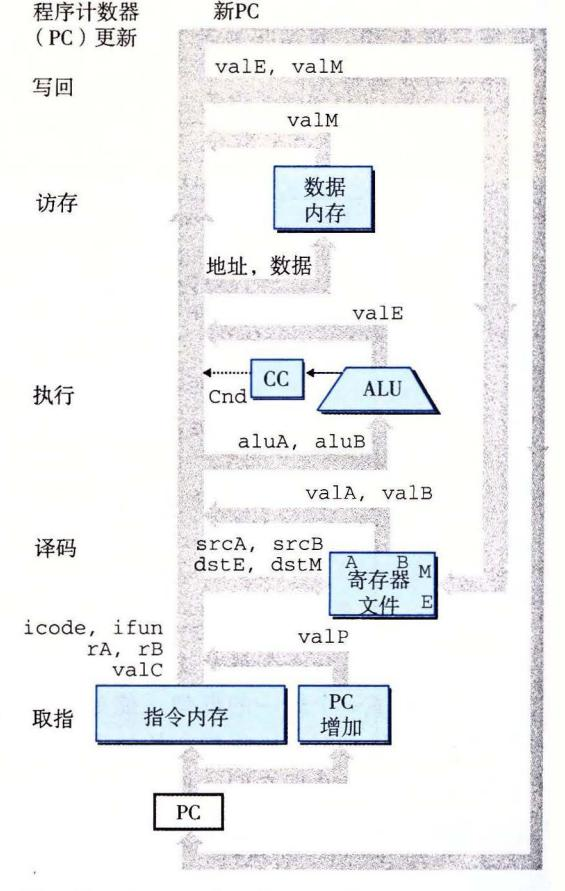

图 4-22 SEQ的抽象视图,一种顺序实现。指令执行 过程中的信息处理沿着顺时针方向的流程进 行,从用程序计数器(PC)取指令开始,如图 中左下角所示

执行:执行阶段会根据指令的类型,将算术/逻辑单元(ALU)用于不同的目的。对整数操作,它要执行指令所指定的运算。对其他指令,它会作为一个加法器来计算增加或减少栈指针,或者计算有效地址,或者只是简单地加0,将一个输入传递到输出。

条件码寄存器(CC)有三个条件码位。ALU负责计算条件码的新值。当执行条件传送指令时,根据条件码和传送条件来计算决定是否更新目标寄存器。同样,当执行一条跳转指令时,会根据条件码和跳转类型来计算分支信号 Cnd。

**访存**:在执行访存操作时,数据内存读出或写入一个内存字。指令和数据内存访问的 是相同的内存位置,但是用于不同的目的。

写回:寄存器文件有两个写端口。端口 E 用来写 ALU 计算出来的值,而端口 M 用来写从数据内存中读出的值。

PC更新:程序计数器的新值选择自:valP,下一条指令的地址;valC,调用指令或 跳转指令指定的目标地址;valM,从内存读取的返回地址。

图 4-23 更详细地给出了实现 SEQ 所需要的硬件(分析每个阶段时, 我们会看到完整的

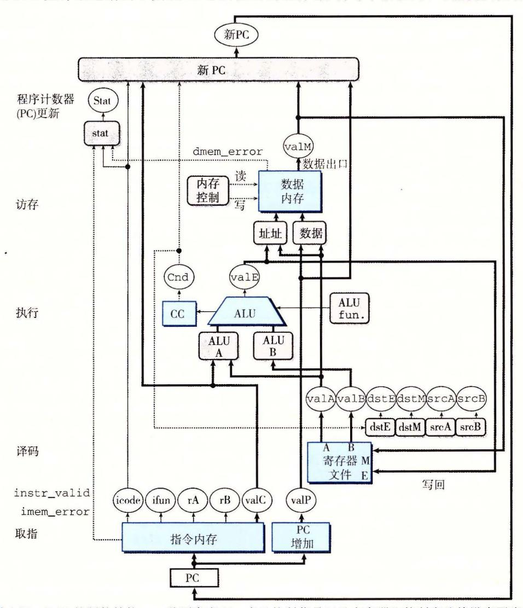

图 4-23 SEQ 的硬件结构, 一种顺序实现。有些控制信号以及寄存器和控制字连接没有画出来

细节) 我们看到一组和前面一样的硬件单元,但是现在线 路看得更清楚了。这幅图以及 其他的硬件图都使用的是下面的画图惯例。

- ·白色方框表示时钟寄存器 程序计数器 PC SEQ 中唯 的时钟寄存器
- 浅蓝色方框表示硬件单元。这包括内存、 ALU 等等。在我们所有的处理器 现中, 都会使用这一组基本 的单元。我们把这些单元当作"黑盒子",不关心它们的细节 设计。
- 控制逻辑块用灰色圆角矩形表示。这些块用来从一组信号源中进行选择,或者用来 计算一些布尔函数 。我 非常详细地分析这 块,包括给出 HCL 描述
- 线路的名字在白色圆圈中说明。它们只是线路的标识,而不是什么硬件单元
- 宽度为字长的数据连接用中等粗度的线表示。每条这样的线实际上都代表一簇 <sup>64</sup> 根线,并列地连在一起,将一个字从硬件的 个部分传送到另一部分。
- 宽度为字节或更窄的数据连接用细线表示。根据线 上要携带的值的类型, 每条这 的线实际上都代表一簇 根或 根线。
- 单个位的连接用虚线来表示。这代表芯片上单元与块之间传递的控制值。

4-18 ~图 4-21 中所有的计算都有这样的性质,每一行都代表某个值的计算(如 va lP) ,或者激活某个硬件单元 如内存) 4-2 的第二栏列 出了这些计算和动作 .除了 我们已经讲过的那些信号以外,还列出了四个寄存器 ID 信号: srcA, va!A 的源; srcB, va!B 的源; dstE, 写入 va !E 的寄 存器 ;以及 tM, 写入 va !M 的寄存器

| 阶段    | 计算                                       | OPq rA , rB                                                          | mrmovq DCrB) , rA                                                                       |
|-------|------------------------------------------|----------------------------------------------------------------------|-----------------------------------------------------------------------------------------|
| 取指    | icode, ifun<br>rA , rB<br>valC .<br>valP | icode, ifun -<br>M1 [ PC]<br>M, [ PC+l]<br>rA,rB -<br>valP-<br>PC+ 2 | icode: ifun +- M1 [ PC]<br>PC+l]<br>M,[<br>rA,rB-<br>vale-<br>M,[Pc+z]<br>valP 仁- PC +l |
| 译码    | valA , srcA<br>valB, srcB                | valA -<br>R[ rA]<br>valB -<br>R[ rB]                                 | valB-<br>R[rB]                                                                          |
| 执行    | valE<br>Cond. codes                      | va!E 仁- valB OP va!A<br>Set CC                                       | valC<br>valE 仁- valB                                                                    |
| 访存    | Read/ wnte                               |                                                                      | valM -<br>M8 [ valE]                                                                    |
| 写回    | E port, dstE<br>M port, dstM             | R[rB]- valE                                                          | R[ rA]-valM                                                                             |
| 更新 PC | PC                                       | PC 七- valP                                                           | PC<br>valP                                                                              |

<sup>24</sup> 标识顺序实现中的不同计算步骤 第二栏标识出 SEQ 阶段中正在被计算的值, 或正在被执行的操作 以指令 OPq mrmovq 的计算作为示例

图中,右边两栏给出的是指令 OPq mrmovq 的计算,来说明要计算的值 要将这些 算映射到硬件上,我们要 现控制逻辑,它能在不同硬件单元之间传送数据 ,以及操作 这些单元,使得对每个不同的指令执行指定的运算。这就是控制逻辑块的目标,控制逻辑 块在图 4-23 中用灰色圆角方框表示。我们的任务就是依次经过每个阶段,创建这些块的 详细设计。

#### 4. 3. 3 SEQ 的时序

在介绍图 4-18 ~图 4-21 的表时,我们说过要把它们看成是用程序符号写的,那些赋 值是从上到下顺序执行的 。然而,图 -23 中硬件结构的操作运行根本完 全不 同,一个时 钟变化会引发一个经过组合逻辑的流,来执行整个指令。让我们来看看这些硬件怎样实现 表中列出的这 行为。

SEQ 的实现包括组合逻辑和两种存储器设备:时钟寄存器(程序计数器和条件码寄存 器),随机访问存储器(寄存器文件、指令内存和数据内存)。组合逻辑不需要任何时序或 控制 只要输入变化了,值就通过逻辑门网络传播。正如提到过的那样,我们也将读随 机访问存储器看成和组合逻辑 样的操作,根据地址输入产生输出字。对于较小的存储器 来说(例如寄存器文件),这是一个合理的假设,而对于较大的电路来说,可以用特殊的时 钟电路来模拟这个效果。由千指令内存只用来读指令,因此我们可以将这个单元看成是组 合逻辑。

现在还剩四个硬件单元需要对它们的时序进行明确的控制 程序计数器、条件码寄 存器、数据内存和寄存器文件。这些单元通过一个时钟信号来控制,它触发将新值装载到 寄存器以及将值写到随机访间存储器。每个时钟周期,程序计数器都会装载新的指令地 址。只有在执行整数运算指令时,才会装载条件码寄存器。只有在执行 rmrnovq pushq call 指令时,才会写数据内存。寄存器文件的两个写端口允许每个时钟周期更新两个 程序寄存器,不过我们可以用特殊的寄存器 ID OxF 作为端口地址,来表明在此端口不应 该执行写操作。

要控制处理器中活动的时序,只需要寄存器和内存的时钟控制。硬件获得了如图 4-18 ~图 4-21 的表中所示的那些赋值顺序执行一样的效果,即使所有的状态更新实际上同时发生, 且只在时钟上升开始下一个周期时。之所以能保持这样的等价性,是由于 Y86 <sup>64</sup> 指令集 的本质,因为我们遵循以下原则组织计算:

原则:从不回读

处理器从来不需要为了完成一条指令的执行而去读由该指令更新了的状态。

这条原则对实现的成功来说至关重要。为了说明问题,假设我们对 pushq 指令的实现 是先将%rsp 8' 再将更新后的%rsp 值作为写操作的地址。这种方法同前面所说的那个 原则柜违背。为了执行内存操作,它需要先从寄存器文件中读更新过的栈指针。然而,我 们的实现(图 4-20) 产生出减后的栈指针值,作为信号 valE, 然后再用这个信号既作为寄 存器写的数据,也作为内存写的地址。因此,在时钟上升开始下一个周期时,处理器就可 以同时执行寄存器写和内存写了。

再举个例子来说明这条原则,我们可以看到有些指令(整数运算)会设置条件码,有些 指令(跳转指令)会读取条件码,但没有指令必须既设置又读取条件码。虽然要到时钟上升 开始下 个周期时,才会设置条件码,但是在任何指令试图读之前,它们都会更新。

以下是汇编代码,左边列出的是指令地址,图 <sup>25</sup> 给出了 SEQ 硬件如何处理其中第 和第 行指令:

- 123456 OxOOO: irmovq \$0x100,%rbx OxOOa: irmovq \$0x200,%rdx # %rbx <-- Ox100 # %rdx <-- Ox200
- Ox014: addq %rdx,%rbx # %rbx <-- Ox300 CC<-- 000
- Ox016: j e dest # Not taken
- Ox01f: rmmovq %rbx, 0 ()儿 rdx) # M[Ox200] <-- Ox300
- Ox029: dest: halt

标号为 1~4 的各个图给出了 个状态单元,还有组合逻辑,以及状态单元之间的连 接。组合逻辑被条件码寄存器环绕着,因为有的组合逻辑(例如 ALU) 产生输入到条件码 寄存器,而其他部分(例如分支计算和 PC 选择逻辑)又将条件码寄存器作为输入。图中寄

存器文件和数据内存有独立的读连接和写连接,因为读操作沿着这些单元传播,就好像它 们是组合逻辑,而写操作是由时钟控制的。

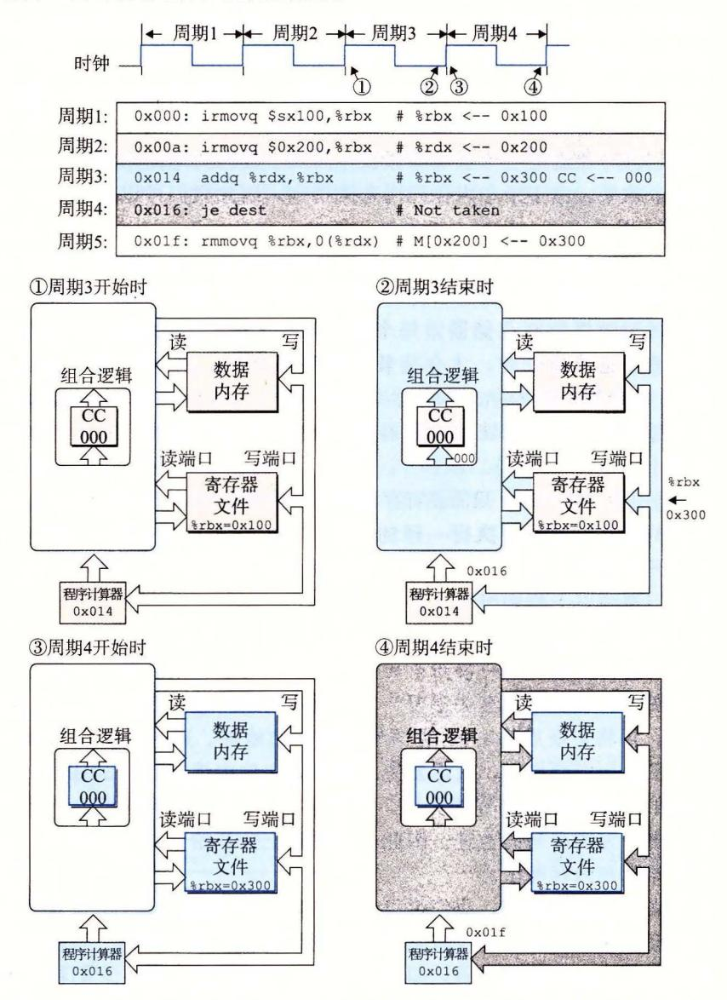

4-25 跟踪 SEQ 的两个执行周期 每个周期开始时,状态单元(程序计数器、条件码寄存 器、寄存器文件以及数据内存)是根据前一条指令设置的 信号传播通过组合逻辑, 创建出新的状态单元的值 在下 个周期开始时,这些值会被加载到状态单元中

4-25 中的不同颜色的代码表明电路信号是如何与正在被执行的不同指令相联系的。 我们假设处理是从设置条件码开始的,按照 ZF SF OF 的顺序,设为 <sup>100</sup> 。在时钟周 开始的时候(点 1) ,状态单元保持的是第二条 irmovq 指令(表中第 行)更新过的状 态,该指令用浅灰色表示 组合逻辑用白色表示 表明它还没有来得及对变化了的状态做 出反应。时钟周期开始时,地址 Ox014 载入程序计数器中。这样就会取出和处理 addq 令(表中第 行)。值沿着组合逻辑流动,包括读随机访问存储器。在这个周期末尾(点 2), 组合逻辑为条件码产生了新的值 (000) ,程序寄存器%rbx 的更新值,以及程序计数器的新 (Ox016) 。在此时,组合逻辑已经根据 addq 指令被更新了,但是状态还是保持着第二 irmovq 指令(用浅灰色表示)设置的值。

当时钟上升开始周期 时(点 3) ,会更新程序计数器、寄存骈文件和条件码寄存器, 因此我们用蓝色来表示,但是组合逻辑还没有对这些变化做出反应 所以用白色表示。在 这个周期内,会取出并执行 je 指令(表中第 行) 在图中用深灰色表示。因为条件码 ZF o, 所以不会选择分支。在这个周期末尾(点 4) ,程序计数器巳 经产生 了新值 OxOlf 组合逻辑已经根据 je 指令(用深灰色表示)被更新过了,但是直到下个周期开始之前,状 态还是保持着 addq 指令(用蓝色表示)设置的值。

如此例所示,用时钟来控制状态单元的更新,以及值通过组合逻辑来传播,足够控制 我们 SEQ 实现中每条指令执行的计算了 。每次 时钟由低变高时,处理器开始执行一条新 指令。

### 4. 3. 4 SEQ 阶段的实现

本节会设计实现 SE 所需要的控制逻辑块的 HCL 描述 。完整 SEQ CL 描述请 参见网络旁注 ARCH:HCL 。在此,我们给出一些例子,而其他的作为练习题。建议你做 做这些练习来检验你的理解,即这些块是如何与不同指令的计算需求 相联系的。

我们没有讲的那部分 SEQ HCL 描述,是不同整数和布尔信号的定义,它们可以作 HCL 操作的参数。其中包括不同硬件信号的名字,以及不同指令代码、功能码、寄存 器名字、 ALU 操作和状态码的常数值。只列出了那些在控制逻辑中必须被显式引用的常 数。图 4-26 列出了我们使用的常数 。按照 习惯,常数值都是大 的。

| 名称      | 值(十六进制) | 含义             |
|---------|---------|----------------|
| IHALT   |         | halt 指令的代码     |
| INOP    | 1       | nop 指令的代码      |
| IRRMOVQ | 2       | rrmovq 指令的代码   |
| IIRMOVQ | 3       | irmovq 指令的代码   |
| IRMMOVQ | 4       | rmmovq 指令的代码   |
| IMRMOVQ | 5       | rnrrnovq 指令的代码 |
| IOPL    | 6       | 整数运算指令的代码      |
| IJXX    | 7       | 跳转指令的代码        |
| ICALL   | 8       | ca ll 指令的代码    |
| IRET    | 9       | ret 指令的代砃      |
| IPUSHQ  | A       | 令的代码<br>pushq  |
| IPOPQ   | B       | 令的代码<br>popq   |
| FNONE   |         | 默认功能码          |
| RRSP    | 4       | rsp 的寄存器 ID    |
| RNONE   | F       | 表明没有寄存器文件访问    |
| ALUADD  |         | 加法运算的功能        |
| SAOK    | 1       | 正常操作状态码        |
| SADR    | 2       | @地址异常状态码       |
| SINS    | 3       | @非法指 令异常状态码    |
| SHLT    | 4       | @halt 状态码      |

<sup>26</sup> HCL 描述中使用的常数值 。这些 值表示的是指令、功能码、寄存器 ID ALU 操作和状态码的编码

除了图 4-18 ~图 4-21 中所示的指令以外,还包括了对 nop halt 指令的处理 nop

指令只是简单地经过各个阶段,除了要将 PC 1, 不进行任何处理。 halt 指令使得处理 器状态被设置为 HLT, 导致处理器停止运行。

### 取指阶段

如图 4-27 所示,取指阶段包括指令内存硬件单元。以 PC 作为第一个字节(字节 0)

节。第一个字节被解释成指令字节,(标 号为 "Split" 的单元)分为两个 位的 数。然后,标号为 "icode" "ifun" 的控制逻辑块计算指令和功能码,或者 使之等于从内存读出的值,或者当指令 地址不合法时(由信号 imem\_error 明),使这些值对应于 nop 指令。根据 icode 的值,我们可以计算三个一位的 信号(用虚线表示):

instr\_valid: 这个字节对应千一 个合法的 Y86-64 指令吗?这个信号用来 发现不合法的指令。

need\_valC: 这个指令包括一个常 数字吗?

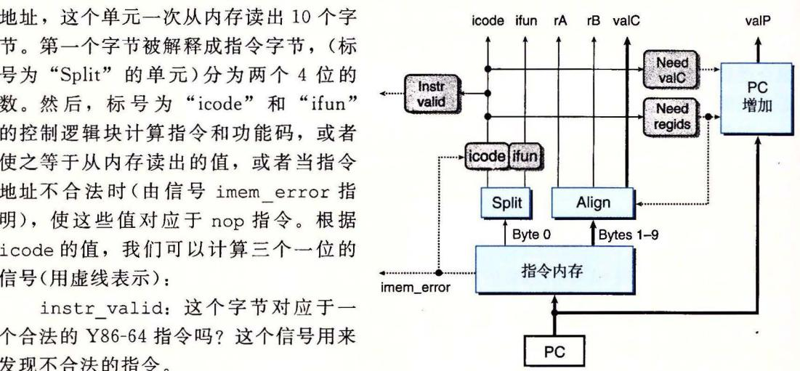

need regids: 这个指令包括一个 -27 SEQ 的取指阶段。以 PC 作为起始地址,从指令 寄存器指示符字节吗? 内存中读出 <sup>10</sup> 个字节。根据这些字节,我们 产生出各个指令字段。 PC 增加模块计算信号 valP

(当指令地址越界时会产生的)信号 instr\_valid imem\_error 在访存阶段被用来 产生状态码。

让我们再来看一个例子, need\_regids HCL 描述只是确定了 icode 的值是否为一 条带有寄存器指示值字节的指令。

bool need\_regids = icode in { IRRMDVQ, IOPQ, IPUSHQ, IPOPQ, IIRMDVQ, IRMMOVQ, IMRMDVQ };

练习题 19 写出 SEQ 实现中信号 need\_valC HCL 代码。

如图 4-27 所示,从指令内存中读出的剩下 个字节是寄存器指示符字节和常数字 的组合编码。标号为 "Align" 的硬件单元会处理这些字节,将它们放入寄存器字段和 常数字中。当被计算出的信号 need\_regids 时,字节 被分开装入寄存器指示符 rA rB 中。否则,这两个字段会被设为 OxF(RNONE) ,表明这条指令没有指明寄存器。 回想一下(图 4-2) ,任何只有一个寄存器操作数的指令,寄存器指示值字节的另一个字 段都设为 OxF(RNONE) 。因此,可以将信号 rA rB 看成,要么放着我们想要访问的寄 存器,要么表明不需要访问任何寄存器。这个标号为 "Align" 的单元还产生常数字 vale 。根据信号 need\_regids 的值,要么根据字节 1~8 来产生 vale, 要么根据字节 2~ 来产生。

PC 增加器硬件单元根据当前的 PC 以及两个信号 need\_regids need\_valC 的值, 产生信号 valP 。对于 PC need\_regids 以及 need\_valC i' 增加器产生值 p+l +r+8i

#### 译码和写回阶段

寄存器。

4-28 给出了 SEQ 中实现译码和写回阶段的逻辑的详细情况。把这两个阶段联系在 一起是因为它们都要访问寄存器文件。

上)。每个端口都有一个地址连接和一个数据 连接,地址连接是一个寄存器 ID, 而数据连接是一 <sup>64</sup> 根线路,既可以作为寄存器文件的输出字(对读 端口来说),也可以作为它的输入字(对写端口来说)。 两个读端口的地址输人为 srcA srcB, 而两个写端 口的地址输入为 dstE dstM 。如果某个地址端口上 的值为特殊标识符 OxF(RNONE) ,则表明不需要访问

根据指令代码 icode 以及寄存器指示值 rA rB ,可能还会根据执行阶段计算出的 Cnd 条件信号, 4-28 底部的四个块产生出四个不同的寄存器文件的 寄存器 ID 。寄存器 ID srcA 表明应该读哪个寄存器以 产生 valA 。所需要的值依赖千指令类型,如图 4-18~ 4-21 中译码阶段第一行中所示。将所有这些条目都 整合到一个计算中就得到下面的 srcA HCL 描述 (回想 RRSP 是%rsp 的寄存器 ID):

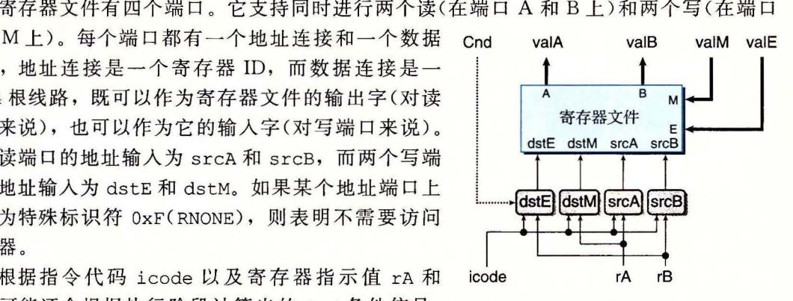

SEQ 的译码和写回阶段。指令 字段译码,产生寄存器文件使用 的四个地址(两个读和两个写)的 寄存器标识符 从寄存器文件 中读出的值成为信号 valA valB 两个写回值 valE valM 作为写操作的数据

```
word srcA = [ 
        icode in { IRRMOVQ, IRMMOVQ, IOPQ, IPUSHQ 
        icode in { IPOPQ, IRET} : RRSP; 
        1 : RNONE; # Don't need register 
                                                       } : rA; 
] ;
```

练习题 20 寄存器信号 srcB 表明应该读哪个寄存器以产生信号 valB 。所需要的 值如图 4-18 ~图 4-21 中译码阶段第二步所示。写出 srcB HCL 代码。

寄存骈 ID dstE 表明写端口 的目的寄存器,计算出来的值 valE 将放在那里。 4-18 ~图 4-21 写回阶段第一步表明了这一点。如果我们暂时忽略条件移动指令,综合所 有不同指令的目的寄存器,就得到下面的 dstE HCL 描述:

```
# WARNING: Conditional move not implemented correctly here 
word dstE = [ 
        icode in { IRRMDVQ} : rB; 
        icode in { IIRMDVQ, IDPQ} : rB; 
        icode in { IPUSHQ, IPOPQ, !CALL, IRET} : RRSP; 
        1 : RNDNE; # Don't write any register 
] ;
```

我们查看执行阶段时,会重新审视这个信号,看看如何实现条件传送。

- 练习题 21 寄存器 ID dstM 表明写端口 的目的寄存器,从内存中读出来的值 valM 将放在那里,如图 4-18 ~图 4-21 中写回阶段第二步所示。写出 dstM HCL 代码。
- 冻习题 22 只有 popq 指令会同时用到寄存器文件的两个写端口。对于指令 popq

%rsp, 两个写端口会用到同一个地址,但是写入的数据不同。为了解决这个 冲突,必须对两个写端口设立一个优先级,这样一来,当同一个周期内两个写端口都 试图对一个寄存器进行写时,只有较高优先级端口上的写才会发生。那么要实现练习 4. 中确定的行为,哪个端口该具有较高的优先级呢?

执行阶段包括算术 逻辑单元 (ALU) 。这个单 元根据 alufun 信号的设置,对输入 aluA aluB 执行 ADD SUBTRACT AND EXCLUSIVE-OR 运算。如图 4-29 所示,这些数据和控制信号 是由三个控制块产生的。 ALU 的输出就是 valE 信号。

在图 4-18 ~图 4-21 中,执行阶段的第一步就 是每条指令的 ALU 计算。列出的操作数 aluB icode ifun valC valA valB 前面,后面是 aluA, 这样是为了保证 subq 指令 4-29 valB 减去 valA 。可以看到,根据指令的类型, aluA 的值可以是 valA vale, 或者是— 因此我们可以用下面的方式来表达产生 aluA 的控 制块的行为:

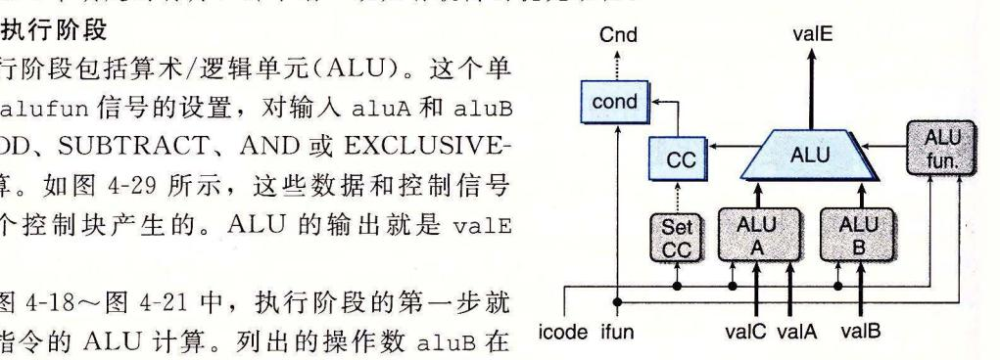

SEQ 执行阶段。 ALU 要么为整数 运算指令执行操作,要么作为加法 器。根据 ALU 的值,设置条件码 寄存器。检测条件码的值,判断是 否该选择分支

```
word aluA = [ 
        icode in { IRRMOVQ, IOPQ} : valA; 
        icode in { IIRMOVQ, IRMMOVQ, IMRMOVQ} : valC; 
        icode in { ICALL, IPUSHQ} : -8; 
        icode in { IRET, IPOPQ} : 8; 
        # Other instructions don't need ALU 
] ;
```

练习题 23 根据图 4-18 ~图 4-21 中执行阶段第一步的第一个操作数,写出 SEQ 信号 aluB HCL 描述。

观察 ALU 在执行阶段执行的操作,可以看到它通常作为加法器来使用。不过,对于 OPq 指令,我们希望它使用指令辽un 字段中编码的操作。因此,可以将 ALU 控制的 HCL 描述写成:

```
word alufun = [ 
] ; 
         icode == IDPQ : ifun; 
         1 : ALUADD;
```

执行阶段还包括条件码寄存器。每次运行时, ALU 都会产生三个与条件码相关的信 零、符号和溢出。不过,我们只希望在执行 OPq 指令时才设置条件码。因此产生了 一个信号 set cc 来控制是否该更新条件码寄存器:

```
bool set_cc = icode in { IDPQ };
```

标号为 "cond" 的硬件单元会根据条件码和功能码来确定是否进行条件分支或者条件 数据传送(图 4-3) 。它产生信号 Cnd, 用于设置条件传送的 dstE, 也用在条件分支的下一 PC 逻辑中。对于其他指令,取决于指令的功能码和条件码的设置, Cnd 信号可以被设 置为 或者 。但是控制逻辑会忽略它。我们省略这个单元的详细设计。

练习题 <sup>24</sup> 条件传送指令(简称 ovXX) 的指令代码为 IRRMOVQ 。如图 <sup>28</sup> 所示

我们可以用执行阶段 中产生 Cnd 信号实现这 些指令。修改 stE HCL 代码以 实现这 指令。

#### 访存阶段

访存阶段的任务就是读或者写程序数据。如 <sup>30</sup> 所示,两个控制块产 存地址和内存输入 数据(为写操作)的值。另外两个块产生表明应该执 行读操作还是写操作的控制信号。当执行读操作时, 数据内存产生值 valM

4-18 ~图 4-21 的访存阶段给出了每个指令 类型所 需要的 内存操作。可以 看到内存读和写 地址 总是 valE alA 。这个块 HCL 描述 就是:

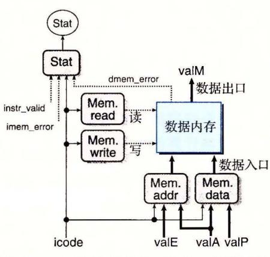

30 SEQ 访存阶段。数 据内存既 可以 ,也可以读内存 的值。从内 存中 读出的值就形成了信号 valM

```
word mem_addr = ( 
        icode in { IRMMOVQ , IPUSHQ, ICALL, IMRMOVQ} : valE; 
        icode in { IPOPQ, IRET} : valA; 
        # Other instructions don't need address
```

] ;

练习题 <sup>25</sup> 观察图 4-18 ~图 <sup>21</sup> 所示的不同指令的访存操作 我们可以看到内存 写的数据总是 alA valP 。写 SEQ 中信号 mem\_da HCL 代码。 我们希望只为从内存读数据的指令设置控制信号 mem\_read, HCL 代码表示就是: bool mem\_read = icode in { IMRMOVQ, IPOPQ, IRET };

练习题 26 我们希望只为向内存写数据的指令设置控制信号 mem\_write SEQ 中信号 mem\_write HCL 代码。

访存阶段最后的功能是根据取值阶段产生的 icode imem\_error instr\_va 以及数据内存产生的 dmem\_error 信号,从指令执行的结果来计算状态码 Stat

练习题 27 写出 Stat HCL 代码,产生四个 状态码 SAOK SADR SINS SHLT(参见图 4-26)

#### 更新 PC 阶段

SEQ 中最后一个阶段会产生程序计数器的新值 (见图 4-3 。如图 4- <sup>18</sup> ~图 4-21 最后步骤所示 依据指令的类型和是否要选择分支,新的 PC 可能 valC valM valP 。用 HCL 来描述这个选择 就是:

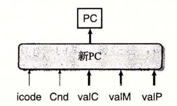

SEQ 更新 PC 阶段。根据指令代码 和分支标志 从信号 vale valM valP 中选出下一个 PC 的值

```
word new_pc = [
```

# Call. Use instruction constant

icode == !CALL : valC;

# Taken branch. Use instruction constant

icode == IJXX && Cnd: valC;

# Completion of RET instruction. Use value from stack

icode == IRET : valM; # Default: Use incremented PC 1 : valP;

] ;

#### 6. SEQ 小结

现在我们已经浏览了 Y86-64 处理器的一个完整的设计。可以看到,通过将执行每条 不同指令所需的步骤组织成一个统一的流程,就可以用很少晕的各种硬件单元以及一个时 钟来控制计算的顺序,从而 现整个处理器。不过这样一来,控制逻辑就必须要在这些单 元之间路由信号,并根据指令类型 和分支条件产生适当的控制信号

SEQ 唯一的问题就是它太慢了。时钟必须非常慢,以使信号能在一个周期内传播所 有的阶段 让我们来看看 处理一条 re 七指令的例子。在时钟周期起始时,从更新过的 PC 开始,要从指令内存中读出指 ,从寄存器文件中读出栈指针, ALU 将栈指针加 8' 为了 得到程序计数器的下一个值,还要从内存中读出返回地址 所有这一切都必须在这个周期 结束之前完成。

这种实现方法不能充分利用硬件单元,因为每个单元只在整个时钟周期的一部分时间 内才被使用 我们会看到引入流水线能获得更好的性能。

## 4. 4 流水线的通用原理

在试图设计一个流水线化的 Y86-64 处理器之前,让我们先来看看流水线化的系统的 一些通用属性和原理。对千曾经在自助餐厅的服务线上工作过或者开车通过自动汽车清洗 线的人,都会非常熟悉这种系统 在流水线化的系统中,待执行的任务被划分成了若干个 独立的阶段。在自助餐厅,这些阶段包括提供沙拉、主菜、甜点以及饮料 在汽车清洗 中,这些阶段包括喷水和打肥皂、擦洗、上蜡和烘干。通常都会允许多个顾客同时经过系 统,而不是要等到一个用户完成了所有从头至尾的过程才让下一个开始 在一个典型的自 助餐厅流水线上,顾客按照相同的顺序经过各个阶段,即使他们并不需要某些菜。在汽车 清洗的情况中,当前面一辆汽车从喷水阶段进入擦洗阶段时,下一辆就可以进入喷水阶段 了。通常,汽车必须以相同的速度通过这个系统,避免撞车。

流水线化的一个重要特性就是提高了系统的吞吐量 (throughput) ,也就是单位时间内 服务的顾客总数,不过它也会轻微地增加延迟 Clatency) ,也就是服务一个用户所需要的时 例如,自助餐厅里的一个只 需要 甜点的顾客,能很快通过 个非流水线化的系统,只 在甜点阶段停留。但是在流水线化的系统中,这个顾客如果试图直接去甜点阶段就有可能 招致其他顾客的愤怒了

#### 4. 4. 1 计算流水线

让我们把注意力放到计算流水线上来,这里的"顾客"就是指令,每个阶段完成指令 执行的一部分。图 4-32a 给出了一个很简单的非流水线化的硬件系统例子。它是由一些执 行计算的逻辑以及一个保存计算结果的寄存器组成的 时钟信号控制在每个特定的时间间 隔加载寄存器。 CD 播放器中的译码器就是这样的一个系统 输入信号是从 CD 表面读出 的位,逻辑电路对这些位进行译码,产生音频信号 图中的计算块是用组合逻辑来实现 的, 味着信号会穿过一系列逻辑门,在一定时间的延迟之后,输出就成为了输入的某个 函数。

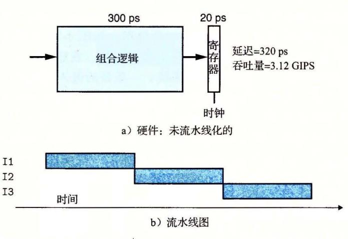

4-32 非流水线化的计算硬件。每个 320ps 的周期内,系统用 300ps 计算组 合逻辑函 数, 20ps 将结果存到输出寄存器中

在现代逻辑设计中,电路延迟以微微秒或皮秒 (picosecond, 简写成 "ps") ,也就是 10-1 秒为单位来计算。在这个例子中,我们假设组合逻辑需要 300ps, 而加载寄存器需要 20ps 。图 4-32 还给出了一种时序图,称为流水线图 (pipeline diagram) 。在图中,时间从 左向右流动 从上到下写着一组操作(在此称为 <sup>11</sup> <sup>12</sup> I3) 。实心的长方形表示这些指 令执行的时间。这个实现中,在开始下一条指令之前必须完成前一个。因此,这些方框在 垂直方向上并没有相互重叠。下面这个公式给出了运行这个系统的最大吞吐最:

吞吐量 = 
$$\frac{1 \, \text{条指令}}{(20 + 300) \text{ps}} \cdot \frac{1000 \text{ps}}{1 \text{ns}^{\odot}} \approx 3.12 \text{ GIPS}$$

我们以每秒千兆条指令 (GIPS) ,也就是每秒十亿条指令,为单位来描述吞吐量 头到尾执行一条指令所需要的时间称为延迟 (latency) 。在此系统中,延迟为 320ps, 也就 是吞吐 的倒数

假设将系统执行的计算分成三个阶段 (A C) ,每个阶段需要 lOOps, 如图 4-33

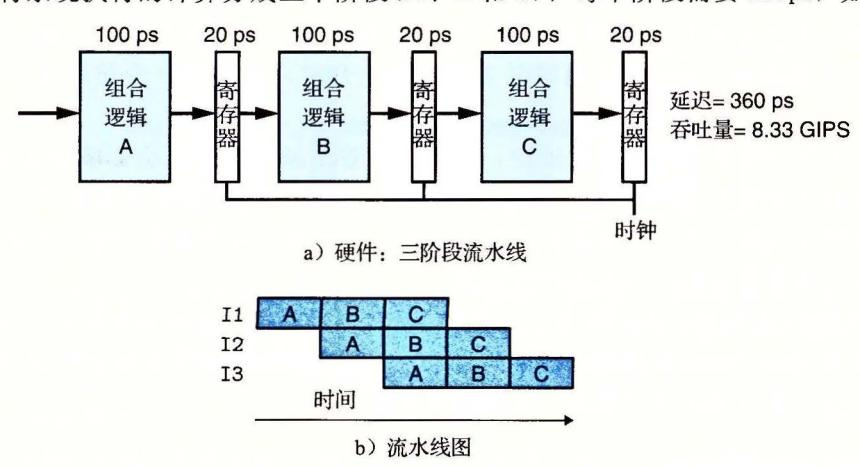

4-33 阶段流水线化的计算硬件。计算被划分为 个阶段 。每经过 一个 120ps 的周期,每条指令就行进通过一个阶段

示。然后在各个阶段之间放上流水线寄存器 (pipeline register) ,这样每条指令都会按照三 步经过这个系统,从头到尾需要三个完整的时钟周期。如图 <sup>33</sup> 中的流水线图所示,只 Il 进入 B, 就可以让 I2 进入阶段 了,依此类推。在稳定状态下,三个阶段都应 该是活动的,每个时钟周期,一条指令离开系统,一条新的进入。从流水线图中第三个时 钟周期就能看出这一点,此时, Il 是在阶段 C, I2 在阶段 B, I3 是在阶段 。在这个系 统中,我们将时钟周期设为 100+20= 120ps, 得到的吞吐量大约为 8. 33 GIPS 。因为处理 一条指令需要 个时钟周期,所以这条流水线的延迟就是 X 120 = 360ps 。我们将系统吞 吐最提高到原来的 8. 33/3. 12 = 2. <sup>67</sup> 倍,代价是增加了一些硬件,以及延迟的少量增加 (360/320 = 1. 12) 。延迟变大是由于增加的流水线寄存器的时间开销。

### 4. 4. 2 流水线操作的详细说明

为了更好地理解流水线是怎样工作的,让我们来详细看看流水线计算的时序和操作。 <sup>34</sup> 给出了前面我们看到过的三阶段流水线(图 4-33) 的流水线图。就像流水线图上方指明的那样,流水线阶 段之间的指令转移是由时钟信号来控制的。每隔 120ps, 信号从 上升至 1, 开始下 组流水线阶段的计算。

<sup>35</sup> 跟踪了时刻 <sup>240</sup> ~ <sup>360</sup> 之间的电路活动, 指令 <sup>11</sup> 经过阶段 C, <sup>12</sup> 经过阶段 B, I3 经过阶段 。就在时刻 <sup>240</sup> (点 )时钟上升之前,阶段 中计算 的指令 I2 的值已经到达第 个流水线寄存器的输入, 但是该寄存器的状态和输出还保持为指令 <sup>11</sup> 在阶段 中计算的值。指令 <sup>11</sup> 在阶段 中计算的值已经到达第

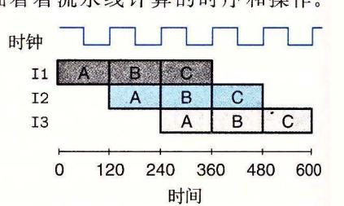

4-34 三阶段流水线的时序。时钟 信号的上升沿控制指令从 个流水线阶段移动到下一个 阶段

二个流水线寄存器的输入。当时钟上升时,这些输入被加载到流水线寄存器中,成为寄 存器的输出(点 2) 。另外,阶段 的输入被设置成发起指令 I3 的计算。然后信号传播 通过各个阶段的组合逻辑(点 3) 。就像图中点 处的曲线化的波阵面 (curved wavefront) 表明的那样,信号可能以不同的速率通过各个不同的部分。在时刻 <sup>360</sup> 之前,结果值到 达流水线寄存器的输入(点 4) 。当时刻 <sup>360</sup> 时钟上升时,各条指令会前进经过 个流水 线阶段。

从这个对流水线操作详细的描述中,我们可以看到减缓时钟不会影响流水线的行为。 信号传播到流水线寄存器的输入,但是直到时钟上升时才会改变寄存器的状态。另一方 面,如果时钟运行得太快,就会有灾难性的后果。值可能会来不及通过组合逻辑,因此当 时钟上升时,寄存器的输入还不是合法的值。

根据对 SEQ 处理器时序的讨论 (4. 3. 节),我们看到这种在组合逻辑块之间采用时钟 寄存器的简单机制,足够控制流水线中的指令流。随着时钟周而复始地上升和下降,不同 的指令就会通过流水线的各个阶段,不会相互干扰。

### 4. 4. 3 流水线的局限性

<sup>33</sup> 的例子给出了一个理想的流水线化的系统,在这个系统中,我们可以将计算 分成三个相互独立的阶段,每个阶段需要的时间是原来逻辑需要时间的三分之一。不幸的 是,会出现其他一些 因素,降低流水线的效率。

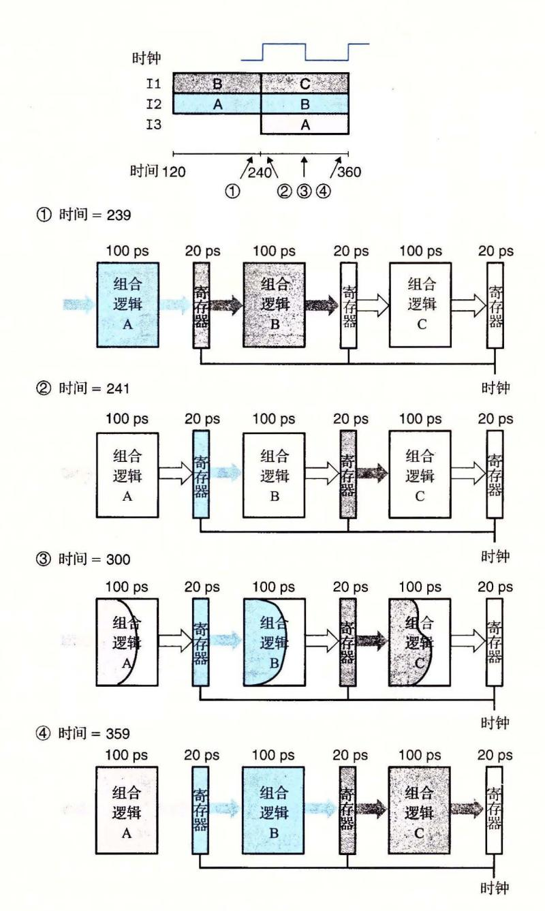

-35 流水线操作的一个时钟周期。在时刻 <sup>240</sup> (点 1) 时钟上升之前,指令 <sup>11</sup> <sup>12</sup> 已经完成了阶段 时钟上升后,这些指令开始传送到阶段 B, 而指令 <sup>13</sup> 开始经过阶段 (点 3) 。就在时钟开始再次上升之前,这些指令的结果就会传到流水线寄存器的输入(点 4)

#### 1. 不一致的划分

4-36 展示的系统中和前面一样,我们将计算划分为了 个阶段 ,但是通过这 些阶 段的延迟从 50p 150ps 不等 。通过所有阶段 的延迟和仍然为 300ps 。不 过,运行时钟的 率是由最慢的阶段 的延迟限制的 。流水线图表 明, 每个 时钟周期 ,阶段 都会 (用 自色方框表示) OOps, 而阶段 会空闲 0ps 。只有阶段 处千活动状态。我们必 须将时钟周期设为 150+20=l70ps, 得到吞吐量为 5. 88 IPS 另外 ,由于时钟周期 减慢

### 了,延迟也增加到了 510ps


a) 硬件:三阶段流水线,不一致的阶段延迟

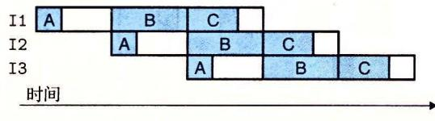

b) 流水线图

4-36 由不一致的阶段延迟造成的流水线技术的局限性。系统的吞吐量受最慢阶段的速度所限制

对硬件设计者来说,将系统计算设计划分成一组具有相同延迟的阶段是一个严峻的挑战。 通常,处理器中的某些硬件单元,如 ALU 和内存,是不能被划分成多个延迟较小的单元的。 这就使得创建一组平衡的阶段非常困难。在设计流水线化的 Y86-64 处理器中,我们不会过于关 注这一层次的细节,但是理解时序优化在实际系统设计中的重要性还是非常重要的。

练习题 28 假设我们分析图 4-32 中的组合逻辑,认为它可以分成 个块,依次命 名为 A~F, 延迟分别为 <sup>80</sup> <sup>30</sup> <sup>60</sup> <sup>50</sup> <sup>70</sup> lOps, 如下图所示:

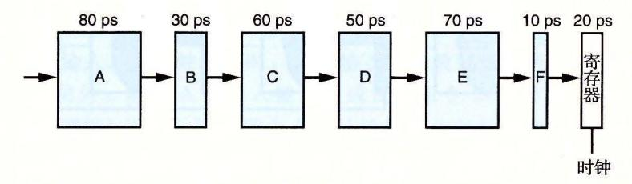

在这些块之间插入流水线寄存器,就得到这一设计的流水线化的版本。根据在哪 里插入流水线寄存器,会出现不同的流水线深度(有多少个阶段)和最大吞吐量的组 合。假设每个流水线寄存器的延迟为 20ps

- A. 只插入一个寄存器,得到一个两阶段的流水线。要使吞吐量最大化,该在哪里插 入寄存器呢?吞吐量和延迟是多少?
- B. 要使一个三阶段的流水线的吞吐量最大化,该将两个寄存器插在哪里呢?吞吐量 和延迟是多少?
- C. 要使一个四阶段的流水线的吞吐量最大化,该将三个寄存器插在哪里呢?吞吐量 和延迟是多少?
- D. 要得到一个吞吐量最大的设计,至少要有几个阶段?描述这个设计及其吞吐量和延迟。
- 流水线过深,收益反而下降

4-37 说明了流水线技术的另一个局限性。在这个例子中,我们把计算分成了 阶段,每个阶段需要 50ps 。在每对阶段之间插入流水线寄存器就得到了一个六阶段流水 线。这个系统的最小时钟周期为 <sup>50</sup> + 20 = 70ps, 吞吐最为 14. <sup>29</sup>GIPS 。因此,通过将流 水线的阶段数加倍,我们将性能提高了 14. 29/8. 33= 1. <sup>71</sup> 。虽然我们将每个计算时钟的时 间缩短了两倍,但是由于通过流水线寄存器的延迟,吞吐量并没有加倍。这个延迟成了流 水线吞吐量的一个制约因素。在我们的新设计中,这个延迟占到了整个时钟周期 28. 6%

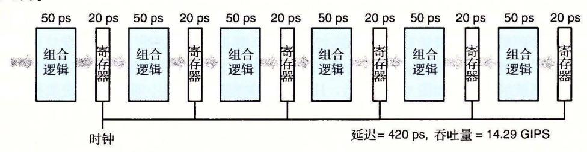

4-37 由开销造成的流水线技术的局限性。在组合逻辑被分成较小的块时, 由寄存器更新引起的延迟就成为了一个限制因素

为了提高时钟频率,现代处理器采用了很深的 (15 或更多的阶段)流水线。处理器架构师 将指令的执行划分成很多非常简单的步骤,这样 来每个阶段的延迟就很小。电路设计者小 心地设计流水线寄存器,使其延迟尽可能得小。芯片设计者也必须小心地设计时钟传播网 络,以保证时钟在整个芯片上同时改变。所有这些都是设计高速微处理器面临的挑战。

练习题 <sup>29</sup> 让我们来看看图 4-32 中的系统,假设将它划分成任意数量的流水线阶 k, 每个阶段有相同的延迟 300/k, 每个流水线寄存器的延迟为 20ps

- A. 系统的延迟和吞吐量写成 的函数是什么?
- B. 吞吐量的上限等于多少?

### 4. 4. 4 带反馈的流水线系统

到目前为止,我们只考虑一种系统,其中传过流水线的对象,无论是汽车、人或者指 令,相互都是完全独立的。但是,对千像 x86-64 Y86-64 这样执行机器程序的系统来 说,相邻指令之间很可能是相关的。例如,考虑下面这个 Y86-64 指令序列:

2 3 addq

在这个包含三条指令的序列中,每对相邻的指令之间都有数据相关 (data dependency) ,用带圈的寄存器名字和它们之间的箭头来表示。 irmovq 指令(第 行)将它的结果存 放在%rax 中,然后 addq 指令(第 行)要读这个值;而 addq 指令将它的结果存放在%rbx 中, mrmovq 指令(第 行)要读这个值。

另一种相关是由于指令控制流造成的顺序相关。来看看下面这个 Y86-64 指令序列:

```
1234567 loop: 
        subq %rdx,%rbx 
        jne targ 
        irmovq $10,%rdx 
        jmp loop 
    targ: 
        halt
```

Jne 指令(第 行)产生了一个控制相关 (control dependency) ,因为条件测试的结果会 决定要执行的新指令是 irmovq 指令(第 行)还是 halt 指令(第 行)。在我们的 SEQ 计中,这些相关都是由反馈路径来解决的,如图 4-22 的右边所示。这些反馈将更新了的 寄存器值向下传送到寄存器文件,将新的 PC 值向下传送到 PC 寄存器。

<sup>38</sup> 举例说明了将流水线引入含有反馈路径的系统中的危险。在原来的系统(图 4-38a) 中,每条指令的结果都反馈给下一条指令。流水线图(图 38b) 就说明了这个情况, Il 的结果成 I2 的输入,依此类推。如果试图以最直接的方式将它转换成一个三阶段流水线(图 4-38c), 我们将改变系统的行为。如图 -3 8c 所示, Il 的结果成为 I4 的输入。为了通过流水线技术加速 系统,我们改变了系统的行为。

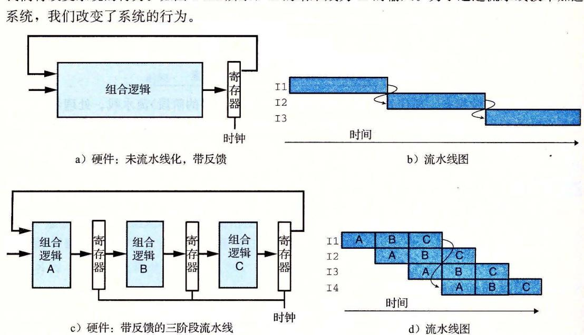

<sup>38</sup> 由逻辑相关造成的流水线技术的局限性。在从未流水线化的带反馈的系统 转化到流水线化 的系统 的过程中,我们改变了它的计算行为,可以从两个流水线图 (b d) 中看出来

当我们将流水线技术引入 Y86-64 处理器时,必须正确处理反馈的影响。很明显,像 4-38 中的例子那样改变系统的行为是不可接收的。我们必须以某种方式来处理指令间 的数据和控制相关,以使得到的行为与 ISA 定义的模型相符。

## 4. 5 Y86-64 的流水线实现

我们终于准备好要开始本章的主要任务 设计一个流水线化的 Y86-64 处理器。首 先,对顺序的 SEQ 处理器做一点小的改动,将 PC 的计算挪到取指阶段。然后,在各个阶 段之间加上流水线寄存器。到这个时候,我们的尝试还不能正确处理各种数据和控制相 关。不过,做一些修改,就能实现我们的目标 一个高效的、流水线化的实现 Y86-64 ISA 的处理器。

### 4. 5. 1 SEQ+ :重新安排计算阶段

作为实现流水线化设计的一个过渡步骤,我们必须稍微调整一下 SEQ 中五个阶段的 顺序,使得更新 PC 阶段在一个时钟周期开始时执行,而不是结束时才执行。只需要对整 体硬件结构做最小的改动,对于流水线阶段中的活动的时序,它能工作得更好。我们称这 种修改过的设计为 "SEQ+"

我们移动 PC 阶段,使得它的逻辑在时钟周期开始时活动,使它计算当前指令的 PC 值。图 4-39 给出了 SEQ SEQ +在 PC 计算上的不同之处 SEQ 中(图 39a), PC 算发生在时钟周期结束的时候,根据当前时钟周期内计算出的信号值来计算 PC 寄存器的 新值。在 SEQ +中(图 39b) ,我们创建状态寄存器来保存在一条指令执行过程中计算出 来的信号。然后,当一个新的时钟周期开始时,这些信号值通过同样的逻辑来计算当前指 令的 PC 。我们将这些寄存器标号为 "plcode" "pCnd" 等等,来指明在任 给定的周期, 它们保存的是前一个周期中产生的控制信号。

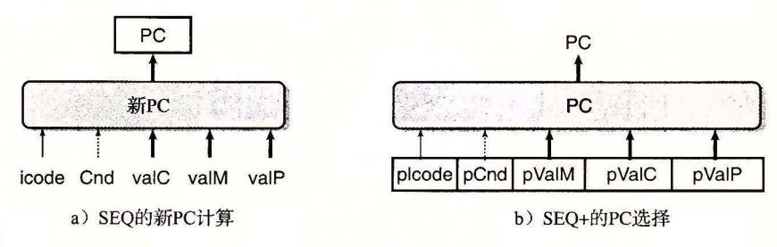

4-39 移动计算 PC 的时间 SEQ +中,我们将计算 前状态的 程序计数器的值作为指令执行的第一步

4-40 给出了 SEQ +硬件的一个更为详细的说明 可以看到,其中的硬件单元和控 制块与我们在 SEQ 中用到的(图 4-23) 样,只不过 PC 逻辑从上面(在时钟周期结束时活 动)移到了下面(在时钟周期开始时活动)。

# ID SEQ +中的 PC 在哪里

SEQ 个很奇怪的特色,那就是没有硬件寄存器来存放程序计数器 而是根 据从前 条指令保存下未的 些状态信息动态地计算 PC 这就是 个小小的证 明一 我们可以以 种与 ISA 隐含着的概念模型不同的方式未实现处理器,只要处理 器能正确执行任意的机器语言程序 我们不需要将状态编码成程序员可见的状态指定 . 的形式,只要处理器能够为任意的程序员可见状态(例如程序计数器)产生正确的值 在创建流水线化的设计中,我们会更多地使用到这条原则 节中描述的乱序 (out of-order) 处理技术,以一种完全不同于机器级程序中出现的顺序的次序未执行指令, 将这 思想发挥到了极致

SEQ SEQ +中对状态单元的改变是一种很通用的改进的例子,这种改进称为电路 重定时( cui t retiming) [ 6 8] 。重定时改变了 个系统的状态表示,但是并不改变它的逻 辑行为 通常用它来平衡 个流水线系统中各个阶段之间的延迟。

#### 4. 5. 2 插入流水线寄存器

在创建一个流水线化的 Y86-64 处理器的最初尝试中,我们要在 SEQ +的各个阶段之 间插入流水线寄存器,并对信号重新排列,得到 PIPE 处理器,这里的"—"代表这个 处理器和最终的处理器设计相比,性能要差一点。 PIPE —的抽象结构如图 4-41 所示。流 水线寄存器在该图中用黑色方框表 ,每个寄存器包括不同的字段,用白色方框表示。正 如多个字段表明的那样,每个流水线寄存器可以存放多个字节和字。同两个顺序处理器的 硬件结构(图 <sup>23</sup> 和图 4-40) 中的圆角方框不同,这些白色的方框 示实际的硬件组成。

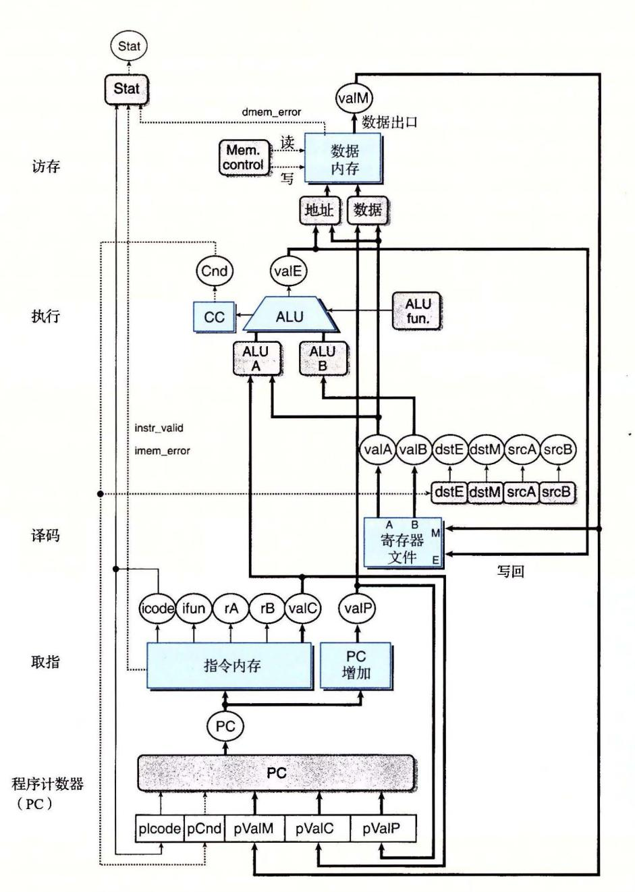

图 4-40 SEQ+的硬件结构。将 PC 计算从时钟周期结束时移到了开始时,使之更适合于流水线

可以看到,PIPE-使用了与顺序设计 SEQ(图 4-40)几乎一样的硬件单元,但是有流水线寄存器分隔开这些阶段。两个系统中信号的不同之处在 4.5.3 节中讨论。

流水线寄存器按如下方式标号:

- F 保存程序计数器的预测值,稍后讨论。
- D 位于取指和译码阶段之间。它保存关于最新取出的指令的信息,即将由译码阶段进行处理。
- E 位于译码和执行阶段之间。它保存关于最新译码的指令和从寄存器文件读出的值的信息,即将由执行阶段进行处理。

- M 执行和访存阶段之间 它保存最新执行 指令的结果,即将由访存阶段进行 处理 它还保存关 用于处理条件转移的分支条件和分支目标的信息。
- W 访存阶段和 反馈路径之间,反馈路径 计算出来的值提供给寄 器文件写, 当完成 ret 指令时 ,它还要向 择逻 辑提供返回地址

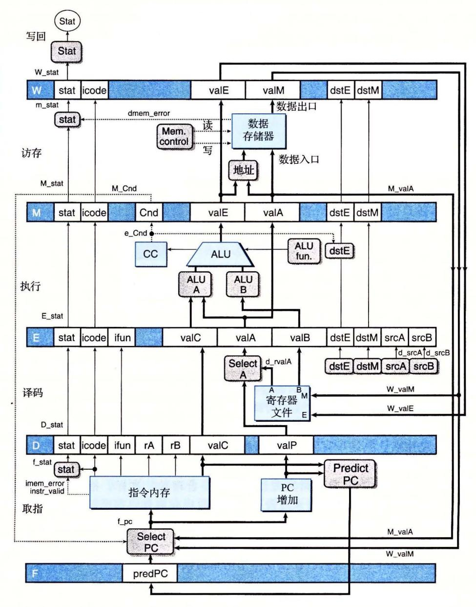

4-4 -的硬件结构 一个初始的流水线化实现。通过往 SEQ+ (图 4-40) 中插入流水线寄存 器,我 创建 一个五阶段的流水线。这个版本有 个缺陷,稍后就会解决这 些问

<sup>42</sup> 表明以下 代码 如何通过 我们的五 流水线 其中注释将各条 令标识 Il 以便引用

- 1 irmovq \$1 , %rax # I1
- <sup>2</sup>irmovq \$2 , %rbx # I2

```
3 irrnovq $3,%rcx # I3 
4 irmovq $4,%rdx # I4 
5 halt # I5
```

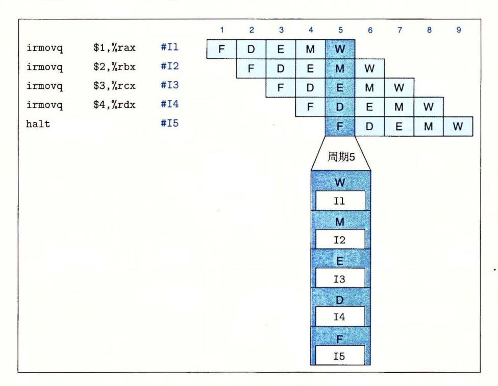

<sup>42</sup> 指令流通过流水线的示例

图中右边给出了这个指令序列的流水线图。同 4. 节中简单流水线化的计算单元的流 水线图一样,这个图描述了每条指令通过流水线各个阶段的行进过程,时间从左往右增 大。上面一条数字表明各个阶段发生的时钟周期 例如,在周期 取出指令 Il' 然后它开 始通过流水线各个阶段,到周期 结束后,其结果写入寄存骈文件。在周期 取出指令 I2 ,到周期 结束后,其结果写回,以此类推。在 下面,我们给出了当周期为 时的流 水线的扩展图。此时,每个流水线阶段中各有 条指令。

从图 <sup>42</sup> 中还可以判断我们画处理器的习惯是合理的,这样,指令是自底向上的流 动的 周期 时的扩展图 明的流水线阶段,取指阶段在底部,写回阶段在最上面,同流 水线硬件图(图 4-41) 表明的 如果看看流水线各个阶段中指令的顺序,就会发现它们 出现的顺序与在程序中列出的顺序 因为正常的程序是从上到下列出的,我们保留这 种顺序,让流水线从下到上进行。在使用本书附带的模拟器时,这个习惯会特别有用

#### 4. 5. 3 对信号进行重新排列和标号

实现 SEQ SEQ 在一个时刻只处理 条指令,因此诸如 valC srcA valE 这样的信号值有唯一的值 在流水线化的设计中,与各个指令相关联的这些值有多个版 本,会随着指令一起流过 例如,在 PIPE —的详细结构中,有 个标号为 "Stat" 白色方框,保存着 同指 的状态码(参见图 -41 我们需要很小心以确保使用的是 正确版 的信号,否则 会有很严重 的错误,例如将一条指 出的结果存放到了另一条 的目的寄存器 我们 用的命名机制,通过在信号名前面加上大写的流水线寄存

器名字作为前缀,存储在流水线寄存器中的信号可以唯 地被标识 例如, 个状态码可 以被命名为 D\_s at E\_sta 七、 M\_s at W\_stat 。我们还需要引用某些在一个阶段内刚 刚计算出来的信号。它们的命名是在信号名前面加上小写的阶段名的第一个字母作为前 缀。以状态码为例,可以看到在取指和访存阶段中标号为 "Stat" 的控制逻辑块。因而, 这些块的输出被命名为 f\_st 红和 m\_stat 。我们还可以看到整个处理器的实际状态 Sta 是根据流水线寄存器 中的状态值,由写回阶段中的块计算出来的

### 信号 \_ stat \_ stat 的差别

在命名系统中,大写的前缀 "D" "E" "M" "W" 指的是流水线寄存器,所 \_ stat 指的是流水线寄存器 的状态码宇段。 小写的 前缀 "f" "d" "e" "m "w" 的是流水线阶段,所以 \_ stat 的是在访存阶段中由控制逻辑块产生出的 状态信号

理解这个命名规则对理解我们的流水线化处理器的操作是至关重要的

SEQ十和 PIPE —的译码阶段都产生信号 dstE dstM, 它们指明值 valE valM 的目的 寄存器。在 SEQ十中,我们可以将这些信号直接连到寄存器文件写端口的地址输入。在 PIPE -中,会在流水线中一直携带这些信号穿过执行和访存阶段,直到写回阶段才送到寄存 器文件(如各个阶段的详细描述所示)。我们这样做是为了确保写端口的地址和数据输入是来 自同一条指令。否则,会将处千写回阶段的指令的值写入,而寄存器 ID 却来自于处于译码 阶段的指令 作为一条通用原则,我们要保存处于一个流水线阶段中的指令的所有信息。

PIPE —中有一个块在相同表示形式的 SEQ +中是没有的,那就是译码阶段中标号为 "Select A" 的块。我们可以看出,这个块会从来自流水线寄存器 valP 或从寄存器文件 端口中读出的值中选择一个,作为流水线寄存器 的值 valA 。包括这个块是为了减少要 携带给流水线寄存器 的状态数量。在所有的指令中,只有 call 在访存阶段需要 valP 的值。只有跳转指令在执行阶段(当不 需要进 行跳转时)需要 valP 的值 而这些指令又都不 需要从寄存器文件中读出的值 因此我们合并这两个信号,将它们作为信号 valA 携带穿过 流水线,从而可以减少流水线寄存器的状态数拢。这样做就消除了 SEQ (图 4-23) SEQ+ (图 4-40) 中标号为 "Data" 的块,这个块完成的是类似的功能。在硬件设计中,像这样仔细 确认信号是如何使用的,然后通过合并信号来减少寄存器状态和线路的数量,是很常见的

如图 <sup>41</sup> 所示,我们的流水线寄存器包括一个状态码 sta 七字段,开始时是在取指阶 段计算出来的,在访存阶段有可能会被修改。在讲完正常指令执行的实现之后,我们会在 4. 5. 节中讨论如何实现异常事件的处理。到目前为止我们可以说,最系统的方法就是让 与每条指令关联的状态码与指令一起通过流水线,就像图中表明的那样

#### 4. 5. 4 预测下一个 PC

PIPE -设计中,我们采取了一些措施来正确处理控制相关。流水线化设计的目的就 是每个时钟周期都发射一条新指令,也就是说每个时钟周期都有一条新指令进入执行阶段并 最终完成。要是达到这个目的也就意味着吞吐量是每个时钟周期一条指令。要做到这一点 我们必须在取出当前指令之后,马上确定下一条指令的位置。不幸的是,如果取出的指令是 条件分支指令,要到几个周期后,也就是指令通过执行阶段之后,我们才能知道是否要选择 分支。类似地,如果取出的指令是 ret, 要到指令通过访存阶段,才能确定返回地址。

除了条件转移指令和 ret 以外,根据取指阶段中计算出的信息,我们能够确定下

指令的地址。对于 call jmp (无条件转移)来说,下一条指令的地址是指令中的常数字 valC ,而对于其他指令来说就是 valP 。因此,通过预测 PC 的下一个值,在大多数情况 下,我们能达到每个时钟周期发射一条新指令的目的。对大多数指令类型来说,我们的预 测是完全可靠的。对条件转移来说,我们既可以预测选择了分支,那么新 PC 值应为 valC, 也可以预测没有选择分支,那么新 PC 值应为 valP 。无论哪种情况,我们都必须 以某种方式来处理预测错误的情况,因为此时已经取出并部分执行了错误的指令。我们会 4.5.8 节中再讨论这个问题。

猜测分支方向并根据猜测开始取指的技术称为分支预测。实际上所有的处理器都采用 了某种形式的此类技术。对千预测是否选择分支的有效策略已经进行了广泛的研究 [46, 2. 节]。有的系统花费了大量硬件来解决这个任务。我们的设计只使用了简单的策略, 即总是预测选择了条件分支,因而预测 PC 的新值为 vale

### 日日 其他的分支预测策略

我们的设计使用 总是选 (a lw ys ken) 分支的预 测策 研究表明这个策略的成 功率大约为 60%[44 相反 从不选择 taken, T) 策略的成功率大约为 40% 复杂一点的是反向选择、正向不选择 ck wa rd taken, forward not-taken, BTFNT 的策略,当分支地址比下一条地址低时就预 选择分支,而分支地址比 时,就预 不选择分支 这种 略的成功率大约为 65% 这种改进源自一个事 ,即 环是由后向分支结束的,而 环通常会执行多次 前向分支用于条件操作,而这种选择 的可能性较小 在家庭作业 <sup>55</sup> 4. 中,你可以修改 <sup>64</sup> 流水线处理器来实现 NT BTFNT 分支预测策略

正如我们在 6. 节中看到的 分支预测错误会极大地降低程序的性能,因此这 促使我们在可能的时 ,要使用条件数据传送而不是条件控制转移

我们还没有讨论预测 ret 指令的新 PC 值。同条件转移不同,此时可能的返回值几乎 是无限的,因为返回地址是位千栈顶的字,其内容可以是任意的 在设计中,我们不 图对返回地址做任何预测 只是简单地暂停处理新指令,直到 ret 指令通过写回阶段。在 4. 5. 节中,我们将回过来讨论这部分的实现。

### 日日 使用栈的返回地址预测

对大多数程序来说,预测返回值很容易,因为过程调用和返回是成对出现的 大多 数函数调用,会返回到调用后的那条指令 高性能处理器中运用了这个属性,在取指单 元中放入一个硬件栈,保存过程调用指令产生的返回地址 每次执行过程调用指令时, 都将其返回地址压入 当取出一个返回指令时, 从这个栈中弹出顶部的值,作为 预测的返回值 同分支预测 一样 在预测错误时必 提供一个恢复机制,因为还是有调用 和返回不匹配的时候 通常,这种预测很可靠 这个硬件栈对程序员来说是不可见的

PIPE -的取指阶段,如图 4-41 底部所示,负责预测 PC 的下一个值,以及为取指选 择实际的 PC 。我们可以看到,标号为 "Predict PC" 的块会从 PC 增加器计算出的 valP 和取出的指令中得到的 valC 中进行选择。这个值存放在流水线寄存器 中,作为程序计 数器的预测值。标号为 "S lect PC" 的块类似千 SEQ +的 PC 选择阶段中标号为 "PC" 块(图 <sup>40</sup> 它从三个值中选择一个作为指令内存的地址:预测的 PC, 对于到达流水线

寄存器 的不选择分支的指令来说是 valP 的值(存储在寄存器 M\_valA 中),或是当 ret 指令到达流水线寄存器 (存储在 W\_valM) 时的返回地址的值。

### 4. 5. 5 流水线冒险

PIPE 结构是创建一个流水线化的 Y86-64 处理器的好开端。不过,回忆 4. 4. 节中 的讨论,将流水线技术引入一个带反馈的系统,当相邻指令间存在相关时会导致出现问 题。在完成我们的设计之前,必须解决这个问题。这些相关有两种形式: 1) 数据相关,下 一条指令会用到这一条指令计算出的结果; )控制相关,一条指令要确定下一条指令的位 置,例如在执行跳转、调用或返回指令时 这些相关可能会导致流水线产生计算错误,称 为冒险 (hazard) 同相关一样,冒险也可以分为两类:数据冒险 (data hazard) 和控制冒险 (control hazard) 。我们首先关心的是数据冒险,然后再考虑控制冒险

4-4 描述的是 PIPE —处理器处理 progl 指令序列的情况。假设在这个例子以及后 面的例子中,程序寄存器初始时值都为 这段代码将值 <sup>10</sup> 放入程序寄存器% rdx %rax, 执行 nop 指令,然后将寄存器 rdx 加到% rax 。我们重点关注两条 irmovq 令和 addq 之间的数据相关造成的可能的数据冒险。图的右边是这个指令序列的流水 线图。图中突出显示了周期 的流水线阶段。流水线图的下面是周期 中写回活动和 周期 中译码活动的扩展说明。在周期 开始以后,两条 irmovq 都已经通过写回阶段, 所以寄存器文件保存着更新过的 rdx rax 的值。因此,当 addq 指令在周期 经过译 码阶段时,它可以读到源操作数的正确值。在此示例中,两条 irmovq 指令和 addq 指令 之间的数据相关没有造成数据冒险。

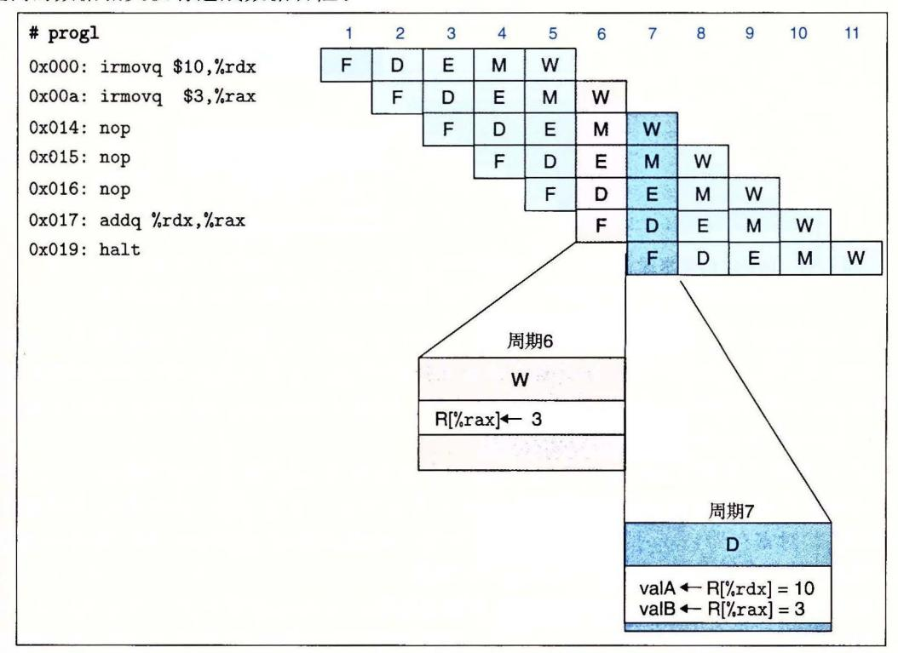

-43 pr gl 的流水线化的执行,没有特殊的流水线控制 在周期 中,第二个 irmovq 将结果 人寄存器 rax addq 指令在周期 读源操作数,因此得到的是 rdx rax 的正确值

我们看到 progl 通过 并得到正确的结果,因为 nop 指令在有数据相关的指 之间创造了一些延迟 让我们来看看如果去掉这些 nop 指令会发生些什么 <sup>44</sup> 述的 prog2 程序的流水 流程,在两条产生寄存器 rdx 和% rax 值的 irmovq 指令和以 这两个寄存器作为操作数的 addq 指令之间有两条 nop 指令。在这种情况下,关键步骤发 生在周期 6' 此时 addq 指令从寄存器文件中读取它的操作数。该图底部是这个周期内流 水线活动的扩展描述 第一个 irmovq 指令已经通过了写回阶段,因此程序寄存器 rdx 在寄存器文件中更新过了 在该周期内,第二个 irmovq 指令处于写回阶段,因此对程 序寄存器 rax 的写要到周期 开始,时钟上升时,才会发生。结果,会读出 rax 的错误 值(回想一下,我们假设所有的寄存器的初始值为 0) ,因为对该寄存器的写还未发生 明显,我们必须改进流水线让它能够正确处理这样的冒险

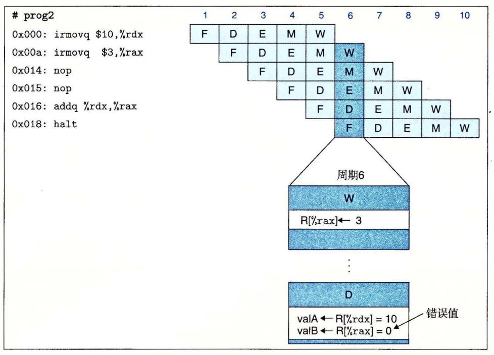

<sup>44</sup> prog2 的流水线化的执行,没有特殊的流水 线控 。直 到周期 结束时,对 寄存 器% rax 生,所以 addq 指令在译码阶段 出的是该寄存器的错误值

<sup>45</sup> 是当 irmovq 指令和 addq 指令之间只有 nop 指令,即为程序 prog3 时, 发生的情况 现在我们必须检 周期 内流水线的行为,此时 addq 指令通过译码阶段 的是,对寄存器 rdx 仍处在写回阶段,而对寄存器 rax 的写还处在访存阶段。 因此, addq 指令会得到两个错误的操作数

<sup>46</sup> 是当去掉 irmovq 指令和 addq 指令间的所有 nop 指令,即为程序 prog4 时, 发生的情况 现在我们必须检 周期 内流水线的行为,此时 addq 指令通过译码阶段。 不幸的是,对寄存器% rdx 的写仍处在访存阶段,而执行阶段正在计算寄存器 rax 的新 因此, addq 指令的两个操作数都是不正确的

这些例子说明,如果 条指令的操作数被它前面 条指令中的任意一条改 的话 出现数据冒险。之所以会出现这些冒险,是因为我们的流水线化的处理器是在译码阶段 从寄存器文件中读取指 的操作数,而要到三个周期以后,指令经过写回阶段时,才会将 的结果写到寄存器文件


4-45 prog3 的流水线化的执行,没有特殊的流水线控制。在周期 5, addq 从寄存器文件中读源 操作数。对寄存器%rdx 的写仍处在写回阶段,而对寄存 ff rax 的写还在访存阶段。两个操作 valA valB 得到的都是错误值

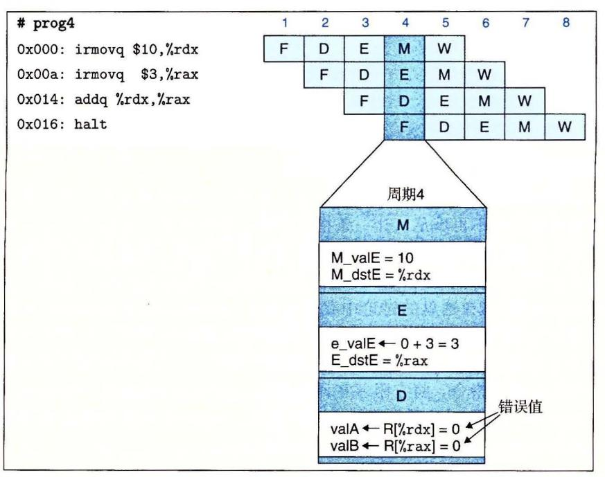

4-46 prog4 的流水线化的执行,没有特殊的流水线控制。在周期 4, addq 令从寄 存器文件中 操作数 。对寄存器%rdx 仍处在访存阶段,而执行阶段正在 计算寄存器 rax 的新值。两个 作数 valA valB 得到的都是错误

## 日日 列举数据冒险的类型

当一条指令更新后面指令会读到的那些程序状态时,就有可能出现冒险 对于 Y86 来说,程序状态包括程序寄存器、程序计数器、内存、条件码寄存器和状态寄 存器 让我们来看看在提出的设计中每类状态出现冒险的可能性

程序寄存器:我们已经认识这种冒险了 出现这种冒险是因为寄存器文件的读写是 在不同的阶段进行的,导致不同指令之间可能出现不希望的相互作用

程序计数器:更新和读取程序计数器之间的冲突导致了控制冒险 当我们的取指阶 段逻辑在取下一条指令之前 正确预测了程序计数器的新值时,就不会产生冒险 预测 错误的分支和 釭指令需要特殊的处理,会在 4. 节中讨论

内存:对数据内存的读和写都发生在访存阶段 在一条读内存的指令到达这个阶段之 前,前面所有要写内存的指令都已经完成这个阶段了 另外,在访存阶段中写数据的指令 和在取指阶段中读指令之间也有冲突,因为指令和 据内存访问的是同一个地址空间 有包含自我修改代码的程序才会发生这种情况,在这样的程序中,指令写内存的一部分 过后会从中取出指令 有些系统有复杂的机制来检测和避免这种冒 ,而有些系统只是简 单地强制要求程序不应该使用自我修改代码 为了简便,假设程序不能 改自身,因此我们 不需要采取特殊的措施,根据在程序执行过程中对数据内存的修改来修改指令内存

条件码寄存器:在执行阶段中,整数操作会写这些寄存器 条件传送指令会在执行 阶段以及条件转 会在访存阶段读这些寄存器 在条件传送或转移到达执行阶段之前, 前面所有的整数操作都已经完成这个阶段了 所以不会发生冒险

状态寄存器:指令流经流水线的时候,会影响程序状态 我们采用流水线中的每条 指令都与一个状态码相关联的机制,使得当异常发生时,处理器能够有条理地停止,就 像在 4.5. 节中会讲到的那样

这些分析表明我们只需要处理寄存器数据冒险、控制冒险,以及确保能够正确处理 异常 当设计一个复杂系统时,这样的分类分析是很重要的 这样做可以确认出系统实 现中可能的困难,还可以指导生成用于检查系统正确性的测试程序

#### 用暂停来避免数据冒险

暂停 (stalling) 是避免冒险的一种常用技术,暂停时,处理器会停止流水线中一条或多 条指令,直到冒险条件不再满足。让一条指令停顿在译码阶段,直到产生它的源操作数的 指令通过了写回阶段,这样我们的处理器就能避免数据冒险。这种机制的细节会在 4. 5.8 节中讨论。它对流水线控制逻辑做了一些简单的加强。图 4-4 7 (prog2) 和图 4-48 (prog4) 中画出了暂停的效果。(在这里的讨论中我们省略了 prog3, 因为它的运行类似于其他两 个例子。)当指令 addq 处于译码阶段时,流水线控制逻辑发现执行、访存或写回阶段中至 少有一条指令会更新寄存器%rdx 或%rax 。处理器不会让 addq 指令带着不正确的结果通过 这个阶段,而是会暂停指令,将它阻塞在译码阶段,时间为一个周期(对 prog2 来说)或者 三个周期(对 prog4 来说)。对所有这三个程序来说, addq 指令最终都会在周期 中得到 两个源操作数的正确值,然后继续沿着流水线进行下去。

addq 指令阻塞在译码阶段时,我们还必须将紧跟其后的 halt 指令阻塞在取指阶 段。通过将程序计数器保待不变就能做到这一点,这样一来,会不断地对 halt 指令进行 取指,直到暂停结束。

暂停技术就是让一组指令阻塞在它们所处的阶段,而允许其他指令继续通过流水线 那么在本该正常处理 addq 指令的阶段中,我们该做些什么呢?我们使用的处理方法是: 每次要把一条指令阻塞在译码阶段,就在执行阶段插入一个气泡。 泡就像一个自动产生 nop 指令 它不会改变寄存器、内存、条件码或程序状态。在图 <sup>47</sup> 和图 4-48 的流 水线图中,白色方框表示的就是气泡。在这些图中,我们用一个 addq 指令的标号为 "D" 的方框到标号为 "E" 的方框之间的箭头来表示一个流水线气泡,这些箭头表明,在执行 阶段中插入气泡是为了替代 addq 指令,它本来应该经过译码阶段进入执行阶段。在 4. 5. 节中,我们将看到使流水线暂停以及插入气泡的详细机制。

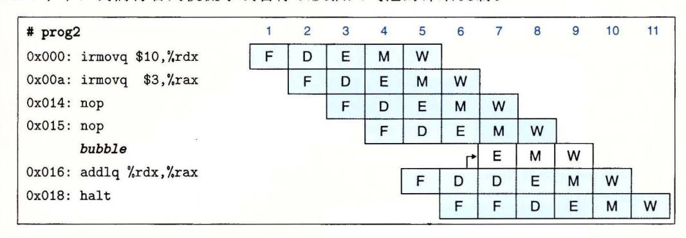

7 prog2 使用暂停的流水线化的执行 在周期 中对 addq 指令译码之后,暂停控制逻辑发现 个数据冒险,它是由写回阶段中对寄存器%rax 未进行的写造成的 它在执行阶段中插入 个气泡,并在周期 中重复对指令 addq 的译码。实际 ,机器 动态地插入一条 nop 令,得到的执行流类似于 progl 的执行流(图 4-43)

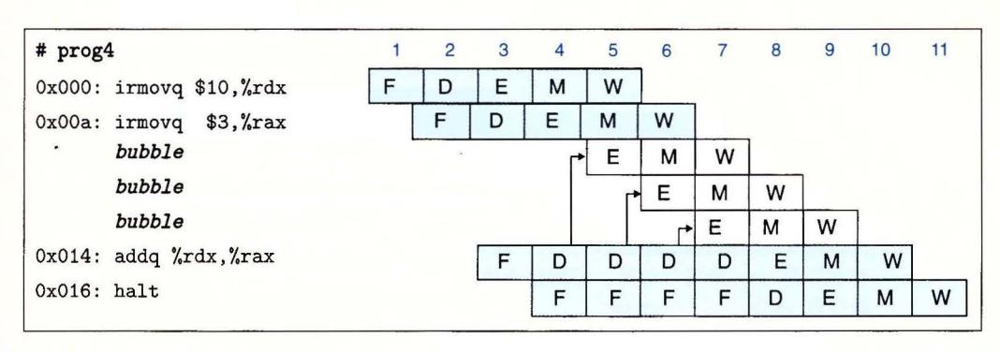

<sup>48</sup> prog4 使用暂停的流水线化的执行 在周期 中对 addq 指令译码之后,暂停控制逻辑发现 了对两个源寄存器的数据冒险。它在执行阶段中插入一个气泡,并在周期 中重复对指令 addq 的译码。它再次发现对两个源寄存器的冒险,就在执行阶段中插入一个气泡,并在周 中重复对指令 addq 的译码。它再次发现对寄存器 rax 的冒险,就在执行阶段中插入 一个气泡,并在周期 中重复对指令 addq 的译码。实际上,机器是动态地插入三条 nop 令,得到的执行流类似于 progl 的执行流(图 4-43)

在使用暂停技术来解决数据冒险的过程中,我们通过动态地产生和 progl 流(图 4-43) 一样的流水线流,有效地执行了程序 prog2 prog4 。为 prog2 插入 个气泡,为 prog4 插入 个气泡,与在第 irrnovq 指令和 addq 指令之间有 nop 指令,有相同的效 果。虽然实现这一机制相当容易(参考家庭作业 4. 53) ,但是得到的性能并不很好。一条指 令更新一个寄存器,紧跟其后的指令就使用被更新的寄存器,像这样的情况不胜枚举。这 会导致流水线暂停长达三个周期,严重降低了整体的吞吐量。

### 2. 用转发来避免数据冒险

300

PIPE-的设计是在译码阶段从寄存器文件中读入源操作数,但是对这些源寄存器的写有可能要在写回阶段才能进行。与其暂停直到写完成,不如简单地将要写的值传到流水线寄存器 E 作为源操作数。图 4-49 用 prog2 周期 6 的流水线图的扩展描述来说明了这一策略。译码阶段逻辑发现,寄存器 % rax 是操作数 valB 的源寄存器,而在写端口 E 上还有一个对 % rax 的未进行的写。它只要简单地将提供到端口 E 的数据字(信号 W\_valE)作为操作数 valB 的值,就能避免暂停。这种将结果值直接从一个流水线阶段传到较早阶段的技术称为数据转发 (data forwarding,或简称转发,有时称为旁路(bypassing))。它使得 prog2 的指令能通过流水线而不需要任何暂停。数据转发需要在基本的硬件结构中增加一些额外的数据连接和控制逻辑。

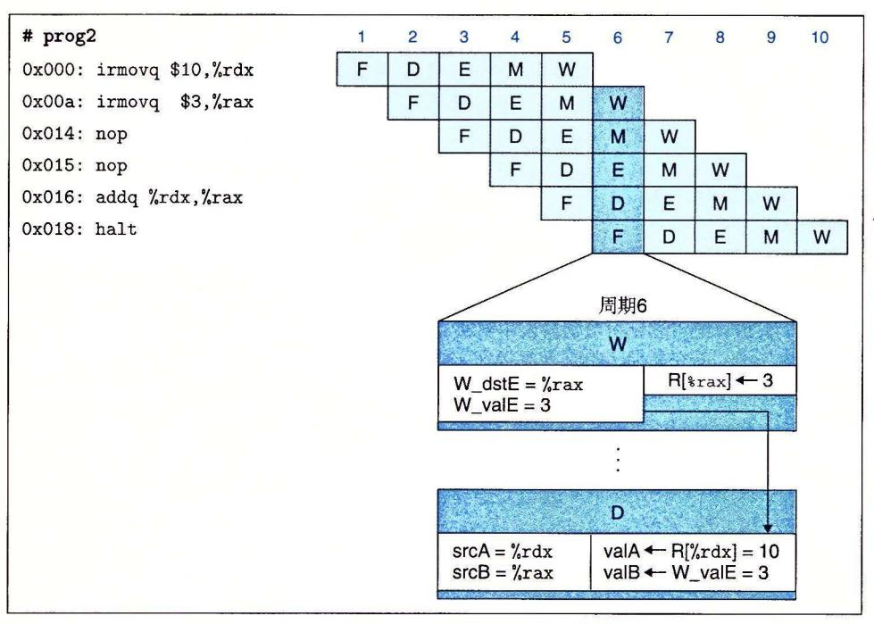

图 4-49 prog2 使用转发的流水线化的执行。在周期 6 中,译码阶段逻辑发现有在写回阶段中对寄存器%rax 未进行的写。它用这个值,而不是从寄存器文件中读出的值,作为源操作数 valB

如图 4-50 所示,当访存阶段中有对寄存器未进行的写时,也可以使用数据转发,以避免程序 prog3 中的暂停。在周期 5 中,译码阶段逻辑发现,在写回阶段中端口 E 上有对寄存器%rdx 未进行的写,以及在访存阶段中有会在端口 E 上对寄存器%rax 未进行的写。它不会暂停直到这些写真正发生,而是用写回阶段中的值(信号 W\_valE)作为操作数 vala,用访存阶段中的值(信号 M valE)作为操作数 valb。

为了充分利用数据转发技术,我们还可以将新计算出来的值从执行阶段传到译码阶段,以避免程序 prog4 所需要的暂停,如图 4-51 所示。在周期 4 中,译码阶段逻辑发现在访存阶段中有对寄存器%rdx 未进行的写,而且执行阶段中 ALU 正在计算的值稍后也会写入寄存器%rax。它可以将访存阶段中的值(信号 M\_valE)作为操作数 valA,也可以将 ALU 的输出(信号 e\_valE)作为操作数 valB。注意,使用 ALU 的输出不会造成任何时序问题。译码阶段只要在时钟周期结束之前产生信号 valA 和 valB,这样在时钟上升开始下一个周期时,流水线寄存器 E 就能装载来自译码阶段的值了。而在此之前 ALU 的输出已经是合法的了。

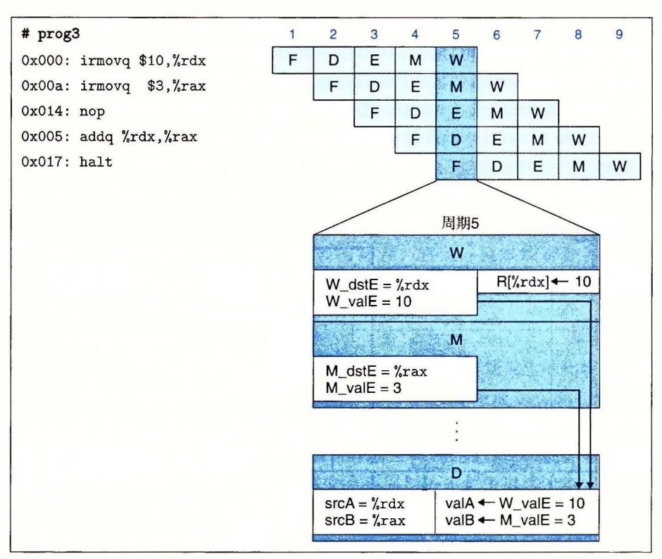

-50 ro 使用 转发的流水线化的执 在周期 中,译码阶段逻辑 存器 rdx未进行的写 ,以及 在访存阶段中对 存器% ax 未进 行的 写。 ,而不 存器 中读出的值 ,作 valA valB 的值

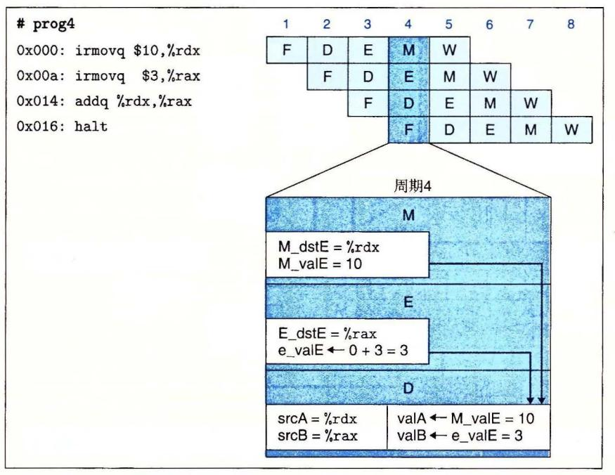

4-5 g4 使用转发的流水线 的执行 。在 周期 ,译码阶段 逻辑发现有 在访存阶段 寄存 rdx 未进行的写 还发现在执行阶段中正在计算寄存器 它用这些 寄存器文件 ,作为 alB

程序 prog2~prog4 中描述的转发技术的使用都是将 ALU 产生的以及其目标为写端口 E 的值进行转发,其实也可以转发从内存中读出的以及其目标为写端口 M 的值。从访存阶段,我们可以转发刚刚从数据内存中读出的值(信号 m\_valM)。从写回阶段,我们可以转发对端口 M 未进行的写(信号 w\_valM)。这样一共就有五个不同的转发源(e\_valE、m\_valM、M valE、W valM 和 W valE),以及两个不同的转发目的(valA 和 valB)。

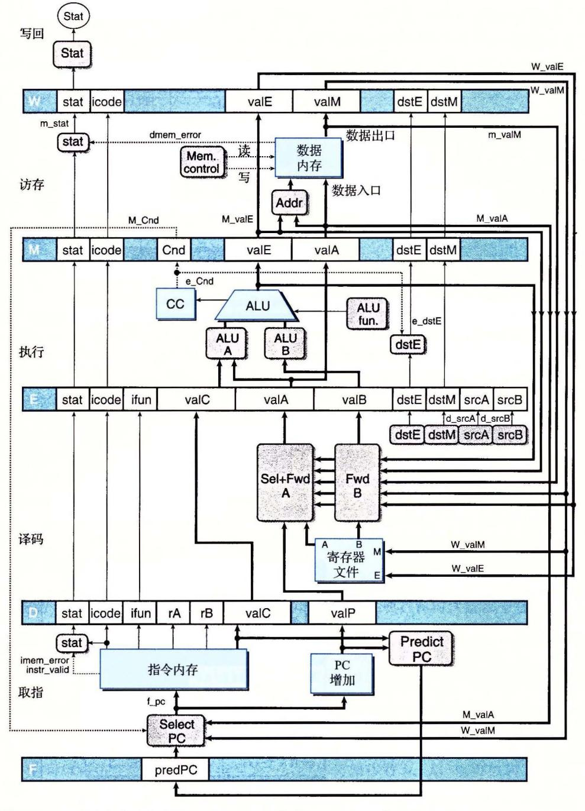

图 4-52 流水线化的最终实现——PIPE 的硬件结构。添加的旁路路径能够转发前面三条指令的结果。这使得我们能够不暂停流水线就处理大多数形式的数据冒险

<sup>49</sup> 4- 的扩展图还表明译码阶段逻辑能够确定是使用来自寄存器文件的值, 还是要用转发过来的值。与每个要写回寄存器文件的值相关的是目的寄存器 ID 。逻辑会 将这些 ID 与源寄存器 ID srcA srcB 相比较,以此来检测是否 要转发。可能有多个目 的寄存器 ID 与一个源 ID 相等。要解决这样的情况,我们必须在各个转发源中建立起优先 级关系。在学习转发逻辑的详细设计时,我们会讨论这个内容

4-52 给出的是 PIPE 的结构,它是 PIPE —的扩展,能通过转发处理数据冒险。将 这幅图与 PIPE 的结构(图 4-41) 相比,我们可以看到来自五个转发源的值反馈到译码阶段 中两个标号为 "Sel+Fwd A" "Fwd B" 的块 标号为 "Sel+Fwd A" 的块是 PIPE 中标号为 "Select A" 的块的功能与转发逻辑的结合。它允许流水线寄存器 alA 巳增加的程序计数器值 valP, 从寄存器文件 端口读出的值,或者某个转发过来的值。 标号为 "Fwd B" 的块实现的是源操作数 valB 的转发逻辑

#### 3. 加载/使用数据冒险

有一类数据冒险不能单纯用转发来解决,因为内存读在流水 发生的比较晚。图 4-53 例说明了加载 使用冒险 (load use hazard) 中一条指令(位于地址 Ox0 mrmovq) 从内存 中读出寄存器 rax 的值,而下 条指令(位于地址 Ox032 ddq) 需要 该值作为源操作数 图的下部是周期 的扩展说明,在此假设所有的程序寄存器都初始化为 addq 指令在 周期 中需要该寄存器的值,但是 mrmovq 指令直到周期 才产生出这个值 为了从 mrmo "转发到 "addq ,转发逻辑不得不将值送回到过去的时间!这显然是不可能的,我们必须找 到其他机制来解决这种形式的数据冒险。(位于地址 OxOle irmovq 指令产生的寄存器 rbx 的值,会被位于地址 Ox032 addq 指令使用,转发能够处理这种数据冒险。)

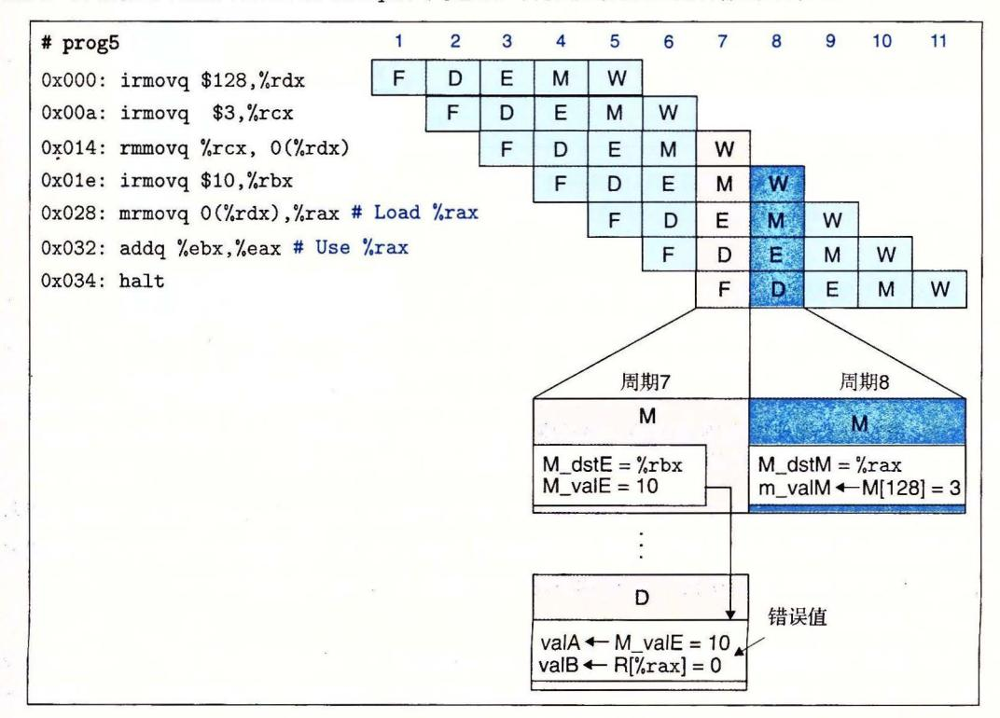

4-53 加载 使用数据冒险的示例 addq 在周期 译码阶段中 需要 寄存器 ra 的值 前面的 mrmov 指令在周期 访存阶段中读出这个寄存器的新值,这对千 addq 来说太迟了

如图 4-54 所示,我们可以将暂停和转发结合起来,避免加载 使用数据冒险 这个需 要修改控制逻辑,但是可以使用现有的旁路路径 。当 mrmovq 指令通过执行阶段时,流水 线控制逻辑发现译码阶段中的指令 (addq) 需要从内存中读出的结果。它会将译码阶段中的 指令暂停一个周期,导致执行阶段中插入一个气泡。如周期 的扩展说明所示,从内存中 读出的值可以从访存阶段转发到译码阶段中的 addq 指令 。寄存器%rbx 的值也可以从访存 阶段转发到译码阶段。就像流水线图,从周期 中标 "D" 的方框到周期 中标号为 "E" 的方框的箭头表明的那样,插入的气泡代替了正 常情 况下本来应该继续通过流水线的 addq 指令

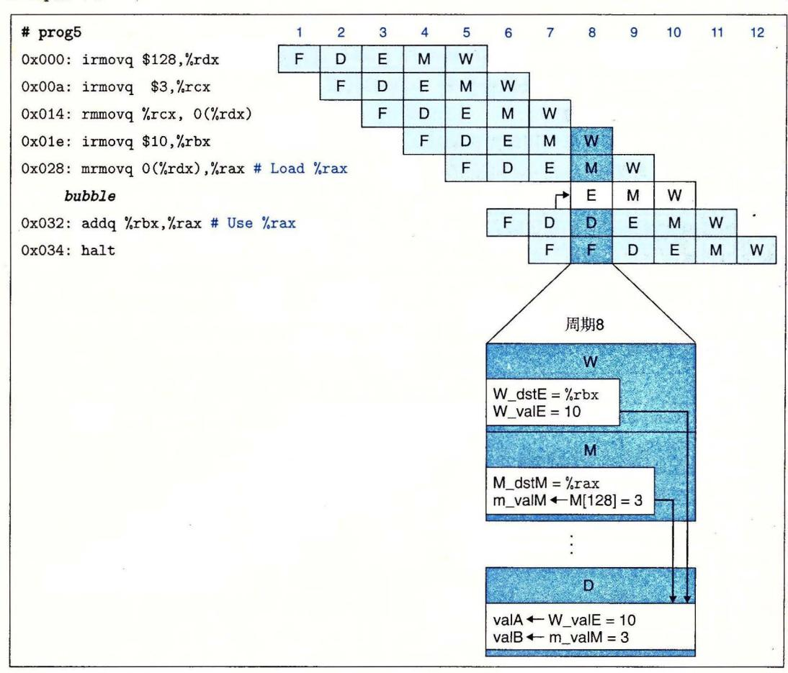

<sup>54</sup> 用暂停来处理加载 使用冒险 通过将 addq 令在译码阶段暂停一个周期,就可以将 valB 的值从访存阶段中的 mrmovq 转发到译码阶段中的 addq 指令

这种用暂停来处理加载 使用冒险的方法称为加载互锁 Cload interlock) 加载互锁和 转发技术结合起来足以处理所有可能类型的数据 冒险。因 为只有加载互锁会降低流水线的 吞吐量,我们几乎可以实现每个时钟周期发射一条新指令的吞吐量目标。

#### 避免控制冒险

当处理器无法根据处千取指阶段的当 前指令来确定下一条指令 的地址时,就会出现控 冒险。 如同在 4. 5. 节讨论过的,在我 们的流水 化处理器中,控制冒险只会发生在 ret 指令和跳转指令 而且,后一种情况只有在条件跳转方向预测错误时才会造成麻烦. 在本小节中,我们概括介绍如何来处理这些冒险。作为对流水线控制更一般性讨论的 一部

#### 分, 其详细实现将在 4.5.8 节给出。

对于 ret 指令,考虑下面的示例程序。这个程序是用汇编代码表示的,左边是各个指令的地址,以供参考:

0x000: irmovq stack, %rsp # Initialize stack pointer

0x00a: call proc # Procedure call
0x013: irmovq \$10,%rdx # Return point

0x01d: halt 0x020: .pos 0x20

0x020: proc: # proc:

0x020: ret # Return immediately

0x021: rrmovq %rdx, %rbx # Not executed

0x030: .pos 0x30

0x030: stack: # stack: Stack pointer

图 4-55 给出了我们希望流水线如何来处理 ret 指令。同前面的流水线图一样,这幅图展示了流水线的活动,时间从左向右增加。与前面不同的是,指令列出的顺序与它们在程序中出现的顺序并不相同,这是因为这个程序的控制流中指令并不是按线性顺序执行的。看看指令的地址就能看出它们在程序中的位置。

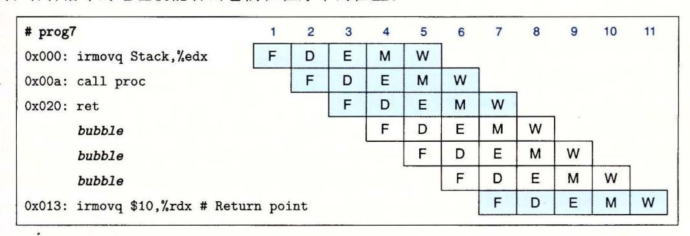

图 4-55 ret 指令处理的简化视图。当 ret 经过译码、执行和访存阶段时,流水线应该暂停,在处理过程中插入三个气泡。一旦 ret 指令到达写回阶段(周期 7), PC 选择逻辑就会选择返回地址作为指令的取指地址

如这张图所示,在周期 3 中取出 ret 指令,并沿着流水线前进,在周期 7 进入写回阶段。在它经过译码、执行和访存阶段时,流水线不能做任何有用的活动。我们只能在流水线中插入三个气泡。一旦 ret 指令到达写回阶段,PC 选择逻辑就会将程序计数器设为返回地址,然后取指阶段就会取出位于返回点(地址 0x013)处的 irmovg 指令。

要处理预测错误的分支,考虑下面这个用汇编代码表示的程序,左边是各个指令的地址,以供参考:

0x000: xorq %rax, %rax

0x002: jne target # Not taken 0x00b: irmovq \$1, %rax # Fall through

0x015: halt
0x016: target:

0x016: irmovq \$2, %rdx # Target 0x020: irmovq \$3, %rbx # Target+1

0x02a: halt

图 4-56 表明是如何处理这些指令的。同前面一样,指令是按照它们进入流水线的顺

序列出的,而不是按照它们出现在程序中的顺序。因为预测跳转指令会选择分支,所以周期3中会取出位于跳转目标处的指令,而周期4中会取出该指令后的那条指令。在周期4,分支逻辑发现不应该选择分支之前,已经取出了两条指令,它们不应该继续执行下去了。幸运的是,这两条指令都没有导致程序员可见的状态发生改变。只有到指令到达执行阶段时才会发生那种情况,在执行阶段中,指令会改变条件码。我们只要在下一个周期往译码和执行阶段中插入气泡,并同时取出跳转指令后面的指令,这样就能取消(有时也称为指令排除(instruction squashing))那两条预测错误的指令。这样一来,两条预测错误的指令就会简单地从流水线中消失,因此不会对程序员可见的状态产生影响。唯一的缺点是两个时钟周期的指令处理能力被浪费了。

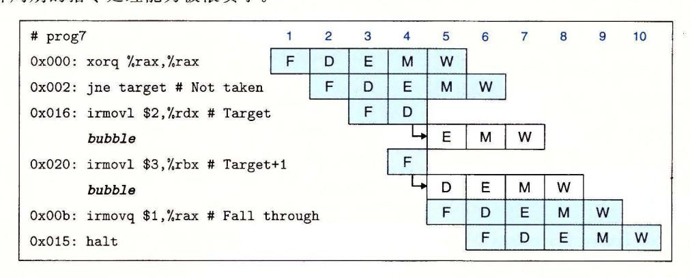

图 4-56 处理预测错误的分支指令。流水线预测会选择分支,所以开始取跳转目标处的指令。 在周期 4 发现预测错误之前,已经取出了两条指令,此时,跳转指令正在通过执行 阶段。在周期 5 中,流水线往译码和执行阶段中插入气泡,取消了两条目标指令, 同时还取出跳转后面的那条指令

对控制冒险的讨论表明,通过慎重考虑流水线的控制逻辑,控制冒险是可以被处理的。在出现特殊情况时,暂停和往流水线中插入气泡的技术可以动态调整流水线的流程。如同我们将在 4.5.8 节中讨论的一样,对基本时钟寄存器设计的简单扩展就可以让我们暂停流水段,并向作为流水线控制逻辑一部分的流水线寄存器中插入气泡。

#### 4.5.6 异常处理

正如第8章中将讨论的,处理器中很多事情都会导致异常控制流,此时,程序执行的正常流程被破坏掉。异常可以由程序执行从内部产生,也可以由某个外部信号从外部产生。我们的指令集体系结构包括三种不同的内部产生的异常:1)halt指令,2)有非法指令和功能码组合的指令,3)取指或数据读写试图访问一个非法地址。一个更完整的处理器设计应该也能处理外部异常,例如当处理器收到一个网络接口收到新包的信号,或是一个用户点击鼠标按钮的信号。正确处理异常是任何微处理器设计中很有挑战性的一方面。异常可能出现在不可预测的时间,需要明确地中断通过处理器流水线的指令流。我们对这三种内部异常的处理只是让你对正确发现和处理异常的真实复杂性略有了解。

我们把导致异常的指令称为异常指令(excepting instruction)。在使用非法指令地址的情况中,没有实际的异常指令,但是想象在非法地址处有一种"虚拟指令"会有所帮助。在简化的 ISA 模型中,我们希望当处理器遇到异常时,会停止,设置适当的状态码,如图 4-5 所示。看上去应该是到异常指令之前的所有指令都已经完成,而其后的指令都不应该对程序员可见的状态产生任何影响。在一个更完整的设计中,处理器会继续调用异常处理

程序(exception handler),这是操作系统的一部分,但是实现异常处理的这部分超出了本书讲述的范围。

在一个流水线化的系统中,异常处理包括一些细节问题。首先,可能同时有多条指令会引起异常。例如,在一个流水线操作的周期内,取指阶段中有 halt 指令,而数据内存会报告访存阶段中的指令数据地址越界。我们必须确定处理器应该向操作系统报告哪个异常。基本原则是:由流水线中最深的指令引起的异常,优先级最高。在上面那个例子中,应该报告访存阶段中指令的地址越界。就机器语言程序来说,访存阶段中的指令本来应该在取指阶段中的指令开始之前就结束的,所以,只应该向操作系统报告这个异常。

第二个细节问题是,当首先取出一条指令,开始执行时,导致了一个异常,而后来由于分支预测错误,取消了该指令。下面就是一个程序示例的目标代码:

0x000: 6300

在这个程序中,流水线会预测选择分支,因此它会取出并以一个值为 0xFF 的字节作为指令(由汇编代码中.byte 伪指令产生的)。译码阶段会因此发现一个非法指令异常。稍后,流水线会发现不应该选择分支,因此根本就不应该取出位于地址 0x016 的指令。流水线控制逻辑会取消该指令,但是我们想要避免出现异常。

第三个细节问题的产生是因为流水线化的处理器会在不同的阶段更新系统状态的不同部分。有可能会出现这样的情况,一条指令导致了一个异常,它后面的指令在异常指令完成之前改变了部分状态。比如说,考虑下面的代码序列,其中假设不允许用户程序访问 64 位范围的高端地址:

- irmovq \$1,%rax
- 2 xorq %rsp,%rsp # Set stack pointer to 0 and CC to 100
- pushq %rax # Attempt to write to Oxffffffffffffffffffffffffffffffffffff
- 4 addq %rax, %rax # (Should not be executed) Would set CC to 000

pushq指令导致一个地址异常,因为减小栈指针会导致它绕回到 0xffffffffffffffffffffffffffffffffffff

一般地,通过在流水线结构中加入异常处理逻辑,我们既能够从各个异常中做出正确的选择,也能够避免出现由于分支预测错误取出的指令造成的异常。这就是为什么我们会在每个流水线寄存器中包括一个状态码 stat(图 4-41 和图 4-52)。如果一条指令在其处理中于某个阶段产生了一个异常,这个状态字段就被设置成指示异常的种类。异常状态和该指令的其他信息一起沿着流水线传播,直到它到达写回阶段。在此,流水线控制逻辑发现出现了异常,并停止执行。

为了避免异常指令之后的指令更新任何程序员可见的状态,当处于访存或写回阶段中的指令导致异常时,流水线控制逻辑必须禁止更新条件码寄存器或是数据内存。在上面的示例程序中,控制逻辑会发现访存阶段中的 pushq 导致了异常,因此应该禁止 addq 指令更新条件码寄存器。

让我们来看看这种处理异常的方法是怎样解决刚才提到的那些细节问题的。当流水线 中有 个或多个阶段出现异常时,信息只是简单地存放在流水线寄存器的状态字段中。异 常事件不会对流水线中的指令流有任何影响,除了会禁止流水线中后面的指令更新程序员 可见的状态(条件码寄存器和内存),直到异常指令到达最后的流水线阶段。因为指令到达 写回阶段的顺序 它们在非流水线化的处理器中执行的顺序相同,所以我们可以保证第一 条遇到异常的指令会第一个到达写回阶段,此时程序执行会停止,流水线寄存器 中的 状态码会被记录为程序状态。如果取出了某条指令,过后又取消了,那么所有关于这条指 令的异常状态信息也都会被取消。所有导致异常的指令后面的指令都不能改变程序员可见 的状态。携带指令的异常状态以及所有其他信息通过流水线的简单原则是处理异常的简单 而可靠的机制。

### 4. 5. 7 PIPE 各阶段的实现

现在我们已经创建了 PIPE 的整体结构, PIPE 是我们使用了转发技术的流水线化的 Y86-64 处理器。它使用了 前面顺序设计相同的硬件单元,另外增加了一些流水线 寄存器、 些重新配置了的逻辑块,以及增加的流水线控制逻辑。在本节中,我们将浏览 各个逻辑块的设计,而将流水线控制逻辑的设计放到下一节中介绍。许多逻辑块与.SEQ SEQ 中相应部件完全相同,除了我们必须从来自不同流水线寄存器(用大写的流水线 寄存器的名字作为前缀)或来自各个阶段计算(用小写的阶段名字的第一个字母作为前缀) 的信号中选择适当的值。

作为一个示例,比较一下 SEQ 中产生 srcA 信号的逻辑的 HCL 代码与 PIPE 中相应 的代码:

```
# Code from SEQ
```

```
word srcA = [ 
] ; 
        icode in { IRRMOVQ, IRMMOVQ, IOPQ, IPUSHQ } : rA; 
        icode in { IPOPQ, IRET} : RRSP; 
        1 : RNONE; # Don't need register 
   # Code from PIPE 
word d_srcA = [ 
] ; 
        D_icode in { IRRMOVQ, IRMMOVQ, IDPQ, IPUSHQ } : D_rA; 
        D_icode in { IPOPQ, IRET} : RRSP; 
        1 : RNONE; # Don't need register
```

它们的不同之处只在千 PIPE 信号都加上了前缀: "D\_" 表示源值,以表明信号是来 自流水线寄存器 D, "d\_" 表示结果值,以表明它是在译码阶段中产生的。为了避免重 复,我们在此就不列出那些与 SEQ 中代码只有名字前缀不同的块的 HCL 代码。网络旁注 ARCH:HCL 中列出了完整的 PIPE HCL 代码。

#### 1. PC 选择和取指阶段

<sup>57</sup> 提供了 PIPE 取指阶段逻辑的 个详细描述。像前面讨论过的那样,这个阶段 必须选择程序计数器的当前值,并且预测下一个 PC 值。用千从内存中读取指令和抽取不 同指令字段的硬件单元与 SEQ 中考虑的那些一样(参见 4. 3.4 节中的取指阶段)。

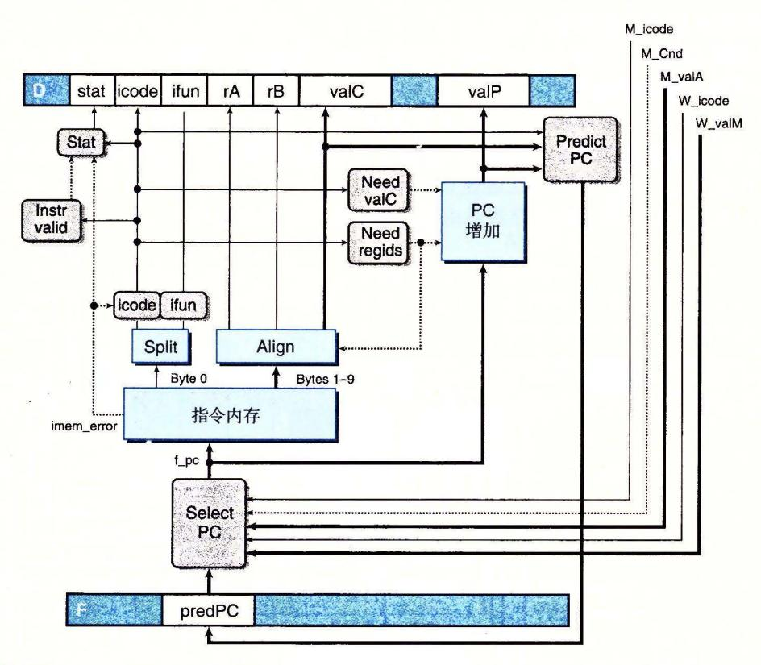

图 4-57 PIPE 的 PC 选择和取指逻辑。在一个周期的时间限制内, 处理器只能预测下一条指令的地址

PC 选择逻辑从三个程序计数器源中进行选择。当一条预测错误的分支进入访存阶段时,会从流水线寄存器  $M(信号\ M\_valA)$ 中读出该指令 valP 的值(指明下一条指令的地址)。当 ret 指令进入写回阶段时,会从流水线寄存器  $W(信号\ W\_valM)$ 中读出返回地址。其他情况会使用存放在流水线寄存器  $F(信号\ F\ predPC)$ 中的 PC 的预测值:

```
word f_pc = [
    # Mispredicted branch. Fetch at incremented PC
    M_icode == IJXX && !M_Cnd : M_valA;
    # Completion of RET instruction
    W_icode == IRET : W_valM;
    # Default: Use predicted value of PC
    1 : F_predPC;
];
```

当取出的指令为函数调用或跳转时, PC 预测逻辑会选择 valC, 否则就会选择 valP: word f\_predPC = [

f\_icode in { IJXX, ICALL } : f\_valC;
1 : f\_valP;

];

标号为"Instr valid"、"Need regids"和"Need valC"的逻辑块和SEQ中的一样,使用了适当命名的源信号。

同 SEQ 中不一样,我们必须将指令状态的计算分成两个部分。在取指阶段,可以测试由于指令地址越界引起的内存错误,还可以发现非法指令或 halt 指令。必须推迟到访

存阶段才能发现 法数据地

练习题 30 写出信号 stat HC 代码 提供取出的指令的临时状态。

#### 译码和写回阶段

4-58 PIPE 的译码和写回逻辑 细说 明。标号为 "ds tE" "d stM" "srcA" "srcB" 非常类似于它 SE 中的相应部件。 我们观察到 ,提供给 口的寄存器 ID 自于写回阶段(信号 ds tE dstM) ,而不是来 自千 译码阶段 这是 因为我们希望进行写的目的寄存器是由写 阶段中的指令指定的


-5 PIPE 的译码和写回阶段逻辑。没有指令既需要 valP 又需要来自寄存器端 中读出的值,因 对后面 的阶段来说, 这两者可以合并为 信号 valA。标号为 "Sel+ Fwd 的块执行该任务,并实 现源操作数 valA 的转发逻辑。标号为 wd B" 的块 实现源操 val 的转发逻辑 寄存器写的 位置是由来自写回阶段的 dstE dstM 信号指定的,而不是来自千译码阶段,因为它要写的是 当前正在写 阶段中的指令的结果

练习题 31 译码阶段中标号为 "dstE" 的块根据来自流水线寄存器 中取出的指 令的各个字段 产生 寄存器文件 端口的寄存器 ID PIPE 描述中,得到 信号 命名为 ds 根据 SE 信号 ds 描述 ,写出 这个 信号的 HCL 码。(参考 3. 节中的译码阶 段。 )目前还不用关心实现 件传送的逻辑

这个阶段 复杂性主要是 跟转发逻辑相关 就像 面提到的那样 标号为 "Se Fwd A" 块扮演两个角色。它为后面的阶段将 valP 信号合并到 valA 信号,这样可以减少流 水线寄存器中状态的数量。它 还实现了源操作数 valA 的转发逻辑。

合并信号 valA valP 的依据是,只有 call 和跳转指令在后面的阶段中需要 valP 的值,而这些指令并不需要从寄存器文件 端口中读出的值。这个选择是由该阶段的 ic ode 信号来控制 的。当信号 icode call jXX 的指 令代码相匹配 时,这个块就 选择 D\_valP 作为它的输出。

4. 5. 节中提到有 个不同的转发源,每个都有一个数据字和一个目的寄存器 ID:

| 数据字    | 寄存器 ID | 源描述               |
|--------|--------|-------------------|
| e valE | e dstE | ALU 输出            |
| m valM | M dstM | 内存输出              |
| M valE | M dstE | 访存阶段中对端口<br>未进行的写 |
| W valM | W dstM | 写回阶段中对端口<br>未进行的写 |
| W valE | W dstE | 写回阶段中对端口<br>未进行   |

如果不满足任何转发条件,这个块就应该选择 rvalA 作为它的输出,也就是从寄 存器端口 中读出的值。

上所述,我们得到以下流水线寄存器 valA 新值的 HCL 描述

```
word d_ val A = [
```

```
D_icode in { !CALL, IJXX} : D_valP; # Use incremented PC 
d_srcA == e_dstE: e_valE; # Forwa valE from execute 
d_srcA == M_dstM : m_valM; # Forward valM from memory 
d_srcA == M_dstE: M_valE; · # Forward valE from memory 
d_srcA == W_dstM: W_valM; # Forward valM from write back 
d_srcA == W_dstE: W_valE; # Forward valE from write back 
1 : d_rvalA; # Use value read from register file
```

] ;

上述 HCL 代码中赋予这 个转发源的优先级是非常重要的。这种优先级是由 HCL 代码 中检测 个目的寄 存器 ID 的顺 序来确定的。如果选择 了其他任何顺序,对某些程序来说, 流水线就会出错。图 4-59 给出了一个程序示例,要求对执行和访存阶段中的转发源设置正确 的优先级。在这个程序中,前两条指令写寄存器%rdx, 而第三条指令用这个寄存器作为它的 源操作数。当指令 rrmovq 在周期 到达译码阶段时,转发逻辑必须在两个都以该源寄存器 为目的的值中选择一个。它应该选择哪一个呢?为了设定优先级 ,我们必须考虑当一次执行 一条指令时,机器语言程序的行为。第 irmovq 指令会将寄存器%rdx 设为 10, 第二条 irmovq 指令会将之设为 3, 然后 rrmovq 指令会从%rdx 中读出 。为了模拟这种行为,流水 化的 实现应该总是给处 于最早流水线阶段中的转发源以较高的 优先级, 因为它保持着程序 序列中设置该寄存器的最近的指令。因此,上述 HCL 代码中的逻辑首先会检测执行阶段中 的转发源,然后是访存阶段,最后才是写回阶段。只有指令 popq rsp 会关心在访存或写回 阶段中的两个源之间的转发优先级,因为只有这条指令能同时写两个寄存摇。

练习题 32 假设 d\_valA HCL 代码中第三和第四种情况(来自访存阶段的两个转 发源)的顺序是反过来的。请描述下列程序中 rrmovq 指令(第 行)造成的行为:

- 12345 irmovq \$5, %rdx
- irmovq \$0x100,%rsp
- rmmovq i/,rdx,0(%rsp)
- popq %rsp
- rrmovq %rsp,%rax

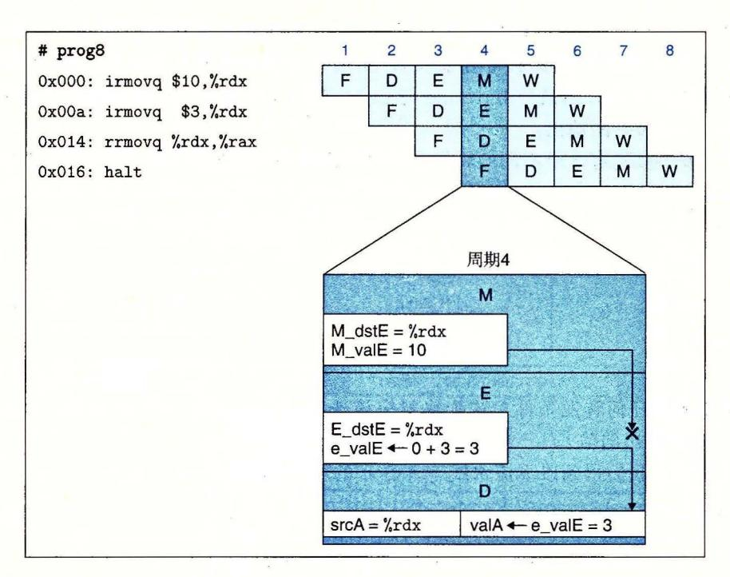

4-59 转发优先级的说明。在周期 中,% rdx 的值既可以从执行阶段也可以从访存阶段得到。 转发逻辑应该选择执行阶段中的值,因为它代表最近产生 的该寄存器的值

练习题 33 假设 d\_valA HCL 代码中第五和第六种情况(来自写回阶段的两个转 发源)的顺序是反过来的。写出一个会运行错误的 Y86-64 程序。请描述错误是如何发 生的,以及它对程序行为的 响。

练习题 34 根据提供到流水线寄存器 的源操作 va1B 的值,写出信号 d\_valB HCL 代码。

写回阶段的一小部分是保持不变的。如图 4-52 所示,整个处理器的状态 Stat 是一 个块根据流水线寄存器 中的状态值计算出来的 回想一下 4. 1. 节,状态码应该指 明是正常操作 (AOK) ,还是 种异常条件中的一种 由于流水线寄存器 保存着最近完 成的指令的状态,很自然地要用这个值来表示整个处理器状态。唯一要考虑的特殊情况 是当写回阶段有气泡时。这是正常操作的一部分,因此对千这种情况,我们也希望状态 码是 AOK:

```
word Stat = [ 
] ; 
         W_stat == SBUB : SAOK; 
         1 : W_stat;
```

#### 3. 执行阶段

4-60 展现的是 PIPE 执行阶段的逻辑。这些硬件单元和逻辑块同 SEQ 中的相同, 使用的信号做适当的重命名。我们可以看到信号 e\_valE e\_dstE 作为转发源,指向译 码阶段 一个区别是标号为 "S CC" 的逻辑以信号 m\_stat W\_stat 作为输入,这个 逻辑决定了是否要更新条件码 这些信号被用来检查一条导致异常的指令正在通过后面的 流水线阶段的情况,因此,任何对条件码的更新都会被禁止。这部分设计在 4. 5. 节中 讨论

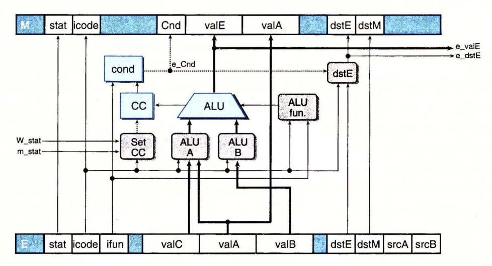

<sup>60</sup> PIPE 的执行阶段逻辑。这 部分的设计与 SEQ 实现中的逻辑非常相似

练习题 <sup>35</sup> d\_valA HCL 代码中的第二种情况使用了信号 e\_dstE, 来判断是否 要选择 ALU 的输出 e\_valE 作为转发源。假设我们用 E\_dstE, 也就是流水线寄存器 中的目的寄存器 ID, 来作为这个选择。写出一个采用这个修改过的转发逻辑就会产 生错误结果的 Y86-64 程序。

#### 访存阶段

4-61 PIPE 的访存阶段逻辑。将这个逻辑与 SEQ 的访存阶段(图 4-30) 相比较, 我们看到,正如前面提到的那样, PIPE 中没有 SEQ 中标号为 "Data" 的块。这个块是用 来在数据源 valP (对 call 指令来说)和 valA 中进行选择的,但是这个选择现在由译码阶 段中标号为 "Sel+Fwd A" 的块来执行 这个阶段中的其他块都和 SEQ 中相应的部件相 同,采用的信号做适当的重命名。在图中,你还可以看到许多流水线寄存器 中的 值作为转发和流水线控制逻辑的一部分,提供给电路中其他部分。

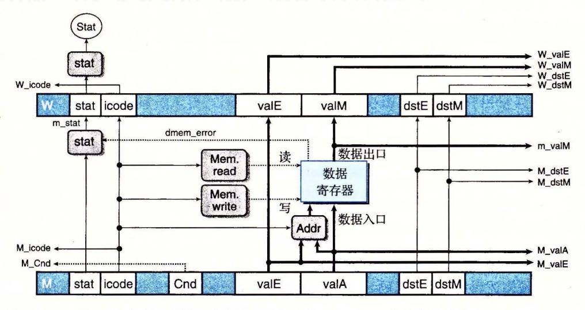

<sup>61</sup> PIPE 的访存阶段逻辑。许多从流水线寄存器 来的信号被传递到较早的阶段, 以提供写回的结果、指令地址以及转发的结果

练习题 36 在这个阶段中,通过检查数据内存的非法地址情况,我们能够完成状 态码 at 的计算。写出信号 stat HCL 代码。

### 4. 5. 8 流水线控制逻辑

现在准备创建流水线控制逻辑,完成我们的 PIPE 设计。这个逻辑必须处理下面 控制情况,这些情况是其他机制(例如数据转发和分支预测)不能处理的:

加载/使用冒险:在 条从内存中读出一个值的指令和一条使用该值的指令之间,流 水线必须暂停一个周期。

处理 re 七:流水线必须暂停直到 ret 指令到达写回阶段。

预测错误的分支:在分支逻辑发现不应该选择分支之前,分支目标处的几条指令巳经 进入流水线了。必须取消这些指令,并从跳转指令后面的那条指令开始取指。

异常:当一条指令导致异常,我们想要禁止后面的指令更新程序员可见的状态,并且 在异常指令到达写回阶段时,停止执行。

我们先浏览每种情况所期望的行为,然后再设计处理这些情况的控制逻辑。

### 1. 特殊控制情况所期望的处理

4. 5. 节中,我们已经描述了对加载/使用冒险所期望的流水线操作,如图 4-5.4 示。只有 mrmovq popq 指令会从内存中读数据。当这两条指令中的任一条处于执行阶 段,并且需要该目的寄存器的指令正处在译码阶段时,我们要将第二条指令阻塞在译码阶 段,并在下一个周期往执行阶段中插入 个气泡。此后,转发逻辑会解决这个数据冒险。 可以将流水线寄存器 保持为固定状态,从而将一个指令阻塞在译码阶段。这样做还可以 保证流水线寄存器 保持为固定状态,由此下一条指令会被再取一次。总之,实现这个流 水线流需要发现冒险的情况,保持流水线寄存器 固定不变,并且在执行阶段中插人 气泡。

ret 指令的处理,我们已经在 4. 5. 节中描述了所需的流水线操作。流水线要停顿 个时钟周期,直到 ret 指令经过访存阶段,读出返回地址。通过图 <sup>55</sup> 中下面程序的处 理的简化流水线图,说明了这种情况:

OxOOO:].rmovq stack,%rsp # !nit].al].ze stack pointer

OxOOa: call proc # Procedure call

Ox013: irmovq \$10,%rdx # Return point

Ox01d: halt Ox020:. pos Ox20

Ox020: proc: # proc:

Ox020: ret # Return immediately

Ox021: rrmovq %rdx,%rbx # Not executed

Ox030:. pos Ox30

Ox030: stack: # stack: Stack pointer

<sup>62</sup> 是示例程序中 ret 指令的实际处理过程。在此可以看到,没有办法在流水线 的取指阶段中插入气泡。每个周期,取指阶段从指令内存中读出 条指令。看看 4. 5. 中实现 PC 预测逻辑的 HCL 代码,我们可以看到,对 ret 指令来说, PC 的新值被预测成 valP ,也就是下一条指令的地址。在我们的示例程序中,这个地址会是 Ox021, ret rrmovq 指令的地址。对这个例子来说,这种预测是不对的,即使对大部分情况来说, 也是不对的,但是在设计中,我们并不试图正确预测返回地址。取指阶段会暂停 个时钟