周期,导致取出 rrmovq 指令,但是在译码阶段就被替换成了 这个过程在图 4-62 中的 表示为, 个取指用箭头指向 面的 泡,气泡会经 剩下的流水线阶段 最后 在周 irmovq 指令 较图 <sup>62</sup> <sup>55</sup> 到, 的实 果, 只不过连续 个周期取出了不正确 指令

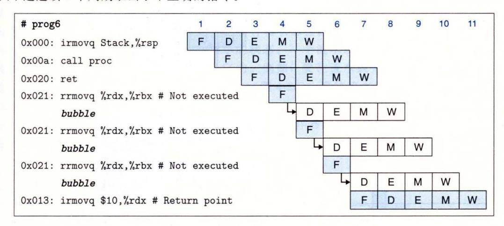

4-62 的详细处理过程 取指阶段反复取出 et 指令后面的 rrmo ,但是流水线控制 逻辑在 码阶段中插人 泡,而 不是 rrmov 由此 到的行为与图 4- <sup>55</sup>

当分支预 错误发生 时,我们 5. 中描述了所需的流 线操 作, 4- <sup>56</sup> 进行了说 达执行阶段 就可 检测到预测错误 然后在 时钟 周期,控制逻辑就会在译码和执行段插入气泡,取消两条不正确的已取指令 在同 钟周期,流水线将正确的指令读取到取指阶段

对于导致异常 指令 必须使流 的实现符合期望的 SA 行为 ,也 就是在前 面所有的指 结束前,后面的指令不能 响程序的状态 。一 些因素会使得想达到这些效果 比较麻烦 1) 异常在程序执行的两个不同阶段 取指和访存 被发现的 )程序状态在 个不同阶段( 行、访存和写回)被更新

在我 的阶段设 线寄存器中会 个状态码 stat, 着每条 经过流水线阶段 它会 录指令的状态 当异常发生时,我们将这个信息作为 令状态 部分记录下来 并且继续取指 译码和执行指令 就好像什么都没有出错 当异常 到达访存阶段 时, 会采取措施防 后面的 令修改程序员可见的 执行阶段中的指令设置条件码 向内存阶段中插入 泡,以禁止向数据 存中写入, 写回阶段中有异常指令时,暂停 回阶段,因而暂停了流水线

<sup>63</sup> 中的流水线图说明了我 的流 线控制如何处理导致异常的指令后面 着一条会 改变条件码的指令 清况 在周期 6, pushq 指令到达访存阶段,产生 存错误 一个周期 执行阶段 中的 addq 指令产生新 的值 当访存或者 回阶段 有异常 令时(通 检查信号 琴和 W\_s at 然后 信号 set\_cc 设置为 0) 设置条 <sup>63</sup> 的例子中, 我们 可以 到既向 访存 段插入 气泡, 在写回阶段 停了异常 pushq 在写回阶段保持暂停,后面的指令都没有通过执行阶段

对状态信号流 ,控制条件码的设置,以及控制流水线阶段——将这些结合起 来,我 实现了对异 常的 期望 行为:异常指令 都完成 面的 指令对程

序员可见的状态都没有影响

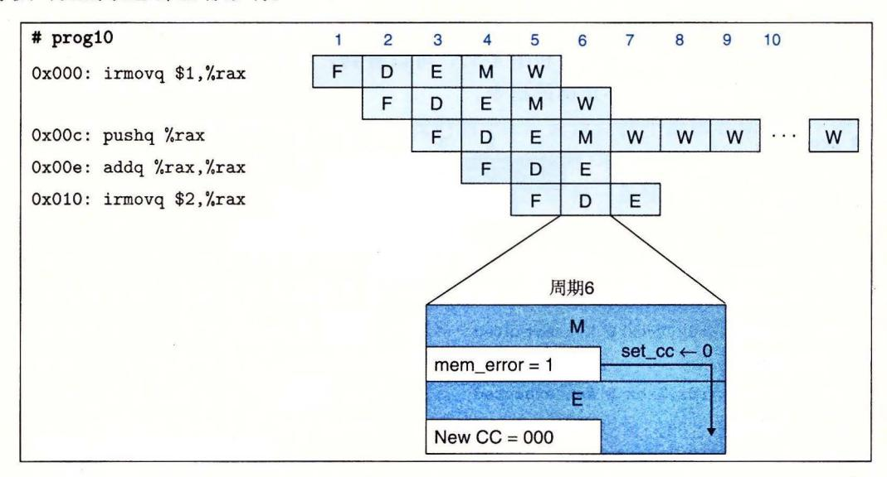

<sup>63</sup> 处理非法内存引用异常。在周期 6, pushq 指令的非法内存引用导致禁止更新条件码 流水 线开始往访存阶段插入气泡,并在写回阶段暂停异常指

## 发现特殊控制条件

4-64 总结了需要特殊流水线控制的条件。它给出的表达式描述了在哪些条件下会 出现这三种特殊情况 一些简单的组合逻辑块实现了这些表达式,为了在时钟上升开始下 一个周期时控制流水线寄存器的活动,这些块必须在时钟周期结束之前产生出结果 。在 个时钟周期内,流水线寄存器 分别保待 处于译码、执行和访存阶段中的指令 的状态 在到达时钟周期末尾时,信号 d\_srcA d\_srcB 会被设置 为译码阶段中指令的 源操作数的寄存器 ID 。当 ret 指令通过流水线时,要想发现它,只要检查译码、执行和 访存阶段中指令的指令码。发现加载 使用冒险要检 执行阶段中的指令类型 (mrmo vq popq) ,并把它的目的寄存器与译码阶段中指令的源 寄存器相 比较。当跳转指 令在 执行阶 段时,流水线控制逻辑应该能发现预测错误的分支,这样当指令进入访存阶段时,它就能 设置从错误预测中恢复所需要的条件。当跳转指令处于执行阶段时,信号 e\_Cnd 指明是否 要选择分支 通过检查访存和写回阶段中的指令状态 值,就 能发现异常指令 对千访存阶 段,我们使用在这个阶段中计算出来的信号 m\_s 七,而不是使用流水线寄存器的 at 。这个内部信号包含着可能 的数据内存地址错误。

| 条件         | 触发条件                                                      |
|------------|-----------------------------------------------------------|
| 处理 ret     | IRETE {D_icode,E_icode,M_icode }                          |
| 使用冒险<br>加载 | E_icodeE { IMRMOVL ,IPOPL } & &E_dstM E { d_srcA,d_srcB } |
| 预测错误的分支    | E_icode= IJXX& & ! e_Cnd                                  |
| 异常         | m_statE {SADR,SINS,SHLT} I IW_statE {SADR,SINS,SHLT}      |

4-64 流水线控制逻辑的检查条件。四种不同的条件要求改变流水线, 暂停流水线或者取消已经部分执行的指

### 流水线控制机制

4-65 是一些低级机制,它们使得流水线控制逻辑能将指令阻塞在流水线寄存器中,

或是往流水线中插入一个气泡。这些机制包括对 4. 2. 节中描述的基本时钟寄存器的小扩 展。假设每个流水线寄存器有两个控制输入:暂停 (stall) 和气泡 (bubble) 。这些信号的设 置决定了当时钟上升时该如何更新流水线寄存器。在正常操作下(图 4-65a) ,这两个输入 都设为 o, 使得寄存器加载它的输入作为新的状态。当暂停信号设为 时(图 4-65b) ,禁止 更新状态。相反,寄存器会保持它以前的状态。这使得它可以将指令阻塞在某个流水线阶 段中。当气泡信号设置为 时(图 4-65c) ,寄存器状态会设置成某个固定的复位配置 (reset configuration) ,得到一个等效于 nop 指令的状态。一个流水线寄存器的复位配置的 模式是由流水线寄存器中字段的集合决定的。例如,要往流水线寄存器 中插入一个气 泡,我们要将 icode 字段设置为常数值 !NOP (图 4-26) 。要往流水线寄存器 中插入一个 气泡,我们要将 icode 字段设为 !NOP, 并将 ds dstM srcA srcB 字段设为常数 RNONE 。确定复位配置是硬件设计师在设计流水线寄存器时的任务之一。在此我们不讨论 细节。我们会将气泡和暂停信号都设为 看成是出错。

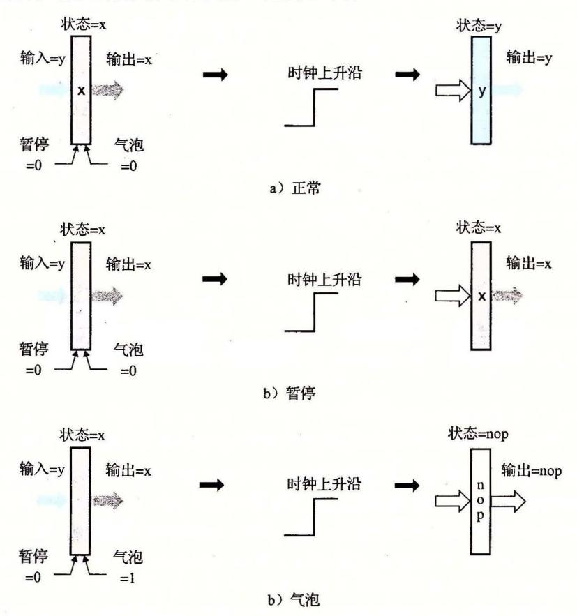

4-65 附加的流水线寄存器操作。 a) 在正常条件下,当时钟上升时,寄存器的状态和输出被设置 成输入的值; )当运行在暂停模式中时,状态保持为先前的值不变; )当运行在气泡模式 中时,会用 nop 操作的状态覆盖当前状态

4-66 中的表给出了各个流水线寄存器在三种特殊情况下应该采取的行动。对每种 情况的处理都是对流水线寄存器正常、暂停和气泡操作的某个组合。在时序方面,流水线 寄存器的暂停和气泡控制信号是由组合逻辑块产生的。当时钟上升时,这些值必须是合法 的,使得当下一个时钟周期开始时,每个流水线寄存器要么加载,要么暂停,要么产生气 泡。有了这个对流水线寄存器设计的小扩展,我们就能用组合逻辑、时钟寄存器和随机访问存储器这样的基本构建块,来实现一个完整的、包括所有控制的流水线。

| 条件 -    |    |    | 流水线寄存器 |    |    |
|---------|----|----|--------|----|----|
|         | F  | D  | E      | М  | W  |
| 处理 ret  | 暂停 | 气泡 | 正常     | 正常 | 正常 |
| 加载/使用冒险 | 暂停 | 暂停 | 气泡     | 正常 | 正常 |
| 预测错误的分支 | 正常 | 气泡 | 气泡     | 正常 | 正常 |

图 4-66 流水线控制逻辑的动作。不同的条件需要改变流水线流,或者会暂停流水线,或者会取消部分已执行的指令

### 4. 控制条件的组合

到目前为止,在我们对特殊流水线控制条件的讨论中,假设在任意一个时钟周期内,最多只能出现一个特殊情况。在设计系统时,一个常见的缺陷是不能处理同时出现多个特殊情况的情形。现在来分析这些可能性。我们不需要担心多个程序异常的组合情况,因为已经很小心地设计了异常处理机制,它能够考虑流水线中其他指令的情况。图 4-67 画出了导致其他三种特殊控制条件的流水线状态。图中所示的是译码、执行和访存阶段的块。暗色的方框代表要出现这种条件必须要满足的特别限制。加载/使用冒险要求执行阶段中的指令将一个值从内存读到寄存器中,同时译码阶段中的指令要以该寄存器作为源操作数。预测错误的分支要求执行阶段中的指令是一个跳转指令。对 ret 来说有三种可能的情况——指令可以处在译码、执行或访存阶段。当 ret 指令通过流水线时,前面的流水线阶段都是气泡。

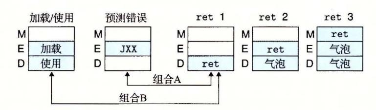

图 4-67 特殊控制条件的流水线状态。图中标明的两对情况可能同时出现

从这些图中我们可以看出,大多数控制条件是互斥的。例如,不可能同时既有加载/使用冒险又有预测错误的分支,因为加载/使用冒险要求执行阶段中是加载指令(mrmovq或 popq),而预测错误的分支要求执行阶段中是一条跳转指令。类似地,第二个和第三个ret组合也不可能与加载/使用冒险或预测错误的分支同时出现。只有用箭头标明的两种组合可能同时出现。

组合 A 中执行阶段中有一条不选择分支的跳转指令,而译码阶段中有一条 ret 指令。 出现这种组合要求 ret 位于不选择分支的目标处。流水线控制逻辑应该发现分支预测错 误,因此要取消 ret 指令。

○ 练习题 4.37 写一个 Y86-64 汇编语言程序,它能导致出现组合 A 的情况,并判断控制逻辑是否处理正确。

合并组合 A 条件的控制动作(图 4-66), 我们得到以下流水线控制动作(假设气泡或暂停会覆盖正常的情况):

| 条件      |    |    | 流水线寄存器 |    |    |
|---------|----|----|--------|----|----|
|         | F  | D  | E      | M  | w  |
| 处理 ret  | 暂停 |    | 正常     | 正常 | 正常 |
| 预测错误的分支 | 正常 | 气泡 | 气泡     | 正常 | 正常 |
| 组合      | 暂停 | 气泡 | 气泡     | 正常 | 正常 |

也就是说,组合情况 的处理与预测错误的分支相似,只不过在取指阶段是暂停。幸 运的是,在下一个周期, PC 选择逻辑会选择跳转后面那条指令的地址,而不是预测的程 序计数器值,所以流水线寄存器 发生了什么是没有关系的。因此我们得出结论,流水线 能正确处理这种组合情况。

组合 包括一个加载/使用冒险,其中加载指令设置寄存器%rsp, 然后 ret 指令用这 个寄存器作为源操作数,因为它必须从栈中弹出返回地址。流水线控制逻辑应该将 ret 令阻塞在译码阶段。

练习题 38 写一个 Y86-64 汇编语言程序,它能导致出现组合 的情况,如果流水 线运行正确,以 halt 指令结束。

合并组合 条件的控制动作(图 4-66) ,我们得到以下流水线控制动作:

|         | 流水线寄存器 |       |    |    |    |  |  |
|---------|--------|-------|----|----|----|--|--|
| 条件      | F      | D     | E  | M  | w  |  |  |
| 处理 ret  | 暂停     | 气泡    | 正常 | 正常 | 正常 |  |  |
| 预测错误的分支 | 暂停     | 暂停    | 气泡 | 正常 | 正常 |  |  |
| 组合      | 暂停     | 气泡+暂停 | 气泡 | 正常 | 正常 |  |  |
| 期望的情况   | 暂停     | 暂停    | 气泡 | 正常 | 正常 |  |  |

如果同时触发两组动作,控制逻辑会试图暂停 ret 指令来避免加载 使用冒险,同时 又会因为 ret 指令而往译码阶段中插入一个气泡。显然,我们不希望流水线同时执行这两 组动作。相反,我们希栩它只采取针对加载 使用冒险的动作。处理 ret 指令的动作应该 推迟一个周期。

这些分析表明组合 需要特殊处理。实际上, PIPE 控制逻辑原来的实现并没有正确 处理这种组合情况。即使设计已经通过了许多模拟测试,它还是有细节问题,只有通过刚 才那样的分析才能发现。当执行一个含有组合 的程序时,控制逻辑会将流水线寄存器 的气泡和暂停信号都置为 。这个例子表明了系统分析的重要性。只运行正常的程序是很 难发现这个问题的。如果没有发现这个问题,流水线就不能忠实地实现 ISA 的行为。

### 控制逻辑实现

4-68 是流水线控制逻辑的整体结构。根据来自流水线寄存器和流水线阶段的信号,控制 逻辑产生流水线寄存器的暂停和气泡控制信号,同时也决定是否要更新条件码寄存器。我们可 以将图 4-64 的发现条件和图 4-66 的动作结合起来,产生各个流水线控制信号的 HCL 描述。

遇到加载/使用冒险或 ret 指令,流水线寄存器 必须暂停:

### bool F\_stall =

# Conditions for a load/use hazard

E\_icode in { IMRMOVQ, IPOPQ} &&

E\_dstM in { d\_srcA, d\_srcB} I I

# Stalling at fetch while ret passes through pipeline IRET in { D\_icode, E\_icode, M\_icode };

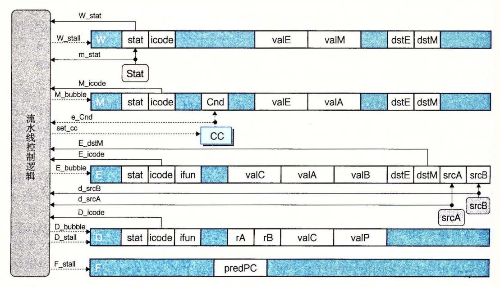

图 4-68 PIPE 流水线控制逻辑。这个逻辑覆盖了通过流水线的正常指令流,以处理特殊条件, 例如过程返回、预测错误的分支、加载/使用冒险和程序异常

🔯 练习题 4.39 写出 PIPE 实现中信号 D stall 的 HCL 代码。

遇到预测错误的分支或 ret 指令,流水线寄存器 D必须设置为气泡。不过,正如前面一节中的分析所示,当遇到加载/使用冒险和 ret 指令组合时,不应该插入气泡:

bool D\_bubble =

# Mispredicted branch

(E\_icode == IJXX && !e\_Cnd) ||

- # Stalling at fetch while ret passes through pipeline
- # but not condition for a load/use hazard
- !(E\_icode in { IMRMOVQ, IPOPQ } && E\_dstM in { d\_srcA, d\_srcB }) && IRET in { D\_icode, E\_icode, M\_icode };
- 🏹 练习题 4.40 写出 PIPE 实现中信号 E bubble 的 HCL 代码。
- ★ 3题 4.41 写出 PIPE 实现中信号 set\_cc 的 HCL 代码。该信号只有对 OPq 指令才出现,应该考虑程序异常的影响。
- 禁习题 4.42 写出 PIPE 实现中信号 M\_bubble 和 W\_stall 的 HCL 代码。后一个信号需要修改图 4-64 中列出的异常条件。

现在我们讲完了所有的特殊流水线控制信号的值。在 PIPE 的完整 HCL 代码中, 所有其他的流水线控制信号都设为 0。

### 旁注 测试设计

正如我们看到的,即使是对于一个很简单的微处理器,设计中还是有很多地方会出现问题。使用流水线,处于不同流水线阶段的指令之间有许多不易察觉的交互。我们看到一些设计上的挑战来自于不常见的指令(例如弹出值到栈指针),或是不常见的指令组合(例如不选择分支的跳转指令后面跟一条 ret 指令)。还看到异常处理增加了一类全新的可能的流水线行为。那么怎样确定我们的设计是正确的呢?对于硬件制造者来说,这

是主要关心的问题,因为他们不能简单地报告 个错误,让用户通过 Intern 下载代码 补丁 即使是简单的逻辑设计错误都可能有很严重的后果,特别是随着微处理器越来越 多地用于对我们的生命和健康至关重要的系统的运行中,例如汽车防抱死制动系统、心 脏起搏器以及航空控制系统

简单地模拟设计,运行一些"典型的"程序,不足以用来测试一个系统 相反,全 面的测试需要设计 些方法,系统地产生许多测试尽可能多地使用不同指令和指令组 在创建 Y86 <sup>64</sup> 处理器的过程中,我们还设计了很多测试脚本,每个脚本都产生出 很多不同的测试,运行处理器模拟,并且比较得到的寄存器和内存值和我们 YIS 指令集 模拟器产生的值 以下是这些脚本的简要介绍:

ptest: 运行 <sup>49</sup> 个不同的 Y8 6- 指令测试,具有不同的 和目的寄存器

jtest 运行 <sup>64</sup> 个不同的跳转和函数调用指令的测试,具有不同的是否选择分支的组合

mtest: 运行 <sup>28</sup> 个不同的条件传送指令的测试,具有不同的控制组合

htest: 运行 <sup>600</sup> 个不同的数据冒险可能性的测试,具有不同的源和目的的指令的组 合,在这些指令对之间有不同数量的 指令

ctest :测试 <sup>22</sup> 个不同的控制组合,基于类似 4. 5.8 节中我们做的那样的分析

etest: 测试 种不同的导致异常的指令和跟在后面可能改变程序员可见状态的指令组合

这种测试方法的关键思想是我们想要尽量的系统化,生成的测试会创建出不同的可 能导致流水线错误的条件

# 形式化地验证我们的设计

即使一个设计通过了广泛的测试,我们也不能保证对于所有可能的程序,它都能正 确运行 即使只考虑由短的代码段组成的测试,可以测试的可能的程序的数量也大得难 以想象 不过,形式化验证 (formal verification) 的新方法能够保证有工具能够严格地考 虑一个系统所有可能的行为,并确定是否有设计错误

我们能够形式化验证 Y86-64 处理器较早的 个版本 <sup>13</sup> 建立一个框架,比较流 水线化的设计 PIPE 和非流水线化的版本 SEQ 也就是,它能够证明对于任意 -6 程序,两个处理器对程序员可见的状态有完全 样的影响。当然,我们的验证器不可能 真的运行所有可能的程序,因为这样的程序的数量是无穷大的 相反,它使用了归纳法 来证明,表明两个处理器之间在一个周期到 个周期的基础上都是一致的 进行这种分 析要求用符号方法 (symbolic methods) 来推导硬件,在符号方法中,我们认为所有的程 序值都是任意的整数,将 ALU 抽象成某种"黑盒子",根据它的参数计算某个未指定的 函数 我们只假设 SEQ PIPE ALU 计算相同的函数

用控制逻辑的 HCL 描述来产生符号处理器模型的控制逻辑,因此我们能发现 HCL 代码中的问题 能够证明 SEQ PIPE 是完全相同的,也不能保证它们忠实地实现了 <sup>64</sup> 指令集体系结构 不过,它能够发现任何由于不正确的流水线设计导致的错误, 这是设计错误的主要来源

在实验中,我们不仅验证了在本章中考虑的 PIPE 版本,还验证了作为家庭作业的 几个变种,其中,我们增加了更多的指令,修改了硬件的能力,或是使用了不同的分支 预测策略 有趣的是,在所有的设计中,只发现了 个错误,涉及家庭作业 中描 述的变种的答案中的控制组合 (在 4.5.8 节中讲述的) 这暴露出测试体制中的一个弱点,

导致我们在 ctest 测试脚本中增加了附加的情况。

形式化验证仍然处在发展的早期阶段。工具往往很难使用,而且还不能验证大规模的设计。我们能够验证 Y86-64 处理器的部分原因就是因为它们相对比较简单。即使如此,也需要几周的时间和精力,多次运行那些工具,每次最多需要 8 个小时的计算机时间。这是一个活跃的研究领域,有些工具成为可用的商业版本,有些在 Intel、AMD 和 IBM 这样的公司使用。

## 网络旁注 ARCH: VLOG 流水线化的 Y86-64 处理器的 Verilog 实现

正如我们提到过的,现代的逻辑设计包括用硬件描述语言书写硬件设计的文本表示。然后,可以通过模拟和各种形式化验证工具来测试设计。一旦对设计有了信心,我们就可以使用逻辑合成(logic synthesis)工具将设计翻译成实际的逻辑电路。

我们用 Verilog 硬件描述语言开发了 Y86-64 处理器设计的模型。这些设计将实现处理器基本构造块的模块和直接从 HCL 描述产生出来的控制逻辑结合了起来。我们能够合成这些设计的一些,将逻辑电路描述下载到字段可编程的门阵列(FPGA)硬件上,可以在这些处理器上运行实际的 Y86-64 程序。

## 4.5.9 性能分析

322

我们可以看到,所有需要流水线控制逻辑进行特殊处理的条件,都会导致流水线不能够实现每个时钟周期发射一条新指令的目标。我们可以通过确定往流水线中插入气泡的频率,来衡量这种效率的损失,因为插入气泡会导致未使用的流水线周期。一条返回指令会产生三个气泡,一个加载/使用冒险会产生一个,而一个预测错误的分支会产生两个。我们可以通过计算 PIPE 执行一条指令所需要的平均时钟周期数的估计值,来量化这些处罚对整体性能的影响,这种衡量方法称为 CPI(Cycles Per Instruction,每指令周期数)。这种衡量值是流水线平均吞吐量的倒数,不过时间单位是时钟周期,而不是微微秒。这是一个设计体系结构效率的很有用的衡量标准。

如果我们忽略异常带来的性能损失(异常的定义表明它是很少出现的),另一种思考 CPI 的方法是,假设我们在处理器上运行某个基准程序,并观察执行阶段的运行。每个周期,执行阶段要么会处理一条指令,然后这条指令继续通过剩下的阶段,直到完成;要么会处理一个由于三种特殊情况之一而插入的气泡。如果这个阶段一共处理了 C<sub>i</sub>条指令和 C<sub>i</sub>个气泡,那么处理器总共需要大约 C<sub>i</sub>+C<sub>i</sub>个时钟周期来执行 C<sub>i</sub>条指令。我们说"大约"是因为忽略了启动指令通过流水线的周期。于是,可以用如下方法来计算这个基准程序的 CPI:

$$CPI = \frac{C_i + C_b}{C_i} = 1.0 + \frac{C_b}{C_i}$$

也就是说,CPI 等于 1.0 加上一个处罚项  $C_b/C_i$ ,这个项表明执行一条指令平均要插入多少个气泡。因为只有三种指令类型会导致插入气泡,我们可以将这个处罚项分解成三个部分:

$$CPI = 1.0 + lp + mp + rp$$

这里,lp(load penalty,加载处罚)是当由于加载/使用冒险造成暂停时插入气泡的平均数,mp(mispredicted branch penalty,预测错误分支处罚)是当由于预测错误取消指令时插入气泡的平均数,而rp(return penalty,返回处罚)是当由于 ret 指令造成暂停时插

入气泡的平均数。每种处罚都是由该种原因引起的插入气泡的总数 (Cb 部分)除以执行 指令的总数 (C,

为了估计每种处罚,我们需要知道相关指令(加载、条件转移和返回)的出现频率,以 及对每种指令特殊情况出现的频率。对 CPI 的计算,我们使用下面这组频率(等同于 [44] [46] 中报告的测量值):

- ·加载指令 (mrmovq popq) 占所有执行指令的 25% 。其中 <sup>20</sup> %会导致加载 使用 冒险。
- ·条件分支指令占所有执行指令的 20% 。其中 <sup>60</sup> %会选择分支,而 <sup>40</sup> %不选择分支。
- ·返回指令占所有执行指令的 2%

因此,我们可以估计每种处罚,它是指令类型频率、条件出现频率和当条件出现时插 入气泡数的乘积:

| 原因   | 名称 | 指令频率  | 条件频率  | 气泡 | 乘积    |
|------|----|-------|-------|----|-------|
| 使用   | lp | 0. 25 | o. 20 | 1  | 0.05  |
| 预测错误 | mp | 0. 20 | 0.40  | 2  | 0. 16 |
| 返回   | rp | 0.02  | 1. 00 | 3  | 0.06  |
| 总处罚  |    |       |       |    | 0. 27 |

三种处罚的总和是 0. 27, 所以得到 CPI 1. <sup>27</sup>

我们的目标是设计一个每个周期发射 条指令的流水线,也就是 CPI 1.0 。虽然没 有完全达到目标,但是整体性能已经很不错了。我们还能看到,要想进一步降低 CPI, 应该集中注意力预测错误的分支。它们占到了整个处罚 0. <sup>27</sup> 中的 o. 16, 因为条件转移非 常常见,我们的预测策略又经常出错,而每次预测错误都要取消两条指令。

- 练习题 43 假设我们使用了一种成功率可以达到 <sup>65</sup> %的分支预测策略,例如后向 分支选择、前向分支就不选择 (BTFNT) ,如 4. 5. 节中描述的那样 那么对 CPI 什么样的影响呢?假设其他所有频率都不变。
- 练习题 44 让我们来分析你为练习题 4. 和练习题 4. 写的程序中使用条件数据传 送和条件控制转移的相对性能。假设用这些程序计算一个非常长的数组的绝对值的 和,所以整体性能主要是由内循环所需要的周期数决定的。假设跳转指令预测为选择 分支,而大约 <sup>50</sup> %的数组值为正。
  - A. 平均来说,这两个程序的内循环中执行了多少条指令?
  - B. 平均来说,这两个程序的内循环中插入了多少个气泡?
  - c. 对这两个程序来说,每个数组元素平均需要多少个时钟周期?

### 4. 5. 10 未完成的工作

我们已经创建了 PIPE 流水线化的微处理器结构,设计了控制逻辑块,并实现了处理普 通流水线流不足以处理的特殊情况的流水线控制逻辑。不过, PIPE 还是缺乏一些实际微处 理器设计中所必需的关键特性。我们会强询其中 些,并讨论要增加这些特性需要些什么。

### 1 多周期指令

Y86-64 指令集中的所有指令都包括一些简单的操作,例如数字加法。这些操作可以 在执行阶段中一个周期内处理完。在一个更完整的指令集中,我们还将实现一些需要更为 复杂操作的指令,例如,整数乘法和除法,以及浮点运算。在一个像 PIPE 这样性能中等

的处理器中,这些操作的典型执行时间从浮点加法的 个周期到整数除法的 <sup>64</sup> 个周 期。为了实现这些指令,我们既需要额外的硬件来执行这些计算,还需要一种机制来协调 这些指令的处理与流水线其他部分之间的关系。

实现多周期指令的一种简单方法就是简单地扩展执行阶段逻辑的功能,添加一些整数 和浮点算术运算单元。一条指令在执行阶段中逗留它所需要的多个时钟周期,会导致取指 和译码阶段暂停。这种方法实现起来很简单,但是得到的性能并不是太好。

通过采用独立千主流水线的特殊硬件功能单元来处理较为复杂的操作,可以得到更好 的性能。通常,有一个功能单元来执行整数乘法和除法,还有一个来执行浮点操作。当一 条指令进入译码阶段时,它可以被发射到特殊单元。在这个特殊单元执行该操作时,流水 线会继续处理其他指令。通常,浮点单元本身也是流水线化的,因此多条指令可以在主流 水线和各个单元中并发执行。

不同单元的操作必须同步,以避免出错。比如说,如果在不同单元执行的各个指令之 间有数据相关,控制逻辑可能需要暂停系统的某个部分,直到由系统其他某个部分处理的 操作的结果完成。经常使用各种形式的转发,将结果从系统的一个部分传递到其他部分, 这和前面 PIPE 各个阶段之间的转发一样。虽然与 PIPE 相比,整个设计变得更为复杂, 但还是可以使用暂停、转发以及流水线控制等同样的技术来使整体行为与顺序的 ISA 模型 相匹配。

## 与存储系统的接口

在对 PIPE 的描述中,我们假设取指单元和数据内存都可以在一个时钟周期内读或是 写内存中任意的位置。我们还忽略了由自我修改代码造成的可能冒险,在自我修改代码 中,一条指令对一个存储区域进行写,而后面又从这个区域中读取指令。进一步说,我们 是以存储器位置的虚拟地址来引用它们的,这要求在执行实际的读或写操作之前,要将虚 拟地址翻译成物理地址。显然,要在一个时钟周期内完成所有这些处理是不现实的。更糟 糕的是,要访间的存储器的值可能位于磁盘上,这会需要上百万个时钟周期才能把数据读 入到处理器内存中

正如将在第 章和第 章中讲述的那样,处理器的存储系统是由多种硬件存储器和管 理虚拟内存的操作系统软件共同组成的。存储系统被组织成一个层次结构,较快但是较小 的存储器保持着存储器的 个子集,而较慢但是较大的存储器作为它的后备。最靠近处理 器的一层是高速缓存 (cache) 存储器,它提供对最常使用的存储器位置的快速访问。一个 典型的处理器有两个第一层高速缓存 一个用千读指令,一个用于读和写数据。另一种 类型的高速缓存存储器,称为翻译后备缓冲器 (Translation Look-aside Buffer, TLB) ,它 提供了从虚拟地址到物理地址的快速翻译。将 TLB 和高速缓存结合起来使用,在大多数 时候,确实可能在一个时钟周期内读指令并读或是写数据。因此,我们的处理器对访问存 储器的简化看法实际上是很合理的

虽然高速缓存中保存有最常引用的存储器位置,但是有时候还会出现高速缓存不命中 (miss) ,也就是有些引用的位置不在高速缓存中。在最好的情况中,可以从较高层的高速 缓存或处理器的主存中找到不命中的数据,这需要 3~20 个时钟周期。同时,流水线会简 单地暂停,将指令保持在取指或访存阶段,直到高速缓存能够执行读或写操作。至千流水 线设计,通过添加更多的暂停条件到流水线控制逻辑,就能实现这个功能。高速缓存不命 中以及随之而来的与流水线的同步都完全是由硬件来处理的,这样能使所需的时间尽可能 地缩短到很少数屈的时钟周期。

在有些情况中,被引用的存储器位置实际上是存储在磁盘存储器上的 此时,硬件会 产生一个缺页 (page fault) 异常信号。同其他异常一样,这个异常会导致处理器调用操作系 统的异常处理程序代码。然后这段代码会发起一个从磁盘到主存的传送操作。一旦完成, 操作系统会返回到原来的程序,而导致缺页的指令会被重新执行 这次,存储器引用将成 功,虽然可能会导致高速缓存不命中 让硬件调用操作系统例程,然后操作系统例程又会 将控制返回给硬件,这就使得硬件和系统软件在处理缺页时能协同 工作。 因为访问磁盘 要数百万个时钟周期, OS 缺页中断处理程序执行的处理所需的几百个时钟周期对性能的 影响可以忽略不计。

从处理器的角度来看,将用暂停来处理短时间的高速缓存不命中和用异常处理来处理长时 间的缺页结合起来,能够顾及到存储器访问时由千存储器层次结构引起的所有不可预测性。

## 当前的微处理器设计

一个五阶段流水线,例如已经讲过的 PIPE 处理器,代表了 <sup>20</sup> 世纪 <sup>80</sup> 年代中期 的处理器设计水平。 Berkeley Patterson 研究组开发的 RISC 处理器原型是笫一个 SPARC 处理器的基础,它是 Sun Microsystems <sup>1987</sup> 年开发的 Stanford Hennessy 研究组开发的处理器由 MIPS Technologies (一个由 Hennessy 成立的公司)在 <sup>1986</sup> 年商业化了 这两种处理器都使用的是五阶段流水线。 Intel i486 处理器用的也是 五阶段流水线,只不过阶段之间的职责划分不太一样,它有两个译码阶段和一个合并 的执行 访存阶段 [27]

这些流水线化的设计的吞吐量都限制在最多一个时钟周期一条指令。 4.5. 小节中 描述的 CPI(Cycles Per Instruction, 每指令周期)测量值不可能小于 1.0 不同的阶段一 次只能处理一条指令 较新的处理器支持超标量 (superscalar) 操作,意味着它们通过并 行地取指、译码和执行多条指令,可以实现小于 1.0 CPI 当超标量处理器已经广泛 使用时,性能测量标准已经从 CPI 转化成了它的倒数 每周期执行指令的平均数,即 IPC 对超标量处理器未说, IPC 可以大于 1.0 最先进的设计使用了一种称为乱序 (out-of-order) 执行的技术未并行地执行多条指令,执行的顺序也可能完全不同于 它们在 程序中出现的顺序,但是保留了顺序 ISA 模型蕴含的整体行为 作为对程序优化的讨论 的一部分,我们将会在笫 章中讨论这种形式的执行。

不过,流水线化的处理器并不只有传统的用途。现在出售的大部分处理器都用在嵌 入式系统中,控制着汽车运行、消费产品,以及其他一些系统用户不能直接看到处理器 的设备 在这些应用中,与性能较高的模型相比,流水线化的处理器的简单性(比如说 像我们在本章中讨论的这样)会降低成本和功耗需求。

最近,随着多核处理器受到追捧,有些人声称通过在一个芯片上集成许多简单的处 理器,比使用少量更复杂的处理器能荻得更多的整体计算能力 这种策略有时被称为 "多核"处理器 [10]

## 4. 6 小结

我们已经看到,指令集体系结构,即 ISA, 在处理器行为(就指令集合及其编码而言)和如何实现处 理器之间提供了 层抽象 ISA 提供了 程序执行的一种顺序 说明,也就 是一条指令执行 完了,下 条指 令才会开始

IA32 开始,大大简化数据类 型、 地址模式和指令编码,我们定义了 Y86-64 指令集 得到的

ISA 既有 RISC 指令集的属性,也有 CISC 指令集的属性。然后,将不同指令组织放到五个阶段中处理, 在此,根据被执行的指令的不同,每个阶段中的操作也不相同 据此,我们构造了 SEQ 处理器,其中每 个时钟周期执行一条指令,它会通过所有五个阶段。

流水线化通过让不同的阶段并行操作,改进了系统的吞吐抵性能。在任意一个给定的时刻,多条指 被不同的阶段处理。在引入这种并行性的过程中,我们必须非常小心,以提供与程序的顺序执行相同 的程序级行为。通过重新调整 SEQ 各个部分的顺序,引入流水线,我们得到 SEQ+ ,接着添加流水线寄 存器,创建出 PIPE 一流水线。然后,添加了转发逻辑,加速了将结果从一条指令发送到另 条指令,从 而提 了流水线的性能 有几种特殊情况 要额外的流水线控制逻辑来暂停或取消一些流水线阶段

我们的设计中包括了 本的异常处理机制,在此,保证只有到异常指令之前的指 响程序 员可见的状 态。 实现完整的异常处理远比此更具挑战性。在采用了更深流水线和更多并行性的系统中, 要想正确处理异常就更加复杂了

在本章中,我们学习了有关处理器设计的几个重要经验:

- 管理复杂性是首要问题。想要优化使用硬件资源,在最小的成本下获得最大的性能。为了 现这 个目的,我们创建了一个非常简单而一致的框架,来处理所有不同的指令类型。有了这个框架, 就能够在处理不同指令类型的逻辑中共享硬件单元。
- 我们不需要直接实现 ISA ISA 接实现意味着一个顺序的设计。为了获得更高的性能,我们想 运用硬件能力以同时执行许多操作,这就导致要使用流水线化的设计。通过仔细的设计和分析, 我们能够处理各种流水线冒险,因此运行一个程序的整体效果,同用 ISA 模型获得的效果完全
- 硬件设计人员必须非常谨慎小心 一旦芯片被制造出来,就几乎不可能改正任何错 一开始就 使设计正确是非常重要的。这就意味着要仔细地分析各种指令类型和组合,甚至于那些看上去没有 意义的情况,例如弹出值到栈指针。必须用系统的模拟测试程序彻底地测试设计。在开发 PIPE 控制逻辑中,我们的设计有个细微的错误,只有通过对控制组合的仔细而系统的分析才能发现。

# - Y86-64 处理器的 HCL 描述

本章已经介绍几个简单的逻样设计,以及 Y86 <sup>64</sup> 处理器 SEQ PIPE 的控制逻辑 的部分 HCL 代码 我们提供了 HCL 语言的文档和这两个处理器的控制逻辑的完整 HCL 描述 这些描述每个都只需要 5~7 HCL 代码,完整地研究它们是很值得的 j

### Y86-64 模拟器

本章的实验资料包括 SEQ PIPE 处理器的模拟器。每个模拟器都有两个版本

- GUI (图形用户界面)版本 图形窗口中显示内存、程序代码以及处理器状态。它提供了一种方式 简便地查看指令如何通过处理楛。控制面板还允许你交互式地重启动、单步或运行模拟器。
- 文本版本运行的是相同的模拟器,但是它显示信息的唯一方式是打印到终端上。对调试来讲,这 个版本不是很有用,但是它允许处理器的自动测试

这些模拟器的控制逻辑是通过将逻辑块的 HCL 声明翻译成 代码产生的 然后,编译这些代码并 与模拟代码的其他部分进行链接。这样的结合使得你可以用这些模拟器测试原始设计的各种变种。提供 的测试脚本,它们全面地测试各种指令以及各种冒险的可能性

# 参考文献说明

对于那些有兴趣更多地学习逻辑设计的人来说, Katz 的逻辑设计教科书 [58] 是标准的入门教材,它 强调 硬件描述语言的使用 Hennessy Patterson 的计算机体系结构教科书 46] 覆盖了处理器设计的 广泛内 ,包括这里讲述的简单流水线,还有并行执行更多指令的 高级的处理器。 Shriver Smith [101] 详细介绍了 AMD 制造的 Intel 兼容的 IA32 处理器

## 家庭作业

•4.45 在 3.4.2 节中, x86-64 pushq指令被描述成要减少栈指针, 然后将寄存器存储在栈指针的位置。因此, 如果我们有一条指令形如对于某个寄存器 REG, pushq REG, 它等价于下面的代码序列:

subq \$8,%rsp

- A. 借助于练习题 4.7 中所做的分析,这段代码序列正确地描述了指令 pushq %rsp 的行为吗?请解释。
- B. 你该如何改写这段代码序列,使得它能够像对 REG 是其他寄存器时一样,正确地描述 REG 是%rsp 的情况?
- •4.46 在 3.4.2 节中, x86-64 popq 指令被描述为将来自栈顶的结果复制到目的寄存器, 然后将栈指针减少。因此, 如果我们有一条指令形如 popq REG, 它等价于下面的代码序列:

movq (%rsp), REG addq \$8,%rsp Read REG from stack
Increment stack pointer

- A. 借助于练习题 4.8 中所做的分析,这段代码序列正确地描述了指令 popq %rsp 的行为吗?请解释。
- B. 你该如何改写这段代码序列,使得它能够像对 REG 是其他寄存器时一样,正确地描述 REG 是%rsp 的情况?
- 禁4.47 你的作业是写一个执行冒泡排序的 Y86-64 程序。下面这个 C 函数用数组引用实现冒泡排序,供你参考:

```
/* Bubble sort: Array version */
2
    void bubble_a(long *data, long count) {
         long i, last;
3
         for (last = count-1; last > 0; last--) {
4
             for (i = 0; i < last; i++)
5
                 if (data[i+1] < data[i]) {
6
                     /* Swap adjacent elements */
8
                     long t = data[i+1];
                     data[i+1] = data[i];
10
                     data[i] = t:
                 7
11
         }
12
     }
13
```

- A. 书写并测试一个 C 版本,它用指针引用数组元素,而不是用数组索引。
- B. 书写并测试一个由这个函数和测试代码组成的 Y86-64 程序。你会发现模仿编译你的 C 代码产生的 x86-64 代码来做实现会很有帮助。虽然指针比较通常是用无符号算术运算来实现的,但是在这个练习中,你可以使用有符号算术运算。
- \*\* 4.48 修改对家庭作业 4.47 所写的代码,实现冒泡排序函数的测试和交换(6~11 行),要求不使用跳转, 且最多使用 3 次条件传送。
- \*\*4.49 修改对家庭作业 4.47 所写的代码,实现冒泡排序函数的测试和交换(6~11 行),要求不使用跳转, 且只使用 1 次条件传送。
- \*\*4.50 在 3.6.8 节中, 我们看到实现 switch 的一种常见方法是创建一组代码块, 再用跳转表对这些块进行索引。考虑图 4-69 中给出的函数 switchv的 C 代码, 以及相应的测试代码。

用跳转表以 Y86-64 实现 switchv。虽然 Y86-64 指令集不包含间接跳转指令,但是,你可以通过把计算好的地址入栈,再执行 ret 指令来获得同样的效果。实现类似于 C 语言所示的测试代码,证明你的 switchv 实现可以处理触发 default 的情况以及两个显式处理的情况。

```
#include <stdio.h>
/* Example use of switch statement */
long switchv(long idx) {
    long result = 0;
    switch(idx) {
    case 0:
        result = 0xaaa:
        break:
    case 2:
    case 5:
        result = 0xbbb;
        break:
    case 3:
        result = 0xccc;
        break:
    default:
        result = 0xddd:
    return result;
 }
/* Testing Code */
#define CNT 8
#define MINVAL -1
int main() {
    long vals[CNT];
    long i;
    for (i = 0; i < CNT; i++) {
        vals[i] = switchv(i + MINVAL);
        printf("idx = %ld, val = 0x%lx\n", i + MINVAL, vals[i]);
    7
    return 0;
}
```

图 4-69 Switch 语句可以翻译成 Y86-64 代码。这要求实现一个跳转表

- \* 4.51 练习题 4.3 介绍了 iaddq 指令,即将立即数与寄存器相加。描述实现该指令所执行的计算。参考 irmovq 和 OPq 指令的计算(图 4-18)。
- \*\* 4.52 文件 seq-full. hcl 包含 SEQ 的 HCL 描述,并将常数 IIADDQ 声明为十六进制值 C, 也就是 iad-dq 的指令代码。修改实现 iaddq 指令的控制逻辑块的 HCL 描述,就像练习题 4.3 和家庭作业 4.51 中描述的那样。可以参考实验资料获得如何为你的解答生成模拟器以及如何测试模拟器的 指导。
- \*\* 4.53 假设要创建一个较低成本的、基于我们为 PIPE-设计的结构(图 4-41)的流水线化的处理器,不使用旁路技术。这个设计用暂停来处理所有的数据相关,直到产生所需值的指令已经通过了写回阶段。

文件 pipe-stall. hcl 包含一个对 PIPE 的 HCL 代码的修改版,其中禁止了旁路逻辑。也就是,信号 e valA 和 e valB 只是简单地声明如下:

```
## DO NOT MODIFY THE FOLLOWING CODE.
## No forwarding. valA is either valP or value from register file
word d_valA = [
```

## No forwarding. valB is value from register file word d\_valB = d\_rvalB;

修改文件结尾处的流水线控制逻辑,使之能正确处理所有可能的控制和数据冒险。作为设计 工作的一部分,你应该分析各种控制情况的组合,就像我们在 PIPE 的流水线控制逻辑设计中做 的那样。你会发现有许多不同的组合,因为有更多的情况需要流水线暂停。要确保你的控制逻辑 能正确处理每种组合情况。可以参考实验资料指导你如何为解答生成模拟器以及如何测试模拟 器的。

- •• 4. 54 文件 pipe-full. hcl 包含一份 PIPE HCL 描述,以及常数值 IIADDQ 的声明。修改该文件以实 现指令 iaddq, 就像练习题 4. 和家庭作业 4. <sup>51</sup> 中描述的那样。可以参考实验资料获得如何为你 的解答生成模拟器以及如何测试模拟器的指导。
- \*\*\* 4. 55 文件 pipe-nt. hcl 包含一份 PIPE HCL 描述,并将常数 J\_YES 声明为值 o, 即无条件转移指令 的功能码。修改分支预测逻辑,使之对条件转移预测为不选择分支,而对无条件转移和 call 预测 为选择分支。你需要设计一种方法来得到跳转目标地址 vale, 并送到流水线寄存器 M, 以便从错 误的分支预测中恢复。可以参考实验资料获得如何为你的解答生成模拟器以及如何测试模拟器的 指导。
- ·: 4. 56 文件 pipe-btfnt. hcl 包含一份 PIPE HCL 描述,并将常数 J\_YES 声明为值 o, 即无条件转移 指令的功能码。修改分支预测逻辑,使得当 valC<valP 时(后向分支),就预测条件转移为选择 分支,当 vale valP 时(前向分支),就预测为不选择分支。(由于 Y86-64 不支持无符号运算,你 应该使用有符号比较来实现这个测试。)并且将无条件转移和 call 预测为选择分支。你需要设计一 种方法来得到 valC valP, 并送到流水线寄存器 M, 以便从错误的分支预测中恢复。可以参考 实验资料获得如何为你的解答生成模拟器以及如何测试模拟器的指导。
- \*! 4. 57 \* 在我们的 PIPE 的设计中,只要一条指令执行了 load 操作,从内存中读一个值到寄存器,并且下 一条指令要用这个寄存器作为源操作数,就会产生一个暂停。如果要在执行阶段中使用这个源操 作数,暂停是避免冒险的唯一方法。对千第二条指令将源操作数存储到内存的情况,例如 rmmovq pushq 指令,是不需要这样的暂停的。考虑下面这段代码示例:
  - 12345 mrmovq 0(%rcx),%rdx pushq %rdx nop popq %rdx rmmovq %rax,O(%rdx) # Load 1 # Store 1 # Load 2 # Store 2

在第 行和第 行, mrmovq 指令从内存读一个值到%rdx, 然后 pushq 指令将这个值压入栈 中。我们的 PIPE 设计会让 pushq 指令暂停,以避免装载/使用冒险。不过,可以看到, pushq 令要到访存阶段才会需要%rdx 的值。我们可以再添加一条旁路通路,如图 4-70 所示,将内存输出 (信号 m\_valM) 转发到流水线寄存器 中的 valA 字段。在下一个时钟周期,被传送的值就能写入 内存了。这种技术称为加载转发 Cload forwarding)

注意,上述代码序列中的第二个例子(第 行和第 行)不能利用加载转发。 popq 指令加载的 值是作为下一条指令地址计算的一部分的,而在执行阶段而非访存阶段就需要这个值了。

- A. 写出描述发现加载/使用冒险条件的逻辑公式,类似于图 4-64 所示,除了能用加载转发时不会 导致暂停以外。
- B. 文件 pipe-lf. hcl 包含一个 PIPE 控制逻辑的修改版。它含有信号 e\_valA 的定义,用来实 现图 4-70 中标号为 "Fwd A" 的块。它还将流水线控制逻辑中的加载/使用冒险的条件设 置为 0' 因此流水线控制逻辑将不会发现任何形式的加载/使用冒险。修改这个 HCL 描述 以实现加载转发。可以参考实验资料获得如何为你的解答生成模拟器以及如何测试模拟器 的指导。

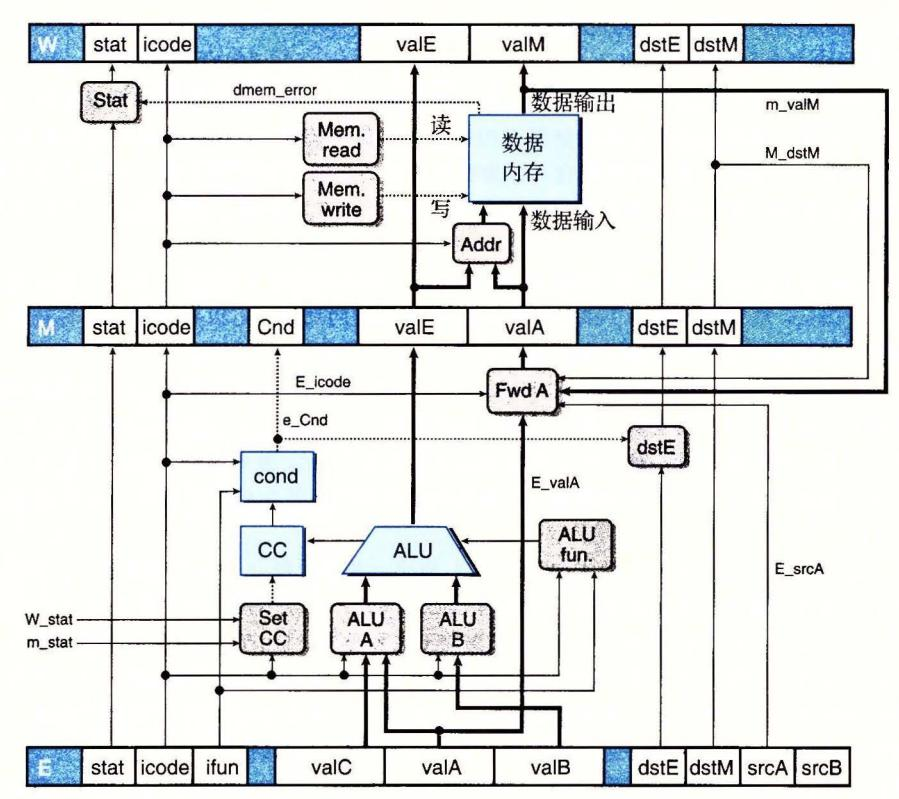

能够进行加载转发的执 和访存阶段。通过添加一 从内存输出到流水线寄存器 valA 源的旁路通路,对千这种形式的加载 使用冒险,我们可以使用转发而不必暂停。这是 家庭 4. <sup>57</sup> 的主旨

·: 4 . 58 我们的流水线化的设计有点 ,因为寄存器文件 两个 端口,然而只有 popq 令需要 存器文件同时进行两个写操 因此,其他指 只使用 端口,共享这个端口来 alE alM 下面这个图是一个对写回逻辑的修改版,其中,我们将 回寄存器 lD W\_dstE W\_d tM) 合并成一个信号 w\_dstE, 同时也将写回值 (W alE w\_valM 合并成一个信号 w\_valE:

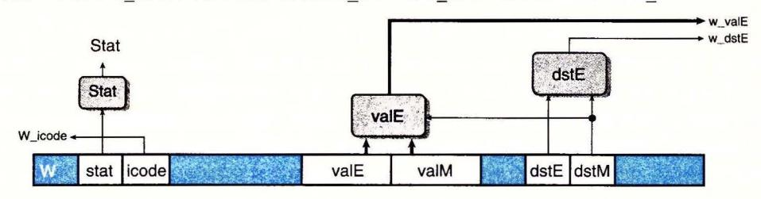

HCL 写执行这些 并的逻辑,如下所示;

```
## Set E port register ID 
word w_dstE = [ 
] ; 
         ## writing from valM 
         W_dstM != RNONE : W_dstM; 
         1: W_dstE; 
## Set E port value 
word w_valE = [ 
] ; 
        W_dstM != RNONE : W_valM; 
         1 : W_valE ;
```

对这些多路复用器的控制是由 dstE 确定的 当它表明有某个寄存器时,就选择端口 值,否则就选择端口 的值。

在模拟模型中,我们可以禁止寄存器端口 M, 如下面这段 HCL 代码所示:

## Disable register port M ## Set M port register ID word w\_dstM = RNONE; ## Set M port value word w\_valM = O;

接下来的问题就是要设计处理 popq 的方法。一种方法是用控制逻辑动态地处理指令 popq rA ,使之与下面两条指令序列有 样的效果:

1addq \$8, o/.rsp mrmovq -8(%rsp), rA

(关于指令 iaddq 的描述,请参考练习题 4. 3) 要注意两条指令的顺序,以保证 popq %rsp 能正确 工作。要达到这个目的,可以让译码阶段的逻辑对上面列出的 popq 指令和 addq 指令一视同仁, 除了它会预测下一个 PC 与当前 PC 相等以外。在下一个周期,再次取出了 popq 指令,但是指令 代码变成了特殊的值 IPOP2 。它会被当作 条特殊的指令来处理,行为与上面列出的 mrmovq 指令 一样。

文件 pipe-lw. hcl 包含上面讲的修改过的写端口逻辑 它将 常数 IPOP2 明为十六进制值 。还包括信号 f\_icode 的定义,它产生流水线寄存器 icode 段。可以修改这个定义,使 得当第二次取出 popq 指令时,插入指令代码 IPOP2 。这个 HCL 文件还包含信号 f\_pe 的声明,也 就是标号为 "Select PC" 的块(图 57) 在取指阶段产生的程序计数楛的值。

修改该文件中的控制逻辑,使之按照我们描述的方式来处理 popq 指令。可以参考实验资料获 得如何为你的解答生成模拟器以及如何测试模拟器的指导。

"4. 59 比较 三个版本 的冒泡排序的性能(家庭作业 4. <sup>47</sup> 4. <sup>48</sup> 4. 49) 。解释为什么 个版本的性能比其 他两个的好

# 练习题答案

4. 1 手工对指令编码是非常乏味的,但是它将巩固你对汇编器将汇编代码变成字节序列的理解。在下面 这段 Y86-64 汇编器的输出中,每 行都给出了一个地址和一个从该地址开始的字节序列:

```
1 OxlOO : I. pos Ox100 # Sta code at address 
OxlOO 
2 OxlOO: 30f30f00000000000000 I irmovq $15,%rbx 
3 OxlOa: 2031 rrmovq %rbx,!.rcx 
4OxlOc: I loop: 
5 Ox10c: 4013fdffffffffffffff I rmmovq %rcx, -3 (%rbx) 
6 Ox116: 6031 I addq %rbx,%rcx 
7 Ox118 : 700c01000000000000 I jmp loop
```

这段编码有些地方值得注意:

- ·十进制的 <sup>15</sup> (第 行)的十六进制表示为 OxOOOOOO OOOOO OOOOf 。以反向顺序来写就是 00 00 00 00 00 00 00.
- ·十进制- (第 行)的十六进制 表示 Oxfffffffffffffffd 。以反向顺序来 fd ff ff ff ff ff ff ff
- ·代码从地址 OxlOO 开始。第 一条指令需要 <sup>10</sup> 个字节,而第二条需要 个字节。因此,循环的目 标地址为 Ox0000010c 。以反向顺序来写就是 Oc 01 00 00 00 00 00 <sup>00</sup>
- 4. 2 对一个 字节序 列进行译码能帮助你理解处理器面临的任务 。它必须读入字 节序列,并确定要执 行什么指令。接下来,我们给出的是用来产生每个字节序列的汇编代码。在汇编代码的左边,你可 以看到每条指令的地址和字节序列。

```
A. 一些带立即数和地址偏移量的操作:
```

```
0x100: 30f3fcfffffffffffff | irmovq $-4,%rbx
0x10a: 4063000800000000000 | rmmovq %rsi,0x800(%rbx)
0x114: 00 | halt
```

B. 包含一个函数调用的代码:

```
0x200: a06f
```

0x20c: 30f30a00000000000000 | irmovq \$10,%rbx

0x216: 90 | ret

C. 包含非法指令指示字节 0xf0 的代码:

```
0x300: 505407000000000000000
```

D. 包含一个跳转操作的代码:

```
0x400:
```

E. pushq指令中第二个字节非法的代码。

```
0x500: 6362 | xorq %rsi,%rdx
0x502: a0 | .byte 0xa0 # pushq instruction
code
0x503: f0 | .byte 0xf0 # Invalid register
specifier byte
```

4.3 使用 iaddg 指令,我们将 sum 函数重新编写为

```
# long sum(long *start, long count)
# start in %rdi, count in %rsi
SIIM:
        xorq %rax, %rax
                                 \# sum = 0
        andq %rsi,%rsi
                                 # Set condition codes
        jmp
               test
loop:
        mrmovq (%rdi), %r10
                                 # Get *start
                                 # Add to sum
        addq %r10,%rax
        iaddq $8,%rdi
                                 # start++
        iaddq $-1,%rsi
                                 # count--
test:
        jne
               loop
                                 # Stop when 0
        ret.
```

4.4 在 x86-64 机器上运行时, GCC 生成如下 rsum 代码:

```
long rsum(long *start, long count)
start in %rdi, count in %rsi
rsum:
  movl
```

\$8, %rdi

addq

```
call rsum 
     addq %rbx, %rax 
     popq %rbx 
    .L9: 
     rep; ret 
    上述代码很容易改编为 Y86-64 代码:
    # long rsum(long *start, long count) 
    # start in %rdi, count in %rsi 
    rsum: 
    return: 
          xorq %rax,%rax 
          andq %rs].,%rs]. 
          je return 
          pushq %rbx 
          mrmovq rdi),%rbx
          irmovq $-1,%r10 
          addq %r10,%rsi 
          irmovq $8,%r10 
          addq %r10,%rdi 
          call rsum 
          addq %rbx,%rax 
          popq %rbx 
          ret 
                               # Set return value to 0 
                               # Set condition codes 
                               # If count== 0, return 0 
                               # Save callee-saved register 
                               # Get *start 
                               # count--
                               # start++ 
                               # Add *start to sum 
                               # Restore callee-saved register 
4. 5 这道题给了你一个练习写汇编代码的机会。
    1 # long absSum(long *start, long count) 
    2 # start in %rdi, count in %rsi 
    3 absSum: 
    4 irmovq $8,%r8 # Constant 8 
    5 irmovq $1,%r9 # Constant 1 
    6 xorq 1/,rax,%rax #sum; 0 
    7 andq %rsi,%rsi # Set condition codes 
    8 jmp test 
    9 loop: 
   10 mrmovq (%rdi),%r10 # x = *start 
   11 xorq %r11, %r11 # Constant 0 
   12 subq %r10, %r11 # -x 
   13 jle pas # Skip if -x <= 0 
   14 rrmovq %r11, %r10 # X = -x 
   15 pos: 
   16 addq %r10,%rax # Add to sum 
   17 addq %r8,%rdi # start++ 
   18 subq %r9,%rsi # count--
   19 test: 
   20 jne loop # Stop when 0 
   21 ret 
4. 6 这道题给了你一个练习写带条件传送汇编代码的机会。我们只给出循环的代码 剩下的部分与练习
     4. 的一样。
    9 loop: 
   10 
   11 
   12 
   13 
   14 
   15 
   16 
   17 test: 
              mrmovq (%rdi),%r10 
              xorq)/,r11,%r11 
              subq %r10, %r11 
              cmovg %r11, %r10 
              addq %r10,%rax 
              addq %r8,%rdi 
              subq %r9,%rsi 
                                  # X = *Start 
                                  # Constant 0 
                                  # -x 
                                  # If -x > 0 then x = -x 
                                  # Add to sum 
                                  # start++ 
                                  # count--
```

# Stop when 0

18 jne loop

4.7 虽然难以想象这条特殊的指令有什么实际的用处,但是在设计一个系统时,在描述中避免任何歧义 是很重要的。我们想要为这条指令的行为确定一个合理的规则,并且保证每个实现都遵循这个 规则。

在这个测试中,subq指令将%rsp 的起始值与压入栈中的值进行了比较。这个减法的结果为0,表明压入的是%rsp 的旧值。

- 4.8 更难以想象为什么会有人想要把值弹出到栈指针。我们还是应该确定一个规则,并且坚持它。这段代码序列将 Oxabcd 压入栈中,弹出到%rsp,然后返回弹出的值。由于结果等于 Oxabcd,我们可以推断出popq %rsp 将栈指针设置为从内存中读出来的那个值。因此,它等价于指令 mrmovq (%rsp), %rsp。
- 4.9 EXCLUSIVE-OR 函数要求两个位有相反的值:

bool xor = (!a && b) || (a && !b);

通常,信号 eq和 xor 是互补的。也就是,一个等于1,另一个就等于0。

- 4.10 EXCLUSIVE-OR 电路的输出是位相等值的补。根据 德摩根定律(网络旁注 DATA:BOOL), 我们能用 OR 和 NOT 实现 AND, 得到如图 4-71 所示的电路:
- 4.11 我们可以看到情况表达式的第二部分可以写为

由于第一行将检测出 A 为最小元素的情况,因此第二行就只需要确定 B 还是 C 是最小元素。

4.12 这个设计只是对从三个输入中找出最小值的简单 改变。

```
word Med3 = [

A <= B && B <= C : B;

C <= B && B <= A : B;

B <= A && A <= C : A;

C <= A && A <= B : A;

1 : C;
```

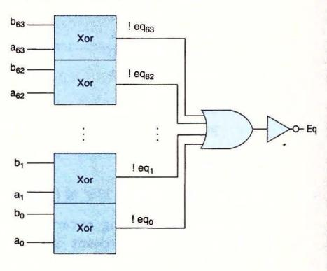

图 4-71 练习题 4.10 的答案

4.13 这些练习使各个阶段的计算更加具体。从目标代码中我们可以看到,指令位于地址 0x016。它由 10 个字节组成,前两个字节为 0x30 和 0xf4。后八个字节是 0x000000000000000000(十进制 128)按 字节反过来的形式。

| 阶段                                                                   | 通用            | 具体                                                                                                                                                                                       |  |  |
|----------------------------------------------------------------------|---------------|------------------------------------------------------------------------------------------------------------------------------------------------------------------------------------------|--|--|
| D) EX                                                                | irmovq V, rB  | irmovq \$128, %rsp                                                                                                                                                                       |  |  |
| 取指 icode:ifun ← M₁[PC] rA:rB ← M₁[PC+1] valC ← M₃[PC+2] valP ← PC+10 |               | icode: ifun $\leftarrow$ M <sub>1</sub> [0x016]=3:0<br>rA:rB $\leftarrow$ M <sub>1</sub> [0x017]=f:4<br>valC $\leftarrow$ M <sub>8</sub> [0x018]=128<br>valP $\leftarrow$ 0x016+10=0x020 |  |  |
| 译码                                                                   |               |                                                                                                                                                                                          |  |  |
| 执行                                                                   | valE ← 0+valC | valE ← 0+128=128                                                                                                                                                                         |  |  |
| 访问                                                                   |               |                                                                                                                                                                                          |  |  |
| 写回                                                                   | R[rB]← valE   | R[%rsp]← valE=128                                                                                                                                                                        |  |  |
| 更新 PC                                                                | PC ← valP     | PC ← valP= 0x020                                                                                                                                                                         |  |  |

这个指令将寄存器%rsp设为128,并将PC加10。

4.14 我们可以看到指令位于地址 0x02c,由两个字节组成,值分别为 0xb0 和 0x00f。pushq指令(第6行)将寄存器%rsp设为了 120,并且将 9 存放在了这个内存位置。

| IV. EV. | 通用                                                              | 具体                                                                                |
|---------|-----------------------------------------------------------------|-----------------------------------------------------------------------------------|
| 阶段      | popq rA                                                         | popq %rax                                                                         |
| 取指      | icode:ifun $\leftarrow M_1[PC]$<br>rA:rB $\leftarrow M_1[PC+1]$ | icode; ifun $\leftarrow M_1[0x02c] = b:0$<br>$rA: rB \leftarrow M_1[0x02d] = 0:f$ |
|         | valP ← PC+2                                                     | $valP \leftarrow 0x02c + 2 = 0x02e$                                               |
| 译码      | valA ← R[%rsp] valB ← R[%rsp]                                   | valA ← R[%rsp]=120<br>valB ← R[%rsp]=120                                          |
| 执行      | valE ← valB+8                                                   | valE ← 120+8=128                                                                  |
| 访存      | valM ← M <sub>8</sub> [valA]                                    | valM ← M <sub>8</sub> [120] = 9                                                   |
| 写回      | R[%rsp]← valE<br>R[rA]← valM                                    | R[%rsp]← 128<br>R[%rsp]← 9                                                        |
| 更新 PC   | PC ← valP                                                       | PC ← 0x02e                                                                        |

该指令将%rax设为9,将%rsp设为128,并将PC加2。

- 4.15 沿着图 4-20 中列出的步骤,这里 rA 等于%rsp,我们可以看到,在访存阶段,指令会将 valA(即 栈指针的原始值)存放到内存中,与我们在 x86-64 中发现的一样。
- 4.16 沿着图 4-20 中列出的步骤,这里 rA 等于%rsp,我们可以看到,两个写回操作都会更新%rsp。因为写 valM 的操作后发生,指令的最终效果会是将从内存中读出的值写人%rsp,就像在 x86-64 中看到的一样。
- 4.17 实现条件传送只需要对寄存器到寄存器的传送做很小的修改。我们简单地以条件测试的结果作为 写回步骤的条件:

| 阶段    | cmovXX rA, rB                                                                                                     |
|-------|-------------------------------------------------------------------------------------------------------------------|
| 取指    | icode:ifun $\leftarrow$ M <sub>1</sub> [PC]<br>rA:rB $\leftarrow$ M <sub>1</sub> [PC+1]<br>valP $\leftarrow$ PC+2 |
| 译码    | valA ← R[rA]                                                                                                      |
| 执行    | valE ← 0+valA<br>Cnd ← Cond(CC, ifun)                                                                             |
| 访存    |                                                                                                                   |
| 写回    | if(Cnd)<br>R[rB]← valE                                                                                            |
| 更新 PC | PC ← valP                                                                                                         |

**4.18** 我们可以看到这条指令位于地址 0x037, 长度为 9 个字节。第一个字节值为 0x80, 而后面 8 个字节是 0x00000000000011 按字节反过来的形式,即调用的目标地址。popq指令(第 7 行)将栈指针设为 128。

| 阶段    | 通用                              | 具体                                        |
|-------|---------------------------------|-------------------------------------------|
| 別权    | call Dest                       | call 0x041                                |
| 取指    | $icode:ifun \leftarrow M_1[PC]$ | icode: ifun $\leftarrow M_1[0x037] = 8:0$ |
|       | valC ← M <sub>8</sub> [PC+1]    | $valC \leftarrow M_8[0x038] = 0x041$      |
|       | valP ← PC+9                     | $valP \leftarrow 0x037 + 9 = 0x040$       |
| 译码    | valB ← R[%rsp]                  | valB ← R[%rsp]=128                        |
| 执行    | valE ← valB+ -8                 | $valE \leftarrow 128 + -8 = 120$          |
| 访存    | M <sub>8</sub> [valE]← valP     | M <sub>8</sub> [120]← 0×040               |
| 写回    | R[%rsp]← valE                   | R[%rsp]← 120                              |
| 更新 PC | PC ← valC                       | PC ← 0x041                                |

这条指令的效果就是将%rsp 设为 120, Ox040 (返回地址)存放到该内存地址,并将 PC 设为 Ox041 (调用的目标地址)。

4. 19 练习题中所有的 HCL 代码都很简单明了,但是试着自己写会帮助你思考各个指令,以及如何处理 它们。对于这个问题,我们只要看看 Y86 <sup>64</sup> 的指令集(图 2) ,确定哪些有常数字段。

```
bool need_valC = 
        icode in { IIRMOVQ, IRMMOVQ, IMRMOVQ, IJXX, ICALL };
```

4 . 20 这段代码类似于 srcA 的代码:

```
word srcB = [ 
] ; 
        icode in { IOPQ, IRMMOVQ, IMRMOVQ } : rB; 
        icode in { IPUSHQ, IPOPQ, ICALL, IRET} : RRSP; 
        1 : RNONE; # Don't need register
```

4 . 21 这段代码类似于 dstE 的代码:

```
word dstM = [ 
        icode in { IMRMOVQ, IPOPQ} : rA; 
        1 : RNONE; # Don't write any register 
] ;
```

- 4 . 22 像在练习题 4. <sup>16</sup> 中发现的那样,为了将从内存中读出的值存放到 rsp, 我们想让通过 端口写 的优先级高于通过 端口
- 4 23 这段代码类似千 aluA 的代码:

```
word aluB = [ 
        icode in { IRMMOVQ, IMRMOVQ, IOPQ, ICALL, 
                       IPUSHQ, IRET , IPOPQ} : valB; 
        icode in { IRRMOVQ, IIRMOVQ} : O; 
        # Other instructions don't need ALU 
] ;
```

4 24 实现条件传送令人吃惊的简单: 条件不满足时,通过将目的寄存器设 RN NE 禁止写寄存器 文件

```
word dstE = [ 
] ; 
        icode in { IRRMOVQ} && Cnd : rB; 
        icode in { IIRMOVQ, IOPQ} : rB; 
        icode in { IPUSHQ, IPOPQ, ICALL, IRET} : RRSP; 
        1 : RNONE; # Don't write any register
```

4 . 25 这段代码类似千 mem\_addr 的代码:

```
word mem_data = [ 
        # Value from register 
        icode in { IRMMOVQ, IPUSHQ} : valA; 
        # Return PC 
        icode == ICALL : valP; 
        # Default: Don't write anything 
] 7
```

4. 26 这段代码类似千 mem\_read 的代码:

```
bool mem_write = icode in { IRMMOVQ, IPUSHQ, ICALL };
```

4 . 27 计算 Stat 字段需要从几个阶段收集状态信息:

```
## Determine instruction status 
word Stat = [ 
] ; 
         imem_error I I dmem_error : SADR; 
         !instr_valid: SINS; 
         icode == !HALT : SHLT; 
         1 : SAOK;
```

- 4.28 这个题目非常有趣,它试图在一组划分中找到优化平衡。它提供了大量的机会来计算许多流水线的吞吐量和延迟。
  - A. 对一个两阶段流水线来说,最好的划分是块 A、B和 C 在第一阶段,块 D、E和 F 在第二阶段。第一阶段的延迟为 170ps,所以整个周期的时长为 170+20=190ps。因此吞吐量为 5.26 GIPS,而延迟为 380ps。
  - B. 对一个三阶段流水线来说,应该使块 A 和 B 在第一阶段,块 C 和 D 在第二阶段,而块 E 和 F 在第三阶段。前两个阶段的延迟均为 110ps,所以整个周期时长为 130ps,而吞吐量为 7.69 GIPS。延迟为 390ps。
  - C. 对一个四阶段流水线来说, 块 A 为第一阶段, 块 B 和 C 在第二阶段, 块 D 是第三阶段, 而块 E 和 F 在第四阶段。第二阶段需要 90ps, 所以整个周期时长为 110ps, 而吞吐量为 9.09 GIPS。 延迟为 440ps。
  - D. 最优的设计应该是五阶段流水线,除了E和F处于第五阶段以外,其他每个块是一个阶段。周期时长为80+20=100ps,吞吐量为大约10.00 GIPS,而延迟为500ps。变成更多的阶段也不会有帮助了,因为不可能使流水线运行得比以100ps为一周期还要快了。
- 4.29 每个阶段的组合逻辑都需要 300/kps, 而流水线寄存器需要 20ps。
  - A. 整个的延迟应该是 300+20kps, 而吞吐量(以 GIPS 为单位)应该是

$$\frac{\frac{1\ 000}{300} + 20}{\frac{300}{k} + 20} = \frac{1\ 000k}{300 + 20k}$$

- B. 当 k 趋近于无穷大, 吞吐量变为 1000/20=50 GIPS。当然, 这也使得延迟为无穷大。
- 这个练习题量化了很深的流水线引起的收益下降。当我们试图将逻辑分割为很多阶段时,流水线 寄存器的延迟成为了一个制约因素。
- 4.30 这段代码非常类似于 SEQ 中相应的代码,除了我们还不能确定数据内存是否会为这条指令产生一个错误信号。
  - # Determine status code for fetched instruction

```
word f_stat = [
    imem_error: SADR;
   !instr_valid : SINS;
   f_icode == IHALT : SHLT;
   1 : SAOK;
```

];

4.31 这段代码只是简单地给 SEQ 代码中的信号名前加上前缀 "d\_"和 "D\_"。

```
word d_dstE = [
```

- 4.32 由于 popq指令(第 4 行)造成的加载/使用冒险, rrmovq指令(第 5 行)会暂停一个周期。当它进入 译码阶段, popq指令处于访存阶段, 使 M\_dstE 和 M\_dstM 都等于%rsp。如果两种情况反过来, 那 么来自 M\_valE 的写回优先级较高,导致增加了的栈指针被传送到 rrmovq指令作为参数。这与练 习题 4.8 中确定的处理 popq %rsp 的惯例不一致。
- 4.33 这个问题让你体验一下处理器设计中一个很重要的任务——为一个新处理器设计测试程序。通常, 我们的测试程序应该能测试所有的冒险可能性,而且一旦有相关不能被正确处理,就会产生错误 的结果。

对于此例,我们可以使用对练习题 4.32 中所示的程序稍微修改的版本:

```
1 irmovq $5, %rdx
2 irmovq $0x100,%rsp
3 rmmovq %rdx,0(%rsp)
4 popq %rsp
5 nop
6 nop
7 rrmovq %rsp,%rax
```

两个 nop 指令会导致当 rrmovq 指令在译码阶段中时, popq 指令处于写回阶段。如果给予处于写回阶段中的两个转发源错误的优先级,那么寄存器 %rax 会设置成增加了的程序计数器,而不是从内存中读出的值。

4.34 这个逻辑只需要检查5个转发源:

```
word d_valB = [
```

4.35 这个改变不会处理条件传送不满足条件的情况,因此将 dstE 设置为 RNONE。即使条件传送并没有发生,结果值还是会被转发到下一条指令。

```
1
```

这段代码将寄存器%rdx 初始化为 0x321。条件数据传送没有发生,所以最后的 addq指令应该把%rdx中的值翻倍,得到 0x642。不过,在修改过的版本中,条件传送源值 0x123 被转发到 ALU的输入 valA,而 valB 正确地得到了操作数值 0x321。两个输入加起来就得到结果 0x444。

4.36 这段代码完成了对这条指令的状态码的计算。

```
## Update the status
word m_stat = [
          dmem_error : SADR;
          1 : M_stat;
]:
```

4.37 设计下面这个测试程序来建立控制组合 A(图 4-67), 并探测是否出了错:

```
# Code to generate a combination of not-taken branch and ret
1
2
             irmovq Stack, %rsp
3
             irmovq rtnp, %rax
             pushq %rax
                              # Set up return pointer
5
             xorq %rax, %rax
                              # Set Z condition code
                              # Not taken (First part of combination)
6
             jne target
             irmovq $1,%rax # Should execute this
8
             halt
9
                              # Second part of combination
    target: ret
             irmovq $2,%rbx # Should not execute this
10
11
             halt
            irmovq $3,%rdx # Should not execute this
12
    rtnp:
             halt
13
     .pos 0x40
14
15
    Stack:
```

设计这个程序是为了出错(例如如果实际上执行了 ret 指令)时,程序会执行一条额外的 l. movq 指令,然后停止。因此,流水线中的错误会导致某个寄存器更新错误。这段代码说明实现测 试程序需要非常小心。它必须建立起可能的错误条件,然后再探测是否有错误发生。

<sup>38</sup> 设计下面这个测试程序用来建立控制组合 (图 4-67) 。模拟器会发现流水线寄存荐的气泡和暂停 控制信号都设置成 的情况,因此我们的测试程序只需要建立它需要发现的组合情况。最大的挑 战在于当处理正确时,程序要做正确的事情。

```
1 # Test instruction that modifies %esp followed by ret 
2irmovq mem,%rbx 
3mrmovq O (%rbx), %rsp # Sets %rsp to point to return point 
4 ret # Returns to return point 
5 halt # 
6rtnpt : irmovq $5, %rsi # Return point 
7 halt 
8 .pos Ox40 
9mem:. quad stack # Holds desired stack pointer 
10 .pos Ox50 
11 stack:. quad rtnpt # Top of stack: Holds return point
```

这个程序使用了内存中两个初始化了的字 第一个字 (mem) 保存着第二个字 (stack ~期望 的栈指针)的地址 第二个字保存着 ret 期望的返回点的地址。这个程序将栈指针加载到 rsp, 并执行 ret 指令

<sup>39</sup> 从图 4-66 我们可以看到,由于加载 使用 险,流水线寄存器 必须暂停

bool D\_stall <sup>=</sup> # Conditions for a load/use hazard

E\_icode in { IMRMOVQ, IPOPQ} && E\_dstM in { d\_srcA, d\_srcB };

4.40 从图 4-66 中可以看到,由千加载 使用冒险,或者由千分支预测错误,流水线寄存器 必须设置 成气泡:

bool E\_bubble =

# Mispredicted branch (E\_icode == IJXX && !e\_Cnd) I I # Conditions for a load/use hazard E\_icode in { IMRMOVQ, IPOPQ} && E\_dstM in { d\_srcA, d\_srcB};

4. <sup>41</sup>这个控制需要检查正在执行的指令的代码,还需要检查流水线中更后面阶段中的异常。

## Should the condition codes be updated? bool set\_cc = E\_icode == IOPQ && # State changes only du ing normal operation !m\_stat in { SADR, SINS, SHLT} && !W\_stat in { SADR, SINS, SHLT };

4. 42 在下一个周期向访存阶段插入气泡需要检查 前周期中访存或者写回阶段中是否有异常。

# Start injecting bubbles as soon as exception passes through memory stage bool M\_bubble = m\_stat in { SADR, SINS, SHLT} I I W\_stat in { SADR, SINS, SHLT };

对于暂停 回阶段,只用检 这个阶段中的指令的状态。如果当访存阶段中有异常指令时我 们也暂停了,那么这条指令就不能进入写回阶段。

bool W\_stall = W\_stat in { SADR, SINS, SHLT };

- 4. 43 此时,预测错误的频率是 o. 35, 得到 mp=O. 20 X O. 35X2 0.14, 而整个 CPI 1. <sup>25</sup> 。看上去收 获非常小,但是如果实现新的分支预测策略的成本不是很高的话,这样做还是值得的。
- 在这个简化的分析中,我们把注意力放在了内循环上,这是估计程序性能的一种很有用的方法 只要数组足够大,花在代码其他部分的时间可以忽略不计 4 4 4

A. 使用条件转移的代码的内循环有 条指 ,当数组元素是 或者为负时,这些指令都要执行,

当数组元素为正时,要执行其中的 条。平均是 8. 条。使用条件传送的代码的内循环有 指令,每次都必须执行。

- B. 用来实现循环闭合的跳转除了当循环中止时之外,都能预测正确。对千非常长的数组,这个预 测错误对性能的影响可以忽略不计。对于基于跳转的代码,其他唯一可能引起气泡的源取决千 数组元素是否为正的条件转移。这会导致两个气泡,但是只在 <sup>50</sup> %的时间里会出现,所以平 均值是 1.0 。在条件传送代码中,没有气泡。
- C. 我们的条件转移代码对于每个元素平均需要 8.5+1.0=9.5 个周期(最好情况要 个周期,最 差情况要 <sup>10</sup> 个周期),而条件传送代码对千所有的情况都需要 8. 个周期。

我们的流水线的分支预测错误处罚只有两个周期 远比对性能更高的处理器中很深的流水 线造成的处罚要小得多 因此,使用条件传送对程序性能的影响不是很大。

CH APTER 5

# 优化程序性能

写程序最主要的目标就是使它在所有可能的情况下都正确工作。一个运行得很快但是 给出错误结果的程序没有任何用处。程序员必须写出清晰简洁的代码,这样做不仅是为了 自己能够看懂代码,也是为了在检查代码和今后需要修改代码时,其他人能够读懂和理解 代码。

另一方面,在很多情况下,让程序运行得快也是一个重要的考虑因素。如果一个程序 要实时地处理视频帧或者网络包,一个运行得很慢的程序就不能提供所需的功能。当一个 计算任务的计算量非常大,需要执行数日或者数周,那么哪怕只是让它运行得快 <sup>20</sup> %也会 产生重大的影响。本章会探讨如何使用几种不同类型的程序优化技术,使程序运行得 更快。

编写高效程序需要做到以下几点:第一,我们必须选择一组适当的算法和数据结构。 第二,我们必须编写出编译器能够有效优化以转换成高效可执行代码的源代码。对于这第 二点,理解优化编译器的能力和局限性是很重要的。编写程序方式中看上去只是一点小小 的变动,都会引起编译器优化方式很大的变化。有些编程语言比其他语言容易优化。 言的有些特性,例如执行指针运算和强制类型转换的能力,使得编译器很难对它进行优 化。程序员经常能够以一种使编译器更容易产生高效代码的方式来编写他们的程序。第三 项技术针对处理运算量特别大的计算,将一个任务分成多个部分,这些部分可以在多核和 多处理器的某种组合上并行地计算。我们会把这种性能改进的方法推迟到第 <sup>12</sup> 章中去讲。 即使是要利用并行性,每个并行的线程都以最高性能执行也是非常重要的,所以无论如何 本章所讲的内容也还是有意义的。

在程序开发和优化的过程中,我们必须考虑代码使用的方式,以及影响它的关键因 素。通常,程序员必须在实现和维护程序的简单性与它的运行速度之间做出权衡。在算法 级上,几分钟就能编写一个简单的插入排序,而一个高效的排序算法程序可能需要一天或 更长的时间来实现和优化。在代码级上,许多低级别的优化往往会降低程序的可读性和模 块性,使得程序容易出错,并且更难以修改或扩展。对于在性能重要的环境中反复执行的 代码,进行大量的优化会比较合适。一个挑战就是尽管做了大量的变化,但还是要维护代 码一定程度的简洁和可读性。

我们描述许多提高代码性能的技术。理想的情况是,编译器能够接受我们编写的任何 代码,并产生尽可能高效的、具有指定行为的机器级程序。现代编译器采用了复杂的分析 和优化形式,而且变得越来越好。然而,即使是最好的编译器也受到妨碍优化的因素 (optimization blocker) 的阻碍,妨碍优化的因素就是程序行为中那些严重依赖于执行环境 的方面。程序员必须编写容易优化的代码,以帮助编译器。

程序优化的第一步就是消除不必要的工作,让代码尽可能有效地执行所期望的任务。 这包括消除不必要的函数调用、条件测试和内存引用。这些优化不依赖千目标机器的任何 具体属性。

为了使程序性能最大化,程序员和编译器都需要一个目标机器的模型,指明如何处理指

令,以及各个操作的时序特性。例如,编译器必须知道时序信息,才能够确定是用一条乘法 指令,还是用移位和加法的某种组合。现代计算机用复杂的技术来处理机器级程序,并行地 执行许多指令,执行顺序还可能不同千它们在程序中出现的顺序。程序员必须理解这些处理 器是如何工作的,从而调整他们的程序以获得最大的速度。基于 Intel AMD 处理器最近的 设计,我们提出了这种机器的一个高级模型。我们还设计了一种图形数据流 (data-flow) 表示 法,可以使处理器对指令的执行形象化,我们还可以利用它预测程序的性能。

了解了处理器的运作,我们就可以进行程序优化的第二步,利用处理器提供的指令级并 (instruction-level parallelism) 能力,同时执行多条指令。我们会讲述几个对程序的变化,降 低一个计算的不同部分之间的数据相关,增加并行度,这样就可以同时执行这些部分了。

我们以对优化大型程序的问题的讨论来结束这一章。我们描述了代码剖析程序 (profiler) 的使用,代码剖析程序是测量程序各个部分性能的工具 这种分析能够帮助找到代码 中低效率的地方,并且确定程序中我们应该着重优化的部分。

在本章的描述中,我们使代码优化看起来像按照某种特殊顺序,对代码进行一系列转 换的简单线性过程。实际上,这项工作远非这么简单。需要相当多的试错法试验。当我们 进行到后面的优化阶段时,尤其是这样,到那时,看上去很小的变化会导致性能上很大的 变化 相反,一些看上去很有希望的技术被证明是无效的。正如后面的例子中会看到的那 样,要确切解释为什么某段代码序列具有特定的执行时间,是很困难的。性能可能依赖于 处理器设计的许多细节特性,而对此我们所知甚少 这也是为什么要尝试各种技术的变形 和组合的另一个原因。

研究程序的汇编代码表示是理解编译器以及产生的代码会如何运行的最有效手段之 一。 仔细研究内循环的代码是一个很好的开端,识别出降低性能的属性,例如过多的内存 引用和对寄存器使用不当 从汇编代码开始,我们还可以预测什么操作会并行执行,以及 它们会如何使用处理器资源 正如我们会看到的,常常通过确认关键路径 (critical path) 决定执行一个循环所需要的时间(或者说,至少是一个时间下界)。所谓关键路径是在循环 的反 执行过程中形成的数据相关链 然后,我们会回过头来修改源代码,试着控制编译 器使之产生更有效率的实现。

大多数编译器,包括 GCC, 一直都在更新和改进,特别是在优化能力方面 一个很 有用的策略是只重写程序到编译器由此就能产生有效代码所需要的程度就好了 这样,能 尽量避免损害代码的可读性、模块性和可移植性,就好像我们使用的是具有最低能力的编 译器。同样,通过测量值和检查生成的汇编代码,反复修改源代码和分析它的性能是很有 帮助的。

对千新手程序员来说,不断修改源代码,试图欺骗编译器产生有效的代码,看起来很 奇怪,但这确实是编写很多高性能程序的方式。比较千另一种方法-~用汇编语 写代 码,这种间接的方法具有的优点是:虽然性能不 定是最好的,但得到的代码仍然能够在 其他机器上运行。

# 5. 1 优化编译器的能力和局限性

现代编译器运用复杂精细的算法来确定一个程序中计算的是什么值,以及它们是被如 何使用的。然后会利用一些机会来简化表达式,在几个不同的地方使用同一个计算,以及 降低一个给定的计算必须被执行的次数。大多数编译器,包括 GCC, 向用户提供了一些 对它们所使用的优化的控制。就像在第 章中讨论过的,最简单的控制就是指定优化级 别。例如,以命令行选项 "-og"调用 GCC 是让 GCC 使用一组基本的优化。以选项 "-01"或更高(如 "-o2"或 "-o3")调用 GCC 会让它使用更大量的优化。这样做可以进一步提高程序的性能,但是也可能增加程序的规模,也可能使标准的调试工具更难对程序进行调试。我们的表述,虽然对于大多数使用 GCC 的软件项目来说,优化级别-o2 已经成为了被接受的标准,但是还是主要考虑以优化级别-o1 编译出的代码。我们特意限制了优化级别,以展示写 C 语言函数的不同方法如何影响编译器产生代码的效率。我们会发现可以写出的 C 代码,即使用-o1 选项编译得到的性能,也比用可能的最高的优化等级编译一个更原始的版本得到的性能好。

编译器必须很小心地对程序只使用安全的优化,也就是说对于程序可能遇到的所有可能的情况,在 C 语言标准提供的保证之下,优化后得到的程序和未优化的版本有一样的行为。限制编译器只进行安全的优化,消除了造成不希望的运行时行为的一些可能的原因,但是这也意味着程序员必须花费更大的力气写出编译器能够将之转换成有效机器代码的程序。为了理解决定一种程序转换是否安全的难度,让我们来看看下面这两个过程:

```
void twiddle1(long *xp, long *yp)
2
3
        *xp += *yp;
        *xp += *yp;
4
    }
5
6
    void twiddle2(long *xp, long *yp)
7
8
9
       *xp += 2* *yp;
    }
10
```

乍一看,这两个过程似乎有相同的行为。它们都是将存储在由指针 yp 指示的位置处的值两次加到指针 xp 指示的位置处的值。另一方面,函数 twiddle2 效率更高一些。它只要求 3 次内存引用(读\*xp,读\*yp,写\*xp),而 twiddle1需要 6 次(2 次读\*xp,2 次读\*yp,2 次写\*xp)。因此,如果要编译器编译过程 twiddle1,我们会认为基于 twiddle2执行的计算能产生更有效的代码。

不过,考虑 xp 等于 yp 的情况。此时,函数 twiddle1 会执行下面的计算:

```
3 *xp += *xp; /* Double value at xp */
4 *xp += *xp; /* Double value at xp */
```

结果是 xp 的值增加 4 倍。另一方面,函数 twiddle2 会执行下面的计算:

```
9 *xp += 2* *xp; /* Triple value at xp */
```

结果是 xp 的值增加 3 倍。编译器不知道 twiddle1 会如何被调用,因此它必须假设参数 xp 和 yp 可能会相等。因此,它不能产生 twiddle2 风格的代码作为 twiddle1 的优化版本。

这种两个指针可能指向同一个内存位置的情况称为内存别名使用(memory aliasing)。在只执行安全的优化中,编译器必须假设不同的指针可能会指向内存中同一个位置。再看一个例子,对于一个使用指针变量 p和 q的程序,考虑下面的代码序列:

```
x = 1000; y = 3000;

*q = y; /* 3000 */

*p = x; /* 1000 */

t1 = *q; /* 1000 or 3000 */
```

t1的计算值依赖于指针 p 和 q 是否指向内存中同一个位置——如果不是, t1 就等于3000,但如果是, t1 就等于1000。这造成了一个主要的妨碍优化的因素,这也是可能严重限制编译器产生优化代码机会的程序的一个方面。如果编译器不能确定两个指针是否指向同一个位置,就必须假设什么情况都有可能,这就限制了可能的优化策略。

○ 练习题 5.1 下面的问题说明了内存别名使用可能会导致意想不到的程序行为的方式。考虑下面这个交换两个值的过程:

```
/* Swap value x at xp with value y at yp */
void swap(long *xp, long *yp)
{
    *xp = *xp + *yp; /* x+y
```

如果调用这个过程时 xp 等于 yp, 会有什么样的效果?

第二个妨碍优化的因素是函数调用。作为一个示例,考虑下面这两个过程:

```
long f();

long func1() {
    return f() + f() + f() + f();

long func2() {
    return 4*f();
}
```

最初看上去两个过程计算的都是相同的结果,但是 func2 只调用 f 一次,而 func1 调用 f 四次。以 func1 作为源代码时,会很想产生 func2 风格的代码。

不讨,考虑下面 f 的代码:

```
long counter = 0;

long f() {
    return counter++;
}
```

这个函数有个副作用——它修改了全局程序状态的一部分。改变调用它的次数会改变程序的行为。特别地,假设开始时全局变量 counter 都设置为 0,对 func1 的调用会返回 0+1+2+3=6,而对 func2 的调用会返回  $4 \cdot 0=0$ 。

大多数编译器不会试图判断一个函数是否没有副作用,如果没有,就可能被优化成像func2中的样子。相反,编译器会假设最糟的情况,并保持所有的函数调用不变。

## 旁注 用内联函数替换优化函数调用

包含函数调用的代码可以用一个称为内联函数替换(inline substitution,或者简称"内联(inlining)")的过程进行优化,此时,将函数调用替换为函数体。例如,我们可以通过替换掉对函数 f 的四次调用,展开 funcl 的代码:

```
/* Result of inlining f in func1 */
long func1in() {
long t = counter++; /* +0 */
```

```
t += counter++;  /* +1 */
t += counter++;  /* +2 */
t += counter++;  /* +3 */
return t;
}
```

这样的转换既减少了函数调用的开销,也允许对展开的代码做进一步优化。例如,编译器可以统一 funclin 中对全局变量 counter 的更新,产生这个函数的一个优化版本:

```
/* Optimization of inlined code */
long funclopt() {
   long t = 4 * counter + 6;
   counter += 4;
   return t;
}
```

对于这个特定的函数 f 的定义,上述代码忠实地重现了 func1 的行为。

GCC的最近版本会尝试进行这种形式的优化,要么是被用命令行选项 "-finline" 指示时,要么是使用优化等级-01或者更高的等级时。遗憾的是,GCC 只尝试在单个文 件中定义的函数的内联。这就意味着它将无法应用于常见的情况,即一组库函数在一个 文件中被定义,却被其他文件内的函数所调用。

在某些情况下,最好能阻止编译器执行内联替换。一种情况是用符号调试器来评估代码,比如GDB,如 3. 10. 2 节描述的一样。如果一个函数调用已经用内联替换优化过了,那么任何对这个调用进行追踪或设置断点的尝试都会失败。还有一种情况是用代码剖析的方式来评估程序性能,如 5. 14. 1 节讨论的一样。用内联替换消除的函数调用是无法被正确剖析的。

在各种编译器中,就优化能力来说,GCC被认为是胜任的,但是并不是特别突出。它完成基本的优化,但是它不会对程序进行更加"有进取心的"编译器所做的那种激进变换。因此,使用GCC的程序员必须花费更多的精力,以一种简化编译器生成高效代码的任务的方式来编写程序。

# 5.2 表示程序性能

我们引入度量标准每元素的周期数(Cycles Per Element, CPE),作为一种表示程序性能并指导我们改进代码的方法。CPE 这种度量标准帮助我们在更细节的级别上理解迭代程序的循环性能。这样的度量标准对执行重复计算的程序来说是很适当的,例如处理图像中的像素,或是计算矩阵乘积中的元素。

处理器活动的顺序是由时钟控制的,时钟提供了某个频率的规律信号,通常用千兆赫兹(GHz),即十亿周期每秒来表示。例如,当表明一个系统有"4GHz"处理器,这表示处理器时钟运行频率为每秒  $4\times10^{\circ}$ 个周期。每个时钟周期的时间是时钟频率的倒数。通常是以纳秒(nanosecond,1 纳秒等于  $10^{-9}$  秒)或皮秒(picosecond,1 皮秒等于  $10^{-12}$  秒)为单位的。例如,一个 4 GHz 的时钟其周期为 0.25 纳秒,或者 250 皮秒。从程序员的角度来看,用时钟周期来表示度量标准要比用纳秒或皮秒来表示有帮助得多。用时钟周期来表示,度量值表示的是执行了多少条指令,而不是时钟运行得有多快。

许多过程含有在一组元素上迭代的循环。例如,图 5-1 中的函数 psum1 和 psum2 计算的都是一个长度为 n 的向量的前置和(prefix sum)。对于向量  $\bar{a} = \langle a_0, a_1, \cdots, a_{n-1} \rangle$ ,前置和  $\bar{p} = \langle p_0, p_1, \cdots, p_{n-1} \rangle$ 定义为

```
p_0 = a_0

p_i = p_{i-1} + a_i, \quad 1 \le i < n (5.1)
```

```
/* Compute prefix sum of vector a */
     void psum1(float a[], float p[], long n)
2
3
     {
         long i;
4
         p[0] = a[0];
5
         for (i = 1; i < n; i++)
6
             p[i] = p[i-1] + a[i];
7
     }
8
9
     void psum2(float a[], float p[], long n)
10
11
         long i;
12
         p[0] = a[0];
13
         for (i = 1; i < n-1; i+=2) {
14
15
             float mid_val = p[i-1] + a[i];
             p[i]
                     = mid_val;
16
             p[i+1] = mid_val + a[i+1];
17
18
19
         /* For even n, finish remaining element */
         if (i < n)
20
             p[i] = p[i-1] + a[i];
21
22
     }
```

图 5-1 前置和函数。这些函数提供了我们如何表示程序性能的示例

函数 psum1 每次迭代计算结果向量的一个元素。第二个函数使用循环展升(loop unrolling)的技术,每次迭代计算两个元素。本章后面我们会探讨循环展开的好处。(关于分析和优化前置和计算的内容请参见练习题 5.11、5.12 和家庭作业 5.19。)

这样一个过程所需要的时间可以用一个常数加上一个与被处理元素个数成正比的因子来描述。例如,图 5-2 是这两个函数需要的周期数关于 n 的取值范围图。使用最小二乘权


图 5-2 前置和函数的性能。两条线的斜率表明每元素的周期数(CPE)的值

(least squares fit) ,我们发现, psuml psum2 的运行时间(用时钟周期为单位)分别近 似于等式 368+9. On 368+6. On 。这两个等式表明对代码计时和初始化过程、准备循环 以及完成过程的开销为 <sup>368</sup> 个周期加上每个元素 6. 9.0 周期的线性因子。对千较大的 的值(比如说大千 200) ,运行时间就会主要由线性因子来决定。这些项中的系数称为每 元素的周期数(简称 CPE) 的有效值。注意,我们更愿意用每个元素的周期数而不是每次循环 的周期数来度量,这是因为像循环展开这样的技术使得我们能够用较少的循环完成计算,而 我们最终关心的是,对于给定的向量长度,程序运行的速度如何。我们将精力集中在减小计 算的 CPE 上。根据这种度扯标准, psum2 CPE 6. o, 优千 CPE 9.0 psuml

## 什么是最小二乘拟合

对于一个数据点 (x1, Yi), …, (x., Yn) 的集合,我们常常试图画一条线,它能最 接近于这些数据代表的 趋势。使用最小二乘拟合,寻找一条形如 y=mx+b 的线, 使得下面这个误差度量最小:

$$E(m,b) = \sum_{i=1,n} (mx_i + b - y_i)^2$$

E(m, b) 分别对 求导,把两个导数函数设置为 o, 进行推导就能得出计算 的算法。

练习题 2 在本章后面,我们会从一个函数开始,生成许多不同的变种,这些变种 保持函数的行为,又具有不同的性能特性。对于其中三个变种,我们发现运行时间 (以时钟周期为单位)可以用下面的函数近似地估计:

版本 1: 60+35n

版本 2: 136+4n

版本 3: 157+1.25n

每个版本在 取什么值时是三个版本中最快的?记住, 总是整数。

# 5. 3 程序示例

为了说明一个抽象的程序是如何被系统 地转换成更有效的代码的,我们将使用一个 基于图 5-3 所示向量数据结构的运行示例。向 榄由两个内存块表示:头部和数据数组。头 部是一个声明如下的结构:

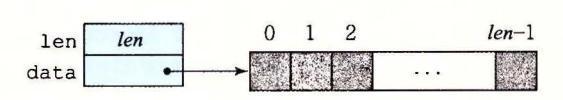

-3 向批的抽象数据类型。向量由头信息 加上指定长度的数组来表示

```
code/optlvec.h 
12345 I* Create abstract data type for vector•/ 
    typedef struct { 
        long len; 
        data_t •data; 
    } vec_rec, •vec_ptr; 
                                                                 code/opt/vec.h
```

这个声明用 data\_t 来表示基本元素的数据类型。在测试中,我们度量代码对千整数 (C 言的 int long) 和浮点数 (C 语言的 float double) 数据的性能。为此,我们会分别 为不同的类型声明编译和运行程序,就像下面这个例子对数据类型 long 一样:

typedef long data t:

我们还会分配一个 len 个 data t类型对象的数组,来存放实际的向量元素。

图 5-4 给出的是一些生成向量、访问向量元素以及确定向量长度的基本过程。一个值得注意的重要特性是向量访问程序 get\_vec\_element,它会对每个向量引用进行边界检查。这段代码类似于许多其他语言(包括 Java)所使用的数组表示法。边界检查降低了程序出错的机会,但是它也会减缓程序的执行。

```
- code/opt/vec.c
     /* Create vector of specified length */
2
     vec_ptr new_vec(long len)
3
 4
         /* Allocate header structure */
5
         vec_ptr result = (vec_ptr) malloc(sizeof(vec rec));
 6
         data_t *data = NULL:
7
         if (!result)
             return NULL; /* Couldn't allocate storage */
         result->len = len:
10
         /* Allocate array */
11
         if (len > 0) {
12
             data = (data_t *)calloc(len, sizeof(data_t));
13
              if (!data) {
14
                  free((void *) result);
15
                  return NULL; /* Couldn't allocate storage */
             7
16
         }
17
18
         /* Data will either be NULL or allocated array */
19
         result->data = data:
20
         return result:
21
     }
22
23
      * Retrieve vector element and store at dest.
      * Return 0 (out of bounds) or 1 (successful)
      */
27
     int get_vec_element(vec_ptr v, long index, data_t *dest)
28
         if (index < 0 \mid \mid index >= v->len)
29
30
             return 0:
31
         *dest = v->data[index]:
32
         return 1;
33
     }
34
35
     /* Return length of vector */
36
     long vec_length(vec_ptr v)
37
     {
38
         return v->len;
39
     7
```

作为一个优化示例,考虑图 5-5 中所示的代码,它使用某种运算,将一个向量中所有的元素合并成一个值。通过使用编译时常数 IDENT 和 OP 的不同定义,这段代码可以重编译成对数据执行不同的运算。特别地,使用声明:

```
#define IDENT 0
#define OP +
```

它对向量的元素求和。使用声明:

```
#define IDENT 1
#define OP *
```

它计算的是向量元素的乘积。

```
/* Implementation with maximum use of data abstraction */
2
     void combine1(vec_ptr v, data_t *dest)
3
     {
4
         long i;
5
6
         *dest = IDENT:
7
         for (i = 0; i < vec_length(v); i++) {
8
             data_t val;
9
             get_vec_element(v, i, &val);
10
             *dest = *dest OP val;
11
         }
12
     }
```

图 5-5 合并运算的初始实现。使用基本元素 IDENT 和合并运算 OP 的不同声明, 我们可以测量该函数对不同运算的性能

在我们的讲述中,我们会对这段代码进行一系列的变化,写出这个合并函数的不同版本。为了评估性能变化,我们会在一个具有 Intel Core i7 Haswell 处理器的机器上测量这些函数的 CPE 性能,这个机器称为参考机。3.1 节中给出了一些有关这个处理器的特性。这些测量值刻画的是程序在某个特定的机器上的性能,所以在其他机器和编译器组合中不保证有同等的性能。不过,我们把这些结果与许多不同编译器/处理器组合上的结果做了比较,发现也非常相似。

我们会进行一组变换,发现有很多只能带来很小的性能提高,而其他的能带来更巨大的效果。确定该使用哪些变换组合确实是编写快速代码的"魔术(black art)"。有些不能提供可测量的好处的组合确实是无效的,然而有些组合是很重要的,它们使编译器能够进一步优化。根据我们的经验,最好的方法是实验加上分析:反复地尝试不同的方法,进行测量,并检查汇编代码表示以确定底层的性能瓶颈。

作为一个起点,下表给出的是 combine1 的 CPE 度量值,它运行在我们的参考机上,尝试了操作(加法或乘法)和数据类型(长整数和双精度浮点数)的不同组合。使用多个不同的程序,我们的实验显示 32 位整数操作和 64 位整数操作有相同的性能,除了涉及除法操作的代码之外。同样,对于操作单精度和双精度浮点数据的程序,其性能也是相同的。因此在表中,我们将只给出整数数据和浮点数据各自的结果。

| 函数       | <b>→</b> 54 | 整数     |        | 浮点数    |        |
|----------|-------------|--------|--------|--------|--------|
|          | 方法          | +      | *      | +      | *      |
| combine1 | 抽象的未优化的     | 22. 68 | 20. 02 | 19. 98 | 20. 18 |
| combine1 | 抽象的-01      | 10.12  | 10.12  | 10. 17 | 11. 14 |

可以看到测量值有些不太精确。对于整数求和的 CPE 数更像是 23.00,而不是 22.68;对于整数乘积的 CPE 数则是 20.0 而非 20.02。我们不会"捏造"数据让它们看起来好看一点儿,只是给出了实际获得的测量值。有很多因素会使得可靠地测量某段代码序列需要的精确周期数这个任务变得复杂。检查这些数字时,在头脑里把结果向上或者向下取整几百分之一个时钟周期会很有帮助。

未经优化的代码是从 C 语言代码到机器代码的直接翻译,通常效率明显较低。简单地使用命令行选项 "-O1",就会进行一些基本的优化。正如可以看到的,程序员不需要做什么,就会显著地提高程序性能——超过两个数量级。通常,养成至少使用这个级别优化的习惯是很好的。(使用-Og 优化级别能得到相似的性能结果。)在剩下的测试中,我们使用-O1 和-O2 级别的优化来生成和测量程序。

## 5.4 消除循环的低效率

可以观察到,过程 combine1 调用函数 vec\_length 作为 for 循环的测试条件,如图 5-5 所示。回想关于如何将含有循环的代码翻译成机器级程序的讨论(见 3. 6. 7 节),每次循环迭代时都必须对测试条件求值。另一方面,向量的长度并不会随着循环的进行而改变。因此,只需计算一次向量的长度,然后在我们的测试条件中都使用这个值。

图 5-6 是一个修改了的版本, 称为 combine2, 它在开始时调用 vec\_length, 并将结果赋值给局部变量 length。对于某些数据类型和操作,这个变换明显地影响了某些数据类型和操作的整体性能,对于其他的则只有很小甚至没有影响。无论是哪种情况,都需要这种变换来消除这个低效率,这有可能成为尝试进一步优化时的瓶颈。

```
/* Move call to vec_length out of loop */
     void combine2(vec_ptr v, data_t *dest)
2
3
     1
         long i;
         long length = vec_length(v);
7
         *dest = IDENT;
         for (i = 0; i < length; i++) {
8
9
             data_t val;
10
             get_vec_element(v, i, &val);
11
             *dest = *dest OP val;
         }
12
     7
13
```

图 5-6 改进循环测试的效率。通过把对 vec\_length 的调用移出循环测试,我们不再需要每次迭代时都执行这个函数

|          | <del>) &gt;+</del> >+ | 整     | 数      | 浮     | 点数     |
|----------|-----------------------|-------|--------|-------|--------|
| 函数       | 方法                    | +     | *      | +     | *      |
| combine1 | 抽象的-01                | 10.12 | 10. 12 | 10.17 | 11. 14 |
| combine2 | 移动 vec_length         | 7.02  | 9.03   | 9.02  | 11.03  |

这个优化是一类常见的优化的一个例子,称为代码移动(code motion)。这类优化包括识别要执行多次(例如在循环里)但是计算结果不会改变的计算。因而可以将计算移动到代码前面不会被多次求值的部分。在本例中,我们将对 vec length 的调用从循环内部移动

到循环的前面。

优化编译器会试着进行代码移动。不幸的是,就像前面讨论过的那样,对于会改变在哪里调用函数或调用多少次的变换,编译器通常会非常小心。它们不能可靠地发现一个函数是否会有副作用,因而假设函数会有副作用。例如,如果 vec\_length 有某种副作用,那么 combine1 和 combine2 可能就会有不同的行为。为了改进代码,程序员必须经常帮助编译器显式地完成代码的移动。

举一个 combine1 中看到的循环低效率的极端例子,考虑图 5-7 中所示的过程 lowerl。这个过程模仿几个学生的函数设计,他们的函数是作为一个网络编程项目的一部分交上来的。这个过程的目的是将一个字符串中所有大写字母转换成小写字母。这个大小写转换形及将 "A" 到 "Z" 范围内的字符。

```
/* Convert string to lowercase: slow */
     void lower1(char *s)
2
 3
 4
         long i;
 5
         for (i = 0; i < strlen(s); i++)
6
7
             if (s[i] >= 'A' && s[i] <= 'Z')
                 s[i] = ('A' - 'a');
8
9
     }
10
11
     /* Convert string to lowercase: faster */
12
     void lower2(char *s)
13
14
         long i;
         long len = strlen(s);
15
16
         for (i = 0; i < len; i++)
17
18
             if (s[i] >= 'A' && s[i] <= 'Z')
                 s[i] = ('A' - 'a');
19
20
     }
21
     /* Sample implementation of library function strlen */
22
23
    /* Compute length of string */
24
     size_t strlen(const char *s)
25
26
         long length = 0;
         while (*s != '\0') {
27
28
             s++;
29
             length++;
30
         }
31
         return length;
32
    7
```

图 5-7 小写字母转换函数。两个过程的性能差别很大

对库函数 strlen 的调用是 lower1 的循环测试的一部分。虽然 strlen 通常是用特殊的 x86 字符串处理指令来实现的,但是它的整体执行也类似于图 5-7 中给出的这个简单版本。因为 C 语言中的字符串是以 null 结尾的字符序列,strlen 必须一步一步地检查这

个序列,直到遇到 null 字符。对于一个长度为 的字符串, strlen 所用的时间与 成正 比。因为对 lowerl 次迭代的每一次都会调用 strlen, 所以 lowerl 的整体运行时间 是字符串长度的二次项,正比千 n1 <sup>o</sup>

如图 5-8 所示(使用 strlen 的库版本),这个函数对各种长度的字符串的实际测 证实了上述分析。 lowerl 的运行时间曲线图随着字符串长度的增加上升得很陡峭(图 5-8a) 5-86 展示了 个不同长度字符串的运行时间(与曲线图中所示的有所不同),每个长度 都是 的幕。可以观察到,对于 lowerl 来说,字符串长度每增加一倍,运行时间都会变 为原来的 倍。这很明显地表明运行时间是二次的 对千 个长度为 048 <sup>576</sup> 的字符串 来说, lowerl 需要超过 <sup>17</sup> 分钟的 CPU 时间。


|        | 字符串长度  |        |        |         |         |         |          |
|--------|--------|--------|--------|---------|---------|---------|----------|
| 函数     | 16 384 | 32 768 | 65 536 | 131 072 | 262 144 | 524 288 | 1048576  |
| lowerl | 0.26   | 1.03   | 4.lO   | 16.41   | 65.62   | 262.48  | 1 049.89 |
| lower2 | 0.0000 | 0.0001 | 0.0001 | 0.0003  | 0.0005  | 0.0010  | 0.0020   |

5-8 小写字母转换函数的性能比较。由于循环结构 的效率比较低,初始代码 lowerl 的运行时间是二次项的。修改过的代码 lower2 的运 行时 间是线性的

除了把对 rlen 的调用移出了循环以外,图 中所示的 lower2 lowerl 样的。 做了这样的变化之后,性能有了显著改善。对于一个长度为 048 <sup>576</sup> 的字符串,这个函数只 需要 2.0 亳秒 lowerl 快了 <sup>500</sup> <sup>000</sup> 多倍。字符串长度每增加一倍,运行时间也会增加 一倍一很显然运行时间是线性的 对千更长的字符串,运行时间的改进会更大

在理想的世界里,编译器会认出循环测试中对 strlen 的每次调用都会返回相同的结 果,因此应该能够把这个调用移出循环。这需要非常成熟完善的分析,因为 strlen 会检 查字符串的元素,而随着 lowerl 的进行,这些值会改变。编译器需要探查,即使字符串 中的字符发生了改变,但是没有字符会从非零变为 ,或是反过来,从零变为非零。即使 是使用内联函数,这样的分析也远远超出了最成熟完善的编译器的能力,所以程序员必须 自已进行这样的变换。

这个示例说明了编程时一个常见的问题,一个看上去无足轻重的代码片断有隐藏的惭 近低效率 (asymptotic inefficiency) 人们可不希望一个小写字母转换函数成为程序性能的 限制因素。通常,会在小数据集上测试和分析程序,对此, lowerl 的性能是足够的。不 过,当程序最终部署好以后,过程完全可能被应用到一个有 <sup>100</sup> 万个字符的串上。突然,

这段无危险的代码变成了一个主要的性能瓶颈。相比较而言,lower2的性能对于任意长度的字符串来说都是足够的。大型编程项目中出现这样问题的故事比比皆是。一个有经验的程序员工作的一部分就是避免引入这样的渐近低效率。

### ☎ 练习题 5.3 考虑下面的函数:

```
long min(long x, long y) { return x < y ? x : y; }
long max(long x, long y) { return x < y ? y : x; }
void incr(long *xp, long v) { *xp += v; }
long square(long x) { return x*x; }</pre>
```

下面三个代码片断调用这些函数:

```
A. for (i = min(x, y); i < max(x, y); incr(&i, 1))
```

假设 x 等于 10, 而 y 等于 100。填写下表,指出在代码片断 A~C 中 4 个函数每个被调用的次数:

| 代码 | min | max | incr | square |
|----|-----|-----|------|--------|
| A. |     |     |      |        |
| В. |     |     |      |        |
| C. |     |     |      |        |

# 5.5 减少过程调用

像我们看到过的那样,过程调用会带来开销,而且妨碍大多数形式的程序优化。从 combine2 的代码(见图 5-6)中我们可以看出,每次循环迭代都会调用 get\_vec\_element 来获取下一个向量元素。对每个向量引用,这个函数要把向量索引 i 与循环边界做比较,很明显会造成低效率。在处理任意的数组访问时,边界检查可能是个很有用的特性,但是对 combine2 代码的简单分析表明所有的引用都是合法的。

作为替代,假设为我们的抽象数据类型增加一个函数 get\_vec\_start。这个函数返回数组的起始地址,如图 5-9 所示。然后就能写出此图中 combine3 所示的过程,其内循环里没有函数调用。它没有用函数调用来获取每个向量元素,而是直接访问数组。一个纯粹主义者可能会说这种变换严重损害了程序的模块性。原则上来说,向量抽象数据类型的使用者甚至不应该需要知道向量的内容是作为数组来存储的,而不是作为诸如链表之类的某种其他数据结构来存储的。比较实际的程序员会争论说这种变换是获得高性能结果的必要步骤。

| -3 *h    | #d+ → N-1-    | 整数    |       | 浮点数   |        |  |
|----------|---------------|-------|-------|-------|--------|--|
| 函数       | 方法            | +     | *     | +     | *      |  |
| combine2 | 移动 vec_length | 7. 02 | 9. 03 | 9. 02 | 11. 03 |  |
| combine3 | 直接数据访问        | 7. 17 | 9. 02 | 9. 02 | 11. 03 |  |

```
code/opt/vec.c
     data_t *get_vec_start(vec_ptr v)
1
2
3
         return v->data;
     7
1
                                                               code/opt/vec.c
     /* Direct access to vector data */
     void combine3(vec_ptr v, data_t *dest)
2
3
4
         long i;
         long length = vec_length(v);
5
         data_t *data = get_vec_start(v);
6
7
         *dest = IDENT:
8
9
         for (i = 0; i < length; i++) {
10
             *dest = *dest OP data[i];
         }
11
     }
12
```

图 5-9 消除循环中的函数调用。结果代码没有显示性能提升,但是它有其他的优化

令人吃惊的是,性能没有明显的提升。事实上,整数求和的性能还略有下降。显然,内循环中的其他操作形成了瓶颈,限制性能超过调用 get\_vec\_element。我们还会再回到这个函数(见 5.11.2 节),看看为什么 combine2 中反复的边界检查不会让性能更差。而现在,我们可以将这个转换视为一系列步骤中的一步,这些步骤将最终产生显著的性能提升。

## 5.6 消除不必要的内存引用

combine3的代码将合并运算计算的值累积在指针 dest 指定的位置。通过检查编译出来的为内循环产生的汇编代码,可以看出这个属性。在此我们给出数据类型为 double,合并运算为乘法的 x86-64 代码:

```
Inner loop of combine3. data_t = double, OP = *
    dest in %rbx, data+i in %rdx, data+length in %rax
    .L17:
                                       loop:
2
      vmovsd (%rbx), %xmm0
                                         Read product from dest
      vmulsd (%rdx), %xmm0, %xmm0
3
                                        Multiply product by data[i]
      vmovsd %xmm0, (%rbx)
                                         Store product at dest
      addq
               $8, %rdx
                                         Increment data+i
               %rax, %rdx
      cmpq
                                         Compare to data+length
               .L17
      jne
                                         If !=, goto loop
```

在这段循环代码中,我们看到,指针 dest 的地址存放在寄存器 %rbx 中,它还改变了代码,将第 i 个数据元素的指针保存在寄存器 %rdx 中,注释中显示为 data+i。每次迭代,这个指针都加 8。循环终止操作通过比较这个指针与保存在寄存器 %rax 中的数值来判断。我们可以看到每次迭代时,累积变量的数值都要从内存读出再写入到内存。这样的读写很浪费,因为每次迭代开始时从 dest 读出的值就是上次迭代最后写入的值。

我们能够消除这种不必要的内存读写,按照图 5-10 中 combine4 所示的方式重写代码。引入一个临时变量 acc,它在循环中用来累积计算出来的值。只有在循环完成之后结果才存放在 dest 中。正如下面的汇编代码所示,编译器现在可以用寄存器%xmm0 来保存

累积值。与 combine3 中的循环相比,我们将每次迭代的内存操作从两次读和一次写减少到只需要一次读。

```
Inner loop of combine4. data_t = double, OP = *
    acc in %xmm0, data+i in %rdx, data+length in %rax
    .L25:
                                        loop:
1
      vmulsd (%rdx), %xmm0, %xmm0
2
                                          Multiply acc by data[i]
               $8, %rdx
3
      addq
                                          Increment data+i
               %rax, %rdx
      cmpq
                                          Compare to data+length
               .L25
      jne
                                          If !=, goto loop
```

```
/* Accumulate result in local variable */
     void combine4(vec_ptr v, data_t *dest)
2
3
4
         long i;
5
         long length = vec_length(v);
6
         data_t *data = get_vec_start(v);
         data_t acc = IDENT;
7
9
         for (i = 0; i < length; i++) {
10
             acc = acc OP data[i];
         }
11
12
         *dest = acc;
13
     }
```

图 5-10 把结果累积在临时变量中。将累积值存放在局部变量 acc(累积器(accumulator)的简写)中, 消除了每次循环迭代中从内存中读出并将更新值写回的需要

我们看到程序性能有了显著的提高,如下表所示:

| •=== # <del>\</del> | +>+      | 整     | 数    | 浮点数   |       |  |
|---------------------|----------|-------|------|-------|-------|--|
| 函数                  | 方法       | +     | *    | +     | *     |  |
| combine3            | 直接数据访问   | 7. 17 | 9.02 | 9. 02 | 11.03 |  |
| combine4            | 累积在临时变量中 | 1. 27 | 3.01 | 3. 01 | 5.01  |  |

所有的时间改进范围从  $2.2 \times 35.7 \times$  ,整数加法情况的时间下降到了每元素只需 1.27 个时钟周期。

可能又有人会认为编译器应该能够自动将图 5-9 中所示的 combine3 的代码转换为在寄存器中累积那个值,就像图 5-10 中所示的 combine4 的代码所做的那样。然而实际上,由于内存别名使用,两个函数可能会有不同的行为。例如,考虑整数数据,运算为乘法,标识元素为1的情况。设 v=[2,3,5]是一个由 3 个元素组成的向量,考虑下面两个函数调用:

```
combine3(v, get_vec_start(v) + 2);
combine4(v, get_vec_start(v) + 2);
```

也就是在向量最后一个元素和存放结果的目标之间创建一个别名。那么,这两个函数的执行如下:

| 函数       | 初始值       | 循环之前      | i = 0     | i = 1     | i = 2      | 最后         |
|----------|-----------|-----------|-----------|-----------|------------|------------|
| combine3 | [2, 3, 5] | [2, 3, 1] | [2, 3, 2] | [2, 3, 6] | [2, 3, 36] | [2, 3, 36] |
| combine4 | [2, 3, 5] | [2, 3, 5] | [2, 3, 5] | [2, 3, 5] | [2, 3, 5]  | [2, 3, 30] |

正如前面讲到过的,combine3 将它的结果累积在目标位置中,在本例中,目标位置就是向量的最后一个元素。因此,这个值首先被设置为1,然后设为2•1=2,然后设为3•2=6。最后一次迭代中,这个值会乘以它自己,得到最后结果36。对于combine4的情况来说,直到最后向量都保持不变,结束之前,最后一个元素会被设置为计算出来的值1•2•3•5=30。

当然,我们说明 combine3 和 combine4 之间差别的例子是人为设计的。有人会说 combine4 的行为更加符合函数描述的意图。不幸的是,编译器不能判断函数会在什么情况下被调用,以及程序员的本意可能是什么。取而代之,在编译 combine3 时,保守的方法是不断地读和写内存,即使这样做效率不太高。

**◯◯ 练习题 5.4** 当用带命令行选项 "-O2"的 GCC 来编译 combine 3 时,得到的代码 CPE 性能远好于使用-O1 时的:

| 函数       | ->->+    | 整数    |      | 浮点数   |       |  |
|----------|----------|-------|------|-------|-------|--|
|          | 方法       | +     | *    | +     | *     |  |
| combine3 | 用-01 编译  | 7. 17 | 9.02 | 9. 02 | 11.03 |  |
| combine3 | 用-02编译   | 1.60  | 3.01 | 3. 01 | 5.01  |  |
| combine4 | 累积在临时变量中 | 1. 27 | 3.01 | 3. 01 | 5.01  |  |

由此得到的性能与 combine4 相当,不过对于整数求和的情况除外,虽然性能已经得到了显著的提高,但还是低于 combine4。在检查编译器产生的汇编代码时,我们发现对内循环的一个有趣的变化:

Inner loop of combine3. data\_t = double, OP = \*. Compiled -O2
dest in %rbx, data+i in %rdx, data+length in %rax
Accumulated product in %xmm0

| 1 | .L22:  |                      | loop:                       |
|---|--------|----------------------|-----------------------------|
| 2 | vmulsd | (%rdx), %xmmO, %xmmO | Multiply product by data[i] |
| 3 | addq   | \$8, %rdx            | Increment data+i            |
| 4 | cmpq   | %rax, %rdx           | Compare to data+length      |
| 5 | vmovsd | %xmm0, (%rbx)        | Store product at dest       |
| 6 | jne    | .L22                 | <pre>If !=, goto loop</pre> |

把上面的代码与用优化等级1产生的代码进行比较:

Inner loop of combine3.  $data_t = double$ , OP = \*. Compiled -01 dest in %rbx, data+i in %rdx, data+length in %rax

```
1
    .L17:
                                        loop:
2
      vmovsd (%rbx), %xmm0
                                         Read product from dest
3
      vmulsd (%rdx), %xmm0, %xmm0
                                        Multiply product by data[i]
4
      vmovsd %xmm0, (%rbx)
                                         Store product at dest
               $8, %rdx
5
      addq
                                         Increment data+i
               %rax, %rdx
                                         Compare to data+length
6
      cmpq
7
      jne
               .L17
                                         If !=, goto loop
```

我们看到,除了指令顺序有些不同,唯一的区别就是使用更优化的版本不含有 vmovsd指令,它实现的是从 dest 指定的位置读数据(第2行)。

- A. 寄存器%xmm0的角色在两个循环中有什么不同?
- B. 这个更优化的版本忠实地实现了 combine3 的 C 语言代码吗(包括在 dest 和向量数据之间使用内存别名的时候)?

C. 解释为什么这个优化保持了期望的行为,或者给出一个例子说明它产生了与使用 较少优化的代码不同的结果。

使用了这最后的变换,至此,对千每个元素的计算,都只需要 1. 25~5 个时钟周期。 比起最开始采用优化时的 9~11 个周期,这是相当大的提高了。现在我们想看看是什么因 素在制约着代码的性能,以及可以如何进一步提高。

# 5. 7 理解现代处理器

到目前为止,我们运用的优化都不依赖于目标机器的任何特性。这些优化只是简单 地降低了过程调用的开销,以及消除了一些重大的"妨碍优化的因素",这些因素会给 优化编译器造成困难。随着试图进一步提高性能,必须考虑利用处理器微体系结构的优 化,也就是处理器用来执行指令的底层系统设计。要想充分提高性能,需要仔细分析程 序,同时代码的生成也要针对目标处理器进行调整。尽管如此,我们还是能够运用一些 基本的优化,在很大一类处理器上产生整体的性能提高。我们在这里公布的详细性能结 果,对其他机器不一定有同样的效果,但是操作和优化的通用原则对各种各样的机器都 适用。

为了理解改进性能的方法,我们需要理解现代处理器的微体系结构。由千大量的晶 体管可以被集成到一块芯片上,现代微处理器采用了复杂的硬件,试图使程序性能最大 化。带来的一个后果就是处理器的实际操作与通过观察机器级程序所察觉到的大相径 庭。在代码级上,看上去似乎是一次执行一条指令,每条指令都包括从寄存器或内存取 值,执行一个操作,并把结果存回到一个寄存器或内存位置。在实际的处理器中,是同时 对多条指令求值的,这个现象称为指令级并行。在某些设计中,可以有 <sup>100</sup> 或更多条指令 在处理中。采用一些精细的机制来确保这种并行执行的行为,正好能获得机器级程序要求 的顺序语义模型的效果。现代微处理器取得的了不起的功绩之一是:它们采用复杂而奇异 的微处理器结构,其中,多条指令可以并行地执行,同时又呈现出一种简单的顺序执行指 令的表象。

虽然现代微处理器的详细设计超出了本书讲授的范围,对这些微处理器运行的原则有 一般性的了解就足够能够理解它们如何实现指令级并行。我们会发现两种下界描述了程序 的最大性能。当一系列操作必须按照严格顺序执行时,就会遇到延迟界限 (latency bound) ,因为在下一条指令开始之前,这条指令必须结束。当代码中的数据相关限制了处 理器利用指令级并行的能力时,延迟界限能够限制程序性能。吞吐量界限 (throughput bound) 刻画了处理器功能单元的原始计算能力。这个界限是程序性能的终极限制。

## 5. 7. 1 整体操作

5-11 是现代微处理器的一个非常简单化的示意图。我们假想的处理器设计是不太 严格地基千近期的 Intel 处理器的结构。这些处理器在工业界称为超标量 (superscalar), 意思是它可以在每个时钟周期执行多个操作,而且是乱序的 (out of order) ,意思就是指令 执行的顺序不 定要与它们在机器级程序中的顺序一致。整个设计有两个主要部分:指令 控制单元 (Instruction Control Unit, ICU) 和执行单元 (Execution Unit, EU) 。前者负责 从内存中读出指令序列,并根据这些指令序列生成一组针对程序数据的基本操作;而后者 执行这些操作。和第 章中研究过的按序 (in-order) 流水线相比,乱序处理器需要更大、 更复杂的硬件,但是它们能更好地达到更高的指令级并行度。

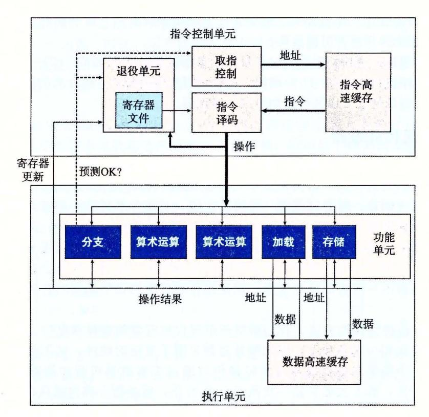

5- 一个乱序处理器的框图。指令控制单元负责从内存中读出指令,并产生一系列基本操 作。然后执行单元完成这些操作,以及指出分支预测是否正确

ICU 从指令高速缓存 (instruction cache) 中读取指令,指令高速缓存是一个特殊的高 速存储器,它包含最近访问的指令。通常, ICU 会在当前正在执行的指令很早之前取指, 这样它才有足够的时间对指令译码,并把操作发送到 EU 。不过,一个问题是当程序遇到 分支气讨,程序有两个可能的前进方向。一种可能会选择分支,控制被传递到分支目标。 另一种可能是,不选择分支,控制被传递到指令序列的下一条指令。现代处理器采用了一 种称为分支预测 (branch prediction) 的技术,处理器会猜测是否会选择分支,同时还预测 分支的目标地址。使用投机执行 (speculative execution) 的技术,处理器会开始取出位千它 预测的分支会跳到的地方的指令,并对指令译码,甚至在它确定分支预测是否正确之前就 开始执行这些操作。如果过后确定分支预测错误,会将状态重新设置到分支点的状态,并 开始取出和执行另一个方向上的指令。标记为取指控制的块包括分支预测,以完成确定取 哪些指令的任务。

指令译码逻辑接收实际的程序指令,并将它们转换成一组基本操作(有时称为微操作)。 每个这样的操作都完成某个简单的计算任务,例如两个数相加,从内存中读数据,或是向内 存写数据。对千具有复杂指令的机器,比如 x86 处理器,一条指令可以被译码成多个操作。 关千指令如何被译码成操作序列的细节,不同的机器都会不同,这个信息可谓是高度机密。 幸运的是,不需要知道某台机器实现的底层细节,我们也能优化自己的程序。

e 术语"分支"专指条件转移指令。对处理器来说,其他可能将控制传送到多个目的地址的指令,例如过程 返回和间接跳转,带来的也是类似的挑战。

在一个典型的 x86 实现中,一条只对寄存器操作的指令,例如 addq %rax,%rdx

会被转化成一个操作 另一方面,一条包括一个或者多个内存引用的指令,例如 addq %rax,8(%rdx)

会产生多个操作,把内存引用和算术运算分开。这条指令会被译码成为 个操作:一个操 作从内存中加载一个值到处理器中,一个操作将加载进来的值加上寄存器 rax 中的值, 而一个操作将结果存回到内存。这种译码逻辑对指令进行分解,允许任务在一组专门的硬 件单元之间进行分割 这些单元可以并行地执行多条指令的不同部分

EU 接收来自取指单元的操作 通常,每个时钟周期会接收多个操作 这些操作会被 分派到一组功能单元中,它们会执行实际的操作。这些功能单元专门用来处理不同类型的 操作。

读写内存是由加载和存储单元实现的。加载单元处理从内存读数据到处理器的操作。 这个单元有一个加法器来完成地址计算。类似,存储单元处理从处理器写数据到内存的操 它也有 个加法器来完成地址计算 如图中所示,加载和存储单元通过数据高速缓存 (data cache) 来访问内存 数据高速缓存是一个高速存储器,存放着最近访问的数据值。

使用投机执行技术对操作求值,但是最终结果不会存放在程序寄存器或数据内存中, 直到处理器能确定应该实际执行这些指令 分支操作被送到 EU, 不是确定分支该往哪里 而是确定分支预测是否正确 如果预测错误, EU 会丢弃分支点之后计算出来的结果。 它还会发信号给分支单元,说预测是错误的,并指出正确的分支目的 在这种情况中,分 支单元开始在新的位置取指。如在 3. 6. 节中看到的,这样的预测错误会导致很大的性能 开销 在可以取出新指令、译码和发送到执行单元之前,要花费一点时间。

5-11 说明不同的功能单元被设计来执行不同的操作。那些标记为执行"算术运算" 的单元通常是专门用来执行整数和浮点数操作的不同组合。随着时间的推移,在单个微处 理器芯片上能够集成的晶体管数最越来越多,后续的微处理器型号都增加了功能单元的数 量以及每个单元能执行的操作组合,还提升了每个单元的性能。由千不同程序间所要求的 操作变化很大,因此,算术运算单元被特意设计成能够执行各种不同的操作。比如,有些 程序也许会涉及整数操作,而其他则要求许多浮点操作。如果一个功能单元专门执行整数 操作,而另一个只能执行浮点操作,那么,这些程序就没有一个能够完全得到多个功能单 元带来的好处了。

举个例子,我们的 Intel Core i7 Haswell 参考机有 个功能单元,编号为 0~7 。下面 部分列出了每个单元的功能:

- 0: 整数运算、浮点乘、整数和浮点数除法、分支
- 1: 整数运算、浮点加、整数乘、浮点乘
- 2: 加载、地址计算
- 3: 加载、地址计算
- 4: 存储
- 5: 整数运算
- 6: 整数运算、分支
- 7: 存储、地址计算

在上面的列表中,"整数运算"是指基本的操作,比如加法、位级操作和移位。乘法

和除法需要更多的专用资源。我们看到存储操作要两个功能单元 一个计算存储地址, 一个实际保存数据。 <sup>12</sup> 节将讨论存储(和加载)操作的机制。

我们可以看出功能单元的这种组合具有同时执行多个同类型操作的潜力。它有 个功 能单元可以执行整数操作, 个单元能执行加载操作, 个单元能执行浮点乘法。稍后我 们将看到这些资源对程序获得最大性能所带来的影响。

ICU 中,退役单元 (retirement unit) 记录正在进行的处理,并确保它遵守机器级程 序的顺序语义。我们的图中展示 一个寄存器文件,它包含整数、浮点数和最近的 SSE AVX 寄存器,是退役单元的一部分,因为退役单元控制这些寄存器的更新。指令译码时, 关千指令的信息被放置在一个先进先出的队列中。这个信息会一直保持在队列中,直到发 生以下两个结果中的一个。首先,一旦一条指令的操作完成了,而且所有引起这条指令的 分支点也都被确认为预测正确,那么这条指令就可以退役 (retired) 了,所有对程序寄存器 的更新都可以被实际执行了。另一方面,如果引起该指令的某个分支点预测错误,这条指 令会被清空 Cflushed) ,丢弃所有计算出来的结果。通过这种方法,预测错误就不会改变程 序的状态了。

正如我们已经描述的那样,任何对程序寄存器的更新都只会在指令退役时才会发生, 只有在处理器能够确信导致这条指令的所有分支都预测正确了,才会这样做。为了加速一 条指令到另一条指令的结果的传送,许多此类信息是在执行单元之间交换的,即图中的 "操作结果"。如图中的箭头所示,执行单元可以直接将结果发送给彼此。这是 4. 5. 节中 简单处理器设计中采用的数据转发技术的更复杂精细版本。

控制操作数在执行单元间传送的最常见的机制称为寄存器重命名 (register renaming) 。当 一条更新寄存器 的指令译码时,产生标记 t, 得到一个指向该操作结果的唯一的标识符。 条目 (r, t) 被加入到一张表中,该表维护着每个程序寄存器 与会更新该寄存器的操作的标 之间的关联。当随后以寄存器 作为操作数的指令译码时,发送到执行单元的操作会包 作为操作数源的值。当某个执行单元完成第一个操作时,会生成一个结果 (v, t) ,指明 标记为 的操作产生值 。所有等待 作为源的操作都能使用 作为源值,这就是一种形式的 数据转发。通过这种机制,值可以从一个操作直接转发到另一个操作,而不是写到寄存器文 件再读出来,使得第二个操作能够在第一个操作完成后尽快开始。重命名表只包含关于有未 进行写操作的寄存器条目 当一条被译码的指令需要寄存器 r, 而又没有标记与这个寄存器 相关联,那么可以直接从寄存器文件中获取这个操作数。有了寄存器重命名,即使只有在处 理器确定了分支结果之后才能更新寄存器,也可以预测着执行操作的整个序列。

# 乱序 理的历史

乱序处理最早是在 <sup>1964</sup> Control Data Corporation <sup>6600</sup> 处理器中实现的。指令 由十个不同的功能单元处理,每个单元都能独立地运行。在那个时候,这种时钟频率为 lOMhz 的机器被认为是科学计算最好的机器。

<sup>1966</sup> 年, IBM 首先是在 IBM <sup>360</sup> <sup>91</sup> 实现了乱序处理,但只是用来执行浮点指 令。在大约 <sup>25</sup> 年的时间里,乱序处理都被认为是 项异乎寻常的技术,只在追求尽可 能高性能的机器中使用,直到 <sup>1990</sup> IBM RS <sup>6000</sup> 系列工作站中重新引入了这项技 种设计成 IBM Motorola PowerPC 系列的基础, <sup>1993</sup> 年引 的型号 601, 个使用乱序处理的单芯片微处理器。 ntel <sup>1995</sup> 年的 PentiumPro 型号中引入 了乱序处理, Pent umPro 的底层微体系结构类似于我们的参考机。 }

# 5. 7. 2 功能单元的性能

5-12 提供了 Intel Core i7 Haswell 参考机的一些算术运算的性能,有的是测量出来 的,有的是引用 Intel 的文献 [49 。这些时间对于其他处理器来说也是具有代表性的。每 个运算都是由以下这些数值来刻画的:一个是延迟 (latency) ,它表示完成运算所需要的总 时间;另一个是发射时间 (issue time) ,它表示两个连续的同类型的运算之间需要的最小 时钟周期数;还有一个是容量 (capacity) ,它表示能够执行该运算的功能单元的数量。

| 运算 |        | 整数     |    |         | 浮点数    |    |
|----|--------|--------|----|---------|--------|----|
|    | 延迟     | 发射     | 容显 | 延迟      | 发射     | 容蜇 |
| 加法 | 1      | I      | 4  | 3       | I      | I  |
| 乘法 | 3      | I      | I  | 5       | I      | 2  |
| 除法 | 3 ~ 30 | 3 ~ 30 | I  | 3 ~ 1 5 | 3 ~ 15 | I  |

5- 参考机的操作的延迟、发射时间和容量特性。延迟表明执行实际运算所需要的时钟周期总数, 而发射时间表明两次运算之间间隔的最小周期数。容最表明同时能发射多少个这样的操作。除法 需要的时间依赖于数据值

我们看到,从整数运算到浮点运算,延迟是增加的 还可以看到加法和乘法运算的发 射时间都为 1, 意思是说在每个时钟周期,处理器都可以开始一条新的这样的运算。这种 很短的发射时间是通过使用流水线实现的。流水线化的功能单元实现为 系列的阶段 (stage) ,每个阶段完成一部分的运算。例如, 个典型的浮点加法器包含 个阶段(所以 有三个周期的延迟):一个阶段处理指数值,一个阶段将小数相加,而另一个阶段对结果 进行舍入。算术运算可以连续地通过各个阶段,而不用等待一个操作完成后再开始下一 个。只有当要执行的运算是连续的、逻辑上独立的时候,才能利用这种功能。发射时间为 的功能单元被称为完全流水线化的 (fully pipelined) :每个时钟周期可以开始一个新的运 算。出现容量大于 的运算是由千有多个功能单元,就如前面所述的参考机 样。

我们还看到,除法器(用于整数和浮点除法,还用来计算浮点平方根)不是完全流水线 化的—— 它的发射时间等于它的延迟。这就意味着在开始 条新运算之前,除法器必须完 成整个除法。我们还看到,对千除法的延迟和发射时间是以范围的形式给出的,因为某些 被除数和除数的组合比其他的组合需要更多的步骤。除法的长延迟和长发射时间使之成为 了一个相对开销很大的运算

表达发射时间的一种更常见的方法是指明这个功能单元的最大吞吐量,定义为发射时 间的倒数。一个完全流水线化的功能单元有最大的吞吐量,每个时钟周期一个运算,而发 射时间较大的功能单元的最大吞吐量比较小。具有多个功能单元可以进一步提高吞吐鼠。 对一个容量为 C, 发射时间为 的操作来说,处理器可能获得的吞吐量为每时钟周期 C/I 个操作。比如,我们的参考机可以每个时钟周期执行两个浮点乘法运算 我们将看到如何 利用这种能力来提高程序的性能。

电路设计者可以创建具有各种性能特性的功能单元。创建一个延迟短或使用流水线的 单元需要较多的硬件,特别是对于像乘法和浮点操作这样比较复杂的功能。因为微处理器 芯片上,对千这些单元,只有有限的空间,所以 CPU 设计者必须小心地平衡功能单元的 数最和它们各自的性能,以获得最优的整体性能 设计者们评估许多不同的基准程序,将 大多数资源用千最关键的操作。如图 5-12 表明的那样,在 Core i7 Haswell 处理器的设计 中,整数乘法、浮点乘法和加法被认为是重要的操作,即使为了获得低延迟和较高的流水

线化程度需要大量的硬件。另一方面,除法相对不太常用,而且要想实现低延迟或完全流 水线化是很困难的。

这些算术运算的延迟、发射时间和容量会影响合并函数的性能。我们用 CPE 值的两个基本界限来描述这种影响:

| B1 172 | 整    | 数    | 浮点数  |      |  |
|--------|------|------|------|------|--|
| 界限     | +    | *    | +    | *    |  |
| 延迟     | 1.00 | 3.00 | 3.00 | 5.00 |  |
| 吞吐量    | 0.50 | 1.00 | 1.00 | 0.50 |  |

延迟界限给出了任何必须按照严格顺序完成合并运算的函数所需要的最小 CPE 值。根据 功能单元产生结果的最大速率,吞吐量界限给出了 CPE 的最小界限。例如,因为只有一个整数乘法器,它的发射时间为 1 个时钟周期,处理器不可能支持每个时钟周期大于 1 条乘法的速度。另一方面,四个功能单元都可以执行整数加法,处理器就有可能持续每个周期执行 4 个操作的速率。不幸的是,因为需要从内存读数据,这造成了另一个吞吐量界限。两个加载单元限制了处理器每个时钟周期最多只能读取两个数据值,从而使得吞吐量界限为 0.50。我们会展示延迟界限和吞吐量界限对合并函数不同版本的影响。

### 5.7.3 处理器操作的抽象模型

作为分析在现代处理器上执行的机器级程序性能的一个工具,我们会使用程序的数据流(data-flow)表示,这是一种图形化的表示方法,展现了不同操作之间的数据相关是如何限制它们的执行顺序的。这些限制形成了图中的关键路径(critical path),这是执行一组机器指令所需时钟周期数的一个下界。

在继续技术细节之前,检查一下函数 combine4 的 CPE 测量值是很有帮助的,到目前为止 combine4 是最快的代码:

| 函数       | 方法       | 整数    |       | 浮点数   |       |
|----------|----------|-------|-------|-------|-------|
|          |          | +     | *     | +     | *     |
| combine4 | 累积在临时变量中 | 1. 27 | 3. 01 | 3. 01 | 5. 01 |
| 延迟界限     |          | 1.00  | 3.00  | 3.00  | 5.00  |
| 吞吐量界限    |          | 0.50  | 1.00  | 1.00  | 0.50  |

我们可以看到,除了整数加法的情况,这些测量值与处理器的延迟界限是一样的。这不是巧合——它表明这些函数的性能是由所执行的求和或者乘积计算主宰的。计算 n 个元素的乘积或者和需要大约  $L \cdot n + K$  个时钟周期,这里 L 是合并运算的延迟,而 K 表示调用函数和初始化以及终止循环的开销。因此,CPE 就等于延迟界限 L。

#### 1. 从机器级代码到数据流图

程序的数据流表示是非正式的。我们只是想用它来形象地描述程序中的数据相关是如何主宰程序的性能的。以 combine4(图 5-10)为例来描述数据流表示法。我们将注意力集中在循环执行的计算上,因为对于大向量来说,这是决定性能的主要因素。我们考虑类型为 double 的数据、以乘法作为合并运算的情况,不过其他数据类型和运算的组合也有几乎一样的结构。这个循环编译出的代码由 4 条指令组成,寄存器%rdx 存放指向数组 data中第 i 个元素的指针,%rax 存放指向数组末尾的指针,而%xmm0 存放累积值 acc。

```
Inner loop of combine4. data_t = double, OP = *
    acc in %xmm0, data+i in %rdx, data+length in %rax
1
                                          loop:
      vmulsd
                (%rdx), %xmm0, %xmm0
2
                                            Multiply acc by data[i]
               $8, %rdx
3
      addq
                                            Increment data+i
               %rax, %rdx
4
      cmpq
                                            Compare to data+length
                .L25
5
      ine
                                            If != , goto loop
```

如图 5-13 所示,在我们假想的处理器设计中,指令译码器会把这 4 条指令扩展成为一系列的五步操作,最开始的乘法指令被扩展成一个 load 操作,从内存读出源操作数,和一个 mul 操作,执行乘法。

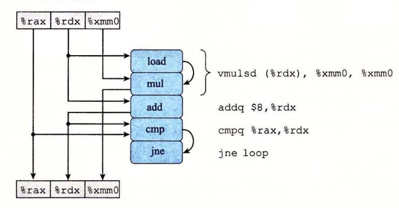

图 5-13 combine4的内循环代码的图形化表示。指令动态地被翻译成一个或两个操作,每个操作从其他操作或寄存器接收值,并且为其他操作和寄存器产生值。我们给出最后一条指令的目标为标号 loop。它跳转到给出的第一条指令

作为生成程序数据流图表示的一步,图 5-13 左手边的方框和线给出了各个指令是如何使用和更新寄存器的,顶部的方框表示循环开始时寄存器的值,而底部的方框表示最后寄存器的值。例如,寄存器%rax 只被 cmp 操作作为源值,因此这个寄存器在循环结束时有着同循环开始时一样的值。另一方面,在循环中,寄存器%rdx 既被使用也被修改。它的初始值被 load 和 add 操作使用;它的新值由 add 操作产生,然后被 cmp 操作使用。在循环中,mul 操作首先使用寄存器%xmm0 的初始值作为源值,然后会修改它的值。

图 5-13 中的某些操作产生的值不对应于任何寄存器。在右边,用操作间的弧线来表示。load操作从内存读出一个值,然后把它直接传递到 mul 操作。由于这两个操作是通过对一条 vmulsd 指令译码产生的,所以这个在两个操作之间传递的中间值没有与之相关联的寄存器。cmp 操作更新条件码,然后 ine 操作会测试这些条件码。

对于形成循环的代码片段,我们可以将访问到的寄存器分为四类:

只读:这些寄存器只用作源值,可以作为数据,也可以用来计算内存地址,但是在循环中它们是不会被修改的。循环 combine4 的只读寄存器是%rax。

只写:这些寄存器作为数据传送操作的目的。在本循环中没有这样的寄存器。

局部:这些寄存器在循环内部被修改和使用,迭代与迭代之间不相关。在这个循环中,条件码寄存器就是例子: cmp 操作会修改它们,然后 jne 操作会使用它们,不过这种相关是在单次迭代之内的。

循环:对于循环来说,这些寄存器既作为源值,又作为目的,一次迭代中产生的值会在另一次迭代中用到。可以看到,%rdx和%xmm0是 combine4的循环寄存器,对应于程序

da a+i ace

正如我们会看到的,循环寄存器之间的操作链决定了限制性能的数据相关。

5-14 是对图 <sup>13</sup> 的图形化表示的进一步改进,目标是只给出影响程序执行时间的操 作和数据相关 在图 5-14a 中看到,我们重新排列了操作符,更清晰地表明了从顶部源寄存 器(只读寄存器和循环寄存器)到底部目的寄存器(只写寄存器和循环寄存器)的数据流。

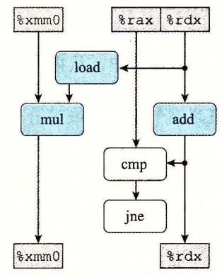

a) 新排列了图5-13 的操作符, 地表明了数据相

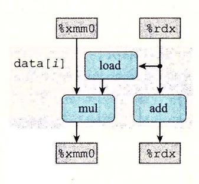

b) 操作在一次迭代中使用某些值, 产生出在下一次迭代中需要的新值

5- combi e4 的操作抽象成数据流图

在图 5-14a 中,如果操作符不属千某个循 环寄存器之间的相关链,那么就把它们标识成 白色。例如,比较 (cmp) 和分支 (jne) 操作不直 接影响程序中的数据流。假设指令控制单元预 测会选择分支,因此程序会继续循环。比较和 分支操作的目的是测试分支条件,如果不选择 分支的话,就通知 ICU 。我们假设这个检查能 够完成得足够快,不会减慢处理器的执行。

在图 5-14b 中,消除了左边标识为白色的 操作符,而且只保留了循环寄存器。剩下的 是一个抽象的模板,表明的是由千循环的一 次迭代在循环寄存器中形成的数据相关。在 这个图中可以看到,从一次迭代到下 次迭 代有两个数据相关 在一边,我们看到存储 在寄存器%xrnrnO 中的程序值 ace 的连续的值之 间有相关。通过将 ace 的旧值乘以一个数据 元素,循环计算出 ace 的新值,这个数据元素 是由 load 操作产生的。在另一边,我们看到循 环索引 的连续的值之间有相关。每次迭代中, 的旧值用来计算 load 操作的地址,然后 add 操作也会增加它的值,计算出新值

5-15 给出了函数 combine4 内循环的 次迭代的数据流表示。可以看出,简单地重

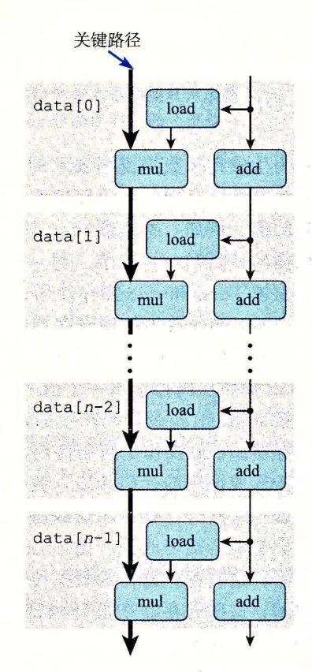

5-15 combine4 的内循环的 次迭代计算的 数据流表示。乘法操作的序列形成了恨 制程序性能的关键路径