复图 5-14 右边的模板 n 次,就能得到这张图。我们可以看到,程序有两条数据相关链,分别对应于操作 mu1 和 add 对程序值 acc 和 data+i 的修改。假设浮点乘法延迟为 5 个周期,而整数加法延迟为 1 个周期,可以看到左边的链会成为关键路径,需要 5n 个周期执行。右边的链只需要 n 个周期执行,因此,它不会制约程序的性能。

图 5-15 说明在执行单精度浮点乘法时,对于 combine4,为什么我们获得了等于 5 个周期延迟界限的 CPE。当执行这个函数时,浮点乘法器成为了制约资源。循环中需要的其他操作——控制和测试指针值 data+i,以及从内存中读数据——与乘法器并行地进行。每次后继的 acc 的值被计算出来,它就反馈回来计算下一个值,不过只有等到 5 个周期后才能完成。

其他数据类型和运算组合的数据流与图 5-15 所示的内容一样,只是在左边的形成数据相关链的数据操作不同。对于所有情况,如果运算的延迟,L 大于 1,那么可以看到测量出来的 CPE 就是 L,表明这个链是制约性能的关键路径。

#### 2. 其他性能因素

另一方面,对于整数加法的情况,我们对 combine4 的测试表明 CPE 为 1.27,而根据沿着图 5-15 中左边和右边形成的相关链预测的 CPE 为 1.00,测试值比预测值要慢。这说明了一个原则,那就是数据流表示中的关键路径提供的只是程序需要周期数的下界。还有其他一些因素会限制性能,包括可用的功能单元的数量和任何一步中功能单元之间能够传递数据值的数量。对于合并运算为整数加法的情况,数据操作足够快,使得其他操作供应数据的速度不够快。要准确地确定为什么程序中每个元素需要 1.27 个周期,需要比公开可以获得的更详细的硬件设计知识。

总结一下 combine4 的性能分析: 我们对程序操作的抽象数据流表示说明, combine4 的关键路径长  $L \cdot n$  是由对程序值 acc 的连续更新造成的,这条路径将 CPE 限制为最多 L。除了整数加法之外,对于所有的其他情况,测量出的 CPE 确实等于 L,对于整数加法,测量出的 CPE 为 1.27 而不是根据关键路径的长度所期望的 1.00。

看上去,延迟界限是基本的限制,决定了我们的合并运算能执行多快。接下来的任务 是重新调整操作的结构,增强指令级并行性。我们想对程序做变换,使得唯一的限制变成 吞吐量界限,得到接近于 1.00 的 CPE。

**[23] 练习题** 5.5 假设写一个对多项式求值的函数,这里,多项式的次数为n,系数为 $a_0$ , $a_1$ ,…, $a_n$ 。对于值x,我们对多项式求值,计算

$$a_0 + a_1 x + a_2 x^2 + \dots + a_n x^n \tag{5.2}$$

这个求值可以用下面的函数来实现,参数包括一个系数数组 a、值 x 和多项式的次数 degree(等式(5.2)中的值 n)。在这个函数的一个循环中,我们计算连续的等式的项,以及连续的 x 的幂:

```
double poly(double a[], double x, long degree)
     {
2
3
         long i;
        double result = a[0];
4
         double xpwr = x; /* Equals x^i at start of loop */
5
        for (i = 1; i <= degree; i++) {
6
             result += a[i] * xpwr;
7
8
             xpwr = x * xpwr;
9
10
        return result;
    }
11
```

- A. 对于次数 n, 这段代码执行多少次加法和多少次乘法运算?
- B. 在我们的参考机上,算术运算的延迟如图 5-12 所示,我们测量了这个函数的 CPE 等于 5.00。根据由于实现函数第 7~8 行的操作迭代之间形成的数据相关,解释为什么会得到这样的 CPE。
- 禁习题 5.6 我们继续探索练习题 5.5 中描述的多项式求值的方法。通过采用 Horner 法(以英国数学家 William G. Horner(1786—1837)命名)对多项式求值,我们可以减少乘法的数量。其思想是反复提出 x 的幂,得到下面的求值。

$$a_0 + x(a_1 + x(a_2 + \dots + x(a_{n-1} + xa_n) \dots))$$
 (5.3)

使用 Horner 法, 我们可以用下面的代码实现多项式求值:

```
/* Apply Horner's method */
double polyh(double a[], double x, long degree)
{
    long i;
    double result = a[degree];
    for (i = degree-1; i >= 0; i--)
        result = a[i] + x*result;
    return result;
}
```

- A. 对于次数 n, 这段代码执行多少次加法和多少次乘法运算?
- B. 在我们的参考机上,算术运算的延迟如图 5-12 所示,测量这个函数的 CPE 等于 8.00。根据由于实现函数第 7 行的操作迭代之间形成的数据相关,解释为什么会 得到这样的 CPE。
- C. 请解释虽然练习题 5.5 中所示的函数需要更多的操作,但是它是如何运行得更快的。

### 5.8 循环展开

循环展开是一种程序变换,通过增加每次迭代计算的元素的数量,减少循环的迭代次数。 psum2 函数(见图 5-1)就是这样一个例子,其中每次迭代计算前置和的两个元素,因而将需要的迭代次数减半。循环展开能够从两个方面改进程序的性能。首先,它减少了不直接有助于程序结果的操作的数量,例如循环索引计算和条件分支。第二,它提供了一些方法,可以进一步变化代码,减少整个计算中关键路径上的操作数量。在本节中,我们会看一些简单的循环展开,不做任何进一步的变化。

图 5-16 是合并代码的使用 " $2\times1$  循环展开"的版本。第一个循环每次处理数组的两个元素。也就是每次迭代,循环索引 i 加 2,在一次迭代中,对数组元素 i 和 i+1 使用合并运算。

一般来说,向量长度不一定是 2 的倍数。想要使我们的代码对任意向量长度都能正确工作,可以从两个方面来解释这个需求。首先,要确保第一次循环不会超出数组的界限。对于长度为 n 的向量,我们将循环界限设为 n-1。然后,保证只有当循环索引 i 满足 i < n-1 时才会执行这个循环,因此最大数组索引 i+1 满足 i+1 < (n-1)+1=n。

把这个思想归纳为对一个循环按任意因子 k 进行展开,由此产生  $k \times 1$  循环展开。为此,上限设为 n-k+1,在循环内对元素 i 到 i+k-1 应用合并运算。每次迭代,循环索引 i 加 k。那么最大循环索引 i+k-1 会小于 n。要使用第二个循环,以每次处理一个元素的方式处理向量的最后几个元素。这个循环体将会执行  $0\sim k-1$  次。对于 k=2,我们能用一个简单的条件语句,可选地增加最后一次迭代,如函数 psum2(图 5-1)所示。对于 k>2,最后的这些情

况最好用一个循环来表示,所以对 k=2 的情况,我们同样也采用这个编程惯例。我们称这种变换为" $k\times1$  循环展开",因为循环展开因子为 k,而累积值只在单个变量 acc 中。

```
/* 2 x 1 loop unrolling */
2
     void combine5(vec_ptr v, data_t *dest)
3
         long i;
4
         long length = vec_length(v);
5
         long limit = length-1;
         data_t *data = get_vec_start(v);
         data_t acc = IDENT;
8
         /* Combine 2 elements at a time */
10
         for (i = 0; i < limit; i+=2) {
11
             acc = (acc OP data[i]) OP data[i+1];
12
         }
13
14
         /* Finish any remaining elements */
15
         for (; i < length; i++) {
16
17
             acc = acc OP data[i];
18
         }
19
         *dest = acc;
20
     7
```

图 5-16 使用 2×1 循环展开。这种变换能减小循环开销的影响

### 🔯 练习题 5.7 修改 combine5 的代码, 展开循环 k=5 次。

当测量展开次数 k=2 (combine5)和 k=3 的展开代码的性能时,得到下面的结果:

| -Z-#+    | 方法     | 整数    |      | 浮     | 点数    |
|----------|--------|-------|------|-------|-------|
| .函数      | 万法     | +     | *    | +     | *     |
| combine4 | 无展开    | 1. 27 | 3.01 | 3. 01 | 5. 01 |
| combine5 | 2×1 展开 | 1.01  | 3.01 | 3. 01 | 5.01  |
|          | 3×1 展开 | 1.01  | 3.01 | 3. 01 | 5.01  |
| 延迟界限     |        | 1.00  | 3.00 | 3.00  | 5.00  |
| 吞吐量界限    |        | 0.50  | 1.00 | 1.00  | 0.50  |

我们看到对于整数加法,CPE 有所改进,得到的延迟界限为 1.00。会有这样的结果是得益于减少了循环开销操作。相对于计算向量和所需要的加法数量,降低开销操作的数量,此时,整数加法的一个周期的延迟成为了限制性能的因素。另一方面,其他情况并没有性能提高——它们已经达到了其延迟界限。图 5-17 给出了当循环展开到 10 次时的 CPE 测量值。对于展开 2 次和 3 次时观察到的趋势还在继续——没有一个低于其延迟界限。

要理解为什么  $k \times 1$  循环展开不能将性能改进到超过延迟界限,让我们来查看一下 k = 2 时,combine5 内循环的机器级代码。当类型 data\_t 为 double,操作为乘法时,生成如下代码:

```
Inner loop of combine5. data_t = double, OP = *\ni in %rdx, data %rax, limit in %rbp, acc in %xmm0

1 .L35: loop:
2  vmulsd (%rax,%rdx,8), %xmm0, %xmm0
```

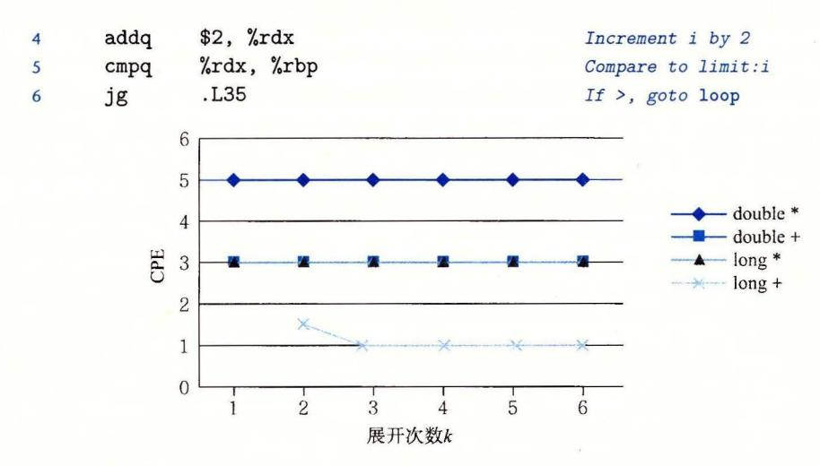

图 5-17 不同程度 k×1 循环展开的 CPE 性能。这种变换只改进了整数加法的性能

我们可以看到,相比 combine4 生成的基于指针的代码,GCC 使用了 C 代码中数组引用的更加直接的转换<sup>⑤</sup>。循环索引 i 在寄存器%rdx 中,data 的地址在寄存器%rax 中。和前面一样,累积值 acc 在向量寄存器%xmm0 中。循环展开会导致两条 vmulsd 指令——条将 data[i]加到 acc 上,第二条将 data[i+1]加到 acc 上。图 5-18 给出了这段代码的图形化表示。每条 vmulsd 指令被翻译成两个操作:一个操作是从内存中加载一个数组元素,另一个是把这个值乘以已有的累积值。这里我们看到,循环的每次执行中,对寄存器%xmm0 读和写两次。可以重新排列、简化和抽象这张图,按照图 5-19a 所示的过程得到图 5-19b 所示的模板。然后,把这个模板复制 n/2 次,给出一个长度为 n 的向量的计算,得到如图 5-20 所示的数据流表示。在此我们看到,这张图中关键路径还是 n 个 mul操作——迭代次数减半了,但是每次迭代中还是有两个顺序的乘法操作。这个关键路径是循环没有展开代码的性能制约因素,而它仍然是  $k \times 1$  循环展开代码的性能制约因素。

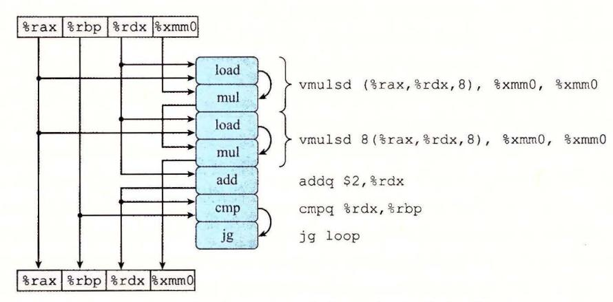

图 5-18 combine5 内循环代码的图形化表示。每次迭代有两条 vmulsd 指令, 每条指令被翻译成一个 load 和一个 mul 操作

<sup>○</sup> GCC 优化器产生一个函数的多个版本,并从中选择它预测会获得最佳性能和最小代码量的那一个。其结果就是,源代码中微小的变化就会生成各种不同形式的机器码。我们已经发现对基于指针和基于数组的代码的选择不会影响在参考机上运行的程序的性能。

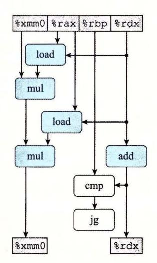

a) 重新排列、简化和抽象图5-18 出连 迭代之间的数据相关

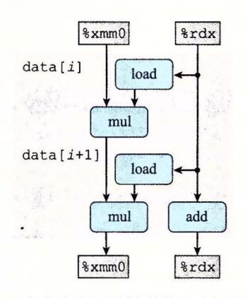

b) 次迭代必须顺序地执行两个乘法

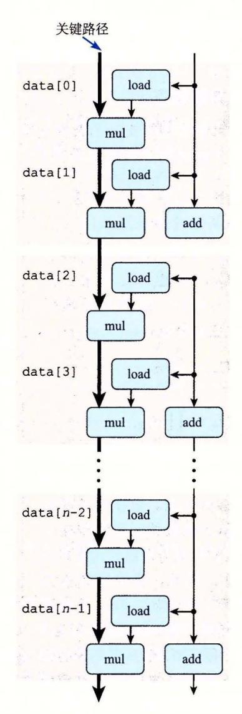

5-19 combines 的操作抽象成 <sup>20</sup> combines 对一个长度为 的向址进行操作的数据流 数据流图 表示。虽然循环展开了 次,但是关键路径上还是 mul 操作

# 让编译器展开循环

编译器可以很容易地执行循环展开。只要优化级别设置得足够高,许多编译器都能 例行公事地做到这一点。用优化等级 或更高等级调用 GCC, 它就会执行循环展开。

# 5. 9 提高并行性

在此,程序的性能是受运算单元的延迟限制的。不过,正如我们表明的,执行加法和乘 法的功能单元是完全流水线化的,这意味着它们可以每个时钟周期开始一个新操作,并且有 些操作可以被多个功能单元执行。硬件具有以更高速率执行乘法和加法的潜力,但是代码不 能利用这种能力,即使是使用循环展开也不能,这是因为我们将累积值放在一个单独的变量 ace 中。在前面的计算完成之前,都不能计算 ace 的新值。虽然计算 ace 新值的功能单元能

够每个时钟周期开始一个新的操作,但是它只会每L个周期开始一条新操作,这里L是合并操作的延迟。现在我们要考察打破这种顺序相关,得到比延迟界限更好性能的方法。

#### 5.9.1 多个累积变量

对于一个可结合和可交换的合并运算来说,比如说整数加法或乘法,我们可以通过将一组合并运算分割成两个或更多的部分,并在最后合并结果来提高性能。例如, $P_n$  表示元素  $a_0$  , $a_1$  ,…, $a_{n-1}$  的乘积:

$$P_n = \prod_{i=0}^{n-1} a_i$$

假设n为偶数,我们还可以把它写成 $P_n = PE_n \times PO_n$ ,这里 $PE_n$ 是索引值为偶数的元素的乘积,而 $PO_n$ 是索引值为奇数的元素的乘积:

$$PE_{n} = \prod_{i=0}^{n/2-1} a_{2i}$$

$$PO_{n} = \prod_{i=0}^{n/2-1} a_{2i+1}$$

图 5-21 展示的是使用这种方法的代码。它既使用了两次循环展开,以使每次迭代合并更多的元素,也使用了两路并行,将索引值为偶数的元素累积在变量 acc0 中,而索引值为奇数的元素累积在变量 acc1 中。因此,我们将其称为"2×2 循环展开"。同前面一样,我们还包括了第二个循环,对于向量长度不为 2的倍数时,这个循环要累积所有剩下的数组元素。然后,我们对 acc0 和 acc1 应用合并运算,计算最终的结果。

```
/* 2 x 2 loop unrolling */
     void combine6(vec_ptr v, data_t *dest)
2
3
4
         long i;
5
         long length = vec_length(v);
         long limit = length-1;
7
         data_t *data = get_vec_start(v);
8
         data_t acc0 = IDENT;
         data t acc1 = IDENT:
10
11
         /* Combine 2 elements at a time */
         for (i = 0; i < limit; i+=2) {
12
             acc0 = acc0 OP data[i];
13
             acc1 = acc1 OP data[i+1];
14
15
         }
16
         /* Finish any remaining elements */
17
18
         for (; i < length; i++) {
             acc0 = acc0 OP data[i]:
19
20
         *dest = acc0 OP acc1;
21
22
     7
```

图 5-21 运用 2×2 循环展开。通过维护多个累积变量, 这种方法利用了多个功能单元以及它们的流水线 能力

比较只做循环展开和既做循环展开同时也使用两路并行这两种方法,我们得到下面的 性能:

| -z. **   | → >+·    | 整     | 数    | 浮点数   |      |
|----------|----------|-------|------|-------|------|
| 函数       | 方法       | +     | *    | +     | *    |
| combine4 | 在临时变量中累积 | 1. 27 | 3.01 | 3. 01 | 5.01 |
| combine5 | 2×1 展开   | 1.01  | 3.01 | 3. 01 | 5.01 |
| combine6 | 2×2 展开   | 0.81  | 1.51 | 1.51  | 2.51 |
| 延迟界限     |          | 1.00  | 3.00 | 3.00  | 5.00 |
| 吞吐量界限    |          | 0.50  | 1.00 | 1.00  | 0.50 |

我们看到所有情况都得到了改进,整数乘、浮点加、浮点乘改进了约 2 倍,而整数加也有所改进。最棒的是,我们打破了由延迟界限设下的限制。处理器不再需要延迟一个加法或乘法操作以待前一个操作完成。

要理解 combine 6 的性能, 我们从图 5-22 所示的代码和操作序列开始。通过图 5-23

所示的过程,可以推导出一个模板,给出迭代之间的数据相关。同 combine5 一样,这个内循环包括两个 vmulsd运算,但是这些指令被翻译成读写不同寄存器的 mul 操作,它们之间没有数据相关(图 5-23b)。然后,把这个模板复制 n/2 次(图 5-24),就是在一个长度为n的向量上执行这个函数的模型。可以看到,现在有两条关键路径,一条对应于计算索引为偶数的元素的乘积(程序值 acc0),另一条对应于计算索引为奇数的元素的乘积(程序值 acc1)。每条关键路径只包含 n/2 个操作,因此导致 CPE 大约为 5.00/2=2.50。相似的分析可以解释我们观察到的对于不同的数据类型和合并运算的组合,延迟为 L 的操作的CPE等于 L/2。实际上,程序正在利用功能单元的流水线能力,将利用率提高到 2 倍。唯一的例外是整数加。我们已将将 CPE 降低到 1.0 以下,但是还是有太多的循环开销,而无法达到理论界限 0.50。

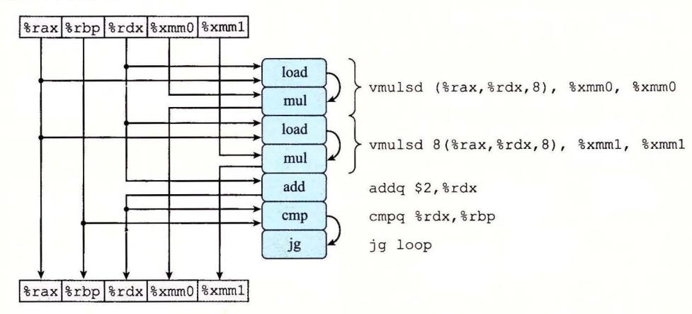

图 5-22 combine6 内循环代码的图形化表示。每次循环有两条 vmulsd 指令,每条指令被翻译成一个 load 和一个 mul 操作

我们可以将多个累积变量变换归纳为将循环展开 k 次,以及并行累积 k 个值,得到  $k \times k$  循环展开。图 5-25 显示了当数值达到 k = 10 时,应用这种变换的效果。可以看到,当 k 值足够大时,程序在所有情况下几乎都能达到吞吐量界限。整数加在 k = 7 时达到的 CPE 为 0.54,接近由两个加载单元导致的吞吐量界限 0.50。整数乘和浮点加在  $k \ge 3$  时达到的 CPE 为 1.01,接近由它们的功能单元设置的吞吐量界限 1.00。浮点乘在  $k \ge 10$  时达到的 CPE 为 0.51,接近由两个浮点乘法器和两个加载单元设置的吞吐量界限 0.50。值得注意的是,即使乘法是更加复杂的操作,我们的代码在浮点乘上达到的吞吐量几乎是浮点加可以达到的两倍。

通常,只有保持能够执行该操作的所有功能单元的流水线都是满的,程序才能达到这个操作的吞吐量界限。对延迟为 L,容量为 C 的操作而言,这就要求循环展开因子  $k \ge C \cdot L$ 。比如,浮点乘有 C = 2,L = 5,循环展开因子就必须为  $k \ge 10$ 。浮点加有 C = 1,L = 3,则在  $k \ge 3$  时达到最大吞吐量。

在执行  $k \times k$  循环展开变换时,我们必须考虑是否要保留原始函数的功能。在第 2 章已经看到,补码运算是可交换和可结合的,甚至是当溢出时也是如此。因此,对于整数数据类型,在所有可能的情况下,combine6 计算出的结果都和 combine5 计算出的相同。因此,优化编译器潜在地能够将 combine4 中所示的代码首先转换成 combine5 的二路循环展开的版本,然后再通过引入并行性,将之转换成 combine6 的版本。有些编译器可以做这种或与之类似的变换来提高整数数据的性能。

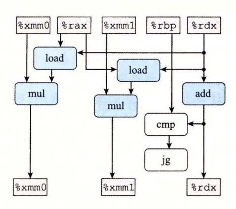

a) 新排列、简化和抽象 5-22 表示 给出连续迭代之间的数据相

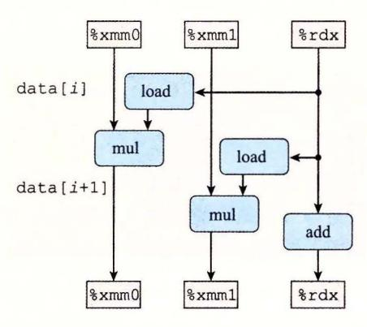

b) 两个mul 操作之间没有相关

5-23 mbine6 的运算 抽象成数据流图

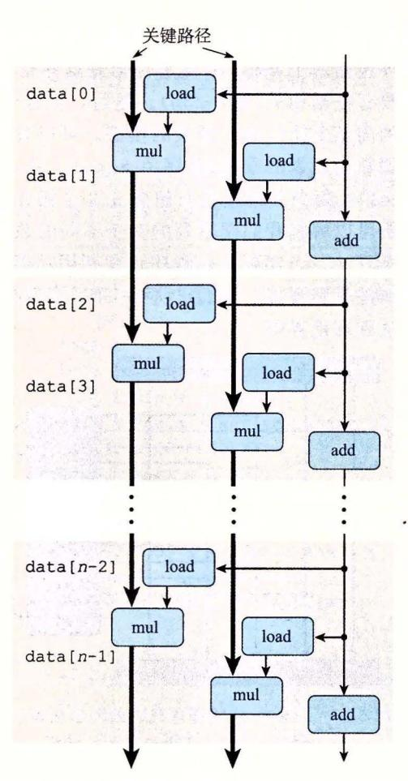

5-24 combine 个长度为 的向 进行操作的 数据流 现在有两条关键路径,每条关 键路 包含 个操作

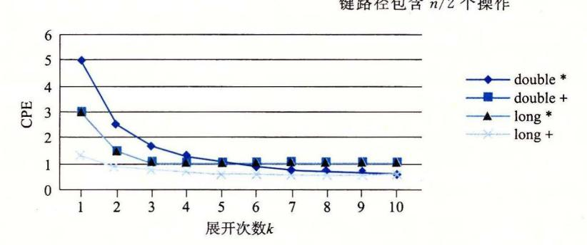

5-25 循环 开的 CPE 性能。使用这种变换后,所有的 CPE 都有所 改进,接近或达到其吞吐蜇界限

另一方面,浮点乘法和加法不是可结合的。因此,由于四舍五入或溢出, combines combine6 可能产生不同的结果。例如,假想这样一种情况,所有索引值为偶数的元素 都是绝对值非常大的数,而索引值为奇数的元素都非常接近于 o. 。那么,即使最终的乘 积尺不会溢出,乘积 PE ,也可能上溢,或者 PO 也可能下溢。不过在大多数现实的程序 中,不太可能出现这样的情况 因为大多数物理现象是连 的,所以数值数据也趋向千相

当平滑,不会出什么问题。即使有不连续的时候,它们通常也不会导致前面描述的条件那样的周期性模式。按照严格顺序对元素求积的准确性不太可能从根本上比"分成两组独立求积,然后再将这两个积相乘"更好。对大多数应用程序来说,使性能翻倍要比冒对奇怪的数据模式产生不同的结果的风险更重要。但是,程序开发人员应该与潜在的用户协商,看看是否有特殊的条件,可能会导致修改后的算法不能接受。大多数编译器并不会尝试对浮点数代码进行这种变换,因为它们没有办法判断引入这种会改变程序行为的转换所带来的风险,不论这种改变是多么小。

#### 5.9.2 重新结合变换

现在来探讨另一种打破顺序相关从而使性能提高到延迟界限之外的方法。我们看到过 $k \times 1$ 循环展开的 combine5 没有改变合并向量元素形成和或者乘积中执行的操作。不过,对代码做很小的改动,我们可以从根本上改变合并执行的方式,也极大地提高程序的性能。

图 5-26 给出了一个函数 combine7, 它与 combine5 的展开代码(图 5-16)的唯一区别在于内循环中元素合并的方式。在 combine5 中,合并是以下面这条语句来实现的

```
12 acc = (acc OP data[i]) OP data[i+1];
```

而在 combine7 中,合并是以这条语句来实现的

```
acc = acc OP (data[i] OP data[i+1]);
```

差别仅在于两个括号是如何放置的。我们称之为重新结合变换(reassociation transformation),因为括号改变了向量元素与累积值 acc 的合并顺序,产生了我们称为" $2\times 1a$ "的循环展开形式。

```
/* 2 x 1a loop unrolling */
    void combine7(vec_ptr v, data_t *dest)
2
3
         long i;
4
         long length = vec_length(v);
5
         long limit = length-1;
6
         data_t *data = get_vec_start(v);
7
         data t acc = IDENT:
10
         /* Combine 2 elements at a time */
         for (i = 0; i < limit; i+=2) {
11
             acc = acc OP (data[i] OP data[i+1]);
12
         }
13
14
15
         /* Finish any remaining elements */
         for (; i < length; i++) {
16
17
             acc = acc OP data[i];
18
19
         *dest = acc;
20
```

图 5-26 运用 2×1a 循环展开,重新结合合并操作。这种方法增加了可以并行执行的操作数量 对于未经训练的人来说,这两个语句可能看上去本质上是一样的,但是当我们测量

| 函数       | <del></del> | 方法整数  |      | 浮     | 点数    |
|----------|-------------|-------|------|-------|-------|
| 图数       | 力法          | +     | *    | +     | *     |
| combine4 | 累积在临时变量中    | 1. 27 | 3.01 | 3. 01 | 5. 01 |
| combine5 | 2×1 展开      | 1.01  | 3.01 | 3. 01 | 5.01  |
| combine6 | 2×2 展开      | 0.81  | 1.51 | 1.51  | 2.51  |
| combine7 | 2×1a 展开     | 1.01  | 1.51 | 1. 51 | 2. 51 |
| 延迟界限     | _           | 1.00  | 3.00 | 3.00  | 5.00  |
| 吞吐量界限    |             | 0.50  | 1.00 | 1.00  | 0.50  |

CPE 的时候,得到令人吃惊的结果:

整数加的性能几乎与使用  $k \times 1$  展开的版本(combine 5)的性能相同,而其他三种情况则与使用并行累积变量的版本(combine 6)相同,是  $k \times 1$  扩展的性能的两倍。这些情况已经突破了延迟界限造成的限制。

图 5-27 说明了 combine7 内循环的代码(对于合并操作为乘法,数据类型为 double 的情况)是如何被译码成操作,以及由此得到的数据相关。我们看到,来自于 vmovsd 和第一个 vmu1sd 指令的 load 操作从内存中加载向量元素 i 和 i+1,第一个 mu1 操作把它们乘起来。然后,第二个 mu1 操作把这个结果乘以累积值 acc。图 5-28a 给出了我们如何对图 5-27 的操作进行重新排列、优化和抽象,得到表示一次迭代中数据相关的模板(图 5-28b)。对于 combine5 和 combine7 的模板,有两个 load 和两个 mu1 操作,但是只有一个mu1 操作形成了循环寄存器间的数据相关链。然后,把这个模板复制 n/2 次,给出了 n个向量元素相乘所执行的计算(图 5-29),我们可以看到关键路径上只有 n/2 个操作。每次迭代内的第一个乘法都不需要等待前一次迭代的累积值就可以执行。因此,最小可能的 CPE 减少了 2 倍。

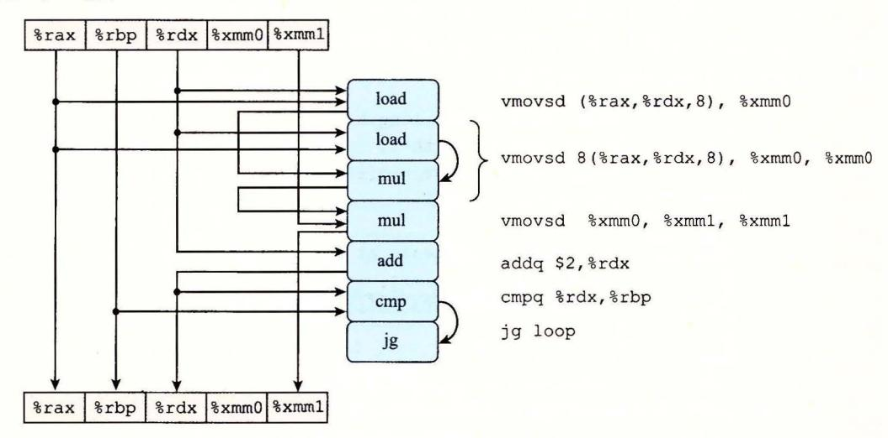

图 5-27 combine7 内循环代码的图形化表示。每次迭代被译码成与 combine5 或 combine6 类似的操作,但是数据相关不同

图 5-30 展示了当数值达到 k=10 时,实现  $k\times 1a$  循环展开并重新结合变换的效果。可以看到,这种变换带来的性能结果与  $k\times k$  循环展开中保持 k 个累积变量的结果相似。对所有的情况来说,我们都接近了由功能单元造成的吞吐量界限。

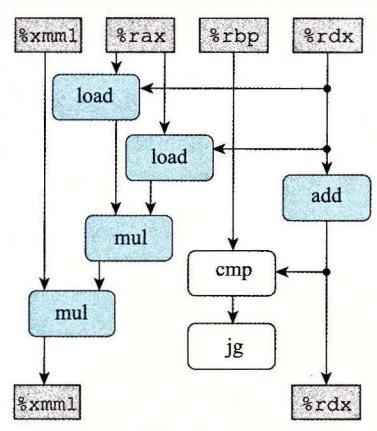

a) 重新排列 简化和抽象图5-27 表示 给出连续迭代之间的数据相关

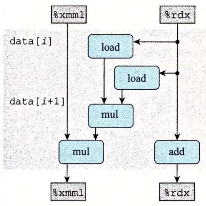

b) 上面的mul 操作让两个二向最元素相乘,而 下面的mul操作将前面的结果乘以循环 ace

### . <sup>28</sup> comb]\_ne7 的操作 抽象成数据流图


<sup>29</sup> mbine? 对一个长度为 的向量进行操作的数 据流表示 我们只有 一条 关键路径,它只包含 个操作

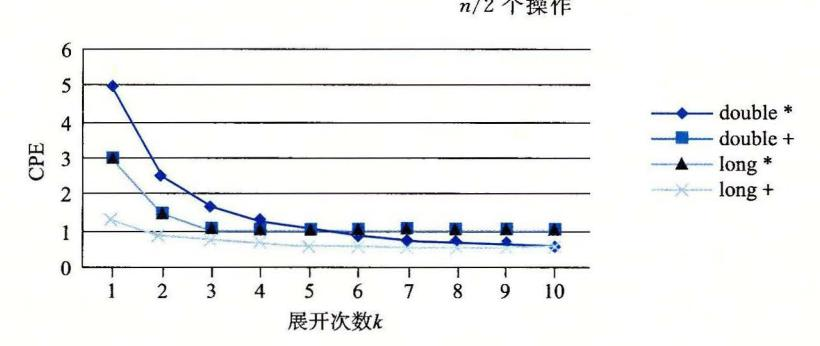

<sup>30</sup> kX la 循环展开的 CPE 性能。在这种变换下,所有的 CPE 都有所 改进,几乎达到了它们的吞吐量界限

在执行重新结合变换时,我们又一次改变向量元素合并的顺序。对千整数加法和乘 法,这些运算是可结合的,这表示这种重新变换顺序对结果没有影响。对于浮点数情况, 必须再次评估这种重新结合是否有可能严重影响结果。我们会说对大多数应用来说,这种 差别不 要。

总的来说,重新结合变换能够减少计算中关键路径上操作的数量,通过更好地利用功能单元的流水线能力得到更好的性能。大多数编译器不会尝试对浮点运算做重新结合,因为这些运算不保证是可结合的。当前的 GCC 版本会对整数运算执行重新结合,但不是总有好的效果。通常,我们发现循环展开和并行地累积在多个值中,是提高程序性能的更可靠的方法。

○ 练习题 5.8 考虑下面的计算 n 个 双精度数组成的数组乘积的函数。我们 3 次展开这个循环。

```
double aprod(double a[], long n)
{
    long i;
    double x, y, z;
    double r = 1;
    for (i = 0; i < n-2; i+= 3) {
        x = a[i]; y = a[i+1]; z = a[i+2];
        r = r * x * y * z; /* Product computation */
    }
    for (; i < n; i++)
        r *= a[i];
    return r;
}</pre>
```

对于标记为 Product computation 的行,可以用括号得到该计算的五种不同的结合,如下所示:

```
r = ((r * x) * y) * z; /* A1 */
r = (r * (x * y)) * z; /* A2 */
r = r * ((x * y) * z); /* A3 */
r = r * (x * (y * z)); /* A4 */
r = (r * x) * (y * z); /* A5 */
```

假设在一台浮点数乘法延迟为 5 个时钟周期的机器上运行这些函数。确定由乘法的数据相关限定的 CPE 的下界。(提示: 画出每次迭代如何计算 r 的图形化表示会所帮助。)

## 网络旁注 OPT: SIMD 用向量指令达到更高的并行度

就像在 3.1 节中讲述的,Intel 在 1999 年引入了 SSE 指令,SSE 是 "Streaming SIMD Extensions(流 SIMD 扩展)"的缩写,而 SIMD(读作 "sim-dee")是 "Single-Instruction,Multiple-Data(单指令多数据)"的缩写。SSE 功能历经几代,最新的版本为高级向量扩展(advanced vector extension)或 AVX。SIMD 执行模型是用单条指令对整个向量数据进行操作。这些向量保存在一组特殊的向量寄存器(vector register)中,名字为8 ymm0~8ymm15。目前的 AVX 向量寄存器长为 32 字节,因此每一个都可以存放 8 个 32 位数或 4 个 64 位数,这些数据既可以是整数也可以是浮点数。AVX 指令可以对这些寄存器执行向量操作,比如并行执行 8 组数值或 4 组数值的加法或乘法。例如,如果 YMM 寄存器%ymm0 包含 8 个单精度浮点数,用  $a_0$  , … ,  $a_7$  表示,而%rcx 包含 8 个单精度浮点数的内存地址,用  $b_0$  , … ,  $b_7$  表示,那么指令

vmulps (%rcx), %ymm0, %ymm1

会从内存中读出 8 个值,并行地执行 8 个乘法,计算  $a_i \leftarrow a_i \cdot b_i$ ,  $0 \le i \le 7$ ,并将得到的

个乘积保存到向量寄存器%ymml 。我们看到,一条指令能够产生对多个数据值的计算, 夕, 因此称为 "SIMD"

GCC 支持对 语言的扩展,能够让程序员在程序中使用向量操作,这些操作能够 被编译成 AVX 的向量指令(以及基于早前的 SSE 指令的代码) 这种代码凤格比直接用 汇编语言写代码要好,因为 GCC 还可以为其他处理器上的向量指令产生代码。

使用 GCC 指令、循环展开和多个累积变量的组合,我们的合并函数能够达到下面的性能:

|           | 整数             |        |       |       | 浮点数   |       |       |  |
|-----------|----------------|--------|-------|-------|-------|-------|-------|--|
| 方法        | in             |        | long  |       | long  | int   |       |  |
|           | +<br>*         | \<br>+ | *     | +     | *     | +     | *     |  |
| 标量 lOX 10 | 0. 54<br>1. 01 | 0. 55  | 1. 00 | 1. 01 | 0. 51 | 1. 01 | 0. 52 |  |
| 标最吞吐掀界限   | 0.50<br>1. 00  | 0. 50  | 1. 00 | 1. 00 | 0. 50 | 1. 00 | 0. 50 |  |
| 向拭 8X8    | 0.24<br>0. 05  | 0. 13  | 1. 51 | 0. 12 | 0.08  | 0.25  | 0. 16 |  |
| 向量吞吐量界限   | 0.06<br>0. 12  | 0. 12  |       | o. 12 | 0. 06 | 0. 25 | 0. 12 |  |

上表中,笫一组数字对应的是按照 combine6 的凤格编写的传统标量代码,循环展开因 子为 10, 并维护 <sup>10</sup> 个累积变量 笫二组数字对应的代码编写形式可以被 GCC 编译成 AVX 向量代码。除了使用向量操作外,这个版本也进行了循环展开,展开因子为 8' 维护 个不同的向量累积变量。我们给出了 <sup>32</sup> 位和 <sup>64</sup> 位数字的结果,因为向量指令在 笫一种情况中达到 路并行,而在笫二种情况中只能达到 路并行。

可以看到,向量代码在 <sup>32</sup> 位的 种情况下几乎都荻得了 倍的提升,对于 <sup>64</sup> 位来 说,在其中的 种情况下荻得了 倍的提升。只有长整数乘法代码在我们尝试将其表示 为向量代码时性能不佳。 AVX 指令集不包括 <sup>64</sup> 位整数的并行乘法指令,因此 GCC 法为此种情况生成向量代码。使用向量指令对合并操作产生了新的吞吐量界限。与标量 界限相比, <sup>32</sup> 位操作的新界限小了 倍, <sup>64</sup> 位操作的新界限小了 倍。我们的代码在 几种数据类型和操作的组合上接近了这些界限。

# 5. 10 优化合并代码的结果小结

我们极大化对向量元素加或者乘的函数性能的努力获得了成功。下表总结了对于标量 代码所获得的结果,没有使用 AVX 向屈指令提供的向最并行性:

|          |              |        | 整数     | 浮点数    |        |
|----------|--------------|--------|--------|--------|--------|
| 函数       | 方法           | +      | *      | +      | *      |
| combinel | 抽象-01        | 10. 12 | 10. 12 | 10. 17 | 11. 14 |
| combine6 | 2X2 循环展开     | 0. 81  | 1. 51  | 1. 51  | 2. 51  |
|          | 10 X 10 循环展开 | 0. 55  | 1. 00  | 1. 01  | 0. 52  |
| 延迟界限     |              | 1. 00  | 3.00   | 3. 00  | 5.00   |
| 吞吐量界限    |              | 0. 50  | 1. 00  | 1. 00  | 0.50   |

使用多项优化技术,我们获得的 CPE 已经接近千 0. <sup>50</sup> 1. <sup>00</sup> 的吞吐量界限,只受 限于功能单元的容量。与原始代码相比提升了 10~20 倍,且使用普通的 代码和标准编 译器就获得了所有这些改进。重写代码利用较新的 SIMD 指令得到了将近 倍或 倍的性 能提升。比如单精度乘法, CPE 从初值 11. <sup>14</sup> 降到了 0. 06, 整体性能提升超过 <sup>180</sup> 倍。 这个例子说明现代处理器具有相当的计算能力,但是我们可能需要按非常程式化的方式来 编写程序以便将这些能力诱发出来。

# 5. 11 一些限制因素

我们已经看到在一个程序的数据流图表示中,关键路径指明了执行该程序所需时间的 一个基本的下界。也就是说,如果程序中有某条数据相关链,这条链上的所有延迟之和等 T, 那么这个程序至少需要 个周期才能执行完。

我们还看到功能单元的吞吐 界限也是程序执行时间的一个下界。也就是说,假设一 个程序一共需要 个某种运算的计算,而微处理器只有 个能执行这个操作的功能单元, 并且这些单元的发射时间为 。那么,这个程序的执行至少需要 · 1/C 个周期

在本节中,我们会考虑其他一些制约程序在实际机器上性能的因素。

### 5 . 11 . 1 寄存器溢出

循环并行性的好处受汇编代码描述计算的能力限制。如果我们的并行度 超过了可用 的寄存器数量,那么编译器会诉诸溢出 (spilling) ,将某些临时值存放到内存中,通常是在 运行时堆栈上分配空间。举个例子,将 combine6 的多累积变量模式扩展到 k=lO k= 20, 其结果的比较如下表所示:

|           |            |       | 整数    | 浮点数   |       |
|-----------|------------|-------|-------|-------|-------|
| 函数        | 方法         | +     | *     | +     | *     |
| cornbine6 |            |       |       |       |       |
|           | lOX 10 循环展 | 0.55  | 1. 00 | 1. 01 | 0. 52 |
|           | 20X20 循环展开 | 0.83  | 1. 03 | 1. 02 | 0. 68 |
| 吞吐<br>界限  |            | 0. 50 | 1. 00 | 1. 00 | 0. 50 |

我们可以看到对这种循环展开程度的增加没有改善 CPE, 有些甚至还变 了。现代 x86-64 处理器有 <sup>16</sup> 个寄存器,并可以使用 <sup>16</sup> YMM 寄存器来保存浮点数。一旦循环变 量的数量超过了可用寄存器的数 ,程序就必须在栈上分配一些变撮。

例如,下面的代码片段展示了在 lOX <sup>10</sup> 循环展开的内循环中,累积变量 accO 是如何 更新的:

```
Updating of accumulator accO in 10 x 10 urolling 
vmulsd C, rdx), %xmm0, %xmm0 accO *= data[i]
```

我们看到该累积变量被保存在寄存器%xrnmO 中,因此程序可以简单地从内存中读取 data 伈],并与这个寄存器相乘。

与之相比, <sup>20</sup> <sup>20</sup> 循环展开的相应部分非常不同:

```
Updating of accumulator accO in 20 x 20 unrolling 
vmovsd 40(%rsp), %xmm0 
vmulsd (%rdx), %xmm0, %xmm0 
vmovsd %xmm0, 40(%rsp)
```

累积变 保存为栈上的 个局部变量,其位置距离栈指针偏移量为 <sup>40</sup> 。程序必须从内存中 读取两个数值:累积变量的值和 data[i] 的值,将两者相乘后,将结果保存回内存。

一旦编译器必须要诉诸寄存器溢出,那么维护多个累积变量的优势就很可能消失。幸 运的是, x86-64 有足够多的寄存器,大多数循环在出现寄存器溢出之前就将达到吞吐量 限制

# 5 11 2 分支预测和预测错误处罚

3. 6. 节中通过实验证明,当分支预测逻辑不能正确预测一个分支是否要跳转的时 候,条件分支可能会招致很大的预测错误处罚。既然我们已经学习到了一些关千处理器是 如何工作的知识,就能理解这样的处罚是从哪里产生出来的了。

现代处理器的工作远超前千当前正在执行的指令,从内存读新指令,译码指令,以确 定在什么操作数上执行什么操作。只要指令遵循的是 种简单的顺序,那么这种指令流水 线化 (instruction pipelining) 就能很好地工作。当遇到分支的时候,处理器必须猜测分支该 往哪个方向走 对于条件转移的情况,这意味着要预测是否会选择分支。对于像间接跳转 (跳转到由一个跳转表条目指定的地址)或过程返回这样的指令,这意味着要预测目标地 址。在这里,我们主要讨论条件分支。

在一个使用投机执行 (speculative execution) 的处理器中,处理器会开始执行预测的分 支目标处的指令。它会避免修改任何实际的寄存器或内存位置,直到确定了实际的结果。 如果预测正确,那么处理器就会"提交"投机执行的指令的结果,把它们存储到寄存器或 内存。如果预测错误,处理器必须丢弃掉所有投机执行的结果,在正确的位置,重新开始 取指令的过程。这样做会引起预测错误处罚,因为在产生有用的结果之前,必须重新填充 指令流水线。

3.6.6 节中我们看到,最近的 x86 处理器(包含所有可以执行 x86-64 程序的处理 器)有条件传送指令。在编译条件语句和表达式的时候, GCC 能产生使用这些指令的代 码,而不是更传统的基于控制的条件转移的实现。翻译成条件传送的基本思想是计算出一 个条件表达式或语句两个方向上的值,然后用条件传送选择期望的值。在 4. 5. 节中我们 看到,条件传送指令可以被实现为普通指令流水线化处理的 部分。没有必要猜测条件是 否满足,因此猜测错误也没有处罚。

那么一个 语言程序员怎么能够保证分支预测处罚不会阻碍程序的效率呢?对于参考 机来说,预测错误处罚是 <sup>19</sup> 个时钟周期,赌注很高。对千这个问题没有简单的答案,但 是下面的通用原则是可用的。

### 不要过分关心 预测的分支

我们已经看到错误的分支预测的影响可能非常大,但是这并不意味着所有的程序分支 都会减缓程序的执行。实际上,现代处理器中的分支预测逻辑非常善于辨别不同的分支指 令的有规律的模式和长期的趋势。例如,在合并函数中结束循环的分支通常会被预测为选 择分支,因此只在最后一次会导致预测错误处罚。

再来看另 个例子,当从 combine2 变化到 combine3 时,我们把函数 get\_vec\_element 从函数的内循环中拿了出来,考虑 下我们观察到的结果,如下所示:

|          | 方法            |       | 整数    |       | 浮点数    |
|----------|---------------|-------|-------|-------|--------|
| 函数       |               | +     |       | +     | *      |
| combine2 | 移动 vec_length | 7. 02 | 9. 03 | 9. 02 | 11. 03 |
| combine3 | 直接数据访问        | 7. 17 | 9. 02 | 9. 02 | 11. 03 |

CPE 基本上没变,即使这个转变消除了每次迭代中用于检查向量索引是否在界限内的两个 条件语旬。对这个函数来说,这些检测总是确定索引是在界内的,所以是高度可预测的。

作为一种测试边界检查对性能影响的方法,考虑下面的合并代码,修改 combine4

内循环,用执行 get\_vec\_element 代码的内联函数结果替换对数据元素的访问。我们称这个新版本为 combine4b。这段代码执行了边界检查,还通过向量数据结构来引用向量元素。

```
/* Include bounds check in loop */
1
     void combine4b(vec_ptr v, data_t *dest)
 3
 4
         long i;
 5
         long length = vec_length(v);
         data_t acc = IDENT;
 6
 7
         for (i = 0; i < length; i++) {
8
9
              if (i >= 0 \&\& i < v -> len) {
10
                  acc = acc OP v->data[i]:
              }
11
12
         7
13
         *dest = acc;
14
     }
```

然后,我们直接比较使用和不使用边界检查的函数的 CPE:

| of <del>Wr</del> | <del></del> >+ | 整     | 数    | 浮点数   |      |
|------------------|----------------|-------|------|-------|------|
| 函数               | 方法             | +     | *    | +     | *    |
| combine4         | 无边界检查          | 1. 27 | 3.01 | 3. 01 | 5.01 |
| combine4b        | 有边界检查          | 2. 02 | 3.01 | 3. 01 | 5.01 |

对整数加法来说,带边界检测的版本会慢一点,但对其他三种情况来说,性能是一样的。 这些情况受限于它们各自的合并操作的延迟。执行边界检测所需的额外计算可以与合并操 作并行执行。处理器能够预测这些分支的结果,所以这些求值都不会对形成程序执行中关 键路径的指令的取指和处理产生太大的影响。

#### 2. 书写适合用条件传送实现的代码

分支预测只对有规律的模式可行。程序中的许多测试是完全不可预测的,依赖于数据的任意特性,例如一个数是负数还是正数。对于这些测试,分支预测逻辑会处理得很糟糕。对于本质上无法预测的情况,如果编译器能够产生使用条件数据传送而不是使用条件控制转移的代码,可以极大地提高程序的性能。这不是C语言程序员可以直接控制的,但是有些表达条件行为的方法能够更直接地被翻译成条件传送,而不是其他操作。

我们发现 GCC 能够为以一种更"功能性的"风格书写的代码产生条件传送,在这种风格的代码中,我们用条件操作来计算值,然后用这些值来更新程序状态,这种风格对立于一种更"命令式的"风格,这种风格中,我们用条件语句来有选择地更新程序状态。

这两种风格也没有严格的规则,我们用一个例子来说明。假设给定两个整数数组 a 和 b,对于每个位置 i,我们想将 a[i]设置为 a[i]和 b[i]中较小的那一个,而将 b[i]设置为 两者中较大的那一个。

用命令式的风格实现这个函数是检查每个位置 i,如果它们的顺序与我们想要的不同,就交换两个元素:

```
/* Rearrange two vectors so that for each i, b[i] >= a[i] */
```

void minmax1(long a[], long b[], long n) {

<sup>3</sup> long i;

```
for (i = 0; i < n; i++) {
    if (a[i] > b[i]) {
        long t = a[i];
        a[i] = b[i];
        b[i] = t;
    }
}
```

在随机数据上测试这个函数,得到的 CPE 大约为 13.50,而对于可预测的数据, CPE 为 2.5~3.5,其预测错误惩罚约为 20 个周期。

用功能式的风格实现这个函数是计算每个位置i的最大值和最小值,然后将这些值分别赋给a[i]和b[i]:

```
/* Rearrange two vectors so that for each i, b[i] >= a[i] */
     void minmax2(long a[], long b[], long n) {
2
3
         long i;
4
         for (i = 0; i < n; i++) {
5
             long min = a[i] < b[i] ? a[i] : b[i];
             long max = a[i] < b[i] ? b[i] : a[i];
6
             a[i] = min;
7
             b[i] = max;
9
        }
     }
10
```

对这个函数的测试表明无论数据是任意的,还是可预测的,CPE 都大约为 4.0。(我们还检查了产生的汇编代码,确认它确实使用了条件传送。)

在 3.6.6 节中讨论过,不是所有的条件行为都能用条件数据传送来实现,所以无可避免地在某些情况中,程序员不能避免写出会导致条件分支的代码,而对于这些条件分支,处理器用分支预测可能会处理得很糟糕。但是,正如我们讲过的,程序员方面用一点点聪明,有时就能使代码更容易被翻译成条件数据传送。这需要一些试验,写出函数的不同版本,然后检查产生的汇编代码,并测试性能。

🌠 练习题 5.9 对于归并排序的合并步骤的传统的实现需要三个循环[98]:

```
void merge(long src1[], long src2[], long dest[], long n) {
2
         long i1 = 0;
3
         long i2 = 0;
4
         long id = 0;
         while (i1 < n && i2 < n) {
5
             if (src1[i1] < src2[i2])
6
                  dest[id++] = src1[i1++];
8
             else
9
                 dest[id++] = src2[i2++];
10
         }
         while (i1 < n)
11
             dest[id++] = src1[i1++];
12
13
         while (i2 < n)
14
             dest[id++] = src2[i2++];
     }
15
```

对于把变量 i1 和 i2 与 n 做比较导致的分支,有很好的预测性能——唯一的预测错误

发生在它们第一次变成错误时。另一方面,值 srcl [辽]和 src2 2] 之间的比较(第 行),对于通常的数据来说,都是非常难以预测的。这个比较控制一个条件分支,运 行在随机数据上时,得到的 CPE 大约为 15. (这里元素的数量为 2n)

重写这段代码,使得可以用一个条件传送语句来实现第一个循环中条件语句(第 6~9 行)的功能。

# 5. 12 理解内存性能

到目前为止我们写的所有代码,以及运行的所有测试,只访问相对比较少量的内存。 例如,我们都是在长度小于 <sup>1000</sup> 个元素的向晕上测试这些合并函数,数据量不会超过 <sup>8000</sup> 个字节。所有的现代处理器都包含一个或多个高速缓存 (cache) 存储器,以对这样少 量的存储器提供快速的访问。本节会进一步研究涉及加载(从内存读到寄存器)和存储(从 寄存器写到内存)操作的程序的性能,只考虑所有的数据都存放在高速缓存中的情况。在 章,我们会更详细地探究高速缓存是如何工作的,它们的性能特性,以及如何编写充 分利用高速缓存的代码。

如图 5-11 所示,现代处理器有专门的功能单元来执行加载和存储操作,这些单元有 内部的缓冲区来保存未完成的内存操作请求集合。例如,我们的参考机有两个加载单元, 每一个可以保存多达 <sup>72</sup> 个未完成的读请求。它还有一个存储单元,其存储缓冲区能保存 最多 <sup>42</sup> 个写请求。每个这样的单元通常可以每个时钟周期开始一个操作。

# 5. 12. 1 加载的性能

一个包含加载操作的程序的性能既依赖于流水线的能力,也依赖千加载单元的延迟。 在参考机上运行合并操作的实验中,我们看到除了使用 SIMD 操作时以外,对任何数据类 型组合和合并操作来说, CPE 从没有到过 0. <sup>50</sup> 以下。一个制约示例的 CPE 的因素是,对 于每个被计算的元素,所有的示例都需要从内存读一个值。对两个加载单元而言,其每个 时钟周期只能启动一条加载操作,所以 CPE 不可能小于 o. <sup>50</sup> 。对于每个被计算的元素必 须加载 个值的应用,我们不可能获得低千 k/2 CPE (例如参见家庭作业 5. 15)

到目前为止,我们在示例中还没有看到加载操作的延迟产生的影响。加载操作的地址 只依赖千循环索引 i' 所以加载操作不会成为限制性能的关键路径的一部分。

要确定一台机器上加载操作的延迟,我们可 I 1 typedef struct ELE { 以建立由一系列加载操作组成的一个计算,一条 加载操作的结果决定下一条操作的地址。作为一 个例子,考虑函数图 5-31 中的函数 list\_len, 它计算一个链表的长度。在这个函数的循环中, 变扯 ls 的每个后续值依赖千指针引用 ls->next 读出的值。测试表明函数 list len CPE 4. 00, 我们认为这直接表明了加载操作的延迟。 要弄懂这一点,考虑循环的汇编代码:

```
23 
    Inner loop of list_len 
    ls in %rdi, len in %rax 
    .L3: 
      addq $1, %rax 
      movq (%rdi), %rdi 
                                 l oop : 
                                   Increment len 
                                   ls = ls- >next
```

```
2 struct ELE *next ; 
3long data; 
4 } list_ele, *list_ptr; 
 5 
6long list_len(list_ptr ls) { 
 7 
 8 
 9 
10 
11 
12 
13 } 
         long len = O; 
         while (ls) { 
           len++; 
         ls= ls->next; } 
         return len;
```

5-3 链表函数。其性能受限于 加载操作的延迟

```
4 testq %rdi, %rdi Test 1s
5 jne .L3 If nonnul1, goto loop
```

第 3 行上的 movq 指令是这个循环中关键的瓶颈。后面寄存器%rdi 的每个值都依赖于加载操作的结果,而加载操作又以%rdi 中的值作为它的地址。因此,直到前一次迭代的加载操作完成,下一次迭代的加载操作才能开始。这个函数的 CPE 等于 4.00,是由加载操作的延迟决定的。事实上,这个测试结果与文档中参考机的 L1 级 cache 的 4 周期访问时间是一致的,相关内容将在 6.4 节中讨论。

### 5.12.2 存储的性能

在迄今为止所有的示例中,我们只分析了大部分内存引用都是加载操作的函数,也就是从内存位置读到寄存器中。与之对应的是存储(store)操作,它将一个寄存器值写到内存。这个操作的性能,尤其是与加载操作的相互关系,包括一些很细微的问题。

与加载操作一样,在大多数情况中,存储操作能够在完全流水线化的模式中工作,每个周期开始一条新的存储。例如,考虑图 5-32 中所示的函数,它们将一个长度为n的数组 dest 的元素设置为 0。我们测试结果为 CPE 等于 1.00。对于只具有单个存储功能单元的机器,这已经达到了最佳情况。

```
1  /* Set elements of array to 0 */
2  void clear_array(long *dest, long n) {
3    long i;
4    for (i = 0; i < n; i++)
5    dest[i] = 0;
6 }</pre>
```

图 5-32 将数组元素设置为 0 的函数。该代码 CPE 达到 1.0

与到目前为止我们已经考虑过的其他操作不同,存储操作并不影响任何寄存器值。因此,就其本性来说,一系列存储操作不会产生数据相关。只有加载操作会受存储操作结果的影响,因为只有加载操作能从由存储操作写的那个位置读回值。图 5-33 所示的函数 write\_read 说明了加载和存储操作之间可能的相互影响。这幅图也展示了该函数的两个示例执行,是对两元素数组 a 调用的,该数组的初始内容为一10 和 17,参数 cnt 等于 3。这些执行说明了加载和存储操作的一些细微之处。

在图 5-33 的示例 A 中,参数 src 是一个指向数组元素 a[0] 的指针,而 dest 是一个指向数组元素 a[1] 的指针。在此种情况中,指针引用\*src 的每次加载都会得到值-10。因此,在两次迭代之后,数组元素就会分别保持固定为-10 和-9。从 src 读出的结果不受对 dest 的写的影响。在较大次数的迭代上测试这个示例得到 CPE 等于 1.3。

在图 5-33 的示例 B 中,参数 src 和 dest 都是指向数组元素 a [0]的指针。在这种情况中,指针引用\*src 的每次加载都会得到指针引用\*dest 的前次执行存储的值。因而,一系列不断增加的值会被存储在这个位置。通常,如果调用函数 write\_read 时参数 src 和 dest 指向同一个内存位置,而参数 cnt 的值为 n>0,那么净效果是将这个位置设置为n-1。这个示例说明了一个现象,我们称之为写/读相关(write/read dependency)——个内存读的结果依赖于一个最近的内存写。我们的性能测试表明示例 B 的 CPE 为 7.3。写/读相关导致处理速度下降约 6 个时钟周期。

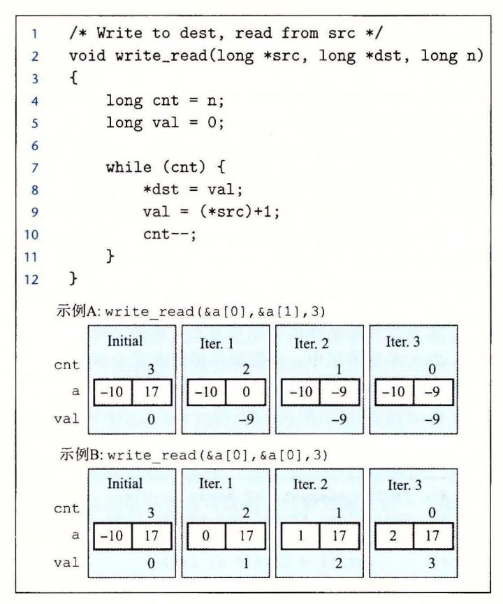

图 5-33 写和读内存位置的代码,以及示例执行。这个函数突出的是当参数 src 和 dest 相等时,存储和加载之间的相互影响

为了了解处理器如何区别这两种情况,以及为什么一种情况比另一种运行得慢,我们必须更加仔细地看看加载和存储执行单元,如图 5-34 所示。存储单元包含一个存储缓冲区、它包含已经被发射到存储单元而又还没有完成的存储操作的地址和数据,这里的完成包括更新数据高速缓存。提供这样一个缓冲区,使得一系列存储操作不必等待每个操作都更新高速缓存就能够执行。当一个加载操作发生时,它必须检查存储缓冲区中的条目,看有没

有地址相匹配。如果有地址相匹配(意味着在写的字节与在读的字节有相同的地址),它就取出相应的数据条目作为加载操作的结果。

GCC 生成的 write read 内循环代码如下:

Inner loop of write\_read src in %rdi, dst in %rsi, val in %rax .L3: loop: %rax, (%rsi) movq Write val to dst movq (%rdi), %rax t = \*src\$1, %rax addq val = t+1\$1, %rdx subq cnt--.L3 jne If != 0, goto loop

图 5-35 给出了这个循环代码的数据流表示。 指令 movq %rax, (%rsi)被翻译成两个操作: s\_

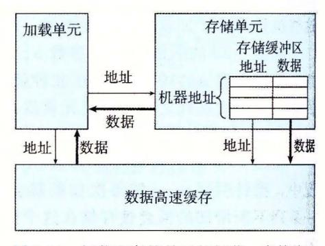

图 5-34 加载和存储单元的细节。存储单元 包含一个未执行的写的缓冲区。加载单元必须检查它的地址是否与 存储单元中的地址相符,以发现 写/读相关

addr 指令计算存储操作的地址,在存储缓冲区创建一个条目,并且设置该条目的地址字段。s\_data 操作设置该条目的数据字段。正如我们会看到的,两个计算是独立执行的, 这对程序的性能来说很重要。这使得参考机中不同的功能单元来执行这些操作。

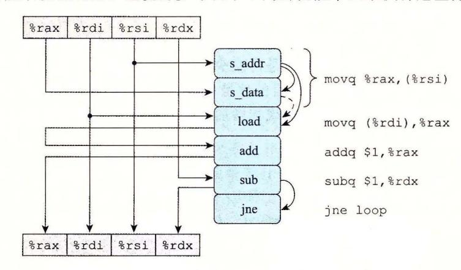

图 5-35 write\_read 内循环代码的图形化表示。第一个 movl 指令被译码两个 独立的操作,计算存储地址和将数据存储到内存

除了由于写和读寄存器造成的操作之间的数据相关,操作符右边的弧线表示这些操作隐含的相关。特别地,s\_addr操作的地址计算必须在 s\_data 操作之前。此外,对指令movq(%rdi),%rax 译码得到的 load 操作必须检查所有未完成的存储操作的地址,在这个操作和 s\_addr操作之间创建一个数据相关。这张图中 s\_data 和 load 操作之间有虚弧线。这个数据相关是有条件的:如果两个地址相同,load操作必须等待直到 s\_data 将它的结果存放到存储缓冲区中,但是如果两个地址不同,两个操作就可以独立地进行。

图 5-36 说明了 write\_read 内循环操作之间的数据相关。在图 5-36a 中,重新排列了操作,让相关显得更清楚。我们标出了三个涉及加载和存储操作的相关,希望引起大家特别的注意。标号为(1)的弧线表示存储地址必须在数据被存储之前计算出来。标号为(2)的弧线表示需要 load 操作将它的地址与所有未完成的存储操作的地址进行比较。最后,标号为(3)的虚弧线表示条件数据相关,当加载和存储地址相同时会出现。

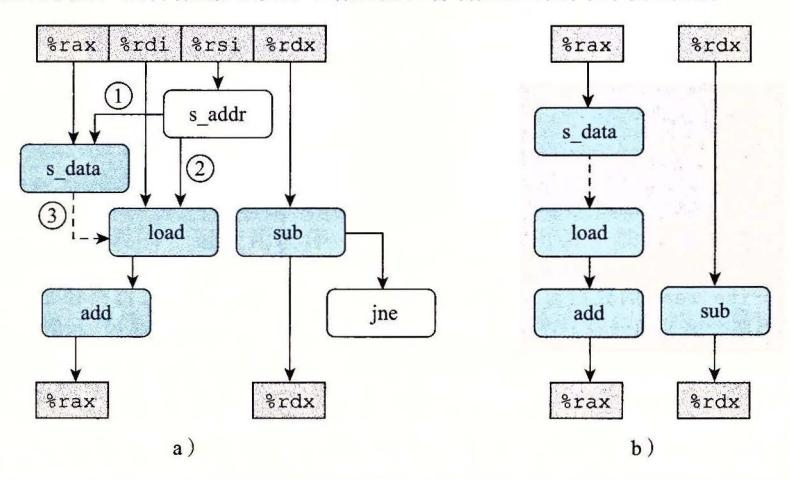

图 5-36 抽象 write\_read 的操作。我们首先重新排列图 5-35 的操作(a),然后只显示 那些使用一次迭代中的值为下一次迭代产生新值的操作(b)

5-36b 说明了当移 那些不 接影响迭代与迭代之间数据流的操作之后,会 生什 么。这个数据流图给出两个相关链:左边的一条,存储、加载和增加数据值(只对地址相 同的情况有效),右边的一条,减小变掀 cnt

现在我们可以理解函数 write\_read 的性能特征了。图 5-37 说明的是内循环的 次迭 代形成的数据相关。对于 5-33 示例 的情况,有不同的源和目的地址,加载和存储操 作可以独立进行,因此唯一的关 路径是由减少 变量 cnt 形成的,这使得 CPE 等于 1. 对千图 5-3 示例 况,源地址和目的地址相同, s\_data load 指令之间的 据相 使得 键路径的形成包括了存储、加载和增加数据。 我们 现顺序执行这 个时钟周期

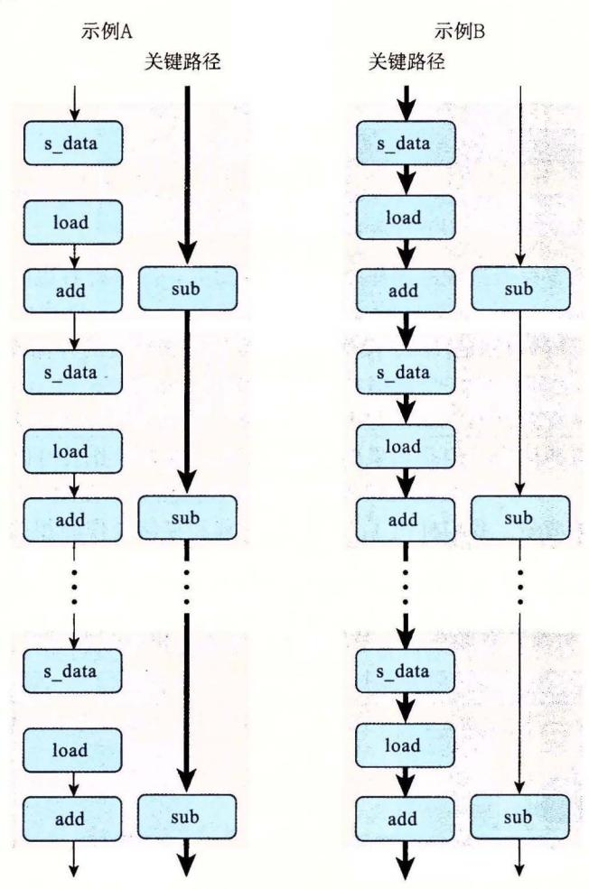

5-3 write\_read 的数据流 表示。 当两个地址不 时, 的关键路径是 cnt (示 。当两个地址相同时,存储、加载和增加数 的链形成了关键路径(示例 B)

这两个例子说明,内存操作的 现包括许多细微之处 对于寄存器操作,在指令被译 码成操作的时候,处理器就可以确定哪些指令会 他哪 指令。另一方面,对于内存 作,只有到计算出加 储的地址被计算出来以 ,处理器才能确定哪些指令会影响 他的哪些。高效地处理内存操作对许多程序的性能来说 关重要 内存子系统使用了很 优化,例如当操作可以独立地进行时 就利用这种 在的 行性

○ 练习题 5.10 作为另一个具有潜在的加载-存储相互影响的代码,考虑下面的函数, 它将一个数组的内容复制到另一个数组:

```
void copy_array(long *src, long *dest, long n)

long i;
for (i = 0; i < n; i++)

dest[i] = src[i];

}</pre>
```

假设 a 是一个长度为 1000 的数组,被初始化为每个元素 a [i]等于 i。

- A. 调用 copy array (a+1, a, 999) 的效果是什么?
- B. 调用 copy array(a,a+1,999)的效果是什么?
- C. 我们的性能测试表明问题 A 调用的 CPE 为 1.2(循环展开因子为 4 时,该值下降到 1.0),而问题 B 调用的 CPE 为 5.0。你认为是什么因素造成了这样的性能差异?
- D. 你预计调用 copy array(a,a,999)的性能会是怎样的?
- 练习题 5. 11 我们测量出前置和函数 psum1(图 5-1)的 CPE 为 9.00, 在测试机器上, 要执行的基本操作——浮点加法的延迟只是 3 个时钟周期。试着理解为什么我们的函数执行效果这么差。

下面是这个函数内循环的汇编代码:

```
Inner loop of psum1
```

```
a in %rdi, i in %rax, cnt in %rdx
    .L5:
                                                  loop:
      vmovss -4(%rsi,%rax,4), %xmm0
2
                                                    Get p[i-1]
      vaddss (%rdi, %rax, 4), %xmm0, %xmm0
3
                                                    Add a[i]
      vmovss %xmm0, (%rsi,%rax,4)
4
                                                    Store at p[i]
5
      addq
               $1, %rax
                                                    Increment, i
               %rdx, %rax
      cmpq
                                                    Compare i:cnt
               .L5
      jne
                                                    If !=, goto loop
```

参考对 combine3(图 5-14)和 write\_read(图 5-36)的分析,画出这个循环生成的数据相关图,再画出计算进行时由此形成的关键路径。解释为什么 CPE 如此之高。

○ 练习题 5. 12 重写 psum1(图 5-1)的代码,使之不需要反复地从内存中读取 p[i]的值。不需要使用循环展开。得到的代码测试出的 CPE 等于 3.00,受浮点加法延迟的限制。

# 5.13 应用:性能提高技术

虽然只考虑了有限的一组应用程序,但是我们能得出关于如何编写高效代码的很重要的经验教训。我们已经描述了许多优化程序性能的基本策略:

- 1) 高级设计。为遇到的问题选择适当的算法和数据结构。要特别警觉,避免使用那些会渐进地产生糟糕性能的算法或编码技术。
  - 2) 基本编码原则。避免限制优化的因素,这样编译器就能产生高效的代码。
  - 消除连续的函数调用。在可能时,将计算移到循环外。考虑有选择地妥协程序的模块性以获得更大的效率。
  - 消除不必要的内存引用。引入临时变量来保存中间结果。只有在最后的值计算出来 时,才将结果存放到数组或全局变量中。

- 3) 低级优化。结构化代码以利用硬件功能。
- ·展开循环,降低开销,并且使得进一步的优化成为可能。
- ·通过使用例如多个累积变址和重新结合等技术,找到方法提高指令级并行。
- ·用功能性的风格重写条件操作,使得编译采用条件数据传送。

最后要给读者一个忠告,要警惕,在为了提高效率重写程序时避免引入错误。在引入 新变量、改变循环边界和使得代码整体上更复杂时,很容易犯错误。一项有用的技术是在 优化函数时,用检查代码来测试函数的每个版本,以确保在这个过程没有引入错误。检查 代码对函数的新版本实施一系列的测试,确保它们产生与原来一样的结果。对于高度优化 的代码,这组测试情况必须变得更加广泛,因为要考虑的情况也更多。例如,使用循环展 开的检查代码需要测试许多不同的循环界限,保证它能够处理最终单步迭代所需要的所有 不同的可能的数字。

# 5. 14 确认和消除性能瓶颈

至此,我们只考虑了优化小的程序,在这样的小程序中有一些很明显限制性能的地 方,因此应该是集中注意力对它们进行优化。在处理大程序时,连知道应该优化什么地方 都是很难的。本节会描述如何使用代码剖析程序 (code profiler) ,这是在程序执行时收集 性能数据的分析工具。我们还展示了一个系统优化的通用原则,称为 Amdahl 定律 (Amdahl's law) ,参见 1. 9. 节。

## 5. 14. 1 程序剖析

程序剖析 (profiling) 运行程序的一个版本,其中插入了工具代码,以确定程序的各个 部分需要多少时间。这对于确认程序中我们需要集中注意力优化的部分是很有用的。剖析 的一个有力之处在千可以在现实的基准数据 (benchmark data) 上运行实际程序的同时,进 行剖析。

Unix 系统提供了一个剖析程序 GPROF 。这个程序产生两种形式的信息。首先,它确 定程序中每个函数花费了多少 CPU 时间。其次,它计算每个函数被调用的次数,以执行 调用的函数来分类。这两种形式的信息都非常有用。这些计时给出了不同函数在确定整体 运行时间中的相对重要性。调用信息使得我们能理解程序的动态行为。

GPROF 进行剖析需要 个步骤,就像 程序 prog.c 所示,它运行时命令行参数 file.tx 七:

1) 程序必须为剖析而编译和链接。使用 GCC (以及其他 编译器),就是在命令行上简 单地包括运行时标志 "-pg" 。确保编译器不通过内联替换来尝试执行任何优化是很重要的, 否则就可能无法正确刻画函数调用。我们使用优化标志-Og, 以保证能正确跟踪函数调用。

linux> gee -Og -pg prog. e -o prog

2) 然后程序像往常一样执行:

linux>./prog file. txt

它运行得会比正常时稍微慢一点(大约慢 倍),不过除此之外唯一的区别就是它产生 了一个文件 grnon.out

3) 调用 GPROF 来分析 grnon.out 中的数据。

linux> gprof prog

剖析报告的第一部分列出了执行各个函数花费的时间,按照降序排列。作为一个示 例,下面列出了报告的一部分,是关于程序中最耗费时间的 个函数的:

| %     | cumulative | self    |               | self   | total  |              |
|-------|------------|---------|---------------|--------|--------|--------------|
| time  | seconds    | seconds | calls         | s/call | s/call | name         |
| 97.58 | 203.66     | 203.66  | 1             | 203.66 | 203.66 | sort_words   |
| 2.32  | 208.50     | 4.85    | 965027        | 0.00   | 0.00   | find_ele_rec |
| 0.14  | 208.81     |         | 0.30 12511031 | 0.00   | 0.00   | Strlen       |

每一行代表对某个函数的所有调用所花费的时间 列表明花费在这个函数上的时 间占整个时间的百分比。第二列显示的是直到这一行并包括这一行的函数所花费的累计时 间。第 列显示的是花费在这个函数上的时间,而第四列显示的是它被调用的次数(递归 调用不计算在内) 在例子中,函数 sort\_words 只被调用了一次,但就是这一次调用需 203. <sup>66</sup> 秒,而函数 find\_ele\_rec 被调用了 <sup>965</sup> <sup>027</sup> 次(递归调用不计算在内),总共需 4. <sup>85</sup> 秒。函数 Strlen 通过调用库函数 strlen 来计算 符串的长度。 GPROF 的结果 中通常不显示库函数调用。库函数耗费的时间通常计算在调用它们的函数内。通过创建这 个"包装函数 (wrapper function)" Strlen, 我们可以可 地跟踪对 strlen 的调用,表 明它被调用了 <sup>12</sup> 511 <sup>031</sup> 次,但是 共只 <sup>30</sup>

剖析报告的第二部分是函数的调用历史 下面是一个递归函数 find\_ele \_rec 的历史:

|     |      |       |       | 158655725      | [5]<br>丘. nd_ele_rec              |
|-----|------|-------|-------|----------------|-----------------------------------|
|     |      | 4. 85 | 0. 10 | 965027 /965027 | insert_string [ 4]                |
| [5] | 2. 4 | 4. 85 | 0.10  |                | 965027+158655725 find_ele_rec [5] |
|     |      | 0.08  | 0.01  | 363039/363039  | save_string [8]                   |
|     |      | 0.00  | 0.01  | 363039/363039  | new_ele [12]                      |
|     |      |       |       | 158655725      | [5]<br>nd_ele_rec                 |

这个历史既显示了调用 find\_ele\_rec 的函数,也显示了它调用的函数。头两行显示的是 对这个函数的调用:被它自身递归地调用了 655 <sup>725</sup> 次,被函数 insert string 调用 9&5 <sup>027</sup> 次(它本身被调用了 <sup>965</sup> <sup>027</sup> 次)。函数 find ele\_rec 也调用了另外两个函数 save\_s ring new\_ele, 每个函数总共被调用了 <sup>363</sup> <sup>039</sup> 次。

根据这个调用信息,我们通常可以推断出关千程序行为的有用信息。例如,函数 nd\_ele\_rec 是一个递归过程,它扫描一个哈希桶 (hash bucket) 的链表,查找一个特殊 的字符串。对千这个函数,比较递归调用的数蜇和顶层调用的数 ,提供了关于遍历这些 链表的长度的统计信息。这里递归与顶层调用的比率是 164. 4, 我们可以推断出程序每次 平均大约扫描 <sup>164</sup> 个元素。

GPROF 有些属性值得注意:

·计时不是很准确。它的计时基于一个简单的间隔计数 (int rval counting) 机制,编译过 的程序为每个函数维护 个计数器,记录花费在执行该函数上的时间 操作系统使得 每隔某个规则的时间间隔()'程序被中断 次。 的典型值的范围为 1. 0~10. 毫秒。 当中断发生时,它会确定程序正在执行什么函数,并将该函数的计数器值增加 。当 然,也可能这个函数只是刚开始执行,而很快就会完成,却赋给它从上次中断以来整个 的执行花费。在两次中断之间也可能运行其他某个程序,却因此根本没有计算花费。

对千运行时间较长的程序,这种机制工作得相当好。从统计上来说,应该根据 花费在执行函数上的相对时间来计算每个函数的花费 不过,对千那些运行时间少 秒的程序来说,得到的统计数字只能看成是租略的估计值。

- 假设没有执行内联替换,则调用信息相当可靠。编译过的程序为每对调用者和被调 用者维护一个计数器。每次调用一个过程时,就会对适当的计数器加
- 默认情况下,不会显示对库函数的计时。相反,库函数的时间都被计算到调用它们 的函数的时间中。

# 5. 14. 2 使用剖析程序来指导优化

作为 个用剖析程序来指导程序优化的示例,我们创建了一 个包括儿个不同任务和数 据结构的应用 这个应用分析 个文本文档的订gram 统计信息,这里 n-gram 个出现 在文档中 个单词的序列 对于 n=l, 我们收集每个单词的统计信息,对千 n=2 ,收集 每对单词的统计信息,以此类推。对于一个给定的 值,程序读一个文本文件,创建一张 互不相同的 n-gram 的表,指出每个 n-gram 出现了多少次,然后按照出现次数的降序对单 词排序。

作为基准程序,我们在一个由《莎士比亚全集》组成的文件上运行这个程序,一共有 965 <sup>028</sup> 个单词,其中 <sup>23</sup> <sup>706</sup> 个是互不相同的。我们发现,对于 n= l, 即使 个写得很 的分析程序也能在 秒以内处理完整个文件,所以我们设置 n=2 ,使得 事情更加有挑 对千 11=2 的情况,兀gram 被称为 bigram (读作 "bye-gram") 。我们确定 莎士比亚全 包含 <sup>363</sup> <sup>039</sup> 个互不相同的 bigram 。最常见的是 "I am", 出现了 <sup>1892</sup> 次。词组 "to 出现了 <sup>1020</sup> bigram 中有 <sup>266</sup> <sup>018</sup> 个只出现了 次。

程序是由下列部分组成的。我们创建了多个版本,从各部分简单的算法开始,然后再 换成更成熟完善的算法:

- 1) 从文件中读出每个单词,并转换成小写字母 我们最初的版本使用的是函数 lowerl (图 7) ,我们知道由于反复地调用 strlen, 它的时间复杂度 是二次的。
- 2) 对字符串应用一个哈希函数,为一个有 个桶 (bucket) 的哈希表产生 一个 O~s-l 之间的数 最初的函数只是简单地对字符的 ASCII 代码求和,再对 求模
- 3) 每个哈希桶都组织成一个链表。程序沿着这个链表扫描,寻找一个匹配的条目。 如果找到了,这个 n-gram 的频度就加 。否则,就创建 个新的链表元素。最初的版本递 归地完成这个操作,将新元素插在链 表尾部。
- 4) 旦已经生成了这张 ,我们就根据频度对所有的元素排序。最初的版本使用插入 排序

5-38 n-gram 频度分析程序 个不同版本的剖析结果。对于每个版本,我们将时 间分为下面的 类。

Sort: 按照频度对 n-gram 进行排序

List: 为匹配 n-gram 扫描链 表, 如果需要,插入一个新的元素

Lower: 将字符串转换为小写字母

Strlen: 计算字符串的长度

Hash: 计算哈希函数

Rest: 其他所有函数的和

如图 5-38a 所示,最初的版本需要 3. 分钟,大多数时间花在了排序上。这并不奇怪, 因为插入排序有二次的运行时间,而程序对 <sup>363</sup> <sup>039</sup> 个值进行排序。

在下一个版本中,我们用库函数 qsort 进行排序,这个函数是基于快速排序算法的 [98] ,其预期运行时间为 O(n ogn) 。在图中这个版本称为 "Quicksort" 。更有效的排序算 法使花在排序上的时间降低到可以忽略不计,而整个运行时间降低到大约 5.4 秒。图 5-38b 是剩下各个版本的时间,所用的比例能使我们看得更清楚。

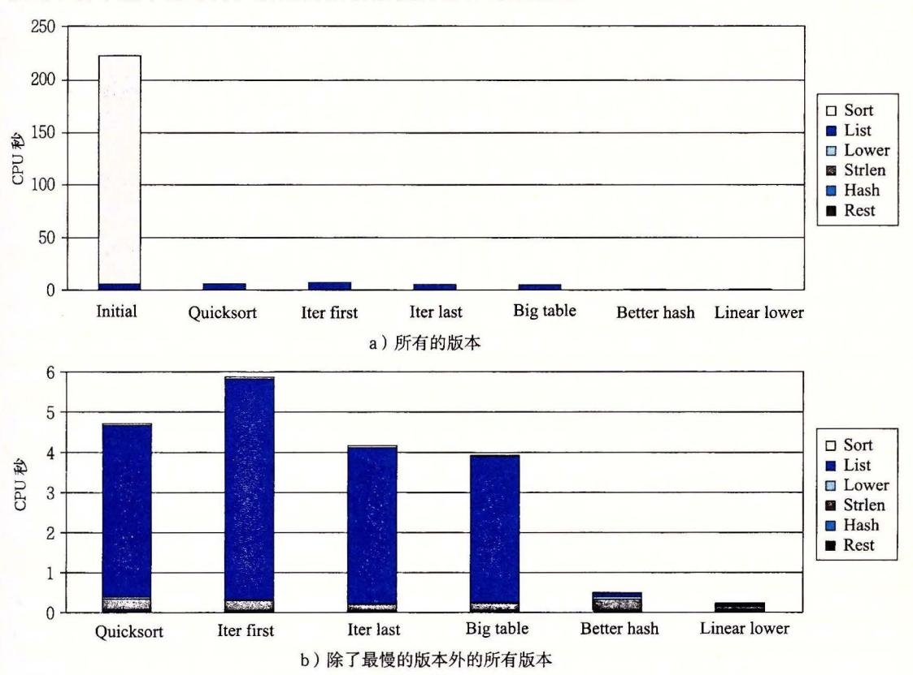

图 5-38 bigram 频度计数程序的各个版本的剖析结果。时间是根据程序中不同的主要操作划分的

·改进了排序,现在发现链表扫描变成了瓶颈。想想这个低效率是由于函数的递归结构引起的,我们用一个迭代的结构替换它,显示为"Iter first"。令人奇怪的是,运行时间增加到了大约 7.5 秒。根据更近一步的研究,我们发现两个链表函数之间有一个细微的差别。递归版本将新元素插入到链表尾部,而迭代版本把它们插到链表头部。为了使性能最大化,我们希望频率最高的 n-gram 出现在链表的开始处。这样一来,函数就能快速地定位常见的情况。假设 n-gram 在文档中是均匀分布的,我们期望频度高的单词的第一次出现在频度低的单词之前。通过将新的 n-gram 插入尾部,第一个函数倾向于按照频度的降序排序,而第二个函数则相反。因此我们创建第三个链表扫描函数,它使用迭代,但是将新元素插入到链表的尾部。使用这个版本,显示为"Iter last",时间降到了大约 5.3 秒,比递归版本稍微好一点。这些测量展示了对程序做实验作为优化工作一部分的重要性。开始时,我们假设将递归代码转换成迭代代码会改进程序的性能,而没有考虑添加元素到链表末尾和开头的差别。

接下来,我们考虑哈希表的结构。最初的版本只有 1021 个桶(通常会选择桶的个数为质数,以增强哈希函数将关键字均匀分布在桶中的能力)。对于一个有 363 039 个条目的表来说,这就意味着平均负载(load)是 363 039/1021=355.6。这就解释了为什么有那么多时间花在了执行链表操作上了——搜索包括测试大量的候选 n-gram。它还解释了为什么性能对链表的排序这么敏感。然后,我们将桶的数量增加到了 199 999,平均负载降低到了

1. 。不过,很奇怪的是,整体运行时间只下降到 5. 秒,差距只有 0. 秒。

进一步观察,我们可以看到,表变大了但是性能提高很小,这是由于哈希函数选择的 不好。简单地对字符串的字符编码求和不能产生一个大范围的值。特别是,一个字母最大 的编码值是 122, 因而 个字符产生的和最多是 122n 。在文档中,最长的 bigram("honorcab tudinit tibus thou") 的和也不过是 3371, 所以,我们哈希表中大多数桶都是不会被 使用的。此外,可交换的哈希函数,例如加法,不能对 个字符串中不同的可能的字符倾 序做出区分。例如,单词 "rat" "tar" 会产生同样的和。

我们换成 个使用移位和异或操作的哈希函数。使用这个版本,显示为 "Better Hash", 时间下降到了 0. 一个更加系统化的方法是更加仔细地研究关键字在桶中的 分布,如果哈希函数的输出分布是均匀的,那么确保这个分布接近千人们期望的那样。

最后,我们把运行时间降到了大部分时间是花在 strlen 上,而大多数对 strlen 调用是作为小写字母转换的 部分。我们巳经看到了函数 lowerl 有二次的性能,特别是 对长字符串来说。这篇文档中的单词足够短,能避免二次性能的灾难性的结果;最长的 bigram 只有 <sup>32</sup> 个字符 不过换成使用 lower2, 显示为 "Linear Lower" 得到很好的性 能,整个时间降到了 0. 秒。

通过这个练习,我们展示了代码剖析能够帮助将一个简单应用程序所需的时间从 -3. 5 分钟降低到 o. 秒,得到的性能提升约为 <sup>1000</sup> 倍。剖析程序帮助我们把注意力集中在程 序最耗时的部分上,同时还提供了关于过程调用结构的有用信息。代码中的一些瓶颈,例 如二次的排序函数,很容易看出来;而其他的,例如插入到链表的开始还是结尾,只有通 过仔细的分析才能看出。

我们可以看到,剖析是工具箱中一个很有用的工具,但是它不应该是唯一一个。计时测 量不是很准确,特别是对较短的运行时间(小千 秒)来说。更重要的是,结果只适用于被测 试的那些特殊的数据。例如,如果在由较少数撞的较长字符串组成的数据上运行最初的函 数,我们会发现小写字母转换函数才是主要的性能瓶颈。更糟糕的是,如果它只剖析包含短 单词的文档,我们可能永远不会发现隐藏着的性能瓶颈,例如 lowerl 的二次性能。通常, 假设在有代表性的数据上运行程序,剖析能帮助我们对典型的情况进行优化,但是我们还应 该确保对所有可能的情况,程序都有相当的性能。这主要包括避免得到糟糕的渐近性能 (asymptotic performance) 的算法(例如插入算法)和坏的编程实践(例如 lowerl)

1. 9. 中讨论了 Amdahl 定律,它为通过有针对性的优化来获取性能提升提供了一些 其他的见解。对千 n-gram 代码来说,当用 quicksort 代替了插入排序后,我们看到总的执 行时间从 209. 秒下降到 5. 秒。初始版本的 209. 秒中的 203. 秒用于执行插入排序, 得到 0.974, 被此次优化加速的时间比例。使用 quicksort, 花在排序上的时间变得微 不足道,得到预计的加速比为 <sup>209</sup> 39. O, 接近千测量加速比 38. 。我们之所以能获得 大的加速比,是因为排序在整个执行时间中占了非常大的比例。然而,当一个瓶颈消除, 而新的瓶颈出现时,就需要关注程序的其他部分以获得更多的加速比。

# 5. 15 小结

虽然关于代码优化的大多数论述都描述了编译器是如何能生成高效代码的,但是应用程序员有很多方 法来协助编译器完成这项任务 没有任何编译器能用 个好的算法或数据结构代替低效率的算法或数据结 构,因此程序设计的这些方面仍然应该是程序员主要关心的 我们还看到妨碍优化的因素,例如内存别名 使用和过程调用,严重限制了编译器执行大掀优化的能力。同样,程序员必须对消除这些妨碍优化的因素 负主要的责任。这些应该被看作好的编程习惯的一部分,因为它们可以用来消除不必要的工作。

基本级别之外调整性能需要 一些对处理器微体系结构 的理 解,描述处理器用来实现它的指令集体系 结构的底 机制 对于乱序处理器的情况,只 需要 知道一些关于操作、容 噩、 延迟和功能单元发射时间 的信息,就能够基本地预测程序的性能了

我们研究了 一系 列技术.包括循环展开、创建多个累积变址和重新结合,它们可以利用现代处理器 提供的 指令级并行。随着 对优化的深入,研究产生的汇编 代码以及试着理解机器如 何执行计算变得 重要 起来 。确认由程序中的数据相关决 定的关键路径,尤其是循环的不同 迭代之间的数据相关 ,会收获良 多。 我们还可以根据必须要计算的操作数猛以及执行这些操作的功能单元的数 和发射时间,计算 个计算 的吞吐 量界限。

包含条件分支或与内存系统复杂交互的程序,比我们最开始考虑的简单循环程序,更难以分析和优 。基本策略是使分支 更容易预测,或者使它们很容易用条件数据传送来 我们还必须注意存储和 加载操作 将数值保存在局部变量中 ,使得它们可以存放在寄存器中,这会很有帮助。

当处理大型程序时 ,将注意力 集中在最耗时的部分变 得很重要 。代码剖析程序 和相关的工具能帮助 我们系统地评价和改进程序性能。我们描述了 GPROF, 一个标准的 Unix 剖析工具。还有更加复杂完善 的剖析 程序可用 ,例如 Intel VTUNE 程序 发系统, 还有 Linux 系统 基本 上都有的 VALGRIND 。这 些工具 可以在过程级分斛 执行时间,估计程序每个基 本块 (basic block) 性能。(基本 块是内部没有 控制 转移的指令序列,因此基本块总是整个被执行的。)

# 参考文献说明

我们的关注点是从程序员的角度描述代码优化,展示如何使书写的代码能够使编译器更容易地产生 高效的代码 hellappa Franchetti Puschel 的扩展的论文 [19] 采用了类似的方法,但关于处理器的特 性描 述得更详细。

有许多著作从编译器的 角度描述了代码优化,形式化描述了编辑 可以 产生更 有效代码的方法 Muchni 著作被认为是 最全面的 [8 ad eig Crawford 关千软件优化的 [115] 覆盖了 一些 我们已 经谈到的内容,不过它还描述了 在并行机器上获得高性能的过程。 hlk 人的一篇比较早期的 论文 [75] 描述了几种为编 译器开 发的将程序映射到并行 机器上的技术,它们 是如 何能够被改造成利 现代处理器的指令级并行的。这篇论文覆盖了我们讲过的代码变换,包括循环展开、多个累积变量(他们 称之为累积交堂扩展 (accumulator va riable expansio 和重新结合 (他 称之为树高度减 tree height redu ti on))

我们对乱序处理器的操作的描述相当简单和抽象 可以在高级计算机体系结构教科书中找到对通用 原则更完 整的描述 例如 en essy atterson 的著作 [46 2~3 章]。 Shen Lipasti 00] 提供 了对现代处理器设计深人的论述。

# 家庭作业

假设我们想编写 个计算两个向 内积的过程 这个 函数的 个抽象版本对整数和浮点数 类型,在 x86-64 CPE 14~ <sup>18</sup> 。通过进行与 我们将抽 象程序 combinel 换为更有 效的 comb ne4 相同类型的变换,我 得到如 代码:

```
1 I* Inner product. Accumulate in temporary *I 
2 void inner4 (vec_ptr u, vec_ptr v, data_t *dest) 
4long i; 
5long length = vec_length(u); 
6data_ t *udata = get_ vec_start (u) ; 
       data_t *vdata = get_vec_start(v); 
s data_t sum = (data_t) 0; 
10 for (i = O; i < length; i++) { 
11 sum = sum + udata [i] * vdata [i] ; 
13 *dest = sum;
```

测试显示,对于整数这个函数的 CPE 等于 1.50,对于浮点数据 CPE 等于 3.00。对于数据类型 double,内循环的 x86-64 汇编代码如下所示:

```
Inner loop of inner4. data_t = double, OP = *
    udata in %rbp, vdata in %rax, sum in %xmm0
    i in %rcx, limit in %rbx
    .L15:
      vmovsd 0(%rbp,%rcx,8), %xmm1
                                                Get udata[i]
      vmulsd (%rax,%rcx,8), %xmm1, %xmm1
                                                Multiply by vdata[i]
3
      vaddsd %xmm1, %xmm0, %xmm0
                                                Add to sum
4
              $1, %rcx
      adda
5
                                                Increment i
               %rbx, %rcx
      cmpq
                                                Compare i:limit
      jne
               .L15
                                                 If !=, goto loop
```

假设功能单元的特性如图 5-12 所示。

- A. 按照图 5-13 和图 5-14 的风格,画出这个指令序列会如何被译码成操作,并给出它们之间的数据相关如何形成一条操作的关键路径。
- B. 对于数据类型 double, 这条关键路径决定的 CPE 的下界是什么?
- C. 假设对于整数代码也有类似的指令序列,对于整数数据的关键路径决定的 CPE 的下界是什么?
- D. 请解释虽然乘法操作需要 5 个时钟周期,但是为什么两个浮点版本的 CPE 都是 3.00。
- \*5.14 编写习题 5.13 中描述的内积过程的一个版本,使用 6×1 循环展开。对于 x86-64,我们对这个展开的版本的测试得到,对整数数据 CPE 为 1.07,而对两种浮点数据 CPE 仍然为 3.01。
  - A. 解释为什么在 Intel Core i7 Haswell 上运行的任何(标量)版本的内积过程都不能达到比 1.00 更小的 CPE 了。
  - B. 解释为什么对浮点数据的性能不会通过循环展开而得到提高。
- \*5.15 编写习题 5.13 中描述的内积过程的一个版本,使用 6×6 循环展开。对于 x86-64,我们对这个函数的测试得到对整数数据的 CPE 为 1.06,对浮点数据的 CPE 为 1.01。 什么因素制约了性能达到 CPE 等于 1.00?
- \*5.16 编写习题 5.13 中描述的内积过程的一个版本,使用 6×1a 循环展开产生更高的并行性。我们对这个函数的测试得到对整数数据的 CPE 为 1.10,对浮点数据的 CPE 为 1.05。
- \*\* 5.17 库函数 memset 的原型如下:

```
void *memset(void *s, int c, size_t n);
```

这个函数将从 s 开始的 n 个字节的内存区域都填充为 c 的低位字节。例如,通过将参数 c 设置为 0 ,可以用这个函数来对一个内存区域清零,不过用其他值也是可以的。

下面是 memset 最直接的实现:

```
/* Basic implementation of memset */
    void *basic_memset(void *s, int c, size_t n)
         size_t cnt = 0;
4
        unsigned char *schar = s;
5
         while (cnt < n) {
6
             *schar++ = (unsigned char) c;
7
8
             cnt++;
         7
9
10
        return s;
11
```

实现该函数一个更有效的版本,使用数据类型为 unsigned long 的字来装下 8 个 c, 然后用字级的写遍历目标内存区域。你可能发现增加额外的循环展开会有所帮助。在我们的参考机上, 能够把 CPE 从直接实现的 1.00 降低到 0.127。即,程序每个周期可以写 8 个字节。

这里是一些额外的指导原则。在此,假设 K 表示你运行程序的机器上的 sizeof (unsigned long)的值。

- 你不可以调用任何库函数。
- 你的代码应该对任意 *n* 的值都能工作,包括当它不是 *K* 的倍数的时候。你可以用类似于使用循环展开时完成最后几次迭代的方法做到这一点。
- 你写的代码应该无论 K 的值是多少,都能够正确编译和运行。使用操作 sizeof 来做到这一点。
- 在某些机器上,未对齐的写可能比对齐的写慢很多。(在某些非 x86 机器上,未对齐的写甚至可能会导致段错误。)写出这样的代码,开始时直到目的地址是 K 的倍数时,使用字节级的写,然后进行字级的写,(如果需要)最后采用用字节级的写。
- 注意 cnt 足够小以至于一些循环上界变成负数的情况。对于涉及 sizeof 运算符的表达式,可以用无符号运算来执行测试。(参见 2.2.8 节和家庭作业 2.72。)
- \*\*5.18 在练习题 5.5 和 5.6 中我们考虑了多项式求值的任务,既有直接求值,也有用 Horner 方法求值。 试着用我们讲过的优化技术写出这个函数更快的版本,这些技术包括循环展开、并行累积和重新 结合。你会发现有很多不同的方法可以将 Horner 方法和直接求值与这些优化技术混合起来。 理想状况下,你能达到的 CPE 应该接近于你的机器的吞吐量界限。我们的最佳版本在参考机上能 使 CPE 达到 1.07。
- \*\*5.19 在练习题 5.12 中,我们能够把前置和计算的 CPE 减少到 3.00,这是由该机器上浮点加法的延迟 决定的。简单的循环展开没有改进什么。

使用循环展开和重新结合的组合,写出求前置和的代码,能够得到一个小于你机器上浮点加法延迟的 CPE。要达到这个目标,实际上需要增加执行的加法次数。例如,我们使用 2 次循环展开的版本每次迭代需要 3 个加法,而使用 4 次循环展开的版本需要 5 个。在参考机上,我们的最佳实现能达到 CPE 为 1.67。

确定你的机器的吞吐量和延迟界限是如何限制前置和操作所能达到的最小 CPE 的。

# 练习题答案

5.1 这个问题说明了内存别名使用的某些细微的影响。

正如下面加了注释的代码所示,结果会是将 xp 处的值设置为 0:

```
4
```

这个示例说明我们关于程序行为的直觉往往会是错误的。我们自然地会认为 xp 和 yp 是不同的情况,却忽略了它们相等的可能性。错误通常源自程序员没想到的情况。

- 5.2 这个问题说明了 CPE 和绝对性能之间的关系。可以用初等代数解决这个问题。我们发现对于  $n \le 2$ ,版本 1 最快。对于  $3 \le n \le 7$ ,版本 2 最快,而对于  $n \ge 8$ ,版本 3 最快。
- 5.3 这是个简单的练习,但是认识到一个 for 循环的 4 个语句(初始化、测试、更新和循环体)执行的次数是不同的很重要。

| 代码 | min | max | incr | square |
|----|-----|-----|------|--------|
| A. | 1   | 91  | 90   | 90     |
| B. | 91  | 1   | 90   | 90     |
| C. | 1   | 1   | 90   | 90     |

- 5.4 这段汇编代码展示了 GCC 发现的一个很聪明的优化机会。要更好地理解代码优化的细微之处,仔细研究这段代码是很值得的。
  - A. 在没经过优化的代码中,寄存器 % xmm0 简单地被用作临时值,每次循环迭代中都会设置和使用。在经过更多优化的代码中,它被使用的方式更像 combine4 中的变量 x,累积向量元素的乘积。不过,与 combine4 的区别在于每次迭代第二条 vmovsd 指令都会更新位置 dest。

我们可以看到,这个优化过的版本运行起来很像下面的 C 代码:

```
/* Make sure dest updated on each iteration */
2
    void combine3w(vec_ptr v, data_t *dest)
3
4
         long i;
5
         long length = vec_length(v);
6
         data_t *data = get_vec_start(v);
7
         data_t acc = IDENT;
8
9
         /* Initialize in event length <= 0 */
10
         *dest = acc;
11
12
         for (i = 0; i < length; i++) {
13
             acc = acc OP data[i]:
             *dest = acc:
14
15
         7
16
```

- B. combine3的两个版本有相同的功能,甚至于相同的内存别名使用。
- C. 这个变换可以不改变程序的行为,因为,除了第一次迭代,每次迭代开始时从 dest 读出的值和 前一次迭代最后写人到这个寄存器的值是相同的。因此,合并指令可以简单地使用在循环开始 时就已经在%xmm0 中的值。
- 5.5 多项式求值是解决许多问题的核心技术。例如,多项式函数常常用作对数学库中三角函数求近 似值。
  - A. 这个函数执行 2n 个乘法和 n 个加法。
  - B. 我们可以看到,这里限制性能的计算是反复地计算表达式 xpwr=x\*xpwr。这需要一个浮点数乘法(5个时钟周期),并且直到前一次迭代完成,下一次迭代的计算才能开始。两次连续的迭代之间,对 result 的更新只需要一个浮点加法(3个时钟周期)。
- 5.6 这道题说明了最小化一个计算中的操作数量不一定会提高它的性能。
  - A.  $\dot{\mathbf{y}}$  这个函数执行 n 个乘法和 n 个加法,是原始函数  $\mathbf{poly}$  中乘法数量的一半。
  - B. 我们可以看到,这里的性能限制计算是反复地计算表达式 result=a[i]+x\*result。从来自上一次迭代的 result 的值开始,我们必须先把它乘以 x(5 个时钟周期),然后把它加上 a[i](3 个时钟周期),然后得到本次迭代的值。因此,每次迭代造成了最小延迟时间 8 个周期,正好等于我们测量到的 CPE。
  - C. 虽然函数 poly 中每次迭代需要两个乘法,而不是一个,但是只有一条乘法是在每次迭代的关键路径上出现。
- 5.7 下面的代码直接遵循了我们对 k 次展开一个循环所阐述的规则:

```
void unroll5(vec_ptr v, data_t *dest)
2
     {
3
         long i;
4
         long length = vec_length(v);
5
         long limit = length-4;
 6
         data_t *data = get_vec_start(v);
         data_t acc = IDENT;
7
8
q
         /* Combine 5 elements at a time */
10
         for (i = 0; i < limit; i+=5) {
             acc = acc OP data[i]
                                   OP data[i+1];
11
12
             acc = acc OP data[i+2] OP data[i+3];
             acc = acc OP data[i+4];
13
15
16
         /* Finish any remaining elements */
17
         for (; i < length; i++) {
18
             acc = acc OP data[i];
19
20
         *dest = acc;
21
    }
```

5 8 这道题目说 明了程序中小小的 改动可能会造成很大的性能不同, 特别是在乱序执行的机器上 。图 5-39 画出了该函数 次迭代的 个乘法操作 在这张图 中,关键路径上的操作用黑色方 框表示 它们 需要按照顺序计算 ,计算出 循环变最 的新值。浅 色方框表示的操作可以与关键路径操作并行地 算。对于一个关键路径上有 个操作的循环,每次迭代需 要最少 5P 个时钟周期 ,会计算出 个元 素的乘积,得 CPE 的下界 5P/3 也就是说, Al 的下界为 5. 00, A2 A5 的为 3. 33, A4 的为 1. <sup>67</sup> 我们在 Intel Core i7 Hasw ll 处理器上运行这 些函数 发现得到 CPE 与前述


5-39 对于练习题 中各种情况乘法操作之间的 数据相关。用黑色方 表示的操作形成了迭代的关键路径

5. 9 这道题又说明了编码风格上的小 化能 够让编译器更容易地察觉到使用条件传送的 机会:

```
while (il < n&&迈 <n) { 
    long vl = src1[i1]; 
    long v2 = src2[i2]; 
    long take1 = vl < v2; 
    dest [id++ J = take1 ? v1 : v2; 
    i1 += take1; 
    立+= (1-take1);
```

这个版本的代码,我们测量到 CPE 大约为 12. 比原始的 CPE 15 . 有了明 显的提高

- 5. 10 这道题要求你分析一个程序中潜在的加载-存储相互影响
  - . A. 对千 i~998, 它要将每个元素 设置为 i+
    - B. 对千 999, 它要将 每个元素 设置为
    - C. 在第二种情况 中,每次迭代的加 载都依赖于前一次迭代的 存储结果 此,在连续的迭代之间 有写 读相关。
    - D. 得到的 CPE 等于 1. 2' 与示例 的相同 ,这是因为存储和后 续的 载之间没有相关。
- 5. 11 我们可以看到,这个函数在连续的迭代之间有写/读相关 次迭代中的目 的值 p[i] 与下 一次 迭代中的源值 p[i- 1] 相同 。因 此,每 次迭 代形成的关键路 径就包括 次存储(来自前 次迭 代), 次加载 和一次浮点加 。当存在数据相关时,测星得到的 CPE 值为 wr ite read CPE 测撮值 是一 致的,因 wr te\_read 个整数加 (1 钟周期延迟), psuml 包括 个浮点加 (3 时钟周期延迟)
- 5 12 下面是对这个函数的一个修改版本:

```
1 void psumla(float a[], float p[J, long n) 
       long i; 
4I* last_ val holds p [i 1]; val holds p[i] *I 
5float last_ val, val; 
6last_val = p[O] = a[O]; 
7 for (i = 1; i < n; i ++) { 
8val = last_val + a[i]; 
           p [i] = val; 
1 O last_ val = val; 
12 }
```

我们引入了局部变量 last\_val。在迭代 i 的开始,last\_val 保存着 p[i-1]的值。然后我们计算 val 为 p[i]的值,也是 last val 的新值。

这个版本编译得到如下汇编代码:

```
Inner loop of psum1a
    a in %rdi, i in %rax, cnt in %rdx, last_val in %xmm0
1
2
      vaddss (%rdi, %rax,4), %xmm0, %xmm0
                                                 last_val = val = last_val + a[i]
      vmovss %xmm0, (%rsi, %rax,4)
3
                                                 Store val in p[i]
              $1, %rax
4
      addq
                                                  Increment i
      cmpq %rdx, %rax
5
                                                 Compare i:cnt
      jne
              .L16
                                                  If !=, goto loop
```

这段代码将 last\_val 保存在%xmm0 中,避免了需要从内存中读出 p[i-1],因而消除了 psum1 中看到的写/读相关。

C H A P T E R 6

# 存储器层次结构

到目前为止,在对系统的研究中,我们依赖于一个简单的计 机系统模型, CPU 行指令,而存储器系统为 CPU 存放指 和数据 在简单模型中,存储器系统是一个线性 的字节数组,而 CPU 能够在一个常数时间内访问每个存储器位置 。虽然迄 今为止这都是 一个有效的模型,但是它没有反映现代系统实际工作的方式

实际上,存储器系统 (memory system) 是一个具有不同容量、成本和访问时间的存储 设备的层次结构。 CPU 寄存器保存着最常用 的数据。靠近 CPU 的小的、快速的高速缓存 存储器 (cache memory) 作为一部分存储在相对慢速的主存储器 (m in memory) 中数据和指 令的缓冲区域 主存缓存存储在容量较大 的、慢速磁盘上的数据,而这些磁盘常常又作为 存储在通过网络连接的其他机器的磁盘或磁带上的数据的 冲区域

存储器层次结构是可行的,这是因为与下 个更低层次的存储设备相比来说,一个编 写良好的程序倾向千更频繁地访问某 个层次上的存储设备 。所以,下一层的存储设备可 以更慢速 点,也因此可以更大,每个比特位更便宜。整体效果是一个大的存储器池,其 成本与层次结构底层最便宜的存储设备相当,但是却以接近于 层次结构顶部存储设备的高 速率向程序提供数据。

作为一个程序员,你需要理解存储器层次结构,因为它对应用程 的性能有着巨大的 影响 如果你的程序需要的数据 存储 PU 寄存器中的,那么在指令的执行期间,在 个周期内就能访问到它们。如果存储在高速缓存中,需要 4~7 个周期 如果存储在主存 中,需要上百个周期。而如果存储在磁 上,需要大约几千万个周期!

这里就是计算机系统中一个基本 而持久的思想:如果你理解了系统是如何将数据在存 储器层次结构中上上下下移动的,那么你就可以编写自己的应用程序,使得它们的数据项 存储在层次结构中较高的地方,在那里 CPU 能更快地访问到它们

这个思想围绕着计算机程序的一个称为局部性 (locality) 基本属 性。具有良好局部性 的程序倾向于一次又一次地访问相同的数据项集合,或是倾向千访问邻近的数据项集合。 具有良好局部性的程序比局部性 的程序更多地倾向于从存储器层次结构中较高层次处访 问数据项,因此运行得更快。例如,在 Core i7 系统,不同的矩阵乘法核心程序执行相同 数量的算术操作,但是有不同程度的局部性,它们的运行时间可以相 倍!

在本章中,我们会看看基本的存储技术 SRAM 存储器、 DRAM 存储器、 ROM 储器以及旋转的和固态的硬盘——井书柱§它们是如何被组织成层次结构的。特别地,我们 将注意力集中在高速缓存存储器上,它是作为 CPU 和主存之间的缓存区域,因为它们对 应用程序性能的影响最大。我们向你展示如何分析 程序的局部性,并且介绍改进你的程 序中局部性的技术。你还会学到一种描绘某台机器上存储器层次结构的性能的有趣方法, 称为"存储器山 (memory mountain)", 它展示出读访问时间是局部性的一个函数。

# 6. 1 存储技术

计算机技术的成功很大程度上源自千存储技术的巨大进步 早期的计算机只有几千字

节的随机访问存储器。最早的 IBM PC 甚至千没有硬盘。 <sup>1982</sup> 年引入的 IBM PC XT lOM 字节的磁盘。到 <sup>2015</sup> 年,典型的计算机已有 <sup>300</sup> <sup>000</sup> 倍千 PC XT 的磁盘存储,而且磁盘 的容量以每两年加倍的速度增长。

### 6. 1. 1 随机访问存储器

随机访问存储器 (Random-Acc es Memory, RAM) 分为两类:静态的和动态的 。静 RAM(SRAM) 比动态 RAM(DRAM) 更快,但也贵得多。 SRAM 用来作为高速缓存存储 器,既可以在 CPU 芯片上,也可以在片下 DRAM 用来作为主存以及图形系统的帧缓冲 区。典型地,一个桌面系统的 SRAM 不会超过几兆字节,但是 DRAM 却有几百或几千兆 字节

### 1. 静态 RAM

SRAM 将每个位存储在一个双稳态的 (bistable) 存储器单元里。每个单元是用一个六 晶体管电路来实现的。这个电路有这样一个属性,它可以无限期地保持在两个不同的电压 配置 (configuration) 或状态 (st te) 之一。其他任何状态都是不稳定的 从不稳定状态开 始,电路会迅速地转移到两个稳定状态中的一个 。这 样一个存储器单元类似于图 6-1 中画 出的倒转的钟摆

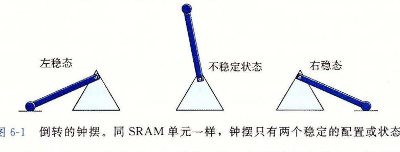

当钟摆倾斜到最左边或最右边时,它是稳定的 从其他任何位置,钟摆都会倒向一边 或另一边 原则上,钟摆也能在垂直的位置尤限期地保持平衡,但是这个状态是亚稳态的 (metastable) 最细微的扰动也能使它倒下,而且 旦倒下就永远不会再恢复到垂直的 置。

由千 SRAM 存储器单元的双稳态特性,只要有电,它就会永远地保持它的值。即使 有干扰(例如电 子噪 音)来扰乱电压,当干扰消除时,电路就会恢复到稳定值。

#### 动态 RAM

DRAM 将每个位存储为对 个电容的充电 这个电容非常小,通常只有大约 <sup>30</sup> 毫微 微法拉 (femtofarad) 30X <sup>10</sup> <sup>15</sup> 法拉 不过,回想一下法拉是一个非常大的计量单位. DRAM 存储器可以制造得非常密集 每个单元由一个电容和一个访问品体管组成 是,与 SRAM 不同, DRAM 存储器单元对干扰非常敏感 。当 电容的电压被扰乱之后,它 就永远不会恢复了。暴露在光线 下会导致电容电压改 变。实际上,数码照相机和摄像机中 的传感器本质上就是 DRAM 单元的阵列。

很多原因会导致漏电,使得 DRAM 单元在 10~ <sup>100</sup> 毫秒时间内失去电荷。幸运的是, 机运行的时钟周期是以纳秒来衡量的,所以相对而 这个保持时间是比较长的 内存 系统必须周期性地通过读出,然后重写来刷新内存 一位。有些系统也使用纠错码,其中 计算机的字会被多编码几个位(例如 <sup>64</sup> 位的字可能用 <sup>72</sup> 位来编码),这样一来,电路可以 发现并纠正 个字中任何单个的错误位。

图 6-2 总结了 SRAM 和 DRAM 存储器的特性。只要有供电,SRAM 就会保持不变。与 DRAM 不同,它不需要刷新。SRAM 的存取比 DRAM 快。SRAM 对诸如光和电噪声这样的干扰不敏感。代价是 SRAM 单元比 DRAM 单元使用更多的晶体管,因而密集度低,而且更贵,功耗更大。

|      | 每位晶体管数 | 相对访问时间 | 持续的? | 敏感的? | 相对花费  | 应用       |
|------|--------|--------|------|------|-------|----------|
| SRAM | 6      | 1×     | 是    | 否    | 1000× | 高速缓存存储器  |
| DRAM | 1      | 10×    | 否    | 是    | 1×    | 主存, 帧缓冲区 |

图 6-2 DRAM 和 SRAM 存储器的特性

#### 3. 传统的 DRAM

DRAM 芯片中的单元(位)被分成 d 个超单元(supercell),每个超单元都由 w 个 DRAM 单元组成。一个  $d \times w$  的 DRAM 总共存储了 dw 位信息。超单元被组织成一个 r 行 c 列的长方形阵列,这里 rc=d。每个超单元有形如(i, j)的地址,这里 i 表示行,而 j 表示列。

例如,图 6-3 展示的是一个  $16\times8$  的 DRAM 芯片的组织,有 d=16 个超单元,每个超单元有 w=8 位,r=4 行,c=4 列。带阴影的方框表示地址(2,1)处的超单元。信息通过称为引牌(pin)的外部连接器流入和流出芯片。每个引脚携带一个 1 位的信号。图 6-3 给出了两组引脚:8 个 data 引脚,它们能传送一个字节到芯片或从芯片传出一个字节,以及 2 个 addr引脚,它们携带 2 位的行和列超单元地址。其他携带控制信息的引脚没有显示出来。

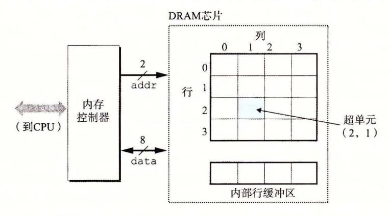

图 6-3 一个 128 位 16×8 的 DRAM 芯片的高级视图

## 旁注 关于术语的注释

存储领域从来没有为 DRAM 的阵列元素确定一个标准的名字。计算机构架师倾向于称之为"单元",使这个术语具有 DRAM 存储单元之意。电路设计者倾向于称之为"字",使之具有主存一个字之意。为了避免混淆,我们采用了无歧义的术语"超单元"。

每个 DRAM 芯片被连接到某个称为内存控制器(memory controller)的电路,这个电路可以一次传送 w 位到每个 DRAM 芯片或一次从每个 DRAM 芯片传出 w 位。为了读出超单元(i, j)的内容,内存控制器将行地址 i 发送到 DRAM,然后是列地址 j。DRAM 把超单元(i, j)的内容发回给控制器作为响应。行地址 i 称为 RAS(Row Access Strobe,行访问选通脉冲)请求。列地址 j 称为 CAS(Column Access Strobe,列访问选通脉冲)请求。

例如,要从图 6-3 中 16×8 的 DRAM 中读出超单元(2, 1),内存控制器发送行地址 2,如图 6-4a 所示。DRAM 的响应是将行 2 的整个内容都复制到一个内部行缓冲区。接下来,内存控制器发送列地址 1,如图 6-4b 所示。DRAM 的响应是从行缓冲区复制出超单元(2,1)中的 8 位,并把它们发送到内存控制器。

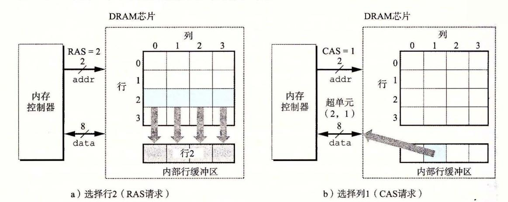

图 6-4 读一个 DRAM 超单元的内容

电路设计者将 DRAM 组织成二维阵列而不是线性数组的一个原因是降低芯片上地址引脚的数量。例如,如果示例的 128 位 DRAM 被组织成一个 16 个超单元的线性数组,地址为 0~15,那么芯片会需要 4 个地址引脚而不是 2 个。二维阵列组织的缺点是必须分两步发送地址,这增加了访问时间。

#### 4. 内存模块

DRAM 芯片封装在内存模块(memory module)中,它插到主板的扩展槽上。Core i7 系统使用的 240 个引脚的双列直插内存模块(Dual Inline Memory Module, DIMM),它以 64 位为块传送数据到内存控制器和从内存控制器传出数据。

图 6-5 展示了一个内存模块的基本思想。示例模块用 8 个 64 Mbit 的 8 M×8 的 DRAM 芯片,总共存储 64MB(兆字节),这 8 个芯片编号为  $0\sim7$ 。每个超单元存储主存的一个字节,而用相应超单元地址为(i,j)的 8 个超单元来表示主存中字节地址 A 处的 64 位字。在图 6-5 的示例中,DRAM 0 存储第一个(低位)字节,DRAM 1 存储下一个字节,依此类推。

要取出内存地址 A 处的一个字,内存控制器将 A 转换成一个超单元地址 (i,j),并将它发送到内存模块,然后内存模块再将 i 和 j 广播到每个 DRAM。作为响应,每个 DRAM输出它的 (i,j) 超单元的 8 位内容。模块中的电路收集这些输出,并把它们合并成一个 64 位字,再返回给内存控制器。

通过将多个内存模块连接到内存控制器,能够聚合成主存。在这种情况中,当控制器收到一个地址 A 时,控制器选择包含 A 的模块 k,将 A 转换成它的(i,j)的形式,并将(i,j)发送到模块 k。

**还** 练习题 6.1 接下来,设 r 表示一个 DRAM 阵列中的行数,c 表示列数, $b_r$  表示行寻址所需的位数, $b_c$  表示列寻址所需的位数。对于下面每个 DRAM,确定 2 的幂数的阵列维数,使得  $\max(b_r, b_c)$  最小, $\max(b_r, b_c)$  是对阵列的行或列寻址所需的位数中较大的值。

| 组织      | r | C | b, | b c | max(b,, b) |
|---------|---|---|----|-----|------------|
| 16 X l  |   |   |    |     |            |
| !6 X4   |   |   |    |     |            |
| 128X8   |   |   |    |     |            |
| 512 X4  |   |   |    |     |            |
| 1024 X4 |   |   |    |     |            |

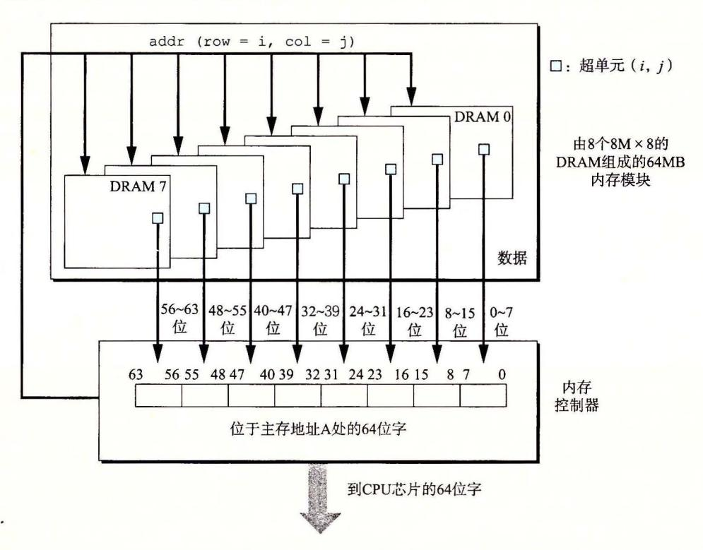

6-5 读一个 内存模块的内容

#### 增强的 DRAM

有许多种 DRAM 存储器,而生产厂商试图跟上迅速增长的处理器速度,市场上就会 定期推出新的种类。每种都是基于传统的 DRAM 单元,并进行一些优化,提高访问基本 DRAM 单元的速度。

- ·快页 模式 DRAMCFast Page Mode DRAM, FPM DRAM) 传统的 DRAM 将超单 元的一整行复制到它的内部行缓冲区中,使用一个,然后丢弃剩余的。 FPM DRAM 允许对同一行连续地访问可以直接从行缓冲区得到服务,从而改进了这一 点。例如,要从一个传统的 DRAM 的行 中读 个超单元,内存控制器必须发送 RAS/CAS 请求,即使是行地址 在每个情况中都是一样的。要从一个 FPM DRAM 的同一行中读取超 元,内存控制器发送第一个 RAS/CAS 请求,后面跟三 CAS 请求。初始的 RAS/CAS 请求将行 复制到行缓冲区,并返回 CAS 寻址的那个 。接下来三个超单元直接从行缓冲区获得,因此返回得比初始的超单元更快
- ·扩展数据轮出 DRAM(Extended Data Out DRAM, EDO DRAM) FPM DRAM 一个增强的形式,它允许各个 CAS 信号在时间上靠得更紧密一点。

- ·同步 DRAM(Synchronous DRAM, SDRAM) 。就它们与内存控制器通信使用一组显式的 控制信号来说,常规的、 FPM EOO DRAM 都是异步的。 SDRAM 用与驱动内存控制 器相同的外部时钟信号的上升沿来代替许多这样的控制信号。我们不会深入讨论细节, 最终效果就是 SDRAM 能够比那些异步的存储器更快地输出它的超单元的内容。
- ·双倍数据速率同步 DRAM (Double Data-Rate Synchronous DRAM, DDR SDRAM) DDR SDRAM 是对 SDRAM 的一种增强,它通过使用两个时钟沿作为控制信号, 从而使 DRAM 的速度翻倍 不同类型的 DDR SDRAM 是用提高有效带宽的很小的 预取缓冲区的大小来划分的: DDR(2 位)、 DDR2(4 位)和 DDR(8 位)
- ·视频 RAM(Video RAM, VRAM) 。它用在图形系统的帧缓冲区中。 VRAM 的思想 FPM DRAM 类似。两个主要区别是: 1) VRAM 的输出是通过依次对内部缓冲 区的整个内容进行移位得到的; 2) VRAM 允许对内存并行地读和写。因此,系统 可以在写下一次更新的新值(写)的同时,用帧缓冲区中的像素刷屏幕(读)。

# DRAM 技术流行的历史

直到 <sup>1995</sup> 年,大多数 PC 都是用 FPM DRAM 构造的 <sup>1996</sup> ~ <sup>99</sup> 年, EDO DRAM 在市场上占据了主导,而 FPM DRAM 几乎销声匿迹了 SDRAM 最早出现在 <sup>1995</sup> 年的高端系统中,到 <sup>20</sup> <sup>02</sup> 年,大多数 PC 都是用 SDRAM DDR SDRAM 制造 年之前,大多数服务器和桌面系统都是用 DDR SDRAM 构造的 实际上 Intel Core i7 只支持 DDR3 SDRAM

### 非易失性存储器

如果断电, DRAM SRAM 会丢失它们的信息,从这个意义上说,它们是易失的 (vol tile) 。另一方面,非易失性存储器 (nonvolatile memory) 即使是在关电后,仍然保存 着它们的信息 现在有很多种非易失性存储器。由于历史原因,虽然 ROM 中有的类型既 可以读也可以写,但是它们整体上都被称为只读存储器 (Read-Only Memory, ROM) ROM 是以它们能够被重编程(写)的次数和对它们进行重编程所用的机制来区分的。

PROM(Programmable ROM, 可编程 ROM) 只能被编程一次。 PROM 的每个存储器 单元有 种熔丝 (fuse) ,只能用高电流熔断一次。

可擦写可编程 ROM (Erasable Programmable ROM, EPROM) 有一个透明的石英窗 口,允许光到达存储单元。紫外线光照射过窗口, EPROM 单元就被清除为 。对 EPROM 编程是通过使用一种把 写入 EPROM 的特殊设备来完成的。 EPROM 能够被擦 除和重编程的次数的数 级可以达到 <sup>1000</sup> 次。电子可擦除 PROM (Electrically Erasable PROM, EEPROM) 类似于 EPROM, 但是它不需要一个物理上独立的编程设备,因此可 以直接在印制电路卡上编程。 EEPROM 能够被编程的次数的数量级可以达到 <sup>10</sup> 次。

闪存 (flash memory) 是一类非易失性存储器,基于 EEPROM, 它已经成为了一种重 要的存储技术。闪存无处不在,为大量的电子设备提供快速而持久的非易失性存储,包括 数码相机、手机、音乐播放器、 PDA 和笔记本、台式机和服务器计算机系统。在 6. 1. 3 节中,我们会仔细研究一种新型的基于闪存的磁盘驱动器,称为固态硬盘 (Solid State Disk, SSD) ,它能提供相对千传统旋转磁盘的一种更快速、更强健和更低能耗的选择。

存储在 ROM 设备中的程序通常被称为固件 (firmware) 。当一个计算机系统通电以后, 它会运行存储在 ROM 中的固件。一些系统在固件中提供了少鼠基本的输入和输出函 例如 PC BIOS (基本输入 输出系统)例程 复杂的设备,像图形卡和磁盘驱动控 制器,也依赖固件翻译来自 CPU (输入 求。

# 访问主存

数据流通过称为总线 (bus) 的共享电子电路在处理器和 DRAM 存之间来来回回 CPU 和主存之间的数据传送都是通过 系列步骤来完成的,这些步骤称为总线事务 (bus transaction) 。读事务 (read transaction) 从主 传送数据到 CPU 。写事务 (write transaction) CPU 传送数据到主

总线是一组并行的导线,能携带地址、 据和控制信号 取决千总线的设计,数据和 地址信号可以共 同一组导线,也可以使用不同的。同时,两个以上的设备也能共 同一 总线 控制线携带的信号会同步事务, 标识出 前正 在被 执行的 务的 类型 。例如,当 前关注的这个事务是到主存的吗?还 盘控 制器这样的其他 设备?这个 是读还是写?总线上的信息是地址还是数据项?

6-6 展示了 个示例计算机系统 置。 主要 件是 CPU 芯片、我们将称为 1/0 桥接器 (I bridg 的芯片组(其中包括内存控制器),以及组成主存的 DRAM 内存模块。 这些部件由 对总线连接起来,其中 条总线是系统总线 (system bus) ,它连接 CPU 1/0 桥接器,另一条总线是内存总线 (m mory bus) ,它连接 1/0 桥接器和主存 桥接 器将系统总线的电子信号翻译成内存总线的电子信号。 如我们 到的那样, 1/0 桥也将 系统总线和内存总线连接到 1/0 总线,像磁 和图形 这样的 1/ 设备共 1/0 总线。不 过现在,我们将 意力集中在内存总线 上。

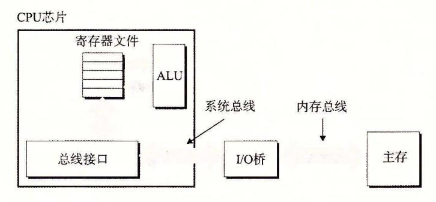

6-6 连接 PU 存的总线 构示例

# 苤千总线设 的注释

总线设计是计算机系统一个复杂而且变化迅速的方面。不同的厂商提出了不同的总线 体系结构,作为产品差异化的一种方法 例如, Intel 系统使用称为北桥 (northbridge) 和南 (southbridge) 的芯片组分别将 CPU 连接到内存和 设备 在比较老的 Pentium Core 系统中,前端总线 (Front Side Bus, FSB) CPU 连接到北桥 来自 AMD 的系统将 FSB 替换为超传输 (HyperTransport) 互联,而更新一些的 Intel Core i7 系统使用的是快速通道 (QuickPath) 互联 这些不同总线体系结构的细节超出了本书的范围 反之,我们会使用图 6-6 中的高级总线体系结构作为 个运行示例贯穿本书 这是 个简单但是有用的抽象, 使得我们可以很具体,并且可以掌握 要思想而不必与任何私有设计的细节绑得太紧。

考虑当 CPU 执行一个如下加载操作时会发生什么

movq A,%rax

这里,地址 的内容被加载到寄存器% rax 中。 CPU 芯片上称为总线接口 (bus interface)

的电路在总线上发起读事 务。读 务是由三个步骤组成的。首先, CPU 将地址 放到系 统总线上。 桥将信号传递到内存总线(图 7a) 接下来,主存感觉到内存总线上的地 址信号,从内存总线读地址,从 DRAM 取出数据字,并将数据写到内存总线 I/0 桥将 内存总线信号翻译成系统总线信号,然后沿着系统总线传递(图 6-7b) 。最后, CPU 感觉 到系统总线上的数据,从总线上读数据,并将数据复制到寄 器% rax (图 6-7c)

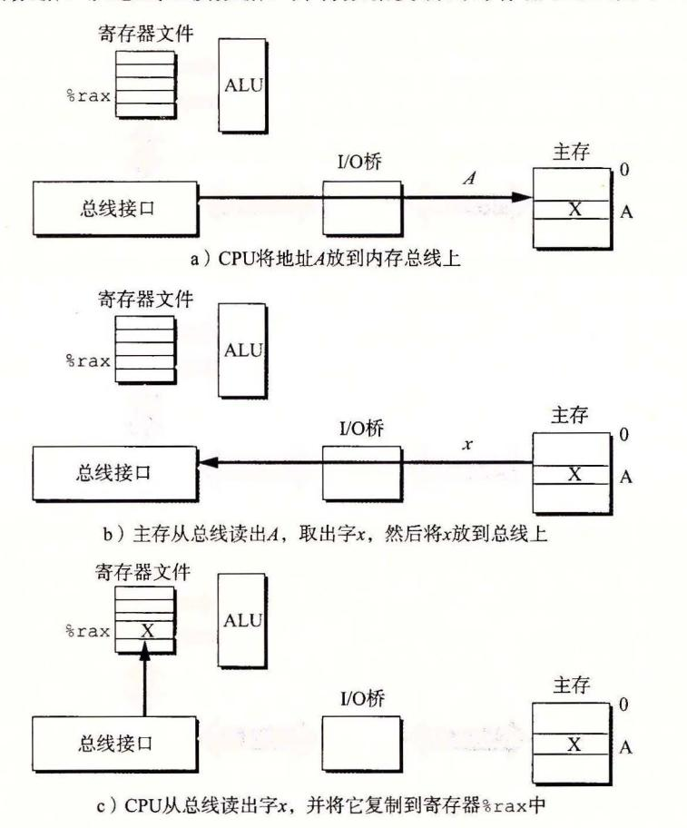

-7 加载操作 movqA, rax 的内存读

反过来,当 CPU 执行一个像下面这样的存储操作时 movq %rax,A

这里,寄存器%rax 的内容被写到地址 A, CPU 发起写事务。同样,有三个基本步骤。首先, CPU 将地址放到系统总线上。内存从内存总线读出地址,并等待数据到达(图 8a) 。接下 来, CPU rax 中的数据字复制到系统总线(图 6-86) 。最后,主存从内存总线读出数据 字,并且将这些位存储到 DRAM 中(图 6-8c)

### 6. 1. 2 磁盘存储

磁盘是广为应用的保存大量数据的存储设备,存储数据的数量级可以达到几百到几于 千兆字节,而基千 RAM 的存储器只能有几百或几千兆字节 不过,从磁盘上读信息的时 间为毫秒级,比从 DRAM 读慢了 万倍,比从 SRAM 读慢了 <sup>100</sup> 万倍。

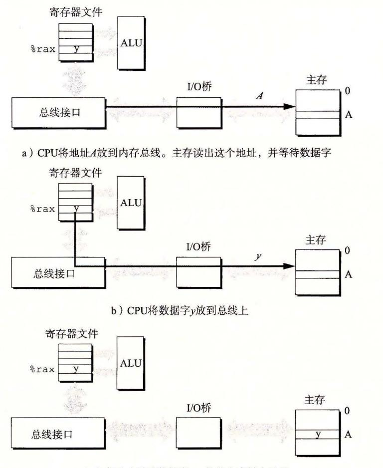

c) 从总线读数据 y, 并将它存储在地址

存储操作 movq % rax,A 的内存写事务

### 磁盘构造

磁盘是由盘片 (platter) 构成的 每个盘片有两面或者称为表面 (surface) ,表面覆盖着 磁性记录材料。盘片中央有 个可以旋转的主轴 (spindle) ,它使得盘片以固定的旋转速率 (rotational rate) 旋转,通常是 5400~15 <sup>000</sup> 转每分钟 (Revolution Per Minute, RPM) 盘通常包含一个或多个这样的盘片,并封装在一个密封的容器内。

9a 展示了一个典型的磁盘表面的结构。每个表面是由一组称为磁道 (track) 的同 心圆组成的。每个磁道被划分为 组扇区 (sector) 。每个扇区包含相等数量的数据位(通常 <sup>512</sup> 字节),这些数据编码在扇区上的磁性材料中。扇区之间由一些间隙 (gap) 分隔开, 这些间隙中不存储数据位。间隙存储用来标识扇区的格式化位。

磁盘是由一个或多个叠放在一起的盘片组成的,它们被封装在一个密封的包装里,如 6-9b 所示。整个装置通常被称为磁盘驱动器 (disk drive) ,我们通常简称为磁盘 (disk) 有时,我们会称磁盘为旋转磁盘 (rotating disk) ,以使之区别千基于闪存的固态硬盘 (SSD), SSD 是没有移动部分的。

磁盘制造商通常用术语柱面 (cylinder) 来描述多个盘片驱动器的构造,这里,柱面是 所有盘片表面上到 轴中心的距离相等的磁道的集合。例如,如果一个驱动器有三个盘片 和六个面,每个表面上的磁道的编号都是一致的,那么柱面 就是 个磁道 的集合。

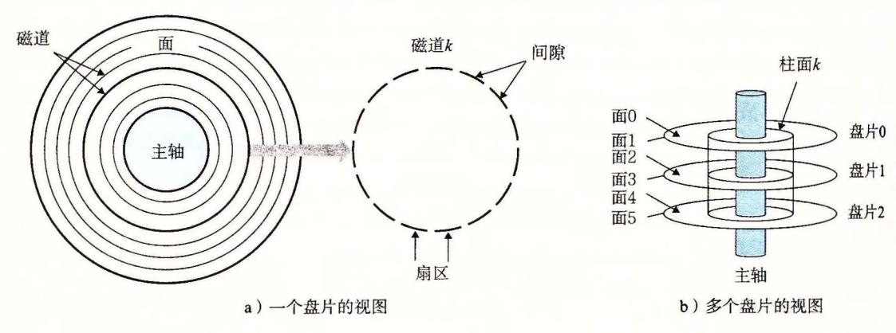

### 磁盘容量

- 一个磁盘上可以记录的最大位数称为它的最大容量,或者简称为容量。磁盘容 量是 以下技术因素决定的:
  - ·记录密度 recording density) (位 英寸):磁道 英寸的段中可以放入的位数。 ·
  - ·磁道密度 (track ensity) (道 英寸):从盘片中心出发半径上一英寸的段内可以有的 磁道数。
  - ·面密度 (areal density) (位 平方英寸):记录密度与磁道密度的乘积。

磁盘制造商不懈地努力以提高面密度(从而增加容量),而面密度每隔几年就会翻倍。 最初的磁盘 ,是在面密度很低的时代设计的,将每个磁道分为数目相同的扇区, 扇区的数 目是由最靠 内的磁道能记 录的扇区数决定 的。为了保持每个磁道有 固定的扇区数,越往外 的磁道扇区隔得越开。在面密度相对比较低的时候,这种方法还算合理。不过,随着面密 度的提高,扇区之间的间隙(那里 没有存储数据位)变得不 可接 受地大。因 此,现代大容量 磁盘使用一种称为多区记录 (mu tip le zone recording) 的技术,在这种技术中,柱面的集合 被分割成不相交的子集合,称为记录区 recording zone) 。每个区包含一组连续的柱面 个区中的每个柱面中的每条磁道都有相同数最的扇区,这个扇区的数量是由该区中最里面 的磁道所能包含的扇区数确定的。

下面的公式给出了一个磁盘的容量

磁盘容量= <sup>X</sup>字节数 平均扇区数 地道数 表面数 盘片数 <sup>X</sup>扇区 磁道 表面 盘片 磁盘

例如,假设我们有一个磁盘,有 个盘片,每个扇区 <sup>512</sup> 个字节,每个面 <sup>20</sup> <sup>000</sup> 条磁道, 每条磁道平均 <sup>300</sup> 个扇区。那么这个磁盘的容量是:

磁盘容量 = 
$$\frac{512 \, \text{字节}}{\text{扇区}} \times \frac{300 \, \text{扇区}}{\text{磁道}} \times \frac{20\,000 \, \text{磁道}}{\text{表面}} \times \frac{2\,\text{表面}}{\text{盘片}} \times \frac{5\,\text{盘片}}{\text{磁盘}}$$
 = 30 720 000 000 字节 = 30. 72 GB

注意,制造商是以于兆字节 (GB) 或兆兆字节 (TB) 为单位来表达磁盘容量的,这里 lGB=l 矿字节, lTB 庐字节。

# -千兆字节有多大

不幸地,像 K(kilo) M(mega) G(giga) T(tera) 这样的前缀的含义依赖于上下

文。对于与 DRAM 和 SRAM 容量相关的计量单位,通常  $K=2^{10}$  , $M=2^{20}$  , $G=2^{30}$  ,而  $T=2^{40}$  。对于与像磁盘和网络这样的 I/O 设备容量相关的计量单位,通常  $K=10^3$  , $M=10^6$  , $G=10^9$  ,而  $T=10^{12}$  。速率和吞吐量常常也使用这些前缀。

幸运地,对于我们通常依赖的不需要复杂计算的估计值,无论是哪种假设在实际中都工作得很好。例如, $2^{30}$ 和 $10^9$ 之间的相对差别不大:  $(2^{30}-10^9)/10^9\approx7\%$ 。类似, $(2^{40}-10^{12})/10^{12}\approx10\%$ 。

○ 练习题 6.2 计算这样一个磁盘的容量,它有 2 个盘片,10 000 个柱面,每条磁道平均有 400 个扇区,而每个扇区有 512 个字节。

#### 3. 磁盘操作

磁盘用读/写头(read/write head)来读写存储在磁性表面的位,而读写头连接到一个传动臂(actuator arm)一端,如图 6-10a 所示。通过沿着半径轴前后移动这个传动臂,驱动器可以将读/写头定位在盘面上的任何磁道上。这样的机械运动称为寻道(seek)。一旦读/写头定位到了期望的磁道上,那么当磁道上的每个位通过它的下面时,读/写头可以感知到这个位的值(读该位),也可以修改这个位的值(写该位)。有多个盘片的磁盘针对每个盘面都有一个独立的读/写头,如图 6-10b 所示。读/写头垂直排列,一致行动。在任何时刻,所有的读/写头都位于同一个柱面上。

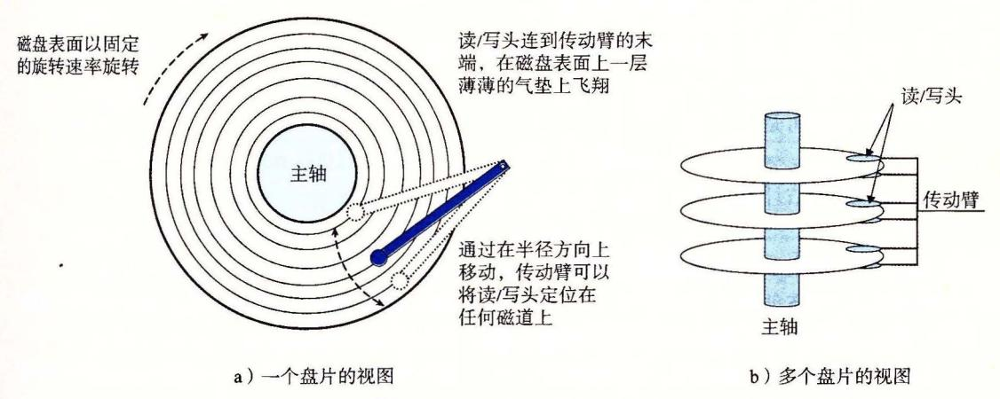

图 6-10 磁盘的动态特性

在传动臂末端的读/写头在磁盘表面高度大约 0.1 微米处的一层薄薄的气垫上飞翔(就是字面上这个意思),速度大约为 80 km/h。这可以比喻成将一座摩天大楼(442 米高)放倒,然后让它在距离地面 2.5 cm(1 英寸)的高度上环绕地球飞行,绕地球一天只需要 8 秒钟! 在这样小的间隙里,盘面上一粒微小的灰尘都像一块巨石。如果读/写头碰到了这样的一块巨石,读/写头会停下来,撞到盘面——所谓的读/写头冲撞(head crash)。为此,磁盘总是密封包装的。

磁盘以扇区大小的块来读写数据。对扇区的访问时间(access time)有三个主要的部分: 寻道时间(seek time)、旋转时间(rotational latency)和传送时间(transfer time);

• **寻道时间**:为了读取某个目标扇区的内容,传动臂首先将读/写头定位到包含目标扇区的磁道上。移动传动臂所需的时间称为寻道时间。寻道时间  $T_{\text{seek}}$  依赖于读/写头以前的位置和传动臂在盘面上移动的速度。现代驱动器中平均寻道时间  $T_{\text{avg seek}}$  是通过对几千次对随机扇区的寻道求平均值来测量的,通常为  $3 \sim 9 \text{ms}$ 。一次寻道的最大时间  $T_{\text{max seek}}$  可以高达 20 ms。

·旋转时间:一旦读/写头定位到了期望的磁道,驱动器等待目标扇区的第一个位旋 转到读/写头下。这个步骤的性能依赖于当读/写头到达目标扇区时盘面的位置以及 磁盘的旋转速度。在最坏的情况下,读/写头刚刚错过了目标扇区,必须等待磁盘 转一整圈。因此,最大旋转延迟(以秒为单位)是

$$T_{\text{\tiny max rotation}} = \frac{1}{\text{RPM}} \times \frac{60 \text{s}}{1 \text{min}}$$

平均旋转时间 T,vg rntation max rntation 的一半。

·传送时间:当目标扇区的第一个位位千读/写头下时,驱动器就可以开始读或者写 该扇区的内容了。 个扇区的传送时间依赖千旋转速度和每条磁道的扇区数目。因 此,我们可以粗略地估计一个扇区以秒为单位的平均传送时间如下

$$T_{\text{avg transfer}} = \frac{1}{\text{RPM}} \times \frac{1}{($$
平均扇区数 / 磁道 $)} \times \frac{60 \text{s}}{1 \text{min}}$ 

我们可以估计访问一个磁盘扇区内容的平均时间为平均寻道时间、平均旋转延迟和平均传 送时间之和。例如,考虑一个有如下参数的磁盘:

| 参数         |         |
|------------|---------|
| 旋转速率       | 7200RPM |
| T avgso,,k | 9ms     |
| 每条磁道的平均扇区数 | 400     |

对于这个磁盘,平均旋转延迟(以 ms 为单位)是

Tavgrntation = 1/2 X Tmaxrntation = 1/2 X (60s/7200 RPM) X 1000 IDS 压:::::::: ms 平均传送时间是

T,vg trnnsfe, = 60/7200 RPM X 1/ <sup>400</sup> 扇区/磁道 1000 ms压:::::::: 0. 02 ms 总之,整个估计的访间时间是

Taccess = Tavg,eek + Tavg rntation + T,vg trnn,fe, = 9 ms+ 4 ms+ 0. 02 ms = 13. 02 ms 这个例子说明了一些很重要的问题:

- ·访问一个磁盘扇区中 <sup>512</sup> 个字节的时间主要是寻道时间和旋转延迟。访问扇区中的 第一个字节用了很长时间,但是访问剩下的字节几乎不用时间。
- ·因为寻道时间和旋转延迟大致相等,所以将寻道时间乘 是估计磁盘访问时间的简 单而合理的方法。
- ·对存储在 SRAM 中的一个 <sup>64</sup> 位字的访问时间大约是 4ns, DRAM 的访问时间是 60ns 。因此,从内存中读一个 <sup>512</sup> 个字节扇区大小的块的时间对 SRAM 来说大约是 256ns, DRAM 来说大约是 4000ns 。磁盘访问时间,大约 lOms, SRAM 的大 <sup>40</sup> <sup>000</sup> 倍,是 DRAM 的大约 <sup>2500</sup> 倍。

练习题 3 估计访问下面这个磁盘上一个扇区的访问时间(以 ms 为单位):

| 参数         |           |  |
|------------|-----------|--|
| 旋转速率       | 15 000RPM |  |
| T avg seek | 8 ms      |  |
| 每条磁道的平均扇区数 | 500       |  |

### 4. 逻辑磁盘块

正如我们看到的那样,现代磁盘构造复杂,有多个盘面,这些盘面上有不同的记录 区。为了对操作系统隐藏这样的复杂性,现代磁盘将它们的构造呈现为 个简单的视图,

一个 个扇区大小的逻辑块的序列,编号为 o, 1, …, 磁盘封装中有一个小的硬 固件设备,称为磁盘控制器,维护着逻辑块号和实际(物理)磁盘扇区之间的映射关系。

当操作系统想要执行一个 I/0 操作时,例如读一个磁盘扇区的数据到主存,操作系统会发 送一个命令到磁盘控制器,让它读某个逻辑块号。控制器上的固件执行一个快速表查找,将一 个逻辑块号翻译成一个(盘面,磁道,扇区)的三元组,这个 元组唯一地标识了对应的物理扇 区。控制器上的硬件会解释这个 元组,将读 写头移动到适当的柱面,等待扇区移动到读/写 头下,将读 写头感知到的位放到控制器上的一个小缓冲区中,然后将它们复制到主存中。

# 格式化的磁盘容量

磁盘控制器必须对磁盘进行格式化,然后才能在该磁盘上存储数据 格式化包括用 标识扇区的信息填写扇区之间的间隙,标识出表面有故障的柱面并且不使用它们,以及 在每个区中预留出一组柱面作为备用,如果区中一个或多个柱面在磁盘使用过程中坏掉 了,就可以使用这些备用的柱面 因为存在着这些备用的柱面,所以磁盘制造商所说的 格式化容量比最大容量要小

练习题 4 假设 1MB 的文件由 <sup>512</sup> 个字节的逻辑块组成,存储在具有如下特性的磁 盘驱动器上:

| 参数          |          |  |
|-------------|----------|--|
| 旋转速率        | 10000RPM |  |
| T av2S~k    | 5 ms     |  |
| 平均<br>区数/磁道 | 1000     |  |
| 表面          | 4        |  |
| 扇区大小        | 512 字节   |  |

对于下面的情况,假设程序 序地读文件的逻辑块,一个接一个,将读 写头定 位到第一块上的时间是 Ta seek+ T avg rota uon o

- ·A.最好的情况:给定逻辑块到磁盘扇区的最好的可能的映射(即顺序的),估计读这 个文件需要的最优时间(以 ms 为单位)
- B. 随机的情况:如果块是随机地映射到磁盘扇区的,估计读这个文件需要的时间(以 ms 为单位)。

#### 5. 连接 1/0 设备

例如图形卡、监视器、鼠标、键盘和磁盘这样的输入/输出 (I 0) 设备,都是通过 I/0 总线,例如 Intel 的外围设备互连 (Peripheral Component Interconnect, PCI) 总线连接到 CPU 和主存的。系统总线和内存总线是与 CPU 相关的,与它们不同,诸如 PCI 这样的 I/ 总线设计成与底层 CPU 无关。例如, PC Mac 都可以使用 PCI 总线。图 6-11 展示了 一个典型的 总线结构,它连接了 CPU 、主存和 I/0 设备。

虽然 I/0 总线比系统总线和内存总线慢,但是它可以容纳种类繁多的第三方 I/0 备。例如,在图 6-11 中,有三种不同类型的设备连接到总线。

- ·通用串行总线 (Universal Serial Bus, USB) 控制器是一个连接到 USB 总线的设备的中 转机构, USB 总线是一个广泛使用的标准,连接各种外围 I/0 设备,包括键盘、鼠 标、调制解调器、数码相机、游戏操纵杆、打印机、外部磁盘驱动器和固态硬盘。 USB 3. 总线的最大带宽为 625MB USB 3.1 总线的最大带宽为 1250MB
- ·图形卡(或适配器)包含硬件和软件逻辑,它们负责代表 CPU 在显示器上画像素。

● 主机总线适配器将一个或多个磁盘连接到 I/O 总线,使用的是一个特别的主机总线接口定义的通信协议。两个最常用的这样的磁盘接口是 SCSI(读作 "scuzzy")和 SATA(读作 "sat-uh"。 SCSI 磁盘通常比 SATA 驱动器更快但是也更贵。 SCSI 主机总线适配器(通常称为 SCSI 控制器)可以支持多个磁盘驱动器,与 SATA 适配器不同,它只能支持一个驱动器。

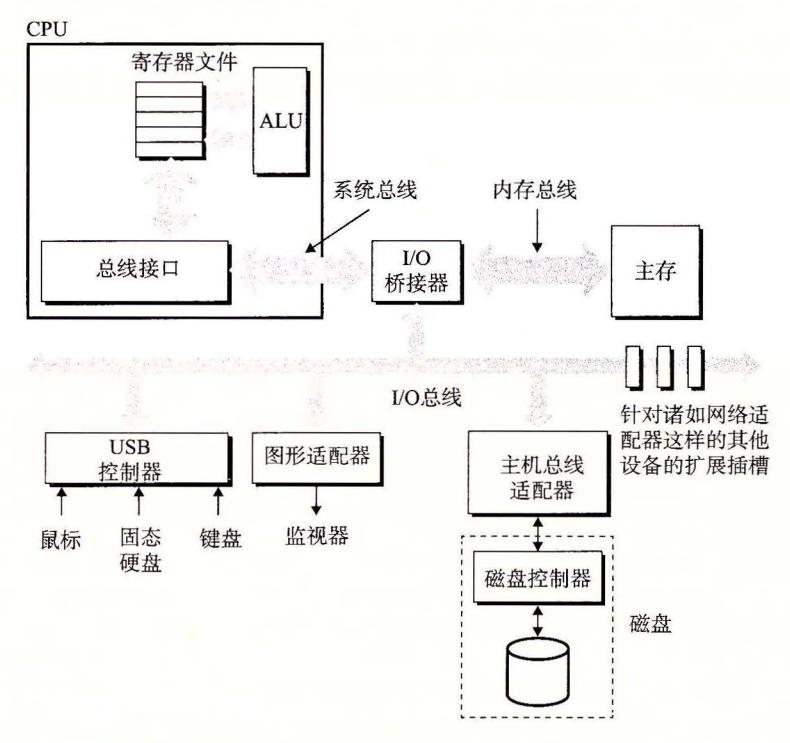

图 6-11 总线结构示例,它连接 CPU、主存和 I/O 设备

其他的设备,例如网络适配器,可以通过将适配器插入到主板上空的扩展槽中,从而连接到 I/O 总线,这些插槽提供了到总线的直接电路连接。

#### 6. 访问磁盘

虽然详细描述 I/O 设备是如何工作的以及如何对它们进行编程超出了我们讨论的范围,但是我们可以给你一个概要的描述。例如,图 6-12 总结了当 CPU 从磁盘读数据时发生的步骤。

### 旁注 I/O 总线设计进展

图 6-11 中的 I/O 总线是一个简单的抽象,使得我们可以具体描述但又不必和某个系统的细节联系过于紧密。它是基于外围设备互联(Peripheral Component Interconnect, PCI) 总线的,在 2010 年前使用非常广泛。PCI 模型中,系统中所有的设备共享总线,一个时刻只能有一台设备访问这些线路。在现代系统中,共享的 PCI 总线已经被 PCEe(PCI express) 总线取代,PCIe 是一组高速串行、通过开关连接的点到点链路,类似于你将在第 11 章中学习到的开关以太网。PCIe 总线,最大吞吐率为 16GB/s,比 PCI 总线快一个数量级,PCI 总线的最大吞吐率为 533MB/s。除了测量出的 I/O 性能,不同总线设计之间的区别对应用程序来说是不可见的,所以在本书中,我们只使用简单的共享总线抽象。

使用一种称为内存映射 O(memory-mapped 0) 的技术来向 I/0 设备发射命令 (图 6-lZa) 。在使用内存映射 I/0 的系统中,地址空间中有一块地址是为与 I/0 设备通信 保留的。每个这样的地址称为一个 1/0 端口 (I/0 port) 。当 个设备连接到总线时,它与 一个或多个端口相关联(或它被映射到一个或多个端口)。

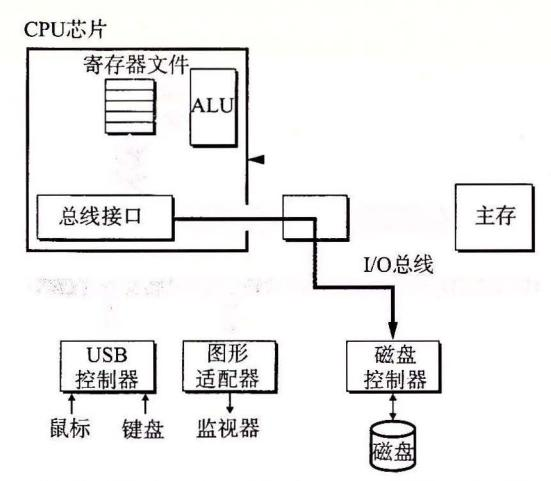

a) CPU通过将命令、逻辑块号和目的内存地址写到与磁盘相关联的内存映射地址,发起一个磁盘读

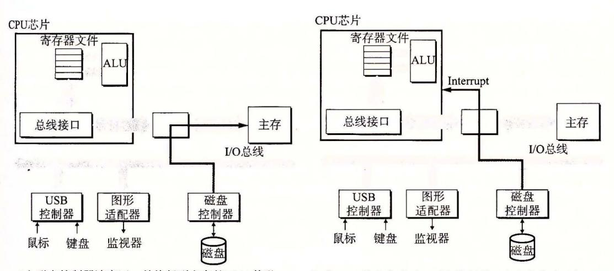

b) 磁盘控制器读扇区,并执行到主存的DMA传送

c) DMA传送完成时,磁盘控制器用中断的方式通知CPU

个磁盘扇区

来看 个简单的例子,假设磁盘控制器映射到端口 OxaO 。随后, CPU 可能通过执行三 个对地址 OxaO 的存储指令,发起磁盘读:第一条指令是发送一个命令字,告诉磁盘发起一 个读,同时还发送了其他的参数,例如当读完成时,是否中断 CPU (我们会在 8. 节中讨论中 断)。第二条指令指明应该读的逻辑块号。第三条指令指明应该存储磁盘扇区内容的主存地址。

CPU 发出了请求之后,在磁盘执行读的时候,它通常会做些其他的工作。回想一 下,一个 1GHz 的处理器时钟周期为 lns, 在用来读磁盘的 16ms 时间里,它潜在地可能 执行 <sup>1600</sup> 万条指令。在传输进行时,只是简单地等待,什么都不做,是一种极大的浪费。

在磁盘控制器收到来自 CPU 的读命令之后,它将逻辑块号翻译成一个扇区地址,读 该扇区的内容,然后将这些内容直接传送到主存,不需要 CPU 的干涉(图 6- 2b) 。设备可 以自己执行读或者写总线事务而不需要 CPU 干涉的过程,称为直接内存访问 (Direct Memory Access, DMA) 。这种数据 送称为 DMA 传送 CDMA ransfer)

DMA 传送完成,磁盘扇区的内容被安全地存储在主存中以后,磁盘控制器通过给 CPU 发送一个中断信号来通知 CPU (图 6-12c) 基本思想是中断会发信号到 CPU 芯片的 个外部引脚上。这会导致 CPU 暂停它 前正在做的工作,跳转到一个操作系统例程 这个程序会记录下 1/0 经完 成,然后将控制返回到 CPU 被中断的地方。

## 用磁 盘的特性

磁盘制造商在他们的网页 公布了许多高级技术信息。例如,希捷 (Seagate) 公司 的网站包含关于他们最受欢迎的驱动器之 Barracuda 7 <sup>400</sup> 的如下信息。(远不止如 此!) ( Seagate. com)

| 构造特性   |               | 构造特性     |          |
|--------|---------------|----------|----------|
| 表面直径   | 3.<br>英寸      | 旋转速率     | 7200 RPM |
| 格式化的容量 | 3TB           | 平均旋转时间   | 4. 16ms  |
| 盘片数    | 3             | 平均寻道时间   | 8. 5ms   |
| 表面数    | 6             | 道间寻道时间   | 1. Oms   |
| 逻辑块    | 5 860 533 168 | 平均传输时间   | 156MB/s  |
| 逻辑块大小  | 512 字节        | 最大持续传输速率 | 210MB/s  |

## 6. 1. 3 固态硬盘

固态硬盘 Solid State Disk , SSD) 种基于闪存的存储技术(参见 6. 1. 节),在某 些情况下是传统旋转磁盘的极 吸引力的替代产品 6-13 展示了它的基本思想 SSD 封装插到 总线上标准硬盘插槽 通常是 USB SATA) 中,行为就和其他硬盘一样, 处理来自 CPU 的读写逻辑磁盘块的请求 一个 SSD 封装由一个或多个闪存芯片和闪存翻 译层 (fla translation layer) 组成,闪存芯片 代传统旋转磁盘中的机械驱动器,而闪存 翻译层是一个硬件 固件设备,扮演与磁盘控制器相同的角色,将对逻辑块的请求翻译成 对底层物理设备的访问

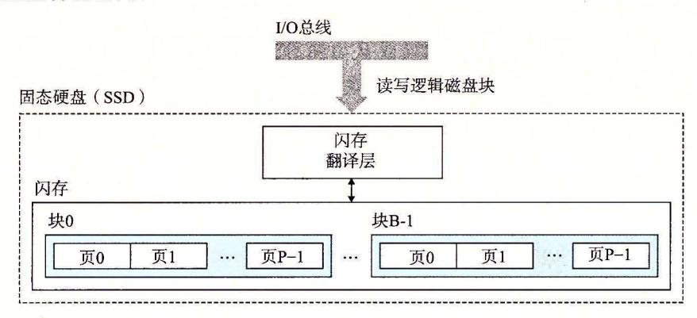

<sup>13</sup> 固态硬盘 (SSD)

6-14 展示了典型 SSD 的性能特性。注意,读 SSD 比写要快。随机读和写的性能 别是由底层闪存基本属性决定的 如图 6-13 个闪存由 个块的序列组成,每个 块由 页组成 通常,页的大小是 <sup>12</sup> 节~ 4KB, 32~128 页组成的,块的大小