16KB~5 12KB 数据是以页为单位读 只有在一页所属的块整个被擦除之后,才 能写这一页(通常是指该块中的所有位都被设置为 1) 。不过,一旦一个块被擦除了,块中 个页都可以不需要再进行擦除就 写一 在大约进行 <sup>100</sup> <sup>000</sup> 复写之后,块就会 磨损坏。一旦 个块磨损坏之后,就不能再使用了。

| 顺序读吞吐量             | 550MB/s     | 序写吞吐侃           | 470MB/s     |
|--------------------|-------------|-----------------|-------------|
| 吞吐<br>随机<br>(!OPS) | 89 000 !OPS | 随机写吞吐<br>(!OPS) | 74 000 !OPS |
| 随机读吞吐量<br>(MB s)   | 365MB/s     | 随机写吞吐<br>(MB s) | 303MB/s     |
| 读访问时间<br>均顺        | 50µs        | 平均随机写访问时间       | 60µs        |

一个 业固态硬盘的性能特

资料来源: Intel SSD 7 <sup>30</sup> 产品规格书 <sup>53</sup> !OP 是每秒 ()操作数。吞吐 量数量 基于 4KB 块的读写

随机写很慢,有两个原因。首先,擦除块需要相对较长的时间, lms 级的,比访问页 所需时间要高 个数量级。其次,如果 操作试图修改一个包 巳经有数据(也就是不是 全为 1) 的页 p, 那么这个块中所有带有用数据的页都必须被复制到一个新(擦除过的)块, 然后才能进行对页 的写。制造商已 在闪存翻译层中实现了复杂的逻辑,试图抵消擦写 块的高昂代价,最小化内部写的次数,但是随机写的性能不太可能和 读一 样好

比起旋转磁盘, SSD 有很多优点 它们由半导体存储器构成,没有移动的部件,因而 随机访问时间比旋转磁盘要快,能耗 低,同时也更结实 不过,也有 些缺点。首先, 因为反复写之后,闪存块会磨损,所以 SSD 也容易磨损。闪存翻译层中的平均磨损 (wear leveling) 逻辑试图通过将擦除平均分布 所有的块上来最大化 个块的寿命。实际上,平 均磨损逻辑处理得非常好,要很多年 SSD 才会磨损坏(参考练习题 6. 5) 。其次, SSD 每字 节比旋转磁盘贵大约 <sup>30</sup> 倍,因此常用的存储容最比旋转磁盘小 <sup>10</sup> 不过,随着 SSD 变得越来越受欢迎,它的价格下降得非常快,而两者的价格 也在减少

在便携 乐设备中, SSD 已经完全的取代了旋转磁盘,在笔记本电脑中也越来越多地 作为硬盘的替代品,甚至在台式机和服务器中也开始出现了。虽然旋转磁盘还会继续存 在,但是显然, SSD 是一项重要的替代选择。

- 练习题 5 正如我们已经看到的, SSD 的一个潜在的缺陷是底层闪存会磨损。例 如,图 6-14 所示的 SSD, Int 保证能够经得起 128PBC128 X <sup>101</sup> 字节)的写。给定这 样的假设,根据下面的工作负载,估计这款 SSD 的寿命(以年为单位):
  - A. 顺序写的最糟情况:以 470MB (该设备的平均 序写吞吐量)的速度持续地写 SSD
  - B. 随机写的最糟情况:以 303MB 设备的平均随机写吞吐 )的速度持续地写 SSD
  - C. 平均情况:以 20GB 天(某些计算机制造商在他们的移动计算机工作负载模拟测试 中假设的平均每天写速率)的速度写 SSD

#### 6. 1. 4 存储技术趋势

从我们对存储技术的讨论中,可以总结出儿个很重要的思想:

不同的存储技术有不同的价格和性能折中。 SRAM DRAM 点,而 DRAM 磁盘要快很多。另一方面,快速存储总是比慢速存储要贵的 SRAM 每字节的造价比 DRAM 高, DRAM 的造价又比磁盘高得多 SSD 位于 DRAM 和旋转磁盘之间。

不同存储技术的价格和性能属性以截然不同的速半变化着 6-15 总结了从 <sup>1985</sup>

以来的存储技术的价格和性能属性,那时第 PC 刚刚发明不久。这些数字是从以前的 商业杂志中和 Web 上挑选出来的。虽然它们是从非正式的调查中得到的,但是这些数字 还是能揭示出一些有趣的趋势

自从 <sup>1985</sup> 年以来, SRAM 技术的成本和性能基本上是以相同的速度改善的。访问时 间和每兆字节成本下降了大约 <sup>100</sup> 倍(图 6-15a) 不过, DRAM 和磁盘的变化趋势更大, 而且更不一致。 DRAM 节成本下降了 <sup>44</sup> <sup>000</sup> 倍(超过了四个数量级 ),而 DRAM 的访问时间只下降了大约 <sup>10</sup> 倍(图 6-156) 。磁盘技术有和 DRAM 相同的趋势,甚至变化 更大 <sup>1985</sup> 年以来,磁盘存储的每兆字节成本暴跌了 000 <sup>000</sup> 倍(超过了六个数僵 ),但是访问时间提高得很慢,只有 <sup>25</sup> 倍左右(图 6-15c) 。这些惊人的长期趋势突出了 内存和磁盘技术的一个基本事实:增加密度(从而降低成本)比降低访问时间容易得多。

DRAM 和磁盘的性能滞后于 CPU 的性能。正如我们在图 6-15d 中看到的那样,从 <sup>1985</sup> 年到 <sup>20</sup> 年, CPU 周期时间提高了 <sup>500</sup> 倍。如果我们看有效周期时间 (effective cycle time) -我 定义为一个单独的 CPU (处理器)的周期时间除以它的处理器核数一那 么从 <sup>1985</sup> 年到 <sup>2010</sup> 年的提高还要大一些,为 <sup>2000</sup> 倍。 CPU 性能曲线在 <sup>2003</sup> 年附近的突 然变化反映的是多核处理器的出现(参见 6. 节的旁注),在这个分割点之后,单个核的周 期时间实际上增加了一点点,然后又开始下降,不过比以前的速度要慢一些。

| 标准           | 1985 | 1990 | 1995 | 2000 | 2005 | 2010 | 2015 | 2015:1985 |
|--------------|------|------|------|------|------|------|------|-----------|
| 美元/MB        | 2900 | 320  | 256  | 100  | 75   | 60   | 25   | 116       |
| 访问时间<br>(ns) | 150  | 35   | 15   | 3    | 2    | 1.5  | 1.3  | 115       |

#### a) SRAM趋势

| 标准           | 1985  | 1990 | 1995 | 2000 | 2005 | 2010 | 2015   | 2015: 1985 |
|--------------|-------|------|------|------|------|------|--------|------------|
| /MB          | 880   | 100  | 30   | I    | 0.1  | 0.06 | 0.02   | 44 000     |
| 访问时间<br>(ns) | 200   | 100  | 70   | 60   | 50   | 40   | 20     | 10         |
| 典型的大小 (MB)   | 0.256 | 4    | 16   | 64   | 2000 | 8000 | 16 000 | 62 500     |

#### b) DRAM趋势

| 标准                | 1985    | 1990 | 1995 | 2000 | 2005 | 2010 | 2015 | 2015:1985 |
|-------------------|---------|------|------|------|------|------|------|-----------|
| 美元/GB             | 100 000 | 8000 | 300  | 10   | 5    | 0.3  | 0.03 | 3 333 333 |
| 最小<br>道时间<br>(ms) | 75      | 28   | 10   | 8    | 5    | 3    | 3    | 25        |
| 典型的<br>(GB)       | 0.01    | 0.16 | I    | 20   | 160  | 1500 | 3000 | 300 000   |

#### 旋转磁盘趋势

| 标准             | 1985   | 1990   | 1995  | 2000 | 2003  | 2005   | 2010 | 2015                    | 2015:1985 |
|----------------|--------|--------|-------|------|-------|--------|------|-------------------------|-----------|
| Intel CPU      | 80 286 | 80 386 | Pent. | -田   | Pent4 | Core 2 |      | Core i7 (n) Core I7 (h) |           |
| 时钟频<br>(MHz)   | 6      | 20     | 150   | 600  | 3300  | 2000   | 2500 | 3000                    | 500       |
| 时钟周期<br>(ns)   | 166    | 50     | 6     | 1.6  | 0.3   | 0.5    | 0.4  | 0.33                    | 500       |
| 核数             | I      | I      | I     | 1    | I     | 2      | 4    | 4                       | 4         |
| 有效周期时间<br>(ns) | 166    | 50     | 6     | 1.6  | 0.30  | 0.25   | 0.10 | 0.08                    | 2075      |

#### d) CPU趋势

<sup>15</sup> 存储和处理器技术发展趋势 <sup>010</sup> 年的 Cor i7 使用的是 Nehalem 处理器, <sup>2015</sup> 年的 i7 使用的是 Haswell

注意,虽然 SRAM 的性能滞后于 CPU 的性能,但还是在保持增长。不过,DRAM 和磁盘性能与 CPU 性能之间的差距实际上是在加大的。直到 2003 年左右多核处理器的出现,这个性能差距都是延迟的函数,DRAM 和磁盘的访问时间比单个处理器的周期时间提高得更慢。不过,随着多核的出现,这个性能越来越成为了吞吐量的函数,多个处理器核并发地向 DRAM 和磁盘发请求。

图 6-16 清楚地表明了各种趋势,以半对数为比例(semi-log scale),画出了图 6-15 中的访问时间和周期时间。

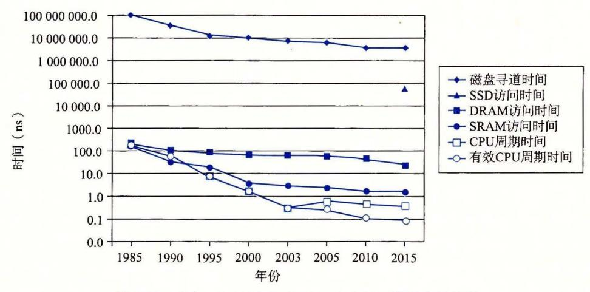

图 6-16 磁盘、DRAM 和 CPU 速度之间逐渐增大的差距

正如我们将在 6.4 节中看到的那样,现代计算机频繁地使用基于 SRAM 的高速缓存,试图弥补处理器-内存之间的差距。这种方法行之有效是因为应用程序的一个称为局部性 (locality)的基本属性,接下来我们就讨论这个问题。

○ 练习题 6.6 使用图 6-15c 中从 2005 年到 2015 年的数据,估计到哪一年你可以以\$500的价格买到一个 1PB(10<sup>15</sup> 字节)的旋转磁盘。假设美元价值不变(没有通货膨胀)。

#### 旁注 当周期时间保持不变:多核处理器的到来

计算机历史是由一些在工业界和整个世界产生深远变化的单个事件标记出来的。有趣的是,这些变化点趋向于每十年发生一次:20世纪50年代Fortran的提出,20世纪60年代早期IBM 360的出现,20世纪70年代早期Internet的曙光(当时称为APRANET),20世纪80年代早期IBM PC的出现,以及20世纪90年代万维网(World Wide Web)的出现。

最近这样的事件出现在 21 世纪初,当计算机制造商迎头撞上了所谓的"能量墙(power wall)",发现他们无法再像以前一样迅速地增加 CPU 的时钟频率了,因为如果那样芯片的功耗会太大。解决方法是用多个小处理器核(core)取代单个大处理器,从而提高性能,每个完整的处理器能够独立地、与其他核并行地执行程序。这种多核(multi-core)方法部分有效,因为一个处理器的功耗正比于  $P=fCv^2$ ,这里 f 是时钟频率,C 是电容,而 v 是电压。电容 C 大致上正比于面积,所以只要所有核的总面积不变,多核造成的能耗就能保持不变。只要特征尺寸继续按照摩尔定律指数性地下降,每个处理器中的核数,以及每个处理器的有效性能,都会继续增加。

从这个时间点以后,计算机越来越快,不是因为时钟频率的增加,而是因为每个处理器中核数的增加,也因为体系结构上的创新提高了在这些核上运行程序的效率。我们可以从图 6-16 中很清楚地看到这个趋势。CPU 周期时间在 2003 年达到最低点,然后实际上是又开始上

升的,然后变得平稳,之后又开始以比以前慢一些的速率下降。不过,由于多核处理器的出现(2004年出现双核,2007年出现四核),有效周期时间以接近于以前的速率持续下降。

## 6.2 局部性

一个编写良好的计算机程序常常具有良好的局部性(locality)。也就是,它们倾向于引用邻近于其他最近引用过的数据项的数据项,或者最近引用过的数据项本身。这种倾向性,被称为局部性原理(principle of locality),是一个持久的概念,对硬件和软件系统的设计和性能都有着极大的影响。

局部性通常有两种不同的形式:时间局部性(temporal locality)和空间局部性(spatial locality)。在一个具有良好时间局部性的程序中,被引用过一次的内存位置很可能在不远的将来再被多次引用。在一个具有良好空间局部性的程序中,如果一个内存位置被引用了一次,那么程序很可能在不远的将来引用附近的一个内存位置。

程序员应该理解局部性原理,因为一般而言,有良好局部性的程序比局部性差的程序运行得更快。现代计算机系统的各个层次,从硬件到操作系统、再到应用程序,它们的设计都利用了局部性。在硬件层,局部性原理允许计算机设计者通过引入称为高速缓存存储器的小而快速的存储器来保存最近被引用的指令和数据项,从而提高对主存的访问速度。在操作系统级,局部性原理允许系统使用主存作为虚拟地址空间最近被引用块的高速缓存。类似地,操作系统用主存来缓存磁盘文件系统中最近被使用的磁盘块。局部性原理在应用程序的设计中也扮演着重要的角色。例如,Web 浏览器将最近被引用的文档放在本地磁盘上,利用的就是时间局部性。大容量的 Web 服务器将最近被请求的文档放在前端磁盘高速缓存中,这些缓存能满足对这些文档的请求,而不需要服务器的任何干预。

#### 6.2.1 对程序数据引用的局部性

考虑图 6-17a 中的简单函数,它对一个向量的元素求和。这个程序有良好的局部性吗?要回答这个问题,我们来看看每个变量的引用模式。在这个例子中,变量 sum 在每次循环迭代中被引用一次,因此,对于 sum 来说,有好的时间局部性。另一方面,因为 sum 是标量,对于 sum 来说,没有空间局部性。

```
int sumvec(int v[N])
{
    int i, sum = 0;

for (i = 0; i < N; i++)
    sum += v[i];
    return sum;
}</pre>
```

| )一个具有 | 良好局部性的程序 |
|-------|----------|

| 地址               | 0         | 4     | 8     | 12    | 16    | 20    | 24    | 28    |
|------------------|-----------|-------|-------|-------|-------|-------|-------|-------|
| --<br>内容<br>访问顺序 | $\nu_{0}$ | $v_1$ | $v_2$ | $v_3$ | $v_4$ | $v_5$ | $v_6$ | $v_7$ |
| 访问顺序             | 1         | 2     | 3     | 4     | 5     | 6     | 7     | 8     |

b)向量v的引用模式(N=8)

图 6-17 注意如何按照向量元素存储在内存中的顺序来访问它们

正如我们在图 6-17b 中看到的,向量 v 的元素是被顺序读取的,一个接一个,按照它们存储在内存中的顺序(为了方便,我们假设数组是从地址 0 开始的)。因此,对于变量 v,函数有很好的空间局部性,但是时间局部性很差,因为每个向量元素只被访问一次。因为对于循环体中的每个变量,这个函数要么有好的空间局部性,要么有好的时间局部性,所以我们可以断定 sumvec 函数有良好的局部性。

我们说像 sumvec 这样顺序访问一个向量每个元素的函数,具有步长为 1 的引用模式 (stride-1 reference pattern) (相对于元素的大小)。有时我们称步长为 1 的引用模式为顺序引用模式(sequential reference pattern)。一个连续向量中,每隔 k 个元素进行访问,就称为步长为 k 的引用模式(stride-k reference pattern)。步长为 1 的引用模式是程序中空间局部性常见和重要的来源。一般而言,随着步长的增加,空间局部性下降。

对于引用多维数组的程序来说,步长也是一个很重要的问题。例如,考虑图 6-18a 中的函数 sumarrayrows,它对一个二维数组的元素求和。双重嵌套循环按照行优先顺序(row-major order)读数组的元素。也就是,内层循环读第一行的元素,然后读第二行,依此类推。函数 sumarrayrows 具有良好的空间局部性,因为它按照数组被存储的行优先顺序来访问这个数组(图 6-18b)。其结果是得到一个很好的步长为 1 的引用模式,具有良好的空间局部性。

```
int sumarrayrows(int a[M][N])
{
    int i, j, sum = 0;

    for (i = 0; i < M; i++)
        for (j = 0; j < N; j++)
        sum += a[i][j];
    return sum;
}</pre>
```

```
a) 另一个具有良好局部性的程序
```

| 地址               | 0           | 4           | 8           | 12              | 16 | 20              |
|------------------|-------------|-------------|-------------|-----------------|----|-----------------|
| 地址<br>内容<br>访问顺序 | $a_{00}^{}$ | $a_{01}^{}$ | $a_{02}^{}$ | a <sub>10</sub> |    | a <sub>12</sub> |
| 访问顺序             | 1           | 2           | 3           | 4               | 5  | 6               |

b)数组a的引用模式(M=2, N=3)

图 6-18 有良好的空间局部性,是因为数组是按照与它存储在内存中一样的行优先顺序来被访问的

一些看上去很小的对程序的改动能够对它的局部性有很大的影响。例如,图 6-19a 中的函数 sumarraycols 计算的结果和图 6-18a 中函数 sumarrayrows 的一样。唯一的区别是我们交换了i和j的循环。这样交换循环对它的局部性有何影响?函数 sumarraycols 的空间局部性很差,因为它按照列顺序来扫描数组,而不是按照行顺序。因为 C 数组在内存中是按照行顺序来存放的,结果就得到步长为 N 的引用模式,如图 6-19b 所示。

```
int sumarraycols(int a[M][N])
{
    int i, j, sum = 0;

for (j = 0; j < N; j++)
    for (i = 0; i < M; i++)
        sum += a[i][j];
    return sum;
}</pre>
```

```
a) 一个空间局部性很差的程序
```

0 4 8 12 16 20 地址 内容  $a_{12}$  $a_{01}$  $a_{02}$  $a_{10}$  $a_{11}$ 访问顺序 3 6

b)数组a的引用模式(M=2, N=3)

图 6-19 函数的空间局部性很差,这是因为它使用步长为 N 的引用模式来扫描

## 6.2.2 取指令的局部性

因为程序指令是存放在内存中的, CPU 必须取出(读出)这些指令, 所以我们也能够评价一个程序关于取指令的局部性。例如, 图 6-17 中 for 循环体里的指令是按照连续的内存顺序执行的, 因此循环有良好的空间局部性。因为循环体会被执行多次, 所以它也有很好的时间局部性。

代码区别于程序数据的一个重要属性是在运行时它是不能被修改的。当程序正在执行时, CPU 只从内存中读出它的指令。CPU 很少会重写或修改这些指令。

#### 6.2.3 局部性小结

在这一节中,我们介绍了局部性的基本思想,还给出了量化评价程序中局部性的一些简单原则:

- 重复引用相同变量的程序有良好的时间局部性。
- 对于具有步长为 k 的引用模式的程序,步长越小,空间局部性越好。具有步长为 l 的引用模式的程序有很好的空间局部性。在内存中以大步长跳来跳去的程序空间局 部性会很差。
- 对于取指令来说,循环有好的时间和空间局部性。循环体越小,循环迭代次数越 多,局部性越好。

在本章后面,在我们学习了高速缓存存储器以及它们是如何工作的之后,我们会介绍如何用高速缓存命中率和不命中率来量化局部性的概念。你还会弄明白为什么有良好局部性的程序通常比局部性差的程序运行得更快。尽管如此,了解如何看一眼源代码就能获得对程序中局部性的高层次的认识,是程序员要掌握的一项有用而且重要的技能。

📉 练习题 6.7 改变下面函数中循环的顺序,使得它以步长为 1 的引用模式扫描三维数组 a:

```
1
     int sumarray3d(int a[N][N][N])
 2
 3
         int i, j, k, sum = 0;
 4
         for (i = 0; i < N; i++) {
 5
             for (j = 0; j < N; j++) {
                  for (k = 0; k < N; k++) {
 7
                      sum += a[k][i][j];
 8
10
             }
11
         7
12
         return sum;
13
```

★ 3 5 2 5 5 5 6 8 图 6-20 中的三个函数,以不同的空间局部性程度,执行相同的操作。请对这些函数就空间局部性进行排序。解释你是如何得到排序结果的。

```
#define N 1000

typedef struct {
   int vel[3];
   int acc[3];
   point;

point p[N];
```

a) structs数组

```
void clear1(point *p, int n)
1
2
3
         int i, j;
4
         for (i = 0; i < n; i++) {
5
             for (j = 0; j < 3; j++)
6
                 p[i].vel[j] = 0;
7
             for (j = 0; j < 3; j++)
8
9
                 p[i].acc[j] = 0;
         }
10
11
    }
```

b) clear1函数

```
void clear2(point *p, int n)
2
3
         int i, j;
4
5
         for (i = 0; i < n; i++) {
             for (j = 0; j < 3; j++) {
6
                 p[i].vel[j] = 0;
                 p[i].acc[j] = 0;
8
             }
0
         }
10
    7
11
```

```
void clear3(point *p, int n)
2
     {
3
         int i, j;
4
         for (j = 0; j < 3; j++) {
5
6
             for (i = 0; i < n; i++)
                 p[i].vel[j] = 0;
7
             for (i = 0; i < n; i++)
8
                 p[i].acc[j] = 0;
9
         }
10
11
     }
```

c) clear2函数

d) clear3函数

图 6-20 (续)

## 6.3 存储器层次结构

- 6.1 节和 6.2 节描述了存储技术和计算机软件的一些基本的和持久的属性:
- 存储技术:不同存储技术的访问时间差异很大。速度较快的技术每字节的成本要比 速度较慢的技术高,而且容量较小。CPU 和主存之间的速度差距在增大。
- 计算机软件: 一个编写良好的程序倾向于展示出良好的局部性。

计算中一个喜人的巧合是,硬件和软件的这些基本属性互相补充得很完美。它们这种相互补充的性质使人想到一种组织存储器系统的方法,称为存储器层次结构(memory hierarchy),所有的现代计算机系统中都使用了这种方法。图 6-21 展示了一个典型的存储器层次结构。一般而言,从高层往底层走,存储设备变得更慢、更便宜和更大。在最高层(L0),是少量快速的 CPU 寄存器,CPU 可以在一个时钟周期内访问它们。接下来是一个

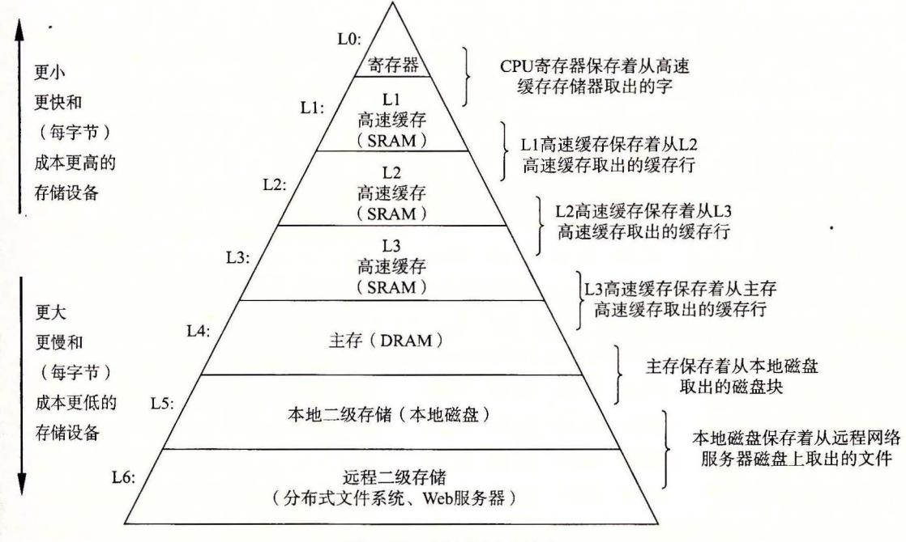

图 6-21 存储器层次结构

或多个小型到中型的基千 SRAM 的高速缓存存储器,可以在儿个 CPU 时钟周期内访问它 们。然后是一个大的基于 DRAM 的主存,可以在儿十到几百个时钟周期内访问它们。接 下来是慢速但是容拭很大的本地磁盘。最后,有些系统甚至包括了一层附加的远杜服务器 上的磁盘,要通过网络来访问它们。例如,像安德鲁文件系统 (Andrew File System, AFS) 或者网络文件系统 (Network File System, NFS) 这样的分布式文件系统,允许程序 访问存储在远程的网络服务器上的文件。类似地,万维网允许程序访问存储在世界上任何 地方的 Web 服务器上的远程文件。

## 其他的存储器层次结构

我们向你展示了一个存储器层次结构的示例,但是其他的组合也是可能的,而且确 实也很常见 例如,许多站点(包括谷歌的数据中心)将本地磁盘备份到存档的磁带上 其中有些站点,在需要时由人工装好磁带 而其他站点则是由磁带机器人自动地完成这 项任务 无论在哪种情况中,磁带都是存储器层次结构中的一层,在本地磁盘层下面, 本书中提到的通用原则也同样适用于它 磁带每宇节比磁盘更便宜,它允许站点将本地磁 盘的多个快照存档 代价是磁带的访问时间要比磁盘的更长 未看另一个例子,固态硬盘 在存储器层次结构中扮演着越来越重要的角色,连接起 DRAM 和旋转磁盘之间的鸿沟

## 6. 3. 1 存储器层次结构中的缓存

一般而言.高速缓存 (cache, 读作 "cash") 是一个小而快速的存储设备,它作为存储 在更大、也更慢的设备中的数据对象的缓冲区域。使用高速缓存的过程称为缓存 (caching, 读作 "cashing")

存储器层次结构的中心思想是,对于每个 k, 位于 层的更快更小的存储设备作为位于 k+l 层的更大更慢的存储设备的缓存。换句话说,层次结构中的每一层都缓存来自较低一层 的数据对象。例如,本地磁盘作为通过网络从远程磁盘取出的文件(例如 Web 页面)的缓存, 主存作为本地磁盘上数据的缓存,依此类推,直到最小的缓存 CPU 寄存器组。

<sup>22</sup> 展示了存储器层次结构中缓存的一般性概念。第 层的存储器被划分成连 续的数据对象组块 (chunk) ,称为块 Cb lock) 。每个块都有一个唯一的地址或名字,使之区 别于其他的块。块可以是固定大小的(通常是这样的),也可以是可变大小的(例如存储在 Web 服务器上的远程 HTML 文件)。例如,图 6-22 中第 k+l 层存储器被划分成 <sup>16</sup> 个大 小固定的块,编号为 0~15

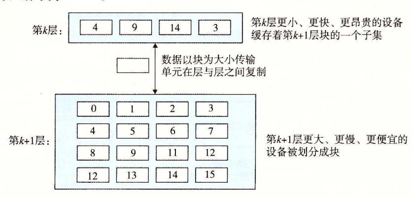

<sup>22</sup> 存储器层次结构中基本的缓存原理

类似地,第 层的存储器被划分成较少的块的集合,每个块的大小与 k+l 层的块的大 小一样。在任何时刻,第 层的缓存包含第 k+l 层块的一个子集的副本。例如,在图 6-22 中,第 层的缓存有 个块的空间,当前包含块 <sup>14</sup> 的副本。

数据总是以块大小为传送单元 (transfer unit) 在第 层和第 k+l 层之间来回复制的。 虽然在层次结构中任何一对相邻的层次之间块大小是固定的,但是其他的层次对之间可以 有不同的块大小。例如,在图 6-21 中, Ll LO 之间的传送通常使用的是 个字大小的 块。 L2 Ll 之间(以及 L3 L2 之间、 L4 L3 之间)的传送通常使用的是几十个字节的 块。而 L5 L4 之间的传送用的是大小为几百或几千字节的块。一般而言,层次结构中较 低层(离 CPU 较远)的设备的访问时间较长,因此为了补偿这些较长的访问时间,倾向于 使用较大的块。

## 缓存命中

当程序需要第 层的某个数据对象 时,它首先在当前存储在第 层的一个块中 查找 。如果 刚好缓存在第 层中,那么就是我们所说的缓存命中 (cache hit) 。该程序 直接从第 层读取 d, 根据存储器层次结构的性质,这要比从第 k+l 层读取 更快。例 如, 个有良好时间局部性的程序可以从块 <sup>14</sup> 中读出一个数据对象,得到一个对第 的缓存命中。

## 缓存不命中

另一方面,如果第 层中没有缓存数据对象 d, 那么就是我们所说的缓存不命中 (cache miss) 。当发生缓存不命中时,第 层的缓存从第 层缓存中取出包含 的那个 块,如果第 层的缓存已经满了,可能就会覆盖现存的一个块。

覆盖 个现存的块的过程称为替换 (replacing) 或驱逐 (evicting) 这个块。被驱逐的这 个块有时也称为牺牲块 (victim block) 。决定该替换哪个块是由缓存的替换策略 (replacement policy) 来控制的。例如,一个具有随机替换策略的缓存会随机选择一个牺牲块。一 个具有最近最少被使用 CLRU) 替换策略的缓存会选择那个最后被访问的时间距现在最远 的块。

在第 层缓存从第 层取出那个块之后,程序就能像前面一样从第 层读出 了。 例如,在图 6-22 中,在第 层中读块 <sup>12</sup> 中的 个数据对象,会导致一个缓存不命中,因 为块 <sup>12</sup> 当前不在第 层缓存中。一旦把块 <sup>12</sup> 从第 k+l 层复制到第 层之后,它就会保 持在那里,等待稍后的访问。

#### 缓存不命中的种类

区分不同种类的缓存不命中有时候是很有帮助的。如果第 层的缓存是空的,那么对 任何数据对象的访问都会不命中。一个空的缓存有时被称为冷缓存 (cold cache) ,此类不 命中称为强制性不命中 (compulsory miss) 或冷不命中 (cold miss) 。冷不命中很重要,因为 它们通常是短暂的事件,不会在反复访问存储器使得缓存暖身 (warmed up) 之后的稳定状 态中出现。

只要发生了不命中,第 层的缓存就必须执行某个放置策略 (placement policy) ,确定 把它从第 k+I 层中取出的块放在哪里。最灵活的替换策略是允许来自第 k+l 层的任何块 放在第 层的任何块中。对于存储器层次结构中高层的缓存(靠近 CPU) ,它们是用硬件来 实现的,而且速度是最优的,这个策略实现起来通常很昂贵,因为随机地放置块,定位起 来代价很高。

因此,硬件缓存通常使用的是更严格的放置策略,这个策略将第 k+l 层的某个块限 制放置在第 层块的一个小的子集中(有时只是一个块)。例如,在图 6-22 中,我们可以 确定第 k+l 层的块 必须放置在第 层的块 (i mod 4) 中。例如,第 k+l 层的块 <sup>12</sup> 会映射到第 层的块 0; <sup>13</sup> 会映射到块 1; 依此类推。注意,图 6-22 中的示例缓存使用的就是这个策略。

这种限制性的放置策略会引起 种不命中,称为冲突不命中 (conflict miss) ,在这种 情况中,缓存足够大,能够保存被引用的数据对象,但是因为这些对象会映射到同 个缓 存块,缓存会一直不命中。例如,在图 6-22 中,如果程序请求块 o, 然后块 8' 然后块 o, 然后块 8, 依此类推,在第 层的缓存中,对这两个块的每次引用都会不命中,即使这个 缓存总共可以容纳 个块。

程序通常是按照一系列阶段(如循环)来运行的,每个阶段访问缓存块的某个相对稳定 不变的集合。例如,一个嵌套的循环可能会反复地访问同一个数组的元素。这个块的集合 称为这个阶段的工作集 (working set) 。当工作集的大小超过缓存的大小时 缓存会经历容 量不命中 (capacity miss) 。换句话说就是,缓存太小了,不能处理这个工作集。

### 缓存管理

正如我们提到过的,存储器层次结构的本质是,每一层存储设备都是较低一层的缓 存。在每一层上,某种形式的逻辑必须管理缓存。这里,我们的意思是指某个东西要将缓 存划分成块,在不同的层之间传送块,判定是命中还是不命中,并处理它们。管理缓存的 逻辑可以是硬件、软件,或是两者的结合。

例如,编译器管理寄存器文件,缓存层次结构的最高层。它决定当发生不命中时何时 发射加载,以及确定哪个寄存器来存放数据。 Ll L2 L3 层的缓存完全是由内置在缓存 中的硬件逻辑来管理的。在 个有虚拟内存的系统中, DRAM 主存作为存储在磁盘上的 数据块的缓存,是由操作系统软件和 CPU 上的地址翻译硬件共同管理的。对千一个具有 AFS 这样的分布式文件系统的机器来说,本地磁盘作为缓存,它是由运行在本地机器 上的 AFS 客户端进程管理的 在大多数时候,缓存都是自动运行的,不需要程序采取特 殊的或显式的行动

## 6. 3. 2 存储器层次结构概念小结

概括来说,基于缓存的存储器层次结构行之有效,是因为较慢的存储设备比较快的存 储设备更便宜,还因为程序倾向于展示局部性:

- 利用时间局部性:由于时间局部性,同一数据对象可能会被多次使用。 一旦 个数 据对象在第一次不命中时被复制到缓存中,我们就会期望后面对该目标有 一系 列的 访问命中。因为缓存比低一层的存储设备更快,对后面的命中的服务会比最开始的 不命中快很多
- ·利用空间局 部性:块通常包含有多个数据对象。由千 间局部性,我们会期望后面 对该块中其他对象的访问能够补偿不命中后复制该块的花费。

现代系统中到处都使用了缓存。正如从图 6-23 中能够看到的那样 CPU 芯片、 操作 系统、分布式文件系统中和万维网上都使用了缓存。各种各样硬件和软件的组合构成和管 理着缓存。注意,图 6-23 中有大拯我们还未涉及的术语和缩写。在此我们包括这些术语 和缩写是为了说明缓存是多么的普遍。

| 类型      | 缓存什么       | 被缓存在何处      | 延迟(周期数)       | 由谁管理     |
|---------|------------|-------------|---------------|----------|
| CPU寄存器  | 节字或<br>字节字 | 芯片上的CPU寄存器  |               | 编译器      |
| TLB     | 地址翻译       | 芯片上的TLB     |               | 硬件MMU    |
| LI 高速缓存 | 64 字节块     | 芯片上的L1 高速缓存 | 4             | 硬件       |
| L2 高速缓存 | 64字节块      | 芯片上的L2 高速缓存 | 10            | 硬件       |
| L3 高速缓存 | 64字节块      | 芯片上的L3 高速缓存 | 50            | 硬件       |
| 虚拟内存    | 4KB        | 主存          | 200           | 硬件+ OS   |
| 缓冲区缓存   | 部分文件       | 主存          | 200           | OS       |
| 磁盘缓存    | 磁盘扇区       | 磁盘控制器       | 100 000       | 控制器固件    |
| 网络缓存    | 部分文件       | 本地磁盘        | 10 000 000    | NFS客户    |
| 浏览器缓存   | Web        | 本地磁盘        | 10 000 000    | Web浏览器   |
| Web缓存   | Web        | 远程服务器磁盘     | I 000 000 000 | Web代理服务器 |

6-23 缓存在现代计算机系统中无处不在。 TLB: 翻译后备缓冲器 (Translation Lookaside Ruffer); MMU: 内存管理单元 (Memory Management Unit); OS: 操作系统 (Operating System); AFS: 安德鲁文件系统 (Andrew File System); NFS: 网络文件系统 etwork File System)

## 6. 4 高速缓存存储器

早期计算机系统的存储器层次结构只有三层: CPU 寄存器、 DRAM 主存储器和磁盘 存储。不过,由千 CPU 和主存之间逐渐增大的差距,系统设计者被迫在 CPU 寄存器文件 和主存之间插入了一个小的 SRAM 高速缓存存储器,称为 L1 高速缓存(一级缓存),如 6-24 所示。 L1 高速缓存的访问速度几乎和寄存器一样快,典型地是大约 个时钟周期。

> CPU芯片 寄存器文件 系统总线 内存总线 总接线口

<sup>24</sup> 高速缓存存储器的典型总线结构

随着 CPU 和主存之间的性能差距不断增大,系统设计者在 Ll 高速缓存和主存之间又 插入了一个更大的高速缓存,称为 L2 高速缓存,可以在大约 <sup>10</sup> 个时钟周期内访问到它。 有些现代系统还包括有一个更大的高速缓存,称为 L3 高速缓存,在存储器层次结构中, 它位于 L2 高速缓存和主存之间,可以在大约 <sup>50</sup> 个周期内访问到它。虽然安排上有相当多 的变化,但是通用原则是一样的。对于下一节中的讨论,我们会假设一个简单的存储器层 次结构, CPU 和主存之间只有一个 Ll 高速缓存。

### 6. 4. 1 通用的高速缓存存储器组织结构

考虑一个计算机系统,其中每个存储器地址有 位,形成 =沪个不同的地址。如 6-25a 所示,这样一个机器的高速缓存被组织成 个有 S=2 个高速缓存组 (cache set)

426

数组。每个组包含 E 个高速缓存行(cache line)。每个行是由一个  $B=2^b$  字节的数据块(block)组成的,一个有效位(valid bit)指明这个行是否包含有意义的信息,还有 t=m-(b+s)个标记位(tag bit)(是当前块的内存地址的位的一个子集),它们唯一地标识存储在这个高速缓存行中的块。

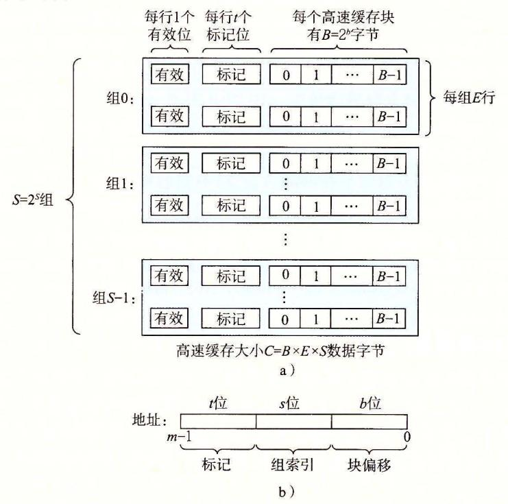

图 6-25 高速缓存(S, E, B, m)的通用组织。a)高速缓存是一个高速缓存组的数组。每个组包含一个或多个行,每个行包含一个有效位,一些标记位,以及一个数据块;b)高速缓存的结构将 m 个地址位划分成了 t 个标记位、s 个组索引位和 b 个块偏移位

一般而言,高速缓存的结构可以用元组(S, E, B, m)来描述。高速缓存的大小(或容量)C指的是所有块的大小的和。标记位和有效位不包括在内。因此, $C=S\times E\times B$ 。

当一条加载指令指示 CPU 从主存地址 A 中读一个字时,它将地址 A 发送到高速缓存。如果高速缓存正保存着地址 A 处那个字的副本,它就立即将那个字发回给 CPU。那么高速缓存如何知道它是否包含地址 A 处那个字的副本的呢?高速缓存的结构使得它能通过简单地检查地址位,找到所请求的字,类似于使用极其简单的哈希函数的哈希表。下面介绍它是如何工作的:

参数 S 和 B 将 m 个地址位分为了三个字段,如图 6-25b 所示。A 中 s 个组索引位是一个到 S 个组的数组的索引。第一个组是组 0,第二个组是组 1,依此类推。组索引位被解释为一个无符号整数,它告诉我们这个字必须存储在哪个组中。一旦我们知道了这个字必须放在哪个组中,A 中的 t 个标记位就告诉我们这个组中的哪一行包含这个字(如果有的话)。当且仅当设置了有效位并且该行的标记位与地址 A 中的标记位相匹配时,组中的这一行才包含这个字。一旦我们在由组索引标识的组中定位了由标号所标识的行,那么 b 个块偽移位给出了在 B 个字节的数据块中的字偏移。

你可能已经注意到了,对高速缓存的描述使用了很多符号。图 6-26 对这些符号做了个小结,供你参考。

|           | 基本参数       |
|-----------|------------|
| 参数        | 描述         |
| S=2'      | 组数         |
| E         | 每个组的行数     |
| B=2b      | 块大小(字节)    |
| m=log,(M) | (主存)物理地址位数 |

|           | 衍生出来的量                     |
|-----------|----------------------------|
| 参数        | 描述                         |
| M=2m      | 内存地址的最大数量                  |
| s=log2(S) | 组索引位数                      |
| b=log2(B) | 块偏移位数                      |
| t=m-(s+b) | 标记位数盘                      |
| C=BXEXS   | 不包括像有效位和标记位这样开销的高速缓存大小(字节) |

<sup>26</sup> 高速缓存参数小结

练习题 <sup>69</sup> 下表给出了几个不同的高速缓存的参数。确定每个高速缓存的高速缓存 组数 (S) 、标记位数 (t) 、组索引位数 (.I) 以及块偏移位数 (b)

|           | m  | C    | B-4-8-32 E | s | s | b |
|-----------|----|------|------------|---|---|---|
| <br>l-2-3 | 32 | 1024 |            |   |   |   |
|           | 32 | 1024 | 4-32       |   |   |   |
|           | 32 | 1024 |            |   |   |   |

## 6. 4. 2 直接映射高速缓存

根据每个组的高速缓存行数 E, 高速缓存被分为不同的类。每个组只有一行 (E 高速缓存称为直接映射高速缓存 (direct-mapped cache) (见图 6-27) 。直接映射高速缓存是 最容易实现和理解的,所以我们会以它为例来说明一些高速缓存工作方式的通用概念。

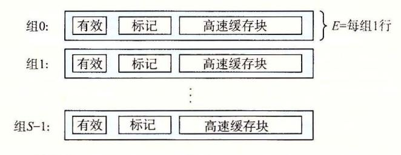

6-27 直接映射高速缓存 E=l) 。每个组只有

假设我们有这样一个系统,它有一个 CPU 、一个寄存器文件、一个 Ll 高速缓存和一 个主存。当 CPU 执行 条读内存字 的指令,它向 Ll 高速缓存请求这个字。如果 L1 速缓存有 的一个缓存的副本,那么就 得到 L1 高速缓存命中,高速缓存会很快抽取出 w, 并将它返回给 CPU 。否则就是缓存不命中,当 Ll 高速缓存向主存请求包含 的块的 一个副本时, CPU 必须等待 。当被请求的块最终从 内存到达时, L1 高速缓存将这个块存 放在它的一个高速缓存行里,从被存储的块中抽取出字 W, 然后将它返回给 CPU 。高速

缓存确定一个请求是否命中,然后抽取出被请求的字的过程 分为 步: 1) 组选择; 2) 行匹配; 3) 宇抽取

## 直接映射高速缓存中的组选择

在这 步中,高速缓存从 的地址中间抽取出 个组索引位。这些位被解释成一个对应 个组号的无符号整数 换句话来说,如果我们把高速缓存看成是 个关于组的一维数 组,那么这些组索引位就是一个到这个数组的索引 <sup>28</sup> 展示了直接映射高速缓存的组选 择是如何工作的。在这个例子中,组索引位 <sup>000012</sup> 被解释为 个选择组 的整数索引。

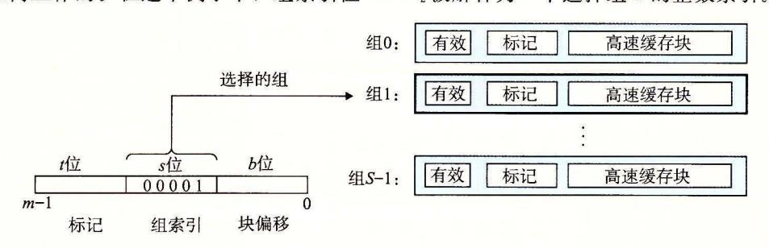

<sup>28</sup> 直接映射高速缓存中的组选择

## 2. 直接映射高速缓存中的行匹配

在上一步中我们已经选择了某个组 i' 接下来的一步就要确定是否有字 的一个副本 存储在组 包含的一个高速缓存行中。在直接映射高速缓存中这很容易,而且很快,这是 因为每个组只有 行。当且仅当设置了有效位,而且高速缓存行中的标记与 的地址中的 标记相匹配时,这 行中包含 的一个副本。

6-29 展示了直接映射高速缓存中行匹配是如何工作的。在这个例子中,选中的组 中只有一个高速缓存行 这个行的有效位设置了,所以我们知道标记和块中的位是有意义 的。因为这个高速缓存行中的标记位与地址中的标记位相匹配,所以我们知道我们想要的 那个字的一个副本确实存储在这个行中 换句话说,我们得到一个缓存命中。另一方面, 如果有效位没有设詈,或者标记不相匹配,那么我们就得到一个缓存不命中。

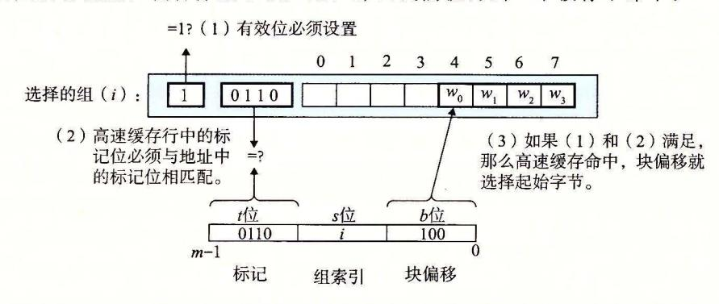

<sup>29</sup> 直接映射高速缓存中的行匹配和字选择。在高速缓存块中, 。表示字 的低位字节, W1 是下 个字节,依此类推

#### 3. 直接映射高速缓存中的字选择

一旦命中,我们知道 就在这个块中的某个地方。最后一步确定所需要的字在块中是 从哪里开始的 如图 6-29 所示,块偏移位提供了所需要的字的第一个字节的偏移。就像 我们把高速缓存看成一个行的数组一样,我们把块看成一个字节的数组,而字节偏移是到 这个数组的一个索引。在这个示例中,块偏移位是 <sup>100</sup> 它表明 的副本是从块中的字 开始的(我们假设字长为 字节)。

## 直接映射高速缓存中不命中时的行替换

如果缓存不命中,那么它需要从存储器层次结构中的下 层取出被请求的块 ,然 后将 新的块存储在组索引位指示的组中的一个高速缓存行中。 般而言,如果组中都是有效高 速缓存行了,那么必须要驱逐出一个现存的行 对千直接映射高速缓存来说,每个组只包 含有一行,替换策略非常简单:用新取出的行替换当前的行。

## 综合:运行中的直接映射高速缓存

高速缓存用来选择组和标识行的机制极其简单,因为硬件必须在几个纳秒的时间内完 成这些工作。不过,用这种方式来处理位是很令人困惑的。 个具体的例子能帮助解释清 楚这个过程。假设我们有一个直接映射高速缓存,描述如下

$$(S,E,B,m) = (4,1,2,4)$$

换旬话说, 高速缓存有 个组 每个组 行,每个块 个字节,而地址是 位的。我们还假设 每个字都是单字节的。当然,这样一些假设完全是不现实的,但是它们能使示例保持简单。

当你初学高速缓存时 ,列 举出整个地址空间并划分好位是很有帮助的,就像我们在 6-30 位的示例所做的那样 关于这个列举出的空间,有 些有趣的事情值得注意:

|             |              | 地址位          |              |             |
|-------------|--------------|--------------|--------------|-------------|
| 地址<br>(十进制) | 标记位<br>(t=I) | 索引位<br>(s=2) | 偏移位<br>(b=I) | 块号<br>(十进制) |
|             |              | 00           |              |             |
| I           |              | 00           | I            |             |
| 2           |              | 01           |              | I           |
| 3           |              | 01           | I            | I           |
| 4           |              | 10           |              | 2           |
| 5           |              | 10           | I            | 2           |
| 6           |              | II           |              | 3           |
| 7           |              | 11           | I            | 3           |
| 8           | I            | 00           |              | 4           |
| 9           | I            | 00           | I            | 4           |
| IO          | I            | 01           |              | 5           |
| II          | I            | 01           | I            | 5           |
| 12          | I            | 10           |              | 6           |
| 13          | I            | 10           | I            | 6           |
| 14          | I            | II           |              | 7           |
| 15          | I            | II           | I            | 7           |

6-30 示例直接映射高速缓存的 位地址空间

- 标记位和索引位连起来唯 地标识了内存中的每个块。例如,块 是由地址 组成的,块 是由地址 组成的,块 是由地址 组成的,依此类推。
- ·因 为有 个内存块,但是只有 个高速缓存组 ,所以 多个块会映射到同 一个高速 存组(即它们有相同的组索引)。例如,块 都映射到组 o, 都映射到 ,等等。
- ·映射到同 一个高速缓存组的块由标记位唯一 地标识 。例如 ,块 的标记位为 o, 的标记位为 ,块 的标记位为 o, 而块 的标记位为 ,以此类推。

让我们来模拟一下当 CPU 执行一系列读的时候,高速缓存的执行情况。记住对于这

个示例,我们假设 CPU 读 1 字节的字。虽然这种手工的模拟很乏味,你可能想要跳过它,但是根据我们的经验,在学生们做过几个这样的练习之前,他们是不能真正理解高速缓存是如何工作的。

初始时, 高速缓存是空的(即每个有效位都是 0):

| 组 | 有效位 | 标记位 | 块[0]                  | 块[1] |
|---|-----|-----|-----------------------|------|
| 0 | 0   |     |                       |      |
| 1 | 0   |     |                       |      |
| 2 | 0   |     |                       |      |
| 3 | 0   |     | March Control Control |      |

表中的每一行都代表一个高速缓存行。第一列表明该行所属的组,但是请记住提供这个位只是为了方便,实际上它并不真是高速缓存的一部分。后面四列代表每个高速缓存行的实际的位。现在,让我们来看看当 CPU 执行一系列读时,都发生了什么:

1) **读地址 0 的字。**因为组 0 的有效位是 0,是缓存不命中。高速缓存从内存(或低一层的高速缓存)取出块 0,并把这个块存储在组 0 中。然后,高速缓存返回新取出的高速缓存行的块[0]的 m[0](内存位置 0 的内容)。

| 组 | 有效位 | 标记位 | 块[0] | 块[1] |
|---|-----|-----|------|------|
| 0 | 1   | 0   | m[0] | m[1] |
| 1 | 0   |     |      |      |
| 2 | 0   |     |      | _    |
| 3 | 0   |     |      | -    |

- 2) **读地址 1 的字。**这次会是高速缓存命中。高速缓存立即从高速缓存行的块[1]中返回 m[1]。高速缓存的状态没有变化。
- 3) **读地址 13 的字。**由于组 2 中的高速缓存行不是有效的,所以有缓存不命中。高速缓存把块 6 加载到组 2 中,然后从新的高速缓存行的块[1]中返回 m[13]。

| 组 | 有效位 | 标记位 | 块[0]  | 块[1]  |
|---|-----|-----|-------|-------|
| 0 | 1   | 0   | m[0]  | m[1]  |
| 1 | 0   |     |       |       |
| 2 | 1   | 1   | m[12] | m[13] |
| 3 | 0   |     |       |       |

4) **读地址 8 的字。**这会发生缓存不命中。组 0 中的高速缓存行确实是有效的,但是标记不匹配。高速缓存将块 4 加载到组 0 中(替换读地址 0 时读人的那一行),然后从新的高速缓存行的块[0]中返回 m[8]。

| 组 | 有效位 | 标记位 | 块[0]  | 块[1]  |
|---|-----|-----|-------|-------|
| 0 | 1   | 1   | m[8]  | m[9]  |
| 1 | 0   |     |       |       |
| 2 | 1   | 1   | m[12] | m[13] |
| 3 | 0   |     |       |       |

5)**读地址 0 的字。**又会发生缓存不命中,因为在前面引用地址 8 时,我们刚好替换了块 0。这就是冲突不命中的一个例子,也就是我们有足够的高速缓存空间,但是却交替地引用映射到同一个组的块。

|    | 有效位 | 标记位 | [OJ   | [I]   |
|----|-----|-----|-------|-------|
|    | I   |     | m[O]  | m[l]  |
| 23 |     |     |       |       |
|    |     |     | m[12] | m[l3] |
|    |     |     |       |       |

## 直接映射高速缓存中的冲突不命中

不命中 在真实 的程序中很 常见,会导致令人困惑的性能问题 当程 序访问 小为 的幕的数组时,直接映射高速缓存中通常会发生 冲突不命中 例如,考虑一个计算两个 向量点积的 函数:

```
123456789 float dotprod (float x [8], float y [8]) 
    { 
        float sum= 0.0; 
         int i: 
        for (i = O; i < 8; i++) 
             sum += x [i] * y [i] ; 
    return sum; }
```

对千 来说,这个函数有良好的空间局部性,因此我们期望它的命中率会比较高 幸的 不总 如此。

假设浮点数是 个字节, 被加载到从地址 开始的 <sup>32</sup> 字节连续内存中,而 紧跟在 之后,从地址 <sup>32</sup> 开始。为了简便,假设 个块是 <sup>16</sup> 个字节(足够容纳 个浮点数), 速缓存由两个组组成,高速缓存的整个大小为 <sup>32</sup> 字节。我们 会假设变量 um 实际上存放 在一个 CPU 存卷 中,因此不需要内存引用 根据这些假设每个 [i y[i] 会映射到相 同的高速缓存组:

| 元素    | 地址 | 组索引 | 元素    | 地址 | 组索引 |
|-------|----|-----|-------|----|-----|
| x [O] |    |     | y [O] | 32 |     |
| x [l] | 4  |     | y[ l] | 36 |     |
| x[2 ] | 8  |     | y[2]  | 40 |     |
| X [3] | 12 |     | y[3]  | 44 |     |
| X [4] | 16 | I   | y[4]  | 48 | 1   |
| x[S]  | 20 | I   | y[5]  | 52 | I   |
| x[6)  | 24 | 1   | y[6)  | 56 | I   |
| x [7] | 28 | I   | y [7) | 60 | 1   |

在运行时,循环的第一次迭代引用 x[O] ,缓存不命中 会导致包含 [OJ ~x [3] 的块被 加载到组 。接下来是对 y[O] 的引用,又一次缓存不命中,导致包 [OJ~y[3] 块被 复制到组 o, 覆盖前一次引用复制进来的 的值。在下一次迭代中,对 [1] 的引用不命 中,导致 [OJ ~x [3] 的块被加载回组 o, 覆盖 y[OJ~y[3] 的块 。因 而现在我们就有了 一个冲突不命中,而且实际上后面每次对 的引用都会导致冲突不命中,因为我们在 的块之间抖动 (thrash) 。术语"抖动"描述的是这样一种情况,即高速缓存反复地 加载和驱逐相同的高速缓存块的组

简要来说就是,即使程序有良好的空间局部性,而且我们的高速缓存中也有足够的空间 来存放 [i] [i] 的块,每次引用还是会导致 冲突不命中,这是 因为这些块被映射到了同 一个高速缓存组。这种抖动导致速度下降 倍并不稀奇 另外,还要 注意虽然我们的示 例极其简单 但是对千更大 、更现 直接映射高速缓存来说,这个问题也是很真实的

幸运的是 一旦程序员意识到 正在发生什么, 就很容易修正抖动 题。一个很简单的 法是在每个数组的结尾放 字节的 填充。 例如,不 是将 定义为 float x[B] ,而是定义成 float x [12] 。假设在内存中 紧跟在 后面,我们有下面这样的从数组元素到组的映射:

| 元素    | 地址 | 组索引 | 元素     | 地址 | 组索引 |
|-------|----|-----|--------|----|-----|
| x[O]  |    |     | y(O]   | 48 | 1   |
| X [1] | 4  |     | y[l]   | 52 | I   |
| x[2]  | 8  |     | y[2]   | 56 | I   |
| x[3]  | 12 |     | y[3]   | 60 | I   |
| x[4]  | 16 | I   | y [4 ] | 64 |     |
| x[S]  | 20 | I   | y[Sl   | 68 |     |
| x[6]  | 24 | I   | y [ 6] | 72 |     |
| x[7]  | 28 | I   | y[7]   | 76 |     |

结尾加了 填充, [i ]和 )现在就映射到 同的组,消 除了抖动冲突不命

练习题 10 在前面 do prod 的例子中,在我们对数组 做了填充之后 所有对 的引用的命中率是多少?

## 日日 为什么用中间的位来做索引

你也许会奇怪,为什么高速缓存用中间的位来作为组索引,而不是用高位 为什么 用中间的位更好, 是有很好的原因的 <sup>31</sup> 说明 了原因 如果 高位用 做索 引,那么 ', 一些连 续的内存块就会映射到相同的高速缓存块 例如,在图中,头四个块映射 第一 个高速缓存组,笫二个四个块映射到笫二个组,依此类推 如果一个程序有良好的空间 局部性,顺序扫描一个数组的元素,那么在任何时刻,高速缓存都只保存着一个块大小

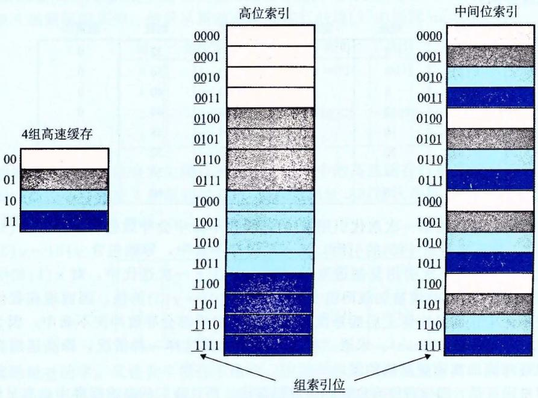

为什么用中间位来作为高速缓存的索引

的数组内容。这样对高速缓存的使用效率很低。相比较而言,以中间位作为索引,相邻的块总是映射到不同的高速缓存行。在这里的情况中,高速缓存能够存放整个大小为C的数组片,这里C是高速缓存的大小。

- ★习题 6.11 假想一个高速缓存,用地址的高 s 位做组索引,那么内存块连续的片(chunk)会被映射到同一个高速缓存组。
  - A. 每个这样的连续的数组片中有多少个块?
  - B. 考虑下面的代码,它运行在一个高速缓存形式为(S, E, B, m)=(512, 1, 32, 32)的系统上:

int array[4096];

for (i = 0; i < 4096; i++)
sum += array[i];</pre>

在任意时刻,存储在高速缓存中的数组块的最大数量为多少?

#### 6.4.3 组相联高速缓存

直接映射高速缓存中冲突不命中造成的问题源于每个组只有一行(或者,按照我们的术语来描述就是 E=1)这个限制。组相联高速缓存(set associative cache)放松了这条限制,所以每个组都保存有多于一个的高速缓存行。一个 1 < E < C/B 的高速缓存通常称为 E 路组相联高速缓存。在下一节中,我们会讨论 E=C/B 这种特殊情况。图 6-32 展示了一个 2路组相联高速缓存的结构。

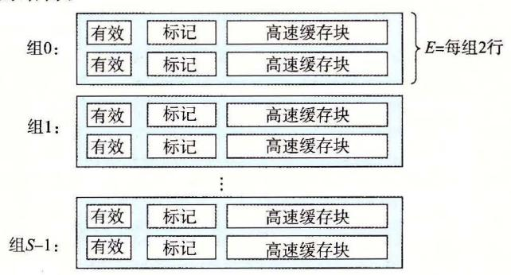

图 6-32 组相联高速缓存(1 < E < C/B)。在一个组相联高速缓存中,每个组包含多于一个行。 这里的特例是一个 2 路组相联高速缓存

#### 1. 组相联高速缓存中的组选择

它的组选择与直接映射高速缓存的组选择一样,组索引位标识组。图 6-33 总结了这个原理。

#### 2. 组相联高速缓存中的行匹配和字选择

组相联高速缓存中的行匹配比直接映射高速缓存中的更复杂,因为它必须检查多个行的标记位和有效位,以确定所请求的字是否在集合中。传统的内存是一个值的数组,以地址作为输入,并返回存储在那个地址的值。另一方面,相联存储器是一个(key, value)对的数组,以 key 为输入,返回与输入的 key 相匹配的(key, value)对中的 value 值。因此,我们可以把组相联高速缓存中的每个组都看成一个小的相联存储器,key 是标记和有效位,而 value 就是块的内容。

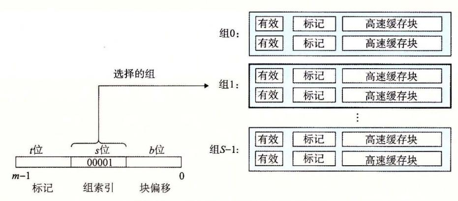

-33 组相联高速缓存中的组选择

6-34 展示了相联高速缓存中行匹配的基本思想。这里的一个重要思想就是组中的 任何一行都可以包含任何映射到这个组的内存块。所以高速缓存必须搜索组中的每一行, 寻找一个有效的行,其标记与地址中的标记相匹配。如果高速缓存找到了这样一行,那么 我们就命中,块偏移从这个块中选择一个字,和前面一样。

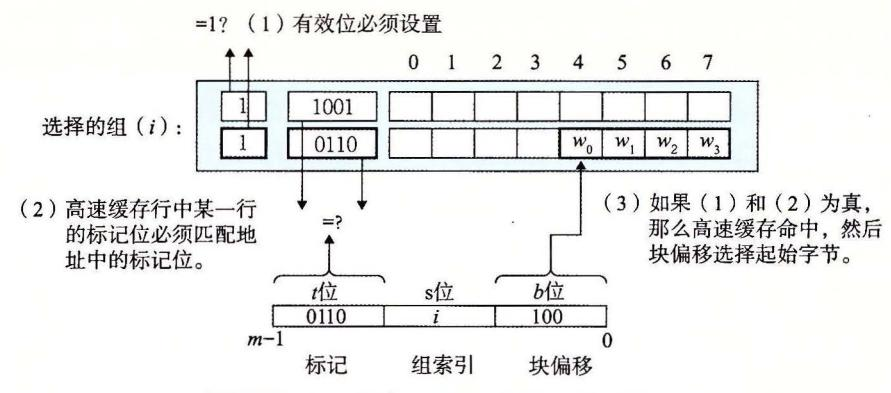

-3 组相联高速缓存中的行匹配和字选择

#### 3. 组相联高速缓存中不命中时的行替换

如果 CPU 请求的字不在组的任何一行中,那么就是缓存不命中,高速缓存必须从内 存中取出包含这个字的块。不过,一旦高速缓存取出了这个块,该替换哪个行呢?当然, 如果有一个空行,那它就是个很好的候选。但是如果该组中没有空行,那么我们必须从中 选择一个非空的行,希望 CPU 不会很快引用这个被替换的行。

程序员很难在代码中利用高速缓存替换策略,所以在此我们不会过多地讲述其细节。 最简单的替换策略是随机选择要替换的行。其他更复杂的策略利用了局部性原理,以使在 比较近的将来引用被替换的行的概率最小。例如,最不常使用 (Least-Frequently-Used, LFU) 策略会替换在过去某个时间窗口内引用次数最少的那一行。最近最少使用 (Least-Recently-Used, LRU) 策略会替换最后一次访问时间最久远的那一行。所有这些策略都需 要额外的时间和硬件。但是,越往存储器层次结构下面走,远离 CPU, 一次不命中的开 销就会更加昂贵,用更好的替换策略使得不命中最少也变得更加值得了。

## 6. 4. 4 全相联高速缓存

全相联高速缓存 (fully associative cache) 是由一个包含所有高速缓存行的组(即 E=C/

B)组成的。图 6-35 给出了基本结构。

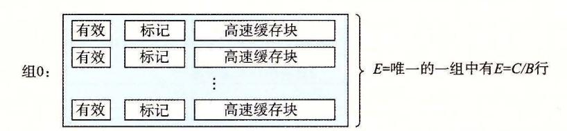

图 6-35 全相联高速缓存(E=C/B)。在全相联高速缓存中,一个组包含所有的行

## 1. 全相联高速缓存中的组选择

全相联高速缓存中的组选择非常简单,因为只有一个组,图 6-36 做了个小结。注意地址中没有组索引位,地址只被划分成了一个标记和一个块偏移。

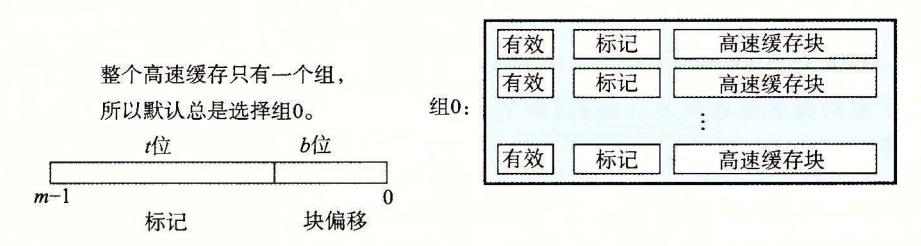

图 6-36 全相联高速缓存中的组选择。注意没有组索引位

## 2. 全相联高速缓存中的行匹配和字选择

全相联高速缓存中的行匹配和字选择与组相联高速缓存中的是一样的,如图 6-37 所示。它们之间的区别主要是规模大小的问题。

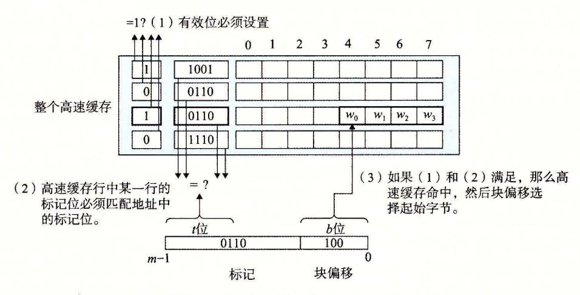

图 6-37 全相联高速缓存中的行匹配和字选择

因为高速缓存电路必须并行地搜索许多相匹配的标记,构造一个又大又快的相联高速缓存很困难,而且很昂贵。因此,全相联高速缓存只适合做小的高速缓存,例如虚拟内存系统中的翻译备用缓冲器(TLB),它缓存页表项(见 9.6.2 节)。

练习题 6.12 下面的问题能帮助你加强理解高速缓存是如何工作的。有如下假设:

- 内存是字节寻址的。
- 内存访问的是1字节的字(不是4字节的字)。

- ·地址的宽度为 位。
- ·高速 存是 路组相联的 (E=2) ,块大 小为 字节 =4) 个组 (5 =8) 高速缓存的内容如下,所有的数字都是以十六进制来表示的:

路组相联高速缓

| 组索引 |    | 标记位有效位字节 |    | 字节 | 字节 | 字节 |    | 标记位有效位字节 |    | 字节 |    | 字节 |
|-----|----|----------|----|----|----|----|----|----------|----|----|----|----|
|     | 09 | I        | 86 | 30 | 3F | JO | 00 |          |    |    |    |    |
| I   | 45 | I        | 60 | 4F | EO | 23 | 38 | I        | 00 | BC | OB | 37 |
| 2   | EB |          |    |    |    |    | OB |          |    |    |    |    |
| 3   | 06 |          |    |    |    |    | 32 | I        | 12 | 08 | 7B | AD |
| 4   | C7 | I        | 06 | 78 | 07 | C5 | 05 | I        | 40 | 67 | C2 | 3B |
| 5   | 71 | I        | OB | DE | 18 | 4B | 6E |          |    |    |    |    |
| 6   | 91 | I        | AO | B7 | 26 | 2D | FO |          |    |    |    |    |
| 7   | 46 |          |    |    |    |    | DE | 1        | 12 | co | 88 | 37 |

下面的图展示的是地址格式(每个小 方框一个位)。指出(在图中标出)用来确定 列内容的字段:

- co 高速缓存块偏移
- CI 高速缓存组索引
- CT 高速缓存标记

| 12 | 11 | 10 | 9 | 8 | 7 | 6 | 5 | 4 | 3 | 2 | I | 0 |
|----|----|----|---|---|---|---|---|---|---|---|---|---|
|    |    |    |   |   |   |   |   |   |   |   |   |   |

练习题 13 假设一个程序运行在练习题 6-12 中的机器上,它引用地址 Ox0E34 处的 个字节的字 。指 出访问的高速 缓存条目和 十六进制表示的 回的高速 缓存字节值。 指出是否会发生缓存不命中。如果会出现缓存不命中,用"—"来表示"返回的高速 缓存字节"。

A. 地址格式(每个小方框一个位):

| 12 | I I | IO | 9 | 8 | 7 | 6 | 5 | 4 | 3 | 2 | I | 0 |
|----|-----|----|---|---|---|---|---|---|---|---|---|---|
|    |     |    |   |   |   |   |   |   |   |   |   |   |

B. 内存引用:

| 参数               |    |
|------------------|----|
| 高速缓存块偏移 (CO)     | Ox |
| 高速缓存组索<br>(CD    | Ox |
| 高速缓存标记 (CT)      | Ox |
| 高速缓存命中?<br>(是 否) |    |
| 返回的高速缓存字节        | Ox |

练习题 14 对于存储器地址 OxODDS, 再做一遍练习题 6. <sup>13</sup>

A. 地址格式(每个小方框一个位):

| 12 | 11 | 10 | 9 | 8 | 7 | 6 | 5 | 4 | 3 | 2 | I | 0 |
|----|----|----|---|---|---|---|---|---|---|---|---|---|
|    |    |    |   |   |   |   |   |   |   |   |   |   |

B. 内存引用:

| 参数               |    |
|------------------|----|
| 高速缓存块偏移 (CO)     | Ox |
| 高速缓存组索引<br>(CI)  | Ox |
| 高速缓存标记 (CT)      | Ox |
| 高速缓存命中?<br>(是 否) |    |
| 返回的高速缓存字节        | Ox |

练习题 15 对于内存地址 Ox1FE4, 再做一遍练习题 6. <sup>13</sup>

A. 地址格式(每个小方框一个位):

| 12 | 11 | 10 | 9 | 8 | 7 | 6 | 5 | 4 | 3 | 2 | I | 0 |
|----|----|----|---|---|---|---|---|---|---|---|---|---|
|    |    |    |   |   |   |   |   |   |   |   |   |   |

B. 内存引用:

| 参数               |    |
|------------------|----|
| 高速缓存块偏移 (CO)     | Ox |
| 高速缓存组索引<br>(CI)  | Ox |
| 高速缓存标记 (CT)      | Ox |
| 高速缓存命中?<br>(是 否) |    |
| 返回的高速缓存字节        | Ox |

练习题 16 对于练习题 6. <sup>12</sup> 中的高速缓存,列出所有的在组 中会命中的十六进 制内存地址。

## 6. 4. 5 有关写的问题

正如我们看到的,高速缓存关于读的操作非常简单。首先,在高速缓存中查找所需字 的副本。如果命中,立即返回字 CPU 。如果不命中,从存储器层次结构中较低层 中取出包含字 的块,将这个块存储到某个高速缓存行中(可能会驱逐一个有效的行),然 后返回字

写的情况就要复杂一些了。假设我们要写一个已经缓存了的字 (写命中, write hit) 在高速缓存更新了它的 的副本之后,怎么更新 在层次结构中紧接着低一层中的副本 呢?最简单的方法,称为直写 (write-through) ,就是立即将 的高速缓存块写回到紧接着 的低一层中。虽然简单,但是直写的缺点是每次写都会引起总线流量。另一种方法,称为 写回 (write-back) ,尽可能地推迟更新,只有当替换算法要驱逐这个更新过的块时,才把 它写到紧接着的低一层中。由于局部性,写回能显著地减少总线流扯,但是它的缺点是增 加了复杂性。高速缓存必须为每个高速缓存行维护一个额外的修改位 (dirty bit) ,表明这 个高速缓存块是否被修改过。

另一个问题是如何处理写不命中。一种方法,称为写分配 (write-allocate) ,加载相应 的低一层中的块到高速缓存中,然后更新这个高速缓存块。写分配试图利用写的空间局部 性,但是缺点是每次不命中都会导致一个块从低一层传送到高速缓存。另一种方法,称为 非写分配 (not-write-allocate) ,避开高速缓存,直接把这个字写到低一层中。直写高速缓 存通常是非写分配的。写回高速缓存通常是写分配的。

为写操作优化高速缓存是一个细致而困难的问题,在此我们只略讲皮毛。细节随系统 的不同而不同,而且通常是私有的,文档记录不详细。对千试图编写高速缓存比较友好的

438

程序的程序员来说,我们建议在心里采用一个使用写回和写分配的高速缓存的模型。这样建议有几个原因。通常,由于较长的传送时间,存储器层次结构中较低层的缓存更可能使用写回,而不是直写。例如,虚拟内存系统(用主存作为存储在磁盘上的块的缓存)只使用写回。但是由于逻辑电路密度的提高,写回的高复杂性也越来越不成为阻碍了,我们在现代系统的所有层次上都能看到写回缓存。所以这种假设符合当前的趋势。假设使用写回写分配方法的另一个原因是,它与处理读的方式相对称,因为写回写分配试图利用局部性。因此,我们可以在高层次上开发我们的程序,展示良好的空间和时间局部性,而不是试图为某一个存储器系统进行优化。

#### 6.4.6 一个真实的高速缓存层次结构的解剖

到目前为止,我们一直假设高速缓存只保存程序数据。不过,实际上,高速缓存既保存数据,也保存指令。只保存指令的高速缓存称为 i-cache。只保存程序数据的高速缓存称为 d-cache。既保存指令又包括数据的高速缓存称为统一的高速缓存(unified cache)。现代处理器包括独立的 i-cache 和 d-cache。这样做有很多原因。有两个独立的高速缓存,处理器能够同时读一个指令字和一个数据字。i-cache 通常是只读的,因此比较简单。通常会针对不同的访问模式来优化这两个高速缓存,它们可以有不同的块大小,相联度和容量。使用不同的高速缓存也确保了数据访问不会与指令访问形成冲突不命中,反过来也是一样,代价就是可能会引起容量不命中增加。

图 6-38 给出了 Intel Core i7 处理器的高速缓存层次结构。每个 CPU 芯片有四个核。每个核有自己私有的 L1 i-cache、L1 d-cache 和 L2 统一的高速缓存。所有的核共享片上 L3 统一的高速缓存。这个层次结构的一个有趣的特性是所有的 SRAM 高速缓存存储器都在 CPU 芯片上。

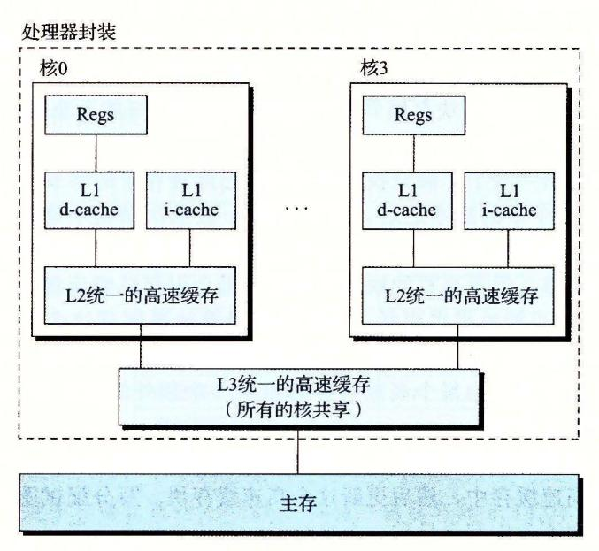

图 6-38 Intel Core i7 的高速缓存层次结构

图 6-39 总结了 Core i7 高速缓存的基本特性。

| 高速缓存类型      | 访问时间(周期) | 高速缓存大小 CC) | 相联度 (E) | 块大小 (B) | 组数 (S) |
|-------------|----------|------------|---------|---------|--------|
| LI i-cache  | 4        | 32KB       | 8       | 648     | 64     |
| LI d-cache  | 4        | 32KB       | 8       | 648     | 64     |
| L2 统一的高速缓   | 10       | 256KB      | 8       | 64B     | 512    |
| 的高速缓存<br>L3 | 40~75    | 8MB        | 16      | 64B     | 8192   |

-39 Core i7 高速缓存层次结构的特性

## 6. 4. 7 高速缓存参数的性能影响

有许多指标来衡量高速缓存的性能:

- ·不命中率 (miss rate) 。在一个程序执行或程序的一部分执行期间,内存引用不命中 的比率 它是这样计算的:不命中数量 引用数量
- ·命中率 (hit rate) 。命中的内存引用比率。它等于 一不命中率。
- ·命中时间 (hit time) 。从高速缓存传送一个字到 CPU 所需的时间,包括组选择、行 确认和字选择的时间。对于 L1 高速缓存来说,命中时间的数 级是几个时钟周期。
- ·不命中处罚 (miss penalty) 。由千不命中所需要的额外的时间。 L1 不命 中需要从 L2 得到服务的处罚,通常是数 <sup>10</sup> 个周期;从 L3 得到服务的处罚, <sup>50</sup> 个周期;,从主 存得到的服务的处罚, <sup>200</sup> 个周期

优化高速缓存的成本和性能的折中是一项很精细的工作,它需要在现实的基准程序代码上 进行大量的模拟,因此超出了我们讨论的范围 不过,还是可以认识一些定性的折中考量的。

## 高速缓存大小的影响

方面,较大的高速缓存可能会提高命中率。另一方面,使大存储器运行得更快总是 要难一些的 。结果,较大的高速缓存可能会增加命中时间。这解释了为什么 L1 高速缓存 L2 高速缓存小,以及为什么 L2 高速缓存比 L3 高速缓存小

#### 块大小的影响

大的块有利有弊。一方面,较大的块能利用程序中可能存在的空间局部性,帮助提高 命中率。不过,对千给定的高速缓存大小,块越大就意味着高速缓存行数越少,这会损害 时间局部性比空间局部性更好的程序中的命中率。较大的块对不命中处罚也有负面影响, 因为块越大,传送时间就越长。现代系统(如 Core i7) 会折中使高速缓存块包含 <sup>64</sup> 个字节。

#### 相联度的影响

这里的间题是参数 选择的影响, 是每个组中高速缓存行数。较高的相联度(也就 的值较大)的优点是降低了高速缓存由于冲突不命中出现抖动的可能性。不过,较高 的相联度会造成较高的成本。较高的相联度实现起来很昂贵,而且很难使之速度变快。每 一行需要更多的标记位,每一行需要额外的 LRU 状态位和额外的控制逻辑 较高的相联 度会增加命中时间,因为复杂性增加了,另外,还会增加不命中处罚,因为选择牺牲行的 复杂性也增加了

相联度的选择最终变成了命中时间和不命中处罚之间的折中 。传 统上,努力争取时钟 频率的高性能系统会为 L1 高速缓存选择较低的相联度(这里的不命中处罚只是几个周期), 而在不命 中处罚 比较高的较低层上使用比较小的相联度。例如, Int Core i7 系统中, L1 L2 高速缓存是 路组相联的,而 L3 高速缓存是 <sup>16</sup> 路组相联的。

#### 写策略的影响

直写高速缓存比较容易实现,而且能使用独立于高速缓存的写缓冲区 (write buffer), 用来更新内存 此外,读不命中开销没这么大,因为它们不会触发内存写 另一方面,写

回高速缓存引起的传送比较少,它允许更多的到内存的带宽用于执行 DMA 的 I/O 设备。此外,越往层次结构下面走,传送时间增加,减少传送的数量就变得更加重要。一般而言,高速缓存越往下层,越可能使用写回而不是直写。

#### 旁注 高速缓存行、组和块有什么区别?

很容易混淆高速缓存行、组和块之间的区别。让我们来回顾一下这些概念,确保概念清晰:

- 块是一个固定大小的信息包,在高速缓存和主存(或下一层高速缓存)之间来回传送。
- 行是高速缓存中的一个容器,存储块以及其他信息(例如有效位和标记位)。
- 组是一个或多个行的集合。直接映射高速缓存中的组只由一行组成。组相联和全相联高速缓存中的组是由多个行组成的。

在直接映射高速缓存中,组和行实际上是等价的。不过,在相联高速缓存中,组和 行是很不一样的,这两个词不能互换使用。

因为一行总是存储一个块,术语"行"和"块"通常互换使用。例如,系统专家总是说高速缓存的"行大小",实际上他们指的是块大小。这样的用法十分普遍,只要你理解块和行之间的区别,它不会造成任何误会。

## 6.5 编写高速缓存友好的代码

在 6.2 节中,我们介绍了局部性的思想,而且定性地谈了一下什么会具有良好的局部性。明白了高速缓存存储器是如何工作的,我们就能更加准确一些了。局部性比较好的程序更容易有较低的不命中率,而不命中率较低的程序往往比不命中率较高的程序运行得更快。因此,从具有良好局部性的意义上来说,好的程序员总是应该试着去编写高速缓存发好(cache friendly)的代码。下面就是我们用来确保代码高速缓存友好的基本方法。

- 1) 让最常见的情况运行得快。程序通常把大部分时间都花在少量的核心函数上,而 这些函数通常把大部分时间都花在了少量循环上。所以要把注意力集中在核心函数里的循 环上,而忽略其他部分。
- 2) 尽量减小每个循环内部的缓存不命中数量。在其他条件(例如加载和存储的总次数)相同的情况下,不命中率较低的循环运行得更快。

为了看看实际上这是怎么工作的,考虑 6.2 节中的函数 sumvec:

```
int sumvec(int v[N])
\nint i, sum = 0;

for (i = 0; i < N; i++)
```

这个函数高速缓存友好吗?首先,注意对于局部变量 i 和 sum,循环体有良好的时间局部性。实际上,因为它们都是局部变量,任何合理的优化编译器都会把它们缓存在寄存器文件中,也就是存储器层次结构的最高层中。现在考虑一下对向量 v 的步长为 1 的引用。一般而言,如果一个高速缓存的块大小为 B 字节,那么一个步长为 k 的引用模式(这里 k 是以字为单位的)平均每次循环迭代会有  $\min(1, (\text{wordsize} \times k)/B)$ 次缓存不命中。当 k=1时,它取最小值,所以对 v 的步长为 1 的引用确实是高速缓存友好的。例如,假设 v 是块对齐的,字为 4 个字节,高速缓存块为 4 个字,而高速缓存初始为空(冷高速缓存)。然

后,无论是什么样的高速缓存结构,对 v 的引用都会得到下面的命中和不命中模式:

```
i = 0
v[i]
                                      i = 1
                                             i = 2
                                                    i = 3
                                                            i = 4
                                                                   i = 5
                                                                          i = 6
                                                                                  i = 7
访问顺序,命中[h]或不命中[m]
                               1 [m]
                                      2 [h]
                                             3 [h]
                                                     4 [h]
                                                            5 [m]
                                                                   6 [h]
                                                                          7 [h]
                                                                                  8 [h]
```

在这个例子中,对 v[0]的引用会不命中,而相应的包含  $v[0] \sim v[3]$ 的块会被从内存加载到高速缓存中。因此,接下来三个引用都会命中。对 v[4]的引用会导致不命中,而一个新的块被加载到高速缓存中,接下来的三个引用都命中,依此类推。总的来说,四个引用中,三个会命中,在这种冷缓存的情况下,这是我们所能做到的最好的情况了。

总之,简单的 sumvec 示例说明了两个关于编写高速缓存友好的代码的重要问题:

- 对局部变量的反复引用是好的,因为编译器能够将它们缓存在寄存器文件中(时间局部性)。
- 步长为 1 的引用模式是好的,因为存储器层次结构中所有层次上的缓存都是将数据 存储为连续的块(空间局部性)。

在对多维数组进行操作的程序中,空间局部性尤其重要。例如,考虑 6.2 节中的 sumarrayrows 函数,它按照行优先顺序对一个二维数组的元素求和:

```
int sumarrayrows(int a[M][N])
\nint i, j, sum = 0;

for (i = 0; i < M; i++)
```

由于 C 语言以行优先顺序存储数组,所以这个函数中的内循环有与 sumvec 一样好的步长为 1 的访问模式。例如,假设我们对这个高速缓存做与对 sumvec 一样的假设。那么对数组 a 的引用会得到下面的命中和不命中模式:

| a[i][j]      | j = 0  | j = 1  | <i>j</i> = 2 | j = 3  | j = 4  | j = 5  | j = 6  | j = 7  |
|--------------|--------|--------|--------------|--------|--------|--------|--------|--------|
| i = 0        | 1 [m]  | 2 [h]  | 3 [h]        | 4 [h]  | 5 [m]  | 6 [h]  | 7 [h]  | 8 [h]  |
| i = 1        | 9 [m]  | 10 [h] | 11 [h]       | 12 [h] | 13 [m] | 14 [h] | 15 [h] | 16 [h] |
| i = 2        | 17 [m] | 18 [h] | 19 [h]       | 20 [h] | 21 [m] | 22 [h] | 23 [h] | 24 [h] |
| <i>i</i> = 3 | 25 [m] | 26 [h] | 27 [h]       | 28 [h] | 29 [m] | 30 [h] | 31 [h] | 32 [h] |

但是如果我们做一个看似无伤大雅的改变——交换循环的次序,看看会发生什么:

```
int sumarraycols(int a[M][N])
\nint i, j, sum = 0;

for (j = 0; j < N; j++)
```

在这种情况中,我们是一列一列而不是一行一行地扫描数组的。如果我们够幸运,整个数组都在高速缓存中,那么我们也会有相同的不命中率 1/4。不过,如果数组比高速缓存要

| 大(更可能出现这种情况),那么名 | 垂次对 a[i][i | 的访问都会不命中! |
|------------------|------------|-----------|
|------------------|------------|-----------|

| a[i][j]      | j = 0 | j = 1 | j = 2  | j = 3  | j = 4  | j = 5  | <i>j</i> = 6 | j = 7  |
|--------------|-------|-------|--------|--------|--------|--------|--------------|--------|
| i = 0        | 1 [m] | 5 [m] | 9 [m]  | 13 [m] | 17 [m] | 21 [m] | 25 [m]       | 29 [m] |
| i = 1        | 2 [m] | 6 [m] | 10 [m] | 14 [m] | 18 [m] | 22 [m] | 26 [m]       | 30 [m] |
| i = 2        | 3 [m] | 7 [m] | 11 [m] | 15 [m] | 19 [m] | 23 [m] | 27 [m]       | 31 [m] |
| <i>i</i> = 3 | 4 [m] | 8 [m] | 12 [m] | 16 [m] | 20 [m] | 24 [m] | 28 [m]       | 32 [m] |

较高的不命中率对运行时间可以有显著的影响。例如,在桌面机器上,sumarrayrows运行速度比 sumarraycols 快 25 倍。总之,程序员应该注意他们程序中的局部性,试着编写利用局部性的程序。

○ 练习题 6.17 在信号处理和科学计算的应用中,转置矩阵的行和列是一个很重要的问题。从局部性的角度来看,它也很有趣,因为它的引用模式既是以行为主(rowwise)的,也是以列为主(column-wise)的。例如,考虑下面的转置函数:

```
typedef int array[2][2];
1
2
    void transpose1(array dst, array src)
3
    {
4
         int i, j;
5
6
         for (i = 0; i < 2; i++) {
             for (j = 0; j < 2; j++) {
                 dst[j][i] = src[i][j];
9
             }
10
         }
11
12
```

假设在一台具有如下属性的机器上运行这段代码:

- sizeof(int)==4.
- src 数组从地址 0 开始, dst 数组从地址 16(十进制)开始。
- 只有一个 L1 数据高速缓存,它是直接映射的、直写和写分配的,块大小为 8 个字节。
- 这个高速缓存总的大小为 16 个数据字节, 一开始是空的。
- 对 src 和 dst 数组的访问分别是读和写不命中的唯一来源。

A. 对每个 row 和 col, 指明对 src[row][col]和 dst[row][col]的访问是命中(h) 还是不命中(m)。例如,读 src[0][0]会不命中,写 dst[0][0]也不命中。

|    | dst数组 |    |
|----|-------|----|
|    | 列0    | 列1 |
| 0行 | m     |    |
| 1行 |       |    |

|    | src数组 |    |
|----|-------|----|
|    | 列0    | 列1 |
| 0行 | m     |    |
| 1行 |       |    |

B. 对于一个大小为 32 数据字节的高速缓存重复这个练习。

○ 练习题 6.18 最近一个很成功的游戏 SimAquarium 的核心就是一个紧密循环(tight loop),它计算 256 个海藻(algae)的平均位置。在一台具有块大小为 16 字节(B=16)、整个大小为 1024 字节的直接映射数据缓存的机器上测量它的高速缓存性能。定义如下:

```
struct algae_position {
   int x;
   int y;
};
```

```
5
6  struct algae_position grid[16][16];
7  int total_x = 0, total_y = 0;
8  int i, j;
```

还有如下假设:

• sizeof(int) == 4.

- grid 从内存地址 0 开始。
- 这个高速缓存开始时是空的。
- 唯一的内存访问是对数组 grid 的元素的访问。变量 i、j、total\_x和 total\_y存 放在寄存器中。

确定下面代码的高速缓存性能:

```
1
         for (i = 0; i < 16; i++) {
             for (j = 0; j < 16; j++) {
2
                 total_x += grid[i][j].x;
         7
         for (i = 0; i < 16; i++) {
7
             for (j = 0; j < 16; j++) {
8
9
                 total_y += grid[i][j].y;
             }
10
         7
11
```

- A. 读总数是多少?
- B. 缓存不命中的读总数是多少?
- C. 不命中率是多少?

练习题 6.19 给定练习题 6.18 的假设,确定下列代码的高速缓存性能:

```
for (i = 0; i < 16; i++){
for (j = 0; j < 16; j++) {
    total_x += grid[j][i].x;
    total_y += grid[j][i].y;
}
}</pre>
```

- A. 读总数是多少?
- B. 高速缓存不命中的读总数是多少?
- C. 不命中率是多少?
- D. 如果高速缓存有两倍大,那么不命中率会是多少呢?

★习题 6.20 给定练习题 6.18 的假设,确定下列代码的高速缓存性能。

```
for (i = 0; i < 16; i++){
for (j = 0; j < 16; j++) {
    total_x += grid[i][j].x;
    total_y += grid[i][j].y;
}
}</pre>
```

- A. 读总数是多少?
- B. 高速缓存不命中的读总数是多少?

- C. 不命中率是多少?
- D. 如果高速缓存有两倍大,那么不命中率会是多少呢?

## 6.6 综合: 高速缓存对程序性能的影响

本节通过研究高速缓存对运行在实际机器上的程序的性能影响,综合了我们对存储器 层次结构的讨论。

#### 6.6.1 存储器山

一个程序从存储系统中读数据的速率称为读吞吐量(read throughput),或者有时称为读带宽(read bandwidth)。如果一个程序在s秒的时间段内读n个字节,那么这段时间内的读吞吐量就等于n/s,通常以兆字节每秒(MB/s)为单位。

如果我们要编写一个程序,它从一个紧密程序循环(tight program loop)中发出一系列读请求,那么测量出的读吞吐量能让我们看到对于这个读序列来说的存储系统的性能。图 6-40

```
    code/mem/mountain/mountain.c

1
     long data[MAXELEMS];
                                /* The global array we'll be traversing */
 2
 3
     /* test - Iterate over first "elems" elements of array "data" with
               stride of "stride", using 4 x 4 loop unrolling.
      */
 5
     int test(int elems, int stride)
 6
 7
         long i, sx2 = stride*2, sx3 = stride*3, sx4 = stride*4;
         long acc0 = 0, acc1 = 0, acc2 = 0, acc3 = 0;
10
         long length = elems;
11
         long limit = length - sx4:
12
         /* Combine 4 elements at a time */
13
         for (i = 0; i < limit; i += sx4) {
             acc0 = acc0 + data[i];
15
             acc1 = acc1 + data[i+stride];
16
17
             acc2 = acc2 + data[i+sx2];
18
             acc3 = acc3 + data[i+sx3];
         }
19
20
21
         /* Finish any remaining elements */
22
         for (; i < length; i+=stride) {
23
             acc0 = acc0 + data[i];
24
         return ((acc0 + acc1) + (acc2 + acc3));
25
26
27
     /* run - Run test(elems, stride) and return read throughput (MB/s).
28
29
              "size" is in bytes, "stride" is in array elements, and Mhz is
30
              CPU clock frequency in Mhz.
31
32
     double run(int size, int stride, double Mhz)
33
         double cycles;
34
         int elems = size / sizeof(double);
36
                                                   /* Warm up the cache */
37
         test(elems, stride);
         cycles = fcyc2(test, elems, stride, 0); /* Call test(elems, stride) */
39
         return (size / stride) / (cycles / Mhz); /* Convert cycles to MB/s */
40
     }
                                                                   code/mem/mountain/mountain.c
```

图 6-40 测量和计算读吞吐量的函数。我们可以通过以不同的 size(对应于时间局部性)和 stride(对应于空间局部性)的值来调用 run 函数,产生某台计算机的存储器山

给出了一对测量某个读序列读吞吐 的函数。

test 函数通过以步长 stride 扫描一个数组的头 elems 个元素来产生读序列。为了 提高内循环中可用的并行性,使用了 4X4 展开(见 5. 节)。 run 函数是一个包装函数, 调用 test 函数,并返回测掀出的读吞吐量。第 <sup>37</sup> 行对 test 函数的调用会对高速缓存做 暖身。第 <sup>38</sup> 行的 fcyc2 函数以参数 elems 调用 test 函数,并估计 test 函数的运行时 间,以 CPU 周期为单位。注意, run 函数的参数 size 是以字节为单位的,而 test 函数 对应的参数 elems 是以数组元素为单位的。另外,注意第 <sup>39</sup> 行将 MB 计算为 矿字节 秒,而不是 <sup>20</sup> 字节 秒。

run 函数的参数 size stride 允许我们控制产生出的读序列的时间和空间局部性 程度。 size 的值越小,得到的工作集越小,因此时间局部性越好。 stride 的值越小,得 到的空间局部性越好。如果我们反复以不同的 size stride 值调用 run 函数,那么我 们就能得到一个读带宽的时间和空间局部性的二维函数,称为存储器山 (memory mountain) [112]

每个计算机都有表明它存储器系统的能力特色的唯 的存储器山。例如,图 6-41 示了 Intel Core i7 系统的存储器山。在这个例子中, size 16KB 变到 128KB, stride 变到 <sup>12</sup> 个元素,每个元素是 个字节的 long int

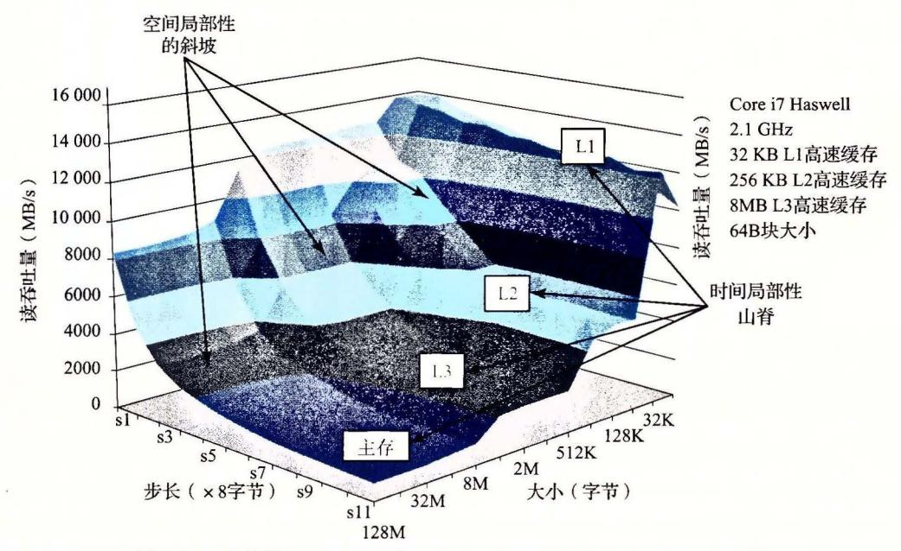

6-4 存储器山 展示了读 吐量,它是时间和 间局部性的函数

这座 Core i7 山的地形地势展现了一个很丰富的结构 垂直千大小轴的是四条山脊, 分别对应千工作集完全在 L1 高速缓存、 L2 高速缓存、 L3 高速缓存和主存内的时间局部 性区域。注意, L1 山脊的最高点(那里 CPU 读速率为 14GB s) 与主存山脊的最低点(那里 CPU 读速率为 900MB/s) 之间的差别有一个数鼠级。

L2 L3 和主存山脊上,随着步长的增加,有一个空间局部性的斜坡,空间局部性 下降。注意,即使当工作集太大,不能全都装进任何一个高速缓存时,主存山脊的最高点 也比它的最低点高 倍。因此,即使是当程序的时间局部性很差时,空间局部性仍然能补 救,并且是非常重要的。

有一条特别有趣的平坦的山脊线,对于步长1垂直于步长轴,此时读吞吐量相对保持不变,为12GB/s,即使工作集超出了L1和L2的大小。这显然是由于Core i7存储器系统中的硬件预取(prefetching)机制,它会自动地识别顺序的、步长为1的引用模式,试图在一些块被访问之前,将它们取到高速缓存中。虽然文档里没有记录这种预取算法的细节,但是从存储器山可以明显池看到这个算法对小步长效果最好——这也是代码中要使用步长为1的顺序访问的另一个理由。

如果我们从这座山中取出一个片段,保持步长为常数,如图 6-42 所示,我们就能很清楚地看到高速缓存的大小和时间局部性对性能的影响了。大小最大为 32KB 的工作集完全能放进 L1 d-cache 中,因此,读都是由 L1 来服务的,吞吐量保持在峰值 12GB/s 处。大小最大为 256KB 的工作集完全能放进统一的 L2 高速缓存中,对于大小最大为 8 M,工作集完全能放进统一的 L3 高速缓存中。更大的工作集大小主要由主存来服务。

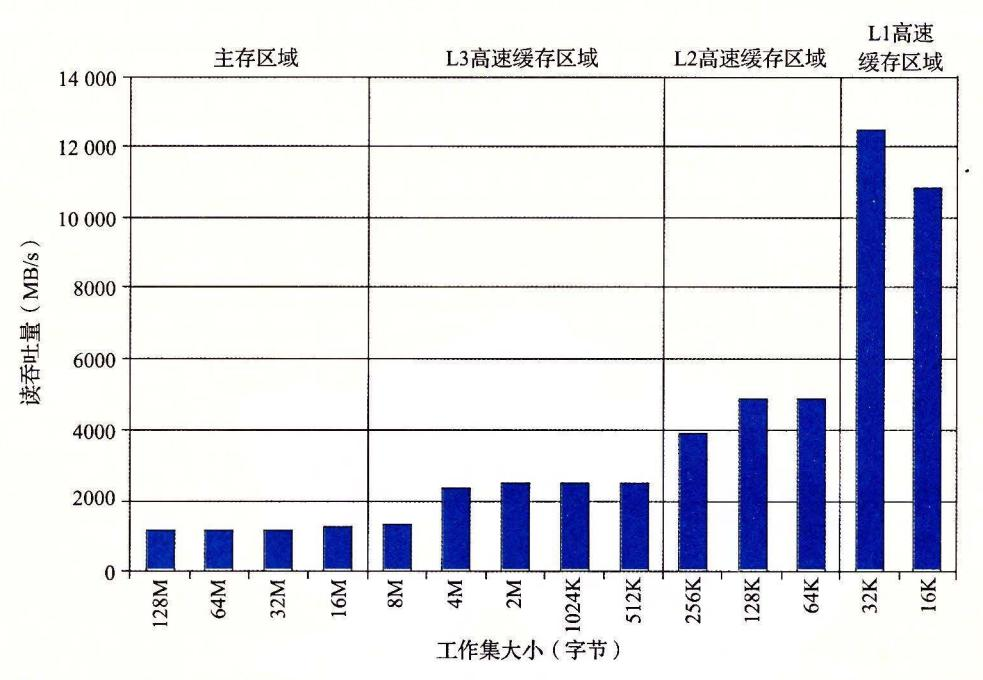

图 6-42 存储器山中时间局部性的山脊。这幅图展示了图 6-41 中 stride=8 时的一个片段

L2 和 L3 高速缓存区域最左边的边缘上读吞吐量的下降很有趣,此时工作集大小为 256KB 和 8MB,等于对应的高速缓存的大小。为什么会出现这样的下降,还不是完全清楚。要确认的唯一方法就是执行一个详细的高速缓存模拟,但是这些下降很有可能是与其 他数据和代码行的冲突造成的。

以相反的方向横切这座山,保持工作集大小不变,我们从中能看到空间局部性对读吞吐量的影响。例如,图 6-43 展示了工作集大小固定为 4MB 时的片段。这个片段是沿着图 6-41 中的 L3 山脊切的,这里,工作集完全能够放到 L3 高速缓存中,但是对 L2 高速缓存来说太大了。

注意随着步长从1个字增长到8个字,读吞吐量是如何平稳地下降的。在山的这个区域中,L2中的读不命中会导致一个块从L3传送到L2。后面在L2中这个块上会有一定数量的命中,这是取决于步长的。随着步长的增加,L2不命中与L2命中的比值也增加了。因为服务不命中要比命中更慢,所以读吞吐量也下降了。一旦步长达到了8个字,在这个系统上就等于块的大小64个字节了,每个读请求在L2中都会不命中,必须从L3服务。

因此,对于至少为 个字的步长来说,读吞吐量是一个常数速率,是由从 L3 传送高速缓 存块到 L2 的速率决定的。

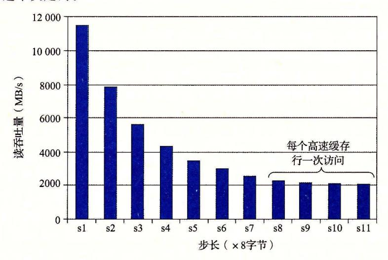

6-43 个空间局部性的斜坡。这幅图展示了图 6-41 中大小= 4MB 时的一个片段

总结一下我们对存储器山的讨论,存储器系统的性能不是一个数字就能描述的。相 反,它是一座时间和空间局部性的山,这座山的上升高度差别可以超过一个数量级。明智 的程序员会试图构造他们的程序,使得程序运行在山峰而不是低谷。目标就是利用时间局 部性,使得频繁使用的字从 L1 中取出,还要利用空间局部性,使得尽可能多的字从一个 L1 高速缓存行中访问到。

练习题 2 1 利用图 6-41 中的存储器山来估计从 Ll cl-cache 中读一个 字节的字所 需要的时间(以 CPU 周期为单位)。

## 6. 6. 2. 重新排列循环以提高空间局部性

考虑一对 nXn 矩阵相乘的问题: C=AB 。例如,如果 n=2, 那么

$$\begin{bmatrix} c_{11}c_{12} \\ c_{21}c_{22} \end{bmatrix} = \begin{bmatrix} a_{11}a_{12} \\ a_{21}a_{22} \end{bmatrix} \begin{bmatrix} b_{11}b_{12} \\ b_{21}b_{22} \end{bmatrix}$$

其中

$$c_{11} = a_{11}b_{11} + a_{12}b_{21}$$

$$c_{12} = a_{11}b_{12} + a_{12}b_{22}$$

$$c_{21} = a_{21}b_{11} + a_{22}b_{21}$$

$$c_{22} = a_{21}b_{12} + a_{22}b_{22}$$

矩阵乘法函数通常是用 个嵌套的循环来实现的,分别用索引 、]和 来标识。如果改变 循环的次序,对代码进行一些其他的小改动,我们就能得到矩阵乘法的 个在功能上等价 的版本,如图 6-44 所示。每个版本都以它循环的顺序来唯一地标识。

在高层次来看,这 个版本是非常相似的。如果加法是可结合的,那么每个版本计算 出的结果完全一样气每个版本总共都执行 O(n3) 个操作,而加法和乘法的数扯相同。

e) 正如我们在第 章中学到的,浮点加法是可交换的,但是通常是不可结合的。实际上,如果矩阵不把极大 的数和极小的数混在一起 存储物理属性的矩阵常常这样,那么假设浮点加法是可结合的也是合理的。

和 B 的  $n^2$  个元素中的每一个都要读 n 次。计算 C 的  $n^2$  个元素中的每一个都要对 n 个值求和。不过,如果分析最里层循环迭代的行为,我们发现在访问数量和局部性上还是有区别的。为了分析,我们做了如下假设:

- 每个数组都是一个 double 类型的  $n \times n$  的数组, sizeof (double) == 8。
- 只有一个高速缓存, 其块大小为 32 字节(B=32)。
- 数组大小 n 很大,以至于矩阵的一行都不能完全装进 L1 高速缓存中。
- ●编译器将局部变量存储到寄存器中,因此循环内对局部变量的引用不需要任何加载 或存储指令。

```
code/mem/matmult/mm.c
                                                      code/mem/matmult/mm.c
   for (i = 0; i < n; i++)
                                     1 for (j = 0; j < n; j++)
                                        for (i = 0; i < n; i++) {
      for (j = 0; j < n; j++) {
2
          sum = 0.0;
                                             sum = 0.0;
                                               for (k = 0; k < n; k++)
          for (k = 0; k < n; k++)
                                               sum += A[i][k]*B[k][i];
             sum += A[i][k]*B[k][i];
                                               C[i][j] += sum;
          C[i][j] += sum;
      }
                                           code/mem/matmult/mm.c
             code/mem/matmult/mm.c
a) ijk版本
code/mem/matmult/mm.c

for (j = 0; j < n; j++)

for (k = 0; k < n; k++)
2 for (k = 0; k < n; k++) { | f | f | f | f | f | f | f | f | f |
3、 以名言: x = B[k][j]; . 治路保留: 2 日                                  
          for (i = 0; i < n; i++)
                                               for (i = 0; i < n; i++)
                                     4
             C[i][j] += A[i][k]*r;
                                                   C[i][j] += A[i][k]*r;
                                                  code/mem/matmult/mm.c
               --- code/mem/matmult/mm.c
                                                  d) kji版本
             c) jki版本
                                                code/mem/matmult/mm.c
            ----- code/mem/matmult/mm.c
   for (k = 0; k < n; k++) for (i = 0; i < n; i++)
      for (i = 0; i < n; i++) {A^{-1} + 1}
                                         for (k = 0; k < n; k++) {
2
                                         r = A[i][k];
          r = A[i][k];
for (j = 0; j < n; j++)
                                               for (j = 0; j < n; j++)
                                                   C[i][i] += A[i][k]*r;
             C[i][j] += r*B[k][j];
      }
                — code/mem/matmult/mm.c
                                                   —— code/mem/matmult/mm.c
                             f) ikj版本
             e) kij版本
```

图 6-44 矩阵乘法的六个版本。每个版本都以它循环的顺序来唯一地标识

图 6-45 总结了我们对内循环的分析结果。注意 6 个版本成对地形成了 3 个等价类,用内循环中访问的矩阵对来表示每个类。例如,版本 ijk 和 jik 是类 AB 的成员,因为它们在最内层的循环中引用的是矩阵 A 和 B (而不是 C)。对于每个类,我们统计了每个内循环迭代中加载(读)和存储(写)的数量,每次循环迭代中对 A、B,和 C 的引用在高速缓存中不命中的数量,以及每次迭代缓存不命中的总数。

类 AB 例程的内循环(图 6-44a 和图 6-44b)以步长 1 扫描数组 A 的一行。因为每个高速缓存块保存四个 8 字节的字,A 的不命中率是每次迭代不命中 0.25 次。另一方面,内

循环以步长n 扫描数组B 的一列。因为n 很大,每次对数组B 的访问都会不命中,所以每次迭代总共会有1.25 次不命中。

| 矩阵乘法版本         | A 450 1 50 | 每次迭代 |        |        |        |        |  |  |  |  |  |  |
|----------------|------------|------|--------|--------|--------|--------|--|--|--|--|--|--|
| (类)            | 加载次数       | 存储次数 | A未命中次数 | B未命中次数 | C未命中次数 | 未命中总次数 |  |  |  |  |  |  |
| ijk & jik (AB) | 2          | 0    | 0.25   | 1.00   | 0.00   | 1.25   |  |  |  |  |  |  |
| jki & kji (AC) | 2          | 1    | 1.00   | 0.00   | 1.00   | 2.00   |  |  |  |  |  |  |
| kij & ikj (BC) | 2          | 1    | 0.00   | 0.25   | 0.25   | 0.50   |  |  |  |  |  |  |

图 6-45 矩阵乘法内循环的分析。6个版本分为3个等价类,用内循环中访问的数组对来表示

类 AC 例程的内循环(图 6-44c 和图 6-44d)有一些问题。每次迭代执行两个加载和一个存储(相对于类 AB 例程,它们执行 2 个加载而没有存储)。内循环以步长 n 扫描 A 和 C 的列。结果是每次加载都会不命中,所以每次迭代总共有两个不命中。注意,与类 AB 例程相比,交换循环降低了空间局部性。

BC 例程(图 6-44e 和图 6-44f)展示了一个很有趣的折中:使用了两个加载和一个存储,它们比 AB 例程多需要一个内存操作。另一方面,因为内循环以步长为 1 的访问模式按行扫描 B 和 C,每次迭代每个数组上的不命中率只有 0.25 次不命中,所以每次迭代总共有 0.50 个不命中。

图 6-46 小结了一个 Core i7 系统上矩阵乘法各个版本的性能。这个图画出了测量出的每次内循环迭代所需的 CPU 周期数作为数组大小(n)的函数。

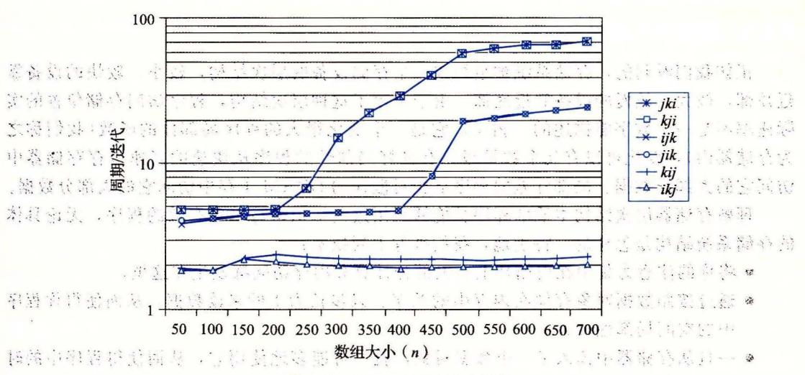

图 6-46 Core i7 矩阵乘法性能

对于这幅图有很多有意思的地方值得注意:

● 对于大的 n 值,即使每个版本都执行相同数量的浮点算术操作,最快的版本比最慢的版本运行得快几乎 40 倍。

크 답변조되기

- 每次迭代内存引用和不命中数量都相同的一对版本,有大致相同的测量性能。
- 内存行为最糟糕的两个版本,就每次迭代的访问数量和不命中数量而言,明显地比 其他4个版本运行得慢,其他4个版本有较少的不命中次数或者较少的访问次数, 或者兼而有之。
- ※● 在这个情况中,与内存访问总数相比,不命中率是一个更好的性能预测指标。例

如,即使类 BC 例程(2个加载和1个存储)在内循环中比类 AB 例程(2个加载)执行 更多的内存引用,类 BC 例程(每次迭代有 0.5个不命中)比类 AB 例程(每次迭代有 1.25个不命中)性能还是要好很多。

● 对于大的 n 值,最快的一对版本(kij 和 ikj)的性能保持不变。虽然这个数组远大于任何 SRAM 高速缓存存储器,但预取硬件足够聪明,能够认出步长为 1 的访问模式,而且速度足够快能够跟上内循环中的内存访问。这是设计这个内存系统的 Intel 的工程师所做的一项极好成就,向程序员提供了甚至更多的鼓励,鼓励他们开发出具有良好空间局部性的程序。

#### 网络旁注 MEM: BLOCKING 使用分块来提高时间局部性

有一项很有趣的技术,称为分块(blocking),它可以提高内循环的时间局部性。分块的大致思想是将一个程序中的数据结构组织成的大的片(chunk),称为块(block)。(在这个上下文中,"块"指的是一个应用级的数据组块,而不是高速缓存块。)这样构造程序,使得能够将一个片加载到 L1 高速缓存中,并在这个片中进行所需的所有的读和写,然后丢掉这个片,加载下一个片,依此类推。

与为提高空间局部性所做的简单循环变换不同,分块使得代码更难阅读和理解。由于这个原因,它最适合于优化编译器或者频繁执行的库函数。由于 Core i7 有完善的预取硬件,分块不会提高矩阵乘在 Core i7 上的性能。不过,学习和理解这项技术还是很有趣的,因为它是一个通用的概念,可以在一些没有预取的系统上获得极大的性能收益。

#### 6.6.3 在程序中利用局部性

正如我们看到的,存储系统被组织成一个存储设备的层次结构,较小、较快的设备靠近顶部,较大、较慢的设备靠近底部。由于采用了这种层次结构,程序访问存储位置的实际速率不是一个数字能描述的。相反,它是一个变化很大的程序局部性的函数(我们称之为存储器山),变化可以有几个数量级。有良好局部性的程序从快速的高速缓存存储器中访问它的大部分数据。局部性差的程序从相对慢速的 DRAM 主存中访问它的大部分数据。

理解存储器层次结构本质的程序员能够利用这些知识编写出更有效的程序,无论具体的存储系统结构是怎样的。特别地,我们推荐下列技术:

- 将你的注意力集中在内循环上,大部分计算和内存访问都发生在这里。
- 通过按照数据对象存储在内存中的顺序、以步长为 1 的来读数据,从而使得你程序中的空间局部性最大。
- 一旦从存储器中读入了一个数据对象,就尽可能多地使用它,从而使得程序中的时间局部性最大。

## 6.7 小结

基本存储技术包括随机存储器(RAM)、非易失性存储器(ROM)和磁盘。RAM有两种基本类型。静态 RAM(SRAM)快一些,但是也贵一些,它既可以用做 CPU 芯片上的高速缓存,也可以用做芯片下的高速缓存。动态 RAM(DRAM)慢一点,也便宜一些,用做主存和图形帧缓冲区。即使是在关电的时候,ROM 也能保持它们的信息,可以用来存储固件。旋转磁盘是机械的非易失性存储设备,以每个位很低的成本保存大量的数据,但是其访问时间比 DRAM 长得多。固态硬盘(SSD)基于非易失性的闪存,对某些应用来说,越来越成为旋转磁盘的具有吸引力的替代产品。

一般而言,较快的存储技术每个位会更贵,而且容量更小。这些技术的价格和性能属性正在以显著

不同的速度变化着 特别地, DRAM 和磁盘访问时间远远大于 CPU 周期时间 系统通过将存储器组织 成存储设备的层次结构来弥补这些差异,在这个层次结构中,较小、较快的设备在顶部,较大、较慢的 设备在底部。因为编写良好的程序有好的局部性,大多数数据都可以从较高层得到服务,结果就是存储 系统能以较高层的速度运行,但却有较低层的成本和容址。

程序员可以通过编写有良好空间和时间局部性的程序来显著地改进程序的运行时间。利用基于 SRAM 的高速缓存存储器特别重要。主要从高速缓存取数据的程序能比主要从内存取数据的程序运行得 快得多。

## 参考文献说明

内存和磁盘技术变化得很快。根据我们的经验,最好的技术信息来源是制造商维护的 Web 页面。像 Micron Toshiba Samsung 这样的公司,提供了丰富的当前有关内存设备的技术信息。 Seagate Western ital 的页面也提供了类似的有关磁盘的有用信息。

关于电路和逻辑设计的教科书提供了关千内存技术的详细信息 [58, 89] IEEE Spectrum 出版了一 系列有关 DRAM 的综述文章[55] 计算机体系结构国际会议 (ISCA) 和高性能计算机体系结构 (HPCA) 关于 DRAM 存储性能特性的公共论坛 [28, 29 , 18]

Wilkes 了第一篇关于高速缓存存储器的论文 [117] Smith 写了一篇经典的综述 104] Przybylski 编写了一本关千高速缓存设计的权威著作 [86] Hennessy Patterson 提供了对高速缓存设计问题的全 面讨论 [46] Levinthal 写了一篇有关 Intel Core i7 的全面性能指南 [70

Stricker [112] 中介绍了存储器山的思想,作为对存储器系统的全面描述,并且在后来的工作描述 中非正式地提出了术语"存储器山"。编译楛研究者通过自动执行我们在 6. 节中讨论过的那些手工代码 转换来增加局部性 [22, 32, 66. 72, 79, 87, 119] Carter 和他的同 们提出了 个高速缓存可知晓的 内存控制器 (cache-aware memory controller) [ 17] 其他的研究者开发出了高速缓存不知晓的 (cache oblivious) 算法,它被设计用来在不明确知道底层高速缓存存储器结构的情况下也能运行得很好 [30, 38, 39, 9]

关于构造和使用磁盘存储设备也有大量的论著。许多存储技术研究者找寻方法,将单个的磁盘集合 成更大、更健壮和更安全的存储池 [20, 40, 41, 83, <sup>121</sup> 。其他研究者找寻利用高速缓存和局部性来改 进磁盘访间性能的方法 [12, 21] 。像 Exokern 这样的系统提供了更多的对磁盘和存储器资源的用户级 控制 [57] 。像安德鲁文件系统[78] Coda[94] 这样的系统,将存储器层次结构扩展到了计算机网络和移 动笔记本电脑。 Schindler Ganger 开发了一个有趣的工具,它能自动描述 SCSI 磁盘驱动器的构造和性 [95] 。研究者正在研究构造和使用基于闪存的 SSD 的技术 [8, 81]

## 家庭作业

- .. 6. <sup>22</sup> 假设要求你设计一个每条磁道位数固定的旋转磁盘 你知道每条磁道的位数是由最里层磁道的周 长决定的,可以假设它就是中间那个圆洞的周长。因此,如果你把磁盘中间的洞做得大一点,每 条磁道的位数就会增大,但是总的磁道数会减少 如果用 来表示盘面的半径, • 表示圆洞的 半径,那么 取什么值能使这个磁盘的容量最大?
- 6. <sup>23</sup> 估计访问下面这个磁盘上扇区的平均时间(以 ms 为单位):

| 15 000RPM |  |
|-----------|--|
| 4ms       |  |
| 800       |  |

•• 6. <sup>24</sup> 假设一个 2MB 的文件,由 <sup>512</sup> 个字节的逻辑块组成,存储在具有下述特性的磁盘驱动器上:

DESCRIPTION VALUE SERVICES

| INTERNATION OF THE PARTY OF THE PARTY OF THE PARTY OF THE PARTY OF THE PARTY OF THE PARTY OF THE PARTY OF THE PARTY OF THE PARTY OF THE PARTY OF THE PARTY OF THE PARTY OF THE PARTY OF THE PARTY OF THE PARTY OF THE PARTY OF THE PARTY OF THE PARTY OF THE PARTY OF THE PARTY OF THE PARTY OF THE PARTY OF THE PARTY OF THE PARTY OF THE PARTY OF THE PARTY OF THE PARTY OF THE PARTY OF THE PARTY OF THE PARTY OF THE PARTY OF THE PARTY OF THE PARTY OF THE PARTY OF THE PARTY OF THE PARTY OF THE PARTY OF THE PARTY OF THE PARTY OF THE PARTY OF THE PARTY OF THE PARTY OF THE PARTY OF THE PARTY OF THE PARTY OF THE PARTY OF THE PARTY OF THE PARTY OF THE PARTY OF THE PARTY OF THE PARTY OF THE PARTY OF THE PARTY OF THE PARTY OF THE PARTY OF THE PARTY OF THE PARTY OF THE PARTY OF THE PARTY OF THE PARTY OF THE PARTY OF THE PARTY OF THE PARTY OF THE PARTY OF THE PARTY OF THE PARTY OF THE PARTY OF THE PARTY OF THE PARTY OF THE PARTY OF THE PARTY OF THE PARTY OF THE PARTY OF THE PARTY OF THE PARTY OF THE PARTY OF THE PARTY OF THE PARTY OF THE PARTY OF THE PARTY OF THE PARTY OF THE PARTY OF THE PARTY OF THE PARTY OF THE PARTY OF THE PARTY OF THE PARTY OF THE PARTY OF THE PARTY OF THE PARTY OF THE PARTY OF THE PARTY OF THE PARTY OF THE PARTY OF THE PARTY OF THE PARTY OF THE PARTY OF THE PARTY OF THE PARTY OF THE PARTY OF THE PARTY OF THE PARTY OF THE PARTY OF THE PARTY OF THE PARTY OF THE PARTY OF THE PARTY OF THE PARTY OF THE PARTY OF THE PARTY OF THE PARTY OF THE PARTY OF THE PARTY OF THE PARTY OF THE PARTY OF THE PARTY OF THE PARTY OF THE PARTY OF THE PARTY OF THE PARTY OF THE PARTY OF THE PARTY OF THE PARTY OF THE PARTY OF THE PARTY OF THE PARTY OF THE PARTY OF THE PARTY OF THE PARTY OF THE PARTY OF THE PARTY OF THE PARTY OF THE PARTY OF THE PARTY OF THE PARTY OF THE PARTY OF THE PARTY OF THE PARTY OF THE PARTY OF THE PARTY OF THE PARTY OF THE PARTY OF THE PARTY OF THE PARTY OF THE PARTY OF THE PARTY OF THE PARTY OF THE PARTY OF THE PARTY OF THE PARTY OF THE PARTY OF THE PARTY OF THE PARTY OF THE PARTY OF THE PARTY OF THE PARTY OF THE | 参数                    | 值         |
|--------------------------------------------------------------------------------------------------------------------------------------------------------------------------------------------------------------------------------------------------------------------------------------------------------------------------------------------------------------------------------------------------------------------------------------------------------------------------------------------------------------------------------------------------------------------------------------------------------------------------------------------------------------------------------------------------------------------------------------------------------------------------------------------------------------------------------------------------------------------------------------------------------------------------------------------------------------------------------------------------------------------------------------------------------------------------------------------------------------------------------------------------------------------------------------------------------------------------------------------------------------------------------------------------------------------------------------------------------------------------------------------------------------------------------------------------------------------------------------------------------------------------------------------------------------------------------------------------------------------------------------------------------------------------------------------------------------------------------------------------------------------------------------------------------------------------------------------------------------------------------------------------------------------------------------------------------------------------------------------------------------------------------------------------------------------------------------------------------------------------------|-----------------------|-----------|
| MAN COLUMN                                                                                                                                                                                                                                                                                                                                                                                                                                                                                                                                                                                                                                                                                                                                                                                                                                                                                                                                                                                                                                                                                                                                                                                                                                                                                                                                                                                                                                                                                                                                                                                                                                                                                                                                                                                                                                                                                                                                                                                                                                                                                                                     | 旋转速率                  | 15 000RPM |
| dinfid to sub-                                                                                                                                                                                                                                                                                                                                                                                                                                                                                                                                                                                                                                                                                                                                                                                                                                                                                                                                                                                                                                                                                                                                                                                                                                                                                                                                                                                                                                                                                                                                                                                                                                                                                                                                                                                                                                                                                                                                                                                                                                                                                                                 | T <sub>avg seek</sub> | 4 ms      |
|                                                                                                                                                                                                                                                                                                                                                                                                                                                                                                                                                                                                                                                                                                                                                                                                                                                                                                                                                                                                                                                                                                                                                                                                                                                                                                                                                                                                                                                                                                                                                                                                                                                                                                                                                                                                                                                                                                                                                                                                                                                                                                                                | 平均扇区数/磁道              | 1000      |
|                                                                                                                                                                                                                                                                                                                                                                                                                                                                                                                                                                                                                                                                                                                                                                                                                                                                                                                                                                                                                                                                                                                                                                                                                                                                                                                                                                                                                                                                                                                                                                                                                                                                                                                                                                                                                                                                                                                                                                                                                                                                                                                                | 盘面数                   | 8         |
| TART BURGET                                                                                                                                                                                                                                                                                                                                                                                                                                                                                                                                                                                                                                                                                                                                                                                                                                                                                                                                                                                                                                                                                                                                                                                                                                                                                                                                                                                                                                                                                                                                                                                                                                                                                                                                                                                                                                                                                                                                                                                                                                                                                                                    | 扇区大小                  | 512字节     |

· 中国中国中国中国

WARD KEELS

3.11.12.13.11.11.11.11.11.11.11.11.11.11.11.11.

19 19 1 1748 r 对于下面的每种情况, 假设程序顺序地读文件的逻辑块, 一个接一个, 并且对第 读/写头的时间等于 Tavg seek + Tavg rotation 。

- A. 最好情况:估计在所有可能的逻辑块到磁盘扇区的映射上读该文件所需要的最优时间(以 ms 为单位)。
- B. 随机情况:估计如果块是随机映射到磁盘扇区上时读该文件所需要的时间(以 ms 为单位)。
- \*6.25 下面的表给出了一些不同的高速缓存的参数。对于每个高速缓存、填写出表中缺失的字段。记住 m是物理地址的位数,C是高速缓存大小(数据字节数),B是以字节为单位的块大小,E是相联 一、 ,

| 高速缓存 | m  | C    | В  | E   | S           | t         | S        | b            | 1   |
|------|----|------|----|-----|-------------|-----------|----------|--------------|-----|
| 1.   | 32 | 1024 | 4  | 4   | s da        | 7 44 14 F | THE RES  | THE I'M ROLL |     |
| 2.   | 32 | 1024 | 4  | 256 | W jace      | *         | 734      |              |     |
| 3.   | 32 | 1024 | 8  | 1   | 17275       | 215000    | 1118/19  | i Lakah      |     |
| 4.   | 32 | 1024 | 8  | 128 | Frank Z     | Adi a     | 77 1,333 | est A        | 1   |
| 5.   | 32 | 1024 | 32 | 111 | Carta da Se | 7 12 15   |          | 1 18 8 Ca    | 601 |
| 6.   | 32 | 1024 | 32 | 4   | 1.14        | al; 43 %) | in New   | 1. 图 图 数     | Ż.  |

下面的表给出了一些不同的高速缓存的参数。你的任务是填写出表中缺失的字段。记住 m 是物理 地址的位数, C 是高速缓存大小(数据字节数), B 是以字节为单位的块大小, E 是相联度, S 是高 速缓存组数, t 是标记位数, s 是组索引位数, 而 b 是块偏移位数。

| ត្សស្នាក្នុង            | 高速缓存 | m  | <i>C</i> | В      | <i>E</i> | S   | 1. t . v .      | · s        | b      |
|-------------------------|------|----|----------|--------|----------|-----|-----------------|------------|--------|
| 変素性には母り子                | 1.   | 32 | p.831    | 8      | 1        |     | 21              | 8          | 3,     |
| 数百里纳斯格林                 | 2.   | 32 | 2048     | 735    | 13.1.0   | 128 | 23 .            | 7          | 2      |
| THE MINGSELE            | 3.   | 32 | 1024     | 2      | . 8      | 64  | promise service | elo TELVIJ | , 1,   |
| AND The partie of the A | 4.   | 32 | 1024     | 11 2 1 | 2 .      | 16  | 23              | 4          | 1 de 1 |

生物包裹上的现在分词不足

- \* 6.27 这个问题是关于练习题 6.12 中的高速缓存的。全个语言由于最后是有意识的概念与答案。
  - A. 列出所有会在组1中命中的十六进制内存地址。
  - B. 列出所有会在组 6 中命中的十六进制内存地址。
- \*\* 6/128 "这个问题是关于练习题 6.12 中的高速缓存的。\* 2017 11 11 11 11 11 11 11 11 11 11 11 11 1
  - A. 列出所有会在组 2 中命中的十六进制内存地址。
  - B. 列出所有会在组 4 中命中的十六进制内存地址。
    - C. 列出所有会在组 5 中命中的十六进制内存地址。
    - D. 列出所有会在组7中命中的十六进制内存地址。
- \*\* 6.29 假设我们有一个具有如下属性的系统:
  - 内存是字节寻址的。
  - 内存访问是对1字节字的(而不是4字节字)。 epri k
  - 地址宽 12 位。
  - 高速缓存是两路组相联的(E=2),块大小为4字节(B=4),有4个组(S=4)。 高速缓存的内容如下,所有的地址、标记和值都以十六进制表示: 1000年1000年1000年1000年100日 | 1000年100日 | 1000年100日 | 1000年100日 | 1000年100日 | 1000年100日 | 1000年100日 | 1000年100日 | 1000年100日 | 1000年100日 | 1000年100日 | 1000年100日 | 1000年100日 | 1000年100日 | 1000年100日 | 1000年100日 | 1000年100日 | 1000年100日 | 1000年100日 | 1000年100日 | 1000年100日 | 1000年100日 | 1000年100日 | 1000年100日 | 1000年100日 | 1000年100日 | 1000年100日 | 1000年100日 | 1000年100日 | 1000年100日 | 1000年100日 | 1000年100日 | 1000年100日 | 1000年100日 | 1000年100日 | 1000年100日 | 1000年100日 | 1000年100日 | 1000年100日 | 1000年100日 | 1000年100日 | 1000年100日 | 1000年100日 | 1000年100日 | 1000年100日 | 1000年100日 | 1000年100日 | 1000年100日 | 1000年100日 | 1000年100日 | 1000年100日 | 1000年100日 | 1000年100日 | 1000年100日 | 1000年100日 | 1000年100日 | 1000年100日 | 1000年100日 | 1000年100日 | 1000年100日 | 1000年100日 | 1000年100日 | 1000年100日 | 1000年100日 | 1000年100日 | 1000年100日 | 1000年100日 | 1000年100日 | 1000年100日 | 1000年100日 | 1000年100日 | 1000年100日 | 1000年100日 | 1000年100日 | 1000年100日 | 1000年100日 | 1000年100日 | 1000年100日 | 1000年100日 | 1000年100日 | 1000年100日 | 1000年100日 | 1000年100日 | 1000年100日 | 1000年100日 | 1000年100日 | 1000年100日 | 1000年100日 | 1000年100日 | 1000年100日 | 1000年100日 | 1000年100日 | 1000年100日 | 1000年100日 | 1000年100日 | 1000年100日 | 1000年100日 | 1000年100日 | 1000年100日 | 1000年100日 | 1000年100日 | 1000年100日 | 1000年100日 | 1000年100日 | 1000年100日 | 1000年100日 | 1000年100日 | 1000年100日 | 1000年100日 | 1000年100日 | 1000年100日 | 1000年100日 | 1000年100日 | 1000年100日 | 1000年100日 | 1000年100日 | 1000年100日 | 1000年100日 | 1000年100日 | 1000年100日 | 1000年100日 | 1000年100日 | 1000年100日 | 1000年100日 | 1000年100日 | 1000年100日 | 1000年100日 | 1000年100日 | 1000年100日 | 1000年100日 | 1000年100日 | 1000年100日 | 1000年100日 | 1000年100日 | 1000年100日 | 1000年100日 | 1000年100日 | 1000年100日 | 1000年100日 | 1000年100日 | 1000年100日 | 1000年100日 | 1000年100日 | 1000年100日 | 1000年100日 | 1000年100日 | 1000年100日 | 1000年100日 | 1000年100日 | 1000年100日 | 1000年100日 | 1000年100日 | 1000年100日 | 1000年100日 | 1000年100日 | 1000年100日 | 1000年100日 | 1000年100日 | 1000年100日 | 1000年100日 | 1000年100日 | 1000年100日 | 1000年100日 | 1000年100日 | 1000年100日 | 1000年100日 | 1000年100日

|                    | 组索引           | 标记             | 有效位      | 字节0             | 字节1                  | 字节2      | 字节3   | <u>;</u> *} |
|--------------------|---------------|----------------|----------|-----------------|----------------------|----------|-------|-------------|
|                    | 0             | 00             | 1        | 40              | 41                   | 42       | 43    | 10          |
| - 1)               | C I i         | <sub></sub> 83 | 1 ,5     | ⊤FE 8           | y <b>97</b> (1)      | CC       | _ D0  |             |
|                    | 1             | 00             | 1        | 44              | 45                   | 46       | 47    |             |
| <b>第</b> 553 國際大學術 | Sall Sall (B) | 83             | <b>0</b> | 311 <u>0-10</u> | . notes a            | gg s.T.s | and a |             |
| 其似,中部并称要由          |               |                |          |                 |                      |          |       |             |
| 1 岩效 (1 生          | #Day of       | 40             | . 0      | 1473            | र १५५५चीच <u>२</u> ४ | · 4 🗔 .  | 中心基础。 | 21757       |
|                    | 3             | FF             | 1        | 9A              | CO.                  | . 03     | FF :  | 1.291 .7    |
| <b>(3</b>          |               | 00             | 0        | 3               |                      | 7.       | r     |             |

A. 下面的图给出了一个地址的格式(每个小框表示一位)。指出用来确定下列信息的字段(在图中 标号出来):

CO 高速缓存块偏移

CI 高速缓存组索引

CT 高速缓存标记......

| 12 | 11 10                                   | 9 8 | 3 7 | 6 5                                           | 4     | 3 | 2 | 1 | 0 |
|----|-----------------------------------------|-----|-----|-----------------------------------------------|-------|---|---|---|---|
|    |                                         |     | 173 | 1 1 52 VV 45 3                                | 13. 1 |   |   |   |   |
|    | 10 10 1 1 1 1 1 1 1 1 1 1 1 1 1 1 1 1 1 |     | 100 | PARTY AND AND AND AND AND AND AND AND AND AND |       |   |   |   |   |

B. 对于下面每个内存访问, 当它们是按照列出来的顺序执行时, 指出是高速缓存命中还是不命 中。如果可以从高速缓存中的信息推断出来,请也给出读出的值。

|      | 操作                                 | 地址             | 命中?   | 读出的值(或者未知) | 1 14 44 4 4 |
|------|------------------------------------|----------------|-------|------------|-------------|
| () I | 读<br><sup>〔</sup> 写 <sup>〔</sup> 〕 | 0x834<br>0x836 | t 8 v | 71 17 2    | Program     |
|      | 读                                  | 4              |       |            |             |

- \*6.30 假设我们有一个具有如下属性的系统:
  - 内存是字节寻址的。
  - 内存访问是对 1 字节字的(而不是 4 字节字)。 ( ) ( )
  - 地址宽 13 位。
  - 11 (10) 沿来廊的产品 ● 高速缓存是四路组相联的(E=4), 块大小为 4 字节(B=4), 有 8 个组(S=8)。

考虑下面的高速缓存状态。所有的地址、标记和值都以十六进制表示。每组有 4 行,索引列 包含组索引。标记列包含每一行的标记值。V列包含每一行的有效位。字节 0~3 列包含每一行的 数据,标号从左向右,字节0在左边。

| <b>介内在原址(以中内通詢表析</b> )。 | <b>计图形的图文范系数的模</b> | 。今夏·斯高丽中华 | . Superfit 1 155 |
|-------------------------|--------------------|-----------|------------------|
|                         | 4 路组相联高速缓存         |           |                  |

|   | 索引 | 标记 | V | 与  | 产节  | 0 ~ | 3         | 标记 | V | 字  | 节( | ) ~ | 3   | 标记  | V  | 字节    | 0~ | 3  | 标记  | V    | 字  | 节( | ·~ | 3  |
|---|----|----|---|----|-----|-----|-----------|----|---|----|----|-----|-----|-----|----|-------|----|----|-----|------|----|----|----|----|
| Γ | 0  | FO | 1 | ED | 32  | 0A  | A2        | 8A | 1 | BF | 80 | 1D  | FC  | 14  | 1  | EF 09 | 86 | 2A | ВС  | 0    | 25 | 44 | 6F | 1A |
|   | 1  | BC | 0 | 03 | 3E  | CD  | 38        | A0 | 0 | 16 | 7B | ED. | 5A  | BC. | 1. | 8E 4C | DF | 18 | E4. | , 1. | FB | B7 | 12 | 02 |
|   | 2  | ВС | 1 | 54 | 9E  | 1E  | FA        | В6 | 1 | DC | 81 | B2  | 14  | 00  | 0  | B6 1F | 7B | 44 | 74  | 0    | 10 | F5 | B8 | 2E |
|   | 3  | BE | 0 | 2F | 7E  | 3D  | <b>A8</b> | C0 | 1 | 27 | 95 | A4  | 74  | C4  | 0  | 07 11 | 6B | D8 | BC: | . 0  | C7 | B7 | AF | C2 |
| - | 4  | 7E | 1 | 32 | 21  | 1C  | 2C        | 8A | 1 | 22 | C2 | DC  | 34  | BC  | 1  | BA DD | 37 | D8 | DC  | 0    | E7 | A2 | 39 | BA |
|   | 5  | 98 | 0 | A9 | 76  | 2B  | EE        | 54 | 0 | BC | 91 | D5  | 92  | 98  | 1. | 80 BA | 9B | F6 | BC  | 1    | 48 | 16 | 81 | 0A |
|   | 6  | 38 | 0 | 5D | 4 D | F7  | DA        | BC | 1 | 69 | C2 | 8C  | 74  | 8A  | 1  | A8 CE | 7F | DΑ | .38 | 1    | FA | 93 | EB | 48 |
| L | 7  | 8A | 1 | 04 | 2A  | 32  | 6A        | 9E | 0 | В1 | 86 | 56  | 0.E | CC. | 1  | 96 30 | 47 | F2 | BC  | 1    | F8 | 1D | 42 | 30 |

- A. 这个高速缓存的大小(C)是多少字节?
- B. 下面的图给出了一个地址的格式(每个小框表示一位)。指出用来确定下列信息的字段(在图中 标号出来): 据成这段代码点的产品自由产品性控制的目标
  - CO 高速缓存块偏移

CI 高速缓存组索引

CT 高速缓存标记

| 12 | 11 | 10 | 9 | 8 | 7 | 6 | 5 | 4 | 3 | 2 | 1 | 0 |
|----|----|----|---|---|---|---|---|---|---|---|---|---|
|    |    |    |   |   |   |   |   |   |   |   |   |   |

\*\* 6. 3 1 假设程序使用作业 6. <sup>30</sup> 中的高速缓存,引用位于地址 Ox071A 处的 字节字。用十六进制表示出 它所访问的高速缓存条目,以及返回的高速缓存字节值。指明是否发生了高速缓存不命中。如果 有高速缓存不命中,对于"返回的高速缓存字节"输人" "。提示:注意那些有效位! A. 地址格式(每个小框表示 位):

| 12 | 11 | 10 | 9 | 8 | 7 | 6 | 5 | 4 | 3 | 2 | I | 0 |
|----|----|----|---|---|---|---|---|---|---|---|---|---|
|    |    |    |   |   |   |   |   |   |   |   |   |   |

B. 内存引用:

| 参数               |    |
|------------------|----|
| 高速缓存块偏移<br>(CO)  | Ox |
| 高速缓存组索引<br>(CI)  | Ox |
| 高速缓存标记 (CT)      | Ox |
| 高速缓存命中?<br>(是 否) |    |
| 返回的高速缓存字节        | Ox |

- •• 6. 32 对千内存地址 Ox16E8 重复作业 6. <sup>31</sup>
  - A. 地址格式(每个小框表示一位):

| 12 | 11 | IO | 9 | 8 | 7 | 6 | 5 | 4 | 3 | 2 | I | 0 |
|----|----|----|---|---|---|---|---|---|---|---|---|---|
|    |    |    |   |   |   |   |   |   |   |   |   |   |

B. 内存引用:

| 参数               |    |
|------------------|----|
| 高速缓存块偏移 (CO)     | Ox |
| 高速缓存组索引<br>(CI)  | Ox |
| 高速缓存标记 (CT)      | Ox |
| 高速缓存命中?<br>(是 否) |    |
| 返回的高速缓存字节        | Ox |

- •• 6. 33 对千作业 6. <sup>30</sup> 中的高速缓存,列出会在组 中命中的 个内存地址(以十六进制表示)。
- •• 6. 34 考虑下面的矩阵转置函数:

```
1 typedef int array[4] [4]; 
2 
3 void transpose2(array dst, array src) 
4 { 
5 int i, j; 
6 
7 for (i = o; i < 4; i ++) { 
s for (j = 0; j < 4; j++) { 
9 dst [j] [i] z src [i] [j]; 
10 } 
11 } 
12 }
```

假设这段代码运行在一台具有如下属性的机器上:

• sizeof(int)==4

- ·数组 src 从地址 开始,而数组 dst 从地址 <sup>64</sup> 开始(十进制)。
- ·只有一个 L1 数据高速缓存,它是直接映射、直写、写分配的,块大小为 <sup>16</sup> 字节。
- ·这个高速缓存总共有 <sup>32</sup> 个数据字节,初始为空。
- ·对 src 江数组的访问分别是读和写不命中的唯一来源。

对于每个 row col, 指明对 src [row] [col] dst[row [col] 的访间是命中 (h) 还是不命中 (m) 例如,读 src [0] [0] 会不命中,而写 dst[O] [0] 也会不命中。

| m |  |  | m |
|---|--|--|---|
|   |  |  |   |
|   |  |  |   |
|   |  |  |   |

| dst 数组 |  |   | src 数组 |  |
|--------|--|---|--------|--|
|        |  |   |        |  |
|        |  | m |        |  |
|        |  |   |        |  |
|        |  |   |        |  |
|        |  |   |        |  |

•• 6. 35 对于一个总大小为 <sup>128</sup> 数据字节的高速缓存,重复练习题 6. <sup>34</sup>

| m |  |  | m |
|---|--|--|---|
|   |  |  |   |
|   |  |  |   |
|   |  |  |   |

| dst 数组 |  |   | src 数组 |  |
|--------|--|---|--------|--|
|        |  |   |        |  |
|        |  | m |        |  |
|        |  |   |        |  |
|        |  |   |        |  |
|        |  |   |        |  |

•• 6. 36 这道题测试你预测 语言代码的高速缓存行为的能力。对下面这段代码进行分析:

```
12
3
4
567 
         int X [2] [128] ; 
         int i; 
         int sum= O; 
         for (i = O; i < 128; i++) { 
             sum += x [O] [i] * x [1] [i] ; 
         }
```

假设我们在下列条件下执行这段代码:

- sizeof(int)==4
- ·数组 从内存地址 OxO 开始,按照行优先顺序存储。
- ·在下面每种情况中,高速缓存最开始时都是空的。
- ·唯一的内存访问是对数组 的条目进行访问。其他所有的变量都存储在寄存器中。

给定这些假设,估计下列情况中的不命中率:

- A. 情况 :假设高速缓存是 <sup>512</sup> 字节,直接映射,高速缓存块大小为 <sup>16</sup> 字节 不命中率是多少?
- B. 情况 2: 如果我们把高速缓存的大小翻倍到 <sup>1024</sup> 字节,不命中率是多少?
- C. 情况 3: 现在假设高速缓存是 <sup>512</sup> 字节,两路组相联,使用 LRU 替换策略,高速缓存块大小为 <sup>16</sup> 字节。不命中率是多少?
- D. 对于情况 3' 更大的高速缓存大小会帮助降低不命中率吗?为什么能或者为什么不能?
- E. 对千情况 3, 更大的块大小会帮助降低不命中率吗?为什么能或者为什么不能?
- "6. 37 这道题也是测试你分析 语言代码的高速缓存行为的能力。假设我们在下列条件下执行图 6-47 个求和函数:
  - sizeof(int)==4
  - ·机器有 4KB 直接映射的高速缓存,块大小为 <sup>16</sup> 字节。
  - ·在两个循环中,代码只对数组数据进行内存访问。循环索引和值 sum 都存放在寄存器中。
  - ·数组 从内存地址 Ox08000000 处开始存储。 对于 N=64 N=60 两种情况,在表中填写它们大概的高速缓存不命中率。

Contraction of the

| The second second second second | 函数   | N=64            | N-60       | diff a frak A smalltyk                       |  |
|---------------------------------|------|-----------------|------------|----------------------------------------------|--|
| THE REPORT OF                   | sumA | 1 7 15 74 81 11 | at a value | 医高温度 11寸、百月                                  |  |
|                                 | sumB | 1 12 112 113    |            | 13. 产的社会保证证券 3                               |  |
| de tie 51 haj Ajrka             | sumC | 1 13 1 1 10 1   | TA 15. TH  | apa Prid ann di , ve tk<br>巻 vinc Di vac 全角体 |  |

```
typedef int array_t[N][N];
         2
         3
             int sumA(array_t a)
         4
                 int i, j;
                 int sum = 0;
                 for (i = 0; i < N; i++)
                    for (j = 0; j < N; j++) {
         9
                        sum += a[i][j];
                 IN 3 E MED VERBORRE
         10
        11
                 return sum;
        12
        13
                                                          127 5
             int sumB(array_t a)
        14
        15
        16
                 int i, j:
                 int sum = 0:
                 for (j = 0; j < N; j++)
        18
                  for (i = 0; i < N; i++) {
        19
        20
                        sum += a[i][j];
                                                          Sir tol
        21
                    }
                                                          11 381
        22
                 return sum:
        23
             7
        24
                                       1 (H1 (850 × 1 19
             int sumC(array_t a)
        25
                                      (i)[f] x = fi]f0]x =+ mus
        26
        27
                 int i, j;
        28
                 int sum = 0:
                for (j = 0; j < N; j+=2)
                                                          机用外点量
        29
                    for (i = 0; i < N; i+=2) {
        30
                        sum += (a[i][j] + a[i+1][j]
        31
                            + a[i][j+1] + a[i+1][j+1]);
        32
                                                          清·49 62 1的 千 12 @
        33
                    }
34 return sum:
        35
                                                          . Charles in the ca
```

北北方 四十四 不论中本显著处理 图 6-47 作业 6.37 中引用的函数 1. 设计单层设备

\* 6.38 3M 决定在白纸上印黄方格,做成 Post-It 小贴纸。在打印过程中,他们需要设置方格中每个点的 CMYK(蓝色, 红色, 黄色, 黑色)值。3M雇佣你判定下面算法在一个具有。2048字节、直接映射、 块大小为 32 字节的数据高速缓存上的效率。有如下定义: 《

着致棄務切違 (1 )お称 ス

化物理性性激素 医外线 自

```
struct point_color { 细点中点,那个中面外面模型的变化火炬的大阪 正是格门人因
     int c;
          众进愿里总剩成保险担心 语言积虑 地高速设备行力的建立。阿我设制在司车
     int m;
                                                ,就队所对个不仅
4
     int y;
5
     int k;
                                               Service Higgs of the G
  };
6
                       ■ 世場有 IKB 直接機材的高速设置、果大小等 E 子草
8 中struct point_color square[16][16]; 即行为自由股份为国际股份的。中报报个四方 *
  int i, j;
                             ● 特別司从内存擔屆 0×29×20×23 使用符合經。
```

有如下假设的生命数点的西方只要以来以来来点点, 医静利的 动一丛 班 四一丛 王林

```
ted teda
      • sizeof(int)==4.
      ● square 起始于内存地址 0。
      • 高速缓存初始为空。
     ● 唯一的内存访问是对于 square 数组中的元素。变量 i 和 j 存放在寄存器中。
      确定下列代码的高速缓存性能:
                                                          (Time gada
                                                          Trais Int
           for (i = 0; i < 16; i++){
              for (j = 0; j < 16; j++) {
                                                          . 但明年世前
                 square[i][j].c = 0;
                                         testimilities to the fortream become &
                 square[i][j].m = 0;
     5
                 square[i][j].y = 1;
                                                 上面侧的图片 高端 vactor $
                 square[i][j].k = 0;
                                                       ◎ 的或符件则指对符。
  ● 唯一特别各价问题书上 5点:5点:数年中文差别说问。交通主。 5. 55× 第二 4. 6/26有名 6 翠中
      A. 写总数是多少?
                                           100 13 4 0 3 4 640, 3.45 1
     B. 在高速缓存中不命中的写总数是多少?
                                         for () = 0; 1 < 450; i=0){
      C. 不命中率是多少?
                                          butfer[i][]: r = 0:
•6.39 给定作业 6.38 中的假设,确定下列代码的高速缓存性能: [8][1][1][1][1][1][1][1][1][1][1][1][1][1]
                                              a d. felfillingthod
           for (i = 0; i < 16; i++){}
                                           burfey [1] [1] .a = U:
              for (j = 0; j < 16; j++) {
                 square[j][i].c = 0;
     3
                 square[j][i].m = 0;
               op square[j][i]/y = 1; time & s. temperior . Similar of a track
                 square[j][i].k = 0;
                                         char toppy = (char *) buffer;
                    for (; oper < ((ichar *) inffer) * 640 * 880 * 4); correct
           7
                                                    () * rJg5*
     A. 写总数是多少品声音设度的连点工作中的对应工作的设施。 不是我们的人们的人们的人们的人们的人们的人们的人们的人们的人们的人们的人们的人们的人们
     B. 在高速缓存中不命中的写总数是多少?
                                            , solked(* Jas) e stal* *at
     C. 不命中率是多少?
                          (remain (08e+000 * rolloc(* dail) * tiql () rot
*6.40 给定作业 6.38 中的假设,确定下列代码的高速缓存性能:
 技术基本规则 for (1 = 0; 1 < 16; 1++) \ 的 的 对 的 。                            
               for (j = 0; j < 16; j++) {
                                               學系統上的心區從保护大作
 到现的3. 并确对的提供 square[i][j].y. 1. in protopolation 在工作的集合对一中看到重要的
 用用 2 3 2 2 2 2 2 2 2 2 2 2 2 2 2 2 2 2 2
         的动性 17、我们要给这个元素。 夏河州市。 且由一个(4+); 616; 64+) 所。
               for (j = 0; j < 16; j++) {
    square[i][j].c = 0;                                  
                  square[i][j].m = 0;
                                                        11 . 1 301
                  square[i][j].k = 0;
     10
     11
                                            (e+1 (ain > 0 (0 + f) to)
            }
     12
                                 it . mlb-ilana = [i : 7/b-;]tab
     A. 写总数是多少?
     B. 在高速缓存中不命中的写总数是多少?
     C. 不命中率是多少? 艾目, 目得自己, 首果期前 to a. 1 告诉的目前指数数定的母亲, 身然
** 6.41 你正在编写一个新的 3D 游戏,希望能名利双收。现在正在写一个函数,使得在画下一帧之前先清
 空屏幕缓冲区。工作的屏幕是 640×480 像素数组。工作的机器有一个 64KB 直接映射高速缓存,
 每行4个字节。使用下面的C语言数据结构:
                   机棒基环(adjection restrict 农业的。如果不是文中的点的数量。那么
        struct pixel {
                    它的工术是全点或者之1 法投资的建造是这样命名的, 11, 10, 11,
     char r;
 跨角形3周末篇 charkg: 然於韓王對推薩報用發揮, 其 2 查测图。 我是一场之事,我们也的
```

```
4
         char b;
5
         char a;
    }:
6
    struct pixel buffer[480][640];
8
   int i, j;
10
   char *cptr;
11
    int *iptr;
```

有如下假设:

- sizeof(char)==1和 sizecf(int)==4。
- buffer 起始于内存地址 0。
- 高速缓存初始为空。
- 唯一的内存访问是对于 buffer 数组中元素的访问。变量 i、j、cptr 和 iptr 存放在寄存器中。 下面代码中百分之多少的写会在高速缓存中不命中?

```
for (j = 0; j < 640; j++) {
            for (i = 0; i < 480; i++){}
                buffer[i][j].r = 0;
                buffer[i][j].g = 0;
                buffer[i][j].b = 0;
                buffer[i][j].a = 0;
6
            }
        }
8
```

\*\* 6.42 给定作业 6.41 中的假设,下面代码中百分之多少的写会在高速缓存中不命中?

```
1
        char *cptr = (char *) buffer;
2
        for (; cptr < (((char *) buffer) + 640 * 480 * 4); cptr++)
            *cptr = 0;
```

\*\* 6.43 给定作业 6.41 中的假设,下面代码中百分之多少的写会在高速缓存中不命中?

```
int *iptr = (int *)buffer;
2
        for (; iptr < ((int *)buffer + 640*480); iptr++)
            *iptr = 0;
```

- \*\* 6. 44 从 CS: APP 的网站上下载 mountain 程序,在你最喜欢的 PC/Linux 系统上运行它。根据结果估计 你系统上的高速缓存的大小。
- \*\*\* 6.45 在这项任务中,你会把在第5章和第6章中学习到的概念应用到一个内存使用频繁的代码的优化 问题上。考虑一个复制并转置一个类型为 int 的  $N \times N$  矩阵的过程。也就是,对于源矩阵 S 和目 的矩阵 D,我们要将每个元素  $s_{i,i}$  复制到  $d_{i,i}$ 。只用一个简单的循环就能实现这段代码:

```
void transpose(int *dst, int *src, int dim)
2
    {
3
        int i, j;
4
        for (i = 0; i < dim; i++)
6
            for (j = 0; j < dim; j++)
                dst[j*dim + i] = src[i*dim + j];
```

这里,过程的参数是指向目的矩阵(dst)和源矩阵(src)的指针,以及矩阵的大小 N(dim)。你的 工作是设计一个运行得尽可能快的转置函数。

\*\*\* 6.46 这是练习题 6.45 的一个有趣的变体。考虑将一个有向图 g 转换成它对应的无向图 g'。图 g'有一条 从顶点 u 到顶点 v 的边, 当且仅当原图 g 中有一条 u 到 v 或者 v 到 u 的边。图 g 是由如下的它的 邻接矩阵(adjacency matrix)G表示的。如果  $N \to g$  中顶点的数量,那么  $G \to P$   $E \to P$  的矩阵, 它的元素是全 0 或者全 1。假设 g 的顶点是这样命名的:  $v_0$ ,  $v_1$ ,  $\cdots$ ,  $v_{N-1}$ 。那么如果有一条从  $v_i$ 到 $v_i$ 的边,那么G[i][j]为 1,否则为 0。注意,邻接矩阵对角线上的元素总是 1,而无向图的邻

接矩阵是对称的。只用一个简单的循环就能实现这段代码:

```
void col_convert(int *G, int dim) {
    int i, j;

for (i = 0; i < dim; i++)
    for (j = 0; j < dim; j++)
```

你的工作是设计一个运行得尽可能快的函数。同前面一样,要提出一个好的解答,你需要应用在第5章和第6章中所学到的概念。

## 练习题答案

6.1 这里的思想是通过使纵横比 max(r, c)/min(r, c)最小,使得地址位数最小。换句话说,数组越接近于正方形,地址位数越少。

| 组织     | r  | c  | $b_r$ | $b_c$ | $\max(b_r, b_c)$ |
|--------|----|----|-------|-------|------------------|
| 16×1   | 4  | 4  | 2     | 2     | 2                |
| 16×4   | 4  | 4  | 2     | 2     | 2                |
| 128×8  | 16 | 8  | 4     | 3     | 4                |
| 512×4  | 32 | 16 | 5     | 4     | 5                |
| 1024×4 | 32 | 32 | 5     | 5     | 5                |

6.2 这个小练习的主旨是确保你理解柱面和磁道之间的关系。一旦你弄明白了这个关系,那问题就很简单了.

磁盘容量 = 
$$\frac{512 \ \text{字节}}{\text{扇} \ \text{区}} \times \frac{400 \ \text{扇} \ \text{区} \ \text{数}}{\text{track}} \times \frac{10\ 000 \ \text{磁道数}}{\text{表面}} \times \frac{2\ \text{表面数}}{\text{盘片}} \times \frac{2\ \text{盘片数}}{\text{磁盘}}$$
 = 8 192 000 000 字节 = 8. 192GB

6.3 对这个问题的解答是对磁盘访问时间公式的直接应用。平均旋转时间(以 ms 为单位)为

 $T_{\rm avg\ rotation}=1/2\times T_{\rm max\ rotation}=1/2\times (60s/15\ 000{\rm RPM})\times 1000{\rm ms/s}\approx 2{\rm ms}$  平均传送时间为

 $T_{\rm avg\ transfer} = (60 {\rm s}/15\ 000 {\rm RPM}) \times 1/500$  扇区 / 磁道  $\times$  1000 ms/s  $\approx$  0.008 ms 总的来说,总的预计访问时间为

$$T_{\rm access} = T_{\rm avg~seck} + T_{\rm avg~rotation} + T_{\rm avg~transfer} = 8 \, \mathrm{ms} + 2 \, \mathrm{ms} + 0.008 \, \mathrm{ms} \approx 10 \, \mathrm{ms}$$

- 6.4 这道题很好的检查了你对影响磁盘性能的因素的理解。首先我们需要确定这个文件和磁盘的一些基本属性。这个文件由 2000 个 512 字节的逻辑块组成。对于磁盘, $T_{\text{avg seek}} = 5 \text{ms}$ , $T_{\text{max rotation}} = 6 \text{ms}$ ,而  $T_{\text{avg rotation}} = 3 \text{ms}$ 。
  - A. 最好情况:在好的情况中,块被映射到连续的扇区,在同一柱面上,那样就可以一块接一块地读,不用移动读/写头。一旦读/写头定位到了第一个扇区,需要磁盘转两整圈(每圈 1000 个扇区)来读所有 2000 个块。所以,读这个文件的总时间为  $T_{\text{avg seek}} + T_{\text{avg rotation}} + 2 \times T_{\text{max rotation}} = 5 + 3 + 12 = 20 \text{ms}$ 。
  - B. 随机的情况:在这种情况中,块被随机地映射到扇区上,读 2000 块中的每一块都需要  $T_{\text{avg seek}} + T_{\text{avg rotation}}$  ms, 所以读这个文件的总时间为 $(T_{\text{avg seek}} + T_{\text{avg rotation}}) \times 2000 = 16\ 000 \, \text{ms} (16\ \text{秒!})$ 。

你现在可以看到为什么清理磁盘碎片是个好主意!

- 6.5 这是一个简单的练习,让你对 SSD 的可行性有一些有趣的了解。回想一下对于磁盘, 1PB=10<sup>9</sup> MB。那么下面对单位的直接翻译得到了下面的每种情况的预测时间:
  - A. 最糟糕情况顺序写(470MB/s):  $(10^9 \times 128) \times (1/470) \times (1/(86400 \times 365)) \approx 8$  年。

- B. 最糟糕情况随机写(303MB/s): (10<sup>9</sup>×128)×(1/303)×(1/(86 400×365))≈13 年。□□□□□□□□□□□□□□□□□□□□□□□□□□□□□□□□□□□□
- C. 平均情况(20GB/天):  $(10^9 \times 128) \times (1/20\ 000) \times (1/365) \approx 17.535$  年。 $_{***pool}$  起
- 6.6 在 2005 年到 2015 年的 10 年间,旋转磁盘的单位价格下降了大约 166 倍,这意味着价格大约每 18 个月下降 2 倍。假设这个趋势一直持续,1PB的存储设备,在 2015 年花费 30 000 美元,在 7 次这种 2 倍的下降之后会降到 500 美元以下。因为这种下降每 18 个月发生一次,我们可以预期在大约 2025 年,可以用 500 美元买到 1PB 的存储设备。
- 6.7 为了创建一个步长为1的引用模式,必须改变循环的次序,使得最右边的索引变化得最快:

```
団在立となり置くの中の計画を表え
        int sumarray3d(int a[N][N][N])
     2
        {
    3
            int i, j, k, sum = 0;
       . Plant (k = 0; k < N; k++) {                                 
81 10 H; 34
               for (i = 0; i < N; i++) {
                                                           近年扩发统。 的现在分词
     6
     7
                   for (j = 0; j < N; j++) {
                      sum += a[k][i][j];
     8
     0
    10
    11
                                                                           4 16.31
    12
            return sum;
                                                                          25.201
```

这是一个很重要的思想。要保证你理解了为什么这种循环次序改变就能得到一个步长为 1 的访问模式。

- 6.8 解决这个问题的关键在于想象出数组是如何在内存中排列的,然后分析引用模式。函数 clear1 以步长为1的引用模式访问数组,因此明显地具有最好的空间局部性。函数 clear2 依次扫描 N 个结构中的每一个,这是好的,但是在每个结构中,它以步长不为1的模式跳到下列相对于结构起始位置的偏移处:0、12、4、16、8、20。所以 clear2 的空间局部性比 clear1 的要差。函数 clear3 不仅在每个结构中跳来跳去,而且还从结构跳到结构,所以 clear3 的空间局部性比 clear2 和 clear1 都要差。
- 6.9 这个解答是对图 6-26 中各种高速缓存参数定义的直接应用。不那么令人兴奋,但是在能真正理解高速缓存如何工作之前,你需要理解高速缓存的结构是如何导致这样划分地址位的。

| 高速缓存 | m  | C    | В  | E  | S         | t  | s | b |
|------|----|------|----|----|-----------|----|---|---|
| 1.   | 32 | 1024 | 4  | 1  | 256       | 22 | 8 | 2 |
| 2.   | 32 | 1024 | 8  | 4  | 32        | 24 | 5 | 3 |
| 3.   | 32 | 1024 | 32 | 32 | The Paris | 27 | 0 | 5 |

- 6.10 填充消除了冲突不命中。因此,四分之三的引用是命中的。
- 6.11 有时候,理解为什么某种思想是不好的,能够帮助你理解为什么另一种是好的。这里,我们看到 6.11 有时候,理解为什么某种思想是不好的,能够帮助你理解为什么另一种是好的。这里,我们看到 6.11 有时候,理解为什么某种思想是不好的,能够帮助你理解为什么另一种是好的。这里,我们看到
- A. 用高位做索引,每个连续的数组片(chunk)由 2<sup>t</sup> 个块组成,这里 t 是标记位数。因此,数组头 2<sup>t</sup> 个连续的块都会映射到组 0,接下来的 2<sup>t</sup> 个块会映射到组 1,依此类推。
- B. 对于直接映射高速缓存(S, E, B, m)=(512, 1, 32, 32)。高速缓存容量是 512 个 32 字节的 块, 每个高速缓存行中有 t=18 个标记位。因此,数组中头 2<sup>18</sup>个块会映射到组 0,接下来 2<sup>18</sup>个块会映射到组 1。因为我们的数组只由(4096×4)/32=512 个块组成,所以数组中所有的块都 被映射到组 0。因此,在任何时刻,高速缓存至多只能保存一个数组块,即使数组足够小,能够完全放到高速缓存中。很明显,用高位做索引不能充分利用高速缓存。
- 6.12 两个低位是块偏移(CO),然后是3位的组索引(CI),剩下的位作为标记(CT)表示意意。

|                                                                                                                                                                                         | 5 4 7 3 2 2 1 1 1 0 S                                                                                                                                                                                                                                                                                                                                                                                                                                                                                                                                                                                                                                                                                                                                                                                                                                                                                                                                                                                                                                                                                                                                                                                                                                                                                                                                                                                                                                                                                                                                                                                                                                                                                                                                                                                                                                                                                                                                                                                                                                                                                                                                                                                                                                                                                                                                                                                                                                                                                                                                                                                                                                                                                                                |
|-----------------------------------------------------------------------------------------------------------------------------------------------------------------------------------------|--------------------------------------------------------------------------------------------------------------------------------------------------------------------------------------------------------------------------------------------------------------------------------------------------------------------------------------------------------------------------------------------------------------------------------------------------------------------------------------------------------------------------------------------------------------------------------------------------------------------------------------------------------------------------------------------------------------------------------------------------------------------------------------------------------------------------------------------------------------------------------------------------------------------------------------------------------------------------------------------------------------------------------------------------------------------------------------------------------------------------------------------------------------------------------------------------------------------------------------------------------------------------------------------------------------------------------------------------------------------------------------------------------------------------------------------------------------------------------------------------------------------------------------------------------------------------------------------------------------------------------------------------------------------------------------------------------------------------------------------------------------------------------------------------------------------------------------------------------------------------------------------------------------------------------------------------------------------------------------------------------------------------------------------------------------------------------------------------------------------------------------------------------------------------------------------------------------------------------------------------------------------------------------------------------------------------------------------------------------------------------------------------------------------------------------------------------------------------------------------------------------------------------------------------------------------------------------------------------------------------------------------------------------------------------------------------------------------------------------|
| CT CT CT CT CT CT                                                                                                                                                                       | CT CI CI CO CO                                                                                                                                                                                                                                                                                                                                                                                                                                                                                                                                                                                                                                                                                                                                                                                                                                                                                                                                                                                                                                                                                                                                                                                                                                                                                                                                                                                                                                                                                                                                                                                                                                                                                                                                                                                                                                                                                                                                                                                                                                                                                                                                                                                                                                                                                                                                                                                                                                                                                                                                                                                                                                                                                                                       |
| 6.13 地址: 0x0E34                                                                                                                                                                         | 等所。因为你就成在小碗飞。村民T                                                                                                                                                                                                                                                                                                                                                                                                                                                                                                                                                                                                                                                                                                                                                                                                                                                                                                                                                                                                                                                                                                                                                                                                                                                                                                                                                                                                                                                                                                                                                                                                                                                                                                                                                                                                                                                                                                                                                                                                                                                                                                                                                                                                                                                                                                                                                                                                                                                                                                                                                                                                                                                                                                                     |
| A. 地址格式(每个小格士表示一个位):                                                                                                                                                                    | 等等层档字长型, 可证证 4 分类部层                                                                                                                                                                                                                                                                                                                                                                                                                                                                                                                                                                                                                                                                                                                                                                                                                                                                                                                                                                                                                                                                                                                                                                                                                                                                                                                                                                                                                                                                                                                                                                                                                                                                                                                                                                                                                                                                                                                                                                                                                                                                                                                                                                                                                                                                                                                                                                                                                                                                                                                                                                                                                                                                                                                  |
| 1                                                                                                                                                                                       | 5 4 3 2 1 0                                                                                                                                                                                                                                                                                                                                                                                                                                                                                                                                                                                                                                                                                                                                                                                                                                                                                                                                                                                                                                                                                                                                                                                                                                                                                                                                                                                                                                                                                                                                                                                                                                                                                                                                                                                                                                                                                                                                                                                                                                                                                                                                                                                                                                                                                                                                                                                                                                                                                                                                                                                                                                                                                                                          |
| 0 1 1 1 0 0 0                                                                                                                                                                           |                                                                                                                                                                                                                                                                                                                                                                                                                                                                                                                                                                                                                                                                                                                                                                                                                                                                                                                                                                                                                                                                                                                                                                                                                                                                                                                                                                                                                                                                                                                                                                                                                                                                                                                                                                                                                                                                                                                                                                                                                                                                                                                                                                                                                                                                                                                                                                                                                                                                                                                                                                                                                                                                                                                                      |
| CT CT CT CT CT CT                                                                                                                                                                       | CT CI CI CO CO                                                                                                                                                                                                                                                                                                                                                                                                                                                                                                                                                                                                                                                                                                                                                                                                                                                                                                                                                                                                                                                                                                                                                                                                                                                                                                                                                                                                                                                                                                                                                                                                                                                                                                                                                                                                                                                                                                                                                                                                                                                                                                                                                                                                                                                                                                                                                                                                                                                                                                                                                                                                                                                                                                                       |
| B. 内存引用:                                                                                                                                                                                | 斯·二、2、 《图象·主题图》。 [1]                                                                                                                                                                                                                                                                                                                                                                                                                                                                                                                                                                                                                                                                                                                                                                                                                                                                                                                                                                                                                                                                                                                                                                                                                                                                                                                                                                                                                                                                                                                                                                                                                                                                                                                                                                                                                                                                                                                                                                                                                                                                                                                                                                                                                                                                                                                                                                                                                                                                                                                                                                                                                                                                                                                 |
|                                                                                                                                                                                         |                                                                                                                                                                                                                                                                                                                                                                                                                                                                                                                                                                                                                                                                                                                                                                                                                                                                                                                                                                                                                                                                                                                                                                                                                                                                                                                                                                                                                                                                                                                                                                                                                                                                                                                                                                                                                                                                                                                                                                                                                                                                                                                                                                                                                                                                                                                                                                                                                                                                                                                                                                                                                                                                                                                                      |
| 的现在分词的下面是 <b>发生</b> 。所有的对象中都是形态的的                                                                                                                                                       | 一人 随自 非代名 计页前系数晶计 并                                                                                                                                                                                                                                                                                                                                                                                                                                                                                                                                                                                                                                                                                                                                                                                                                                                                                                                                                                                                                                                                                                                                                                                                                                                                                                                                                                                                                                                                                                                                                                                                                                                                                                                                                                                                                                                                                                                                                                                                                                                                                                                                                                                                                                                                                                                                                                                                                                                                                                                                                                                                                                                                                                                  |
| 高速缓存块偏移(CO)                                                                                                                                                                             | 0x0                                                                                                                                                                                                                                                                                                                                                                                                                                                                                                                                                                                                                                                                                                                                                                                                                                                                                                                                                                                                                                                                                                                                                                                                                                                                                                                                                                                                                                                                                                                                                                                                                                                                                                                                                                                                                                                                                                                                                                                                                                                                                                                                                                                                                                                                                                                                                                                                                                                                                                                                                                                                                                                                                                                                  |
| 高速缓存组索引(CI)                                                                                                                                                                             | 0x5                                                                                                                                                                                                                                                                                                                                                                                                                                                                                                                                                                                                                                                                                                                                                                                                                                                                                                                                                                                                                                                                                                                                                                                                                                                                                                                                                                                                                                                                                                                                                                                                                                                                                                                                                                                                                                                                                                                                                                                                                                                                                                                                                                                                                                                                                                                                                                                                                                                                                                                                                                                                                                                                                                                                  |
| 高速缓存标记(CT)                                                                                                                                                                              | 0×71                                                                                                                                                                                                                                                                                                                                                                                                                                                                                                                                                                                                                                                                                                                                                                                                                                                                                                                                                                                                                                                                                                                                                                                                                                                                                                                                                                                                                                                                                                                                                                                                                                                                                                                                                                                                                                                                                                                                                                                                                                                                                                                                                                                                                                                                                                                                                                                                                                                                                                                                                                                                                                                                                                                                 |
| 高速缓存命中? (是/否)                                                                                                                                                                           | na 是 na                                                                                                                                                                                                                                                                                                                                                                                                                                                                                                                                                                                                                                                                                                                                                                                                                                                                                                                                                                                                                                                                                                                                                                                                                                                                                                                                                                                                                                                                                                                                                                                                                                                                                                                                                                                                                                                                                                                                                                                                                                                                                                                                                                                                                                                                                                                                                                                                                                                                                                                                                                                                                                                                                                                              |
| 高速缓存返回的字节                                                                                                                                                                               | 0xB                                                                                                                                                                                                                                                                                                                                                                                                                                                                                                                                                                                                                                                                                                                                                                                                                                                                                                                                                                                                                                                                                                                                                                                                                                                                                                                                                                                                                                                                                                                                                                                                                                                                                                                                                                                                                                                                                                                                                                                                                                                                                                                                                                                                                                                                                                                                                                                                                                                                                                                                                                                                                                                                                                                                  |
| 6.14 地址: 0×0DD5                                                                                                                                                                         | A A lex                                                                                                                                                                                                                                                                                                                                                                                                                                                                                                                                                                                                                                                                                                                                                                                                                                                                                                                                                                                                                                                                                                                                                                                                                                                                                                                                                                                                                                                                                                                                                                                                                                                                                                                                                                                                                                                                                                                                                                                                                                                                                                                                                                                                                                                                                                                                                                                                                                                                                                                                                                                                                                                                                                                              |
| A. 地址格式(每个小格子表示一个位):                                                                                                                                                                    | 15. 65.                                                                                                                                                                                                                                                                                                                                                                                                                                                                                                                                                                                                                                                                                                                                                                                                                                                                                                                                                                                                                                                                                                                                                                                                                                                                                                                                                                                                                                                                                                                                                                                                                                                                                                                                                                                                                                                                                                                                                                                                                                                                                                                                                                                                                                                                                                                                                                                                                                                                                                                                                                                                                                                                                                                              |
| 12 11 10 9 8 7 6                                                                                                                                                                        | 5 4 3 2 1 0                                                                                                                                                                                                                                                                                                                                                                                                                                                                                                                                                                                                                                                                                                                                                                                                                                                                                                                                                                                                                                                                                                                                                                                                                                                                                                                                                                                                                                                                                                                                                                                                                                                                                                                                                                                                                                                                                                                                                                                                                                                                                                                                                                                                                                                                                                                                                                                                                                                                                                                                                                                                                                                                                                                          |
| 0 1 1 0 1 1 1                                                                                                                                                                           | 0 1 0 1 0 1                                                                                                                                                                                                                                                                                                                                                                                                                                                                                                                                                                                                                                                                                                                                                                                                                                                                                                                                                                                                                                                                                                                                                                                                                                                                                                                                                                                                                                                                                                                                                                                                                                                                                                                                                                                                                                                                                                                                                                                                                                                                                                                                                                                                                                                                                                                                                                                                                                                                                                                                                                                                                                                                                                                          |
| MARKET CT CT CT CT CT CT                                                                                                                                                                |                                                                                                                                                                                                                                                                                                                                                                                                                                                                                                                                                                                                                                                                                                                                                                                                                                                                                                                                                                                                                                                                                                                                                                                                                                                                                                                                                                                                                                                                                                                                                                                                                                                                                                                                                                                                                                                                                                                                                                                                                                                                                                                                                                                                                                                                                                                                                                                                                                                                                                                                                                                                                                                                                                                                      |
| 对。中B:内存引用:中台。中部下基对人员的位置个点                                                                                                                                                               | - 月世 帝医及分生 记者是 - 唐国基廷                                                                                                                                                                                                                                                                                                                                                                                                                                                                                                                                                                                                                                                                                                                                                                                                                                                                                                                                                                                                                                                                                                                                                                                                                                                                                                                                                                                                                                                                                                                                                                                                                                                                                                                                                                                                                                                                                                                                                                                                                                                                                                                                                                                                                                                                                                                                                                                                                                                                                                                                                                                                                                                                                                                |
| 一二次中的企用例如重新。第20 <del>作文章是可由化学书记了。</del>                                                                                                                                                 | <del>。注:1945年,1947年,1947年,1947年,1947年,1947年</del>                                                                                                                                                                                                                                                                                                                                                                                                                                                                                                                                                                                                                                                                                                                                                                                                                                                                                                                                                                                                                                                                                                                                                                                                                                                                                                                                                                                                                                                                                                                                                                                                                                                                                                                                                                                                                                                                                                                                                                                                                                                                                                                                                                                                                                                                                                                                                                                                                                                                                                                                                                                                                                                                                    |
| 参 数                                                                                                                                                                                     | 值                                                                                                                                                                                                                                                                                                                                                                                                                                                                                                                                                                                                                                                                                                                                                                                                                                                                                                                                                                                                                                                                                                                                                                                                                                                                                                                                                                                                                                                                                                                                                                                                                                                                                                                                                                                                                                                                                                                                                                                                                                                                                                                                                                                                                                                                                                                                                                                                                                                                                                                                                                                                                                                                                                                                    |
|                                                                                                                                                                                         |                                                                                                                                                                                                                                                                                                                                                                                                                                                                                                                                                                                                                                                                                                                                                                                                                                                                                                                                                                                                                                                                                                                                                                                                                                                                                                                                                                                                                                                                                                                                                                                                                                                                                                                                                                                                                                                                                                                                                                                                                                                                                                                                                                                                                                                                                                                                                                                                                                                                                                                                                                                                                                                                                                                                      |
| 高速缓存块偏移(CO)                                                                                                                                                                             | <b>値</b><br>0x1<br>0x5                                                                                                                                                                                                                                                                                                                                                                                                                                                                                                                                                                                                                                                                                                                                                                                                                                                                                                                                                                                                                                                                                                                                                                                                                                                                                                                                                                                                                                                                                                                                                                                                                                                                                                                                                                                                                                                                                                                                                                                                                                                                                                                                                                                                                                                                                                                                                                                                                                                                                                                                                                                                                                                                                                               |
| 高速缓存块偏移(CO)<br>高速缓存组索引(CI)                                                                                                                                                              | 位<br>- 0×1<br>- 0×5<br>- 0×5<br>- 0×5<br>- 0×5<br>- 0×5<br>- 0×5<br>- 0×5<br>- 0×5<br>- 0×5<br>- 0×5<br>- 0×5<br>- 0×5<br>- 0×5<br>- 0×5<br>- 0×5<br>- 0×5<br>- 0×5<br>- 0×5<br>- 0×5<br>- 0×5<br>- 0×5<br>- 0×5<br>- 0×5<br>- 0×5<br>- 0×5<br>- 0×5<br>- 0×5<br>- 0×5<br>- 0×5<br>- 0×5<br>- 0×5<br>- 0×5<br>- 0×5<br>- 0×5<br>- 0×5<br>- 0×5<br>- 0×5<br>- 0×5<br>- 0×5<br>- 0×5<br>- 0×5<br>- 0×5<br>- 0×5<br>- 0×5<br>- 0×5<br>- 0×5<br>- 0×5<br>- 0×5<br>- 0×5<br>- 0×5<br>- 0×5<br>- 0×5<br>- 0×5<br>- 0×5<br>- 0×5<br>- 0×5<br>- 0×5<br>- 0×5<br>- 0×5<br>- 0×5<br>- 0×5<br>- 0×5<br>- 0×5<br>- 0×5<br>- 0×5<br>- 0×5<br>- 0×5<br>- 0×5<br>- 0×5<br>- 0×5<br>- 0×5<br>- 0×5<br>- 0×5<br>- 0×5<br>- 0×5<br>- 0×5<br>- 0×5<br>- 0×5<br>- 0×5<br>- 0×5<br>- 0×5<br>- 0×5<br>- 0×5<br>- 0×5<br>- 0×5<br>- 0×5<br>- 0×5<br>- 0×5<br>- 0×5<br>- 0×5<br>- 0×5<br>- 0×5<br>- 0×5<br>- 0×5<br>- 0×5<br>- 0×5<br>- 0×5<br>- 0×5<br>- 0×5<br>- 0×5<br>- 0×5<br>- 0×5<br>- 0×5<br>- 0×5<br>- 0×5<br>- 0×5<br>- 0×5<br>- 0×5<br>- 0×5<br>- 0×5<br>- 0×5<br>- 0×5<br>- 0×5<br>- 0×5<br>- 0×5<br>- 0×5<br>- 0×5<br>- 0×5<br>- 0×5<br>- 0×5<br>- 0×5<br>- 0×5<br>- 0×5<br>- 0×5<br>- 0×5<br>- 0×5<br>- 0×5<br>- 0×5<br>- 0×5<br>- 0×5<br>- 0×5<br>- 0×5<br>- 0×5<br>- 0×5<br>- 0×5<br>- 0×5<br>- 0×5<br>- 0×5<br>- 0×5<br>- 0×5<br>- 0×5<br>- 0×5<br>- 0×5<br>- 0×5<br>- 0×5<br>- 0×5<br>- 0×5<br>- 0×5<br>- 0×5<br>- 0×5<br>- 0×5<br>- 0×5<br>- 0×5<br>- 0×5<br>- 0×5<br>- 0×5<br>- 0×5<br>- 0×5<br>- 0×5<br>- 0×5<br>- 0×5<br>- 0×5<br>- 0×5<br>- 0×5<br>- 0×5<br>- 0×5<br>- 0×5<br>- 0×5<br>- 0×5<br>- 0×5<br>- 0×5<br>- 0×5<br>- 0×5<br>- 0×5<br>- 0×5<br>- 0×5<br>- 0×5<br>- 0×5<br>- 0×5<br>- 0×5<br>- 0×5<br>- 0×5<br>- 0×5<br>- 0×5<br>- 0×5<br>- 0×5<br>- 0×5<br>- 0×5<br>- 0×5<br>- 0×5<br>- 0×5<br>- 0×5<br>- 0×5<br>- 0×5<br>- 0×5<br>- 0×5<br>- 0×5<br>- 0×5<br>- 0×5<br>- 0×5<br>- 0×5<br>- 0×5<br>- 0×5<br>- 0×5<br>- 0×5<br>- 0×5<br>- 0×5<br>- 0×5<br>- 0×5<br>- 0×5<br>- 0×5<br>- 0×5<br>- 0×5<br>- 0×5<br>- 0×5<br>- 0×5<br>- 0×5<br>- 0×5<br>- 0×5<br>- 0×5<br>- 0×5<br>- 0×5<br>- 0×5<br>- 0×5<br>- 0×5<br>- 0×5<br>- 0×5<br>- 0×5<br>- 0×5<br>- 0×5<br>- 0×5<br>- 0×5<br>- 0×5<br>- 0×5<br>- 0×5<br>- 0×5<br>- 0×5<br>- 0×5<br>- 0×5<br>- 0×5<br>- 0×5<br>- 0×5<br>- 0×5<br>- 0×5<br>- 0×5<br>- 0×5<br>- 0×5<br>- 0×5<br>- 0×5<br>- 0×5<br>- 0×5<br>- 0×5<br>- 0×5<br>- 0×5<br>- 0×5<br>- 0×5<br>- 0×5<br>- 0×5<br>- 0×5<br>- 0×5<br>- 0×5<br>- 0×5<br>- 0×5<br>- 0×5<br>- 0×5<br>- 0×5<br>- 0×5<br>- 0×5<br>- 0×5<br>- 0×5<br>- 0×5<br>- 0×5<br>- 0×5<br>- 0×5<br>- 0×5<br>- 0×5<br>- 0×5<br>- 0×5<br>- 0×5<br>- 0×5<br>- 0×5<br>- 0×5<br>- 0×5<br>- 0×5<br>- 0×5<br>- 0×5<br>- 0×5<br>- 0×5<br>- 0×5<br>- 0×5<br>- 0× |
| 高速缓存块偏移(CO)<br>高速缓存组索引(CI)<br>高速缓存标记(CT)                                                                                                                                                | 位<br>0x1<br>0x5<br>0x6E                                                                                                                                                                                                                                                                                                                                                                                                                                                                                                                                                                                                                                                                                                                                                                                                                                                                                                                                                                                                                                                                                                                                                                                                                                                                                                                                                                                                                                                                                                                                                                                                                                                                                                                                                                                                                                                                                                                                                                                                                                                                                                                                                                                                                                                                                                                                                                                                                                                                                                                                                                                                                                                                                                              |
| 高速缓存块偏移(CO)<br>高速缓存组索引(CI)<br>高速缓存标记(CT)<br>高速缓存命中?(是/否)                                                                                                                                | 位<br>0×1<br>0×5<br>0×6E<br>不否<br>2 2 3 3 3 3 3 3 3 3 3 3 3 3 3 3 3 3 3 3                                                                                                                                                                                                                                                                                                                                                                                                                                                                                                                                                                                                                                                                                                                                                                                                                                                                                                                                                                                                                                                                                                                                                                                                                                                                                                                                                                                                                                                                                                                                                                                                                                                                                                                                                                                                                                                                                                                                                                                                                                                                                                                                                                                                                                                                                                                                                                                                                                                                                                                                                                                                                                                             |
| 高速缓存块偏移(CO)<br>高速缓存组索引(CI)<br>高速缓存标记(CT)<br>高速缓存命中?(是/否)<br>返回的高速缓存字节                                                                                                                   | 位<br>- 0×1<br>- 0×5<br>- 0×6E<br>- 3×6E<br>- 3×6E<br>- 3×6E<br>- 3×6E<br>- 3×6E<br>- 3×6E<br>- 3×6E<br>- 3×6E<br>- 3×6E<br>- 3×6E<br>- 3×6E<br>- 3×6E<br>- 3×6E<br>- 3×6E<br>- 3×6E<br>- 3×6E<br>- 3×6E<br>- 3×6E<br>- 3×6E<br>- 3×6E<br>- 3×6E<br>- 3×6E<br>- 3×6E<br>- 3×6E<br>- 3×6E<br>- 3×6E<br>- 3×6E<br>- 3×6E<br>- 3×6E<br>- 3×6E<br>- 3×6E<br>- 3×6E<br>- 3×6E<br>- 3×6E<br>- 3×6E<br>- 3×6E<br>- 3×6E<br>- 3×6E<br>- 3×6E<br>- 3×6E<br>- 3×6E<br>- 3×6E<br>- 3×6E<br>- 3×6E<br>- 3×6E<br>- 3×6E<br>- 3×6E<br>- 3×6E<br>- 3×6E<br>- 3×6E<br>- 3×6E<br>- 3×6E<br>- 3×6E<br>- 3×6E<br>- 3×6E<br>- 3×6E<br>- 3×6E<br>- 3×6E<br>- 3×6E<br>- 3×6E<br>- 3×6E<br>- 3×6E<br>- 3×6E<br>- 3×6E<br>- 3×6E<br>- 3×6E<br>- 3×6E<br>- 3×6E<br>- 3×6E<br>- 3×6E<br>- 3×6E<br>- 3×6E<br>- 3×6E<br>- 3×6E<br>- 3×6E<br>- 3×6E<br>- 3×6E<br>- 3×6E<br>- 3×6E<br>- 3×6E<br>- 3×6E<br>- 3×6E<br>- 3×6E<br>- 3×6E<br>- 3×6E<br>- 3×6E<br>- 3×6E<br>- 3×6E<br>- 3×6E<br>- 3×6E<br>- 3×6E<br>- 3×6E<br>- 3×6E<br>- 3×6E<br>- 3×6E<br>- 3×6E<br>- 3×6E<br>- 3×6E<br>- 3×6E<br>- 3×6E<br>- 3×6E<br>- 3×6E<br>- 3×6E<br>- 3×6E<br>- 3×6E<br>- 3×6E<br>- 3×6E<br>- 3×6E<br>- 3×6E<br>- 3×6E<br>- 3×6E<br>- 3×6E<br>- 3×6E<br>- 3×6E<br>- 3×6E<br>- 3×6E<br>- 3×6E<br>- 3×6E<br>- 3×6E<br>- 3×6E<br>- 3×6E<br>- 3×6E<br>- 3×6E<br>- 3×6E<br>- 3×6E<br>- 3×6E<br>- 3×6E<br>- 3×6E<br>- 3×6E<br>- 3×6E<br>- 3×6E<br>- 3×6E<br>- 3×6E<br>- 3×6E<br>- 3×6E<br>- 3×6E<br>- 3×6E<br>- 3×6E<br>- 3×6E<br>- 3×6E<br>- 3×6E<br>- 3×6E<br>- 3×6E<br>- 3×6E<br>- 3×6E<br>- 3×6E<br>- 3×6E<br>- 3×6E<br>- 3×6E<br>- 3×6E<br>- 3×6E<br>- 3×6E<br>- 3×6E<br>- 3×6E<br>- 3×6E<br>- 3×6E<br>- 3×6E<br>- 3×6E<br>- 3×6E<br>- 3×6E<br>- 3×6E<br>- 3×6E<br>- 3×6E<br>- 3×6E<br>- 3×6E<br>- 3×6E<br>- 3×6E<br>- 3×6E<br>- 3×6E<br>- 3×6E<br>- 3×6E<br>- 3×6E<br>- 3×6E<br>- 3×6E<br>- 3×6E<br>- 3×6E<br>- 3×6E<br>- 3×6E<br>- 3×6E<br>- 3×6E<br>- 3×6E<br>- 3×6E<br>- 3×6E<br>- 3×6E<br>- 3×6E<br>- 3×6E<br>- 3×6E<br>- 3×6E<br>- 3×6E<br>- 3×6E<br>- 3×6E<br>- 3×6E<br>- 3×6E<br>- 3×6E<br>- 3×6E<br>- 3×6E<br>- 3×6E<br>- 3×6E<br>- 3×6E<br>- 3×6E<br>- 3×6E<br>- 3×6E<br>- 3×6E<br>- 3×6E<br>- 3×6E<br>- 3×6E<br>- 3×6E<br>- 3×6E<br>- 3×6E<br>- 3×6E<br>- 3×6E<br>- 3×6E<br>- 3×6E<br>- 3×6E<br>- 3×6E<br>- 3×6E<br>- 3×6E<br>- 3×6E<br>- 3×6E<br>- 3×6E<br>- 3×6E<br>- 3×6E<br>- 3×6E<br>- 3×6E<br>- 3×6E<br>- 3×6E<br>- 3×6E<br>- 3×6E<br>- 3×6E<br>- 3×6E<br>- 3×6E<br>- 3×6E<br>- 3×6E<br>- 3×6E<br>- 3×6E<br>- 3×6E<br>- 3×6E<br>- 3×6E<br>- 3×6E<br>- 3×6E<br>- 3×6E<br>- 3×6E<br>- 3×6E<br>- 3×6E<br>- 3×6E<br>- 3×6E<br>- 3×6E<br>- 3×6E<br>- 3×6E<br>- 3×6E<br>- 3×6E<br>- 3×6E<br>- 3                                                                         |
| 高速缓存块偏移(CO)<br>高速缓存组索引(CI)<br>高速缓存标记(CT)<br>高速缓存命中?(是/否)<br>返回的高速缓存字节。                                                                                                                  | 位<br>0×1<br>0×5<br>0×6E<br>・ 本子 を                                                                                                                                                                                                                                                                                                                                                                                                                                                                                                                                                                                                                                                                                                                                                                                                                                                                                                                                                                                                                                                                                                                                                                                                                                                                                                                                                                                                                                                                                                                                                                                                                                                                                                                                                                                                                                                                                                                                                                                                                                                                                                                                                                                                                                                                                                                                                                                                                                                                                                                                                                                                                                                                                                    |
| 高速缓存块偏移(CO)<br>高速缓存组索引(CI)<br>高速缓存标记(CT)<br>高速缓存命中?(是/否)<br>返回的高速缓存字节<br>6.15 地址:0x1FF4<br>A. 地址格式(每个小格子表示一个位):                                                                         | 位<br>0×1<br>0×5<br>0×6E<br>(本) (本) (本) (本) (本) (本) (本) (本) (本) (本)                                                                                                                                                                                                                                                                                                                                                                                                                                                                                                                                                                                                                                                                                                                                                                                                                                                                                                                                                                                                                                                                                                                                                                                                                                                                                                                                                                                                                                                                                                                                                                                                                                                                                                                                                                                                                                                                                                                                                                                                                                                                                                                                                                                                                                                                                                                                                                                                                                                                                                                                                                                                                                                                   |
| 高速缓存块偏移(CO)<br>高速缓存组索引(CI)<br>高速缓存标记(CT)<br>高速缓存命中?(是/否)<br>返回的高速缓存字节<br>6.15 地址:0x1FF4<br>A. 地址格式(每个小格子表示一个位):                                                                         | 位 0x1 0x5 0x6E 否 4 3 7 2 1 0                                                                                                                                                                                                                                                                                                                                                                                                                                                                                                                                                                                                                                                                                                                                                                                                                                                                                                                                                                                                                                                                                                                                                                                                                                                                                                                                                                                                                                                                                                                                                                                                                                                                                                                                                                                                                                                                                                                                                                                                                                                                                                                                                                                                                                                                                                                                                                                                                                                                                                                                                                                                                                                                                                         |
| 高速缓存块偏移(CO)<br>高速缓存组索引(CI)<br>高速缓存标记(CT)<br>高速缓存命中?(是/否)<br>返回的高速缓存字节<br>6.15 地址:0x1FF4<br>A. 地址格式(每个小格子表示一个位):                                                                         | 位 0x1 0x5 0x6E 否 1 0 0 1 0 0                                                                                                                                                                                                                                                                                                                                                                                                                                                                                                                                                                                                                                                                                                                                                                                                                                                                                                                                                                                                                                                                                                                                                                                                                                                                                                                                                                                                                                                                                                                                                                                                                                                                                                                                                                                                                                                                                                                                                                                                                                                                                                                                                                                                                                                                                                                                                                                                                                                                                                                                                                                                                                                                                                         |
| 高速缓存块偏移(CO) 高速缓存组索引(CI) 高速缓存标记(CT) 高速缓存命中?(是否) 返回的高速缓存字节 6.15 地址:0x1FF4 A. 地址格式(每个小格子表示一个位): 12 11 10 9 8 7 6 1 1 1 1 1 1 1 1 1 1 1 1 1 1 1 1 1 1 1                                     | 位 0x1 0x5 0x6E 否 1 0 0 0 1 0 0 0 0 0 0 0 0 0 0 0 0 0 0 0                                                                                                                                                                                                                                                                                                                                                                                                                                                                                                                                                                                                                                                                                                                                                                                                                                                                                                                                                                                                                                                                                                                                                                                                                                                                                                                                                                                                                                                                                                                                                                                                                                                                                                                                                                                                                                                                                                                                                                                                                                                                                                                                                                                                                                                                                                                                                                                                                                                                                                                                                                                                                                                                             |
| 高速缓存块偏移(CO)<br>高速缓存组索引(CI)<br>高速缓存标记(CT)<br>高速缓存命中?(是/否)<br>返回的高速缓存字节<br>6.15 地址:0x1FF4<br>A. 地址格式(每个小格子表示一个位):                                                                         | 位 0x1 0x5 0x6E 否 1 0 0 1 0 0 CT CI CI CI CO CO                                                                                                                                                                                                                                                                                                                                                                                                                                                                                                                                                                                                                                                                                                                                                                                                                                                                                                                                                                                                                                                                                                                                                                                                                                                                                                                                                                                                                                                                                                                                                                                                                                                                                                                                                                                                                                                                                                                                                                                                                                                                                                                                                                                                                                                                                                                                                                                                                                                                                                                                                                                                                                                                                       |
| 高速缓存块偏移(CO)<br>高速缓存组索引(CI)<br>高速缓存标记(CT)<br>高速缓存命中?(是/否)<br>返回的高速缓存字节<br>6.15 地址:0x1FF4<br>A. 地址格式(每个小格子表示一个位):<br>12 11 10 9 8 7 6<br>1 1 1 1 1 1 1 1 1 1 1 1 1 1 1 1 1 1 1            | 位 0x1 0x5 0x6E 否 1 0 0 1 0 0 CT CI CI CI CO CO                                                                                                                                                                                                                                                                                                                                                                                                                                                                                                                                                                                                                                                                                                                                                                                                                                                                                                                                                                                                                                                                                                                                                                                                                                                                                                                                                                                                                                                                                                                                                                                                                                                                                                                                                                                                                                                                                                                                                                                                                                                                                                                                                                                                                                                                                                                                                                                                                                                                                                                                                                                                                                                                                       |
| 高速缓存块偏移(CO)<br>高速缓存组索引(CI)<br>高速缓存标记(CT)<br>高速缓存命中?(是/否)<br>返回的高速缓存字节<br>6.15 地址:0x1FF4<br>A. 地址格式(每个小格子表示一个位):<br>12 11 10 9 8 7 6<br>1 1 1 1 1 1 1 1 1 1 1 1 1 1 1 1 1 1 1            | 位 0x1 0x5 0x6E 否 1 0 0 1 0 0 CT CI CI CI CO CO                                                                                                                                                                                                                                                                                                                                                                                                                                                                                                                                                                                                                                                                                                                                                                                                                                                                                                                                                                                                                                                                                                                                                                                                                                                                                                                                                                                                                                                                                                                                                                                                                                                                                                                                                                                                                                                                                                                                                                                                                                                                                                                                                                                                                                                                                                                                                                                                                                                                                                                                                                                                                                                                                       |
| 高速缓存块偏移(CO)<br>高速缓存组索引(CI)<br>高速缓存标记(CT)<br>高速缓存命中?(是/否)<br>返回的高速缓存字节<br>6.15 地址: 0x1FF4<br>A. 地址格式(每个小格子表示一个位):<br>12 11 10 9 8 7 6<br>1 1 1 1 1 1 1 1 1 1 1 1 1 1 1 1 1 1 1           | 位 0x1 0x5 7 0x6E 7 7 7 7 7 7 7 7 7 7 7 7 7 7 7 7 7 7 7                                                                                                                                                                                                                                                                                                                                                                                                                                                                                                                                                                                                                                                                                                                                                                                                                                                                                                                                                                                                                                                                                                                                                                                                                                                                                                                                                                                                                                                                                                                                                                                                                                                                                                                                                                                                                                                                                                                                                                                                                                                                                                                                                                                                                                                                                                                                                                                                                                                                                                                                                                                                                                                                               |
| 高速缓存块偏移(CO) 高速缓存组索引(CI) 高速缓存标记(CT) 高速缓存命中?(是/否) 返回的高速缓存字节  6.15 地址: 0x1FF4  A. 地址格式(每个小格子表示一个位):  12 11 10 9 8 7 6 1 1 1 1 1 1 1 1 1  参数 高速缓存块偏移(CO) 高速缓存块偏移(CO) 高速缓存组索引(CI) 高速缓存标记(CT) | 位 0x1 0x5 0x6E                                                                                                                                                                                                                                                                                                                                                                                                                                                                                                                                                                                                                                                                                                                                                                                                                                                                                                                                                                                                                                                                                                                                                                                                                                                                                                                                                                                                                                                                                                                                                                                                                                                                                                                                                                                                                                                                                                                                                                                                                                                                                                                                                                                                                                                                                                                                                                                                                                                                                                                                                                                                                                                                                                                       |
| 高速缓存块偏移(CO) 高速缓存组索引(CI) 高速缓存标记(CT) 高速缓存命中?(是/否) 返回的高速缓存字节  6.15 地址: 0x1FF4  A. 地址格式(每个小格子表示一个位):  12 11 10 9 8 7 6 1 1 1 1 1 1 1 1 1 1 1 1 1 1 1 1 1 1 1                                | 位 0x1 0x5 0x6E 否 1000 1000 1000 1000 1000 1000 1000 1                                                                                                                                                                                                                                                                                                                                                                                                                                                                                                                                                                                                                                                                                                                                                                                                                                                                                                                                                                                                                                                                                                                                                                                                                                                                                                                                                                                                                                                                                                                                                                                                                                                                                                                                                                                                                                                                                                                                                                                                                                                                                                                                                                                                                                                                                                                                                                                                                                                                                                                                                                                                                                                                                |
| 高速缓存块偏移(CO) 高速缓存组索引(CI) 高速缓存标记(CT) 高速缓存命中?(是/否) 返回的高速缓存字节  6.15 地址: 0x1FF4  A. 地址格式(每个小格子表示一个位):  12 11 10 9 8 7 6 1 1 1 1 1 1 1 1 1  参数 高速缓存块偏移(CO) 高速缓存块偏移(CO) 高速缓存组索引(CI) 高速缓存标记(CT) | 位 0x1 0x5 7 0x6E 7 7 7 7 7 7 7 7 7 7 7 7 7 7 7 7 7 7 7                                                                                                                                                                                                                                                                                                                                                                                                                                                                                                                                                                                                                                                                                                                                                                                                                                                                                                                                                                                                                                                                                                                                                                                                                                                                                                                                                                                                                                                                                                                                                                                                                                                                                                                                                                                                                                                                                                                                                                                                                                                                                                                                                                                                                                                                                                                                                                                                                                                                                                                                                                                                                                                                               |

6.16 这个问题是练习题 6.12~练习题 6.15 的一种逆过程,要求你反向工作,从高速缓存的内容推出会在某个组中命中的地址。在这种情况中,组 3 包含一个有效行,标记为 0x32。因为组中只有一个有效行,4 个地址会命中。这些地址的二进制形式为 0 0110 0100 11xx。因此,在组 3 中命中的4 个十六进制地址是:0x064C、0x064D、0x064E 和 0x064F。

6.17 A. 解决这个问题的关键是想象出图 6-48 中的图像。注意,每个高速缓存行只包含数组的一个行, 高速缓存正好只够保存一个数组,而且对于所有的 i, src 和 dst 的行 i 映射到同一个高速缓

存行。因为高速缓存不够大,不足以 容纳这两个数组, 所以对一个数组的 引用总是驱逐出另一个数组的有用的 行。例如,对 dst[0][0]写会驱逐当我 们读 src[0][0]时加载进来的那一行。 所以, 当我们接下来读 src[0][1]时, 会有一个不命中。

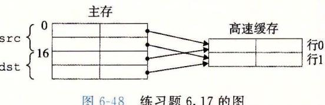

图 6-48 练习题 6.17 的图

B. 当高速缓存为 32 字节时,它足够大,能容纳这两个数组。因此,所有的不命中都是开始时的 冷不命中。

|    | dst数组 |    |
|----|-------|----|
|    | 列0    | 列1 |
| 行0 | m     | m  |
| 行1 | m     | m  |
|    | dst数组 |    |
|    | 列0    | 列1 |
| 行0 | m     | h  |
| 行1 | m     | h  |

|    | src数组 |    |
|----|-------|----|
|    | 列0    | 列1 |
| 行0 | m     | m  |
| 行1 | m     | h  |
|    | src   | 数组 |
|    | 列0    | 列1 |
| 行0 | m     | h  |
| 行1 | m     | h  |

- 6.18 每个16字节的高速缓存行包含着两个连续的 algae position 结构。每个循环按照内存顺序访问 这些结构,每次读一个整数元素。所以,每个循环的模式就是不命中、命中、不命中、命中,依 此类推。注意,对于这个问题,我们不必实际列举出读和不命中的总数,就能预测出不命中率。
  - A. 读总数是多少? 512 个读。
  - B. 缓存不命中的读总数是多少? 256 个不命中。
  - C. 不命中率是多少? 256/512=50%。
- 6.19 对这个问题的关键是注意到这个高速缓存只能保存数组的 1/2。所以,按照列顺序来扫描数组的 第二部分会驱逐扫描第一部分时加载进来的那些行。例如,读 grid[8][0]的第一个元素会驱逐当 我们读 grid[0][0]的元素时加载进来的那一行。这一行也包含 grid[0][1]。所以,当我们开始 扫描下一列时,对 grid[0][1]第一个元素的引用会不命中。
  - A. 读总数是多少? 512 个读。
  - B. 缓存不命中的读总数是多少? 256 个不命中。
  - C. 不命中率是多少? 256/512=50%。
  - D. 如果高速缓存有两倍大,那么不命中率会是多少呢?如果高速缓存有现在的两倍大,那么它能 够保存整个 grid 数组。所有的不命中都会是开始时的冷不命中,而不命中率会是 1/4=25%。
- 6.20 这个循环有很好的步长为1的引用模式,因此所有的不命中都是最开始时的冷不命中。
  - A. 读总数是多少? 512 个读。
  - B. 缓存不命中的读总数是多少? 128 个不命中。
  - C. 不命中率是多少? 128/512=25%。
  - D. 如果高速缓存有两倍大,那么不命中率会是多少呢?无论高速缓存的大小增加多少,都不会改 变不命中率,因为冷不命中是不可避免的。
- 6.21 从 L1 的吞吐量峰值是大约 12 000MB/s, 时钟频率是 2100MHz, 而每次读访问都是以 8 字节 long 类型为单位的。所以,从这张图中我们可以估计出在这台机器上从 L1 访问一个字需要大约 2100/ 12 000×8=1.4≈1.5 周期, 比正常访问 L1 的延迟 4 周期快大约 2.5 倍。这是由于 4×4 的循环展 开得到的并行允许同时进行多个加载操作。

"'`

## 在系统上运行程序

继续我们对计算机系统的探索,进一步来看看构建和运行应 用程序的系统软件。链接器把程序的各个部分联合成一个文件, 处理器可以将这个文件加载到内存,并且执行它。现代操作系统 与硬件合作,为每个程序提供一种幻象,好像这个程序是在独占 地使用处理器和主存,而实际上,在任何时刻, 程序在运行。 系统上都有多个

在本书的第一部分,你很好地理解了程序和硬件之间的交互 关系。本书的第二部分将拓宽你对系统的了解,使你牢固地掌握 程序和操作系统之间的交互关系。你将学习到如何使用操作系统 提供的服务来构建系统级程序,例如 Unix shell 和动态内存分 配包。

— . C - H- A P T ---E R- 7

# 链接

链接 (linking) 是将各种代码和数据片段收集并组合成为一个单一文件的过程,这个文 件可被加载(复制)到内存并执行 链接可以执行千编译时 (compile time) ,也就是在源代 码被翻译成机器代码时;也可以执行千加栽时 (load time) ,也就是在程序被加栽器 (loader) 加载到内存并执行时;甚至执行于运行时 (run tim ,也就是由应用程序来执行。在早 期的计算机系统中,链接是手动执行的。在现代系统中,链接是由叫做链接器 (linker) 程序自动执行的。

链接器在软件开发中扮演 着一 个关键的角色,因为它们使得分离编译 (separate compilation) 成为可能。我们不用将 个大型的应用程序组织为一个巨大的源文件,而是可以 把它分解为更小、更好管理的模块,可以独立地修改和编译这些模块。当我们改变这些模 块中的一个时,只需简单地 新编译它,并重新链接应用,而不必重新编译其他文件。

链接通常是由链接器来默默地处理的,对千那些在编程入门课堂上构造小程序的学生 而言,链接不是一个重要的议题 那为什么还要这么麻烦地学习关千链接的知识呢?

- ·理解链接器将帮助你构造大型程序。构造大型程序的程序员经常会遇到由千缺少模 块、缺少库或者不兼容的 版本引起的链接器错误。除非你理解链接器是如何解析 引用、什么是库以及链接器是如何使用库来解析引用的,否则这类错误将令你感到 迷惑和挫败。
- ·理解链接器将帮助你避免一些危险的编程错误 Linux 链接器解析符号引用时所做 的决定可以不动 色地 响你程序的正确性 在默认情况下,错误地定义多个全局 的程序将通过链接器,而不产生任何警告信息 由此得到的程序会产生令人迷 惑的运行时行为,而且非常难以调试。我们将向你展示这是如何发生的,以及该如 何避免它。
- ·理解链接将帮助你理解语言的作用域规则是如何实现的。例如,全局和局部变 间的区别是什么? 你定义一个具有 sta 属性的变量或者函数时,实际到底意 味着什么?
- ·理解链接将帮助你理解其他重要的系统概念 链接器产生的可执行目标文件在重要的系 统功能中扮演着 键角色,比如加载和运行程序、虚拟内存、分页、内存映射
- ·理解链接将使你能够利用共享库 多年以来,链接都被认为是相当简单和无趣的。 然而,随着共享库和动态链接在现代操作系统中重 性的日益加强,链接成为一个 复杂的过程,为 握它的程序员提供了强大的能力 比如,许多软件产品在运行时 使用共享库来升级压缩包装的 (shrink-wrapped) 二进制程序。还有,大多数 Web 务器都依赖于共 库的动态链接来提供动态内容

这一章提供了关于链接各方面的全面讨论,从传统 态链接到加载时的共享库的动态链 接,以及到运行时的共 库的动态链接。我们将使用 际示例来描述基本的机制,而且指出 链接问题在哪些情况中会 响程 的性能和正确性 为了使描述具体和便千理解,我们的讨 论是 于这样的环境:一个运行 Linux x86-64 系统,使用标准的 ELF-64 (此后称为 ELF)