目标文件格式。不过,无论是什么样的操作系统、ISA 或者目标文件格式,基本的链接概念 是通用的,认识到这一点是很重要的。细节可能不尽相同,但是概念是相同的。

#### 7.1 编译器驱动程序

考虑图 7-1 中的 C 语言程序。它将作为贯穿本章的一个小的运行示例,帮助我们说明 关于链接是如何工作的一些重要知识点。

```
----- code/link/main.c
                                                                            - code/link/sum.c
    int sum(int *a, int n);
                                                       int sum(int *a, int n)
1
                                                   2
    int array[2] = \{1, 2\};
                                                            int i, s = 0;
3
                                                   3
    int main()
                                                            for (i = 0; i < n; i++) {
                                                                s += a[i];
        int val = sum(array, 2);
        return val;
                                                           return s;
    }
                        - code/link/main.c
                                                                            - code/link/sum.c
               a) main.c
```

图 7-1 示例程序 1。这个示例程序由两个源文件组成, main.c 和 sum.c。 main 函数初始化一个整数数组, 然后调用 sum 函数来对数组元素求和

大多数编译系统提供<mark>编译器驱动程序</mark>(compiler driver),它代表用户在需要时调用语言预处理器、编译器、汇编器和链接器。 main.c %xum.c 源文件比如,要用 GNU 编译系统构造示例程序,我们就要通过在 shell 中输入下列命令来调用 GCC 驱动程序:

linux> gcc -Og -o prog main.c sum.c

图 7-2 概括了驱动程序在将示例程序从ASCII 码源文件翻译成可执行目标文件时的行为。(如果你想看看这些步骤,用-v选项来运行 GCC。)驱动程序首先运行 C预处理器(cpp)<sup>Θ</sup>,它将 C 的源程序 main.c 翻译成一个 ASCII 码的中间文件 main.i:

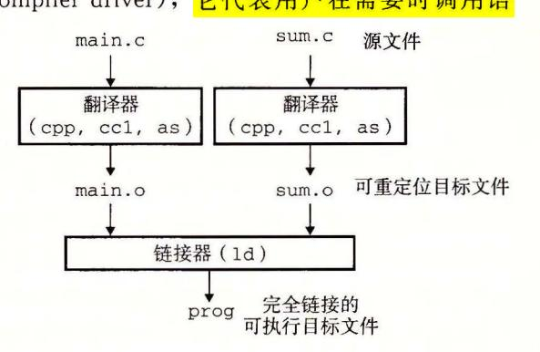

图 7-2 静态链接。链接器将可重定位目标文件组合 起来,形成一个可执行目标文件 prog

cpp [other arguments] main.c /tmp/main.i

接下来,驱动程序运行 C编译器(cc1),它将 main.i 翻译成一个 ASCII 汇编语言文件 main.s:

cc1 /tmp/main.i -Og [other arguments] -o /tmp/main.s

然后,驱动程序运行<mark>汇编器(as)</mark>,它将 main.s 翻译成一个可重定位目标文件(relocatable object file)main.o:

as [other arguments] -o /tmp/main.o /tmp/main.s

<sup>○</sup> 在某些 GCC 版本中, 预处理器被集成到编译器驱动程序中。

驱动程序经过相同的过程生成 sum.o 。最后,它运行链接器程序 ld, main.o sum.o 以及一些必要的系统目标文件组合起来,创建一个可执行目标文件 (executable object file)prog:

ld -o prog [system object files and args] /tmp/main. o /tmp/sum. o

要运行可执行文件 prog, 我们在 Linux shell 的命令行上输入它的名字:

linux>./prog

ll 调用操作系统中一个叫做加载器 (loader 的函数,它将 可执行文件 prog 中的代 码和数据复制到内存,然后将控制转移到这个程序的开头。

## 7. 2 静态链接

Linux LD 程序这样的静态链接器 (static linker) 一组可重 定位目标文件和命令行 参数作为输入,生成一个完全链接的、可以加载和运行的可执行目标文件作为输出。输入 的可 定位目标文件由各种不同的代码和数据节 (s ec tion) 组成,每一节都是一个连续的字 节序列。指令在一节中,初始化了的全局变鼠在另一节中,而未初始化的变量又在另外一 节中

为了构造可执行文件,链接器必须完成两个主要任务:

- ·符号解析 (symbol resolution) 。目标文件定义和引用符号,每个符号对应于一个函 数、一个全局变蜇或一个静态变量(即 中任何以 static 属性 声明的变量)。 符号解析的目的是将每个符号引用正好和一个符号定义关联起来。
- ·重定位 (relocation) 。编译器和汇编器生成从地址 开始的代码和数据节。链接器通 过把每个符号定义与一个内存位置关联起来,从而重定位这些节,然后修改所有对 这些符号的引用,使得它们指向这个内存位置 链接器使用汇编器产生的重定位条 (relocation entry) 的详细指令,不加甄别地执行这样的重定位

接下来的章节将更加详细地描述这些任务。在你阅读的时候,要记住关千链接器的一 些基本事实:目标文件纯粹是字节块的集合。这些块中,有些包含程序代码,有些包含程 序数据, 而其他的则包含引导链接器和加载器的数据结构 。链接 器将这些块连接起来,确 定被连接块的运行时位置,并且修改代码和数据块中的各种位置。链接器对目标机器了解 甚少。产生 目标文件的编 译器和汇编器 已经完成了大部分工作。

## 7. 3 目标文件

目标文件有三种形式:

- ·可重定位目标文件。包含二进制代码和数据,其形式可以在编译时与其他可重定位 目标文件合并起来,创建一个可执行目标文件
- ·可执行目标文件。包含二进制代码和数据,其形式可以被直接复制到内存并执行
- ·共享目标文件 一种特殊类型的可重定位目标文件,可以在加载或者运行时被动态 地加载进内存并链接。

编译器和汇编器生成可重定位目标文件(包括共享目标文件)。链接器生成可执行目标文 件。从技术上来说, 个目标模块 (object module) 就是一个字节序列,而一个目标文件 (object file) 就是一个以文件形式存放在磁盘中的目标模块 不过,我们会互换地使用这些术语。

目标文件是按照特定的目标文件格式来组织的,各个系统的目标文件格式都不相同。

ELF .七 ext .rodata .data .bss

从贝尔实验室诞生的第一个 Unix 系统使用的是 a.o 江格式(直到今天,可执行文件仍然 称为 a.out 文件)。 Windows 使用可移植可执行 (Portable Executable, PE) 格式。 Mac os-x 使用 Mach-0 格式。现代 x86-64 Linux Unix 系统使用可执行可链接格式 (Executable and Linkable Format, ELF) 。尽管我们的讨论集中在 ELF 上,但是不管是哪种格式, 基本的概念是相似的。

# 7. 4 可重定位目标文件

7-3 展示了一个典型的 ELF 可重定位目标文件的格式。 ELF (ELF header) 以一

<sup>16</sup> 字节的序列开始,这个序列描述了生成该文件 的系统的字的大小和字节顺序。 ELF 头剩下的部分 包含帮助链接器语法分析和解释目标文件的信息。其 中包括 ELF 头的大小、目标文件的类型(如可重定 位、可执行或者共享的)、机器类型(如 x86-64) 、节 头部表 (section header table) 的文件偏移,以及节头 部表中条目的大小和数最。不同节的位置和大小是由 节头部表描述的,其中目标文件中每个节都有一个固 定大小的条目 (entry)

夹在 ELF 头和节头部表之间的都是节。一个典 型的 ELF 可重定位目标文件包含下面几个节:

.七 ext: 已编译程序的机器代码。

.rodata: 只读数据,比如 printf 语句中的格 7-3 典型的 ELF 可重定位目标文件 式串和开关语句的跳转表。

描述目标 文件的节{ .sym ab .rel.text .rel.data .debug .line .s ab 节头部表

.data: 已初始化的全局和静态 变量。局部 变鼠在运行时被保存在栈中,既不出 现在. da 节中,也不出现在. bss 节中。

,bss: 未初始化的全局和静态 变量,以及所有被初始化为 的全局或静态变量。在 目标文件中这个节不占据实际的空间,它仅仅是 个占位符。目标文件格式区分已初始化 和未初始化变量是为了空间效率:在目标文件中,未初始化变量不需要占据任何实际的磁 盘空间。运行时,在内存中分配这些变量,初始值为

.syrntab: 一个符号表,它存放在程序中定义和引用的函数和全局变掀的信息。一些 程序员错误地认为必须通过- 选项来编译一个程序,才能得到符号表信息。实际上,每 个可重定位目标文件在. syrn ab 中都有一张符号表(除非程序员特意用 STRIP 命令去掉 它)。然而,和编译器中的符号表不同,. syrntab 符号表不包含局部变量的条目。

.rel.text: 一个. te 江节中位置的列表,当链接器把这个目标文件和其他文件组合 时,需要修改这些位置。一般而言,任何调用外部函数或者引用全局变量的指令都需要修 改。另一方面,调用本地函数的指令则不需要修改。注意,可执行目标文件中并不需要重 定位信息,因此通常省略,除非用户显式地指示链接器包含这些信息。

. rel. da a: 被模块引用或定义的所有全局变最的重定位信息。一般而言,任何已初 始化的全局变最,如果它的初始值是一个全局变量地址或者外部定义函数的地址,都需要 被修改。

.debug: 一个调试符号表,其条目是程序中定义的局部变量和类型定义,程序中定 义和引用的全局变量,以及原始的 源文件。只有以- 选项调用编译器驱动程序时,才 会得到这张表。

.扛 ne :原始 源程序中的行号和. text 节中机器指令之间的映射。只有以- 选项调 用编译器驱动程序时,才会得到这张表。

. rtab: 一个字符串表,其内容包括. symtab 和. debug 节中的符号表,以及节头 部中的节名字。字符串表就是以 null 结尾的字符串的序列。

### 日日 为什么未初始化的数据称为.bss

用术语. bss 来表示未初始化的数据是很普遍的。它起始于 IBM <sup>704</sup> 汇编语言(大约 <sup>1957</sup> 年)中"块存储开始 (Block Storage Start)" 指令的首字母缩写,并沿用至今。 一种记住. data bss 节之间区别的简单方法是把 "bss" 看成是"更好地节省空间 (Better Save Space)" 的缩写。

# 7. 5 符号和符号表

每个 可重定位目标模块 都有一 个符号表,它包含 定义和引用的符号的信息 。在 链接器的上 下文中,有 种不同的符号:

- ·由模块 定义并能被 模块 引用的全局符号 全局链接器符号对应于非静态的 函数和全局变呈。
- ·由其他模块定义并被模块 引用的全局符号 。这些符号称为外部符号,对应千在其 他模块中定义的非静 函数 和全局变最。
- ·只被模块 定义和引用的局部符号。它们对应于带 static 属性的 函数和全局变 量。 这些符号在模块 中任何位置都可见,但是不能被其他模块引用。

认识到本地链接器符号和本地程序变扯不同是很重要的。. sym ab 中的符号表不包含 对应于本地非静态程序变蜇的任何符号。这些符号在运行时在栈中被管理,链接器对此类 符号不感兴趣。

有趣的是,定义为带有 sta ic 属性的本地过程 变量是不 在栈中管理的 相反,编 译器在. data 或. bss 中为每个定义分配空间 并在符 号表 中创建一个有唯 一名字 的本地 链接器符号。比如,假设在同 模块中的两个函数各自定义了一个静态局部变量 X:

```
int f 0 
3static int x = O; 
        return x: 
1 int gO 
8 { 
        static int x = 1; 
10return x;
```

在这种情况中,编译器向汇编器输出两个不同名 的局部链接器符号。比如,它可以 .1 表示函数 中的 义,而 .2 表示函数 中的定义。 1

# 臼痄非邑曰 利用 sta ic 属性隐蔽变量和函数名字

程序员使用 static 属性隐藏模块内部的变量和函数声明,就像你在 Java C+

中使用 public 和 private 声明一样。在 C 中,源文件扮演模块的角色。任何带有 static 属性声明的全局变量或者函数都是模块私有的。类似地,任何不带 static 属性声明的全局变量和函数都是公共的,可以被其他模块访问。尽可能用 static 属性来保护你的变量和函数是很好的编程习惯。

符号表是由汇编器构造的,使用编译器输出到汇编语言.s文件中的符号。symtab 节中包含 ELF 符号表。这张符号表包含一个条目的数组。图 7-4 展示了每个条目的格式。

```
    code/link/elfstructs.c

1
    typedef struct {
2
                         /* String table offset */
        int
              name:
                        /* Function or data (4 bits) */
3
        char type:4,
4
              binding:4; /* Local or global (4 bits) */
        char reserved; /* Unused */
5
        short section; /* Section header index */
6
7
        long value:
                         /* Section offset or absolute address */
                         /* Object size in bytes */
        long size:
    } Elf64 Symbol;
                                                      - code/link/elfstructs.c
```

图 7-4 ELF 符号表条目。type 和 binding 字段每个都是 4 位

name 是字符串表中的字节偏移,指向符号的以 null 结尾的字符串名字。value 是符号的地址。对于可重定位的模块来说,value 是距定义目标的节的起始位置的偏移。对于可执行目标文件来说,该值是一个绝对运行时地址。size 是目标的大小(以字节为单位)。type 通常要么是数据,要么是函数。符号表还可以包含各个节的条目,以及对应原始源文件的路径名的条目。所以这些目标的类型也有所不同。binding字段表示符号是本地的还是全局的。

每个符号都被分配到目标文件的某个节,由 section 字段表示,该字段也是一个到节头部表的索引。有三个特殊的伪节(pseudosection),它们在节头部表中是没有条目的:ABS 代表不该被重定位的符号;UNDEF 代表未定义的符号,也就是在本目标模块中引用,但是却在其他地方定义的符号,COMMON表示还未被分配位置的未初始化的数据目标。对于 COMMON符号,value 字段给出对齐要求,而 size 给出最小的大小。注意,只有可重定位目标文件中才有这些伪节,可执行目标文件中是没有的。

COMMON 和.bss 的区别很细微。现代的 GCC 版本根据以下规则来将可重定位目标文件中的符号分配到 COMMON 和.bss 中:

COMMON 未初始化的全局变量

.bss 未初始化的静态变量,以及初始化为 0 的全局或静态变量 采用这种看上去很绝对的区分方式的原因来自于链接器执行符号解析的方式,我们会在 7.6 节中加以解释。

GNU READELF 程序是一个查看目标文件内容的很方便的工具。比如,下面是图 7-1 中示例程序的可重定位目标文件 main.o 的符号表中的最后三个条目。开始的 8 个条目没有显示出来,它们是链接器内部使用的局部符号。

```
      Num:
      Value
      Size
      Type
      Bind
      Vis
      Ndx
      Name

      8:
      0000000000000000
      24
      FUNC
      GLOBAL DEFAULT
      1
      main

      9:
      0000000000000000
      8
      DBJECT
      GLOBAL DEFAULT
      3
      array

      10:
      0000000000000000
      0
      NOTYPE
      GLOBAL DEFAULT
      UND sum
```

在这个例子中,我们看到全局符号 main 定义的条目,它是一个位于.text 节中偏移量为 0(即 value 值)处的 24 字节函数。其后跟随着的是全局符号 array 的定义,它是一个位于.data 节中偏移量为 0 处的 8 字节目标。最后一个条目来自对外部符号 sum 的引用。READELF 用一个整数索引来标识每个节。Ndx=1 表示.text 节,而 Ndx=3 表示.data 节。

類 第 3 题 7.1 这个题目针对图 7-5 中的 m.o 和 swap.o 模块。对于每个在 swap.o 中定义或引用的符号,请指出它是否在模块 swap.o 中的.symtab 节中有一个符号表条目。如果是,请指出定义该符号的模块(swap.o 或者 m.o)、符号类型(局部、全局或者外部)以及它在模块中被分配到的节(.text、.data、.bss 或 COMMON)。

| 符号    | .symtab条目? | 符号类型 | 在哪个模块中定义 | 节 |
|-------|------------|------|----------|---|
| buf   |            |      |          |   |
| bufp0 |            |      |          |   |
| bufpl |            |      |          |   |
| swap  |            |      |          |   |
| temp  |            |      |          |   |

```
- code/link/m.c
                                                                         - code/link/swap.c
1
    void swap();
                                              1
                                                   extern int buf[];
2
                                              2
     int buf [2] = \{1, 2\};
                                                   int *bufp0 = &buf[0];
3
                                              3
                                                   int *bufp1;
4
5
     int main()
                                              5
                                                   void swap()
6
                                              6
         swap();
                                              7
         return 0;
                                                        int temp;
8
                                              8
    }
9
                                              9
                                                        bufp1 = &buf[1];
                                             10
                             code/link/m.c
                                                        temp = *bufp0;
                                             11
                                             12
                                                        *bufp0 = *bufp1;
                                                        *bufp1 = temp;
                                             13
                                                   }
                                             14

    code/link/swap.c

                a) m.c
                                                           b) swap.c
```

图 7-5 练习题 7.1 的示例程序

## 7.6 符号解析

链接器解析符号引用的方法是将每个引用与它输入的可重定位目标文件的符号表中的一个确定的符号定义关联起来。对那些和引用定义在相同模块中的局部符号的引用,符号解析是非常简单明了的。编译器只允许每个模块中每个局部符号有一个定义。静态局部变量也会有本地链接器符号,编译器还要确保它们拥有唯一的名字。

不过,对全局符号的引用解析就棘手得多。当编译器遇到一个不是在当前模块中定义的符号(变量或函数名)时,会假设该符号是在其他某个模块中定义的,生成一个链接器符号表条目,并把它交给链接器处理。如果链接器在它的任何输入模块中都找不到这个被引用符号的定义,就输出一条(通常很难阅读的)错误信息并终止。比如,如果我们试着在一

台 Linux 机器上编译和链接下面的源文件:

```
void foo(void);
\nint main() {
    foo();
    return 0;
}
```

那么编译器会没有障碍地运行,但是当链接器无法解析对 foo 的引用时,就会终止:

```
linux> gcc -Wall -Og -o linkerror linkerror.c
```

/tmp/ccSz5uti.o: In function 'main':

/tmp/ccSz5uti.o(.text+0x7): undefined reference to 'foo'

对全局符号的符号解析很棘手,还因为多个目标文件可能会定义相同名字的全局符号。在这种情况中,链接器必须要么标志一个错误,要么以某种方法选出一个定义并抛弃其他定义。Linux系统采纳的方法涉及编译器、汇编器和链接器之间的协作,这样也可能给不警觉的程序员带来一些麻烦。

#### 旁注 对 C++ 和 Java 中链接器符号的重整

C++和 Java 都允许重载方法,这些方法在源代码中有相同的名字,却有不同的参数列表。那么链接器是如何区别这些不同的重载函数之间的差异呢? C++和 Java 中能使用重载函数,是因为编译器将每个唯一的方法和参数列表组合编码成一个对链接器来说唯一的名字。这种编码过程叫做重整(mangling),而相反的过程叫做恢复(demangling)。

幸运的是,C++和 Java 使用兼容的重整策略。一个被重整的类名字是由名字中字符的整数量,后面跟原始名字组成的。比如,类 Foo 被编码成 3Foo。方法被编码为原始方法名,后面加上\_\_,加上被重整的类名,再加上每个参数的单字母编码。比如,Foo::bar (int,long)被编码为 bar 3Fooil。重整全局变量和模板名字的策略是相似的。

#### 7.6.1 链接器如何解析多重定义的全局符号

链接器的输入是一组可重定位目标模块。每个模块定义一组符号,有些是局部的(只对定义该符号的模块可见),有些是全局的(对其他模块也可见)。如果多个模块定义同名的全局符号,会发生什么呢?下面是 Linux 编译系统采用的方法。

在编译时,编译器向汇编器输出每个全局符号,或者是强(strong)或者是弱(weak),而汇编器把这个信息隐含地编码在可重定位目标文件的符号表里。函数和已初始化的全局变量是强符号,未初始化的全局变量是弱符号。

根据强弱符号的定义, Linux 链接器使用下面的规则来处理多重定义的符号名:

- 规则 1: 不允许有多个同名的强符号。
- 规则 2: 如果有一个强符号和多个弱符号同名, 那么选择强符号。
- 规则 3: 如果有多个弱符号同名,那么从这些弱符号中任意选择一个。 比如,假设我们试图编译和链接下面两个 C 模块:

```
1  /* foo1.c */
2  int main()
3  {
4    return 0;
5  }
```

```
/* bar1.c */
   1
      int main()
   2
   3
      1
   4
         return 0;
   5
      }
   在这个情况中,链接器将生成一条错误信息,因为强符号 main 被定义了多次(规则1):
   linux> gcc foo1.c bar1.c
   /tmp/ccq2Uxnd.o: In function 'main':
   bar1.c:(.text+0x0): multiple definition of 'main'
   相似地,链接器对于下面的模块也会生成一条错误信息,因为强符号 x 被定义了两次
(规则 1):
   1
      /* foo2.c */
```

```
2
    int x = 15213;
3
4
    int main()
5
    {
6
        return 0;
7
    7
1
    /* bar2.c */
2
    int x = 15213;
3
4
    void f()
5
    {
    }
6
```

然而,如果在一个模块里 x 未被初始化,那么链接器将安静地选择在另一个模块中定义的强符号(规则 2):

```
/* foo3.c */
 1
     #include <stdio.h>
 2
 3
     void f(void);
 4
 5
     int x = 15213;
 6
 7
     int main()
 8
     {
 9
          f();
          printf("x = %d\n", x);
10
         return 0;
11
     7
12
     /* bar3.c */
 1
     int x;
 2
 3
     void f()
 4
     {
 5
         x = 15212:
 6
     7
```

在运行时,函数 f 将 x 的值由 15213 改为 15212,这会给 main 函数的作者带来不受 欢迎的意外!注意,链接器通常不会表明它检测到多个 x 的定义:

```
linux> gcc -o foobar3 foo3.c bar3.c
linux> ./foobar3
x = 15212
如果 x 有两个弱定义,也会发生相同的事情(规则 3):
    /* foo4.c */
    #include <stdio.h>
    void f(void);
4
5
    int x;
 6
7
    int main()
8
9
        x = 15213;
        f();
10
11
        printf("x = %d\n", x);
        return 0;
12
13
    /* bar4.c */
1
2
    int x;
3
4
    void f()
    1
5
        x = 15212;
6
7
```

规则2和规则3的应用会造成一些不易察觉的运行时错误,对于不警觉的程序员来说,是很难理解的,尤其是如果重复的符号定义还有不同的类型时。考虑下面这个例子,其中x不幸地在一个模块中定义为int,而在另一个模块中定义为double:

```
1
     /* foo5.c */
     #include <stdio.h>
.2
     void f(void);
 3
 4
     int y = 15212;
5
     int x = 15213;
 6
 7
8
     int main()
     {
9
         f();
10
         printf("x = 0x\%x y = 0x\%x \n",
11
12
                 x, y);
         return 0;
13
     }
     /* bar5.c */
1
     double x;
2
3
4
     void f()
     {
5
         x = -0.0;
6
     }
```

在一台 x86-64/Linux 机器上,double 类型是 8 个字节,而 int 类型是 4 个字节。在我们的系统中,x 的地址是 0x601020,y 的地址是 0x601024。因此,bar5.c 的第 6 行中的赋值 x=-0.0 将用负零的双精度浮点表示覆盖内存中 x 和 y 的位置(foo5.c 中的第 5 行和第 6 行)!

```
linux> gcc -Wall -Og -o foobar5 foo5.c bar5.c
/usr/bin/ld: Warning: alignment 4 of symbol 'x' in /tmp/cclUFK5g.o\nis smaller than 8 in /tmp/ccbTLcb9.o
linux> ./foobar5
x = 0x0 y = 0x80000000
```

这是一个细微而令人讨厌的错误,尤其是因为它只会触发链接器发出一条警告,而且通常要在程序执行很久以后才表现出来,且远离错误发生地。在一个拥有成百上千个模块的大型系统中,这种类型的错误相当难以修正,尤其因为许多程序员根本不知道链接器是如何工作的。当你怀疑有此类错误时,用像 GCC-fno-common 标志这样的选项调用链接器,这个选项会告诉链接器,在遇到多重定义的全局符号时,触发一个错误。或者使用-Werror选项,它会把所有的警告都变为错误。

在 7.5 节中,我们看到了编译器如何按照一个看似绝对的规则来把符号分配为 COM-MON 和.bss。实际上,采用这个惯例是由于在某些情况中链接器允许多个模块定义同名的全局符号。当编译器在翻译某个模块时,遇到一个弱全局符号,比如说 x,它并不知道其他模块是否也定义了 x,如果是,它无法预测链接器该使用 x 的多重定义中的哪一个。所以编译器把 x 分配成 COMMON,把决定权留给链接器。另一方面,如果 x 初始化为 0,那么它是一个强符号(因此根据规则 2 必须是唯一的),所以编译器可以很自信地将它分配成.bss。类似地,静态符号的构造就必须是唯一的,所以编译器可以自信地把它们分配成.data或.bss。

禁习题 7.2 在此题中,REF(x.i)→DEF(x.k)表示链接器将把模块 i 中对符号 x 的任意引用与模块 k 中 x 的定义关联起来。对于下面的每个示例,用这种表示法来说明链接器将如何解析每个模块中对多重定义符号的引用。如果有一个链接时错误(规则 1),写"错误"。如果链接器从定义中任意选择一个(规则 3),则写"未知"。

```
A. /* Module 1 */
                                /* Module 2 */
   int main()
                                int main;
   {
                               int p2()
   }
                               {
                               7
   (a) REF(main.1) \rightarrow DEF(
   (b) REF(main.2) \rightarrow DEF(_
R. /* Module 1 */
                                /* Module 2 */
   void main()
                                int main = 1:
   {
                                int p2()
   }
                                {
                                }
   (a) REF(main.1) \rightarrow DEF(
   (b) REF(main.2) \rightarrow DEF(
C. /* Module 1 */
                                /* Module 2 */
                                double x = 1.0;
   int x;
   void main()
                                int p2()
   {
                                {
   }
                                }
```

- Ca) REF(x.1) DEF( .
- Cb) REF(x.2) DEF( .

### 7. 6. 2 与静态库链接

迄今为止,我们都是假设链接器读取 组可重定位目标文件,并把它们链接起来,形 成一个输出的可执行文件。实际上,所有的编译系统都提供一种机制,将所有相关的目标 模块打包成为一个单独的文件,称为静态库 (static library) ,它可以用做链接器的输入。 当链接器构造一个输出的可执行文件时,它只复制静态库里被应用程序引用的目标模块。

为什么系统要支持库的概念呢?以 ISO C99 为例,它定义了一组广泛的标准 、字 符串操作和整数数学函数,例如 oi print£ scanf strcpy rand 。它们在江be. 库中,对每个 程序来说都是可用的 ISO C99 还在江bm.a 库中定义了一组广泛的浮 点数学函数,例如 sin cos sqrt

让我们来看看如果不使用静态库,编译器开发人员会使用什么方法来向用户提供这些 函数。 种方法是让编译器辨认出对标准函数的调用,并直接生成相应的代码。 Pascal (只 , 提供了一小部分标准函数)采用的就是这种方法,但是这种方法对 而言是不合适的,因 标准定义了大最的标准函数。这种方法将给编译器增加显著的复杂性,而且每次添 加、删除或修改一个标准函数时,就需要一个新的编译器版本。然而,对千应用程序员而 言,这种方法会是非常方便的,因为标准函数将总是可用的

另一种方法是将所有的标准 函数都放在一个单独的可重定位目标模块中(比如说 bc.o 中)应用程序员可以把这个模块链接到他们的可执行文件中:

linux> gee main. e /usr/lib/libe. o

这种方法的优点是它将编译器的实现与标准函数的实现分离开来,并且仍然对程序员 保持适度的便利。然而,一个很大的缺点是系统中每个可执行文件现在都包含着一份标准 函数集合的完全副本,这对磁盘空间是很大的浪费。(在一个典型的系统上, libc.a 大约 5MB, libm.a 大约是 2MB )更糟的是,每个正在运行的程序都将它自己的这些函数 的副本放在内存中,这是对内存的极度浪费。另一个大的缺点是,对任何标准函数的任何 改变,无论多么小的改变,都要求库的开发人员重新编译整个源文件,这是一个非常耗时 的操作,使得标准函数的开发和维护变得很复杂。

我们可以通过为每个标准函数创建一个独立的可重定位文件,把它们存放在一个为大 家都知道的目录中来解决其中的一些问题。然而,这种方法要求应用程序员显式地链接合 适的目标模块到它们的可执行文件中,这是一个容易出错而且耗时的过程:

linux> gee main. c /usr /li b/printf. o /usr /lib/ scant. o.. .

静态库概念被提出来,以解决这些不同方法的缺点。相关的函数可以被编译为独立的 目标模块,然后封装成一个单独的静态库文件。然后,应用程序可以通过在命令行上指定 单独的文件名字来使用这些在库中定义的函数。比如,使用 标准库和数学库中函数的程 序可以用形式如下的命令行来编译和链接:

linux> gee main. e /usr/lib/1].bm.a /usr/lib/libe.a

在链接时,链接器将只复制被程序引用的目标模块,这就减少了可执行文件在磁盘和内 存中的大小 另一方面,应用程序员只需要包含较少的库文件的名字(实际上, 编译器驱 动程序总是传送 libc.a 给链接器, 所以前面提到的对 libc.a 的引用是不必要的)。

在 Linux 系统中,静态库以一种称为存档(archive)的特殊文件格式存放在磁盘中。存档文件是一组连接起来的可重定位目标文件的集合,有一个头部用来描述每个成员目标文件的大小和位置。存档文件名由后缀,a标识。

为了使我们对库的讨论更加形象具体,考虑图 7-6 中的两个向量例程。每个例程,定义在它自己的目标模块中,对两个输入向量进行一个向量操作,并把结果存放在一个输出向量中。每个例程有一个副作用,会记录它自己被调用的次数,每次被调用会把一个全局变量加 1。(当我们在 7.12 节中解释位置无关代码的思想时会起作用。)

```
    code/link/addvec.c

                                                                         — code/link/multvec.c
     int addcnt = 0:
 1
                                                  1
                                                       int multcnt = 0;
 2
                                                  2
 3
     void addvec(int *x, int *y,
                                                       void multvec(int *x, int *y,
                                                  3
                   int *z, int n)
                                                                     int *z, int n)
 4
                                                  4
 5
     {
                                                  5
          int i;
 6
                                                  6
                                                           int i;
 7
                                                  7
          addcnt++:
 8
                                                  8
                                                           multcnt++:
9
         for (i = 0; i < n; i++)
                                                           for (i = 0; i < n; i++)
10
                                                 10
              z[i] = x[i] + y[i];
                                                               z[i] = x[i] * y[i];
11
                                                 11
     }
                                                      7
12
                                                 12
                       - code/link/addvec.c

    code/link/multvec.c

                                                             b) multvec.o
                 a) addvec.o
```

图 7-6 libvector 库中的成员目标文件

要创建这些函数的一个静态库, 我们将使用 AR 工具, 如下:

```
linux> gcc -c addvec.c multvec.c
linux> ar rcs libvector.a addvec.o multvec.o
```

为了使用这个库,我们可以编写一个应用,比如图 7-7 中的 main2.c,它调用 addvec 库例程。包含(或头)文件 vector.h 定义了 libvector.a 中例程的函数原型。

```
-code/link/main2.c
 1
     #include <stdio.h>
 2
     #include "vector.h"
 3
     int x[2] = \{1, 2\};
 4
     int y[2] = \{3, 4\};
 5
     int z[2];
 6
 8
     int main()
 9
          addvec(x, y, z, 2);
10
          printf("z = [%d %d]\n", z[0], z[1]);
11
12
         return 0:
13
     }
                                                             -code/link/main2.c
```

图 7-7 示例程序 2。这个程序调用 libvector 库中的函数

为了创建这个可执行文件,我们要编译和链接输入文件 main.o 和 libvector.a:

linux> gee -e main2.e

linux> gee -statie -o prog2e main2.o./libveetor.a

或者等价地使用:

linux> gee -e main2. e

linux> gee -statie -o prog2e main2.o -L. -lveetor

7-8 概括了链接器的行为。-static 参数告诉编译器驱动程序,链接器应该构建 个完全链接的可执行目标文件,它可以加载到内存并运行,在加载时无须更进一步的链 接。-lvector 参数是 libvec or.a 的缩写,- .参数告诉链接器在当前目录下查找 libvector.a

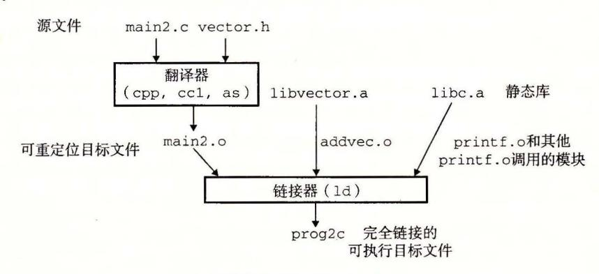

7-8 与静态库链接

当链接器运行时,它判定 main2.o 引用了 addvec.o 定义的 addvec 符号,所以复制 addvec.o 到可执行文件。因为程序不引用任何由 multvec.o 定义的符号,所以链接器就 不会复制这个模块到可执行文件。链接器还会复制江be.a 中的 printf.o 模块,以及许 运行时系统中的其他模块。

### 7. 6. 3 链接器如何使用静态库来解析引用

;k

虽然静态库很有用,但是它们同时也是一个程序员迷惑的源头,原因在于 Linux 链接 器使用它们解析外部引用的方式。在符号解析阶段,链接器从左到右按照它们在编译器驱 动程序命令行上出现的顺序来扫描可重定位目标文件和存档文件。(驱动程序自动将命令 行中所有的. 文件翻译为. 文件。)在这次扫描中,链接器维护一个可重定位目标文件的 集合 (这个集合中的文件会被合并起来形成可执行文件),一个未解析的符号(即引用了 但是尚未定义的符号)集合 U, 以及一个在前面输入文件中已定义的符号集合 。初始时, 均为空。

- ·对于命令行上的每个输入文件 f, 链接器会判断 是一个目标文件还是一个存档文 件。如果 是一个目标文件,那么链接器把 添加到 E, 修改 来反映 的符号定义和引用,并继续下一个输入文件。
- ·如果 是一个存档文件,那么链接器就尝试匹配 中未解析的符号和由存档文件成员定 义的符号。如果某个存档文件成员 m, 定义了一个符号来解析 中的一个引用,那么就 加到 中,并且链接器修改 来反映 中的符号定义和引用。对存档文件中 所有的成员目标文件都依次进行这个过程,直到 都不再发生变化。此时,任何不 包含在 中的成员目标文件都简单地被丢弃,而链接器将继续处理下一个输入文件。

● 如果当链接器完成对命令行上输入文件的扫描后, *U* 是非空的, 那么链接器就会输出一个错误并终止。否则, 它会合并和重定位 *E* 中的目标文件, 构建输出的可执行文件。

不幸的是,这种算法会导致一些令人困扰的链接时错误,因为命令行上的库和目标文件的顺序非常重要。在命令行中,如果定义一个符号的库出现在引用这个符号的目标文件之前,那么引用就不能被解析,链接会失败。比如,考虑下面的命令行发生了什么?

linux> gcc -static ./libvector.a main2.c

/tmp/cc9XH6Rp.o: In function 'main':

/tmp/cc9XH6Rp.o(.text+0x18): undefined reference to 'addvec'

在处理 libvector.a 时,U 是空的,所以没有 libvector.a 中的成员目标文件会添加到 E 中。因此,对 addvec 的引用是绝不会被解析的,所以链接器会产生一条错误信息并终止。

关于库的一般准则是将它们放在命令行的结尾。如果各个库的成员是相互独立的(也就是说没有成员引用另一个成员定义的符号),那么这些库就可以以任何顺序放置在命令行的结尾处。另一方面,如果库不是相互独立的,那么必须对它们排序,使得对于每个被存档文件的成员外部引用的符号 s,在命令行中至少有一个 s 的定义是在对 s 的引用之后的。比如,假设 foo.c 调用 libx.a 和 libz.a 中的函数,而这两个库又调用 liby.a 中的函数。那么,在命令行中 libx.a 和 libz.a 必须处在 liby.a 之前:

linux> gcc foo.c libx.a libz.a liby.a

如果需要满足依赖需求,可以在命令行上重复库。比如,假设 foo.c 调用 libx.a 中的函数,该库又调用 liby.a 中的函数,而 liby.a 又调用 libx.a 中的函数。那么 libx.a 必须在命令行上重复出现:

linux> gcc foo.c libx.a liby.a libx.a

另一种方法是,我们可以将 libx.a 和 liby.a 合并成一个单独的存档文件。

第习题 7.3 a和 b表示当前目录中的目标模块或者静态库,而 a→b表示 a 依赖于 b,也就是说 b 定义了一个被 a 引用的符号。对于下面每种场景,请给出最小的命令行(即一个含有最少数量的目标文件和库参数的命令),使得静态链接器能解析所有的符号引用。

A. p.o  $\rightarrow$  libx.a

B. p.o  $\rightarrow$  libx.a  $\rightarrow$  liby.a

C. p.o  $\rightarrow$  libx.a  $\rightarrow$  liby.a  $\perp$  liby.a  $\rightarrow$  libx.a  $\rightarrow$  p.o

### 7.7 重定位

- 一旦链接器完成了符号解析这一步,就把代码中的每个符号引用和正好一个符号定义(即它的一个输入目标模块中的一个符号表条目)关联起来。此时,链接器就知道它的输入目标模块中的代码节和数据节的确切大小。现在就可以开始重定位步骤了,在这个步骤中,将合并输入模块,并为每个符号分配运行时地址。重定位由两步组成:
  - 重定位节和符号定义。在这一步中,链接器将所有相同类型的节合并为同一类型的新的聚合节。例如,来自所有输入模块的.data节被全部合并成一个节,这个节成为输出的可执行目标文件的.data节。然后,链接器将运行时内存地址赋给新的聚合节,赋给输入模块定义的每个节,以及赋给输入模块定义的每个符号。当这一步完成时,程序中的每条指令和全局变量都有唯一的运行时内存地址了。

·重定位节中的符号引用。在这一步中,链接器修改代码节和数据节中对每个符号的 引用,使得它们指向正确的运行时地址。要执行这一步,链接器依赖千可重定位目 标模块中称为重定位条目 (relocation en try) 的数据结构,我们接下来将会描述这种 数据结构。

## 7. 7. 1 重定位条目

当汇编器生成 个目标模块时,它并不知道数据和代码最终将放在内存中的什么位 置。它也不知道这个模块引用的任何外部定义的函数或者全局变最的位置。所以,无论何 时汇编器遇到对最终位置未知的目标引用,它就会生成一个重定位条目,告诉链接器在将 目标文件合并成可执行文件时如何修改这个引用。代码的重定位条目放在. rel.text 巳初始化数据的重定位条目放在. rel.data 中。

展示了 ELF 重定位条目的格式。 offset 是需要被修改的引用的节偏移。 symbol 标识被修改引用应该指向的符号。 type 告知链接器如何修改新的引用。 addend 是一个有 符号常数,一些类型的重定位要使用它对被修改引用的值做偏移调整。

```
code/link/elfstructs.c 123456 
   typedef struct { 
       long offset; I* Offset of the reference to relocate *I 
      long type:32, I* Relocation type *I 
           symbol:32; I* Symbol table index *I 
      long addend; I* Constant part of relocation expression *I 
   } Elf64_Rela; 
                                               code/link/elfstructs. c
```

7-9 ELF 重定位条目。每个条目表示 个必须被重定位的引用,并指明如何计算被修改的引用

ELF 定义了 <sup>32</sup> 种不同的重定位类型,有些相当隐秘。我们只关心其中两种最基本的 重定位类型:

- R\_X86\_64\_PC32 。重定位一个使用 <sup>32</sup> PC 相对地址的引用 回想 3. 6. 节, 一个 PC 相对地址就是距程序计数器 (PC) 的当前运行时值的偏移量。当 CPU 执行 一条使用 PC 相对寻址的指令时,它就将在指令中编码的 <sup>32</sup> 位值加上 PC 的当前运 行时值,得到有效地址(如 call 指令的目标), PC 值通常是下一条指令在内存中的 地址。
- •R X86\_64\_32 。重定位一个使用 <sup>32</sup> 位绝对地址的引用。通过绝对寻址, CPU 直接 使用在指令中编码的 <sup>32</sup> 位值作为有效地址,不需要进一步修改。

这两种重定位类型支持 x86 <sup>64</sup> 小型代码模型 (small code model) ,该模型假设可执行目标 文件中的代码和数据的总体大小小于 2GB, 因此在运行时可以用 <sup>32</sup> PC 相对地址来访问。 GCC 默认使用小型代码模型。大千 2GB 的程序可以用-mcmodel=medium (中型代码模型) 和-mcmodel=large (大型代码模型)标志来编译,不过在此我们不讨论这些模型。

### 7. 7. 2 重定位符号引用

7-10 展示了链接器的重定位算法的伪代码。第 行和第 行在每个节 以及与每个 节相关联的重定位条目 上迭代执行。为了使描述具体化,假设每个节 是一个字节数 组,每个重定位条目 是一个类型为 Elf64\_Rela 的结构,如图 7-9 中的定义。另外,还

假设当算法运行时,链接器已经为每个节(用 ADDR(s)表示)和每个符号都选择了运行时地址(用 ADDR(r.symbo1)表示)。第3行计算的是需要被重定位的4字节引用的数组s中的地址。如果这个引用使用的是PC相对寻址,那么它就用第5~9行来重定位。如果该引用使用的是绝对寻址,它就通过第11~13行来重定位。

```
foreach section s {
2
         foreach relocation entry r {
3
             refptr = s + r.offset; /* ptr to reference to be relocated */
1
5
             /* Relocate a PC-relative reference */
6
             if (r.type == R_X86_64_PC32) {
7
                 refaddr = ADDR(s) + r.offset; /* ref's run-time address */
                 *refptr = (unsigned) (ADDR(r.symbol) + r.addend - refaddr);
8
9
             7
10
11
             /* Relocate an absolute reference */
12
             if (r.type == R_X86_64_32)
                 *refptr = (unsigned) (ADDR(r.symbol) + r.addend):
13
14
         7
15
     }
```

图 7-10 重定位算法

让我们来看看链接器如何用这个算法来重定位图 7-1 示例程序中的引用。图 7-11 给出了(用 objdump-dx main.o产生的)GNU OBJDUMP 工具产生的 main.o的反汇编代码。

```
- code/link/main-relo.d
1
    0000000000000000 <main>:
2
        0:
             48 83 ec 08
                                                $0x8,%rsp
                                        sub
             be 02 00 00 00
                                                $0x2, %esi
        4:
                                        mov
4
             bf 00 00 00 00
                                        mov
                                                $0x0, %edi
                                                                   %edi = &array
5
                               a: R_X86_64_32 array
                                                                   Relocation entry
6
        e:
            e8 00 00 00 00
                                        callq 13 <main+0x13>
                                                                   sum()
7
                               f: R_X86_64_PC32 sum-0x4
                                                                   Relocation entry
8
       13:
             48 83 c4 08
                                        add
                                                $0x8,%rsp
9
       17:
             с3
                                        retq

    code/link/main-relo.d
```

图 7-11 main.o的代码和重定位条目。原始 C 代码在图 7-1 中

main 函数引用了两个全局符号: array 和 sum。为每个引用,汇编器产生一个重定位条目,显示在引用的后面一行上。<sup>⑤</sup>这些重定位条目告诉链接器对 sum 的引用要使用 32 位 PC 相对地址进行重定位,而对 array 的引用要使用 32 位绝对地址进行重定位。接下来两节会详细介绍链接器是如何重定位这些引用的。

#### 1. 重定位 PC 相对引用

图 7-11 的第 6 行中, 函数 main 调用 sum 函数, sum 函数是在模块 sum.o 中定义的。

<sup>○</sup> 回想一下,重定位条目和指令实际上存放在目标文件的不同节中。为了方便,OBJDUMP工具把它们显示在一起。

ca 荨指令开始千节偏移 Oxe 的地方,包括 字节的操作码 Oxe8, 后面跟着的是对目标 sum <sup>32</sup> PC 相对引用的占位符。

相应的重定位条目 个字段组成:

r.offset = Oxf

r.symbol = sum

r.type = R\_X86\_64\_PC32

r.addend = -4

这些字段告诉链接器修改开始千偏移最 Oxf 处的 <sup>32</sup> PC 相对引用,这样在运行时它 会指向 sum 例程。现在,假设链接器已经确定

$$ADDR(s) = ADDR(.text) = 0x4004d0$$

ADDR(r.symbol) = ADDR(sum) = Ox4004e8

使用图 7-10 中的算法,链接器首先计算出引用的运行时地址(第 行):

refaddr = ADDR(s) + r.offset

= Ox4004d0 + Oxf

= Ox4004df

然后,更新该引用,使得它在运行时指向 sum 程序(第 行):

\*refptr = (unsigned) (ADDR(r.symbol) + r.addend - refaddr)

= (unsigned) (Ox4004e8 + (-4) - Ox4004df)

= (unsigned) (Ox5)

在得到的可执行目标文件中, ca 荨指令有如下的重定位的形式:

4004de: e8 05 00 00 00 callq 4004e8 <sum> sum()

在运行时, ca 荨指令将存放在地址 Ox4004de 处。当 CPU 执行 call 指令时, PC 值为諒4004e3, 即紧随在 call 指令之后的指令的地址。为了执行这条指令, CPU 执行 以下的步骤:

- l) PC 压入栈中
- 2) PC PC + Ox5 = Ox4004e3 + Ox5 = Ox4004e8

因此,要执行的下一条指令就是 sum 例程的第一条指令,这当然就是我们想要的!

#### 2. 重定位绝对引用

重定位绝对引用相当简单。例如,图 7-11 的第 行中, mov 指令将 array 的地址(一 <sup>32</sup> 位立即数值)复制到寄存器%edi 中。 mov 指令开始千节偏移量 Ox9 的位置,包括 节操作码 Oxbf, 后面跟着对 array <sup>32</sup> 位绝对引用的占位符。

对应的占位符条目 包括 个字段:

r.offset = Oxa

r.symbol = array

r.type = R\_X86\_64\_32

r.addend = 0

这些字段告诉链接器要修改从偏移最 Oxa 开始的绝对引用,这样在运行时它将会指向 array 的第一个字节。现在,假设链接器已经确定

ADDR(r.symbol) = ADDR(array) = Ox601018

链接器使用图 7-10 中算法的第 13 行修改了引用:

\*refptr = (unsigned) (ADDR(r.symbol) + r.addend) = (unsigned) (0x601018 + 0)

= (unsigned) (0x601018)

在得到的可执行目标文件中,该引用有下面的重定位形式:

4004d9: bf 18 10 60 00 mov \$0x601018,%edi %edi = &array

综合到一起,图 7-12 给出了最终可执行目标文件中已重定位的.text 节和.data 节。在加载的时候,加载器会把这些节中的字节直接复制到内存,不再进行任何修改地执行这些指令。

```
00000000004004d0 <main>:
       4004d0: 48 83 ec 08
                                                 $0x8, %rsp
2
                                         sub
3
       4004d4: be 02 00 00 00
                                         mov
                                                 $0x2, %esi
4
       4004d9: bf 18 10 60 00
                                         mov
                                                 $0x601018, %edi
                                                                   %edi = &array
       4004de: e8 05 00 00 00
                                         callq 4004e8 <sum>
                                                                   sum()
5
       4004e3: 48 83 c4 08
                                                 $0x8, %rsp
6
                                         add
       4004e7: c3
                                         retq
     00000000004004e8 <sum>:
8
       4004e8: b8 00 00 00 00
9
                                                 $0x0, %eax
                                         mov
10
       4004ed: ba 00 00 00 00
                                                 $0x0, %edx
                                         mov
                                                 4004fd <sum+0x15>
       4004f2: eb 09
11
                                         jmp
12
       4004f4: 48 63 ca
                                         movslq %edx, %rcx
13
       4004f7: 03 04 8f
                                         add
                                                 (%rdi, %rcx, 4), %eax
14
       4004fa: 83 c2 01
                                         add
                                                 $0x1,%edx
15
       4004fd: 39 f2
                                         cmp
                                                 %esi,%edx
       4004ff: 7c f3
                                                 4004f4 <sum+0xc>
16
                                         jl
       400501: f3 c3
                                         repz retq
```

a) 已重定位的.text节

```
1 0000000000601018 <array>:
2 601018: 01 00 00 00 02 00 00 00
```

b) 已重定位的.data节

图 7-12 可执行文件 prog 的已重定位的.text 节和.data 节。原始的 C 代码在图 7-1 中

### ★ 4 本题是关于图 7-12a 中的已重定位程序的。

A. 第5行中对 sum 的重定位引用的十六进制地址是多少?

B. 第5行中对 sum 的重定位引用的十六进制值是多少?

## 🔯 练习题 7.5 考虑目标文件 m.o 中对 swap 函数的调用(图 7-5)。

9: e8 00 00 00 00 callq e <main+0xe> swap()

它的重定位条目如下:

r.offset = 0xa

r.symbol = swap

 $r.type = R_X86_64_PC32$ 

r.addend = -4

现在假设链接器将 m.o 中的.text 重定位到地址 0x4004d0,将 swap 重定位到地址

Ox4004e8 callq 中对 swap 的重定位引用的 值是

## 7. 8 可执行目标文件

我们已 经看 到链接器如何将多个目标 件合并成一个可执 文件。我们的 程序,开始时 一组 ASCII 文本文件,现在 经被转化为 二进 制文件,且这个 进制 文件包含加载程序到内存并运行它所 的所有信息。图 概括了一个典型的 ELF 可执 行文件中的各 信息 件行 0{

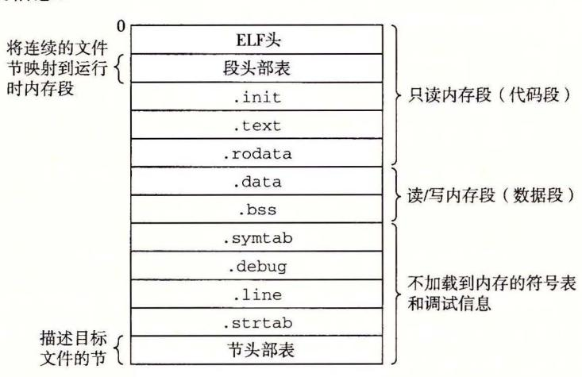

典型 ELF 可执行目标文件

可执行目标文件的格式类似千可重 位目标文件的格式 EL 头描述文件的总体格 它还包括程序的入口点 (entry point ,也就是当程 运行 时要 的第一条指令的地 text .r ta 和. da 节与可 目标文件中的节 相似的,除了这些节巳经被 重定位到它们 最终 的运行时内存地址以外 init 节定义了一个小 数,叫做\_init, 程序 的初始化代码会调用它 因为可执行文件 完全链接的(已被重定 所以它不再需要

ELF 可执行文件被设计得很容 加载到内存,可执行文件的连 的片 (chunk) 被映射 到连续的内存段 程序头部表 (program h eader table) 描述了 种映射 系。图 7-14 了可执行文件 prog 的程序头部表,是由 OBJDUMP 显示的

code/linklprog-exe.d

#### Read-only code segment

<sup>1</sup>LOAD off OxOOOOOOOOOOOOOOOO vaddr Ox0000000000400000 paddr Ox0000000000400000 align 2\*\*21

2 filesz Ox000000000000069c memsz Ox000000000000069c flags r-x

#### Read rite data segment

3 LOAD off Ox0000000000000df8 vaddr Ox0000000000600df8 paddr Ox0000000000600df8 align 2\*\*21

4 filesz Ox0000000000000228 memsz Ox0000000000000230 flags rw-

code/linklprog-exe.d

#### 例可执行文件 prog 的程序 头部表

ff 标文件中 移; va dd /padd 存地址 对齐要求; fi lesz: 目标文件中的 大小 mems z: 内存中 的段 fl s: 时访问 权限。

从程序头部表,我们会看到根据可执行目标文件的内容初始化两个内存段 行和

行告诉我们第一个段(代码段)有读/执行访问权限,开始于内存地址 Ox400000 处,总 共的内存大小是 Ox69c 字节,并且被初始化为可执行目标文件的头 Ox69c 个字节,其中包 ELF 头、程序头部表以及. in 江、. tex 七和. rodata 节。

行和第 行告诉我们第二个段(数据段)有读/写访问权限,开始于内存地址 Ox600df8 处,总的内存大小为 Ox230 字节,并用从目标文件中偏移 Oxdf8 处开始的 .data节中的 Ox228 个字节初始化 。该 段中剩下的 节对应于运行时将被初始化为 的. bs 数据。

对于任何段 s, 链接器必须选择一个起始地址 vaddr, 使得

vaddr mod align= off mod align

这里, off 是目标文件中段的第一个节的偏移量, gn 是程序头部中指定的对齐 (221= Ox200000) 。例如,图 7-14 中的数据段中

vaddr mod align= Ox600df8 mod Ox200000 = Oxdf8

以及

off mod align= Oxdf8 mod Ox200000 = Oxdf8

这个对齐要求是一种优化,使得当程序执行时,目标文件中的段能够很有效率地传送到内 。原 因有点儿微妙,在千虚拟内存的组织方式,它被组织成一些很大的、连 的、大 小为 的幕的字节片 。第 中你会学习到虚拟内存的知识

## 7. 9 加载可执行目标文件

要运行可执行目标文件 prog, 我们可以在 Linux shell 的命令行中输入它的名字:

linux>./prog

因为 prog 不是一个内 hell 命令,所以 shell 会认为 prog 是一个可执行目标文 件,通过调用某个驻留在存储器中称为加载器 (loader) 的操作系统代码来运行它 任何 Linux 程序都可以通过调用 execve 函数来调用加载器,我们将在 8. 4. 节中详细描述这 个函数 加载器将可执行目标文件中的代码和数据从磁盘复制到内存中,然后通过跳转到程 序的第一条指令或入口点来运行该程序。这个将程序复制到内存并运行的过程叫做加栽。

每个 Linux 程序都有一个运行时内存映像,类似千图 7-15 中所示。在 Linux x86-64 系统中,代码段总是从地址 Ox400000 处开始,后面是数据段。运行时堆在数据段之后, 通过调用 malloc 库往上增长 。( 我们将在 9. 节中详细描述 malloc 和堆。)堆后面的区域 是为共 模块保留的 用户栈总是从最大的合法用户地址 (2 <sup>48</sup> -1) 开始,向较小内存地址 增长。栈上的区域,从地址 开始,是为内核 (kernel) 中的代码和数据保留的,所谓内核 就是操作系统驻留在内存的部分。

为了简洁,我们把堆、数据和代码段画得彼此相邻,并且把栈顶放在了最大的合法用 地址处。实际上,由于. data 段有对齐要求(见 7. 节),所以代码段和数据段之间是有 间隙的。同时,在分配栈、共享库和堆段运行时地址的时候,链接器还会使用地址空间布 局随 机化 (ASLR, 参见 3. 10. 节)。虽然每次程序运行时这些区域的地址都会改变,它们 的相对位置是不变的。

加载器运行时,它创建 类似 千图 7-15 所示的内 存映像。 在程序头部表的引导下, 加载器将可执行文件的片 (chunk) 制到代码段和数据段 。接 下来,加载器跳转到程序

入口点,也就是\_start 函数的地址。这个函数是在系统目标文件 ctrl.o 中定义的,对所 有的 程序都是 样的。\_start 函数调用系统启动函数\_\_让bc\_start main, 该函数定 义在 libc.so 中。它初始化执行环境,调用用户层的 main 函数,处理 main 函数的返回 值,并且在需要的时候把控制返回给内核。

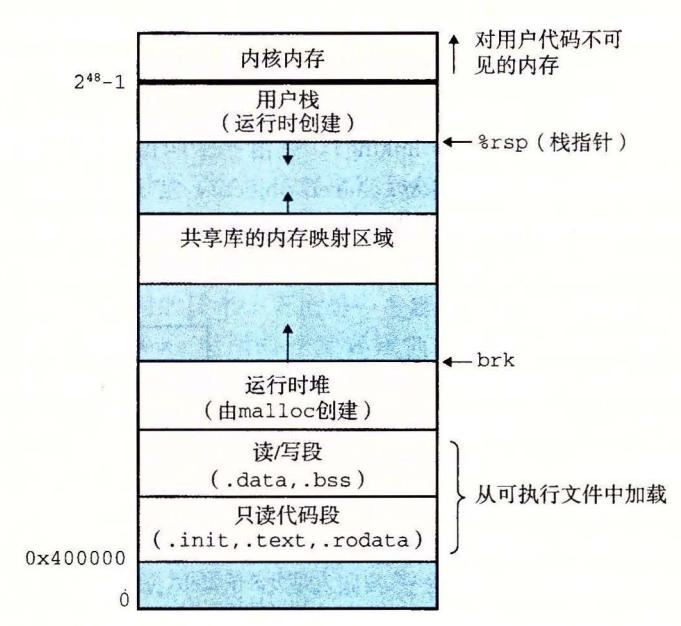

Linux x86 -64 运行时内存映像。没有展示出由于段对齐要求和地 址空 间布局随机化 (ASLR) 造成的空隙。区域大小不成比例

### 日日 加载器实际是如何工作的?

我们对于加载的描述从概念上来说是正确的,但也不是完全准确,这是有意为之 要理解加栽实际是如何工作的,你必须理解进程、虚拟内存和内存映射的概念,这些我 们还没有加以讨论。在后面笫 章和笫 章中遇到这些概念时,我们将重新回到加载的 问题上,并逐渐向你揭开它的神秘面纱

对于不够有耐心的读者,下面是关于加栽实际是如何工作的一个概述: Linux 系统 中的每个程序都运行在一个进程上下文中,有自己的虚拟地址空间。当 shell 运行一个 程序时,父 shell 进程生成一个子进程,它是父进程的一个复制。子进程通过 execve 统调用启动加载器。加栽器删除子进程现有的虚拟内存段,并创建一组新的代码、数 据、堆和栈段。新的栈和堆段被初始化为零 通过将虚拟地址空间中的页映射到可执行 文件的页大小的片 (chunk) ,新的代码和数据段袚初始化为可执行文件的内容。最后, 加载器跳转到\_start地址,它最终会调用应用程序的 main 函数。除了一些头部信息,在 加栽过程中没有任何从磁盘到内存的数据复制 直到 CPU 引用一个被映射的虚拟页时才 会进行复制,此时,操作系统利用它的页面调度机制自动将页面从磁盘传送到内存。

## 7. 10 动态链接共享库

我们在 7. 6. 节中研究的静态库解决了许多关千如何让大 相关函数对应用程序可用 的问题。然而,静态库仍然有一些明显的缺点。静态库和所有的软件一样,需要定期维护 和更新。如果应用程序员想要使用一个库的最新版本,他们必须以某种方式了解到该库的 更新情况, 然后显式地将他们的程序与更新了的库重新链接。

另一个问题是几乎每个 C 程序都使用标准 I/O 函数, 比如 printf 和 scanf。在运行 时,这些函数的代码会被复制到每个运行进程的文本段中。<mark>在一个运行上百个进程的典型</mark> <u>系统上,这将是对稀缺的内存系统资源的极大浪费。</u>(内存的一个有趣属性就是不论系统 的内存有多大,它总是一种稀缺资源。磁盘空间和厨房的垃圾桶同样有这种属性。)

共享库(shared library)是致力于解决静态库缺陷的一个现代创新产物。共享库是一个 目标模块,在运行或加载时,可以加载到任意的内存地址,并和一个在内存中的程序链接 <mark>起来。</mark>这个过程称为<mark>动态链接</mark>(dynamic linking),是由一个叫做动态链接器(dynamic linker) 的程序来执行的。共享库也称为共享目标(shared object),在 Linux 系统中通常用.so后缀 来表示。微软的操作系统大量地使用了共享库,它们称为 DLL(动态链接库)。

共享库是以两种不同的方式来"共 享"的。首先,在任何给定的文件系统 中,对于一个库只有一个.so 文件。所 有引用该库的可执行目标文件共享这个. so 文件中的代码和数据,而不是像静态 库的内容那样被复制和嵌入到引用它们 的可执行的文件中。 其次, 在内存中, 一个共享库的.text 节的一个副本可以 被不同的正在运行的进程共享。在第 9 章我们学习虚拟内存时将更加详细地讨 论这个问题。

图 7-16 概括了图 7-7 中示例程序的 动态链接过程。为了构造图 7-6 中示例 向量例程的共享库 libvector.so, 我 们调用编译器驱动程序, 给编译器和链 接器如下特殊指令:

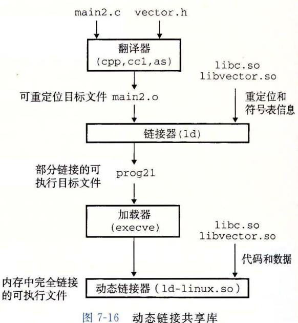

linux> gcc -shared -fpic -o libvector.so addvec.c multvec.c

-fpic 选项指示编译器生成与位置无关的代码(下一节将详细讨论这个问题)。 -shared选项指示链接器创建一个共享的目标文件。一旦创建了这个库,随后就要将它链 接到图 7-7 的示例程序中:

linux> gcc -o prog21 main2.c ./libvector.so

这样就创建了一个可执行目标文件 prog21, 而此文件的形式使得它在运行时可以和 libvector.so 链接。基本的思路是当创建可执行文件时,静态执行一些链接,然后在程 序加载时,动态完成链接过程。认识到这一点是很重要的:此时,没有任何 libvector.so 的代码和数据节真的被复制到可执行文件 prog21 中。反之,链接器复制了一些重定位和 符号表信息,它们使得运行时可以解析对 libvector.so 中代码和数据的引用。

当加载器加载和运行可执行文件 proq21 时,它利用 7.9 节中讨论过的技术,加载部分 链接的可执行文件 proq21。接着,它注意到 proq21 包含一个.interp 节,这一节包含动态 链接器的路径名,动态链接器本身就是一个共享目标(如在 Linux 系统上的 1d-linux.so)。 加载器不会像它通常所做地那样将控制传递给应用,而是加载和运行这个动态链接器。然

后,动态链接器通过执行下面的重定位完成链接任务:

- ·重定位 libc.so 的文本和数据到某个内存段。
- ·重定位 libvector.so 的文本和数据到另一个内存段
- ·重定位 prog21 中所有对由 libc.so libvector.so 定义的符号的引用。

最后,动态链接器将控制传递给应用程序。从这个时刻开始,共享库的位置就固定 了,并且在程序执行的过程中都不会改变

## 7. 11 从应用程序中加载和链接共享库

到目前为止,我们巳经讨论了在应用程序被加载后执行前时,动态链接器加载和链接 共享库的情景。然而,应用程序还可能在它运行时要求动态链接器加载和链接某个共享 库,而无需在编译时将那些库链接到应用中。

动态链接是 项强大有用的技术。下面是一些现实世界中的例子:

- ·分发软件。微软 Windows 应用的开发者常常利用共享库来分发软件更新。他们生 个共享库的新版本,然后用户可以下载,并用它替代当前的版本。下 次他们 运行应用程序时,应用将自动链接和加载新的共享库。
- ·构建高性能 Web 服务器。许多 Web 服务器生成动态内容,比如个性化的 Web 面、账户余额和广告标语。早期的 Web 服务器通过使用 fork execve 创建一个 子进程,并在该子进程的上下文中运行 CGI 程序来生成动态内容。然而,现代高性 能的 Web 服务器可以使用基于动态链接的更有效和完善的方法来生成动态内容。

其思路是将每个生成动态内容的函数打包在共享库中。当一个来自 Web 浏览器的请 求到达时,服务器动态地加载和链接适当的函数,然后直接调用它,而不是使用 fork execve 在子进程的上下文中运行函数。函数会一直缓存在服务器的地址空间中,所以只 要一个简单的函数调用的开销就可以处理随后的请求了。这对一个繁忙的网站来说是有很 大影响的。更进一步地说,在运行时无需停止服务器,就可以更新已存在的函数,以及添 加新的函数。

Linux 系统为动态链接器提供了一个简单的接口,允许应用程序在运行时加载和链接 共享库。

#include <dlfcn.h>

void \*dlopen(const char \*filename, int flag);

返回:若成功 为指向句柄的指针,若出错则为 NULL

dlopen 函数加载和链接共享库 filename 。用已用带 RTLD\_GLOBAL 选项打开了的库 解析 filename 中的外部符号。如果当前可执行文件是带-rdynamic 选项编译的,那么对 符号解析而言,它的全局符号也是可用的。 flag 参数必须要么包括 RTLD NOW, 该标志告 诉链接器立即解析对外部符号的引用,要么包括 RTLD\_LAZY 标志,该标志指示链接器推 迟符号解析直到执行来自库中的代码。这两个值中的任意一个都可以和 RTLD GLOBAL 志取或。

#include <dlfcn.h>

void \*dlsym(void \*handle, char \*symbol);

返回:若成功则为指向符号的指针,若出错则力 NULL

dlsym 函数的输入是一个指向前面已经打开了的共享库的句柄和一个 symbol 名字,如果该符号存在,就返回符号的地址,否则返回 NULL。

```
#include <dlfcn.h>\nint dlclose (void *handle);

返回: 若成功则为 0, 若出错则为-1。
```

如果没有其他共享库还在使用这个共享库,dlclose 函数就卸载该共享库。

```
#include <dlfcn.h>
const char *dlerror(void);
```

dlerror 函数返回一个字符串,它描述的是调用 dlopen、dlsym 或者 dlclose 函数时发生的最近的错误,如果没有错误发生,就返回 NULL。

图 7-17 展示了如何利用这个接口动态链接我们的 libvector.so 共享库, 然后调用它的 addvec 例程。要编译这个程序, 我们将以下面的方式调用 GCC:

linux> gcc -rdynamic -o prog2r dll.c -ldl

```
- code/link/dll.c
     #include <stdio.h>
     #include <stdlib.h>
     #include <dlfcn.h>
     int x[2] = \{1, 2\};
 5
     int y[2] = \{3, 4\};
     int z[2];
 8
 9
     int main()
10
         void *handle;
11
         void (*addvec)(int *, int *, int *, int);
12
         char *error;
13
         /* Dynamically load the shared library containing addvec() */
15
         handle = dlopen("./libvector.so", RTLD_LAZY);
         if (!handle) {
17
             fprintf(stderr, "%s\n", dlerror());
18
             exit(1);
19
         }
20
21
         /* Get a pointer to the addvec() function we just loaded */
22
         addvec = dlsym(handle, "addvec");
23
         if ((error = dlerror()) != NULL) {
24
             fprintf(stderr, "%s\n", error);
25
```

图 7-17 示例程序 3。在运行时动态加载和链接共享库 libvector.so

```
26 exit (1); 
27 } 
28 
29 I* Now we can call addvec () just like any other function *I 
30 addvec (x, y, z, 2) ; 
31 printf("z = [%d %d]\n", z[O], z[l]); 
32 
33 I* Unload the shared library *I 
34 if (dlclose (handle) < 0) { 
35 fprintf (stderr, "i s\n", dlerror()); 
36 exit(!); 
37 } 
38 return O; 
39 } 
                                                    code/link/ dll. c
```

(续)

## 共享库和 Java 本地接口

Java 定义了一个标准调用规则,叫做 Java 本地接口 (Java Native Interface, JNI) ,它允 Java 程序调用"本地的 "C C+ +函数。 JNI 的基本思想是将本地 函数(如 foo) 编译 到一个共享库中(如 foo.so) 当一个正在运行的 Java 程序试图调用函数 foo 时, Java 释器利用 dlopen 接口(或者与其类似的接口)动态链接和加载 foo.so, 然后再调用 foo

# 7. 12 位置无关代码

共享库的一个主要目的就是允许多个正在运行的进程共享内存中相同的库代码,因而 节约宝贵的内存资源 那么,多个进程 是如何共享程序的一个副本的呢?一 种方法是给每 个共 库分配一个事先预备的专用的地址空间片,然后要求加载器总是在这个地址加载共 享库。虽然这种方法很简单,但是它也造成了一些严重的问题 它对地址空间的使用效 不高,因为即使 个进程不使用这个 ,那部分空间还是 会被分配出来。 它也难以 管理。 我们必须保证没有片会重叠。每次当一个库修改了之后,我们必须确认已分配给它的片还 适合它的大小。如果不适合了,必须找一个新的片。并且,如果创建了一个新的库,我们 还必须为它 找空间。随着时间的进展,假设在一个系统中有了成百个库和库的各个版本 库,就很难避免地址空间分裂成大 小的、 未使用而又不再能使用的小洞。 更糟的 是,对 每个系统 ,库在内存中的分配都是不同的,这就引起了更多令人头痛的管理问题

要避免这些问题, 现代系统以这样一种方式编译共享模块的代码段,使得可以把它们 载到内存的任何位置而无需 链接器修改。使用这种方法,无限 多个进程可以共享一个共 享模块的代码段的单一副本。(当然,每个进程仍然会有它自己的读 写数据块。)

可以加载而无需重定位的代码称为位置无关代码 (Position Ind epe ndent Code, PIC) 用户对 GCC 使用-fpic 选项指示 GNU 编译系统生成 PIC 代码。 共享 库的编译必须总 使用该选项

在一个 x86-64 系统 中,对同一个目标模块中符号的引用是不 需要特殊 处理使之成为 PIC 可以用 PC 相对寻址来编译这些引用,构造目标文件时由静态链接器重定位。然而,对 共享模块定义的外部过程和对全局变 的引用需要一些特殊的技巧,接下来我们会谈到

#### 1. PIC 数据引用

490

编译器通过运用以下这个有趣的事实来生成对全局变量的 PIC 引用:无论我们在内存中的何处加载一个目标模块(包括共享目标模块),数据段与代码段的距离总是保持不变。因此,代码段中任何指令和数据段中任何变量之间的距离都是一个运行时常量,与代码段和数据段的绝对内存位置是无关的。

想要生成对全局变量 PIC 引用的编译器利用了这个事实,它在数据段开始的地方创建了一个表,叫做全局偏移量表(Global Offset Table, GOT)。在 GOT 中,每个被这个目标模块引用的全局数据目标(过程或全局变量)都有一个 8 字节条目。编译器还为 GOT 中每个条目生成一个重定位记录。在加载时,动态链接器会重定位 GOT 中的每个条目,使得它包含目标的正确的绝对地址。每个引用全局目标的目标模块都有自己的 GOT。

图 7-18 展示了示例 libvector.so 共享模块的 GOT。addvec 例程通过 GOT[3]间接地加载全局变量 addcnt 的地址,然后把 addcnt 在内存中加 1。这里的关键思想是对GOT[3]的 PC 相对引用中的偏移量是一个运行时常量。

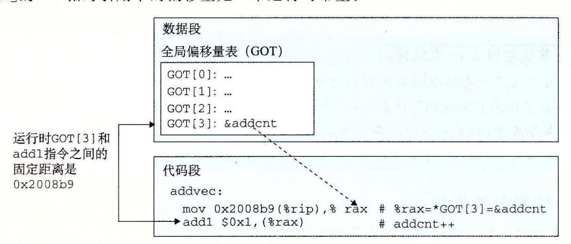

图 7-18 用 GOT 引用全局变量。libvector.so 中的 addvec 例程通过 libvector.so 的 GOT 间接引用了 addcnt

因为 addcnt 是由 libvector.so 模块定义的,编译器可以利用代码段和数据段之间不变的距离,产生对 addcnt 的直接 PC 相对引用,并增加一个重定位,让链接器在构造这个共享模块时解析它。不过,如果 addcnt 是由另一个共享模块定义的,那么就需要通过 GOT 进行间接访问。在这里,编译器选择采用最通用的解决方案,为所有的引用使用 GOT。

#### 2. PIC 函数调用

假设程序调用一个由共享库定义的函数。编译器没有办法预测这个函数的运行时地址,因为定义它的共享模块在运行时可以加载到任意位置。正常的方法是为该引用生成一条重定位记录,然后动态链接器在程序加载的时候再解析它。不过,这种方法并不是 PIC,因为它需要链接器修改调用模块的代码段,GNU 编译系统使用了一种很有趣的技术来解决这个问题,称为延迟绑定(lazy binding),将过程地址的绑定推迟到第一次调用该过程时。

使用延迟绑定的动机是对于一个像 libc.so 这样的共享库输出的成百上千个函数中,一个典型的应用程序只会使用其中很少的一部分。把函数地址的解析推迟到它实际被调用的地方,能避免动态链接器在加载时进行成百上千个其实并不需要的重定位。第一次调用过程的运行时开销很大,但是其后的每次调用都只会花费一条指令和一个间接的内存引用。

延迟绑定是通过两个数据结构之间简洁但又有些复杂的交互来实现的,这两个数据结

构是: GOT 和过程链接表(Procedure Linkage Table, PLT)。如果一个目标模块调用定义在共享库中的任何函数,那么它就有自己的 GOT 和 PLT。GOT 是数据段的一部分,而 PLT 是代码段的一部分。

图 7-19 展示的是 PLT 和 GOT 如何协作在运行时解析函数的地址。首先,让我们检查一下这两个表的内容。

- 过程链接表(PLT)。PLT 是一个数组,其中每个条目是 16 字节代码。PLT [0]是一个特殊条目,它跳转到动态链接器中。每个被可执行程序调用的库函数都有它自己的 PLT 条目。每个条目都负责调用一个具体的函数。PLT [1](图中未显示)调用系统启动函数(\_\_libc\_start\_main),它初始化执行环境,调用 main 函数并处理其返回值。从 PLT [2] 开始的条目调用用户代码调用的函数。在我们的例子中,PLT [2] 调用 addvec,PLT [3] (图中未显示)调用 printf。
- ●全局偏移量表(GOT)。正如我们看到的,GOT是一个数组,其中每个条目是8字节地址。和PLT联合使用时,GOT[0]和 GOT[1]包含动态链接器在解析函数地址时会使用的信息。GOT[2]是动态链接器在1d-linux.so模块中的人口点。其余的每个条目对应于一个被调用的函数,其地址需要在运行时被解析。每个条目都有一个相匹配的PLT条目。例如,GOT[4]和 PLT[2]对应于 addvec。初始时,每个 GOT条目都指向对应 PLT条目的第二条指令。

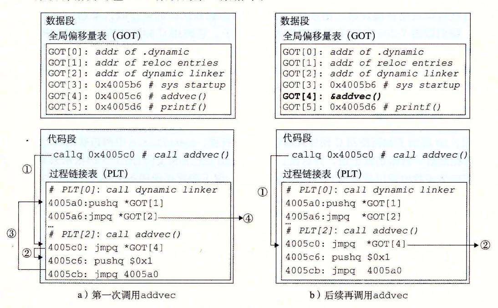

图 7-19 用 PLT 和 GOT 调用外部函数。在第一次调用 addvec 时,动态链接器解析它的地址

图 7-19a 展示了 GOT 和 PLT 如何协同工作,在 addvec 被第一次调用时,延迟解析它的运行时地址:

- 第 1 步。不直接调用 addvec,程序调用进入 PLT[2],这是 addvec 的 PLT 条目。
- 第 2 步。第一条 PLT 指令通过 GOT [4]进行间接跳转。因为每个 GOT 条目初始时 都指向它对应的 PLT 条目的第二条指令,这个间接跳转只是简单地把控制传送回 PLT [2]中的下一条指令。

- .第 步。在把 addvec ID(Oxl) 压入栈中之后, PLT[2] 跳转到 PLT[O]
- .第 步。 PLT[O] 通过 GOT[l] 间接地把动态链接器的一个参数压入栈中,然后通过 GOT[2] 间接跳转进动态链接器中。动态链接器使用两个栈条目来确定 addvec 的运 行时位置,用这个地址重写 GOT[4] ,再把控制传递给 addvec

7-19b 给出的是后续再调用 addvec 时的控制流:

- ·第 步。和前面一样,控制传递到 PLT[2]
- ·第 步。不过这次通过 GOT[4] 的间接跳转会将控制直接转移到 addvec

## 7. 13 库打桩机制

Linux 链接器支持一个很强大的技术,称为库打桩 (library interpositioning) ,它允许 你截获对共享库函数的调用,取而代之执行自己的代码。使用打桩机制,你可以追踪对某 个特殊库函数的调用次数,验证和追踪它的输入和输出值,或者甚至把它替换成一个完全 不同的实现。

下面是它的基本思想:给定 个需要打桩的目标函数,创建一个包装函数,它的原型 与目标函数完全一样。使用某种特殊的打桩机制,你就可以欺骗系统调用包装函数而不是 目标函数了。包装函数通常会执行它自己的逻辑,然后调用目标函数,再将目标函数的返 回值传递给调用者。

打桩可以发生在编译时、链接时或当程序被加载和执行的运行时。要研究这些不同的 机制,我们以图 7-ZOa 中的示例程序作为运行例子。它调用 标准库 (libc.so) 中的 malloc free 函数。对 malloc 的调用从堆中分配一个 <sup>32</sup> 字节的块,并返回指向该块的指 针。对 free 的词用把块还回到堆,供后续的 malloc 调用使用。我们的目标是用打桩来 追踪程序运行时对 malloc free 的调用。

#### 7. 13. 1 编译时打桩

7-20 展示了如何使用 预处理器在编译时打桩。 mymalloc.c 中的包装函数(图 7-20c) 调用目标函数,打印追踪记录,并返回。本地的 malloc.h 头文件(图 7-20b) 指示预处理器用 对相应包装函数的调用替换掉对目标函数的调用。像下面这样编译和链接这个程序:

linux> gee -DCOMPILETIME -e mymalloe. e linux> gee -I. -o inte int.e mymalloe.o

由于有- .参数,所以会进行打桩,它告诉 预处理器在搜索通常的系统目录之前, 先在当前目录中查找 malloc.h 。注意, mymalloc.c 中的包装函数是使用标准 ma oc.h 头文件编译的。

运行这个程序会得到如下的追踪信息:

linux>./intc malloc(32)=0x9ee010 free(Ox9ee010)

#### 7. 13. 2 链接时打桩

Linux 静态链接器支持用--wrap 标志进行链接时打桩。这个标志告诉链接器,把对 符号 的引用解析成\_\_wrap\_f (前缀是两个下划线),还要把对符号\_—real\_f (前缀是两 个下划线)的引用解析为 。图 7-21 给出我们示例程序的包装函数。

```
code/link/interpose/int.c
    1
         #include <stdio.h>
    2
         #include <malloc h>
    3
        int main()
    5
    6
             int *p = malloc(32);
    7
             free(p);
    8
             return(0);
    9
         }
                                                          code/link/interpose/int.c
                                    a) 示例程序 int.c
                                                      - code/link/interpose/malloc.h
    1
        #define malloc(size) mymalloc(size)
    2
        #define free(ptr) myfree(ptr)
    3
        void *mymalloc(size_t size);
        void myfree(void *ptr);
                                                      code/link/interpose/malloc.h
                                   b) 本地 malloc.h 文件
                                                   code/link/interpose/mymalloc.c
        #ifdef COMPILETIME
    2
        #include <stdio.h>
        #include <malloc.h>
    4
    5
        /* malloc wrapper function */
    6
        void *mymalloc(size_t size)
    7
   8
            void *ptr = malloc(size);
   9
            printf("malloc(%d)=%p\n",
   10
                   (int)size, ptr);
   11.
            return ptr;
   12
   13
   14
        /* free wrapper function */
   15
        void myfree(void *ptr)
   16
        {
   17
            free(ptr);
   18
            printf("free(%p)\n", ptr);
   19
   20
        #endif
                                                   - code/link/interpose/mymalloc.c
                                c) mymalloc.c 中的包装函数
                           图 7-20 用 C 预处理器进行编译时打桩
    用下述方法把这些源文件编译成可重定位目标文件:
    linux> gcc -DLINKTIME -c mymalloc.c
    linux> gcc -c int.c
然后把目标文件链接成可执行文件:
```

-Wl, option 标志把 option 传递给链接器。option 中的每个逗号都要替换为一个空

linux> gcc -W1,--wrap,malloc -W1,--wrap,free -o intl int.o mymalloc.o

格。所以-Wl,--wrap,malloc 就把--wrap malloc 传递给链接器,以类似的方式传递 -Wl, - -wrap, free

```
codellinklinterpose/m ymalloc. c 
    #ifdef LINKTIME 
2#include <stdio.h> 
4void * __ real_malloc(size_t size); 
5void __ real_free(void *ptr); 
6 
7I* malloc wrapper function *I 
8void * __ wrap_malloc(size_t size) 
9 { 
10void *ptr = __ real_malloc(size); I* Call libc malloc *I 
11printf("malloc(%d) = %p\n", (int)size, ptr); 
12return ptr; 
13 } 
14 
15 I* free wrapper function *I 
16 void __ wrap_free(void *ptr) 
17 { 
18 __ real_free(ptr); I* Call libc free *I 
19 printf("free(%p)\n", ptr); 
20 } 
21#endif 
                                             code/linklinterposelm ymalloc. c
```

用--wra 标志进 行链接时打桩

运行该程序会得到如下追踪信息

```
linux>./intl 
malloc(32) = Ox18cf010 
free (Ox18cf010)
```

#### 7. 13. 3 运行时打桩

编译时 打桩需要能够访问 程序的源代码,链 时打桩需要能 够访间 程序 的可重定位对 象文件。不 过, 种机制能够在运行时打桩.它只需要能够访问可执行目标文件 这个 很厉害的机制基千动态链接器的 LD\_PRELOAD 环境变量

如果 LD\_PRELOAD 环境变 量被设置为一个共 库路径名的列表(以空格或分号分隔), 那么当你加载和执行 个程序, 需要解析未 定义的 引用时, 动态链接器 LD-L NUX. SO) 先搜索 LD\_PRELOAD 库,然后才搜索任何其他的库。有了这个机制,当你加载和执行任意 可执行 文件时,可以对任何共享库中的任何函数打桩,包括 libc so

<sup>22</sup> 展示了 malloc free 装函数。每个包装函数 中,对 sy 的调用返回 指向目标 libc 函数的指针。然后包装函数调用目标函数,打印追踪记录,再返回。

下面是如何构建包含 些包装函数的共享库的方法

linux> gee -DRUNTIME -sh ed -fpie -o mymalloe .so mymalloe.e -ldl

linux> gee -o intr int.e

这是如 何编 译主程序

- code/link/interpose/mymalloc.c

```
code/link/interpose/mymalloc.c
    #ifdef RUNTIME
    #define _GNU_SOURCE
2
    #include <stdio.h>
    #include <stdlib.h>
    #include <dlfcn.h>
    /* malloc wrapper function */
    void *malloc(size_t size)
    {
10
         void *(*mallocp)(size_t size);
         char *error;
11
12
        mallocp = dlsym(RTLD_NEXT, "malloc"); /* Get address of libc malloc */
13
        if ((error = dlerror()) != NULL) {
14
             fputs(error, stderr);
15
             exit(1);
16
17
        char *ptr = mallocp(size); /* Call libc malloc */
18
        printf("malloc(%d) = %p\n", (int)size, ptr);
19
        return ptr;
20
21
22
23
    /* free wrapper function */
    void free(void *ptr)
24
    {
25
        void (*freep)(void *) = NULL;
26
        char *error:
27
28
        if (!ptr)
29
30
             return;
31
        freep = dlsym(RTLD_NEXT, "free"); /* Get address of libc free */
32
33
        if ((error = dlerror()) != NULL) {
             fputs(error, stderr);
34
35
             exit(1);
        7
37
        freep(ptr); /* Call libc free */
        printf("free(%p)\n", ptr);
38
39
    #endif
```

图 7-22 用 LD PRELOAD 进行运行时打桩

下面是如何从 bash shell 中运行这个程序 : linux> LD\_PRELOAD="./mymalloc.so" ./intr

40

malloc(32) = 0x1bf7010free(0x1bf7010)

<sup>○</sup> 如果你不知道运行的 shell 是哪一种,在命令行上输入 printenv SHELL。

下面是如 何在 csh tcsh 中运行这 个程 序:

linux> (setenv LD\_PRELOAD ". / mymalloc. so";./intr; unsetenv LD\_PRELOAD) malloc(32) = Ox2157010 free(Ox2157010)

请注意, 你可以用 PRELOAD 对任何可执行程序的库函数调用打桩!

linux> LD\_PRELOAD=" ./mymalloc. so" / usr/ bin/ uptime malloc(568) = Ox21bb010 free(Ox21bb010) malloc(15) = Ox21bb010 malloc(568) = Ox21bb030 malloc(2255) = Ox21bb270 free(Ox21bb030) malloc(20) = Ox21bb030 malloc(20) = Ox21bb050

malloc(20) = Ox21bb070 malloc(20) = Ox21bb090

malloc(20) = Ox21bb0b0 malloc(384) = Ox21bb0d0

20:47:36 up 85 days, 6:04, 1 user, load average: 0.10, 0.04, 0.05

# 7. 14 处理目标文件的工具

Linux 系统中 有大最可用的工具 可以 帮助你理解和处理目 标文件 。特别 地, GNU binutil 包尤其有帮助,而且可以运行在每个 inu 台上

- R: 创建静态库,插入、删除、列 出和提 取成员
- STRINGS: 列出 个目标文件中所有可打印的字符串。
- TRIP: 目标文件 中删 除符号表信息
- NM :列出 个目标文 的符号表 中定义的 符号。
- IZE: 列出 目标文件中 节的名字和大小
- READELF: 显示 个目标文件的完整结构,包括 ELF 头中编码的所有信息。包含 IZE NM 功能。
- OBJDUMP: 所有 进制 具之母。能够显示一个目标文件中所有的信息。它最大 的作用是反汇编. text 节中的 进制指令

Linux 系统为操作共享库还提供了 LDD 程序:

• LDD: 列出一个可执行文件在运行时所需要的共享库

## 7. 15 小结

链接可以在编译时由静态编译器来 ,也可 以在加载时和运行时 动态链接器来完成 链接器处 理称为目标文件的二进制文件,它有 种不同的形式:可重定位的、可执行的和共 的。可重定位的目 标文件由静态链接器合并成一个可执行的目标文件,它可以加载到内存中并执行。 享目标 文件( 共享 库)是在运行时由动态链接器链接和加载的,或者隐含地在调用程序被加载和开始执行时,或者根据需要 在程序调用 lopen 库的 数时

链接器的两个主要任务是符号解析和 定位 解析将目标文件中的每个全局符号都绑定到一个 唯一的 定义,而重定位确定每个 号的 终内存地址,并修改对 些目标的引 用。

静态链接器是由像 GCC 这样的编译驱动程序调用的。它们将多个可重定位目标文件合并成一个单独的可执行目标文件。多个目标文件可以定义相同的符号,而链接器用来悄悄地解析这些多重定义的规则可能在用户程序中引入微妙的错误。

多个目标文件可以被连接到一个单独的静态库中。链接器用库来解析其他目标模块中的符号引用。许多链接器通过从左到右的顺序扫描来解析符号引用,这是另一个引起令人迷惑的链接时错误的来源。

加载器将可执行文件的内容映射到内存,并运行这个程序。链接器还可能生成部分链接的可执行目标文件,这样的文件中有对定义在共享库中的例程和数据的未解析的引用。在加载时,加载器将部分链接的可执行文件映射到内存,然后调用动态链接器,它通过加载共享库和重定位程序中的引用来完成链接任务。

被编译为位置无关代码的共享库可以加载到任何地方,也可以在运行时被多个进程共享。为了加载、链接和访问共享库的函数和数据,应用程序也可以在运行时使用动态链接器。

### 参考文献说明

在计算机系统文献中并没有很好地记录链接。因为链接是处在编译器、计算机体系结构和操作系统的交叉点上,它要求理解代码生成、机器语言编程、程序实例化和虚拟内存。它没有恰好落在某个通常的计算机系统领域中,因此这些领域的经典文献并没有很好地描述它。然而,Levine 的专著提供了有关这个主题的很好的一般性参考资料[69]。[54]描述了 ELF 和 DWARF(对.debug 和.line 节内容的规范)的原始 IA32 规范。[36]描述了对 ELF 文件格式的 x86-64 扩展。x86-64 应用二进制接口(ABI)描述了编译、链接和运行 x86-64 程序的惯例,其中包括重定位和位置无关代码的规则[77]。

### 家庭作业

\*7.6 这道题是关于图 7-5 的 m.o 模块和下面的 swap.c 函数版本的,该函数计算自己被调用的次数:

```
1
     extern int buf[];
2
3
    int *bufp0 = &buf[0];
4
    static int *bufp1;
    static void incr()
6
7
         static int count=0;
8
9
10
         count++;
     }
11
12
13
     void swap()
14
         int temp;
15
16
17
         incr();
18
         bufp1 = &buf[1];
         temp = *bufp0;
19
         *bufp0 = *bufp1;
20
         *bufp1 = temp;
21
     }
22
```

对于每个 swap.o 中定义和引用的符号,请指出它是否在模块 swap.o 的.symtab 节中有符号表条目。如果是这样,请指出定义该符号的模块(swap.o或m.o)、符号类型(局部、全局或外部)以及它在模块中所处的节(.text、.data或.bss)。

| 符号    | swap.o.symtab条目? | 符号类型 | 定义符号的模块 | 节 |
|-------|------------------|------|---------|---|
| buf   | 8                |      |         |   |
| bufp0 |                  |      | P p     |   |
| bufp1 |                  |      |         |   |
| swap  |                  |      |         |   |
| temp  |                  |      |         | - |
| incr  |                  |      |         |   |
| count |                  |      |         |   |

- \* 7.7 不改变任何变量名字, 修改 7.6.1 节中的 bar5.c, 使得 foo5.c 输出 x 和 y 的正确值(也就是整数 15213 和 15212 的十六进制表示)。
- \*7.8 在此题中, REF(x,i)→DEF(x,k)表示链接器将任意对模块 i 中符号 x 的引用与模块 k 中符号 x 的 定义相关联。在下面每个例子中,用这种符号来说明链接器是如何解析在每个模块中有多重定义的 引用的。如果出现链接时错误(规则1),写"错误"。如果链接器从定义中任意选择一个(规则3), 那么写"未知"。

```
A. /* Module 1 */
                                  /* Module 2 */
   int main()
                                  static int main=1[
   {
                                  int p2()
   }
                                  {
   (a) REF(main.1) \rightarrow DEF(
   (b) REF(main.2) \rightarrow DEF(
B. /* Module 1 */
                                 /* Module 2 */
                                 double x;
   int x;
   void main()
                                 int p2()
   {
                                 {
   7
                                 7
   (a) REF(x.1) \rightarrow DEF(_
   (b) REF(x.2) \rightarrow DEF(
C. /* Module 1 */
                                 /* Module 2 */
   int x=1;
                                 double x=1.0;
   void main()
                                 int p2()
   {
                                 {
                                 }
   (a) REF(x.1) \rightarrow DEF(_
   (b) REF(x.2) \rightarrow DEF(_
```

\*7.9 考虑下面的程序,它由两个目标模块组成:

```
/* foo6.c */
1
                                    /* bar6.c */
    void p2(void);
2
                                    #include <stdio.h>
4
    int main()
                                    char main;
                                4
    {
5
                                5
        p2():
6
                                    void p2()
                                6
7
        return 0;
                               7
                                    {
    }
8
                                        printf("0x%x\n", main);
```

当在 x86-64 Linux 系统中编译和执行这个程序时,即使函数 p2 不初始化变量 main,它也能打印字 符串 "0x48\n"并正常终止。你能解释这一点吗?

\*\* 7.10 a 和 b 表示当前路径中的目标模块或静态库,而 a→b 表示 a 依赖于 b,也就是说 a 引用了一个 b 定义的符号。对于下面的每个场景,给出使得静态链接器能够解析所有符号引用的最小的命令行 (即含有最少数量的目标文件和库参数的命令)。

- A. p.o-libx.a p.o
- B. p.o--..libx.a- by.a liby.a--..libx.a
- C. p.o--.. bx.a--+ by.a-libz.a liby. a-libx. a-libz. a
- •• 7. 11 <sup>14</sup> 中的程序头部表明数据段占用了内存中 Ox230 个字节 然而,其中只有开始的 Ox228 字节 来自可执行文件的节。是什么引起了这种差异?
- •• 7. 12 考虑目标文件 m.o 中对函数 swap 的调用(作业题 7. 6)
  - 9: e8 00 00 00 00

callq e <main+Oxe> swap()

具有如下重定位条目:

- r.offset = Oxa
- r.symbol = swap
- r.type = R\_X86\_64\_PC32
- r.addend = -4
- A. 假设链接器将 m.o 中的. text 重定位到地址 Ox4004e0, swap 重定位到地址 Ox4004f8 。那么 callq 指令中对 swap 的重定位引用的值应该是什么?
- B. 假设链接器将 m.o 中的. text 重定位到地址 Ox4004d0, swap 重定位到地址 Ox400500 。那么 callq 指令中对 swap 的重定位引用的值应该是什么?
- \*\* 7 13 完成下面的任务将帮助你更熟悉处理目标文件的各种工具。
  - A. 在你的系统上,且b.c libm.a 的版本中包含多少目标文件?
  - B. gcc-Og 产生的可执行代码与 gcc-Og-g 产生的不同吗?
  - C. 在你的系统上, GCC 驱动程序使用的是什么共享库?

# 练习题答案

7. 1 这道练习题的目的是帮助你理解链接器符号和 变量及函数之间的关系。注意 的局部变量 temp 没有符号表条目。

| 符号    | . symtab条目? | 符号类型 | 在哪个模块中定义 |        |
|-------|-------------|------|----------|--------|
| buf   |             | 外部   | main.a   | .data  |
| bufpO |             | 全局   | swap.o   | .data  |
| bufpl |             | 全局   | swap.o   | COMMON |
| swap  |             | 全局   | swap.o   | .text  |
| temp  |             |      |          |        |

- 7 2 这是一个简单的练习,检查你对 Unix 链接器解析在一个以上模块中有定义的全局符号时所使用规 则的理解。理解这些规则可以帮助你避免一些讨厌的编程错误。
  - A. 链接器选择定义在模块 中的强符号,而不是定义在模块 中的弱符号(规则 2):
    - (a) REF(main.1) ➔ DEF(main.1)
    - (b) REF(main.2) ➔ DEF(main.1)
  - B. 这是一个错误,因为每个模块都定义了一个强符号 main (规则 l)
  - C. 链接器选择定义在模块 中的强符号,而不是定义在模块 中的弱符号(规则 2):
    - (a) REF(x.1) ➔ DEF(x.2)
    - (b) REF(x.2) ➔ DEF(x.2)
- 7 3 在命令行中以错误的顺序放置静态库是造成令许多程序员迷惑的链接器错误的常见原因。然而,一 旦你理解了链接器是如何使用静态库来解析引用的,它就相当简单易懂了。这个小练习检查了你对 这个概念的理解:
  - A. linux> gee p.o libx.a
  - B. linux> gee p.o libx.a liby.a
  - C. linux> gee p.o libx.a liby.a libx.a
- 7. 4 这道题涉及的是图 7-12a 中的反汇编列表。目的是让你练习阅读反汇编列表,并检查你对 PC 相对

寻址的理解。

- A. 行被重定位引用的十六进制地址为 Ox4004df
- B. 行被重定位引用的十六进制值为 Ox5 。记住,反汇编列表给出的引用值是用小端法字节顺序 表示的。
- 7. 5 这道题是测试你对链接器重定位 PC 相对引用的理解的。给定

$$ADDR(s) = ADDR(.text) = 0x4004d0$$

ADDR(r.symbol) = ADDR(swap) = Ox4004e8

使用图 7-10 中的算法,链接器首先计算引用的运行时地址:

refaddr = ADDR(s) + r.offset

= Ox4004d0 + Oxa

= Ox4004da

然后修改此引用:

\*refptr = (unsigned) (ADDR(r.symbol) + r.addend - refaddr)

= (unsigned) (Ox4004e8 + (-4) - Ox4004da)

= (unsigned) (Oxa)

因此,得到的可执行目标文件中,对 swap PC 相对引用的值为 Oxa:

4004d9: eB Oa 00 00 00 callq 4004e8 <swap>

----—

# 异常控制流

从给处理器加电开始,直到你断电为止,程序计数器假设一个值的序列

,a1,...,a,,-1

其中,每个 是某个相应的指令 Ik 的地址。每次从 ak 的过渡称为控制转移 (control transfer) 这样的控制转移序列叫做处理器的控制流 (flow of control control flow)

最简单的 种控制流是一个"平滑的"序列,其中每个 尸!在 内存中都是相邻 的。这种平滑流的突变(也就是 不相 邻)通常是由诸如跳转、调用和返回这样一些 熟悉的程 令造成 的。这样一些指令都是 必要的机制,使得程序能够对由程序变最表 的内部程序状态中的变化做出反应

但是系统也必须能够对系统状态的变化做出反应,这些系统状态不是被内部程序变 获的,而且也不 定要和程序的执行相关 比如, 个硬件定时器定期产生信号,这个事件 必须得到处理 包到达网络适配器后,必须存放在内存中。程序向磁盘请求数据,然后休 眠,直到被通知说数据己就绪。当子进程终止时,创造这些子进程的父进程必须得到通知。

现代系统通过使控制流发生突变来对这些情况 做出反应 。一般而言 ,我们把这些突变 称为异常控制流 (Exceptional Control Flow, ECF) 。异常控制流发 在计算机系统的各个 层次。比如, 在硬件层 ,硬件检测到的 件会触发控制突然转移到异常处理程序。在操作 系统层,内核通过上下文切换将控制从一个用户进程转移到另一个用户进程。在应用层, 一个进 程可以发送信 号到另一个进程,而接收者会将控制 突然转移到它 的一个信号处理程 序。 个程序可以通过回避通常的栈规则,并执行到其他函数中任意位置的非本地跳转来 对错误做出反应。

作为程序员,理解 ECF 很重要,这有很多原因:

- 理解 ECF 将帮助你理解重要的系统概念。 ECF 是操作系统用来实现 I/0 、进程和 虚拟内存的基本机制。在能够真正理解这些重要概念之前,你必须理解 ECF
- 理解 ECF 将帮助你理解应用程序是如何与操作系统交互的 。应 用程序通过使用一 个叫做陷阱 (trap) 或者系统调用 (system call) ECF 形式,向操作系统请求服务。 比如,向磁盘写 数据、从网络读取数据、创建一个新进程,以及终止当前进程,都 是通过应用程序涸用系统调用来实现的 理解基本的系统调用机制将帮助你理解这 些服务是如何提供给应用的。
- 理解 ECF 将帮助你编写有趣的新应用程序。操作系统为应用程序提供了强大的 ECF 机制,用来创建新进程、等待进程终止、通知其他进程系统中的异常事件,以 及检测和响应这些事件。如果理解了这些 ECF 机制,那么你就能用它们来编 Unix shell Web 服务器之类的有趣程序了。
- 理解 ECF 将帮助你理解并发。 ECF 是计算机系统中实现并发的基本机制。在运行 中的并发的例子有:中断应用程序执行的异常处理程序,在时间上重叠执行的进程 和线程,以及中断应用程序执行的信号处理程序。理解 ECF 是理解并发的第一步。 我们会在第 <sup>12</sup> 章中更详细地研究并发

·理解 ECF 将帮助你理解软件异常如何工作。像 C+ +和 Java 这样的语言通过 try catch 以及 throw 语句来提供软件异常机制。软件异常允许程序进行非本地跳转 (即违反通常的调用 返回栈规则的跳转)来响应错误情况。非本地跳转是一种应用 ECF, 中是通过 setjmp longjmp 函数提供的。理解这些低级函数将帮助 你理解高级软件异常如何得以实现。

对系统的学习,到目前为止你已经了解了应用是如何与硬件交互的。本章的重要性在 于你将开始学习应用是如何与操作系统交互的。有趣的是,这些交互都是围绕着 ECF 的。 我们将描述存在千一个计算机系统中所有层次上的各种形式的 ECF 。从异常开始,异常位 千硬件和操作系统交界的部分。我们还会讨论系统调用,它们是为应用程序提供到操作系 统的人口点的异常。然后,我们会提升抽象的层次,描述进程和信号,它们位千应用和操 作系统的交界之处。最后讨论非本地跳转,这是 ECF 的一种应用层形式。

## 8. 1 异常

异常是异常控制流的一种形式,它一部分由硬件实现,一部分由操作系统实现。因为 它们有一部分是由硬件实现的,所以具体细节将随系统的不同而有所不同。然而,对于每 个系统而言,基本的思想都是相同的。在这一节中我们的目的是让你对异常和异常处理有 一个一般性的了解,并且向你揭示现代计算机系统的 个经常令人感到迷惑的方面。

异常 (exception) 就是控制流中的突 变,用来响应处理器状态中的某些变化。 8-1 展示了基本的思想。

在图中,当处理器状态中发生一个 重要的变化时,处理器正在执行某个当 前指令 urr 。在处理器中,状态被编码 为不同的位和信号。状态变化称为事件 (event) 事件可能和当前指令的执行直 接相关 比如,发生虚拟内存缺页、算 一方面,事件也可能和当前指令的执行 没有关系。比如, 个系统定时器产生 信号或者一个 1/0 请求完成。

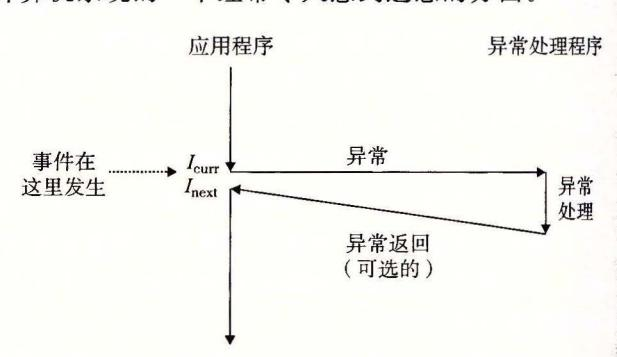

术溢出,或者一条指令试图除以零 1 异常的剖析 处理器状态中的变化( 件)触发从 应用程序到异常处理程序的突发的控制转移(异 常)。在异常处理程序完成处理后,它将控制返 回给被中断的程序或者终止

在任何情况下,当处理器检测到有事件发生时,它就会通过一张叫做异常表 (exception table) 的跳转表,进行一个间接过程调用(异常),到一个专门设计用来处理这类事件 的操作系统子程序(异常处理程序 (exception handler) )。当异常处理程序完成处理后,根 据引起异常的事件的类型,会发生以下 种情况中的一种:

- l) 处理程序将控制返回给当前指令 Icurr ,即当事件发生时正在执行的指令。
- 2) 处理程序将控制返回给[ xt, 如果没有发生异常将会执行的下一条指令。
- 3) 处理程序终止被中断的程序。
- 8. 1. 节将讲述关于这些可能性的更多内容。

# 日日 硬件异常与软件异常

C+ +和 Java 的程序员会注意到术语"异常"也用来描述由 C+ +和 Java catch

throw try 语句形式提供的应用级 ECF 。如果想严格清晰,我们必须区别"硬件"和 "软件"异常,但这通常是不必要的,因为从上下文中就能够很清楚地知道是哪种含义。

## 8. 1. 1 异常处理

异常可能会难以理解,因为处理异常需要硬件和软件紧密合作。很容易搞混哪个部分 执行哪个任务 让我们更详细地来看看硬件和软件的分工吧

系统中可能的每种类型的异常都分配了一个唯一的非负 整数 的异常号 (except10n number) 其中 些号码是巾处理器的设计者分配的,其他号码是由操作系统内核(操作系统 常驻内存的部分)的设计者分配的 前者的示例包括被零除、缺页、内存访问违例、断点 以及算术运 算溢 出。后者的示例包括系统调用和来自外部 I/0 设备的信号。

在系统启动时(当计算机 重启 或者加电 时),操作系统分配和初始化 张称为异常表 的跳转表,使得表目 包含异常 的处理程序 的地址 。图 -2 展示了异常表的格式

在运行时(当系统在执行某个程序时),处 理器检测到发生了一个事件,并且确定了相应 的异常号 。随后,处理器触发异常,方法是 执行间接过程调用,通过异常 的表目 k, 到相应的处理程序。图 8-3 展示了处理器如何 使用异常表来形成适当的异常处理 序的地址。 8-2 异常表 。异常表是 张跳转表,其中表目 异常号是到异常表中的索引,异常 的起始地 包含异 的处理程序代砃的地址

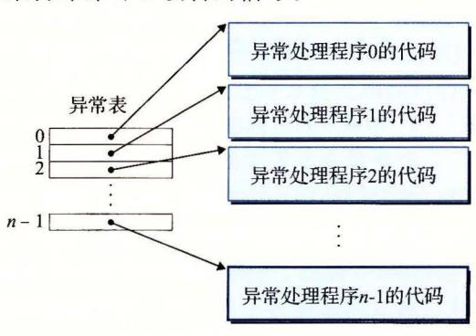

址放在一个叫做异常表基址寄存器 xception table base register) 的特殊 CPU 寄存器里。


8-3 生成异常处理程序的地址。异常号是到异 常表中的索引

异常类似于过程调用,但是有 些重要的不同之处:

- 过程调用时,在跳转到处理程序之前,处理器将返回地址压入栈中。然而,根据异 常的类型,返回地址要么是当前指令(当事件发生时正在执行的指令),要么是下一 条指令(如果事件不发生,将会在 前指令后执行的指 令)。
- 处理器也把一些额外的处理器状态压到栈里,在处理程序返回时,重新开始执行被 中断的程序会需要这些状态。比如, x86-64 系统会将包含当前条件码的 EFLAGS 寄存器和其他内容压入栈中。
- 如果控制从用户程序转移到内核,所有这些项目都被压到内核栈中 而不是压到用 户栈中。
- 异常处理程序运行在内核模式下(见 2. 节),这意味 它们对所有的系统资源都 有完全的访问权限。
- 旦硬件触发了异常,剩下的工作就是由异常处理程序在软件中完成。在处理程序处 理完事件之后,它通过执行一条特殊的"从中断返回"指令,可选地返回到被中断的程

序,该指令将适当的状态弹回到处理器的控制和数据寄存器中,如果异常中断的是一个用户程序,就将状态恢复为用户模式(见 8.2.4 节),然后将控制返回给被中断的程序。

#### 8.1.2 异常的类别

异常可以分为四类:中断(interrupt)、陷阱(trap)、故障(fault)和终止(abort)。图 8-4 中的表对这些类别的属性做了小结。

| 类别 | 原因           | 异步/同步 | 返回行为       |
|----|--------------|-------|------------|
| 中断 | 来自 I/O 设备的信号 | 异步    | 总是返回到下一条指令 |
| 陷阱 | 有意的异常        | 同步    | 总是返回到下一条指令 |
| 故障 | 潜在可恢复的错误     | 同步    | 可能返回到当前指令  |
| 终止 | 不可恢复的错误      | 同步    | 不会返回       |

图 8-4 异常的类别。异步异常是由处理器外部的 I/O 设备中的事件产生的。同步异常 是执行一条指令的直接产物

#### 1. 中断

中断是异步发生的,是来自处理器外部的 I/O 设备的信号的结果。硬件中断不是由任何一条专门的指令造成的,从这个意义上来说它是异步的。硬件中断的异常处理程序常常称为中断处理程序(interrupt handler)。

图 8-5 概述了一个中断的处理。I/O 设备,例如网络适配器、磁盘控制器和定时器芯片,通过向处理器芯片上的一个引脚发信号,并将异常号放到系统总线上,来触发中断,这个异常号标识了引起中断的设备。

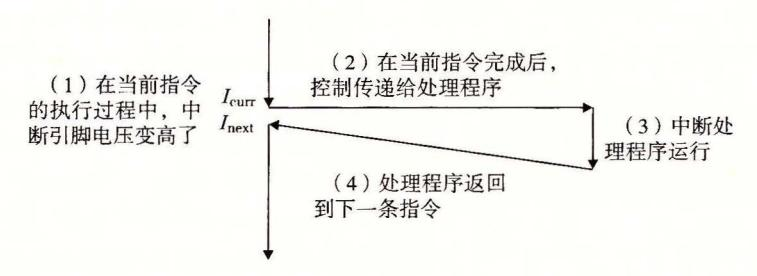

图 8-5 中断处理。中断处理程序将控制返回给应用程序控制流中的下一条指令

在当前指令完成执行之后,处理器注意到中断引脚的电压变高了,就从系统总线读取 异常号,然后调用适当的中断处理程序。当处理程序返回时,它就将控制返回给下一条指 令(也即如果没有发生中断,在控制流中会在当前指令之后的那条指令)。结果是程序继续 执行,就好像没有发生过中断一样。

剩下的异常类型(陷阱、故障和终止)是同步发生的,是执行当前指令的结果。我们把这类指令叫做故障指令(faulting instruction)。

#### 2. 陷阱和系统调用

陷阱是有意的异常,是执行一条指令的结果。就像中断处理程序一样,陷阱处理程序 将控制返回到下一条指令。陷阱最重要的用途是在用户程序和内核之间提供一个像过程一 样的接口,叫做系统调用。

用户程序经常需要向内核请求服务,比如读一个文件(read)、创建一个新的进程(fork)、加载一个新的程序(execve),或者终止当前进程(exit)。为了允许对这些内核服务的受控的访问,处理器提供了一条特殊的"syscall n"指令,当用户程序想要请求

服务 时,可以执行这条指令。执行 syscall 指令会导致 个到异常处理程序的陷阱, 这个处理程序解析参数,并调用适当的内核程序。图 8-6 概述了 个系统调用的处理

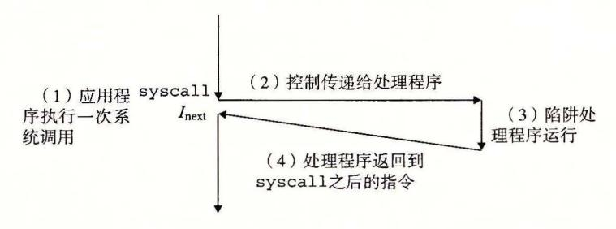

陷阱处理。陷阱处理程序将控制返回给应用程序控制流中的下 条指令

从程序员的角度来看,系统调用和普通的函数调用是一样的。然而,它们的实现非常不 同。普通的函数运行在用户模式中,用户模式限制了函数可以执行的指令的类型,而且它们 只能访问与调用函数相同的栈。系统调用运行在内核模式中,内核模式允许系统调用执行特 权指令,并访问定义在内核中的栈 8. 2. 节会更详细地讨论用户模式和内核模式。

### 故障

故障由错误情况引起,它可能能够被故障处理程序修正 当故障发生时,处理器将控 制转移给故障处理程序。如果处理程序能够修正这个错误情况,它就将控制返回到引起故 障的指令,从而重新执行它。否则,处理程序返回到内核中的 abort 例程, abort 例程会 终止引起故障的应用程序。图 8-7 概述了一个故障的处理。


故障处理 根据故障是否能够被修复,故障处理程序要么重新执行引起故障的指令,要么终止

一个经典的故障示例是缺页异常,当指令引用一个虚拟地址,而与该地址相对应的物 理页面不在内存中,因此必须从磁盘中取出时,就会发生故障。就像我们将在第 章中看 到的那样, 个页面就是虚拟内存的一个连续的块(典型的是 4KB) 。缺页处理程序从磁 加载适当的页面,然后将控制返回给引起故障的指令。当指令再次执行时,相应的物理页 面已经驻留在内存中了,指令就可以没有故障地运行完成了

#### 4. 终止

终止是不可恢复的致命错误造成的结果,通常是一些硬件错误,比如 DRAM 或者 SRAM 位被损坏时发生的奇偶错误 终止处理程序从不将控制返回给应用程序。如图 所示,处理程序将控制返回给一个 abort 例程,该例程会终止这个应用程序。

#### 8. 1. 3 Linux/x86-64 系统中的异常

为了使描述更具体,让我们来看看为 x86-64 系统定义的一些异常。有高达 <sup>256</sup> 种不同的 异常类型 [50] 0~31 的号码对应的是由 Intel 架构师定义的异常,因此对任何 x86-64 系统都 是一样的。 32~255 的号码对应的是操作系统定义的中断和陷阱 展示了一些示例。

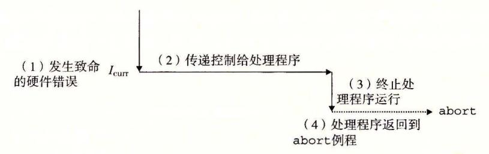

8-8 止处理 。终止处理程序将控制传递给一个内 abo 江例程,该例程会终止这个应用程序

| 异常号   | 描述        | 异常类   |
|-------|-----------|-------|
|       | 除法错误      | 故障    |
| 13    | 一般保护故障    | 故障    |
| 14    | 缺页        | 故障    |
| 18    | 机器检查      | 终止    |
| 32255 | 操作系统定义的异常 | 中断或陷阱 |

8-9 x86-64 系统中的异常示例

### 1. Linux/x86-64 故障和终止

除法错误。当应用试图除以零时,或者当一个除法指令的结果对千目标操作数来说太 大了的时候,就会发生除法错误(异常 0) Unix 会试图 从除法错误中恢 ,而 是选择终 程序。 Linux shell 常会把除 法错误 报告为"浮点异常 Floating exception)"

一般保护故障。许多原因都会导致不为人知的一般保护故障(异常 13) ,通常是因为一 个程序引用了一个未定义的虚拟内存区域,或者因为程序试图写一个只读的文本段, Linux 不会尝试恢复这 类故障。 Lin ux shell 通常会把这种一般保护故障报告为"段故障 (Segmentation fault)"

缺页(异常 14) 是会重新执行产生故障的指令的一个异常示例。处理程序将适当的磁盘 上虚拟内存的一个页面映射到物理内存的一个页面,然后重新执行这条产生故障的指令。 我们将在第 章中看到缺页是如何工作的细节。

机器检查。机器检查(异常 18) 是在导致故障的指令执行中检测到致命的硬件错误时发 生的。 机器检查处理程 返回控制给应用程序

#### 2. Linux/86-64 系统调用

Linux 提供几百种系统调用,当应用程序想要请 内核服务时可以使用,包括读文 件、写文件或是创建一个新进程。图 8-10 给出了一些常见的 Linux 系统调用。每个系统 调用都有一个唯一的整数号,对应于一个到内核中跳转表的偏移量。(注意:这个跳转表 和异常表不一样。)

程序 syscall 函数可以 直接调用任何系统调用 。然而,实际中儿乎没必要这么做 于大多数系统调用,标 库提供了 组方便的包装函数。这些包装函数将参数打包到一起, 以适当的系统调用指令陷入内核,然后将系统调用的返回状态传递回调用程序。在本书中,我 将系统调用 和与它们相关联 的包装函数都称为系统级函 ,这两个术语可以互换地使用

x86 -64 系统上,系统调 用是通 过一条称为 syscall 的陷阱指令来提供的 研究程 序能够如何使用这条指令来直接调用 Linux 系统调用是很有趣的 所有到 Linux 系统调用 的参数都是通过通用寄存器而不是栈传递的。按照惯例,寄存器% rax 包含系统调用号, 寄存器%rdi %rsi %rdx %rlO r8 和% r9 包含最多 个参数 第一个参数在% 中中,第 二个在%rsi 中,以此类推 从系统调用返回时, 寄存器%rcx rll 都会被破坏, rax

发送信号到一个进程

| 编号 | 名字    | 描述        | 编号 | 名字     | 描述         |
|----|-------|-----------|----|--------|------------|
| 0  | read  | 读文件       | 33 | pause  | 挂起进程直到信号到达 |
| 1  | write | 写文件       | 37 | alarm  | 调度告警信号的传送  |
| 2  | open  | 打开文件      | 39 | getpid | 获得进程 ID    |
| 3  | close | 关闭文件      | 57 | fork   | 创建进程       |
| 4  | stat  | 获得文件信息    | 59 | execve | 执行一个程序     |
| 9  | mmap  | 将内存页映射到文件 | 60 | _exit  | 终止进程       |
| 12 | brk   | 重置堆顶      | 61 | wait4  | 等待一个进程终止   |
|    |       |           |    |        |            |

含返回值。-4095 到-1 之间的负数返回值表明发生了错误,对应于负的 errno。

图 8-10 Linux x86-64 系统中常用的系统调用示例

复制文件描述符 62 kill

例如,考虑大家熟悉的 hello 程序的下面这个版本,用系统级函数 write(见 10.4 节)来写,而不是用 printf:

```
1  int main()
2  {
3     write(1, "hello, world\n", 13);
4     _exit(0);
5  }
```

32

write 函数的第一个参数将输出发送到 stdout。第二个参数是要写的字节序列,而第三个参数是要写的字节数。

图 8-11 给出的是 hello 程序的汇编语言版本,直接使用 syscall 指令来调用 write 和 exit 系统调用。第 9~13 行调用 write 函数。首先,第 9 行将系统调用 write 的编号存放在%rax 中,第 10~12 行设置参数列表。然后第 13 行使用 syscall 指令来调用系统调用。类似地,第 14~16 行调用 exit 系统调用。

```
- code/ecf/hello-asm64.sa
1
     .section .data
 2
     string:
 3
        .ascii "hello, world\n"
     string_end:
 4
        .equ len, string_end - string
 5
     .section .text
 6
 7
     .globl main
 8
     main:
       First, call write(1, "hello, world\n", 13)
 9
       movq $1, %rax
                                 write is system call 1
       movq $1, %rdi
10
                                 Arg1: stdout has descriptor 1
       movq $string, %rsi
                                 Arg2: hello world string
11
       movq $len, %rdx
12
                                 Arg3: string length
13
       syscall
                                 Make the system call
       Next, call _exit(0)
       movq $60, %rax
14
                                 _exit is system call 60
       movq $0, %rdi
15
                                 Arg1: exit status is 0
16
       syscall
                                 Make the system call
                                                         - code/ecf/hello-asm64.sa
```

图 8-11 直接用 Linux 系统调用来实现 hello 程序

## 关千术语的注释

各种异常类型的术语根据系统的不同而有所不同。处理器 ISA 规范通常会区分异步 "中断"和同步"异常",但是并没有提供描述这些非常相似的概念的概括性的术语 了避免不断地提到"异常和中断"以及"异常或者中断",我们用单词"异常"作为通 用的术语,而且只有在必要时才区别异步异常(中断)和同步异常(陷阱、故障和终止 )。 正如我们提到过的,对于每个系统而言,基本的概念都是相同的,但是你应该意识到一 些制造厂商的手册会用"异常"仅仅表示同步事件引起的控制流的改变

## 8. 2 进程

异常是允许操作系统内核提供进程 (process) 概念的基本构造块,进程是计算机科学中 最深刻、最成功的概念之一

在现代系统上运行 个程序时,我们会得到一个假象,就好像我们的程序是系统中当 前运行的唯一的程序一样 我们的程序好像是独占地使用处理器和内存。处理器就好像是 无间断地一条接一条地执行我们程序中的指令。最后,我们程序中的代码和数据好像是系 统内存中唯 的对象。这些假象都是通过进程的概念提供给我们的。

进程的经典定义就是一个执行中程序的实例。系统中的每个程序都运行在某个进程的 上下文 (context) 中。上下文是由程序正确运行所需的状态组成的。这个状态包括存放在内 存中的程序的代码和数据,它的栈、通用目的寄存器的内容、程序计数器、环境变量以及 打开文件描述符的集合

每次用户通过向 shell 输入 个可执行目标文件的名字,运行程序时, shell 就会创建 一个新的进程,然后在这个新进程的上下文中运行这个可执行目标文件。应用程序也能够 创建新进程,并且在这个新进程的上下文中运行它们自己的代码或其他应用程序。

关于操作系统如何实现进程的细节的讨论超出了本书的范围。反之,我们将关注进程 提供给应用程序的关键抽象:

- ·一个独立的逻辑控制流,它提供一个假象,好像我们的程序独占地使用处理器。
- ·一个私有的地址空间,它提供一个假象,好像我们的程序独占地使用内存系统。 让我们更深入地看看这些抽象。

#### 8. 2. 1 逻辑控制流

即使在系统中通常有许多其他程序在运行,进程也可以向每个程序提供一种假象,好 像它在独占地使用处理器 如果想用调试器单步执行程序,我们会看到一系列的程序计数

时间

(PC) 的值,这些值唯 地对应于包含 进程 进程 进程 在程序的可执行目标文件中的指令,或 是包含在运行时动态链接到程序的共享 对象中的指令。这个 PC 值的序列叫做逻 辑控制流,或者简称逻辑流。

考虑 个运行着 个进程的系统, 如图 8-12 所示 处理器的 个物理控制 流被分成了 个逻辑流,每个进程 个。 每个竖直的条表示 个进程的逻辑流的 一部分。在这个例子中,三个逻辑流的

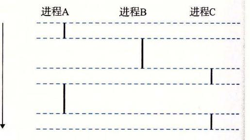

8-12 逻辑控制流。进程为每个程序提供了一种假象, 好像程序在独占地使用处理器 每个竖直的条 表示一个进程的逻辑控制流的一部分 j

执行是交错的 进程 运行了一会儿,然后是进程 开始运行到完成。然后,进程 行了一会儿,进程 接着运行 到完成 。最后,进程 可以运行到结束了。

8-12 的关键点在于进程是轮流使用处理器的。每个进程执行它的流的一部分,然 后被抢占 (pre mpted) (暂时挂起),然后轮到其他进程。对于一个运行在这些进程之一的 上下文中的程序,它看上去就像是在独占地使用处理器。唯一的反面例证是,如果我们精 确地测 扯每条指令使用的时间,会发现在程序中一些指令的执行之间, CPU 好像会周期 性地停顿 而,每次处理器 顿,它随后 继续执行我们的程序,并不改变程序内存位 置或寄存器的内容

### 8. 2 . 2 并发流

机系统中逻辑流有许多不同的形式。异常处理程序、进程、信号处理程序、 线程 Java 程都是 逻辑流的例子

一个逻辑流的执行在时间上与另一个流重叠,称为并发流 (concurrent flow) ,这两个 流被称为并发地运行。更准确地说,流 互相并发,当且仅当 开始之后和 结束之前开始,或者 开始之后和 结束之前开始 例如,图 8-12 中,进程 并发地运行, 也一样。另一方面, 没有并发地运行,因为 的最后一条指令 的第一条指 之前执行

多个流并发地执行的一般现象被称为并发 (concurrency) 个进程和其他进程轮流运 行的概念称为多任务 (multitasking) 一个进程执行它的控制流的一部分的每一时间段叫 做时间片 (tim slice) 。因此,多任务也叫做时间分片 (time slicing) 。例如,图 8-12 中,进 的流由两个时间片组成。

注意, 并发 流的思想与流运行的处理器核数或者计算机数无关 如果两个流在时间上 重叠,那么它们就是并发的,即使它们是运行在同一个处理器上 。不 过,有时我们会发现 确认并行流是很有 帮助的,它 是并发流 的一个真子集 如果两个流并发 地运行在不同的处 理器核或者计算机上,那么我们称它们为并行流 (parall flo w) ,它们并行地运行 (running in parallel) ,且并行地执行 (parallel execution)

练习题 1 考虑三个具有下述起 始和结束时间的进程

| 起始时间 | 结束时间 |
|------|------|
|      | 2    |
| I    | 4    |
| 3    | 5    |

对于每对进程,指出它们是否是并发地运行:

| 进程对 | 并发的? |
|-----|------|
| AB  |      |
| AC  |      |
| BC  |      |

#### 8. 2. 3 私有地址空间

进程也为每个程序提供一种假象,好像它独占地使用系统地址空间。在一台 位地址 的机器上,地址空间是 2n 个可能地址的集合, o, 1,..., 2" 进程为每个程序提供它 自己的私有地址空间。一般而 ,和这个 间中某个地址相关联的那个内存字节是不能被 其他进程读或者写的,从这个意义上说,这个地址空间是私有的。

尽管和每个私有地址空间相关联的内存的内容一般是不同的,但是每个这样的空间都有相同的通用结构。比如,图 8-13 展示了一个 x86-64 Linux 进程的地址空间的组织结构。

地址空间底部是保留给用户程序的,包括通常的代码、数据、堆和栈段。代码段总是 从地址 0x400000 开始。地址空间顶部保留给内核(操作系统常驻内存的部分)。地址空间 的这个部分包含内核在代表进程执行指令时(比如当应用程序执行系统调用时)使用的代 码、数据和栈。

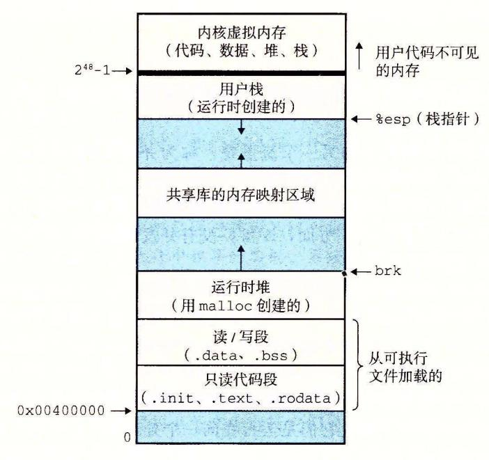

图 8-13 进程地址空间

### 8.2.4 用户模式和内核模式

为了使操作系统内核提供一个无懈可击的进程抽象,处理器必须提供一种机制,限制一个应用可以执行的指令以及它可以访问的地址空间范围。

处理器通常是用某个控制寄存器中的一个模式位(mode bit)来提供这种功能的,该寄存器描述了进程当前享有的特权。当设置了模式位时,进程就运行在内核模式中(有时叫做超级用户模式)。一个运行在内核模式的进程可以执行指令集中的任何指令,并且可以访问系统中的任何内存位置。

没有设置模式位时,进程就运行在用户模式中。用户模式中的进程不允许执行特权指令 (privileged instruction),比如停止处理器、改变模式位,或者发起一个 I/O 操作。也不允许用户模式中的进程直接引用地址空间中内核区内的代码和数据。任何这样的尝试都会导致致命的保护故障。反之,用户程序必须通过系统调用接口间接地访问内核代码和数据。

运行应用程序代码的进程初始时是在用户模式中的。进程从用户模式变为内核模式的唯一方法是通过诸如中断、故障或者陷入系统调用这样的异常。当异常发生时,控制传递到异常处理程序,处理器将模式从用户模式变为内核模式。处理程序运行在内核模式中,当它返回到应用程序代码时,处理器就把模式从内核模式改回到用户模式。

Linux 提供了一种聪明的机制,叫做/proc 文件系统,它允许用户模式进程访问内核数

据结构的内容 。/proc 文件系统将许多内核数据结构的内容输出为 个用户程序可以读的文 本文件的层次结构。比如,你可以使用 proc 文件系统找出一般的系统属性,比如 CPU 类型 (/proc/ cpuinfo) ,或者某个特殊的进程使用的内存段 (/proc/ process-id> /maps) 2.6 版本的 Linux 内核引入/ sys 文件系统,它输出关千系统总线和设备的额外的低层信息。

### 8. 2. 5 上下文切换

操作系统内核使用一种称为上下文切换 (context switch) 的较高层形式的异常控制流来实 现多任务。上下文切换机制是建立在 8. 节中已经讨论过的那些较低层异常机制之上的

内核为每个进程维持 个上下文 (context) 。上下文就是内核重新启动一个被抢占的进 程所需的状态。它由一些对象的值组成,这些对象包括通用目的寄存器、浮点寄存器、程 序计数器、用户栈、状态寄存器、内核栈和各种内核数据结构,比如描述地址空间的页 表、包含有关当前进程信息的进程表,以及包含进程已打开文件的信息的文件表。

在进程执行的某些时刻,内核可以决定抢占当前进程,并重新开始一个先前被抢占了 的进程。这种决策就叫做调度 (scheduling) ,是由内核中称为调度器 (scheduler) 的代码处 理的。当内核选择 个新的进程运行时,我们说内核调度了这个进程。在内核调度了一个 新的进程运行后,它就抢占当前进程,并使用一种称为上下文切换的机制来将控制转移到 新的进程,上下文切换 1) 保存当前进程的上下文, )恢复某个先前被抢占的进程被保存的 上下文, )将控制传递给这个新恢复的进程

当内核代表用户执行系统调用时,可能会发生上下文切换。如果系统调用因为等待某 个事件发生而阻塞,那么内核可以让当前进程休眠,切换到另一个进程。比如,如果 read 系统调用 要访问磁盘,内核可以选择执行上下文切换,运行另外一个进程,而不 是等待数据从磁盘到达。另一个示例是 sleep 系统调用,它显式地请求让调用进程休眠。 一般而言,即使系统调用没有阻塞,内核也可以决定执行上下文切换,而不是将控制返回 给调用进程。

中断也可能引发上下文切换。比如,所有的系统都有某种产 周期性定时器中断的机 制,通常为每 毫秒或每 <sup>10</sup> 毫秒 每次发 定时器中断时,内核就能判定当前进程已经 运行了足够长的时间,并切换到一个新的进程

8-14 展示了一对进程 之间上下文切换的示例。 这个例子中,进程 初始 运行在用户模式中,直到它通过执行系统调用 read 陷入到内核 内核中的陷阱处理程序 请求来自磁盘控制器的 DMA 传输,并且安排在磁盘控制器完成从磁盘到内存的数据传输 后,磁盘中断处理器。

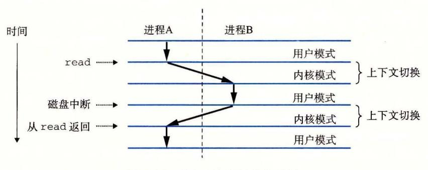

8- <sup>14</sup> 进程上下文切换的剖析

磁盘取数据要用一段相对较长的时间(数量级为几十毫秒),所以内核执行从进程A到进程B的上下文切换,而不是在这个间歇时间内等待,什么都不做。注意在切换之前,内核正代表进程A在用户模式下执行指令(即没有单独的内核进程)。在切换的第一部分中,内核代表进程A在内核模式下执行指令。然后在某一时刻,它开始代表进程B(仍然是内核模式下)执行指令。在切换之后,内核代表进程B在用户模式下执行指令。

随后,进程 B 在用户模式下运行一会儿,直到磁盘发出一个中断信号,表示数据已经从磁盘传送到了内存。内核判定进程 B 已经运行了足够长的时间,就执行一个从进程 B 到 进程 A 的上下文切换,将控制返回给进程 A 中紧随在系统调用 read 之后的那条指令。进程 A 继续运行,直到下一次异常发生,依此类推。

#### 8.3 系统调用错误处理

当 Unix 系统级函数遇到错误时,它们通常会返回一1,并设置全局整数变量 errno 来表示什么出错了。程序员应该总是检查错误,但是不幸的是,许多人都忽略了错误检查,因为它使代码变得臃肿,而且难以读懂。比如,下面是我们调用 Unix fork 函数时会如何检查错误:

```
if ((pid = fork()) < 0) {
    fprintf(stderr, "fork error: %s\n", strerror(errno));
    exit(0);
}</pre>
```

strerror 函数返回一个文本串,描述了和某个 errno 值相关联的错误。通过定义下面的错误报告函数,我们能够在某种程度上简化这个代码:

```
void unix_error(char *msg) /* Unix-style error */

fprintf(stderr, "%s: %s\n", msg, strerror(errno));\nexit(0);
}
```

给定这个函数, 我们对 fork 的调用从 4 行缩减到 2 行:

```
if ((pid = fork()) < 0)\nunix_error("fork error");</pre>
```

通过使用错误处理包装函数,我们可以更进一步地简化代码,Stevens 在[110]中首先提出了这种方法。对于一个给定的基本函数 foo,我们定义一个具有相同参数的包装函数 Foo,但是第一个字母大写了。包装函数调用基本函数,检查错误,如果有任何问题就终止。比如,下面是 fork 函数的错误处理包装函数:

```
pid_t Fork(void)

pid_t pid;

pid_t pid;
\nif ((pid = fork()) < 0)
```

给定这个包装函数,我们对 fork 的调用就缩减为1行:

#### pid = Fork() ;

我们将在本书剩余的部分中都使用错误处理包装函数。它们能够保持代码示例简洁,而 又不 给你错误的假象,认为允许忽略错误检查。注意,当在本书中谈到系统级函数时,我 们总是用它们的小写字母的基本名字来引用它们,而不是用它们大写的包装函数名来引用

Unix 错误处理以及本书中使用的错误处理包装函数的讨论,请参见附录 装函数定义在一个叫做 csapp.c 的文件中,它们的原型定义在一个叫做 csapp.h 的头文 件中;可以从 CS:APP 网站上在线地 到这些代码

## 8. 4 进程控制

Unix 提供了大量从 程序中操作进程的系统调用。这一节将描述这些重要的函数, 并举例说明如何使用它们。

### 8. 4. 1 获取进程 ID

每个进程都有一个唯一的正数(非 )进程 ID(PID) getp过函数返回调用进程的 PID getppid 函数返回它的父进程的 PID(创建调用进程的进程)。

```
#include <sys/types.h> 
#include <unistd.h> 
pid_t getpid(void); 
pid_t getppid(void);
```

返回:调用者或其父进程的 PIO

getpid getppid 函数返回一个类型为 pid 的整数值,在 Linux 系统上它在 types.h 中被定义为 int

#### 8. 4,·2 创建和终止进程

从程序员的角度,我们可以认为进程总是处于下面 种状态之一:

- ·运行。进程要么在 CPU 上执行,要么在等待被执行且最终会被内核调度。
- ·停止。进程的执行被挂起 (susp nded) ,且不会被调度。当收到 SIGSTOP SIGT-STP SIGTTIN 或者 SIGTTOU 信号时,进程就停止, 且保持停止直到它收到 SIGCONT 信号,在这个时刻,进程再次开始运行。(信号是一种软件中断的 形式,将在 8. 节中详细描述 。)
- ·终止 进程永远地停止了 进程会因为三种原因终止: )收到一个信号,该信 默认行为是终止进程, )从主程序返回, )调用 exit 函数。

```
#include <stdlib.h> 
void exit(int status);
```

该函数不返回

exit 函数以 status 退出状态来终止进程(另一种设置退出状态的方法是从主程 返回一个整数值)。

父进程通过调用 fork 函数创 一个新的运行的子进程

```
#include <sys/types.h>
#include <unistd.h>
pid_t fork(void);

返回: 子进程返回 0, 父进程返回子进程的 PID, 如果出错,则为一1。
```

新创建的子进程几乎但不完全与父进程相同。子进程得到与父进程用户级虚拟地址空间相同的(但是独立的)一份副本,包括代码和数据段、堆、共享库以及用户栈。子进程还获得与父进程任何打开文件描述符相同的副本,这就意味着当父进程调用 fork 时,子进程可以读写父进程中打开的任何文件。父进程和新创建的子进程之间最大的区别在于它们有不同的 PID。

fork 函数是有趣的(也常常令人迷惑),因为它只被调用一次,却会返回两次:一次是在调用进程(父进程)中,一次是在新创建的子进程中。在父进程中,fork 返回子进程的 PID。在子进程中,fork 返回 0。因为子进程的 PID 总是为非零,返回值就提供一个明确的方法来分辨程序是在父进程还是在子进程中执行。

图 8-15 展示了一个使用 fork 创建子进程的父进程的示例。当 fork 调用在第 6 行返回时,在父进程和子进程中 x 的值都为 1。子进程在第 8 行加一并输出它的 x 的副本。相似地,父进程在第 13 行减一并输出它的 x 的副本。

```
code/ecf/fork.c
1
     int main()
     {
 2
         pid_t pid;
3
         int x = 1;
 4
 5
         pid = Fork();
 6
         if (pid == 0) { /* Child */
              printf("child: x=%d\n", ++x);
 8
 9
              exit(0);
         7
10
11
         /* Parent */
12
         printf("parent: x=%d\n", --x);
13
14
         exit(0);
     }
15
                                                               code/ecf/fork.c
```

图 8-15 使用 fork 创建一个新进程

当在 Unix 系统上运行这个程序时, 我们得到下面的结果:

linux> ./fork
parent: x=0
child : x=2

这个简单的例子有一些微妙的方面。

- 调用一次,返回两次。 fork 函数被父进程调用一次,但是却返回两次——一次是返回到父进程,一次是返回到新创建的子进程。对于只创建一个子进程的程序来说,这还是相当简单直接的。但是具有多个 fork 实例的程序可能就会令人迷惑,需要仔细地推敲了。
- 并发执行。父进程和子进程是并发运行的独立进程。内核能够以任意方式交替执行 它们的逻辑控制流中的指令。在我们的系统上运行这个程序时,父进程先完成它的 printf语句,然后是子进程。然而,在另一个系统上可能正好相反。一般而言,