作为程序员,我们决不能对不同进程中指令的交替执行做任何假设。

- ·相同但是独立的地址空间。如果能够在 fork 函数在父进程和子进程中返回后立即 暂停这两个进程,我们会看到两个进程的地址空间都是相同的。每个进程有相同的 用户栈、相同的本地变最值、相同的堆、相同的全局变鼠值,以及相同的代码。因 此,在我们的示例程序中,当 fork 函数在第 行返回时,本地变量 在父进程和 子进程中都为 。然而,因为父进程和子进程是独立的进程,它们都有自己的私有 地址空间。后面,父进程和子进程对 所做的任何改变都是独立的,不会反映在另 一个进程的内存中。这就是为什么当父进程和子进程调用它们各自的 print£ 语句 时,它们中的变量 会有不同的值。
- ·共享文件。当运行这个示例程序时,我们注意到父进程和子进程都把它们的输出显 示在屏幕上。原因是子进程继承了父进程所有的打开文件。当父进程调用 fork 时, stdout 文件是打开的,并指向屏幕。子进程继承了这个文件,因此它的输出也是 指向屏幕的。

如果你是第一次学习 fork 函数,画进程图通常会有所帮助,进程图是刻画程序语旬的 偏序的一种简单的前趋图。每个顶点 对应于一条程序语句的执行 有向边 a-.b 表示语句 发生在语句 之前。边上可以标记出一些信息,例如一个变星的当前值 对应于 print£ 句的顶点可以标记上 print£ 的输出。每张图从一个顶点开始,对应千调用 main 的父进程。 这个顶点没有入边,并且只有一个出边。每个进程的顶点序列结束千一个对应于 exit 调用 的顶点。这个顶点只有一条入边,没有出边。 chi l d: x=2

例如,图 8-16 展示了图 8-15 中示例程序 的进程图。初始时,父进程将变量 设置为 。父进程调用 fork, 创建一个子进程,它 在自己的私有地址空间中与父进程并发执行。

X==l prin parent: x=O 子进程 exi main fork prin exi 父进程

<sup>16</sup> <sup>15</sup> 中示例程序的进程图

对千运行在单处理器上的程序,对应进

程图中所有顶点的拓扑排序 (topological sort) 表示程序中语句的一个可行的全序排列。下 面是一个理解拓扑排序概念的简单方法:给定进程图中顶点的一个排列,把顶点序列从左 到右写成一行,然后画出每条有向边。排列是一个拓扑排序,当且仅当画出的每条边的方 向都是从左往右的。因此,在图 8-15 的示例程序中,父进程和子进程的 print£ 语旬可以 以任意先后顺序执行,因为每种顺序都对应千图顶点的某种拓扑排序

进程图特别有助千理解带有嵌套 fork 调用的程序。例如,图 8-17 中的程序源码中两 次调用了 fork 。对应的进程图可帮助我们看清这个程序运行了四个进程,每个都调用了 一次 print£, 这些 print£ 可以以任意顺序执行。

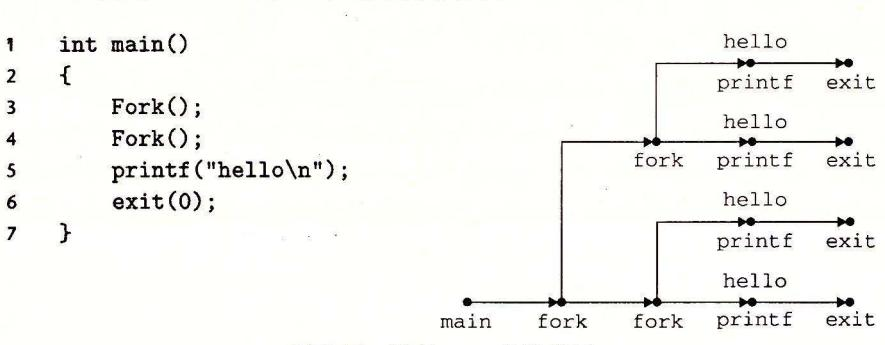

嵌套 fork 的进程图

## 练习题 2 考虑下面的程序:

```
code/ecf/forkprobO.c 
123456789 int main() 
    { 
         int X = 1; 
         if (Fork() == 0) 
             printf("p1: x=%d\n", ++x); 
        printf("p2: x=%d\n", --x); 
    exit(O); } 
                                                             code/ecf/forkprobO.c
```

- A. 子进程的输出是什么?
- B. 父进程的输出是什么?

## 8. 4. 3 回收子进程

当一个进程由于某种原因终止时,内核并不是立即把它从系统中清除。相反,进程被 保持在一种已终止的状态中,直到被它的父进程回收 (reaped) 。当父进程回收己终止的子 进程时,内核将子进程的退出状态传递给父进程,然后抛弃己终止的进程,从此时开始, 该进程就不存在了。一个终止了但还未被回收的进程称为僵死进程 (zombie)

## 为什么已终止的子进程被称为僵死进程?

在民间传说中,僵尸是活着的尸体,一种半生半死的实体。僵死进程已经终止了, 而内核仍保留着它的某些状态直到父进程回收它为止,从这个意义上说它们是类似的。

如果一个父进程终止了,内核会安排 init 进程成为它的孤儿进程的养父。 init 进程 PID ,是在系统启动时由内核创建的,它不会终止,是所有进程的祖先。如果父进 程没有回收它的僵死子进程就终止了,那么内核会安排 init 进程去回收它们。不过,长 时间运行的程序,比如 shell 或者服务器,总是应该回收它们的僵死子进程。即使僵死子 进程没有运行,它们仍然消耗系统的内存资源。

一个进程可以通过调用 waitpid 函数来等待它的子进程终止或者停止。

```
#include <sys/types.h> 
#include <sys/wait.h> 
pid_t waitpid(pid_t pid, int *statusp, int options); 
              返回:如果成功,则为子进程的 PIO, 如果 WNOHANG, 则为 o, 如果其他错误,则为— l.
```

waitp 沁函数有点复杂。默认情况下(当 op ons=O 时), waitpid 挂起调用进程的 执行,直到它的等待集合 (wait set) 中的一个子进程终止。如果等待集合中的一个进程在 刚调用的时刻就已经终止了,那么 waitpid 就立即返回。在这两种情况中, waitpid 回导致 waitpid 返回的已终止子进程的 PID 。此时,已终止的子进程巳经被回收,内核会 从系统中删除掉它的所有痕迹。

### 1. 判定等待集合的成员

等待集合的成员是由参数 pid 来确定的:

- ·如果 过>0, 那么等待集合就是一个单独的子进程,它的进程 ID 等于 pid
- ·如果 pid= -1, 那么等待集合就是由父进程所有的子进程组成的。

waitp迈函数还支持其他类型的等待集合,包括 Unix 进程组,对此我们将不做讨论。

### 修改默认行为

可以通过将 op ions 设置为常晕 WNOHANG WUNTRACED WCONTINUED 的各种组合来修改默认行为:

- WNOHANG: 如果等待集合中的任何子进程都还没有终止,那么就立即返回(返回 值为 0) 。默认的行为是挂起调用进程,直到有子进程终止。在等待子进程终止的同 时,如果还想做些有用的丁作,这个选项会有用。
- WUNTRACED: 挂起调用进程的执行,直到等待集合中的一个进程变成巳终止或者 被停止。返回的 PID 为导致返回的巳终止或被停止子进程的 PID 默认的行为是只返 回己终止的子进程。当你想要检查己终止和被停止的子进程时,这个选项会有用。
- WCONTINUED: 挂起调用进程的执行,直到等待集合中 个正在运行的进程终止 或等待集合中一个被停止的进程收到 SIGCONT 信号重新开始执行。 (8. 节会解释 这些信号

可以用或运算把这些选项组合起来 例如:

• WNOHANG I WUNTRACED: 立即返回,如果等待集合中的子进程都没有被停 止或终止,则返回值为 0; 如果有一个停止或终止,则返回值为该子进程的 PID

### 3. 检查己回收子进程的退出状态

如果 statusp 参数是非空的,那么 waitpid 就会在 status 中放上关千导致返回的 子进程的状态信息, status statusp 指向的值 wa 江. 头文件定义了解释 status 数的几个宏:

- WIFEXITED(status) :如果子进程通过调用 exit 或者一个返回 (return) 正常终 止,就返回真。
- WEXITSTATUS (status) :返回一个正常终止的子进程的退出状态。只有在 WIFEXITED( )返回为真时,才会定义这个状态。
- WIFSIGNALED(status) :如果子进程是因为一个未被捕获的信号终止的,那么 就返回真。
- WTERMSIG (status) :返回导致子进程终止的信号的编号。只有在 WIFSIG-NALED( )返回为真时,才定义这个状态。
- WIFSTOPPED(status) :如果引起返回的子进程当前是停止的,那么就返回真。
- WSTOPSIGC sta us) :返回引起子进程停止的信号的编号。只有在 WIFSTOPPEDC) 返回为真时,才定义这个状态。
- WIFCONTINUED(s us) :如果子进程收到 SIGCONT 信号重新启动,则返回真。

#### 错误条件

如果调用进程没有子进程,那么 waitpid 返回— ,并且设置 errno ECHILD 。如 waitp 迈函数被一个信号中断,那么它返回— 1, 并设置 errno EINTR

## 日日 Unix 函数相关的常量

WNOHANG WUNTRACED 这样的常量是由系统头文件定义的 例如, WNO-HANG WUNTRACED 是由 wait.h 头文件(间接)定义的:

```
/* Bits in the third argument to 'waitpid'. */
               1 /* Don't block waiting. */
#define WNOHANG
#define WUNTRACED 2 /* Report status of stopped children. */
```

为了使用这些常量。必须在代码中包含 wait h 头文件。

#include <svs/wait.h>

每个 Unix 函数的 man 页列出了无论何时你在代码中使用那个函数都要包含的头文件。 同时,为了检查诸如 ECHILD 和 EINTR 之类的返回代码, 你必须包含 errno.h. 为了 简化代码示例,我们包含了一个称为 csapp.h 的头文件,它包括了本书中使用的所有 函数的头文件。csapp.h 头文件可以从 CS: APP 网站在线获得。

### 练习题 8.3 列出下面程序所有可能的输出序列:

```
- code/ecf/waitprob0.c
     int main()
2
         if (Fork() == 0) {
              printf("a"); fflush(stdout);
5
         }
         else f
7
              printf("b"): fflush(stdout):
              waitpid(-1, NULL, 0);
Q
10
         printf("c"); fflush(stdout);
         exit(0):
11
     7
12
                                                          - code/ecf/waitprob0.c
```

#### 5. wait 函数

wait 函数是 waitpid 函数的简单版本:

```
#include <sys/types.h>
#include <sys/wait.h>
pid_t wait(int *statusp);
                                  返回:如果成功,则为子进程的PID,如果出错,则为-1。
```

调用 wait(&status)等价于调用 waitpid(- 1, &status, 0)。

#### 6. 使用 waitpid 的示例

因为 waitpid 函数有些复杂,看几个例子会有所帮助。图 8-18 展示了一个程序,它 使用 waitpid,不按照特定的顺序等待它的所有 N 个子进程终止。在第 11 行,父进程创 建 N 个子进程, 在第 12 行, 每个子进程以一个唯一的退出状态退出。在我们继续讲解之 前,请确认你已经理解为什么每个子进程会执行第12行,而父进程不会。

在第 15 行,父进程用 waitpid 作为 while 循环的测试条件,等待它所有的子进程终 止。因为第一个参数是一1, 所以对 waitpid 的调用会阻塞, 直到任意一个子进程终止。 在每个子进程终止时,对 waitpid 的调用会返回,返回值为该子进程的非零的 PID。第 16 行检查子进程的退出状态。如果子进程是正常终止的——在此是以调用 exit 函数终止 的——那么父进程就提取出退出状态,把它输出到 stdout 上。

```
code/ecf/waitpid1.c
     #include "csapp.h"
     #define N 2
3
    int main()
5
     {
         int status, i;
         pid_t pid;
7
8
         /* Parent creates N children */
         for (i = 0: i < N: i++)
10
             if ((pid = Fork()) == 0) /* Child */
11
                 exit(100+i):
12
         /* Parent reaps N children in no particular order */
15
         while ((pid = waitpid(-1, &status, 0)) > 0) {
             if (WIFEXITED(status))
16
                 printf("child %d terminated normally with exit status=%d\n",
17
                         pid, WEXITSTATUS(status));
18
             else
19
                 printf("child %d terminated abnormally\n", pid);
20
         7
21
22
         /* The only normal termination is if there are no more children */
23
         if (errno != ECHILD)
24
             unix_error("waitpid error");
25
26
         exit(0);
27
    7
28
```

- code/ecf/waitpid1.c

图 8-18 使用 waitpid 函数不按照特定的顺序回收僵死子进程

当回收了所有的子进程之后,再调用 waitpid 就返回一1,并且设置 errno 为 ECHILD。第24行检查 waitpid 函数是正常终止的,否则就输出一个错误消息。在我们的 Linux 系统上运行这个程序时,它产生如下输出:

```
linux> ./waitpid1
child 22966 terminated normally with exit status=100
child 22967 terminated normally with exit status=101
```

注意,程序不会按照特定的顺序回收子进程。子进程回收的顺序是这台特定的计算机系统的属性。在另一个系统上,甚至在同一个系统上再执行一次,两个子进程都可能以相反的顺序被回收。这是非确定性行为的一个示例,这种非确定性行为使得对并发进行推理非常困难。两种可能的结果都同样是正确的,作为一个程序员,你绝不可以假设总是会出现某一个结果,无论多么不可能出现另一个结果。唯一正确的假设是每一个可能的结果都同样可能出现。

图 8-19 展示了一个简单的改变,它消除了这种不确定性,按照父进程创建子进程的相同顺序来回收这些子进程。在第 11 行中,父进程按照顺序存储了它的子进程的 PID,然后通过用适当的 PID 作为第一个参数来调用 waitpid,按照同样的顺序来等待每个子进程。

```
code/ecf/waitpid2.c
     #include "csapp.h"
1
     #define N 2
 2
 3
 4
     int main()
 5
         int status, i;
 6
 7
         pid_t pid[N], retpid;
8
9
         /* Parent creates N children */
         for (i = 0; i < N; i++)
10
              if ((pid[i] = Fork()) == 0) /* Child */
11
                  exit(100+i);
12
13
         /* Parent reaps N children in order */
14
15
         while ((retpid = waitpid(pid[i++], &status, 0)) > 0) {
16
              if (WIFEXITED(status))
17
                  printf("child %d terminated normally with exit status=%d\n",
19
                         retpid, WEXITSTATUS(status));
20
              else
                  printf("child %d terminated abnormally\n", retpid);
21
         }
22
23
         /* The only normal termination is if there are no more children */
24
         if (errno != ECHILD)
25
             unix_error("waitpid error");
26
27
         exit(0):
28
29
     }
                                                                         code/ecf/waitpid2.c
```

图 8-19 使用 waitpid按照创建子进程的顺序来回收这些僵死子进程

### 练习题 8.4 考虑下面的程序:

```
code/ecf/waitprob1.c
     int main()
 1
 2
     {
 3
          int status;
 4
         pid_t pid;
 5
         printf("Hello\n");
 6
         pid = Fork();
 7
         printf("%d\n", !pid);
 8
 9
          if (pid != 0) {
              if (waitpid(-1, \&status, 0) > 0) {
10
                  if (WIFEXITED(status) != 0)
11
                      printf("%d\n", WEXITSTATUS(status));
12
13
         7
14
         printf("Bye\n");
15
         exit(2);
16
     }
17
                                                          code/ecf/waitprob1..
```

- A. 这个程序会产生多少输出行?
- B. 这些输出行的一种可能的顺序是什么?

## 8. 4. 4 让进程休眠

sleep 函数将一个进程挂起一段指定的时间。

#include <unistd.h>

unsigned int sleep(unsigned int secs);

返回 还要休眠的秒数

如果请求的时间量已经到了, sleep 返回 o, 否则返回还剩下的要休眠的秒数 后一 种情况是可能的,如果因为 sleep 函数被 个信号中断而过早地返回 。我 们将在 8. 节中 详细讨论信号。

我们会发现另一个很有用的函数是 pause 函数,该函数让调用函数休眠,直到该进程 收到一个信号

#include <unistd.h>

int pause(void);

总是返回

练习题 5 编写一个 sleep 的包装函数,叫做 snooze, 带有下面的接口:

unsigned int snooze(unsigned int secs);

snooze 函数和 sleep 函数的行为完全一样,除了它会打印出一条消息来描述进程实 际休眠了多长时间:

~lept for 4 of 5 secs.

### 8. 4. 5 加载并运行程序

execve 函数在当前进程的上下文中加载并运行一个新程序。

#include <unistd.h>

int execve(const char \*filename, const char \*argv[], const char \*envp[]);

如果成功,则不返回,如果错误,则返回一

execve 函数加载并运行可执行目标文件 filename, 且带参数列表 argv 和环境变量 列表 envp 。只有当出现错误时,例如找不到 filename, execve 才会返回到调用程序。 所以,与 fork 一次调用返回两次不同, execve 调用一次并从不返回。

参数列表是用图 8-20 中的数据结构表示的。 argv 变量指向一个以 null 结尾的指针数 组,其中每个指针都指向一个参数字符串。按照惯例, argv [0] 是可执行目标文件的名 字。环境变量的列表是由一个类似的数据结构表示的,如图 <sup>21</sup> 所示。 envp 变量指向一 个以 null 结尾的指针数组,其中每个指针指向一个环境变昼字符串,每个串都是形如 "name=value" 的名字-值对。

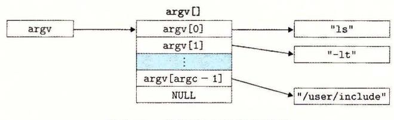

图 8-20 参数列表的组织结构

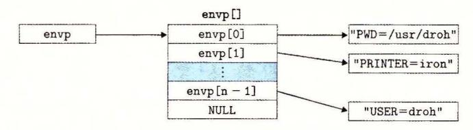

图 8-21 环境变量列表的组织结构

在 execve 加载了 filename 之后,它调用 7.9 节中描述的启动代码。启动代码设置 栈,并将控制传递给新程序的主函数,该主函数有如下形式的原型

int main(int argc, char \*\*argv, char \*\*envp);

#### 或者等价的

int main(int argc, char \*argv[], char \*envp[]);

当 main 开始执行时,用户栈的组织结构如图 8-22 所示。让我们从栈底(高地址)往栈顶(低地址)依次看一看。首先是参数和环境字符串。栈往上紧随其后的是以 null 结尾的指针数组,其中每个指针都指向栈中的一个环境变量字符串。全局变量 environ 指向这些指针中的第一个 envp[0]。紧随环境变量数组之后的是以 null 结尾的 argv[]数组,其中每个元素都指向栈中的一个参数字符串。在栈的顶部是系统启动函数 libc\_start\_main(见7.9节)的栈帧。

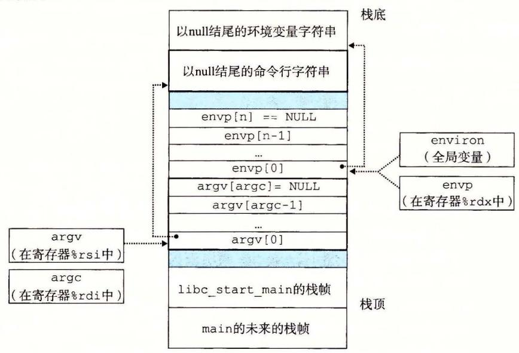

图 8-22 一个新程序开始时,用户栈的典型组织结构

main 函数有 个参数: 1) argc, 它给出 argv[ ]数组中非空指针的数量, 2) argv, 指向 argv[ ]数组中的第一个条目, )envp, 指向 envp[ ]数组中的第一个条目。

Linux 提供了几个函数来操作环境数组:

```
#include <stdlib.h>
```

char \*getenv(const char \*name);

返回:若存在则为指向 ame 针,若无匹配的,则为 ULL

getenv 函数在环境数组中搜索字符串 "name=value" 如果找到了,它就返回一个 指向 value 的指针,否则它就返回 NULL

```
#include <stdlib.h>
```

int setenv(const char \*name, const char \*newvalue, int overwrite);

返回 若成功则为 0, 若错误则为一

void unsetenv(const char \*name);

返回:无

如果环境数组包含一个形如 "name=oldvalue" 的字符串,那么 unsetenv 会删除 它,而 setenv 会用 newvalue 代替 oldvalue, 但是只有在 overwirte 非零时才会这样 如果 name 不存在,那么 setenv 就把 "name=newvalue" 添加到数组中

## 程序与进程

这是一个适当的地方,停下来,确认一下你理解了程序和进程之间的区别。程序是 一堆代码和数据;程序可以作为目标文件存在于磁盘上,或者作为段存在于地址空间 中。进程是执行中程序的一个具体的实例;程序总是运行在某个进程的上下文中。如果 你想要理解 rk execve 函数,理解这个差异是很重要的 fork 函数在新的子进程 中运行相同的程序,新的子进程是父进程的一个复制品 execve 函数在当前进程的上 下文中加栽并运行一个新的程序 它会覆盖当前进程的地址空间,但并没有创建一个新 进程 新的程序仍然有相同的 PID, 并且继承了调用 execve 函数时已打开的所有文件 描述符

练习题 6 编写一个叫做 myecho 的程序,打印出它的命令行参数和环境变量。 例如:

linux>./myecho arg1 arg2

Command-ine arguments:

argv[ OJ: myecho argv[ 1): arg1

argv[ 2): arg2

Environment variables:

envp[ OJ: PWD=/usrO/droh/ics/code/ecf

envp[ 1): TERM=emacs

envp[25]: USER=droh

envp[26]: SHELL=/usr/local/bin/tcsh

envp (27] : HOME=/usrO/droh

#### 8. 4. 6 利用 fork 和 execve 运行程序

像 Unix shell 和 Web 服务器这样的程序大量使用了 fork 和 execve 函数。shell 是一 个交互型的应用级程序,它代表用户运行其他程序。最早的 shell 是 sh 程序,后面出现了 一些变种,比如 csh、tcsh、ksh 和 bash。shell 执行一系列的读/求值(read/evaluate)步 骤,然后终止。读步骤读取来自用户的一个命令行。求值步骤解析命令行,并代表用户运 行程序。

图 8-23 展示了一个简单 shell 的 main 例程。shell 打印一个命令行提示符,等待用户 在 stdin 上输入命令行,然后对这个命令行求值。

```
    code/ecf/shellex.c

     #include "csapp.h"
2
     #define MAXARGS
                       128
3
    /* Function prototypes */
4
     void eval(char *cmdline);
5
     int parseline(char *buf, char **argv);
6
7
     int builtin_command(char **argv);
8
9
     int main()
10
     {
         char cmdline[MAXLINE]; /* Command line */
11
12
         while (1) {
13
             /* Read */
14
             printf("> ");
15
             Fgets(cmdline, MAXLINE, stdin);
16
              if (feof(stdin))
17
                  exit(0);
18
19
             /* Evaluate */
20
21
              eval(cmdline);
         }
22
23
     }

    code/ecf/shellex.c
```

图 8-23 一个简单的 shell 程序的 main 例程

图 8-24 展示了对命令行求值的代码。它的首要任务是调用 parseline 函数(见图 8-25), 这个函数解析了以空格分隔的命令行参数,并构造最终会传递给 execve 的 argv 向量。 第一个参数被假设为要么是一个内置的 shell 命令名,马上就会解释这个命令,要么是一 个可执行目标文件,会在一个新的子进程的上下文中加载并运行这个文件。

如果最后一个参数是一个"&"字符,那么 parseline 返回 1,表示应该在后台执行 该程序(shell 不会等待它完成)。否则,它返回 0,表示应该在前台执行这个程序(shell 会 等待它完成)。

在解析了命令行之后,eval 函数调用 builtin command 函数,该函数检查第一个命 令行参数是否是一个内置的 shell 命令。如果是,它就立即解释这个命令,并返回值1。否 则返回 0。简单的 shell 只有一个内置命令——quit 命令,该命令会终止 shell。实际使用 的 shell 有大量的命令,比如 pwd、jobs 和 fg。

如果 builtin\_command 返回 0,那么 shell 创建一个子进程,并在子进程中执行所请求的程序。如果用户要求在后台运行该程序,那么 shell 返回到循环的顶部,等待下一个命令行。否则, shell 使用 waitpid 函数等待作业终止。当作业终止时, shell 就开始下一轮迭代。

```
    code/ecf/shellex.c

     /* eval - Evaluate a command line */
1
     void eval(char *cmdline)
2
3
         char *argv[MAXARGS]; /* Argument list execve() */
4
5
         char buf[MAXLINE];
                                /* Holds modified command line */
6
         int bg;
                                /* Should the job run in bg or fg? */
                                /* Process id */
7
         pid_t pid;
8
         strcpy(buf, cmdline);
9
         bg = parseline(buf, argv);
10
11
         if (argv[0] == NULL)
12
                        /* Ignore empty lines */
13
14
         if (!builtin command(argv)) {
              if ((pid = Fork()) == 0) {
                                             /* Child runs user job */
15
                  if (execve(argv[0], argv, environ) < 0) {
16
17
                      printf("%s: Command not found.\n", argv[0]);
                      exit(0);
18
                  }
19
20
             }
21
              /* Parent waits for foreground job to terminate */
22
23
             if (!bg) {
                  int status;
24
                  if (waitpid(pid, &status, 0) < 0)
25
                      unix_error("waitfg: waitpid error");
26
             7
27
28
              else
29
                  printf("%d %s", pid, cmdline);
30
31
         return;
     7
32
33
34
     /* If first arg is a builtin command, run it and return true */
35
     int builtin_command(char **argv)
36
     {
         if (!strcmp(argv[0], "quit")) /* quit command */
37
              exit(0);
38
         if (!strcmp(argv[0], "&"))
                                          /* Ignore singleton & */
39
40
             return 1:
                                          /* Not a builtin command */
41
         return 0;
42
     }
                                                            code/ecf/shellex.c
```

```
- code/ecf/shellex.c
     /* parseline - Parse the command line and build the argy array */
1
2
     int parseline(char *buf, char **argv)
 3
         char *delim:
                               /* Points to first space delimiter */
 4
 5
         int argc:
                               /* Number of args */
         int bg:
                               /* Background job? */
6
7
         buf[strlen(buf)-1] = ' ': /* Replace trailing '\n' with space */
8
         while (*buf && (*buf == ' ')) /* Ignore leading spaces */
0
             buf++:
10
11
         /* Build the argv list */
12
         argc = 0:
13
14
         while ((delim = strchr(buf, ' '))) {
15
             argv[argc++] = buf:
16
             *delim = '\0':
             buf = delim + 1;
17
18
             while (*buf && (*buf == ' ')) /* Ignore spaces */
19
         7
20
21
         argv[argc] = NULL;
22
         if (argc == 0) /* Ignore blank line */
23
             return 1;
24
25
26
         /* Should the job run in the background? */
         if ((bg = (*argv[argc-1] == '&')) != 0)
27
             argv[--argc] = NULL;
28
```

- code/ecf/shellex.c

图 8-25 parseline 解析 shell 的一个输入行

注意,这个简单的 shell 是有缺陷的,因为它并不回收它的后台子进程。修改这个缺陷就要求使用信号,我们将在下一节中讲述信号。

## 8.5 信号

}

return bg:

29 30

31

到目前为止对异常控制流的学习中,我们已经看到了硬件和软件是如何合作以提供基本的低层异常机制的。我们也看到了操作系统如何利用异常来支持进程上下文切换的异常控制流形式。在本节中,我们将研究一种更高层的软件形式的异常,称为 Linux 信号,它允许进程和内核中断其他进程。

一个信号就是一条小消息,它通知进程系统中发生了一个某种类型的事件。比如,图 8-26 展示了 Linux 系统上支持的 30 种不同类型的信号。

每种信号类型都对应于某种系统事件。低层的硬件异常是由内核异常处理程序处理的,正常情况下,对用户进程而言是不可见的。信号提供了一种机制,通知用户进程发生了这些异常。比如,如果一个进程试图除以 0,那么内核就发送给它一个 SIGFPE 信号(号码 8)。如果一个进

程执行一条非法指令,那么内核就发送给它一个 SIGILL 信号(号码 4) 。如果进程进行非法内存 引用,内核就发送给它一个 SIGSEGV 信号(号码 11) 。其他信号对应千内核或者其他用户进程 中较高层的软件事件。比如,如果当进程在前台运行时,你键入 Ctrl+C (也就是同时按下 Ctr! 键和 键),那么内核就会发送 SIGINT 信号(号码 2) 给这个前台进程组中的每个进程。一 个进程可以通过向另 个进程发送一个 SIGKILL 信号(号码 9) 强制终止它 。当一个子进程终止 或者停止时,内核会发送一个 SIGCHLD 信号(号码 17) 给父进程。

| 序号 | 名称        | 默认行为                 | 相应事件              |
|----|-----------|----------------------|-------------------|
| I  | SIGHUP    | 终止                   | 终端线挂断             |
| 2  | SIGINT    | 终止                   | 来自键盘的中断           |
| 3  | SIGQUIT   | 终止                   | 来自键盘的退出           |
| 4  | SIGILL    | 终止                   | 非法指令              |
| 5  | SIGTRAP   | 终止并转储内存              | 跟踪陷阱              |
| 6  | SIGABRT   | 终止并转储内存 (!)          | 来自 abort 函数的终止信号  |
| 7  | SIGBUS    | 终止                   | 总线错误              |
| 8  | SIGFPE    | 终止并转储内存              | 浮点异常              |
| 9  | SIGKILL   | 终止                   | 杀死程序              |
| 10 | SIGUSRI   | 终止                   | 用户定义的信号           |
| JI | SIGSEGV   | 终止并转储内存              | 无效的内存引用(段故障)      |
| 12 | SIGUSR2   | 终止                   | 用户定义的信号           |
| 13 | SIGPIPE   |                      | 个没有读用户的管道做写操作     |
| 14 | SIGALRM   | 终止                   | 来自 alarm 函数的定时器信号 |
| 15 | SIGTERM   | 终止                   | 软件终止信号            |
| 16 | SIGSTKFLT | 终止                   | 协处理器上的栈故障         |
| 17 | SIGCHLD   | 忽略                   | 一个子进程停止或者终止       |
| 18 | SIGCONT   | 忽略                   | 继续进程如果该进程停止       |
| 19 | SIGSTOP   | 停止<br>到下<br>SIGCONT@ | 不是来自终端的停止信号       |
| 20 | SIGTSTP   | 停止直到下一个<br>IGCONT    | 来自终端的停止信号         |
| 21 | SIGTTIN   | 停止直到下一个 SIGCONT      | 后台进程从终端读          |
| 22 | SIGTTOU   | 停止直到下<br>SIGCONT     | 后台进程向终端写          |
| 23 | SIGURG    | 忽略                   | 套接字上的紧急情况         |
| 24 | SIGXCPU   | 终止                   | CPU 时间限制超出        |
| 25 | SIGXFSZ   | 终止                   | 文件大小限制超出          |
| 26 | SIGVTALRM | 终止                   | 虚拟定时器期满           |
| 27 | SIGPROF   | 终止                   | 剖析定时器期满           |
| 28 | SIGWINCH  | 忽略                   | 窗口大小变化            |
| 29 | SIGIO     | 终止                   | 在某个描述符上可执行 1/0 操作 |
| 30 | SIGPWR    | 终止                   | 电源故障              |

<sup>26</sup> Linux 信号

注: CD 多年前,主存是用 一种称为 磁芯存储器 (core memory) 的技术来实现的 "转储内存 "(dumping core) 是一 个历史木语,意思是把代码和数据内存段的映像写到磁盘上

这个信号既不能被捕获,也不能被忽略

(来源: man 7 ignal 数据来自 Linux Found tion

#### 8. 5. 1 信号术语

传送一个信号到目的进程是由两个不同步骤组成的

发送信号。内核通过更新目的进程上下文中的某个状态,发送(递送)一个信号给目 的进程 发送信号可以有如下两种原因: )内核检测到一个系统事件,比如除零错 误或者子进程终 2) 一个进程调用了 函数( 节中讨论),显式地要求 内核发送 个信号给目的进程。 个进程可以发送信号给它自己。

528

● 接收信号。当目的进程被内核强迫以某种方式对信号的发送做出反应时,它就接收了信号。进程可以忽略这个信号,终止或者通过执行一个称为信号处理程序(signal handler)的用户层函数捕获这个信号。图 8-27 给出了信号处理程序捕获信号的基本思想。

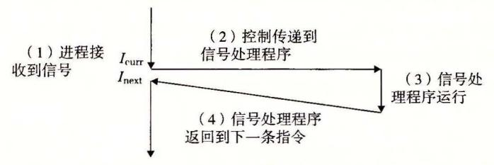

图 8-27 信号处理。接收到信号会触发控制转移到信号处理程序。在信号处理程序 完成处理之后,它将控制返回给被中断的程序

一个发出而没有被接收的信号叫做待处理信号(pending signal)。在任何时刻,一种类型至多只会有一个待处理信号。如果一个进程有一个类型为 k 的待处理信号,那么任何接下来发送到这个进程的类型为 k 的信号都不会排队等待,它们只是被简单地丢弃。一个进程可以有选择性地阻塞接收某种信号。当一种信号被阻塞时,它仍可以被发送,但是产生的待处理信号不会被接收,直到进程取消对这种信号的阻塞。

一个待处理信号最多只能被接收一次。内核为每个进程在 pending 位向量中维护着 待处理信号的集合,而在 blocked 位向量<sup> $\Theta$ </sup>中维护着被阻塞的信号集合。只要传送了一个类型为 k 的信号,内核就会设置 pending 中的第 k 位,而只要接收了一个类型为 k 的信号,内核就会清除 pending 中的第 k 位。

### 8.5.2 发送信号

Unix 系统提供了大量向进程发送信号的机制。所有这些机制都是基于进程组(process group)这个概念的。

#### 1. 进程组

每个进程都只属于一个进程组,进程组是由一个正整数进程组 ID 来标识的。getpgrp函数返回当前进程的进程组 ID:

```
#include <unistd.h>
pid_t getpgrp(void);

返回:调用进程的进程组 ID。
```

默认地,一个子进程和它的父进程同属于一个进程组。一个进程可以通过使用 set-pgid 函数来改变自己或者其他进程的进程组:

```
#include <unistd.h>\nint setpgid(pid_t pid, pid_t pgid);

返回: 若成功则为 0, 若错误则为-1。
```

setpgid 函数将进程 pid 的进程组改为 pgid。如果 pid 是 0,那么就使用当前进程

<sup>○</sup> 也称为信号掩码(signal mask)。

的 PID。如果 pgid 是 0,那么就用 pid 指定的进程的 PID 作为进程组 ID。例如,如果进程 15213 是调用进程,那么

setpgid(0, 0);

会创建一个新的进程组,其进程组 ID 是 15213,并且把进程 15213 加入到这个新的进程组中。

#### 2. 用/bin/kill 程序发送信号

/bin/kill 程序可以向另外的进程发送任意的信号。比如,命令

linux> /bin/kill -9 15213

发送信号 9(SIGKILL)给进程 15213。一个为负的 PID 会导致信号被发送到进程组 PID 中的每个进程。比如,命令

linux> /bin/kill -9 -15213

发送一个 SIGKILL 信号给进程组 15213 中的每个进程。注意,在此我们使用完整路径/bin/kill,因为有些 Unix shell 有自己内置的 kill 命令。

#### 3. 从键盘发送信号

Unix shell 使用作业(job)这个抽象概念来表示为对一条命令行求值而创建的进程。在任何时刻,至多只有一个前台作业和0个或多个后台作业。比如,键人

linux> 1s / sort

会创建一个由两个进程组成的前台作业,这两个进程是通过 Unix 管道连接起来的:一个进程运行 1s 程序,另一个运行 sort 程序。shell 为每个作业创建一个独立的进程组。进程组 ID 通常取自作业中父进程中的一个。比如,图 8-28 展示了有一个前台作业和两个后台作业的 shell。前台作业中的父进程 PID 为 20,进程组 ID 也为 20。父进程创建两个子进程,每个也都是进程组 20 的成员。

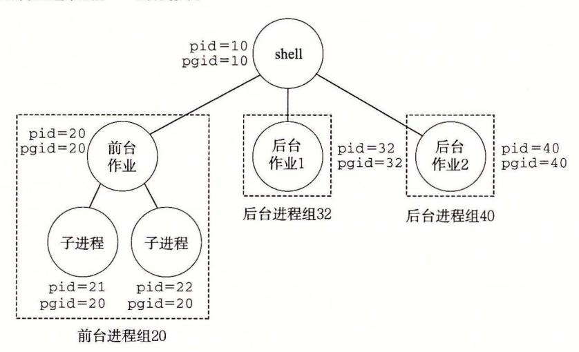

图 8-28 前台和后台进程组

在键盘上输入 Ctrl+C 会导致内核发送一个 SIGINT 信号到前台进程组中的每个进程。默认情况下,结果是终止前台作业。类似地,输入 Ctrl+Z 会发送一个 SIGTSTP 信号到前台进程组中的每个进程。默认情况下,结果是停止(挂起)前台作业。

### 4. kill 函数发送信号

进程通过调用 kill 函数发送信号给其他进程(包括它们自己)。

```
#include <sys/types.h> 
#include <signal.h> 
int kill(pid_t pid, int sig); 
                                                     返回:若成功则为 o, 若错误则为一 1.
```

如果 过大于零,那么 函数发送信号号码 sig 给进程 pid 。如果 pid 等于零,那么 发送信号 sig 给调用进程所在进程组中的每个进程,包括调用进程自己。如果 小于零, 发送信号 sig 给进程组 pid I (p 过的绝对值)中的每个进程 <sup>29</sup> 展示 了一个 例,父进程用 数发送 SIGKILL 信号给它的子进程。

```
#include "csapp.h" 
2 
3 int main() 
4 { 
s pid_t pid; 
6 
                                                      code/ ecf/kill. c 
7I* Child sleeps until SIGKILL signal received, then dies *I 
8if ((pid = Fork()) == 0) { 
9Pause(); I* Wait for a signal to arrive *I 
10 printf("control should never reach here!\n"); 
11 exit(O); 
12 } 
13 
14 I* Parent sends a SIGKILL signal to a child */ 
15Kill(pid, SIGKILL); 
16 exit(O); 
17 } 
                                                      code/ ecf/kill. c
```

8- 使用 kill 函数发送 信号 给子进程

### alarm 函数发送信号

进程可以通过调用 alarm 函数向它自己发送 SIGALRM 信号。

```
#include <unistd.h> 
unsigned int alarm(unsigned int secs); 
                                返回:前一次闹钟剩余的秒数,若以前没有设定闹钟,则为
```

alarm 函数安排内核在 secs 秒后发送一个 SIGALRM 信号给调用进程。如果 secs 是零,那么不会调度安排新的闹钟 (alarm) 。在任何情况下,对 alarm 的调用都将取消任 何待处理的 (pending) 闹钟,并且返回任何待处理的闹钟在被发送前还剩下的秒数(如果这 次对 alarm 的调用没有取消它的话 ;如果没有任何待处理的闹钟,就返回零。

## 8. 5. 3 接收信号

当内核把进程 从内核模式切换到用户模式时(例如,从系统调用返回或是完成了一 次上下文切换),它会检查进程 的未被阻 的待处理信号的 (pending & ~blocked) 如果这个集合为空(通常情况下),那么内核将控制传递到 的逻辑控制流中的下一条指令 ([ next) 。然而,如果集合是非空的,那么内核选择集合中的某个 (通常是最小的 k), 并且强制 接收信号 收到这个信号会触发进程采取某种行为 一旦进程完成了这个行 为,那么控制就传递回 的逻辑控制流中的下 条指令([ ex t) 。每 个信号类型都有 个预 定义的默认行为,是下面中的一种:

- ·进程终止
- ·进程终止并转储内存。
- ·进程停止(挂起)直到被 SIGCONT 信号重启。
- ·进程忽略该信号。

8-26 展示了与每个信号类型相关联的默认行为。比如,收到 SIGKILL 的默认行为 就是终止接收进程。另外,接收到 SIGCHLD 的默认行为就是忽略这个信号。进程可以通 过使用 signal 函数修改和信号相 联的默认行为 唯一的例外是 SIGSTOP SIGKILL, 它们的默认行为是不能修改的

#include <signal.h>

typedef void (\*sighandler\_t)(int);

sighandler\_t signal(int signum, sighandler\_t handler);

返回:若成功则为指向前次处理程序的指针,若出错则为 \_ERR (不设置 errn

signal 函数可以通过下列三种方 来改变和信号 signum 相关联的行为:

- ·如果 handler SIG\_IGN, 那么忽略类型为 signum 的信 号。
- ·如果 handler SIG\_DFL, 那么类型为 signum 的信号行为恢复为默认行为
- ·否则, handler 就是用户定义的函数的地址,这个函数被称为信号处理程序,只要进 程接收到 个类型为 signurn 的信 ,就会调用这个程序 通过把处理程序的地址传 递到 signal 函数从而改变默认行为,这叫做设置信号处理程序 (installing the handler) 调用信号处理程序被称为捕获信号。执行信号处理程序被称为处理信号。

当一个进程捕获了一个类型为 的信号时,会调用为信 的处理程序,一个 数参数被设置为 这个参数允许同 个处理函数捕获不同 型的信号

当处理程序执行它的 return 语句时,控制(通常)传递回控制流中进程被信号接收中 断位置处的指令 我们说"通常"是因为在某些系统中,被中断的系统调用会立即返回一 个错误。

8-30 示了一个程序,它捕获用户在键盘上输入 Ctrl+C 时发送的 SIGINT 信号。 SIG INT 的默认行为是立即终止该进程 在这个示例中,我们将默认行为修改为捕获信 号,输出一条消息,然后终止该进程。

信号处理程序可以被其他信号处理程序中断,如图 <sup>31</sup> 示。 在这个例子中,主程 序捕获到信号 s' 该信号会中断主程序,将控制转移到处理程序 在运行时,程序捕 获信号 t-:/= 该信号会中断 S, 控制转移到处理程序 返回时, 从它被中断的地 方继续执行 最后, 返回,控制传送回主程序,主程序从它被中断的地方继续执行

```
#include "csapp.h" 
2 
3 void sigint_handler(int sig) I* SIGINT handler *I 
4 { 
s printf("Caught SIGINT!\n"); 
6 exit(O); 
7 } 
8 
9 int main() 
10 { 
11I* Install the SIGINT handler *I 
12 if (signal(SIGINT, sigint_handler) == SIG_ERR) 
13 unix_error("signal error"); 
14 
15 pause(); I* Wait for the receipt of a signal *I 
16 
17 return 0: 
18 } 
                                                        code/ecf/sigint.c 
                                                        code/ ecf/sigint. c
```

一个用信号处理程序捕获 SIGINT 信号的程序

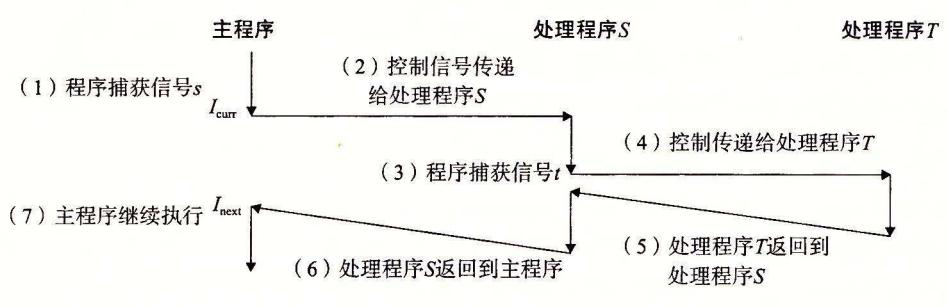

8-3 信号处理程序可以被其他信号处理程序中断

练习题 7 编写一个叫做 snooze 的程序,它有一个命令行参数,用这个参数调用 练习题 8. 中的 snooze 函数,然后终止。编写程序,使得用户可以通过在键盘上输 Ctrl+C 中断 snooze 函数。比如:

```
linux>./snooze 5 
CTRL+C 
Slept for 3 of 5 secs. 
linux> 
                                User hi ts Crtl +C after 3 seconds
```

### 8. 5. 4 阻塞和解除阻塞信号

Linux 提供阻塞信号的隐式和显式的机制:

隐式阻塞机制。内核默认阻塞任何当前处理程序正在处理信号类型的待处理的信号。 例如,图 8-31 中,假设程序捕获了信号 s, 当前正在运行处理程序 。如果发送给该进程 另一个信号 s, 那么直到处理程序 返回, 会变成待处理而没有被接收。

显式阻塞机制。应用程序可以使用 sigprocmask 函数和它的辅助函数,明确地阻塞 和解除阻塞选定的信号。

```
#include <signal.h>
\nint sigprocmask(int how, const sigset_t *set, sigset_t *oldset);\nint sigemptyset(sigset_t *set);\nint sigfillset(sigset_t *set);\nint sigaddset(sigset_t *set, int signum);\nint sigdelset(sigset_t *set, int signum);
```

sigprocmask 函数改变当前阻塞的信号集合(8.5.1 节中描述的 blocked 位向量)。具体的行为依赖于 how 的值:

SIG BLOCK: 把 set 中的信号添加到 blocked 中(blocked=blocked | set)。

SIG UNBLOCK: 从 blocked 中删除 set 中的信号(blocked=blocked & set)。

SIG SETMASK: block=set.

如果 oldset 非空,那么 blocked 位向量之前的值保存在 oldset 中。

使用下述函数对 set 信号集合进行操作: sigemptyset 初始化 set 为空集合。sigfillset 函数把每个信号都添加到 set 中。sigaddset 函数把 signum 添加到 set,sigdelset 从 set 中删除 signum,如果 signum 是 set 的成员,那么 sigismember 返回 1,否则返回 0。

例如,图 8-32展示了如何用 sigprocmask 来临时阻塞接收 SIGINT 信号。

```
sigset_t mask, prev_mask;

Sigemptyset(&mask);
Sigaddset(&mask, SIGINT);

/* Block SIGINT and save previous blocked set */
Sigprocmask(SIG_BLOCK, &mask, &prev_mask);

// Code region that will not be interrupted by SIGINT

/* Restore previous blocked set, unblocking SIGINT */
Sigprocmask(SIG_SETMASK, &prev_mask, NULL);
```

图 8-32 临时阻塞接收一个信号

### 8.5.5 编写信号处理程序

信号处理是 Linux 系统编程最棘手的一个问题。处理程序有几个属性使得它们很难推理分析: 1)处理程序与主程序并发运行, 共享同样的全局变量, 因此可能与主程序和其他处理程序互相干扰; 2)如何以及何时接收信号的规则常常有违人的直觉; 3)不同的系统有不同的信号处理语义。

在本节中,我们将讲述这些问题,介绍编写安全、正确和可移植的信号处理程序的一些基本规则。

#### 1. 安全的信号处理

信号处理程序很麻烦是因为它们和主程序以及其他信号处理程序并发地运行,正如我们在图 8-31 中看到的那样。如果处理程序和主程序并发地访问同样的全局数据结构,那

么结果可能就不可预知, 而且经常是致命的。

我们会在第 12 章详细讲述并发编程。这里我们的目标是给你一些保守的编写处理程序的原则,使得这些处理程序能安全地并发运行。如果你忽视这些原则,就可能有引入细微的并发错误的风险。如果有这些错误,程序可能在绝大部分时候都能正确工作。然而当它出错的时候,就会错得不可预测和不可重复,这样是很难调试的。一定要防患于未然!

- G0. 处理程序要尽可能简单。避免麻烦的最好方法是保持处理程序尽可能小和简单。例如,处理程序可能只是简单地设置全局标志并立即返回;所有与接收信号相关的处理都由主程序执行,它周期性地检查(并重置)这个标志。
- G1. 在处理程序中只调用异步信号安全的函数。所谓异步信号安全的函数(或简称安全的函数)能够被信号处理程序安全地调用,原因有二:要么它是可重入的(例如只访问局部变量,见 12.7.2 节),要么它不能被信号处理程序中断。图 8-33 列出了 Linux 保证安全的系统级函数。注意,许多常见的函数(例如 printf、sprintf、malloc 和 exit)都不在此列。

| _Exit         | fexecve     | poll              | sigqueue         |
|---------------|-------------|-------------------|------------------|
| _exit         | fork        | posix_trace_event | sigset           |
| abort         | fstat       | pselect           | sigsuspend       |
| accept        | fstatat     | raise             | sleep            |
| access        | fsync       | read              | sockatmark       |
| aio_error     | ftruncate   | readlink          | socket           |
| aio_return    | futimens    | readlinkat        | socketpair       |
| aio_suspend   | getegid     | recv              | stat             |
| alarm         | geteuid     | recvfrom          | symlink          |
| bind          | getgid      | recvmsg           | symlinkat        |
| cfgetispeed   | getgroups   | rename            | tcdrain          |
| cfgetospeed   | getpeername | renameat          | tcflow           |
| cfsetispeed   | getpgrp     | rmdir             | tcflush          |
| cfsetospeed   | getpid      | select            | tcgetattr        |
| chdir         | getppid     | sem_post          | tcgetpgrp        |
| chmod         | getsockname | send              | tcsendbreak      |
| chown         | getsockopt  | sendmsg           | tcsetattr        |
| clock_gettime | getuid      | sendto            | tcsetpgrp        |
| close         | kill        | setgid            | time             |
| connect       | link        | setpgid           | timer_getoverrum |
| creat         | linkat      | setsid            | timer_gettime    |
| dup           | listen      | setsockopt        | timer_settime    |
| dup2          | lseek       | setuid            | times            |
| execl         | lstat       | shutdown          | umask            |
| execle        | mkdir       | sigaction         | uname            |
| execv         | mkdirat     | sigaddset         | unlink           |
| execve        | mkfifo      | sigdelset         | unlinkat         |
| faccessat     | mkfifoat    | sigemptyset       | utime            |
| fchmod        | mknod       | sigfillset        | utimensat        |
| fchmodat      | mknodat     | sigismember       | utimes           |
| fchown        | open        | signal            | wait             |
| fchownat      | openat      | sigpause          | waitpid          |
| fcntl         | pause       | sigpending        | write            |
| fdatasync     | pipe        | sigprocmask       |                  |

图 8-33 异步信号安全的函数(来源: man 7 signal。数据来自 Linux Foundation)

信号处理程序中产生输出唯一安全的方法是使用 write 函数(见 10. 节)。特别地, 调用 printf sprin 是不安全的。为了绕开这个不幸的限制,我们开发一些安全的函 数,称为 SIO (安全的 I/0) 包,可以用来在信号处理程序中打印简单的消息。

```
#include "csapp.h" 
ssize_t sio_putl(long v); 
ssize_t sio_puts(char s[]); 
                                     返回:如果成功则为传送的字节数,如果出错,则为—
void sio_error(char s[]); 
                                                                     返回:空
```

sio\_putl sio\_puts 函数分别向标准输出传送 long 类型数和一个字符串。 sio\_error 函数打印一条错误消息并终止。

8-34 给出的是 SIO 包的实现,它使用了 csapp.c 中两个私有的可重入函数。第 行的 sio\_s rlen 函数返回字符串 的长度。第 <sup>10</sup> 行的 sio\_ltoa 函数基于来自 [61] itoa 函数,把 转换成它的基 字符串表示,保存在 中。第 <sup>17</sup> 行的\_ex 江函数是 ex 的一个异步信号安全的变种。

```
code/src/csapp.c 123456789012345678 
111111111 
    ssize_t sio_puts (char s []) I* Put string *I 
    { 
        return write(STDOUT_FILENO, s, sio_strlen(s)); 
    } 
    ssize_t sio_putl(long v) I* Put long *I 
    { 
        char s [128] ; 
        sio_ltoa(v, s, 10); I* Based on K&R i toa() *I 
     return sio_puts(s); } 
    void sio_error(char s[]) I* Put error message and exit *I 
    { 
        sio_puts(s); 
        _exit(l); 
    } 
                                                           codelsrdcsapp.c
```

<sup>34</sup> 信号处理程序的 SIO (安全 0)

8-35 给出了图 8-30 SIGINT 处理程序的一个安全的版本。

```
code/ecflsigintsafe.c 1234567 #include "csapp.h" 
   void sigint_handler(int sig) I* Safe SIGINT handler *I 
   { 
      Sio_puts("Caught SIGINT!\n"); I* Safe output *I 
      _exit(O); I* Safe exit *I 
   } 
                                                code/ecf/sigintsafe. c
```

<sup>30</sup> SIGINT 处理程序的 个安全版本

- G2. 保存和恢复 errno 。许多 Linux 异步信号安全的函数都会在出错返回时设置 errno 。在处理程序中调用这样的函数可能会干扰主程序中其他依赖于 errno 的部 分。解决方法是在进入处理程序时把 errno 保存在 个局部变最中,在处理程序返 回前恢复它。注意,只有在处理程序要返回时才有此必要。如果处理程序调用 \_ex 江终止该进程,那么就不需要这样做了。
- G3. 阻塞所有的信号,保护对共享全局数据结构的访问。如果处理程序和主程序或其 他处理程序共享一个全局数据结构,那么在访问(读或者写)该数据结构时,你的处理 程序和主程序应该暂时阻塞所有的信号。这条规则的原因是从主程序访问一个数据结 通常需要 系列的指令,如果指令序列被访问 的处理程序中断,那么处理程序 可能会发现 的状态不一致,得到不可预知的结果。在访问 时暂时阻塞信号保证了 处理程序不会中断该指令序列。
- G4. volatile 声明全局变量。考虑一个处理程序和一个 main 函数,它们共享一个全 局变量 。处理程序更新 g, main 周期性地读 。对于 个优化编译器而言, main 的值看上去从来没有变化过,因此使用缓存在寄存器中 的副本来满足对 的每次引用 是很安全的。如果这样, main 函数可能永远都无法看到处理程序更新过的值。

可以用 volatile 类型限定符来定义一个变量,告诉编译器不要缓存这个变量 例如: volatile int g;

vo la 限定符强迫编译器每次在代码中引用 时,都要从内存中读取 值。一般来说,和其他所有共享数据结构 样,应该暂时阻塞信号,保护每次对全 局变量的访问。

• G5 .用 sig—琴ornic\_t 声明标志。在常见的处理程序设计中,处理程序会写全局标 志来记录收到了信号。主程序周期性地读这个标志,响应信号,再清除该标志。对 千通过这种方式来共享的标志, 提供一种整型数据类型 ig\_atorni \_t, 对它的 读和写保证会是原子的(不可中断的),因为可以用一条指令来实现它们:

volatile sig\_atomic\_t flag;

因为它们是不可中断的,所以可以安全地读和写 g\_atomic\_七变量,而不需 要暂时阻塞信号。注意,这里对原子性的保证只适用于单个的读和写,不适用于像 flag+ +或 flag=flag+lO 这样的更新,它们可能需要多条指令。

要记住我 们这里讲述的规则 是保守的 ,也就是说它们不总是严格必需的。例如,如果 你知道处理程序绝对不会修改 errno, 那么就不需要保存和恢复 errno 。或者如果你可以 证明 printf 的实例都不会被处理程序中断,那么在处理程序中调用 printf 就是安全的. 对共享全局数据结构的访问也是同样。不过,一般来说这种断言很难证明。所以我们建议 你采用保守的方法,遵循这些规则,使得处理程序尽可能简单,调用安全函数,保存和恢 errno 保护对共享数据结构的访问,并使用 volatile sig\_atomic\_t

#### 正确的信号处理

信号的一个与直觉不符的方面是未处理的信号是不排队的。因为 pending 位向量中 每种类型的信号只对应有 位,所以每种类型最多只能有一个未处理的信号。因此,如果 两个类型 的信号发送给一个目的进程,而因为目的进程当前正在执行信号 的处理程 序,所以信号 被阻塞了,那么第 个信号就简单地被丢弃了;它不会排队。关键思想是 如果存在 个未处理的信号就表明至少有一个信号到达了

要了解这样会如何影响正确性,来看一个简单的应用,它本质上类似于像 shell 和 Web 服务器这样的真实程序。基本的结构是父进程创建一些子进程,这些子进程各自独立 运行一段时间,然后终止。父进程必须回收子进程以避免在系统中留下僵死进程。但是我们还希望父进程能够在子进程运行时自由地去做其他的工作。所以,我们决定用 SIGCHLD 处理程序来回收子进程,而不是显式地等待子进程终止。(回想一下,只要有一个子进程终止或者停止,内核就会发送一个 SIGCHLD 信号给父进程。)

图 8-36 展示了我们的初次尝试。父进程设置了一个 SIGCHLD 处理程序, 然后创建

```
code/ecf/signal1.c
 1
     /* WARNING: This code is buggy! */
 2
 3
     void handler1(int sig)
 4
 5
         int olderrno = errno;
 6
         if ((waitpid(-1, NULL, 0)) < 0)
 7
              sio_error("waitpid error");
 8
         Sio_puts("Handler reaped child\n");
 9
         Sleep(1);
10
         errno = olderrno;
11
12
     7
13
     int main()
14
     {
15
         int i, n;
17
         char buf[MAXBUF];
18
         if (signal(SIGCHLD, handler1) == SIG_ERR)
19
              unix_error("signal error");
20
21
         /* Parent creates children */
22
         for (i = 0; i < 3; i++) {
23
              if (Fork() == 0) {
24
                  printf("Hello from child %d\n", (int)getpid());
25
26
                  exit(0):
27
             }
         }
28
29
         /* Parent waits for terminal input and then processes it */
         if ((n = read(STDIN_FILENO, buf, sizeof(buf))) < 0)
31
             unix_error("read");
32
33
         printf("Parent processing input\n");
         while (1)
35
             ;
36
37
38
         exit(0);
     }
39
```

code/ecf/signal1.c

图 8-36 signal1:这个程序是有缺陷的,因为它假设信号是排队的

个子进程。同时,父进程等待来自终端的一个输入行,随后处理它。这个处理被模型 化为一个无限循环 。当每个 子进程终止时,内核通过发送一个 SIGCHLD 信号通知父进 程。父进程捕获这个 SIGCHLD 信号,回收一个子进程,做一些其他的清理工作(模型化 sleep 语句),然后返回。

8-36 中的 signall 程序看起来相当简单。然而,当在 Linux 系统上运行它时,我 得到如下输 出:

linux>./si al1 Hello from child 14073 Hello from child 14074 Hello from child 14075 Handler reaped child Handler reaped child CR Parent processing input

从输出中我们注意到,尽管发送了 IGCHLD 信号给父进程,但是其中只有两个信号被 接收了,因此父进程只是回收了两个子进程。如果挂起父进程,我们看到,实际上子进程 <sup>14075</sup> 没有被回收,它成了一个僵死进程(在 ps 命令的输出中由字符串 "defunct" 表明):

```
Ctrl+Z 
Suspended 
linux> ps t 
  PID TTY 
14072 pts/3 
14075 pts/3 
14076 pts/3 
               STAT TIME COMMAND 
               T 0:02./sign.all 
               Z O: 00 [sign.all] <defunct> 
               R+ 0:00 ps t
```

哪里出错了呢?问题就在千我们的代码没有解决信号不会排队等待这样的情况。所发 生的情况是:父进程接收并捕获了第 个信号。当处理程序还在处理第一个信号时,第二 个信号就传送并添加到了待处理信号集合里。然而,因为 SIGCHLD 信号被 SIGCHLD 理程序阻塞了,所以第二个信号就不会被接收。此后不久,就在处理程序还在处理第一个 信号时,第三个信号到达了。因为已经有了一个待处理的 SIGCHLD, 第三个 SIGCHLD 信号会被丢弃。一段 时间之后,处理程序返回,内核 注意到有 个待处理的 SIGCHLD 号,就迫使父进程接收这个信号。父进程捕获这个信号,并第二次执行处理程序。在处理 程序完成对第二个信号的处理之后,已经没有待处理的 SIGCHLD 信号了,而且也绝不会 再有,因为第三个 SIGCHLD 的所有信息都已经丢失了。由此得到的重要教训是,不可以 用信号未对其他进程中发生的事件计数。

为了修正这个问题,我们必须回想 下,存在一个待处理的信号只是暗示自进程最后 一次收到一个信号以来,至少巳经有一个这种类型的信号被发送了。所以我们必须修改 SIGCHLD 的处理程序,使得每次 SIGCHLD 处理程序被调用时,回收尽可能多的僵死子 进程。图 <sup>37</sup> 展示了修改后的 SIGCHLD 处理程序。

当我们在 Linux 系统上运行 signal2 时,它现在可以正确地回收所有的僵死子进 程了:

linux>./s gnal2 Hello from child 15237

```
Hello from child 15238 
Hello from child 15239 
Handler reaped child 
Handler reaped child 
Handler reaped child 
CR 
Parent processing input
```

```
void handler2(int sig) 
2 { 
3 int olderrno = errno; 
4 
5 while (waitpid(-1, NULL, 0) > 0) { 
6 Sio_puts("Handler reaped child\n"); 
7 } 
8 if (errno != ECHILD) 
9Sio_error("waitpid error"); 
10 Sleep(l); 
11 errno = olderrno; 
12 } 
                                                   code/ecflsignal2. c 
                                                   code/ecf/signa/2. c
```

8-37 sig al2 8-36 个改进版本,它能够正确解决信号 排队等 待的

### 练习题 8 下面这个程 么?

```
2 
                                                  code/ecf/signalprobO.c 
     volatile long counter= 2 ; 
 3 void handlerl(int sig) 
• 4 { 
 s sigset_t mask , prev_mask; 
 6 
 7 Sigfillset (&mask); 
 BSigprocmask(SIG_BLDCK, &mask, &prev_mask); I* Block sigs *I 
 9Sio_putl(-- counter); 
10 Sigprocmask(SIG_SETMASK, &prev_mask, NULL); I* Restore sigs *I 
11 
12 _exit(O); 
13 } 
14 
15 int main() 
16 { 
17 pid_t pid; 
18 sigset_ t mask, prev _mask; 
19 
20 printf("%ld", counter); 
21 fflush(stdout); 
22 
23 signal (SIGUSR1, handler!) ; 
24 if ((pid = Fork()) == 0) {
```

```
while(1) {};
25
26
27
         Kill(pid, SIGUSR1);
28
         Waitpid(-1, NULL, 0);
29
         Sigfillset(&mask);
30
         Sigprocmask(SIG_BLOCK, &mask, &prev_mask); /* Block sigs */
31
         printf("%ld", ++counter);
32
         Sigprocmask(SIG_SETMASK, &prev_mask, NULL); /* Restore sigs */
33
34
35
         exit(0):
36
    }
```

— code/ecf/signalprob0.c

#### 3. 可移植的信号处理

Unix 信号处理的另一个缺陷在于不同的系统有不同的信号处理语义。例如:

- signal 函数的语义各有不同。有些老的 Unix 系统在信号 k 被处理程序捕获之后就 把对信号 k 的反应恢复到默认值。在这些系统上,每次运行之后,处理程序必须调用 signal 函数,显式地重新设置它自己。
- ●系统调用可以被中断。像 read、write 和 accept 这样的系统调用潜在地会阻塞进程一段较长的时间,称为慢速系统调用。在某些较早版本的 Unix 系统中,当处理程序捕获到一个信号时,被中断的慢速系统调用在信号处理程序返回时不再继续,而是立即返回给用户一个错误条件,并将 errno 设置为 EINTR。在这些系统上,程序员必须包括手动重启被中断的系统调用的代码。

要解决这些问题, Posix 标准定义了 sigaction 函数,它允许用户在设置信号处理时,明确指定他们想要的信号处理语义。

```
#include <signal.h>\nint sigaction(int signum, struct sigaction *act,
```

sigaction 函数运用并不广泛,因为它要求用户设置一个复杂结构的条目。一个更简洁的方式,最初是由 W. Richard Stevens 提出的[110],就是定义一个包装函数,称为Signal,它调用 sigaction。图 8-38 给出了 Signal 的定义,它的调用方式与 signal 函数的调用方式一样。

Signal 包装函数设置了一个信号处理程序,其信号处理语义如下:

- 只有这个处理程序当前正在处理的那种类型的信号被阻塞。
- 和所有信号实现一样,信号不会排队等待。
- 只要可能,被中断的系统调用会自动重启。
- 一旦设置了信号处理程序,它就会一直保持,直到 Signal 带着 handler 参数为 SIG\_IGN 或者 SIG\_DFL 被调用。

我们在所有的代码中实现 Signal 包装函数。

#### 8.5.6 同步流以避免讨厌的并发错误

如何编写读写相同存储位置的并发流程序的问题,困扰着数代计算机科学家。一般而

言,流可能交错的数量与指令的数 呈指数关系 这些交错中的一些会产生正确的结果, 而有些则不会。基本的问题是以某种方式同步并发流,从而得到 大的可行的交错的集 合,每个可行的交错都能得到正确的结果

```
code/src/csapp.c 
123456789012 
111 
    handler_t *Signal(int signum, handler_t *handler) 
    { 
        struct sigaction action, old_action; 
        action.sa_handler = handler; 
        sigemptyset(&action.sa_mask); I* Block sigs of type being handled *I 
        action.sa_flags = SA_RESTART; I* Restart syscalls if possible *I 
        if (sigaction(signum, &action, &old_action) < 0) 
            unix_error("Signal error"); 
    return (old_action.sa_handler); }
```

codelsrdcsapp.c

Signal: sigactio 个包装函数,它提供在 Posix 系统上的可移植的信号处理

并发编程是 个很深且很重要的问题,我们将在第 <sup>12</sup> 中更详细地讨论 不过,在 本章中学习的有关异常控制流的知识,可以让你感觉 并发相关的有趣的智力挑战 例如,考虑图 <sup>39</sup> 中的程序,它总结了一个典型的 Unix shell 的结构。父进程在 个全局 作业列表中记录着它的当前子进程,每个作业一个条目 addjob deletejob 函数分别 向这个作业列表添加和从中删除作业

当父进程创建 个新的子进程后,它就把这个子进程添加到作业列表中 当父进程在 SIGCHLD 处理程序中回收一个终止的( 死)子进程时,它就从作业列表中删除这个子 进程

乍一看,这段代码是对的 不幸的是,可能发生下面这样的 件序列:

- 1) 父进程执行 fork 函数,内核调度新创建的子进程运行,而不是父进程。
- 2) 在父进程能够再次运行之前,子进程就终止,并且变成一个 死进程,使得内核 传递一个 SIGCHLD 信号给父进程
- 3) 后来,当父进程再次变成可运行但又在它执行之前,内核注意到有未处理的 SIGCHLD ,并通过在父进程中运行处理程序接收这个信号
- 信号处理程序回收终止的 进程,并调用 deletejob, 这个函数什么也不做,因 为父进程还没有把该子进程添加到列
- 在处理程序运行完毕后,内核运行父进程,父进程从 fork 返回,通过调用 add job 错误地把(不存在的)子进程添加到作业列表中

因此,对千父进程的 main 程序和信号处理流的某些交错,可能 addjob 之前调 deletejob 这导致作业列表中出现一个不正确的条目,对应 个不再存在而且永远 也不会被删除的作业。另一方面,也有 些交错,事件按照正确的顺序发生。例如,如果 fork 调用返回时,内核刚好调度父进程而不是子进程运行,那么父进程就会正确地把 子进程添加到作业列表中,然后子进程终止,信号处理函数把该作业从列表中删除

这是一个称为竞争 (race) 的经典同步错误的示例 在这个情况中, main 函数中调用 addj 和处理程序中调用 deletejob 之间存在竞争 如果 addjob 赢得进展,那么结果 就是正确的。如果它没有,那么结果就是错误的。这样的错误非常难以调试,因为几乎不可能测试所有的交错。你可能运行这段代码十亿次,也没有一次错误,但是下一次测试却导致引发竞争的交错。

```
code/ecf/procmask1.c
     /* WARNING: This code is buggy! */
2
     void handler(int sig)
     ł
 3
         int olderrno = errno;
4
         sigset_t mask_all, prev_all;
         pid_t pid;
         Sigfillset(&mask_all);
8
         while ((pid = waitpid(-1, NULL, 0)) > 0) { /* Reap a zombie child */
9
             Sigprocmask(SIG_BLOCK, &mask_all, &prev_all);
10
             deletejob(pid); /* Delete the child from the job list */
11
12
             Sigprocmask(SIG_SETMASK, &prev_all, NULL);
13
         7
14
         if (errno != ECHILD)
15
             Sio_error("waitpid error");
         errno = olderrno;
16
17
     }
18
19
     int main(int argc, char **argv)
20
21
         int pid;
22
         sigset_t mask_all, prev_all;
23
         Sigfillset(&mask_all);
24
         Signal(SIGCHLD, handler);
25
         initjobs(); /* Initialize the job list */
26
27
28
         while (1) {
             if ((pid = Fork()) == 0) { /* Child process */
29
                 Execve("/bin/date", argv, NULL);
30
             7
31
32
             Sigprocmask(SIG_BLOCK, &mask_all, &prev_all); /* Parent process */
33
             addjob(pid); /* Add the child to the job list */
             Sigprocmask(SIG_SETMASK, &prev_all, NULL);
34
         7
35
         exit(0);
36
    7
37
                                                                      code/ecf/procmask1.c
```

图 8-39 一个具有细微同步错误的 shell 程序。如果子进程在父进程能够开始运行前就结束了,那么 addjob 和 deletejob 会以错误的方式被调用

图 8-40 展示了消除图 8-39 中竞争的一种方法。通过在调用 fork 之前,阻塞 SIGCHLD 信号,然后在调用 addjob 之后取消阻塞这些信号,我们保证了在子进程被添加到作业列表中之后回收该子进程。注意,子进程继承了它们父进程的被阻塞集合,所以我们必须在调用 execve 之前,小心地解除子进程中阻塞的 SIGCHLD 信号。

code/ecf/procmask2.c

```
void handler(int sig)
1
2
    {
3
         int olderrno = errno:
4
         sigset_t mask_all, prev_all;
        pid_t pid;
5
         Sigfillset(&mask all):
        while ((pid = waitpid(-1, NULL, 0)) > 0) { /* Reap a zombie child */
             Sigprocmask(SIG_BLOCK, &mask_all, &prev_all);
9
10
             deletejob(pid); /* Delete the child from the job list */
11
             Sigprocmask(SIG_SETMASK, &prev_all, NULL);
         }
12
         if (errno != ECHILD)
13
14
             Sio_error("waitpid error");
         errno = olderrno:
15
16
    7
17
18
    int main(int argc, char **argv)
19
20
        int pid;
21
         sigset_t mask_all, mask_one, prev_one;
22
        Sigfillset(&mask_all);
23
24
        Sigemptyset(&mask_one);
25
        Sigaddset(&mask_one, SIGCHLD);
26
        Signal(SIGCHLD, handler);
         initjobs(); /* Initialize the job list */
27
28
        while (1) {
29
             Sigprocmask(SIG_BLOCK, &mask_one, &prev_one); /* Block SIGCHLD */
30
             if ((pid = Fork()) == 0) { /* Child process */
31
                 Sigprocmask(SIG_SETMASK, &prev_one, NULL); /* Unblock SIGCHLD */
32
33
                 Execve("/bin/date", argv, NULL);
             7
34
             Sigprocmask(SIG_BLOCK, &mask_all, NULL); /* Parent process */
35
             addjob(pid); /* Add the child to the job list */
36
             Sigprocmask(SIG_SETMASK, &prev_one, NULL); /* Unblock SIGCHLD */
38
        7
39
        exit(0);
40
    7
```

code/ecf/procmask2.c

图 8-40 用 sigprocmask 来同步进程。在这个例子中,父进程保证在相应的 deletejob 之前执行 addjob

#### 8.5.7 显式地等待信号

有时候主程序需要显式地等待某个信号处理程序运行。例如,当 Linux shell 创建一个前台作业时,在接收下一条用户命令之前,它必须等待作业终止,被 SIGCHLD 处理程序回收。图 8-41 给出了一个基本的思路。父进程设置 SIGINT 和 SIGCHLD 的处理程序,然后

进入一个无限循环 它阻 SIGCHLD 信号,避免 8. 5. 节中讨论过的父进程和子进程之 间的竞争 创建了子进程之后,把 过重置为 o, 取消阻 SIGCHLD, 然后以循环的方 式等 迈变为非零 子进程终 止后,处理程序回收它,把它非零的 PID 赋值给全局 变噩。 这会终止循环,父进程继 其他的工作,然后开始下 次迭代。

```
#include "csapp.h" 
2 
3 volatile sig_atomic_t pid; 
4 
5void sigchld_handler(int s) 
6 { 
7int olderrno = errno; 
8pid = waitpid(-1, NULL, 0); 
9 errno = olderrno; 
10 } 
11 
12 void sigint_handler(int s) 
13 { 
14 } 
15 
16 int main(int argc, char **argv) 
17 { 
18 sigset_t mask, prev; 
19 
20 Signal(SIGCHLD, sigchld_handler); 
21 Signal (SIGINT, sigint_handler) ; 
22Sigemptyset(&mask); 
23 Sigaddset(&mask, SIGCHLD); 
24 
25 while (1) { 
                                                         code/ecf/waitforsignal.c 
26 Sigprocmask(SIG_BLOCK, &mask, &prev); I* Block SIGCHLD *I 
27if (Fork() == 0) I* Child *I 
28 exit(O); 
29 
30 I* Parent *I 
31 pid = 0; 
32 Sigprocmask(SIG_SETMASK, &prev, NULL); I* Unblock SIGCHLD *I 
33 
34 I* Wait for SIGCHLD to be received (wasteful) *I 
35 while (! pid) 
36 
37 
38 I* Do some work after receiving SIGCHLD *I 
39 printf (11. 11) ; 
40 } 
41 exit(O); 
42 }
```

当这段代码正确执行的时候,循环在浪费处理器资源。我们可能会想要修补这个问 题,在循环体内插入 pause:

while (!pid) I\* Race! \*I pause();

注意,我们仍然需要一个循环,因为收到一个或多个 SIGINT pause 会被中 断。不过,这段代码有很严重的竞争条件:如果在 while 测试后和 pause 之前收到 SIGCHLD 信号, pause 会永远睡眠。

个选择是用 sleep 替换 pause:

while (!pid) I\* Too slow! \*I sleep(!);

当这段代码正确执行时,它太慢了。如果在 while 之后 pause 之前收到信号,程序 必须等相当长的 段时间才会再次检查循环的终止条件。使用像 nano sleep 这样更高精 度的休眠函数也是不可接受的,因为没有很好的方法来确定休眠的间隔。间隔太小,循环 会太浪费。间隔太大,程序又会太慢

合适的解决方法是使用 sigsuspend

#include <signal.h>

int sigsuspend(const sigset\_t \*mask);

返回:—

sigsuspend 函数暂时用 mask 替换当前的阻塞集合,然后挂起该进程,直到收到一 个信号,其行为要么是运行一个处理程序,要么是终止该进程。如果它的行为是终止,那 么该进程不从 sigsuspend 返回就直接终止。如果它的行为是运行 个处理程序,那么 sig~uspend 从处理程序返回,恢复调用 sigsuspend 时原有的阻塞集合。

sigsuspend 函数等价千下述代码的原子的(不可中断的)版本:

- sigprocmask(SIG\_SETMASK, &mask, &prev);
- pause();
- 3 sigprocmask(SIG\_SETMASK, &prev, NULL);

原子属性保证对 sigprocrnask (第 行)和 pause (第 行)的调用总是 起发生的,不会被 中断 这样就消除了潜在的竞争,即在调用 sigprocrnask 之后但在调用 pause 之前收到 个信号。

8-42 展示了如何使用 sigsuspend 来替代图 8-41 中的循环 在每次调用 sigsuspend 之前,都要阻塞 SIGCHLD sigsuspend 会暂时取消阻塞 SIGCHLD, 然后休眠, 直到父进程捕获信号。在返回之前,它会恢复原始的阻塞集合,又再次阻塞 SIGCHLD 如果父进程捕获一个 SIGINT 信号,那么循环测试成功,下 次迭代又再次调用 sigsuspend 。如果父进程捕获一个 SIGCHLD, 那么循环测试失败,会退出循环。此时, SIGCHLD 是被阻塞的,所以我们可以可选地取消阻塞 SIGCHLD 。在真实的有后台作业 需要回收的 shell 中这样做可能会有用处

sigsuspend 版本比起原来的循环版本不那么浪费,避免了引入 pause 带来的竞争, 又比 sleep 更有效率。

```
#include "csapp . h" 
2 
3 volatile sig_atomic_ t pid; 
4 
5void sigchld_handler(int s) 
6 { 
7int olderrno = errno; 
8pid = Waitpid(-1, NULL, O); 
9errno = olderrno; 
10 } 
11 
12void sigint_handler(int s) 
13 { 
14 } 
15 
16 int main(int argc, char **argv) 
17 { 
18sigset_ t mask, prev; 
19 
20 Signal(SIGCHLD, sigchld_handler); 
21Signal(SIGINT, sigint_handler); 
22 Sigemptyset(&mask); 
23 Sigaddset(&mask, SIGCHLD); 
24 
25while (1) { 
                                               codelecf/sigsuspend.c 
26 Sigprocmask(SIG_BLOCK, &mask, &prev); I* Block SIGCHLD *I 
27if (Fork() == 0) I* Child *I 
28 exit(O); 
29 
30 I* Wait for SIGCHLD to be received *I 
31 pid = O; 
32 while (! pid) 
33 sigsuspend(&prev); 
34 
35 I* Optionally unblock SIGCHLD *I 
36 Sigprocmask (SIG_SETMASK, &prev, NULL) ; 
37 
38 I* Do some work after receiving SIGCHLD *I 
39 printf (11. 11) ; 
40 } 
41 exit(O); 
42 } 
                                               code/ecf/sigsuspend.c
```

8-42 sigsuspend 来等待信号

## 8. 6 非本地跳转

语言提供了一种用户级异常控制流形式,称为非本地跳转 (nonlocal jump) ,它将控 制直接从 个函数转移到另一个当前正在执行的函数,而不需要经过正常的调用-返回序

列。非本地跳转是通过 setjrnp longjrnp 函数来提供的

```
#include <setjmp.h> 
int 
int 
    setjmp(jmp_buf env); 
    sigsetjmp(sigjmp_buf env, int savesigs); 
                                                    返回: se mp 返回 lon gjmp 返回非零。
```

setjmp 函数在 env 缓冲区中保存当前调用环境,以供后面的 lo gjmp 使用,并返回 。调用环境包括程序计数器、栈指针和通用目的寄存器。出于某种超出本书描述范围的 原因, setjmp 返回的值不能被赋值给变

```
re= setjmp(env); I* Wrong! *I
```

不过它可以安全地用在 switch 或条件语句的测试中 [62]

```
#include <setjmp.h> 
void longjmp(jmp_buf env, int retval); 
void siglongjmp(sigjmp_buf env, int retval); 
                                                                           从不返回
```

longjmp 函数从 env 缓冲区中恢复调用环境,然后触发 个从最近一次初始化 env setjmp 调用的返回。然后 setjmp 返回,并带有非 的返回值 ret al

第一眼看过去, setjmp longjmp 之间的相互关系令人迷惑 se mp 函数只被调 次,但返回多次:一次是 次调用 setjmp, 而调用环境保存在缓冲区 env 中时, 一次是为每个相应的 longjmp 调用 另一方面, longjmp 函数被调用 次,但从不返回。

非本地跳转的一个重要应用就是允许从一个深层嵌套的函数调用中 即返回,通常是 由检测到某个错误情况引起的 如果在 个深层嵌套的函数调用中发现了 个错误情况, 我们可以使用非本地跳转直接返回到 个普通的本地化的错误处理程序,而不是费力地解 开调用栈。

8-43 展示了 个示例,说明这可能是如何工作的 main 函数首先调用 setjmp 保存当前的调用环境,然后调用函数 foo, foo 依次调用函数 bar 。如果 foo 或者 bar 到一个错误,它们立即通过 longjmp 调用从 setjmp 返回。 se jmp 的非零返回值指 明了错误类型,随后可以被解码,且在代码中的某个位置进行处理

```
code/ecf/setjmp.c 
123456789 #include "csapp.h" 
    jrnp_buf buf; 
    int 
    int 
         error!= O; 
         error2 = 1; 
    void foo(void), bar(void);
```

8-43 非本地跳转的示例。本示例表明了使用非本地跳转来从深层嵌套的 函数调用中的错误情况恢复,而不需要解 开整 个栈的基本框架

```
1o int main() 
11 { 
12 switch(setjmp(buf)) { 
13case 0: 
14 foo(); 
15 break; 
16 case 1: 
17 printf("Detected an error! condition in foo\n"); 
18break; 
19case 2: 
20 printf ("Detected an error2 condition in foo\n"); 
21 break; 
22default: 
23 printf("Unknown error condition in foo\n"); 
24 } 
25exit(O); 
26 } 
27 
28 I* Deeply nested function foo *I 
29 void foo(void) 
30 { 
31 if (error!) 
32 longjmp(buf, 1); 
33 bar(); 
34 } 
35 
36 void bar(void) 
37 { 
38 if (error2) 
39 longjmp(buf, 2); 
40 } 
                                               code/ecf/setjmp.c
```

8-43 (续)

longjrnp 允许它跳过所有中间调用的特性可能产生意外的后果。例如,如果中间函数 调用中分配了某些数据结构,本来预期在函数结尾处释放它们,那么这些释放代码会被跳 过,因而会产生内存泄漏。

非本地跳转的另一个重要应用是使一个信号处理程序分支到一个特殊的代码位置,而不 是返回到被信号到达中断了的指令的位置。图 8-44 展示了一个简单的程序,说明了这种基本 技术。当用户在键盘上键入 Ctrl+C 时,这个程序用信号和非本地跳转来实现软重启。 sigsetjrnp siglongjrnp 函数是 se jrnp longjrnp 的可以被信号处理程序使用的版本。

在程序第一次启动时,对 sigsetjrnp 函数的初始调用保存调用环境和信号的上下文 (包括待处理的和被阻塞的信号向量)。随后,主函数进入一个无限处理循环。当用户键入 Ctrl 时,内核发送一个 SIGINT 信号给这个进程,该进程捕获这个信号。不是从信号 处理程序返回,如果是这样那么信号处理程序会将控制返回给被中断的处理循环,反之, 处理程序完成一个非本地跳转,回到 main 函数的开始处。当我们在系统上运行这个程序 时,得到以下输出:

```
linux>./restart 
starting 
processing... 
processing ... 
Ctrl+C 
restarting 
processing... 
Ctrl+C 
restarting 
processing. ..
```

关千这个程序有两件很有趣的事情。首先,为了避免竞争,必须在调用了 sigsetjmp 后再设置处理程序。否则,就会冒在初始调用 sigsetjmp siglongjmp 设置调用环境之前 运行处理程序的风险 其次,你可能巳 经注意 到了, sigsetjmp sig ongjm 数不在图 <sup>33</sup> 中异步信号安全 的函数之列 。原 因是一般来说 siglongjmp 可以跳 到任意 代码, 所以我 们必 小心,只在 siglongjmp 可达的代码中调用安全的函数 在本例中,我们调 用安全 sio\_puts sleep 函数。不安全的 ex 江函数是不可达的

```
#include "csapp.h" 
2 
3sigjmp_buf buf; 
4 
5void handler(int sig) 
6 { 
7 siglongjmp(buf, 1); 
8 } 
9 
1 o int main() 
11 { 
12 if (!sigsetjmp(buf, 1)) { 
73Signal(SIGINT, handler); 
74Sio_puts("starting\n"); 
15 } 
76 else 
17 Sio_puts("restarting\n"); 
18 
79 while(!) { 
20 Sleep(!); 
21 Sio_puts ("processing.. . \n") ; 
22 } 
23 exit(O); I* Control never reaches here *I 
24 } 
                                                   code/ecf/restart. c 
                                                   code/ ecf/restart. c
```

<sup>44</sup> 当用户键入 Ctrl+C 时,使用非本地跳转来重启动它自身的程序

### 豆日 C+ +和 Java 中的软件异常

+和 Jav 提供 的异常机制是较高层次的,是 语言的 setjmp longjmp 函数 的更加结构化的版本 。你 可以把 try 语句中的 catch 子句看做类似于 setjmp 数。 似地, throw 语句就类似于 longjmp 函数。

## 8. 7 操作进程的工具

Linux 系统提供了大扯的监控和操作进程的有用工具。

STRACE: 打印一个正在运行的程序和它的子进程调用的每个系统调用的轨迹。对于 好奇的学生而言,这是一个令人着迷的工具。用-static 编译你的程序,能得到一个更干 净的、不带有大量与共享库相关的输出的轨迹。

PS: 列出当前系统中的进程(包括僵死进程)

TOP: 打印出关千当前进程资源使用的信息

PMAP: 显示进程的内存映射

/proc: 一个虚拟文件系统,以 ASCII 文本格式输出大量内核数据结构的内容,用户 程序可以读取这些内容 比如,输入 "ca 七/ proc/loadavg", 可以看到你的 Linux 系统上 当前的平均负载。

## 8. 8 小结

异常控制流 (ECF) 发生在计算机系统的各个层次,是计算机系统中提供并发的基本机制。

在硬件层 ,异常是由处理器中的事件触发的控制流中的 突变。控制流 传递给一个软件处理程序,该 处理程序进行一些处理,然后返回控制给被中断的控制流。

有四种不同类型的异常:中断、故障、终 止和陷阱 个外部 设备(例如定时跺芯片或者磁盘 控制器)设置了处理器芯片上的中断管脚时,(对千任意指令)中断会异步地发生。控制返回到故障指令后 面的那条指令。一条指令的执行可能导致故障和终止同步发 生。 故障处理程序会重新启动故障指令,而 止处 理程序从不将控制返回给被中断的流。最后,陷阱就像是用来实现向应用提供到操作系统代码的 受控 的入口点的系统调用的函数调用

在操作系统层,内核用 ECF 提供进程的基本概念 进程提供给应用两个重要的抽象: )逻辑控制 流,它提供给每个程序一个假象,好像它是在独占地使用处理器, )私有地址空间,它提供给每个程序 一个假象,好像它是在独占地使用主存

在操作系统和应用程序之间的接口处,应用程序可以创建子进程,等待它们的子进程停止或者终止, 运行新的程序,以及捕获来自其他进程的信号。信号处理的语义是微妙的,并且随系统不同而不同。然 而, 在与 Posix 兼容的系统上存在 一些机制,允许程序 清楚 地指定期望的信号处理语义

最后 ,在应用层, 程序可以使用非本地跳转来规避正常的调用 返回栈规则,并且直接从一个函数 分支到另一个函数。

## 参考文献说明

Kerrisk Linux 环境编程的完全 参考 手册 [62] Int SA 规范包含对 ntel 处理器上的异常和中断 细讨论 <sup>50</sup> 。操作系统教科书 102, 106, 113] 包括关于异 、进程和信号的其他信息 W. Richard St eve ns [111 是一本有价值的和可读性很高的经典著作,是 千如何在应用程序中处理进程和信 的。 Bovet Cesati[ll] 给出了 个关千 Linux 内核的非常清晰的描述,包括进程和信号实现的细节。

## 家庭作业

• 8. 9 考虑四个具有如下开始和结束时间的进程

| 进程 | 开始时间 | 结束时间 |
|----|------|------|
| A  | 5    | 7    |
| B  | 2    | 4    |
| C  | 3    | 6    |
| D  | I    | 8    |

对千每对进程,指明它们是否是并发地运行的:

| 进程对 | 并发地? |
|-----|------|
| AB  |      |
| AC  |      |
| AD  |      |
| BC  |      |
| BD  |      |
| CD  |      |

- 8. 10 在这一章里,我们介绍了一些具有不寻常的调用和返回行为的函数: setjmp longJmp execve fork 。找到下列行为中和每个函数相匹配的一种:
  - A. 调用一次,返回两次。
  - B. 调用一次,从不返回。
  - C. 调用一次,返回一次或者多次。
- 8. 11 这个程序会输出多少个 "hello" 输出行?

```
code/ecf/forkprobl.c 
1 #include "csapp.h" 
3int main() 
4 { 
s int i; , 
6 
        for (i = O;]. < 2;].++) 
8Fork(); 
9printf("hello\n"); 
10 exit(O); 
11 } 
                                                   code/ecf/forkprobl.c
```

• 8. 12 这个程序会输出多少个 "hello" 输出行?

code/ecf/forkprob4.c 1 #include "csapp.h" <sup>3</sup>void doi t 0 4 { <sup>5</sup>Fork(); <sup>6</sup>Fork(); printf("hello\n"); <sup>8</sup>return: , 9 } 10 11 int main() 12 { 13 doit(); 14 printf ("hello\n"); 1s exit(O); 16 } code/ecflforkprob4.c

, 8. 13 下面程序的一种可能的输出是什么?

code/ecflforkprob3.c

```
1 #include "csapp.h"
```

<sup>3</sup> int main()

```
4 { 
       5 int X = 3; 
              if (Fork() != 0) 
       8 printf("x=%d\n", ++x); 
       9 
      10 printf("x=%d\n", --x); 
      11 exit(O); 
      12 } 
                                                      codelecf/forkprob3. c 
• 8. 14 下面这个程序会输出多少个 "hello" 输出行?
                                                      code/ecf/forkprob5.c 
       1 #include "csapp.h" 
       3 void doi t () 
       4 { 
       5 if (Fork() == 0) { 
       6 Fork(); 
       7 printf ("hello\n"); 
       8exit(O); 
       9 } 
      10 return; 
      11 } 
      12 
      13 int main() 
      14 { 
      1s doitO; 
      16 printf ("hello \n") ; 
      17 exit(O); 
      18 } 
                                                      code/ecflforkprob5.c
```

• 8. 15 下面这个程序会输出多少个 "hello" 输出行?

```
code/ecf/forkprob6.c 
1 #include "csapp.h" 
3 void doi t 0 
4 { 
5if (Fork() == 0) { 
6 Fork(); 
           printf("hello\n"); 
8return: , 
9 } 
10 return: , 
11 } 
12 
13int main 0 
14 { 
15 doitO; 
16 printf ("hello \n") ; 
77 exit(O); 
18 }
```

codelecf/forkprob6.c

• 8 16 下面这个程序的输出是什么?

```
- code/ecf/forkprob7.c
     #include "csapp.h"
1
    int counter = 1;
2
    int main()
5
         if (fork() == 0) {
6
7
             counter--;
8
             exit(0):
9
         7
         else {
10
             Wait(NULL);
11
             printf("counter = %d\n", ++counter);
12
13
         exit(0);
14
    }
15
                                                         code/ecf/forkprob7.c
```

\*8.17 列举练习题 8.4 中程序所有可能的输出。

### \*\* 8.18 考虑下面的程序:

```
code/ecf/forkprob2.c
      #include "csapp.h"
  1
  2
  3
      void end(void)
          printf("2"); fflush(stdout);
  5
  6
      }
      int main()
  8
  9
          if (Fork() == 0)
 10
              atexit(end);
 11
          if (Fork() == 0) {
 12
 13
              printf("0"); fflush(stdout);
. 14
          else {
 15
               printf("1"); fflush(stdout);
 16
 17
 18
          exit(0);
 19
      }
```

code/ecf/forkprob2.c

判断下面哪个输出是可能的。注意: atexit 函数以一个指向函数的指针为输入,并将它添加到函数列表中(初始为空),当 exit 函数被调用时,会调用该列表中的函数。

A. 112002

B. 211020

C. 102120

D. 122001

E. 100212

\*\* 8. 19 下面的函数会打印多少行输出?用一个n的函数给出答案。假设 $n \ge 1$ 。

```
code/ecf/forkprob8.c

void foo(int n)

for (i = 0; i < n; i++)

Fork();

printf("hello\n");
\nexit(0);

code/ecf/forkprob8.c

code/ecf/forkprob8.c

code/ecf/forkprob8.c

code/ecf/forkprob8.c</pre>
```

\*\* 8.20 使用 execve 编写一个叫做 myls 的程序,该程序的行为和/bin/ls 程序的一样。你的程序应该接受相同的命令行参数,解释同样的环境变量,并产生相同的输出。

1s 程序从 COLUMNS 环境变量中获得屏幕的宽度。如果没有设置 COLUMNS,那么 1s 会假设屏幕宽 80 列。因此,你可以通过把 COLUMNS 环境设置得小于 80,来检查你对环境变量的 处理.

```
linux> setenv COLUMNS 40
linux> ./myls
```

\*\* 8.21 下面的程序可能的输出序列是什么?

```
    code/ecf/waitprob3.c

 1
     int main()
 2
          if (fork() == 0) {
 3
              printf("a"); fflush(stdout);
              exit(0);
          7
 6
          else {
              printf("b"); fflush(stdout);
 8
              waitpid(-1, NULL, 0);
Q
10
          printf("c"); fflush(stdout);
11
          exit(0):
12
     7
13
                                                           code/ecf/waitprob3.c
```

\*\* 8. 22 编写 Unix system 函数的你自己的版本

int mysystem(char \*command);

mysystem 函数通过调用 "/bin/sh-c command"来执行 command,然后在 command 完成后返回。如果 command(通过调用 exit 函数或者执行一条 return 语句)正常退出,那么 mysystem 返回 command 退出状态。例如,如果 command 通过调用 exit (8)终止,那么 mysystem 返回值 8。否则,如果 command 是异常终止的,那么 mysystem 就返回 shell 返回的状态。

\*\* 8.23 你的一个同事想要使用信号来让一个父进程对发生在子进程中的事件计数。其想法是每次发生一个事件时,通过向父进程发送一个信号来通知它,并且让父进程的信号处理程序对一个全局变量 counter 加一,在子进程终止之后,父进程就可以检查这个变量。然而,当他在系统上运行图 8-45 中的测试程序时,发现当父进程调用 printf 时,counter 的值总是 2,即使子进程向父进程发送了 5 个信号也是如此。他很困惑,向你寻求帮助。你能解释这个程序有什么错误吗?

```
code/ecf/counterprob.c

#include "csapp.h"
\nint counter = 0;

void handler(int sig)

{
    counter++;
    sleep(1); /* Do some work in the handler */
    return;
```

图 8-45 家庭作业 8.23 中引用的计数器程序

```
10 } 
11 
12 int main() 
13 { 
14 int 1: , 
15 
16 Signal (SIGUSR2, handler) ; 
17 
18 if (Fork() == 0) { I* Child *I 
19 for (i = O; i < 5; i ++) { 
20 Kill (getppid(), SIGUSR2); 
21 printf("sent SIGUSR2 to parent\n"); 
22 } 
23exit(O); 
24 } 
25 
26 Wait (NULL) ; 
27 printf("counter=%d\n", counter); 
28 exit (0); 
29 } 
                                             code/ecflcounterprob.c
```

#### 8-45 (续)

- \*: 8. 24 修改图 8-18 中的程序,以满足下面两个条件:
  - 1) 每个子进程在试图写一个只读文本段中的位置时会异常终止
  - 2) 父进程打印和下面所示相同(除了 PID) 的输出:

```
child 12255 terminated by signal 11: Segmentation fault 
child 12254 terminated by signal 11: Segmentation fault
```

提示:请参考 psignal(3) man 页。

- ·: 8. 25 编写 fgets 函数的一个版本,叫做 tfgets, 秒钟后会超时。 tfgets 函数接收和 fgets 相同 的输入。如果用户在 秒内不键入一个输入行, tfgets 返回 NULL 。否则,它返回一个指向输入 行的指针。
- :: 8. 26 以图 8~23 中的示例作为开始点,编写 个支持作业控制的 shell 程序。 shell 必须具有以下特性:
  - ·用户输入的命令行由一个 name 、零个或者多个参数组成,它们都由 个或者多个空格分隔开 如果 name 是一个内置命令,那么 shell 就立即处理它,并等待下一个命令行。否则, shell 就假 name 是一个可执行文件,在 个初始的子进程(作业)的上下文中加载并运行它 作业的进程 ID 与子进程的 PID 相同。
  - ·每个作业是由 个进程 ID(PID) 或者一个作业 ID(JID) 来标识的,它是由一个 shell 分配的任意的 小正整数。 JID 在命令行上用前缀"%"来表示。比如,"%5" 表示 JID 5, "5" 表示 PID
  - ·如果命令行以&来结束,那么 shell 就在后台运行这个作业。否则, shell 就在前台运行这个作业。
  - ·输入 Ctrl+C(Ctrl Z) ,使得内核发送一个 SIGINTC SIGTSTP) 信号给 shell, shell 再转发给前 台进程组中的每个进程
  - ·内置命令 jobs 列出所有的后台作业。
  - ·内置命令 bg job 通过发送一个 SIGCONT 信号重启 job, 然后在后台运行它。 job 参数可以是一 PID, 也可以是一个 JID
  - ·内置命令 g]动通过发送 SIGCONT 信号重启 job, 然后在前台运行它。

e 注意这是对真实的 shell 工作方式的简化。真实的 shell 里,内核响应 Ctrl CCCtrl Z) ,把 SIGINTCSIGT STP) 直接发送给终端前台进程组中的每个进程。 shell tcsetpgrp 函数管理这个进程组的成员,用 tcse attr 函数管理终端的属性,这两个函数都超出了本书讲述的范围 可以参考 [62 获得详细信息。

• shell 回收它所有的僵死子进程。如果任何作业因为收到 个未捕获的信号而终止,那么 shell 输出一条消息到终端,消息中包含该作业的 PIO 和对该信号的描述。

8-46 展示了 ll 会话示

```
linux>./shell 
>bogus 
bogus: Command not found. 
>foo 10 
                                        Run your shell program 
                                        Execve can ' t find executable 
Job 5035 terminated by signal: Interrupt User types Ctrl +C 
>foo 100 & 
[1] 5036 foo 100 & 
>foo 200 & 
[2] 5037 foo 200 & 
>jobs 
[1] 5036 Running foo 100 & 
[2] 5037 Running foo 200 & 
>fg %1 
Job [1] 5036 stopped by signal: Stopped User types Ctrl+Z 
>jobs 
[1] 5036 Stopped foo 100 & 
[2] 5037 Running foo 200 & 
>bg 5035 
5035: No such process 
>bg 5036 
[1] 5036 foo 100 & 
>/bin/k 5036 
Job 5036 terminated by signal: Terminated 
> fg %2 Wait for fg job to finish 
>quit 
l inux> Back to the Un shell
```

8-46 家庭 作业 8. <sup>26</sup> shell 会话示例

## 练习题答案

- 8 1 进程 是互相并发的,就像 一样,因为它们各自的执行是重叠的,也就是 个进程在 另一个进程结束前开始。进程 不是并发的,因为它们的执行没有重叠; 开始之前就 结束了。
- 8. 2 在图 <sup>15</sup> 的示例程序中,父子进程执行无关的指令集合。然而,在这个程序中,父子进 执行的 指令集合是相关的,这是有可能的,因为父子进程有相同的代码段。这会是一个概念上的障碍,所 以请确认你理解了本题的答案。图 8-4 给出了进程图
  - A. 这里的关键点是子进程执行了两个 printf 语句。在 fork 返回之后,它执行第 行的 printf 后它从 if 语句中出来,执行第 行的 pri nt 语句 下面是子进程产生的输出:

pl : x=2 p2 : x=1

B. 父进程只执行第 行的 prin f:

p2: x=O

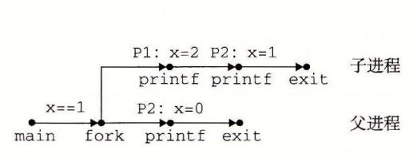

8-4 7 练习题 8. 的进程图

8.3 我们知道序列 acbc、abcc 和 bacc 是可能的,因为它们对应有进程图的拓扑排序(图 8-48)。而像 bcac 和 cbca 这样的序列不对应有任何拓扑排序,因此它们是不可行的。

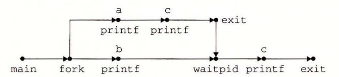

图 8-48 练习题 8.3 的进程图

- 8.4 A. 只简单地计算进程图(图 8-49)中 printf 顶点的个数就能确定输出行数。在这里,有6个这样的 顶点, 因此程序会打印6行输出。
  - B. 任何对应有进程图的拓扑排序的输出序列都是可能的。例如: Hello、1、0、Bye、2、Bye 是可 能的。


图 8-49 练习题 8.4 的讲程图

```
8.5
                                                                - code/ecf/snooze.c
      1
          unsigned int snooze(unsigned int secs) {
      2
              unsigned int rc = sleep(secs);
      3
              printf("Slept for %d of %d secs.\n", secs-rc, secs);
      4
      5
              return rc;
          }

    code/ecf/snooze.c

8.6
                                                                code/ecf/myecho.c
      1
          #include "csapp.h"
      2
          int main(int argc, char *argv[], char *envp[])
      4
              int i;
      5
      6
              printf("Command-line arguments:\n");
              for (i=0; argv[i] != NULL; i++)
      8
      9
                  printf("
                              argv[%2d]: %s\n", i, argv[i]);
     10
     11
              printf("\n");
     12
              printf("Environment variables:\n");
     13
              for (i=0; envp[i] != NULL; i++)
     14
                  printf("
                               envp[%2d]: %s\n", i, envp[i]);
     15
              exit(0);
     16
          }
     17
                                                              code/ecf/myecho.c
```

只要休眠进程收到一个未被忽略的信号, sleep 函数就会提前返回。但是, 因为收到一个 SIGINT 信号的默认行为就是终止进程(图 8-26),我们必须设置一个 SIGINT 处理程序来允许 sleep 函数返 回。处理程序简单地捕获 SIGNAL,并将控制返回给 sleep 函数,该函数会立即返回。

```
— code/ecf/snooze.c
```

<sup>#</sup>include "csapp.h"

```
/* SIGINT handler */
    void handler(int sig)
5
        return; /* Catch the signal and return */
6
    }
7
8
9
    unsigned int snooze(unsigned int secs) {
10
        unsigned int rc = sleep(secs);
11
        printf("Slept for %d of %d secs.\n", secs-rc, secs);
12
13
        return rc;
14
    }
15
16
    int main(int argc, char **argv) {
17
        if (argc != 2) {
18
            fprintf(stderr, "usage: %s <secs>\n", argv[0]);
19
20
            exit(0);
21
        }
22
        if (signal(SIGINT, handler) == SIG_ERR) /* Install SIGINT */
23
24
            unix_error("signal error\n");
                                            /* handler
        (void)snooze(atoi(argv[1]));
        exit(0);
27
    }
                                                        - code/ecf/snooze.c
```

8.8 这个程序打印字符串 "213",这是卡内基-梅隆大学 CS: APP 课程的缩写名。父进程开始时打印 "2",然后创建子进程,子进程会陷入一个无限循环。然后父进程向子进程发送一个信号,并等待 它终止。子进程捕获这个信号(中断这个无限循环),对计数器值(从初始值 2)减一,打印 "1",然 后终止。在父进程回收子进程之后,它对计数器值(从初始值 2)加一,打印 "3",并且终止。

C H —\_ \_AP T E R 9 . .

# 虚拟内存

个系统中的进程是与其他进程共享 CPU 和主存资源的 然而,共享主存会形成 些特殊的挑战。随着对 CPU 需求的增长,进程以某种合理的平滑方式慢了下来 但是如 果太多的进程需要太多的内存,那么它们中的一些就根本无法运行 当一个程序没有空间 可用时,那就是它运气不好了 内存还很容易被破坏。如果某个进程不小心写了另 个进 程使用的内存,它就可能以某种完全和程序逻辑无关的令人迷惑的方式失败。

为了更加有效地管理内存并且少出错,现代系统提供了 种对主存的抽象概念,叫做 虚拟内存 (VM) 。虚拟内存是硬件异常、硬件地址翻译、主存、磁盘文件和内核软件的完 美交互,它为每个进程提供了一个大的、 致的和私有的地址空间 通过 个很清晰的机 制,虚拟内存提供了三个重要的能力: )它将主存看成是 个存储在磁盘上的地址空间的 高速缓存,在主存中只保存活动区域,并根据需要在磁盘和 存之间来回传送数据,通过 这种方式,它高效地使用了主存 2) 它为每个进程提供了一致的地址空间,从而简化了内 存管理。 3) 它保护了每个进程的地址空间不被其他进程破坏

虚拟内存是计算机系统最重要的概念之一 它成功的一个主要原因就是 因为它 是沉默 地、自动地工作的,不需要应用程序员的任 何干涉 。既然虚拟内存在幕后工作得如 此之 好,为什么程序员还需要理解它呢?有以下几个原因:

- 虚拟内存是核心的。虚拟内存遍及计算机系统的所有层面,在硬件异常、汇编器、 链接器、加载器、共享对象 、文 件和进程的设计中扮演着 重要 角色。理解虚拟内存 将帮助你更好地理解系统通常是如何工作的。
- ..虚拟内存是强大的 。虚拟内存给予应用程序强大的能力,可以创建和销毁内存片 (chunk) 、将内存片映射到 磁盘文件的某个部分,以及与其他进程共享内存 比如, 你知道可以通过读写内存位置读或者修改一个磁盘文件的内容吗?或者可以加载一 个文件的内容到内存中,而不需要进行任何显式地复制吗?理解虚拟内存将帮助你 利用它的强大功能在应用程序中添加动力。
- 虚拟内存是危险的。每次应用程序引用 个变最、间接引用一个指针,或者调用 诸如 malloc 这样的动态分配程序时,它就会和虚拟内存发生交互 如果虚拟内存使 用不当,应用将遇到复杂危险的与内存有关的错误 例如,一个带有错误指针的程序 可以 即崩溃千"段错误"或者"保护错误",它可能在崩溃之前还默默地运行了几 个小时,或者是最令人惊慌地,运行完成却产生不正确的结果 理解虚拟内存以及诸 malloc 之类的管理虚拟内存的分配程序,可以帮助你避免这些错误

这一 从两个角度来看虚拟内存 。本章 的前 部分描述虚拟内存是如何工作的。后 部分描述的是应用程序如何使用和管理虚拟内存。无可避免的事实是虚拟内存很复杂,本 章很多地方都反映了这一点 好消息就是如果你掌握这些细节,你就能够手工模拟一个小 系统的虚拟内存机制,而且虚拟内存的概念将永远不再神秘

第二部分是建立在这种理解之上的,向你展示了如何在程序中使用和管理虚拟内存 你将学会如何通过显式的内存映射和对像 malloc 程序这样的动态内存分配器的调用来

理虚拟内存。你还将了解到 程序中的大多数常见的与内存有关的错误,并学会 如何避免 它们的出现

## 9. 1 物理和虚拟寻址

计算机系统的主存被组织成一个由 个连续的字节大小的单元组成的数组 每字节

都有 个唯一的物理地址 (Physical Address , PA) 第一个字节的地址为 o, 接下来的字节地址 ,再下一个为 2' 依此类推。给定这种简单的 结构, CPU 访问内存的最自然的方式就是使用物 理地址 我们把这种方式称为物理寻址 (physical ad dr ess ing 展示了一个物理寻址的示例, 该示例的上下文是一条加载指令,它读取从物理 地址 处开始的 字节字 CPU 执行这条加载 指令时,会生成一个有效物理地址,通过内存总 线,把它传递给主存 主存取出从物理地址 开始的 字节字,并将它返回给 CPU, CPU 会将 它存放在一个寄存器里

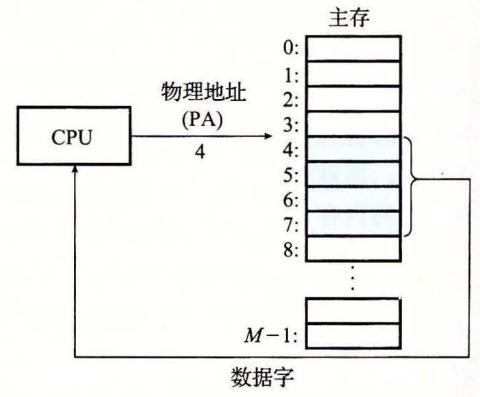

l 个使用物理 址的系统

期的 PC 使用物理寻址,而且诸如数字信号处理器、嵌入式微控制器以及 Cray 超级 计算机这样的系统仍然继续使用这种寻址方式。然而,现代处理器使用的是一种称为虚拟 寻址 (virtual addressing) 的寻址形式,参见图 9-2

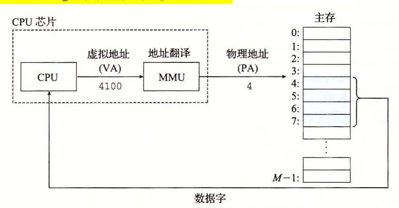

一个使用虚拟寻址的系统

使用虚拟寻址, CPU 通过生成一个虚拟地址 (Virtual Address, VA) 来访问主存,这 个虚拟地址在被送到内存之前先转换成适当的物理地址。将 个虚拟地址转换为物理地址 的任务叫做地址翻译 (address translation) 。就像异常处理一样,地址翻译需要 PU 硬件 和操作系统之间的紧密合作 CPU 芯片上叫做内存管理单元 (Memory Management Unit, MMU) 的专用硬件,利用存放在主存中的查询表来动态翻译虚拟地址,该表的内容由操作 系统管理。

### 9. 2 地址空间

地址空间 (a ddr ess pa ce) 个非负整数地址的有序集合:

$$\{0,1,2,\cdots\}$$

如果地址空间中的整数是连续的,那么我们说它是 个线性地址空间 (linear address space) 。为了简化讨论,我们总是假设使用的是线性地址空间 个带虚拟内存的系统 中, CPU 个有 =矿个地址的地址 间中 成虚拟地址,这个地址空间称为虚拟地 址空间 (virtual address space) :

$$\{0,1,2,\cdots,N-1\}$$

一个地址空间的大小是由表示最大地址所需要的位数来描述的。例如,一个包含 N= 沪个地址的虚拟地址空间就叫做一个 位地址 现代系统通常支持 <sup>32</sup> 位或者 <sup>64</sup> 位虚 拟地址空间。

一个系统还有一个物理地址空间 (physical address space) ,对应于系统中物理内存的 个字节:

$$\{0,1,2,\cdots,M-1\}$$

不要求是 的幕,但是为了简化讨论,我们假设 2'

地址空间的概念是很重要的,因为它清楚地区分了数据对象(字节)和它们的属性(地 址)。一 认识到了这种区别,那么我们就可以将其推广,允许每个数据对象有多个独立 的地址,其中每个地址都选自一个不同的地址空间 这就是虚拟内存的 本思想 主存中 的每字节都有一个选自虚拟地址 间的虚拟地址和一个选自物理地址空间的物理地址。

练习题 1 完成下面的表格,填写缺失的条目,并且用适当的整数取代每 问号。 利用下列单位: K=Z1 Ckilo, 千), 22° C mega, ,百万), G= 230 (giga, 千兆, 十亿), T=Z tera, 万亿), P= (peta, 千千兆),或 £=2 <sup>60</sup> (exa, 千兆兆)。

| 虚拟地址位数 (n) | 虚拟地址数 (N) | 最大可能的虚拟地址            |
|------------|-----------|----------------------|
| 8          |           |                      |
|            | 2' = 64K  |                      |
|            |           | I= ?G-<br>232 -<br>I |
|            | 2'= 256T  |                      |
| 64         |           |                      |

## 9. 3 虚拟内存作为缓存的工具

概念上而言,虚拟内存被组织为 个由存放在磁盘上的 个连续的字节大小的单元 组成的数组 每字节都有一个唯一的虚拟地址,作为到数组的索引。磁盘上数组的内容被 缓存在主存中 和存储器层次结构中其他缓存一样,磁盘(较低层)上的数据被分割成块, 这些块作为磁盘和主存(较高层)之间的传输单元 VM 系统通过将虚拟内存分割为称为虚 拟页 (Virtual Page, VP) 的大小固定的块来处理这个问题 每个虚拟页的大小为 =沪字 类似地,物理内存被分割为物理页 (Physical Page, PP) ,大小也为 字节(物理页也 被称为页帧 (page fram ))

在任意时刻,虚拟页面的集合都分为三个不相交的子集:

- ·未分配的: VM 系统还未分配(或者创建)的页 未分配的块没有任何数据和它们相 关联,因此也就不占用任何磁盘空间。
- ·缓存的:当前已缓存在物理内存中的已分配页
- ·未缓存的:未缓存在物理内存中的已分配页

的示例展示了一个有 个虚拟页的小虚拟内存。虚拟页 还没有被分配,

因此在磁盘上还不存在。虚拟页 被缓存在物理内存中。页 已经被分配 了,但是当前并未缓存在主存中

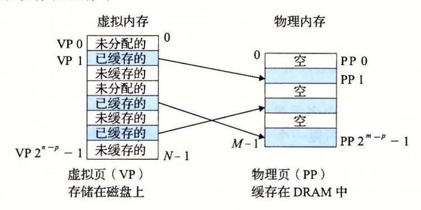

9-:l 一个 VM 系统是如何使用主存作为缓存的

### 9. 3. 1 DRAM 缓存的组织结构

为了有助于清晰理解存储层次结构中不同的缓存概念,我们将使用术语 SRAM 缓存 来表示位于 CPU 和主存之间的 L1 L2 L3 高速缓存,并且用术语 DRAM 缓存来表示 虚拟内存系统的缓存,它在主存中缓存虚拟页

在存储层次结构中, DRAM 缓存的位置对它的组织结构有很大的影响 回想一下, DRAM SRAM 要慢大约 <sup>10</sup> 倍,而磁盘要比 DRAM 慢大约 <sup>100</sup> <sup>000</sup> 多倍 因此, DRAM 缓存中的不命中比起 SRAM 缓存中的不命中要昂贵得多,这是因为 DRAM 缓存 不命中要由磁盘来服务,而 SRAM 缓存不命中通常是由基千 DRAM 的主存来服务的。而 且,从磁盘的一个扇区读取第 个字节的时间开销比起读这个扇区中连续的字节要慢大约 100 <sup>000</sup> 倍。归根到底, DRAM 缓存的组织结构完全是由巨大的不命中开销驱动的

因为大的不命中处罚和访问第一个字节的开销,虚拟页往往很大,通常是 4KB~ 2MB 。由于大的不命中处罚, DRAM 缓存是全相联的,即任何虚拟页都可以放置在任何 的物理页中。不命中时的替换策略也很重要,因为替换错了虚拟页的处罚也非常之高 此,与硬件对 SRAM 缓存相比,操作系统对 DRAM 缓存使用了更复杂精密的替换算法。 (这些替换算法超出了我们的讨论范围)。最后,因为对磁盘的访问时间很长, DRAM 存总是使用写回,而不是直写。

### 9. 3. 2 页表

同任何缓存一样,虚拟内存系统必须有某种方法来判定一个虚拟页是否缓存在 DRAM 中的某个地方 如果是,系统还必须确定这个虚拟页存放在哪个物理页中。如果 不命中,系统必须判断这个虚拟页存放在磁盘的哪个位置,在物理内存中选择一个牺牲 页,并将虚拟页从磁盘复制到 DRAM 中,替换这个牺牲页。

这些功能是由软硬件联合提供的,包括操作系统软件、 MMU (内存管理单元)中的地 址翻译硬件和一个存放在物理内存中叫做页表 (page table) 的数据结构,页表将虚拟页映 射到物理页。每次地址翻译硬件将一个虚拟地址转换为物理地址时,都会读取页表 操作 系统负责维护页表的内容,以及在磁盘与 DRAM 之间来回传送页。

9-4 展示了一个页表的基本组织结构。页表就是一个页表条目 (Page Table Entry, PTE) 的数组。虚拟地址空间中的每个页在页表中一个固定偏移狱处都有一个 PTE 为了

我们的目的,我们将假设每个 PTE 是由一个有效位(valid bit)和一个 n 位地址字段组成

的。有效位表明了该虚拟页当前是否被缓存在 DRAM 中。如果设置了有效位,那么地址字段就表示 DRAM 中相应的物理页的起始位置,这个物理页中缓存了该虚拟页。如果没有设置有效位,那么一个空地址表示这个虚拟页还未被分配。否则,这个地址就指向该虚拟页在磁盘上的起始位置。

图 9-4 中的示例展示了一个有 8 个虚拟页和 4 个物理页的系统的页表。四个虚拟页(VP 1、VP 2、VP 4 和 VP 7)当前被缓存在 DRAM 中。两个页(VP 0 和 VP 5)还未被分配,而剩下的

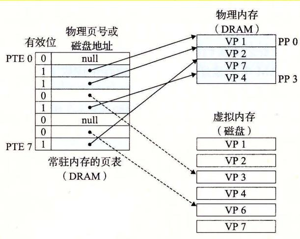

图 9-4 页表

页(VP 3 和 VP 6)已经被分配了,但是当前还未被缓存。图 9-4 中有一个要点要注意,因为 DRAM 缓存是全相联的,所以任意物理页都可以包含任意虚拟页。

📉 练习题 9.2 确定下列虚拟地址大小(n)和页大小(P)的组合所需要的 PTE 数量:

| n  | $P=2^p$ | PTE数量 |
|----|---------|-------|
| 16 | 4K      |       |
| 16 | 8K      |       |
| 32 | 4K      |       |
| 32 | 8K      |       |

#### 9.3.3 页命中

考虑一下当 CPU 想要读包含在 VP 2 中的虚拟内存的一个字时会发生什么(图 9-5), VP 2 被缓存在 DRAM 中。使用我们将在 9.6 节中详细描述的一种技术,地址翻译硬件将虚拟地址作为一个索引来定位 PTE 2,并从内存中读取它。因为设置了有效位,那么地址翻译硬件就知道 VP 2 是缓存在内存中的了。所以它使用 PTE 中的物理内存地址(该地址指向 PP 1 中缓存页的起始位置),构造出这个字的物理地址。

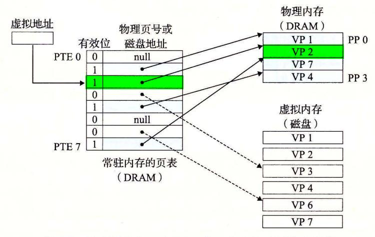

图 9-5 VM 页命中。对 VP 2 中一个字的引用就会命中

### 9.3.4 缺页

在虚拟内存的习惯说法中,DRAM 缓存不命中称为缺页 (page fault)。图 9-6 展示了在缺页之前 我们的示例页表的状态。CPU 引用了 VP 3 中的一个字,VP 3 并未缓存在 DRAM 中。地址翻译硬件从内存中读取 PTE 3,从有效位推断出 VP 3 未被缓存,并且触发一个缺页异常。缺页异常调用内核中的缺页异常处理程序,该程序会选择一个牺牲页,在此例中就是存放在 PP 3 中的 VP 4。如果 VP 4 已经被修改了,那么内核就会将它复制回磁盘。无论哪种情况,内核都会修改 VP 4 的页表条目,反映出 VP 4 不再缓存在主存中这一事实。

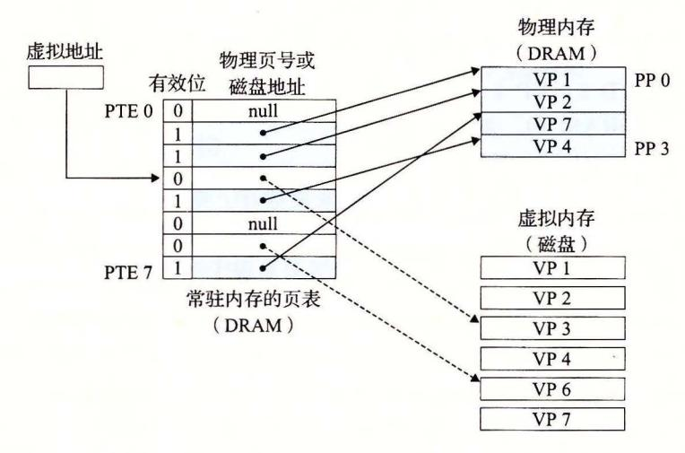

图 9-6 VM 缺页(之前)。对 VP 3 中的字的引用会不命中,从而触发了缺页

接下来,内核从磁盘复制 VP 3 到内存中的 PP 3,更新 PTE 3,随后返回。当异常处理程序返回时,它会重新启动导致缺页的指令,该指令会把导致缺页的虚拟地址重发送到地址翻译硬件。但是现在, VP 3 已经缓存在主存中了,那么页命中也能由地址翻译硬件正常处理了。图 9-7 展示了在缺页之后我们的示例页表的状态。

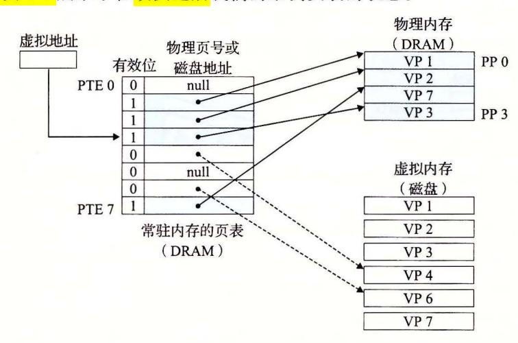

图 9-7 VM 缺页(之后)。缺页处理程序选择 VP 4 作为牺牲页,并从磁盘上用 VP 3 的副本取代它。在缺页处理程序重新启动导致缺页的指令之后,该指令将从内存中正常地读取字,而不会再产生异常