虚拟内存是在 20 世纪 60 年代早期发明的, 远在 CPU-内存之间差距的加大引发产生 SRAM 缓存之前。因此, 虚拟内存系统使用了和 SRAM 缓存不同的术语, 即使它们的许 **多概念是相似的。在虚拟内存的习惯说法中,块被称为页。在磁盘和内存之间传送页的活** 动叫做交换(swapping)或者页面调度(paging)。页从磁盘换入(或者页面调入)DRAM 和从 DRAM 换出(或者页面调出)磁盘。一直等待,直到最后时刻,也就是当有不命中发生时, 才换入页面的这种策略称为按需页面调度(demand paging)。也可以采用其他的方法,例 如尝试着预测不命中, 在页面实际被引用之前就换入页面。然而, 所有现代系统都使用的 是按需页面调度的方式。

#### 9.3.5 分配页面

图 9-8 展示了当操作系统分配一个 新的虚拟内存页时对我们示例页表的 影响,例如,调用 malloc 的结果。在 这个示例中, VP5 的分配过程是在磁 盘上创建空间并更新 PTE 5, 使它指 向磁盘上这个新创建的页面。

### 9.3.6 又是局部性救了我们

当我们中的许多人都了解了虚拟 内存的概念之后,我们的第一印象通 常是它的效率应该是非常低。因为不 破坏程序性能。实际上,虚拟内存工 作得相当好,这主要归功于我们的老朋友局部性(locality)。

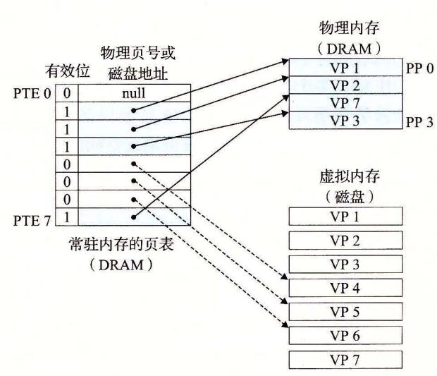

命中处罚很大,我们担心页面调度会 图 9-8 分配一个新的虚拟页面。内核在磁盘上分配 VP 5, 并且将 PTE 5 指向这个新的位置

.尽管在整个运行过程中程序引用的不同页面的总数可能超出物理内存总的大小,但是局部 性原则保证了在任意时刻,程序将趋向于在一个较小的活动页面(active page)集合上工作,这个 集合叫做工作集(working set)或者常驻集合(resident set)。在初始开销,也就是将工作集页面调 度到内存中之后,接下来对这个工作集的引用将导致命中,而不会产生额外的磁盘流量。

只要我们的程序有好的时间局部性, 虚拟内存系统就能工作得相当好。但是, 当然不 是所有的程序都能展现良好的时间局部性。如果工作集的大小超出了物理内存的大小,那 么程序将产生一种不幸的状态,叫做抖动(thrashing),这时页面将不断地换进换出。虽然 虚拟内存通常是有效的,但是如果一个程序性能慢得像爬一样,那么聪明的程序员会考虑 是不是发生了抖动。

## 旁注 统计缺页次数

你可以利用 Linux 的 getrusage 函数监测缺页的数量(以及许多其他的信息)。

# 9.4 虚拟内存作为内存管理的工具

在上一节中,我们看到虚拟内存是如何提供一种机制,利用 DRAM 缓存来自通常更 大的虚拟地址空间的页面。有趣的是,一些早期的系统,比如 DEC PDP-11/70,支持的 是一个比物理内存更小的虚拟地址空间。然而,虚拟地址仍然是一个有用的机制,因为它

大大地简化了内存管理,并提供了 种自然的保护内存的方法

到目前为止,我们都假设有 个单 独的页表,将一个虚拟地址空间映射到 物理地址空间。实际上,操作系统为每 进程 个进程提供了 个独立的页表,因而也 就是一个独立的虚拟地址空间。图 9-9 展示了基本思想。在这个示例中,进程 的页表将 Pl 映射到 PP 2, VP 射到 PP 相似地,进程)的页 进程 J: VP 映射到 PP 7, VP 映射到 PP N- <sup>I</sup>

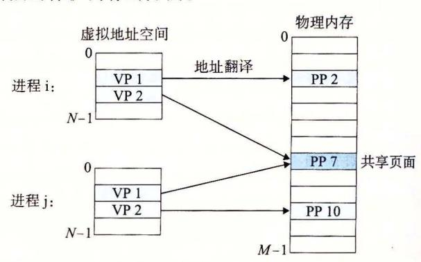

<sup>10</sup> 注意,多个虚拟页面可以映射到同 VM 如何为进程提供独立的地址 。操 作系统 个共 物理页面上。 为系统中的 个进程都维护一个独 的页表

按需页面调度和独立的虚拟地址空间的结合,对系统中内存的使用和管理造成了深远的 。特别地, VM 简化了链接和加载、代码和数据共 ,以及应用程序的内存分配

- 简化链接。独立的地址空间允许每个进程的内存映像使用相同的基本格式,而不管 代码和数据实际存放在物理内存的何处 例如,像我们在图 8-13 中看到的,一个给 定的 Linux 系统上的每个进程都使用类似的内存格式 对千 <sup>64</sup> 位地址空间,代码 段总是从虚拟地址 Ox400000 开始。数据段跟在代码段之后,中间有一段符合要求 的对齐空白 栈占据用 户进程 地址空间最高的部分,并向下生长。这样的 致性极 大地简化了链接器的设计和 现,允许链接器生成 完全链接的可执行文件,这些可 执行文件是独立于物理内存中代码和数据的 最终
- 简化加载。虚拟内存还使得容易向内存中加载可执行文件和共享对象文件 要把目 标文件中. text data 节加载到一个新创建的进程中, Linux 加载器为代码和数 据段分配虚拟页,把它们标记为无效的(即未被缓存的),将页表条目指向目标文件 中适当的位置 有趣的是,加载器从不从磁盘到内存实际复制任何数据 。在每个页 初次被引用时,要么是 CPU 取指令时引用的,要么是一条正在执行的指令引用一 个内存位置时引用的,虚拟内存系统会按照需要 自动地调入数据页。
- 将一组连续的虚拟页映射到任意一个文件中的任意位 示法称作内存映射 (memory mapping) Linux 提供一个称为 mmap 的系统调用,允许应用程序自己做内存映 我们会在 节中更详细地描述应用级内存映射。
- 简化共享 独立地址空间为操作系统提供了一个管理用户进程和操作系统自身之间 共享的一致机制 般而 ,每个进程都有自己私有的代码、数据、堆以及栈区 域,是不和其他进程共 在这种情况中,操作系统创建页表,将相应的虚拟页 映射到不连续的物理页面

然而,在一些情况中,还是需要进程来共享代码和数据 例如,每个进程必须调用相同 的操作系统内核代码,而每个 程序都会调用 标准库中的程序,比如 prin 江。操作系统 通过将不同进程中适当的虚拟页面映射到相同的物理页面,从而安排多个进程共享这部分代 码的一个副本,而不是在每个进程中都包括单独的内核和 标准库的副本 如图 9-9 所示

简化内存分配 。虚 拟内存为向用户进程提供 个简单的分配额外内存的机制。当一 个运行在用户进程中的程序要求额外的堆空间时(如调用 malloc 的结果),操作系 统分配一个适当数字(例如 K) 个连续的虚拟内存页面,并且将它们映射到物理内存 中任意位置的 k 个任意的物理页面。由于页表工作的方式,操作系统没有必要分配 k 个连续的物理内存页面。页面可以随机地分散在物理内存中。

## 9.5 虚拟内存作为内存保护的工具

任何现代计算机系统必须为操作系统提供手段来控制对内存系统的访问。不应该允许一个用户进程修改它的只读代码段。而且也不应该允许它读或修改任何内核中的代码和数据结构。不应该允许它读或者写其他进程的私有内存,并且不允许它修改任何与其他进程共享的虚拟页面,除非所有的共享者都显式地允许它这么做(通过调用明确的进程间通信系统调用)。

就像我们所看到的,提供独立的地址空间使得区分不同进程的私有内存变得容易。但是,地址翻译机制可以以一种自然的方式扩展到提供更好的访问控制。因为每次 CPU 生成一个地址时,地址翻译硬件都会读一个 PTE,所以通过在 PTE 上添加一些额外的许可位来控制对一个虚拟页面内容的访问十分简单。图 9-10 展示了大致的思想。

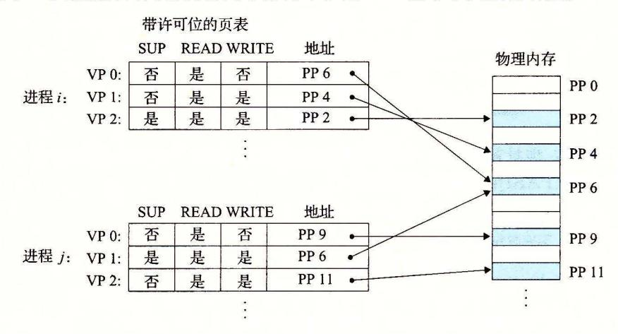

图 9-10 用虚拟内存来提供页面级的内存保护

在这个示例中,每个 PTE 中已经添加了三个许可位。SUP 位表示进程是否必须运行在内核(超级用户)模式下才能访问该页。运行在内核模式中的进程可以访问任何页面,但是运行在用户模式中的进程只允许访问那些 SUP 为 0 的页面。READ 位和 WRITE 位控制对页面的读和写访问。例如,如果进程 i 运行在用户模式下,那么它有读 VP 0 和读写 VP 1 的权限。然而,不允许它访问 VP 2。

如果一条指令违反了这些许可条件,那么 CPU 就触发一个一般保护故障,将控制传递给一个内核中的异常处理程序。Linux shell 一般将这种异常报告为"段错误(segmentation fault)"。

## 9.6 地址翻译

这一节讲述的是地址翻译的基础知识。我们的目标是让你了解硬件在支持虚拟内存中的角色,并给出足够多的细节使得你可以亲手演示一些具体的示例。不过,要记住我们省略了大量的细节,尤其是和时序相关的细节,虽然这些细节对硬件设计者来说是非常重要的,但是超出了我们讨论的范围。图 9-11 概括了我们在这节里将要使用的所有符号,供读者参考。

|        | 基本参数         |
|--------|--------------|
| 符号     | 描述           |
| N=2"   | 虚拟地址空间中的地址数蜇 |
| M = 2m | 物理地址空间中的地址数蜇 |
| P = 2P | 页的大小( 字节)    |

|      | 虚拟地址 (VA)<br>的组成部分 |
|------|--------------------|
|      | 描述                 |
| VPO  | 虚拟页面偏移量(字节)        |
| VPN  | 拟页号                |
| TLBI | TLB 索引             |
| TLBT | TLB 标记             |

|     | 物理地址<br>的组成部分<br>(PA) |
|-----|-----------------------|
|     | 描述                    |
| PPO | 物理页面偏移矗(字节)           |
| PPN | 物理页号                  |
| co  | 缓冲块内的字节偏移             |
| CI  | 高速缓存索引                |
| CT  | 高速缓存标记                |

9- <sup>11</sup> 地址翻译符

形式上来说,地址翻译是一个 元素的虚拟地址空间 (VAS) 中的元素和一个 元素 的物理地址空间 (PAS) 中元素之间的映射,

MAP :VAS--- PAS U 0

这里

MAP(A) = { /如果虚拟地址 处的数据在 PAS 的物理地址 如果虚拟地址 处的数据不 物理内存

展示 MMU 如何利用页表来实现这种映射 PU 中的一个控制寄存器,页表 基址寄存器 (Page Table Base Register, PTBR) 指向 当前页表。 位的虚拟地址包含两个部分: 一个 位的虚拟页面偏移 (Virtu Page Offset, VPO) (n p) 位的虚拟页号 (Virtual

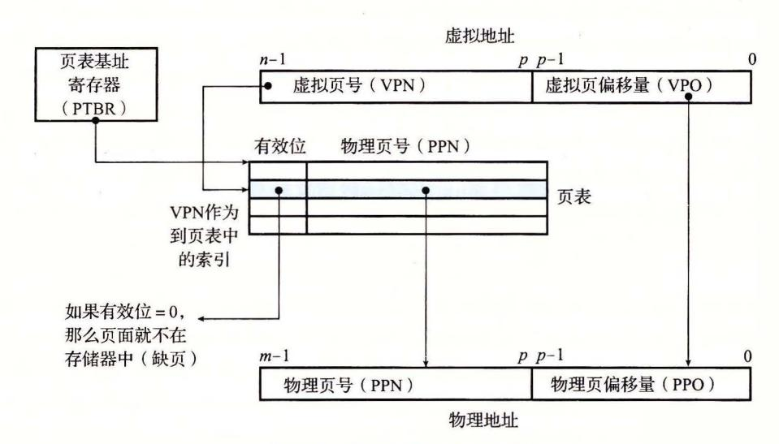

9- 使用页表的地址翻

Page Number, VPN) MMU 利用 VPN 来选择适当的 PTE 。例如, VPN 选择 PTE O, VPN 选择 PTE 1, 以此类推。将页表条目中物理页号 (Physical Page Number, PPN) 和虚拟 地址中的 VPO 串联起来,就得到相应的物理地址。注意,因为物理和虚拟页面都是 字节 的,所以物理页面偏移 Physical Page Off set, PPO) VPO 是相同的

9-13a 展示了当页面命中时, CPU 硬件执行的步骤。

- 处理器生成一个虚拟地址,并把它传送给 MMU
- 步: MMU 生成 PTE 地址,并从高速缓存 主存请求得到它
- 步:高速缓存 主存向 MMU 返回 PTE
- 步: MMU 构造物理地址,并把它传送给高速缓存 主存
- 步:高速缓存 主存返回所请求的数据字给处理器

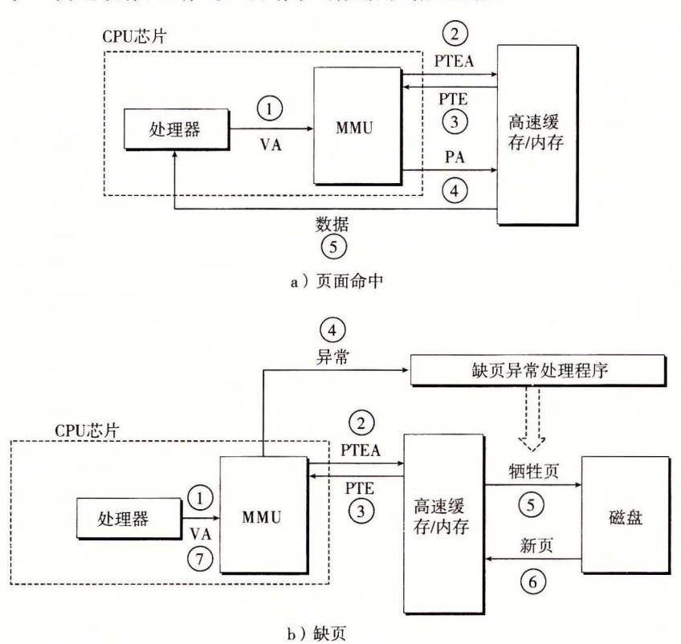

页面命中和缺页的操作图 (VA :虚拟地址 PTEA: PTE :页表条目 PA :物理地址) 页表条目地址。

页面命中完全是由硬件来处理的,与之不同的是,处理缺页要求硬件和操作系统内核 协作完成,如图 9-136 所示。

- 步到笫 和图 13a 中的第 步到第 步相同
- 步: PTE 中的有效位是 ,所以 MMU 触发了 次异常,传递 CPU 中的控制 到操作系统内核中的缺页异常处理程序。
- 缺页处理程序确定出物理内存中的牺牲页,如果这个页面已经被修改了, 则把它换出到磁盘。
- 缺页处理程序页面调入新的页面,并更新内存中的 PTE

.第 步:缺页处理程序返回到原来的进程,再次执行导致缺页的指令。 CPU 将引起缺 页的虚拟地址重新发送给 MMU 。因为虚拟页面现在缓存在物理内存中,所以就会命 中,在 MMU 执行了图 9-13b 中的步骤之后,主存就会将所请求字返回给处理器

练习题 3 定一个 <sup>32</sup> 位的虚拟地址空 和一个 <sup>24</sup> 位的物理地址,对于下面的页 面大小 P, VPN VPO PPN PPO 中的位数:

| p   | VPN位数 | VPO位数 | PPN位数 | PPO位数 |
|-----|-------|-------|-------|-------|
| IKB |       |       |       |       |
| 2KB |       |       |       |       |
| 4KB |       |       |       |       |
| 8KB |       |       |       |       |

## 9. 6. 1 结合高速缓存和虚拟内存

在任何既使用虚拟内存又使用 SRAM 高速缓存的系统中,都有应该使用虚拟地址还 是使用物理地址来访问 SRAM 高速缓存的问题。尽管关于这个折中的详细讨论巳经超出 了我们的讨论范围,但是大多数系统是选择物理寻址的。使用物理寻址,多个进程同时在 高速缓存中有存储块和共享来自相同虚拟页面的块成为很简单的事情 而且,高速缓存无 需处理保护问题,因为访问权限的检查是地址翻译过程的 部分

9-14 展示了一个物理 址的高速缓存如何和虚拟内存结合起来 主要的思路是地 址翻译发生在高速缓存查找之前 注意,页表条目可以缓存,就像其他的数据字 样。

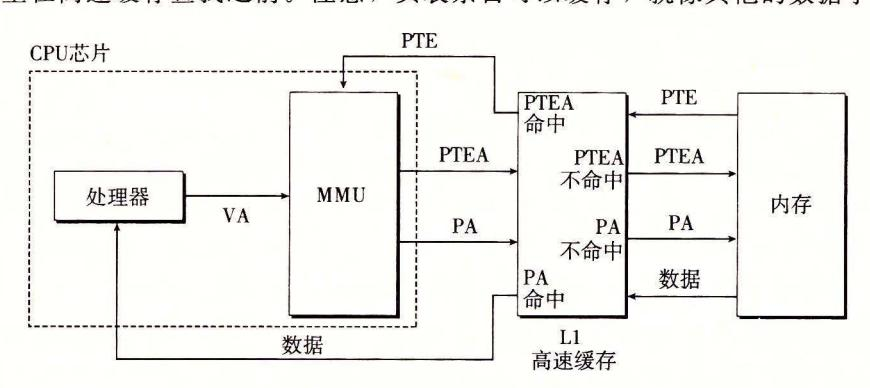

l l VM 与物理寻址的高速缓存结合起来 (VA :虚拟地址。 PTEA: 页表条目地址 PTE :页表条目。 PA :物理地址)

## 9. 6. 2 利用 TLB 加速地址翻译

正如我们看到的,每次 CPU 产生一个虚拟地址, MMU 就必须查阅一个 PTE, 以便 将虚拟地址翻译为物理地址。在最糟糕的情况下,这会要求从内存多取 次数据,代价是 几十到几百个周期。如果 PTE 碰巧缓存在 L1 中,那么开销就下降到 个或 个周期。然 而,许多系统都试图消除即使是这样的开销,它们在 MMU 中包括了 个关于 PTE 的小 的缓存,称为翻译后备缓冲器 (Translation Lookaside Buffer, TLB)

中每一行都保存着 个由单个 PTE 组成的块。 1TLB标记 (TLBT)|TLB索引 (TLBI) | VPO | TLB 通常有高度的相联度。如图 9-15 所示, VPN 用千组选择和行匹配的索引和标记字段是从 l5 虚拟地址中用以访问 TLB 的组成部分

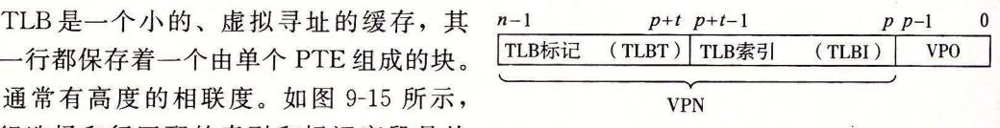

虚拟地址中的虚拟页号中提取出来的。如果 TLB T=2 个组,那么 TLB 索引 (TLBI) 是由 VPN 个最低位组成的,而 TLB 标记 (TLBT) 是由 VPN 中剩余的位组成的。

9-16a 展示了当 TLB 命中时(通常情况)所包括的步骤。这里的关键点是,所有的地 址翻译步骤都是在芯片上的 MMU 中执行的,因此非常快。

- ·笫 步: CPU 产生一个虚拟地址。
- .第 步和笫 步: MMU TLB 中取出相应的 PTE
- .第 步: MMU 将这个虚拟地址翻译成一个物理地址,并且将它发送到高速缓存 主存。
- .第 步:高速缓存 主存将所请求的数据字返回给 CPU

TLB 不命中时, MMU 必须从 L1 缓存中取出相应的 PTE, 如图 16b 所示。新取 出的 PTE 存放在 TLB 中,可能会覆盖一个已经存在的条目。

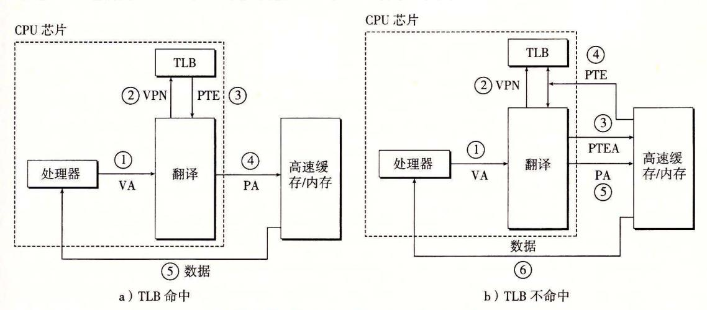

<sup>16</sup> TLB 命中和不命中的操作图

## 9. 6.. 3 多级页表

到目前为止,我们一直假设系统只用一个单独的页表来进行地址翻译。但是如果我们 <sup>32</sup> 位的地址空间、 4KB 的页面和 字节的 PTE, 那么即使应用所引用的只是 虚拟地址空间中很小的一部分,也总是需要一个 4MB 的页表驻留在内存中。对于地址空 间为 <sup>64</sup> 位的系统来说,问题将变得更复杂。

用来压缩页表的常用方法是使用层次结构的页表 用一个具体的示例是最容易理解这 个思想的。假设 <sup>32</sup> 位虚拟地址空间被分为 4KB 的页,而每个页表条目都是 字节。还假 设在这 时刻,虚拟地址空间有如下形式:内存的前 2K 个页面分配给了代码和数据,接 下来的 6K 个页面还未分配,再接下来的 <sup>1023</sup> 个页面也未分配,接下来的 个页面分配给 了用户栈。图 <sup>17</sup> 展示了我们如何为这个虚拟地址空间构造一个两级的页表层次结构。

一级页表中的每个 PTE 负责映射虚拟地址空间中 4MB 的片 (chunk) ,这里每一 片都是由 <sup>1024</sup> 个连续的页面组成的。比如, PTE 映射第一片, PTE 映射接下来的 片,以此类推。假设地址空间是 4GB, <sup>1024</sup> PTE 已经足够覆盖整个空间了。

如果片 中的每个页面都未被分配,那么 PTEi 就为空 例如,图 <sup>17</sup> 中,片 2~7 是未被分配的。然而,如果在片 中至少有一个页是分配了的,那么一级 PTE 就指向 个二级页表的基址。例如,在图 9-17 中,片 的所有或者部分已被分配,所以它 们的一级 PTE 就指向二级页表。


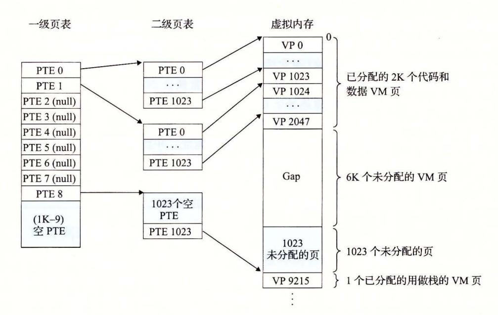

图 9-17 一个两级页表层次结构。注意地址是从上往下增加的

二级页表中的每个 PTE 都负责映射一个 4KB 的虚拟内存页面,就像我们查看只有一级的页表一样。注意,使用 4 字节的 PTE,每个一级和二级页表都是 4KB 字节,这刚好和一个页面的大小是一样的。

这种方法从两个方面减少了内存要求。第一,如果一级页表中的一个 PTE 是空的,那么相应的二级页表就根本不会存在。这代表着一种巨大的潜在节约,因为对于一个典型的程序,4GB的虚拟地址空间的大部分都会是未分配的。第二,只有一级页表才需要总是在主存中;虚拟内存系统可以在需要时创建、页面调入或调出二级页表,这就减少了主存的压力;只有最经常使用的二级页表才需要缓存在主存中。

图 9-18 描述了使用 k 级页表层次结构的地址翻译。虚拟地址被划分成为 k 个 VPN 和 1 个 VPO。每个 VPN i 都是一个到第 i 级页表的索引,其中  $1 \le i \le k$ 。第 j 级页表中的每个 PTE,  $1 \le j \le k-1$ ,都指向第 j+1 级的某个页表的基址。第 k 级页表中的每个 PTE 包含某个物理页面的 PPN,或者一个磁盘块的地址。为了构造物理地址,在能够确定 PPN 之前,MMU 必须访问 k 个 PTE。对于只有一级的页表结构,PPO 和 VPO 是相同的。

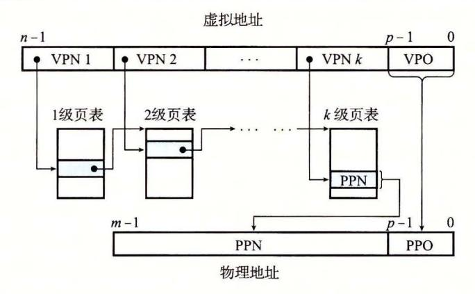

图 9-18 使用 k 级页表的地址翻译

访问 k 个 PTE,第一眼看上去昂贵而不切实际。然而,这里 TLB 能够起作用,正是通过将不同层次上页表的 PTE 缓存起来。实际上,带多级页表的地址翻译并不比单级页表慢很多。

#### 9.6.4 综合:端到端的地址翻译

在这一节里,我们通过一个具体的端到端的地址翻译示例,来综合一下我们刚学过的这些内容,这个示例运行在有一个 TLB 和 L1 d-cache 的小系统上。为了保证可管理性,我们做出如下假设:

- 内存是按字节寻址的。
- 内存访问是针对1字节的字的(不是4字节的字)。
- 虚拟地址是 14 位长的(n=14)。
- 物理地址是12位长的(m=12)。
- 页面大小是 64 字节(P=64)。
- TLB 是四路组相联的, 总共有 16 个条目。
- L1 d-cache 是物理寻址、直接映射的, 行大小为 4 字节, 而总共有 16 个组。

图 9-19 展示了虚拟地址和物理地址的格式。因为每个页面是  $2^6 = 64$  字节,所以虚拟地址和物理地址的低 6 位分别作为 VPO 和 PPO。虚拟地址的高 8 位作为 VPN。物理地址的高 6 位作为 PPN。

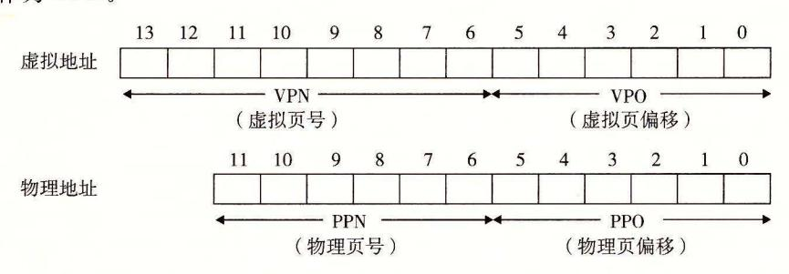

图 9-19 小内存系统的寻址。假设 14 位的虚拟地址(n=14), 12 位的物理地址(m=12)和 64 字节的页面(P=64)

图 9-20 展示了小内存系统的一个快照,包括 TLB(图 9-20a)、页表的一部分(图 9-20b)和 L1 高速缓存(图 9-20c)。在 TLB 和高速缓存的图上面,我们还展示了访问这些设备时硬件是如何划分虚拟地址和物理地址的位的。

- TLB。TLB 是利用 VPN 的位进行虚拟寻址的。因为 TLB 有 4 个组,所以 VPN 的低 2 位就作为组索引(TLBI)。VPN 中剩下的高 6 位作为标记(TLBT),用来区别可能映射到同一个 TLB 组的不同的 VPN。
- 页表。这个页表是一个单级设计,一共有 2<sup>8</sup> = 256 个页表条目(PTE)。然而,我们只对这些条目中的开头 16 个感兴趣。为了方便,我们用索引它的 VPN 来标识每个PTE;但是要记住这些 VPN 并不是页表的一部分,也不储存在内存中。另外,注意每个无效 PTE 的 PPN 都用一个破折号来表示,以加强一个概念:无论刚好这里存储的是什么位值,都是没有任何意义的。
- 高速缓存。直接映射的缓存是通过物理地址中的字段来寻址的。因为每个块都是 4 字节, 所以物理地址的低 2 位作为块偏移(CO)。因为有 16 组, 所以接下来的 4 位 就用来表示组索引(CI)。剩下的 6 位作为标记(CT)。


位 标记位 PPN 有效位 标记位 PPN 有效位 标记位 PPN 有效位 标记位 PPN 有效位

| 0 | 03 | -        | 0 | 09 | 0D | 1 | 00 | _  | 0 | 07 | 02 | 1 |
|---|----|----------|---|----|----|---|----|----|---|----|----|---|
| 1 | 03 | 2D       | 1 | 02 | -  | 0 | 04 | _  | 0 | 0A | _  | 0 |
| 2 | 02 | <b>-</b> | 0 | 08 | _  | 0 | 06 | 1  | 0 | 03 | _  | 0 |
| 3 | 07 | 1        | 0 | 03 | 0D | 1 | 0A | 34 | 1 | 02 | -  | 0 |

a) TLB: 四组, 16个条目, 四路组相联

| VPN | PPN | 有效位 | VPN | PPN | 有效位 |
|-----|-----|-----|-----|-----|-----|
| 00  | 28  | 1   | 08  | 13  | 1   |
| 01  | _   | 0   | 09  | 17  | 1   |
| 02  | 33  | 1   | 0A  | 09  | 1   |
| 03  | 02  | 1   | 0B  | -   | 0   |
| 04  | _   | 0   | 0C  | -   | 0   |
| 05  | 16  | 1   | 0D  | 2D  | 1   |
| 06  | _   | 0   | 0E  | 11  | 1   |
| 07  |     | 0   | 0F  | 0D  | 1   |

b) 页表: 只展示了前 16 个 PTE


索引标记位有效位块0 块1 块2 块3

| 6 (2) |                                                                            |                                                                                                              |                                                                                                           |                                                                                                                                                            |                                                                                                                                                                                                                                                                                                                                                                                                                                                                                           |
|-------|----------------------------------------------------------------------------|--------------------------------------------------------------------------------------------------------------|-----------------------------------------------------------------------------------------------------------|------------------------------------------------------------------------------------------------------------------------------------------------------------|-------------------------------------------------------------------------------------------------------------------------------------------------------------------------------------------------------------------------------------------------------------------------------------------------------------------------------------------------------------------------------------------------------------------------------------------------------------------------------------------|
| 19    | 1                                                                          | 99                                                                                                           | 11                                                                                                        | 23                                                                                                                                                         | 11                                                                                                                                                                                                                                                                                                                                                                                                                                                                                        |
| 15    | 0                                                                          | _                                                                                                            | _                                                                                                         | _                                                                                                                                                          | -                                                                                                                                                                                                                                                                                                                                                                                                                                                                                         |
| 1B    | 1                                                                          | 00                                                                                                           | 02                                                                                                        | 04                                                                                                                                                         | 08                                                                                                                                                                                                                                                                                                                                                                                                                                                                                        |
| 36    | 0                                                                          | _                                                                                                            | -                                                                                                         |                                                                                                                                                            | _                                                                                                                                                                                                                                                                                                                                                                                                                                                                                         |
| 32    | 1                                                                          | 43                                                                                                           | 6D                                                                                                        | 8F                                                                                                                                                         | 09                                                                                                                                                                                                                                                                                                                                                                                                                                                                                        |
| 0D    | 1                                                                          | 36                                                                                                           | 72                                                                                                        | F0                                                                                                                                                         | 1D                                                                                                                                                                                                                                                                                                                                                                                                                                                                                        |
| 31    | 0                                                                          | _                                                                                                            | _                                                                                                         | _                                                                                                                                                          | 79                                                                                                                                                                                                                                                                                                                                                                                                                                                                                        |
| 16    | 1                                                                          | 11                                                                                                           | C2                                                                                                        | DF                                                                                                                                                         | 03                                                                                                                                                                                                                                                                                                                                                                                                                                                                                        |
| 24    | 1                                                                          | 3A                                                                                                           | 00                                                                                                        | 51                                                                                                                                                         | 89                                                                                                                                                                                                                                                                                                                                                                                                                                                                                        |
| 2D    | 0                                                                          | _                                                                                                            | _                                                                                                         | _                                                                                                                                                          | _                                                                                                                                                                                                                                                                                                                                                                                                                                                                                         |
| 2D    | 1                                                                          | 93                                                                                                           | 15                                                                                                        | DA                                                                                                                                                         | 3B                                                                                                                                                                                                                                                                                                                                                                                                                                                                                        |
| 0B    | 0                                                                          | _                                                                                                            | -                                                                                                         | _                                                                                                                                                          | -                                                                                                                                                                                                                                                                                                                                                                                                                                                                                         |
| 12    | 0                                                                          | _                                                                                                            | _                                                                                                         | _                                                                                                                                                          | _                                                                                                                                                                                                                                                                                                                                                                                                                                                                                         |
| 16    | 1                                                                          | 04                                                                                                           | 96                                                                                                        | 34                                                                                                                                                         | 15                                                                                                                                                                                                                                                                                                                                                                                                                                                                                        |
| 13    | 1                                                                          | 83                                                                                                           | 77                                                                                                        | 1B                                                                                                                                                         | D3                                                                                                                                                                                                                                                                                                                                                                                                                                                                                        |
| 14    | 0                                                                          | _                                                                                                            |                                                                                                           |                                                                                                                                                            |                                                                                                                                                                                                                                                                                                                                                                                                                                                                                           |
|       | 15<br>1B<br>36<br>32<br>0D<br>31<br>16<br>24<br>2D<br>2D<br>0B<br>12<br>16 | 15 0<br>1B 1<br>36 0<br>32 1<br>0D 1<br>31 0<br>16 1<br>24 1<br>2D 0<br>2D 1<br>0B 0<br>12 0<br>16 1<br>13 1 | 15 0 — 1B 1 00 36 0 — 32 1 43 0D 1 36 31 0 — 16 1 11 24 1 3A 2D 0 — 2D 1 93 0B 0 — 12 0 — 16 1 04 13 1 83 | 15 0 — —  1B 1 00 02  36 0 — —  32 1 43 6D  0D 1 36 72  31 0 — —  16 1 11 C2  24 1 3A 00  2D 0 — —  2D 1 93 15  0B 0 — —  12 0 — —  16 1 04 96  13 1 83 77 | 15     0     —     —       1B     1     00     02     04       36     0     —     —     —       32     1     43     6D     8F       0D     1     36     72     F0       31     0     —     —     —       16     1     11     C2     DF       24     1     3A     00     51       2D     0     —     —     —       2D     1     93     15     DA       0B     0     —     —     —       12     0     —     —     —       16     1     04     96     34       13     1     83     77     1B |

c) 高速缓存: 16个组, 4字节的块, 直接映射

图 9-20 小内存系统的 TLB、页表以及缓存。TLB、页表和缓存中所有的值都是十六进制表示的

给定了这种初始化设定,让我们来看看当 CPU 执行一条读地址 0x03d4 处字节的加载指令时会发生什么。(回想一下我们假定 CPU 读取 1 字节的字,而不是 4 字节的字。)为了

开始这种手工的模拟,我们发现写下虚拟地址的各个位,标识出我们会需要的各种字段, 并确定它们的十六进制值,是非常有帮助的。当硬件解码地址时,它也执行相似的任务。

|             | TLBTT |      |    |    |    |     |   | BI |   |   |    |    |   |   |
|-------------|-------|------|----|----|----|-----|---|----|---|---|----|----|---|---|
|             | 0x03  |      |    |    | 0x | :03 |   |    |   |   |    |    |   |   |
| 位位置         | 13    | 12   | 11 | 10 | 9  | 8   | 7 | 6  | 5 | 4 | 3  | 2  | 1 | 0 |
| VA = 0x03d4 | 0     | 0    | 0  | 0  | 1  | 1   | 1 | 1  | 0 | 1 | 0  | 1  | 0 | 0 |
|             |       | VPN  |    |    |    |     |   |    |   |   | VI | PO |   |   |
|             |       | OxOf |    |    |    |     |   |    |   |   | 0x | 14 |   |   |

开始时,MMU 从虚拟地址中抽取出 VPN(0x0F),并且检查 TLB,看它是否因为前面的某个内存引用缓存了 PTE 0x0F 的一个副本。 TLB 从 VPN 中抽取出 TLB 索引 (0x03) 和 TLB 标记 (0x3),组 0x3 的第二个条目中有效匹配,所以命中,然后将缓存的 PPN (0x0D) 返回给 MMU。

如果 TLB 不命中,那么 MMU 就需要从主存中取出相应的 PTE。然而,在这种情况中,我们很幸运,TLB 会命中。现在,MMU 有了形成物理地址所需要的所有东西。它通过将来自 PTE 的 PPN(0x0D)和来自虚拟地址的 VPO(0x14)连接起来,这就形成了物理地址(0x354)。

接下来,MMU 发送物理地址给缓存,缓存从物理地址中抽取出缓存偏移 CO(0x0)、缓存组索引 CI(0x5)以及缓存标记 CT(0x0D)。

|            |    | СТ |     |   |   |      |   | ( |    | CO  |   |   |
|------------|----|----|-----|---|---|------|---|---|----|-----|---|---|
| 0x0d       |    |    |     |   |   | 0x05 |   |   |    | 0x0 |   |   |
| 位位置        | 11 | 10 | 9   | 8 | 7 | 6    | 5 | 4 | 3  | 2   | 1 | 0 |
| PA = 0x354 | 0  | 0  | 1   | 1 | 0 | 1    | 0 | 1 | 0  | 1   | 0 | 0 |
|            |    |    | PP  | N |   |      |   |   | PI | 20  |   |   |
|            |    |    | 0x0 | d |   |      |   |   | 0x | 14  |   |   |

因为组 0x5 中的标记与 CT 相匹配,所以缓存检测到一个命中,读出在偏移量 CO 处的数据字节(0x36),并将它返回给 MMU,随后 MMU 将它传递回 CPU。

翻译过程的其他路径也是可能的。例如,如果 TLB 不命中,那么 MMU 必须从页表中的 PTE 中取出 PPN。如果得到的 PTE 是无效的,那么就产生一个缺页,内核必须调入合适的页面,重新运行这条加载指令。另一种可能性是 PTE 是有效的,但是所需要的内存块在缓存中不命中。

★习题 9.4 说明 9.6.4 节中的示例内存系统是如何将一个虚拟地址翻译成一个物理地址和访问缓存的。对于给定的虚拟地址,指明访问的 TLB 条目、物理地址和返回的缓存字节值。指出是否发生了 TLB 不命中,是否发生了缺页,以及是否发生了缓存不命中。如果是缓存不命中,在"返回的缓存字节"栏中输入"—"。如果有缺页,则在"PPN"一栏中输入"—",并且将 C 部分和 D 部分空着。

虚拟地址: 0x03d7

A. 虚拟地址格式

| 13 | 12 | 11 | 10 | 9 | 8 | 7 | 6 | 5 | 4 | 3 | 2 | 1 | 0 |
|----|----|----|----|---|---|---|---|---|---|---|---|---|---|
|    |    |    |    |   |   |   |   |   |   |   |   |   |   |

B. 地址翻译

| 参数                  |  |
|---------------------|--|
| VPN                 |  |
| TLB 索引              |  |
| TLB 标记              |  |
| TLB 命中?<br>(是<br>否) |  |
| 缺页?<br>否)<br>(是     |  |
| PPN                 |  |

### c. 物理地址格式

| II | 10 | 9 | 8 | 7 | 6 | 5 | 4 | 3 | 2 | I | 0 |
|----|----|---|---|---|---|---|---|---|---|---|---|
|    |    |   |   |   |   |   |   |   |   |   |   |

### D. 物理内存引用

| 参数             |  |
|----------------|--|
| 字节偏移           |  |
| 缓存索引           |  |
| 缓存标记           |  |
| 缓存命中?<br>(是 否) |  |
| 返回的缓存字节        |  |

# 9. 7 案例研究: Intel Core i7 /Linux 内存系统

我们以一个实际系统的案例研究来总结我们对虚拟内存的讨论:一个运行 Linux Intel Core i7 。虽然底层的 Haswell 微体系结构允许完全的 <sup>64</sup> 位虚拟和物理地址空间,而 现在的(以及可预见的未来的) Core i7 实现支持 <sup>48</sup> (256TB) 虚拟地址空间和 <sup>52</sup> (4PB) 物理地址空间,还有一个兼容模式,支持 <sup>32</sup> (4GB) 虚拟和物理地址空间。

9-21 给出了 Core i7 内存系统的重要部分。处理器封装 (processor package) 包括四 个核、一个大的所有核共享的 L3 高速缓存,以及一个 DDR3 内存控制器。每个核包含一 个层次结构的 TLB 、一个层次结构的数据和指令高速缓存,以及一组快速的点到点链路, 这种链路基于 QuickPath 技术,是为了让一个核与其他核和外部 1/0 桥直接通信。 TLB 是虚拟寻址的,是四路组相联的 Ll L2 L3 高速缓存是物理寻址的,块大小为 <sup>64</sup> 节。 Ll L2 路组相联的,而 L3 <sup>16</sup> 路组相联的。页大小可以在启动时被配置为 4KB 4MB Linux 使用的是 4KB 的页。

### 9. 7. 1 Core i7 地址翻译

9-22 总结了完整的 Core i7 地址翻译过程,从 CPU 产生虚拟地址的时刻一直到来 自内存的数据字到达 CPU Core i7 采用四级页表层次结构。每个进程有它自己私有的页 表层次结构。当一个 Linux 进程在运行时,虽然 Core i7 体系结构允许页表换进换出,但 是与已分配了的页相关联的页表都是驻留在内存中的。 CR3 控制寄存器指向第一级页表 (Ll) 的起始位置。 CR3 的值是每个进程上下文的一部分,每次上下文切换时, CR3 的值 都会被恢复。

#### 处理器封装

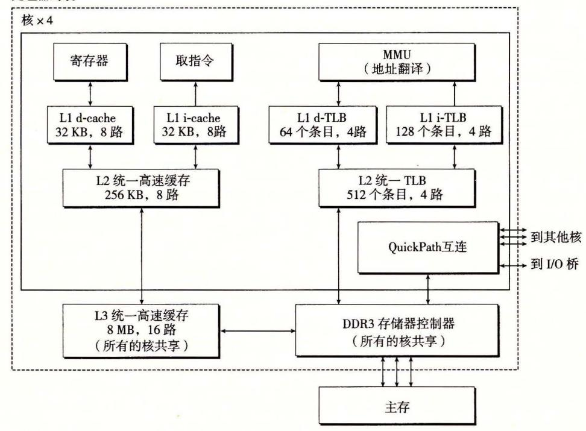

<sup>21</sup> Core i7 的内存系统

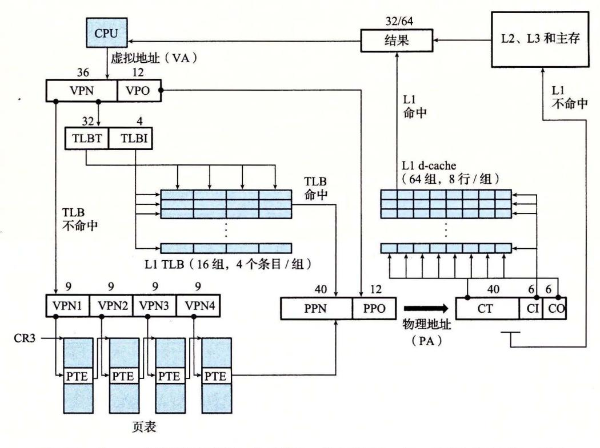

9-22 Core i7 地址翻译的概况。为了简化,没有显示 cache i-TLB L2 统- TLB

XD 未使用

图 9-23 给出了第一级、第二级或第三级页表中条目的格式。当 P=1 时(Linux 中就总是如此),地址字段包含一个 40 位物理页号(PPN),它指向适当的页表的开始处。注意,这强加了一个要求,要求物理页表 4KB 对齐。

| 63 | 62 | 5      | 2 51 | 12            | 11    | 9   | 8   | 7    | 6    | 5   | 4  | 3  | 2   | 1   | 0   |
|----|----|--------|------|---------------|-------|-----|-----|------|------|-----|----|----|-----|-----|-----|
| XD | 未  | 使用     |      | 页表物理基地址       | 未使    | 用   | G   | PS   |      | A   | CD | WT | U/S | R/W | P=1 |
|    |    |        |      | OS可用(磁盘上的页    | 表位员   | 置)  |     |      |      |     |    |    |     |     | P=0 |
|    |    | 字段     |      | _             |       |     | 描   | 述    |      |     |    |    |     |     |     |
|    | P  |        |      | 子页表在物理内存      | 中 (1) | ,不  | 在   | (0)  |      |     |    |    |     |     |     |
|    | R  | W      |      | 对于所有可访问页,     | 只读    | 或者  | 读写  | 访问   | 权限   |     |    |    |     |     |     |
|    | U  | 'S     |      | 对于所有可访问页,     | 用户    | 或起  | 级用  | 户(   | 内核   | )模  | 式访 | 问权 | 限   |     |     |
|    | W  | T      |      | 子页表的直写或写      | 可缓存   | 策略  | ş   |      |      |     |    |    |     |     |     |
|    | C  | )      |      | 能 / 不能缓存子页表   | Ę     |     |     |      |      |     |    |    |     |     |     |
|    | Α  |        |      | 引用位(由 MMU     | 生读和   | 写时  | 计设置 | t,由  | 软件   | 清除  | () |    |     |     |     |
|    | PS | 3      |      | 页大小为 4 KB 或 4 | MB    | (只X | 寸第- | 一层 F | TE 5 | 定义) | )  |    |     |     |     |
|    | В  | ise ad | ldr  | 子页表的物理基地      | 业的最   | 高 4 | 0 位 |      |      |     |    |    |     |     |     |
|    | X  | D      |      | 能 / 不能从这个 PT  | E可访   | 问的  | 的所有 | 页中   | 取指   | 令   |    |    |     |     |     |

图 9-23 第一级、第二级和第三级页表条目格式。每个条目引用一个 4KB 子页表

图 9-24 给出了第四级页表中条目的格式。当 P=1,地址字段包括一个 40 位 PPN,它指向物理内存中某一页的基地址。这又强加了一个要求,要求物理页 4KB 对齐。

页表物理基地址

|           | OS 可用(磁盘上的页表位置)          | P=(             |  |  |  |  |  |
|-----------|--------------------------|-----------------|--|--|--|--|--|
|           | 描述                       |                 |  |  |  |  |  |
| P         | 子页表在物理内存中(1),不在(0)       |                 |  |  |  |  |  |
| R/W       | 对于子页,只读或者读写访问权限          |                 |  |  |  |  |  |
| U/S       | 对于子页,用户或超级用户(内核)模式访问权限   |                 |  |  |  |  |  |
| WT        | 子页的直写或写回缓存策略             |                 |  |  |  |  |  |
| CD        | 能 / 不能缓存                 |                 |  |  |  |  |  |
| A         | 引用位(由 MMU 在读和写时设置,由软件清除) |                 |  |  |  |  |  |
| D         | 修改位(由MMU在读和写时设置,由软件清除)   |                 |  |  |  |  |  |
| G         | 全局页(在任务切换时,不从 TLB 中驱逐出去) |                 |  |  |  |  |  |
| Base addr | 子页物理基地址的最高 40 位          | 子页物理基地址的最高 40 位 |  |  |  |  |  |
| XD        | 能 / 不能从这个子页中取指令          |                 |  |  |  |  |  |

图 9-24 第四级页表条目的格式。每个条目引用一个 4KB 子页

PTE 有三个权限位,控制对页的访问。R/W 位确定页的内容是可以读写的还是只读的。U/S 位确定是否能够在用户模式中访问该页,从而保护操作系统内核中的代码和数据

不被用户程序访问。 XD (禁止执行)位是在 <sup>64</sup> 位系统中引入的,可以用来禁止从某些内存 页取指令。这是一个重要的新特性,通过限制只能执行只读代码段,使得操作系统内核降 低了缓冲区溢出攻击的风险。

MMU 翻译每一个虚拟地址时,它还会更新另外两个内核缺页处理程序会用到的 每次访问 个页时, MMU 都会设置 位,称为引用位 (reference bit) 。内核可以用 这个引用位来实现它的页替换算法。每次对一个页进行了写之后, MMU 都会设置 位, 又称修改位或脏位 (dirty 江)。修改位告诉内核在复制替换页之前是否必须写回牺牲页。 内核可以通过调用一条特殊的内核模式指令来清除引用位或修改位

9-25 给出了 Core i7 MMU 如何使用四级的页表来将虚拟地址翻译成物理地址。 <sup>36</sup> VPN 被划分成四个 位的片,每个片被用作到一个页表的偏移量。 CR3 寄存器包含 Ll 页表的物理地址。 VPN 提供到一个 Ll PET 的偏移 ,这个 PTE 包含 L2 页表的基地 址。 VPN 提供到一个 L2 PTE 的偏移量,以此类推。

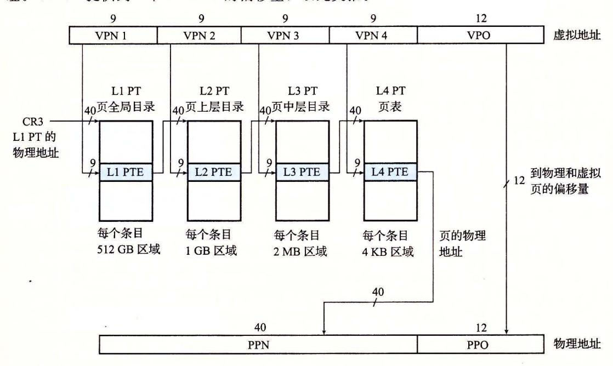

-25 Core i7 页表翻译 (PT: 页表, PTE :页表条目, VPN :虚拟 号, VPO :虚拟页偏移, PPN :物理页号, PPO: 物理页偏移量。图中还给出了这四级页表的 Linux 名字)

# 豆目 优化地址翻译

在对地址翻译的讨论中,我们描述了一个 序的两个步骤的过程, l)MMU 将虚拟 地址翻译成物理地址, 将物理地址传送到 L1 高速缓存 实际的硬件实现使用 了一个灵活的技巧,允许这些步骤 分重叠 因此也就加速了对 L1 高速缓存的访问。 例如,页面大小为 4KB Cor i7 系统上的一个虚拟地址有 位的 VPO, 并且这些位 和相应物理地址中的 PPO <sup>12</sup> 位是相同的 因为八路组相联的、物理寻址的 L1 高速 存有 个组和大小为 宇节的缓存块 每个物理地址有 lo 64) 缓存偏移位和 (log <sup>64</sup> 索引位 <sup>12</sup> 位恰好符合虚拟地址的 VPO 部分,这绝不是偶然!当 CPU 需要翻译一个虚拟地址时,它就发送 VPN MMU, 发送 VPO 到高速 Ll 缓存 MMU

TLB 请求一个页表条目时, L1 高速缓存正忙着利用 VPO 位查找相应的组,并读出 这个组里的 个标记和相应的数据宇 MMU TLB 得到 PPN 时,缓存已经准备好 试着把这个 PPN 与这 个标记中的一个进行匹配了

## 9. 7. 2 Linux 虚拟内存系统

一个虚拟内存系统要求硬件和内核软件之间的紧密协作 版本与版本之间细节都不尽 相同,对此完整的阐释超出了我们讨论的范围 但是,在这一小节中我们的目标是对 Linux 的虚拟内存系统做 个描述,使你能够大致了解一个实际的操作系统是如何组织虚 拟内存,以及如何处理缺页的

Linux 为每个进程维护了一个单独的 虚拟地址空间,形式如图 9-26 所示 我们 已经多次看到过这幅图了,包括它那些熟 悉的代码、数据、堆、共享库以及栈段。 既然我们理解了地址翻译,就能够填入更 多的关千内核虚拟内存的细节了,这部分 虚拟内存位千用户栈之上。

内核虚拟内存包含内核中的代码和数 据结构 内核虚拟内存的某些区域被映射 到所有进程共享的物理页面。例如,每个 进程共享内核的代码和全局数据结构。有 趣的是, Linux 也将一组连续的虚拟页面 (大小等千系统中 DRAM 的总 )映射到 相应的一组连续的物理页面 这就为内核 提供了一种便利的方法来访问物理内存中 任何特定的位置,例如,当它 要访问页 表,或在一些设备上执行内存映射的 Ox4 00000 <sup>0</sup> <sup>0</sup> - 操作,而这些设备被映射到特定的物理内 ° 存位置时。 9-26 一个 Linux 进程的虚拟内存

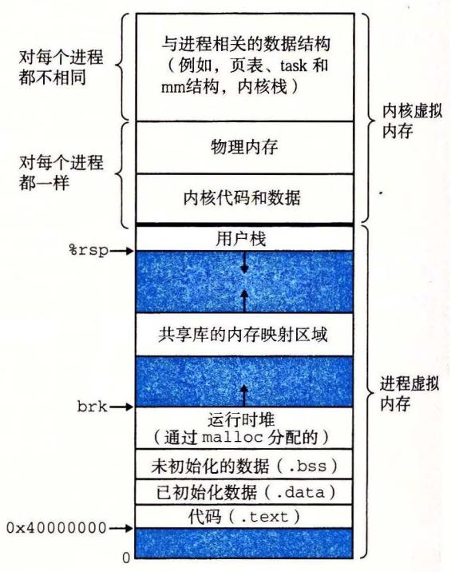

内核虚拟内存的其他区域包含每个进程都不相同的数据 比如说,页表、内核在进程 的上下文中执行代码时使用的栈,以及记录虚拟地址空间当前组织的各种数据结构

#### 1. Linux 虚拟内存区域

Linux 将虚拟内存组织成一些区域(也叫做段)的集合 一个区域 (area) 就是已经存在 着的(已分配的)虚拟内存的连续片 (chunk) ,这些页是以某种方式相关联的。例如,代码 段、数据段、堆、共享库段,以及用户栈都是不同的区域。每个存在的虚拟页面都保存在 某个区域中,而不属千某个区域的虚拟页是不存在的,并且不能被进程引用 区域的概念 很重要,因为它允许虚拟地址空间有间隙。内核不用记录那些不存在的虚拟页,而这样的 页也不占用内存、磁盘或者内核本身中的任何额外资源

9-27 强调了记录一个进程中虚拟内存区域的内核数据结构。内核为系统中的每个 进程维护一个单独的任务结构(源代码中的 task\_struct) 。任务结构中的元素包含或者指 向内核运行该进程所需要的所有信息(例如, PID 、指向用户栈的指针、可执行目标文件的 名字,以及程序计数器)

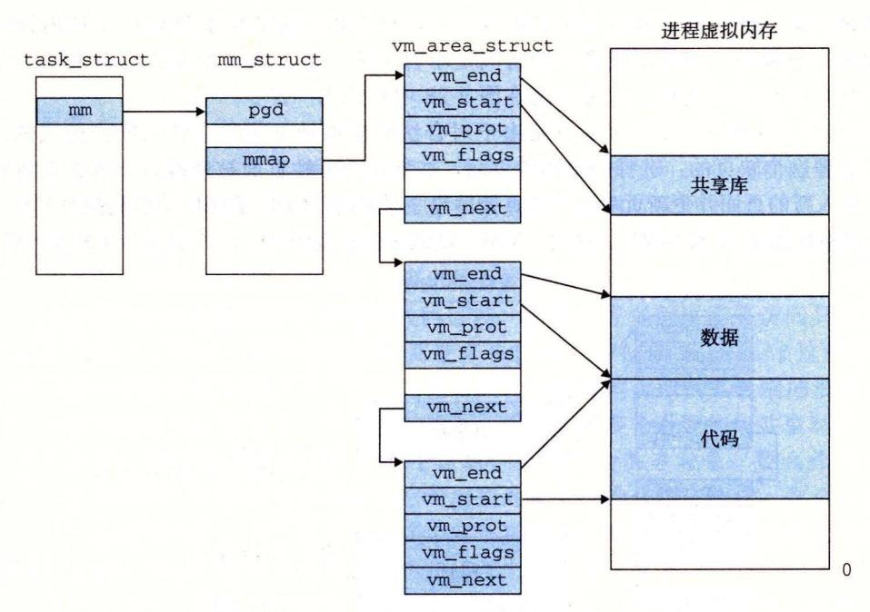

<sup>27</sup> Linux 是如何组织虚拟内存的

任务结构中的 个条目指向 mm struct, 它描述了虚拟内存的当前状态 我们感兴趣的 两个字段是 pgd mmap, 其中 pgd 指向第一级页表(页全局目录)的基址,而 mmap 指向一个 vrn\_area\_structs (区域结构)的链表,其中每个 vrn area\_structs 都描述了当前虚拟地址空 间的一个区域。当内核运行这个进程时,就将 pgd 存放在 CR3 控制寄存器中

为了我们的目的,一个具体区域的区域结构包含下面的字段:

- vrn\_start: 指向这个区域的起始处。
- ·• vrn\_end :指向这个区域的结束处
- vrn\_\_prot: 描述这个区域内包含的所有页的读写许可权限。
- vrn flags: 描述这个区域内的页面是与其他进程共享的,还是这个进程私有的(还 描述了其他一些信息)
- vm next: 指向链表中下 个区域结构。

### 2. Linux 缺页异常处理

假设 MMU 在试图翻译某个虚拟地址 时,触发了一个缺页 这个异常导致控制转 移到内核的缺页处理程序,处理程序随后就执行下面的步骤:

1) 虚拟地址 是合法的吗?换句话说, 在某个区域结构定义的区域内吗?为了回 答这个问题,缺页处理程序搜索区域结构的链表,把 和每个区域结构中的 vm\_start vm end 做比较。如果这个指令是不合法的,那么缺页处理程序就触发一个段错误,从而 终止这个进程。这个情况在图 9-28 中标识为 "1"

因为一个进程可以创建任意数量的新虚拟内存区域(使用在下一节中描述的 mrnap 数),所以顺序搜索区域结构的链表花销可能会很大 因此在实际中, Linux 使用某些我 们没有显示出来的字段, Linux 在链表中构建了一棵树,并在这棵树上进行查找。

2) 试图进行的内存访问是否合法?换句话说,进程是否有读、写或者执行这个区域 内页面的权限?例如,这个缺页是不是由一条试图对这个代码段里的只读页面进行写操作 的存储指令造成的?这个缺页是不是因为一个运行在用户模式中的进程试图从内核虚拟内存中读取字造成的?如果试图进行的访问是不合法的,那么缺页处理程序会触发一个保护 异常,从而终止这个进程。这种情况在图 9-28 中标识为 "2"。

3) 此刻,内核知道了这个缺页是由于对合法的虚拟地址进行合法的操作造成的。它是这样来处理这个缺页的:选择一个牺牲页面,如果这个牺牲页面被修改过,那么就将它交换出去,换入新的页面并更新页表。当缺页处理程序返回时,CPU 重新启动引起缺页的指令,这条指令将再次发送 A 到 MMU。这次,MMU 就能正常地翻译 A,而不会再产生缺页中断了。

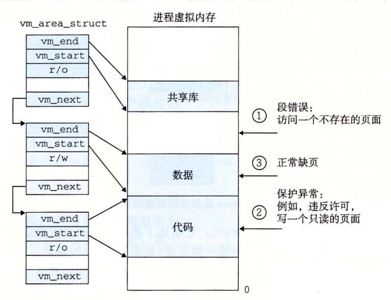

图 9-28 Linux 缺页处理

## 9.8 内存映射

Linux 通过将一个虚拟内存区域与一个磁盘上的对象(object)关联起来,以初始化这个虚拟内存区域的内容,这个过程称为内存映射(memory mapping)。虚拟内存区域可以映射到两种类型的对象中的一种:

- 1) Linux 文件系统中的普通文件: 一个区域可以映射到一个普通磁盘文件的连续部分, 例如一个可执行目标文件。文件区(section)被分成页大小的片, 每一片包含一个虚拟页面的初始内容。因为按需进行页面调度, 所以这些虚拟页面没有实际交换进入物理内存, 直到 CPU 第一次引用到页面(即发射一个虚拟地址, 落在地址空间这个页面的范围之内)。如果区域比文件区要大, 那么就用零来填充这个区域的余下部分。
- 2) 匿名文件:一个区域也可以映射到一个匿名文件,匿名文件是由内核创建的,包含的全是二进制零。CPU 第一次引用这样一个区域内的虚拟页面时,内核就在物理内存中找到一个合适的牺牲页面,如果该页面被修改过,就将这个页面换出来,用二进制零覆盖牺牲页面并更新页表,将这个页面标记为是驻留在内存中的。注意在磁盘和内存之间并没有实际的数据传送。因为这个原因,映射到匿名文件的区域中的页面有时也叫做请求二进制零的页(demand-zero page)。

无论在哪种情况中,一旦一个虚拟页面被初始化了,它就在一个由内核维护的专门的交换文件(swap file)之间换来换去。交换文件也叫做交换空间(swap space)或者交换区域

(swap area) 。需要意识到的很重要的一点是,在任何时刻,交换空间都限制着当前运行着 的进程能够分配的虚拟页面的总数。

## 9. 8. 1 再看共享对象

内存映射的概念来源千一个聪明的发现:如果虚拟内存系统可以集成到传统的文件系 统中,那么就能提供一种简单而高效的把程序和数据加载到内存中的方法。

正如我们已经看到的,进程这一抽象能够为每个进程提供自己私有的虚拟地址空间, 可以免受其他进程的错误读写。不过,许多进程有同样的只读代码区域。例如,每个运行 Linux shell 程序 bash 的进程都有相同的代码区域。而且,许多程序需要访问只读运行时 库代码的相同副本。例如,每个 程序都需要来自标准 库的诸如 printf 这样的函数。 那么,如果每个进程都在物理内存中保持这些常用代码的副本,那就是极端的浪费了。幸 运的是,内存映射给我们提供了一种清晰的机制,用来控制多个进程如何共享对象。

一个对象可以被映射到虚拟内存的一个区域,要么作为共享对象,要么作为私有对 象。如果一个进程将一个共享对象映射到它的虚拟地址空间的一个区域内,那么这个进程 对这个区域的任何写操作,对于那些也把这个共享对象映射到它们虚拟内存的其他进程而 言,也是可见的。而且,这些变化也会反映在磁盘上的原始对象中。

另一方面,对千一个映射到私有对象的区域做的改变,对千其他进程来说是不可见 的,并且进程对这个区域所做的任何写操作都不会反映在磁盘上的对象中。一个映射到共 享对象的虚拟内存区域叫做共享区域。类似地,也有私有区域。

假设进程 将一个共享对象映射到它的虚拟内存的一个区域中,如图 9-29a 所示。现 在假设进程 将同一个共享对象映射到它的地址空间(并不一定要和进程 在相同的虚拟 地址处,如图 9-29b 所示)。

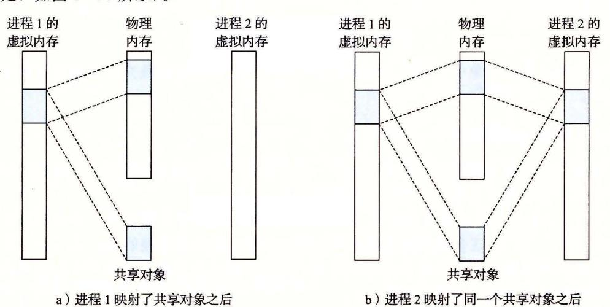

<sup>929</sup> 一个共享对象(注意,物理页面不一定是连续的)

因为每个对象都有一个唯一的文件名,内核可以迅速地判定进程 已经映射了这个对 象,而且可以使进程 中的页表条目指向相应的物理页面。关键点在于即使对象被映射到 了多个共享区域,物理内存中也只需要存放共享对象的一个副本。为了方便,我们将物理 页面显示为连续的,但是在一般情况下当然不是这样的。

私有对象使用一种叫做写时复制 (copy-on-write) 的巧妙技术被映射到虚拟内存中。一个

私有对象开始生命周期的方式基本上与共享对象的一样,在物理内存中只保存有私有对象的 一份副本。比如,图 9-30a 展示了一种情况,其中两个进程将一个私有对象映射到它们虚拟内 存的不同区域,但是共享这个对象同一个物理副本。对于每个映射私有对象的进程,相应私有 区域的页表条目都被标记为只读,并且区域结构被标记为私有的写时复制。只要没有进程试图 写它自己的私有区域,它们就可以继续共享物理内存中对象的一个单独副本。然而,只要有一 个进程试图写私有区域内的某个页面,那么这个写操作就会触发一个保护故障。

当故障处理程序注意到保护异常是由于进程试图写私有的写时复制区域中的一个页面 而引起的,它就会在物理内存中创建这个页面的一个新副本,更新页表条目指向这个新的 副本,然后恢复这个页面的可写权限,如图 9-30b 所示 当故障处理程序返回时, CPU 新执行这个写操作,现在在新创建的页面上这个写操作就可以正常执行了

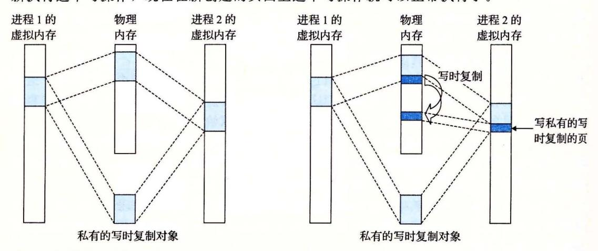

9-30 一个私有的 制对

两个进程都映射了私有的 时复制对 之后 进程 写了私有区域中的一个页之后

通过延迟私有对象中的副本直到最后可能的时刻,写时复制最充分地使用了稀有的物 理内存。

### 9. 8. 2 再看 fork 函数

既然我们理解了虚拟内存和内存映射,那么我们可以清晰地知道 fork 函数是如何创 建一个带有自己独立虚拟地址 间的新进程的。

fork 函数被当前进程调用时,内核为新进程创建各种数据结构,并分配给它一个 唯一的 PID 为了给这个新进程创建虚拟内存,它创建了当前进程的 mm\_struct 、区域结 构和页表的原样副本 它将两个进程中的每个页面都标记为只读,并将两个进程中的每个 区域结构都标记为私有的写时复制

fork 在新进程中返回时,新进程现在的虚拟内存刚好和调用 fork 时存在的虚拟 内存相同。当这两个进程中的任一个后来进行写操作时,写时复制机制就会创建新页面, 因此,也就为每个进程保持了私有地址空间的抽象概念。

#### 9. 8. 3 再看 execve 函数

虚拟内存和内存映射在将程序加载到内存的过程中也扮演着关键的角色。既然已经理 解了这些概念,我们就能够理解 execve 函数实际上是如何加载和执行程序的。假设运行

在当前进程中的程序执行了如下的 execve 调用:

execve("a.out", NULL, NULL):

正如在第8章中学到的, execve 函数在当前进程中加载并运行包含在可执行目标文件a.out 中的程序,用 a.out 程序有效地替代了当前程序。加载并运行 a.out 需要以下几个步骤:

- 删除已存在的用户区域。删除当前进程虚拟地址的用户部分中的已存在的区域结构。
- ●映射私有区域。为新程序的代码、数据、bss 和栈区域创建新的区域结构。所有这些新的区域都是私有的、写时复制的。代码和数据区域被映射为 a.out 文件中的.text 和.data 区。bss 区域是请求二进制零的,映射到匿名文件,其大小包含在a.out中。栈和堆区域也是请求二进制零的,初始长度为零。图 9-31 概括了私有区域的不同映射。
- 映射共享区域。如果 a.out 程序与共享对象(或目标)链接,比如标准 C 库 libc. so,那么这些对象都是动态链接到这个程序的,然后再映射到用户虚拟地址空间中的共享区域内。
- 设置程序计数器(PC)。execve 做的最后一件事情就是设置当前进程上下文中的程序计数器,使之指向代码区域的人口点。

下一次调度这个进程时,它将从这个人口点开始执行。Linux 将根据需要换入代码和数据页面。

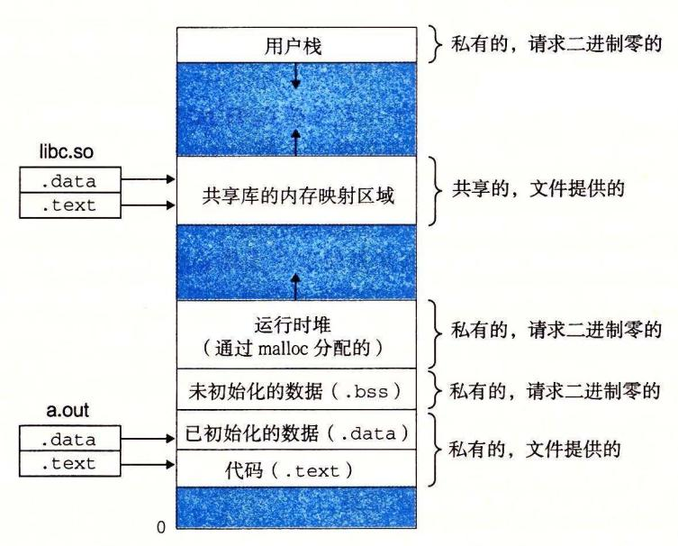

图 9-31 加载器是如何映射用户地址空间的区域的

## 9.8.4 使用 mmap 函数的用户级内存映射

Linux 进程可以使用 mmap 函数来创建新的虚拟内存区域,并将对象映射到这些区域中。

```
#include <unistd.h>
#include <sys/mman.h>

void *mmap(void *start, size_t length, int prot, int flags,
```

mrnap 函数要求内核创建一个新的虚拟内存区域,最好是从地址 start 开始的一个区 域,并将文件描述符 fd 指定的对象的一个连续的片 (chunk) 映射到这个新的区域。连续的 对象片大小为 leng 字节,从距文件开始处偏移量为 offset 字节的地方开始。 start 地址仅仅是一个暗示,通常被定义为 NULL 。为了我们的目的,我们总是假设起始地址为 NULL 。图 9-32 描述了这些参数的意义。

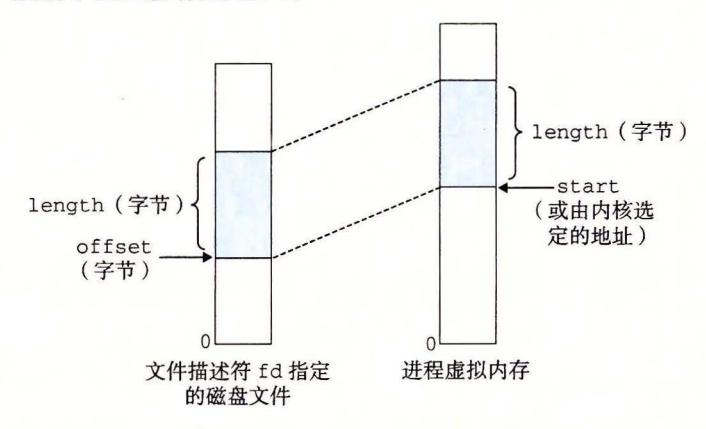

<sup>32</sup> mmap 参数的可视化解释

参数 prot 包含描述新映射的虚拟内存区域的访问权限位(即在相应区域结构中的 vm\_ prot 位)。

- PROT\_EXEC: 这个区域内的页面由可以被 CPU 执行的指令组成。
- PROT\_READ: 这个区域内的页面可读。
- PROT \_WRITE: 这个区域内的页面可写。
- PROT \_NONE: 这个区域内的页面不能被访问。

参数 flags 由描述被映射对象类型的位组成。如果设置了 MAP\_ANON 标记位,那 么被映射的对象就是一个匿名对象,而相应的虚拟页面是请求二进制零的。 MAP\_PRI-VATE 表示被映射的对象是一个私有的、写时复制的对象,而 MAP\_SHARED 表示是一 个共享对象。例如

bufp = Mmap(NULL, size, PROT\_READ, MAP\_PRIVATEIMAP\_ANON, 0, O);

让内核创建一个新的包含 size 字节的只读、私有、请求二进制零的虚拟内存区域。 如果调用成功,那么 bufp 包含新区域的地址。

munmap 函数删除虚拟内存的区域:

#include <unistd.h> #include <sys/mman.h>

int munmap(void \*start, size\_t length);

返回:若成功则为 o, 若出错则为一

munmap 函数删除从虚拟地址 start 开始的,由接下来 length 字节组成的区域。接 下来对已删除区域的引用会导致段错误。

练习题 5 编写一个 程序 mmapcopy.c, 使用 mmap 将一个任意大小的磁盘文件复 制到 stdout 。输入文件的名字必须作为一个命令行参数来传递。

# 9. 9 动态内存分配

虽然可以使用低级的 mmap munmap 函数来创建和删除虚拟内存的区域,但是 序员还是会觉得当运行时需要额外虚拟内存时,用动态内存分配器 (dynamic memory allocator) 更方便,也有更好的可移植性

动态内存分配器维护着一个进程的虚拟内存区 域,称为堆 (h ea p) (见图 9-33) 系统之间细节不同, 但是不失通用性,假设堆是一个请求二进制零的区 域,它紧接在未初始化的数据区域后开始,并向上生 长(向更高的地址) 对于每个进程,内核维护着一个 变量 brk (读做 "break") ,它指向堆的顶部

分配器将堆视为一组不同大小的块 (block) 的集合 来维护 每个块就是一个连续的虚拟内存片 (chunk), 要么是已分配的,要么是空闲的。已分配的块显式地 保留为供应用程序使用。空闲块可用来分配 。空 闲块 保持 闲,直到它显式地被应用所分配 一个已分配 的块保持已分配状态,直到它被释放,这种释放要么 是应用程序显式执行的,要么是内存分配器自身隐式 执行的

分配器有两种基本风格。两种风格都要求应用显 ° 式地分配块。它们的不同之处在于由哪个实体来负责 释放已分配的块。

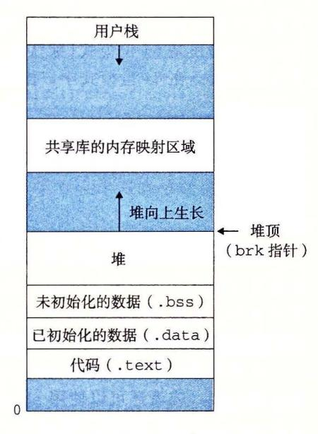

9-33

- ·显式分配器 (explicit allocator) ,要求应用显式地释放任何已分配的块。例如, 准库提供一种叫做 malloc 程序包的显式分配器。 程序通过调用 malloc 函数来 .分配一个块,并通过调用 free 函数来释放一个块。 C+ +中的 new delete 操作 符与 中的 malloc free 相当
- ·隐式分配器 (implicit allocator) ,另一方面,要求分配器检测一个已分配块何时不再 被程序所使用,那么就释放这个块 隐式分配器也叫做垃圾收集器 (garbage collector) ,而自动释放未使用的已分配的块的过程叫做垃圾收集 (garbage collection) 例如,诸如 Lisp ML 以及 之类的高级语言就依赖垃圾收集来释放已分配 的块

本节剩下的部分讨论的是显式分配器的设计和实现 我们将在 <sup>10</sup> 节中讨论隐式分 配器 为了更具体,我们的讨论集中于管理堆内存的分配器。然而,应该明白内存分配是 一个普遍的概念,可以出现在各种上下文中。例如,图形处理密集的应用程序就经常使用 标准分配器来要求获得一大块虚拟内存,然后使用与应用相 的分配器来管理内存,在该 块中创建和销毁图形的节点。

#### 9. 9. 1 malloc free 函数

标准 提供了一个称为 malloc 程序包的显式分配器 程序通过调用 malloc 函数 来从堆中分配块

#include <stdlib.h>

void \*malloc(size\_t size);

返回:若成功则为己分配块的指针,若出错则为 NULL

malloc 函数返回一个指针,指向大小为至少 size 字节的内存块,这个块会为可能包 含在这个块内的任何数据对象类型做对齐。实际中,对齐依赖于编译代码在 <sup>32</sup> 位模式 (gee -m32) 还是 <sup>64</sup> 位模式(默认的)中运行。在 <sup>32</sup> 位模式中, malloe 返回的块的地址总 的倍数。在 <sup>64</sup> 位模式中,该地址总是 <sup>16</sup> 的倍数。

# 国日 -个字有多大

回想一下在第 章中我们对机器代码的讨论, Intel 宇节对象称为双宇 然而,在 本节中,我们会假设宇是 宇节的对象,而双宇是 宇节的对象,这和传统术语是一 致的。

如果 malloc 遇到问题(例如,程序要求的内存块比可用的虚拟内存还要大),那么它 就返回 NULL, 并设置 errno malloc 不初始化它返回的内存。那些想要已初始化的动 态内存的应用程序可以使用 calloc, callee 是一个基千 malloc 的瘦包装函数,它将分 配的内存初始化为零。想要改变一个以前已分配块的大小,可以使用 realloc 函数。

动态内存分配器,例如 malloc, 可以通过使用 mmap munmap 函数,显式地分配和 释放堆内存,或者还可以使用 sbrk 函数:

#include <unistd.h>

void \*sbrk(intptr\_t incr);

返回:若成功则为旧的 brk 指针,若出错则为一 1.

sbrk 函数通过将内核的 brk 指针增加 incr 来扩展和收缩堆。如果成功,它就返回 brk 的旧值,否则,它就返回- 1, 并将 errno 设置为 ENOMEM 。如果 incr 为零,那么 sbrk 就返回 brk 的当前值。用一个为负的 incr 来调用 sbrk 是合法的,而且很巧妙,因 为返回值 (brk 的旧值)指向距新堆顶向上 abs(incr) 字节处。

程序是通过调用 free 函数来释放已分配的堆块。

#include <stdlib . h>

void free(void \*ptr);

返回 无。

ptr 参数必须指向一个从 malloc calloc 或者 realloc 获得的巳分配块的起始位 置。如果不是,那么 free 的行为就是未定义的。更糟的是,既然它什么都不返回, free 就不会告诉应用出现了错误。就像我们将在 9. <sup>11</sup> 节里看到的,这会产生一些令人迷惑的 运行时错误。

9-34 展示了一个 malloc free 的实现是如何管理一个 程序的 <sup>16</sup> 字的(非常)小 的堆的。每个方框代表了一个 字节的字。粗线标出的矩形对应于已分配块(有阴影的)和 空闲块(无阴影的)。初始时,堆是由一个大小为 <sup>16</sup> 个字的、双字对齐的、空闲块组成的。 (本节中,我们假设分配器返回的块是 字节双字边界对齐的。)

- 图 9-34a: 程序请求一个 4 字的块。malloc 的响应是: 从空闲块的前部切出一个 4 字的块, 并返回一个指向这个块的第一字的指针。
- 图 9-34b:程序请求一个 5 字的块。 malloc的响应是:从空闲块的前部分配一个 6 字的块。在本例中,malloc 在块里填充了一个额外的字,是为了保持空闲块是双字边界对齐的。
- 图 9-34c:程序请求一个 6 字的块,而 malloc 就从空闲块的前部切出一个 6 字的块。
- 图 9-34d:程序释放在图 9-34b 中分配的那个 6 字的块。注意,在调用 free返回之后,指针 p2 仍然指向被释放了的块。应用有责任在它被一个新的malloc调用重新初始化之前,不再使用 p2。
- 图 9-34e:程序请求一个 2 字的块。在 这种情况中,malloc 分配在前一步中 被释放了的块的一部分,并返回一个 指向这个新块的指针。

## 9.9.2 为什么要使用动态内存分配

程序使用动态内存分配的最重要的原因 是经常直到程序实际运行时,才知道某些数

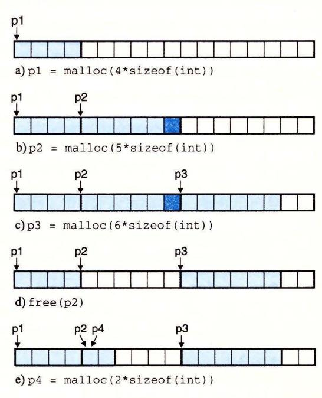

图 9-34 用 malloc 和 free 分配和释放块。每个方框对应于一个字。每个粗线标出的矩形对应于一个块。阴影部分是已分配的块。已分配的块的填充区域是深阴影的。无阴影部分是空闲块。堆地址是从左往右增加的

据结构的大小。例如,假设要求我们编写一个 C 程序,它读一个 n 个 ASCII 码整数的链表,每一行一个整数,从 stdin 到一个 C 数组。输入是由整数 n 和接下来要读和存储到数组中的 n 个整数组成的。最简单的方法就是静态地定义这个数组,它的最大数组大小是硬编码的:

```
#include "csapp.h"
1
     #define MAXN 15213
2
3
     int array[MAXN];
4
5
     int main()
6
7
8
         int i, n;
9
         scanf("%d", &n);
10
         if (n > MAXN)
11
              app_error("Input file too big");
12
         for (i = 0; i < n; i++)
13
              scanf("%d", &array[i]);
14
         exit(0);
15
16
```

像这样用硬编码的大小来分配数组通常不是一种好想法。MAXN的值是任意的,与机器上可用的虚拟内存的实际数量没有关系。而且,如果这个程序的使用者想读取一个比MAXN大的文件,唯一的办法就是用一个更大的MAXN值来重新编译这个程序。虽然对于这个简单的示例来说这不成问题,但是硬编码数组界限的出现对于拥有百万行代码和大量使用者的大型软件产品而言,会变成一场维护的噩梦。

一种更好的方法是在运行时,在已知了n的值之后,动态地分配这个数组。使用这种方法,数组大小的最大值就只由可用的虚拟内存数量来限制了。

```
#include "csapp.h"
 2
    int main()
 3
 4
 5
         int *array, i, n;
 6
         scanf("%d", &n);
 7
         array = (int *)Malloc(n * sizeof(int));
 8
         for (i = 0; i < n; i++)
 9
             scanf("%d", &array[i]);
10
11
         free(array);
         exit(0);
12
13
```

动态内存分配是一种有用而重要的编程技术。然而,为了正确而高效地使用分配器,程序员需要对它们是如何工作的有所了解。我们将在 9.11 节中讨论因为不正确地使用分配器所导致的一些可怕的错误。

#### 9.9.3 分配器的要求和目标

显式分配器必须在一些相当严格的约束条件下工作:

- 处理任意请求序列。一个应用可以有任意的分配请求和释放请求序列,只要满足约束条件:每个释放请求必须对应于一个当前已分配块,这个块是由一个以前的分配请求获得的。因此,分配器不可以假设分配和释放请求的顺序。例如,分配器不能假设所有的分配请求都有相匹配的释放请求,或者有相匹配的分配和空闲请求是嵌套的。
- 立即响应请求。分配器必须立即响应分配请求。因此,不允许分配器为了提高性能 重新排列或者缓冲请求。
- 只使用堆。为了使分配器是可扩展的,分配器使用的任何非标量数据结构都必须保存在堆里。
- 对齐块(对齐要求)。分配器必须对齐块,使得它们可以保存任何类型的数据对象。
- 不修改已分配的块。分配器只能操作或者改变空闲块。特别是,一旦块被分配了, 就不允许修改或者移动它了。因此,诸如压缩已分配块这样的技术是不允许使 用的。

在这些限制条件下,分配器的编写者试图实现吞吐率最大化和内存使用率最大化,而 这两个性能目标通常是相互冲突的。

● 目标 1: 最大化吞吐率。假定 n 个分配和释放请求的某种序列:

$$R_0, R_1, \cdots, R_k, \cdots, R_{n-1}$$

我们希望一个分配器的吞吐率最大化,吞吐率定义为每个单位时间里完成的请求 数。例如,如果一个分配器在 秒内完成 <sup>500</sup> 个分配请求和 <sup>500</sup> 个释放请求,那么 它的吞吐率就是每秒 <sup>1000</sup> 次操作。一般而言,我们可以通过使满足分配和释放请 求的平均时间最小化来使吞吐率最大化。正如我们会看到的,开发一个具有合理性 能的分配器并不困难,所谓合理性能是指一个分配请求的最糟运行时间与空闲块的 数扯成线性关系,而一个释放请求的运行时间是个常数。

·目标 2: 最大化内存利用率。天真的程序员经常不正确地假设虚拟内存是一个无限 的资源。实际上,一个系统中被所有进程分配的虚拟内存的全部数量是受磁盘上交 换空间的数最限制的。好的程序员知道虚拟内存是一个有限的空间,必须高效地使 用。对千可能被要求分配和释放大块内存的动态内存分配器来说,尤其如此。

有很多方式来描述一个分配器使用堆的效率如何。在我们的经验中,最有用的标准是 峰值利用率 (peak utilization) 。像以前一样,我们给定 个分配和释放请求的某种顺序

$$R_0$$
,  $R_1$ ,  $\cdots$ ,  $R_k$ ,  $\cdots$ ,  $R_{n-1}$ 

如果一个应用程序请求一个 字节的块,那么得到的已分配块的有效栽荷 (payload) 字节。在请求凡完成之后,聚集有效栽荷 (aggregate payload) 表示为 pk' 为当前已分配的 块的有效载荷之和,而 Hk 表示堆的当前的(单调非递减的)大小。

那么,前 k+l 个请求的峰值利用率,表示为 Uk' 可以通过下式得到:

$$U_k = \frac{\max_{i \leqslant k} P_i}{H_k}$$

那么,分配器的目标就是在整个序列中使峰值利用率 Un-l 最大化。正如我们将要看到的, 在最大化吞吐率和最大化利用率之间是互相牵制的。特别是,以堆利用率为代价,很容易 编写出吞吐率最大化的分配器。分配器设计中一个有趣的挑战就是在两个目标之间找到一 个适当的平衡。

# 瓬宽单调性假设

我们可以通过让凡成为前 k+l 个请求的最高峰,从而使得在我们对队的定义中 放宽单调非递减的假设,并且允许堆增长和降低

### 9. 9. 4 碎片

造成堆利用率很低的主要原因是一种称为碎片 (fragmentation) 的现象,当虽然有未使 用的内存但不能用来满足分配请求时,就发生这种现象。有两种形式的碎片:内部碎片 (internal fragmentation) 和外部碎片 (external fragmentation)

内部碎片是在一个已分配块比有效载荷大时发生的。很多原因都可能造成这个问题。 例如,一个分配器的实现可能对已分配块强加一个最小的大小值,而这个大小要比某个请 求的有效载荷大。或者,就如我们在图 9-34b 中看到的,分配器可能增加块大小以满足对 齐约束条件。

内部碎片的量化是简单明了的。它就是巳分配块大小和它们的有效载荷大小之差的 和。因此,在任意时刻,内部碎片的数最只取决于以前请求的模式和分配器的实现方式。

外部碎片是当空闲内存合计起来足够满足一个分配请求,但是没有一个单独的空闲块 足够大可以来处理这个请求时发生的。例如,如果图 9-34e 中的请求要求 个字,而不是 个字,那么如果不向内核请求额外的虚拟内存就无法满足这个请求,即使在堆中仍然有 个空闲的字。问题的产生是由千这 个字是分在两个空闲块中的。

外部碎片比内部碎片的量化要困难得多,因为它不仅取决于以前请求的模式和分配器 的实现方式,还取决千将来请求的模式。例如,假设在 个请求之后,所有空闲块的大小 都恰好是 个字。这个堆会有外部碎片吗?答案取决于将来请求的模式。如果将来所有的 分配请求都要求小于或者等千 个字的块,那么就不会有外部碎片。另一方面,如果有一 个或者多个请求要求比 个字大的块,那么这个堆就会有外部碎片。

因为外部碎片难以量化且不可能预测,所以分配器通常采用启发式策略来试图维持少 量的大空闲块,而不是维持大蜇的小空闲块。

## 9. 9. 5 实现问题

可以想象出的最简单的分配器会把堆组织成一个大的字节数组,还有一个指针 p, 始指向这个数组的第一个字节。为了分配 size 个字节, malloc 的当前值保存在栈 里,将 增加 size, 并将 的旧值返回到调用函数。 free 只是简单地返回到调用函数, 而不做其他任何事情。

这个简单的分配器是设计中的一种极端情况。因为每个 malloc free 只执行很少 量的指令,吞吐率会极好。然而,因为分配器从不重复使用任何块,内存利用率将极差。 一个实际的分配器要在吞吐率和利用率之间把握好平衡,就必须考虑以下几个问题:

- 空闲块组织:我们如何记录空闲块?
- 放置:我们如何选择一个合适的空闲块来放置一个新分配的块?
- 分割:在将一个新分配的块放置到某个空闲块之后,我们如何处理这个空闲块中的 剩余部分?
- 合并:我们如何处理一个刚刚被释放的块?

本节剩下的部分将更详细地讨论这些问题。因为像放置、分割以及合并这样的基本技 术贯穿在许多不同的空闲块组织中,所以我们将在一种叫做隐式空闲链表的简单空闲块组 织结构中来介绍它们。

### 9. 9. 6 隐式空闲链表

任何实际的分配器都需要一些数据结构,允许它来区别块边界,以及区别已分配块和 空闲块。大多数分配器将这些信息嵌入块本身。一个简单的方法如图 9-35 所示。

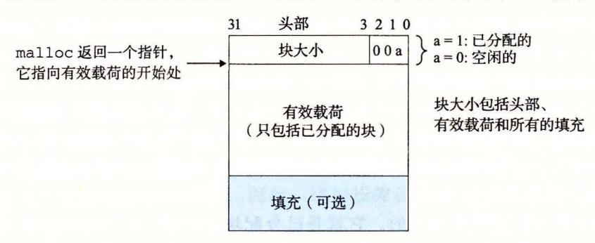

<sup>35</sup> 一个简单的堆块的格式

在这种情况中,一个块是由一个字的头部、有效载荷,以及可能的一些额外的埃充组 成的。头部编码了这个块的大小(包括头部和所有的填充),以及这个块是已分配的还是空 闲的。如果我们强加一个双字的对齐约束条件,那么块大小就总是8的倍数,且块大小的最低3位总是零。因此,我们只需要内存大小的29个高位,释放剩余的3位来编码其他信息。在这种情况中,我们用其中的最低位(已分配位)来指明这个块是已分配的还是空闲的。例如,假设我们有一个已分配的块,大小为24(0x18)字节。那么它的头部将是

 $0x00000018 \mid 0x1 = 0x00000019$ 

类似地,一个块大小为 40(0x28)字节的空闲块有如下的头部:

 $0x00000028 \mid 0x0 = 0x00000028$ 

头部后面就是应用调用 malloc 时请求的有效载荷。有效载荷后面是一片不使用的填充块,其大小可以是任意的。需要填充有很多原因。比如,填充可能是分配器策略的一部分,用来对付外部碎片。或者也需要用它来满足对齐要求。

假设块的格式如图 9-35 所示,我们可以将堆组织为一个连续的已分配块和空闲块的序列,如图 9-36 所示。


图 9-36 用隐式空闲链表来组织堆。阴影部分是已分配块。没有阴影的部分是空闲块。 头部标记为(大小(字节)/已分配位)

我们称这种结构为隐式空闲链表,是因为空闲块是通过头部中的大小字段隐含地连接着的。分配器可以通过遍历堆中所有的块,从而间接地遍历整个空闲块的集合。注意,我们需要某种特殊标记的结束块,在这个示例中,就是一个设置了已分配位而大小为零的终止头部(terminating header)。(就像我们将在 9.9.12 节中看到的,设置已分配位简化了空闲块的合并。)

隐式空闲链表的优点是简单。显著的缺点是任何操作的开销,例如放置分配的块,要求对空闲链表进行搜索,该搜索所需时间与堆中已分配块和空闲块的总数呈线性关系。

很重要的一点就是意识到系统对齐要求和分配器对块格式的选择会对分配器上的最小块大小有强制的要求。没有已分配块或者空闲块可以比这个最小值还小。例如,如果我们假设一个双字的对齐要求,那么每个块的大小都必须是双字(8 字节)的倍数。因此,图 9-35 中的块格式就导致最小的块大小为两个字:一个字作头,另一个字维持对齐要求。即使应用只请求一字节,分配器也仍然需要创建一个两字的块。

○ 练习题 9.6 确定下面 malloc 请求序列产生的块大小和头部值。假设: 1)分配器保持双字对齐,并且使用块格式如图 9-35 中所示的隐式空闲链表。2)块大小向上舍入为最接近的8字节的倍数。

| 请求         | 块大小 (十进制字节) | 块头部 (十六进制) |
|------------|-------------|------------|
| malloc(1)  |             |            |
| malloc(5)  |             |            |
| malloc(12) |             |            |
| malloc(13) |             |            |

#### 9.9.7 放置已分配的块

当一个应用请求一个 k 字节的块时, 分配器搜索空闲链表, 查找一个足够大可以放置

所请求块的空闲块。分配器执行这种搜索的方式是由放置策略 (placement policy) 确定的。 一些常见的策略是首次适配 (first fit) 、下一次适配 (next fit) 和最佳适配 (best fit)

首次适配从头开始搜索空闲链表,选择第一个合适的空闲块。下一次适配和首次适配 很相似,只不过不是从链表的起始处开始每次搜索,而是从上一次查询结束的地方开始。 最佳适配检查每个空闲块,选择适合所需请求大小的最小空闲块。

首次适配的优点是它趋向于将大的空闲块保留在链表的后面。缺点是它趋向于在靠近 链表起始处留下小空闲块的"碎片",这就增加了对较大块的搜索时间。下一次适配是由 Donald Knuth 作为首次适配的一种代替品最早提出的,源千这样一个想法:如果我们上 一次在某个空闲块里已经发现了一个匹配,那么很可能下一次我们也能在这个剩余块中发 现匹配。下一次适配比首次适配运行起来明显要快一些,尤其是当链表的前面布满了许多 小的碎片时。然而,一些研究表明,下一次适配的内存利用率要比首次适配低得多。研究 还表明最佳适配比首次适配和下一次适配的内存利用率都要高一些。然而,在简单空闲链 表组织结构中,比如隐式空闲链表中,使用最佳适配的缺点是它要求对堆进行彻底的搜 索。在后面,我们将看到更加精细复杂的分离式空闲链表组织,它接近于最佳适配策略, 不需要进行彻底的堆搜索。

## 9. 9. 8 分割空闲块

一旦分配器找到一个匹配的空闲块,它就必须做另一个策略决定,那就是分配这个空 闲块中多少空间。一个选择是用整个空闲块。虽然这种方式简单而快捷,但是主要的缺点 就是它会造成内部碎片。如果放置策略趋向于产生好的匹配,那么额外的内部碎片也是可 以接受的。

然而,如果匹配不太好,那么分配器通常会选择将这个空闲块分割为两部分。第一部 分变成分配块,而剩下的变成一个新的空闲块。图 9-37 展示了分配器如何分割图 9-36 个字的空闲块,来满足一个应用的对堆内存 个字的请求。


9-37 分割一个空闲块,以满足一个 个字的分配请求。阴影部分是已分配块。 没有阴影的部分是空闲块。头部标记为(大小(字节)/已分配位)

### 9. 9. 9 获取额外的堆内存

如果分配器不能为请求块找到合适的空闲块将发生什么呢?一个选择是通过合并那些在 内存中物理上相邻的空闲块来创建一些更大的空闲块(在下一节中描述)。然而,如果这样还 是不能生成一个足够大的块,或者如果空闲块已经最大程度地合并了,那么分配器就会通过 调用 sbrk 函数,向内核请求额外的堆内存。分配器将额外的内存转化成一个大的空闲块, 将这个块插入到空闲链表中,然后将被请求的块放置在这个新的空闲块中。

### 9. 9. 10 合并空闲块

当分配器释放一个已分配块时,可能有其他空闲块与这个新释放的空闲块相邻。这些 邻接的空闲块可能引起一种现象,叫做假碎片 (fault fragmentation) ,就是有许多可用的 空闲块被切割成为小的、无法使用的空闲块。比如,图 9-38 展示了释放图 9-37 中分配的 块后得到的结果 结果是两个相邻的空闲块,每一个的有效载荷都为 个字。因此,接下 来一个对 字有效载荷的请求就会失败,即使两个空闲块的合计大小足够大,可以满足这 个请求。


-38 假碎片的示例。阴影部分是巳分配块。没有阴影的部分是空闲块。 头部标记为(大小(字节) 已分配位)

为了解决假碎片问题,任何实际的分配器都必须合并相邻的空闲块,这个过程称为合 (coalescing) 。这就出现了一个重要的策略决定,那就是何时执行合并。分配器可以选 择立即合并 (immediate coalescing) ,也就是在每次一个块被释放时,就合并所有的相邻 块。或者它也可以选择推迟合并 (deferred coalescing) ,也就是等到某个稍晚的时候再合并 空闲块。例如,分配器可以推迟合并,直到某个分配请求失败,然后扫描整个堆,合并所 有的空闲块。

立即合并很简单明了,可以在常数时间内执行完成,但是对千某些请求模式,这种方 式会产生一种形式的抖动,块会反复地合并,然后马上分割。例如,在图 9-38 中,反复 地分配和释放一个 个字的块将产生大量不必要的分割和合并。在对分配器的讨论中,我 们会假设使用立即合并,但是你应该了解,快速的分配器通常会选择某种形式的推迟 合并。

## 9. 9. 11 带边界标记的合井

分配器是如何实现合并的?让我们称想要释放的块为当前块。那么,合并(内存中的) 下一个空闲块很简单而且高效。当前块的头部指向下一个块的头部,可以检查这个指针以 判断下一个块是否是空闲的。如果是,就将它的大小简单地加到当前块头部的大小上,这 两个块在常数时间内被合并。

但是我们该如何合并前面的块呢?给定一个带头部的隐式空闲链表,唯一的选择将是 搜索整个链表,记住前面块的位置,直到我们到达当前块 使用隐式空闲链表,这意味着 每次调用 free 需要的时间都与堆的大小成线性关系。即使使用更复杂精细的空闲链表组 织,搜索时间也不会是常数。

Knuth 提出了一种聪明而通用的技术,叫做 边界标记 (boundary tag) ,允许在常数时间内进行 对前面块的合并。这种思想,如图 9-39 所示,是 在每个块的结尾处添加 个脚部 (footer, 边界标 记),其中脚部就是头部的一个副本。如果每个块 包括这样一个脚部,那么分配器就可以通过检查 它的脚部,判断前面一个块的起始位置和状态, 这个脚部总是在距当前块开始位置一个字的距离

考虑当分配器释放当前块时所有可能存在的 情况:

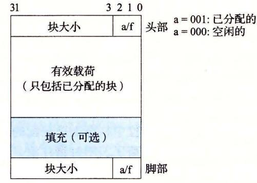

9-39 使用边界标记的堆块的格式

- 1) 前面的块和后面的块都是已分配的。
- 2) 前面的块是已分配的,后面的块是空闲的。
- 3) 前面的块是空闲的,而后面的块是已分配的。
- 4) 前面的和后面的块都是空闲的。
- 图 9-40 展示了我们如何对这四种情况进行合并。

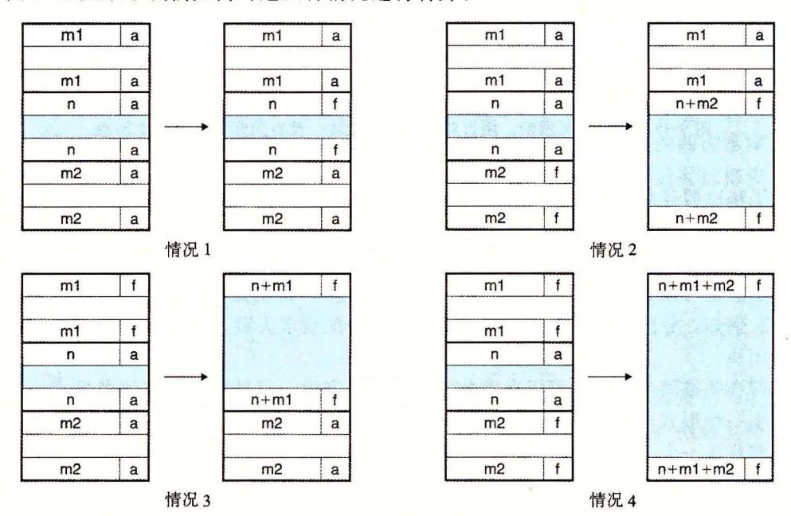

图 9-40 使用边界标记的合并(情况 1:前面的和后面块都已分配。情况 2:前面块已分配,后面块空闲。情况 3:前面块空闲,后面块已分配。情况 4:后面块和前面块都空闲)

在情况 1 中,两个邻接的块都是已分配的,因此不可能进行合并。所以当前块的状态只是简单地从已分配变成空闲。在情况 2 中,当前块与后面的块合并。用当前块和后面块的大小的和来更新当前块的头部和后面块的脚部。在情况 3 中,前面的块和当前块合并。用两个块大小的和来更新前面块的头部和当前块的脚部。在情况 4 中,要合并所有的三个块形成一个单独的空闲块,用三个块大小的和来更新前面块的头部和后面块的脚部。在每种情况中,合并都是在常数时间内完成的。

边界标记的概念是简单优雅的,它对许多不同类型的分配器和空闲链表组织都是通用的。然而,它也存在一个潜在的缺陷。它要求每个块都保持一个头部和一个脚部,在应用程序操作许多个小块时,会产生显著的内存开销。例如,如果一个图形应用通过反复调用malloc和 free来动态地创建和销毁图形节点,并且每个图形节点都只要求两个内存字,那么头部和脚部将占用每个已分配块的一半的空间。

幸运的是,有一种非常聪明的边界标记的优化方法,能够使得在已分配块中不再需要脚部。回想一下,当我们试图在内存中合并当前块以及前面的块和后面的块时,只有在前面的块是空闲时,才会需要用到它的脚部。如果我们把前面块的已分配/空闲位存放在当前块中多出来的低位中,那么已分配的块就不需要脚部了,这样我们就可以将这个多出来的空间用作有效载荷了。不过请注意,空闲块仍然需要脚部。

○ 练习题 9.7 确定下面每种对齐要求和块格式的组合的最小的块大小。假设: 隐式空闲链表,不允许有效载荷为零,头部和脚部存放在 4 字节的字中。

| 对齐要求 | 已分配的块     | 空闲块   | 最小块大小(字节) |
|------|-----------|-------|-----------|
| 单字   | 头部和脚部     | 头部和脚部 |           |
| 单字   | 头部,但是无脚部  | 头部和脚部 |           |
| 双字   | 头部和脚部     | 头部和脚部 |           |
| 双字   | 头部,但是没有脚部 | 头部和脚部 |           |

## 9. 9. 12 综合 实现一个简单的分配器

构造一个分配器是一件富有挑战性的任务。设计空间很大,有多种块格式、空闲链表 格式,以及放置、分割和合并策略可供选择。另一个挑战就是你经常被迫在类型系统的安 全和熟悉的限定之外编程,依赖千容易出错的指针强制类型转换和指针运算,这些操作都 属千典型的低层系统编程。

虽然分配器不需要大量的代码,但是它们也还是细微而不可忽视的。熟悉诸如 C+ +或者 Java 之类高级语言的学生通常在他们第一次遇到这种类型的编程时,会遭遇 一个概念上的障碍。为了帮助你清除这个障碍,我们将基于隐式空闲链表,使用立即边 界标记合并方式,从头至尾地讲述一个简单分配器的实现。最大的块大小为 <sup>232</sup> =4GB 代码是 <sup>64</sup> 位干净的,即代码能不加修改地运行在 <sup>32</sup> (gee -m32) <sup>64</sup> (gee -m64) 进程中。

### 1. 通用分配器设计

我们的分配器使用如图 9-41 所示的 memlib.e 包所提供的一个内存系统模型。模型的 目的在于允许我们在不干涉已存在的系统层 malloe 包的情况下,运行分配器。

mem\_init 函数将对千堆来说可用的虚拟内存模型化为一个大的、双字对齐的字节 数组。在 mem\_heap mem\_brk 之间的字节表示已分配的虚拟内存。 mem\_brk 之后的字 节表示未分配的虚拟内存。分配器通过调用 mem\_sbrk 函数来请求额外的堆内存,这个 函数和系统的 sbrk 函数的接口相同,而且语义也相同,除了它会拒绝收缩堆的请求。

- .分配器包含在一个源文件中 (mm.e) ,用户可以编译和链接这个源文件到他们的应用之 中。分配器输出三个函数到应用程序:
  - extern int mm\_init(void);
  - <sup>2</sup>extern void \*mm\_malloc (size\_t size);
  - <sup>3</sup>extern void mm\_free (void \*ptr);

rnm\_init 函数初始化分配器,如果成功就返回 o, 否则就返回— lo rnm\_malloc mm\_ free 函数与它们对应的系统函数有相同的接口和语义。分配器使用如图 9-39 所示的块格 式。最小块的大小为 <sup>16</sup> 字节。空闲链表组织成为一个隐式空闲链表,具有如图 9-42 所示 的恒定形式。

第一个字是一个双字边界对齐的不使用的填充字。填充后面紧跟着一个特殊的序言块 (prologue block) ,这是一个 字节的已分配块,只由一个头部和一个脚部组成。序言块 是在初始化时创建的,并且永不释放。在序言块后紧跟的是零个或者多个由 malloc 或者 free 调用创建的普通块。堆总是以一个特殊的结尾块 (epilogue block) 来结束,这个块是 一个大小为零的已分配块,只由一个头部组成。序言块和结尾块是一种消除合并时边界条 件的技巧。分配器使用一个单独的私有 (sta c) 全局变量 (heap\_listp) ,它总是指向序 言块。(作为一个小优化,我们可以让它指向下一个块,而不是这个序言块。)

\* mem\_init - Initialize the memory system model

mem\_max\_addr = (char \*)(mem\_heap + MAX\_HEAP);

this model, the heap cannot be shrunk.

mem\_heap = (char \*)Malloc(MAX\_HEAP);

mem\_brk = (char \*)mem\_heap;

/\* Private global variables \*/

static char \*mem\_heap;

static char \*mem\_brk;

void mem\_init(void)

void \*mem\_sbrk(int incr)

mem\_brk += incr;

char \*old\_brk = mem\_brk;

errno = ENOMEM;

return (void \*)old\_brk;

return (void \*)-1;

1

2

3

4 5

6 7

8

9

10

11

12

13 14

15

16

17

18 19

20

21 22 23

24

25

26

27

28 29

30

31 32

7

/\*

{

7

/\*

\*/

\*/

```
code/vm/malloc/memlib.c
                           /* Points to first byte of heap */
                           /* Points to last byte of heap plus 1 */
static char *mem_max_addr; /* Max legal heap addr plus 1*/
 * mem_sbrk - Simple model of the sbrk function. Extends the heap
      by incr bytes and returns the start address of the new area. In
```

code/vm/malloc/memlib.c


fprintf(stderr, "ERROR: mem\_sbrk failed. Ran out of memory...\n");

if ( (incr < 0) || ((mem\_brk + incr) > mem\_max\_addr)) {


图 9-42 隐式空闲链表的恒定形式

#### 2. 操作空闲链表的基本常数和宏

图 9-43 展示了一些我们在分配器编码中将要使用的基本常数和宏。第 2~4 行定义了 一些基本的大小常数:字的大小(WSIZE)和双字的大小(DSIZE),初始空闲块的大小和扩 展堆时的默认大小(CHUNKSIZE)。

在空闲链表中操作头部和脚部可能是很麻烦的,因为它要求大量使用强制类型转换和指针 运算。因此,我们发现定义一小组宏来访问和遍历空闲链表是很有帮助的(第9~25 行)。PACK

```
- code/vm/malloc/mm.c
    /* Basic constants and macros */
    #define WSIZE
                        4
                                 /* Word and header/footer size (bytes) */
    #define DSIZE
                         8
                               /* Double word size (bytes) */
3
    #define CHUNKSIZE (1<<12) /* Extend heap by this amount (bytes) */
5
    #define MAX(x, y) ((x) > (y)? (x) : (y))
6
7
8
    /* Pack a size and allocated bit into a word */
    #define PACK(size, alloc) ((size) | (alloc))
9
10
11
    /* Read and write a word at address p */
    #define GET(p) (*(unsigned int *)(p))
12
    #define PUT(p, val) (*(unsigned int *)(p) = (val))
13
14
    /* Read the size and allocated fields from address p */
15
    #define GET_SIZE(p) (GET(p) & ~0x7)
16
    #define GET_ALLOC(p) (GET(p) & 0x1)
17
18
19
    /* Given block ptr bp, compute address of its header and footer */
    #define HDRP(bp)
                            ((char *)(bp) - WSIZE)
20
    #define FTRP(bp)
                            ((char *)(bp) + GET_SIZE(HDRP(bp)) - DSIZE)
21
22
    /* Given block ptr bp, compute address of next and previous blocks */
23
    #define NEXT_BLKP(bp) ((char *)(bp) + GET_SIZE(((char *)(bp) - WSIZE)))
24
25
    #define PREV_BLKP(bp)
                           ((char *)(bp) - GET_SIZE(((char *)(bp) - DSIZE)))
                                                                 - code/vm/malloc/mm.c
```

图 9-43 操作空闲链表的基本常数和宏

GET 宏(第 12 行)读取和返回参数 p 引用的字。这里强制类型转换是至关重要的。参数 p 典型地是一个(viod\*)指针,不可以直接进行间接引用。类似地,PUT 宏(第 13 行)将 val 存放在参数 p 指向的字中。

GET\_SIZE 和 GET\_ALLOC 宏(第  $16\sim17$  行)从地址 p 处的头部或者脚部分别返回大小和已分配位。剩下的宏是对块指针(block pointer,用 bp 表示)的操作,块指针指向第一个有效载荷字节。给定一个块指针 bp,HDRP 和 FTRP 宏(第  $20\sim21$  行)分别返回指向这个块的头部和脚部的指针。NEXT\_BLKP 和 PREV\_BLKP 宏(第  $24\sim25$  行)分别返回指向后面的块和前面的块的块指针。

可以用多种方式来编辑宏,以操作空闲链表。比如,给定一个指向当前块的指针 bp,我们可以使用下面的代码行来确定内存中后面的块的大小:

size\_t size = GET\_SIZE(HDRP(NEXT\_BLKP(bp)));

#### 3. 创建初始空闲链表

在调用 mm\_malloc 或者 mm\_free 之前,应用必须通过调用 mm\_init 函数来初始化堆(见图 9-44)。

mm\_init 函数从内存系统得到 4 个字,并将它们初始化,创建一个空的空闲链表(第 4 ~10 行)。然后它调用 extend heap 函数(图 9-45),这个函数将堆扩展 CHUNKSIZE 字

节,并且创建初始的空闲块。此刻,分配器已初始化了,并且准备好接受来自应用的分配 和释放请求。

```
- code/vm/malloc/mm.c
     int mm_init(void)
 1
 2
         /* Create the initial empty heap */
 3
         if ((heap_listp = mem_sbrk(4*WSIZE)) == (void *)-1)
 4
             return -1;
 5
                                                        /* Alignment padding */
 6
         PUT(heap_listp, 0);
         PUT(heap_listp + (1*WSIZE), PACK(DSIZE, 1)); /* Prologue header */
 7
         PUT(heap_listp + (2*WSIZE), PACK(DSIZE, 1)); /* Prologue footer */
 8
 9
         PUT(heap_listp + (3*WSIZE), PACK(0, 1));
                                                       /* Epilogue header */
         heap_listp += (2*WSIZE);
10
11
         /* Extend the empty heap with a free block of CHUNKSIZE bytes */
12
13
         if (extend_heap(CHUNKSIZE/WSIZE) == NULL)
             return -1;
14
         return 0;
15
     }
16
                                                                   code/vm/malloc/mm.c
                       图 9-44 mm init: 创建带一个初始空闲块的堆
                                                                  code/vm/malloc/mm.c
     static void *extend_heap(size_t words)
1
2
     {
         char *bp;
3
         size_t size;
4
5
         /* Allocate an even number of words to maintain alignment */
6
         size = (words % 2) ? (words+1) * WSIZE : words * WSIZE;
7
         if ((long)(bp = mem_sbrk(size)) == -1)
8
Q
             return NULL;
10
         /* Initialize free block header/footer and the epilogue header */
11
         PUT(HDRP(bp), PACK(size, 0));
                                               /* Free block header */
12
         PUT(FTRP(bp), PACK(size, 0));
                                                /* Free block footer */
13
         PUT(HDRP(NEXT_BLKP(bp)), PACK(0, 1)); /* New epilogue header */
14
15
         /* Coalesce if the previous block was free */
         return coalesce(bp);
17
     }
18
                                                                   - code/vm/malloc/mm.c
```

图 9-45 extend heap: 用一个新的空闲块扩展堆

extend\_heap 函数会在两种不同的环境中被调用: 1)当堆被初始化时; 2)当 mm\_malloc 不能找到一个合适的匹配块时。为了保持对齐, extend\_heap 将请求大小向上舍人为最接近的 2 字(8 字节)的倍数,然后向内存系统请求额外的堆空间(第 7~9 行)。

extend\_heap 函数的剩余部分(第 12~17 行)有点儿微妙。堆开始于一个双字对齐的边界,并且每次对 extend\_heap 的调用都返回一个块,该块的大小是双字的整数倍。因此,对 mem\_sbrk 的每次调用都返回一个双字对齐的内存片,紧跟在结尾块的头部后面。这个头部变成了新的空闲块的头部(第 12 行),并且这个片的最后一个字变成了新的结尾

块的头部(第14行)。最后,在很可能出现的前一个堆以一个空闲块结束的情况中,我们调用 coalesce 函数来合并两个空闲块,并返回指向合并后的块的块指针(第17行)。

#### 4. 释放和合并块

应用通过调用 mm\_free 函数(图 9-46),来释放一个以前分配的块,这个函数释放所请求的块(bp),然后使用 9.9.11 节中描述的边界标记合并技术将之与邻接的空闲块合并起来。

```
code/vm/malloc/mm.c
1
     void mm free(void *bp)
2
     {
         size t size = GET SIZE(HDRP(bp));
3
4
         PUT(HDRP(bp), PACK(size, 0)):
5
         PUT(FTRP(bp), PACK(size, 0));
6
7
         coalesce(bp):
     7
8
Q
10
     static void *coalesce(void *bp)
11
         size_t prev_alloc = GET_ALLOC(FTRP(PREV_BLKP(bp)));
12
         size_t next_alloc = GET_ALLOC(HDRP(NEXT_BLKP(bp)));
13
         size_t size = GET_SIZE(HDRP(bp));
14
15
                                                       /* Case 1 */
16
         if (prev_alloc && next_alloc) {
17
             return bp;
         7
18
19
20
         else if (prev_alloc && !next_alloc) {
                                                      /* Case 2 */
21
             size += GET_SIZE(HDRP(NEXT_BLKP(bp)));
22
             PUT(HDRP(bp), PACK(size, 0));
             PUT(FTRP(bp), PACK(size,0));
23
         7
24
25
                                                       /* Case 3 */
26
         else if (!prev_alloc && next_alloc) {
             size += GET_SIZE(HDRP(PREV_BLKP(bp)));
27
             PUT(FTRP(bp), PACK(size, 0));
28
             PUT(HDRP(PREV_BLKP(bp)), PACK(size, 0));
29
             bp = PREV_BLKP(bp);
30
         }
31
32
         else {
                                                       /* Case 4 */
33
             size += GET_SIZE(HDRP(PREV_BLKP(bp))) +
34
                 GET_SIZE(FTRP(NEXT_BLKP(bp)));
35
             PUT(HDRP(PREV_BLKP(bp)), PACK(size, 0));
36
             PUT(FTRP(NEXT_BLKP(bp)), PACK(size, 0));
37
38
             bp = PREV_BLKP(bp);
         }
39
40
         return bp;
     }
41
```

图 9-46 mm free: 释放一个块,并使用边界标记合并将之与所有的邻接空闲块在常数时间内合并

code/vm/malloc/mm.c

coalesce 函数中的代码是图 9-40 中勾画的四种情况的一种简单直接的实现。这里也有一个微妙的方面。我们选择的空闲链表格式(它的序言块和结尾块总是标记为已分配)允许我们忽略潜在的麻烦边界情况,也就是,请求块 bp 在堆的起始处或者是在堆的结尾处。如果没有这些特殊块,代码将混乱得多,更加容易出错,并且更慢,因为我们将不得不在每次释放请求时,都去检查这些并不常见的边界情况。

#### 5. 分配块

一个应用通过调用 mm\_malloc 函数(见图 9-47)来向内存请求大小为 size 字节的块。在检查完请求的真假之后,分配器必须调整请求块的大小,从而为头部和脚部留有空间,并满足双字对齐的要求。第 12~13 行强制了最小块大小是 16 字节: 8 字节用来满足对齐要求,而另外 8 个用来放头部和脚部。对于超过 8 字节的请求(第 15 行),一般的规则是加上开销字节,然后向上舍人到最接近的 8 的整数倍。

```
code/vm/malloc/mm.c
     void *mm malloc(size t size)
1
2
3
         size_t asize;
                             /* Adjusted block size */
         size_t extendsize; /* Amount to extend heap if no fit */
5
         char *bp;
6
         /* Ignore spurious requests */
7
         if (size == 0)
8
             return NULL;
9
10
         /* Adjust block size to include overhead and alignment reqs. */
11
         if (size <= DSIZE)
12
13
             asize = 2*DSIZE;
14
         else
             asize = DSIZE * ((size + (DSIZE) + (DSIZE-1)) / DSIZE);
15
16
         /* Search the free list for a fit */
17
         if ((bp = find_fit(asize)) != NULL) {
18
             place(bp, asize);
19
20
             return bp;
21
         }
22
         /* No fit found. Get more memory and place the block */
23
         extendsize = MAX(asize, CHUNKSIZE);
24
         if ((bp = extend_heap(extendsize/WSIZE)) == NULL)
25
26
             return NULL;
27
         place(bp, asize);
         return bp;
28
29
     }
```

图 9-47 mm malloc: 从空闲链表分配一个块

code/vm/malloc/mm.c

一旦分配器调整了请求的大小,它就会搜索空闲链表,寻找一个合适的空闲块(第 18 行)。如果有合适的,那么分配器就放置这个请求块,并可选地分割出多余的部分(第 19 行),然后返回新分配块的地址。

如果分配器不能够发现 个匹配的块,那么就用一个新的空闲块来扩展堆(第 24~26 行),把请求块放置在这个新的空闲块里,可选地分割这个块(第 <sup>27</sup> 行),然后返回一个指 针,指向这个新分配的块

练习题 8 9. <sup>12</sup> 节中描述的简单分配器实现一个 find\_fit 函数。

static void \*find\_fit(size\_t asize)

你的解答应该对隐式空闲链表执行首次适配搜索。

练习题 9 示例的 分配器编写 place 数。

stati c void place(v oid \*bp, size\_t asize)

你的解答应该将请求块放置在空闲块的起始位置,只有当剩余部分的大小等于或 者超出最小块的大小时,才进行分割。

## 9. 9. 13 显式空闲链表

隐式空闲链表为我们提供了一种介绍一些基本分配器概念的简单方法 然而,因为块 分配与堆块的总数呈线性关系,所以对千通用的分配器,隐式空闲链表是不适合的(尽管 对于堆块数量预先就知道是很小的特殊的分配器来说它是可以的)。

一种更好的方法是将空闲块组织为某种形式的显式数据结构。因为根据定义,程序不 需要一个空闲块的主体,所以实现这个数据结构的指针可以存放在这些空闲块的主体里 例如,堆可以组织成一个双向空闲链表,在每个空闲块中,都包含一个 pred (前驱) succ (后继)指针,如图 <sup>48</sup> 所示。

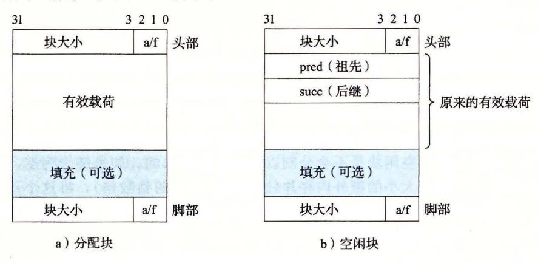

<sup>48</sup> 使用双向 闲链表的堆块的格式

使用双向链表而不是隐式空闲链表,使首次适配的分配时间从块总数的线性时间减少 到了空闲块数 的线性时间 。不 过,释放一个块的时间可以是线性的,也可能是个常数, 这取决千我们所选择的空闲链表中块的排序策略

一种方法是用后进先出 (LIFO) 的顺序维护链表,将新释放的块放置在链表的开始处。 使用 LIFO 的顺序和首次适配的放置策略,分配器会最先检查最近使用过的块。在这种情 况下,释放一个块可以在常数时间内完成。如果使用了边界标记,那么合并也可以在常数 时间内完成。

另一种方法是按照地址顺序来维护链表,其中链表中每个块的地址都小于它后继的地 址。在这种情况下,释放一个块需要线性时间的搜索来定位合适的前驱。平衡点在于,按

一般而言,显式链表的缺点是空闲块必须足够大,以包含所有需要的指针,以及头部 和可能的脚部。这就导致了更大的最小块大小,也潜在地提高了内部碎片的程度。

## 9. 9. 14 分离的空闲链表

就像我们已经看到的,一个使用单向空闲块链表的分配器需要与空闲块数最呈线性关 系的时间来分配块。一种流行的减少分配时间的方法,通常称为分离存储 (segregated storage) ,就是维护多个空闲链表,其中每个链表中的块有大致相等的大小。一般的思路 是将所有可能的块大小分成一些等价类,也叫做大小类 (size class) 。有很多种方式来定义 大小类。例如,我们可以根据 的幕来划分块大小:

{l},{2},{3,4 } , {5 ~ 8},···, {1025 ~ 2048 } ,{2049 ~ 4096},{4097 ~ = } 或者我们可以将小的块分派到它们自己的大小类里,而将大块按照 的幕分类:

{l}, {2}, (3},···, {1023}, (1024 } , {1025 ~ 2048}, (2049 ~ 4096}, {4097 ~ =}

分配器维护着一个空闲链表数组,每个大小类一个空闲链表,按照大小的升序排列。 当分配器需要一个大小为 的块时,它就搜索相应的空闲链表。如果不能找到合适的块与 之匹配,它就搜索下一个链表,以此类推。

有关动态内存分配的文献描述了几十种分离存储方法,主要的区别在千它们如何定义 大小类,何时进行合并,何时向操作系统请求额外的堆内存,是否允许分割,等等。为了 使你大致了解有哪些可能性,我们会描述两种基本的方法:简单分离存储 (simple segregated storage) 和分离适配 (segregated fit)

### 简单分离存储

使用简单分离存储,每个大小类的空闲链表包含大小相等的块,每个块的大小就是这 个大小类中最大元素的大小。例如,如果某个大小类定义为 17~32} ,那么这个类的空闲 链表全由大小为 <sup>32</sup> 的块组成。

为了分配一个给定大小的块,我们检查相应的空闲链表。如果链表非空,我们简单地 分配其中第 块的全部。空闲块是不会分割以满足分配请求的。如果链表为空,分配器就 向操作系统请求一个固定大小的额外内存片(通常是页大小的整数倍),将这个片分成大小 相等的块,并将这些块链接起来形成新的空闲链表。要释放一个块,分配器只要简单地将 这个块插入到相应的空闲链表的前部

这种简单的方法有许多优点 分配和释放块都是很快的常数时间操作。而且,每个片 中都是大小相等的块,不分割,不合并,这意味着每个块只有很少的内存开销。由千每个 片只有大小相同的块,那么一个已分配块的大小就可以从它的地址中推断出来。因为没有 合并,所以已分配块的头部就不需要一个已分配 空闲标记 因此已分配块不需要头部, 同时因为没有合并 它们也不需要脚部 因为分配和释放操作都是在空闲链表的起始处操 作,所以链表只需要是单向的,而不用是双向的。关键点在千,在任何块中都需要的唯一 字段是每个空闲块中的一个字的 succ 指针,因此最小块大小就是一个字。

一个显著的缺点是,简单分离存储很容易造成内部和外部碎片。因为空闲块是不会被 分割的,所以可能会造成内部碎片。更糟的是,因为不会合并空闲块,所以某些引用模式 会引起极多的外部碎片(见练习题 9. 10)

练习题 10 描述一个在基于简单分离存储的分配器中会导致严重外部碎片的引用模式.

## 2. 分离适配

使用这种方法,分配器维护着一个空闲链表的数组 每个空闲链表是和一个大小类相 关联的,并且被组织成某种类型的显式或隐式链表。每个链表包含潜在的大小不同的块, 这些块的大小是大小类的成员。有许多种不同的分离适配分配器。这里,我们描述了一种 简单的版本。

为了分配 个块,必须确定请求的大小类,并且对适当的空闲链表做首次适配,查找 一个合适的块 如果找到了一个,那么就(可选地)分割它,并将剩余的部分插入到适当的 空闲链表中。如果找不到合适的块,那么就搜索下一个更大的大小类的空闲链表。如此重 复,直到找到一个合适的块。如果空闲链表中没有合适的块,那么就向操作系统请求额外 的堆内存,从这个新的堆内存中分配出一个块,将剩余部分放置在适当的大小类中。要释 放一个块,我们执行合并,并将结果放置到相应的空闲链表中。

分离适配方法是一种常见的选择, 标准库中提供的 GNU malloc 包就是采用的这种 方法,因为这种方法既快速,对内存的使用也很有效率。搜索时间减少了,因为搜索被限 制在堆的某个部分,而不是整个堆。内存利用率得到了改善,因为有 个有趣的事实:对 分离空闲链表的简单的首次适配搜索,其内存利用率近似千对整个堆的最佳适配搜索的内 存利用率。

### 3. 伙伴系统

伙伴系统 (buddy system) 是分离适配的一种特例,其中每个大小类都是 的幕。基本 的思路是假设一个堆的大小为沪个字,我们为每个块大小沪维护一个分离空闲链表,其 k~m 。请求块大小向上舍入到最接近的 的幕。最开始时,只有 个大小为沪个字 的空闲块。

为了分配一个大小为 2k 的块,我们找到第一个可用的、大小为 的块,其中 如果 j=k, 那么我们就完成了。否则,我们递归地二分割这个块,直到 j=k 。当我们进行这 样的分割时,每个剩下的半块(也叫做伙伴)被放置在相应的空闲链表中 要释放一个大小为 2k 的块,我们继续合并空闲的伙伴。当遇到一个已分配的伙伴时,我们就停止合并。

关于伙伴系统的一个关键事实是,给定地址和块的大小,很容易计算出它的伙伴的地 例如,一个块,大小为 <sup>32</sup> 字节,地址为:

xOOOOO

它的伙伴的地址为

xlOOOO

换句话说,一个块的地址和它的伙伴的地址只有一位不相同。

伙伴系统分配器的主要优点是它的快速搜索和快速合并。主要缺点是要求块大小为 的幕可能导致显著的内部碎片。因此,伙伴系统分配器不适合通用目的的工作负载。然 而,对于某些特定应用的工作负载,其中块大小预先知道是 的幕,伙伴系统分配器就很 有吸引力了。

# 9. 10 垃圾收集

在诸如 malloc 包这样的显式分配器中,应用通过调用 malloc free 来分配和释 放堆块。应用要负责释放所有不再需要的已分配块。

未能释放已分配的块是一种常见的编程错误。例如,考虑下面的 函数,作为处理的 一部分,它分配一块临时存储:

```
123456 void garbage() 
    { 
        int *P = (int *)Malloc(15213); 
    return; I* Array pis garbage at this point *I }
```

因为程序不再需要 p, 所以在 garbage 返回前应该释放 。不幸的是,程序员忘了释 放这个块。它在程序的生命周期内都保持为已分配状态,毫无必要地占用着本来可以用来 满足后面分配请求的堆空间。

垃圾收集器 (garbage collector) 是一种动态内存分配器,它自动释放程序不再需要的 已分配块。这些块被称为垃圾 (garbage) (因此术语就称之为垃圾收集器)。自动回收堆存 储的过程叫做垃圾收集 (garbage collection) 。在一个支待垃圾收集的系统中,应用显式分 配堆块,但是从不显示地释放它们。在 程序的上下文中,应用调用 malloc, 但是从不 调用 free 。反之,垃圾收集器定期识别垃圾块,并相应地调用 free, 将这些块放回到空 闲链表中。

垃圾收集可以追溯到 John McCarthy <sup>20</sup> 世纪 <sup>60</sup> 年代早期在 MIT 开发的 Lisp 系统。 它是诸如 Java ML Perl Mathematica 等现代语言系统的一个重要部分,而且它仍然 是一个重要而活跃的研究领域。有关文献描述了大量的垃圾收集方法,其数量令人吃惊。 我们的讨论局限千 McCarthy 独创的 Mark&Sweep (标记&清除)算法,这个算法很有趣, 因为它可以建立在已存在的 malloc 包的基础之上,为 C+ +程序提供垃圾收集。

## 9. 10. 1 垃圾收集器的基本知识

垃圾收集器将内存视为一张有向可达图 (reachab ty graph) ,其形式如图 9-49 所示。 该图的节点被分成一组根节点 (root node) 和一组堆节点 (heap node) 。每个堆节点对应千 堆中的一个已分配块。有向边 p---+-q 意味着块 中的某个位置指向块 中的某个位置。根 节点对应千这样一种不在堆中的位置,它们中包含指向堆中的指针。这些位置可以是寄存 器、栈里的变量,或者是虚拟内存中读写数据区域内的全局变量。


9-49 垃圾收集器将内存视为一张有向图

当存在一条从任意根节点出发并到达 的有向路径时,我们说节点 是可达的 (reachable) 。在任何时刻,不可达节点对应千垃圾,是不能被应用再次使用的。垃圾收集 器的角色是维护可达图的某种表示,并通过释放不可达节点且将它们返回给空闲链表,来 定期地回收它们。

ML Java 这样的语言的垃圾收集器,对应用如何创建和使用指针有很严格的控 制,能够维护可达图的一种精确的表示,因此也就能够回收所有垃圾。然而,诸如

C+ +这样的语言的收集器通常不能维持可达图的精确表示 这样的收集器也叫做保守的 垃圾收集器 (conservative garbage collector) 从某种意义上来说它们是保守的,即每个可 达块都被正确地标记为可达了,而一些不可达节点却可能被错误地标记为可达。

收集器可以按需提供它们的服务,或者它们可以作为一个和应用并行的独立线程,不 断地更新可达图和回收垃圾。例如,考虑如何将一个 程序的保守的收集器加入到已存在 malloc 包中,如图 <sup>50</sup> 所示

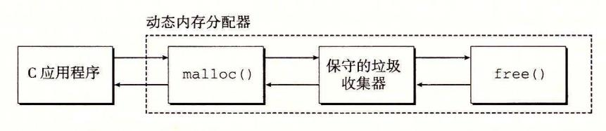

<sup>50</sup> 将一个保守的垃圾收集器加入到 malloc 包中

无论何时需要堆空间时,应用都会用通常的方式调用 malloc 。如果 malloc 找不到一 个合适的空闲块,那么它就调用垃圾收集器,希望能够回收 些垃圾到空闲链表。收集器 识别出垃圾块,并通过调用 free 函数将它们返回给堆。关键的思想是收集器代替应用去 调用 free 。当对收集器的调用返回时, malloc 重试,试图发现一个合适的空闲块。如果 还是失败了,那么它就会向操作系统要求额外的内存。最后, malloc 返回一个指向请求 块的指针(如果成功)或者返回一个空指针(如果不成功)。

## 9. 10. 2 Mark & Sweep 垃圾收集器

Mark&Sweep 垃圾收集器由标记 (mark) 阶段和清除 (sweep) 阶段组成,标记阶段标记 出根节点的所有可达的和已分配的后继,而后面的清除阶段释放每个未被标记的已分配 块。块头部中空闲的低位中的一位通常用来表示这个块是否被标记了

我们对 Mark&Sweep 的描述将假设使用下列函数,其中 ptr 定义为 typedef void \*ptr:

- •• ptr isP (ptr p) 。如果 指向一个已分配块中的某个字,那么就返回一个指向 这个块的起始位置的指针 。否则返回 NULL
- int blockMarked (ptr b) 。如果块 是巳标记的,那么就返回 true
- int blockAllocated (ptr b) 。如果块 是巳分配的,那么就返回 true
- void markBlock (p b) 。标记块
- int length (b) 。返回块 的以字为单位的长度(不包括头部)。
- void unmarkBlock (ptr b) 将块 的状态由己标记的改为未标记的。
- ptr nextBlock (p b) 。返回堆中块 的后继。

标记阶段为每个根节点调用一次图 9-5la 所示的 mark 函数。如果 不指向一个已分 配并且未标记的堆块, mark 函数就立即返回。否则,它就标记这个块,并对块中的每个 字递归地调用它自己。每次对 mark 函数的调用都标记某个根节点的所有未标记并且可达 的后继节点。在标记阶段的末尾,任何未标记的已分配块都被认定为是不可达的,是垃 圾,可以在清除阶段回收。

清除阶段是对图 9-5lb 所示的 sweep 函数的一次调用。 sweep 函数在堆中每个块上反 复循环,释放它所遇到的所有未标记的已分配块(也就是垃圾)。

9-52 展示了一个小堆的 Mark&Sweep 的图形化解释。块边界用粗线条表示。每个方 块对应千内存中的一个字。每个块有一个字的头部,要么是已标记的,要么是未标记的。

```
void mark(ptr p) {
   if ((b = isPtr(p)) == NULL)
     return;
   if (blockMarked(b))
     return;
   markBlock(b);
   len = length(b);
   for (i=0; i < len; i++)
     mark(b[i]);
   return;
}</pre>
```

```
void sweep(ptr b, ptr end) {
   while (b < end) {
      if (blockMarked(b))
          unmarkBlock(b);
      else if (blockAllocated(b))
          free(b);
      b = nextBlock(b);
   }
   return;
}</pre>
```

a) mark 函数

b) sweep函数

图 9-51 mark 和 sweep 函数的伪代码

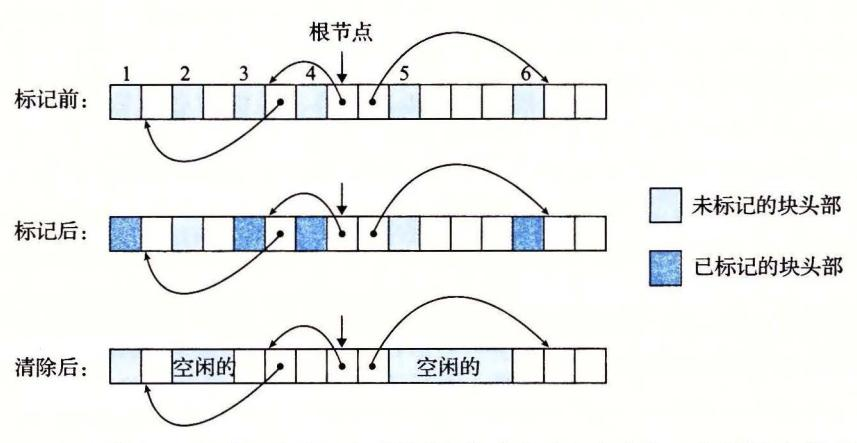

图 9-52 Mark & Sweep 示例。注意这个示例中的箭头表示内存引用,而不是空闲链表指针

初始情况下,图 9-52 中的堆由六个已分配块组成,其中每个块都是未分配的。第 3 块包含一个指向第 1 块的指针。第 4 块包含指向第 3 块和第 6 块的指针。根指向第 4 块。在标记阶段之后,第 1 块、第 3 块、第 4 块和第 6 块被做了标记,因为它们是从根节点可达的。第 2 块和第 5 块是未标记的,因为它们是不可达的。在清除阶段之后,这两个不可达块被回收到空闲链表。

#### 9. 10. 3 C程序的保守 Mark & Sweep

Mark & Sweep 对 C 程序的垃圾收集是一种合适的方法,因为它可以就地工作,而不需要移动任何块。然而,C 语言为 isPtr 函数的实现造成了一些有趣的挑战。

第一,C不会用任何类型信息来标记内存位置。因此,对 isPtr 没有一种明显的方式来判断它的输入参数 p 是不是一个指针。第二,即使我们知道 p 是一个指针,对 isPtr也没有明显的方式来判断 p 是否指向一个已分配块的有效载荷中的某个位置。

对后一问题的解决方法是将已分配块集合维护成一棵平衡二叉树,这棵树保持着这样一个属性: 左子树中的所有块都放在较小的地址处,而右子树中的所有块都放在较大的地址处。如图 9-53 所示,这就要求每个已分配块的头部里有两个附加字段(left 和 right)。每个字段指向某个已分配块的头部。isPtr(ptr p)函数用树来执行对已分配块的二分查找。在每一步中,它依赖于块头部中的大小字段来判断 p是否落在这个块的范围之内。


9-53 一棵已分配块的平衡树中的左右指针

平衡树方法保证会标记所有从根节点可达的节点,从这个意义上来说它是正确的 是一个必要的保证,因为应用程序的用户当然不会喜欢把他们的已分配块过早地返回给空 闲链表。然而,这种方法从某种意义上而言又是保守的,因为它可能不正确地标记实际上 不可达的块,因此它可能不会释放某些垃圾。虽然这并不影响应用程序的正确性,但是这 可能导致不必要的外部碎片。

程序的 Mark & Sweep 收集器必须是保守的,其根本原因是 不会用类型信息 来标记内存位置。因此,像 吐或者 float 这样的标量可以伪装成指针。例如,假设某 个可达的已分配块在它的有效载荷中包含一个 int, 其值碰巧对应于某个其他已分配块 的有效载荷中的 个地址。对收集器而 ,是没有办法推断出这个数据实际上是 int 而不 是指针。因此,分配器必须保守地将块 标记为可达,尽管事实上它可能是不可达的。

# 9. 11 程序中常见的与内存有关的错误

程序员来说,管理和使用虚拟内存可能是个困难的、容易出错的任务。与内存有 关的错误属于那些最令人惊恐的错误,因为它们在时间和空间上,经常在距错误源一段距 离之后才表现出来。将错误的数据写到错误的位置,你的程序可能在最终失败之前运行了 好几个小时,且使程序中止的位置距离错误的位置已经很远了。我们用一些常见的与内存 有关错误的讨论,来结束对虚拟内存的讨论。

## 9. 11 . 1 间接引用坏指针

正如我们在 9. 7. 节中学到的,在进程的虚拟地址空间中有较大的洞,没有映射到任何有 意义的数据。如果我们试图间接引用一个指向这些洞的指针,那么操作系统就会以段异常中止 程序。而且,虚拟内存的某些区域是只读的。试图写这些区域将会以保护异常中止这个程序。

间接引用坏指针的一个常见示例是经典的 scanf 错误。假设我们想要使用 scanf stdin 读一个整数到一个变量。正确的方法是传递给 scanf 一个格式串和变量的地址:

scanf("%d", &val)

然而,对千 程序员初学者而言(对有经验者也是如此!),很容易传递 val 的内容,而不 是它的地址:

scanf("%d", val)

在这种情况下, scanf 将把 val 的内容解释为一个地址,并试图将一个字写到这个位置。 在最好的情况下,程序立即以异常终止。在最糟糕的情况下, val 的内容对应于虚拟内存 的某个合法的读/写区域,千是我们就覆盖了这块内存,这通常会在相当长的一段时间以 后造成灾难性的、令人困惑的后果。

### 9. 11 . 2 读未初始化的内存

虽然 bss 内存位置(诸如未初始化的全局 变量)总是被加载器初始化为零,但是对于 堆内存却并不是这样的。一个常见的错误就是假设堆内存被初始化为零:

```
/* Return v = Ax */
    int *matvec(int **A, int *x, int n)
2
3
4
         int i, j;
5
6
         int *v = (int *)Malloc(n * sizeof(int)):
         for (i = 0: i < n: i++)
             for (j = 0; j < n; j++)
9
                 y[i] += A[i][i] * x[i];
10
11
         return v:
12
```

在这个示例中,程序员不正确地假设向量 y 被初始化为零。正确的实现方式是显式地将 v[i]设置为零,或者使用 calloc。

#### 9.11.3 允许栈缓冲区溢出

正如我们在 3.10.3 节中看到的,如果一个程序不检查输入串的大小就写入栈中的目标缓冲区,那么这个程序就会有缓冲区溢出错误(buffer overflow bug)。例如,下面的函数就有缓冲区溢出错误,因为 gets 函数复制一个任意长度的串到缓冲区。为了纠正这个错误,我们必须使用 fgets 函数,这个函数限制了输入串的大小:

```
void bufoverflow()

char buf[64];

gets(buf); /* Here is the stack buffer overflow bug */
return;

}
```

### 9.11.4 假设指针和它们指向的对象是相同大小的

一种常见的错误是假设指向对象的指针和它们所指向的对象是相同大小的:

```
/* Create an nxm array */
    int **makeArrav1(int n, int m)
2
3
    {
4
         int i;
         int **A = (int **)Malloc(n * sizeof(int));
5
6
7
         for (i = 0; i < n; i++)
             A[i] = (int *)Malloc(m * sizeof(int)):
9
         return A;
10
    }
```

这里的目的是创建一个由n个指针组成的数组,每个指针都指向一个包含m个 int 的数组。然而,因为程序员在第5 行将 sizeof (int \*)写成了 sizeof (int),代码实际上创建的是一个 int 的数组。

这段代码只有在 int 和指向 int 的指针大小相同的机器上运行良好。但是,如果我们在像 Core i7 这样的机器上运行这段代码,其中指针大于 int, 那么第7行和第8行的循环将

写到超出 数组结尾的地方。因为这些字中的一个很可能是已分配块的边界标记脚部,所以 我们可能不会发现这个错误,直到在这个程序的后面很久释放这个块时,此时,分配器中的 合并代码会戏剧性地失败,而没有任何明显的原因。这是"在远处起作用 (action at distance)" 的一个阴险的示例,这类"在远处起作用"是与内存有关的编程错误的典型清况。

## 9. 11 . 5 造成错位错误

错位 (off-by-one) 错误是另 种很常见的造成覆盖错误的来源:

```
I* Create an nxm array *I 
2int **makeArray2(int n, int m) 
4inti; 
5int **A= (int **)Malloc(n * sizeof(int *)); 
7for(i=O;i<=n;i++) 
B · A[i] = (int *)Malloc(m * sizeof(int)); 
       return A; 
10 }
```

这是前面一节中程序的另一个版本 这里我们在第 行创建了一个 个元素的指针数 组,但是随后在第 行和第 行试图初始化这个数组的 个元素,在这个过程中覆盖 数组后面的某个内存位置

## 9. 11 . 6 引用指针,而不是它所指向的对象

如果不太注意 操作符的优先级和结合性,我们就会错误地操作指针,而不是指针所 指向的对象。比如,考虑下面的函数,其目的是删除一个有\* size 项的二叉堆里的第 项,然后对剩下的\*size-1 项重新建堆:

```
int *binheapDelete(int **binheap, int *Size) 
2 { 
3int *packet = binheap [OJ ; 
5binheap [OJ = binheap [ *size - 1] ; 
6*size--; I* This should be (*size)-- *I 
7 heapify(binheap, *size, 0); 
8return(packet);
```

在第 行,目的是减少 size 指针指向的整数的值 然而,因为一元运算符一—和\* 的优先级相同,从右向左结合,所以第 行中的代码实际减少的是指针自己的值,而不是 它所指向的整数的值。如果幸运地话,程序会立即失败;但是更有可能发生的是,当程序 在执行过程后很久才产生出一个不正确的结果时,我们只有一头的雾水。这里的原则是 你对优先级和结合性有疑问的时候,就使用括号。比如,在第 行,我们可以使用表达式 (\*size) 一一 清晰地表明我们的意图。

### 9. 11 . 7 误解指针运算

另一种常见的错误是忘记了指针的算术操作是以它们指向的对象的大小为单位来进行 的,而这种大小单位并不一定是字节 例如,下面函数的目的是扫描 int 的数组,并

返回一个指针,指向 val 的首次出现:

```
int *search(int *p, int val)
{
     while (*p && *p != val)
```

然而,因为每次循环时,第4行都把指针加了4(一个整数的字节数),函数就不正确地扫描数组中每4个整数。

#### 9.11.8 引用不存在的变量

没有太多经验的 C 程序员不理解栈的规则,有时会引用不再合法的本地变量,如下列所示:

```
1  int *stackref ()
2  {
3    int val;
4
5    return &val;
6  }
```

这个函数返回一个指针(比如说是 p),指向栈里的一个局部变量,然后弹出它的栈帧。尽管 p 仍然指向一个合法的内存地址,但是它已经不再指向一个合法的变量了。当以后在程序中调用其他函数时,内存将重用它们的栈帧。再后来,如果程序分配某个值给\*p,那么它可能实际上正在修改另一个函数的栈帧中的一个条目,从而潜在地带来灾难性的、令人困惑的后果。

#### 9.11.9 引用空闲堆块中的数据

一个相似的错误是引用已经被释放了的堆块中的数据。例如,考虑下面的示例,这个示例在第 6 行分配了一个整数数组 x,在第 10 行中先释放了块 x,然后在第 14 行中又引用了它:

```
int *heapref(int n, int m)
1
     {
2
3
         int i:
         int *x, *y;
4
         x = (int *)Malloc(n * sizeof(int));
          · // Other calls to malloc and free go here
8
         free(x);
10
11
         y = (int *)Malloc(m * sizeof(int));
12
         for (i = 0; i < m; i++)
13
              y[i] = x[i]++; /* Oops! x[i] is a word in a free block */
14
15
         return y;
16
     }
17
```

取决千在第 行和第 <sup>10</sup> 行发生的 malloc free 的调用模式,当程序在第 <sup>14</sup> 行引用 x[i] 时,数组 可能是某个其他巳分配堆块的一部分了,因此其内容被重写了。和其他许 多与内存有关的错误 样,这个错误只会在程序执行的后面,当我们注意到 中的值被破 坏了时才会显现出来。

## 9. 11 . 10 引起内存泄漏

内存泄漏是缓慢、隐性的杀手,当程序员不小心忘记释放已分配块,而在堆里创建了 垃圾时,会发生这种问题。例如,下面的函数分配了一个堆块 x, 然后不释放它就返回:

```
123456 void leak(int n) 
   { 
        int *X = (int *)Malloc(n * sizeof(int)); 
    return; I* xis garbage at this point *I }
```

如果经常调用 leak, 那么渐渐地,堆里就会充满了垃圾,最糟糕的情况下,会占用 整个虚拟地址空间。对千像守护进程和服务器这样的程序来说,内存泄漏是特别严重的, 根据定义这些程序是不会终止的。

# 9. 12 小结

虚拟内存是对主存的 个抽象。支持虚拟内存的处理器通过使用一种叫做虚拟寻址的间接形式来引 用主存。处理器产生一个虚拟地址,在被发送到主存之前,这个地址被翻译成 个物理地址。从虚拟地 址空间到物理地址空间的地址翻译要求硬件和软件紧密合作。专门的硬件通过使用页表来翻译虚拟地址, 而页表的内容是由操作系统提供的。

虚拟内存提供三个重要的功能。第 ,它在主存中自动缓存最近使用的存放磁盘上的虚拟地址空间 的内容。虚拟内存缓存中的块叫做页。对磁盘上页的引用会触发缺页,缺页将控制转移到操作系统中的 一个.缺页处理程序。缺页处理程序将页面从磁盘复制到主存缓存,如果必要,将写回被驱逐的页。第二, 虚拟内存简化了内存管理,进而又简化了链接、在进程间共享数据、进程的内存分配以及程序加载。最 后,虚拟内存通过在每条页表条目中加入保护位,从而了简化了内存保护。

地址翻译的过程必须和系统中所有的硬件缓存的操作集成在一起。大多数页表条目位于 L1 高速缓 存中,但是一个称为 TLB 的页表条目的片上高速缓存,通常会消除访问在 L1 上的页表条目的开销。

现代系统通过将虚拟内存片和磁盘上的文件片关联起来,来初始化虚拟内存片,这个过程称为内存 映射。内存映射为共享数据、创建新的进程以及加载程序提供了一种高效的机制。应用可以使用 mmap 数来手工地创建和删除虚拟地址空间的区域。然而,大多数程序依赖千动态内存分配器,例如 malloc, 它管理虚拟地址空间区域内一个称为堆的区域。动态内存分配器是 个感觉像系统级程序的应用级程序, 它直接操作内存,而无需类型系统的很多帮助。分配器有两种类型。显式分配器要求应用显式地释放它 们的内存块。隐式分配器(垃圾收集器)自动释放任何未使用的和不可达的块。

对于 程序员来说,管理和使用虚拟内存是一件困难和容易出错的任务。常见的错误示例包括:间 接引用坏指针,读取未初始化的内存,允许栈缓冲区溢出,假设指针和它们指向的对象大小相同,引用 指针而不是它所指向的对象,误解指针运算,引用不存在的变量,以及引起内存泄漏。

# 参考文献说明

Kilburn 和他的同事们发表了第一篇关千虚拟内存的描述 [63 。体系结构教科书包括关于硬件在虚拟 内存中的角色的更多细节 [46] 。操作系统教科书包含关千操作系统角色的更多信息 [102, 106, 113] Bovet Cesati [11] 给出了 Linux 虚拟内存系统的详细描述。 Intel 公司提供了 IA 处理器上 <sup>32</sup> 位和 <sup>64</sup>

地址翻译的详细文档 52]

Knuth <sup>1968</sup> 年编写了有关内存分配的经典之作 [64 从那以后,在这个领域就有了大 的文献。 Wilson Johnstone Neely Bole 编写了一篇关于显式分配器的漂亮综述和性能评价的文章 [118] 。本 书中关千各种分配器策略的吞吐率和利用率的一般评价就引自于他们的调查。 Jones Lins 提供了关于 垃圾收集的全面综述 [56] Kernighan Ritchie [ 61] 展示了 个简单分配器的完整代码,这个简单的分 配器是基千显式空闲链表的, 闲块中都有一个块大小和后继指针 这段代码使用联合 (union) 来消 除大 的复杂指针运算,这是很有趣的,但是代价是释放操作是 性时间(而不是常数时间) Doug Lea 开发了广泛使用的开源 malloc 包,称为 dlmalloc [ 7]

# 家庭作业

• 9 11 在下面的一系列问题中,你 9. 6. 节中的示例内存系统如何将虚拟地址翻译成物理地址, 以及如何访问缓存。对千给定的虚拟地址,请指出访问的 TLB 条目、物理地址,以及返回的缓存 字节值。请指明是否 TLB 不命中,是否发生了缺页,是 发生了缓存不命中。如果有缓存不命 中,对于"返回的缓存字节"用"-"来表示 如果有缺页,对千 "PPN" 用"-"来表示,而 部分和 部分就空着。

虚拟地址: Ox027c A. 虚拟地址格式

| 3 | 12 | 11 | 10 | 9 | 8 | 7 | 6 | 5 | 4 | 3 | 2 |  |
|---|----|----|----|---|---|---|---|---|---|---|---|--|
| I |    |    |    |   |   |   |   |   |   |   |   |  |

#### B. 地址翻译

| 参数                  |  |
|---------------------|--|
| VPN                 |  |
| TLB 索引              |  |
| TLB 标记              |  |
| TLB 命中?<br>(是<br>否) |  |
| 缺页?<br>(是<br>否)     |  |
| PPN                 |  |

C. 物理地址格式

| 11 | IO | 9 | 8 | 7 | 6 | 5 | 4 | 3 | 2 | I | 0 |
|----|----|---|---|---|---|---|---|---|---|---|---|
|    |    | I | I | I | I | I | I | I | I | I | I |
|    |    |   |   |   |   |   |   |   |   |   |   |

D. 物理地址引用

| 参数             |  |
|----------------|--|
| 字节偏移           |  |
| 缓存索引           |  |
| 缓存标记           |  |
| 缓存命中?<br>(是 否) |  |
| 返回的缓存字节        |  |

• 9. 12 对于下面的地址,重复习题 9. 11:

虚拟地址: Ox03a9

A. 虚拟地址格式