| 13 | 12 | 11 | 10 | 9 | 8 | 7 | 6 | 5 | 4 | 3 | 2 | I | 0 |
|----|----|----|----|---|---|---|---|---|---|---|---|---|---|
|    |    |    |    |   |   |   |   |   |   |   |   |   |   |

#### B. 地址翻译

| 参数               |  |
|------------------|--|
| VPN              |  |
| TLB 索引           |  |
| TLB              |  |
| TLB 命中?<br>(是/否) |  |
| 缺页?<br>否)        |  |
| PPN              |  |

#### C. 物理地址格式

| I I | 10 | 9 | 8 | 7 | 6 | 5 | 4 | 3 | 2 | I | 0 |
|-----|----|---|---|---|---|---|---|---|---|---|---|
|     |    |   |   |   |   |   |   |   |   |   |   |

#### D. 物理地址引用

| 参数             |  |
|----------------|--|
| 字节偏移           |  |
| 缓存索引           |  |
| 缓存标记           |  |
| 缓存命中?<br>(是 否) |  |
| 返回的缓存字节        |  |

#### • 9. 13 对于下面的地址,重复习题 9.11:

虚拟地址: Ox0040

A. 虚拟地址格式

| 13 | 12 | 11 | 10 | 9 | 8 | 7 | 6 | 5 | 4 | 3 | 2 | I | 0 |
|----|----|----|----|---|---|---|---|---|---|---|---|---|---|
|    |    |    |    |   |   |   |   |   |   |   |   |   |   |

#### 地址 翻译

| 参数                  |  |
|---------------------|--|
| VPN                 |  |
| TLB 索引              |  |
| TLB 标记              |  |
| TLB 命中?<br>(是<br>否) |  |
| 缺页?<br>否)<br>(是     |  |
| PPN                 |  |

#### C. 物理地址格式

| 11 | 10 | 9 | 8 | 7 | 6 | 5 | 4 | 3 | 2 | I | 0 |
|----|----|---|---|---|---|---|---|---|---|---|---|
|    |    |   |   |   |   |   |   |   |   |   |   |

#### D. 物理地址引用

| 参数             |  |
|----------------|--|
| 字节偏移           |  |
| 缓存索引           |  |
| 缓存标记           |  |
| 缓存命中?<br>(是/否) |  |
| 返回的缓存字节        |  |

- •• 9. 14 假设有一个输入文件 hello.txt, 由字符串 "Hello, world! \n" 组成,编写一个 程序,使用 mmap hello.txt 的内容改变为 "Jello,world!\n"
- 9. 15 确定下面的 malloc 请求序列得到的块大小和头部值。假设: 1) 分配器保持双字对齐,使用隐式空 闲链表,以及图 9-35 中的块格式。 2) 块大小向上舍入为最接近的 字节的倍数。

| 请求          | 块大小(十进制字节) | 块头部(十六进制) |
|-------------|------------|-----------|
| malloc(3)   |            |           |
| malloc (11) |            |           |
| malloc(20)  |            |           |
| malloc(21)  |            |           |

• 9. 16 确定下面对齐要求和块格式的每个组合的最小块大小。假设:显式空闲链表、每个空闲块中有四字 节的 pred succ 指针、不允许有效载荷的大小为零,并且头部和脚部存放在一个四字节的字中。

| 对齐要求 | 已分配块      | 空闲块   | 最小块大小(字节) |
|------|-----------|-------|-----------|
| 单字   | 头部和脚部     | 头部和脚部 |           |
| 单字   | 头部,但是没有脚部 | 头部和脚部 |           |
| 双字   | 头部和脚部     | 头部和脚部 |           |
| 双字   | 头部,但是没有脚部 | 头部和脚部 |           |

- \\* 9. 17 开发 9.9. 节中的分配器的一个版本,执行下一次适配搜索,而不是首次适配搜索
- \*\*\* 9. 18 9.9.12 节中的分配器要求每个块既有头部也有脚部,以实现常数时间的合并。修改分配器,使得 空闲块需要 头部和脚部,而已分配块只需要头部。
- 9. 19 下面给出了三组关千内存管理和垃圾收集的陈述 。在每一组中,只有一句陈述是正确的。你的任 务就是判断哪一句是正确的。
  - 1) a) 在一个伙伴系统中,最高可达 <sup>50</sup> %的空间可以因为内部碎片而被浪费了。
    - b) 首次适配内存分配算法比最佳适配算法要慢一些(平均而言)。
    - c) 只有当空闲链表按照内存地址递增排序时,使用边界标记来回收才会快速。
    - d) 伙伴系统只会有内部碎片,而不会有外部碎片。
  - 2) a) 在按照块大小递减顺序排序的空闲链表上,使用首次适配算法会导致分配性能很低,但是可 以避免外部碎片。
    - b) 对千最佳适配方法,空闲块链表应该按照内存地址的递增顺序排序。
    - c) 最佳适配方法选择与请求段匹配的最大的空闲块。
    - d) 在按照块大小递增的顺序排序的空闲链表上,使用首次适配算法与使用最佳适配算法等价。
  - 3) Mark&.Sweep 垃圾收集器在下列哪种情况下叫做保守的:
    - a) 它们只有在内存请求不能被满足时才合并被释放的内存。
    - b) 它们把一切看起来像指针的东西都当做指针。
    - c) 它们只在内存用尽时,才执行垃圾收集。
    - d) 它们不释放形成循环链表的内存块。

:: 9. 20 编写你自己的 malloc free 版本,将它的运行时间和空间利用率与标准 库提供的 malloc 本进行比较。

## 练习题答案

9 1 这道题让你对不同地址空间的大小有了些了解。曾几何时,一个 <sup>32</sup> 位地址空间看上去似乎是无法 想象的大。但是,现在有些数据库和科学应用需要更大的地址空间,而且你会发现这种趋势会继 续。在有生之年,你可能会抱怨个人电脑上那狭促的 <sup>64</sup> 位地址空间!

| 虚拟地址位数 (n) | 虚拟地址数 (N)    | 最大可能的虚拟地址         |
|------------|--------------|-------------------|
| 8          | 28= 256      | 28- I= 255        |
| 16         | 216= 64K     | 216—I =64K-l      |
| 32         | 232=4G       | 232-1 =4G-<br>l   |
| 48         | 248= 256T    | 248 - != 256T- I  |
| 64         | 264= 16 384P | 264- I= 16 384P-1 |

9. 2 因为每个虚拟页面是 =沪字节,所以在系统中总共有 2" / 2P = 2• 个可能的页面,其中每个都需 要一个页表条目 (PTE)

| n  | P=2P | PTE的数量 |
|----|------|--------|
| 16 | 4K   | 16     |
| 16 | 8K   | 8      |
| 32 | 4K   | IM     |
| 32 | 8K   | 512K   |

9. 3 为了完全掌握地址翻译,你需要很好地理解这类问题。下面是如何解决第一个子问题:我们有 n= <sup>32</sup> 个虚拟地址位和 m=24 个物理地址位。页面大小是 P=lKB, 这意味着对千 VPO PPO, 我们 都需要 log OK)=lO 位。(回想一下, VPO PPO 是相同的。)剩下的地址位分别是 VPN PPN.

| p   | VPN位数 | VPO位数 | PPN位数 | PPO位数 |
|-----|-------|-------|-------|-------|
| IKB | 22    | 10    | 14    | 10    |
| 2KB | 21    | II    | 13    | II    |
| 4KB | 20    | 12    | 12    | 12    |
| 8KB | 19    | 13    | II    | 13    |

9. 4 做一些这样的手工模拟,能很好地巩固你对地址翻译的理解。你会发现写出地址中的所有的位,然 后在不同的位字段上画出方框,例如 VPN TLBI 等,这会很有帮助。在这个特殊的练习中,没有 任何类型的不命中: TLB 有一份 PTE 的副本,而缓存有一份所请求数据字的副本。对于命中和不 命中的一些不同的组合,请参见习题 9. <sup>11</sup> 9. <sup>12</sup> 9. <sup>13</sup>

A. oo 0011 1101 0111

| B. | 参数          |     |
|----|-------------|-----|
|    | VPN         | Oxf |
|    | TLB 索引      | Ox3 |
|    | TLB 标记      | Ox3 |
|    | TLB 命中?堤/否) |     |
|    | 缺页?<br>堤/否) |     |
|    | PPN         | Oxd |

C. 0011 0101 0111

| 参数            | 值            |
|---------------|--------------|
| CO            | 0x3          |
| CI            | 0 <b>x</b> 5 |
| CT            | 0xd          |
| 高速缓存命中? (是/否) | 是            |
| 高速缓存字节返回      | 0x1d         |

9.5 解决这个题目将帮助你很好地理解内存映射。请自己独立完成这道题。我们没有讨论 open、fstat 或者 write 函数,所以你需要阅读它们的帮助页来看看它们是如何工作的。

```
code/vm/mmapcopy.c
     #include "csapp.h"
1
2
      * mmapcopy - uses mmap to copy file fd to stdout
 4
 5
     void mmapcopy(int fd, int size)
 6
 7
 8
         char *bufp; /* ptr to memory-mapped VM area */
         bufp = Mmap(NULL, size, PROT_READ, MAP_PRIVATE, fd, 0);
10
11
         Write(1, bufp, size);
12
         return;
     }
13
14
     /* mmapcopy driver */
15
16
     int main(int argc, char **argv)
17
18
         struct stat stat;
         int fd;
19
20
21
         /* Check for required command-line argument */
         if (argc != 2) {
22
23
             printf("usage: %s <filename>\n", argv[0]);
             exit(0);
24
25
26
         /* Copy the input argument to stdout */
27
         fd = Open(argv[1], O_RDONLY, 0);
28
         fstat(fd, &stat);
29
         mmapcopy(fd, stat.st_size);
30
         exit(0);
31
     }
32
                                                       code/vm/mmapcopy.c
```

9.6 这道题触及了一些核心的概念,例如对齐要求、最小块大小以及头部编码。确定块大小的一般方法是,将所请求的有效载荷和头部大小的和舍人到对齐要求(在此例中是8字节)最近的整数倍。比如,malloc(1)请求的块大小是4+1=5,然后舍入到8。而 malloc(13)请求的块大小是13+4=17,舍入到24。

| 请求         | 块大小(十进制字节) | 块头部(十六进制)     |
|------------|------------|---------------|
| malloc(1)  | 8          | 0×9           |
| malloc(5)  | 16         | 0×11          |
| malloc(12) | 16         | 0x11          |
| malloc(13) | 24         | 0 <b>x</b> 19 |

9.7 最小块大小对内部碎片有显著的影响。因此,理解和不同分配器设计和对齐要求相关联的最小块大小是很好的。很有技巧的一部分是,要意识到相同的块可以在不同时刻被分配或者被释放。因此,最小块大小就是最小已分配块大小和最小空闲块大小两者的最大值。例如,在最后一个子问题中,

最小的巳分配块大小是一个 字节头部和一个 节有 效载荷,舍入到 而最小空闲块的大 小是 字节的头部和 字节的脚部,加起来是 字节,已经是 的倍数,就不需要再舍入 了。所以,这个分配器的最小块大小就是 字节。

| 对齐要求 | 已分配块      | 空闲块   | 最小块大小(字节) |
|------|-----------|-------|-----------|
| 单字   | 头部和脚部     | 头部和脚部 | 12        |
| 单字   | 头部,但是没有脚部 | 头部和脚部 | 8         |
| 双字   | 头部和脚部     | 头部和脚部 | 16        |
| 双字   | 头部,但是没有脚部 | 头部和脚部 | 8         |

9. 8 这里没有特别的技巧。但是解答此题要求你理解简单的隐式链表分配器的剩余部分是如何工作的, 如何操作和遍历块的

```
codelvmlmalloc/mm.c 
1 static void *find_fit(size_t asize) 
2 { 
        I* First-fit sea ch *I 
4void *bp; 
6 for (bp = heap_listp; GET_SIZE(HDRP(bp)) > O; bp = NEXT_BLKP(bp)) { 
           if (!GET_ALLOC(HDRP(bp)) && (asize <= GET_SIZE(HDRP(bp)))) { 
8 return bp; 
9 } 
10 } 
11 return NULL; I* No fit *I 
12 #endif 
13 } 
                                                       codelvmlmallodmm. c
```

9. 9 这又是一个帮助你熟悉分配器的热身练习。注意对千这个分配器,最小块大小是 <sup>16</sup> 字节。如果分 割后剩下的块大于或者等千最小块大小,那么我们就分割这个块(第 <sup>10</sup> 行)。这里唯一有技巧的 部分是要意识到在移动到下一块之前(第 行),你必须放置新的 已分配块 (第 和第

```
code/vm/mallodmm.c 
1 static void place(void •bp, size_t asize) 
2 { 
3 size_t csize = GET_SIZE(HDRP(bp)); 
4 
5 if ((csize - asize) >= (2•DSIZE)) { 
6 PUT(HDRP(bp), PACK(asize, 1)); 
           PUT(FTRP(bp), PACK(asize, 1)); 
8 bp = NEXT_BLKP(bp); 
9 PUT(HDRP(bp), PACK(csize-asize, O)); 
10 PUT(ITRP(bp), PACK(csize-asize, O)); 
11 } 
12 else { 
13 PUT(HDRP(bp), PACK(csize, 1)); 
14PUT(FTRP(bp), PACK(csize, 1)); 
15 } 
16 } 
                                              code/vm/mallodmm.c
```

9. 10 这里有一个会引起外部碎片的模式:应用对第一个大小类做大蜇的分配和释放请求,然后对第二 个大小类做大鼠的分配和释放请求,接下来是对第三个大小类做大盘的分配和释放请求,以此类 推。对于每个大小类 ,分配器都创建 了许多不会被 回收的存储 器,因为分配器不会合并,也因为 应用不会再向这个大小类再次请求块了。

# 程序间的交互和通信

我们学习计算机系统到现在, 直假设程序是独立运行的, 只包含最小限度的输入和输出。然 而,在 现实世界里 应用程序 利用操作系统提供的服务来与 设备及其他程序通信。

本书的这一部分将使你了解 nix 操作系统提供的基本 务,以及如何用这些服务来构造应用程序 例如 客户端和服 务器,它们是通过 nternet 彼此通信的。你将学习编写诸如 服务器这样的可以同时为多个客户端提供服务的并发程序。编 并发应用程序还能使程序在现代多核处理器上执行得更快。当 完了这个部分,你将逐渐变成 个很牛的程序员,对计算机系统 以及它们对程序的影响有很成熟的理解。

#### C H A P T E R 10

## 系统级 1/0

输入 轮出 (1 0) 是在主存和外部设备(例如磁盘驱动器、终端和网络)之间复制数据的过 程。输入操作是从 设备复制数据到主存,而输出操作是从主存复制数据到 1/0 设备。

所有语言的运行时系统都提供执行 的较高级别的工具。例如, ANSI 提供标准 1/0 库,包含像 printf scanf 这样执行带缓冲区的 函数。 C+ +语言用它的重载操 作符<<(输入)和>>(输出)提供了类似的功能。在 Linux 系统中,是通过使用由内核提供的 系统级 Unix 1/0 函数来实现这些较高级别的 1/0 函数的。大多数时候,高级别 1/0 函数 工作良好,没有必要直接使用 Unix 1/0 。那么为什么还要麻烦地学习 Unix 1/0 呢?

- ·了解 Unix 1/0 将帮助你理解其他的系统概念。 是系统操作不可或缺的一部分,因 此,我们经常遇到 和其他系统概念之间的循环依赖。例如, 在进程的创建和 执行中扮演着关键的角色。反过来,进程创建又在不同进程间的文件共享中扮演着关 键角色。因此,要真正理解 0, 你必须理解进程,反之亦然。在对存储器层次结构、 链接和加载、进程以及虚拟内存的讨论中,我们已经接触了 1/0 的某些方面。既然你 对这些概念有了比较好的理解,我们就能闭合这个循环,更加深入地研究 1/0
- ·有时你除了使用 Unix 1/0 以外别无选择。在某些重要的情况中,使用高级 1/0 数不太可能,或者不太合适。例如,标准 1/0 库没有提供读取文件元数据的方式, 例如文件大小或文件创建时间。另外, 1/0 库还存在一些问题,使得用它来进行网 络编程非常冒险。

这一章介绍 Unix 和标准 的一般概念,并且向你展示在 程序中如何可靠地 使用它们。除了作为一般性的介绍之外,这一章还为我们随后学习网络编程和并发性奠定 坚实的基础。

## 10. 1 Unix 1/ 0

一个 Linux 文件就是一个 个字节的序列:

$$B_0$$
,  $B_1$ , ...,  $B_k$ , ...,  $B_{m-1}$ 

所有的 1/0 设备(例如网络、磁盘和终端)都被模型化为文件,而所有的输入和输出都被当 作对相应文件的读和写来执行。这种将设备优雅地映射为文件的方式,允许 Linux 内核引 出一个简单、低级的应用接口,称为 Unix 0, 这使得所有的输入和输出都能以一种统 一且一致的方式来执行:

- ·打开文件。一个应用程序 通过要求内核打开相应的文件,来宣告它想要访间 一个 1/0 设备。内核返回一个小的非负整数,叫做描述符,它在后续对此文件的所有操 作中标识这个文件。内核记录有关这个打开文件的所有信息。应用程序只需记住这 个描述符。
- Linux shell 创建的每个进程开始时都有三个打开的文件:标准扴入(描述符为 0) 、标准 扴出(描述符为 1) 和标准错误(描述符为 2) 。头文件 <unistd.h> 定义了常量 STDIN\_ FILENO STOOUT\_FILENO STDERR\_FILENO, 它们可用来代替显式的描述符值。

- 改变当前的文件位置。对于每个打开的文件,内核保持着一个文件位置 k,初始为
   0。这个文件位置是从文件开头起始的字节偏移量。应用程序能够通过执行 seek 操作,显式地设置文件的当前位置为 k。
- 读写文件。一个读操作就是从文件复制 n>0 个字节到内存,从当前文件位置 k 开始,然后将 k 增加到 k+n。给定一个大小为 m 字节的文件,当  $k \ge m$  时执行读操作会触发一个称为 end-of-file(EOF)的条件,应用程序能检测到这个条件。在文件结尾处并没有明确的 "EOF 符号"。

类似地,写操作就是从内存复制 n>0 个字节到一个文件,从当前文件位置 k 开始,然后更新 k。

关闭文件。当应用完成了对文件的访问之后,它就通知内核关闭这个文件。作为响应,内核释放文件打开时创建的数据结构,并将这个描述符恢复到可用的描述符池中。无论一个进程因为何种原因终止时,内核都会关闭所有打开的文件并释放它们的内存资源。

#### 10.2 文件

每个 Linux 文件都有一个类型(type)来表明它在系统中的角色:

● 普通文件(regular file)包含任意数据。应用程序常常要区分文本文件(text file)和二进制文件(binary file),文本文件是只含有 ASCII 或 Unicode 字符的普通文件;二进制文件是所有其他的文件。对内核而言,文本文件和二进制文件没有区别。

Linux 文本文件包含了一个文本行(text line)序列,其中每一行都是一个字符序列,以一个新行符("\n")结束。新行符与 ASCII 的换行符(LF)是一样的,其数字值为 0x0a。

- 目录(directory)是包含一组链接(link)的文件, 其中每个链接都将一个文件名 (filename)映射到一个文件,这个文件可能是另一个目录。每个目录至少含有两个条目:"."是到该目录自身的链接,以及".."是到目录层次结构(见下文)中父目 录(parent directory)的链接。你可以用 mkdir 命令创建一个目录,用 1s 查看其内容,用 rmdir 删除该目录。
- 套接字(socket)是用来与另一个进程进行跨网络通信的文件(11.4节)。

其他文件类型包含命名通道(named pipe)、符号链接(symbolic link),以及字符和块设备(character and block device),这些不在本书的讨论范畴。

Linux 内核将所有文件都组织成一个目录层次结构(directory hierarchy),由名为/(斜杠)的根目录确定。系统中的每个文件都是根目录的直接或间接的后代。图 10-1 显示了Linux 系统的目录层次结构的一部分。

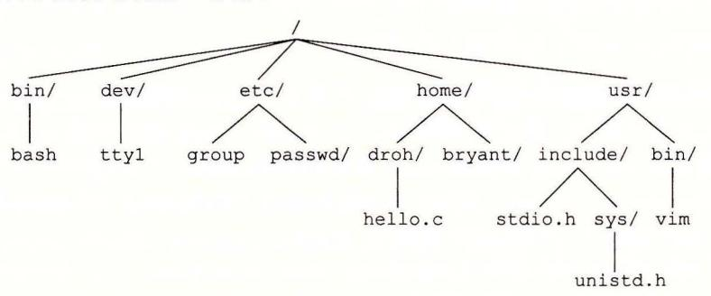

图 10-1 Linux 目录层次的一部分。尾部有斜杠表示是目录

作为其上下文的一部分,每个进程都有一个当前工作目录 (current working directory) 来确定其在目录层次结构中的 前位置 你可以用 cd 命令来修改 shell 中的当前工作 目录。

目录层次结构中的位 用路径名 (pathname) 来指定 路径名是一个字符串,包括 可选斜杠,其后紧跟一系列的文件名,文件名之间用斜杠分隔 路径名有两种形式:

- ·绝对路径名 (absolut thname) 以一个斜杠开始,表示从根节点开始的路径 如,在图 10-1 中, hello.c 的绝对路径名为 home droh hello.c
- ·相对路径名 (relative pathname) 以文件名开始,表示从当前工作目录开始的路径 例如,在图 10-1 中,如果 home droh 是当前工作目录,那么 hello.c 的相对路径 名就是./hello.c 反之,如果/home/bryant 是当前工作目录,那么相对路径名 就是../home/droh/hell .c

## 10. 3 打开和关闭文件

进程是通过调用 open 函数来打开一个已存在的文件或者创建一个新文件的:

```
#include <sys/types.h> 
#include <sys/stat.h> 
#include <fcntl .h>
```

int open(char \*filename, int flags, mode\_t mode);

返回:若成功则为新文件描述符,若出错为

open 函数将 filename 转换为一个文件描述符,并且返回描述符数字。返回的描述符总 是在进程中当前没有打开的最小描述符。 flags 参数指明了进程打算如何访问这个文件:

- O\_RDONLY: 只读
- O\_WRONLY: 只写。
- O\_RDWR: 可读可 写。

例如,下面的代码说明如何以读的方式打开 个已存在的文件:

fd = Open("foo.txt", O\_RDONLY, O);

flags 参数也可以是 个或者更多位掩码的或,为写提供给一些额外的指示:

- O\_CREAT: 如果文件不存 ,就创建它的一个截断的 (truncated) (空)文件
- O\_TRUNC: 如果文件巳经 在,就截断它
- O\_APPEND: 在每次 操作前,设置文件位置到文件的结尾处

例如,下面的代码说明的是如何打开一个已存在文件,并在后面添加一些数据:

f d = Open (11 f oo . txt 11, \_邓ONLYIO\_APPEND, 0);

mode 参数指定了新文件的访问权限位 这些位的符号名字如图 10-2 所示。

作为上下文的一部分,每个进程都有一个 umask, 它是通过调用 umask 函数来设置 当进程通过带某个 mode 参数的 open 函数调用来创建一个新文件时,文件的访问权 限位被设置为 mode & ~ umask 例如,假设我们给定下面的 mode umask 默认值:

#define DEF\_MODE S\_IRUSRIS\_I SRIS\_IRGRPIS\_IWGRPIS\_IROTHIS\_IWOTH #define DEF\_UMASK S\_IWGRPIS\_IWOTH

接下来,下面的代码片段创建 个新文件,文件的拥有者有读写权限,而所有其他的

## 用户都有读权限:

```
umask(DEF_UMASK);
```

fd = Open("foo.txt", O\_CREATIO\_TRUNCIO\_WRONLY, DEF\_MODE);

| 掩码      | 描述                |  |
|---------|-------------------|--|
| S_IRUSR | 使用者(拥有者)能够读这个文件   |  |
| S_IWUSR | 使用者(拥有者)能够写这个文件   |  |
| S_IXUSR | 使用者(拥有者)能够执行这个文件  |  |
| S IRGRP | 拥有者所在组的成员能够读这个文件  |  |
| S IWGRP | 拥有者所在组的成员能够写这个文件  |  |
| S_IXGRP | 拥有者所在组的成员能够执行这个文件 |  |
| S_IROTH | 其他人(任何人)能够读这个文件   |  |
| S_IWOTH | 其他人(任何人)能够写这个文件   |  |
| S IXOTH | 其他人(任何人)能够执行这个文件  |  |

<sup>10</sup> 访问权限位。在 sys/s at.h 中定义

最后,进程通过调用 close 函数关闭一个打开的文件。

```
#include <unistd.h> 
int close(int fd); 
                                                   返回:若成功则为 o, 若出错则为-
```

关闭一个已关闭的描述符会出错。

## 练习题 o. 1 下面程序的输出是什么?

```
1 #include "csapp.h" 
2 
. 3 int main() 
4 { 
5 int fdl, fd2; 
6 
7 fdl = Open("foo.txt", O_RDONLY, O); 
8 Close(fdl); 
9fd2 = Open("baz.txt", O_RDONLY, 0); 
10 printf("fd2 = %d\n", fd2); 
11 exit(O); 
12 }
```

## 10. 4 读和写文件

应用程序是通过分别调用 read write 函数来执行输入和输出的。

```
#include <unistd.h> 
ssize_t read(int fd, void *buf, size_t n); 
                                 返回:若成功则为读的字节数,若 EOF 则为 o, 若出错为
ssize_t write(int fd, const void *buf, size_t n); 
                                          返回:若成功则为写的字节数,若出错则为
```

read 函数从描述符为 fd 的当前文件位置复制最多 个字节到内存位置 buf 。返回值- 表示一个错误,而返回值 表示 EOF 。否则,返回值表示的是实际传送的字节数量。

wr 函数从内存位置 buf 复制至多 个字节到描述符 fd 的当前文件位置。图 10-3 示了一个程序使用 read write 调用一次一个字节地从标准输入复制到标准输出。

```
codeliolcpstdin. c 
    #include "csapp . h" 
2 
3 int main(void) 
4 { 
5char c; 
6 
7 while(Read(STDIN_FILENO, &c, 1) != 0) 
8Write(STDOUT_FILENO, &c, 1); 
9exit(O); 
10 } 
                                                       code/io/cpstdin.c
```

0- 一次一个字节地从标准输入复制到标准输出

通过调用 lseek 函数,应用程序能够显示地修改当前文件的位置,这部分内容不在我 们的讲述范围之内。

# m ssize\_t size\_t 有些什么区别?

你可能已经注意到了, read 函数有一个 size\_t 的输入参数和一个 ssize\_t 的返 回值。那么这两种类型之间有什么区别呢?在 x86 <sup>64</sup> 系统中, size\_t 被定义为 unsigned long, ssize\_七(有符号的大小)被定义为 long read 函数返回一个有符号 的大小,而不是一个无符号大小,这是因为出错时它必须返回一 。有趣的是,返回一 个一 的可能性使得 read 的最大值减小了一半。

在某些情况下, read write 传送的字节比应用程序要求的要少。这些不足值 (short count) 不表示有错误。出现这样情况的原因有:

- ·读时遇到 EOF 。假设我们准备读一个文件,该文件从当前文件位置开始只含有 <sup>20</sup> 多个字节,而我们以 <sup>50</sup> 个字节的片进行读取。这样一来,下一个 read 返回的不足 值为 20, 此后的 read 将通过返回不足值 来发出 EOF 信号。
- ·从终端读文本行。如果打开文件是与终端相关联的(如键盘和显示器),那么每个 read 函数将一次传送一个文本行,返回的不足值等于文本行的大小。
- ·读和写网络套接宇 (socket) 。如果打开的文件对应千网络套接字 (11. 节),那么内 部缓冲约束和较长的网络延迟会引起 read write 返回不足值。对 Linux 管道 (pipe) 调用 read write 时,也有可能出现不足值,这种进程间通信机制不在我 们讨论的范圃之内。

实际上,除了 EOF, 当你在读磁盘文件时,将不会遇到不足值,而且在写磁盘文件时, 也不会遇到不足值。然而,如果你想创建健壮的(可靠的)诸如 Web 服务器这样的网络应用, 就必须通过反复调用 read write 处理不足值,直到所有需要的字节都传送完毕。

## 10. 5 RIO 包健壮地读写

在这一小节里,我们会讲述一个 1/0 包,称为 RIO(Robust 1/0, 健壮的 1/0) 包,它

会自动为你处理上文中所述的不足值。在像网络程序这样容易出现不足值的应用中, RIO 包提供了方便、健壮和高效的 I/0 RIO 提供了两类不同的函数:

- ·无缓冲的输入输出函数。这些函数直接在内存和文件之间传送数据,没有应用级缓 冲。它们对将二进制数据读写到网络和从网络读写二进制数据尤其有用。
- ·带缓冲的输入函数。这些函数允许你高效地从文件中读取文本行和二进制数据,这 些文件的内容缓存在应用级缓冲区内,类似千为 printf 这样的标准 I/0 函数提供 的缓冲区。与 110] 中讲述的带缓冲的 例程不同,带缓冲的 RIO 输入函数是线 程安全的 (12. 7. 节),它在同一个描述符上可以被交错地调用。例如,你可以从一 个描述符中读一些文本行,然后读取一些二进制数据,接着再多读取一些文本行。

我们讲述 RIO 例程有两个原因。第 ,在接下来的两章中,我们开发的网络应用中使用 了它们;第二,通过学习这些例程的代码,你将从总体上对 Unix 有更深入的了解。

## 10. 5. 1 RIO 的无缓冲的输入输出函数

通过调用 rio reacln rio\_writen 函数,应用程序可以在内存和文件之间直接传送数据。

```
#include "csapp.h" 
ssize_t rio_readn(int fd, void *usrbuf, size_t n); 
ssize_t rio_writen(int fd, void *usrbuf, size_t n); 
               返回:若成功则为传送的宇节数,若 EOF 则为 (只对 io readn 石言),若出错则为—
```

readn 函数从描述符 fd 的当前文件位置最多传送 个字节到内存位置 usrbuf 类似地, rio\_wr en 函数从位置 usrbuf 传送 个字节到描述符 fd rio\_read 函数在遇 EOF 时只能返回一个不足值。 rio\_writen 函数决不会返回不足值。对同一个描述符, 可以任意交错地调用 rio readn rio writen

10-4 显示了 rio readn rio writen 的代码 。注 意,如果 rio\_readn rio\_ wri~en 函数被一个从应用信号处理程序的返回中断,那么每个函数都会手动地重启 read write 。为了尽可能有较好的可移植性,我们允许被中断的系统调用,且在必要时重启它们。

#### 10. 5. 2 RIO 的带缓冲的输入函数

假设我们要编写一个程序来计算文本文件中文本行的数量,该如何来实现呢?一种方 法就是用 read 函数来一次一个字节地从文件传送到用户内存,检查每个字节来查找换行 符。这个方法的缺点是效率不是很高,每读取文件中的一个字节都要求陷入内核。

一种更好的方法是调用一个包装函数 Crio\_readlineb) ,它从一个内部读缓冲区复制一个 文本行,当缓冲区变空时,会自动地调用 read 重新填满缓冲区。对于既包含文本行也包含二 进制数据的文件(例如 11. 5. 节中描述的 HTIP 响应),我们也提供了一个 rio\_readn 带缓冲 区的版本,叫做 rio\_readnb ,它从和 rio readlineb 一样的读缓冲区中传送原始字节。

```
#include "csapp.h" 
void rio_readinitb(rio_t *rp, int fd); 
                                                                       返回:无。
ssize_t rio_readlineb(rio_t *rp, void *usrbuf, size_t maxlen); 
ssize_t rio_readnb(rio_t *rp, void *usrbuf, size_t n); 
                                 返回:若成功则为读的字节数,若 EOF 则为 o, 若出错则为一
```

```
code/src/csapp.c
1
     ssize_t rio_readn(int fd, void *usrbuf, size_t n)
2
3
         size_t nleft = n;
         ssize_t nread;
         char *bufp = usrbuf;
5
6
         while (nleft > 0) {
7
              if ((nread = read(fd, bufp, nleft)) < 0) {
8
                  if (errno == EINTR) /* Interrupted by sig handler return */
9
                      nread = 0:
                                       /* and call read() again */
10
                  else
11
                      return -1;
                                       /* errno set by read() */
12
13
              else if (nread == 0)
14
                                        /* EOF */
                  break;
15
16
              nleft -= nread;
17
              bufp += nread;
18
                                       /* Return >= 0 */
         return (n - nleft);
19
     }
20
                                                                            code/src/csapp.c
                                                                           - code/src/csapp.c
1
     ssize_t rio_writen(int fd, void *usrbuf, size_t n)
     {
2
         size_t nleft = n;
3
         ssize_t nwritten;
4
         char *bufp = usrbuf;
5
6
         while (nleft > 0) {
7
              if ((nwritten = write(fd, bufp, nleft)) <= 0) {
8
                  if (errno == EINTR) /* Interrupted by sig handler return */
9
                      nwritten = 0;
                                        /* and call write() again */
10
11
                  else
                      return -1;
                                       /* errno set by write() */
12
13
             nleft -= nwritten;
14
15
              bufp += nwritten;
16
         }
         return n;
17
18
     }

    code/src/csapp.c
```

图 10-4 rio readn 和 rio writen 函数

每打开一个描述符,都会调用一次 rio\_readinitb 函数。它将描述符 fd 和地址 rp 处的一个类型为 rio t 的读缓冲区联系起来。

rio\_readlineb 函数从文件 rp 读出下一个文本行(包括结尾的换行符),将它复制到内存位置 usrbuf,并且用 NULL(零)字符来结束这个文本行。rio\_readlineb 函数最多读 maxlen-1个字节,余下的一个字符留给结尾的 NULL 字符。超过 maxlen-1字节的文

本行被截断,并用一个 NULL 字符结束。

rio\_readnb 函数从文件 rp 最多读n个字节到内存位置 usrbuf。对同一描述符,对rio\_readlineb 和 rio\_readnb 的调用可以任意交叉进行。然而,对这些带缓冲的函数的调用却不应和无缓冲的 rio readn 函数交叉使用。

在本书剩下的部分中将给出大量的 RIO 函数的示例。图 10-5 展示了如何使用 RIO 函数来一次一行地从标准输入复制一个文本文件到标准输出。

```
    code/io/cpfile.c

     #include "csapp.h"
     int main(int argc, char **argv)
         int n:
5
         rio_t rio;
         char buf[MAXLINE]:
7
8
         Rio readinitb(&rio, STDIN FILENO);
         while((n = Rio readlineb(&rio, buf, MAXLINE)) != 0)
10
             Rio writen(STDOUT_FILENO, buf, n);
11
    }
12
                                                                         - code/io/cpfile.c
```

图 10-5 从标准输入复制一个文本文件到标准输出

图 10-6 展示了一个读缓冲区的格式,以及初始化它的 rio\_readinitb 函数的代码。rio\_readinitb 函数创建了一个空的读缓冲区,并且将一个打开的文件描述符和这个缓冲区联系起来。

```
code/include/csapp.h
    #define RIO_BUFSIZE 8192
  • typedef struct {
        int rio_fd;
                                    /* Descriptor for this internal buf */
3
        int rio cnt:
                                    /* Unread bytes in internal buf */
        char *rio_bufptr;
                                   /* Next unread byte in internal buf */
5
        char rio_buf[RIO_BUFSIZE]; /* Internal buffer */
    } rio_t:
                                                                   - code/include/csapp.h
                                                                       - code/src/csapp.c
    void rio_readinitb(rio_t *rp, int fd)
2
    {
        rp->rio_fd = fd;
3
        rp->rio_cnt = 0;
4
        rp->rio_bufptr = rp->rio_buf;
5
    7
                                                                        code/src/csapp.c
```

图 10-6 一个类型为 rio t的读缓冲区和初始化它的 rio readinitb 函数

RIO 读程序的核心是图 10-7 所示的 rio\_read 函数。rio\_read 函数是 Linux read 函数的带缓冲的版本。当调用 rio read 要求读 n 个字节时,读缓冲区内有 rp->rio cnt

个未读字节。如果缓冲区为空,那么会通过调用 read 再填满它。这个 read 调用收到一个不足值并不是错误,只不过读缓冲区是填充了一部分。一旦缓冲区非空,rio\_read 就从读缓冲区复制 n 和 rp->rio cnt 中较小值个字节到用户缓冲区,并返回复制的字节数。

```
static ssize_t rio_read(rio_t *rp, char *usrbuf, size_t n)
2
     {
         int cnt;
3
4
         while (rp->rio_cnt <= 0) { /* Refill if buf is empty */
 5
6
             rp->rio_cnt = read(rp->rio_fd, rp->rio_buf,
                                  sizeof(rp->rio_buf));
7
             if (rp->rio_cnt < 0) {
                  if (errno != EINTR) /* Interrupted by sig handler return */
9
10
                      return -1:
11
             else if (rp->rio_cnt == 0) /* EOF */
12
                  return 0;
13
             else
14
                  rp->rio_bufptr = rp->rio_buf; /* Reset buffer ptr */
15
         7
16
17
         /* Copy min(n, rp->rio_cnt) bytes from internal buf to user buf */
18
         cnt = n;
19
         if (rp->rio_cnt < n)
20
21
             cnt = rp->rio_cnt;
         memcpy(usrbuf, rp->rio_bufptr, cnt);
22
         rp->rio_bufptr += cnt;
23
         rp->rio_cnt -= cnt;
24
         return cnt;
25
26
     }

    code/src/csapp.c
```

图 10-7 内部的 rio read 函数

对于一个应用程序,rio\_read 函数和 Linux read 函数有同样的语义。在出错时,它返回值—1,并且适当地设置 errno。在 EOF 时,它返回值 0。如果要求的字节数超过了读缓冲区内未读的字节的数量,它会返回一个不足值。两个函数的相似性使得很容易通过用 rio\_read 代替 read 来创建不同类型的带缓冲的读函数。例如,用 rio\_read 代替 read,图 10-8 中的 rio\_readnb 函数和 rio\_readn 有相同的结构。相似地,图 10-8 中的 rio\_readlineb 程序最多调用 maxlen-1 次 rio\_read。每次调用都从读缓冲区返回一个字节,然后检查这个字节是否是结尾的换行符。

#### 旁注 RIO 包的起源

RIO 函数的灵感来自于 W. Richard Stevens 在他的经典网络编程作品[110]中描述的 readline、readn 和 writen 函数。rio\_readn 和 rio\_writen 函数与 Stevens 的 readn 和 writen 函数是一样的。然而,Stevens 的 readline 函数有一些局限性在 RIO中得到了纠正。第一,因为 readline 是带缓冲的,而 readn 不带,所以这两个函数不能在同一描述符上一起使用。第二,因为它使用一个 static 缓冲区,Stevens 的 readline。

函数不是线程安全的,这就要求 Stevens 引入一个不同的线程安全的版本,称为 read-line\_r。我们已经在 rio\_readlineb 和 rio\_readnb 函数中修改了这两个缺陷,使得这两个函数是相互兼容和线程安全的。

```
- code/src/csapp.c
     ssize t rio readlineb(rio t *rp, void *usrbuf, size_t maxlen)
1
2
          int n, rc;
 3
         char c, *bufp = usrbuf;
 1
5
         for (n = 1; n < maxlen; n++) {
 6
7
              if ((rc = rio_read(rp, &c, 1)) == 1) {
                  *bufp++ = c;
8
                  if (c == '\n') {
10
                      n++:
11
                      break:
                  }
12
              } else if (rc == 0) {
13
                  if (n == 1)
14
                      return 0; /* EOF, no data read */
15
                  else
16
                      break:
                                /* EOF, some data was read */
17
              } else
18
19
                  return -1;
                               /* Error */
20
         *bufp = 0;
21
22
         return n-1;
     }
23
                                                            — code/src/csapp.c
     ssize_t rio_readnb(rio_t *rp, void *usrbuf, size_t n)
1
2
     {
3
         size_t nleft = n;
         ssize_t nread;
4
         char *bufp = usrbuf;
5
6
         while (nleft > 0) {
              if ((nread = rio_read(rp, bufp, nleft)) < 0)</pre>
                  return -1;
                                        /* errno set by read() */
              else if (nread == 0)
10
                                        /* EOF */
                  break;
11
             nleft -= nread;
12
13
             bufp += nread;
14
         }
         return (n - nleft);
                                        /* Return >= 0 */
15
     }
16
                                                              code/src/csapp.c
```

## 10. 6 读取文件元数据

应用程序能够通过调用 stat fstat 函数,检索到关千文件的信息(有时也称为文 件的元数据 (metadata) )。

```
#include <unistd.h> 
#include <sys/stat.h> 
int stat(const char *filename, struct stat *buf); 
int fstat(int fd, struct stat *buf); 
                                                     返回:若成功则为 o, 若出错则为—
```

stat 函数以一个文件名作为输入,并填写如图 10-9 所示的一个 stat 数据结构中的 各个成员。 fsta 七函数是相似的,只不过是以文件描述符而不是文件名作为输入。当我们 11. 节中讨论 Web 服务器时,会需要 stat 数据结构中的 st\_mode st\_size 成员, 其他成员则不在我们的讨论之列。

```
statbuf h (included by sys/stat.h) 
I* Metadata returned by the stat and fstat functions *I 
struct stat { 
}; 
    dev_t 
    ino_t 
    mode_t 
    nlink_t 
    uid_t 
    gid_t 
    dev_t 
    off_t 
                  st_dev; 
                  st_ino; 
                  st_mode; 
                  st_nlink; 
                  st_uid; 
                  st_gid; 
                  st_rdev; 
                  st_size; 
                                I* Device *I 
                                I* inode *I 
                                I* Protection and file type *I 
                                I* Number of hard links*/ 
                                I* User ID of owner *I 
                                /* Group ID of owner*/ 
                                /* Device type {if inode device)*/ 
                                I* Total size, in bytes *I 
    unsigned long st_blksize; /* Block size for filesystem I/O */ 
    unsigned long st_blocks; I* Number of blocks allocated *I 
    time_t st_atime; /* Time of last access*/ 
    time_t st_mtime; /* Time of last modification*/ 
    time_t st_ctime; I* Time of last change *I 
                                                  statbufh (included by syslstat.h)
```

<sup>10</sup> stat 数据结构

st\_size 成员包含了文件的字节数大小。 st\_mode 成员则编码了文件访问许可位(图 10-2) 和文件类型 (10. 节)。 Linux sys/stat.h 中定义了宏谓词来确定 st\_mode 成员 的文件类型:

- S\_ISREG(m) 。这是一个普通文件吗?
- S\_ISDIR(m) 。这是一个目录文件吗?
- S\_ISSOCK(m) 。这是一个网络套接字吗?

10-10 展示了我们会如何使用这些宏和 stat 函数来读取和解释一个文件的 st mode 位。

```
code/io/statcheck.c
     #include "csapp.h"
 1
 2
     int main (int argc, char **argv)
 3
 5
          struct stat stat;
          char *type, *readok;
 7
          Stat(argv[1], &stat);
 8
          if (S_ISREG(stat.st_mode))
                                           /* Determine file type */
              type = "regular";
10
          else if (S_ISDIR(stat.st_mode))
11
              type = "directory";
12
          else
13
              type = "other";
14
          if ((stat.st_mode & S_IRUSR)) /* Check read access */
15
              readok = "yes";
16
17
         else
             readok = "no";
18
19
         printf("type: %s, read: %s\n", type, readok);
20
         exit(0);
21
     }
22

    code/io/statcheck.c
```

图 10-10 查询和处理一个文件的 st mode 位

## 10.7 读取目录内容

应用程序可以用 readdir 系列函数来读取目录的内容。

```
#include <sys/types.h>
#include <dirent.h>
DIR *opendir(const char *name);

返回: 若成功,則为处理的指针;若出错,则为 NULL。
```

函数 opendir 以路径名为参数,返回指向目录流(directory stream)的指针。流是对条目有序列表的抽象,在这里是指目录项的列表。

```
#include <dirent.h>
struct dirent *readdir(DIR *dirp);
返回: 若成功,则为指向下一个目录项的指针;若没有更多的目录项或出错,则为 NULL。
```

每次对 readdir 的调用返回的都是指向流 dirp 中下一个目录项的指针,或者,如果没有更多目录项则返回 NULL。每个目录项都是一个结构,其形式如下:

```
struct dirent {
   ino_t d_ino;     /* inode number */
   char d_name[256]; /* Filename */
};
```

虽然有些 Linux 版本包含了其他的结构成员,但是只有这两个对所有系统来说都是标

准的。成员 d\_name 是文件名, d\_ino 是文件位置。

如果出错,则 readdir 返回 NULL, 并设置 errno 可惜的是,唯一能区分错误和 流结束情况的方法是检查自调用 readdir 以来 errno 是否被修改过。

```
#include <dirent.h> 
int closedir(DIR *dirp); 
                                                        返回:成功为 错误为一
```

函数 closedir 关闭流并释放其所有的资源 10-11 展示了怎样用 readdir 来读取 目录的内容

```
code/iolreaddir. c 
1 #include "csapp . h" 
2 
3int main(int argc, char **argv) 
4 { 
5DIR *Streamp; 
6struct dirent *dep; 
7 
8streamp = Opendir(argv [1)); 
9 
10 errno = 0; 
11 while ((dep = readdir (streamp)) ! = NULL) { 
12printf("Fou file: %s\n", dep->d_name); 
13 } 
14 if (errno ! = 0) 
15 unix_error("readdir error"); 
16 
17Closedir(streamp); 
18exit(O); 
19 } 
                                                    code/io/readdir. c
```

<sup>11</sup> 读取目录的内容

## 10. 8 共享文件

可以用许多不同的方式来共享 Linux 文件。除非你很清楚内核是如何表示打开的文 件,否则文件共享的概念相当难懂。内核用三个相关的数据结构来表示打开的文件:

- ·描述符表 (descriptor table) 。每个进程都有它独立的描述符表,它的表项是由进程 打开的文件描述符来索引的 每个打开的描述符表项指向文件表中的一个表项。
- ·文件表 (file table) 。打开文件的集合是由一张文件表来表示的,所有的进程共享这 张表。每个文件表的表项组成(针对我们的目的)包括当前的文件位置、引用计数 (reference count) (即当前指向该表项的描述符表项数),以及一个指向 v-node 表中 对应表项的指针 关闭一个描述符会减少相应的文件表表项中的引用计数。内核不 会删除这个文件表表项,直到它的引用计数为零。

● v-node 表(v-node table)。同文件表一样,所有的进程共享这张 v-node 表。每个表项包含 stat 结构中的大多数信息,包括 st mode 和 st size 成员。

图 10-12 展示了一个示例,其中描述符 1 和 4 通过不同的打开文件表表项来引用两个不同的文件。这是一种典型的情况,没有共享文件,并且每个描述符对应一个不同的文件。

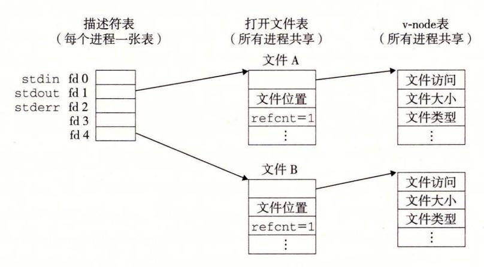

图 10-12 典型的打开文件的内核数据结构。在这个示例中, 两个描述符引用不同的文件。没有共享

如图 10-13 所示,多个描述符也可以通过不同的文件表表项来引用同一个文件。例如,如果以同一个 filename 调用 open 函数两次,就会发生这种情况。关键思想是每个描述符都有它自己的文件位置,所以对不同描述符的读操作可以从文件的不同位置获取数据。

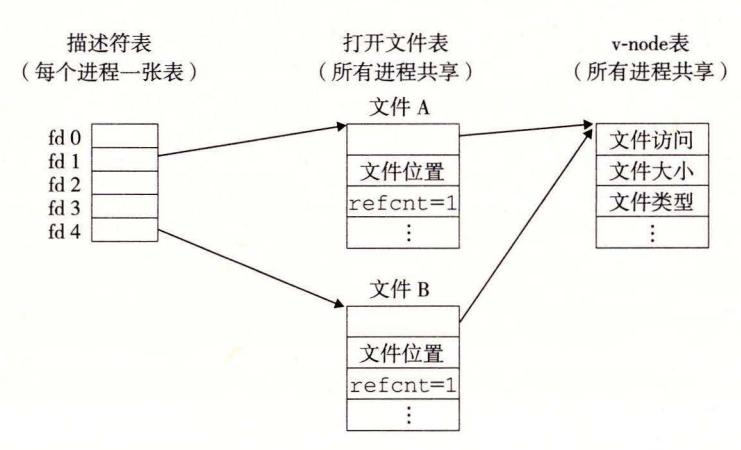

图 10-13 文件共享。这个例子展示了两个描述符通过两个 打开文件表表项共享同一个磁盘文件

我们也能理解父子进程是如何共享文件的。假设在调用 fork 之前,父进程有如图 10-12 所示的打开文件。然后,图 10-14 展示了调用 fork 后的情况。子进程有一个父进程描述符表的副本。父子进程共享相同的打开文件表集合,因此共享相同的文件位置。一个很重要的结果就是,在内核删除相应文件表表项之前,父子进程必须都关闭了它们的描述符。

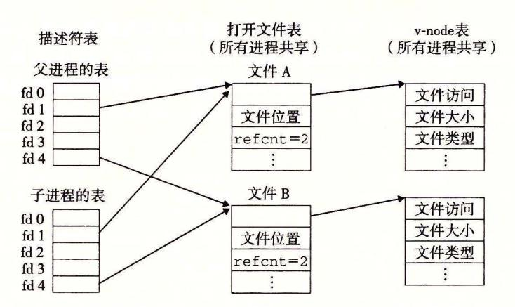

图 10-14 子进程如何继承父进程的打开文件。初始状态如图 10-12 所示

```
1
     #include "csapp.h"
2
     int main()
3
     {
4
         int fd1, fd2;
5
         char c;
6
7
         fd1 = Open("foobar.txt", O_RDONLY, 0);
8
         fd2 = Open("foobar.txt", O_RDONLY, 0);
9
10
         Read(fd1, &c, 1);
11
         Read(fd2, &c, 1);
         printf("c = %c\n", c);
12
         exit(0);
13
     }
14
```

禁习题 10.3 就像前面那样,假设磁盘文件 foobar.txt 由 6 个 ASCII 码字符 "foobar" 组成。那么下列程序的输出是什么?

```
#include "csapp.h"
 1
 2
     int main()
 3
     1
 4
          int fd;
 5
          char c;
 6
 7
          fd = Open("foobar.txt", O_RDONLY, 0);
 8
9
          if (Fork() == 0) {
10
              Read(fd, &c, 1);
              exit(0);
11
12
          Wait(NULL);
13
          Read(fd, &c, 1);
15
         printf("c = %c\n", c);
          exit(0);
16
17
     }
```

#### 10.9 I/O 重定向

Linux shell 提供了 I/O 重定向操作符,允许用户将磁盘文件和标准输入输出联系起来。例如,键入

linux > 1s > foo.txt

使得 shell 加载和执行 1s 程序,将标准输出重定向到磁盘文件 foo.txt。就如我们将在11.5 节中看到的那样,当一个 Web 服务器代表客户端运行 CGI 程序时,它就执行一种相似类型的重定向。那么 I/O 重定向是如何工作的呢?一种方式是使用 dup2 函数。

#include <unistd.h>

int dup2(int oldfd, int newfd);

返回, 若成功则为非负的描述符, 若出错则为一1。

dup2 函数复制描述符表表项 oldfd 到描述符表表项 newfd, 覆盖描述符表表项 newfd 以前的内容。如果 newfd 已经打开了, dup2 会在复制 oldfd 之前关闭 newfd。

假设在调用 dup2(4,1)之前,我们的状态如图 10-12 所示,其中描述符 1(标准输出)对应于文件 A(比如一个终端),描述符 4 对应于文件 B(比如一个磁盘文件)。A 和 B 的引用计数都等于 1。图 10-15 显示了调用 dup2(4,1)之后的情况。两个描述符现在都指向文件 B; 文件 A 已经被关闭了,并且它的文件表和 v-node 表表项也已经被删除了; 文件 B 的引用计数已经增加了。从此以后,任何写到标准输出的数据都被重定向到文件 B。

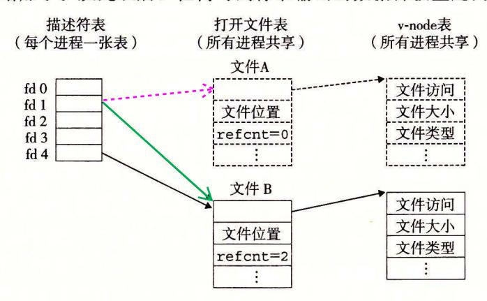

图 10-15 通过调用 dup2(4,1)重定向标准输出之后的内核数据结构。初始状态如图 10-12 所示

#### 旁注 左边和右边的 hoinkies

为了避免和其他括号类型操作符比如 "]"和 "["相混淆, 我们总是将 shell 的 ">"操作符称为 "右 hoinky", 而将 "<"操作符称为 "左 hoinky"。

※ 练习题 10.4 如何用 dup2 将标准输入重定向到描述符 5?

○ 练习题 10.5 假设磁盘文件 foobar.txt 由 6 个 ASCII 码字符 "foobar" 组成,那么下列程序的输出是什么?

#include "csapp.h"

2

3 int main()

```
1
4
         int fd1. fd2:
5
6
         char c:
8
         fd1 = Open("foobar.txt", O_RDONLY, 0);
         fd2 = Open("foobar.txt", O_RDONLY, 0);
9
         Read(fd2, &c, 1);
10
         Dup2(fd2, fd1);
11
         Read(fd1, &c, 1);
12
         printf("c = %c\n", c);
13
14
         exit(0):
    7
15
```

#### 10.10 标准 I/O

C语言定义了一组高级输入输出函数,称为标准 I/O 库,为程序员提供了  $Unix\ I/O$  的较高级别的替代。这个库(libc)提供了打开和关闭文件的函数(fopen 和 fclose)、读和写字节的函数(fread 和 fwrite)、读和写字符串的函数(fgets 和 fputs),以及复杂的格式化的 I/O 函数(scanf 和 printf)。

标准 I/O 库将一个打开的文件模型化为一个流。对于程序员而言,一个流就是一个指向 FILE 类型的结构的指针。每个 ANSI C 程序开始时都有三个打开的流 stdin、stdout 和 stderr,分别对应于标准输入、标准输出和标准错误:

```
#include <stdio.h>\nextern FILE *stdin; /* Standard input (descriptor 0) */\nextern FILE *stdout; /* Standard output (descriptor 1) */\nextern FILE *stderr; /* Standard error (descriptor 2) */
```

类型为 FILE 的流是对文件描述符和流缓冲区的抽象。 流缓冲区的目的和 RIO 读缓冲区的一样:就是使开销较高的 Linux I/O 系统调用的数量尽可能得小。 例如,假设我们有一个程序,它反复调用标准 I/O 的 getc 函数,每次调用返回文件的下一个字符。当第一次调用 getc 时,库通过调用一次 read 函数来填充流缓冲区,然后将缓冲区中的第一个字节返回给应用程序。只要缓冲区中还有未读的字节,接下来对 getc 的调用就能直接从流缓冲区得到服务。

## 10.11 综合: 我该使用哪些 I/O 函数?

图 10-16 总结了我们在这一章里讨论过的各种 I/O 包。

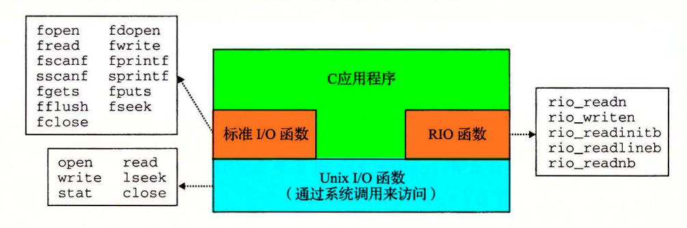

图 10-16 Unix I/O、标准 I/O 和 RIO 之间的关系

U nix 模型是在操作系统内核中实现的 应用程序可以通过诸如 open close lseek read write stat 这样的函数来访问 Unix I/0 较高级别的 RIO 和标准 函数都是基于(使用) Unix I/0 函数来实现的 RIO 函数是专为本书开发的 read wr te 的健壮的包装函数 它们自动处理不足值,并且为读文本行提供一种高效的带缓冲的方 标准 I/0 函数提供了 Unix I/0 函数的一个更加完整的带缓冲的替代品,包括格式化 例程,如 printf scanf

那么,在你的程序中该使用这些函数中的哪 个呢 下面是一些基本的指导原则

- Gl 只要有可能就使用标准 对磁盘和终端设备 来说,标准 函数是首 选方法 大多数 程序员在其整个职业生涯中只使用标准 I/0, 从不受较低级的 Unix I/0 函数的困扰(可能 stat 除外,因为在标准 库中没有与它对应的函 数)。只要可能,我们建议你也这样做
- G2: 不要使用 scanf rio\_readlineb 来读 进制文件 scanf rio readneb 这样的函数是专门设计来读取文本文件的 学生通常会犯的一个错误就是用 这些函数来读取 进制文件,这就使得他们的程序出现了诡异莫测的失败。比如, 二进制文件可能散布着很多 Oxa 字节,而这些字节又与终止文本行无关
- G3 对网络套接字的 I/0 使用 RIO 函数 不幸的是,当我们试着将标准 用千 网络的输入输出时,出现了 些令人讨厌的问题 如同我们将在 11. 节所见, Linux 对网络的抽象是 种称为套接字的文件类型 就像所有的 inu 文件一样, 套接字由文件描述符来引用,在这种情况下称为套接字描述符 应用程序进程通过 读写套接字描述符来与运行在其他计算机的进程实现通信

标准 流,从某种意义上而言是全双 的,因为程序能够在同一个流上执行输入和 输出 然而,对流的限制和对套接字的限制,有时候会互相冲突,而又极少有文档描述这 些现象

- 限制 :跟在输出函数之后的输入函数 如果中间没有插入对 fflush fseek . fsetpos 或者 rewind 的调用, 个输入函数不能跟随在 个输出函数之后。 fflush 函数清空与流相关的缓冲区 个函数使用 Unix I/0 lseek 函数来重置 当前的文件位置
- 限制 :跟在输入函数之后的输出函数 如果中间没有插入对 fseek fsetpos rewind 的调用,一个输出函数不能跟随在 个输入函数之后,除非该输入函数 遇到了一个文件结束

这些限制给网络应用带来了 个问题,因为对套接字使用 lseek 函数是非法的 对流 的第一个限制能够通过采用在每个输入操作前刷新缓冲区这样的规则来满足。然而, 要满足第二个限制的唯一办法是,对同一个打开的套接字描述符打开两个流,一个用来 读,一个用来写:

FILE \*fpin , \*fpout ;

```
fpin = fdopen(sockfd , "r" ); 
fpout = fdopen (sockfd , "w");
```

但是这种方法也有问题,因为它要求应用程序在两个流上都要调用 fclose, 这样才 能释放与每个流相关联的内存资源,避免内存泄漏

```
fc lose(fp in); 
fclose (fpout);
```

这些操作中的每一个都试图关闭同一个底层的套接字描述符,所以第二个 close 操作 就会失败。对顺序的程序来说,这并不是问题,但是在一个线程化的程序中关闭一个已经 关闭了的描述符是会导致灾难的(见 12. 7. 节)。

因此,我们建议你在网络套接字上不要使用标准 函数来进行输入和输出,而要使 用健壮的 RIO 函数。如果你需要格式化的输出,使用 sprin 函数在内存中格式化一个 字符串,然后用 rio\_writen 把它发送到套接口。如果你需要格式化输入,使用 rio readlineb 来读一个完整的文本行,然后用 sscanf 从文本行提取不同的字段。

## 10. 12 小结

Linux 提供了少星的基于 Unix 模型的系统级函数,它们允许应用程序打开、关闭、读和写文件, 提取文件的元数据,以及执行 l/0 重定向 Linux 的读和写操作会出现不足值,应用程序必须能正确地 预计和处理这种情况。应用程序不应直接调用 Unix l/0 函数,而应该使用 RIO 包, RIO 包通过反复执行 读写操作,直到传送完所有的请求数据,自动处理不足值。

Linux 内核使用 个相关的数据结构来表示打开的文件。描述符表中的表项指向打开文件 中的表 项,而打开文件表中的表项又指向 v-node 表中的表项。每个进程都有它自己单独的描述符表,而所有的 进程共享同一个打开文件表和 -node 表。理解 这些结构的 一般组成就能 使我们清楚地理解文件共享和 l/0重定向。

标准 l/0 库是基千 Unix 实现的,并提供了一组强大的高级 例程。对于大多数应用程序而 言,标准 I/0 更简单,是优千 Unix 的选择。然而,因为对标准 和网络文件的一些相互不兼容的 限制, Unix 比之标准 l/0 更该适用于网络应用程序

## 参考文献说明

Kerrisk 撰写了关于 Unix /0 Linux 文件系统的综述 [62] Stevens 编写了 Unix I/0 的标准参考 文献 [111 Kernighan Ritchie 对于标准 I/0 函数给出了清晰而完整的讨论[61].

## 家庭作业

• 10 6 下面程序的输出是什么?

```
#include "csapp .h" 
      int main() 
  5int fdl, fd2; 
         fdl = Open("foo.txt", O_RDONLY, 0); 
  8fd2 = Open("bar .txt", O_RDONLY, 0); 
         Close(fd2) ; 
10 fd2 = Open ("baz .txt", O_RDONLY, 0); 
11printf("fd2 = ¾d\n", fd2); 
12 exit(O); 
13 }
```

- 10. 7 修改图 10-5 中所示的 cpfile 程序,使得它用 RIO 函数从标准输人复制到标准输出,一次 MAX-BUF 个字节。
- •• 10. 8 编写图 10-10 中的 sta check 程序的 个版本,叫做 fstatcheck, 它从命令行上取得一个描述符 数字而不是文件名。
- •• 10 . 9 考虑下面对作业题 10. 中的 fstatcheck 程序的调用:

linwc> fstatcheck 3 < foo .txt

你可能会预想这个对 fstatcheck 的调用将提取和显示文件 foo .t xt 的元数据。然而,当我们在

系统上运行它时,它将失败,返回"坏的文件描述符"。根据这种情况,填写出 shell fork execve 调用之间必须执行的伪代码:

```
if (Fork() == 0) { I* child *I 
    I* What code is the shell executing right here? *I 
    Execve("fstatcheck", argv, envp);
```

•• 10. 10 修改图 10-5 中的 cpfile 程序,使得它有一个可选的命令行参数 infile 如果给定了 infile, 那么复制 infile 到标准输出,否则像以前那样复制标准输人到标准输出。 个要求是对于两种 情况,你的解答都必须使用原来的复制循环(第 9~11 行)。只允许你插入代码,而不允许更改任 何已经存在的代码。

## 练习题答案

- 10. 1 Unix 进程生命周期开始时,打开的描述符赋给了 stdin (描述符 0) stdout (描述符 1) stderr (描述符 2) open 函数总是返回最低的未打开的描述符,所以第一次调用 open 会返回描述符 调用 close 函数会释放描述符 最后对 open 的调用会返回描述符 3, 因此程序的输出是 "fd2=3"
- 10 2 描述符 fdl fd2 都有各自的打开文件表表项,所以每个描述符对千 fo bar.txt 都有它自己的 文件位 。因此,从 fd2 的读操作会读取 foobar.txt 的第一个字节,并输出

<sup>C</sup>= f

而不是像你开始可能想的

C = O

- 10. 3 回想 下,子进程会继承父进程的描述符表,以及所有进程共享的同一个打开文件表 因此,描 述符 fd 在父子进程中都指向同一个打开文件表表项 当子进程读取文件的第一个字节时,文件位 置加 。因此,父进程会读取第 个字节,而输出就是 C = 0
- 10. 4 重定向标准输入(描述符 0) 到描述符 5' 我们将调用 dup2(5,0) 或者等价的 dup2(5,STDIN\_FILE-NO)
- 10. 5 眼你可能会想输出应该是

C = f

但是因为我们将 fdl 重定向到了 fd2, 输出实际上是

C = 0

C H A P T E R 11

# 网络编程

网络应用随处可见。任何时候浏览 Web 、发送 email 信息或是玩在线游戏,你就正在 使用网络应用程序 。有 趣的是,所有的网络应用都是基千相同的基本编程模型,有着相似 的整体逻辑结构,并且依赖相同的编程接口

网络应用依赖千很多在系统研究中已经学习过的概念。例如,进程、信号、字节顺 序、内存映射以及动态内存分配,都扮演着重要的角色。还有一些新概念要掌握。我们需 要理解基本的客户端-服务器编程模型,以及如何编写使用因特网提供的服务的客户端 务器程序。最后,我们将把所有这些概念结合起来,开发 个虽小但功能齐全的 Web 务器,能够为真实的 Web 浏览器提供静态和动态的文本和图形内容。

## 11 . 1 客户端 服务器编程模型

每个网络应用都是基千客户端-服务器模型的。采用这个模型,一个应用是由一个服 务器进程和一个或者多个客户端进程组成 服务器管理某种资源,并且通过操作这种资源 来为它的客户端提供某种服务。例如,一个 Web 服务器管理着一组磁盘文件,它会代表 客户端进行检索和执行。 FTP 服务器管理着 组磁盘文件,它会为客户端进行存储 和检索。相似地,一个电子邮件服务器管理着一些文件,它为客户端进行读和更新。

客户端-服务器模型中的基本操作是事务 (transaction) (见图 11-1) 。一个客户端-服务 器事务由以下四步组成。

- 1) 当一个客户端需要服务时,它向服务器发送一个请求,发起一个事务 例如,当 Web 浏览器需要一个文件时,它就发送一个请求给 Web 服务器。
- 2) 服务器收到请求后,解释它,并以适当的方式操作它的资源。例如,当 Web 服务 器收到浏览器发出的请求后,它就读一个磁盘文件。
- 3) 服务器给客户端发送一个响应,并等待下一个请求。例如, Web 服务器将文件发 送回客户端。
- 4) 客户端收到响应并处理它。例如,当 Web 浏览器收到来自服务器的一页后,就在 屏幕上显示此页。


<sup>11</sup> 一个客户端-服务器事务

认识到客户端和服务器是进程,而不是常提到的机器或者主机,这是很重要的。一台 主机可以同时运行许多不同的客户端和服务器,而且一个客户端和服务器的事务可以在同 一台或是不同的主机上。无论客户端和服务器是怎样映射到主机上的,客户端-服务器模 型都是相同的。

#### 旁注 客户端-服务器事务与数据库事务

客户端-服务器事务不是数据库事务,没有数据库事务的任何特性,例如原子性。 在我们的上下文中,事务仅仅是客户端和服务器执行的一系列步骤。

#### 11.2 网络

客户端和服务器通常运行在不同的主机上,并且通过计算机网络的硬件和软件资源来通信。网络是很复杂的系统,在这里我们只想了解一点皮毛。我们的目标是从程序员的角度给你一个切实可行的思维模型。

<mark>对主机而言,网络只是又一种 I/O 设备,是数据源和数据接收方,</mark>如图 11-2 所示。

一个插到 I/O 总线扩展槽的适配器提供了到网络的物理接口。从网络上接收到的数据从适配器经过 I/O 和内存总线复制到内存,通常是通过 DMA 传送。相似地,数据也能从内存复制到网络。

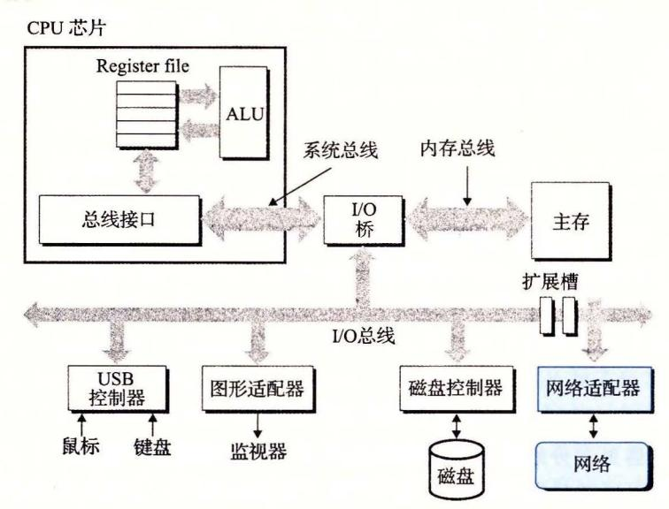

图 11-2 一个网络主机的硬件组成

物理上而言,网络是一个按照地理远近组成的层次系统。 最低层是 LAN(Local Area Network, 局域网), 在一个建筑或者校园范围内。迄今为止,最流行的局域网技术是以太网(Ethernet), 它是由施乐公司帕洛阿尔托研究中心(Xerox PARC)在 20 世纪 70 年代中期提出的。以太网技术被证明是适应力极强的,从 3Mb/s 演变到 10Gb/s。

一个以太网段(Ethernet segment)包括一些电缆(通常是双绞线)和一个叫做集线器的小盒子,如图 11-3 所示。以太网段通常跨越一些小的区域,例如某建筑物的一个房间或者一个楼层。每根电缆都有相同的最大位带宽,通常是 100Mb/s 或者 1Gb/s。一端连

接到主机的适配器,而另一端则连接到集线器的一个端口上。集线器不加分辨地将从一个端口上收到的每个位复制到其他所有的端口上。因此,每台主机都能看到每个位。

每个以太网适配器都有一个全球唯一的 48 位地址, 它存储在这个适配器的非易失性存储器上。一台主机可

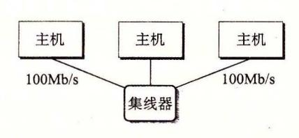

图 11-3 以太网段

以发送一段位(称为帧 (frame) )到这个网段内的其他任何主机 每个帧包括一些固定数量 的头部 (header) 位,用来标识此帧的源和目的地址以及此帧的长度,此后紧随的就是数据 位的有效栽荷 (payload) 。每个主机适配器都能看到这个帧,但是只有目的主机实际读 取它。

使用 些电缆和叫做网桥 (bridge) 的小盒子,多个以太网段可以连接成较大的局域网, 称为桥接以太网 (bridged Ethernet) ,如图 11-4 所示 桥接以太网能够跨越整个建筑物或 者校区。在一个桥接以太网里,一些电缆连接网桥与网桥,而另外一些连接网桥和集线 器。这些电缆的带宽可以是不同的 在我们的示例中,网桥与网桥之间的电缆有 lGb 带宽,而四根网桥和集线器之间电缆的带宽却是 lOOMb

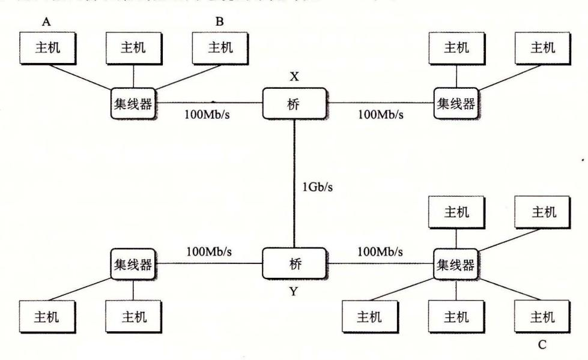

<sup>11</sup> 桥接以太网

网桥比集线器更充分地利用了电缆带宽。利用一种聪明的分配算法,它们随着时间自 动学习哪个主机可以通过哪个端口可达,然后只在有必要时,有选择地将帧从一个端口复 制到另一个端口。例如,如果主机 发送一个帧到同网段上的主机 B, 当该帧到达网桥 的输入端口时, 就将丢弃此帧,因而节省了其他网段上的带宽。然而,如果主机 发送 一个帧到一个不同网段上的主机 C, 那么网桥 只会把此帧复制到和网桥 相连的端口 上,网桥 会只把此帧复制到与主机 的网段连接的端口。

为了简化局域网的表示,我们将把集线器和网桥以及连接它们的电缆画成 根水平 线,如图 11-5 所示。

在层次的更高级别中,多个不兼容的局域网可以通过叫做路由器 (router) 的特殊计算 机连接起来,组成一个 internet (互联网络)。每台路由器对于它所连接到的每个网络都有 一个适配器(端口)。路由器也能连接高速点到点电话连接,这是称为 WAN (Wide-Area

Network, 广域网)的网络示例,之所以这么叫是因为它 们覆盖的地理范围比局域网的大。一般而言,路由器可以 用来由各种局域网和广域网构建互联网络。例如,图 11-6 展示了一个互联网络的示例, 台路由器连接了一对局域 网和一对广域网。 <sup>11</sup> 局域网的概念视图


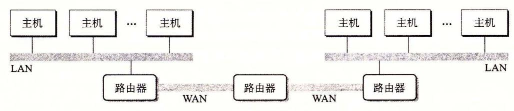

-6 个小型的互联网络。 台路由器连接起两个局域网和两个广域网

#### Internet internet

我们总是用小写字母的 internet 描述一般概念,而用大写字母的 Internet 来描述一 种具体的实现,也就是所谓的全球 IP 因特网

互联网络至关重要的特性是,它能由采用完全不同和不兼容技术的各种局域网和广域 网组成。每台主机和其他每台主机都是物理相连的,但是如何能够让某台源主机跨过所有 这些不兼容的网络发送数据位到另一台目的主机呢?

解决办法是一层运行在每台主机和路由器上的协议软件,它消除了不同网络之间的差 异。这个软件实现一种协议,这种协议控制主机和路由器如何协同工作来实现数据传输。 这种协议必须提供两种基本能力:

- ·命名机制。不同的局域网技术有不同和不兼容的方式来为主机分配地址。互联网络 协议通过定义一种 致的主机地址格式消除了这些差异。每台主机会被分配至少一 个这种互联网络地址 (internet address) ,这个地址唯一地标识了这台主机。
- ·传送机制。在电缆上编码位和将这些位封装成帧方面,不同的联网技术有不同的和 不兼容的方式。互联网络协议通过定义一种把数据位捆扎成不连续的片(称为包)的 统一方式,从而消除了这些差异。 个包是由包头和有效栽荷组成的,其中包头包 括包的大小以及源主机和目的主机的地址,有效载荷包括从源主机发出的数据位。

.图 11-7 展示了主机和路由器如何使用互联网络协议在不兼容的局域网间传送数据的 一个示例。这个互联网络示例由两个局域网通过一台路由器连接而成。一个客户端运行在 主机 上,主机 LAN1 相连,它发送 串数据字节到运行在主机 上的服务器端, 主机 则连接在 LAN2 这个过程有 个基本步骤:

- 1) 运行在主机 上的客户端进行一个系统调用,从客户端的虚拟地址空间复制数据 到内核缓冲区中。
- 2) 主机 上的协议软件通过在数据前附加互联网络包头和 LAN1 帧头,创建了 LAN1 的帧。互联网络包头寻址到互联网络主机 LAN1 帧头寻址到路由器。然后它传 送此帧到适配器 注意, LAN1 帧的有效载荷是一个互联网络包,而互联网络包的有效载 荷是实际的用户数据。这种封装是基本的网络互联方法之一。
  - 3) LAN1 适配器复制该帧到网络上。
- 4) 当此帧到达路由器时,路由器的 LAN1 适配器从电缆上读取它,并把它传送到协 议软件。
- 5) 路由器从互联网络包头中提取出目的互联网络地址,并用它作为路由表的索引, 确定向哪里转发这个包,在本例中是 LAN2 。路由器剥落旧的 LANl 的帧头,加上寻址到 主机 的新的 LAN2 帧头,并把得到的帧传送到适配器。
  - 6) 路由器的 LAN2 适配器复制该帧到网络上。

- 7) 当此帧到达主机 B 时,它的话配器从电缆上读到此帧,并将它传送到协议软件。
- 8) 最后,主机 B上的协议软件剥落包头和帧头。当服务器进行一个读取这些数据的系统调用时,协议软件最终将得到的数据复制到服务器的虚拟地址空间。

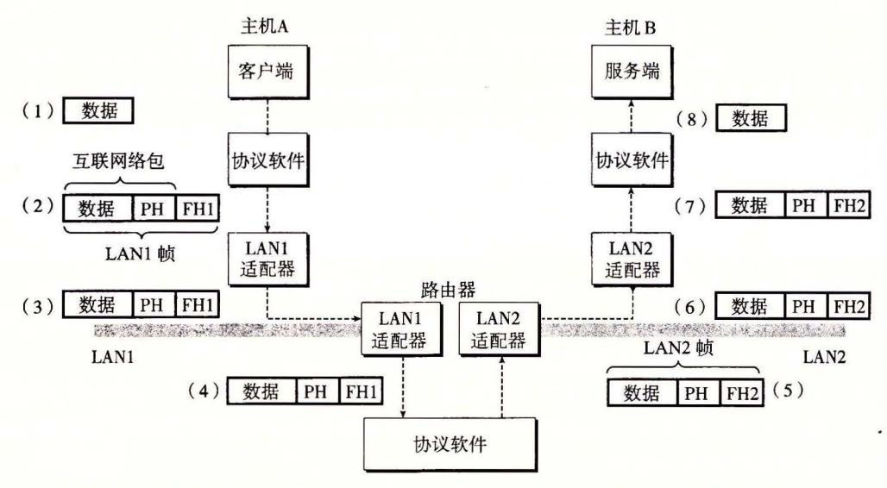

图 11-7 在互联网络上,数据是如何从一台主机传送到另一台主机的(PH:互联网络包头; FH1: LAN1的帧头: FH2: LAN2的帧头)

当然,在这里我们掩盖了许多很难的问题。如果不同的网络有不同帧大小的最大值,该怎么办呢?路由器如何知道该往哪里转发帧呢?当网络拓扑变化时,如何通知路由器?如果一个包丢失了又会如何呢?虽然如此,我们的示例抓住了互联网络思想的精髓,封装是关键。

#### 11.3 全球 IP 因特网

全球 IP 因特网是最著名和最成功的互联网络实现。从 1969 年起,它就以这样或那样的形式存在了。虽然因特网的内部体系结构复杂而且不断变化,但是自从 20 世纪 80 年代早期以来,客户端-服务器应用的组织就一直保持着相当的稳定。图 11-8 展示了一个因特网客户端-服务器应用程序的基本硬件和软件组织。

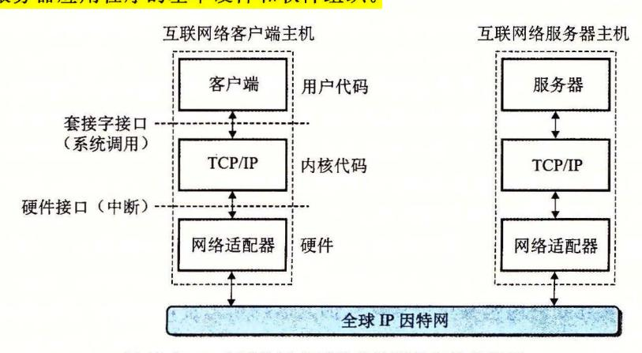

图 11-8 一个因特网应用程序的硬件和软件组织

每台因特网主机都运行实现 TCP/IP 协议(Transmission Control Protocol/Internet

Protocol, 传输控制协议/互联网络协议)的软件,几乎每个现代计算机系统都支持这个协 议。因特网的客户端和服务器混合使用套接宇接口函数和 Unix 1/0 函数来进行通信(我们 将在 11. 节中介绍套接字接口)。通常将套接字函数实现为系统调用,这些系统调用会陷 入内核,并调用各种内核模式的 TCP IP 函数。

TCP/IP 实际是一个协议族,其中每一个都提供不同的功能。例如, IP 协议提供基本 的命名方法和递送机制,这种递送机制能够从一台因特网主机往其他主机发送包,也叫做 数据报 (datagram) IP 机制从某种意义上而 是不可靠的,因为,如果数据报在网络中丢 失或者重复,它并不会试图恢复。 UDP(Unreliable Datagram Protocol, 不可靠数据报协 议)稍微扩展了 IP 协议,这样一来,包可以在进程间而不是在主机间传送。 TCP 个构 建在 IP 之上的复杂协议,提供了进程间可靠的全双工(双向的)连接。为了简化讨论,我 们将 TCP/IP 看做是一个单独的整体协议。我们将不讨论它的内部工作,只讨论 TCP IP 为应用程序提供的某些基本功能。我们将不讨论 UDP

从程序员的角度,我们可以把因特网看做一个世界范围的主机集合,满足以下特性:

- ·主机集合被映射为一组 <sup>32</sup> 位的 IP 地址。
- ·这组 IP 地址被映射为一组称为因特网域名 (Internet domain name) 的标识符。
- ·因特网主机上的进程能够通过连接 (connection) 和任何其他因特网主机上的进程通信。 接下来三节将更详细地讨论这些基本的因特网概念

## 豆日 1Pv4 1Pv6

最初的因特网协议,使用 <sup>32</sup> 位地址,称为因特网协议版本 (Internet Protocol Version 4, IPv4) <sup>1996</sup> 年,因特网工程任务组织 (Internet Engineering Task Force, IETF) 提出了一个新版本的 IP, 称为因特网协议版本 6(1Pv6) ,它使用的是 <sup>128</sup> 位地址, 意在替代 IPv4 但是直到 <sup>2015</sup> 年,大约 <sup>20</sup> 年后,因特网流量的绝大部分还是由 IPv4 网络承栽的 例如,只有 的访问 Google 服务的用户使用 IPv6 [ 42]

因为 IPv6 的使用率较低,本书不会讨论 IPv6 的细节,而只是集中注意力于 IPv4 背后的概念。当我们谈论因特网时,我们指的是基于 IPv4 的因特网 但是,本章后面 介绍的书写客户端和服务器的技术是基于现代接口的,与任何特殊的协议无关。

#### 11 . 3. 1 IP 地址

一个 IP 地址就是一个 <sup>32</sup> 位无符号整数。网络程序将 IP 地址存放在如图 11-9 所示的 IP 地址结构中。

```
I* IP address structure *I 
struct in_addr { 
                                                                   code/netp/netpfragments.c 
    uint32_t s_addr; I* Address in network byte order (big-endian) *I 
}; 
                                                                   code/netp/netpfragments.c
```

11-9 IP 地址结构

把一个标量地址存放在结构中,是套接字接口早期实现的不幸产物。为 IP 地址定义一 个标量类型应该更有意义,但是现在更改已经太迟了,因为已经有大量应用是基于此的。

因为因特网主机可以有不同的主机字节顺序, TCP IP 为任意整数数据项定义了统一的 网络字节顺序 (network byte order) (大端字节顺序),例如 IP 地址,它放在包头中跨过网络被 携带。在 IP 地址结构中存放的地址总是以(大端法)网络字节顺序存放的,即使主机字节顺序 (host byte order) 是小端法。 Unix 提供了下面这样的函数在网络和主机字节顺序间实现转换。

```
#include <arpa/inet.h> 
uint32_t htonl(uint32_t hostlong); 
uint16_t htons(uint16_t hostshort); 
uint32_t ntohl(uint32_t netlong); 
uint16_t ntohs(unit16_t netshort); 
                                                        返回:按照网络宇节顺序的值
                                                        返回 按照主机字节顺序的值
```

hotnl 函数将 <sup>32</sup> 位整数由主机字节顺序转换为网络字节顺序。 ohl 函数将 <sup>32</sup> 位整 数从网络字节顺序转换为主机字节。 htons ohs 函数为 <sup>16</sup> 位无符号整数执行相应的 转换。注意,没有对应的处理 <sup>64</sup> 位值的函数。 htonl

IP 地址通常是以 一种称为点分 十进制表示法来表 示的,这里 ,每个字节由它的十进 制值表示,并且用句点和其他字节间分开。例如, 128.2.194.242 就是地址 Ox8002c2f2 的点分十进制表示。在 Linux 系统上,你能够使用 HOSTNAME 命令来确定你自己主机 的点分十进制地址:

linux> hostname -i 128.2.210.175

应用程序使用 ine \_\_pton inet\_ntop 函数来实现 IP 地址和点分十进制串之间的转换。

```
#include <arpa/inet.h> 
int inet_pton(AF_INET, const char *src, void *dst); 
                        返回:若成功则为 ,若 src 为非法点分十进制地址则为 o, 若出钳则为一 1.
const char *inet_ntop(AF_INET, const void *src, cha工*dst,
                    socklen_t size); 
                             返回:若成功则指向点分十进制字符串的指针,若出错则为 NULL,
```

在这些函数名中, "n" 代表网络, "p" 代表表示。它们可以处理 <sup>32</sup> IPv4 地址 (AF\_IN-ET) (就像这里展示的那样),或者 <sup>128</sup> IPv6 地址 (AF\_INET6) (这部分我们不讲)。

inet pton 函数将一个点分十进制串 (src) 转换为一个二进制的网络字节顺序的 IP (dst) 。如果 src 没有指向一个合法的点分 十进制字符串,那么该函数就返回 。任何 其他错误会返回— 1, 并设置 errno 相似地, inet\_ntop 函数将一个二进制的网络字节 顺序的 IP 地址 (src) 转换为它所对应的点分十进制表示,并把得到的以 null 结尾的字符串 的最多 size 个字节复制到 dst

## 练习题 <sup>11</sup> 1 完成下表:

| 十六进制地址     | 点分十进制地址         |
|------------|-----------------|
| OxO        |                 |
| Oxffffffff |                 |
| Ox7f000001 |                 |
|            | 205.lBB.160.121 |
|            | 64.12.149.13    |
|            | 205.188.146.23  |

※ 练习题 11.2 编写程序 hex2dd.c,将它的十六进制参数转换为点分十进制串并打印出结果。例如

linux> ./hex2dd 0x8002c2f2 128.2.194.242

※ 练习题 11.3 编写程序 dd2hex.c,将它的点分十进制参数转换为十六进制数并打印出结果。例如

linux> ./dd2hex 128.2.194.242 0x8002c2f2

#### 11.3.2 因特网域名

因特网客户端和服务器互相通信时使用的是 IP 地址。然而,对于人们而言,大整数是很难记住的,所以因特网也定义了一组更加人性化的域名(domain name),以及一种将域名映射到 IP 地址的机制。域名是一串用句点分隔的单词(字母、数字和破折号),例如whaleshark.ics.cs.cmu.edu。

域名集合形成了一个层次结构,每个域名编码了它在这个层次中的位置。通过一个示例你将很容易理解这点。图 11-10 展示了域名层次结构的一部分。层次结构可以表示为一棵树。树的节点表示域名,反向到根的路径形成了域名。子树称为子域(subdomain)。层次结构中的第一层是一个未命名的根节点。下一层是一组一级域名 (first-level domain name),由非营利组织 ICANN(Internet Corporation for Assigned Names and Numbers,因特网分配名字数字协会)定义。常见的第一层域名包括 com、edu、gov、org 和 net。

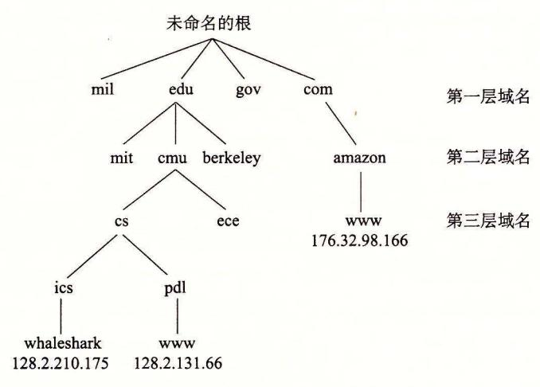

图 11-10 因特网域名层次结构的一部分

下一层是二级(second-level)域名,例如 cmu. edu,这些域名是由 ICANN 的各个授权代理按照先到先服务的基础分配的。一旦一个组织得到了一个二级域名,那么它就可以在这个子域中创建任何新的域名了,例如 cs.cmu.edu。

因特网定义了域名集合和 IP 地址集合之间的映射。直到 1988 年,这个映射都是通过一个叫做 HOSTS.TXT 的文本文件来手工维护的。从那以后,这个映射是通过分布世界范围内的数据库(称为 DNS(Domain Name System,域名系统))来维护的。从概念上而言,DNS 数据库由上百万的主机条目结构(host entry structure)组成,其中每条定义了一组域名和一组 IP 地址之间的映射。从数学意义上讲,可以认为每条主机条目就是一个域名和

IP 地址的等价类。我们可以用 Linux 的 NSLOOKUP 程序来探究 DNS 映射的一些属性, 这个程序能展示与某个 IP 地址对应的域名。<sup>⑤</sup>

每台因特网主机都有本地定义的域名 localhost,这个域名总是映射为回送地址 (loopback address)127.0.0.1:

linux> nslookup localhost

Address: 127.0.0.1

localhost 名字为引用运行在同一台机器上的客户端和服务器提供了一种便利和可移植的方式,这对调试相当有用。我们可以使用 HOSTNAME 来确定本地主机的实际域名:

linux> hostname

whaleshark.ics.cs.cmu.edu

在最简单的情况中,一个域名和一个 IP 地址之间是一一映射:

linux> nslookup whaleshark.ics.cs.cmu.edu

Address: 128.2.210.175

然而,在某些情况下,多个域名可以映射为同一个 IP 地址:

linux> nslookup cs.mit.edu

Address: 18.62.1.6

linux> nslookup eecs.mit.edu

Address: 18.62.1.6

在最通常的情况下,多个域名可以映射到同一组的多个 IP 地址:

linux> nslookup www.twitter.com

Address: 199.16.156.6 Address: 199.16.156.70 Address: 199.16.156.102 Address: 199.16.156.230

linux> nslookup twitter.com Address: 199.16.156.102 Address: 199.16.156.230 Address: 199.16.156.6

最后,我们注意到某些合法的域名没有映射到任何 IP 地址:

linux> nslookup edu

Address: 199.16.156.70

\*\*\* Can't find edu: No answer linux> nslookup ics.cs.cmu.edu

\*\*\* Can't find ics.cs.cmu.edu: No answer

#### 旁注 有多少因特网主机?

因特网软件协会(Internet Software Consortium, www. isc. org)自从 1987 年以后,每年进行两次因特网域名调查。这个调查通过计算已经分配给一个域名的 IP 地址的数量来估算因特网主机的数量,展示了一种令人吃惊的趋势。自从 1987 年以来,当时一共大约有 20 000 台因特网主机,主机的数量已经在指数性增长。到 2015 年,已经有大约1 000 000 000 600 台因特网主机了。

<sup>○</sup> 我们重新调整了 NSLOOKUP 的输出以提高可读性。

## 11 . 3. 3 因特网连接

因特网客户端和服务器通过在连接上发送和接收字节流来通信。从连接一对进程的意 义上而言,连接是点对点的。从数据可以同时双向流动的角度来说,它是全双工的。并且 从(除了一些如粗心的耕锄机操作员切断了电缆引起灾难性的失败以外)由源进程发出的字 节流最终被目的进程以它发出的顺序收到它的角度来说,它也是可靠的。

一个套接宇是连接的一个端点。每个套接字都有相应的套接字地址,是由一个因特网 地址和一个 <sup>16</sup> 位的整数端口 组成的,用"地址:端口"来表示。

当客户端发起一个连接请求时,客户端套接字地址中的端口是由内核自动分配的,称 为临时端口 (ephemeral port) 。然而,服务器套接字地址中的端口通常是某个知名端口, 是和这个服务相对应的。例如, Web 服务器通常使用端口 80, 而电子邮件服务器使用端 <sup>25</sup> 。每个具有知名端口的服务都有一个对应的知名的服务名。例如, Web 服务的知名 名字是 http, email 的知名名字是 srntp 。文件/etc/services 包含一张这台机器提供的 知名名字和知名端口之间的映射。

一个连接是由它两端的套接字地址唯一确定的。这对套接字地址叫做套接字对 (socket pair) ,由下列元组来表示:

(cliaddr: cliport, servaddr: servport)

其中 cliaddr 是客户端的 IP 地址, cliport 是客户端的端口, servaddr 是服务器的 IP 地址,而 servport 是服务器的端口。例如,图 <sup>11</sup> <sup>11</sup> 展示了一个 Web 客户端和 Web 服务器之间的连接。

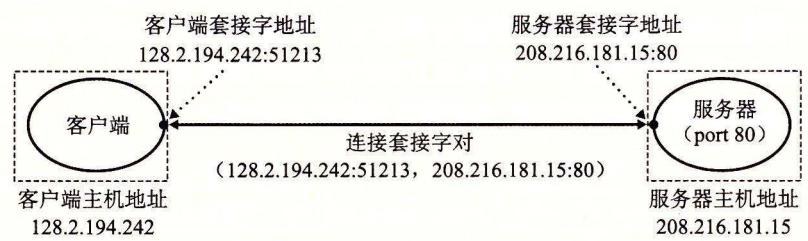

<sup>11</sup> <sup>11</sup> 因特网连接分析

在这个示例中, Web 客户端的套接字地址是

128.2.194.242:51213

其中端口号 <sup>51213</sup> 是内核分配的临时端口号。 Web 服务器的套接字地址是

208.216.181.15:80

其中端口号 <sup>80</sup> 是和 Web 服务相关联的知名端口号。给定这些客户端和服务器套接字地 址,客户端和服务器之间的连接就由下列套接字对唯一确定了:

(128. 2.194. 242: 51213, 208. 216.181.15: 80)

## 因特网的起源

因特网是政府、学校和工业界合作的最成功的示例之一 它成功的因素很多,但是 我们认为有两点尤其重要:美国政府 <sup>30</sup> 年持续不变的投资,以及充满激情的研究人员

e 这些软件端口与网络中交换机和路由器的硬件端口没有关系。

对麻省理工学院的 Dave Clarke 提出的"粗略一致和能用的代码"的投入

因特网的种子是在 <sup>1957</sup> 年播下的,其时正值冷战的高峰,苏联发射 Sputnik, 笫一颗人 造地球卫星,震惊了世界。作为响应,美国政府创建了高级研究计划署 (ARPA) ,其任务就 是重建美国在科学与技术上的领导地位。 <sup>1967</sup> 年, ARPA Lawrence Roberts 提出了一个计 划,建立一个叫做 )ANET 的新网络。第一个 团叭NET 节点是在 <sup>1969</sup> 年建立并运行的 <sup>1971</sup> 年,已有 <sup>13</sup> )ANET 节点,而且 email 作为第一个重要的网络应用涌现出来

<sup>1972</sup> 年, Robert Kahn 概括了网络互联的一般原则 一组互相连接的网络,通过叫 做"路由器"的黑盒子按照"以尽力传送作为基础"在互相独立处理的网络间实现通 <sup>1974</sup> 年, Kahn Vinton Cerf 发表了 TCP IP 协议的第一本详细资料,到 <sup>1982</sup> 它成为了 ARPANET 的标准网络互联协议 <sup>1983</sup> 日, ARPANET 的每个节点 都切换到 TCP IP, 标志着全球 IP 因特网的诞生

<sup>1985</sup> 年, Paul Mockapetris 发明了 DNS, <sup>1000</sup> 多台因特网主机 <sup>1986</sup> 年,国家 科学基金会 (NSF) 56KB 的电话线连接了 <sup>13</sup> 个节点,构建了 NSFNET 的骨干网 其后在 <sup>1988</sup> 年升级到 1. 5MB/ s Tl 的连接速率, <sup>1991</sup> 年为 45MB T3 的连接速率 <sup>1988</sup> 年,有超过 <sup>50</sup> <sup>000</sup> 台主机。 <sup>1989</sup> 年,原始的 ARPANET 正式退休了。 199~ 年, 已经有几乎 <sup>10</sup> 000 <sup>000</sup> 台因特网主机了, NSF 取消了 NSFNET, 并且用基于由公众网 络接入点连接的私有商业骨干网的现代因特网架构取代了它。

## 11 . 4 套接字接口

套接宇接 (socket in erface) 是一组函数,它们和 Unix 1/0 函数结合起来,用以创建 网络应用。大多数现代系统上都实现套接字接口,包括所有的 Unix 变种、 ndows Macintosh 系统。图 11-12 给出了一个典型的客户端 服务器事务的上下文 的套接字接口 概述。当讨论各个函数时,你可以使用这张图来作为向导图。

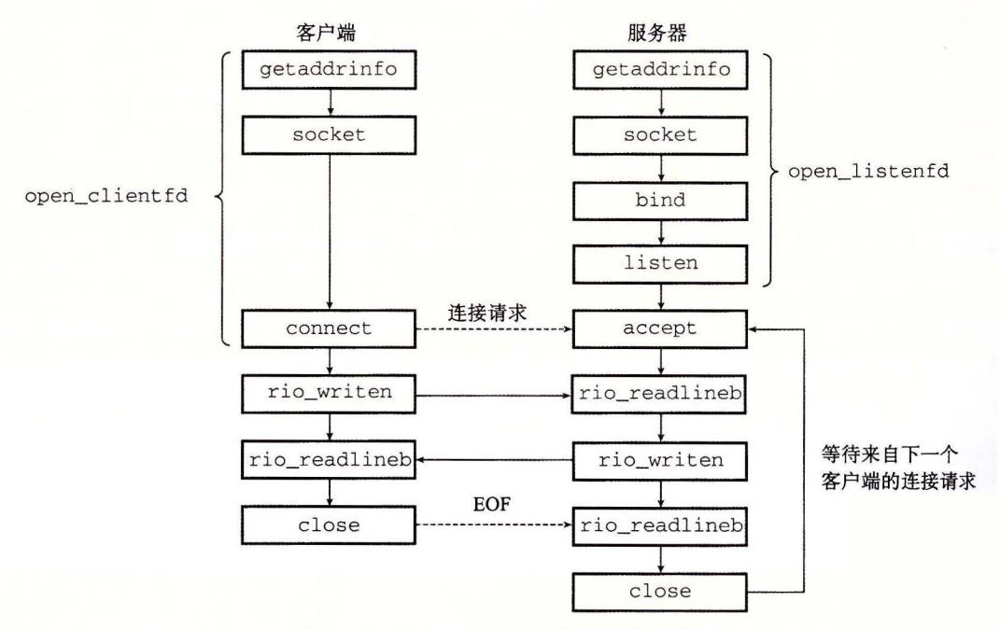

<sup>11</sup> 基于套接字接口的网络应用概述

## 套接字接口的起源

套接宇接口是加州大学伯克利分校的研究人员在 <sup>20</sup> 世纪 <sup>80</sup> 年代早期提出的。因为 这个原因,它也经常被叫做伯克利套接宇 伯克利的研究者使得套接宇接口适用于任何 底层的协议。第一个实现的就是针对 TCP IP 协议的,他们把它包括在 Unix 4. 2BSD 内核里,并且分发给许多学校和实验室。这在因特网的历史上是一个重大事件。几乎一 夜之间,成于上万的人们接触到了 TCP IP 和它的源代码 它引起了巨大的轰动,并激 发了新的网络和网络互联研究的浪潮

## <sup>11</sup> . 4. 1 套接字地址结构

Linux 内核的角度来看, 个套接字就是通信的一个端点。从 Linux 程序的角度来 看,套接字就是一个有相应描述符的打开文件。

因特网的套接字地址存放在如图 11-13 所示的类型为 sockaddr\_in <sup>16</sup> 字节结构中。 对于因特网应用, sin\_fam 成员是 AF\_INET, sin\_po 江成员是一个 <sup>16</sup> 位的端口号, sin addr 成员就是 <sup>32</sup> 位的 IP 地址。 IP 地址和端口号总是以网络字节顺序(大端 法)存放的。

```
code/netp/netpfragments.c 
I* IP socket address structure *I 
struct sockaddr_in { 
   uint16_t sin_family; I* Protocol family (always AF _!NET) *I 
   uint16_t sin_port; I* Port number in network byte order *I 
   struct in_addr sin_addr; I* IP address in network byte order *I 
   unsigned char sin_zero[8]; I* Pad to sizeof(struct sockaddr) *I 
}; 
I* Generic socket address structure (for connect, bind, and accept) *I 
struct sockaddr { 
   uint16_t sa_family; I* Protocol family *I 
   char sa_data[14]; I* Address data *I 
}; 
                                                          code/netp/netp fragments. c
```

<sup>11</sup> <sup>13</sup> 套接字地址结构

## 四日 in 后缀意味什么?

in 后缀是互联网络 (internet) 的缩写,而不是输入 (input) 的缩写。

connec 七、区nd accept 函数要求一个指向与协议相关的套接字地址结构的指针。 套接字接口的设计者面临的问题是,如何定义这些函数,使之能接受各种类型的套接字地 址结构。今天我们可以使用通用的 VO 过\*指针,但是那时在 中并不存在这种类型的指 针。解决办法是定义套接字函数要求一个指向通用 sockaddr 结构(图 11-13) 的指针,然 后要求应用程序将与协议特定的结构的指针强制转换成这个通用结构。为了简化代码示 例,我们跟随 Steven 的指导,定义下面的类型:

typedef struct sockaddr SA;

然后无论何时需要将 sockaddr\_in 结构强制转换成通用 sockaddr 结构时,我们都使用 这个类型。

## 11 . 4. 2 socke 七函数

客户端和服务器使用 socket 函数来创建一个套接字描述符 (socket descriptor)

```
#include <sys/types.h> 
#include <sys/socket.h> 
int socket(int domain, int type, int protocol); 
                                           返回:若成功则为非负描述符,若出错则为—
```

如果想要使套接字成为连接的一个端点,就用如下硬编码的参数来调用 socket 函数: clientfd = Socket(AF\_INET, SOCK\_STREAM, O);

其中, AF\_INET 表明我们正在使用 <sup>32</sup> IP 地址,而 SOCK\_STREAM 表示这个套接字 是连接的一个端点。不过最好的方法是用 ge addrinfo 函数 (11. 4. 节)来自动生成这些 参数,这样代码就与协议无关了。我们会在 11. 4. 节中向你展示如何配合 socket 函数来 使用 getaddrinfo

socket 返回的 clientfd 描述符仅是部分打开的,还不能用于读写。如何完成打开 套接字的工作,取决于我们是客户端还是服务器。下一节描述当我们是客户端时如何完成 打开套接字的工作。

#### 11 . 4. 3 connec七函数

客户端通过调用 connect 函数来建立和服务器的连接。

```
#include <sys/socket.h> 
int connect(int clientfd, const struct sockaddr *addr, 
           socklen_t addrlen); 
                                                    返回:若成功则为 o, 若出错则为
```

connect 函数试图与套接字地址为 addr 的服务器建立一个因特网连接,其中 addrlen sizeof(sockaddr\_in) conne 吐函数会阻塞,一直到连接成功建立或是发生错误。如果 成功, clientfd 描述符现在就准备好可以读写了,并且得到的连接是由套接字对

(x:y, addr.sin\_addr:addr.sin\_port)

刻画的,其中 表示客户端的 IP 地址,而 表示临时端口,它唯一地确定了客户端主机 上的客户端进程。对于 socket, 最好的方法是用 getaddrinfo 来为 connect 提供参数 (见 11. 4. 节)。

#### 11. 4. 4 bind 函数

剩下的套接字函数--bind、让sten accept, 服务器用它们来和客户端建立连接。

```
#include <sys/socket.h> 
int bind(int sockfd, const struct sockaddr *addr, 
        socklen_t addrlen); 
                                                    返回:若成功则为 o, 若出错则力—
```

bind 函数告诉内核将 addr 中的服务器套接字地址和套接字描述符 sockfd 联系起 来。参数 addrlen 就是 sizeof(sockaddr\_in) 。对于 sock 琴和 connect, 最好的方法 是用 getaddrinfo 来为 bind 提供参数(见 11. 4. 节)。

## 11 . 4. 5 lis en 函数

客户端是发起连接请求的主动实体。服务器是等待来自客户端的连接请求的被动实 体。默认情况下,内核会认为 sock 吐函数创建的描述符对应于主动套接字 (active socket) ,它存在于一个连接的客户端。服务器调用 sten 函数告诉内核,描述符是被服务器 而不是客户端使用的。

#include <sys/socket.h>

int listen(int sockfd, int backlog);

返回:若成功则为 o, 若出错则为

lis en 函数将 sockfd 从一个主动套接字转化为一个监听套接宇 (listening socket), 该套接字可以接受来自客户端的连接请求。 backlog 参数暗示了内核在开始拒绝连接请求 之前,队列中要排队的未完成的连接请求的数最。 backlog 参数的确切含义要求对 TCP/ IP 协议的理解,这超出了我们讨论的范围。通常我们会把它设置为一个较大的值,比 1024

#### 11 . 4. 6 accept 函数

服务器通过调用 accep 七函数来等待来自客户端的连接请求。

#include <sys/socket.h>

int accept(int listenfd, struct sockaddr \*addr, int \*addrlen);

返回:若成功则为非负连接描述符,若出错则为—

accept 函数等待来自客户端的连接请求到达侦听描述符 listenfd, 然后在 addr 填写客户端的套接字地址,并返回一个已连接描述符 (connected descriptor) ,这个描述符 可被用来利用 Unix 1/0 函数与客户端通信。

监听描述符和已连接描述符之间的区别使很多人感到迷惑。监听描述符是作为客户端 连接请求的一个端点。它通常被创建一次,并存在千服务器的整个生命周期。已连接描述 符是客户端和服务器之间已经建立起来了的连接的一个端点。服务器每次接受连接请求时 都会创建一次,它只存在于服务器为 个客户端服务的过程中。

11-14 描绘了监听描述符和巳连接描述符的角色。在第一步中,服务器调用 accept, 等待连接请求到达监听描述符,具体地我们设定为描述符 。回忆一下,描述符 0~2 是预留给了标准文件的。

在第二步中,客户端调用 conne 吐函数,发送一个连接请求到 listenfd 。第三步, accept 函数打开了一个新的已连接描述符 connfd (我们假设是描述符 4) ,在 clientfd connfd 之间建立连接,并且随后返回 connfd 给应用程序。客户端也从 conne 江返回, 在这一点以后,客户端和服务器就可以分别通过读和写 clientfd connfd 来回传送数 据了。

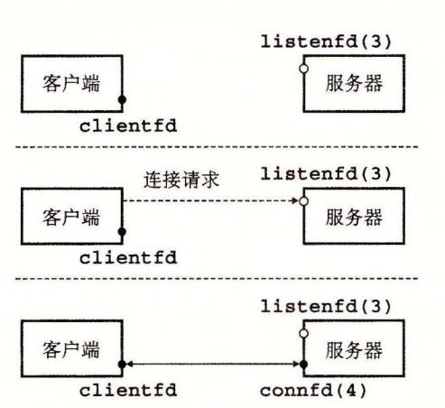

- 1. 服务器阻塞在 accept, 等待监听描述符 listenfd 上的连接请求。
- 2. 客户端通过调用和阻塞在 connect, 创建连接请求。
- 3. 服务器从 accept 返回 connfd。客户端 从 connect 返回。现在在 clientfd 和 connfd 之间已经建立起了连接。

图 11-14 监听描述符和已连接描述符的角色

#### 旁注 为何要有监听描述符和已连接描述符之间的区别?

你可能很想知道为什么套接字接口要区别监听描述符和已连接描述符。乍一看,这像是不必要的复杂化。然而,区分这两者被证明是很有用的,因为它使得我们可以建立并发服务器,它能够同时处理许多客户端连接。例如,每次一个连接请求到达监听描述符时,我们可以派生(fork)一个新的进程,它通过已连接描述符与客户端通信。在第12章中将介绍更多关于并发服务器的内容。

#### 11.4.7 主机和服务的转换

Linux 提供了一些强大的函数(称为 getaddrinfo 和 getnameinfo)实现二进制套接字地址结构和主机名、主机地址、服务名和端口号的字符串表示之间的相互转化。当和套接字接口一起使用时,这些函数能使我们编写独立于任何特定版本的 IP 协议的网络程序。

#### 1. getaddrinfo 函数

getaddrinfo 函数将主机名、主机地址、服务名和端口号的字符串表示转化成套接字地址结构。它是已弃用的 gethostbyname 和 getservbyname 函数的新的替代品。和以前的那些函数不同,这个函数是可重人的(见 12.7.2 节),适用于任何协议。

```
#include <sys/types.h>
#include <sys/socket.h>
#include <netdb.h>\nint getaddrinfo(const char *host, const char *service,
```

给定 host 和 service(套接字地址的两个组成部分), getaddrinfo 返回 result, result 一个指向 addrinfo 结构的链表,其中每个结构指向一个对应于 host 和 service 的套接字地址结构(图 11-15)。


<sup>11</sup> <sup>15</sup> getaddrinfo 返回的数据结构

在客户端调用了 getaddrinfo 之后,会遍历这个列表,依次尝试每个套接字地址,直到调 socket connect 成功,建立起连接 类似地,服务器会尝试遍历列表中的每个套接字地 址,直到调用 sock琴和 bind 成功,描述符会被绑定到 个合法的套接字地址。为了避免内存 泄漏,应用程序必须在最后调用 freeaddrinfo, 释放该链表。如果 getaddrinfo 返回非零的 错误代码,应用程序可以调用 gai\_s reeror, 将该代码转换成消息字符串。

getaddrinfo host 参数可以是域名,也可以是数字地址(如点分十进制 IP 地址)。 service 参数可以是服务名(如 http) ,也可以是十进制端口号 如果不想把主机名转换成地 址,可以把 host 设置为 NULL service 来说也是 样。但是必须指定两者中至少一个。

可选的参数 hints 是一个 addrinfo 结构(见图 11-16) ,它提供对 getaddrinfo 返回 的套接字地址列表的更好的控制。如果要传递 hints 参数,只能设置下列字段: ai\_family ai\_socktype protocol ai\_flags 字段 其他字段必须设置为 (或 NULL) 实际中,我们用 memset 将整个结构清零,然后有选择地设置一些字段:

- getaddrinfo 默认可以返回 IPv4 IPv6 套接字地址 ai\_fam 设置为 AF\_IN-ET 会将列表限制为 IPv4 地址;设置为 AF\_ INET6 则限制为 IPv6 地址。
- ·对 host 关联的每个地址, getaddrinfo 函数默认最多返回三个 addrinfo 结构, 每个的 ai\_sock ype 字段不同:一个是连接,一个是数据报(本书未讲述),一个 是原始套接字(本书未讲述)。 ai\_socktype 设置为 SOCK\_STREAM 将列表限制为 对每个地址最多一个 addrinfo 结构,该结构的套接字地址可以作为连接的一个端 这是所有示例程序所期望的行为
- ai\_flags 字段是一个位掩码,可以进一步修改默认行为 可以把各种值用 OR 合起来得到该掩码。下面是一些我们认为有用的值:

AI\_ADDRCONFIG 。如果在使用连接,就推荐使用这个标志 [34] 。它要求只有当 本地主机被配置为 IPv4 时, getaddrinfo 返回 IPv4 地址。对 IPv6 也是类似。

AI\_CANONNAME ai\_canonname 字段默认为 NULL 。如果设置了该标志, 就是告诉 getaddrinfo 将列表中第一个 addrinfo 结构的 ai\_canonname 字段指向 host 的权威(官方)名字(见图 11-15)

AI\_NUMERICSERV 。参数 serv].ce 默认可以是服务名或端口号。这个标志 参数 serv].ce 为端口号

AI\_PASSIVE getaddr].nfo 默认返回套接字地址,客户端可以在调用 connect 时用作主动套接字。这个标志告诉该函数,返回的套接字地址可能被服务器用作监 听套接字。在这种情况中,参数 host 应该为 NULL 。得到的套接字地址结构中的 地址字段会是通配符地址 (wildcard address) ,告诉内核这个服务器会接受发送到该 主机所有 IP 地址的请求 。这是所有示例服务器所期望的行为。

```
code/netp/netpfragments.c 
struct addrinfo { 
    int ai_flags ; I* Hints argument flags *f 
}; 
    int 
    int 
    int 
    char 
    size_t 
                     ai_family; I* First arg to socket function *I 
                     ai_socktype; I* Second arg to socket function *I 
                     ai_protocol; f* Thi rd arg to socket function *I 
                    *ai_canonname; I* Canonical hostname *I 
                     ai_addrlen; I* Size of ai_addr struct *I 
    struct sockaddr *ai_addr; 
    struct addrinfo *ai_next; 
                                    I* Ptr to socket address structure *I 
                                    I* Ptr to next item in linked list *I 
                                                            codelnetp/netpfragments.c
```

~ 16 ge addr nfo 使用的 addr inf 结构

getaddrinfo 创建输出列表中的 addrinfo 结构时,会填写每个字段,除了 ai flags ai\_addr 字段指向一个套接字地址结构, ai\_addrlen 字段给出这个套接字地址 结构的大小,而 ai ne 江字段指向列表中下一个 addrinfo 结构 其他字段描述这个套接 字地址的各种属性。

getaddrinfo 个很好的方面是 addrinfo 结构中的字段是不透明的,即它们可以直 接传递给套接字接口中的函数,应用程序代码无需再做任何处理 例如, ai\_family ai socktype ai\_protocol 可以直接传递给 socke 七。类似地, ai addr addrlen 可以 直接传递给 connect bind 。这个强大的属性使得我 编写的客户端和服务器能够 独立千某个特殊版本的 IP 协议。

#### 2. getnameinfo 函数

getnameinfo 函数和 getaddrinfo 是相反的,将一个套接字地址结构转换成相应的 主机和服务名字符串。它是已弃用的 gethostbyaddr getservbyport 函数的新的替代 品,和以前的那些函数不同,它是可重入和与协议无关的。

```
#include <sys/socket.h> 
#include <netdb.h> 
int getnameinfo(const struct sockaddr *sa, socklen_t salen, 
               char *host, size_t hostlen, 
               char *service, size_t servlen, int flags); 
                                        返回:如果成功则为 o, 如果错误则为非零的错误代码
```

参数 sa 指向大小为 salen 字节的套接字地址结构, host 指向大小为 hostlen 字节的缓 冲区, service 指向大小为 servlen 字节的缓冲区。 getnameinfo 函数将套接字地址结构 sa 转换成对应的主机和服务名字符串,并将它们复制到 host servcice 缓冲区。如果 getnarneinfo返回非零的错误代码,应用程序可以调用 gai strerror 把它转化成字符串。

如果不想要主机名,可以把 host 设置为 NULL, hostlen 设置为 0。对服务字段来说也是一样。不过,两者必须设置其中之一。

参数 flags 是一个位掩码,能够修改默认的行为。可以把各种值用 OR 组合起来得到该掩码。下面是两个有用的值:

- NI\_NUMERICHOST。getnameinfo 默认试图返回 host 中的域名。设置该标志会使该函数返回一个数字地址字符串。
- NI\_NUMERICSERV。getnameinfo 默认会检查/etc/services,如果可能,会返回服务名而不是端口号。设置该标志会使该函数跳过查找,简单地返回端口号。

图 11-17 给出了一个简单的程序,称为 HOSTINFO,它使用 getaddrinfo 和 getnameinfo 展示出域名到和它相关联的 IP 地址之间的映射。该程序类似于 11.3.2 节中的 NSLOOKUP 程序。

```
– code/netp/hostinfo.c
    #include "csapp.h"
1
2
3
    int main(int argc, char **argv)
4
        struct addrinfo *p, *listp, hints;
5
         char buf[MAXLINE];
6
         int rc, flags;
7
8
         if (argc != 2) {
9
             fprintf(stderr, "usage: %s <domain name>\n", argv[0]);
10
             exit(0):
11
        }
12
13
         /* Get a list of addrinfo records */
14
        memset(&hints, 0, sizeof(struct addrinfo));
15
        hints.ai_family = AF_INET;
                                          /* IPv4 only */
16
        hints.ai_socktype = SOCK_STREAM; /* Connections only */
17
         if ((rc = getaddrinfo(argv[1], NULL, &hints, &listp)) != 0) {
18
             fprintf(stderr, "getaddrinfo error: %s\n", gai_strerror(rc));
19
             exit(1);
20
        }
21
22
        /* Walk the list and display each IP address */
23
         flags = NI_NUMERICHOST; /* Display address string instead of domain name */
24
        for (p = listp; p; p = p->ai_next) {
25
             Getnameinfo(p->ai_addr, p->ai_addrlen, buf, MAXLINE, NULL, 0, flags);
26
             printf("%s\n", buf);
27
28
29
         /* Clean up */
        Freeaddrinfo(listp);
31
32
        exit(0);
33
    }
34
```

首先,初始化垣 结构,使 getaddrinfo 返回我们想要的地址。在这里,我们想 查找 <sup>32</sup> 位的 IP 地址(第 <sup>16</sup> 行),用作连接的端点(第 <sup>17</sup> 行)。因为只想 getaddrinfo 转换 域名,所以用 service 参数为 NULL 来调用它。

调用 getadd nfo 之后,会遍历 addrinfo 结构,用 getnameinfo 将每个套接字地 址转换成点分十进制地址字符串。遍历完列表之后,我们调用 freeaddrinfo 小心地释放 这个列表(虽然对于这个简单的程序来说,并不是严格需要这样做的)。

运行 HOSTINFO 时,我们看到 twitter.com 映射到了四个 IP 地址,和 11. 3. 节用 NSLOOKUP 的结果 样。

linux>./hostinfo tter.com

199.16.156.102

199.16.156.230

199.16.156.6

199.16.156.70

练习题 <sup>11</sup> 4 函数 ge addrinfo getnameinfo 分别包含了 inet pton inet\_ntop 的功能,提供了更高级别的 独立于任何特殊地址格式的抽象。想看看这到底有多方 便,编写 HOSTINFO(图 11-17) 的一个版本,用 inet\_\_p on 而不是 getnameinfo 将每个 套接字地址转换成点分十进制地址字符串。

## 11 . 4. 8 套接字接口的辅助函数

初学时, getnameinfo 函数和套接字接口看上去有些可怕。用高级的辅助函数包装 一下会方便很多,称为 open\_clientfd open\_listenfd, 客户端和服务器互相通信时 可以使用这些函数。

1. open\_clientfd 函数

客户端调用 open\_clientfd 建立与服务器的连接。

```
#include 11csapp.h11
```

int open\_clientfd(char •hostname, char •port);

返回:若成功则为描述符,若出错则为一 1.

open\_clientfd 函数建立与服务器的连接,该服务器运行在主机 hostname 上,并在 端口号 port 上监听连接请求。它返回一个打开的套接字描述符,该描述符准备好了,可 以用 Unix /0 函数做输入和输出。图 11- <sup>18</sup> 给出了 open\_clien fd 的代码

我们调用 getaddrinfo, 它返回 addrinfo 结构的列表,每个结构指向一个套接字地 址结构,可用于建立与服务器的连接,该服务器运行 hostname 上并监听 port 端口。 然后遍历该列表,依次尝试列表中的每个条目,直到调用 socket connect 成功。如果 connect 失败,在尝试下一个条目之前,要小心地关闭套接字描述符。如果 connect 功,我们会释放列表内存,并把套接字描述符返回给客户端,客户端可以立即开始用 Unix /0 与服务器通信了。

注意,所有的代码都与任何版本的 IP 无关。 socket connect 的参数都是用 getaddrinfo 自动产生的,这使得我们的代码干净可移植。

2. open\_listenfd 函数

调用 open\_listenfd 函数,服务器创建一个监听描述符,准备好接收连接请求。

```
#include "csapp.h"
\nint open_listenfd(char *port);

返回: 若成功则为描述符, 若出错则为-1。
```

```
— code/src/csapp.c
   int open_clientfd(char *hostname, char *port) {
1
2
       int clientfd:
       struct addrinfo hints, *listp, *p;
3
4
       /* Get a list of potential server addresses */
5
       memset(&hints, 0, sizeof(struct addrinfo));
6
       hints.ai_socktype = SOCK_STREAM; /* Open a connection */
       hints.ai flags = AI NUMERICSERV: /* ... using a numeric port arg. */
       hints.ai_flags |= AI_ADDRCONFIG; /* Recommended for connections */
       Getaddrinfo(hostname, port, &hints, &listp);
10
11
       /* Walk the list for one that we can successfully connect to */
12
       for (p = listp; p; p = p->ai_next) {
13
            /* Create a socket descriptor */
14
            if ((clientfd = socket(p->ai_family, p->ai_socktype, p->ai_protocol))
15
                < 0) continue; /* Socket failed, try the next */
16
17
            /* Connect to the server */
18
            if (connect(clientfd, p->ai_addr, p->ai_addrlen) != -1)
19
                break; /* Success */
20
           Close(clientfd); /* Connect failed, try another */
21
       7
22
23
       /* Clean up */
       Freeaddrinfo(listp);
25 '
       if (!p) /* All connects failed */
           return -1;
27
               /* The last connect succeeded */
28
       else
           return clientfd;
29
30 }
```

- code/src/csapp.c

图 11-18 open clientfd: 和服务器建立连接的辅助函数。它是可重人和与协议无关的

open\_listenfd 函数打开和返回一个监听描述符,这个描述符准备好在端口 port 上接收连接请求。图 11-19 展示了 open listenfd 的代码。

open\_listenfd 的风格类似于 open\_clientfd。调用 getaddrinfo,然后遍历结果列表,直到调用 socket 和 bind 成功。注意,在第 20 行,我们使用 setsockopt 函数(本书中没有讲述)来配置服务器,使得服务器能够被终止、重启和立即开始接收连接请求。一个重启的服务器默认将在大约 30 秒内拒绝客户端的连接请求,这严重地阻碍了调试。

因为我们调用 getaddrinfo 时,使用了 AI\_PASSIVE 标志并将 host 参数设置为 NULL,每个套接字地址结构中的地址字段会被设置为通配符地址,这告诉内核这个服务器会接收发送到本主机所有 IP 地址的请求。

```
code/src/csapp.c
 1
     int open_listenfd(char *port)
 2
 3
         struct addrinfo hints, *listp, *p;
         int listenfd, optval=1;
4
 6
         /* Get a list of potential server addresses */
 7
         memset(&hints, 0, sizeof(struct addrinfo));
         hints.ai_socktype = SOCK_STREAM;
                                                         /* Accept connections */
8
9
         hints.ai_flags = AI_PASSIVE | AI_ADDRCONFIG; /* ... on any IP address */
         hints.ai_flags |= AI_NUMERICSERV;
                                                         /* ... using port number */
10
         Getaddrinfo(NULL, port, &hints, &listp);
11
12
         /* Walk the list for one that we can bind to */
13
         for (p = listp; p; p = p->ai_next) {
14
             /* Create a socket descriptor */
15
16
             if ((listenfd = socket(p->ai_family, p->ai_socktype, p->ai_protocol))
                  < 0) continue; /* Socket failed, try the next */
17
18
19
             /* Eliminates "Address already in use" error from bind */
             Setsockopt(listenfd, SOL_SOCKET, SO_REUSEADDR,
20
21
                         (const void *)&optval , sizeof(int));
22
             /* Bind the descriptor to the address */
23
             if (bind(listenfd, p->ai_addr, p->ai_addrlen) == 0)
24
                 break: /* Success */
25
             Close(listenfd); /* Bind failed, try the next */
26
27
         7
28
         /* Clean up */
29
         Freeaddrinfo(listp);
30
31
         if (!p) /* No address worked */
             return -1;
32
33
         /* Make it a listening socket ready to accept connection requests */
34
         if (listen(listenfd, LISTENQ) < 0) {
35
36
             Close(listenfd);
             return -1;
37
         7
38
```

code/src/csapp.c

图 11-19 open listenfd: 打开并返回监听描述符的辅助函数。它是可重入和与协议无关的

最后,我们调用 listen 函数,将 listenfd 转换为一个监听描述符,并返回给调用者。如果 listen 失败,我们要小心地避免内存泄漏,在返回前关闭描述符。

#### 11. 4.9 echo 客户端和服务器的示例

return listenfd;

39 40

}

<mark>学习套接字接口的最好方法是研究示例代码。</mark>图 11-20 展示了一个 echo 客户端的代

码。在和服务器建立连接之后,客户端进入 个循环,反复从标准输入读取文本行,发送 文本行给服务器,从服务器读取回送的行,并输出结果到标准输出。当 fgets 在标准输入 上遇到 EOF 时,或者因为用户在键盘上键入 Ctr!+ D, 或者因为在一个重定向的输入文件 中用尽了所有的文本行时,循环就终止。

```
code/netp/echoclient.c 
     #include "csapp.h" 
3 int main(int argc, char **argv) 
        int clientfd; 
6 char *host, *port, buf[MAXLINE]; 
        rio_t rio; 
8 
9 if (argc != 3) { 
10 fpr].ntf (stderr, "usage: %s <host> <port>\n", argv [OJ); 
            exit(O); 
12 
1 3 host = argv [1] ; 
14 port = argv [2] ; 
15 
16 clientfd = Open_clientfd(host, port); 
17 Rio_readinitb(&rio, clientfd); 
18 
19 while (Fgets(buf, MAXLINE, std].n) != NULL) { 
20 Rio_writen(clientfd, buf, strlen(buf)); 
21 Rio_readlineb(&rio, buf, MAXLINE); 
22 Fputs (buf, stdout); 
23 
24 Close(clientfd); 
25 exit(O); 
26 } 
                                                     code/netp/echoclient.c
```

<sup>11</sup> -20 echo 客户端的 程序

循环终止之后,客户端关闭描述符。这会导致发送一个 EOF 通知到服务器,当服务 器从它的 reo\_readlineb 函数收到一个为零的返回码时,就会检测到这个结果。在关闭 它的描述符后,客户端就终止了。既然客户端内核在 个进程终止时会自动关闭所有打开 的描述符,第 <sup>24</sup> 行的 close 就没有必要了。不过,显式地关闭已经打开的任何描述符是 一个良好的编程习惯。

11-21 展示了 echo 服务器的主程序。在打开监听描述符后,它进入一个无限循环。 每次循环都等待一个来自客户端的连接请求,输出已连接客户端的域名和 IP 地址,并调 echo 函数为这些客户端服务。在 echo 程序返回后,主程序关闭巳连接描述符。一旦客 户端和服务器关闭了它们各自的描述符,连接也就终止了。

行的 clientaddr 变量是一个套接字地址结构,被传递给 accept 。在 accep 七返 回之前,会在 clientaddr 中填上连接另一端客户端的套接字地址。注意,我们将 cl entaddr 声明为 struct sockaddr \_ storage 类型,而不是 struct sockaddr\_in 类型。 根据定义, sockaddr\_storage 结构足够大能够装下任何类型的套接字地址,以保持代码 的协议无关性。

664

```
#include "csapp.h"
 1
 2
 3
     void echo(int connfd);
 4
     int main(int argc, char **argv)
 5
 6
         int listenfd, connfd;
         socklen_t clientlen;
 8
         struct sockaddr_storage clientaddr; /* Enough space for any address */
 9
10
         char client_hostname[MAXLINE], client_port[MAXLINE];
11
         if (argc != 2) {
12
              fprintf(stderr, "usage: %s <port>\n", argv[0]);
13
              exit(0);
14
         7
15
16
         listenfd = Open_listenfd(argv[1]);
17
         while (1) {
18
19
              clientlen = sizeof(struct sockaddr_storage);
              connfd = Accept(listenfd, (SA *)&clientaddr, &clientlen);
20
              Getnameinfo((SA *) &clientaddr, clientlen, client_hostname, MAXLINE,
21
                          client_port, MAXLINE, 0);
22
              printf("Connected to (%s, %s)\n", client_hostname, client_port);
23
              echo(connfd):
24
25
              Close(connfd);
         }
26
27
         exit(0);
28
     }
```

----- code/netp/echoserveri.c

图 11-21 迭代 echo 服务器的主程序

注意,简单的 echo 服务器一次只能处理一个客户端。这种类型的服务器一次一个地在客户端间迭代,称为迭代服务器(iterative server)。在第 12 章中,我们将学习如何建立更加复杂的并发服务器(concurrent server),它能够同时处理多个客户端。

最后,图 11-22 展示了 echo 程序的代码,该程序反复读写文本行,直到 rio\_readlineb 函数在第 10 行遇到 EOF。

```
    code/netp/echo.c

 1
     #include "csapp.h"
 2
 3
     void echo(int connfd)
 4
 5
          size_t n;
          char buf[MAXLINE];
 6
 7
         rio_t rio;
 8
 Q
          Rio_readinitb(&rio, connfd);
         while((n = Rio_readlineb(&rio, buf, MAXLINE)) != 0) {
10
              printf("server received %d bytes\n", (int)n);
11
12
              Rio_writen(connfd, buf, n);
13
         }
14
     }
                                                                   code/netp/echo.c
```

图 11-22 读和回送文本行的 echo 函数

## 日日 在连接中 EOF 意味什么?

EOF 的概念常常使人们感到迷惑,尤其是在因特网连接的上下文中 首先,我们 需要理解其实并没有像 EOF 宇符这样的一个东西 进一步来说, EOF 是由内核检测到 的一种条件。应用程序在它接收到一个由 read 函数返回的零返回码时,它就会发现出 EOF 条件 对于磁盘文件,当前文件位置超出文件长度时,会发生 EOF 。对于因特网 连接,当一个进程关闭连接它的那一端时,会发生 EOF 连接另一端的进程在试图读取 流中最后一个字节之后的字节时,会检测到 EOF

## 11 . 5 Web 服务器

迄今为止,我们巳经在一个简单的 echo 服务器的上下文中讨论了网络编程。在这一 节里,我们将向你展示如何利用网络编程的基本概念,来创建你自己的虽小但功能齐全的 Web 服务器。

## 11 . 5. 1 Web 基础

Web 客户端和服务器之间的交互用的是一个基于文本的应用级协议,叫做 HTTP (H pertext Transfer Protocol, 超文本传输协议)。 HTTP 是一个简单的协议。一个 Web 客户端(即浏览器)打开一个到服务器的因特网连接,并且请求某些内容。服务器响应所请 求的内容,然后关闭连接。浏览器读取这些内容,并把它显示在屏幕上。

Web 服务和常规的文件检索服务(例如 FTP) 有什么区别呢?主要的区别是 Web 内容 可以用一种叫做 HTML (Hypertext Markup Language, 超文本标记语言)的语言来编写。 一个 HTML 程序(页)包含指令(标记),它们告诉浏览器如何显示这页中的各种文本和图 形对象。例如,代码

<b> Make me bold! </b>

告诉浏览器用粗体字类型输出 <b> </b> 标记之间的文本。然而, HTML 真正的强大 之处在于一个页面可以包含指针(超链接),这些指针可以指向存放在任何因特网主机上的 内容。例如,一个格式如下的 HTML

<a href="http://www.cmu.edu/index.html">Carnegie Mellon</a>

告诉浏览器高亮显示文本对象 "Carnegie Mellon", 并且创建一个超链接,它指向存放 CMU Web 服务器上叫做 index.html HTML 文件。如果用户单击了这个高亮文本 对象,浏览器就会从 CMU 服务器中请求相应的 HTML 文件并显示它。

## 田日 万维网的起源

万维网是 Tim Bemers-Lee 发明的,他是一位在瑞典物理实验室 CERN (欧洲粒子物理研 究所)工作的软件工程师 <sup>1989</sup> 年, Bemers- Lee 写了一个内部备忘录,提出了一个分布式超文 本系统,它能连接"用链接组成的笔记的网 (web of notes with links)" 。提出这个系统的目的是 帮助 CERN 的科学家共享和管理信息 在接下来的两年多里, Bemers-Lee 实现了笫一个 Web 务器和 Web 浏览器之后,在 CERN 内部以及其他一些网站中, Web 发展出了小规模的拥护者。 <sup>1993</sup> 年一个关键事件发生了, Andreesen(他后来创建了 Netscape) 和他在 NCSA 的同事发布 了一种图形化的浏览器,叫做 MOSAIC, 可以在三种主要的平台上所使用: Unix Windows Macintosh 。在 MOSAIC 发布后,对 Web 的兴趣爆发了, Web 网站以每年 <sup>10</sup> 倍或更高的数量增 <sup>2015</sup> 年,世界上已经有超过 <sup>975</sup> 000 <sup>000</sup> Web 网站了(源自 Netcraft Web Survey)