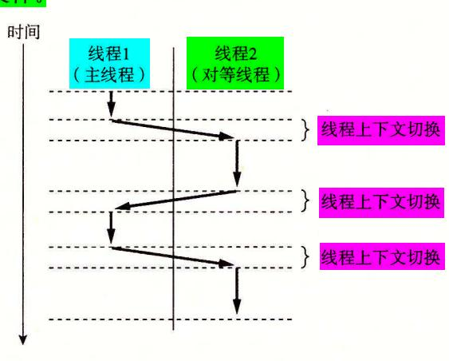
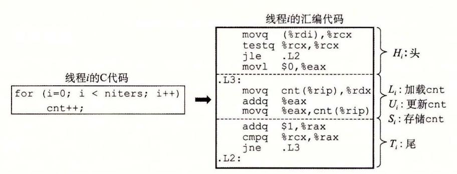
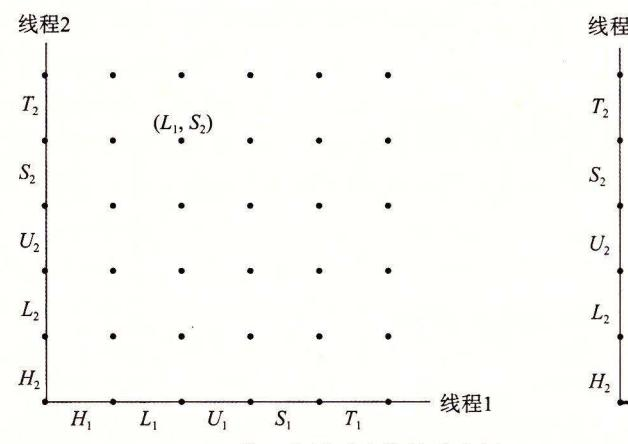
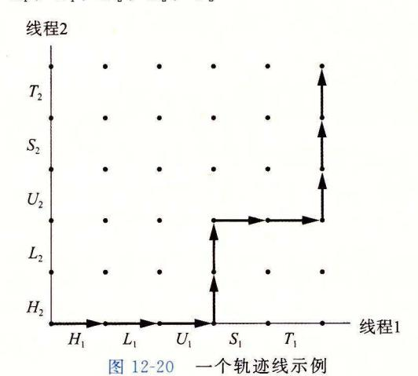
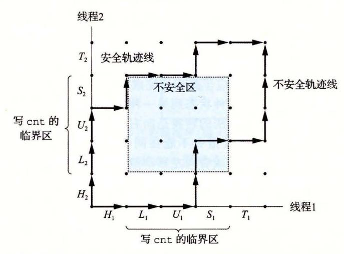
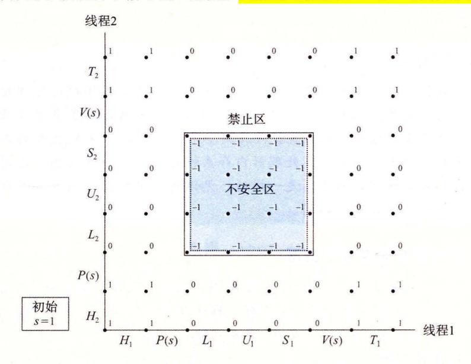
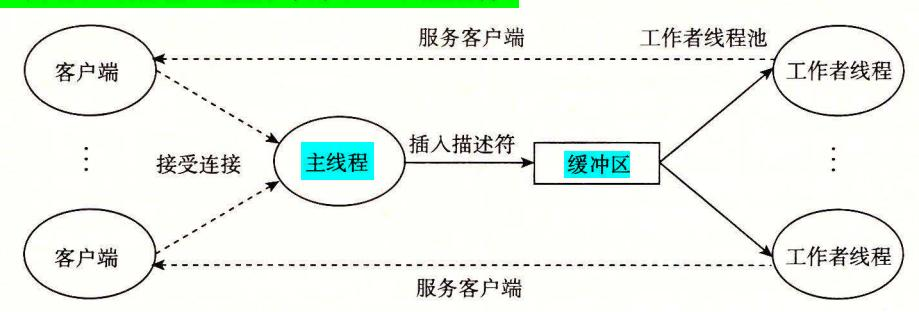

# 11 . 5. 2 Web 内容

对于 Web 客户端和服务器而言,内容是与一个 MIME (Multipurpose Internet Mail Extensions, 多用途的网际邮件扩充协议)类型相关的字节序列 11-23 展示了一些常用 MIME 类型。

| MIME 类型                    | 描述                |  |
|----------------------------|-------------------|--|
| text/html                  | HTML 页面           |  |
| text/plain                 | 无格式文本             |  |
| applicat<br>ion/postscript | Postscript 文档     |  |
| image                      | GIF 格式编码的二进制图像    |  |
| image /png                 | NG 格式编码的二进制图像     |  |
| irnage/jpeg                | 格式编码的二进制图像<br>JPE |  |

<sup>11</sup> -23 MIME 型示例

Web 服务器以两种不同的方式向客户端提供内容:

- 个磁盘文件,并将它的内容返回给客户端 。磁 盘文件称为静态内容 (static content) ,而返回文件给客户端的过程称为服务静态内容 (s rving static content) 。.
- 运行一个可执行文件,并将它的输出返回给客户端。运行时可执行文件产生的输出 称为动态内容 (dynamic content) ,而运行程序并返回它的输出到客户端的过程称为 服务动态内容 se rving dynamic content)

每条由 Web 服务器返回的内容都是和它管理的某个文件相关联的。这些文件中的每一个都 有一个唯 的名字,叫做 URL(Universal Resource Locator, 通用资源定位符)。例如, URL

http : //www.google . com : 80/ index.html

表示因特网主机 www.g oo gle com 上一个称为/ index.html HTML 文件,它是由一个 监听端口 <sup>80</sup> Web 服务器管理的 端口号是可选的,默认为知名的 HTTP 端口 <sup>80</sup> 执行文件的 URL 可以在文件名后包括程序参数 。"?"字符分隔文件名和参数,而且每个 参数都用"&"字符分隔开。例如, URL

http: //bluefish . ics.cs.cmu.edu:8000/cgi-bin/adder?15000&213

标识了一个叫做/cgi- bin/adder 的可执行文件,会带两个参数字符串 <sup>15000</sup> <sup>213</sup> 来调用 它。在 务过程中,客户端和服务器使用的是 URL 的不同部分 例如,客户端使用前缀

http://www.google.com : 80

来决定与哪类服务器联系,服务器在哪里,以及它监听的端口号是多少。服务器使用后缀 /index.html

#### 来发现在它文件系统中的文件,并确定请求的是静态内容还是动态内容。

关千服务器如何解释一个 URL 的后缀,有几点需要理解:

- 确定一个 URL 指向的是静态内容还是动态内容没有标准的规则。每个服务器对它 所管理的文件都有自己的规则。一 经典的(老式的)方法是,确定一组目录,例如 cg 丘区n, 所有的可执行性文件都必须存放这些目录中。
- 后缀中的最开始的那个" "不表示 Linux 的根目录。相反,它表示的是被请求内容 类型的主目录 例如,可以将 个服务器配置成这样:所有的静态内容存放在目录/ usr/httpd/html 下,而所有的动态内容都存放在目录/usr httpd/cgi-bin 下。

● 最小的 URL 后缀是"/"字符,所有服务器将其扩展为某个默认的主页,例如/index. html。这解释了为什么简单地在浏览器中键入一个域名就可以取出一个网站的主页。浏览器在 URL 后添加缺失的"/",并将之传递给服务器,服务器又把"/"扩展到某个默认的文件名。

#### 11.5.3 HTTP事务

因为 HTTP 是基于在因特网连接上传送的文本行的,我们可以使用 Linux 的 TELNET 程序来和因特网上的任何 Web 服务器执行事务。对于调试在连接上通过文本行来与客户端对话的服务器来说,TELNET 程序是非常便利的。例如,图 11-24 使用 TELNET 向 AOL Web 服务器请求主页。

```
linux> telnet www.aol.com 80
                                            Client: open connection to server
2
    Trying 205.188.146.23...
                                            Telnet prints 3 lines to the terminal
3
     Connected to aol.com.
     Escape character is '^]'.
     GET / HTTP/1.1
5
                                            Client: request line
6
     Host: www.aol.com
                                            Client: required HTTP/1.1 header
                                            Client: empty line terminates headers
     HTTP/1.0 200 OK
                                            Server: response line
9
     MIME-Version: 1.0
                                            Server: followed by five response headers
     Date: Mon. 8 Jan 2010 4:59:42 GMT
10
     Server: Apache-Coyote/1.1
11
     Content-Type: text/html
12
                                            Server: expect HTML in the response body
     Content-Length: 42092
                                            Server: expect 42,092 bytes in the response body
13
14
                                            Server: empty line terminates response headers
   <html>
15
                                            Server: first HTML line in response body
                                            Server: 766 lines of HTML not shown
16
     . . .
17
     </html>
                                            Server: last HTML line in response body
     Connection closed by foreign host. Server: closes connection
18 .
19
     linux>
                                            Client: closes connection and terminates
```

图 11-24 一个服务静态内容的 HTTP 事务

在第1行,我们从 Linux shell 运行 TELNET,要求它打开一个到 AOL Web 服务器的连接。TELNET 向终端打印三行输出,打开连接,然后等待我们输入文本(第5行)。每次输入一个文本行,并键入回车键,TELNET 会读取该行,在后面加上回车和换行符号(在C的表示中为"\r\n"),并且将这一行发送到服务器。这是和 HTTP 标准相符的,HTTP 标准要求每个文本行都由一对回车和换行符来结束。为了发起事务,我们输入一个 HTTP 请求(第5~7行)。服务器返回 HTTP 响应(第8~17行),然后关闭连接(第18行)。

#### 1. HTTP 请求

一个 HTTP 请求的组成是这样的: 一个请求行 (request line) (第 5 行),后面跟随零个或更多个请求报头 (request header) (第 6 行),再跟随一个<mark>空的文本行</mark>来终止报头列表 (第 7 行)。一个请求行的形式是

#### method URI version

HTTP 支持许多不同的方法,包括 GET、POST、OPTIONS、HEAD、PUT、DELETE 和 TRACE。我们将只讨论广为应用的 GET 方法,大多数 HTTP 请求都是这种类型的。

GET 方法指导服务器生成和返回 URI(Uniform Resource Identifier, 统一资源标识符)标 识的内容。 URI 是相应的 URL 的后缀,包括文件名和可选的参数

请求行中的 version 字段表明了该请求遵循的 HTTP 版本。最新的 HTTP 版本是 HTTP/ 1. 1 <sup>37</sup> HTTP 1. 是从 <sup>1996</sup> 年沿用至今的老版本 6] HTTP 1. 定义了一 些附加的报头,为诸如缓冲和安全等高级特性提供支持,它还支待一种机制,允许客户端 和服务器在同 条持久连接 (persistent connection) 上执行多个事务 在实际中,两个版本 是互相兼容的,因为 HTTP 1. 的客户端和服务器会简单地忽略 HTTP 1. 的报头。

总的来说,第 行的请求行要求服务器取出并返回 HTML 文件/ index.h ml 。它也 告知服务器请求剩下的部分是 HTTP 1. 格式的

请求报头为服务器提供了额外的信息,例如浏览器的商标名,或者浏览器理解的 MIME 类型 请求报头的格式为

### header-name : header-data

针对我们的目的,唯一需要关注的报头是 Host 报头(第 行),这个报头在 HTTP 1. 求中是需要的,而在 HTTP 1. 请求中是不需要的 代理缓存 (proxy cache) 会使用 Host 报头,这个代理缓存有时作为浏览器和管理被请求文件的原始服务器 (origin server) 的中 介。客户端和原始服务器之间,可以有多个代理,即所谓的代理链 (proxy chain) Host 报头中的数据指示了原始服务器的域名,使得代理链中的代理能够判断它是否可以在本地 缓存中拥有一个被请求内容的副本

继续图 11-24 中的示例,第 行的空文本行(通过在键盘上键入回车键生成的)终止了 报头,并指示服务器发送被请求的 HTML 文件

#### 2.HTTP

HTTP 响应和 HTTP 请求是相似的 一个 HTTP 响应的组成是这样的:一个响应行 (response ine) (第 行),后面跟随着零个或更多的响应报头 (response header) (第 9~13 行),再跟随一个终止报头的空行(第 <sup>14</sup> 行),再跟随一个响应主体 (response body) (第 15~17 行)。 个响应行的格式是

#### version status-code status-message

version 字段描述的是响应所遵循的 HTTP 版本 状态码 (status-code) 是一个 位的正整数, 指明对请求的处理 状态消息 (status message) 给出与错误代码等价的英文描述。图 11-25 出了一些常见的状态码,以及它们相应的消息

| 状态代码 | 状态消息       | 描述                      |
|------|------------|-------------------------|
| 200  | 成功         | 处理请求无误                  |
| 301  | 永久移动       | 内容已移动到location 头中指明的主机上 |
| 400  | 错误请求       | 服务器不能理解请求               |
| 403  | 禁止         | 服务器无权访问所请求的文件           |
| 404  | 未发现        | 服务器不能找到所请求的文件           |
| 501  | 未实现        | 服务器不支待请求的方法             |
| 505  | HTTP 版本不支持 | 服务器不支待请求的版本             |

<sup>11</sup> HTTP 状态码

e 实际上,只有当浏览器请求内容时,这才是真的 如果代理服务器请求内容,那么这个 URI 必须是完整的 URL

9~13 行的响应报头提供了关于响应的附加信息。针对我们的目的,两个最重要的 报头是 Content-Type (第 <sup>12</sup> 行),它告诉客户端响应主体中内容的 MIME 类型;以及 Content- Length (第 <sup>13</sup> 行),用来指示响应主体的字节大小。

<sup>14</sup> 行的终止响应报头的空文本行,其后跟随着响应主体,响应主体中包含着被请 求的内容。

# <sup>11</sup> . 5. 4 服务动态内容

如果我们停下来考虑一下,一个服务器是如何向客户端提供动态内容的 就会发现一 些问题。例如,客户端如何将程序参数传递给服务器?服务器如何将这些参数传递给它所 创建的子进程?服务器如何将子进程生成内容所需要的其他信息传递给子进程?子进程将 它的输出发送到哪里? 个称为 CGI(Common Gateway Interface, 通用网关接口)的实际 标准的出现解决了这些问题。

# 1. 客户端如何将程序参数传递给服务器

GET 请求的参数在 URI 中传递 正如我们看到的,一个"?"字符分隔了文件名和参 数,而每个参数都用 个"&"字符分隔开 参数中不允许有空格,而必须用字符串 "%20" 来表示。对其他特殊字符,也存在着相似的编码。

# 日日 HTTP POST 请求中传递参数

HTTP POST 请求的参数是在请求主体中而不是 URI 中传递的

### 2. 服务器如何将参数传递给子进程

在服务器接收 个如下的请求后

GET /cgi-bin/adder?15000&213 HTTP/1.1

它调用 fork 来创建一个子进程,并调用 execve 在子进程的上下文中执行/cgi-bin/adde 了程序 adder 这样的程序,常常被称为 CGI 程序,因为它们遵守 CGI 标准的规则。 而且,因为许多 CGI 程序是用 Perl 脚本编 的,所以 CGI 程序也常被称为 CGI 脚本。在 调用 execve 之前,子进程将 CGI 环境变量 QUERY\_STRING 设置为 "15000&213", adder 程序在运行时可以用 Linux getenv 函数来引用它

#### 3. 服务器如何将其他信息传递给子进程

CGI 定义了大量的其他环境变量,一个 CGI 程序在它运行时可以设置这些环境变量。 11-26 给出了其中的一部分。

| 环境变扯            | 描述                       |
|-----------------|--------------------------|
| QUERY_STR       | 程序参数                     |
| SERVER_pORT     | 父进程侦听的端口                 |
| REQUEST_ METHOD | GET<br>POST              |
| REMOTE_HOST     | 客户端的域名                   |
| REMOTE_ADDR     | 客户端的点分十进制 IP 地址          |
| CONTENT_ TYPE   | 只对 POST<br>:请求体的 MIME 类型 |
| CONTENT_ LENGTH | 只对 POST<br>:请求体的字节大小     |

<sup>11</sup> <sup>26</sup> CGI 环境变量示例

#### 4. 子进程将它的输出发送到哪里

一个 CGI 程序将它的动态内容发送到标准输出。在子进程加载并运行 CGI 程序之前,

它使用 Linux dup2 函数将标准输出重定向到和客户端相关联的已连接描述符。因此,任 CGI 程序写到标准输出的东西都会直接到达客户端。

注意,因为父进程不知道子进程生成的内容的类型或大小,所以子进程就要负责生成 Content-type Conten 七一 length 响应报头,以及终止报头的空行。

11-27 展示了 个简单的 CGI 程序,它对两个参数求和,并返回带结果的 HTML 文件给客户端。图 11-28 展示了一个 HTTP 事务,它根据 adder 程序提供动态内容

```
#include "csapp .h" 
 2 
 3 int main(void) { 
4 char *buf, *p; 
                                                      code/netpltin y/cgi-binl adder. c 
5 char arg1[MAXLINE], arg2[MAXLINE], content[MAXLINE]; 
6 int n1=0, n2=0; 
7 
8 ./* Extract the two arguments *I 
9 if ((buf = getenv("QUERY_STRING")) != NULL) { 
1 o p = strchr (buf,'&') ; 
11 *P ='\0'; 
12 strcpy(arg1, buf); 
13 strcpy(arg2, p+1); 
14 n1 = atoi (arg1); 
15 n2 = atoi (arg2) ; 
16 } 
17 
18 I* Make the response body *I 
19 sprintf (content, "QUERY_STRING=%s", buf); 
20 sprintf(content, "Welcome to add.com: "); 
21 sprintf(content, "%sTHE Internet addition portal. \r\n<p>", content); 
22 sprintf(content, "%sThe answer is: %d + %d = %d\r\n<p>", 
23content, n1, n2, n1 + n2) ; 
24 sprintf(content, "%sThanks for visiting!\r\n", content); 
25 
26 I* Generate the HTTP response *I 
27 printf("Connection : close\r\n"); 
28 printf("Content-length: %d\r\n", (int)strlen(content)); 
29 printf("Content-type: text/html\r\n\r\n"); 
30 printf ("%s", content); 
31 fflush(stdout); 
32 
33 exit(O); 
34 }
```

code/netpltinylcgi-binladder.c

```
linux> telnet kittyhawk.cmcl.cs.cmu.edu 8000 Client: open connection
    Trying 128.2.194.242...
2
3
    Connected to kittyhawk.cmcl.cs.cmu.edu.
    Escape character is '^1'.
4
     GET /cgi-bin/adder?15000&213 HTTP/1.0 Client: request line
5
                                               Client: empty line terminates headers
6
    HTTP/1.0 200 OK
7
                                               Server: response line
    Server: Tiny Web Server
                                               Server: identify server
8
     Content-length: 115
9
                                               Adder: expect 115 bytes in response body
     Content-type: text/html
10
                                               Adder: expect HTML in response body
                                               Adder: empty line terminates headers
11
    Welcome to add.com: THE Internet addition portal. Adder: first HTML line
12
    The answer is: 15000 + 213 = 15213 Adder: second HTML line in response body
13
14
     Thanks for visiting!
                                              Adder: third HTML line in response body
     Connection closed by foreign host.
15
                                              Server: closes connection
    linux>
                                              Client: closes connection and terminates
16
```

图 11-28 一个提供动态 HTML 内容的 HTTP 事务

#### 旁注 将 HTTP POST 请求中的参数传递给 CGI 程序

对于 POST 请求,子进程也需要重定向标准输入到已连接描述符。然后,CGI 程序会从标准输入中读取请求主体中的参数。

○ 练习题 11.5 在 10.11 节中,我们警告过你关于在网络应用中使用 C 标准 I/O 函数的 危险。然而,图 11-27 中的 CGI 程序却能没有任何问题地使用标准 I/O。为什么呢?

# 11.6 综合: TINY Web 服务器

我们通过开发一个虽小但功能齐全的称为 TINY 的 Web 服务器来结束对网络编程的讨论。TINY 是一个有趣的程序。在短短 250 行代码中,它结合了许多我们已经学习到的思想,例如进程控制、Unix I/O、套接字接口和 HTTP。虽然它缺乏一个实际服务器所具备的功能性、健壮性和安全性,但是它足够用来为实际的 Web 浏览器提供静态和动态的内容。我们鼓励你研究它,并且自己实现它。将一个实际的浏览器指向你自己的服务器,看着它显示一个复杂的带有文本和图片的 Web 页面,真是非常令人兴奋(甚至对我们这些作者来说,也是如此!)。

#### 1. TINY 的 main 程序

图 11-29 展示了 TINY 的主程序。TINY 是一个迭代服务器,监听在命令行中传递来的端口上的连接请求。在通过调用 open\_listenfd 函数打开一个监听套接字以后,TINY 执行典型的无限服务器循环,不断地接受连接请求(第 32 行),执行事务(第 36 行),并关闭连接的它那一端(第 37 行)。

#### 2. doit 函数

图 11-30 中的 doit 函数处理一个 HTTP 事务。首先,我们读和解析请求行(第  $11\sim14$  行)。注意,我们使用图 11-8 中的 rio readlineb 函数读取请求行。

TINY 只支持 GET 方法。如果客户端请求其他方法(比如 POST),我们发送给它一个错误信息,并返回到主程序(第 15~19 行),主程序随后关闭连接并等待下一个连接请求。否则,我们读并且(像我们将要看到的那样)忽略任何请求报头(第 20 行)。

```
code/netp/tinv/tinv.c
1
      * tinv.c - A simple, iterative HTTP/1.0 Web server that uses the
 2
 3
            GET method to serve static and dynamic content
      */
 4
     #include "csapp.h"
 5
 6
 7
     void doit(int fd):
8
     void read_requesthdrs(rio_t *rp);
9
     int parse_uri(char *uri, char *filename, char *cgiargs);
     void serve_static(int fd, char *filename, int filesize);
10
11
     void get_filetype(char *filename, char *filetype);
     void serve dynamic(int fd. char *filename. char *cgiargs):
13
     void clienterror(int fd, char *cause, char *errnum,
14
                       char *shortmsg, char *longmsg);
15
     int main(int argc. char **argv)
16
17
         int listenfd, connfd:
18
         char hostname[MAXLINE], port[MAXLINE];
19
         socklen t clientlen:
20
         struct sockaddr_storage clientaddr;
21
22
23
         /* Check command-line args */
         if (argc != 2) {
24
             fprintf(stderr, "usage: %s <port>\n", argv[0]);
25
26
             exit(1):
         }
27
29
         listenfd = Open_listenfd(argv[1]);
30
         while (1) {
             clientlen = sizeof(clientaddr);
31
             connfd = Accept(listenfd, (SA *)&clientaddr, &clientlen);
32
             Getnameinfo((SA *) &clientaddr, clientlen, hostname, MAXLINE,
33
                          port, MAXLINE, 0);
34
             printf("Accepted connection from (%s, %s)\n", hostname, port);
35
             doit(connfd);
36
             Close(connfd);
37
         }
38
39
     7
```

- code/netp/tiny/tiny.c

图 11-29 TINY Web 服务器

然后,我们将 URI 解析为一个文件名和一个可能为空的 CGI 参数字符串,并且设置一个标志,表明请求的是静态内容还是动态内容(第 23 行)。如果文件在磁盘上不存在,我们立即发送一个错误信息给客户端并返回。

最后,如果请求的是静态内容,我们就验证该文件是一个普通文件,而我们是有读权限的(第31行)。如果是这样,我们就向客户端提供静态内容(第36行)。相似地,如果请求的是动态内容,我们就验证该文件是可执行文件(第39行),如果是这样,我们就继续,并且提供动态内容(第44行)。

code/netp/tiny/tiny.c

```
- code/netp/tiny/tiny.c
1
     void doit(int fd)
2
3
         int is static:
         struct stat sbuf:
 4
         char buf[MAXLINE], method[MAXLINE], uri[MAXLINE], version[MAXLINE];
5
         char filename[MAXLINE], cgiargs[MAXLINE];
 6
7
         rio_t rio;
 8
9
         /* Read request line and headers */
         Rio_readinitb(&rio, fd);
10
         Rio readlineb(&rio, buf, MAXLINE):
11
         printf("Request headers:\n");
12
13
         printf("%s", buf);
         sscanf(buf, "%s %s %s", method, uri, version);
14
         if (strcasecmp(method, "GET")) {
15
            clienterror(fd, method, "501", "Not implemented",
16
                      "Tiny does not implement this method");
17
              return:
         }
19
20
         read_requesthdrs(&rio);
21
         /* Parse URI from GET request */
22
         is_static = parse_uri(uri, filename, cgiargs);
23
         if (stat(filename, &sbuf) < 0) {
24
              clienterror(fd, filename, "404", "Not found",
25
                          "Tiny couldn't find this file");
26
27
             return:
         7
28
29
         if (is static) { /* Serve static content */
30
              if (!(S_ISREG(sbuf.st_mode)) || !(S_IRUSR & sbuf.st_mode)) {
31
                  clienterror(fd. filename. "403", "Forbidden",
32
                              "Tiny couldn't read the file");
33 .
                  return;
34
              7
              serve_static(fd, filename, sbuf.st_size);
36
         7
37
         else { /* Serve dynamic content */
38
              if (!(S_ISREG(sbuf.st_mode)) || !(S_IXUSR & sbuf.st_mode)) {
39
                  clienterror(fd, filename, "403", "Forbidden",
40
41
                               "Tiny couldn't run the CGI program");
                 return:
42
              }
43
              serve_dynamic(fd, filename, cgiargs);
44
         }
45
     }
46
```

图 11-30 TINY doit 处理一个 HTTP 事务

#### 3. clienterror 函数

TINY 缺乏一个实际服务器的许多错误处理特性。然而,它会检查一些明显的错误,并把它们报告给客户端。图 11-31 中的 clienterror 函数发送一个 HTTP 响应到客户端,在响应行中包含相应的状态码和状态消息,响应主体中包含一个 HTML 文件,向浏览器

```
code/netpltinyltiny.c 
    void clienterror(int fd, char *cause, char *errnum, 
2char *shortmsg, char *longmsg) 
3 { 
4char buf[MAXLINE], body[MAXBUF]; 
5 
6I* Build the HTTP response body *I 
7 sprintf(body, "<html><title>Tiny Error</title>"); 
8sprintf (body, "%s<body bgcolor=" "ffffff" ">\r\n", body); 
9sprintf(body, "%s%s: %s\r\n", body, errnum, shortmsg); 
10 sprintf(body, "%s<p>%s: %s\r\n", body, longmsg, cause); 
11 sprintf (body, "%s<hr><em>The Tiny Web server</em>\r\n", body); 
12 
13 I* Print the HTTP response *I 
14 sprintf(buf, "HTTP/1.0 %s %s\r\n", errnum, shortmsg); 
15Rio_writen(fd, buf, strlen(buf)); 
16 sprintf(buf, "Content-type: text/html\r\n"); 
17Rio_writen(fd, buf, strlen(buf)); 
18sprintf(buf, "Content-length: %d\r\n\r\n", (int)strlen(body)); 
19 Rio_writen(fd, buf, strlen(buf)); 
20 Rio_writen(fd, body, strlen(body)); 
21 }
```

11-31 TINY ien err 向客户端发送一个出错消息

code/netp/tiny/tiny.c

回想一下, HTML 响应应该指明主体中内容的大小和类型。因此,我们选择创建 HTML 内容为一个字符串,这样 来我们可以简单地确定它的大小。还有,请注意我们 为所有的输出使用的都是图 中健壮的 rio\_writen 函数

#### 4. read requesthdrs 函数

TINY 不使用请求报头中的任何信息 它仅仅调用图 11-32 中的 read reques hdrs 函数来读取并忽略这些报头 注意,终止 求报头的空文本行是由回车和换行符对组成 的,我们在第 行中检查它

```
code/netp/tiny/tin y. c 
    void read_requesthdrs(rio_t *rp) 
2 { 
3 cha buf[MAXLINE];
4 
5Rio_readlineb (rp, buf, MAXLINE) ; 
6while(strcmp(buf, "\r\n")) { 
7Rio_readlineb(rp, buf, MAXLINE); 
8 printf("%s", buf); 
9 } 
10 return; 
11 } 
                                                  code/netpltinyltiny.c
```

<sup>11</sup> <sup>32</sup> TINY read\_reques hdrs 读取并忽略请求报头

### 5. parse\_uri 函数

TINY 假设静态内容的主目录就是它的当前目录,而可执行文件的主目录是./cgi-bin 任何包含字符串 cgi-bin URI 都会被认为表示的是对动态内容的请求。默认的文件名是 . /home. html

11-33 中的 parse\_uri 函数实现了这些策略 它将 URI 解析为 个文件名和一个 可选的 CGI 参数字符串。如果请求的是静态内容(第 行),我们将清除 CGI 参数字符串 (第 行),然后将 URI 转换为一个 Linux 相对路径名,例如./ index.html (第 7~8 行) 如果 URI 是用" "结尾的(第 行),我们将把默认的文件名加在后面(第 <sup>10</sup> 行)。另一方 面,如果请求的是动态内容(第 <sup>13</sup> 行),我们就会抽取出所有的 CGI 参数(第 14~20 行), 并将 URI 剩下的部分转换为一个 Linux 相对文件名(第 21~22 行)。

```
code/netpltinyltin y. c 
    int parse_uri(char *uri, char *filename, char *cgiargs) 
2 { 
3 char *ptr; 
5if (!strstr(uri, "cgi-bin")) { I* Static content *I 
           strcpy (cgiargs, 1111) ; 
          strcpy(filename, ". "); 
8strcat (filename, uri); 
9if (uri[strlen(uri)-1] == 1/1) 
10 strcat(filename, "home.html"); 
          return 1; 
12 } 
13 else { I* Dynamic content *I 
14 ptr = index(uri, 1?1); 
15if (ptr) { 
16 strcpy(cgiargs, ptr+1); 
17 *ptr = 1\01; 
18 } 
19 else 
20 strcpy (cgiargs, 11 11) ; 
21strcpy (filename, 11. 11) ; 
22 strcat (filename, uri); 
23 return O; 
24 } 
25 } 
                                              codelnetpltin yltin y. c
```

<sup>11</sup> -33 TINY parse\_uri 解析一个 HTTP URI

#### 6. serve\_static 函数

TINY 提供五种常见类型的静态内容: HTML 文件、无格式的文本文件,以及编码 GIF PNG ]PG 格式的图片。

11-34 中的 serve\_static 函数发送一个 HTTP 响应,其主体包含一个本地文件的 内容。首先,我们通过检查文件名的后缀来判断文件类型(第 行) 并且发送响应行和响 应报头给客户端(第 8~13 行)。注意用一个空行终止报头。

```
    code/netp/tiny/tiny.c

 1
     void serve_static(int fd, char *filename, int filesize)
 2
     {
 3
         int srcfd:
         char *srcp, filetype[MAXLINE], buf[MAXBUF];
 6
         /* Send response headers to client */
 7
         get_filetype(filename, filetype);
         sprintf(buf, "HTTP/1.0 200 OK\r\n");
 8
         sprintf(buf, "%sServer: Tiny Web Server\r\n", buf);
 9
         sprintf(buf, "%sConnection: close\r\n", buf);
10
         sprintf(buf, "%sContent-length: %d\r\n", buf, filesize);
11
         sprintf(buf, "%sContent-type: %s\r\n\r\n", buf, filetype);
12
         Rio_writen(fd, buf, strlen(buf));
13
14
         printf("Response headers:\n");
         printf("%s", buf);
15
16
         /* Send response body to client */
17
18
         srcfd = Open(filename, O_RDONLY, 0);
19
         srcp = Mmap(0, filesize, PROT_READ, MAP_PRIVATE, srcfd, 0);
20
         Close(srcfd);
21
         Rio_writen(fd, srcp, filesize);
22
         Munmap(srcp, filesize);
     }
23
24
25
     /*
26
      * get_filetype - Derive file type from filename
27
28
     void get_filetype(char *filename, char *filetype)
29
30
         if (strstr(filename, ".html"))
31
             strcpy(filetype, "text/html");
32
         else if (strstr(filename, ".gif"))
             strcpy(filetype, "image/gif");
33
         else if (strstr(filename, ".png"))
34
             strcpy(filetype, "image/png");
35
36
         else if (strstr(filename, ".jpg"))
             strcpy(filetype, "image/jpeg");
37
38
         else
             strcpy(filetype, "text/plain");
39
40
     7
                                                         - code/netp/tiny/tiny.c
```

图 11-34 TINY serve static 为客户端提供静态内容

接着,我们将被请求文件的内容复制到已连接描述符 fd 来发送响应主体。这里的代码是比较微妙的,需要仔细研究。第 18 行以读方式打开 filename,并获得它的描述符。在第 19 行,Linux mmap 函数将被请求文件映射到一个虚拟内存空间。回想我们在第 9.8 节中对 mmap 的讨论,调用 mmap 将文件 srcfd 的前 filesize 个字节映射到一个从地址 srcp 开始的私有只读虚拟内存区域。

一旦将文件映射到内存,就不再需要它的描述符了,所以我们关闭这个文件(第 <sup>20</sup> 行)。执行这项任务失败将导致潜在的致命的内存泄漏。第 <sup>21</sup> 行执行的是到客户端的实际 文件传送。 rio writen 函数复制从 srcp 位置开始的 filesize 个字节(它们当然已经被 映射到了所请求的文件)到客户端的已连接描述符。最后,第 <sup>22</sup> 行释放了映射的虚拟内存 区域。这对千避免潜在的致命的内存泄漏是很重要的。

#### 7. serve\_dynamic 函数

TINY 通过派生一个子进程并在子进程的上下文中运行一个 CGI 程序,来提供各种类 型的动态内容

11-35 中的 serve\_dynamic 函数一开始就向客户端发送一个表明成功的响应行, 同时还包括带有信息的 Server 报头 CGI 程序负责发送响应的剩余部分。注意,这并不 像我们可能希望的那样健壮,因为它没有考虑到 CGI 程序会遇到某些错误的可能性

```
code/netp/tin yltin y. c 
1void serve_dynamic (int fd, char *f].lename, char *cgiargs) 
2 { 
3char buf[MAXLINE], *emptylist[] = {NULL}; 
4 
5I* Return first part of HTTP response *I 
6sprintf(buf, "HTTP/1.0 200 OK\r\n"); 
7 Rio_writen(fd, buf, strlen(buf)); 
8sprintf(buf, "Server: Tiny Web Server\r\n"); 
9Rio_writen(fd, buf, strlen(buf)); 
10 
11if (Fork() == 0) { I* Child *I 
12 I* Real server would set all CGI va here *I 
13 setenv("QUERY_STRING", cgiargs, 1); 
14 Dup2(fd, STDOUT_FILENO); I* Redirect stdout to client *I 
15 Execve(filename, emptylist, environ); I* Run CGI program *I 
16 } 
17 . Wait(NULL); I* Parent waits for and reaps child *I 
18 } 
                                                             code/netpltin yltin y. c
```

<sup>11</sup> -35 TINY serve\_ dynamic 为客户端提供动态内容

在发送了响应的第一部分后,我们会派生一个新的子进程(第 <sup>11</sup> 行)。子进程用来自 请求 URI CGI 参数初始化 QUERY \_ STRING 环境变量(第 <sup>13</sup> 行)。注意,一个真正的 服务器还会在此处设置其他的 CGI 环境变星。为了简短,我们省略了这一步。

接下来,子进程重定向它的标准输出到已连接文件描述符(第 <sup>14</sup> 行),然后加载并运行 CGI 程序(第 <sup>15</sup> 行)。因为 CGI 程序运行在子进程的上下文中,它能够访问所有在调用 execve 函数之前就存在的打开文件和环境变量 因此, CGI 程序写到标准输出上的任何东西都 将直接送到客户端进程,不会受到任何来自父进程的干涉 其间,父进程阻塞在对 wait 调用中,等待当子进程终止的时候,回收操作系统分配给子进程的资源(第 <sup>17</sup> 行)。

# 豆日 处理过早关闭的连接

尽管一个 Web 服务器的基本功能非常简单,但是我们不想给你一个假象,以为编写一个 实际的 Web 服务器是非常简单的 构造一个长时间运行而不崩溃的健壮的 Web 服务器是一 件困难的任务,比起在这里我们已经学习了的内容,它要求对 Linux 系统编程有更加深入的

理解。例如,如果一个服务器写一个已经被客户端关闭了的连接(比如,因为你在浏览器上 单击了 "Stop" 按钮),那么第一次这样的写会正常返回,但是第二次写就会引起发送 SIG-PIPE 信号,这个信号的默认行为就是终止这个进程。如果捕获或者忽略 SIGPIPE 信号,那 么第二次写操作会返回值— 1, 并将 errno 设置为 EPIPE strerr perror 函数将 EPIPE 错误报告为 "Broken pipe", 这是一个迷惑了很多人的不太直观的信息。总的来说,一个健壮 的服务器必须捕获这些 SIGPIPE 信号,并且检查 wri 函数调用是否有 EPIPE 错误。

# 11. 7 小结

每个网络应用都是基千客户端-服务器模型的。根据这个模型, 个应用是由一个服务器和一个或多 个客户端组成的。服务器管理资源,以某种方式操作资源,为它的客户端提供服务。客户端-服务器模型 中的基本操作是客户端-服务器事务,它是由客户端请求和跟随其后的服务器响应组成的

客户端和服务器通过因特网这个全球网络来通信。从程序员的观点来看,我们可以把因特网看成是一个全 球范围的主机集合,具有以下几个属性: )每个因特网主机都有 个唯 <sup>32</sup> 位名字,称为它的 IP 地址。 2) IP 地址的集合被映射为一个因特网域名的集合 3) 不同因特网主机上的进程能够通过连接互相通信

客户端和服务器通过使用套接字接口建立连接。一个套接字是连接的一个端点,连接以文件描述符 的形式提供给应用程序 。套接字接 口提供了打开和关闭套接字描述符的函数 客户端和服务器通过读写 这些描述符来实现彼此间的通信。

eb 服务 器使用 HTTP 协议和它们的客户端(例如浏览器)彼此通信 。浏览 器向服务器请求静态或者 动态的内容。对静态内容的请求是通过从服务器磁盘取得文件并把它返回给客户端来服务的。对动态内 容的请求是通过在服务器上一个子进程的上下文中运行一个程序并将它的输出返回给客户端来服务的 CGI 标准提供了一组规则,来管理客户端如何将程序参数传递给服务器,服务器如何将这些 参数以及其 他信息传递给子进程,以及子进程如何将它的输出发送回客户端。只用几百行 代码就能实现一个简单 但是有功效的 Web 服务器,它既可以提供静态内容,也可以提供动态内容。

# 参考文献说明

有关因特网的官方信息源被保存在一系列的可免费获取的带编号的文档中,称为 RFC(Requests for Comments, 请求注解, Internet 标准(草案 ))。 在以下网站可获得可搜索的 RFC 的索引:

http://rfc-editor.org

RFC 通常是为因特网基础设施的开发者编写的,因此,对于普通读者来说,往往过于详细了 。然 而,要想获得权威信息,没有比它更好的信息来源了。 HTTP 1. 协议记录在 RFC <sup>2616</sup> 中。 MIME 型的权威列表保存在:

http://www.iana.org/ assignments/media- types

Kerrisk 是全面 Linux 编程的圣经,提供了现代网络编程的详细讨论[62] 。关于计算机网络互联有大量 很好的通用文献[65, 84, 114] 。伟大的科技作家 W. Richard Stevens 编写了一系列相关的经典文献,如高级 Unix 编程[111] 、因特网协议 [109, 120, <sup>107</sup> 以及 Unix 网络编程 [108, 110] 认真学习 Unix 系统编程 的学生会想要研究所有这些内容。不幸的是, Stevens <sup>1999</sup> 日逝世 我们会永远纪住他的贡献

# 家庭作业

- •• 11 . 6 A. 修改 TINY 使得它会原样返回每个请求行和请求报头。
  - .使用你喜欢的浏览器向 TINY 发送一个对静态内容的请求。把 TINY 的输出记录到一个文件中。
  - C. 检查 TINY 的输出,确定你的浏览器使用的 HTTP 的版本。
  - D. 参考 RFC <sup>2616</sup> 中的 HTTP 1. 标准,确定你的浏览器的 HTTP 请求中每个报头的含义。你可 以从 www.rfc-editor.org rfc.htrnl 获得 RFC <sup>2616</sup>
- .. 11 . 7 扩展 TINY, 使得它可以提供 MPG 视频文件。用一个真正的浏览器来检验你的工作

- \*\* 11.8 修改 TINY, 使得它在 SIGCHLD 处理程序中回收操作系统分配给 CGI 子进程的资源, 而不是显式地等待它们终止。
- \*\* 11.9 修改 TINY,使得当它服务静态内容时,使用 malloc、rio\_readn 和 rio\_writen,而不是 mmap 和 rio writen 来复制被请求文件到已连接描述符。
- \*\* 11. 10 A. 写出图 11-27 中 CGI adder 函数的 HTML 表单。你的表单应该包括两个文本框,用户将需要相加的两个数字填在这两个文本框中。你的表单应该使用 GET 方法请求内容。
  - B. 用这样的方法来检查你的程序:使用一个真正的浏览器向 TINY 请求表单,向 TINY 提交填写好的表单,然后显示 adder 生成的动态内容。
- \*\* 11. 11 扩展 TINY, 以支持 HTTP HEAD 方法。使用 TELNET 作为 Web 客户端来验证你的工作。
- \*\* 11. 12 扩展 TINY, 使得它服务以 HTTP POST 方式请求的动态内容。用你喜欢的 Web 浏览器来验证你的工作。
- \*\* 11.13 修改 TINY,使得它可以干净地处理(而不是终止)在 write 函数试图写一个过早关闭的连接时发生的 SIGPIPE 信号和 EPIPE 错误。

#### 练习题答案

11.1

| 十六进制地址     | 点分十进制地址         |
|------------|-----------------|
| 0x0        | 0.0.0.0         |
| 0xfffffff  | 255.255.255.255 |
| 0x7f000001 | 127.0.0.1       |
| 0xcdbca079 | 205.188.160.121 |
| 0x400c950d | 64.12.149.13    |
| 0xcdbc9217 | 205.188.146.23  |

11.2

```
code/netp/hex2dd.c
    #include "csapp.h"
2
3
    int main(int argc, char **argv)
5
         struct in_addr inaddr; /* Address in network byte order */
         uint32_t addr;
                           /* Address in host byte order */
6
7
         char buf[MAXBUF];
                                 /* Buffer for dotted-decimal string */
8
9
         if (argc != 2) {
10
             fprintf(stderr, "usage: %s <hex number>\n", argv[0]);
11
             exit(0):
12
         sscanf(argv[1], "%x", &addr);
13
         inaddr.s_addr = htonl(addr);
14
15
         if (!inet_ntop(AF_INET, &inaddr, buf, MAXBUF))
             unix_error("inet_ntop");
         printf("%s\n", buf);
18
19
         exit(0);
20
21
    }
                                                       code/netp/hex2dd.c
```

11.3

— code/netp/dd2hex.c

```
#include "csapp.h"
\nint main(int argc, char **argv)

{
```

```
struct in_addr inaddr: /* Address in network byte order */
6
         int ro:
         if (argc != 2) {
Q
9
             fprintf(stderr, "usage: %s <dotted-decimal>\n", argv[0]);
             exit(0);
10
11
12
13
         rc = inet_pton(AF_INET, argv[1], &inaddr);
14
         if (rc == 0)
             app_error("inet_pton error: invalid dotted-decimal address");
15
         else if (rc < 0)
16
17
             unix_error("inet_pton error");
18
         printf("0x%x\n", ntohl(inaddr.s_addr));
20
         exit(0):
21
     7
```

- code/netp/dd2hex.c

下面是解决方案。注意,使用 inet ntop要困难多少,它要求很麻烦的强制类型转换和深层嵌套 结构引用。getnameinfo函数要简单许多,因为它为我们完成了这些工作。

```
- code/netp/hostinfo-ntop.c
     #include "csapp.h"
 1
 2
 3
     int main(int argc, char **argv)
 4
 5
         struct addrinfo *p, *listp, hints;
         struct sockaddr_in *sockp;
 7
         char buf [MAXLINE] :
 8
         int rc;
         if (argc != 2) {
10
11
              fprintf(stderr, "usage: %s <domain name>\n", argv[0]);
12
              exit(0);
         7
13
14
         /* Get a list of addrinfo records */
15
16
         memset(&hints, 0, sizeof(struct addrinfo));
17
         hints.ai_family = AF_INET;
                                           /* IPv4 only */
         hints.ai_socktype = SOCK_STREAM; /* Connections only */
18
19
         if ((rc = getaddrinfo(argv[1], NULL, &hints, &listp)) != 0) {
20
              fprintf(stderr, "getaddrinfo error: %s\n", gai_strerror(rc));
21
              exit(1);
22
         7
23
24
         /* Walk the list and display each associated IP address */
25
         for (p = listp; p; p = p->ai_next) {
26
              sockp = (struct sockaddr_in *)p->ai_addr;
27
             Inet_ntop(AF_INET, &(sockp->sin_addr), buf, MAXLINE);
28
             printf("%s\n", buf);
29
30
31
         /* Clean up */
32
         Freeaddrinfo(listp);
33
34
         exit(0);
     }
                                                      code/netp/hostinfo-ntop.c
```

11.5 标准 I/O 能在 CGI 程序里工作的原因是,在子进程中运行的 CGI 程序不需要显式地关闭它的输入 输出流。当子进程终止时,内核会自动关闭所有描述符。

### C H A P T E R 12

# 并发编程

正如我们在第 章学到的,如果逻辑控制流在时间上重叠,那么它们就是并发的 (concurrent) 。这种常见的现象称为并发 (concurrency) ,出现在计算机系统的许多不同层 面上。硬件异常处理程序、进程和 Linux 信号处理程序都是大家很熟悉的例子。

到目前为止,我们主要将并发看做是一种操作系统内核用来运行多个应用程序的机 制。但是,并发不仅仅局限千内核。它也可以在应用程序中扮演重要角色。例如,我们已 经看到 Linux 信号处理程序如何允许应用响应异步事件,例如用户键入 Ctrl+C, 或者程 序访问虚拟内存的 个未定义的区域。应用级并发在其他情况下也是很有用的:

- ·访问慢速 1/0 设备。当一个应用正在等待来自慢速 设备(例如磁盘)的数据到达 时,内核会运行其他进程,使 CPU 保持繁忙。每个应用都可以按照类似的方式, 通过交替执行 I/0 请求和其他有用的工作来利用并发。
- ·与人交互。和计算机交互的人要求计算机有同时执行多个任务的能力。例如,他们 在打印一个文档时,可能想要调整一个窗口的大小 现代视窗系统利用并发来提供 这种能力。每次用户请求某种操作(比如通过单击鼠标)时,一个独立的并发逻辑流 被创建来执行这个操作。
- ·通过推迟工作以降低延迟。有时,应用程序能够通过推迟其他操作和并发地执行它 们,利用并发来降低某些操作的延迟。比如, 个动态内存分配器可以通过推迟合 并,把它放到 个运行在较低优先级上的并发"合并"流中,在有空闲的 CPU 期时充分利用这些空闲周期,从而降低单个 free 操作的延迟。
- ·服务多个网络客户端。我们在第 <sup>11</sup> 章中学习的迭代网络服务器是不现实的,因为它 们一次只能为 个客户端提供服务。因此,一个慢速的客户端可能会导致服务器拒绝 为所有其他客户端服务。对千一个真正的服务器来说,可能期望它每秒为成百上千的 客户端提供服务,由千一个慢速客户端导致拒绝为其他客户端服务,这是不能接受 的。一个更好的方法是创建一个并发服务器,它为每个客户端创建一个单独的逻辑 流。这就允许服务器同时为多个客户端服务,并且也避免了慢速客户端独占服务器。
- ·在多核机器上进行并行计算。许多现代系统都配备多核处理器,多核处理器中包含 有多个 CPU 。被划分成并发流的应用程序通常在多核机器上比在单处理器机器上运 行得快,因为这些流会并行执行,而不是交错执行。

使用应用级并发的应用程序称为并发程序 (concurrent program) 。现代操作系统提供 了三种基本的构造并发程序的方法:

- ·进程。用这种方法,每个逻辑控制流都是一个进程,由内核来调度和维护。因为进 程有独立的虚拟地址空间,想要和其他流通信,控制流必须使用某种显式的进程间 通信 (interprocess communication, IPC) 机制。
- 1/0 多路复用。在这种形式的并发编程中,应用程序在一个进程的上下文中显式地 调度它们自己的逻辑流。逻辑流被模型化为状态机,数据到达文件描述符后,主程 序显式地从一个状态转换到另一个状态。因为程序是一个单独的进程,所以所有的 流都共享同一个地址空间。

·线程。线程是运行在一个单一进程上下文中的逻辑流,由内核进行调度。你可以把 线程看成是其他两种方式的混合体,像进程流一样由内核进行调度,而像 I/0 多路 复用流一样共享同一个虚拟地址空间。

本章研究这三种不同的并发编程技术。为了使我们的讨论比较具体,我们始终以同一 个应用为例 11. 4. 节中的迭代 echo 服务器的并发版本。

# 12. 1 基千进程的并发编程

构造并发程序最简单的方法就是用进程,使用那些大家都很熟悉的函数,像 fork exec waitpid 。例如,一个构造并发服务器的自然方法就是,在父进程中接受客户端 连接请求,然后创建一个新的子进程来为每个新客户端提供服务。

为了了解这是如何工作的,假设我们有两个客户端和一个服务器,服务器正在监听一 个监听描述符(比如指述符 3) 上的连接请求。现在假设服务器接受了客户端 的连接请求, 并返回一个已连接描述符(比如指述符 4) ,如图 12-1 所示。在接受连接请求之后,服务器 派生一个子进程,这个子进程获得服务器描述符表的完整副本。子进程关闭它的副本中的 监听描述符 3' 而父进程关闭它的已连接描述符 的副本,因为不再需要这些描述符了。 这就得到了图 12-2 中的状态,其中子进程正忙千为客户端提供服务。


2- 第一步:服务器接受客户端的连接请求 <sup>12</sup> 第二步:服务器派生一个子进程为这个客户端服务

因为父、子进程中的已连接描述符都指向同一个文件表表项,所以父进程关闭它的巳 连接描述符的副本是至关重要的。否则,将永不会释放已连接描述符 的文件表条目,而 且由此引起的内存泄漏将最终消耗光可用的内存,使系统崩溃。

现在,假设在父进程为客户端 创建了子进程之后,它接受一个新的客户端 的连接请 求,并返回一个新的巳连接描述符(比如描述符 5) ,如图 12-3 所示。然后,父进程又派生另 一个子进程,这个子进程用已连接描述符 为它的客户端提供服务,如图 12-4 所示。此时, 父进程正在等待下一个连接请求,而两个子进程正在并发地为它们各自的客户端提供服务。


第三步:服务器接受另一个连接请求 12-4 第四步:服务器派生另一个子进程为新的客户端服务

#### 12.1.1 基于进程的并发服务器

图 12-5 展示了一个基于进程的并发 echo 服务器的代码。第 29 行调用的 echo 函数来 自于图 11-21。关于这个服务器,有几点重要内容需要说明:

- 首先,通常服务器会运行很长的时间,所以我们必须要包括一个 SIGCHLD 处理程 序,来回收僵死(zombie)子进程的资源(第4~9行)。因为当 SIGCHLD 处理程序 执行时, SIGCHLD 信号是阳塞的, 而 Linux 信号是不排队的, 所以 SIGCHLD 处 理程序必须准备好回收多个僵死子进程的资源。
- 其次,父子进程必须关闭它们各自的 connfd(分别为第 33 行和第 30 行)副本。就 像我们已经提到过的,这对父进程而言尤为重要,它必须关闭它的已连接描述符, 以避免内存泄漏。
- 最后,因为套接字的文件表表项中的引用计数,直到父子进程的 connfd 都关闭了, 到客户端的连接才会终止。

```
code/conc/echoserverp.c
     #include "csapp.h"
1
     void echo(int connfd);
2
3
    void sigchld_handler(int sig)
 4
 5
         while (waitpid(-1, 0, WNOHANG) > 0)
6
 7
8
         return;
9
10
     int main(int argc, char **argv)
11
12
         int listenfd, connfd:
13
         socklen_t clientlen;
14
         struct sockaddr_storage clientaddr;
15.
16
         if (argc != 2) {
17
18
             fprintf(stderr, "usage: %s <port>\n", argv[0]);
             exit(0);
19
         7
20
21
         Signal(SIGCHLD, sigchld_handler);
22
         listenfd = Open_listenfd(argv[1]);
23
         while (1) {
24
             clientlen = sizeof(struct sockaddr_storage);
25
             connfd = Accept(listenfd, (SA *) &clientaddr, &clientlen);
26
             if (Fork() == 0) {
27
                 Close(listenfd); /* Child closes its listening socket */
28
                 echo(connfd); /* Child services client */
29
                 Close(connfd);
                                  /* Child closes connection with client */
30
                                   /* Child exits */
                 exit(0):
31
32
             Close(connfd); /* Parent closes connected socket (important!) */
33
         }
34
     }
35
```

code/conc/echoserverp.c

#### 12.1.2 进程的优劣

对于在父、子进程间共享状态信息,进程有一个非常清晰的模型:共享文件表,但是不共享用户地址空间。进程有独立的地址空间既是优点也是缺点。这样一来,<mark>一个进程不可能不小心覆盖另一个进程的虚拟内存,</mark>这就消除了许多令人迷惑的错误——这是一个明显的优点。

另一方面,<mark>独立的地址空间使得进程共享状态信息变得更加困难。</mark>为了共享信息,它们必须使用显式的 IPC(进程间通信)机制。(参见下面的旁注。)基于进程的设计的另一个缺点是,它们往往比较慢,因为进程控制和 IPC 的开销很高。

### 旁注 Unix IPC

在本书中,你已经遇到好几个 IPC 的例子了。第 8 章中的 waitpid 函数和信号是基本的 IPC 机制,它们允许进程发送小消息到同一主机上的其他进程。第 11 章的套接字接口是 IPC 的一种重要形式,它允许不同主机上的进程交换任意的字节流。然而,术语 Unix IPC 通常指的是所有允许进程和同一台主机上其他进程进行通信的技术。其中包括管道、先进先出(FIFO)、系统 V 共享内存,以及系统 V 信号量(semaphore)。这些机制超出了我们的讨论范围。Kerrisk 的著作[62]是很好的参考资料。

- ★ 第 3 3 7 上,父进程关闭了已连接描述符后,子进程仍然能够使用该描述符和客户端通信。为什么?
- **练习题 12.2** 如果我们要删除图 12-5 中关闭已连接描述符的第 30 行,从没有内存泄漏的角度来说,代码将仍然是正确的。为什么?

### 12.2 基于 I/O 多路复用的并发编程

假设要求你编写一个 echo 服务器,它也能对用户从标准输入键入的交互命令做出响应。在这种情况下,服务器必须响应两个互相独立的 I/O 事件: 1) 网络客户端发起连接请求,2) 用户在键盘上键入命令行。我们先等待哪个事件呢?没有哪个选择是理想的。如果在 accept 中等待一个连接请求,我们就不能响应输入的命令。类似地,如果在 read 中等待一个输入命令,我们就不能响应任何连接请求。

针对这种困境的一个解决办法就是 I/O 多路复用 (I/O multiplexing)技术。基本的思路就是使用 select 函数,要求内核挂起进程,只有在一个或多个 I/O 事件发生后,才将控制返回给应用程序,就像在下面的示例中一样:

- 当集合{0,4}中任意描述符准备好读时返回。
- 当集合{1,2,7}中任意描述符准备好写时返回。
- 如果在等待一个 I/O 事件发生时过了 152.13 秒, 就超时。

select 是一个复杂的函数,有许多不同的使用场景。<mark>我们将只讨论第一种场景:等</mark> <del>待一组描述符准备好读。</del>全面的讨论请参考[62,110]。

```
#include <sys/select.h>\nint select(int n, fd_set *fdset, NULL, NULL, NULL);

返回已准备好的描述符的非零的个数,若出错则为一1。

FD_ZERO(fd_set *fdset); /* Clear all bits in fdset */
FD_CLR(int fd, fd_set *fdset); /* Clear bit fd in fdset */
FD_SET(int fd, fd_set *fdset); /* Turn on bit fd in fdset */
FD_ISSET(int fd, fd_set *fdset); /* Is bit fd in fdset on? */

处理描述符集合的宏。
```

select 函数处理类型为 fd\_set 的集合,也叫做描述符集合 逻辑上,我们将描述符 集合看成一个大小为 的位向量(在 2. 节中介绍过):

$$b_{n-1}$$
,  $\cdots$ ,  $b_1$ ,  $b_0$ 

每个位扒对应于描述符 。当且仅当 bk =l, 描述符 才表明是描述符集合的一个元素。只 允许你对描述符集合做三件事: )分配它们, )将一个此种类型的变 赋值给另一个变 量, )用 FD\_ZERO FD\_SET FD\_CLR FD ISSET 宏来修改和检查它们。

针对我们的目的, select 函数有两个输入: 个称为读集合的描述符集合 (fdset) 和该读集合的基数 (n) (实际上是任何描述符集合的最大基数)。 sele 吐函数会一直阻塞, 直到读集合中至少有一个描述符准备好可以读 当且仅当一个从该描述符读取一个字节的 请求不会阻塞时,描述符 就表示准备好可以读了 select 个副作用,它修改参数 fdset 指向的 fd\_set, 指明读集合的一个子集,称为准备好集合 (ready set) ,这个集合 是由读集合中准备好可以读了的描述符组成的。该函数返回的值指明了准备好集合的基 数。注意,由于这个副作用,我们必须在每次调用 select 时都更新读集合

理解 select 的最好办法是研究一个 体例子 12-6 展示了可以如何利用 select 来实现一个迭代 echo 服务器,它也可以接受标准输入上的用户命令 一开始,我们用 11-19 中的 open\_listenfd 函数打开一个监听描述符(第 <sup>16</sup> 行),然后使用 FD\_ZERO 创建一个空的读集合(第 <sup>18</sup> 行):

|              | listenfd |   | stdin |   |  |
|--------------|----------|---|-------|---|--|
|              | 3        | 2 | 1     | 0 |  |
| read_set (0) | :三       |   |       |   |  |

接下来,在第 <sup>19</sup> <sup>20</sup> 行中,我们定义由描述符 (标准输入)和描述符 (监听描述 符)组成的读集合:

|                   | listenfd |   |   | stdin |  |
|-------------------|----------|---|---|-------|--|
|                   | 3        | 2 | 1 | 0     |  |
| read_set ({O, 31) | :口       |   |   |       |  |

在这里,我们开始典型的服务器循环 但是我们不调用 accep 七函数来等待一个连接 请求,而是调用 select 函数,这个函数会一直阻塞,直到监听描述符或者标准输入准备 好可以读(第 <sup>24</sup> 行)。例如,下面是当用户按回车键,因此使得标准输入描述符变为可读 时, sele 吐会返回的 ready\_set 的值:

|                  | listenfd |   | stdin |   |  |
|------------------|----------|---|-------|---|--|
|                  | 3        | 2 | 1     | 0 |  |
| ready_set ({O}): |          |   |       |   |  |

一旦 select 返回,我们就用 FD\_ ISSET 宏指令来确定哪个描述符准备好可以读了。 如果是标准输入准备好了(第 <sup>25</sup> 行),我们就调用 command 函数,该函数在返回到主程序 前,会读、解析和响应命令。如果是监听描述符准备好了(第 <sup>27</sup> 行),我们就调用 accept 来得到一个已连接描述符,然后调用图 11-22 中的 echo 函数,它会将来自客户端的每一 行又回送回去,直到客户端关闭这个连接中它的那一端

虽然这个程序是使用 select 个很好示例,但是它仍然留下了一些问题待解决 题是一旦它连接到某个客户端,就会连续回送输入行,直到客户端关闭这个连接中它的那一 端。因此,如果键入一个命令到标准输人,你将不会得到响应,直到服务器和客户端之间结

# 束。一个更好的方法是更细粒度的多路复用,服务器每次循环(至多)回送一个文本行。

```
code/condselect.c 
 1 #include "csapp.h" 
 2 void echo (int connfd) ; 
 3 void command(void); 
 5 int main(int argc, char **argv) 
 7 int listenfd, connfd; 
8 socklen_t clientlen; 
9 struct sockaddr_storage clientaddr; 
1 O fd_set read_set, ready _set; 
12 if (argc != 2) { 
13 fprintf (stderr, "usage: %s <port>\n", argv [OJ); 
14 exit(O); 
15 
16 listenfd = Open_listenfd(argv[1]); 
17 
18 FD_ZERO(&read_set); I* Clear read set *I 
19 FD_SET(STDIN_FILENO, &read_set); I* Add stdin to read set *I 
20 
21 
        FD_SET(listenfd, &read_set); 
22 while (1) { 
23 ready_set = read_set; 
                                     I* Add listenfd to read set *I 
24 Select (listenfd+1, &ready _set, NULL, NULL, NULL) ; 
25 if (FD_ISSET (STDIN_FILENO, &ready _set)) 
26 command(); I* Read command line from stdin *I 
27 if (FD_ISSET (listenfd, &ready _set)) { 
28 clientlen = sizeof (struct sockaddr_storage); 
29 connfd = Accept(listenfd, (SA *)&clientaddr, &clientlen); 
30 echo(connfd); I* Echo client input until EDF *I 
31 Close(connfd); 
32 } 
33 } 
34 } 
35 
36 void command(void) { 
37 char buf[MAXLINE]; 
38 if (! Fgets (buf, MAXLINE, st din)) 
39 exit (0); I* EDF *I 
40 printf("%s", buf); I* Process the input command *I 
41 } 
                                                     code/condselect.c
```

<sup>12</sup> 使用 1/0 多路复用的迭代 echo 服务器。服务器使用 select 等待监听描述符上的连接请求和标准输入上的命令

练习题 <sup>12</sup> 3 Linux 系统里,在标准输入上键入 Ctrl+D 表示 EOF 。图 12-6 中的 程序阻塞在对 select 的调用上时,如果你键入 Ctrl+D 会发生什么?

#### 12. 2. 1 基于 1/0 多路复用的并发事件驱动服务器

多路复用可以用做并发事件驱动 (event-driven) 程序的基础,在事件驱动程序中, 某些事件会导致流向前推进。一般的思路是将逻辑流模型化为状态机。不严格地说,一个 状态机(state machine)就是一组状态(state)、输入事件(input event)和转移(transition),其中转移是将状态和输入事件映射到状态。每个转移是将一个(输入状态,输入事件)对映射到一个输出状态。自循环(self-loop)是同一输入和输出状态之间的转移。通常把状态机画成有向图,其中节点表示状态,有向弧表示转移,而弧上的标号表示输入事件。一个状态机从某种初始状态开始执行。每个输入事件都会引发一个从当前状态到下一状态的转移。

对于每个新的客户端 k,基于 I/O 多路 复用的并发服务器会创建一个新的状态机  $s_k$ ,并将它和已连接描述符  $d_k$ 联系起来。如图 12-7 所示,每个状态机  $s_k$ 都有一个状态 ("等待描述符  $d_k$ 准备好可读")、一个输入事件("描述符  $d_k$ 准备好可以读了")和一个转移 ("从描述符  $d_k$ 读一个文本行")。


图 12-7 并发事件驱动 echo 服务器中逻辑流的状态机

服务器使用 I/O 多路复用,借助 select 函数检测输入事件的发生。当每个已连接描述符准备好可读时,服务器就为相应的状态机执行转移,在这里就是从描述符读和写回一个文本行。

图 12-8 展示了一个基于 I/O 多路复用的并发事件驱动服务器的完整示例代码。一个pool 结构里维护着活动客户端的集合(第 3~11 行)。 在调用 init\_pool 初始化池(第 27 行)之后,服务器进入一个无限循环。 在循环的每次迭代中,服务器调用 select 函数来检测两种不同类型的输入事件: a)来自一个新客户端的连接请求到达,b)一个已存在的客户端的已连接描述符准备好可以读了。当一个连接请求到达时(第 35 行),服务器打开连接(第 37 行),并调用 add\_client 函数,将该客户端添加到池里(第 38 行)。最后,服务器调用 check\_clients 函数,把来自每个准备好的已连接描述符的一个文本行回送回去(第 42 行)。

- code/conc/echoservers.c

```
1
     #include "csapp.h"
2
     typedef struct { /* Represents a pool of connected descriptors */
3
                          /* Largest descriptor in read_set */
         int maxfd;
4
         fd_set read_set; /* Set of all active descriptors */
5
         fd_set ready_set; /* Subset of descriptors ready for reading */
6
                           /* Number of ready descriptors from select */
7
         int nready;
                           /* High water index into client array */
8
         int clientfd[FD_SETSIZE];
                                     /* Set of active descriptors */
9
         rio_t clientrio[FD_SETSIZE]; /* Set of active read buffers */
10
     } pool;
11
12
     int byte_cnt = 0; /* Counts total bytes received by server */
13
14
15
     int main(int argc, char **argv)
16
17
         int listenfd, connfd;
         socklen_t clientlen;
18
         struct sockaddr_storage clientaddr;
```

图 12-8 基于 I/O 多路复用的并发 echo 服务器。每次服务器迭代 都回送来自每个准备好的描述符的文本行

```
20
         static pool pool;
21
         if (argc != 2) {
22
23
              fprintf(stderr, "usage: %s <port>\n", argv[0]);
24
              exit(0);
25
         listenfd = Open_listenfd(argv[1]);
26
         init_pool(listenfd, &pool);
27
28
         while (1) {
29
             /* Wait for listening/connected descriptor(s) to become ready */
30
             pool.ready_set = pool.read_set;
31
             pool.nready = Select(pool.maxfd+1, &pool.ready_set, NULL, NULL, NULL);
32
33
             /* If listening descriptor ready, add new client to pool */
34
             if (FD_ISSET(listenfd, &pool.ready_set)) {
35
                  clientlen = sizeof(struct sockaddr_storage);
36
37
                  connfd = Accept(listenfd, (SA *)&clientaddr, &clientlen);
                  add_client(connfd, &pool);
             7
39
40
              /* Echo a text line from each ready connected descriptor */
41
42
              check_clients(&pool);
         }
43
     }
44
```

图 12-8 (续)

code/conc/echoservers.c

 $init_pool 函数(图 12-9) 初始化客户端池。clientfd 数组表示已连接描述符的集合,其中整数<math>-1$  表示一个可用的槽位。初始时,已连接描述符集合是空的(第 5 $\sim$ 7 行),而且监听描述符是 select 读集合中唯一的描述符(第  $10\sim$ 12 行)。

```
    code/conc/echoservers.c

     void init_pool(int listenfd, pool *p)
1
 2
          /* Initially, there are no connected descriptors */
 3
          int i;
 4
         p->maxi = -1;
5
          for (i=0; i < FD_SETSIZE; i++)
6
              p->clientfd[i] = -1;
8
          /* Initially, listenfd is only member of select read set */
         p->maxfd = listenfd;
10
          FD_ZERO(&p->read_set);
         FD_SET(listenfd, &p->read_set);
12
     }
13

    code/conc/echoservers.c
```

图 12-9 init pool 初始化活动客户端池

add\_client 函数(图 12-10)添加一个新的客户端到活动客户端池中。在 clientfd 数组中找到一个空槽位后,服务器将这个已连接描述符添加到数组中,并初始化相应的 RIO 读缓冲区,这样一来我们就能够对这个描述符调用 rio readlineb(第 8~9 行)。然

后,我们将这个已连接描述符添加到 select 读集合(第 12 行),并更新该池的一些全局属性。 $\max fd$  变量(第 15~16 行)记录了 select 的最大文件描述符。 $\max i$  变量(第 17~18 行)记录的是到 clientfd 数组的最大索引,这样 check\_clients 函数就无需搜索整个数组了。

```
- code/conc/echoservers.c
     void add_client(int connfd, pool *p)
2
3
         int i:
         p->nready--;
4
         for (i = 0; i < FD_SETSIZE; i++) /* Find an available slot */
5
             if (p->clientfd[i] < 0) {
6
                  /* Add connected descriptor to the pool */
7
                  p->clientfd[i] = connfd;
8
                  Rio readinitb(&p->clientrio[i], connfd);
9
10
                  /* Add the descriptor to descriptor set */
11
                  FD_SET(connfd, &p->read_set);
12
13
                  /* Update max descriptor and pool high water mark */
14
                  if (connfd > p->maxfd)
15
                      p->maxfd = connfd;
16
                  if (i > p->maxi)
17
                      p->maxi = i;
18
                  break:
10
20
         if (i == FD_SETSIZE) /* Couldn't find an empty slot */
21
             app_error("add_client error: Too many clients");
22
     7
23

    code/conc/echoservers.c
```

图 12-10 add client 向池中添加一个新的客户端连接

图 12-11 中的 check\_clients 函数回送来自每个准备好的已连接描述符的一个文本行。如果成功地从描述符读取了一个文本行,那么就将该文本行回送到客户端(第 15~18 行)。注意,在第 15 行我们维护着一个从所有客户端接收到的全部字节的累计值。如果因为客户端关闭这个连接中它的那一端,检测到 EOF,那么将关闭这边的连接端(第 23 行),并从池中清除掉这个描述符(第 24~25 行)。

根据图 12-7 中的有限状态模型,select 函数检测到输入事件,而 add\_client 函数创建一个新的逻辑流(状态机)。check\_clients 函数回送输入行,从而执行状态转移,而且当客户端完成文本行发送时,它还要删除这个状态机。

★习题 12.4 图 12-8 所示的服务器中,我们在每次调用 select 之前都立即小心地 重新初始化 pool.ready set 变量。为什么?

#### 旁注 事件驱动的 Web 服务器

尽管有 12.2.2 节中说明的缺点,现代高性能服务器 (例如 Node. js、nginx 和 Tornado)使用的都是基于 I/O 多路复用的事件驱动的编程方式,主要是因为相比于进程和线程的方式,它有明显的性能优势。

```
- code/conc/echoservers.c
     void check_clients(pool *p)
2
         int i, connfd, n;
3
         char buf[MAXLINE]:
4
5
         rio t rio;
6
         for (i = 0; (i \le p -) \max i) && (p -) \pmod > 0); i++) {
7
             connfd = p->clientfd[i]:
8
             rio = p->clientrio[i]:
10
             /* If the descriptor is ready, echo a text line from it */
             if ((connfd > 0) && (FD ISSET(connfd, &p->ready_set))) {
12
                  p->nready--:
13
                  if ((n = Rio_readlineb(&rio, buf, MAXLINE)) != 0) {
14
                      byte_cnt += n;
15
                      printf("Server received %d (%d total) bytes on fd %d\n",
16
                              n, byte_cnt, connfd);
17
18
                      Rio_writen(connfd, buf, n);
                  }
19
20
                  /* EOF detected, remove descriptor from pool */
21
22
                  else f
                      Close(connfd);
23
                      FD_CLR(connfd, &p->read_set);
24
                      p->clientfd[i] = -1;
25
                  7
26
             }
27
         }
28
29
     7
                                                                    - code/conc/echoservers c
```

图 12-11 check clients 服务准备好的客户端连接

#### 12.2.2 I/O 多路复用技术的优劣

图 12-8 中的服务器提供了一个很好的基于 I/O 多路复用的事件驱动编程的优缺点示例。事件驱动设计的一个优点是,它比基于进程的设计给了程序员更多的对程序行为的控制。例如,我们可以设想编写一个事件驱动的并发服务器,为某些客户端提供它们需要的服务,而这对于基于进程的并发服务器来说,是很困难的。

另一个优点是,一个基于 I/O 多路复用的事件驱动服务器是运行在单一进程上下文中的,因此每个逻辑流都能访问该进程的全部地址空间。这使得在流之间共享数据变得很容易。一个与作为单个进程运行相关的优点是,你可以利用熟悉的调试工具,例如 GDB,来调试你的并发服务器,就像对顺序程序那样。最后,事件驱动设计常常比基于进程的设计要高效得多,因为它们不需要进程上下文切换来调度新的流。

事件驱动设计一个明显的<mark>缺点</mark>就是<mark>编码复杂</mark>。我们的事件驱动的并发 echo 服务器需要的代码比基于进程的服务器多三倍,并且很不幸,随着并发粒度的减小,复杂性还会上升。这里的<mark>粒度是指每个逻辑流每个时间片执行的指令数量。</mark>例如,在示例并发服务器中,并发粒度就是读一个完整的文本行所需要的指令数量。只要某个逻辑流正忙于读一个文本行,其他逻辑流就不可能有进展。对我们的例子来说这没有问题,但是它使得在"故意只发送部分文

本行然后就停止"的恶意客户端的攻击面前,我们的事件驱动服务器显得很脆弱。修改事件驱动服务器来处理部分文本行不是一个简单的任务,但是基于进程的设计却能处理得很好,而且是自动处理的。基于事件的设计另一个重要的缺点是它们不能充分利用多核处理器。

#### 12.3 基于线程的并发编程

到目前为止,我们已经看到了两种创建并发逻辑流的方法。在第一种方法中,我们为每个流使用了单独的进程。内核会自动调度每个进程,而每个进程有它自己的私有地址空间,这使得流共享数据很困难。在第二种方法中,我们创建自己的逻辑流,并利用 I/O 多路复用来显式地调度流。因为只有一个进程,所有的流共享整个地址空间。本节介绍第三种方法——基于线程,它是这两种方法的混合。

线程(thread)就是运行在进程上下文中的逻辑流。在本书里迄今为止,程序都是由每个进程中一个线程组成的。但是现代系统也允许我们编写一个进程里同时运行多个线程的程序。<mark>线程由内核自动调度。</mark>每个线程都有它自己的线程上下文(thread context),包括一个唯一的整数线程 ID(Thread ID, TID)、栈、栈指针、程序计数器、通用目的寄存器和条件码。所有的运行在一个进程里的线程共享该进程的整个虚拟地址空间。

基于线程的逻辑流结合了基于进程和基于 I/O 多路复用的流的特性。同进程一样,线程由内核自动调度,并且内核通过一个整数 ID 来识别线程。同基于 I/O 多路复用的流一样,多个线程运行在单一进程的上下文中,因此共享这个进程虚拟地址空间的所有内容,包括它的代码、数据、堆、共享库和打开的文件。

#### 12.3.1 线程执行模型

多线程的执行模型在某些方面和多进程的执行模型是相似的。思考图 12-12 中的示例。每个进程开始生命周期时都是单一线程,这个线程称为主线程(main thread)。在某一时刻,主线程创建一个对等线程(peer thread),从这个时间点开始,两个线程就并发地运行。最后,因为主线程执行一个慢速系统调用,例如 read 或者sleep,或者因为被系统的间隔计时器中断,控制就会通过上下文切换传递到对等



图 12-12 并发线程执行

<mark>线程。</mark>对等线程会执行一段时间,然后控制传递回主线程,依次类推。

在一些重要的方面,线程执行是不同于进程的。因为一个线程的上下文要比一个进程的上下文小得多,线程的上下文切换要比进程的上下文切换快得多。另一个不同就是<mark>线程不像进程那样,不是按照严格的父子层次来组织的。</mark>和一个进程相关的线程组成一个对等(线程)池、独立于其他线程创建的线程。主线程和其他线程的区别仅在于它总是进程中第一个运行的线程。对等(线程)池概念的主要影响是,一个线程可以杀死它的任何对等线程,或者等待它的任意对等线程终止。另外,每个对等线程都能读写相同的共享数据。

#### 12.3.2 Posix 线程

Posix 线程(Pthreads)是在 C 程序中处理线程的一个标准接口。它最早出现在 1995

年,而且在所有的 Linux 系统上都可用。 Pthreads 定义了大约 <sup>60</sup> 个函数,允许程序创建、 杀死和回收线程,与对等线程安全地共享数据,还可以通知对等线程系统状态的变化。

12-13 展示了一个简单的 Pthreads 程序。主线程创建一个对等线程,然后等待它的 终止。对等线程输出 "Hello, world! \n" 并且终止。当主线程检测到对等线程终止后, 它就通过调用 exit 终止该进程。这是我们看到的第一个线程化的程序,所以让我们仔细 地解析它。线程的代码和本地数据被封装在一个线程例程 (thread routine) 中。正如第二行 里的原型所示,每个线程例程都以一个通用指针作为输入,并返回一个通用指针。如果想 传递多个参数给线程例程,那么你应该将参数放到一个结构中,并传递一个指向该结构的 指针。相似地,如果想要线程例程返回多个参数,你可以返回一个指向一个结构的指针。

```
code/cone/hello. c #include "csapp.h" 
2void *thread(void *vargp); 
3 
4int main() 
5 { 
6pthread_t tid; 
7Pthread_create(&tid, NULL, thread, NULL); 
8 Pthread_join(tid, NULL); 
9exit(O); 
10 } 
11 
12 void *thread(void *vargp) I* Thread .routine *I 
13 { 
14 printf("Hello, world!\n"); 
15 return NULL; 
16 } 
                                                 code/condhello.c
```

2- hello.c: 使用 Pthreads "Hello, world!" 程序

行标出了主线程代码的开始。主线程声明了一个本地变鼠巨d, 可以用来存放对 等线程的 ID (第 行)。主线程通过调用 pthread\_create 函数创建一个新的对等线程(第 行)。当对 pthread\_create 的调用返回时,主线程和新创建的对等线程同时运行,并 tid 包含新线程的 ID 。通过在第 行调用 hread\_join, 主线程等待对等线程终止。 最后,主线程调用 ex 江(第 行),终止当时运行在这个进程中的所有线程(在这个示例中 就只有主线程)。

12~16 行定义了对等线程的例程。它只打印一个字符串,然后就通过执行第 <sup>15</sup> 中的 return 语句来终止对等线程。

#### 12. 3. 3 创建线程

线程通过调用 hread\_crea 函数来创建其他线程。

```
#include <pthread.h> 
typedef void *(func)(void *); 
int pthread_create(pthread_t *tid, pthread_attr_t *attr, 
                   func *f, void *arg); 
                                                       若成功则返回 o, 若出错则为非零。
```

pthread\_create 函数创建一个新的线程,并带着一个输入变量 arg, 在新线程的上 下文中运行线程例程 。能用 tr 参数来改变新创建线程的默认属性。改变这些属性已 超出我们学习的范围,在我们的示例中,总是用一个为 NULL attr 参数来调用 pthread\_create 函数。

pthread\_create 返回时,参数 tid 包含新创建线程的 ID 。新线程可以通过调用 pthread\_self 函数来获得它自己的线程 ID

```
#include <pthread.h> 
pthread_t pthread_self(void);
```

返回调用者的线程 ID

# 12. 3. 4 终止线程

- 一个线程是以下列方式之一来终止的:
- ·当顶层的线程例程返回时,线程会隐式地终止
- ·通过调用 pthread exit 函数,线程会显式地终止 如果主线程调用 pthread\_ ex-七,它会等待所有其他对等线程终止,然后再终止主线程和整个进程,返回值为 thread return

```
#include <pthread.h> 
void pthread_exit(void *thread_return);
```

从不返回

- ·某个对等线程调用 Linux exit 函数,该函数终止进程以及所有与该进程相关的 线程
- ·另一个对等线程通过以当前线程 ID 作为参数调用 pthread\_cancel 函数来终止当 前线程。

```
#include <pthread.h> 
int pthread_cancel(pthread_t tid);
```

若成功则返回 o, 若出错则为非零

# 12. 3. 5 回收己终止线程的资源

线程通过调用 pthread\_join 函数等待其他线程终止

```
#include <pthread.h>
```

```
int pthread_join(pthread_t tid, void **thread_return);
```

若成功则返回 0, 若出错则为非零

pthread\_join 函数会阻塞,直到线程 tid 终止,将线程例程返回的通用 (void\* )指 针赋值为 thread\_return 指向的位置,然后回收己终止线程占用的所有内存资源。

注意,和 Linux wait 函数不同, pthread\_join 函数只能等待一个指定的线程终 止。没有办法让 pthread\_wait 等待任意一个线程终止 这使得代码更加复杂,因为它迫 使我们去使用其他一些不那么直观的机制来检测进程的终止。实际上, Stevens [110] 就很有说服力地论证了这是规范中的一个错误。

# 12. 3. 6 分离线程

在任何一个时间点上,线程是可结合的 (joinable) 或者是分离的 (detached) 。一个可结 合的线程能够被其他线程收回和杀死 在被其他线程回收之前,它的内存资源(例如栈)是 不释放的。相反,一个分离的线程是不能被其他线程回收或杀死的。它的内存资源在它终 止时由系统自动释放。

默认情况下,线程被创建成可结合的。为了避免内存泄漏,每个可结合线程都应该要 么被其他线程显式地收回,要么通过调用 pthread\_detach 函数被分离。

```
#include <pthread.h> 
int pthread_detach(pthread_t tid); 
                                                      若成功则返回 o, 若出错则为非零。
```

pthread\_detach 函数分离可结合线程巨 。线程能够通过以 pthread self( )为参 数的 pthread\_detach 调用来分离它们自己。

尽管我们的一些例子会使用可结合线程,但是在现实程序中,有很好的理由要使用分 离的线程。例如,一个高性能 Web 服务器可能在每次收到 Web 浏览器的连接请求时都创 建一个新的对等线程。因为每个连接都是由一个单独的线程独立处理的,所以对千服务器 而言,就很没有必要(实际上也不愿意)显式地等待每个对等线程终止。在这种情况下,每 个对等线程都应该在它开始处理请求之前分离它自身,这样就能在它终止后回收它的内存 资源了。

#### 12. 3. 7 初始化线程

pthread\_once 函数允许你初始化与线程例程相关的状态

```
#include <pthread.h> 
pthread_once_t once_control = PTHREAD_ONCE_INIT; 
int pthread_once(pthread_once_t *once_control, 
                 void (*init_routine)(void)); 
                                                                          总是返回
```

once\_control 变量是一个全局或者静态变量,总是被初始化为 PTHREAD\_ ONCE\_ INIT 。当你第一次用参数 once\_ control 调用 hread\_once 时,它调用 init\_roune ,这是一个没有输入参数、也不返回什么的函数。接下来的以 once control j; 参数 pthread\_once 调用不做任何事情。无论何时,当你需要动态初始化多个线程共享的全 局变最时, pthread\_once 函数是很有用的。我们将在 12. 5. 节里看到一个示例。

#### 12. 3. 8 基千线程的并发服务器

12-14 展示了基于线程的并发 echo 服务器的代码。整体结构类似于基于进程的设 计。主线程不断地等待连接请求,然后创建一个对等线程处理该请求。虽然代码看似简

单,但是有几个普遍而且有些微妙的问题需要我们更仔细地看一看。第一个问题是当我们 调用 pthread\_create 时,如何将已连接描述符传递给对等线程。最明显的方法就是传递 一个指向这个描述符的指针,就像下面这样

```
connfd = Accept(listenfd, (SA•) &clientaddr, &clientlen); 
   Pthread_create(&tid, NULL, thread, &connfd); 
然后,我们让对等线程间接引用这个指针,并将它赋值给一个局部变量,如下所示
   void *thread(void *vargp) { 
       int connfd = *((int *)vargp); 
    } 
                                                            code/condechoservert. c 
    #include "csapp.h" 
2 
3 void echo (int connfd); 
4void *thread(void *vargp); 
5 
6int main(int argc, char **argv) 
7 { 
8int listenfd, *connfdp; 
9socklen_t clientlen; 
10 struct sockaddr_storage clientaddr; 
11 pthread_t tid; 
12 
13 if (argc != 2) { 
14 fprintf (stderr, "usage: %s <port>\n", argv [0]); 
15 exit (0); 
16 } 
17 listenfd = Open_listenfd(argv [1]); 
1 8. 
19 while (1) { 
20 clientlen=sizeof(struct sockaddr_storage); 
21connfdp = Malloc (sizeof (int)); 
22 *connfdp = Accept(listenfd, (SA *) &clientaddr, &clientlen); 
23 Pthread_create(&tid, NULL, thread, connfdp); 
24 } 
25 } 
26 
27 I* Thread routine *I 
28 void *thread (void *vargp) 
29 { 
30 int connfd = *((int *)vargp); 
31 Pthread_detach(pthread_self ()); 
32 Free(vargp); 
33 echo(connfd); 
34 Close(connfd); 
35 return NULL;
```

36 }

然而,这样可能会出错,因为它在对等线程的赋值语句和主线程的 accep 七语句间引入了 竞争 (race) 。如果赋值语句在下一个 accept 之前完成,那么对等线程中的局部变量 connfd就得到正确的描述符值 然而,如果赋值语句是在 accept 之后才完成的,那么对 等线程中的局部变量 connfd 就得到下一次连接的描述符值。那么不幸的结果就是,现在 两个线程在同一个描述符上执行输入和输出。为了避免这种潜在的致命竞争,我们必须将 accep 七返回的每个已连接描述符分配到它自己的动态分配的内存块,如第 20~21 行所 示。我们会在 12. 7. 节中回过来讨论竞争的问题

另一个问题是在线程例程中避免内存泄漏。既然不显式地收回线程,就必须分离每个 线程,使得在它终止时它的内存资源能够被收回(第 <sup>31</sup> 行)。更进一步,我们必须小心释 放主线程分配的内存块(第 <sup>32</sup> 行)

练习题 <sup>12</sup> 5 在图 12- 中基于进程的服务器中,我们在两个位置小心地关闭了巳连 接描述符:父进程和子进程。然而,在图 12-14 中基于线程的服务器中,我们只在一 个位置关闭了巳连接描述符:对等线程。为什么?

# 12. 4 多线程程序中的共享变量

从程序员的角度来看,线程很有吸引力的一个方面是多个线程很容易共享相同的程序 变量。然而,这种共享也是很棘手的。为了编写正确的多线程程序,我们必须对所谓的共 享以及它是如何工作的有很清楚的了解。

为了理解 程序中的一个变 是否是共享的,有一些基本的问题要解答: 1) 线程的基 础内存模型是什么? 2) 根据这个模型,变量实例是如何映射到内存的? 3) 最后,有多少线 程引用这些实例?一个变量是共享的,当且仅当多个线程引用这个变呈的某个实例。

为了让我们对共享的讨论具体化,我们将使用图 12-15 中的程序作为运行示例。尽管 有些人为的痕迹,但是它仍然值得研究,因为它说明了关于共享的许多细微之处。示例程 序由一个创建了两个对等线程的主线程组成 主线程传递一个唯一的 ID 给每个对等线程, 每个对等线程利用这个 ID 输出 条个性化的信息,以及调用该线程例程的总次数。

#### 12. 4 . 1 线程内存模型

一组并发线程运行在一个进程的上下文中。每个线程都有它自己独立的线程上下文, 包括线程 ID 、栈、栈指针、程序计数器、条件码和通用目的寄存器值。每个线程和其他 线程一起共享进程上下文的剩余部分。这包括整个用户虚拟地址空间,它是由只读文本 (代码)、读 写数据、堆以及所有的共享库代码和数据区域组成的。线程也共享相同的打 开文件的集合。

从实际操作的角度来说,让一个线程去读或写另一个线程的寄存器值是不可能的。另 一方面,任何线程都可以访问共享虚拟内存的任意位置。如果某个线程修改了一个内存位 置,那么其他每个线程最终都能在它读这个位置时发现这个变化。因此,寄存器是从不共 享的,而虚拟内存总是共享的。

各自独立的线程栈的内存模型不是那么整齐清楚的。这些栈被保存在虚拟地址空间的 栈区域中,并且通常是被相应的线程独立地访问的。我们说通常而不是总是,是因为不同 的线程栈是不对其他线程设防的。所以,如果一个线程以某种方式得到一个指向其他线程 栈的指针,那么它就可以读写这个栈的任何部分。示例程序在第 <sup>26</sup> 行展示了这一点,其 中对等线程直接通过全局变量 ptr 间接引用主线程的栈的内容。

code/condsharing.c 1 #include "csapp.h" 2 #define N 2 <sup>3</sup>void \*thread(void \*vargp); 4 5 char \*\*ptr; I\* Global variable \*I 6 7 int main() 8 { <sup>9</sup>int i; 10 pthread\_t tid; 11 char \*msgs [NJ = { 12 "Hello from foo", 13 "Hello from bar" 14 }; 15 16 ptr = msgs; 17 for (i = O; i < N; i++) 18 Pthread\_create(&tid, NULL, thread, (void \*)i); 19 Pthread\_exit(NULL); 20 } 21 22 void \*thread(void \*vargp) 23 { 24 int myid = (int)vargp; <sup>25</sup>stat].c int cnt = 0: 26 printf(" [%d]: %s (cnt=%d)\n", my].d, ptr[my].d], ++cnt); 27 return NULL; 28 }

code/condsharing.c 2- 说明共享不同方面的示例程序

# 12. 4. 2 将变量映射到内存

多线程的 程序中变量根据它们的存储类型被映射到虚拟内存:

- ·全局变量。全局变量是定义在函数之外 的变量。在运行时,虚拟内存的读/写区 只包含每个全局变量的一个实例,任何线程都可以引用。例如,第 行声明的全局 变量 tr 在虚拟内存的读 写区域中有一个运行时实例。当一个变量只有一个实例 时,我们只用变量名(在这里就是 ptr) 来表示这个实例。
- ·本地自动变量 。本地自动变量就是定义在函数内部但是没有 tic 属性的变 量。 在运行时,每个线程的栈都包含它自己的所有本地自动变量的实例。即使多个线程 执行同一个线程例程时也是如此 例如,有一个本地变量 tid 的实例,它保存在主 线程的栈中。我们用巨d.m 来表示这个实例 再来看一个例子,本地变量 my 边有 两个实例,一个在对等线程 的栈内,另一个在对等线程 的栈内。我们将这两个 实例分别表示为 myid.pO myid.pl
- ·本地静态变量。本地静态变量是定义在函数内部并有 atic 属性的变量。和全局 变量一样,虚拟内存的读 写区域只包含在程序中声明的每个本地静态变量的一个 实例。例如,即使示例程序中的每个对等线程都在第 <sup>25</sup> 行声明了 en 七,在运行时, 虚拟内存的读 写区域中也只有一个 cnt 的实例。每个对等线程都读和写这个实例。

# 12. 4. 3 共享变量

我们说一个变量 是共享的,当且仅当它的一个实例被一个以上的线程引用。例如, 示例程序中的变量 cnt 就是共享的,因为它只有一个运行时实例,并且这个实例被两个对 等线程引用。在另一方面, my 过不是共享的,因为它的两个实例中每一个都只被一个线 程引用。然而,认识到像 msgs 这样的本地自动变量也能被共享是很重要的。

### 练习题 <sup>12</sup> 6

A. 利用 12.4 节中的分析,为图 12-15 中的示例程序在下表的每个条目中填写"是" 或者"否"。在第一列中,符号 v. 表示变量 的一个实例,它驻留在线程 的本 地栈中,其中 要么是 (主线程),要么是 pO (对等线程 0) 或者 pl (对等线程 1)

| 变量实例    | 线程引用的? | 对等线程<br>引用的? | 对等线程<br>引用的? |
|---------|--------|--------------|--------------|
| ptr     |        |              |              |
| cnt     |        |              |              |
| 1.m     |        |              |              |
| msgs.m  |        |              |              |
| myid.po |        |              |              |
| myid.pl |        |              |              |

B. 根据 部分的分析,变量 ptr cnt msgs my 过哪些是共享的?

# 12. 5 用信号量同步线程

共享变量是十分方便,但是它们也引入了同步错误 (synchronization error) 的可能性。考 虑图 12-16 中的程序 badcnt.c, 它创建了两个线程,每个线程都对共享计数变量 cnt

```
code/conclbadcnt.c 
1 I* WARNING: This code is buggy! *I 
2 #include "csapp .h" 
4 void *thread(void *Vargp); I* Thread routine prototype *I 
6 I* Global shared variable *I 
7 volatile long cnt = O; I* Counter *I 
8 
9 int main(int argc, char **argv) 
10 { 
        long niters; 
12 pthread_t tid1, tid2; 
13 
14 I* Check input argument *I 
15 if (argc != 2) { 
16 printf("usage: %s <niters>\n", argv[O]); 
17 exit (0); 
18 
19 niters = atoi(argv[1]); 
20 
21 I* Create threads and wait for them to finish *I 
22 Pthread_create(&:tid1, NULL, thread, &:niters);
```

badcnt. c: 一个同步不正确的计数器程序

```
23
         Pthread create(&tid2, NULL, thread, &niters):
24
         Pthread_join(tid1, NULL);
25
         Pthread join(tid2, NULL):
26
         /* Check result */
27
         if (cnt != (2 * niters))
28
             printf("BOOM! cnt=%ld\n", cnt);
29
30
         9259
             printf("OK cnt=%ld\n", cnt);
31
         exit(0);
27
33
     7
34
35
     /* Thread routine */
     void *thread(void *vargp)
36
37
38
         long i, niters = *((long *)vargp);
39
40
         for (i = 0; i < niters; i++)
             cnt++;
41
42
43
         return NULL:
     }
                                                              - code/conc/badcnt.c
```

图 12-16 (续)

因为每个线程都对计数器增加了 niters 次,我们预计它的最终值是 2×niters。这看上去简单而直接。然而,当在 Linux 系统上运行 badcnt.c 时,我们不仅得到错误的答案,而且每次得到的答案都还不相同!

```
linux> ./badcnt 1000000
BOOM! cnt=1445085

· linux> ./badcnt 1000000
BOOM! cnt=1915220
linux> ./badcnt 1000000
BOOM! cnt=1404746
```

那么哪里出错了呢?为了清晰地理解这个问题,我们需要研究<mark>计数器循环</mark>(第  $40\sim41$  行)的汇编代码,如图 12-17 所示。我们发现,将线程 i 的循环代码分解成五个部分是很有帮助的:

- H: 在循环头部的指令块。
- $L_i$ : 加载共享变量 cnt 到累加寄存器 $%rdx_i$ 的指令,这里 $%rdx_i$ 表示线程i 中的寄存器%rdx的值。
- U: 更新(增加)%rdx;的指令。
- S<sub>i</sub>: 将 % rdx, 的更新值存回到共享变量 cnt 的指令。
- T<sub>1</sub>: 循环尾部的指令块。

注意头和尾只操作本地栈变量,而 $L_i$ 、 $U_i$ 和 $S_i$ 操作共享计数器变量的内容。

当 badcnt.c 中的两个对等线程在一个单处理器上并发运行时,机器指令以某种顺序一个接一个地完成。因此,每个并发执行定义了两个线程中的指令的某种全序(或者交叉)。不幸的是,这些顺序中的一些将会产生正确结果,但是其他的则不会。



图 12-17 badcnt.c 中计数器循环(第 40~41 行)的汇编代码

这里有个关键点: 一般而言, 你没有办法预测操作系统是否将为你的线程选择一个正确的顺序。例如,图 12-18a 展示了一个正确的指令顺序的分步操作。在每个线程更新了共享变量 cnt 之后,它在内存中的值就是 2,这正是期望的值。

另一方面,图 12-18b 的顺序产生一个不正确的 cnt 的值。会发生这样的问题是因为, 线程 2 在第 5 步加载 cnt,是在第 2 步线程 1 加载 cnt 之后,而在第 6 步线程 1 存储它的 更新值之前。因此,每个线程最终都会存储一个值为 1 的更新后的计数器值。我们能够借助于一种叫做进度图 (progress graph)的方法来阐明这些正确的和不正确的指令顺序的概念,这个图我们将在下一节中介绍。

| 步骤 | 线程 | 指令    | %rdx1 | %rdx2 | cnt |
|----|----|-------|-------|-------|-----|
| 1  | 1  | $H_1$ | _     |       | 0   |
| 2  | 1  | $L_1$ | 0     | _     | 0   |
| 3  | 1  | $U_1$ | 1     | _     | 0   |
| 4  | 1  | $S_1$ | 1     | _     | 1   |
| 5  | 2  | $H_2$ | _     | _     | 1   |
| 6  | 2  | $L_2$ | _     | 1     | 1   |
| 7  | 2  | $U_2$ | _     | 2     | 1   |
| 8  | 2  | $S_2$ | _     | 2     | 2   |
| 9  | 2  | $T_2$ | -     | 2     | 2   |
| 10 | 1  | $T_1$ | 1     | -     | 2   |

| 步骤 | 线程 | 指令    | $x$ rd $x_1$ | $%rdx_2$        | cnt |
|----|----|-------|--------------|-----------------|-----|
| 1  | 1  | $H_1$ |              | _               | 0   |
| 2  | 1  | $L_1$ | 0            | _               | 0   |
| 3  | 1  | $U_1$ | 1            | _               | 0   |
| 4  | 2  | $H_2$ | _            | _               | 0   |
| 5  | 2  | $L_2$ | _            | 0               | 0   |
| 6  | 1  | $S_1$ | 1            | ) <del></del> ; | 1   |
| 7  | 1  | $T_1$ | 1            |                 | 1   |
| 8  | 2  | $U_2$ |              | 1               | 1   |
| 9  | 2  | $S_2$ | _            | 1               | 1   |
| 10 | 2  | $T_2$ |              | 1               | 1   |

a) 正确的顺序

b) 不正确的顺序

图 12-18 badcnt.c 中第一次循环迭代的指令顺序

#### ≥ 练习题 12.7 根据 badcnt.c 的指令顺序完成下表:

| 步骤 | 线程 | 指令             | %rdx <sub>1</sub> | %rdx2 | cnt |
|----|----|----------------|-------------------|-------|-----|
| 1  | 1  | $H_1$          | _                 | _     | 0   |
| 2  | 1  | $L_1$          |                   |       |     |
| 3  | 2  | $H_2$          |                   |       |     |
| 4  | 2  | $L_2$          |                   |       |     |
| 5  | 2  | $U_2$          |                   |       |     |
| 6  | 2  | $S_2$          |                   |       |     |
| 7  | 1  | $U_1$          |                   |       |     |
| 8  | 1  | $S_1$          |                   |       |     |
| 9  | 1  | $T_1$          |                   |       |     |
| 10 | 2  | T <sub>2</sub> |                   |       |     |

这种顺序会产生一个正确的 cnt 值吗?

# 12. 5. 1 进度图

进度图 (progress graph) 个并发线程的执行模型化为一条 维笛卡儿空间中的轨 迹线。每条轴 对应于线程 的进度。每个点 (I I 2, …, In) 代表线程 k(K=1, …, n) 已经完成了指令 这一状态。图的原点对应千没有任何线程完成一条指令的初始状态。

12-19 展示了 badcnt.c 程序第 次循环迭代的二维进度图 水平轴对应千线程 1, 垂直轴对应千线程 。点 CL1, S2) 对应于线程 完成了 而线程 完成了 的状态。

进度图将指令执行模型化为从一种状态到另一种状态的转换 (transition) 。转换被表示 为一条从一点到相邻点的有向边。合法的转换是向右(线程 中的一条指令完成)或者向上 (线程 中的一条指令完成)的。两条指令不能在同一时刻完成 对角线转换是不允许 的。程序决不会反向运行,所以向下或者向左移动的转换也是不合法的。

一个程序的执行历史被模型化为状态空间中的一条轨迹线。图 12-20 展示了下面指令 顺序对应的轨迹线:

$$H_1$$
,  $L_1$ ,  $U_1$ ,  $H_2$ ,  $L_2$ ,  $S_1$ ,  $T_1$ ,  $U_2$ ,  $S_2$ ,  $T_2$ 



12 19 badcnt.c 第一次循环迭代的进度图



对于线程 i' 操作共享变量 en 七内容的指令 (L U, S, )构成了一个(关千共享变量 cnt 的)临界区 (critical section) ,这个临界区不应该和其他进程的临界区交替执行。换句 话说,我们想要确保每个线程在执行它的临界区中的指令时,拥有对共享变量的互斥的访 (mutually exclusive access) 。通常这种现象称为互斥 (mutual exclusion)

在进度图中,两个临界区的交集形成的状态空间区域称为不安全区 (unsafe region) 12-21 展示了变量 cnt 的不安全区。注意,不安全区和与它交界的状态相毗邻,但并不 包括这些状态。例如,状态 (H1, H2) CS1, U2) 毗邻不安全区,但是它们并不是不安全 区的一部分。绕开不安全区的轨迹线叫做安全轨迹线 (safe trajectory) 。相反,接触到任何 不安全区的轨迹线就叫做不安全轨迹线 (unsafe trajectory) 。图 <sup>12</sup> <sup>21</sup> 给出了示例程序 badcnt.c 的状态空间中的安全和不安全轨迹线。上面的轨迹线绕开了不安全区域的左边 和上边,所以是安全的。下面的轨迹线穿越不安全区,因此是不安全的。

任何安全轨迹线都将正确地更新共享计数器。为了保证线程化程序示例的正确执行(实 际上任何共享全局数据结构的并发程序的正确执行)我们必须以某种方式同步线程,使它们 总是有 条安全轨迹线。一个经典的方法是基于信号量的思想,接下来我们就介绍它。

练习题 <sup>12</sup> 8 使用图 12-21 中的进度图,将下列轨迈线划分为安全的或者不安全的。

A. H1, L1, U1, S1, Hz, Lz, U2, S2, Tz, T1

B.  $H_2$ ,  $L_2$ ,  $H_1$ ,  $L_1$ ,  $U_1$ ,  $S_1$ ,  $T_1$ ,  $U_2$ ,  $S_2$ ,  $T_2$ C.  $H_1$ ,  $H_2$ ,  $L_2$ ,  $U_2$ ,  $S_2$ ,  $L_1$ ,  $U_1$ ,  $S_1$ ,  $T_1$ ,  $T_2$ 



图 12-21 安全和不安全轨迹线。临界区的交集形成了不安全区。 绕开不安全区的轨迹线能够正确更新计数器变量

#### 12.5.2 信号量

Edsger Dijkstra,并发编程领域的先锋人物,提出了一种经典的解决同步不同执行线程问题的方法,这种方法是基于一种叫做信号量(semaphore)的特殊类型变量的。信号量 s 是具有非负整数值的全局变量,只能由两种特殊的操作来处理,这两种操作称为 P 和 V:

- P(s): 如果 s 是非零的,那么 P 将 s 减 1,并且立即返回。 如果 s 为零,那么就挂起这个线程,直到 s 变为非零,而一个 V 操作会重启这个线程。在重启之后,P 操作将 s 减 1,并将控制返回给调用者。
- V(s): V 操作将 s 加 1。 如果有任何线程阻塞在 P 操作等待 s 变成非零,那么 V 操作会重启这些线程中的一个,然后该线程将 s 减 1,完成它的 P 操作。

P中的测试和减 1 操作是不可分割的,也就是说,一旦预测信号量 s 变为非零,就会将 s 减 1,不能有中断。 V 中的加 1 操作也是不可分割的,也就是加载、加 1 和存储信号量的过程中没有中断。 注意,V 的定义中没有定义等待线程被重启动的顺序。唯一的要求是 V 必须只能重启一个正在等待的线程。因此, 当有多个线程在等待同一个信号量时,你不能预测 V 操作要重启哪一个线程。

P和V的定义确保了一个正在运行的程序绝不可能进入这样一种状态,也就是一个正确初始化了的信号量有一个负值。这个属性称为信号量不变性(semaphore invariant),为控制并发程序的轨迹线提供了强有力的工具,在下一节中我们将看到。

Posix标准定义了许多操作信号量的函数。

```
#include <semaphore.h>\nint sem_init(sem_t *sem, 0, unsigned int value);\nint sem_wait(sem_t *s); /* P(s) */\nint sem_post(sem_t *s); /* V(s) */

返回: 若成功則为 0, 若出错則为 -1。
```

sem\_init 函数将信号量 sem 初始化为 value。每个信号量在使用前必须初始化。针对我们的目的,中间的参数总是零。程序分别通过调用  $\frac{\text{sem\_wait}}{\text{pem_wait}}$ 和  $\frac{\text{sem\_post}}{\text{pem_wait}}$ 和  $\frac{\text{sem\_post}}{\text{pem_wait}}$ 和  $\frac{\text{sem\_post}}{\text{pem_wait}}$ 和  $\frac{\text{sem_post}}{\text{pem_wait}}$ 的包装函数:

```
#include "csapp.h"

void P(sem_t *s); /* Wrapper function for sem_wait */
void V(sem_t *s); /* Wrapper function for sem_post */

返回: 无。
```

#### 旁注 P和V名字的起源

Edsger Dijkstra(1930—2002)出生于荷兰。名字 P 和 V 来源于荷兰语单词 Proberen (测试)和 Verhogen(增加)。

#### 12.5.3 使用信号量来实现互斥

信号量提供了一种很方便的方法来确保对共享变量的互斥访问。基本思想是将每个共享变量(或者一组相关的共享变量)与一个信号量s(初始为1)联系起来,然后用P(s)和V(s)操作将相应的临界区包围起来。

以这种方式来保护共享变量的信号量叫做<mark>二元信号量(binary semaphore),因为它的</mark>值总是0或者1。以提供互斥为目的的二元信号量常常也称为<mark>互斥锁(mutex)。在一个互</mark>斥锁上<mark>执行P操作称为对互斥锁加锁。类似地,执行V操作称为对互斥锁解锁。对一个互斥锁加了锁但是还没有解锁的线程称为占用这个互斥锁。一个被用作一组可用资源的计数器的信号量被称为计数信号量。</mark>

图 12-22 中的进度图展示了我们如何利用二元信号量来正确地同步计数器程序示例。 每个状态都标出了该状态中信号量 s 的值。关键思想是这种 P 和 V 操作的结合创建了一组



图 12-22 使用信号量来互斥。s<0 的不可行状态定义了一个禁止区,禁止区 完全包括了不安全区,阻止了实际可行的轨迹线接触到不安全区

状态,叫做禁止区 (forbidden region) ,其中 因为信号 的不变性,没有实际可行的 轨迹线能够包含禁止区中的状态 而且,因为禁止区完全包括了不安全区,所以没有实际 可行的轨迹线能够接触不安全区的任何部分 因此,每条实际可行的轨迹线都是安 的, 而且不管运行时指令顺序是怎样的,程序都会正确地增加计数器值。

从可操作的意义上来说,由 操作创建的禁止区使得在任何时间点上,在被包 围的临界区中,不可能有多个线程在执行指令。换句话说,信号量操作确保了对临界区的 互斥访问

总的来说,为了用信号 正确同步图 12-16 中的计数器程序示例,我们首先声明 信号 mutex:

```
volatile long cnt = O; I* Counter *f 
sem_t mutex; f* Semaphore that protects counter *I
```

# 然后在主例程中将 mutex 初始化为 1:

```
Sem_init(&mutex, 0, 1); I* mutex = 1 *I
```

最后,我们通过把在线程例程中对共享变量 cnt 的更新包围 操作,从而保护 它们:

```
for (i = O; i < niters; i++) { 
    P(&mutex); 
    cnt++; 
    V(&mutex); 
}
```

当我们运行这个正确同步的程序时,现在它每次都能产生正确的结果了。

linux>./goodcnt 1000000 OK cnt=2000000

linux>./goodcnt 1000000 OK cnt=2000000

# 进度图的局限性

进度图给了我们一种较好的方法,将在单处理器上的并发程序执行可视化,也帮助 我们理解为什么需要同步 然而,它们确实也有局限性,特别是对于在多处理器上的并 发执行,在多处理器上一组 CPU 高速缓存对共享同一个主存 多处理器的工作方式是 进度图不能解释的 特别是,一个多处理器内存系统可以处于一种状态,不对应于进度 图中任何轨迹线 不管如何,结论总是一样的:无论是在单处理器还是多处理器上运行 程序,都要同步你对共享变量的访问

# 12. 5. 4 利用信号量来调度共享资源

除了提供互斥之外,信号 的另一个重要作用是调度对共享资源的访问。在这种场景 中,一个线程用信号 操作来通知另一个线程,程序状态中的某个条件已经为真了 两个 经典而有用的例子是生产者-消费者和读者-写者问题

#### 1 生产者-消费者问题

-23 给出了生产者 肖费者问题。生产者和消费者线程共享一个有 个槽的有限缓冲 生产者线程反复地生成新的项目 (item) ,并把它们插入到缓冲区中 消费者线程不断地 从缓冲区中取出这些项目,然后消费(使用)它们。也可能有多个生产者和消费者的变种。


图 12-23 生产者-消费者问题。生产者产生项目并把它们插入到一个有限的缓冲区中。

因为插入和取出项目都涉及更新共享变量,所以我们必须保证对缓冲区的访问是互斥的。但是只保证互斥访问是不够的,我们还需要调度对缓冲区的访问。如果缓冲区是满的(没有空的槽位),那么生产者必须等待直到有一个槽位变为可用。与之相似,如果缓冲区是空的(没有可取用的项目),那么消费者必须等待直到有一个项目变为可用。

生产者-消费者的相互作用在现实系统中是很普遍的。例如,在一个多媒体系统中,生产者编码视频帧,而消费者解码并在屏幕上呈现出来。缓冲区的目的是为了减少视频流的抖动,而这种抖动是由各个帧的编码和解码时与数据相关的差异引起的。<mark>缓冲区为生产者提供了一个槽位池,而为消费者提供一个已编码的帧池。</mark>另一个常见的示例是图形用户接口设计。生产者检测到鼠标和键盘事件,并将它们插入到缓冲区中。消费者以某种基于优先级的方式从缓冲区取出这些事件,并显示在屏幕上。

在本节中,我们将开发一个简单的包,叫做 SBUF,用来构造生产者-消费者程序。在下一节里,我们会看到如何用它来构造一个基于<mark>预线程化</mark>(prethreading)的有趣的并发服务器。SBUF 操作类型为 sbuf\_t 的有限缓冲区(图 12-24)。项目存放在一个动态分配的 n 项整数数组(buf)中。front 和 rear 索引值记录该数组中的第一项和最后一项。三个信号量同步对缓冲区的访问。mutex 信号量提供互斥的缓冲区访问。slots 和 items 信号量分别记录空槽位和可用项目的数量。

```
- code/conc/sbuf.h
    typedef struct {
1
2
        int *buf;
                            /* Buffer array */
                            /* Maximum number of slots */
3
        int n:
                            /* buf[(front+1)%n] is first item */
        int front;
4
                            /* buf[rear%n] is last item */
        int rear:
        sem_t mutex;
                            /* Protects accesses to buf */
        sem_t slots;
                            /* Counts available slots */
7
        sem_t items;
                            /* Counts available items */
8
    } sbuf_t:
                                                          code/conc/sbuf.h
```

图 12-24 sbuf t: SBUF 包使用的有限缓冲区

图 12-25 给出了 SBUF 函数的实现。sbuf\_init 函数为缓冲区分配堆内存,设置 front 和 rear 表示一个空的缓冲区,并为三个信号量赋初始值。这个函数在调用其他三个函数中的任何一个之前调用一次。sbuf\_deinit 函数是当应用程序使用完缓冲区时,释放缓冲区存储的。sbuf\_insert 函数等待一个可用的槽位,对互斥锁加锁,添加项目,对互斥锁解锁,然后宣布有一个新项目可用。sbuf\_remove 函数是与 sbuf\_insert 函数对称的。在等待一个可用的缓冲区项目之后,对互斥锁加锁,从缓冲区的前面取出该项目,对互斥锁解锁,然后发信号通知一个新的槽位可供使用。

```
code/conc/sbuf.c
 1
     #include "csapp.h"
     #include "sbuf.h"
 2
 3
     /* Create an empty, bounded, shared FIFO buffer with n slots */
 5
     void sbuf init(sbuf t *sp, int n)
 6
     ₹
 7
          sp->buf = Calloc(n, sizeof(int)):
 8
                                            /* Buffer holds max of n items */
          sp->n = n:
 9
                                            /* Empty buffer iff front == rear */
          sp->front = sp->rear = 0;
10
          Sem_init(&sp->mutex, 0, 1):
                                            /* Binary semaphore for locking */
11
          Sem_init(&sp->slots, 0, n);
                                            /* Initially, buf has n empty slots */
12
          Sem init(&sp->items, 0, 0):
                                            /* Initially, buf has zero data items */
13
     7
14
     /* Clean up buffer sp */
15
16
     void sbuf_deinit(sbuf_t *sp)
17
     ſ
18
          Free(sp->buf);
10
     7
20
21
     /* Insert item onto the rear of shared buffer sp */
22
     void sbuf_insert(sbuf_t *sp, int item)
23
     {
24
         P(&sp->slots);
                                                   /* Wait for available slot */
25
         P(&sp->mutex);
                                                   /* Lock the buffer */
         sp->buf[(++sp->rear)%(sp->n)] = item;
26
                                                   /* Insert the item */
27
          V(&sp->mutex);
                                                   /* Unlock the buffer */
28
          V(&sp->items);
                                                   /* Announce available item */
29
     }
30
31
     /* Remove and return the first item from buffer sp */
32
     int sbuf_remove(sbuf_t *sp)
33
     {
34
          int item;
35
         P(&sp->items);
                                                   /* Wait for available item */
         P(&sp->mutex):
                                                   /* Lock the buffer */
36
37
          item = sp->buf[(++sp->front)%(sp->n)]; /* Remove the item */
38
         V(&sp->mutex):
                                                   /* Unlock the buffer */
39
         V(&sp->slots);
                                                   /* Announce available slot */
```

------code/conc/sbuf.c

图 12-25 SBUF: 同步对有限缓冲区并发访问的包

**练习题 12.9** 设 p 表示生产者数量, c 表示消费者数量, 而 n 表示以项目单元为单位的缓冲区大小。对于下面的每个场景, 指出 sbuf\_insert 和 sbuf\_remove 中的互斥锁信号量是否是必需的。

```
A. p=1, c=1, n>1
B. p=1, c=1, n=1
C. p>1, c>1, n=1
```

return item;

2. 读者-写者问题

40

41

}

<mark>读者−写者问题是互斥问题的一个概括。</mark>一组并发的线程要访问一个共享对象,例如

一个主存中的数据结构,或者一个磁盘上的数据库。有些线程只读对象,而其他的线程只修改对象。修改对象的线程叫做写者。只读对象的线程叫做读者。<mark>写者必须拥有对对象的独占的访问,而读者可以和无限多个其他的读者共享对象。</mark>一般来说,有无限多个并发的读者和写者。

读者-写者交互在现实系统中很常见。例如,一个在线航空预定系统中,允许有无限多个客户同时查看座位分配,但是正在预订座位的客户必须拥有对数据库的独占的访问。再来看另一个例子,在一个多线程缓存Web代理中,无限多个线程可以从共享页面缓存中取出已有的页面,但是任何向缓存中写入一个新页面的线程必须拥有独占的访问。

读者-写者问题有几个变种,分别基于读者和写者的优先级。第一类读者-写者问题,读

者优先,要求不要让读者等待,除非已经 把使用对象的权限赋予了一个写者。 换句 话说,读者不会因为有一个写者在等待而 等待。 第二类读者-写者问题,写者优先, 要求一旦一个写者准备好可以写,它就会 尽可能快地完成它的写操作。 同第一类问 题不同,在一个写者白到达的读者必须等 待,即使这个写者也是在等待。

图 12-26 给出了一个对第一类读者-写者问题的解答。同许多同步问题的解 答一样, 这个解答很微妙, 极具欺骗性 地简单。信号量 w 控制对访问共享对象 的临界区的访问。信号量 mutex 保护对 共享变量 readont 的访问, readont 统 计当前在临界区中的读者数量。每当一 个写者进入临界区时,它对互斥锁w加 锁,每当它离开临界区时,对 w 解锁。 这就保证了任意时刻临界区中最多只有 一个写者。另一方面,只有第一个进入 临界区的读者对w加锁,而只有最后一 个离开临界区的读者对 w 解锁。当一个 读者进入和离开临界区时, 如果还有其 他读者在临界区中,那么这个读者会忽 略互斥锁 w。这就意味着只要还有一个读 者占用互斥锁 w, 无限多数量的读者可以 没有障碍地进入临界区。

对这两种读者-写者问题的正确解答可能导致饥饿(starvation),饥饿就是一个线程无限期地阻塞,无法进展。例如,图 12-26 所示的解答中,如果有读者不断地到达,写者就可能无限期地等待。

```
/* Global variables */
int readcnt: /* Initially = 0 */
sem_t mutex, w; /* Both initially = 1 */
void reader(void)
    while (1) {
        P(&mutex):
        readcnt++:
        if (readcnt == 1) /* First in */
            P(&w):
        V(&mutex);
        /* Critical section */
        /* Reading happens */
        P(&mutex):
        readcnt--;
        if (readcnt == 0) /* Last out */
            V(&w);
        V(&mutex):
   }
void writer(void)
   while (1) {
       P(&w);
        /* Critical section */
        /* Writing happens */
       V(&w);
   }
7
```

图 12-26 对第一类读者-写者问题的解答。 读者优先级高于写者

练习题 <sup>12</sup> 10 12-26 所示的对第一类读者 写者问题的解答给予读者较高的优先 级,但是从某种意 上说,这种优先级是很弱的 因为一个离开临界区的写者可能重 启一个在等待的写者,而不是一个在等待的读者。描述出一个场景,其中这种弱优先 级会导致一群写者使得一个读者饥饿

# 其他同步机制

我们已经向你展示了如何利用信号量来同步线程,主要是因为它们简单、经典,并且 有一个清晰的语义模型 但是你应该知道还是存在着其他同步技术的 例如, Java 线程是 用一种叫做 Java 监控器 (Java Monitor) [ <sup>48</sup> 的机制未同步的,它提供了对信号量互斥和调 度能力的更高级别的抽象;实际上,监控器可以用信号量来实现 再来看一个例子, Pthreads 接口定义了一组对互斥锁和条件变量的同步操作 Pthr ad 互斥锁被用来实现互 条件变量用来调度对共享资源的访问,例如在一个生产者-消费者程序中的有限缓冲区

# 12. 5. 5 综合:基千预线程化的并发服务器

我们已经知道了如何使用信号量来访问共享变量和调度对共享资源的访问。为了帮助 你更清晰地理解这些思想,让我们把它们应用到一个基千称为预线程化 (prethreading) 术的并发服务器上。

在图 12-14 所示的并发服务器中,我们为每 个新客户端创建了 个新线程 这种方 法的缺点是我们为每一个新客户端创建一个新线程,导致不小的代价。一个基于预线程化 的服务器试图通过使用如图 12-27 所示的生产者-消费者模型来降低这种开销 服务器是 由一个主线程和 组工作者线程构成的。主线程不断地接受来自客户端的连接请求,并将 得到的连接描述符放在一个有限缓冲区中 每一个工作者线程反复地从共享缓冲区中取出 描述符,为客户端服务,然后等待下 个描述符。



<sup>12</sup> <sup>27</sup> 预线程化的并发服务器的组织结构 一组现有的线程不断地取出 和处理来自有限缓冲区的巳连接描述符

12-28 显示了我们怎样用 SBUF 包来实现 个预线程化的并发 echo 服务器。在初始 化了缓冲区 sbuf (第 <sup>24</sup> 行)后,主线程创建了一组工作者线程(第 25~26 行)。然后它进 入了无限的服务器循环,接受连接请求,并将得到的已连接描述符插入到缓冲区 sbuf 中。 每个工作者线程的行为都非常简单。它等待直到它能从缓冲区中取出一个已连接描述符 (第 <sup>39</sup> 行),然后调用 echo\_cnt 函数回送客户端的输入。

12-29 所示的函数 echo cnt 是图 11-22 中的 echo 函数的一个版本,它在全局变最 byte\_cnt 中记录了从所有客户端接收到的累计字节数。这是一段值得研究的有趣代码, 因为它向你展示了一个从线程例程调用的初始化程序包的一般技术。在这种情况中,我们 需要初始化 by e\_ 数器 ex 信号量 。一 法是 我们 SBUF RI 使用过的,它 主线 显式地调用 初始 函数 一个方法 显示 ,是当 次有 个线程调用 echo\_cnt 函数 ,使 pthread\_once 函数(第 行)去调 用初始化 方法 的优点是 使程序包的使用 容易 方法 的缺 点是每 次调 echo 都会 致调 pthread\_onc 函数, 在大多数时候它没有 什么 用的事

code/ cond echoservert-p re. c #include "csapp .h" 2 #include "sbuf.h" 3 #define NTHREADS 4 4 #define SBUFSIZE 16 5 6 void echo\_cnt (int connfd); 7 void \*thread(void \*vargp); 8 9 sbuf\_ t sbuf; I\* Shared buff er of connected descriptors \*I 10 11 int main(int argc, char \*\*argv) 12 { 13 int i , listenfd , connfd ; 14 socklen\_t clientlen ; 15 struct sockaddr \_storage clientaddr; 16 pthread\_t tid; 17 18 if (argc != 2) { 19 fprintf (stderr, "usage : %s <port>\n", argv [OJ); 20 exit(O); 21 } 22 listenfd <sup>=</sup>Open\_listenfd(a [1]) ; 23 24 sbuf\_init(&sbuf, SBUFSIZE) ; 25 for (i = O; i < NTHREADS; i++) I\* Create worker threads \*I <sup>26</sup> " Pthread\_create(&tid, NULL, thread, NULL) ; 27 28 while (1) { 29 clientlen = sizeof(struct sockaddr\_st orage ) ; 30 connfd = Accept (listenfd, (SA \*) &clientaddr, &clientlen) ; 31 sbuf\_insert(&sbuf, connfd); I\* Insert connfd in buffer \*I 32 } 33 } 34 35 void \*thread (void \*vargp) 36 { 37 Pthread\_detach(pthread\_self O); 38 while (1) { 39 int connfd = sbuf\_remove(&sbuf); I\* Remove connfd from buffer \*I } } 4444 0123 echo\_cnt(connfd); Close(connfd); I\* Service client \*I

code/condechoservert-pre.c

```
#include "csapp.h" 
2 
3 static int byte_cnt; I* Byte counter *I 
                                                 code/conc/echo-cnt.c 
4static sem_t mutex; I* and the mutex that protects it *I 
5 
6static void init_echo_cnt(void) 
7 { 
8 Sem_init(&mutex, 0, 1); 
9 byte_cnt = O; 
10 } 
11 
12 void echo_cnt(int connfd) 
13 { 
14 int n; 
15 char buf [MAXLINE] ; 
16 rio_t rio; 
17 static pthread_once_ t once = PTHREAD_ONCE_INIT; 
18 
19 Pthread_once(&once, init_echo_cnt); 
20 Rio_readinitb(&rio, connfd); 
21 while((n = Rio_readlineb(&rio, buf, MAXLINE)) != 0) { 
22 P (&mutex) ; 
23 byte_cnt += n; 
24printf (" server received %d (%d total) bytes on fd %d\n", 
25 n, byte_cnt, connfd); 
26 V (&mutex) ; 
27 Rio_writen(connfd, buf, n); 
28 } 
29 } 
                                                code/conc/echo-cnt.c
```

<sup>29</sup> echo\_cnt: echo 个版本,它对从客户端接收的所有字节计数

旦程序包被初始化, echo cnt 函数会初始化 RIO 带缓冲区的 1/0 包(第 <sup>20</sup> 行), 然后回送从客户端接收到的每一个文本行。注意,在第 23~25 行中对共享变量 byte cnt 的访问是被 操作保护的。

# 田日 基千线程的事件驱动程序

多路复用不是编写事件驱动程序的唯一方法 例如,你可能已经注意到我们刚 才开发的并发的预线程化的服务器实际上是一个事件驱动服务器,带有主线程和工作者 线程的简单状态机 主线程有两种状态("等待连接请求"和"等待可用的缓冲区槽 位")、两个 事件("连接请求到达"和"缓冲区槽位变为可用")和两个转换("接受连 接请求"和"插入缓冲区项目") 类似地,每个工作者线程有一个状态("等待可用的缓 冲项目")、一个 事件("缓冲区项目变为可用")和一个转换("取出缓冲区项目")

# 12. 6 使用线程提高并行性

到目前为止,在对并发的研究中,我们都假设并发线程是在单处理器系统上执行的。

然而,大多数现代机器具有多核处理器。并发程序通常在这样的机器上运行得更快,因为 操作系统内核在多个核上并行地调度这些并发线程,而不是在单个核上顺序地调度。在像 繁忙的 Web 服务器、数据库服务器和大型科学计算代码这样的应用中利用这样的并行性 是至关重要的,而且在像 Web 浏览器、电子表格处理程序和文档处理程序这样的主流应 用中,并行性也变得越来越有用。 所有的程序

<sup>12</sup> <sup>30</sup> 给出了顺序、并发和并行程序之间的 门云玉石 集合关系。所有程序的集合能够被划分成不相交 的顺序程序集合和并发程序的集合。写顺序程序 只有一条逻辑流。写并发程序有多条并发流。并 行程序是一个运行在多个处理器上的并发程序。 因此,并行程序的集合是并发程序集合的真子集。 <sup>12</sup> -30 顺序、并发和并行程序

并行程序的详细处理超出了本书讲述的范围, 集合之间的关系


但是研究一个非常简单的示例程序能够帮助你理解并行编程的一些重要的方面。例如,考 虑我们如何并行地对一列整数 o, …, 求和。当然,对千这个特殊的问题,有闭合形 式表达式的解答(译者注:即有现成的公式来计算它,即和等千 n(n 1) 2) ,但是尽管如 此,它是一个简洁和易于理解的示例,能让我们对并行程序做一些有趣的说明。

将任务分配到不同线程的最直接方法是将序列划分成 个不相交的区域,然后给 不同的线程每个分配一个区域。为了简单,假设 的倍数,这样每个区域有 个元 素。让我们来看看多个线程并行处理分配给它们的区域的不同方法。

最简单也最直接的选择是将线程的和放入 个共享全局变量中,用互斥锁保护这个变 量。图 12-31 给出了我们会如何实现这种方法。在第 28~33 行,主线程创建对等线程,然后 等待它们结束。注意,主线程传递给每个对等线程一个小整数,作为唯一的线程 ID 。每个对 等线程会用它的线程 ID 来决定它应该计算序列的哪 部分。这个向对等线程传递一个小的 唯一的线程 ID 的思想是一项通用技术,许多并行应用中都用到了它。在对等线程终止后, 全局变量 gsum 包含着最终的和。然后主线程用闭合形式解答来验证结果(第 36~37 行)。

code/condpsum-mutex.c

```
#include "csapp.h" 
2#define MAXTHREADS 32 
4void *sum_mutex(void *vargp); I* Thread routine *I 
6I* Global shared variables *I 
7 long gsum = O; I* Global sum *I 
8long nelems_per_thread; I* Number of elements to sum *I 
9sem_t mutex; I* Mutex to protect global sum *I 
10 
11 int main(int argc, char **argv) 
12 { 
13 long i, nelems, log_nelems, nthreads, myid[MAXTHREADS]; 
14pthread_t tid[MAXTHREADS]; 
15 
16 I* Get input arguments *I
```

psum-mutex 的主程序,使用多个线程将 个序列元素的和放入 一个用互斥锁保护的共享全局变量中

图 12-31 (续)

图 12-32 给出了每个对等线程执行的函数。 在第 4 行中,线程从线程参数中提取出线程 ID,然后用这个 ID 来决定它要计算的序列区域(第  $5\sim6$  行)。 在第  $9\sim13$  行中,线程在它的那部分序列上迭代操作,每次迭代都更新共享全局变量 gsum。 注意,我们很小心地用 P 和 V 互斥操作来保护每次更新。

```
code/conc/psum-mutex.c
     /* Thread routine for psum-mutex.c */
2
     void *sum_mutex(void *vargp)
     {
3
         long myid = *((long *)vargp);
4
                                                   /* Extract the thread ID */
         long start = myid * nelems_per_thread; /* Start element index */
5
         long end = start + nelems_per_thread; /* End element index */
6
7
         long i;
8
         for (i = start; i < end; i++) {
9
             P(&mutex);
10
             gsum += i;
11
             V(&mutex);
12
13
         return NULL;
     }
15
                                                                    code/conc/psum-mutex.c
```

图 12-32 psum-mutex 的线程例程。每个对等线程将各自的和累加进 一个用互斥锁保护的共享全局变量中

我们在一个四核系统上,对一个大小为  $n=2^{31}$ 的序列运行 psum- mutex,测量它的运行时间(以秒为单位),作为线程数的函数,得到的结果难懂又令人奇怪:

|            | 线程数 |     |     |     |     |  |
|------------|-----|-----|-----|-----|-----|--|
| 版本         | 1   | 2   | 4   | 8   | 16  |  |
| psum-mutex | 68  | 432 | 719 | 552 | 599 |  |

程序单线程顺序运行时非常慢,几乎比多线程并行运行时慢了一个数量级。不仅如此,使用的核数越多,性能越差。造成性能差的原因是相对于内存更新操作的开销,同步操作(P和V)代价太大。这突显了并行编程的一项重要教训:同步开销巨大,要尽可能避免。如果无可避免,必须要用尽可能多的有用计算弥补这个开销。

在我们的例子中,一种避免同步的方法是让每个对等线程在一个私有变量中计算它自己的部分和,这个私有变量不与其他任何线程共享,如图 12-33 所示。主线程(图中未显示)定义一个全局数组 psum,每个对等线程 *i* 把它的部分和累积在 psum[i]中。<mark>因为小心地给了每个对等线程一个不同的内存位置来更新,所以不需要用互斥锁来保护这些更新。唯一需要同步的地方是主线程必须等待所有的子线程完成。在对等线程结束后,主线程把 psum 向量的元素加起来,得到最终的结果。</mark>

```
- code/conc/psum-array.c
     /* Thread routine for psum-array.c */
1
    void *sum_array(void *vargp)
2
3
        long myid = *((long *)vargp);
                                          /* Extract the thread ID */
4
         long start = myid * nelems_per_thread; /* Start element index */
5
         long end = start + nelems_per_thread; /* End element index */
6
7
        long i;
8
        for (i = start; i < end; i++) {
             psum[myid] += i;
10
11
        return NULL:
12
    7
13
                                                                  code/conc/psum-array.c
```

图 12-33 psum-array 的线程例程。每个对等线程把它的部分和 累积在一个私有数组元素中,不与其他任何对等线程共享该元素

在四核系统上运行 psum-array 时,我们看到它比 psum-mutex 运行得快好几个数量级:

| 版本         |       |        |        |        |        |
|------------|-------|--------|--------|--------|--------|
|            | 1     | 2      | 4      | 8      | 16     |
| psum-mutex | 68.00 | 432.00 | 719.00 | 552.00 | 599.00 |
| psum-array | 7.26  | 3.64   | 1.91   | 1.85   | 1.84   |

在第5章中,我们学习到了如何使用局部变量来消除不必要的内存引用。图 12-34 展示了如何应用这项原则,让每个对等线程把它的部分和累积在一个局部变量而不是全局变量中。当在四核机器上运行 psum-local 时,得到一组新的递减的运行时间:

| 版本         | 线程数   |        |        |        |        |  |
|------------|-------|--------|--------|--------|--------|--|
|            | 1     | 2      | 4      | 8      | 16     |  |
| psum-mutex | 68.00 | 432.00 | 719.00 | 552.00 | 599.00 |  |
| psum-array | 7.26  | 3.64   | 1.91   | 1.85   | 1.84   |  |
| psum-local | 1.06  | 0.54   | 0.28   | 0.29   | 0.30   |  |

code/conc/psum-local.c

```
1
     /* Thread routine for psum-local.c */
     void *sum_local(void *vargp)
2
3
4
         long myid = *((long *)vargp);
                                                  /* Extract the thread ID */
         long start = myid * nelems_per_thread; /* Start element index */
5
         long end = start + nelems_per_thread; /* End element index */
6
         long i, sum = 0;
9
         for (i = start; i < end; i++) {
             sum += i;
10
11
         psum[myid] = sum;
12
13
         return NULL:
     7
14
```

code/conc/psum-local.c

图 12-34 psum-local 的线程例程。每个对等线程把它的部分和累积在一个局部变量中

从这个练习可以学习到一个重要的经验,那就是写并行程序相当棘手。对代码看上去 很小的改动可能会对性能有极大的影响。

### 刻画并行程序的性能

图 12-35 给出了图 12-34 中程序 psum-local 的运行时间,它是线程数的函数。在每个情况下,程序运行在一个有四个处理器核的系统上,对一个  $n=2^{31}$ 个元素的序列求和。我们看到,随着线程数的增加,运行时间下降,直到增加到四个线程,此时,运行时间趋于平稳,甚至开始有点增加。

在理想的情况中,我们会期望运行时 间随着核数的增加线性下降。也就是说,


图 12-35 psum-local 的性能(图 12-34)。用四个 处理器核对一个 2<sup>31</sup>个元素序列求和

我们会期望线程数每增加一倍,运行时间就下降一半。确实是这样,直到到达 t>4 的时候,此时四个核中的每一个都忙于运行至少一个线程。随着线程数量的增加,运行时间实际上增加了一点儿,这是由于在一个核上多个线程上下文切换的开销。由于这个原因,并行程序常常被写为每个核上只运行一个线程。

虽然绝对运行时间是衡量程序性能的终极标准,但是还是有一些有用的相对衡量标准能够说明并行程序有多好地利用了潜在的并行性。并行程序的加速比(speedup)通常定义为

$$S_{p} = \frac{T_{1}}{T_{p}}$$

这里 p是处理器核的数量, $T_K$ 是在 k 个核上的运行时间。 这个公式有时被称为 强扩展 (strong scaling)。当  $T_1$ 是程序顺序执行版本 的执行时间时, $S_p$  称为 绝对加速比 (absolute speedup)。当  $T_1$ 是程序 并行版本在一个核上 的执行时间时, $S_p$  称为 相对加速比 (relative speedup)。 绝对加速比比相对加速比能更真实地衡量并行的好处。 即使是当并行程序在一个处理器上运行时,也常常会受到同步开销的影响,而这些开销会人为地增加相对加速比的数值,因为它们增加了分子的大小。另一方面,绝对加速比比相对加速比更难以测量,因为测量绝对加速比需要程序的两种不同的版本。对于复杂的并行代码,创建一个独立的顺序版本可能不太实际,或者因为代码太复杂,或者因为源代码不可得。

<mark>一种相关的测量量称为效率</mark>(efficiency), 定义为

$$E_{p} = \frac{S_{p}}{p} = \frac{T_{1}}{pT_{p}}$$

通常表示为范围在(0,100]之间的百分比。<mark>效率是对由于并行化造成的开销的衡量。</mark>具有高效率的程序比效率低的程序在有用的工作上花费更多的时间,在同步和通信上花费更少的时间。

图 12-36 给出了我们并行求和示例程序的各个加速比和效率测量值。像这样超过 90%的效率是非常好的,但是不要被欺骗了。能取得这么高的效率是因为我们的问题非常容易并行化。在实际中,很少会这样。数十年

| 线程 (t)     | 1    | 2    | 4    | 8    | 16   |
|------------|------|------|------|------|------|
| 核 (p)      | 1    | 2    | 4    | 4    | 4    |
| 运行时间(Tp)   | 1.06 | 0.54 | 0.28 | 0.29 | 0.30 |
| 加速比 (Sp)   | 1    | 1.9  | 3.8  | 3.7  | 3.5  |
| 效率 $(E_p)$ | 100% | 98%  | 95%  | 91%  | 88%  |

图 12-36 图 12-35 中执行时间的加速比和并行效率

来,并行编程一直是一个很活跃的研究领域。随着商用多核机器的出现,这些机器的核数每几年就翻一番,并行编程会继续是一个深入、困难而活跃的研究领域。

. 加速比还有另外一面,称为<mark>弱扩展</mark>(weak scaling),<mark>在增加处理器数量的同时,增加问题的规模,这样随着处理器数量的增加,每个处理器执行的工作量保持不变。</mark>在这种描述中,加速比和效率被表达为单位时间完成的工作总量。例如,如果将处理器数量翻倍,同时每个小时也做了两倍的工作量,那么我们就有线性的加速比和100%的效率。

弱扩展常常是比强扩展更真实的衡量值,因为它更准确地反映了我们用更大的机器做更多的工作的愿望。对于科学计算程序来说尤其如此,科学计算问题的规模很容易增加,更大的问题规模直接就意味着更好地预测。不过,还是有一些应用的规模不那么容易增加,对于这样的应用,强扩展是更合适的。例如,实时信号处理应用所执行的工作量常常是由产生信号的物理传感器的属性决定的。改变工作总量需要用不同的物理传感器,这不太实际或者不太必要。对于这类应用,我们通常想要用并行来尽可能快地完成定量的工作。

🥸 练习题 12.11 对于下表中的并行程序,填写空白处。假设使用强扩展。

| 线程 (t)                | 1    | 2   | 4   |
|-----------------------|------|-----|-----|
| 核 (p)                 | 1    | 2   | 4   |
| 运行时间 (Tp)             | 12   | 8   | 6   |
| 加速比 (S <sub>p</sub> ) |      | 1.5 |     |
| 效率 (E <sub>p</sub> )  | 100% |     | 50% |