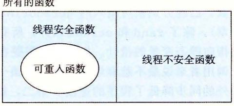
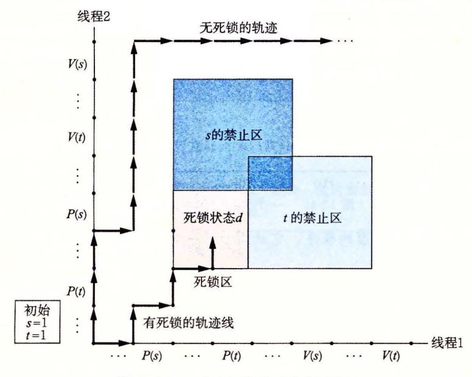
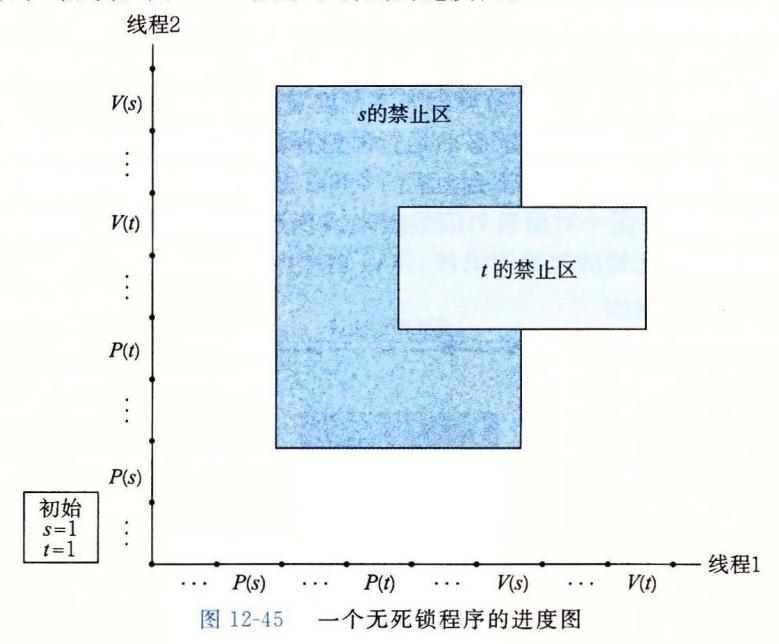
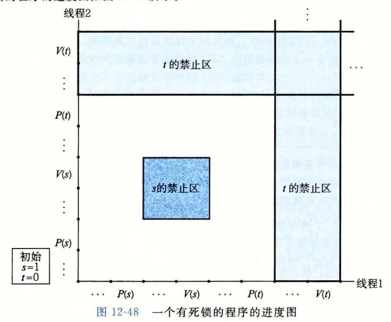
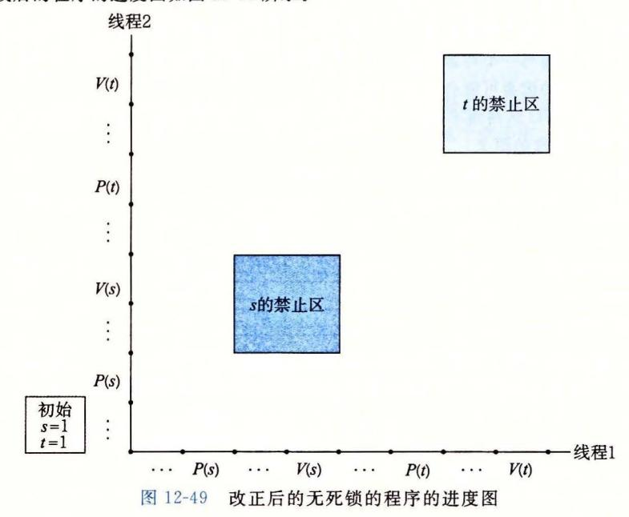
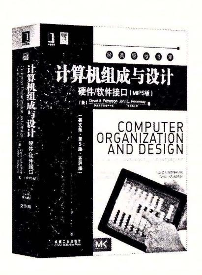
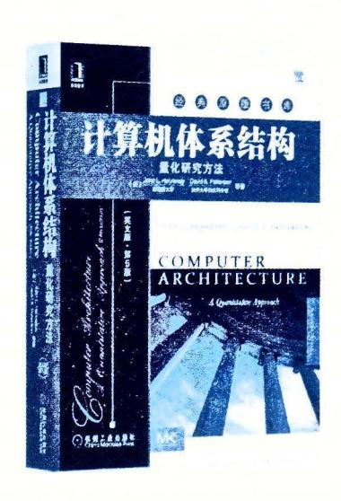
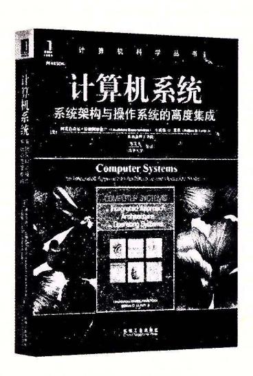

## 12. 7 其他并发问题

你可能已经注意到了,一旦我们要求同步对共享数据的访问,那么事情就变得复杂得 多了 迄今为止,我们已经看到了用千互斥和生产者-消费者同步的技术,但这仅仅是冰 山一角 同步从根本上说是很难的问题,它引出了在普通的顺序程序中不会出现的问题 小节是关千你在写并发程序时需要注意的一些问题的(非常不完整的)综述。为了让事 情具体化,我们将以线程为例描述讨论。不过要记住,这些典型问题是任何类型的并发流 操作共享资源时都会出现的。

## 12. 7. 1 线程安全

当用线程编 程序时,必须小心地编写那些具有称为线程安全性 (thread safety) 属性 的函数。一个函数被称为线程安全的 (thread-safe) ,当且仅当被多个并发线程反复地调用 时,它会 直产 正确的结果。如果一个函数不是线程安全的,我们就说它是线程不安全 (thread-unsafe)

我们能够定义出四个(不相交的)线程不安全函数类:

类:不保护共享变量的函数 我们在图 <sup>12</sup> <sup>16</sup> thread 函数中就已经遇到了这样 的问题,该函数对 个未受保护的全局计数器变 将这类线程不安全函数变成线程安 全的,相对而言比较容易:利用像 操作这样的同步操作来保护共享的变量。这个方法 的优点是在调用程序中不需要做任何修改 缺点是同步操作将减慢程序的执行时间

类:保持跨越多个调用的状态的函数 一个伪随机数生成器是这类线程不安全函 数的简单例子 请参考图 12-37 中的伪随机数生成器程序包。 rand 函数是线程不安全的, 因为当前调用的结果依赖于前次调用的中间结果。当调用 srand rand 设置了 个种子 后,我们从一个单线程中反复地调用 rand, 能够预期得到一个可重复的随机数字序列 然而,如果多线程调用 rand 函数,这种假设就不再成立了。

```
code/condrand.c 
    unsigned next_seed = 1; 
3 I* rand - return pseudorandom integer in the range O.. 32767 *I 
4unsigned rand(void) 
6 next_seed = next_seed*1103515245 + 12543; 
7 return (unsigned)(next_seed»16) % 32768; 
8 } 
10 I* srand - set the in.itial seed for rand() *I 
11 void srand(unsigned new_seed) 
12 { 
13 next_seed = new_seed; 
14 } 
                                                        code/condrand. c
```

<sup>12</sup> ~3 个线程不安全的伪随机数生成器 基于 [61

使得像 rand 这样的函数线程安全的唯一方式是重写它,使得它不再使用任何 static 数据,而是依靠调用者在参数中传递状态信息 这样做的缺点是,程序员现在还要被迫修

改调用程序中的代码。在一个大的程序中,可能有成百上千个不同的调用位置,做这样的 修改将是非常麻烦的,而且容易出错。

类:返回指向静态变量的指针的函数。某些函数,例如 me gethos byname, 将计算结果放在一个 static 变量中,然后返回一个指向这个变量的指针。如果我 们从并发线程中调用这些函数,那么将可能发生灾难,因为正在被一个线程使用的结果会 被另一个线程悄悄地覆盖了。

有两种方法来处理这类线程不安全函数。一种选择是重写函数,使得调用者传递存放结 果的变量的地址。这就消除了所有共享数据,但是它要求程序员能够修改函数的源代码。

如果线程不安全函数是难以修改或不可能修改的(例如,代码非常复杂或是没有源代 码可用),那么另外一种选择就是使用加锁-复制 (lock-and copy) 技术。基本思想是将线程 不安全函数与互斥锁联系起来。在每一个调用位置,对互斥锁加锁,调用线程不安全函 数,将函数返回的结果复制到一个私有的内存位置,然后对互斥锁解锁。为了尽可能地减 少对调用者的修改,你应该定义一个线程安全的包装函数,它执行加锁-复制,然后通过 调用这个包装函数来取代所有对线程不安全函数的调用 例如,图 12-38 给出了 me 一个线程安全的版本,利用的就是加锁-复制技术。

```
code/condctime-ts. c 
    char *ctime_ts(const time_t *timep, char *privatep) 
2 { 
3 char *sharedp; 
4 
5P(&mutex); 
6sharedp = ctime(timep); 
7strcpy(privatep, sharedp); I* Copy string from shared to private *I 
8 V(&mutex); 
9return privatep; 
10 } 
                                                               code/condctime-ts.c
```

<sup>38</sup> 标准库函数 ctime 的线程安全的包装函数。使用加锁-复制技术 调用 个第 类线程不安全函数

类:调用线程不安全函数的函数。如果函数 调用线程不安全函数 g, 那么 是线程不安全的吗?不一定 如果 是第 类函数,即依赖千跨越多次调用的状态,那么 也是线程不安全的,而且除了重写 以外,没有什么办法。然而,如果 是第 类或者 类函数,那么只要你用 个互斥锁保护调用位置和任何得到的共享数据, 仍然可能 是线程安全的 在图 12-38 中我们看到了一个这种情况很好的示例,其中我们使用加锁- 复制编写了一个线程安全函数,它调用了 个线程不安全的函数

## 12 . 7 . 2 可重入性

有一类重要的线程安全函数,叫做可重入函 (reentrant function) ,其特点在于它们具有这 样一种属性:当它们被多个线程调用时,不会引 用任何共享数据。尽管线程安全和可重入有时会 (不正确地)被用做同义词,但是它们之间还是有 <sup>39</sup> 可重入函数、线程安全函数和线程 清晰的技术差别,值得留意。图 12-39 展示了可 不安全函数之间的集合关系

所有的函数



重人函数、线程安全函数和线程不安全函数之间的集合关系。所有函数的集合被划分成不相交的线程安全和线程不安全函数集合。可重人函数集合是线程安全函数的一个真子集。

可重人函数通常要比不可重人的线程安全的函数高效一些,因为它们不需要同步操作。更进一步来说,将第 2 类线程不安全函数转化为线程安全函数的唯一方法就是重写它,使之变为可重人的。例如,图 12-40 展示了图 12-37 中 rand 函数的一个可重人的版本。关键思想是我们用一个调用者传递进来的指针取代了静态的 next 变量。

```
code/conc/rand-r.c

/* rand_r - return a pseudorandom integer on 0..32767 */\nint rand_r(unsigned int *nextp)

{
    *nextp = *nextp * 1103515245 + 12345;
    return (unsigned int)(*nextp / 65536) % 32768;
}

code/conc/rand-r.c
```

图 12-40 rand r: 图 12-37 中的 rand 函数的可重人版本

检查某个函数的代码并先验地断定它是可重人的,这可能吗?不幸的是,不一定能这样。如果所有的函数参数都是传值传递的(即没有指针),并且所有的数据引用都是本地的自动栈变量(即没有引用静态或全局变量),那么函数就是显式可重入的(explicitly reentrant),也就是说,无论它是被如何调用的,都可以断言它是可重人的。

然而,如果把假设放宽松一点,允许显式可重入函数中一些参数是引用传递的(即允许它们传递指针),那么我们就得到了一个<mark>隐式可重入的</mark>(implicitly reentrant)函数,也就是说,如果调用线程小心地传递指向非共享数据的指针,那么它是可重入的。例如,图 12-40 中的 rand r函数就是隐式可重入的。

我们总是使用术语可重入的(reentrant)既包括显式可重人函数也包括隐式可重入函数。然而,认识到<mark>可重人性有时既是调用者也是被调用者的属性,并不只是被调用者单独的属性</mark>是非常重要的。

№ 练习题 12. 12 图 12-38 中的 ctime ts 函数是线程安全的, 但不是可重入的。请解释说明。

#### 12.7.3 在线程化的程序中使用已存在的库函数

大多数 Linux 函数,包括定义在标准 C 库中的函数(例如 malloc、free、realloc、printf和 scanf)都是线程安全的,只有一小部分是例外。图 12-41 列出了常见的例外。(参考[110]可以得到一个完整的列表。) strtok 函数是一个已弃用的(不推荐使用)函数。asctime、ctime 和 localtime 函数是在不同时间和数据格式间相互来回转换时经常使用的函数。gethostbyname、gethostbyaddr 和 inet\_ntoa 函数是已弃用的网络编程函数,已经分别被可重人的 getaddrinfo、getnameinfo 和 inet\_ntop 函数取代(见第 11章)。除了 rand 和 strtok 以外,所有这些线程不安全函数都是第 3 类的,它们返回一个指向静态变量的指针。如果我们需要在一个线程化的程序中调用这些函数中的某一个,对调用者来说最不惹麻烦的方法是加锁-复制。然而,加锁-复制方法有许多缺点。首先,额外的同步降低了程序的速度。第二,像 gethostbyname 这样的函数返回指向复杂结构的结构的指针,要复制整个结构层次,需要深层复制(deep copy)结构。第三,加锁-复制方法对像 rand 这样依赖跨越调用的静态状态的第 2 类函数并不有效。

| 线程不安全函数       | 线程不安全类 | Linux 线程安全版本    |
|---------------|--------|-----------------|
| rand          | 2      | rand_r          |
| strtok        | 2      | strtok_r        |
| asctime       | 3      | asctime_r       |
| ctime         | 3      | ctime_r         |
| gethostbyaddr | 3      | gethostbyaddr_r |
| gethostbyname | 3      | gethostbyname_r |
| inet_ntoa     | 3      | (无)             |
| localtime     | 3      | localtime_r     |

图 12-41 常见的线程不安全的库函数

因此,Linux 系统提供大多数线程不安全函数的可重人版本。<mark>可重人版本的名字总是以"\_r"后缀结尾。</mark>例如,asctime 的可重人版本就叫做 asctime\_r。我们建议尽可能地使用这些函数。

### 12.7.4 竞争

当一个程序的正确性依赖于一个线程要在另一个线程到达 y 点之前到达它的控制流中的 x 点时,就会发生竞争(race)。 通常发生竞争是因为程序员假定线程将按照某种特殊的轨迹线穿过执行状态空间,而忘记了另一条准则规定:多线程的程序必须对任何可行的轨迹线都正确工作。

例子是理解竞争本质的最简单的方法。让我们来看看图 12-42 中的简单程序。主线程创建了四个对等线程,并传递一个指向一个唯一的整数 ID 的指针到每个线程。每个对等线程复制它的参数中传递的 ID 到一个局部变量中(第 22 行),然后输出一个包含这个 ID 的信息。它看上去足够简单,但是当我们在系统上运行这个程序时,我们得到以下不正确的结果:

```
linux> ./race
Hello from thread 1
Hello from thread 3
' Hello from thread 2
Hello from thread 3
```

- code/conc/race.c

```
1
    /* WARNING: This code is buggy! */
2
   #include "csapp.h"
    #define N 4
3
    void *thread(void *vargp);
7
     int main()
     {
8
         pthread_t tid[N];
9
         int i:
10
11
         for (i = 0; i < N; i++)
12
            Pthread_create(&tid[i], NULL, thread, &i);
13
         for (i = 0; i < N; i++)
             Pthread_join(tid[i], NULL);
         exit(0);
     }
17
```

图 12-42 一个具有竞争的程序

```
18
     /* Thread routine */
19
     void *thread(void *vargp)
20
     {
21
22
          int myid = *((int *)vargp);
          printf("Hello from thread %d\n", myid);
23
          return NULL;
24
     7
25

    code/conc/race.c
```

图 12-42 (续)

问题是由每个对等线程和主线程之间的竞争引起的。你能发现这个竞争吗?下面是发生的情况。当主线程在第13行创建了一个对等线程,它传递了一个指向本地栈变量i的指针。在此时,竞争出现在下一次在第12行对i加1和第22行参数的间接引用和赋值之间。如果对等线程在主线程执行第12行对i加1之前就执行了第22行,那么myid变量就得到正确的ID。否则,它包含的就会是其他线程的ID。令人惊慌的是,我们是否得到正确的答案依赖于内核是如何调度线程的执行的。在我们的系统中它失败了,但是在其他系统中,它可能就能正确工作,让程序员"幸福地"察觉不到程序的严重错误。

为了消除竞争,我们可以动态地为每个整数 ID 分配一个独立的块,并且传递给线程例程一个指向这个块的指针,如图 12-43 所示(第 12~14 行)。请注意线程例程必须释放这些块以避免内存泄漏。

```
    code/conc/norace.c

     #include "csapp.h"
1
2
     #define N 4
     void *thread(void *vargp);
5
     int main()
6
7
     {
8
         pthread_t tid[N];
         int i, *ptr;
9
10
11
         for (i = 0; i < N; i++) {
              ptr = Malloc(sizeof(int));
12
              *ptr = i;
13
14
              Pthread_create(&tid[i], NULL, thread, ptr);
15
         for (i = 0; i < N; i++)
              Pthread_join(tid[i], NULL);
17
         exit(0);
18
     }
19
20
21
     /* Thread routine */
     void *thread(void *vargp)
22
23
         int myid = *((int *)vargp);
24
         Free(vargp);
25
26
         printf("Hello from thread %d\n", myid);
         return NULL;
27
     }
28
                                                           code/conc/norace.c
```

图 12-43 图 12-42 中程序的一个没有竞争的正确版本

当我们在系统上运行这个程序时,现在得到了正确的结果:

linux> ./norace

Hello from thread O

Hello from thread 1

Hello from thread 2

Hello from thread 3

禁习题 12.13 在图 12-43 中,我们可能想要在主线程中的第 14 行后立即释放已分配的内存块,而不是在对等线程中释放它。但是这会是个坏注意。为什么?

#### 练习题 12.14

- A. 在图 12-43 中, 我们通过为每个整数 ID 分配一个独立的块来消除竞争。给出一个不调用 malloc 或者 free 函数的不同的方法。
- B. 这种方法的利弊是什么?

### 12.7.5 死锁

信号量引入了一种潜在的令人厌恶的运行时错误,叫做<mark>死锁(deadlock),它指的是一组线程被阻塞了,等待一个永远也不会为真的条件。</mark>进度图对于理解死锁是一个无价的工具。例如,图 12-44 展示了一对用两个信号量来实现互斥的线程的进程图。从这幅图中,我们能够得到一些关于死锁的重要知识:



图 12-44 一个会死锁的程序的进度图

- <mark>程序员使用 P 和 V 操作顺序不当,以至于两个信号量的禁止区域重叠。</mark>如果某个执行轨迹线碰巧到达了死锁状态 d,那么就不可能有进一步的进展了,因为重叠的禁止区域阻塞了每个合法方向上的进展。换句话说,程序死锁是因为每个线程都在等待其他线程执行一个根不可能发生的 V 操作。
- <u>重叠的禁止区域引起了一组称为死锁区域(deadlock region)的状态</u>。如果一个轨迹 线碰巧到达了一个死锁区域中的状态,那么死锁就是不可避免的了。轨迹线可以进 人死锁区域,但是它们不可能离开。

·死锁是一个相当困难的问题,因为它不总是可预测的 一些幸运的执行轨迹线将绕开死 锁区域,而其他的将会陷入这个区域。图 12-44 展示了每种情况的一个示例。对千程序 员来说,这其中隐含的着实令人惊慌。你可以运行 个程序 <sup>1000</sup> 次不出任何问题,但是 下一次它就死锁了。或者程序在一台机器上可能运行得很好,但是在另外的机器上就会 死锁。最糟糕的是,错误常常是不可重复的,因为不同的执行有不同的轨迹线。

程序死锁有很多原因,要避免死锁一般而言是很困难的。然而,当使用二元信号量来 实现互斥时,如图 12-44 所示,你可以应用下面的简单而有效的规则来避免死锁:

互斥锁加锁顺序规则:给定所有互斥操作的一个全序,如果每个线程都是以一种顺序 获得互斥锁并以相反的顺序释放,那么这个程序就是无死锁的

例如,我们可以通过这样的方法来解决图 12-44 中的死锁问题:在每个线程中先对 加锁,然后再对 加锁。图 12-45 展示了得到的进度图。



练习题 <sup>12</sup> 15 思考下面的程序,它试图使用一对信号量来实现互斥。

初始时: s = 1, t = 0.

线程 线程 P(s); P(s); V(s); V(s); P(t); P(t); V(t); V(t);

- A. 画出这个程序的进度图。
- B. 它总是会死锁吗?
- c. 如果是,那么对初始信号量的值做哪些简单的改变 就能消除这种潜在的死锁呢?
- D. 画出得到的无死锁程序的进度图

## 12. 8 小结

一个并发程序是由在时间上 重叠的一组逻辑流组成的。在这 一章中,我们学习了 三种不 同的构建并 发程序的机制:进程、 多路复用和线程 我们以一个并发网络服务器作为贯穿全章的应用程序

进程是由内核自动调度的,而且因为它们有各自独立的虚拟地址空间,所以要实现共享数据,必须 要有显式的 IPC 机制。事件驱动程序创建它们自己的并发逻辑流,这些逻辑流被模型化为状态机,用 I/0 多路复用来显式地调度这些流。因为程序运行在一个单一进程中,所以在流之间共享数据速度很快而 且很容易。线程是这些方法的混合。同基于进程的流一样,线程也是由内核自动调度的。同基千 I/0 路复用的流一样,线程是运行在一个单一进程的上下文中的,因此可以快速而方便地共享数据

无论哪种并发机制,同步对共享数据的并发访问都是一个困难的问题。提出对信号量的 操作 就是为了帮助解决这个问题。信号量操作可以用来提供对共享数据的互斥访问,也对诸如生产者-消费者 程序中有限缓冲区和读者-写者系统中的共享对象这样的资源访问进行调度。一个并发预线程化的 echo 服务器提供了信号摄使用场景的很好的例子。

并发也引入了其他一些困难的问题。被线程调用的函数必须具有 种称为线程安全的属性。我们定 义了四类线程不安全的函数,以及一些将它们变为线程安全的建议。可重入函数是线程安全函数的一个 真子集,它不访问任何共享数据。可重入函数通常比不可重入函数更为有效,因为它们不需要任何同步 原语。竞争和死锁是并发程序中出现的另一些困难的问题。当程序员错误地假设逻辑流该如何调度时, 就会发生竞争。当一个流等待一个永远不会发生的事件时,就会产生死锁。

## 参考文献说明

信号量操作是 Dijkstra 提出的 [31] 。进度图的概念是 Coffman [23] 提出的,后来由 Carson Reynolds [16] 形式化的。 Courtois 等人 [25] 提出了读者-写者间题。操作系统教科书更详细地描述了经典的同 步问题,例如哲学家进餐问题、打睦睡的理发师问题和吸烟者问题 [102, 106, 113] Butenhof 的书 <sup>15</sup> Posix 线程接口有全面的描述。 Birrell [7] 的论文对线程编程以及线程编程中容易遇到的问题做了 很好的介绍。 Reinders 的书 [90] 描述了 CIC+ +库,简化了线程化程序的设计和实现。有一些课本讲述了 多核系统上并行编程的基础知识[4 7, 71] Pugh 描述了 Java 线程通过内存进行交互的方式的缺陷,并 提出了替代的内存模型 [88] Gustafson 提出了替代强扩展的弱扩展加速模型 [43]

## 家庭作业

- 12 16 编写 hello.c (图 12-13) 的一个版本,它创建和回收 个可结合的对等线程,其中 是一个命令 行参数。
- 12 17 A. 12-46 中的程序有一个 bug 。要求线程睡眠一秒钟,然后输出一个字符串。然而,当在我们 的系统上运行它时,却没有任何输出。为什么?

```
code/condhel/obug.c 
1 I* WARNING: This code is buggy! *I 
2 #include "csapp.h" 
3 void *thread(void *vargp); 
4 
5int main() 
6 { 
7 pthread_t tid; 
8 
9Pthread_create(&tid, NULL, thread, NULL); 
10 exit(O); 
11 } 
12 
13 I* Thread routine *I 
14 void *thread (void *vargp) 
15 { 
16 Sleep(!); 
17 printf ("Hello, world! \n") ; 
18 return NULL; 
19 } 
                                                       code/conclhellobug.c
```

- B. 你可以通过用两个不同的 Pthreads 函数调用中的一个替代第 <sup>10</sup> 行中的 exit 函数来改正这个 错误。选哪一个呢?
- 12 . 18 用图 12-21 中的进度图,将下面的轨迹线分类为安全或者不安全的。

A. H2, L2, U2, H1, L1, S2, U1, S1, T1, T2

B. H 2, H1, L1, U1, S1, L2, T1, U2, S2, T2

C. H1, L1, H 2, L2, U2, S2, U1, S1, T1, T2

- \*\* 12 19 12-26 中第一类读者-写者问题的解答给予读者的是有些弱的优先级,因为读者在离开它的临 界区时,可能会重启一个正在等待的写者,而不是一个正在等待的读者。推导出一个解答,它给 予读者更强的优先级,当写者离开它的临界区的时候,如果有读者正在等待的话,就总是重启一 个正在等待的读者。
- \*\*\* 12 20 考虑读者-写者问题的一个更简单的变种,即最多只有 个读者。推导出一个解答,给予读者和 写者同等的优先级,即等待中的读者和写者被赋予对资源访问的同等的机会。提示:你可以用一 个计数信号量和 个互斥锁来解决这个问题。
- :: 12 . 21 推导出第二类读者-写者问题的一个解答,在此写者的优先级高于读者。
- •• 12 . 22 检查一下你对 select 函数的理解,请修改图 12-6 中的服务器,使得它在主服务器的每次迭代中 最多只回送 个文本行。
- •• 12 23 12-8 中的事件驱动并发 echo 服务器是有缺陷的,因为一个恶意的客户端能够通过发送部分的 文本行,使服务器拒绝为其他客户端服务。编写一个改进的服务器版本,使之能够非阻塞地处理 这些部分文本行。
- 12 . 24 RIO I/0 包中的函数 (10.5 节)都是线程安全的。它们也都是可重入函数吗?
- 12 . 25 在图 12-28 中的预线程化的并发 echo 服务器中,每个线程都调用 echo\_cnt 函数(图 12-29) echo\_cnt 是线程安全的吗?它是可重入的吗?为什么是或为什么不是呢?
- \*\*\* 12 26 用加锁-复制技术来实现 gethostbyname 的一个线程安全而又不可重入的版本,称为 ge host byname\_ts 。一个正确的解答是使用由互斥锁保护的 hostent 结构的深层副本。
- •• 12 27 些网络编程的教科书建议用以下的方法来读和写套接字:和客户端交互之前,在同一个打开的 已连接套接字描述符上,打开两个标准 I/0 流,一个用来读,一个用来写:

FILE \*fpin, \*fpout;

fpin = fdopen(sockfd, "r"); fpout = fdopen(sockfd, "w");

当服务器完成和客户端的交互之后,像下面这样关闭两个流:

fclose(fpin); fclose(fpout);

然而,如果你试图在基千线程的并发服务器上尝试这种方式,将制造一个致命的竞争条件。 请解释。

• 12 . 28 在图 12-45 中,将两个 操作的顺序交换,对程序死锁是否有影响?通过画出四种可能情况的进 度图来证明你的答案:

| 情况   |      | 情况   |      | 情况   |      | 情况   |      |
|------|------|------|------|------|------|------|------|
| 线程   | 线程   | 线程   | 线程   | 线程   | 线程   | 线程   | 线程   |
| P(s) | P(s) | P(s) | P(s) | P(s) | P(s) | P(s) | P(s) |
| P(t) | P(t) | P(t) | P(t) | P(t) | P(t) | P(t) | P(t) |
| V(s) | V(s) | V(s) | V(t) | V(t) | V(s) | V(t) | V(t) |
| V(t) | V(t) | V(t) | V(s) | V(s) | V(t) | V(s) | V(s) |

• 12 . 29 下面的程序会死锁吗?为什么会或者为什么不会?

```
初始时: a= 1, b = 1, c = 1 
线程 线程2:
P(a); P(c); 
P(b); P(b); 
V(b); V(b); 
P(c); V(c); 
V(c); 
V(a);
```

\* 12 30 考虑下面这个会死锁的程序。

```
初始时: a= 1, b = 1, c = 1 
线程 线程 线程3:
P(a); P(c); P(c); 
P(b); P(b); V(c); 
V(b); V(b); P(b); 
P(c); V(c); P(a); 
V(c); P(a); V(a); 
V(a); V(a); V(b);
```

- A. 列出每个线程同时占用的一对互斥锁。
- B. 如果 a<b<c, 那么哪个线程违背了互斥锁加锁顺序规则?
- C. 对千这些线程,指出一个新的保证不会发生死锁的加锁顺序。
- ·: 12 . 31 实现标准 l/0 函数 fgets 的一个版本,叫做 tfge s, 假如它在 秒之内没有从标准输入上接收到 一个输入行,那么就超时,并返回一个 NULL 指针。你的函数应该实现在一个叫做 tfgets-proc.c 的包中,使用进程、信号和非本地跳转。它不应该使用 Linux alarm 函数。使用图 12-47 中的驱 动程序测试你的结果。

```
1 #include "csapp.h" 
3char *tfgets(char *S, int size, FILE *stream); 
4 
s int ma 立()
6 { 
        char buf [MAXLINE]; 
8 
9if (tfgets(buf, MAXLINE, stdin) == NULL) 
10 printf("BOOM!\n"); 
11 else 
12 printf("%s", buf); 
13 
74 exit(O); 
15 } 
                                                 code/condtfgets-main. c 
                                                 code/condtfgets-main.c
```

2-47 家庭作业题 12. 31~12. <sup>33</sup> 的驱动程序

- \*/ 12. 32 使用 select 函数来实现练习题 12. <sup>31</sup> tfgets 函数的一个版本。你的函数应该在一个叫做七fgets-select. 的包中实现。用练习题 12. <sup>31</sup> 中的驱动程序测试你的结果。你可以假定标准输入 被赋值为描述符
- \*/ 12 . 33 实现练习题 12. <sup>31</sup> tfgets 函数的一个线程化的版本。你的函数应该在一个叫做七fge sthread.c 的包中实现。用练习题 12.31 中的驱动程序测试你的结果。
- \*/ 12. 34 编写一个 NXM 矩阵乘法核心函数的并行线程化版本。比较它的性能与顺序的版本的性能。
- \*/ 12 . 35 实现 个基千进程的 TINY Web 服务器的并发版本。你的解答应该为每一个新的连接请求创建一 个新的子进程。使用一个实际的 Web 浏览器来测试你的解答。
- \*.\* 12 36 实现一个基千 1/0 多路复用的 TINY Web 服务楛的并发版本。使用一个实际的 Web 浏览器来测 试你的解答。

- •:12. 37 实现一个基于线程的 TINY Web 服务器的并发版本。你的解答应该为每一个新的连接请求创建一 个新的线程。使用一个实际的 Web 浏览器来测试你的解答。
- :! 12. 38 实现一个 NY Web 务器的并发预线程化的版本。你的解答应该根据 当前的负载,动 态地增加 或减少线程的数目。 个策略是当缓冲区变满时,将线程数匮翻倍,而当缓冲区变为空时,将线 程数目减半。使用一个实际的 Web 浏览器来测试你的解答。
- :! 12. 39 Web 代理是 一个在 服务器和浏览器之间扮演中间角色的程序。浏览器不是直接连接服务器 以获取网页 而是与代理连接,代理再将请求转发给服务器。当服务器响应代理时,代理将响应 发送给浏览器。为了这个试验,请你编写一个简单的可以过滤和记录请求的 Web 代理:
  - A. 试验的第一部分中,你要建 以接收请求的代理,分析 HTTP, 转发请求给服务器,并且返 回结果给浏览器 你的代理将所有请求的 URL 记录在磁盘上 个日志文件中,同时它还要阻 塞所有对包含在磁盘上一个过滤文件中的 URL 的请求。
  - B. 试验的第二部分中,你要升级代理,它通过派生一个独立的线程来处理每一个请求,使得代 理能够一次处理多个打开的连接。当你的代理在等待远程服务器响应一个请求使它能服务于 一个浏览器时,它应该可以处理来自另一个浏览器未完成的请求。

使用一个实际的 Web 浏览器来检验你的解答。

## 练习题答案

- 12. 1 当父进程派生子进程时,它得到 个已连接描述符的副本,并将相关文件表中的引用计数从 加到 当父进程关闭它的描述符副本时,引用计数就从 减少到 。因为内核不会关闭一个文 件,直到文件表中它的引用计数值变为零,所以子进程这边的连接端将保持打开。
- 12. 2 当一个进程因为某种原因终止时,内核将关闭所有打开的描述符。因此 ,当子进程退出时,它的 已连接文件描述符的副本也将被自动关闭。
- 12 . 3 回想 下,如果一个从描述符中读 个字节的请求不会阻塞,那么这个描述符就准备好可以读了。 假如 EOF 在一个描述符上为 ,那么描述符也准备好可读了,因为读操作将立即返回一个零返回 码,表示 EOF 。因此,键入 Ctrl+D 会导致 select 函数返回,准备好的集合中有描述符
- 12. 4 因为变械 pool .read\_set 既作为输入参数 也作为输出 参数,所以我 们在每一次调用 sel ect 之前 都重新初始化它 在输入时,它包含读集合 在输出,它包含准备好的集合
- 12. 5 因为线程运行在同一个进程中,它们都共享相同的描述符表 无论有多少线程使用这个已连接描 述符,这个已连接描述符的文件表的引用计数都等于 。因此,当我们用完它时, cl se 作就足以释放与这个已连接描述符相关的内存资源了。
- 12. 6 这里的主要的思想是,栈变最是私有的,而全局和静态变批是共享的。诸如 cnt 这样的静态变量 有点 小麻烦,因为共享是限制在它们的函数范围内的一一在这个例子中 ,就是线程例程。 A. 下面就是这张表

| 变量实例      | 被主线程引用? | 被对等线程<br>引用? | 被对等线程<br>引用? |  |
|-----------|---------|--------------|--------------|--|
| ptr       |         |              | El           |  |
| cnt       |         |              |              |  |
| i.m       |         |              |              |  |
| msgs.m    |         |              |              |  |
| my i d.pO |         |              |              |  |
| myid.pl   |         |              |              |  |

#### 说明:

- ptr: 一个被主线程写和被对等线程读的全局变批。
- cnt 个静态变 ,在 内存中只有一个实例,被两个对等线程读和写
- i.m: 一个存储在主线程栈中的本 地自动变最 。虽然它的值被传递给对等线程,但是对 等线 程也绝不会在栈中引用它,因此它不是共享的。

- msgs.m 一个存储在主线程栈中的本地自动变鼠,被两个对等线程通过 ptr 间接地引用。
- my迈. my 迈. 1: 一个本地自动变量的实例,分别驻留在对等线程 和线程 的栈中。

变量 ptr cnt msgs 被多于 一个线程引用,因此它们是共享的。

12. 7 这里的重要思想是,你不能假设当内核调度你的线程时会如何选择顺序。

| 步骤 | 线程 | 指令 |   |   | cnt |
|----|----|----|---|---|-----|
| 1  | 1  | HI |   |   |     |
| 2  | 1  | L1 |   |   |     |
| 3  | 2  | H2 |   |   |     |
| 4  | 2  | L2 |   |   |     |
| 5  | 2  | U2 |   | 1 |     |
| 6  | 2  | S2 |   | 1 | 1   |
| 7  | 1  | U1 | 1 |   | 1   |
| 8  | 1  | S1 | 1 |   | 1   |
| 9  | 1  | T1 | 1 |   | 1   |
| 10 | 2  | T2 |   | 1 | 1   |

变扯 cnt 最终有一个不正确的值

- 12. 8 这道题简单地测试你对进度图中安全和不安全轨迹线的理解 这样的轨迹线绕开了临界 区,是安全的,会产生正确的结果。
  - A. H1, L1, U1, S1, H,, L,, U,. S,, T,, T1 :安全的
  - B. H,, L,, H1, L1, U1, S1, T1, U,, S,, T, :不安全的
  - C. H1, H,, L,, U,, S,, L1, U1, S1, T1, T, :安全的
- 12. 9 A.p=l, c=l, n>l: 是,互斥锁是需要的,因为生产者和消费者会并发地访间缓冲区。
  - B. p=l, c=l, n=l: 不是,在这种情况中不需要互斥锁信号量,因为 个非空的缓冲区就等于 满的缓冲区。当缓冲区包含一个项目时,生产者就被阻塞了。当缓冲区为空时,消费者就被阻 塞了。所以在任意时刻,只有一个线程可以访问缓冲区,因此不用互斥锁也能保证互斥
  - C. p>L c>L n=l: 不是,在这种情况中,也不需要互斥锁,原因与前面 种情况相同。
- 12. 10 假设一个特殊的信号量实现为每一个信号量使用了一个 LIFO 的线程栈 当一个线程在 操作中 阻塞在一个信号篮上,它的 ID 就被压入栈中 类似地, 操作从栈中弹出栈顶的线程 ID, 并重 启这个线程。根据这个栈的实现,一个在它的临界区中的竞争的写者会简单地等待,直到在它释 放这个信号量之前另一个写者阻塞在这个信号量上 在这种场景中,当两个写者来回地传递控制 权时,正在等待的读者可能会永远地等待下去。

注意,虽然用 FIFO 队列而不是用 LIFO 更符合直觉,但是使用 LIFO 的栈也是对的,而且也没 有违反 操作的语义。

12. 11 这道题简单地检查你对加速比和并行效率的理解:

| 线程 (t)   | I    | 2   | 4   |
|----------|------|-----|-----|
| (p)      | I    | 2   | 4   |
| 运行时间(飞)  | 12   | 8   | 6   |
| 加速比 (SP) | I    | 1.5 | 2   |
| 效率 (EP)  | 100% | 75% | 50% |

- 12. 12 ctime\_ts 函数不是可重入函数,因为每次调用都共享相同的由 gethostbyname 函数返回的 atic 量。然而,它是线程安全的,因为对共享变量的访问是被 操作保护的,因此是互斥的。
- 12. 13 如果在第 <sup>14</sup> 行调用了 pthread\_crea 之后,我们立即释放块,那么将引入一个新的竞争,这 次竞争发生在主线程对 free 的调用和线程例程中第 <sup>24</sup> 行的赋值语句之间。
- 12 . 14 A. 另一种方法是直接传递整数 i, 而不是传递 个指向 的指针:

for (i <sup>=</sup>O; i < N; i++) Pthread\_create(&tid[i], NULL, thread, (void \*)i); 在线程例程中,我们将参数强制转换成一个 int 类型,并将它赋值给 myid: int myid = (int) vargp;

- B. 优点是它通过消除对 malloc free 的调用降低了开销。 个明显的缺点是,它假设指针至 少和 int 一样大。即便这种假设对千所有的现代系统来说都为真,但是它对于那些过去遗留 下来的或今后的系统来说可能就不为真了。
- 12. 15 A. 原始的程序的进度图如图 12-48 所示。



- B. 因为任何可行的轨迹最终都陷入死锁状态中,所以这个程序总是会死锁。
- C. 为了消除潜在的死锁,将二元信号蜇 初始化为 而不是
- D. 改成后的程序的进度图如图 <sup>12</sup> <sup>49</sup> 所示。



A P P E N D I X A

## 错误处理

程序员应该总是检查系统级函数返回的错误代码。有许多细微的方式会导致出现错误,只有使用内核能够提供给我们的状态信息才能理解为什么有这样的错误。不幸的是,程序员往往不愿意进行错误检查,因为这使他们的代码变得很庞大,将一行代码变成一个多行的条件语句。错误检查也是很令人迷惑的,因为不同的函数以不同的方式表示错误。

在编写本书时,我们面临类似的问题。一方面,我们希望代码示例阅读起来简洁简单;另一方面,我们又不希望给学生们一个错误的印象,以为可以省略错误检查。为了解决这些问题,我们采用了一种基于错误处理包装函数(error-handling wrapper)的方法,这是由 W. Richard Stevens 在他的网络编程教材[110]中最先提出的。

其思想是,给定某个基本的系统级函数 foo,我们定义一个有相同参数、只不过开头字母大写了的包装函数 Foo。包装函数调用基本函数并检查错误。如果包装函数发现了错误,那么它就打印一条信息并终止进程。否则,它返回到调用者。注意,如果没有错误,包装函数的行为与基本函数完全一样。换句话说,如果程序使用包装函数运行正确,那么我们把每个包装函数的第一个字母小写并重新编译,也能正确运行。

包装函数被封装在一个源文件(csapp.c)中,这个文件被编译和链接到每个程序中。一个独立的头文件(csapp.h)中包含这些包装函数的函数原型。

本附录给出了一个关于 Unix 系统中不同种类的错误处理的教程,还给出了不同风格的错误处理包装函数的示例。csapp.h 和 csapp.c 文件可以从 CS: APP 网站上获得。

## .A. 1 Unix 系统中的错误处理

本书中我们遇到的系统级函数调用使用三种不同风格的返回错误: Unix 风格的、 Posix 风格的和 GAI 风格的。

#### 1. Unix 风格的错误处理

像 fork 和 wait 这样 Unix 早期开发出来的函数(以及一些较老的 Posix 函数)的函数返回值既包括错误代码,也包括有用的结果。例如,当 Unix 风格的 wait 函数遇到一个错误(例如没有子进程要回收),它就返回一1,并将全局变量 errno 设置为指明错误原因的错误代码。如果 wait 成功完成,那么它就返回有用的结果,也就是回收的子进程的PID。Unix 风格的错误处理代码通常具有以下形式:

```
if ((pid = wait(NULL)) < 0) {
    fprintf(stderr, "wait error: %s\n", strerror(errno));
    exit(0);
}</pre>
```

strerror 函数返回某个 errno 值的文本描述。

#### 2. Posix 风格的错误处理

许多较新的 Posix 函数,例如 Pthread 函数,只用返回值来表明成功(0)或者失败(非0)。任何有用的结果都返回在通过引用传递进来的函数参数中。我们称这种方法为 Posix

风格的错误处理。例如, Posix 风格的 pthread\_create 函数用它的返回值来表明成功或 者失败,而通过引用将新创建的线程的 ID (有用的结果)返回放在它的第一个参数中 Posix 风格的错误处理代码通常具有以下形式:

```
1 if ((retcode = pthread_create(&tid, NULL, thread, NULL)) != 0) { 
2fprintf(stderr, "pthread_create error: %s\n", strerror(retcode)); 
3exit(O); 
4 }
```

strerror 函数返回 retcode 某个值对应的文本描述。

## 3. GAi 风格的错误处理

getaddrinfo(GAI) getnameinfo 函数成功时返回 ,失败时返回非零值。 GAI 错误处理代码通常具有以下形式:

```
1if ((retcode = getaddrinfo(host, service, &hints, &result)) != 0) { 
2fprintf(stderr, "getaddrinfo error: %s\n", gai_strerror(retcode)); 
3exit(O); 
4 }
```

gai\_strerror 函数返回 retcode 某个值对应的文本描述

### 错误报告函数小结

贯穿本书,我们使用下列错误报告函数来包容不同的错误处理风格:

```
#include "csapp.h" 
void unix_error(char •msg); 
void posix_error(int code, char •msg); 
void gai_error(int code, char •msg); 
void app_error(char •msg); 
                                                                            返回
```

正如它们的名字表明的那样, unix\_error posix\_error gai\_error 函数报告 Unix 风格的错误、 Posix 风格的错误和 GAI 风格的错误,然后终止。包括 app\_err 数是为了方便报告应用错误 它只是简单地打印它的输入,然后终止。图 A-1 展示了这些 错误报告函数的代码。

```
code/srdcsapp.c 
    void unix_error(char *msg) I* Unix-style error *I 
2 { 
3fprintf(stderr, "%s: %s\n", msg, strerror(errno)); 
4exit(O); 
5 } 
6 
7 void posix_error(int code, char *msg) I* Posix-style error *I 
8 { 
9 fprintf(stderr, "%s: %s\n", msg, strerror(code)); 
10exit(O); 
11 } 
12 
13 void gai_error(int code, char *msg) I* Getaddrinfo-style error *I
```

A-1 错误报告函数

```
14 
15 
16 
17 
18 
19 
20 
21 
22 
23 
      { 
          fprintf(stderr, "%s: %s\n", rnsg, gai_strerror(code)); 
      exit(O); } 
     void app_error(char *msg) I* Application error *I 
     { 
          fprintf(stderr, 
          exit(O); 
                              "%s\n", msg); 
      } 
                                                                      code/srdcsapp.c
```

A-1 (续)

## A. 2 错误处理包装函数

下面是一些不同错误处理包装函数的示例:

• Unix 凤格的错误处理包装函数。图 A-2 展示了 Unix 风格的 wa 江函数的包装函数。 如果 wait 返回一个错误,包装函数打印一条消息,然后退出。否则,它向调用者 返回 PID 。图 A-3 展示了 Unix 风格的 kill 函数的包装函数。注意,这个函数 wait 不同,成功时返回 VO 边。

```
code/src/csapp.c 
12345678 pid_t Wait(int *status) 
    { 
         pid_t pid; 
         if ((pid = wait(status)) < 0) 
             unix_error ("Wait error") ; 
    return pid; } 
                                                                  codelsrdcsapp. c
```

A-2 Unix 风格的 wait 函数的包装函数

```
code/srdcsapp. c 
1234567 void Kill(pid_t pid, int signum) 
    { 
        int re; 
        if ((re = kill(pid, signum)) < 0) 
    unix_error("Kill error"); } 
                                                               codelsrdcsapp.c
```

A-3 Unix 风格的 K].11 函数的包装函数

• Posix 凤格的错误处理包装函数。图 A-4 展示了 Posix 风格的 pthread\_detach 数的包装函数。同大多数 Posix 风格的函数一样,它的错误返回码中不会包含有用 的结果,所以成功时,包装函数返回 VO 过。

```
code/srdcsapp.c 
123456 void Pthread_detach(pthread_t tid) { 
        int re; 
        if ((re = pthread_detach(tid)) != 0) 
    posix_error(rc, "Pthread_detach error"); } 
                                                             code/srdcsapp.c
```

A-4 Posix 风格的 pthread\_detach 函数的包装函数

• GAI 风格的错误处理包装函数。图 A-5 展示了 GAI 风格的 getaddrinfo 函数的包 装函数。

```
12345678 
                                                                      code/srdcsapp.c 
   void Getaddrinfo(const char *node, const cha工* service,
                     const struct addrinfo *hints, struct addrinfo **res) 
   { 
        int rc; 
        if ((re= getaddrinfo(node, service, hints, res)) != 0) 
    gai_error(rc, "Getaddrinfo error"); } 
                                                                      code/srdcsapp.c
```

GAI 风格的 getaddrinfo 函数的包装函数

# 参考文献

- [1] Advanced Micro Devices, Inc. Software Proceedings of the 4th Symposium on Operating 2005. Publication Number 25112. pages 31--44. Usenix, October 2000.
- [2] Advanced Micro Devices, Inc. AMD64 [13] R. E. Bryant. Term-level verification of a
- [4] Advanced Micro Devices, Inc. AMD64 (SIGCSE), pages 90-94. ACM, February 2001. 4: 128-Bit and 256-Bit Media Instructions, 2013. Addison-Wesley, 1997. Publication Number 26568.
- [5] K. Arnold, J. Gosling, and D. Holmes. The semaphore programs. ACM Transactions on Prentice Hall, 2005. 53, 1987.

- (8] A. Birrell, M. Isard, C. Thacker, and T. Wobber. (HPCA), pages 70--79. ACM, January 1999.
- [9) G. E. Blelloch, J. T. Fineman, P. B. Gibbons, with accesses. In Proceedings of the 20th In Proceedings of the 23rd Symposium on February 2014.
- 2007. pages 196---259. Springer-Verlag, 2008.
- [11] D. Bovet and M. Cesa ti. Understanding the [20] P. Chen, E. Lee, G. Gibson, R. Katz, and
- [12) A. Demke Brown and T. Mowry. Taming the Surveys 26(2):145-185, June 1994. to manage physical memory intelligently. In index performance through prefetching. In

- Optimization Guide for AMD64 Processors, Systems Design and Implementation (OSDI)
- Architecture Programmer's Manual, Volume pipelined CISC microprocessor. Technical 1: Application Programming, 2013. Publication Report CMU-CS-05-195, Carnegie Mellon Number 24592. University, School of Computer Science, 2005.
- [3] Advanced Micro Devices, Inc. AMD64 [14] R. E. Bryant and D.R. O'Hallaron. Introducing Architecture Programmer's Manual, Volume computer systems from a programmer's 3: General-Purpose and System Instructions, perspective. In Proceedings of the Technical 2013. Publication Number 24594. Symposium on Computer Science Education
  - Architecture Programmer's Manual, Volume [15] D. Butenhof. Programming with Posix Threads
  - [16] S. Carson and P. Reynolds. The geometry of Java Programming Language, Fourth Edition. Programming Languages and Systems9(1):25-
- [6] T. Berners-Lee, R. Fielding, and H. Frystyk. [17] J.B. Carter, W. C. Hsieh, L.B. Stoller, M. R. Hypertext transfer protocol - HTIP/1.0. RFC Swanson, L. Zhang, E. L. Brunvand, A. Davis, 1945, 1996. C.-C. Kuo, R. Kuramkote, M. A. Parker, [7] A. Birrell. An introduction to programming L. Schaelicke, and T. Tateyama. Impulse: Building a smarter memory controller. In with threads. Technical Report 35, Digital Proceedings of the 5th International Symposium Systems Research Center, 1989. on High Performance Computer Architecture
  - A design for high-performance flash disks. [18] K. Chang, D. Lee, Z. Chishti, A. Alameldeen, SIGOPS Operating Systems Review 41(2):88- C. Wilkerson, Y. Kim, and 0. Mutlu. Improving 93, 2007. DRAM performance by parallelizing refreshes and H. V. Simhadri. Scheduling irregular International Symposium on High-Performance parallel computations on hierarchical caches. Computer Architecture (HPCA). ACM,
- Parallelism in Algorithms and Architectures [19) S. Chellappa, F. Franchetti, and M. Ptischel. (SPAA), pages 355-366. ACM, June 2011. How to write fast numerical code: A small in- [10] S. Borkar. Thousand core chips: A technology troduction. In Generative and Transformational perspective. In Proceedings of the 44th Design Techniques in Software Engineering II, volume Automation Conference, pages 746-749. ACM, 5235 of Lecture Notes in Computer Science,
  - Linux Kernel, Third Edition. O'Reilly Media, D. Patterson. RAID: High-performance, Inc., 2005. reliable secondary storage. ACM Computing
  - memory hogs: Using compiler-inserted releases t21 J S. Chen, P. Gibbons, and T. Mowry. Improving

- Proceedings of the 2001 ACM SIGMOD International Conference on Management of Data, pages 235–246. ACM, May 2001.
- [22] T. Chilimbi, M. Hill, and J. Larus. Cacheconscious structure layout. In Proceedings of the 1999 ACM Conference on Programming Language Design and Implementation (PLDI), pages 1–12. ACM, May 1999.
- [23] E. Coffman, M. Elphick, and A. Shoshani. System deadlocks. ACM Computing Surveys 3(2):67–78, June 1971.
- [24] D. Cohen. On holy wars and a plea for peace. *IEEE Computer* 14(10):48–54, October 1981.
- [25] P. J. Courtois, F. Heymans, and D. L. Parnas. Concurrent control with "readers" and "writers." *Communications of the ACM* 14(10):667–668, 1971.
- [26] C. Cowan, P. Wagle, C. Pu, S. Beattie, and J. Walpole. Buffer overflows: Attacks and defenses for the vulnerability of the decade. In DARPA Information Survivability Conference and Expo (DISCEX), volume 2, pages 119–129, March 2000.
- [27] J. H. Crawford. The i486 CPU: Executing instructions in one clock cycle. *IEEE Micro* 10(1):27–36, February 1990.
- [28] V. Cuppu, B. Jacob, B. Davis, and T. Mudge. A performance comparison of contemporary DRAM architectures. In *Proceedings of the* 26th International Symposium on Computer Architecture (ISCA), pages 222–233, ACM, 1999.
- [29] B. Davis, B. Jacob, and T. Mudge. The new DRAM interfaces: SDRAM, RDRAM, and variants. In Proceedings of the 3rd International Symposium on High Performance Computing (ISHPC), volume 1940 of Lecture Notes in Computer Science, pages 26–31. Springer-Verlag, October 2000.
- [30] E. Demaine. Cache-oblivious algorithms and data structures. In Lecture Notes from the EEF Summer School on Massive Data Sets. BRICS, University of Aarhus, Denmark, 2002.
- [31] E. W. Dijkstra. Cooperating sequential processes. Technical Report EWD-123, Technological University, Eindhoven, the Netherlands, 1965.
- [32] C. Ding and K. Kennedy. Improving cache performance of dynamic applications through data and computation reorganizations at run time. In *Proceedings of the 1999 ACM Conference on Programming Language Design and Implementation (PLDI)*, pages 229–241.

- ACM, May 1999.
- [33] M. Dowson. The Ariane 5 software failure. SIGSOFT Software Engineering Notes 22(2):84, 1997.
- [34] U. Drepper. User-level IPv6 programming introduction. Available at http://www.akkadia.org/drepper/userapi-ipv6.html, 2008.
- [35] M. W. Eichen and J. A. Rochlis. With microscope and tweezers: An analysis of the Internet virus of November, 1988. In *Proceedings of the IEEE Symposium on Research in Security and Privacy*, pages 326–343. IEEE, 1989.
- [36] ELF-64 Object File Format, Version 1.5 Draft 2, 1998. Available at http://www.uclibc.org/docs/ elf-64-gen.pdf.
- [37] R. Fielding, J. Gettys, J. Mogul, H. Frystyk, L. Masinter, P. Leach, and T. Berners-Lee. Hypertext transfer protocol - HTTP/1.1. RFC 2616, 1999.
- [38] M. Frigo, C. E. Leiserson, H. Prokop, and S. Ramachandran. Cache-oblivious algorithms. In Proceedings of the 40th IEEE Symposium on Foundations of Computer Science (FOCS), pages 285–297. IEEE, August 1999.
- [39] M. Frigo and V. Strumpen. The cache complexity of multithreaded cache oblivious algorithms. In *Proceedings of the 18th Symposium on Parallelism in Algorithms and Architectures (SPAA)*, pages 271–280. ACM, 2006.
- [40] G. Gibson, D. Nagle, K. Amiri, J. Butler, F. Chang, H. Gobioff, C. Hardin, E. Riedel, D. Rochberg, and J. Zelenka. A cost-effective, high-bandwidth storage architecture. In Proceedings of the 8th International Conference on Architectural Support for Programming Languages and Operating Systems (ASPLOS), pages 92–103. ACM, October 1998.
- [41] G. Gibson and R. Van Meter. Network attached storage architecture. Communications of the ACM 43(11):37–45, November 2000.
- [42] Google. IPv6 Adoption. Available at http://www.google.com/intl/en/ipv6/statistics.html.
- [43] J. Gustafson. Reevaluating Amdahl's law. Communications of the ACM 31(5):532–533, August 1988.
- [44] L. Gwennap. New algorithm improves branch prediction. *Microprocessor Report* 9(4), March 1995.
- [45] S. P. Harbison and G. L. Steele, Jr. C, A Reference Manual, Fifth Edition. Prentice Hall, 2002.
- [46] J. L. Hennessy and D. A. Patterson. Computer

- Architecture: A Quantitative Approach, Fifth Edition, Morgan Kaufmann, 2011.
- M. Herlihy and N. Shavit. The Art of Multiprocessor Programming, Morgan Kaufmann, 2008.
- C. A. R. Hoare. Monitors: An operating system [48] structuring concept. Communications of the ACM 17(10):549-557, October 1974.
- Intel Corporation. Intel 64 and IA-32 Architectures Optimization Reference Manual. Available at http://www.intel.com/content/ www/us/en/processors/architectures-softwaredeveloper-manuals.html.
- Intel Corporation. Intel 64 and IA-32 Ar-[50] chitectures Software Developer's Manual, Volume 1: Basic Architecture. Available at http://www.intel.com/content/www/us/en/ processors/architectures-software-developermanuals.html.
- Intel Corporation. Intel 64 and IA-32 Architectures Software Developer's Manual, Volume 2: Instruction Set Reference. Available at http://www.intel.com/content/www/us/en/ processors/architectures-software-developermanuals.html.
- Intel Corporation. Intel 64 and IA-32 Architec-[52] tures Software Developer's Manual, Volume 3a: System Programming Guide, Part 1. Available at http://www.intel.com/content/www/us/en/ processors/architectures-software-developermanuals.html.
- [53] Intel Corporation. Intel Solid-State Drive 730 Series: Product Specification. Available at http://www.intel.com/content/www/us/en/solidstate-drives/ssd-730-series-spec.html.
- [54] Intel Corporation. Tool Interface Standards Portable Formats Specification, Version 1.1, 1993. Order number 241597.
- F. Jones, B. Prince, R. Norwood, J. Hartigan, W. Vogley, C. Hart, and D. Bondurant. Memory—a new era of fast dynamic RAMs (for video applications). IEEE Spectrum, pages 43-45, October 1992.
- R. Jones and R. Lins. Garbage Collection: Algorithms for Automatic Dynamic Memory Management. Wiley, 1996.
- [57] M. Kaashoek, D. Engler, G. Ganger, H. Briceo, R. Hunt, D. Maziers, T. Pinckney, R. Grimm, J. Jannotti, and K. MacKenzie. Application performance and flexibility on Exokernel systems. In Proceedings of the 16th ACM Symposium on Operating System Principles (SOSP), pages 52-65. ACM, October 1997.

- [58] R. Katz and G. Borriello. Contemporary Logic Design, Second Edition, Prentice Hall, 2005.
- [59] B. W. Kernighan and R. Pike. The Practice of Programming. Addison-Wesley, 1999.
- [60] B. Kernighan and D. Ritchie. The C Programming Language, First Edition. Prentice Hall, 1978.
- [61] B. Kernighan and D. Ritchie. The C Programming Language, Second Edition. Prentice Hall, 1988.
- Michael Kerrisk. The Linux Programming Interface. No Starch Press, 2010.
- T. Kilburn, B. Edwards, M. Lanigan, and F. Sumner. One-level storage system. IRE Transactions on Electronic Computers EC-11:223-235, April 1962.
- D. Knuth. The Art of Computer Programming, [64] Volume 1: Fundamental Algorithms, Third Edition. Addison-Wesley, 1997.
- J. Kurose and K. Ross. Computer Networking: A Top-Down Approach, Sixth Edition. Addison-Wesley, 2012.
- M. Lam, E. Rothberg, and M. Wolf. The cache performance and optimizations of blocked algorithms. In Proceedings of the 4th International Conference on Architectural Support for Programming Languages and Operating Systems (ASPLOS), pages 63-74. ACM, April 1991.
- D. Lea. A memory allocator. Available at [67] http://gee.cs.oswego.edu/dl/html/malloc.html, 1996.
- [68] C. E. Leiserson and J. B. Saxe. Retiming synchronous circuitry. Algorithmica 6(1-6), June 1991.
- J. R. Levine. Linkers and Loaders. Morgan [69] Kaufmann, 1999.
- [70] David Levinthal. Performance Analysis Guide for Intel Core i7 Processor and Intel Xeon 5500 Processors. Available at https://software .intel.com/sites/products/collateral/hpc/vtune/ performance\_analysis\_guide.pdf.
- C. Lin and L. Snyder. Principles of Parallel Programming. Addison Wesley, 2008.
- Y. Lin and D. Padua. Compiler analysis of [72] irregular memory accesses. In Proceedings of the 2000 ACM Conference on Programming Language Design and Implementation (PLDI), pages 157-168. ACM, June 2000.
- J. L. Lions. Ariane 5 Flight 501 failure. Technical Report, European Space Agency, July 1996.

- [74] S. Macguire. Writing Solid Code. Microsoft Press, 1993.
- [75] S. A. Mahlke, W. Y. Chen, J. C. Gyllenhal, and W. W. Hwu. Compiler code transformations for superscalar-based high-performance systems. In *Proceedings of the 1992 ACM/IEEE* Conference on Supercomputing, pages 808–817. ACM, 1992.
- [76] E. Marshall. Fatal error: How Patriot overlooked a Scud. Science, page 1347, March 13, 1992.
- [77] M. Matz, J. Hubička, A. Jaeger, and M. Mitchell. System V application binary interface AMD64 architecture processor supplement. Technical Report, x86-64.org, 2013. Available at http:// www.x86-64.org/documentation\_folder/abi-0 .99.pdf.
- [78] J. Morris, M. Satyanarayanan, M. Conner, J. Howard, D. Rosenthal, and F. Smith. Andrew: A distributed personal computing environment. Communications of the ACM, pages 184–201, March 1986.
- [79] T. Mowry, M. Lam, and A. Gupta. Design and evaluation of a compiler algorithm for prefetching. In Proceedings of the 5th International Conference on Architectural Support for Programming Languages and Operating Systems (ASPLOS), pages 62–73. ACM, October 1992.
- [80] S. S. Muchnick. Advanced Compiler Design and Implementation. Morgan Kaufmann, 1997.
- [81] S. Nath and P. Gibbons. Online maintenance of very large random samples on flash storage. In *Proceedings of VLDB*, pages 970–983. VLDB Endowment, August 2008.
- [82] M. Overton. Numerical Computing with IEEE Floating Point Arithmetic. SIAM, 2001.
- [83] D. Patterson, G. Gibson, and R. Katz. A case for redundant arrays of inexpensive disks (RAID). In Proceedings of the 1998 ACM SIGMOD International Conference on Management of Data, pages 109–116. ACM, June 1988.
- [84] L. Peterson and B. Davie. Computer Networks: A Systems Approach, Fifth Edition. Morgan Kaufmann, 2011.
- [85] J. Pincus and B. Baker. Beyond stack smashing: Recent advances in exploiting buffer overruns. *IEEE Security and Privacy* 2(4):20–27, 2004.
- [86] S. Przybylski. Cache and Memory Hierarchy Design: A Performance-Directed Approach. Morgan Kaufmann, 1990.

- [87] W. Pugh. The Omega test: A fast and practical integer programming algorithm for dependence analysis. *Communications of the ACM* 35(8):102–114, August 1992.
- [88] W. Pugh. Fixing the Java memory model. In Proceedings of the ACM Conference on Java Grande, pages 89–98. ACM, June 1999.
- [89] J. Rabaey, A. Chandrakasan, and B. Nikolic. Digital Integrated Circuits: A Design Perspective, Second Edition. Prentice Hall, 2003.
- [90] J. Reinders. *Intel Threading Building Blocks*. O'Reilly, 2007.
- [91] D. Ritchie. The evolution of the Unix timesharing system. AT&T Bell Laboratories Technical Journal 63(6 Part 2):1577–1593, October 1984.
- [92] D. Ritchie. The development of the C language. In Proceedings of the 2nd ACM SIGPLAN Conference on History of Programming Languages, pages 201–208. ACM, April 1993.
- [93] D. Ritchie and K. Thompson. The Unix timesharing system. *Communications of the ACM* 17(7):365–367, July 1974.
- [94] M. Satyanarayanan, J. Kistler, P. Kumar, M. Okasaki, E. Siegel, and D. Steere. Coda: A highly available file system for a distributed workstation environment. *IEEE Transactions* on Computers 39(4):447–459, April 1990.
- [95] J. Schindler and G. Ganger. Automated disk drive characterization. Technical Report CMU-CS-99-176, School of Computer Science, Carnegie Mellon University, 1999.
- [96] F. B. Schneider and K. P. Birman. The monoculture risk put into context. *IEEE* Security and Privacy 7(1):14–17, January 2009.
- [97] R. C. Seacord. Secure Coding in C and C++, Second Edition. Addison-Wesley, 2013.
- [98] R. Sedgewick and K. Wayne. *Algorithms, Fourth Edition*. Addison-Wesley, 2011.
- [99] H. Shacham, M. Page, B. Pfaff, E.-J. Goh, N. Modadugu, and D. Boneh. On the effectiveness of address-space randomization. In Proceedings of the 11th ACM Conference on Computer and Communications Security (CCS), pages 298–307. ACM, 2004.
- [100] J. P. Shen and M. Lipasti. Modern Processor Design: Fundamentals of Superscalar Processors. McGraw Hill, 2005.

- [101] B. Shriver and B. Smith. The Anatomy of a High-Performance Microprocessor: A Systems Perspective. IEEE Computer Society, 1998.
- [102] A. Silberschatz, P. Galvin, and G. Gagne. Operating Systems Concepts, Ninth Edition. Wiley, 2014.
- [103] R. Skeel. Roundoff error and the Patriot missile. SIAM News 25(4):11, July 1992.
- [104] A. Smith. Cache memories. ACM Computing Surveys 14(3), September 1982.
- [105] E. H. Spafford. The Internet worm program: An analysis. Technical Report CSD-TR-823, Department of Computer Science, Purdue University, 1988.
- [106] W. Stallings. Operating Systems: Internals and Design Principles, Eighth Edition. Prentice Hall, 2014.
- [107] W. R. Stevens. TCP/IP Illustrated, Volume 3: TCP for Transactions, HTTP, NNTP and the Unix Domain Protocols. Addison-Wesley, 1996.
- [108] W. R. Stevens. Unix Network Programming: Interprocess Communications, Second Edition, volume 2. Prentice Hall, 1998.
- [109] W.R. Stevens and K. R. Fall. TCP/IP Illustrated, Volume 1: The Protocols, Second Edition. Addison-Wesley, 2011.
- [110] W. R. Stevens, B. Fenner, and A. M. Rudoff. Unix Network Programming: The Sockets Networking API, Third Edition, volume 1. Prentice Hall, 2003.
- [111] W. R. Stevens and S. A. Rago. Advanced Programming in the Unix Environment, Third Edition. Addison-Wesley, 2013.
- [112] T. Stricker and T. Gross. Global address space, non-uniform bandwidth: A memory system performance characterization of parallel systems. In Proceedings of the 3rd International Symposium on High Performance Computer

- Architecture (HPCA), pages 168-179. IEEE, February 1997.
- [113] A. S. Tanenbaum and H. Bos. Modern Operating Systems, Fourth Edition. Prentice Hall, 2015.
- [114] A. S. Tanenbaum and D. Wetherall. Computer Networks, Fifth Edition. Prentice Hall, 2010.
- [115] K. P. Wadleigh and I. L. Crawford. Software Optimization for High-Performance Computing: Creating Faster Applications. Prentice Hall, 2000.
- [116] J. F. Wakerly. Digital Design Principles and Practices, Fourth Edition. Prentice Hall, 2005.
- [117] M. V. Wilkes. Slave memories and dynamic storage allocation. IEEE Transactions on Electronic Computers, EC-14(2), April 1965.
- [118] P. Wilson, M. Johnstone, M. Neely, and D. Boles. Dynamic storage allocation: A survey and critical review. In International Workshop on Memory Management, volume 986 of Lecture Notes in Computer Science, pages 1-116. Springer-Verlag, 1995.
- [119] M. Wolf and M. Lam. A data locality algorithm. In Proceedings of the 1991 ACM Conference on Programming Language Design and Implementation (PLDI), pages 30-44, June 1991.
- [120] G. R. Wright and W. R. Stevens. TCP/IP Illustrated, Volume 2: The Implementation. Addison-Wesley, 1995.
- [121] J. Wylie, M. Bigrigg, J. Strunk, G. Ganger, H. Kiliccote, and P. Khosla. Survivable information storage systems. IEEE Computer 33:61-08, August 2000.
- [122] T.-Y. Yeh and Y. N. Patt. Alternative implementation of two-level adaptive branch prediction. In Proceedings of the 19th Annual International Symposium on Computer Architecture (/SCA), pages 451-461. ACM, 1998.


作者戴维 帕特森等 作者 David A. Patte son



# 计算机组成与设计:硬件/软件接口(原书第 版) 计算机组咸与设计:硬件/软件接口(英文饭·第 届亚洲饭) --- -- ----- --- -------- ---·--------------- ---- --

ISBN: 978-7-111-50482-5 定价 99.00 ISBN: 978-7-111-45316-1 定价 139.00



ISBN: 978-7-111-36458-0 定价 138.00 ISBN: 978- 7-111-50636-2 定价 99.00



计算机体系结构:量化研究方法(英文版,第 版) 计算机系统:系统架构与操作系统的高度纂成 ~~- - 俨- - ^- - ---- -一 一口夕·---· -- ----- ---· --·-····---------- -- 作者 John L. Hennessy 作者阿麦肯尚 ·拉姆阿堪德兰等

## 如何使用本书

从程序员的角度来学习计算机系统是如何工作 的会非常有趣 最理想的学习方法是在真正的系统 上解决具体的问题,或是编写和运行程序 这个主 题观念贯穿本书始终 因此我们建议你用如下方式 学习这本书:

- 学习一个新概念时,你应该立刻做一做紧随其 后的一个或多个练习题来检验你的理解 这些 练习题的解答在每章的末尾 要先尝试自己来 解答每个问题,然后再查阅答案
- 每一章后都有一组难度不同的作业题,这些题 目需要的时间从十几分钟到十几个小时,但建 议你尝试完成这些作业题,完成之后你会发现 对系统的理解更加深入
- 本书中有丰 的代码示例,鼓励你在系统上运 行这些示例的源代码
- 我们邀请国内名师录制了本书的导读,从中你 可以了解各章的重点内容和知识关联,形成关 于计算机系统的知识架构
- 向老师或他人请教和交流是很好的学习方式 我们将不定期组织线上线下的学习活动, 你可 以登录 书网络社区及时了解活动的信息,井 与学习本书的其他读者交流、讨论

为帮助读者更好地学习本书,我们开设了本书 的网络社区,请扫描如下二维码或登录http://www. hzmedia.com cn/e/jsj 加入社区,获得本书相关学 习资源,了解活动信息


# 深入理解计算机系统原书第3版

## Computer Systems A Programmer's Perspective Third Edition

基于该教材的北大"计算机系统导论"课程实施已有五年、得到了学生的广泛赞誉、学生们通过 这门课程的学习建立了完整的计算机系统的知识体系和整体知识框架、养成了良好的编程习惯并获得 了编写高性能、可移植和健壮的程序的能力、奠定了后续学习操作系统、编译、计算机体系结构等专 业课程的基础。北大的教学实践表明,这是一本值得推荐采用的好教材。本书第3版采用最新x86-64架 构来贯穿各部分知识。我相信、该书的出版将有助于国内计算机系统教学的进一步改进、为培养从事 系统级创新的计算机人才奠定很好的基础

### 梅 宏 中国科学院院士/发展中国家科学院院士

以低年级开设"深入理解计算机系统"课程为基础,我先后在复旦大学和上海交通大学软件学院 主导了激进的教学改革……现在我课题组的青年教师全部是首批经历此教学改革的学生。本科的扎实 基础为他们从事系统软件的研究打下了良好的基础……师资力量的补充又为推进更加激进的教学改革 创造了条件。

减减字 上海交通大学软件学院院长

本书是一本将计算机软件和硬件理论结合讲述的经典教程,内容覆盖计算机导论、体系结构和处理器 设计等多门课程。本书的最大优点是从程序员的角度描述计算机系统的实现细节,通过描述程序是如何映 射到系统上,以及程序是如何执行的,使读者更好地理解程序的行为,以及程序效率低下的原因。

和第2版相比,本版内容上最大的变化是,从以IA32和x86-64为基础转变为完全以x86-64为基础。主 要更新如下:

- 基于x86--64,大量地重写代码,首次介绍对处理浮点数据的程序的机器级支持。
- 处理器体系结构修改为支持64位字和操作的设计。
- 引入更多的功能单元和更复杂的控制逻辑,使基于程序数据流表示的程序性能模型预测更加可靠。
- 扩充关于用GOT和PLT创建与位置无关代码的讨论,描述了更加强大的链接技术(比如库打桩)。
- 增加了对信号处理程序更细致的描述,包括异步信号安全的函数等。
- 采用最新函数,更新了与协议无关和线程安全的网络编程。


本书将陆续为读者提供丰富的学习资源, 扫描二维码加入本书社区, 获得相关学习资源, 了解活动信息。


www.pearson.com

投稿热线: (010) 88379604

客服热线: (010) 88378991 88361066

购书热线: (010) 68326294 88379649 68995259

华章网站: www.hzbook.com 网上购书: www.china-pub.com 数字阅读: www.hzmedia.com.cn


定价: 139.00元